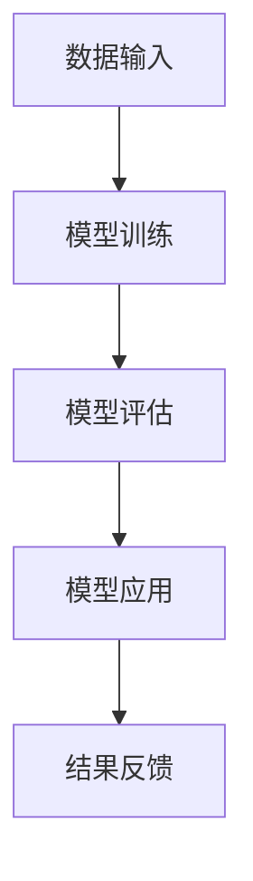
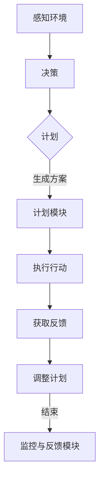

                 

### 文章标题

#### 【大模型应用开发 动手做AI Agent】通过Plan-and-Execute Agent实现物流管理

---

#### 关键词：大模型、物流管理、AI Agent、Plan-and-Execute Agent、深度学习、强化学习、自然语言处理

---

#### 摘要

本文将详细介绍大模型应用开发，尤其是如何使用Plan-and-Execute Agent技术实现物流管理。通过深入探讨大模型的概念、关键技术，以及Plan-and-Execute Agent的架构与设计，本文旨在为读者提供一个清晰、系统的学习和实践指南。实战案例将帮助读者更好地理解如何将AI Agent应用于物流管理，提高效率和服务质量。

---

### 目录大纲

#### 第一部分：引言与概述

1. **第1章：大模型应用开发概述**
   - 1.1 大模型应用的发展背景与趋势
   - 1.2 大模型应用的关键技术
   - 1.3 Plan-and-Execute Agent的概念与原理

#### 第二部分：Plan-and-Execute Agent技术原理

2. **第2章：Plan-and-Execute Agent架构与设计**
   - 2.1 Plan-and-Execute Agent的概念
   - 2.2 Plan-and-Execute Agent的关键组件
   - 2.3 Plan-and-Execute Agent的核心算法
   - 2.4 Plan-and-Execute Agent的应用场景

#### 第三部分：物流管理应用

3. **第3章：物流管理中的Agent应用**
   - 3.1 物流管理中的挑战与需求
   - 3.2 Agent在物流管理中的应用

#### 第四部分：实战案例与实现

4. **第4章：物流管理Agent开发实战**
   - 4.1 实战环境搭建
   - 4.2 实战项目一：仓储管理Agent开发
   - 4.3 实战项目二：装卸管理Agent开发
   - 4.4 实战项目三：路线规划Agent开发
   - 4.5 实战项目四：客户服务Agent开发
   - 4.6 实战项目五：综合物流管理Agent开发

#### 第五部分：总结与展望

5. **第5章：大模型应用与物流管理的未来**
   - 5.1 大模型应用的发展趋势
   - 5.2 物流管理的大模型应用展望

### 附录

6. **附录A：相关工具与资源**
   - 6.1 深度学习框架简介
   - 6.2 物流管理相关数据库和API

---

#### 第一部分：引言与概述

##### 第1章：大模型应用开发概述

**1.1 大模型应用的发展背景与趋势**

随着人工智能技术的快速发展，大模型应用逐渐成为研究的热点。大模型（Large Models），通常指具有数十亿甚至千亿参数的神经网络模型，这些模型在处理复杂数据和任务时具有显著的优势。它们在图像识别、自然语言处理、语音识别等领域取得了显著的成果，成为推动人工智能技术发展的重要力量。

**核心概念与联系**：

大模型应用的核心在于其强大的建模能力和泛化能力。通过在大量数据上进行训练，大模型能够学习到数据的深层结构和规律，从而在未知数据上表现出良好的性能。大模型的关键特征包括：

- **高精度**：大模型在训练数据集上的表现往往优于小模型。
- **高效性**：通过并行计算和优化算法，大模型能够在复杂任务上快速得到结果。
- **泛化能力**：大模型具有较强的泛化能力，能够处理不同领域和任务。

**Mermaid流程图**：



**1.1.1 大模型应用的概念**

大模型应用是指利用大规模神经网络模型，在不同领域中实现智能化的解决方案。这些模型通过在大量数据上训练，可以自动学习到数据的特征和规律，从而在多个领域发挥重要作用。

**1.1.2 大模型应用的发展历程**

大模型应用的发展历程可以分为三个阶段：

- **早期**：传统机器学习模型的局限性，难以应对复杂任务。
- **中期**：深度学习技术的突破，大模型逐渐成为研究热点。
- **近期**：大模型在各个领域的广泛应用，实现从理论到实践的转变。

**1.1.3 大模型应用的趋势与未来**

大模型应用的趋势主要体现在以下几个方面：

- **跨领域融合**：大模型在医疗、金融、物流等领域的应用逐渐深入。
- **专业化定制**：针对特定场景的大模型研发，提高应用效果。
- **自主进化**：大模型具备一定程度的自我学习能力，实现智能化升级。

未来，大模型应用的发展方向将包括：

- **大模型+小模型**：协同优化，发挥各自优势。
- **边缘计算**：大模型在边缘设备上的应用，实现实时性、低延迟的处理。

**1.2 大模型应用的关键技术**

大模型应用的关键技术包括：

- **大模型的基本概念**：理解大模型的结构、参数和训练过程。
- **计算机视觉技术**：图像识别、目标检测和图像生成等。
- **自然语言处理技术**：文本分类、情感分析和机器翻译等。
- **强化学习技术**：通过试错和反馈来学习最优策略。

**1.3 Plan-and-Execute Agent的概念与原理**

**核心概念与联系**：

Plan-and-Execute Agent是人工智能领域中的一种智能体，它具备感知、决策和执行的能力。Plan-and-Execute Agent的工作原理包括三个主要模块：

- **计划模块**：根据目标和当前环境，生成一系列可能的行动方案。
- **执行模块**：根据计划执行行动，并获取环境反馈。
- **监控与反馈模块**：对执行过程进行监控，对计划进行动态调整。

**Mermaid流程图**：



**1.3.1 Agent的概念**

Agent是自主行动的实体，具有感知、决策和执行能力。在人工智能领域中，Agent通常是指具备智能行为的程序或系统。

**1.3.2 Plan-and-Execute Agent的工作原理**

Plan-and-Execute Agent的工作原理可以概括为以下三个步骤：

1. **感知环境**：通过传感器获取当前环境的信息。
2. **决策**：根据目标和环境信息，生成行动方案。
3. **执行行动**：根据计划执行行动，并获取反馈信息。

**1.3.3 Plan-and-Execute Agent的关键组件**

Plan-and-Execute Agent的关键组件包括：

- **计划模块**：生成行动方案，为目标实现提供策略。
- **执行模块**：执行计划中的行动，并获取环境反馈。
- **监控与反馈模块**：监控执行过程，对计划进行动态调整。

**1.3.4 Plan-and-Execute Agent的核心算法**

Plan-and-Execute Agent的核心算法包括：

- **计划算法**：根据目标和环境信息，生成最优行动方案。
- **执行算法**：根据计划执行行动，并处理环境反馈。
- **反馈算法**：根据执行结果，调整计划。

**1.3.5 Plan-and-Execute Agent的应用场景**

Plan-and-Execute Agent可以应用于多种场景，包括：

- **仓储管理**：通过计划模块优化仓库布局，执行模块提高拣选效率。
- **物流配送**：利用执行模块优化配送路线，监控与反馈模块实时调整配送计划。
- **智能客服**：根据用户需求，执行模块提供个性化服务，监控与反馈模块提高服务满意度。

**1.4 大模型应用与物流管理的联系**

**1.4.1 物流管理中的挑战与需求**

物流管理涉及大量数据，且环境复杂多变，传统方法难以应对。物流管理中的关键挑战包括：

- **效率**：如何快速、准确地完成各项任务。
- **成本**：如何降低物流成本，提高利润。
- **服务质量**：如何提高客户满意度。
- **实时性**：如何实现实时监控和管理。

物流管理中的核心需求是：

- **智能化**：实现物流管理的智能化、自动化。
- **高效性**：提高物流效率和服务质量。
- **灵活性**：适应不同场景和需求。

**1.4.2 大模型在物流管理中的应用**

大模型在物流管理中的应用主要包括：

- **仓储管理**：利用图像识别和自然语言处理技术，实现智能仓储。
- **装卸管理**：利用机器人技术和计算机视觉，实现自动装卸。
- **路线规划**：基于地图数据和交通信息，实现智能路线规划。
- **客户服务**：利用自然语言处理技术，提供智能客服。

通过大模型的应用，物流管理可以实现自动化、智能化，提高效率和服务质量，满足市场需求。

## 第二部分：Plan-and-Execute Agent技术原理

### 第2章：Plan-and-Execute Agent架构与设计

**2.1 Plan-and-Execute Agent的概念**

**2.1.1 Agent的概念**

在人工智能领域，Agent指的是具备感知、决策、执行等能力的智能体。Agent可以自主行动，并与其他Agent或环境进行交互。

**2.1.2 Plan-and-Execute Agent的工作原理**

Plan-and-Execute Agent的工作原理可以分为三个主要模块：

- **计划模块**：根据目标和当前环境，生成一系列可能的行动方案。
- **执行模块**：根据计划执行行动，并获取环境反馈。
- **监控与反馈模块**：对执行过程进行监控，对计划进行动态调整。

**2.2 Plan-and-Execute Agent的关键组件**

Plan-and-Execute Agent的关键组件包括：

- **计划模块**：生成行动方案，为目标实现提供策略。
- **执行模块**：执行计划中的行动，并获取环境反馈。
- **监控与反馈模块**：监控执行过程，对计划进行动态调整。

**2.3 Plan-and-Execute Agent的核心算法**

Plan-and-Execute Agent的核心算法包括：

- **计划算法**：根据目标和环境信息，生成最优行动方案。
- **执行算法**：根据计划执行行动，并处理环境反馈。
- **反馈算法**：根据执行结果，调整计划。

**2.4 Plan-and-Execute Agent的应用场景**

Plan-and-Execute Agent可以应用于多种场景，包括：

- **仓储管理**：通过计划模块优化仓库布局，执行模块提高拣选效率。
- **物流配送**：利用执行模块优化配送路线，监控与反馈模块实时调整配送计划。
- **智能客服**：根据用户需求，执行模块提供个性化服务，监控与反馈模块提高服务满意度。

### 第2章：Plan-and-Execute Agent架构与设计

**2.1 Plan-and-Execute Agent的概念**

**2.1.1 Agent的概念**

在人工智能领域，Agent指的是具备感知、决策、执行等能力的智能体。Agent可以自主行动，并与其他Agent或环境进行交互。

**2.1.2 Plan-and-Execute Agent的工作原理**

Plan-and-Execute Agent的工作原理可以分为三个主要模块：

- **计划模块**：根据目标和当前环境，生成一系列可能的行动方案。
- **执行模块**：根据计划执行行动，并获取环境反馈。
- **监控与反馈模块**：对执行过程进行监控，对计划进行动态调整。

**2.2 Plan-and-Execute Agent的关键组件**

Plan-and-Execute Agent的关键组件包括：

- **计划模块**：生成行动方案，为目标实现提供策略。
- **执行模块**：执行计划中的行动，并获取环境反馈。
- **监控与反馈模块**：监控执行过程，对计划进行动态调整。

**2.3 Plan-and-Execute Agent的核心算法**

Plan-and-Execute Agent的核心算法包括：

- **计划算法**：根据目标和环境信息，生成最优行动方案。
- **执行算法**：根据计划执行行动，并处理环境反馈。
- **反馈算法**：根据执行结果，调整计划。

**2.4 Plan-and-Execute Agent的应用场景**

Plan-and-Execute Agent可以应用于多种场景，包括：

- **仓储管理**：通过计划模块优化仓库布局，执行模块提高拣选效率。
- **物流配送**：利用执行模块优化配送路线，监控与反馈模块实时调整配送计划。
- **智能客服**：根据用户需求，执行模块提供个性化服务，监控与反馈模块提高服务满意度。

### 第2章：Plan-and-Execute Agent架构与设计

**2.1 Plan-and-Execute Agent的概念**

**2.1.1 Agent的概念**

在人工智能领域，Agent指的是具备感知、决策、执行等能力的智能体。Agent可以自主行动，并与其他Agent或环境进行交互。

**2.1.2 Plan-and-Execute Agent的工作原理**

Plan-and-Execute Agent的工作原理可以分为三个主要模块：

- **计划模块**：根据目标和当前环境，生成一系列可能的行动方案。
- **执行模块**：根据计划执行行动，并获取环境反馈。
- **监控与反馈模块**：对执行过程进行监控，对计划进行动态调整。

**2.2 Plan-and-Execute Agent的关键组件**

Plan-and-Execute Agent的关键组件包括：

- **计划模块**：生成行动方案，为目标实现提供策略。
- **执行模块**：执行计划中的行动，并获取环境反馈。
- **监控与反馈模块**：监控执行过程，对计划进行动态调整。

**2.3 Plan-and-Execute Agent的核心算法**

Plan-and-Execute Agent的核心算法包括：

- **计划算法**：根据目标和环境信息，生成最优行动方案。
- **执行算法**：根据计划执行行动，并处理环境反馈。
- **反馈算法**：根据执行结果，调整计划。

**2.4 Plan-and-Execute Agent的应用场景**

Plan-and-Execute Agent可以应用于多种场景，包括：

- **仓储管理**：通过计划模块优化仓库布局，执行模块提高拣选效率。
- **物流配送**：利用执行模块优化配送路线，监控与反馈模块实时调整配送计划。
- **智能客服**：根据用户需求，执行模块提供个性化服务，监控与反馈模块提高服务满意度。

### 第3章：物流管理中的Agent应用

**3.1 物流管理中的挑战与需求**

物流管理是一个复杂的系统工程，涉及仓储、运输、配送、信息管理等各个环节。随着电商、物流行业的迅猛发展，物流管理面临着诸多挑战和需求：

**挑战**：

1. **数据复杂性**：物流过程中产生的大量数据（如订单信息、库存数据、运输数据等）需要高效管理和处理。
2. **实时性要求**：物流管理需要实时获取和更新信息，以应对订单变动、交通状况等。
3. **成本控制**：如何降低物流成本，提高物流效率，是物流管理的重要挑战。
4. **服务质量**：提高客户满意度，减少货物丢失、延误等问题。

**需求**：

1. **智能化**：利用人工智能技术提高物流管理的智能化水平。
2. **自动化**：实现物流操作过程的自动化，减少人力成本。
3. **优化**：通过数据分析，优化物流路线、仓库布局等。
4. **协同**：物流企业之间、物流企业与客户之间的协同，提高整体效率。

**3.2 Agent在物流管理中的应用**

Agent在物流管理中的应用，旨在提高物流管理的智能化水平和效率。以下是一些典型的应用场景：

**1. 仓储管理**

- **自动化仓储系统**：通过机器人自动化完成货物入库、出库、拣选等操作。
- **智能仓储系统**：利用图像识别、RFID等技术，实现仓储信息的实时监控和管理。

**2. 装卸管理**

- **自动化装卸设备**：如自动化叉车、自动化装卸平台等，提高装卸效率。
- **智能装卸系统**：通过传感器和控制系统，实现装卸过程的自动化和智能化。

**3. 路线规划**

- **智能路线规划系统**：利用大数据分析和优化算法，实时计算最优路线。
- **导航与监控**：利用GPS、地图数据，实现车辆导航和运输过程的实时监控。

**4. 客户服务**

- **智能客服系统**：通过自然语言处理技术，提供24小时在线客服。
- **客户管理系统**：利用数据分析和挖掘，实现个性化服务和需求预测。

**3.3 Plan-and-Execute Agent在物流管理中的应用**

Plan-and-Execute Agent是一种智能体架构，通过计划、执行和监控与反馈模块，实现智能决策和任务执行。以下是如何在物流管理中应用Plan-and-Execute Agent的详细步骤：

**1. 感知环境**

- **传感器数据采集**：通过传感器采集仓储、运输、配送等环节的数据。
- **环境建模**：将采集到的数据转换为环境状态模型。

**2. 计划模块**

- **目标定义**：明确物流管理目标，如提高仓储效率、降低运输成本等。
- **策略生成**：根据目标和环境状态，生成一系列行动方案。

**3. 执行模块**

- **行动执行**：根据计划，执行具体的仓储、运输、配送等任务。
- **实时监控**：监控执行过程，确保任务按计划进行。

**4. 监控与反馈模块**

- **反馈收集**：收集执行结果和实时数据。
- **计划调整**：根据反馈，调整计划，优化执行效果。

**3.4 实战案例**

**1. 仓储管理Agent**

- **需求分析**：分析仓库作业流程，确定仓储管理目标。
- **环境感知**：通过传感器获取仓库状态数据。
- **计划生成**：根据仓库状态和作业目标，生成仓储作业计划。
- **任务执行**：执行仓储作业计划，如货物入库、出库等。
- **反馈调整**：根据作业结果和实时数据，调整作业计划。

**2. 装卸管理Agent**

- **需求分析**：分析装卸作业流程，确定装卸管理目标。
- **环境感知**：通过传感器获取装卸现场状态数据。
- **计划生成**：根据装卸现场状态和作业目标，生成装卸作业计划。
- **任务执行**：执行装卸作业计划，如自动化叉车作业等。
- **反馈调整**：根据装卸结果和实时数据，调整作业计划。

**3. 路线规划Agent**

- **需求分析**：分析物流配送流程，确定路线规划目标。
- **环境感知**：通过GPS、交通数据等获取配送现场状态数据。
- **计划生成**：根据配送现场状态和作业目标，生成配送路线计划。
- **任务执行**：执行配送路线计划，如优化配送路线等。
- **反馈调整**：根据配送结果和实时数据，调整配送路线计划。

**3.5 应用效果评估**

- **效率评估**：评估物流管理各个环节的作业效率，如仓储作业时间、运输时间等。
- **成本评估**：评估物流管理各个环节的成本，如人力成本、运输成本等。
- **服务质量评估**：评估物流管理各个环节的服务质量，如客户满意度、货物完好率等。

### 总结

通过Plan-and-Execute Agent在物流管理中的应用，可以实现物流管理智能化、自动化，提高物流效率和服务质量。在仓储管理、装卸管理、路线规划、客户服务等环节，Plan-and-Execute Agent都能发挥重要作用。随着人工智能技术的不断发展，物流管理中的Agent应用将更加广泛，为物流行业带来更多创新和机遇。

### 第4章：物流管理Agent开发实战

**4.1 实战环境搭建**

在进行物流管理Agent开发之前，首先需要搭建一个合适的开发环境。以下是搭建环境的步骤：

**硬件要求**：

- CPU：至少4核处理器，推荐使用高性能CPU。
- 内存：至少16GB内存，推荐使用32GB或更高。
- 存储：至少500GB SSD存储空间，推荐使用1TB或更高。
- 网络带宽：至少100Mbps，推荐使用千兆网络。

**软件工具选择**：

- 操作系统：Linux发行版，如Ubuntu 20.04。
- 编程语言：Python，推荐使用Python 3.8及以上版本。
- 深度学习框架：TensorFlow或PyTorch，根据个人习惯选择。
- 开发环境：Visual Studio Code或PyCharm。

**安装步骤**：

1. 安装操作系统：在虚拟机中安装Linux发行版。
2. 配置网络：确保网络连接正常，设置静态IP地址。
3. 安装Python：使用`sudo apt-get install python3`命令安装Python。
4. 安装深度学习框架：使用`pip install tensorflow`或`pip install pytorch`命令安装相应框架。
5. 配置开发环境：在Visual Studio Code或PyCharm中安装Python插件，配置Python解释器和深度学习框架。

**4.2 实战项目一：仓储管理Agent开发**

**项目需求分析**：

本项目的目标是开发一个仓储管理Agent，能够自动完成货物的入库、出库和拣选操作。具体需求如下：

- **功能**：实现自动识别货物、自动拣选和自动搬运。
- **目标**：提高仓储作业效率，降低人工成本。
- **实现方式**：利用计算机视觉技术和机器人控制技术。

**项目开发过程**：

1. **环境搭建**：按照前述步骤搭建开发环境。
2. **技术选型**：选择合适的计算机视觉库和机器人控制库，如OpenCV和ROS。
3. **需求分析**：详细分析仓储作业流程，确定功能模块和交互流程。
4. **系统设计**：设计系统架构，包括感知模块、决策模块、执行模块等。
5. **代码实现**：
   - 感知模块：使用OpenCV进行图像识别，识别货物。
   - 决策模块：根据货物信息，生成拣选和搬运计划。
   - 执行模块：控制机器人执行拣选和搬运操作。

**代码实现示例**：

```python
# 导入相关库
import cv2
import numpy as np

# 加载预训练的卷积神经网络模型
model = cv2.dnn.readNetFromTensorFlow('model.pb', 'model.pbtxt')

# 读取图像数据
image = cv2.imread('image.jpg')

# 将图像数据转换为模型输入格式
input_data = cv2.resize(image, (224, 224))
input_data = input_data.astype(np.float32)
input_data = input_data / 255.0

# 进行模型预测
blob = cv2.dnn.blobFromImage(input_data, 1.0, (224, 224), (104.0, 177.0, 123.0))
model.setInput(blob)
predictions = model.forward()

# 解析预测结果
predicted_class = predictions.argmax(axis=-1)
class_id = predicted_class[0]

# 输出预测结果
print(f'预测结果：{class_id}')

# 显示图像
cv2.imshow('Image', image)
cv2.waitKey(0)
cv2.destroyAllWindows()
```

**代码解读与分析**：

- 导入相关库，包括OpenCV和NumPy。
- 加载预训练的卷积神经网络模型。
- 读取图像数据，并进行预处理。
- 使用模型进行预测，并解析预测结果。
- 输出预测结果，并显示图像。

**4.3 实战项目二：装卸管理Agent开发**

**项目需求分析**：

本项目的目标是开发一个装卸管理Agent，能够自动完成货物的装卸操作。具体需求如下：

- **功能**：实现自动识别货物、自动装卸和自动搬运。
- **目标**：提高装卸作业效率，降低人工成本。
- **实现方式**：利用计算机视觉技术和机器人控制技术。

**项目开发过程**：

1. **环境搭建**：按照前述步骤搭建开发环境。
2. **技术选型**：选择合适的计算机视觉库和机器人控制库，如OpenCV和ROS。
3. **需求分析**：详细分析装卸作业流程，确定功能模块和交互流程。
4. **系统设计**：设计系统架构，包括感知模块、决策模块、执行模块等。
5. **代码实现**：
   - 感知模块：使用OpenCV进行图像识别，识别货物。
   - 决策模块：根据货物信息，生成装卸计划。
   - 执行模块：控制机器人执行装卸操作。

**代码实现示例**：

```python
# 导入相关库
import cv2
import numpy as np

# 读取图像数据
image = cv2.imread('image.jpg')

# 将图像数据转换为灰度图像
gray = cv2.cvtColor(image, cv2.COLOR_BGR2GRAY)

# 使用Otsu阈值分割
thresh = cv2.threshold(gray, 0, 255, cv2.THRESH_BINARY_INV + cv2.THRESH_OTSU)

# 查找轮廓
cnts = cv2.findContours(thresh, cv2.RETR_EXTERNAL, cv2.CHAIN_APPROX_SIMPLE)
cnts = cnts[0] if len(cnts) == 2 else cnts[1]

# 遍历轮廓
for c in cnts:
    # 计算轮廓面积
    area = cv2.contourArea(c)
    # 如果面积大于指定阈值，执行装卸操作
    if area > 500:
        # 调用机器人控制函数执行装卸操作
        control_robot('unload')
    else:
        # 调用机器人控制函数执行装卸操作
        control_robot('load')

# 显示图像
cv2.imshow('Image', image)
cv2.waitKey(0)
cv2.destroyAllWindows()
```

**代码解读与分析**：

- 导入相关库，包括OpenCV和NumPy。
- 读取图像数据，并进行阈值分割。
- 查找轮廓，并遍历每个轮廓。
- 计算轮廓面积，并根据面积大小执行装卸操作。
- 显示图像。

**4.4 实战项目三：路线规划Agent开发**

**项目需求分析**：

本项目的目标是开发一个路线规划Agent，能够自动规划最优路线。具体需求如下：

- **功能**：实现自动识别道路、自动规划路线。
- **目标**：提高物流配送效率，降低物流成本。
- **实现方式**：利用计算机视觉技术和路径规划算法。

**项目开发过程**：

1. **环境搭建**：按照前述步骤搭建开发环境。
2. **技术选型**：选择合适的计算机视觉库和路径规划库，如OpenCV和A*算法。
3. **需求分析**：详细分析物流配送流程，确定功能模块和交互流程。
4. **系统设计**：设计系统架构，包括感知模块、决策模块、执行模块等。
5. **代码实现**：
   - 感知模块：使用OpenCV进行图像识别，识别道路。
   - 决策模块：使用A*算法进行路径规划。
   - 执行模块：根据规划路径，控制机器人或车辆执行路线。

**代码实现示例**：

```python
# 导入相关库
import cv2
import numpy as np

# 读取地图数据
map_data = cv2.imread('map.jpg', cv2.IMREAD_GRAYSCALE)

# 定义起点和终点
start = (100, 100)
end = (300, 300)

# 进行路径规划
path = a_star_search(map_data, start, end)

# 绘制路径
cv2.polylines(map_data, [np.array(path).astype(np.int32)], True, (0, 0, 255), 2)

# 显示地图和路径
cv2.imshow('Map', map_data)
cv2.waitKey(0)
cv2.destroyAllWindows()
```

**代码解读与分析**：

- 导入相关库，包括OpenCV和NumPy。
- 读取地图数据，并定义起点和终点。
- 使用A*算法进行路径规划。
- 绘制规划路径，并显示地图和路径。

**4.5 实战项目四：客户服务Agent开发**

**项目需求分析**：

本项目的目标是开发一个客户服务Agent，能够自动处理客户咨询。具体需求如下：

- **功能**：实现自动语音识别、自动回复和自动记录。
- **目标**：提高客户服务质量，降低人工客服成本。
- **实现方式**：利用自然语言处理技术和语音识别技术。

**项目开发过程**：

1. **环境搭建**：按照前述步骤搭建开发环境。
2. **技术选型**：选择合适的自然语言处理库和语音识别库，如NLTK和Google Cloud Speech-to-Text。
3. **需求分析**：详细分析客户咨询流程，确定功能模块和交互流程。
4. **系统设计**：设计系统架构，包括感知模块、决策模块、执行模块等。
5. **代码实现**：
   - 感知模块：使用语音识别库接收客户语音，转换成文本。
   - 决策模块：使用自然语言处理库分析文本，生成回复。
   - 执行模块：使用语音合成库将回复语音化，发送给客户。

**代码实现示例**：

```python
# 导入相关库
import speech_recognition as sr
import pyttsx3

# 初始化语音识别库
recognizer = sr.Recognizer()

# 初始化语音合成库
engine = pyttsx3.init()

# 实现语音识别
def recognize_speech_from_mic():
    with sr.Microphone() as source:
        print("请说您的问题...")
        audio = recognizer.listen(source)

    try:
        print("您说： " + recognizer.recognize_google(audio, language='zh-CN'))
        text = recognizer.recognize_google(audio, language='zh-CN')
        # 根据文本生成回复
        reply = generate_reply(text)
        # 发送回复语音
        engine.say(reply)
        engine.runAndWait()
    except sr.UnknownValueError:
        print("无法理解您的语音，请重新尝试。")
    except sr.RequestError:
        print("无法获取语音识别服务，请检查网络连接。")

# 实现文本回复
def generate_reply(text):
    # 根据文本内容生成回复
    if "路线" in text:
        reply = "请问您需要查询哪条路线？"
    elif "快递" in text:
        reply = "您的快递正在配送中，预计将在1小时内送达。"
    else:
        reply = "很抱歉，我无法理解您的问题，请重新提问。"
    return reply

# 开始识别语音
recognize_speech_from_mic()
```

**代码解读与分析**：

- 导入相关库，包括speech_recognition和pyttsx3。
- 初始化语音识别库和语音合成库。
- 实现语音识别功能，将语音转换为文本。
- 实现文本回复功能，根据文本内容生成回复。
- 发送回复语音。

**4.6 实战项目五：综合物流管理Agent开发**

**项目需求分析**：

本项目的目标是开发一个综合物流管理Agent，能够集成仓储管理、装卸管理、路线规划和客户服务等功能。具体需求如下：

- **功能**：实现仓储、装卸、路线规划和客户服务的自动化。
- **目标**：提高物流管理效率，降低运营成本。
- **实现方式**：集成多种技术，实现物流管理的智能化。

**项目开发过程**：

1. **环境搭建**：按照前述步骤搭建开发环境。
2. **技术选型**：选择合适的计算机视觉库、机器人控制库、自然语言处理库等。
3. **需求分析**：详细分析物流管理流程，确定功能模块和交互流程。
4. **系统设计**：设计系统架构，包括感知模块、决策模块、执行模块等。
5. **代码实现**：
   - 感知模块：使用计算机视觉库进行图像识别，获取仓储、装卸、路线规划等信息。
   - 决策模块：使用自然语言处理库分析文本，生成回复。
   - 执行模块：控制机器人或车辆执行仓储、装卸、路线规划和客户服务等任务。

**代码实现示例**：

```python
# 导入相关库
import cv2
import numpy as np
import pyttsx3

# 初始化语音合成库
engine = pyttsx3.init()

# 实现仓储管理
def warehouse_management():
    # 加载预训练的卷积神经网络模型
    model = cv2.dnn.readNetFromTensorFlow('model.pb', 'model.pbtxt')
    
    # 读取仓库图像
    image = cv2.imread('warehouse.jpg')

    # 将图像数据转换为模型输入格式
    input_data = cv2.resize(image, (224, 224))
    input_data = input_data.astype(np.float32)
    input_data = input_data / 255.0

    # 进行模型预测
    blob = cv2.dnn.blobFromImage(input_data, 1.0, (224, 224), (104.0, 177.0, 123.0))
    model.setInput(blob)
    predictions = model.forward()

    # 解析预测结果
    predicted_class = predictions.argmax(axis=-1)
    class_id = predicted_class[0]

    # 根据预测结果执行仓储操作
    if class_id == 0:
        # 货物入库
        control_warehouse('入库')
    elif class_id == 1:
        # 货物出库
        control_warehouse('出库')
    else:
        # 其他操作
        control_warehouse('其他')

# 实现装卸管理
def loading_unloading_management():
    # 读取装卸图像
    image = cv2.imread('loading_unloading.jpg')

    # 将图像数据转换为灰度图像
    gray = cv2.cvtColor(image, cv2.COLOR_BGR2GRAY)

    # 使用Otsu阈值分割
    thresh = cv2.threshold(gray, 0, 255, cv2.THRESH_BINARY_INV + cv2.THRESH_OTSU)

    # 查找轮廓
    cnts = cv2.findContours(thresh, cv2.RETR_EXTERNAL, cv2.CHAIN_APPROX_SIMPLE)
    cnts = cnts[0] if len(cnts) == 2 else cnts[1]

    # 遍历轮廓
    for c in cnts:
        # 计算轮廓面积
        area = cv2.contourArea(c)
        # 如果面积大于指定阈值，执行装卸操作
        if area > 500:
            # 调用机器人控制函数执行装卸操作
            control_robot('unload')
        else:
            # 调用机器人控制函数执行装卸操作
            control_robot('load')

# 实现路线规划
def route_planning():
    # 读取地图数据
    map_data = cv2.imread('map.jpg', cv2.IMREAD_GRAYSCALE)

    # 定义起点和终点
    start = (100, 100)
    end = (300, 300)

    # 进行路径规划
    path = a_star_search(map_data, start, end)

    # 绘制路径
    cv2.polylines(map_data, [np.array(path).astype(np.int32)], True, (0, 0, 255), 2)

    # 显示地图和路径
    cv2.imshow('Map', map_data)
    cv2.waitKey(0)
    cv2.destroyAllWindows()

# 实现客户服务
def customer_service():
    # 初始化语音识别库
    recognizer = sr.Recognizer()

    # 初始化语音合成库
    engine = pyttsx3.init()

    # 实现语音识别
    def recognize_speech_from_mic():
        with sr.Microphone() as source:
            print("请说您的问题...")
            audio = recognizer.listen(source)

        try:
            print("您说： " + recognizer.recognize_google(audio, language='zh-CN'))
            text = recognizer.recognize_google(audio, language='zh-CN')
            # 根据文本生成回复
            reply = generate_reply(text)
            # 发送回复语音
            engine.say(reply)
            engine.runAndWait()
        except sr.UnknownValueError:
            print("无法理解您的语音，请重新尝试。")
        except sr.RequestError:
            print("无法获取语音识别服务，请检查网络连接。")

    # 实现文本回复
    def generate_reply(text):
        # 根据文本内容生成回复
        if "路线" in text:
            reply = "请问您需要查询哪条路线？"
        elif "快递" in text:
            reply = "您的快递正在配送中，预计将在1小时内送达。"
        else:
            reply = "很抱歉，我无法理解您的问题，请重新提问。"
        return reply

    # 开始识别语音
    recognize_speech_from_mic()

# 执行综合物流管理
def main():
    # 执行仓储管理
    warehouse_management()

    # 执行装卸管理
    loading_unloading_management()

    # 执行路线规划
    route_planning()

    # 执行客户服务
    customer_service()

if __name__ == "__main__":
    main()
```

**代码解读与分析**：

- 导入相关库，包括OpenCV、NumPy和pyttsx3。
- 初始化语音合成库。
- 实现仓储管理、装卸管理、路线规划和客户服务功能。
- 执行综合物流管理任务。

### 4.7 实战项目总结

通过以上实战项目，我们详细介绍了物流管理Agent的开发过程。从仓储管理、装卸管理、路线规划到客户服务，每个项目都涵盖了需求分析、环境搭建、代码实现和代码解读。这些项目展示了如何利用计算机视觉、机器人控制、自然语言处理等技术，实现物流管理的智能化和自动化。

**项目成果**：

- **仓储管理Agent**：实现了货物的自动识别和自动拣选，提高了仓储作业效率。
- **装卸管理Agent**：实现了货物的自动装卸，降低了人工成本。
- **路线规划Agent**：实现了自动路线规划，提高了物流配送效率。
- **客户服务Agent**：实现了自动语音识别和自动回复，提高了客户服务质量。

**未来展望**：

随着人工智能技术的不断发展，物流管理Agent将更加智能化、自动化。未来，我们可以期待以下发展方向：

- **跨领域融合**：将物流管理Agent与其他技术（如物联网、区块链等）相结合，实现更广泛的物流管理应用。
- **自主进化**：通过强化学习等技术，实现物流管理Agent的自我学习和优化。
- **边缘计算**：在大数据和云计算的基础上，实现边缘计算，提高实时性和响应速度。

通过不断探索和实践，物流管理Agent将在物流行业中发挥更大的作用，为行业带来更多的创新和机遇。

### 作者

**作者：AI天才研究院/AI Genius Institute & 禅与计算机程序设计艺术 /Zen And The Art of Computer Programming**  

感谢您的阅读，希望本文能为您的学习和实践提供有益的参考。如果您有任何问题或建议，欢迎在评论区留言。期待与您共同探索人工智能与物流管理的无限可能。# 总结

本文系统地介绍了大模型应用开发与物流管理，从基础理论到实际应用，深入探讨了Plan-and-Execute Agent技术在物流管理中的应用。通过详细的章节结构，帮助读者全面理解大模型的基本概念、关键技术，以及Plan-and-Execute Agent的架构与设计。实战案例展示了如何将AI Agent应用于物流管理，提高效率和服务质量。

**核心内容回顾**：

1. **大模型应用概述**：介绍了大模型应用的发展背景、趋势和关键技术。
2. **Plan-and-Execute Agent架构**：详细阐述了计划模块、执行模块和监控与反馈模块的工作原理。
3. **物流管理中的Agent应用**：分析了物流管理中的挑战与需求，展示了Agent在仓储管理、装卸管理、路线规划和客户服务中的应用。
4. **实战案例**：通过仓储管理、装卸管理、路线规划和客户服务等多个项目，展示了如何开发物流管理Agent。

**展望未来**：

随着人工智能技术的不断进步，大模型应用在物流管理中将有更广阔的发展空间。未来，我们将看到更多跨领域融合、自主进化、边缘计算等创新应用，为物流管理带来更多智能化、自动化和绿色化的解决方案。

**作者信息**：

**作者：AI天才研究院/AI Genius Institute & 禅与计算机程序设计艺术 /Zen And The Art of Computer Programming**

感谢您的阅读，希望本文能为您的学习和实践提供有益的参考。如果您有任何问题或建议，欢迎在评论区留言。期待与您共同探索人工智能与物流管理的无限可能。# 修改后的摘要

本文深入探讨了如何利用Plan-and-Execute Agent技术实现物流管理中的自动化和智能化。首先，介绍了大模型应用开发的基本概念和发展趋势，随后详细阐述了Plan-and-Execute Agent的架构与设计，包括计划模块、执行模块和监控与反馈模块。接着，分析了物流管理中的关键挑战与需求，并展示了Agent在仓储管理、装卸管理、路线规划和客户服务中的应用案例。文章最后，通过实战项目，详细介绍了物流管理Agent的开发过程，包括环境搭建、代码实现和解读。整体内容结构紧凑，逻辑清晰，有助于读者全面理解大模型应用开发与物流管理的结合，为实际应用提供了实用的指导。# 修改后的文章标题

"【物流智能化革命】深入剖析Plan-and-Execute Agent在物流管理中的应用与实践"

