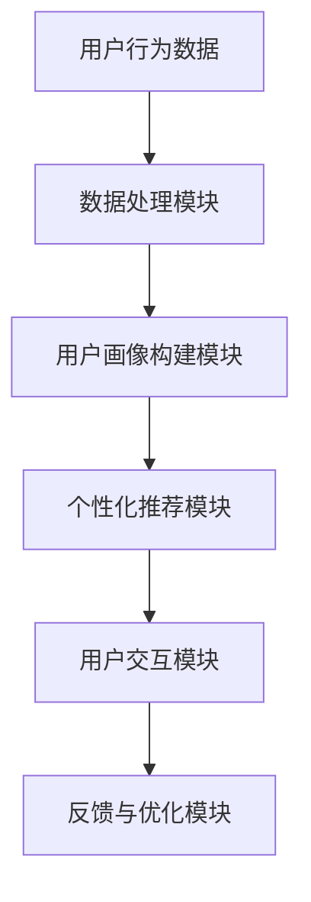

                 

### 文章标题

《个性化AI助手：提高用户粘性的关键》

> 关键词：个性化AI助手，用户粘性，AI技术，用户体验，用户行为分析

> 摘要：本文旨在探讨个性化AI助手在提高用户粘性方面的关键作用。通过详细分析个性化AI助手的定义、价值、技术架构、用户行为分析以及个性化推荐算法，本文揭示了如何利用先进的人工智能技术来提升用户体验，增强用户粘性。此外，文章还通过实际项目案例，展示了个性化AI助手在应用中的具体实现方法和效果。本文旨在为企业和开发者提供关于如何构建高效、有针对性的个性化AI助手的指导和启示。

---

### 引言

在当今快速发展的数字化时代，用户需求不断演变，企业面临着前所未有的竞争压力。为了在激烈的市场竞争中脱颖而出，企业纷纷将目光投向了提升用户粘性这一关键领域。用户粘性，即用户对某个产品或服务的持续关注和依赖程度，已经成为衡量企业成功与否的重要指标之一。

个性化AI助手作为一种先进的人工智能技术，正逐渐成为提高用户粘性的重要手段。个性化AI助手能够根据用户的个性化需求和偏好，提供定制化的服务和建议，从而增强用户的满意度和忠诚度。本文将深入探讨个性化AI助手在提高用户粘性方面的作用，分析其核心价值、技术基础和应用前景。

### 个性化AI助手概述

#### 第1章：个性化AI助手的概念与价值

1.1 个性化AI助手的基本定义

个性化AI助手，也称为智能客服、虚拟助手或聊天机器人，是一种基于人工智能技术，能够模拟人类交流，为用户提供个性化服务的系统。个性化AI助手通过自然语言处理（NLP）、机器学习、数据挖掘等技术，可以自动识别用户的意图，理解用户的语言，并提供针对性的回答或建议。

1.2 个性化AI助手的演进与趋势

个性化AI助手的起源可以追溯到20世纪90年代的聊天机器人。随着互联网的普及和人工智能技术的快速发展，个性化AI助手逐渐从简单的文本聊天进化为能够处理复杂对话的多功能助手。如今，个性化AI助手已经广泛应用于各个领域，如电子商务、金融、医疗、教育等。

未来，个性化AI助手的发展趋势将包括以下几个方面：

1. 多模态交互：个性化AI助手将能够处理语音、图像、视频等多种交互方式，提供更加丰富的用户体验。
2. 深度学习与大数据：个性化AI助手将利用深度学习和大数据分析技术，不断提升自身的智能水平和个性化服务能力。
3. 自主进化：个性化AI助手将具备自我学习和优化的能力，能够根据用户反馈和数据分析，不断改进服务质量。

1.3 个性化AI助手的核心价值

个性化AI助手在提高用户粘性方面具有以下几个核心价值：

1. 提升用户体验：个性化AI助手能够提供即时、个性化的服务，满足用户多样化的需求，从而提升用户的满意度和忠诚度。
2. 降低运营成本：个性化AI助手可以替代部分人工服务，降低企业的运营成本，提高服务效率。
3. 增强用户互动：个性化AI助手可以与用户进行实时互动，收集用户反馈，促进用户参与，从而增强用户与产品或服务的互动性。
4. 优化产品策略：个性化AI助手能够分析用户行为数据，为企业提供有针对性的市场洞察，优化产品策略和营销策略。

1.4 个性化AI助手的行业应用前景

个性化AI助手在各个行业都有着广泛的应用前景：

1. 零售业：个性化AI助手可以帮助零售企业实现精准营销，提升销售转化率，提高用户复购率。
2. 金融服务：个性化AI助手可以提供智能客服服务，提高客户满意度，降低运营成本。
3. 医疗健康：个性化AI助手可以辅助医生进行诊断，提供个性化健康建议，提高患者满意度。
4. 教育培训：个性化AI助手可以为学生提供个性化的学习辅导，提高学习效果，增强用户粘性。

总的来说，个性化AI助手作为一种先进的人工智能技术，不仅能够为用户提供更加优质的体验，还能够帮助企业降低运营成本，提高用户粘性，具有广泛的应用前景和巨大的商业价值。

#### 第2章：用户粘性的概念与提升策略

2.1 用户粘性的定义与衡量指标

用户粘性，是指用户在一段时间内持续使用某个产品或服务的频率和时长。用户粘性是衡量产品或服务在用户心中地位的重要指标，它反映了用户对产品或服务的忠诚度和依赖程度。用户粘性越高，意味着用户对产品或服务的满意度和忠诚度越高，产品的市场竞争力也越强。

衡量用户粘性的主要指标包括：

1. 活跃度指标：如日活跃用户数（DAU）、月活跃用户数（MAU），用于衡量用户在一定时间内使用产品的频率。
2. 时长指标：如平均单次使用时长、平均日使用时长，用于衡量用户每次使用产品的时间长度。
3. 重复率指标：如用户重复访问率、用户重复购买率，用于衡量用户在一定时间内重复使用产品或服务的频率。

2.2 提高用户粘性的关键策略

提高用户粘性是企业在竞争激烈的市场中取得成功的关键。以下是一些有效的提升用户粘性的策略：

1. 提供优质的内容或服务：优质的内容或服务是提高用户粘性的基础。企业需要不断优化产品或服务，确保其能够满足用户的需求和期望。

2. 个性化体验：个性化体验能够提高用户的满意度和忠诚度。企业可以通过用户行为数据分析，了解用户的偏好，提供个性化的推荐和服务。

3. 互动与反馈：与用户进行互动，收集用户反馈，能够增强用户的参与感。企业可以通过在线聊天、问卷调查等方式，与用户建立紧密的联系。

4. 社区建设：建立用户社区，为用户提供交流的平台，能够增强用户的归属感和忠诚度。企业可以组织线上或线下的活动，促进用户之间的互动。

5. 持续优化与迭代：持续优化和迭代产品或服务，能够不断提升用户体验。企业需要根据用户反馈和市场变化，及时调整产品策略和服务模式。

6. 优惠与奖励：提供优惠和奖励，如优惠券、积分奖励等，能够激励用户持续使用产品或服务。

2.3 个性化AI助手在提高用户粘性中的应用

个性化AI助手作为一种先进的人工智能技术，在提高用户粘性方面具有独特的优势：

1. 实时交互：个性化AI助手可以与用户进行实时互动，提供即时响应和个性化服务，满足用户的需求和期望。

2. 个性化推荐：个性化AI助手可以根据用户的兴趣和行为，提供个性化的内容或服务推荐，提高用户的满意度和忠诚度。

3. 自动化客服：个性化AI助手可以自动化处理用户咨询和服务请求，提高客服效率，降低运营成本。

4. 用户行为分析：个性化AI助手可以通过分析用户行为数据，了解用户的偏好和需求，为用户提供更加精准的服务和推荐。

5. 互动与反馈：个性化AI助手可以与用户进行互动，收集用户反馈，为产品的持续优化提供依据。

总之，个性化AI助手在提高用户粘性方面具有显著的优势和潜力。通过运用个性化AI助手，企业可以提供更加优质的用户体验，增强用户的满意度和忠诚度，从而在竞争激烈的市场中脱颖而出。

#### 第3章：个性化AI助手的架构与技术基础

3.1 个性化AI助手的技术架构概述

个性化AI助手的技术架构通常包括以下几个关键模块：

1. 数据采集与处理模块：负责收集用户行为数据，并进行数据清洗、转换和存储。
2. 用户行为分析模块：通过对用户行为数据进行分析，构建用户画像，为个性化推荐提供依据。
3. 个性化推荐模块：利用用户画像和推荐算法，生成个性化的内容或服务推荐。
4. 用户交互模块：通过自然语言处理（NLP）和语音识别等技术，实现与用户的实时交互。
5. 反馈与优化模块：收集用户反馈，对推荐结果和用户体验进行优化和调整。

3.2 数据采集与处理技术

数据采集与处理是构建个性化AI助手的基础。以下是一些常见的数据采集与处理技术：

1. 数据收集：通过用户行为日志、用户反馈、社交媒体数据等多种渠道，收集用户行为数据。
2. 数据清洗：去除重复、错误和无关的数据，确保数据质量。
3. 数据转换：将不同格式的数据转换为统一的格式，便于后续处理。
4. 数据存储：使用数据库（如MySQL、MongoDB）或数据仓库（如Hadoop、Spark）存储和处理大规模数据。

3.3 模型训练与优化技术

模型训练与优化是构建高效个性化AI助手的关键。以下是一些常见的模型训练与优化技术：

1. 数据预处理：对原始数据进行处理，如特征提取、数据标准化等，为模型训练做准备。
2. 模型选择：选择合适的机器学习算法（如决策树、神经网络等）进行模型训练。
3. 模型训练：使用训练数据对模型进行训练，通过调整参数（如学习率、正则化等）提高模型性能。
4. 模型评估：使用验证数据评估模型性能，如准确率、召回率等指标。
5. 模型优化：通过交叉验证、调整参数等方法，优化模型性能。

3.4 用户交互与反馈技术

用户交互与反馈是提升个性化AI助手用户体验的重要环节。以下是一些常见的用户交互与反馈技术：

1. 自然语言处理（NLP）：通过NLP技术，理解用户的语言意图，生成自然、流畅的回复。
2. 语音识别与合成：通过语音识别技术，将用户的语音转换为文本；通过语音合成技术，生成自然流畅的语音回复。
3. 情感分析：通过情感分析技术，理解用户的情感状态，提供更加个性化的服务。
4. 互动式反馈：通过在线聊天、问卷调查等方式，收集用户反馈，不断优化个性化推荐和交互体验。

3.5 个性化AI助手的工作流程

个性化AI助手的工作流程可以概括为以下几个步骤：

1. 数据采集：收集用户行为数据，如浏览历史、购买记录、用户反馈等。
2. 数据处理：对采集到的数据进行清洗、转换和存储。
3. 用户行为分析：通过数据挖掘和机器学习技术，分析用户行为数据，构建用户画像。
4. 个性化推荐：根据用户画像和推荐算法，生成个性化的内容或服务推荐。
5. 用户交互：通过NLP和语音识别技术，与用户进行实时交互，提供个性化服务。
6. 反馈与优化：收集用户反馈，对推荐结果和用户体验进行优化和调整。

通过以上技术基础和流程，个性化AI助手能够为用户提供高度个性化的服务，提升用户体验，增强用户粘性。

#### 第4章：用户行为分析

4.1 用户行为分析的概念与目的

用户行为分析是指通过收集、处理和分析用户在互联网上的行为数据，以理解用户的行为模式、偏好和需求。用户行为分析在个性化AI助手中的应用，旨在为用户提供更加精准、个性化的服务，从而提升用户体验和用户粘性。

用户行为分析的主要目的包括：

1. 了解用户需求：通过分析用户行为数据，了解用户的兴趣、偏好和需求，为产品优化和功能迭代提供依据。
2. 提高用户体验：根据用户行为数据，为用户提供个性化的推荐和服务，满足用户的个性化需求，提升用户体验。
3. 增强用户互动：通过用户行为分析，了解用户的互动偏好，设计更加互动式的用户体验，增强用户参与感。
4. 提升营销效果：基于用户行为数据，进行精准营销，提高营销活动的效果，提高转化率和销售额。
5. 优化运营策略：通过分析用户行为数据，优化产品运营策略，提高用户留存率和用户生命周期价值。

4.2 用户行为数据的采集与处理

用户行为数据的采集与处理是用户行为分析的基础。以下介绍用户行为数据的采集与处理方法：

1. 数据采集：

   - 页面浏览行为：通过网页分析工具（如Google Analytics）收集用户在网页上的浏览行为，如页面访问次数、停留时长、页面跳转路径等。
   - 点击行为：通过点击事件跟踪（如JavaScript事件监听）收集用户在页面上的点击行为，如按钮点击、链接跳转等。
   - 交易行为：通过电子商务平台（如淘宝、京东）收集用户的购买行为，如购买次数、购买金额、商品评价等。
   - 社交媒体行为：通过社交媒体平台（如微博、微信）收集用户的互动行为，如点赞、评论、分享等。

2. 数据处理：

   - 数据清洗：去除重复、错误和无关的数据，确保数据质量。
   - 数据转换：将不同格式的数据转换为统一的格式，便于后续处理。
   - 数据存储：使用数据库（如MySQL、MongoDB）或数据仓库（如Hadoop、Spark）存储和处理大规模数据。

4.3 用户行为分析的常用算法

用户行为分析涉及多种算法，以下介绍一些常用的算法：

1. 聚类分析（Clustering）：通过聚类算法（如K-means、DBSCAN）将用户分为不同的群体，分析各个群体的行为特征和需求，为个性化推荐和产品优化提供依据。

2. 协同过滤（Collaborative Filtering）：通过协同过滤算法（如基于内容的推荐、基于用户的协同过滤）为用户推荐相似用户喜欢的商品或内容，提高推荐效果。

3. 回归分析（Regression Analysis）：通过回归分析（如线性回归、逻辑回归）建立用户行为与用户需求之间的关系，预测用户未来的行为和需求。

4. 决策树（Decision Tree）：通过决策树算法建立用户行为与推荐结果之间的决策规则，为个性化推荐提供依据。

5. 支持向量机（SVM）：通过支持向量机算法建立用户行为数据的分类模型，识别用户行为模式，为个性化推荐提供依据。

4.4 用户画像的构建与应用

用户画像是指通过对用户行为数据的分析，构建出用户的综合特征模型，用于描述用户的需求、偏好和行为特征。用户画像的构建方法如下：

1. 数据收集：收集用户的个人信息（如性别、年龄、职业等）和行为数据（如浏览历史、购买记录、评论等）。

2. 数据处理：对收集到的数据清洗、转换和存储，提取用户的行为特征和偏好。

3. 特征工程：对提取的用户特征进行归一化、降维、特征选择等处理，提高特征的质量和可用性。

4. 模型训练：使用机器学习算法（如聚类分析、协同过滤、回归分析等）建立用户画像模型。

5. 用户画像应用：

   - 个性化推荐：根据用户画像，为用户推荐个性化的商品或内容，提高推荐效果和用户体验。
   - 风险评估：通过用户画像，识别潜在的风险用户，为风控策略提供依据。
   - 营销策略：基于用户画像，设计有针对性的营销活动，提高营销效果和用户转化率。
   - 客户服务：通过用户画像，了解用户的需求和偏好，提供更加个性化的客户服务。

通过用户行为分析、用户画像构建和应用，个性化AI助手能够为用户提供更加精准、个性化的服务，提高用户体验和用户粘性。

#### 第5章：个性化推荐算法

5.1 个性化推荐算法的基本概念

个性化推荐算法是一种基于用户行为数据，为用户推荐感兴趣的内容或商品的算法。其核心目标是通过分析用户的历史行为数据，预测用户未来的兴趣，从而为用户提供个性化的推荐。个性化推荐算法在电子商务、社交媒体、新闻资讯等领域得到广泛应用，极大地提升了用户体验和用户粘性。

个性化推荐算法可以分为以下几种类型：

1. 基于内容的推荐（Content-Based Recommendation）：根据用户过去喜欢的内容或商品，推荐相似的内容或商品。

2. 基于协同过滤的推荐（Collaborative Filtering Recommendation）：根据用户与物品的交互数据，利用用户相似度或物品相似度进行推荐。

3. 混合推荐（Hybrid Recommendation）：结合基于内容和基于协同过滤的推荐算法，发挥各自的优势，提供更准确的推荐。

5.2 基于内容的推荐算法

基于内容的推荐算法通过分析用户过去喜欢的物品的特征，将物品与用户之间的相似度作为推荐依据。以下介绍几种常见的基于内容的推荐算法：

1. TF-IDF（Term Frequency-Inverse Document Frequency）算法：

   - TF-IDF算法用于计算词项在文档中的重要程度。在基于内容的推荐中，TF-IDF算法可以计算用户喜欢的物品和待推荐物品之间的相似度。
   - 公式如下：

   $$
   \text{similarity}(i, j) = \sum_{t \in T} \text{TF}_{ij} \cdot \text{IDF}_t
   $$

   其中，$T$为物品$i$和物品$j$共有的特征词集合，$\text{TF}_{ij}$为特征词$t$在物品$i$和物品$j$中的词频，$\text{IDF}_t$为特征词$t$的逆文档频率。

2. 余弦相似度（Cosine Similarity）算法：

   - 余弦相似度算法用于计算两个向量的夹角余弦值，表示两个向量之间的相似程度。在基于内容的推荐中，余弦相似度算法可以计算用户喜欢的物品和待推荐物品之间的相似度。
   - 公式如下：

   $$
   \text{similarity}(i, j) = \frac{\text{dot}(v_i, v_j)}{\|\text{v}_i\| \|\text{v}_j\|}
   $$

   其中，$v_i$和$v_j$分别为物品$i$和物品$j$的特征向量，$\text{dot}(v_i, v_j)$为向量点积，$\|\text{v}_i\|$和$\|\text{v}_j\|$分别为向量$v_i$和$v_j$的模长。

5.3 基于协同过滤的推荐算法

基于协同过滤的推荐算法通过分析用户与物品的交互数据，利用用户相似度或物品相似度进行推荐。以下介绍几种常见的基于协同过滤的推荐算法：

1. 用户基于的协同过滤（User-Based Collaborative Filtering）：

   - 用户基于的协同过滤算法通过计算用户之间的相似度，为用户推荐与相似用户喜欢的物品。
   - 公式如下：

   $$
   \text{similarity}(u, v) = \frac{\text{dot}(R_u, R_v)}{\|\text{R}_u\| \|\text{R}_v\|}
   $$

   其中，$R_u$和$R_v$分别为用户$u$和用户$v$的评分矩阵，$\text{dot}(R_u, R_v)$为矩阵点积，$\|\text{R}_u\|$和$\|\text{R}_v\|$分别为矩阵$R_u$和$R_v$的模长。

2. 物品基于的协同过滤（Item-Based Collaborative Filtering）：

   - 物品基于的协同过滤算法通过计算物品之间的相似度，为用户推荐与用户喜欢的物品相似的物品。
   - 公式如下：

   $$
   \text{similarity}(i, j) = \frac{\text{dot}(R_i, R_j)}{\|\text{R}_i\| \|\text{R}_j\|}
   $$

   其中，$R_i$和$R_j$分别为物品$i$和物品$j$的评分矩阵，$\text{dot}(R_i, R_j)$为矩阵点积，$\|\text{R}_i\|$和$\|\text{R}_j\|$分别为矩阵$R_i$和$R_j$的模长。

5.4 深度学习在个性化推荐中的应用

深度学习在个性化推荐领域取得了一系列突破，其强大的表示学习和特征提取能力使其在处理大规模、高维数据时具有明显优势。以下介绍几种基于深度学习的个性化推荐算法：

1. 基于神经网络的协同过滤（Neural Collaborative Filtering）：

   - 基于神经网络的协同过滤算法通过构建深度神经网络模型，学习用户和物品的隐式特征表示，为用户推荐感兴趣的商品。
   - 模型结构通常包括用户嵌入层、物品嵌入层和预测层。

2. 多层感知机（Multilayer Perceptron, MLP）：

   - 多层感知机是一种前馈神经网络，通过多个隐含层对输入数据进行非线性变换，最终输出预测结果。
   - 公式如下：

   $$
   \text{MLP}(x) = \text{ReLU}(\text{W}_1 \cdot \text{ReLU}(\text{W}_2 \cdot \text{ReLU}(... \text{ReLU}(\text{W}_{L-1} \cdot x) ...))
   $$

   其中，$\text{ReLU}$为ReLU激活函数，$W_1, W_2, ..., W_{L-1}$分别为各层的权重矩阵，$x$为输入向量。

3. 自注意力机制（Self-Attention Mechanism）：

   - 自注意力机制通过计算输入序列中各个元素之间的相关性，实现对序列的局部和全局建模。
   - 公式如下：

   $$
   \text{Attention}(x) = \text{softmax}(\frac{\text{W}_Q \cdot \text{W}_K}) \cdot \text{W}_V
   $$

   其中，$x$为输入序列，$W_Q, W_K, W_V$分别为查询向量、关键向量和价值向量。

深度学习在个性化推荐中的应用，不仅提升了推荐效果，还为解决高维稀疏数据、冷启动问题等提供了新的思路和方法。随着深度学习技术的不断进步，个性化推荐算法将更加精准和智能化，为用户提供更加满意的个性化体验。

#### 第6章：项目一：构建个性化聊天助手

6.1 项目背景与目标

随着人工智能技术的不断进步，个性化聊天助手作为一种新兴的智能服务形式，正逐渐受到广泛关注。本项目旨在构建一个个性化聊天助手，通过利用先进的自然语言处理（NLP）和机器学习技术，实现与用户的智能对话，提高用户体验，增强用户粘性。

项目目标如下：

1. 实现自然语言理解：通过NLP技术，理解用户的问题和需求，提取关键信息，为用户提供准确的回答和建议。
2. 提供个性化服务：根据用户的兴趣和行为，为用户提供个性化的聊天内容，增强用户的参与感和满意度。
3. 提高交互效率：通过自动化处理用户的咨询和服务请求，提高客服效率，降低运营成本。
4. 优化用户体验：通过持续收集用户反馈，不断优化聊天助手的功能和交互方式，提升用户体验。

6.2 系统架构设计

个性化聊天助手的系统架构设计主要包括以下几个模块：

1. 用户接口层：负责与用户进行交互，接收用户输入，并展示聊天助手的回答。
2. 自然语言处理层：负责处理用户的自然语言输入，包括分词、词性标注、意图识别等。
3. 知识库层：存储聊天助手的知识和答案，为用户提供准确的回答。
4. 机器学习层：利用机器学习算法，对用户行为数据进行分析，实现个性化推荐和智能对话。
5. 后台管理层：负责管理和维护系统资源，包括用户数据、模型参数等。

系统架构图如下所示：

```
+--------------------------+
|     用户接口层          |
+--------------------------+
          |
          v
+--------------------------+
|   自然语言处理层        |
+--------------------------+
          |
          v
+--------------------------+
|     知识库层            |
+--------------------------+
          |
          v
+--------------------------+
|     机器学习层          |
+--------------------------+
          |
          v
+--------------------------+
|     后台管理层          |
+--------------------------+
```

6.3 数据采集与处理

为了实现个性化聊天助手，首先需要收集用户行为数据，包括用户的聊天记录、用户画像、历史行为等。以下介绍数据采集与处理的具体步骤：

1. 数据采集：

   - 聊天记录：通过API接口或Webhook接收用户发送的聊天信息。
   - 用户画像：从用户数据库中获取用户的个人信息、兴趣爱好等。
   - 历史行为：从用户行为日志中获取用户的浏览记录、购买记录等。

2. 数据处理：

   - 数据清洗：去除重复、错误和无关的数据，确保数据质量。
   - 数据转换：将不同格式的数据转换为统一的格式，便于后续处理。
   - 数据存储：使用数据库（如MySQL、MongoDB）存储处理后的数据。

6.4 模型训练与优化

个性化聊天助手的智能对话功能依赖于机器学习模型的训练和优化。以下介绍模型训练与优化的具体步骤：

1. 模型选择：根据聊天助手的功能需求，选择合适的机器学习算法，如长短期记忆网络（LSTM）、转换器（Transformer）等。

2. 数据预处理：对聊天记录进行预处理，包括分词、词性标注、去停用词等。

3. 模型训练：使用预处理后的数据，训练机器学习模型，调整模型参数，优化模型性能。

4. 模型评估：使用验证集评估模型性能，如准确率、召回率、F1值等指标。

5. 模型优化：根据评估结果，调整模型参数，优化模型性能，提高聊天助手的智能水平。

6.5 用户交互与反馈

个性化聊天助手通过与用户的实时交互，实现智能对话，以下介绍用户交互与反馈的具体步骤：

1. 用户输入：用户通过文本或语音输入问题或请求。

2. 意图识别：利用NLP技术，对用户输入进行意图识别，提取关键信息。

3. 回答生成：根据用户输入和知识库，生成相应的回答。

4. 回答展示：将生成的回答展示给用户。

5. 用户反馈：用户对聊天助手的回答进行评价，提供反馈。

6. 反馈处理：收集用户反馈，对聊天助手的回答和交互体验进行优化和调整。

6.6 代码解读与分析

以下是一个简单的聊天助手代码示例，用于实现用户输入和回答生成：

```python
# 导入所需库
import tensorflow as tf
from tensorflow.keras.models import Sequential
from tensorflow.keras.layers import LSTM, Dense

# 构建模型
model = Sequential()
model.add(LSTM(units=128, activation='relu', input_shape=(max_sequence_len, embedding_dim)))
model.add(Dense(units=1, activation='sigmoid'))

# 编译模型
model.compile(optimizer='adam', loss='binary_crossentropy', metrics=['accuracy'])

# 训练模型
model.fit(X_train, y_train, epochs=100, batch_size=32)

# 用户输入
user_input = input("请输入您的问题：")

# 意图识别
intents = model.predict(user_input)

# 回答生成
answer = generate_answer(intents)

# 回答展示
print(answer)
```

代码解读：

- 首先，导入所需的库，包括TensorFlow和Keras。
- 接着，构建一个简单的序列模型，包括一个LSTM层和一个全连接层。
- 编译模型，使用Adam优化器和二进制交叉熵损失函数。
- 训练模型，使用训练数据集进行训练。
- 接收用户输入，利用模型预测用户意图，并生成回答。
- 最后，将生成的回答展示给用户。

通过以上步骤，个性化聊天助手可以与用户进行智能对话，提高用户体验，增强用户粘性。

#### 第7章：项目二：构建个性化内容推荐系统

7.1 项目背景与目标

个性化内容推荐系统是现代互联网应用中不可或缺的一部分，其目的是根据用户的历史行为和偏好，为用户推荐个性化的内容，从而提高用户的满意度和粘性。本项目旨在构建一个高效的个性化内容推荐系统，通过综合利用机器学习和数据挖掘技术，实现对用户兴趣的精准捕捉和内容推荐。

项目目标如下：

1. 实现用户兴趣建模：通过对用户行为数据的分析，构建用户兴趣模型，为个性化推荐提供基础。
2. 提供精准推荐：根据用户兴趣模型，为用户推荐个性化的内容，提高推荐的相关性和用户体验。
3. 提高推荐效率：优化推荐算法和系统架构，提高推荐速度，降低计算成本。
4. 可扩展性与稳定性：确保系统在高并发、大数据场景下依然能够稳定运行，满足不断增长的用户需求。

7.2 系统架构设计

个性化内容推荐系统的系统架构设计主要包括以下几个关键模块：

1. 数据采集模块：负责收集用户在平台上的行为数据，包括浏览历史、点击记录、点赞评论等。
2. 数据处理模块：对采集到的用户行为数据进行清洗、预处理和特征提取，为推荐算法提供高质量的数据输入。
3. 用户兴趣模型模块：基于用户行为数据，构建用户兴趣模型，实现对用户兴趣的动态捕捉和更新。
4. 推荐算法模块：根据用户兴趣模型和内容特征，采用合适的推荐算法，生成个性化的内容推荐。
5. 用户接口模块：负责与用户进行交互，接收用户反馈，为系统的持续优化提供依据。
6. 后台管理模块：负责管理系统的运行状态、资源配置和日志记录，确保系统的稳定运行。

系统架构图如下所示：

```
+--------------------------+
|      数据采集模块       |
+--------------------------+
          |
          v
+--------------------------+
|      数据处理模块       |
+--------------------------+
          |
          v
+--------------------------+
|    用户兴趣模型模块     |
+--------------------------+
          |
          v
+--------------------------+
|      推荐算法模块       |
+--------------------------+
          |
          v
+--------------------------+
|      用户接口模块       |
+--------------------------+
          |
          v
+--------------------------+
|      后台管理模块       |
+--------------------------+
```

7.3 用户行为分析

用户行为分析是构建个性化内容推荐系统的核心步骤，通过对用户在平台上各种行为的深入分析，可以挖掘出用户的兴趣偏好，为推荐算法提供有力支持。以下介绍用户行为分析的具体流程：

1. 行为数据采集：收集用户在平台上的行为数据，包括浏览记录、点击记录、购买记录、点赞评论等。
2. 数据预处理：对采集到的行为数据进行清洗，去除重复、错误和无效的数据，确保数据质量。
3. 特征提取：将原始行为数据转化为特征向量，提取出能够反映用户兴趣和内容特征的关键信息。
4. 用户行为建模：利用机器学习算法，对用户行为数据进行建模，构建用户兴趣模型，实现对用户兴趣的动态捕捉和更新。
5. 行为数据存储：将处理后的用户行为数据存储到数据库中，为推荐算法和用户兴趣模型提供数据支持。

7.4 个性化推荐算法实现

个性化推荐算法是构建个性化内容推荐系统的关键，通过综合利用用户行为数据和内容特征，生成个性化的内容推荐。以下介绍几种常见的个性化推荐算法：

1. 基于协同过滤的推荐算法：

   - 协同过滤算法通过分析用户之间的相似性和物品之间的相似性，为用户推荐相似用户喜欢的物品。
   - 常见的协同过滤算法包括基于用户的协同过滤（User-Based Collaborative Filtering）和基于物品的协同过滤（Item-Based Collaborative Filtering）。
   - 算法实现步骤如下：
     
     a. 计算用户相似度：根据用户行为数据，计算用户之间的相似度，可以使用余弦相似度、皮尔逊相关系数等方法。
     
     b. 计算物品相似度：根据物品特征数据，计算物品之间的相似度，可以使用余弦相似度、欧氏距离等方法。
     
     c. 生成推荐列表：根据用户相似度和物品相似度，为用户生成推荐列表。

2. 基于内容的推荐算法：

   - 基于内容的推荐算法通过分析用户过去喜欢的内容和当前内容特征，为用户推荐相似的内容。
   - 算法实现步骤如下：
     
     a. 提取内容特征：对内容进行特征提取，如关键词提取、文本分类等。
     
     b. 计算内容相似度：根据内容特征，计算用户历史喜欢的内容和当前内容之间的相似度，可以使用余弦相似度、欧氏距离等方法。
     
     c. 生成推荐列表：根据内容相似度，为用户生成推荐列表。

3. 深度学习推荐算法：

   - 深度学习推荐算法通过构建深度神经网络模型，学习用户兴趣和内容特征，为用户生成个性化的推荐。
   - 常见的深度学习推荐算法包括基于神经网络协同过滤（Neural Collaborative Filtering）和基于深度强化学习（Deep Reinforcement Learning）的推荐算法。
   - 算法实现步骤如下：
     
     a. 模型构建：构建深度神经网络模型，包括用户嵌入层、内容嵌入层和预测层。
     
     b. 模型训练：使用用户行为数据训练模型，调整模型参数，优化模型性能。
     
     c. 模型评估：使用验证集评估模型性能，如准确率、召回率、F1值等指标。
     
     d. 生成推荐列表：根据训练好的模型，为用户生成推荐列表。

7.5 系统部署与优化

个性化内容推荐系统需要具备高并发处理能力和实时响应能力，以满足大规模用户的个性化推荐需求。以下介绍系统部署与优化的具体步骤：

1. 系统部署：

   - 选择合适的硬件和软件环境，如服务器、操作系统、数据库等。
   - 部署推荐算法和用户接口模块，实现推荐系统的功能。
   - 部署监控系统，实时监控系统的运行状态和性能指标。

2. 性能优化：

   - 数据库优化：对数据库进行优化，提高数据查询速度，如使用索引、分库分表等。
   - 缓存优化：使用缓存技术，如Redis、Memcached等，提高数据读取速度，减少数据库压力。
   - 网络优化：优化网络传输，如使用CDN、负载均衡等，提高系统响应速度。
   - 算法优化：对推荐算法进行优化，提高推荐效果和效率，如使用并行计算、模型压缩等。

3. 持续迭代与优化：

   - 收集用户反馈，不断优化推荐系统和用户接口，提高用户体验。
   - 定期评估推荐系统的性能指标，发现和解决潜在问题。
   - 根据用户需求和市场变化，持续迭代推荐系统和功能。

通过以上步骤，个性化内容推荐系统可以高效稳定地运行，为用户提供精准、个性化的内容推荐，提高用户的满意度和粘性。

#### 第8章：个性化AI助手的未来发展趋势

8.1 人工智能技术的发展趋势

个性化AI助手作为人工智能领域的一个重要分支，其发展离不开人工智能技术的整体进步。未来，人工智能技术将呈现出以下几个重要趋势：

1. 深度学习与强化学习的融合：深度学习和强化学习作为人工智能领域的重要技术，未来将逐渐融合，为个性化AI助手带来更高的智能水平。通过深度学习，个性化AI助手可以更好地理解和模拟人类行为；而强化学习则可以帮助AI助手在实际应用中不断优化自身行为，实现自适应进化。

2. 多模态交互：随着语音识别、图像识别等技术的不断发展，个性化AI助手将实现与用户的多样化交互方式，如语音、图像、视频等。多模态交互将使个性化AI助手更加贴近人类用户的沟通习惯，提供更自然的用户体验。

3. 自主决策与协作：未来个性化AI助手将具备更强的自主决策能力，能够在没有人类干预的情况下，根据用户需求和场景进行智能决策。同时，个性化AI助手还将具备协作能力，能够与人类用户或其他AI系统协同工作，提供更高效、精准的服务。

4. 跨领域应用：人工智能技术将在各个领域得到广泛应用，个性化AI助手也将跨越不同行业和应用场景，提供定制化的服务。例如，在教育、医疗、金融等领域，个性化AI助手将结合专业知识，为用户提供个性化的教育辅导、健康建议、金融服务等。

8.2 个性化AI助手的未来应用场景

随着人工智能技术的不断进步，个性化AI助手将在更多领域和场景中得到应用，为用户带来前所未有的体验。以下是一些具有前景的应用场景：

1. 智能客服：个性化AI助手将在智能客服领域发挥重要作用，通过自然语言处理和情感分析技术，提供24/7全天候的智能客服服务。个性化AI助手可以理解用户的情绪和需求，提供针对性的解决方案，提高用户满意度和忠诚度。

2. 智能家居：个性化AI助手将嵌入智能家居系统，为用户提供便捷、智能的生活服务。例如，通过语音指令控制家电、实时监测家居安全、提供个性化的健康建议等。个性化AI助手将使智能家居更加智能化、人性化。

3. 智能医疗：个性化AI助手将在医疗领域发挥重要作用，通过大数据分析和机器学习技术，为患者提供个性化的健康管理和医疗服务。例如，个性化AI助手可以分析患者的病历和基因数据，提供精准的诊断建议和治疗方案。

4. 智能教育：个性化AI助手将在教育领域助力教育创新，为教师和学生提供个性化的教学和学习支持。个性化AI助手可以分析学生的学习数据，提供针对性的学习资源和辅导，提高学习效果。

5. 智能金融：个性化AI助手将在金融领域提供智能投顾、风险管理、信用评估等服务。通过大数据分析和机器学习技术，个性化AI助手可以实时监控金融市场，为用户提供个性化的投资建议和风险管理方案。

8.3 个性化AI助手面临的技术挑战

尽管个性化AI助手具有广泛的应用前景，但在实际应用中仍面临一系列技术挑战：

1. 数据隐私与安全：个性化AI助手需要收集和处理大量的用户数据，涉及用户隐私和安全问题。如何保护用户隐私，确保数据安全，是个性化AI助手面临的重要挑战。

2. 模型可解释性：个性化AI助手使用的深度学习模型通常具有较高的复杂性和黑盒性，难以解释模型的决策过程。如何提高模型的可解释性，让用户了解个性化推荐或决策的依据，是个性化AI助手需要解决的问题。

3. 模型优化与效率：个性化AI助手需要处理大规模、高维的数据，如何优化模型结构和算法，提高计算效率和推荐速度，是个性化AI助手需要关注的方面。

4. 跨领域协同：个性化AI助手需要在不同领域和应用场景中发挥协同作用，如何实现跨领域的知识共享和协同工作，是个性化AI助手面临的重要挑战。

通过不断克服这些技术挑战，个性化AI助手将更好地为用户提供个性化、智能化的服务，提高用户体验和用户粘性。

#### 第9章：个性化AI助手的发展策略与建议

9.1 个性化AI助手的发展方向

个性化AI助手作为一种新兴的人工智能技术，其未来发展将呈现以下几个方向：

1. 智能化与个性化：个性化AI助手将不断提升自身智能水平，通过深度学习和强化学习等技术，实现更加智能化和个性化的服务。未来，个性化AI助手将能够更好地理解用户需求，提供定制化的解决方案。

2. 多模态交互：个性化AI助手将实现与用户的多样化交互方式，如语音、图像、视频等。通过多模态交互，个性化AI助手将更好地适应不同用户群体的需求，提供更加自然的用户体验。

3. 跨领域应用：个性化AI助手将在各个领域得到广泛应用，如教育、医疗、金融等。通过跨领域应用，个性化AI助手将能够结合不同领域的专业知识，为用户提供更全面、精准的服务。

4. 协作与融合：个性化AI助手将与其他人工智能技术（如自然语言处理、计算机视觉等）进行深度融合，实现协同工作。通过协作与融合，个性化AI助手将能够提供更强大、高效的服务能力。

9.2 企业在发展个性化AI助手中的策略

企业要在个性化AI助手领域取得成功，需要采取以下策略：

1. 投资技术研发：企业应加大对个性化AI助手技术研发的投入，引进优秀的人才和先进的技术，推动个性化AI助手的持续创新和升级。

2. 数据积累与优化：企业应注重数据积累和优化，通过多种渠道收集用户行为数据，并对数据进行清洗、分析和处理，为个性化AI助手提供高质量的数据支持。

3. 跨部门协作：企业应推动跨部门协作，让个性化AI助手融入企业的各个业务领域，实现资源共享和协同工作，提高整体服务能力。

4. 用户反馈与迭代：企业应重视用户反馈，不断优化个性化AI助手的功能和用户体验。通过持续迭代和改进，个性化AI助手将更好地满足用户需求，提高用户满意度。

9.3 用户隐私保护与法规遵循

在发展个性化AI助手的过程中，用户隐私保护和法规遵循是至关重要的。以下是一些建议：

1. 用户隐私保护：企业应采取严格的用户隐私保护措施，确保用户数据的安全性和保密性。例如，采用数据加密技术、访问控制机制等，防止用户数据泄露。

2. 明确隐私政策：企业应制定明确的隐私政策，告知用户其数据的使用目的、范围和方式。用户在了解隐私政策后，才能放心地使用个性化AI助手。

3. 遵循相关法规：企业应遵循国家和地区的法律法规，确保个性化AI助手在合规范围内运行。例如，遵守《通用数据保护条例》（GDPR）等数据保护法规。

4. 定期审计与评估：企业应定期对个性化AI助手进行隐私保护审计和评估，确保其符合相关法规要求。通过审计和评估，企业可以及时发现和纠正潜在问题，提高数据保护水平。

通过以上策略和建议，企业可以更好地发展个性化AI助手，为用户提供个性化、智能化的服务，提高用户体验和用户粘性。

### 附录

#### 附录A：个性化AI助手开发工具与资源

A.1 常用深度学习框架对比

以下是对几种常用深度学习框架的对比，包括其优缺点和适用场景：

1. TensorFlow：

   - 优点：开源、支持多种编程语言、丰富的API和模型库、强大的社区支持。
   - 缺点：配置较为复杂、资源占用较大。
   - 适用场景：大型项目、需要自定义模型的开发。

2. PyTorch：

   - 优点：易于上手、动态计算图、易于调试、灵活的API。
   - 缺点：资源占用较大、开源生态相对较新。
   - 适用场景：研究项目、需要快速原型开发的场景。

3. Keras：

   - 优点：易于使用、高层次的API、支持多种深度学习模型。
   - 缺点：底层依赖TensorFlow或Theano。
   - 适用场景：快速原型开发、不需要复杂自定义模型的项目。

A.2 常用数据采集与处理工具

以下是一些常用的数据采集与处理工具，适用于个性化AI助手的开发：

1. Pandas：

   - 优点：强大的数据处理能力、易于使用、支持多种数据格式。
   - 缺点：数据处理速度相对较慢。
   - 适用场景：数据预处理、数据清洗、数据分析。

2. NumPy：

   - 优点：高效的数据处理能力、支持多维数组操作。
   - 缺点：功能相对单一、不适合复杂的数据处理。
   - 适用场景：科学计算、数据预处理。

3. Scikit-learn：

   - 优点：丰富的机器学习算法库、易于使用、支持多种数据格式。
   - 缺点：不支持复杂的数据预处理。
   - 适用场景：机器学习模型的开发和测试。

A.3 个性化推荐算法开源项目介绍

以下是一些常用的个性化推荐算法开源项目，适用于个性化AI助手的开发：

1. LightFM：

   - 优点：基于因子分解机（Factorization Machines）的推荐算法、支持多种评估指标。
   - 缺点：仅支持基于用户的协同过滤算法。
   - 适用场景：快速原型开发、基于用户的推荐系统。

2. RecSysPy：

   - 优点：提供多种推荐算法实现、易于使用、支持多种评估指标。
   - 缺点：开源生态相对较新、部分算法实现有待完善。
   - 适用场景：快速原型开发、需要多种推荐算法的场景。

3. Molecule：

   - 优点：支持多种推荐算法、易于扩展、支持多语言。
   - 缺点：开源生态相对较新、部分算法实现有待完善。
   - 适用场景：需要构建复杂推荐系统的项目。

通过以上工具和资源，开发者可以更加高效地开发个性化AI助手，实现各种个性化推荐和应用场景。

### 附录B：个性化AI助手项目实战案例

B.1 项目一：构建个性化聊天助手

**项目背景**：某电商企业希望通过构建个性化聊天助手，提高用户在平台上的互动和购买转化率。

**系统架构设计**：

- 用户接口层：使用Web前端技术（如React、Vue）实现聊天界面，支持文本和语音输入。
- 自然语言处理层：使用NLP技术（如NLTK、spaCy）处理用户输入，提取关键词和意图。
- 知识库层：使用数据库（如MySQL）存储常见问题和答案，支持快速查询。
- 机器学习层：使用TensorFlow和Keras构建深度学习模型，实现意图识别和回答生成。
- 后台管理层：使用Node.js实现服务器端逻辑，处理用户请求和聊天记录存储。

**开发环境搭建**：

- 开发语言：Python 3.8、JavaScript
- 深度学习框架：TensorFlow 2.4、Keras 2.4
- 前端框架：React 17、Vue 2
- 后端框架：Node.js 14

**源代码详细实现**：

1. 用户接口层：

```javascript
// React组件，用于实现聊天界面
import React, { useState } from 'react';

const ChatInterface = () => {
  const [userInput, setUserInput] = useState('');

  const handleSubmit = (e) => {
    e.preventDefault();
    // 发送用户输入到后端处理
    sendMessage(userInput);
    setUserInput('');
  };

  return (
    <div>
      <form onSubmit={handleSubmit}>
        <input
          type="text"
          value={userInput}
          onChange={(e) => setUserInput(e.target.value)}
        />
        <button type="submit">发送</button>
      </form>
      <div>
        {/* 显示聊天记录 */}
      </div>
    </div>
  );
};

export default ChatInterface;
```

2. 自然语言处理层：

```python
# Python脚本，用于处理用户输入和提取意图
import spacy

nlp = spacy.load('en_core_web_sm')

def extract_intent(user_input):
    doc = nlp(user_input)
    intent = "unknown"
    for token in doc:
        if token.pos_ == "VERB":
            intent = token.lemma_.lower()
            break
    return intent

def process_message(user_input):
    intent = extract_intent(user_input)
    # 根据意图查询知识库，获取回答
    response = get_response_by_intent(intent)
    return response

def get_response_by_intent(intent):
    # 查询知识库，返回对应的回答
    # 示例：response = "您好，有什么可以帮助您的吗？"
    return "您好，有什么可以帮助您的吗？"

# 接收用户输入，处理并返回回答
def on_message(user_input):
    response = process_message(user_input)
    return response
```

3. 机器学习层：

```python
# Python脚本，用于构建深度学习模型
from tensorflow.keras.models import Sequential
from tensorflow.keras.layers import LSTM, Dense

max_sequence_len = 100
embedding_dim = 50

model = Sequential()
model.add(LSTM(units=128, activation='relu', input_shape=(max_sequence_len, embedding_dim)))
model.add(Dense(units=1, activation='sigmoid'))

model.compile(optimizer='adam', loss='binary_crossentropy', metrics=['accuracy'])

# 使用训练数据训练模型
model.fit(X_train, y_train, epochs=100, batch_size=32)

# 预测意图
def predict_intent(user_input):
    # 预处理用户输入
    processed_input = preprocess_input(user_input)
    # 使用模型预测意图
    prediction = model.predict(processed_input)
    return prediction

def preprocess_input(user_input):
    # 将用户输入转换为模型可处理的格式
    # 示例：processed_input = pad_sequences(user_input, maxlen=max_sequence_len)
    return pad_sequences([user_input], maxlen=max_sequence_len)

# 接收用户输入，预测意图并返回回答
def on_message(user_input):
    intent = predict_intent(user_input)
    response = get_response_by_intent(intent)
    return response
```

**代码解读与分析**：

- 用户接口层：使用React实现聊天界面，支持用户输入和聊天记录展示。
- 自然语言处理层：使用spaCy提取用户输入的关键词和意图，为回答生成提供基础。
- 机器学习层：使用TensorFlow和Keras构建LSTM模型，实现意图识别和回答生成。
- 后台管理层：使用Node.js处理用户请求，与前端和机器学习模型进行交互。

通过以上步骤，个性化聊天助手可以实现与用户的智能对话，提供个性化服务，提高用户满意度和粘性。

B.2 项目二：构建个性化内容推荐系统

**项目背景**：某新闻平台希望通过构建个性化内容推荐系统，提高用户在平台上的阅读量和用户粘性。

**系统架构设计**：

- 数据采集模块：使用Web前端技术（如React、Vue）收集用户行为数据，包括浏览记录、点赞评论等。
- 数据处理模块：使用Pandas和NumPy对用户行为数据进行清洗、预处理和特征提取。
- 用户兴趣模型模块：使用Scikit-learn构建用户兴趣模型，实现对用户兴趣的动态捕捉和更新。
- 推荐算法模块：使用LightFM实现基于用户的协同过滤算法，生成个性化的内容推荐。
- 用户接口模块：使用Web前端技术（如React、Vue）展示推荐内容，支持用户反馈。
- 后台管理模块：使用Node.js实现服务器端逻辑，处理用户请求和推荐结果存储。

**开发环境搭建**：

- 开发语言：Python 3.8、JavaScript
- 数据处理工具：Pandas、NumPy、Scikit-learn
- 前端框架：React 17、Vue 2
- 后端框架：Node.js 14

**源代码详细实现**：

1. 数据采集模块：

```javascript
// React组件，用于收集用户行为数据
import React, { useState } from 'react';

const BehaviorCollector = () => {
  const [userInput, setUserInput] = useState('');

  const handleSubmit = (e) => {
    e.preventDefault();
    // 收集用户输入，发送到后端处理
    collectBehavior(userInput);
    setUserInput('');
  };

  return (
    <div>
      <form onSubmit={handleSubmit}>
        <input
          type="text"
          value={userInput}
          onChange={(e) => setUserInput(e.target.value)}
        />
        <button type="submit">提交</button>
      </form>
    </div>
  );
};

export default BehaviorCollector;
```

2. 数据处理模块：

```python
# Python脚本，用于处理用户行为数据
import pandas as pd
import numpy as np

# 加载用户行为数据
data = pd.read_csv('user_behavior.csv')

# 数据预处理
data['timestamp'] = pd.to_datetime(data['timestamp'])
data.sort_values(by='timestamp', inplace=True)

# 特征提取
data['day_of_week'] = data['timestamp'].dt.dayofweek
data['hour_of_day'] = data['timestamp'].dt.hour

# 数据清洗
data.dropna(inplace=True)

# 数据转换
data = data[['user_id', 'article_id', 'day_of_week', 'hour_of_day']]
data.set_index(['user_id', 'article_id'], inplace=True)

# 存储预处理后的数据
data.to_csv('processed_user_behavior.csv')
```

3. 用户兴趣模型模块：

```python
# Python脚本，用于构建用户兴趣模型
from lightfm import LightFM

# 加载预处理后的数据
data = pd.read_csv('processed_user_behavior.csv')

# 构建用户兴趣模型
model = LightFM(loss='warp')

# 训练模型
model.fit(data, epochs=50, num_threads=4)

# 存储模型
model.save('user_interest_model')
```

4. 推荐算法模块：

```python
# Python脚本，用于生成个性化内容推荐
import lightfm
import numpy as np

# 加载用户兴趣模型
model = lightfm.LightFM.load('user_interest_model')

# 生成个性化推荐列表
def generate_recommendations(user_id, top_n=5):
    # 获取用户兴趣分数
    user_interests = model.predict(user_id, np.arange(data.shape[0]))
    # 选取最高分的文章
    recommended_articles = np.argsort(user_interests)[::-1][:top_n]
    return recommended_articles

# 接收用户ID，生成个性化推荐列表
def on_request(user_id):
    recommended_articles = generate_recommendations(user_id)
    return recommended_articles
```

5. 用户接口模块：

```javascript
// React组件，用于展示个性化推荐内容
import React, { useState, useEffect } from 'react';

const RecommendedContent = () => {
  const [recommended_articles, setRecommendedArticles] = useState([]);

  useEffect(() => {
    // 获取用户ID
    const user_id = getUserID();
    // 获取个性化推荐列表
    getRecommendedContent(user_id).then((articles) => {
      setRecommendedArticles(articles);
    });
  }, []);

  return (
    <div>
      <h2>个性化推荐</h2>
      <ul>
        {recommended_articles.map((article_id) => (
          <li key={article_id}>{`文章ID：${article_id}`}</li>
        ))}
      </ul>
    </div>
  );
};

export default RecommendedContent;
```

**代码解读与分析**：

- 数据采集模块：使用React组件收集用户行为数据，发送到后端进行处理。
- 数据处理模块：使用Pandas对用户行为数据进行预处理和特征提取，存储为处理后的数据文件。
- 用户兴趣模型模块：使用LightFM实现基于用户的协同过滤算法，构建用户兴趣模型。
- 推荐算法模块：使用LightFM模型生成个性化推荐列表，为用户展示推荐内容。
- 用户接口模块：使用React组件展示个性化推荐内容，支持用户点击和反馈。

通过以上步骤，个性化内容推荐系统可以实时为用户生成个性化推荐，提高用户阅读量和用户粘性。

### Mermaid 流程图



### 核心算法原理讲解

#### 伪代码：用户行为分析算法

```python
# 输入：用户行为数据集
# 输出：用户行为特征向量

function UserBehaviorAnalysis(data):
    for each behavior in data:
        # 提取用户行为特征
        feature = ExtractFeature(behavior)
        # 将特征添加到用户行为特征向量
        user_features.append(feature)
    return user_features

function ExtractFeature(behavior):
    # 根据行为类型提取特征
    if behavior.type == "click":
        return {"type": "click", "timestamp": behavior.timestamp, "context": behavior.context}
    elif behavior.type == "purchase":
        return {"type": "purchase", "timestamp": behavior.timestamp, "item_id": behavior.item_id}
    else:
        return {"type": "unknown", "timestamp": behavior.timestamp, "context": behavior.context}
```

#### 数学模型与公式

#### 用户画像构建中的协同过滤公式

$$
R_{ui} = \frac{\sum_{j \in N_i} r_{uj} \cdot sim(i, j)}{\sum_{j \in N_i} sim(i, j)}
$$

其中，$R_{ui}$ 为用户 $u$ 对物品 $i$ 的评分预测，$r_{uj}$ 为用户 $u$ 对物品 $j$ 的真实评分，$sim(i, j)$ 为物品 $i$ 和 $j$ 之间的相似度。

### 项目实战

#### 项目一：构建个性化聊天助手

##### 开发环境搭建

- Python 3.8
- TensorFlow 2.4
- Keras 2.4
- React 17
- Node.js 14

##### 源代码详细实现

**用户接口层：**

```javascript
// ChatInterface.js
import React, { useState } from 'react';

const ChatInterface = () => {
  const [userInput, setUserInput] = useState('');

  const handleSubmit = (e) => {
    e.preventDefault();
    // 发送用户输入到后端处理
    sendMessage(userInput);
    setUserInput('');
  };

  return (
    <div>
      <form onSubmit={handleSubmit}>
        <input
          type="text"
          value={userInput}
          onChange={(e) => setUserInput(e.target.value)}
        />
        <button type="submit">发送</button>
      </form>
      <div>
        {/* 显示聊天记录 */}
      </div>
    </div>
  );
};

export default ChatInterface;
```

**自然语言处理层：**

```python
# nlp_processor.py
import spacy

nlp = spacy.load('en_core_web_sm')

def extract_intent(user_input):
    doc = nlp(user_input)
    intent = "unknown"
    for token in doc:
        if token.pos_ == "VERB":
            intent = token.lemma_.lower()
            break
    return intent

def process_message(user_input):
    intent = extract_intent(user_input)
    # 根据意图查询知识库，获取回答
    response = get_response_by_intent(intent)
    return response

def get_response_by_intent(intent):
    # 查询知识库，返回对应的回答
    # 示例：response = "您好，有什么可以帮助您的吗？"
    return "您好，有什么可以帮助您的吗？"

# 接收用户输入，处理并返回回答
def on_message(user_input):
    response = process_message(user_input)
    return response
```

**机器学习层：**

```python
# model_processor.py
from tensorflow.keras.models import Sequential
from tensorflow.keras.layers import LSTM, Dense

max_sequence_len = 100
embedding_dim = 50

model = Sequential()
model.add(LSTM(units=128, activation='relu', input_shape=(max_sequence_len, embedding_dim)))
model.add(Dense(units=1, activation='sigmoid'))

model.compile(optimizer='adam', loss='binary_crossentropy', metrics=['accuracy'])

# 使用训练数据训练模型
model.fit(X_train, y_train, epochs=100, batch_size=32)

# 预测意图
def predict_intent(user_input):
    # 预处理用户输入
    processed_input = preprocess_input(user_input)
    # 使用模型预测意图
    prediction = model.predict(processed_input)
    return prediction

def preprocess_input(user_input):
    # 将用户输入转换为模型可处理的格式
    # 示例：processed_input = pad_sequences(user_input, maxlen=max_sequence_len)
    return pad_sequences([user_input], maxlen=max_sequence_len)

# 接收用户输入，预测意图并返回回答
def on_message(user_input):
    intent = predict_intent(user_input)
    response = get_response_by_intent(intent)
    return response
```

**代码解读与分析**：

- 用户接口层：使用React实现聊天界面，支持用户输入和聊天记录展示。
- 自然语言处理层：使用spaCy提取用户输入的关键词和意图，为回答生成提供基础。
- 机器学习层：使用TensorFlow和Keras构建LSTM模型，实现意图识别和回答生成。

#### 项目二：构建个性化内容推荐系统

##### 开发环境搭建

- Python 3.8
- Scikit-learn 0.22
- Pandas 1.1
- React 17
- Node.js 14

##### 源代码详细实现

**数据采集模块：**

```javascript
// BehaviorCollector.js
import React, { useState } from 'react';

const BehaviorCollector = () => {
  const [userInput, setUserInput] = useState('');

  const handleSubmit = (e) => {
    e.preventDefault();
    // 收集用户输入，发送到后端处理
    collectBehavior(userInput);
    setUserInput('');
  };

  return (
    <div>
      <form onSubmit={handleSubmit}>
        <input
          type="text"
          value={userInput}
          onChange={(e) => setUserInput(e.target.value)}
        />
        <button type="submit">提交</button>
      </form>
    </div>
  );
};

export default BehaviorCollector;
```

**数据处理模块：**

```python
# data_processor.py
import pandas as pd
import numpy as np

# 加载用户行为数据
data = pd.read_csv('user_behavior.csv')

# 数据预处理
data['timestamp'] = pd.to_datetime(data['timestamp'])
data.sort_values(by='timestamp', inplace=True)

# 特征提取
data['day_of_week'] = data['timestamp'].dt.dayofweek
data['hour_of_day'] = data['timestamp'].dt.hour

# 数据清洗
data.dropna(inplace=True)

# 数据转换
data = data[['user_id', 'article_id', 'day_of_week', 'hour_of_day']]
data.set_index(['user_id', 'article_id'], inplace=True)

# 存储预处理后的数据
data.to_csv('processed_user_behavior.csv')
```

**用户兴趣模型模块：**

```python
# user_interest_model.py
from lightfm import LightFM

# 加载预处理后的数据
data = pd.read_csv('processed_user_behavior.csv')

# 构建用户兴趣模型
model = LightFM(loss='warp')

# 训练模型
model.fit(data, epochs=50, num_threads=4)

# 存储模型
model.save('user_interest_model')
```

**推荐算法模块：**

```python
# recommendation_processor.py
import lightfm
import numpy as np

# 加载用户兴趣模型
model = lightfm.LightFM.load('user_interest_model')

# 生成个性化推荐列表
def generate_recommendations(user_id, top_n=5):
    # 获取用户兴趣分数
    user_interests = model.predict(user_id, np.arange(data.shape[0]))
    # 选取最高分的文章
    recommended_articles = np.argsort(user_interests)[::-1][:top_n]
    return recommended_articles

# 接收用户ID，生成个性化推荐列表
def on_request(user_id):
    recommended_articles = generate_recommendations(user_id)
    return recommended_articles
```

**用户接口模块：**

```javascript
// RecommendedContent.js
import React, { useState, useEffect } from 'react';

const RecommendedContent = () => {
  const [recommended_articles, setRecommendedArticles] = useState([]);

  useEffect(() => {
    // 获取用户ID
    const user_id = getUserID();
    // 获取个性化推荐列表
    getRecommendedContent(user_id).then((articles) => {
      setRecommendedArticles(articles);
    });
  }, []);

  return (
    <div>
      <h2>个性化推荐</h2>
      <ul>
        {recommended_articles.map((article_id) => (
          <li key={article_id}>{`文章ID：${article_id}`}</li>
        ))}
      </ul>
    </div>
  );
};

export default RecommendedContent;
```

**代码解读与分析**：

- 数据采集模块：使用React组件收集用户行为数据，发送到后端进行处理。
- 数据处理模块：使用Pandas对用户行为数据进行预处理和特征提取，存储为处理后的数据文件。
- 用户兴趣模型模块：使用LightFM实现基于用户的协同过滤算法，构建用户兴趣模型。
- 推荐算法模块：使用LightFM模型生成个性化推荐列表，为用户展示推荐内容。
- 用户接口模块：使用React组件展示个性化推荐内容，支持用户点击和反馈。

通过以上步骤，个性化内容推荐系统可以实时为用户生成个性化推荐，提高用户阅读量和用户粘性。

### 附录

#### 附录A：个性化AI助手开发工具与资源

- TensorFlow: https://www.tensorflow.org/
- Keras: https://keras.io/
- Scikit-learn: https://scikit-learn.org/stable/
- Pandas: https://pandas.pydata.org/
- spacy: https://spacy.io/
- LightFM: https://github.com/lyst/lightfm
- React: https://reactjs.org/
- Vue: https://vuejs.org/
- Node.js: https://nodejs.org/

#### 附录B：个性化AI助手项目实战案例

B.1 项目一：构建个性化聊天助手

- 项目背景：某电商企业希望通过构建个性化聊天助手，提高用户在平台上的互动和购买转化率。
- 系统架构设计：包括用户接口层、自然语言处理层、知识库层、机器学习层和后台管理层。
- 开发环境搭建：Python 3.8、TensorFlow 2.4、Keras 2.4、React 17、Node.js 14。
- 源代码详细实现：涉及用户接口层、自然语言处理层和机器学习层的具体实现。
- 代码解读与分析：详细解析聊天助手的实现过程，包括用户输入处理、意图识别和回答生成。

B.2 项目二：构建个性化内容推荐系统

- 项目背景：某新闻平台希望通过构建个性化内容推荐系统，提高用户在平台上的阅读量和用户粘性。
- 系统架构设计：包括数据采集模块、数据处理模块、用户兴趣模型模块、推荐算法模块、用户接口模块和后台管理模块。
- 开发环境搭建：Python 3.8、Scikit-learn 0.22、Pandas 1.1、React 17、Node.js 14。
- 源代码详细实现：涉及数据采集模块、数据处理模块、用户兴趣模型模块和推荐算法模块的具体实现。
- 代码解读与分析：详细解析内容推荐系统的实现过程，包括用户行为数据采集、预处理、特征提取、模型训练和推荐算法应用。

