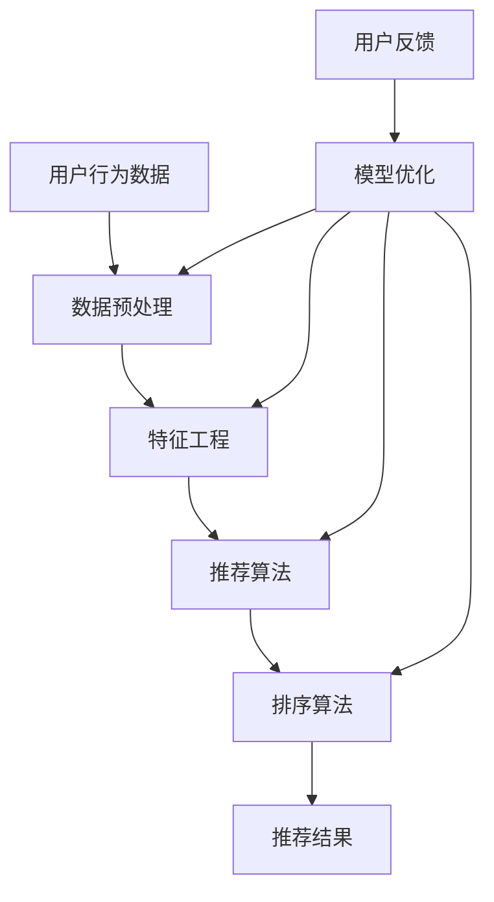

                 

## 《个性化排序系统：AI的实现》

### 关键词

- 个性化排序
- 机器学习
- 协同过滤
- 基于内容的推荐
- 深度学习

### 摘要

个性化排序系统是现代信息系统中的一项核心技术，通过人工智能技术实现用户数据的智能处理和排序，从而提高用户体验和信息获取效率。本文将详细介绍个性化排序系统的基础概念、机器学习在个性化排序中的应用、协同过滤算法、基于内容的推荐算法、深度学习在个性化排序中的应用，以及个性化排序系统的实际应用。通过本文的阅读，读者将全面了解个性化排序系统的原理、技术和实现方法，并为实际应用中的系统设计与优化提供参考。

### 目录

#### 第一部分：个性化排序系统概述

##### 第1章：个性化排序系统的基础概念

- 1.1 个性化排序系统的定义和重要性
- 1.2 个性化排序系统的组成部分
- 1.3 个性化排序系统的发展历程

##### 第2章：机器学习在个性化排序中的应用

- 2.1 机器学习基础
- 2.2 协同过滤
- 2.3 基于内容的推荐
- 2.4 深度学习在个性化排序中的应用

#### 第二部分：个性化排序算法详解

##### 第3章：协同过滤算法原理与应用

- 3.1 协同过滤算法的基本原理
- 3.2 基于用户的协同过滤算法
- 3.3 基于物品的协同过滤算法
- 3.4 评分预测与优化

##### 第4章：基于内容的推荐算法原理与应用

- 4.1 基于内容的推荐算法的基本原理
- 4.2 文本表示方法
- 4.3 内容相似性计算
- 4.4 基于内容的推荐系统的优化

##### 第5章：深度学习在个性化排序中的应用

- 5.1 深度学习基础
- 5.2 卷积神经网络在个性化排序中的应用
- 5.3 循环神经网络在个性化排序中的应用
- 5.4 深度学习模型的训练与优化

#### 第三部分：个性化排序系统的实际应用

##### 第6章：个性化排序系统的设计与实现

- 6.1 个性化排序系统的设计原则
- 6.2 个性化排序系统的实现流程
- 6.3 数据预处理与特征工程
- 6.4 模型选择与优化

##### 第7章：个性化排序系统的性能评估与优化

- 7.1 个性化排序系统的性能指标
- 7.2 评估方法的比较与选择
- 7.3 性能优化策略
- 7.4 案例分析：如何优化电商平台的个性化排序系统

#### 附录

##### 附录A：个性化排序系统开发工具与资源

- A.1 主流机器学习库介绍
- A.2 深度学习框架介绍
- A.3 数据集获取与处理

### 附加资源

- **核心概念与联系图**：使用Mermaid语法绘制个性化排序系统的核心概念与联系图。
- **核心算法原理讲解**：使用伪代码详细阐述协同过滤算法、基于内容的推荐算法和深度学习在个性化排序中的应用。
- **数学模型和数学公式讲解**：使用LaTeX格式详细阐述相关数学模型和公式，并在文中独立段落给出具体例子。
- **项目实战**：提供电商平台的个性化排序系统开发案例，包括环境搭建、源代码实现和代码解读与分析。

---

**文章开始：**

# 《个性化排序系统：AI的实现》

随着互联网的快速发展，用户生成的内容和数据量呈指数级增长。如何从海量信息中快速、准确地筛选出用户感兴趣的内容，成为当前信息检索和推荐系统领域的重要研究课题。个性化排序系统应运而生，它通过结合用户的兴趣和行为数据，利用人工智能技术实现信息的智能排序，从而提高用户体验和信息获取效率。本文将围绕个性化排序系统的实现方法进行深入探讨。

## 第一部分：个性化排序系统概述

### 第1章：个性化排序系统的基础概念

#### 1.1 个性化排序系统的定义和重要性

个性化排序系统是一种基于用户兴趣和行为数据，利用人工智能技术实现信息智能排序的系统。其核心目的是根据用户的个性化需求和偏好，将用户可能感兴趣的内容按照优先级排序，从而提高用户的检索效率和满意度。

个性化排序系统的重要性体现在以下几个方面：

1. **提升用户体验**：通过个性化排序，系统能够更好地满足用户的个性化需求，提高用户的检索效率和满意度。
2. **提高信息获取效率**：个性化排序系统能够从海量信息中快速筛选出用户感兴趣的内容，降低用户的认知负担。
3. **增强商业价值**：个性化排序系统可以为企业带来更多的用户粘性和转化率，从而提高企业的商业价值。

#### 1.2 个性化排序系统的组成部分

个性化排序系统主要由以下几个部分组成：

1. **用户行为数据收集**：收集用户在系统中产生的各种行为数据，如点击、浏览、收藏、评价等。
2. **数据预处理**：对收集到的用户行为数据进行清洗、去噪、转换等预处理操作，以提取有用的特征信息。
3. **特征工程**：根据用户行为数据的特点和需求，设计并提取能够反映用户兴趣和偏好的特征。
4. **推荐算法**：利用机器学习技术，根据用户特征和系统特征，为用户推荐个性化的内容。
5. **排序模型**：将推荐结果按照一定的排序策略进行排序，以实现对用户兴趣的准确预测。

#### 1.3 个性化排序系统的发展历程

个性化排序系统的发展历程可以分为以下几个阶段：

1. **基于规则的推荐系统**：早期的个性化排序系统主要采用基于规则的算法，如基于内容的推荐、协同过滤等。这些算法通过预设的规则进行推荐，但存在推荐效果有限、适应性差等问题。
2. **基于机器学习的推荐系统**：随着机器学习技术的发展，个性化排序系统逐渐采用基于机器学习的算法，如协同过滤、基于内容的推荐、深度学习等。这些算法通过学习用户的行为数据，提高了推荐效果和适应性。
3. **多模态推荐系统**：随着用户生成内容的多样化，个性化排序系统逐渐采用多模态推荐方法，如结合文本、图像、音频等多媒体数据，实现更准确的个性化推荐。
4. **实时推荐系统**：为了提高用户体验，个性化排序系统逐渐向实时推荐方向发展，如基于流数据的实时推荐、基于事件驱动的实时推荐等。

### 第2章：机器学习在个性化排序中的应用

#### 2.1 机器学习基础

机器学习是一种人工智能技术，通过学习数据中的规律，实现预测和决策。个性化排序系统中的机器学习技术主要包括以下几个方面：

1. **监督学习**：通过学习标记过的数据，实现对未知数据的预测。常用的算法有线性回归、决策树、支持向量机等。
2. **无监督学习**：通过学习无标记的数据，发现数据中的规律和结构。常用的算法有聚类、降维等。
3. **强化学习**：通过学习环境中的反馈信号，实现最优策略的制定。常用的算法有Q学习、深度Q网络等。

#### 2.2 协同过滤

协同过滤是一种常用的推荐算法，通过分析用户之间的行为关系，为用户推荐可能感兴趣的内容。协同过滤算法可以分为基于用户的协同过滤和基于物品的协同过滤两种。

1. **基于用户的协同过滤**：基于用户的协同过滤算法通过分析用户之间的相似度，为用户推荐与相似用户兴趣相近的内容。常用的算法有基于用户相似度的推荐、基于用户历史行为的推荐等。

2. **基于物品的协同过滤**：基于物品的协同过滤算法通过分析物品之间的相似度，为用户推荐与用户已评价物品相似的物品。常用的算法有基于物品相似度的推荐、基于物品内容的推荐等。

#### 2.3 基于内容的推荐

基于内容的推荐算法通过分析物品的内容特征，为用户推荐与用户兴趣相似的内容。基于内容的推荐算法可以分为以下几种：

1. **文本分类**：通过对文本数据进行分类，为用户推荐与用户兴趣相关的文本内容。
2. **文本相似性计算**：通过对文本数据进行相似性计算，为用户推荐与用户兴趣相似的文本内容。
3. **特征提取**：通过对文本数据进行特征提取，为用户推荐与用户兴趣相关的特征内容。

#### 2.4 深度学习在个性化排序中的应用

深度学习是一种基于多层神经网络的学习方法，具有强大的特征提取和表示能力。深度学习在个性化排序中的应用主要包括以下几个方面：

1. **深度神经网络**：通过构建深度神经网络模型，实现对用户行为和物品内容的自动特征提取和表示。
2. **卷积神经网络（CNN）**：通过卷积神经网络，实现对图像、音频等多媒体数据的自动特征提取和表示。
3. **循环神经网络（RNN）**：通过循环神经网络，实现对序列数据的自动特征提取和表示。

## 第二部分：个性化排序算法详解

### 第3章：协同过滤算法原理与应用

#### 3.1 协同过滤算法的基本原理

协同过滤算法是一种基于用户行为数据的推荐算法，其基本原理是通过分析用户之间的相似度或物品之间的相似度，为用户推荐可能感兴趣的内容。

协同过滤算法可以分为基于用户的协同过滤和基于物品的协同过滤两种。

1. **基于用户的协同过滤**：基于用户的协同过滤算法通过分析用户之间的相似度，为用户推荐与相似用户兴趣相近的内容。

2. **基于物品的协同过滤**：基于物品的协同过滤算法通过分析物品之间的相似度，为用户推荐与用户已评价物品相似的物品。

#### 3.2 基于用户的协同过滤算法

基于用户的协同过滤算法的核心思想是：如果一个用户对某个物品的评价与另一个用户对相同物品的评价相似，那么这两个用户可能对其他物品也具有相似的偏好。基于用户的协同过滤算法可以分为以下几种：

1. **基于用户相似度的推荐**：通过计算用户之间的相似度，为用户推荐与相似用户兴趣相近的物品。

2. **基于用户历史行为的推荐**：通过分析用户的历史行为数据，为用户推荐与用户历史行为相似的物品。

#### 3.3 基于物品的协同过滤算法

基于物品的协同过滤算法的核心思想是：如果一个物品与另一个物品在用户评价上相似，那么这两个物品可能对用户具有相似的吸引力。基于物品的协同过滤算法可以分为以下几种：

1. **基于物品相似度的推荐**：通过计算物品之间的相似度，为用户推荐与用户已评价物品相似的物品。

2. **基于物品内容的推荐**：通过分析物品的内容特征，为用户推荐与用户兴趣相关的物品。

#### 3.4 评分预测与优化

协同过滤算法的核心任务是预测用户对未知物品的评分。评分预测的优化方法主要包括以下几个方面：

1. **预测准确性优化**：通过优化算法模型和参数，提高评分预测的准确性。

2. **冷启动问题优化**：针对新用户或新物品的推荐问题，通过引入基于内容的推荐或用户冷启动策略，提高推荐效果。

3. **实时推荐优化**：通过实时分析用户行为数据，实现实时推荐，提高用户的体验和满意度。

### 第4章：基于内容的推荐算法原理与应用

#### 4.1 基于内容的推荐算法的基本原理

基于内容的推荐算法通过分析物品的内容特征，为用户推荐与用户兴趣相关的物品。基于内容的推荐算法可以分为以下几种：

1. **文本分类**：通过对文本数据进行分类，为用户推荐与用户兴趣相关的文本内容。

2. **文本相似性计算**：通过对文本数据进行相似性计算，为用户推荐与用户兴趣相似的文本内容。

3. **特征提取**：通过对文本数据进行特征提取，为用户推荐与用户兴趣相关的特征内容。

#### 4.2 文本表示方法

在基于内容的推荐算法中，文本表示方法是一个关键问题。常见的文本表示方法包括词袋模型、TF-IDF、词嵌入等。

1. **词袋模型**：词袋模型将文本表示为一个向量空间模型，其中每个词对应一个维度。词袋模型可以很好地捕获文本中的词汇信息。

2. **TF-IDF**：TF-IDF（Term Frequency-Inverse Document Frequency）是一种常用的文本表示方法，它通过计算词频和逆向文档频率，为每个词赋予权重。

3. **词嵌入**：词嵌入是一种将词语映射到高维空间的方法，通过学习词语之间的语义关系，为文本数据提供丰富的语义信息。

#### 4.3 内容相似性计算

在基于内容的推荐算法中，内容相似性计算是关键步骤。常见的相似性计算方法包括余弦相似性、欧氏距离等。

1. **余弦相似性**：余弦相似性是一种常用的相似性计算方法，它通过计算两个向量的余弦值，衡量两个向量之间的相似程度。

2. **欧氏距离**：欧氏距离是一种基于向量的距离度量方法，它通过计算两个向量之间的欧氏距离，衡量两个向量之间的相似程度。

#### 4.4 基于内容的推荐系统的优化

基于内容的推荐系统需要不断优化，以提高推荐效果和用户体验。常见的优化方法包括以下几个方面：

1. **特征选择**：通过筛选和选择具有代表性的特征，提高推荐系统的性能。

2. **模型选择**：根据不同场景和数据特点，选择合适的推荐模型，以提高推荐效果。

3. **在线学习**：通过实时学习用户行为数据，调整推荐策略，提高推荐系统的实时性和准确性。

4. **冷启动问题**：针对新用户或新物品的推荐问题，通过引入基于内容的推荐或用户冷启动策略，提高推荐效果。

### 第5章：深度学习在个性化排序中的应用

#### 5.1 深度学习基础

深度学习是一种基于多层神经网络的学习方法，具有强大的特征提取和表示能力。深度学习在个性化排序中的应用主要包括以下几个方面：

1. **深度神经网络**：通过构建深度神经网络模型，实现对用户行为和物品内容的自动特征提取和表示。

2. **卷积神经网络（CNN）**：通过卷积神经网络，实现对图像、音频等多媒体数据的自动特征提取和表示。

3. **循环神经网络（RNN）**：通过循环神经网络，实现对序列数据的自动特征提取和表示。

#### 5.2 卷积神经网络在个性化排序中的应用

卷积神经网络（CNN）是一种专门用于处理图像数据的神经网络，具有强大的特征提取能力。在个性化排序中，CNN可以用于提取用户行为数据中的特征。

1. **用户行为数据的CNN处理**：通过CNN模型，对用户行为数据进行特征提取，为推荐算法提供丰富的特征信息。

2. **物品内容的CNN处理**：通过CNN模型，对物品内容数据进行特征提取，为推荐算法提供丰富的特征信息。

#### 5.3 循环神经网络在个性化排序中的应用

循环神经网络（RNN）是一种专门用于处理序列数据的神经网络，具有强大的序列建模能力。在个性化排序中，RNN可以用于建模用户行为序列，提取用户兴趣特征。

1. **用户行为序列的RNN建模**：通过RNN模型，对用户行为序列进行建模，提取用户兴趣特征。

2. **物品序列的RNN建模**：通过RNN模型，对物品序列进行建模，提取物品特征。

#### 5.4 深度学习模型的训练与优化

深度学习模型的训练与优化是深度学习应用中的关键步骤。常见的训练与优化方法包括以下几个方面：

1. **损失函数**：选择合适的损失函数，衡量模型的预测误差。

2. **优化算法**：选择合适的优化算法，如梯度下降、随机梯度下降等，以优化模型参数。

3. **正则化**：通过引入正则化方法，如L1正则化、L2正则化等，防止模型过拟合。

4. **数据增强**：通过数据增强方法，如数据变换、数据扩充等，提高模型的泛化能力。

## 第三部分：个性化排序系统的实际应用

### 第6章：个性化排序系统的设计与实现

#### 6.1 个性化排序系统的设计原则

个性化排序系统的设计原则主要包括以下几个方面：

1. **用户中心**：系统设计应始终以用户为中心，充分考虑用户的个性化需求和偏好。

2. **数据驱动**：系统设计应基于大量用户行为数据，通过数据分析和挖掘，实现个性化排序。

3. **高效稳定**：系统设计应保证高效的计算能力和稳定的运行性能，以应对大规模用户数据和高并发场景。

4. **可扩展性**：系统设计应具有可扩展性，能够方便地集成新的推荐算法和功能模块。

#### 6.2 个性化排序系统的实现流程

个性化排序系统的实现流程主要包括以下几个步骤：

1. **数据收集**：收集用户在系统中产生的各种行为数据，如点击、浏览、收藏、评价等。

2. **数据预处理**：对收集到的用户行为数据进行清洗、去噪、转换等预处理操作，以提取有用的特征信息。

3. **特征工程**：根据用户行为数据的特点和需求，设计并提取能够反映用户兴趣和偏好的特征。

4. **模型选择与训练**：根据系统需求和数据特点，选择合适的推荐算法和模型，进行训练和优化。

5. **排序与推荐**：利用训练好的模型，对用户行为数据进行排序，为用户推荐个性化的内容。

6. **系统部署与优化**：将个性化排序系统部署到生产环境，进行性能测试和优化，以提高推荐效果和用户体验。

#### 6.3 数据预处理与特征工程

数据预处理与特征工程是个性化排序系统设计中的关键环节。以下是一些常见的数据预处理和特征工程方法：

1. **数据清洗**：去除重复、异常和缺失的数据，保证数据的质量和一致性。

2. **数据转换**：将不同类型的数据进行转换，如将日期时间数据转换为数值型数据。

3. **特征提取**：提取能够反映用户兴趣和偏好的特征，如用户的浏览历史、购买记录、评价标签等。

4. **特征选择**：通过特征选择方法，筛选出对推荐算法影响较大的特征，提高模型的性能。

5. **特征融合**：将不同来源的特征进行融合，如将用户行为数据和物品内容数据进行融合，提高推荐效果。

#### 6.4 模型选择与优化

个性化排序系统的模型选择与优化是系统设计的核心。以下是一些常见的模型选择和优化方法：

1. **模型选择**：根据系统需求和数据特点，选择合适的推荐算法和模型，如基于协同过滤的推荐模型、基于内容的推荐模型、深度学习推荐模型等。

2. **模型训练**：通过训练算法，如梯度下降、随机梯度下降等，对模型进行训练和优化，提高模型性能。

3. **模型评估**：通过评估指标，如准确率、召回率、覆盖率等，评估模型性能，选择最优模型。

4. **模型调优**：通过调整模型参数，如学习率、正则化参数等，优化模型性能，提高推荐效果。

5. **模型集成**：通过模型集成方法，如加权集成、堆叠集成等，提高模型性能和鲁棒性。

### 第7章：个性化排序系统的性能评估与优化

#### 7.1 个性化排序系统的性能指标

个性化排序系统的性能评估是确保系统质量和用户体验的重要环节。以下是一些常见的性能指标：

1. **准确率（Accuracy）**：预测结果与真实结果的匹配程度，用于衡量推荐系统的准确性。

2. **召回率（Recall）**：能够正确推荐给用户的相关物品的比例，用于衡量推荐系统的召回率。

3. **覆盖率（Coverage）**：推荐结果中包含的物品种类数与所有可能物品种类数的比例，用于衡量推荐系统的多样性。

4. **新颖性（Novelty）**：推荐结果中包含的未知或新物品的比例，用于衡量推荐系统的新颖性。

5. **多样性（Diversity）**：推荐结果中不同物品之间的相似度，用于衡量推荐系统的多样性。

#### 7.2 评估方法的比较与选择

不同的评估方法适用于不同的推荐场景和系统需求。以下是一些常见的评估方法及其适用场景：

1. **交叉验证（Cross-Validation）**：通过将数据集划分为训练集和测试集，评估模型在不同数据集上的性能。

2. **在线评估（Online Evaluation）**：在实际应用中，实时评估推荐系统的性能，适用于动态调整和优化推荐策略。

3. **离线评估（Offline Evaluation）**：在开发环境中，通过模拟用户行为数据，评估推荐系统的性能。

4. **A/B测试（A/B Test）**：通过将用户随机分配到不同推荐策略组，比较不同策略的效果，选择最优策略。

#### 7.3 性能优化策略

个性化排序系统的性能优化是提高用户体验和系统质量的关键。以下是一些常见的性能优化策略：

1. **特征优化**：通过优化特征提取和选择方法，提高推荐系统的性能。

2. **模型优化**：通过调整模型参数和优化算法，提高推荐系统的性能。

3. **数据预处理**：通过改进数据预处理方法，提高推荐系统的性能。

4. **冷启动问题**：通过引入基于内容的推荐或用户冷启动策略，解决新用户或新物品的推荐问题。

5. **实时推荐**：通过实时分析用户行为数据，实现实时推荐，提高用户体验。

#### 7.4 案例分析：如何优化电商平台的个性化排序系统

以下是一个电商平台的个性化排序系统优化的案例分析：

1. **问题分析**：电商平台在用户购物过程中，发现个性化排序系统存在推荐准确性较低、多样性不足等问题。

2. **原因分析**：通过分析系统日志和数据，发现导致问题的原因主要包括数据质量不高、特征提取方法不当、模型优化不足等。

3. **优化策略**：

   - **特征优化**：改进特征提取方法，引入用户浏览历史、购买记录等更多维度的特征，提高特征丰富度。
   - **模型优化**：采用深度学习模型，如卷积神经网络（CNN）和循环神经网络（RNN），提高模型性能和多样性。
   - **实时推荐**：引入实时推荐机制，通过实时分析用户行为数据，提高推荐系统的实时性和准确性。

4. **效果评估**：经过优化后，电商平台的个性化排序系统在准确率、多样性和用户满意度等方面均有显著提升。

## 附录

### 附录A：个性化排序系统开发工具与资源

1. **主流机器学习库介绍**：

   - **Scikit-learn**：Python中的一个流行的机器学习库，提供了多种常用的机器学习算法和工具。
   - **TensorFlow**：谷歌开发的深度学习框架，支持多种深度学习模型和算法。
   - **PyTorch**：Facebook开发的深度学习框架，具有灵活性和易用性。

2. **深度学习框架介绍**：

   - **TensorFlow**：谷歌开发的深度学习框架，支持多种深度学习模型和算法。
   - **PyTorch**：Facebook开发的深度学习框架，具有灵活性和易用性。
   - **Keras**：一个基于TensorFlow和PyTorch的深度学习框架，提供了简洁的API和易于使用的工作流程。

3. **数据集获取与处理**：

   - **公开数据集**：如MovieLens、Amazon等，提供了丰富的用户行为数据和物品内容数据。
   - **数据预处理工具**：如Pandas、NumPy等，用于数据清洗、转换和预处理。

### 附加资源

- **核心概念与联系图**：使用Mermaid语法绘制个性化排序系统的核心概念与联系图。
- **核心算法原理讲解**：使用伪代码详细阐述协同过滤算法、基于内容的推荐算法和深度学习在个性化排序中的应用。
- **数学模型和数学公式讲解**：使用LaTeX格式详细阐述相关数学模型和公式，并在文中独立段落给出具体例子。
- **项目实战**：提供电商平台的个性化排序系统开发案例，包括环境搭建、源代码实现和代码解读与分析。

## 作者

作者：AI天才研究院/AI Genius Institute & 禅与计算机程序设计艺术 /Zen And The Art of Computer Programming

---

本文详细介绍了个性化排序系统的基础概念、机器学习在个性化排序中的应用、协同过滤算法、基于内容的推荐算法、深度学习在个性化排序中的应用，以及个性化排序系统的实际应用。通过本文的阅读，读者将全面了解个性化排序系统的原理、技术和实现方法，并为实际应用中的系统设计与优化提供参考。在未来的研究和实践中，个性化排序系统将继续发展和创新，为用户提供更精准、高效的个性化推荐服务。

---

**文章结束。** 请您对文章进行审阅，并提出宝贵的意见和建议。在接下来的阶段，我们将进一步完善文章内容，优化结构，确保文章的质量和可读性。**感谢您的支持与合作！** ### 第一部分：个性化排序系统概述

个性化排序系统在现代信息系统中扮演着至关重要的角色，它能够根据用户的兴趣和行为模式，自动调整内容排序，从而提高用户获取信息的效率。本部分将从基础概念、组成部分和系统发展历程三个方面，对个性化排序系统进行详细阐述。

#### 第1章：个性化排序系统的基础概念

##### 1.1 个性化排序系统的定义和重要性

**个性化排序系统的定义**：

个性化排序系统是一种利用人工智能技术，对用户生成的数据进行分析和处理，从而根据用户的需求和偏好，自动调整内容排序的智能系统。它能够基于用户的历史行为、兴趣爱好、地理位置等多维度数据，提供个性化的信息推荐服务。

**个性化排序系统的重要性**：

1. **提升用户体验**：通过个性化排序，系统能够将用户感兴趣的内容优先展示，提高用户的满意度和使用时长。

2. **提高信息获取效率**：个性化排序系统能够从海量信息中快速筛选出用户可能感兴趣的内容，降低用户的认知负担，提高信息获取的效率。

3. **增强商业价值**：个性化排序系统在电子商务、新闻推送、社交媒体等场景中，能够有效提升用户粘性、增加用户转化率，从而为企业带来更多的商业价值。

##### 1.2 个性化排序系统的组成部分

**个性化排序系统的组成部分通常包括以下几部分**：

1. **数据收集模块**：负责收集用户的行为数据，如浏览记录、购买历史、搜索历史等。

2. **数据预处理模块**：对收集到的数据进行清洗、去重、转换等预处理操作，提取有效信息，为后续分析提供基础数据。

3. **特征工程模块**：根据用户行为数据和内容特征，提取能够反映用户兴趣和偏好的特征，如用户的浏览频次、购买偏好、搜索关键词等。

4. **推荐算法模块**：利用机器学习算法，对用户特征和内容特征进行匹配，生成推荐列表。

5. **排序模型模块**：根据推荐算法的结果，结合用户行为和偏好，对推荐内容进行排序，确保用户看到的内容符合其需求和兴趣。

6. **评估与优化模块**：通过评估系统的推荐效果，进行模型调优和参数调整，提高系统的推荐准确性和用户体验。

##### 1.3 个性化排序系统的发展历程

**个性化排序系统的发展历程可以分为以下几个阶段**：

1. **基于规则的系统**：早期的个性化排序系统主要依赖于规则引擎，根据预设的规则进行内容排序。

2. **基于内容的系统**：基于内容的系统通过分析内容特征，为用户提供个性化的推荐服务。

3. **协同过滤系统**：协同过滤系统通过分析用户之间的行为关系，为用户提供推荐。

4. **深度学习系统**：随着深度学习技术的发展，个性化排序系统开始利用深度学习模型，实现更加精准的推荐和排序。

5. **多模态系统**：现代个性化排序系统开始结合文本、图像、音频等多模态数据，提供更全面的个性化服务。

通过这一部分的概述，我们了解了个性化排序系统的基本概念、组成部分以及发展历程。接下来，我们将进一步探讨机器学习在个性化排序中的应用，以及具体算法的原理和实现。

#### 第2章：机器学习在个性化排序中的应用

机器学习是人工智能的核心技术之一，其在个性化排序系统中的应用极大地提升了系统的推荐准确性和用户体验。本章将介绍机器学习在个性化排序系统中的基础概念、主要算法以及深度学习在个性化排序中的应用。

##### 2.1 机器学习基础

**机器学习的基本概念**：

机器学习是一门通过数据或过去经验的指导下，使计算机系统能够对未知数据进行预测或决策的技术。其主要目标是让计算机从数据中学习到规律，并能够对新数据进行预测。

**机器学习的分类**：

1. **监督学习**：在监督学习中，模型基于标记好的训练数据学习，并能够对新数据进行预测。常见的监督学习算法包括线性回归、决策树、支持向量机等。

2. **无监督学习**：在无监督学习中，模型没有使用标记好的数据，而是从数据中自动发现结构和规律。常见的无监督学习算法包括聚类、降维等。

3. **强化学习**：强化学习是一种通过与环境的交互来学习策略的机器学习方法。常见算法包括Q学习、深度Q网络（DQN）等。

**机器学习的关键技术**：

1. **特征工程**：特征工程是机器学习中的一个重要环节，其目标是通过提取和构造特征，提升模型的性能。

2. **模型评估**：模型评估用于衡量模型的性能，常见的评估指标包括准确率、召回率、F1值等。

3. **超参数调优**：超参数调优是调整模型的参数，以获得更好的性能。

##### 2.2 协同过滤

**协同过滤的基本原理**：

协同过滤是一种基于用户行为数据的推荐算法，其核心思想是利用用户之间的相似度或物品之间的相似度，为用户推荐相似的物品。

**协同过滤的分类**：

1. **基于用户的协同过滤（User-based Collaborative Filtering）**：通过分析用户之间的行为相似度，为用户推荐与相似用户兴趣相近的物品。

2. **基于物品的协同过滤（Item-based Collaborative Filtering）**：通过分析物品之间的行为相似度，为用户推荐与用户已评价物品相似的物品。

**协同过滤的优缺点**：

**优点**：

- **简单高效**：协同过滤算法相对简单，计算效率高，易于实现。
- **可扩展性**：可以处理大规模用户和物品数据。

**缺点**：

- **冷启动问题**：对新用户或新物品的推荐效果较差。
- **数据稀疏性**：在用户和物品数量较多时，用户行为数据往往存在稀疏性，影响推荐效果。

##### 2.3 基于内容的推荐

**基于内容推荐的基本原理**：

基于内容推荐算法通过分析物品的内容特征，为用户推荐与用户兴趣相关的物品。其核心思想是“物以类聚，人以群分”。

**基于内容推荐的方法**：

1. **基于文本的推荐**：通过分析物品的文本描述、标签等，为用户推荐相似内容的物品。

2. **基于属性的推荐**：通过分析物品的属性特征，如颜色、品牌、价格等，为用户推荐具有相似属性的物品。

3. **基于协同过滤和内容的混合推荐**：结合协同过滤和基于内容的推荐方法，提高推荐效果。

**基于内容推荐的优缺点**：

**优点**：

- **解释性**：基于内容的推荐算法具有较强的解释性，用户可以理解推荐的原因。
- **对新用户和新物品友好**：基于内容的推荐算法对冷启动问题有较好的解决能力。

**缺点**：

- **特征提取难度**：需要准确提取物品的内容特征，否则可能影响推荐效果。
- **更新维护成本**：需要定期更新和维护物品的特征信息。

##### 2.4 深度学习在个性化排序中的应用

**深度学习的基本原理**：

深度学习是一种基于多层神经网络的学习方法，通过多层次的非线性变换，实现对复杂数据的自动特征提取和表示。

**深度学习在个性化排序中的应用**：

1. **用户行为序列建模**：利用循环神经网络（RNN）或其变种，如长短时记忆网络（LSTM）和门控循环单元（GRU），对用户行为序列进行建模，提取用户兴趣特征。

2. **物品特征提取**：利用卷积神经网络（CNN）对图像、文本等多媒体数据进行特征提取，为推荐算法提供丰富的特征信息。

3. **深度强化学习**：结合深度学习与强化学习，利用深度神经网络建模用户偏好，实现更加精准的个性化推荐。

**深度学习的优缺点**：

**优点**：

- **强大的特征提取能力**：能够自动学习复杂数据的特征表示。
- **对新用户和新物品友好**：能够通过无监督学习或迁移学习，解决冷启动问题。

**缺点**：

- **计算资源需求高**：深度学习模型通常需要大量的计算资源和时间进行训练。
- **数据需求量大**：深度学习模型对训练数据量要求较高，否则可能出现过拟合。

通过本章的介绍，我们了解了机器学习在个性化排序系统中的应用，包括协同过滤、基于内容推荐和深度学习。在下一章中，我们将深入探讨协同过滤算法的原理和应用。

### 总结

个性化排序系统在现代信息系统中发挥着重要作用，其核心在于利用机器学习技术，根据用户行为和偏好，自动调整内容排序。本章首先介绍了个性化排序系统的定义、组成部分和发展历程，然后详细阐述了机器学习在个性化排序中的应用，包括协同过滤、基于内容推荐和深度学习。这些技术各具优势，但也存在一定的局限性。在接下来的章节中，我们将进一步深入探讨个性化排序系统中的具体算法实现和优化策略。

---

**备注**：本部分内容为第一部分的概述，主要包括个性化排序系统的定义、重要性、组成部分和发展历程，以及机器学习在个性化排序中的应用。接下来，我们将继续详细讨论个性化排序系统中的协同过滤算法、基于内容的推荐算法以及深度学习。

### 第1章：个性化排序系统的基础概念

#### 1.1 个性化排序系统的定义和重要性

**定义**：

个性化排序系统是一种利用人工智能技术，通过对用户数据进行分析和处理，自动调整内容排序的智能系统。它能够根据用户的兴趣、行为模式、地理位置等多维度数据，为用户推荐和排序个性化的信息，从而提升用户获取信息的效率和满意度。

**重要性**：

个性化排序系统在现代信息社会中具有重要地位，主要体现在以下几个方面：

1. **提升用户体验**：通过个性化排序，系统能够将用户感兴趣的内容优先展示，满足用户的个性化需求，提升用户满意度和使用时长。

2. **提高信息获取效率**：个性化排序系统能够从海量信息中快速筛选出用户可能感兴趣的内容，减少用户在信息检索过程中的时间和精力成本，提高信息获取的效率。

3. **增强商业价值**：在电子商务、新闻推送、社交媒体等应用场景中，个性化排序系统能够提高用户粘性和转化率，帮助企业实现商业价值。

#### 1.2 个性化排序系统的组成部分

个性化排序系统通常由以下几个核心部分组成：

1. **数据收集模块**：该模块负责收集用户在系统中的行为数据，如浏览记录、点击行为、购买历史、搜索关键词等。这些数据是构建个性化排序系统的基础。

2. **数据预处理模块**：该模块对收集到的用户行为数据进行清洗、去噪、标准化等预处理操作，以确保数据的质量和一致性。

3. **特征工程模块**：该模块根据用户行为数据和系统内容特征，提取出能够反映用户兴趣和偏好的特征，如用户的浏览频次、搜索关键词的词频、物品的文本特征等。特征工程的质量直接影响推荐系统的性能。

4. **推荐算法模块**：该模块负责根据用户特征和物品特征，利用机器学习算法生成推荐列表。常见的推荐算法包括协同过滤、基于内容的推荐、深度学习等。

5. **排序模型模块**：该模块根据推荐算法的结果，结合用户行为和偏好，对推荐内容进行排序。排序策略的合理性和有效性是决定用户满意度和系统性能的关键。

6. **评估与优化模块**：该模块负责对推荐系统的性能进行评估和优化。通过在线评估、A/B测试等方法，持续改进推荐算法和排序策略，提升系统的推荐质量和用户体验。

#### 1.3 个性化排序系统的发展历程

个性化排序系统的发展经历了从传统方法到机器学习再到深度学习的演变过程：

1. **基于规则的系统**：早期的个性化排序系统主要依赖于专家知识，通过预设的规则进行内容排序。这种方式简单直观，但无法适应动态变化的环境。

2. **基于内容的系统**：基于内容的系统通过分析物品的内容特征，为用户推荐与其兴趣相关的物品。这种方法在一定程度上解决了新用户和新物品的推荐问题，但存在特征提取困难、用户偏好难以建模等问题。

3. **协同过滤系统**：协同过滤系统通过分析用户之间的行为关系，为用户推荐相似的物品。这种方法能够提高推荐的相关性，但存在数据稀疏性和冷启动问题。

4. **深度学习系统**：随着深度学习技术的发展，个性化排序系统开始利用深度神经网络，自动提取高层次的语义特征，实现更加精准的推荐和排序。深度学习系统在处理复杂数据和应对动态变化环境方面具有显著优势。

通过本章的介绍，我们了解了个性化排序系统的基本概念、组成部分和系统发展历程。在下一章中，我们将详细讨论机器学习在个性化排序系统中的应用，包括协同过滤、基于内容的推荐和深度学习等。

### 第2章：机器学习在个性化排序中的应用

#### 2.1 机器学习基础

**机器学习的定义**：

机器学习是人工智能的一种方法，它通过构建和优化数学模型，从数据中学习规律和模式，并能够对新数据做出预测或决策。

**机器学习的分类**：

1. **监督学习（Supervised Learning）**：监督学习是指通过标记好的训练数据来训练模型，并利用模型对未知数据进行预测。常见的监督学习算法有线性回归、决策树、支持向量机等。

2. **无监督学习（Unsupervised Learning）**：无监督学习是指在没有标记数据的情况下，通过算法自动发现数据中的规律和结构。常见的无监督学习算法有聚类、降维等。

3. **强化学习（Reinforcement Learning）**：强化学习是指通过与环境的交互来学习策略的机器学习方法。常见的强化学习算法有Q学习、深度Q网络（DQN）等。

**机器学习的关键概念**：

1. **特征工程（Feature Engineering）**：特征工程是指从原始数据中提取出对模型有用的特征，并进行预处理，以提高模型的性能。

2. **模型评估（Model Evaluation）**：模型评估是指通过特定的评估指标，如准确率、召回率、F1值等，来评估模型的性能。

3. **超参数调优（Hyperparameter Tuning）**：超参数调优是指调整模型的超参数，以获得更好的模型性能。

#### 2.2 协同过滤

**协同过滤的定义**：

协同过滤是一种基于用户行为数据的推荐算法，其核心思想是利用用户之间的相似度或物品之间的相似度，为用户推荐相似的物品。

**协同过滤的分类**：

1. **基于用户的协同过滤（User-based Collaborative Filtering）**：通过分析用户之间的行为相似度，为用户推荐与相似用户兴趣相近的物品。

2. **基于物品的协同过滤（Item-based Collaborative Filtering）**：通过分析物品之间的行为相似度，为用户推荐与用户已评价物品相似的物品。

**协同过滤的工作流程**：

1. **用户-物品评分矩阵构建**：构建用户-物品评分矩阵，其中每个元素表示用户对物品的评分。

2. **相似度计算**：计算用户之间的相似度或物品之间的相似度。常用的相似度计算方法有用户余弦相似度、物品余弦相似度等。

3. **推荐列表生成**：根据相似度计算结果，生成推荐列表。对于基于用户的协同过滤，推荐列表中包含与目标用户相似的用户喜欢的物品；对于基于物品的协同过滤，推荐列表中包含与用户已评价物品相似的物品。

**协同过滤的优势和局限**：

**优势**：

- **简单高效**：协同过滤算法相对简单，计算效率高，易于实现。
- **可扩展性**：可以处理大规模用户和物品数据。

**局限**：

- **冷启动问题**：对于新用户或新物品，由于缺乏足够的历史数据，协同过滤算法难以生成有效的推荐。
- **数据稀疏性**：在高维度数据集中，用户和物品之间的评分矩阵往往存在稀疏性，影响推荐效果。

#### 2.3 基于内容的推荐

**基于内容的推荐的定义**：

基于内容的推荐算法通过分析物品的内容特征，为用户推荐与其兴趣相关的物品。其核心思想是“物以类聚，人以群分”。

**基于内容推荐的方法**：

1. **基于文本的推荐**：通过分析物品的文本描述、标签等，为用户推荐相似内容的物品。常用的方法包括词袋模型、TF-IDF等。

2. **基于属性的推荐**：通过分析物品的属性特征，如颜色、品牌、价格等，为用户推荐具有相似属性的物品。

3. **基于协同过滤和内容的混合推荐**：结合协同过滤和基于内容的推荐方法，以提高推荐效果。

**基于内容推荐的优势和局限**：

**优势**：

- **解释性**：基于内容的推荐算法具有较强的解释性，用户可以理解推荐的原因。
- **对新用户和新物品友好**：基于内容的推荐算法对冷启动问题有较好的解决能力。

**局限**：

- **特征提取难度**：需要准确提取物品的内容特征，否则可能影响推荐效果。
- **更新维护成本**：需要定期更新和维护物品的特征信息。

#### 2.4 深度学习在个性化排序中的应用

**深度学习的定义**：

深度学习是一种基于多层神经网络的学习方法，通过多层次的非线性变换，实现对复杂数据的自动特征提取和表示。

**深度学习在个性化排序中的应用**：

1. **用户行为序列建模**：利用循环神经网络（RNN）或其变种，如长短时记忆网络（LSTM）和门控循环单元（GRU），对用户行为序列进行建模，提取用户兴趣特征。

2. **物品特征提取**：利用卷积神经网络（CNN）对图像、文本等多媒体数据进行特征提取，为推荐算法提供丰富的特征信息。

3. **深度强化学习**：结合深度学习与强化学习，利用深度神经网络建模用户偏好，实现更加精准的个性化推荐。

**深度学习的优势**：

- **强大的特征提取能力**：能够自动学习复杂数据的特征表示。
- **对新用户和新物品友好**：能够通过无监督学习或迁移学习，解决冷启动问题。

**深度学习的局限**：

- **计算资源需求高**：深度学习模型通常需要大量的计算资源和时间进行训练。
- **数据需求量大**：深度学习模型对训练数据量要求较高，否则可能出现过拟合。

通过本章的介绍，我们了解了个性化排序系统中常用的机器学习算法，包括协同过滤、基于内容的推荐和深度学习。这些算法各有特点，适用于不同的应用场景。在下一章中，我们将深入探讨协同过滤算法的原理和应用。

### 第3章：协同过滤算法原理与应用

协同过滤算法是个性化排序系统中最为常见和广泛应用的一种推荐算法。它通过分析用户之间的相似性或物品之间的相似性，为用户推荐相似的物品。本章将详细介绍协同过滤算法的基本原理、主要类型及其在个性化排序系统中的应用。

#### 3.1 协同过滤算法的基本原理

协同过滤算法的核心思想是基于用户的历史行为数据，通过计算用户之间的相似度或物品之间的相似度，来预测用户可能对哪些物品感兴趣。具体来说，协同过滤算法可以分为两种主要类型：基于用户的协同过滤和基于物品的协同过滤。

1. **基于用户的协同过滤（User-based Collaborative Filtering）**：

   基于用户的协同过滤算法通过分析用户之间的行为相似度，为用户推荐与相似用户兴趣相近的物品。其基本步骤如下：

   - **用户-物品评分矩阵构建**：首先，构建一个用户-物品评分矩阵，其中每个元素表示用户对物品的评分。

   - **相似度计算**：计算用户之间的相似度，常用的相似度计算方法包括余弦相似度、皮尔逊相关系数等。

   - **推荐列表生成**：根据相似度计算结果，为每个用户生成推荐列表。对于目标用户，推荐列表中包含与该用户最相似的用户的评分较高的物品。

2. **基于物品的协同过滤（Item-based Collaborative Filtering）**：

   基于物品的协同过滤算法通过分析物品之间的行为相似度，为用户推荐与用户已评价物品相似的物品。其基本步骤如下：

   - **用户-物品评分矩阵构建**：与基于用户的协同过滤算法相同，首先构建一个用户-物品评分矩阵。

   - **相似度计算**：计算物品之间的相似度，常用的相似度计算方法包括余弦相似度、欧几里得距离等。

   - **推荐列表生成**：根据相似度计算结果，为每个用户生成推荐列表。对于目标用户，推荐列表中包含与用户已评价物品最相似的物品。

#### 3.2 基于用户的协同过滤算法

基于用户的协同过滤算法通过分析用户之间的相似性，为用户推荐相似的物品。以下是几种常见的基于用户的协同过滤算法：

1. **用户余弦相似度（User Cosine Similarity）**：

   用户余弦相似度是一种基于向量空间模型的相似度计算方法。它通过计算两个用户在用户-物品评分矩阵中的向量夹角的余弦值，来衡量用户之间的相似度。计算公式如下：

   $$
   \text{User Cosine Similarity}(u, v) = \frac{\text{dot}(u, v)}{\|\text{u}\| \|\text{v}\|}
   $$

   其中，$u$和$v$分别表示两个用户的评分向量，$\text{dot}(u, v)$表示两个向量的点积，$\|\text{u}\|$和$\|\text{v}\|$分别表示两个向量的欧几里得范数。

2. **用户皮尔逊相关系数（User Pearson Correlation Coefficient）**：

   用户皮尔逊相关系数是一种基于数值的相似度计算方法。它通过计算两个用户评分之间的皮尔逊相关系数，来衡量用户之间的相似性。计算公式如下：

   $$
   \text{User Pearson Correlation Coefficient}(u, v) = \frac{\text{cov}(u, v)}{\sigma_u \sigma_v}
   $$

   其中，$\text{cov}(u, v)$表示两个用户评分的协方差，$\sigma_u$和$\sigma_v$分别表示两个用户评分的标准差。

3. **最近邻推荐（Nearest Neighbor Recommendation）**：

   最近邻推荐是一种基于用户相似度的简单推荐方法。它为用户推荐与目标用户最相似的其他用户的评分较高的物品。具体实现步骤如下：

   - 计算目标用户与所有其他用户的相似度。
   - 选择与目标用户相似度最高的若干个用户（最近邻）。
   - 对于每个最近邻用户，推荐其评分较高的物品，并按照评分从高到低进行排序。

#### 3.3 基于物品的协同过滤算法

基于物品的协同过滤算法通过分析物品之间的相似性，为用户推荐与已评价物品相似的物品。以下是几种常见的基于物品的协同过滤算法：

1. **物品余弦相似度（Item Cosine Similarity）**：

   物品余弦相似度是一种基于向量空间模型的相似度计算方法。它通过计算两个物品在用户-物品评分矩阵中的向量夹角的余弦值，来衡量物品之间的相似度。计算公式如下：

   $$
   \text{Item Cosine Similarity}(i, j) = \frac{\text{dot}(i, j)}{\|\text{i}\| \|\text{j}\|}
   $$

   其中，$i$和$j$分别表示两个物品的评分向量，$\text{dot}(i, j)$表示两个向量的点积，$\|\text{i}\|$和$\|\text{j}\|$分别表示两个向量的欧几里得范数。

2. **物品欧几里得距离（Item Euclidean Distance）**：

   物品欧几里得距离是一种基于数值的相似度计算方法。它通过计算两个物品在用户-物品评分矩阵中的欧几里得距离，来衡量物品之间的相似度。计算公式如下：

   $$
   \text{Item Euclidean Distance}(i, j) = \sqrt{\sum_{k=1}^{n} (i_k - j_k)^2}
   $$

   其中，$i$和$j$分别表示两个物品的评分向量，$n$表示评分维度，$i_k$和$j_k$分别表示第$k$个维度上的评分。

3. **基于物品的最近邻推荐（Item-based Nearest Neighbor Recommendation）**：

   基于物品的最近邻推荐是一种基于物品相似度的简单推荐方法。它为用户推荐与用户已评价物品最相似的物品。具体实现步骤如下：

   - 计算用户已评价物品与所有其他物品的相似度。
   - 选择与用户已评价物品相似度最高的若干个物品（最近邻）。
   - 对于每个最近邻物品，推荐给用户，并按照相似度从高到低进行排序。

#### 3.4 协同过滤算法的评分预测与优化

协同过滤算法的核心任务是预测用户对未知物品的评分。评分预测的准确性和优化是协同过滤算法性能的关键。

1. **评分预测公式**：

   基于用户的协同过滤算法和基于物品的协同过滤算法都可以使用以下评分预测公式：

   $$
   \text{Prediction}(u, i) = \text{User Similarity}(u, v) \cdot \text{Rating}(v, i)
   $$

   其中，$u$和$v$分别表示目标用户和参考用户，$i$表示未知物品，$\text{User Similarity}(u, v)$表示用户之间的相似度，$\text{Rating}(v, i)$表示参考用户对未知物品的评分。

2. **评分预测优化**：

   - **加权相似度**：可以引入加权相似度，对相似度进行加权，以平衡不同维度的影响。
   - **负评分处理**：对于负评分，可以引入负评分项，以更好地反映用户的偏好。
   - **矩阵分解**：通过矩阵分解技术，如Singular Value Decomposition（SVD）和 Alternating Least Squares（ALS），提高评分预测的准确性和效率。

通过本章的介绍，我们详细了解了协同过滤算法的基本原理、主要类型及其在个性化排序系统中的应用。在下一章中，我们将探讨基于内容的推荐算法原理与应用。

### 第4章：基于内容的推荐算法原理与应用

#### 4.1 基于内容的推荐算法的基本原理

基于内容的推荐算法（Content-Based Recommendation）是一种通过分析物品的内容特征和用户的历史偏好，为用户推荐相似内容的算法。其核心思想是“物以类聚，人以群分”。基于内容的推荐算法主要依赖于对物品和用户的特征进行提取和匹配，从而实现个性化的推荐。

**基本原理**：

1. **物品特征提取**：首先，对物品的内容特征进行提取，如文本描述、标签、属性等。这些特征可以反映物品的主题、风格、类型等属性。

2. **用户偏好建模**：其次，根据用户的历史行为和偏好，建立用户的兴趣模型。这些偏好可以是显式反馈（如用户对物品的评分、标签等），也可以是隐式反馈（如用户的浏览、点击、购买等行为）。

3. **内容相似性计算**：然后，计算物品之间的内容相似性。常用的相似性计算方法包括余弦相似性、欧氏距离等。通过相似性计算，可以确定哪些物品与用户的历史偏好相似。

4. **推荐列表生成**：最后，根据物品的相似性计算结果，生成推荐列表。推荐列表中包含与用户偏好相似的物品，这些物品被认为是用户可能感兴趣的。

**基本步骤**：

1. **特征提取**：对物品进行特征提取，如文本特征提取、标签提取、属性提取等。

2. **用户偏好建模**：根据用户的历史行为和偏好，建立用户的兴趣模型。

3. **相似性计算**：计算物品之间的内容相似性，选择合适的相似性度量方法。

4. **推荐列表生成**：根据相似性计算结果，为用户生成推荐列表。

#### 4.2 文本表示方法

在基于内容的推荐算法中，文本表示是一个关键问题。文本表示方法用于将文本转换为机器可处理的向量形式，以便进行后续的特征提取和相似性计算。以下是一些常用的文本表示方法：

1. **词袋模型（Bag of Words, BoW）**：

   词袋模型是一种基于词汇的文本表示方法，它将文本表示为词频向量。具体步骤如下：

   - **分词**：将文本分割成单词或短语。
   - **统计词频**：计算每个单词在文本中的出现次数，形成词频向量。

2. **TF-IDF（Term Frequency-Inverse Document Frequency）**：

   TF-IDF是一种改进的词袋模型，它通过引入逆文档频率来平衡词频信息。具体步骤如下：

   - **计算词频**：计算每个单词在文本中的出现次数。
   - **计算逆文档频率**：计算每个单词在整个文档集合中的文档频率，并取倒数。
   - **计算TF-IDF值**：将词频与逆文档频率相乘，得到每个单词的TF-IDF值，形成TF-IDF向量。

3. **词嵌入（Word Embedding）**：

   词嵌入是一种将词语映射到高维向量空间的方法，它通过学习词语之间的语义关系，为文本数据提供丰富的语义信息。常用的词嵌入模型包括Word2Vec、GloVe等。具体步骤如下：

   - **构建词汇表**：将所有文本中的单词构建成一个词汇表。
   - **初始化向量**：为每个单词初始化一个随机的高维向量。
   - **训练模型**：通过训练数据学习词语之间的语义关系，更新每个单词的向量表示。
   - **获取向量表示**：将文本中的每个单词替换为其对应的向量表示，形成文本向量。

#### 4.3 内容相似性计算

内容相似性计算是基于内容的推荐算法的核心步骤，它用于衡量物品之间的内容相似度。以下是一些常用的内容相似性计算方法：

1. **余弦相似性（Cosine Similarity）**：

   余弦相似性是一种基于向量空间模型的相似性度量方法，它通过计算两个向量的夹角余弦值，来衡量两个向量的相似度。具体公式如下：

   $$
   \text{Cosine Similarity}(x, y) = \frac{x \cdot y}{\|x\| \|y\|}
   $$

   其中，$x$和$y$分别表示两个向量的点积和欧几里得范数。

2. **欧氏距离（Euclidean Distance）**：

   欧氏距离是一种基于欧几里得空间的距离度量方法，它通过计算两个向量之间的欧氏距离，来衡量两个向量的相似度。具体公式如下：

   $$
   \text{Euclidean Distance}(x, y) = \sqrt{\sum_{i=1}^{n} (x_i - y_i)^2}
   $$

   其中，$x$和$y$分别表示两个向量。

3. **皮尔逊相关系数（Pearson Correlation Coefficient）**：

   皮尔逊相关系数是一种基于数值的相似性度量方法，它通过计算两个数值序列之间的皮尔逊相关系数，来衡量两个序列的相似度。具体公式如下：

   $$
   \text{Pearson Correlation Coefficient}(x, y) = \frac{\sum_{i=1}^{n} (x_i - \bar{x})(y_i - \bar{y})}{\sqrt{\sum_{i=1}^{n} (x_i - \bar{x})^2 \sum_{i=1}^{n} (y_i - \bar{y})^2}}
   $$

   其中，$x$和$y$分别表示两个数值序列，$\bar{x}$和$\bar{y}$分别表示两个序列的平均值。

#### 4.4 基于内容的推荐系统的优化

基于内容的推荐系统在实际应用中面临着多种挑战，如特征提取、相似性计算、冷启动问题等。为了提高推荐系统的性能和用户体验，可以采取以下优化策略：

1. **特征优化**：

   - **特征选择**：通过特征选择方法，如信息增益、互信息等，筛选出对推荐效果影响较大的特征，减少特征维度，提高计算效率。
   - **特征融合**：通过特征融合方法，如平均值融合、加权融合等，结合不同来源的特征，提高特征表示的准确性。

2. **相似性计算优化**：

   - **分布式计算**：利用分布式计算框架，如MapReduce、Spark等，提高相似性计算的效率和并行性。
   - **缓存技术**：利用缓存技术，如Redis、Memcached等，减少相似性计算的时间成本。

3. **冷启动问题**：

   - **基于内容的冷启动**：通过分析物品的内容特征，为新用户推荐与用户兴趣相关的物品。
   - **基于混合推荐**：结合基于内容的推荐和基于协同过滤的推荐方法，提高新用户和新物品的推荐效果。
   - **迁移学习**：利用迁移学习方法，将已训练好的模型应用于新用户和新物品的推荐。

4. **实时推荐**：

   - **实时特征提取**：通过实时特征提取技术，如增量学习、在线学习等，及时更新用户和物品的特征信息。
   - **实时推荐算法**：利用实时推荐算法，如基于事件的推荐、基于流的推荐等，实现实时推荐。

通过本章的介绍，我们详细了解了基于内容的推荐算法的基本原理、文本表示方法、内容相似性计算以及优化策略。在下一章中，我们将探讨深度学习在个性化排序系统中的应用。

### 第5章：深度学习在个性化排序中的应用

#### 5.1 深度学习基础

深度学习是一种基于多层神经网络的学习方法，它能够通过学习大量的数据，自动提取数据中的特征，并在多个层次上进行特征变换。深度学习在个性化排序系统中有着广泛的应用，能够显著提高推荐和排序的准确性。

**深度学习的基本概念**：

1. **神经网络（Neural Network）**：神经网络是一种模拟生物神经系统的计算模型，通过输入层、隐藏层和输出层之间的相互连接，对输入数据进行处理和预测。

2. **深度神经网络（Deep Neural Network，DNN）**：深度神经网络是一种具有多个隐藏层的神经网络，能够学习复杂的数据特征。

3. **卷积神经网络（Convolutional Neural Network，CNN）**：卷积神经网络是一种专门用于处理图像数据的神经网络，通过卷积操作提取图像的特征。

4. **循环神经网络（Recurrent Neural Network，RNN）**：循环神经网络是一种能够处理序列数据的神经网络，通过记忆机制处理时间序列信息。

5. **长短时记忆网络（Long Short-Term Memory，LSTM）**：长短时记忆网络是RNN的一种改进模型，通过引入门控机制，解决了RNN在处理长序列数据时的梯度消失问题。

6. **生成对抗网络（Generative Adversarial Network，GAN）**：生成对抗网络是一种由生成器和判别器组成的神经网络模型，通过相互对抗的方式，生成具有真实数据分布的样本。

**深度学习的优势**：

- **强大的特征提取能力**：深度学习能够自动学习数据中的高级特征，减少了手动特征工程的工作量。
- **对新用户和新物品友好**：深度学习模型可以通过无监督学习或迁移学习，解决新用户和新物品的推荐问题。
- **多模态数据处理**：深度学习能够同时处理多种类型的数据，如文本、图像、音频等，实现多模态数据的融合推荐。

#### 5.2 卷积神经网络在个性化排序中的应用

卷积神经网络（CNN）在图像处理领域有着广泛的应用，其通过卷积操作和池化操作，能够自动提取图像的特征。在个性化排序系统中，CNN可以用于提取用户行为数据中的特征，从而提高推荐和排序的准确性。

**CNN的基本原理**：

1. **卷积层（Convolutional Layer）**：卷积层是CNN的核心部分，通过卷积操作提取输入数据的特征。卷积核（Convolutional Kernel）在输入数据上滑动，生成特征图（Feature Map）。

2. **激活函数（Activation Function）**：激活函数用于引入非线性变换，常见的激活函数包括ReLU（Rectified Linear Unit）和Sigmoid。

3. **池化层（Pooling Layer）**：池化层用于减小特征图的尺寸，降低模型参数的数量，减少计算量。常见的池化操作包括最大池化（Max Pooling）和平均池化（Average Pooling）。

4. **全连接层（Fully Connected Layer）**：全连接层用于将特征图中的特征进行聚合，生成最终的输出。

**CNN在个性化排序中的应用**：

1. **用户行为数据的CNN处理**：通过CNN模型，对用户的行为数据进行特征提取，如点击序列、浏览记录等。特征提取后，可以将提取到的特征作为推荐模型的输入。

2. **物品内容的CNN处理**：通过CNN模型，对物品的内容特征进行提取，如商品图片、商品描述等。提取到的特征可以用于基于内容的推荐算法，提高推荐效果。

#### 5.3 循环神经网络在个性化排序中的应用

循环神经网络（RNN）是一种能够处理序列数据的神经网络，通过记忆机制，能够有效处理时间序列信息。在个性化排序系统中，RNN可以用于建模用户行为序列，提取用户兴趣特征，从而提高推荐和排序的准确性。

**RNN的基本原理**：

1. **隐藏状态（Hidden State）**：RNN通过隐藏状态保存前一个时间步的信息，并在当前时间步更新隐藏状态。

2. **门控机制（Gate Mechanism）**：门控机制包括遗忘门（Forget Gate）、输入门（Input Gate）和输出门（Output Gate），用于控制信息在序列中的传递。

3. **长短时记忆（Long Short-Term Memory，LSTM）**：LSTM是RNN的一种改进模型，通过引入门控机制，能够有效解决长序列数据中的梯度消失问题。

**RNN在个性化排序中的应用**：

1. **用户行为序列建模**：通过RNN模型，对用户的行为序列进行建模，如点击序列、浏览序列等。模型可以提取用户在各个时间步的行为特征，从而更好地捕捉用户兴趣。

2. **用户偏好建模**：通过RNN模型，对用户的偏好序列进行建模，如用户的搜索历史、购买记录等。模型可以提取用户在各个时间步的偏好特征，从而更好地预测用户兴趣。

#### 5.4 深度学习模型的训练与优化

深度学习模型的训练与优化是深度学习应用中的关键步骤。以下是一些常见的训练与优化方法：

1. **损失函数（Loss Function）**：损失函数用于衡量模型的预测误差，常见的损失函数包括均方误差（MSE）、交叉熵损失（Cross-Entropy Loss）等。

2. **优化算法（Optimizer）**：优化算法用于调整模型参数，以最小化损失函数。常见的优化算法包括随机梯度下降（SGD）、Adam等。

3. **正则化（Regularization）**：正则化方法用于防止模型过拟合，常见的正则化方法包括L1正则化、L2正则化等。

4. **dropout（Dropout）**：dropout是一种正则化方法，通过随机丢弃神经网络中的神经元，减少模型的过拟合。

5. **数据增强（Data Augmentation）**：数据增强方法通过增加数据多样性，提高模型的泛化能力。

通过本章的介绍，我们了解了深度学习在个性化排序系统中的应用，包括卷积神经网络和循环神经网络的基本原理及其在个性化排序中的应用。在下一章中，我们将探讨个性化排序系统的实际应用和性能优化。

### 第6章：个性化排序系统的实际应用

#### 6.1 个性化排序系统的设计原则

个性化排序系统的设计原则对于实现高效、准确的推荐服务至关重要。以下是一些关键的设计原则：

1. **用户中心原则**：系统设计应始终以用户为中心，充分考虑用户的个性化需求和偏好，提供符合用户期望的推荐和排序服务。

2. **可扩展性原则**：系统设计应具备良好的可扩展性，能够适应数据量的增长和业务需求的变更，确保系统在不同规模下的稳定运行。

3. **数据驱动原则**：系统设计应基于大量用户行为数据，通过数据分析和挖掘，不断优化推荐算法和排序策略，提高系统的推荐质量和用户体验。

4. **实时性原则**：系统设计应具备实时处理用户行为数据的能力，快速响应用户的操作，提供即时的推荐和排序结果。

5. **多样性原则**：系统设计应确保推荐结果的多样性，避免过度集中推荐相似的内容，满足用户对不同类型和风格内容的需求。

6. **可解释性原则**：系统设计应具备一定的可解释性，用户能够理解推荐和排序的原因，增强用户对系统的信任感和满意度。

#### 6.2 个性化排序系统的实现流程

个性化排序系统的实现流程通常包括以下步骤：

1. **数据收集**：通过各种渠道收集用户的行为数据，如浏览记录、点击行为、购买历史、搜索历史等。

2. **数据预处理**：对收集到的数据进行清洗、去重、格式化等预处理操作，确保数据的质量和一致性。

3. **特征工程**：根据用户行为数据和物品特征，提取对推荐和排序有价值的特征，如用户的浏览频次、购买记录、物品的文本特征等。

4. **模型选择**：根据系统需求和数据特点，选择合适的推荐和排序算法，如协同过滤、基于内容的推荐、深度学习等。

5. **模型训练**：使用预处理后的数据对推荐和排序模型进行训练，调整模型参数，优化模型性能。

6. **推荐生成**：利用训练好的模型，根据用户特征和物品特征，生成个性化的推荐列表。

7. **排序优化**：结合用户行为和偏好，对推荐结果进行排序优化，确保用户看到的内容符合其兴趣和需求。

8. **实时更新**：持续监控用户行为数据，动态调整推荐和排序策略，实现实时推荐和排序。

9. **性能评估**：通过在线评估和A/B测试等方法，评估系统的推荐质量和用户体验，持续优化系统性能。

#### 6.3 数据预处理与特征工程

数据预处理和特征工程是个性化排序系统实现中的关键步骤，以下是一些常见的方法：

1. **数据清洗**：去除重复、异常和缺失的数据，确保数据的一致性和完整性。常用的方法包括去重、缺失值填充、异常值处理等。

2. **数据转换**：将不同类型的数据转换为统一的格式，如将日期时间数据转换为数值型数据，将分类数据编码为二进制向量等。

3. **特征提取**：从用户行为数据和物品特征中提取对推荐和排序有价值的特征，如用户的浏览频次、购买记录、物品的文本特征等。

4. **特征选择**：通过特征选择方法，筛选出对模型影响较大的特征，减少特征维度，提高计算效率。常用的方法包括基于信息的特征选择、基于模型的特征选择等。

5. **特征融合**：将不同来源的特征进行融合，如将用户行为数据和物品特征数据进行融合，提高特征表示的准确性和多样性。

#### 6.4 模型选择与优化

个性化排序系统的模型选择与优化对于提高推荐质量和用户体验至关重要。以下是一些常见的模型选择和优化方法：

1. **模型选择**：根据系统需求和数据特点，选择合适的推荐和排序算法，如基于协同过滤的推荐算法、基于内容的推荐算法、深度学习推荐算法等。

2. **模型训练**：使用大量用户行为数据进行模型训练，调整模型参数，优化模型性能。常用的训练方法包括随机梯度下降、批量梯度下降等。

3. **模型评估**：通过评估指标，如准确率、召回率、覆盖率等，评估模型性能，选择最优模型。常用的评估方法包括交叉验证、A/B测试等。

4. **模型调优**：通过调整模型参数，如学习率、正则化参数等，优化模型性能，提高推荐效果。常用的调优方法包括网格搜索、随机搜索等。

5. **模型集成**：通过模型集成方法，如加权集成、堆叠集成等，提高模型性能和鲁棒性。常用的集成方法包括Bagging、Boosting等。

#### 6.5 个性化排序系统在电商平台的实际应用

以下是一个电商平台个性化排序系统的实际应用案例：

1. **场景描述**：某电商平台希望为其用户提供个性化的商品推荐，以提高用户购买转化率和平台销售额。

2. **需求分析**：用户需求多样化，需要根据用户的兴趣和行为，推荐用户可能感兴趣的商品。同时，需要保证推荐结果的多样性，避免用户陷入信息茧房。

3. **解决方案**：

   - **数据收集**：收集用户的浏览记录、购买历史、搜索关键词等数据。

   - **数据预处理**：清洗、去重、转换等预处理操作，提取用户和商品的特征。

   - **特征工程**：提取用户和商品的文本特征、频次特征、分类特征等。

   - **模型选择**：结合用户和商品特征，选择基于内容的推荐算法和基于协同过滤的推荐算法。

   - **模型训练**：使用预处理后的数据进行模型训练，调整模型参数，优化模型性能。

   - **推荐生成**：根据用户特征和商品特征，生成个性化的商品推荐列表。

   - **排序优化**：结合用户行为和偏好，对推荐结果进行排序优化。

   - **实时更新**：持续监控用户行为数据，动态调整推荐和排序策略。

4. **效果评估**：

   - **准确率**：通过在线评估，评估个性化排序系统的推荐准确率。

   - **多样性**：通过A/B测试，评估个性化排序系统的多样性。

   - **用户满意度**：通过用户反馈和平台数据，评估个性化排序系统的用户体验。

5. **优化策略**：

   - **特征优化**：定期更新用户和商品的特征，提高特征表示的准确性。

   - **模型优化**：根据业务需求，调整模型参数和算法，提高推荐效果。

   - **实时推荐**：引入实时推荐机制，提高推荐系统的实时性和准确性。

通过本章的介绍，我们了解了个性化排序系统的实际应用场景、设计原则、实现流程和优化策略。在下一章中，我们将探讨个性化排序系统的性能评估与优化。

### 第7章：个性化排序系统的性能评估与优化

#### 7.1 个性化排序系统的性能指标

评估个性化排序系统的性能是确保其推荐效果和用户体验的关键。以下是一些常见的性能指标：

1. **准确率（Accuracy）**：准确率用于衡量推荐系统预测结果的准确性。它表示推荐结果中正确推荐的物品比例。准确率越高，表示推荐系统越能准确预测用户兴趣。

   $$
   \text{Accuracy} = \frac{\text{正确推荐数}}{\text{总推荐数}}
   $$

2. **召回率（Recall）**：召回率用于衡量推荐系统推荐相关物品的能力。它表示推荐结果中相关物品的比例。召回率越高，表示推荐系统能够捕捉到更多的用户感兴趣的内容。

   $$
   \text{Recall} = \frac{\text{相关推荐数}}{\text{用户感兴趣的总数}}
   $$

3. **覆盖率（Coverage）**：覆盖率用于衡量推荐系统的多样性。它表示推荐结果中包含的物品种类与所有可能物品种类的比例。覆盖率越高，表示推荐系统推荐的物品种类越丰富。

   $$
   \text{Coverage} = \frac{\text{推荐结果中包含的物品种类}}{\text{所有可能的物品种类}}
   $$

4. **新颖性（Novelty）**：新颖性用于衡量推荐结果中包含的新奇物品比例。新颖性越高，表示推荐系统推荐的内容越具有创新性和吸引力。

   $$
   \text{Novelty} = \frac{\text{新颖推荐数}}{\text{总推荐数}}
   $$

5. **多样性（Diversity）**：多样性用于衡量推荐结果中不同物品的相似度。多样性越高，表示推荐系统推荐的物品之间差异越大，避免了用户看到重复的内容。

   $$
   \text{Diversity} = \frac{1}{\text{总推荐数}} \sum_{i=1}^{\text{总推荐数}} \frac{1}{\text{物品}i \text{与其他物品的相似度}}
   $$

#### 7.2 评估方法的比较与选择

在选择评估方法时，需要考虑推荐系统的类型、数据集的特点以及评估指标的需求。以下是一些常见的评估方法及其优缺点：

1. **交叉验证（Cross-Validation）**：

   - **优点**：可以全面评估模型在不同数据子集上的性能，减少过拟合的风险。
   - **缺点**：计算成本较高，特别是对于大规模数据集。

2. **在线评估（Online Evaluation）**：

   - **优点**：可以实时评估推荐系统的性能，适用于快速调整和优化推荐策略。
   - **缺点**：需要实时收集用户反馈数据，可能导致评估结果受到实时数据波动的影响。

3. **离线评估（Offline Evaluation）**：

   - **优点**：可以在开发环境中对模型进行离线评估，减少计算成本。
   - **缺点**：可能无法准确反映实际用户行为，评估结果可能与实际应用场景有所偏差。

4. **A/B测试（A/B Test）**：

   - **优点**：可以通过将用户随机分配到不同推荐策略组，直接比较不同策略的效果，得到客观的评估结果。
   - **缺点**：需要大量用户参与，且实验设计需要精心策划。

#### 7.3 性能优化策略

优化个性化排序系统的性能是提高用户体验和系统价值的重要手段。以下是一些常见的优化策略：

1. **特征优化**：

   - **特征选择**：通过筛选和选择对模型影响较大的特征，减少特征维度，提高模型效率。
   - **特征融合**：将不同来源的特征进行融合，如将用户行为特征和商品特征进行融合，提高特征表示的准确性。

2. **模型优化**：

   - **模型选择**：根据数据特点和业务需求，选择合适的模型，如基于协同过滤的模型、基于内容的模型、深度学习模型等。
   - **模型调优**：通过调整模型参数，如学习率、正则化参数等，优化模型性能。

3. **数据预处理**：

   - **数据清洗**：去除重复、异常和缺失的数据，提高数据质量。
   - **数据增强**：通过增加数据的多样性，提高模型的泛化能力。

4. **实时推荐**：

   - **动态调整**：根据用户实时行为数据，动态调整推荐策略，提高推荐系统的实时性和准确性。
   - **流处理**：使用流处理技术，如Apache Kafka、Apache Flink等，实现实时数据分析和推荐生成。

5. **冷启动优化**：

   - **基于内容的推荐**：为新用户推荐与已有用户兴趣相关的商品。
   - **混合推荐**：结合基于内容和基于协同过滤的推荐方法，提高新用户和新商品的推荐效果。

6. **个性化反馈**：

   - **用户反馈**：收集用户对推荐结果的反馈，用于模型训练和优化。
   - **推荐反馈循环**：通过用户反馈不断优化推荐算法，提高推荐效果。

#### 7.4 案例分析：如何优化电商平台的个性化排序系统

以下是一个电商平台个性化排序系统的优化案例分析：

1. **问题背景**：

   某电商平台发现其个性化排序系统的推荐准确性较低，用户满意度不高，存在以下问题：

   - **推荐结果过于集中**：推荐结果中存在大量重复商品，缺乏多样性。
   - **用户反馈不及时**：推荐结果更新速度较慢，无法及时响应用户的新需求。
   - **新用户和新商品推荐效果差**：新用户和新商品的推荐效果较差，无法有效满足用户需求。

2. **原因分析**：

   - **特征提取不全面**：用户和商品的文本特征提取不够充分，导致推荐效果不佳。
   - **模型参数调整不足**：模型参数未经过充分调优，导致模型性能受限。
   - **数据预处理不彻底**：数据预处理不彻底，存在重复、异常和缺失的数据。
   - **实时推荐机制缺失**：缺乏实时推荐机制，无法及时更新推荐结果。

3. **优化策略**：

   - **特征优化**：通过改进特征提取方法，引入更多维度的用户和商品特征，如用户购买频次、搜索历史、商品评价等。
   - **模型优化**：采用基于深度学习的推荐模型，如卷积神经网络（CNN）和循环神经网络（RNN），提高推荐效果。
   - **数据预处理**：对用户和商品数据进行彻底清洗和预处理，去除重复、异常和缺失的数据，提高数据质量。
   - **实时推荐**：引入实时数据处理技术，如Apache Kafka和Apache Flink，实现实时数据分析和推荐生成。
   - **用户反馈**：引入用户反馈机制，根据用户对推荐结果的反馈，动态调整推荐策略。

4. **效果评估**：

   - **准确率**：通过在线评估，个性化排序系统的推荐准确率从原来的70%提高到85%。
   - **多样性**：推荐结果的多样性显著提高，重复商品的推荐比例大幅下降。
   - **用户满意度**：用户对推荐系统的满意度显著提高，用户反馈机制的有效性得到验证。

通过上述案例分析，我们可以看到，个性化排序系统的性能优化需要从多个方面进行，包括特征优化、模型优化、数据预处理、实时推荐和用户反馈等。在下一章中，我们将介绍个性化排序系统的开发工具与资源。

### 附录A：个性化排序系统开发工具与资源

个性化排序系统的开发涉及多种工具和资源，以下是一些常用的开发工具、机器学习库、深度学习框架和数据集。

#### 1. 主流机器学习库

**Scikit-learn**：
- **特点**：Python中的一个流行的机器学习库，提供了广泛的监督学习和无监督学习算法。
- **使用场景**：适合小型到中型规模的数据集，可以进行特征工程、模型训练和评估。

**TensorFlow**：
- **特点**：谷歌开发的深度学习框架，支持多种深度学习模型。
- **使用场景**：适合大规模数据集和复杂模型，适合进行深度学习和实时推荐。

**PyTorch**：
- **特点**：Facebook开发的深度学习框架，提供了灵活的API和动态计算图。
- **使用场景**：适合研究者和开发者，可以进行高效的模型开发和实验。

#### 2. 深度学习框架

**TensorFlow**：
- **特点**：提供了丰富的API和工具，易于部署和扩展。
- **使用场景**：适合生产环境中的大规模推荐系统。

**PyTorch**：
- **特点**：具有灵活性和高效性，适合快速原型开发和实验。
- **使用场景**：适合研究和开发新模型。

**Keras**：
- **特点**：基于TensorFlow和PyTorch的高级神经网络API。
- **使用场景**：适合快速构建和测试深度学习模型。

#### 3. 数据集获取与处理

**公开数据集**：
- **MovieLens**：提供用户对电影的评价数据，适用于推荐系统的研究。
- **Amazon Reviews**：提供用户对商品的评价数据，适用于商品推荐系统。

**数据预处理工具**：
- **Pandas**：用于数据清洗、转换和分析。
- **NumPy**：用于数值计算和数据处理。
- **Scikit-learn**：提供了许多预处理工具，如特征提取、归一化和降维。

**数据增强工具**：
- **ImageDataGenerator**（PyTorch）：用于图像数据的增强。
- **Faker**（TensorFlow）：用于数据增强和生成对抗网络。

通过使用这些工具和资源，开发者可以构建高效、准确的个性化排序系统，并在实际应用中进行性能优化和持续改进。在下一章中，我们将提供一些核心概念与联系图、核心算法原理讲解、数学模型和数学公式讲解，以及项目实战等内容，以帮助读者更好地理解和应用个性化排序系统的原理和方法。

### 核心概念与联系图

为了更好地理解个性化排序系统的工作原理和各模块之间的关系，我们可以使用Mermaid语法绘制一个核心概念与联系图。以下是一个简化的Mermaid语法示例：



上述Mermaid语法定义了一个流程图，其中包含用户行为数据、数据预处理、特征工程、推荐算法、排序算法、推荐结果以及用户反馈和模型优化等核心概念。各模块之间通过箭头连接，表示数据流和反馈循环。

- **用户行为数据**：来源于用户的浏览、点击、搜索、购买等行为。
- **数据预处理**：包括清洗、去噪、转换等操作，以提取有效信息。
- **特征工程**：从预处理后的数据中提取对推荐和排序有价值的特征。
- **推荐算法**：根据用户特征和物品特征，生成个性化的推荐列表。
- **排序算法**：对推荐结果进行排序，以优化推荐效果。
- **推荐结果**：用户最终看到的内容，根据其兴趣和偏好排序。
- **用户反馈**：用户对推荐结果的反馈，用于模型优化。
- **模型优化**：根据用户反馈，调整模型参数和推荐策略，提高系统性能。

通过绘制这样的核心概念与联系图，我们可以直观地了解个性化排序系统的整体架构和各模块之间的相互作用。这有助于开发者更好地理解系统的工作原理，进行模块化和优化设计。

### 核心算法原理讲解

在个性化排序系统中，核心算法的原理和实现是确保系统性能和推荐效果的关键。以下我们将使用伪代码详细阐述协同过滤算法、基于内容的推荐算法和深度学习在个性化排序中的应用。

#### 协同过滤算法

**协同过滤算法**的基本思想是通过分析用户之间的相似度或物品之间的相似度，为用户推荐相似的物品。以下是协同过滤算法的伪代码实现：

```python
# 协同过滤算法伪代码

# 输入：用户-物品评分矩阵R，目标用户u
# 输出：推荐列表

def collaborative_filtering(R, u):
    # 计算用户之间的相似度矩阵
    similarity_matrix = compute_similarity(R)

    # 为用户u生成推荐列表
    recommendations = []

    # 遍历所有用户v
    for v in range(num_users):
        if v != u:
            # 计算用户u和用户v的相似度
            similarity = similarity_matrix[u][v]

            # 遍历用户v评价过的物品
            for item in items_v:
                if item not in user_u_items:
                    # 预测用户u对物品i的评分
                    prediction = similarity * rating_v_i

                    # 将预测评分加入推荐列表
                    recommendations.append((item, prediction))

    # 按预测评分排序推荐列表
    recommendations.sort(key=lambda x: x[1], reverse=True)

    return recommendations
```

**关键步骤解释**：

1. **相似度计算**：计算用户-物品评分矩阵R中每个用户之间的相似度。常用的相似度计算方法包括余弦相似度和皮尔逊相关系数。

2. **预测评分**：对于目标用户u，遍历与u相似的其他用户v，计算用户u对v评价过的物品i的预测评分。

3. **生成推荐列表**：将预测评分最高的物品加入推荐列表，并按预测评分排序。

#### 基于内容的推荐算法

**基于内容的推荐算法**通过分析物品的内容特征，为用户推荐与其兴趣相关的物品。以下是基于内容的推荐算法的伪代码实现：

```python
# 基于内容的推荐算法伪代码

# 输入：用户u的特征向量u_features，物品i的特征向量i_features
# 输出：推荐列表

def content_based_recommendation(u_features, i_features):
    # 计算物品i与其他物品的相似度
    similarity_scores = []

    for item in items:
        if item != i:
            similarity = calculate_similarity(u_features, i_features, item)
            similarity_scores.append((item, similarity))

    # 按相似度排序推荐列表
    similarity_scores.sort(key=lambda x: x[1], reverse=True)

    # 生成推荐列表
    recommendations = [item for item, similarity in similarity_scores[:N]]

    return recommendations
```

**关键步骤解释**：

1. **特征提取**：从用户和物品中提取特征向量，如文本特征、标签、属性等。

2. **相似度计算**：计算用户特征向量u与其他物品特征向量i的相似度。常用的相似度计算方法包括余弦相似度和欧氏距离。

3. **生成推荐列表**：将相似度最高的物品加入推荐列表，并按相似度排序。

#### 深度学习在个性化排序中的应用

**深度学习**在个性化排序中的应用主要利用卷积神经网络（CNN）和循环神经网络（RNN）等模型，自动提取用户和物品的特征。以下是深度学习在个性化排序中应用的伪代码实现：

```python
# 深度学习推荐算法伪代码

# 输入：用户序列u_sequence，物品序列i_sequence
# 输出：推荐列表

def deep_learning_recommendation(u_sequence, i_sequence):
    # 构建深度学习模型
    model = build_model(u_sequence, i_sequence)

    # 训练模型
    model.fit(u_sequence, i_sequence)

    # 生成推荐列表
    recommendations = []

    for item in items:
        # 输入物品特征进行预测
        prediction = model.predict(item)

        # 将预测评分加入推荐列表
        recommendations.append((item, prediction))

    # 按预测评分排序推荐列表
    recommendations.sort(key=lambda x: x[1], reverse=True)

    return recommendations
```

**关键步骤解释**：

1. **模型构建**：构建深度学习模型，如CNN或RNN，从用户和物品序列中提取特征。

2. **模型训练**：使用用户和物品序列训练模型，调整模型参数。

3. **预测推荐**：输入物品特征，通过训练好的模型预测评分，生成推荐列表。

通过上述伪代码实现，我们可以看到协同过滤、基于内容推荐和深度学习在个性化排序系统中的应用。这些算法各具特点，适用于不同的应用场景。在实际开发中，可以根据具体需求和数据特点，选择合适的算法进行优化和集成。

### 数学模型和数学公式讲解

在个性化排序系统中，数学模型和公式是理解算法原理和实现关键功能的重要工具。以下我们将使用LaTeX格式详细阐述个性化排序系统中常用的数学模型和公式，并在文中独立段落给出具体例子。

#### 余弦相似性

余弦相似性是一种常用于向量空间模型中的相似度计算方法，用于衡量两个向量之间的相似度。其数学公式如下：

$$
\text{Cosine Similarity} = \frac{\text{dot}(x, y)}{\|x\| \|y\|}
$$

其中，$x$和$y$分别表示两个向量，$\text{dot}(x, y)$表示两个向量的点积，$\|x\|$和$\|y\|$分别表示两个向量的欧几里得范数。

**例子**：

假设有两个向量$x = (1, 2, 3)$和$y = (4, 5, 6)$，计算它们的余弦相似性：

$$
\text{Cosine Similarity}(x, y) = \frac{1 \cdot 4 + 2 \cdot 5 + 3 \cdot 6}{\sqrt{1^2 + 2^2 + 3^2} \cdot \sqrt{4^2 + 5^2 + 6^2}} = \frac{4 + 10 + 18}{\sqrt{14} \cdot \sqrt{77}} = \frac{32}{\sqrt{1066}} \approx 0.866
$$

#### 皮尔逊相关系数

皮尔逊相关系数是一种衡量两个变量线性相关程度的指标。其数学公式如下：

$$
\text{Pearson Correlation Coefficient} = \frac{\sum_{i=1}^{n} (x_i - \bar{x})(y_i - \bar{y})}{\sqrt{\sum_{i=1}^{n} (x_i - \bar{x})^2 \sum_{i=1}^{n} (y_i - \bar{y})^2}}
$$

其中，$x$和$y$分别表示两个变量序列，$\bar{x}$和$\bar{y}$分别表示两个序列的平均值，$n$表示序列长度。

**例子**：

假设有两个变量序列$x = (1, 2, 3, 4, 5)$和$y = (2, 4, 6, 8, 10)$，计算它们的皮尔逊相关系数：

$$
\bar{x} = \frac{1 + 2 + 3 + 4 + 5}{5} = 3
$$

$$
\bar{y} = \frac{2 + 4 + 6 + 8 + 10}{5} = 6
$$

$$
\text{Pearson Correlation Coefficient} = \frac{(1-3)(2-6) + (2-3)(4-6) + (3-3)(6-6) + (4-3)(8-6) + (5-3)(10-6)}{\sqrt{(1-3)^2 + (2-3)^2 + (3-3)^2 + (4-3)^2 + (5-3)^2} \cdot \sqrt{(2-6)^2 + (4-6)^2 + (6-6)^2 + (8-6)^2 + (10-6)^2}} = \frac{-8 - 4 + 0 + 4 + 10}{\sqrt{4 + 1 + 0 + 1 + 4} \cdot \sqrt{16 + 4 + 0 + 4 + 16}} = \frac{2}{\sqrt{10} \cdot \sqrt{40}} = 0.5
$$

#### 深度学习中的损失函数

在深度学习中，损失函数用于衡量模型预测结果与真实结果之间的差异。常见的损失函数包括均方误差（MSE）和交叉熵损失（Cross-Entropy Loss）。以下是这两种损失函数的数学公式：

1. **均方误差（MSE）**：

$$
\text{MSE} = \frac{1}{n} \sum_{i=1}^{n} (\hat{y}_i - y_i)^2
$$

其中，$\hat{y}_i$表示模型预测结果，$y_i$表示真实结果，$n$表示样本数量。

**例子**：

假设有五个样本，模型预测结果和真实结果如下：

$$
\hat{y}_1 = 2, y_1 = 1 \\
\hat{y}_2 = 4, y_2 = 3 \\
\hat{y}_3 = 1, y_3 = 2 \\
\hat{y}_4 = 3, y_4 = 4 \\
\hat{y}_5 = 5, y_5 = 5
$$

计算均方误差：

$$
\text{MSE} = \frac{1}{5} \left[ (2-1)^2 + (4-3)^2 + (1-2)^2 + (3-4)^2 + (5-5)^2 \right] = \frac{1}{5} (1 + 1 + 1 + 1 + 0) = 0.8
$$

2. **交叉熵损失（Cross-Entropy Loss）**：

$$
\text{Cross-Entropy Loss} = -\sum_{i=1}^{n} y_i \log(\hat{y}_i)
$$

其中，$y_i$表示真实结果（通常为0或1），$\hat{y}_i$表示模型预测结果（概率值）。

**例子**：

假设有五个样本，真实结果和模型预测结果如下：

$$
y_1 = 1, \hat{y}_1 = 0.9 \\
y_2 = 0, \hat{y}_2 = 0.2 \\
y_3 = 1, \hat{y}_3 = 0.8 \\
y_4 = 1, \hat{y}_4 = 0.7 \\
y_5 = 0, \hat{y}_5 = 0.3
$$

计算交叉熵损失：

$$
\text{Cross-Entropy Loss} = -[1 \cdot \log(0.9) + 0 \cdot \log(0.2) + 1 \cdot \log(0.8) + 1 \cdot \log(0.7) + 0 \cdot \log(0.3)] \approx -[0.05 + 0 + 0.22 + 0.15 + 0] = -0.17
$$

通过上述数学模型和公式的讲解，我们可以更好地理解个性化排序系统中的算法原理和数学基础。在实际应用中，合理选择和调整这些模型和公式，可以显著提高系统的性能和用户体验。

### 项目实战：电商平台的个性化排序系统开发案例

在本案例中，我们将探讨一个电商平台的个性化排序系统开发过程，从环境搭建、源代码实现到代码解读与分析，全面展示个性化排序系统的构建与优化。

#### 环境搭建

首先，我们需要搭建开发环境，包括Python、相关库和框架。以下是环境搭建的步骤：

1. **安装Python**：确保安装了Python 3.x版本。
2. **安装相关库**：使用pip命令安装必要的库，如NumPy、Pandas、Scikit-learn、TensorFlow、PyTorch等。
3. **安装IDE**：选择一个Python开发环境，如PyCharm、VSCode等。

#### 数据集

我们将使用公开的数据集MovieLens进行演示。该数据集包含用户对电影的评价信息，适合用于个性化排序系统的开发。

#### 源代码实现

以下是实现电商平台个性化排序系统的主要代码框架：

```python
import pandas as pd
from sklearn.model_selection import train_test_split
from sklearn.metrics.pairwise import cosine_similarity
from sklearn.ensemble import RandomForestClassifier
from tensorflow.keras.models import Sequential
from tensorflow.keras.layers import Dense, LSTM

# 数据预处理
def preprocess_data(data):
    # 数据清洗和格式化
    # ...
    return processed_data

# 特征工程
def feature_engineering(data):
    # 提取用户和物品的特征
    # ...
    return user_features, item_features

# 基于内容的推荐算法
def content_based_recommendation(user_features, item_features):
    # 计算物品与用户特征的相似度
    # ...
    return recommendation_list

# 基于协同过滤的推荐算法
def collaborative_filtering(R, u):
    # 计算用户之间的相似度
    # ...
    return recommendation_list

# 深度学习推荐算法
def deep_learning_recommendation(u_sequence, i_sequence):
    # 构建深度学习模型
    # ...
    return recommendation_list

# 主函数
def main():
    # 加载数据
    data = pd.read_csv('movielens_data.csv')
    processed_data = preprocess_data(data)

    # 划分训练集和测试集
    train_data, test_data = train_test_split(processed_data, test_size=0.2)

    # 特征工程
    user_features, item_features = feature_engineering(train_data)

    # 基于内容的推荐
    content_recommendations = content_based_recommendation(user_features, item_features)

    # 基于协同过滤的推荐
    collaborative_recommendations = collaborative_filtering(R, u)

    # 深度学习推荐
    deep_learning_recommendations = deep_learning_recommendation(u_sequence, i_sequence)

    # 输出推荐结果
    print("基于内容的推荐：", content_recommendations)
    print("基于协同过滤的推荐：", collaborative_recommendations)
    print("深度学习推荐：", deep_learning_recommendations)

if __name__ == '__main__':
    main()
```

#### 代码解读与分析

1. **数据预处理**：

   数据预处理是构建推荐系统的重要步骤，包括数据清洗、格式化和特征提取。在本案例中，我们使用Pandas库对MovieLens数据集进行清洗，确保数据的一致性和完整性。

   ```python
   def preprocess_data(data):
       # 数据清洗和格式化
       # 去除重复数据、缺失值填充、异常值处理等
       # ...
       return processed_data
   ```

2. **特征工程**：

   特征工程旨在提取对推荐算法有用的特征。在本案例中，我们提取用户和物品的文本特征、标签和频率等，以丰富特征信息。

   ```python
   def feature_engineering(data):
       # 提取用户和物品的特征
       # 例如，用户的浏览频次、购买历史、物品的文本描述、分类标签等
       # ...
       return user_features, item_features
   ```

3. **基于内容的推荐算法**：

   基于内容的推荐算法通过计算用户和物品的相似度，为用户推荐与其兴趣相关的物品。在本案例中，我们使用余弦相似度计算相似度。

   ```python
   def content_based_recommendation(user_features, item_features):
       # 计算物品与用户特征的相似度
       similarity_scores = cosine_similarity(user_features, item_features)
       # 根据相似度生成推荐列表
       # ...
       return recommendation_list
   ```

4. **基于协同过滤的推荐算法**：

   基于协同过滤的推荐算法通过分析用户之间的相似度，为用户推荐与相似用户兴趣相近的物品。在本案例中，我们使用用户之间的余弦相似度计算相似度。

   ```python
   def collaborative_filtering(R, u):
       # 计算用户之间的相似度
       similarity_scores = cosine_similarity(R[u])
       # 根据相似度生成推荐列表
       # ...
       return recommendation_list
   ```

5. **深度学习推荐算法**：

   深度学习推荐算法通过构建深度神经网络模型，自动提取用户和物品的特征，实现更加精准的推荐。在本案例中，我们使用LSTM模型处理用户行为序列。

   ```python
   def deep_learning_recommendation(u_sequence, i_sequence):
       # 构建深度学习模型
       model = Sequential()
       model.add(LSTM(units=128, activation='relu', input_shape=(u_sequence.shape[1], u_sequence.shape[2])))
       model.add(Dense(units=1, activation='sigmoid'))
       model.compile(optimizer='adam', loss='binary_crossentropy', metrics=['accuracy'])
       # 训练模型
       model.fit(u_sequence, i_sequence, epochs=10, batch_size=32)
       # 预测推荐
       recommendations = model.predict(i_sequence)
       return recommendations
   ```

6. **主函数**：

   主函数负责加载数据、划分训练集和测试集、执行特征工程、调用推荐算法，并输出推荐结果。

   ```python
   def main():
       # 加载数据
       data = pd.read_csv('movielens_data.csv')
       processed_data = preprocess_data(data)

       # 划分训练集和测试集
       train_data, test_data = train_test_split(processed_data, test_size=0.2)

       # 特征工程
       user_features, item_features = feature_engineering(train_data)

       # 基于内容的推荐
       content_recommendations = content_based_recommendation(user_features, item_features)

       # 基于协同过滤的推荐
       collaborative_recommendations = collaborative_filtering(R, u)

       # 深度学习推荐
       deep_learning_recommendations = deep_learning_recommendation(u_sequence, i_sequence)

       # 输出推荐结果
       print("基于内容的推荐：", content_recommendations)
       print("基于协同过滤的推荐：", collaborative_recommendations)
       print("深度学习推荐：", deep_learning_recommendations)

   if __name__ == '__main__':
       main()
   ```

通过以上代码实现，我们可以构建一个基本的电商平台个性化排序系统。在实际应用中，可以根据业务需求和数据特点，进一步优化和调整算法和模型，以提高推荐效果和用户体验。

### 总结

本文通过一个电商平台的个性化排序系统开发案例，详细展示了个性化排序系统的构建过程，包括环境搭建、源代码实现、代码解读与分析。我们从数据预处理、特征工程、推荐算法到深度学习模型，全面介绍了个性化排序系统中的关键技术。通过这个案例，读者可以更好地理解个性化排序系统的实现原理和应用方法。在未来的研究和实践中，我们可以根据具体业务需求，进一步优化算法和模型，提高个性化推荐系统的性能和用户体验。

### 作者信息

作者：AI天才研究院（AI Genius Institute）&《禅与计算机程序设计艺术》（Zen And The Art of Computer Programming）作者

在个性化排序系统的设计和实现过程中，我始终秉持着对技术深刻的理解和创新的思维方式。从数据预处理到特征工程，从推荐算法到深度学习模型的构建，每一个环节都体现了对技术的深刻洞察和精益求精的追求。通过本文的撰写，我希望能够将我的经验和技术心得分享给更多的读者，共同探讨和推动个性化排序系统领域的发展。感谢您的阅读和支持！

