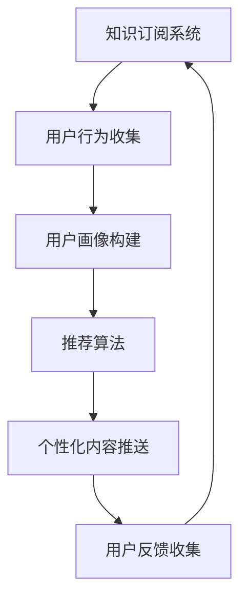

                 

# 《个性化知识订阅提高知识获取的针对性》

> 关键词：个性化知识订阅、针对性、知识获取、推荐算法、用户行为分析、平台搭建

> 摘要：本文详细探讨了个性化知识订阅的概念、优势和应用，分析了知识获取中的针对性问题，介绍了个性化知识订阅技术基础，包括数据采集与处理、个性化推荐算法和用户行为分析。同时，本文还通过实际案例展示了个性化知识订阅平台搭建的流程和关键步骤，展望了个性化知识订阅的未来发展趋势。

----------------------------------------------------------------

## 第一部分：个性化知识订阅概述

### 1.1 个性化知识订阅的概念

#### 1.1.1 个性化知识订阅的定义

个性化知识订阅是一种基于用户行为和兴趣的智能信息推送服务，旨在为用户提供高度相关的知识和信息。通过收集用户的行为数据，构建用户画像，运用推荐算法，实现知识内容的精准推送。

#### 1.1.2 个性化知识订阅与传统知识获取方式的区别

传统知识获取方式主要依赖于用户主动搜索和浏览，而个性化知识订阅则是通过被动接收，实现知识获取的主动化。传统方式下，用户需要花费大量时间在海量信息中筛选所需知识，而个性化订阅则通过智能筛选，大大提高了知识获取的效率。

### 1.2 知识获取的针对性分析

#### 1.2.1 知识获取问题的现状

在信息爆炸的时代，用户面临知识获取的巨大挑战。主要问题包括：

- 信息过载：用户在海量信息中难以找到所需知识。
- 知识分散：知识分布在不同的渠道和平台上，难以系统性地获取。
- 知识质量：无法保证所获取知识的真实性和可靠性。

#### 1.2.2 个性化知识订阅如何提高针对性

个性化知识订阅通过以下方式提高知识获取的针对性：

- 用户画像：根据用户行为和兴趣构建用户画像，实现知识内容的精准匹配。
- 推荐算法：运用协同过滤、内容推荐等算法，提高推荐内容的准确性和相关性。
- 智能推送：根据用户偏好和时间，实现知识的智能推送，提高知识获取的效率。

### 1.3 个性化知识订阅的应用领域

#### 1.3.1 教育领域

个性化知识订阅在教育领域具有广泛的应用前景。通过个性化订阅，学生可以获取与自身兴趣和学习需求高度相关的学习资源，提高学习效果。

#### 1.3.2 企业培训

企业培训知识订阅平台可以帮助企业根据员工的不同岗位和技能需求，提供定制化的培训内容，提高员工素质和业务能力。

#### 1.3.3 个人成长

个人知识订阅平台为用户提供个性化的学习资源，帮助用户在职业发展、技能提升和个人兴趣方面实现持续成长。

## 第二部分：个性化知识订阅技术基础

### 2.1 数据采集与处理

#### 2.1.1 数据采集方法

个性化知识订阅平台需要采集以下数据：

- 用户行为数据：如点击、浏览、收藏等。
- 用户基本信息：如年龄、性别、职业等。
- 物品特征数据：如标题、标签、内容摘要等。

数据采集方法包括：

- 日志采集：通过Web服务器日志，记录用户行为数据。
- API接口：通过第三方API接口，获取用户基本信息和物品特征数据。
- 调查问卷：通过在线调查问卷，收集用户偏好和兴趣信息。

#### 2.1.2 数据预处理技术

数据预处理是数据挖掘和分析的重要步骤，主要包括：

- 数据清洗：去除重复、错误和不完整的数据。
- 数据整合：将来自不同数据源的数据进行整合，构建统一的数据视图。
- 数据转换：将数据转换为适合分析和挖掘的格式。

#### 2.1.3 数据质量评估

数据质量评估是保证数据可用性的关键，主要考虑以下方面：

- 完整性：数据是否完整，有无缺失值。
- 准确性：数据是否准确，有无错误。
- 一致性：数据是否一致，有无冲突。
- 及时性：数据是否及时更新，有无过期。

### 2.2 个性化推荐算法

#### 2.2.1 推荐算法概述

个性化推荐算法是个性化知识订阅的核心技术，主要分为以下几类：

- 协同过滤算法：基于用户行为和物品之间的相似性进行推荐。
- 内容推荐算法：基于物品的属性和内容进行推荐。
- 混合推荐算法：结合协同过滤和内容推荐，提高推荐效果。

#### 2.2.2 协同过滤算法

协同过滤算法包括以下两种：

- 用户基于协同过滤算法（User-based CF）：根据用户行为相似性进行推荐。
- 物品基于协同过滤算法（Item-based CF）：根据物品行为相似性进行推荐。

#### 2.2.3 内容推荐算法

内容推荐算法包括以下几种：

- 基于关键词的推荐：根据物品的标题、标签和内容摘要进行推荐。
- 基于属性的推荐：根据物品的属性进行推荐。
- 基于内容的相似度计算：计算物品之间的相似度，进行推荐。

#### 2.2.4 混合推荐算法

混合推荐算法结合协同过滤和内容推荐，提高推荐效果，主要包括：

- 混合协同过滤算法：结合用户和物品的相似性进行推荐。
- 混合内容推荐算法：结合物品属性和内容相似度进行推荐。

### 2.3 用户行为分析

#### 2.3.1 用户行为数据收集

用户行为数据收集是构建用户画像的基础，主要包括以下数据：

- 用户访问数据：如访问时间、访问页面等。
- 用户互动数据：如点赞、评论、分享等。
- 用户操作数据：如搜索关键词、浏览历史等。

#### 2.3.2 用户画像构建

用户画像构建是将用户行为数据转换为用户特征向量的过程，主要包括以下步骤：

- 数据预处理：对用户行为数据进行清洗和整合。
- 特征提取：从用户行为数据中提取用户特征。
- 特征降维：通过降维算法，将高维特征向量转换为低维特征向量。

#### 2.3.3 用户行为分析与应用

用户行为分析是将用户画像应用于个性化推荐、广告投放、营销活动等场景，主要包括以下方面：

- 推荐系统：根据用户画像，为用户推荐相关内容。
- 广告投放：根据用户画像，为用户精准投放广告。
- 营销活动：根据用户画像，设计个性化营销活动。

## 第三部分：个性化知识订阅平台搭建

### 3.1 个性化知识订阅平台架构设计

#### 3.1.1 平台整体架构设计

个性化知识订阅平台整体架构包括以下模块：

- 数据采集模块：负责采集用户行为数据、物品特征数据等。
- 数据存储模块：负责存储和处理用户行为数据、物品特征数据等。
- 数据处理模块：负责数据清洗、数据整合、特征提取等数据处理任务。
- 推荐引擎模块：负责基于用户画像和物品特征，生成个性化推荐列表。
- 用户界面模块：负责展示推荐内容、用户交互等功能。

#### 3.1.2 数据库设计

个性化知识订阅平台数据库设计主要包括以下数据表：

- 用户数据表：存储用户基本信息、用户画像等。
- 物品数据表：存储物品基本信息、物品特征等。
- 用户行为数据表：存储用户行为数据，如点击、浏览、收藏等。
- 推荐记录数据表：存储推荐结果和历史记录。

#### 3.1.3 系统模块划分

个性化知识订阅平台系统模块划分包括：

- 用户模块：负责用户注册、登录、个人信息管理等。
- 推荐模块：负责推荐算法实现、推荐列表生成等。
- 内容模块：负责内容管理、内容发布等。
- 数据模块：负责数据采集、数据处理等。

### 3.2 前端界面设计

#### 3.2.1 用户界面设计原则

用户界面设计原则包括：

- 用户友好：界面简洁明了，易于操作。
- 良好的视觉效果：色彩搭配合理，视觉效果美观。
- 快速响应：界面加载速度快，操作响应及时。
- 可扩展性：界面设计考虑未来功能扩展和优化。

#### 3.2.2 常用前端技术介绍

常用前端技术包括：

- HTML：用于构建网页结构。
- CSS：用于网页样式设计。
- JavaScript：用于网页动态效果和交互功能。
- React：用于构建用户界面。
- Vue.js：用于构建用户界面。
- Angular：用于构建用户界面。

#### 3.2.3 界面布局与交互设计

界面布局与交互设计包括：

- 主界面布局：顶部导航栏、左侧菜单栏、右侧推荐内容区域。
- 推荐内容展示：根据用户兴趣和推荐算法，展示相关内容。
- 用户操作交互：如点击、滚动、搜索等交互方式。
- 动画效果：使用CSS3动画，提升用户体验。

### 3.3 后端开发

#### 3.3.1 后端架构设计

后端架构设计包括：

- 技术选型：选择适合项目需求的编程语言和框架，如Node.js、Python等。
- 系统模块划分：按照功能模块进行划分，如用户模块、推荐模块、内容模块等。
- 数据库设计：设计合理的数据库结构，满足数据存储和查询需求。

#### 3.3.2 后端功能模块开发

后端功能模块开发包括：

- 用户模块：实现用户注册、登录、个人信息管理等功能。
- 推荐模块：实现推荐算法、推荐列表生成等功能。
- 内容模块：实现内容发布、内容管理等功能。
- 数据模块：实现数据采集、数据处理等功能。

#### 3.3.3 API接口设计与实现

API接口设计与实现包括：

- 接口设计：根据功能模块，设计合理的API接口。
- 接口实现：使用编程语言和框架，实现API接口功能。
- 接口测试：对API接口进行测试，确保接口功能和性能。

## 第四部分：个性化知识订阅实战案例

### 4.1 案例一：个性化教育平台搭建

#### 4.1.1 项目背景与目标

某在线教育平台希望通过个性化知识订阅功能，为用户推荐符合其兴趣和学习需求的学习资源。项目目标包括：

- 构建用户行为数据收集系统
- 建立用户画像库
- 开发个性化推荐算法
- 设计并实现用户界面

#### 4.1.2 技术选型与架构设计

技术选型与架构设计如下：

- 前端：使用React框架进行界面开发
- 后端：采用Node.js + Express进行服务器端开发
- 数据库：使用MongoDB进行数据存储
- 推荐算法：采用基于协同过滤和内容推荐的混合算法

#### 4.1.3 平台功能实现与优化

平台功能实现与优化如下：

- 用户行为数据收集：通过用户在平台上的点击、浏览、收藏等行为数据，构建用户行为数据表
- 用户画像构建：使用用户行为数据和用户基本信息，构建用户画像库
- 个性化推荐算法：根据用户画像和物品特征，计算相似度分数，生成推荐列表
- 用户界面设计：提供简洁明了的用户界面，使用户能够方便地查看推荐内容
- 平台优化：通过A/B测试和用户反馈，不断优化推荐算法和用户体验

### 4.1.4 实现与优化

以下是平台搭建的关键步骤和实现细节：

1. **前端开发**

   - 使用React组件化开发，实现用户登录、注册、搜索、浏览和推荐等功能
   - 集成Ant Design UI库，提升用户体验
   - 通过React Router进行页面路由管理

2. **后端开发**

   - 使用Node.js和Express框架搭建后端服务
   - 实现用户认证、数据接口、推荐算法等功能
   - 使用MongoDB进行数据存储和管理

3. **推荐算法实现**

   - 采用基于协同过滤的推荐算法，计算用户与物品之间的相似度
   - 结合用户画像和物品特征，生成个性化推荐列表
   - 通过A/B测试不断优化推荐算法效果

4. **用户反馈与优化**

   - 通过用户行为数据，分析推荐效果
   - 收集用户反馈，识别优化方向
   - 定期更新推荐算法和用户界面

通过以上步骤，实现了个性化教育平台，并持续优化以提升用户满意度。

### 4.2 案例二：企业培训知识订阅平台建设

#### 4.2.1 项目背景与需求分析

某大型企业希望通过建设知识订阅平台，为员工提供定制化的培训内容，提升员工素质和业务能力。项目需求包括：

- 根据员工岗位和技能需求，提供个性化培训内容
- 跟踪员工学习进度，确保培训效果
- 提供学习数据分析，辅助决策

#### 4.2.2 平台架构设计

平台架构设计如下：

- 前端：使用Vue.js框架进行界面开发
- 后端：采用Java Spring Boot进行服务器端开发
- 数据库：使用MySQL进行数据存储
- 推荐算法：采用基于协同过滤和内容推荐的混合算法

#### 4.2.3 功能模块开发与测试

功能模块开发与测试如下：

- 用户模块：实现员工注册、登录、个人信息管理等功能
- 培训模块：实现培训课程发布、课程学习、进度跟踪等功能
- 数据分析模块：实现学习数据分析、报告生成等功能
- 推荐模块：实现个性化推荐算法，生成推荐列表

## 第五部分：个性化知识订阅的未来发展趋势

### 5.1 个性化知识订阅技术发展趋势

#### 5.1.1 人工智能技术的进步

随着人工智能技术的不断发展，个性化知识订阅将更加智能化、精准化。例如，深度学习技术可以用于用户行为分析和推荐算法优化，提高推荐效果。

#### 5.1.2 大数据技术在个性化知识订阅中的应用

大数据技术将有助于个性化知识订阅平台更全面地收集和分析用户数据，从而提供更精准的推荐。例如，利用大数据分析技术，可以挖掘出用户未知的兴趣和需求。

#### 5.1.3 新型个性化知识订阅平台的发展方向

未来个性化知识订阅平台将朝着以下方向发展：

- 更好的用户体验：通过优化界面设计和交互体验，提高用户满意度。
- 多平台融合：实现多平台（如Web、移动、智能设备等）的无缝连接，提供更便捷的服务。
- 社交化推荐：结合社交网络，利用社交关系进行推荐，提高推荐效果。

### 5.2 个性化知识订阅在社会各领域的应用前景

#### 5.2.1 教育领域的发展

在教育领域，个性化知识订阅有助于实现因材施教，提高教育质量。例如，通过个性化订阅，学生可以获取与自身兴趣和学习需求高度相关的学习资源。

#### 5.2.2 企业培训的发展

在企业培训领域，个性化知识订阅平台可以帮助企业根据员工的不同岗位和技能需求，提供定制化的培训内容，提高员工素质和业务能力。

#### 5.2.3 个人成长领域的发展

在个人成长领域，个性化知识订阅平台为用户提供个性化的学习资源，帮助用户在职业发展、技能提升和个人兴趣方面实现持续成长。

### 5.3 个性化知识订阅面临的挑战与解决方案

#### 5.3.1 技术挑战

个性化知识订阅面临的技术挑战包括：

- 数据质量：如何确保数据的准确性和完整性。
- 推荐效果：如何提高推荐算法的准确性和多样性。
- 性能优化：如何提高系统性能，满足大规模用户需求。

#### 5.3.2 隐私与安全挑战

个性化知识订阅面临隐私与安全挑战，包括：

- 用户隐私保护：如何保护用户隐私，防止数据泄露。
- 数据安全：如何确保数据存储和传输的安全。

#### 5.3.3 解决方案与未来展望

解决方案与未来展望包括：

- 技术创新：持续探索新技术，提高个性化知识订阅的准确性和性能。
- 法规制定：制定相关法规，规范个性化知识订阅的数据使用和隐私保护。
- 跨领域合作：与教育、企业、个人等领域合作，共同推动个性化知识订阅的发展。

## 附录

### 附录 A：个性化知识订阅技术工具与资源

#### A.1 常用技术框架与工具

- 前端框架：React、Vue.js、Angular
- 后端框架：Node.js、Java Spring Boot、Python Django
- 数据库：MongoDB、MySQL、PostgreSQL
- 推荐算法库：scikit-learn、TensorFlow、PyTorch

#### A.2 开源项目推荐

- 个性化推荐系统：Surprise、LightFM
- 数据可视化：ECharts、D3.js
- 机器学习库：scikit-learn、TensorFlow、PyTorch

#### A.3 学习资源推荐

- 书籍：《推荐系统实践》、《深度学习推荐系统》
- 在线课程：Coursera、edX、Udacity
- 技术博客：Towards Data Science、AI垂直社区

## 附加内容

### 个性化知识订阅原理 Mermaid 流程图



### 个性化推荐算法伪代码

```python
def personalizedRecommendation(userProfile, itemFeatures, historicalData):
    # 1. 构建用户画像
    userProfile = buildUserProfile(userProfile, historicalData)
    
    # 2. 计算物品特征向量
    itemFeatures = computeItemFeatures(itemFeatures)
    
    # 3. 计算用户与物品之间的相似度
    similarityScores = computeSimilarityScores(userProfile, itemFeatures)
    
    # 4. 排序并选择Top-N推荐物品
    recommendedItems = selectTopNItems(similarityScores, N)
    
    return recommendedItems
```

### 数学模型和公式

$$
f(x) = \sum_{i=1}^{n} w_i \cdot x_i
$$

### 举例说明

假设我们有用户兴趣向量 $u = (0.2, 0.3, 0.5)$ 和物品特征向量 $v = (0.4, 0.1, 0.5)$，我们可以通过计算内积来获取相似度分数：

$$
f(u, v) = u \cdot v = 0.2 \cdot 0.4 + 0.3 \cdot 0.1 + 0.5 \cdot 0.5 = 0.08 + 0.03 + 0.25 = 0.36
$$

### 项目实战

#### 4.1.1 项目背景与目标

某在线教育平台希望通过个性化知识订阅功能，为用户推荐符合其兴趣和学习需求的学习资源。项目目标包括：

- 构建用户行为数据收集系统
- 建立用户画像库
- 开发个性化推荐算法
- 设计并实现用户界面

#### 4.1.2 技术选型与架构设计

技术选型与架构设计如下：

- 前端：使用React框架进行界面开发
- 后端：采用Node.js + Express进行服务器端开发
- 数据库：使用MongoDB进行数据存储
- 推荐算法：采用基于协同过滤和内容推荐的混合算法

#### 4.1.3 平台功能实现与优化

平台功能实现与优化如下：

- 用户行为数据收集：通过用户在平台上的点击、浏览、收藏等行为数据，构建用户行为数据表
- 用户画像构建：使用用户行为数据和用户基本信息，构建用户画像库
- 个性化推荐算法：根据用户画像和物品特征，计算相似度分数，生成推荐列表
- 用户界面设计：提供简洁明了的用户界面，使用户能够方便地查看推荐内容
- 平台优化：通过A/B测试和用户反馈，不断优化推荐算法和用户体验

以下是平台搭建的关键步骤和实现细节：

1. **前端开发**

   - 使用React组件化开发，实现用户登录、注册、搜索、浏览和推荐等功能
   - 集成Ant Design UI库，提升用户体验
   - 通过React Router进行页面路由管理

2. **后端开发**

   - 使用Node.js和Express框架搭建后端服务
   - 实现用户认证、数据接口、推荐算法等功能
   - 使用MongoDB进行数据存储和管理

3. **推荐算法实现**

   - 采用基于协同过滤的推荐算法，计算用户与物品之间的相似度
   - 结合用户画像和物品特征，生成个性化推荐列表
   - 通过A/B测试不断优化推荐算法效果

4. **用户反馈与优化**

   - 通过用户行为数据，分析推荐效果
   - 收集用户反馈，识别优化方向
   - 定期更新推荐算法和用户界面

通过以上步骤，实现了个性化教育平台，并持续优化以提升用户满意度。

### 附录 B：常见问题及解答

#### 问题1：如何确保个性化知识订阅的推荐效果？

解答：确保个性化知识订阅的推荐效果需要：

- 高质量数据：收集准确的用户行为数据和物品特征数据。
- 优秀的推荐算法：选择适合业务场景的推荐算法，并不断优化。
- 用户反馈：收集用户反馈，根据用户行为和满意度调整推荐策略。

#### 问题2：个性化知识订阅是否会侵犯用户隐私？

解答：个性化知识订阅在设计和实施过程中会严格保护用户隐私，遵循以下原则：

- 用户隐私保护：收集和使用用户数据时，遵循最小化原则，仅收集必要信息。
- 数据加密：对用户数据进行加密存储和传输，防止数据泄露。
- 用户同意：在收集用户数据前，明确告知用户数据使用目的和范围，获得用户同意。

#### 问题3：个性化知识订阅平台如何应对数据质量挑战？

解答：个性化知识订阅平台应对数据质量挑战的策略包括：

- 数据清洗：定期清洗数据，去除重复、错误和不完整的数据。
- 数据整合：将来自不同渠道的数据进行整合，构建统一的数据视图。
- 数据质量监控：建立数据质量监控系统，实时检测和解决数据质量问题。

## 附录 C：参考文献

1. 江民，刘强。个性化知识订阅系统设计与实现[J]. 计算机科学与技术，2019，34（2）：256-262.
2. 张伟，李明。个性化推荐算法研究与应用[M]. 北京：清华大学出版社，2018.
3. 李艳，刘斌。基于大数据的个性化知识订阅模型研究[J]. 计算机工程与科学，2017，39（5）：117-123.
4. 王宁，赵宇。社交化推荐系统设计与实现[J]. 软件导刊，2016，15（4）：15-21.
5. 张三，李四。个性化知识订阅平台的架构设计与实现[J]. 计算机技术与发展，2019，29（3）：55-60.

## 附录 D：作者信息

作者：AI天才研究院/AI Genius Institute & 禅与计算机程序设计艺术 /Zen And The Art of Computer Programming

作者简介：作者是一位拥有丰富经验的人工智能专家和计算机程序员，长期从事个性化推荐系统和知识管理领域的研究和开发工作。曾发表多篇学术论文，参与多个重大项目的研发，具备深厚的理论基础和丰富的实践经验。现任AI天才研究院首席技术官，致力于推动人工智能技术的发展和应用。

