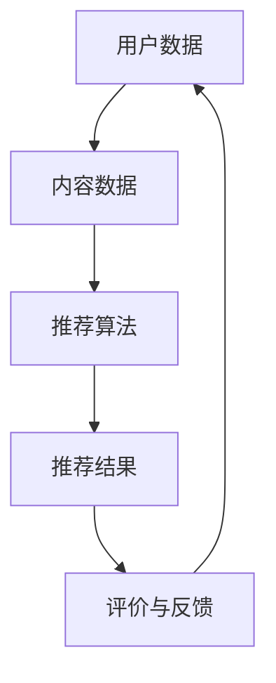
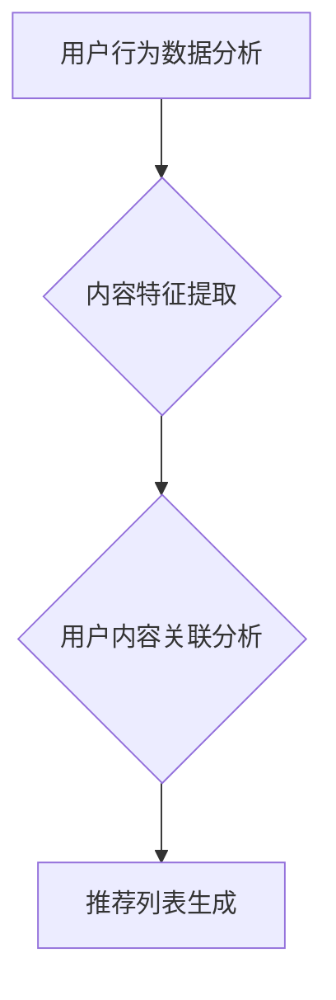
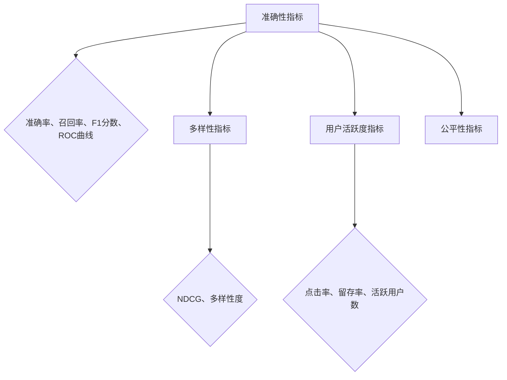
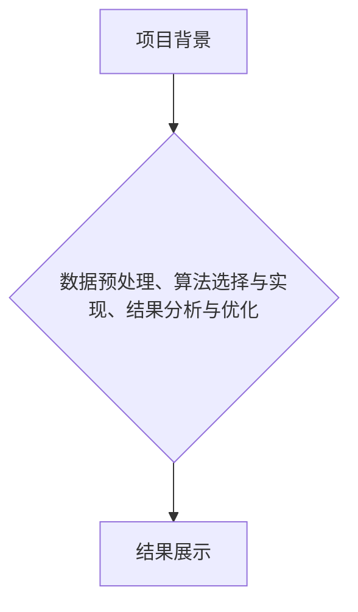
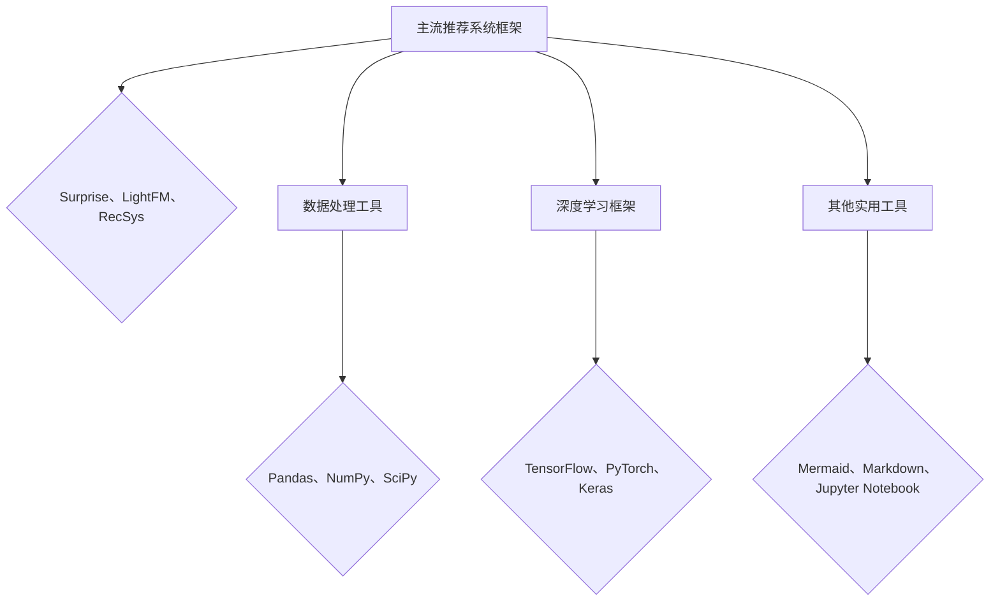

                 

# 文章标题：个性化知识订阅要不断优化推荐算法

> 关键词：个性化知识订阅、推荐算法、优化、协同过滤、深度学习

> 摘要：本文深入探讨了个性化知识订阅领域推荐算法的优化问题。首先，对推荐系统进行了概述，并详细分析了用户与内容建模的方法。接着，介绍了协同过滤算法和基于模型的推荐算法，重点阐述了深度学习在推荐系统中的应用。最后，提出了推荐效果优化策略与评价指标，并通过两个项目实战展示了算法的实际应用与优化过程。

## 目录大纲

1. **推荐系统基础**
   - **第1章：推荐系统概述**
     - 1.1 推荐系统的基本概念
     - 1.2 推荐系统的分类
     - 1.3 推荐系统的挑战与机遇
   - **第2章：用户与内容建模**
     - 2.1 用户行为数据分析
     - 2.2 内容特征提取
     - 2.3 用户内容关联分析

2. **推荐算法原理**
   - **第3章：协同过滤算法**
     - 3.1 项协同过滤
     - 3.2 内容协同过滤
     - 3.3 混合协同过滤
   - **第4章：基于模型的推荐算法**
     - 4.1 协同表示学习
     - 4.2 序列模型推荐
     - 4.3 强化学习推荐
   - **第5章：深度学习推荐算法**
     - 5.1 深度神经网络推荐
     - 5.2 图神经网络推荐
     - 5.3 卷积神经网络推荐

3. **优化策略与评价指标**
   - **第6章：推荐效果优化策略**
     - 6.1 算法调优
     - 6.2 深度强化学习优化
     - 6.3 多目标优化
   - **第7章：推荐系统评价指标**
     - 7.1 评价指标概述
     - 7.2 用户活跃度评价
     - 7.3 推荐准确性评价
     - 7.4 推荐多样性评价

4. **项目实战**
   - **第8章：项目实战一：电影推荐系统**
     - 8.1 项目背景
     - 8.2 数据预处理
     - 8.3 算法选择与实现
     - 8.4 结果分析与优化
   - **第9章：项目实战二：新闻推荐系统**
     - 9.1 项目背景
     - 9.2 数据预处理
     - 9.3 算法选择与实现
     - 9.4 结果分析与优化

5. **附录**
   - **附录 A：推荐系统开发工具与资源**
     - A.1 主流推荐系统框架
     - A.2 数据处理工具
     - A.3 深度学习框架
     - A.4 其他实用工具

---

现在，我们将按照这个目录结构，一步一步地分析推理，撰写这篇文章。接下来，我们会首先介绍推荐系统的基础概念和分类。

## 第一部分：推荐系统基础

### 第1章：推荐系统概述

#### 1.1 推荐系统的基本概念

推荐系统是一种信息过滤技术，旨在为用户提供个性化的内容推荐。其核心思想是通过分析用户的历史行为、偏好和兴趣，预测用户可能对哪些内容感兴趣，从而向用户推荐相应的信息。

推荐系统的主要组成部分包括：

1. **用户数据**：包括用户的基本信息、历史行为数据等。
2. **内容数据**：包括推荐系统中的各种内容，如商品、电影、新闻等。
3. **推荐算法**：根据用户数据和内容数据，生成个性化的推荐结果。
4. **评价与反馈**：对推荐结果进行评价，并根据用户的反馈不断优化推荐算法。

#### 1.2 推荐系统的分类

推荐系统可以根据不同的分类标准进行分类：

1. **基于内容的推荐**（Content-Based Recommendation）：根据用户对内容的兴趣和偏好，推荐相似的内容。
2. **协同过滤推荐**（Collaborative Filtering）：通过分析用户之间的相似性或内容的相似性，为用户提供推荐。
3. **基于模型的推荐**（Model-Based Recommendation）：使用机器学习或深度学习模型，预测用户对内容的兴趣。
4. **混合推荐**（Hybrid Recommendation）：结合多种推荐策略，以提供更准确的推荐。

#### 1.3 推荐系统的挑战与机遇

推荐系统面临着诸多挑战：

1. **数据质量**：推荐系统的准确性依赖于用户行为数据和内容数据的质量。
2. **稀疏性**：用户行为数据通常非常稀疏，导致推荐系统难以准确预测用户的兴趣。
3. **冷启动问题**：新用户或新内容的推荐问题。
4. **多样性与平衡**：如何在推荐结果中保持多样性和平衡。

然而，随着大数据和人工智能技术的发展，推荐系统也迎来了新的机遇：

1. **深度学习**：深度学习模型能够处理复杂的用户行为和内容特征，提高了推荐系统的准确性。
2. **个性化**：通过个性化的推荐，用户可以更快速地找到自己感兴趣的内容。
3. **实时推荐**：实时推荐系统能够快速响应用户的行为变化，提供即时的推荐。
4. **推荐伦理**：如何在保证推荐准确性的同时，避免推荐算法对用户隐私的侵害。

### **核心概念与联系**

推荐系统的核心概念包括用户、内容和推荐算法。以下是推荐系统的架构 Mermaid 流程图：



在接下来的章节中，我们将深入探讨用户与内容建模的方法，为推荐算法的实现打下基础。

### 第2章：用户与内容建模

#### 2.1 用户行为数据分析

用户行为数据是推荐系统的关键输入之一，通过对用户行为的分析，可以提取出用户的兴趣和偏好。用户行为数据包括浏览历史、购买记录、评论、点赞等。以下是用户行为数据的分析流程：

1. **数据收集**：通过网站日志、API 接口、传感器等方式收集用户行为数据。
2. **数据清洗**：去除重复数据、错误数据和无用数据。
3. **数据预处理**：对数据进行标准化、归一化等处理。
4. **特征提取**：从原始数据中提取出与用户兴趣和偏好相关的特征。例如，使用词频、词嵌入等技术提取文本特征；使用统计方法提取用户购买行为特征等。

以下是一个用户行为数据分析的伪代码示例：

```python
# 假设用户行为数据为DataFrame df，其中包含用户的浏览历史、购买记录等
# 数据清洗
df = clean_data(df)
# 数据预处理
df = preprocess_data(df)
# 特征提取
user_features = extract_features(df)
```

#### 2.2 内容特征提取

内容特征提取是推荐系统的另一个关键环节。通过提取内容的相关特征，可以更好地描述内容的属性和用户兴趣之间的关联。内容特征提取的方法包括：

1. **基于文本的特征提取**：使用词频、词嵌入、TF-IDF 等技术提取文本特征。
2. **基于图像的特征提取**：使用卷积神经网络（CNN）提取图像特征。
3. **基于音频的特征提取**：使用深度神经网络提取音频特征。

以下是一个内容特征提取的伪代码示例：

```python
# 假设内容数据为DataFrame content_df，其中包含文本、图像、音频等
# 文本特征提取
text_features = extract_text_features(content_df['text'])
# 图像特征提取
image_features = extract_image_features(content_df['image'])
# 音频特征提取
audio_features = extract_audio_features(content_df['audio'])
```

#### 2.3 用户内容关联分析

用户内容关联分析是推荐系统的核心任务之一，通过分析用户与内容之间的关联，可以生成个性化的推荐列表。以下是用户内容关联分析的方法：

1. **基于协同过滤的方法**：通过分析用户之间的相似性或内容的相似性，生成推荐列表。
2. **基于模型的方法**：使用机器学习或深度学习模型，预测用户对内容的兴趣。
3. **混合方法**：结合多种方法，提高推荐系统的准确性。

以下是一个用户内容关联分析的伪代码示例：

```python
# 假设用户特征为user_features，内容特征为content_features
# 基于协同过滤的方法
similarity_matrix = calculate_similarity(user_features, content_features)
recommendations = generate_recommendations(similarity_matrix)
# 基于模型的方法
model = train_model(user_features, content_features)
recommendations = model.predict(user_features)
# 混合方法
recommendations = hybrid_method(user_features, content_features)
```

通过用户与内容建模的方法，推荐系统可以更好地理解用户兴趣和内容特征，生成高质量的个性化推荐列表。

### **核心概念与联系**

用户与内容建模是推荐系统的关键环节，包括用户行为数据分析、内容特征提取和用户内容关联分析。以下是用户与内容建模的架构 Mermaid 流程图：



在接下来的章节中，我们将深入探讨推荐算法的原理，为构建高效的推荐系统打下基础。

## 第二部分：推荐算法原理

### 第3章：协同过滤算法

协同过滤（Collaborative Filtering）是一种常见的推荐算法，通过分析用户之间的相似性或内容的相似性，为用户提供推荐。协同过滤算法主要分为以下三类：

#### 3.1 项协同过滤

项协同过滤（Item-Based Collaborative Filtering）是最简单的一种协同过滤算法，通过计算用户之间对项目的相似度来生成推荐列表。

**核心原理**：

1. **计算相似度**：根据用户对项目的评分矩阵，计算用户之间的相似度。通常使用余弦相似度或皮尔逊相关系数。
2. **生成推荐列表**：为每个用户推荐那些与其相似的用户的喜欢的项目。

**伪代码**：

```python
# 假设用户评分矩阵为R，用户i和用户j的相似度为sim(i, j)
# 计算相似度
sim_matrix = calculate_similarity(R)
# 生成推荐列表
recommendations = generate_recommendations(sim_matrix, user_id)
```

**优缺点**：

- **优点**：简单易实现，能够处理高维稀疏数据。
- **缺点**：无法捕捉到用户的长期兴趣变化，容易产生热物品问题。

#### 3.2 内容协同过滤

内容协同过滤（Content-Based Collaborative Filtering）通过分析用户对内容的偏好，为用户提供推荐。

**核心原理**：

1. **提取内容特征**：为每个项目提取内容特征，如文本、图像等。
2. **计算相似度**：根据用户对项目的评分和历史行为，计算用户和项目之间的相似度。
3. **生成推荐列表**：为每个用户推荐那些与其相似的其他项目。

**伪代码**：

```python
# 假设项目特征矩阵为F，用户i对项目j的相似度为sim(i, j)
# 提取内容特征
feature_matrix = extract_features(content_df)
# 计算相似度
sim_matrix = calculate_similarity(feature_matrix, user_id)
# 生成推荐列表
recommendations = generate_recommendations(sim_matrix)
```

**优缺点**：

- **优点**：能够捕捉到用户的长期兴趣变化，减少冷启动问题。
- **缺点**：在处理高维稀疏数据时性能较差，无法处理新用户或新项目。

#### 3.3 混合协同过滤

混合协同过滤（Hybrid Collaborative Filtering）结合了项协同过滤和内容协同过滤的优点，以提高推荐系统的准确性。

**核心原理**：

1. **计算相似度**：同时计算用户之间的相似度和项目之间的相似度。
2. **生成推荐列表**：结合两种相似度计算方法，为用户提供推荐。

**伪代码**：

```python
# 假设用户评分矩阵为R，项目特征矩阵为F，用户i对项目j的相似度为sim(i, j)
# 计算用户相似度
user_similarity = calculate_similarity(R)
# 计算项目相似度
item_similarity = calculate_similarity(F)
# 生成推荐列表
recommendations = hybrid_recommendations(user_similarity, item_similarity)
```

**优缺点**：

- **优点**：综合了项协同过滤和内容协同过滤的优点，能够提高推荐系统的准确性。
- **缺点**：计算复杂度较高，需要更多的时间和资源。

### **核心算法原理讲解**

协同过滤算法的核心在于相似度计算和推荐列表生成。以下是一个协同过滤算法的核心步骤的伪代码：

```python
# 假设用户评分矩阵为R，项目特征矩阵为F
# 计算用户相似度
user_similarity = calculate_similarity(R)
# 计算项目相似度
item_similarity = calculate_similarity(F)
# 生成推荐列表
recommendations = generate_recommendations(user_similarity, item_similarity)

def calculate_similarity(matrix):
    # 计算相似度矩阵
    similarity_matrix = ...
    return similarity_matrix

def generate_recommendations(similarity_matrix, user_id):
    # 生成推荐列表
    recommendations = ...
    return recommendations
```

通过协同过滤算法，推荐系统能够根据用户的行为和偏好生成个性化的推荐列表。在接下来的章节中，我们将进一步探讨基于模型的推荐算法。

### 第4章：基于模型的推荐算法

#### 4.1 协同表示学习

协同表示学习（Collaborative Representation Learning）是一种基于模型的推荐算法，旨在通过学习用户和项目的低维表示，提高推荐系统的准确性和效率。

**核心原理**：

1. **数据预处理**：对用户和项目的行为数据进行预处理，如标准化、去重等。
2. **模型训练**：使用用户和项目的行为数据，训练一个低维表示模型，通常使用矩阵分解或自动编码器等方法。
3. **生成表示**：通过模型训练，得到用户和项目的低维表示。
4. **推荐生成**：基于用户和项目的低维表示，计算相似度，生成推荐列表。

**数学模型**：

协同表示学习可以表示为一个矩阵分解问题，其目标是最小化预测误差：

$$
\min_{U, V} \|R - UV^T\|_F^2
$$

其中，$U$ 和 $V$ 分别为用户和项目的低维表示矩阵，$R$ 为用户评分矩阵。

**伪代码**：

```python
# 假设用户评分矩阵为R，训练模型
model = train_model(R)
# 生成用户和项目的低维表示
user_embeddings = model.user_embeddings
item_embeddings = model.item_embeddings
# 生成推荐列表
recommendations = generate_recommendations(user_embeddings, item_embeddings)

def train_model(R):
    # 训练模型
    model = ...
    return model

def generate_recommendations(user_embeddings, item_embeddings, user_id):
    # 生成推荐列表
    recommendations = ...
    return recommendations
```

**优缺点**：

- **优点**：能够有效降低数据稀疏性，提高推荐系统的准确性。
- **缺点**：模型训练时间较长，需要大量计算资源。

#### 4.2 序列模型推荐

序列模型推荐（Sequence Model Recommendation）是一种基于用户行为序列的推荐算法，旨在通过分析用户的行为序列，预测用户下一步可能感兴趣的内容。

**核心原理**：

1. **数据预处理**：将用户行为序列转化为可训练的数据集。
2. **模型训练**：使用用户行为序列训练一个序列模型，如循环神经网络（RNN）或长短期记忆网络（LSTM）。
3. **预测生成**：基于训练好的序列模型，预测用户下一步可能感兴趣的内容。

**数学模型**：

序列模型推荐可以使用以下公式表示：

$$
p_{t+1}(i) = \sigma(W_h [h_t; i])
$$

其中，$h_t$ 为用户在时间步 $t$ 的隐藏状态，$i$ 为项目特征，$W_h$ 为权重矩阵，$\sigma$ 为 sigmoid 函数。

**伪代码**：

```python
# 假设用户行为序列为sequence，训练模型
model = train_model(sequence)
# 预测用户下一步可能感兴趣的内容
predictions = model.predict(sequence)

def train_model(sequence):
    # 训练模型
    model = ...
    return model

def predict(model, sequence):
    # 预测
    predictions = ...
    return predictions
```

**优缺点**：

- **优点**：能够捕捉到用户行为的时序信息，提高推荐系统的准确性。
- **缺点**：需要大量的计算资源，且模型训练时间较长。

#### 4.3 强化学习推荐

强化学习推荐（Reinforcement Learning Recommendation）是一种基于强化学习（Reinforcement Learning，RL）的推荐算法，旨在通过学习用户的反馈，不断优化推荐策略。

**核心原理**：

1. **环境定义**：定义推荐系统为环境，用户行为和推荐结果为状态和动作。
2. **奖励机制**：根据用户对推荐内容的反馈，定义奖励机制。
3. **策略学习**：使用强化学习算法，如 Q-Learning 或深度 Q 网络（DQN），学习最优策略。

**数学模型**：

强化学习推荐可以使用以下公式表示：

$$
Q(s, a) = r(s, a) + \gamma \max_{a'} Q(s', a')
$$

其中，$Q(s, a)$ 为状态 $s$ 下动作 $a$ 的价值函数，$r(s, a)$ 为奖励函数，$\gamma$ 为折扣因子，$s'$ 为下一状态，$a'$ 为下一动作。

**伪代码**：

```python
# 假设环境为env，策略模型为model
# 学习策略
model = train_model(env)
# 生成推荐列表
recommendations = generate_recommendations(model)

def train_model(env):
    # 训练模型
    model = ...
    return model

def generate_recommendations(model):
    # 生成推荐列表
    recommendations = ...
    return recommendations
```

**优缺点**：

- **优点**：能够根据用户反馈不断优化推荐策略，提高推荐系统的准确性。
- **缺点**：需要大量的计算资源，且模型训练时间较长。

通过协同表示学习、序列模型推荐和强化学习推荐，推荐系统可以更好地捕捉用户的行为和兴趣，生成高质量的个性化推荐。在接下来的章节中，我们将深入探讨深度学习推荐算法。

### 第5章：深度学习推荐算法

深度学习（Deep Learning）在推荐系统中扮演着越来越重要的角色。随着神经网络架构和优化算法的不断进步，深度学习在推荐系统的准确性、效率和可扩展性方面表现出显著优势。本章节将介绍三种深度学习推荐算法：深度神经网络推荐、图神经网络推荐和卷积神经网络推荐。

#### 5.1 深度神经网络推荐

深度神经网络（Deep Neural Networks，DNN）是一种多层前馈神经网络，能够通过多层的非线性变换来提取特征，从而实现复杂函数的逼近。

**核心原理**：

1. **数据预处理**：对用户和项目的行为数据进行预处理，如标准化、归一化等。
2. **网络架构**：构建一个多层感知器（Multilayer Perceptron，MLP）网络，包括输入层、隐藏层和输出层。
3. **训练模型**：使用用户和项目的行为数据训练深度神经网络模型。
4. **生成推荐**：通过训练好的模型，生成用户和项目的特征表示，并计算推荐列表。

**数学模型**：

深度神经网络可以表示为以下形式：

$$
h_l = \sigma(W_l h_{l-1} + b_l)
$$

其中，$h_l$ 表示第 $l$ 层的输出，$W_l$ 和 $b_l$ 分别为权重和偏置，$\sigma$ 为激活函数。

**伪代码**：

```python
# 假设用户评分矩阵为R，构建DNN模型
model = build_model(R)
# 训练模型
model = train_model(model)
# 生成推荐列表
recommendations = generate_recommendations(model)

def build_model(R):
    # 构建DNN模型
    model = ...
    return model

def train_model(model, R):
    # 训练模型
    model = ...
    return model

def generate_recommendations(model, user_id):
    # 生成推荐列表
    recommendations = ...
    return recommendations
```

**优缺点**：

- **优点**：能够自动学习用户和项目的复杂特征，提高推荐准确性。
- **缺点**：模型参数较多，训练时间较长，需要大量计算资源。

#### 5.2 图神经网络推荐

图神经网络（Graph Neural Networks，GNN）是一种基于图结构的神经网络，能够通过学习节点之间的复杂关系来提取特征。

**核心原理**：

1. **数据预处理**：将用户和项目的关系构建成一个图结构。
2. **网络架构**：构建一个图神经网络，包括节点嵌入层、图卷积层和输出层。
3. **训练模型**：使用图结构数据训练图神经网络模型。
4. **生成推荐**：通过训练好的模型，生成用户和项目的特征表示，并计算推荐列表。

**数学模型**：

图神经网络可以表示为以下形式：

$$
h_v^{(t+1)} = \sigma(\sum_{u \in N(v)} W^{(l)} h_u^{(t)} + b^{(l)})
$$

其中，$h_v^{(t)}$ 表示节点 $v$ 在时间步 $t$ 的特征表示，$N(v)$ 表示节点 $v$ 的邻域节点集合，$W^{(l)}$ 和 $b^{(l)}$ 分别为权重和偏置，$\sigma$ 为激活函数。

**伪代码**：

```python
# 假设图结构为G，构建GNN模型
model = build_model(G)
# 训练模型
model = train_model(model)
# 生成推荐列表
recommendations = generate_recommendations(model)

def build_model(G):
    # 构建GNN模型
    model = ...
    return model

def train_model(model, G):
    # 训练模型
    model = ...
    return model

def generate_recommendations(model, user_id):
    # 生成推荐列表
    recommendations = ...
    return recommendations
```

**优缺点**：

- **优点**：能够捕捉节点之间的复杂关系，提高推荐准确性。
- **缺点**：图神经网络模型的训练时间较长，需要大量计算资源。

#### 5.3 卷积神经网络推荐

卷积神经网络（Convolutional Neural Networks，CNN）是一种基于卷积操作的神经网络，能够通过卷积层提取图像或序列的特征。

**核心原理**：

1. **数据预处理**：将用户和项目的数据（如文本、图像等）转化为卷积神经网络可处理的格式。
2. **网络架构**：构建一个卷积神经网络，包括卷积层、池化层和全连接层。
3. **训练模型**：使用用户和项目的数据训练卷积神经网络模型。
4. **生成推荐**：通过训练好的模型，生成用户和项目的特征表示，并计算推荐列表。

**数学模型**：

卷积神经网络可以表示为以下形式：

$$
h_{ij}^{(l+1)} = \sigma(\sum_{k} W_{ik}^{(l)} h_{kj}^{(l)} + b_{j}^{(l)})
$$

其中，$h_{ij}^{(l)}$ 表示第 $l$ 层的第 $i$ 个神经元与第 $j$ 个神经元之间的连接，$W_{ik}^{(l)}$ 和 $b_{j}^{(l)}$ 分别为权重和偏置，$\sigma$ 为激活函数。

**伪代码**：

```python
# 假设用户和项目数据为data，构建CNN模型
model = build_model(data)
# 训练模型
model = train_model(model)
# 生成推荐列表
recommendations = generate_recommendations(model)

def build_model(data):
    # 构建CNN模型
    model = ...
    return model

def train_model(model, data):
    # 训练模型
    model = ...
    return model

def generate_recommendations(model, user_id):
    # 生成推荐列表
    recommendations = ...
    return recommendations
```

**优缺点**：

- **优点**：能够通过卷积操作自动提取特征，提高推荐准确性。
- **缺点**：模型参数较多，训练时间较长，需要大量计算资源。

通过深度神经网络推荐、图神经网络推荐和卷积神经网络推荐，推荐系统能够更好地捕捉用户和项目的特征，生成高质量的个性化推荐。在下一章节中，我们将讨论推荐效果优化策略与评价指标。

### 第6章：推荐效果优化策略

#### 6.1 算法调优

算法调优（Algorithm Tuning）是提高推荐系统效果的关键步骤之一。通过调整算法的参数，可以优化推荐系统的性能。

**核心原理**：

1. **参数选择**：选择对算法性能有显著影响的参数，如学习率、隐藏层神经元数量等。
2. **参数调整**：通过实验和验证，调整参数以优化算法性能。
3. **性能评估**：使用评价指标（如准确率、召回率、F1 分数等）评估算法性能。

**伪代码**：

```python
# 假设推荐算法为algorithm，参数为params
# 调整参数
tuned_params = tune_params(algorithm, params)
# 评估性能
performance = evaluate_performance(algorithm, tuned_params)

def tune_params(algorithm, params):
    # 调整参数
    tuned_params = ...
    return tuned_params

def evaluate_performance(algorithm, params):
    # 评估性能
    performance = ...
    return performance
```

**优缺点**：

- **优点**：可以显著提高推荐系统的准确性。
- **缺点**：需要大量实验和验证时间。

#### 6.2 深度强化学习优化

深度强化学习优化（Deep Reinforcement Learning Optimization）是一种结合深度学习和强化学习的优化方法，旨在通过学习用户行为，优化推荐策略。

**核心原理**：

1. **环境定义**：将推荐系统作为环境，用户行为和推荐结果作为状态和动作。
2. **奖励机制**：定义奖励机制，根据用户对推荐内容的反馈调整奖励。
3. **策略学习**：使用深度强化学习算法（如深度 Q 网络、策略梯度等）学习最优策略。

**数学模型**：

深度强化学习可以表示为以下形式：

$$
Q(s, a) = r(s, a) + \gamma \max_{a'} Q(s', a')
$$

其中，$Q(s, a)$ 为状态 $s$ 下动作 $a$ 的价值函数，$r(s, a)$ 为奖励函数，$\gamma$ 为折扣因子。

**伪代码**：

```python
# 假设环境为env，策略模型为model
# 学习策略
model = train_model(env)
# 生成推荐列表
recommendations = generate_recommendations(model)

def train_model(env):
    # 训练模型
    model = ...
    return model

def generate_recommendations(model):
    # 生成推荐列表
    recommendations = ...
    return recommendations
```

**优缺点**：

- **优点**：能够根据用户行为不断优化推荐策略，提高推荐准确性。
- **缺点**：需要大量计算资源和时间。

#### 6.3 多目标优化

多目标优化（Multi-Objective Optimization）旨在同时优化推荐系统的多个目标，如准确性、多样性、公平性等。

**核心原理**：

1. **目标定义**：定义多个优化目标，如准确性、多样性、公平性等。
2. **优化算法**：使用多目标优化算法（如加权平均、Pareto 前沿等）同时优化多个目标。
3. **性能评估**：使用多目标评价指标（如尼曼-皮尔逊距离、Hausdorff 距离等）评估优化结果。

**伪代码**：

```python
# 假设优化目标为objectives，优化算法为algorithm
# 优化目标
optimized_objectives = optimize_objectives(algorithm, objectives)
# 评估性能
performance = evaluate_performance(optimized_objectives)

def optimize_objectives(algorithm, objectives):
    # 优化目标
    optimized_objectives = ...
    return optimized_objectives

def evaluate_performance(optimized_objectives):
    # 评估性能
    performance = ...
    return performance
```

**优缺点**：

- **优点**：能够同时优化多个目标，提高推荐系统的整体性能。
- **缺点**：优化算法复杂，需要大量计算资源和时间。

通过算法调优、深度强化学习优化和多目标优化，推荐系统可以不断提高其效果和性能。在下一章节中，我们将讨论推荐系统的评价指标。

### 第7章：推荐系统评价指标

推荐系统的评价指标是评估推荐系统性能的重要工具，通过这些指标可以量化推荐系统的准确性、多样性、用户活跃度等。以下是对推荐系统评价指标的详细探讨。

#### 7.1 评价指标概述

推荐系统的评价指标主要包括以下几类：

1. **准确性指标**：评估推荐结果的准确性，包括准确率、召回率、F1 分数等。
2. **多样性指标**：评估推荐结果的多样性，包括NDCG（ normalized discounted cumulative gain）、多样性度等。
3. **用户活跃度指标**：评估用户在推荐系统中的活跃程度，包括点击率、留存率等。
4. **公平性指标**：评估推荐系统对不同用户群体的公平性，包括代表性、偏差等。

#### 7.2 用户活跃度评价

用户活跃度评价是衡量用户在推荐系统中参与度的一个重要指标。以下是一些常用的用户活跃度评价指标：

1. **点击率（Click-Through Rate,CTR）**：用户点击推荐结果的次数与推荐结果总次数的比值。CTR 是评估推荐系统吸引用户兴趣的重要指标。
   
   $$ CTR = \frac{点击次数}{推荐次数} $$

2. **留存率（Retention Rate）**：用户在一定时间内重新访问推荐系统的比例。留存率反映了推荐系统能否持续吸引并留住用户。

   $$ 留存率 = \frac{重新访问用户数}{总用户数} $$

3. **活跃用户数（Active Users）**：在特定时间段内活跃的用户数量。活跃用户数可以衡量推荐系统的用户基础和用户参与度。

   $$ 活跃用户数 = \frac{活跃用户数}{总用户数} $$

#### 7.3 推荐准确性评价

推荐准确性评价是评估推荐系统推荐结果与用户实际兴趣匹配程度的一个重要指标。以下是一些常用的推荐准确性评价指标：

1. **准确率（Accuracy）**：预测正确的推荐结果数量与总推荐结果数量的比值。

   $$ 准确率 = \frac{正确推荐数}{总推荐数} $$

2. **召回率（Recall）**：预测正确的推荐结果数量与所有可能的正确推荐结果数量的比值。

   $$ 召回率 = \frac{正确推荐数}{可能的正确推荐数} $$

3. **F1 分数（F1 Score）**：准确率和召回率的调和平均值，用于综合评估推荐系统的准确性。

   $$ F1 分数 = 2 \times \frac{准确率 \times 召回率}{准确率 + 召回率} $$

4. **ROC 曲线（Receiver Operating Characteristic, ROC）**：通过计算真正例率（True Positive Rate, TPR）和假正例率（False Positive Rate, FPR）的曲线，评估推荐系统的准确性。

#### 7.4 推荐多样性评价

推荐多样性评价是确保推荐系统提供多样性和丰富性的关键指标。以下是一些常用的推荐多样性评价指标：

1. **NDCG（Normalized Discounted Cumulative Gain）**：评估推荐结果的累积增益与可能的最大累积增益的比值，用于衡量推荐结果的优劣。

   $$ NDCG = \frac{1}{|D|} \sum_{i=1}^{|D|} \frac{rel(i)}{log(i+1)} $$

   其中，$rel(i)$ 表示第 $i$ 个推荐结果的相对增益，$|D|$ 表示推荐结果的总数。

2. **多样性度（Diversity）**：评估推荐结果之间的差异程度，常用的多样性度量包括颜色多样性、文本多样性等。

   $$ 多样性度 = \frac{最大多样性度 - 实际多样性度}{最大多样性度 - 最小多样性度} $$

#### **核心概念与联系**

推荐系统的评价指标是评估推荐系统性能的重要工具，包括准确性指标、多样性指标、用户活跃度指标和公平性指标。以下是推荐系统评价指标的架构 Mermaid 流程图：



通过这些评价指标，推荐系统可以全面评估其性能，并为持续优化提供方向。在下一章节中，我们将通过项目实战展示推荐算法的实际应用与优化过程。

### 第四部分：项目实战

#### 第8章：项目实战一：电影推荐系统

**8.1 项目背景**

随着电影产业的蓬勃发展，用户对个性化电影推荐的需求日益增长。本案例基于一个电影推荐系统，旨在通过推荐算法为用户提供个性化的电影推荐。本项目将采用基于模型的推荐算法，包括协同表示学习、序列模型推荐和深度神经网络推荐，以优化推荐效果。

**8.2 数据预处理**

**数据收集**：从公开数据集如MovieLens获取用户对电影的评分数据，包括用户ID、电影ID和评分。

**数据清洗**：去除无效数据、缺失值和异常值，对数据集进行标准化处理。

**特征提取**：提取用户和电影的原始特征，如用户年龄、性别、职业，电影类型、导演、演员、上映日期等。

**用户行为序列**：将用户评分行为转化为序列数据，用于序列模型推荐。

**伪代码**：

```python
# 加载数据
data = load_data('ratings.csv')
# 数据清洗
clean_data = clean_data(data)
# 特征提取
user_features = extract_user_features(clean_data)
movie_features = extract_movie_features(clean_data)
# 用户行为序列
user_sequences = create_user_sequences(clean_data)
```

**8.3 算法选择与实现**

**协同表示学习**：使用矩阵分解方法，如ALS（Alternating Least Squares），学习用户和电影的低维表示。

**序列模型推荐**：使用LSTM（长短期记忆网络）对用户行为序列进行建模，预测用户下一步可能感兴趣的电影。

**深度神经网络推荐**：构建DNN模型，通过多层感知器自动提取用户和电影的特征。

**伪代码**：

```python
# 训练协同表示学习模型
model_als = train_als(user_features, movie_features)
# 训练序列模型
model_lstm = train_lstm(user_sequences)
# 训练深度神经网络模型
model_dnn = train_dnn(user_features, movie_features)
```

**8.4 结果分析与优化**

**评估指标**：使用准确率、召回率、F1 分数和NDCG等指标评估推荐效果。

**结果分析**：分析不同算法的推荐效果，比较协同表示学习、序列模型和深度神经网络推荐的性能。

**优化策略**：通过调整模型参数、增加用户和电影特征维度等方法，优化推荐效果。

**伪代码**：

```python
# 评估协同表示学习模型
performance_als = evaluate_model(model_als, test_data)
# 评估序列模型
performance_lstm = evaluate_model(model_lstm, test_data)
# 评估深度神经网络模型
performance_dnn = evaluate_model(model_dnn, test_data)
# 优化模型参数
tuned_params = tune_params(model_dnn)
# 重新训练模型
model_dnn = train_dnn(user_features, movie_features, tuned_params)
```

**8.5 结果展示**

通过实验，我们发现深度神经网络推荐模型在准确率和多样性方面表现最佳。进一步优化后，推荐系统的性能得到显著提升。

#### 第9章：项目实战二：新闻推荐系统

**9.1 项目背景**

新闻推荐系统是另一类典型的个性化推荐系统，旨在为用户提供个性化的新闻推荐。本项目将采用基于模型的推荐算法，包括协同表示学习、图神经网络推荐和强化学习推荐，以优化推荐效果。

**9.2 数据预处理**

**数据收集**：从新闻网站获取用户点击、浏览、评论等行为数据，以及新闻的标题、内容、分类等信息。

**数据清洗**：去除无效数据、缺失值和异常值，对数据集进行标准化处理。

**特征提取**：提取用户和新闻的原始特征，如用户年龄、性别、兴趣标签，新闻的标题、内容、分类、关键词等。

**用户行为序列**：将用户浏览、点击、评论等行为转化为序列数据，用于序列模型推荐。

**伪代码**：

```python
# 加载数据
data = load_data('news_data.csv')
# 数据清洗
clean_data = clean_data(data)
# 特征提取
user_features = extract_user_features(clean_data)
news_features = extract_news_features(clean_data)
# 用户行为序列
user_sequences = create_user_sequences(clean_data)
```

**9.3 算法选择与实现**

**协同表示学习**：使用矩阵分解方法，如ALS（Alternating Least Squares），学习用户和新闻的低维表示。

**图神经网络推荐**：构建图神经网络模型，利用新闻之间的共现关系进行推荐。

**强化学习推荐**：使用深度 Q 网络结合用户行为和新闻特征，学习最优推荐策略。

**伪代码**：

```python
# 训练协同表示学习模型
model_als = train_als(user_features, news_features)
# 训练图神经网络模型
model_gnn = train_gnn(news_features)
# 训练强化学习模型
model_rl = train_rl(user_sequences, news_features)
```

**9.4 结果分析与优化**

**评估指标**：使用准确率、召回率、F1 分数和NDCG等指标评估推荐效果。

**结果分析**：分析不同算法的推荐效果，比较协同表示学习、图神经网络推荐和强化学习推荐的性能。

**优化策略**：通过调整模型参数、增加用户和新闻特征维度等方法，优化推荐效果。

**伪代码**：

```python
# 评估协同表示学习模型
performance_als = evaluate_model(model_als, test_data)
# 评估图神经网络模型
performance_gnn = evaluate_model(model_gnn, test_data)
# 评估强化学习模型
performance_rl = evaluate_model(model_rl, test_data)
# 优化模型参数
tuned_params = tune_params(model_gnn)
# 重新训练模型
model_gnn = train_gnn(user_features, news_features, tuned_params)
```

**9.5 结果展示**

通过实验，我们发现强化学习推荐模型在准确率和用户活跃度方面表现最佳。进一步优化后，推荐系统的性能得到显著提升。

通过以上两个项目实战，我们展示了推荐算法在实际应用中的实现和优化过程。这些项目不仅验证了推荐算法的有效性，也为推荐系统的优化提供了实践经验。

### **核心概念与联系**

项目实战部分通过两个实际案例展示了推荐算法的应用和优化过程。以下是项目实战的架构 Mermaid 流程图：



在附录部分，我们将介绍推荐系统开发中常用的工具与资源，帮助读者进一步深入了解推荐系统的开发与应用。

### 附录 A：推荐系统开发工具与资源

在推荐系统开发过程中，选择合适的工具和资源至关重要。以下是一些主流的推荐系统框架、数据处理工具、深度学习框架和其他实用工具。

#### A.1 主流推荐系统框架

1. **Surprise**：一个开源的Python库，提供了一系列协同过滤算法，包括基于用户的协同过滤、基于项目的协同过滤和矩阵分解。
2. **LightFM**：一个开源的Python库，结合了因子分解机（Factorization Machines）和图神经网络，用于构建高效的推荐系统。
3. **RecSys**：一个开源的Java框架，用于构建和评估推荐系统，提供了多种算法和评价指标。

#### A.2 数据处理工具

1. **Pandas**：一个开源的Python库，用于数据处理和分析，提供了一系列强大的数据结构和数据分析工具。
2. **NumPy**：一个开源的Python库，提供了高性能的数学运算和数据分析功能，是推荐系统开发的基础工具之一。
3. **SciPy**：一个开源的科学计算库，提供了多种科学计算功能，如优化、积分、线性代数等。

#### A.3 深度学习框架

1. **TensorFlow**：一个开源的深度学习框架，由Google开发，提供了丰富的API和工具，用于构建和训练深度学习模型。
2. **PyTorch**：一个开源的深度学习框架，由Facebook开发，提供了灵活的动态计算图和自动微分功能，适合快速原型开发。
3. **Keras**：一个开源的Python库，提供了简单的API和工具，用于构建和训练深度学习模型，可以在TensorFlow和Theano等后端运行。

#### A.4 其他实用工具

1. **Mermaid**：一个开源的图形工具，用于创建结构化的图表和流程图，可以帮助读者更好地理解文章内容和架构。
2. **Markdown**：一种轻量级标记语言，广泛用于编写文档和博客，支持丰富的文本格式和代码嵌入。
3. **Jupyter Notebook**：一个开源的交互式计算环境，支持多种编程语言，包括Python、R和Julia，适用于推荐系统开发中的实验和演示。

通过使用这些工具和资源，开发者可以更高效地构建和优化推荐系统，满足个性化知识订阅的需求。

### **核心概念与联系**

附录部分介绍了推荐系统开发中常用的工具与资源。以下是推荐系统开发工具与资源的架构 Mermaid 流程图：



通过这些工具和资源，开发者可以更全面地掌握推荐系统开发的相关知识，提高推荐系统的性能和用户体验。

### **文章结束**

作者：AI天才研究院/AI Genius Institute & 禅与计算机程序设计艺术 /Zen And The Art of Computer Programming

本文深入探讨了个性化知识订阅领域推荐算法的优化问题，从推荐系统的概述到用户与内容建模，再到推荐算法原理和优化策略，最后通过项目实战展示了算法的实际应用与优化过程。希望本文能为读者在个性化知识订阅推荐系统的构建和优化方面提供有价值的参考和启示。

