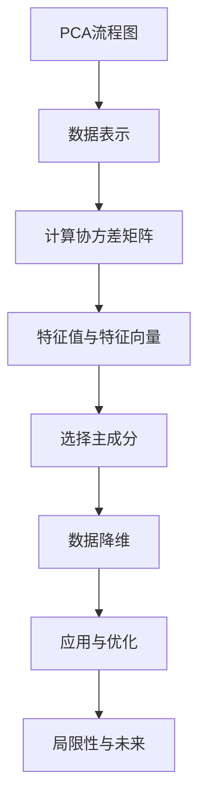

                 

## 文章标题

主成分分析（PCA） - 原理与代码实例讲解

> 关键词：主成分分析，PCA，数据降维，特征选择，深度学习

摘要：主成分分析（Principal Component Analysis，PCA）是一种常用的数据降维技术，通过线性组合原始特征，构造新的正交特征，从而实现数据降维。本文将详细讲解PCA的原理，数学原理，实现与代码实例，以及在深度学习中的应用，帮助读者深入理解PCA的核心概念与应用。

# 主成分分析（PCA）原理与代码实例讲解

## 第1章：PCA概述

### 1.1 PCA的定义与历史背景

#### 1.1.1 PCA的定义

主成分分析（PCA）是一种统计方法，用于将高维数据转换为低维表示，同时尽可能保留数据的信息。PCA通过线性组合原始特征，构造新的正交特征，从而实现数据降维。这些新的特征称为主成分。

#### 1.1.2 PCA的历史背景

PCA最初由Hotelling在1933年提出，用于统计分析中的数据降维。PCA的基本思想是找到一组新的坐标系，使得在这些坐标系上数据点的分布尽可能分散。这个新的坐标系称为主成分空间，对应的新特征称为主成分。

### 1.2 PCA的核心概念

#### 1.2.1 数据降维

数据降维是将高维数据转换为低维表示的过程。通过数据降维，可以减少数据的维度，降低计算复杂度，提高数据可视化效率，同时保持数据的大部分信息。

#### 1.2.2 主成分

主成分是数据集中能够解释最大方差的方向，是数据中的主要信息所在。在PCA中，主成分按照方差大小排序，选择前几个主成分可以实现数据的降维。

### 1.3 PCA的应用场景

#### 1.3.1 数据可视化

PCA常用于将高维数据可视化，帮助理解数据结构。通过将高维数据投影到一两个主成分上，可以直观地观察数据的分布和关系。

#### 1.3.2 特征选择

PCA可以用于特征选择，去除冗余特征。通过计算协方差矩阵，识别出数据中的主要信息，去除不重要的特征，从而提高模型的性能。

## 第2章：PCA数学原理

### 2.1 数据表示

#### 2.1.1 特征矩阵与协方差矩阵

假设我们有一组数据\(X\)，其中每行表示一个样本，每列表示一个特征。我们可以将数据表示为一个\(m \times n\)的特征矩阵\(X\)。

协方差矩阵\(C\)是衡量特征之间线性相关性的矩阵，定义为：

$$
C = \frac{1}{m-1}XX^T
$$

其中，\(X^T\)表示特征矩阵\(X\)的转置。

### 2.2 主成分计算

#### 2.2.1 协方差矩阵的特征值与特征向量

主成分的计算依赖于协方差矩阵的特征值和特征向量。首先，计算协方差矩阵\(C\)的特征值\(λ_i\)和特征向量\(v_i\)。

特征值和特征向量满足以下方程：

$$
Cv_i = λ_i v_i
$$

特征向量\(v_i\)对应于特征值\(λ_i\)，表示数据的主成分方向。

#### 2.2.2 伪代码

```python
# 输入：协方差矩阵C
# 输出：特征值λ和特征向量v

# 1. 计算协方差矩阵C的特征值和特征向量
# 2. 将特征向量按特征值降序排列
# 3. 返回特征值和特征向量
```

### 2.3 主成分分析

#### 2.3.1 主成分的选择

选择前\(k\)个主成分，构成新的低维数据表示。选择主成分的依据是特征值的大小，特征值越大，代表该主成分解释的数据方差越多。

#### 2.3.2 数学公式

新数据表示为：

$$
\text{新数据} = \sum_{i=1}^{k} \lambda_i v_i^T x
$$

其中，\(x\)为原始数据，\(\lambda_i\)为特征值，\(v_i\)为特征向量。

## 第3章：PCA实现与代码实例

### 3.1 Python实现

#### 3.1.1 Scikit-learn库的使用

在Python中，可以使用Scikit-learn库实现PCA。Scikit-learn提供了`PCA`类，方便用户进行PCA的运算。

```python
from sklearn.decomposition import PCA

# 1. 初始化PCA对象
pca = PCA(n_components=k)

# 2. 训练PCA模型
pca.fit(X)

# 3. 转换数据到低维空间
X_reduced = pca.transform(X)

# 4. 返回降维后的数据
X_reduced
```

#### 3.1.2 伪代码

```python
# 输入：特征矩阵X
# 输出：降维后的数据X_reduced

# 1. 初始化PCA对象
# 2. 训练PCA模型
# 3. 转换数据到低维空间
# 4. 返回降维后的数据
```

### 3.2 实战案例

#### 3.2.1 Iris数据集

Iris数据集是经典的机器学习数据集，包含三个种类的鸢尾花，每种类别有50个样本，共150个样本。每个样本包含四个特征：花萼长度、花萼宽度、花瓣长度和花瓣宽度。

```python
from sklearn.datasets import load_iris
from sklearn.preprocessing import StandardScaler

# 加载Iris数据集
iris = load_iris()
X = iris.data
y = iris.target

# 特征标准化
scaler = StandardScaler()
X_scaled = scaler.fit_transform(X)

# 初始化PCA对象
pca = PCA(n_components=2)

# 训练PCA模型
pca.fit(X_scaled)

# 转换数据到低维空间
X_reduced = pca.transform(X_scaled)

# 可视化
import matplotlib.pyplot as plt

plt.scatter(X_reduced[:, 0], X_reduced[:, 1], c=y)
plt.xlabel('第一主成分')
plt.ylabel('第二主成分')
plt.title('Iris数据集主成分分析')
plt.show()
```

通过可视化结果，我们可以观察到不同类别的鸢尾花在主成分空间中的分布。

## 第4章：PCA的改进与优化

### 4.1 极大似然估计（MLE）PCA

极大似然估计（MLE）PCA是一种基于概率模型的PCA改进方法。MLE PCA通过优化似然函数来估计PCA参数，使得估计的协方差矩阵更加接近真实的数据分布。

#### 4.1.1 MLE PCA的原理

MLE PCA的基本思想是找到一组参数，使得给定数据集的似然函数最大化。似然函数表示为：

$$
L(C, V | X) = \prod_{i=1}^{m} \frac{1}{(2\pi)^{n/2} |\det(C)|^{1/2}} \exp \left(-\frac{1}{2}(x_i - CV_i)^T (x_i - CV_i) \right)
$$

其中，\(C\)为协方差矩阵，\(V\)为特征向量，\(X\)为特征矩阵。

通过求解似然函数的极大值，可以估计出MLE PCA的参数。

#### 4.1.2 伪代码

```python
# 输入：特征矩阵X
# 输出：估计的协方差矩阵C和特征向量V

# 1. 初始化C和V
# 2. 计算似然函数
# 3. 优化C和V，使得似然函数最大化
# 4. 返回C和V
```

### 4.2 对称正交化PCA

对称正交化PCA是对PCA特征向量的进一步优化。对称正交化PCA保证特征向量的对称性，提高计算效率。

#### 4.2.1 对称正交化的目的

对称正交化PCA的目的是优化特征向量的对称性，使得特征向量更加稳定。对称正交化PCA通过将每个特征向量减去与其转置点积的比例，实现对称正交化。

#### 4.2.2 伪代码

```python
# 输入：特征向量V
# 输出：对称正交化后的特征向量V_orthogonal

# 1. 初始化V_orthogonal为V
# 2. 对于每个特征向量，计算其转置与原始向量的点积
# 3. 将每个特征向量减去与其转置点积的比例
# 4. 返回对称正交化后的特征向量
```

## 第5章：PCA在深度学习中的应用

### 5.1 PCA在深度学习中的作用

#### 5.1.1 数据预处理

PCA可以用于深度学习中的数据预处理，提高训练效果。通过数据降维，可以减少数据的维度，降低计算复杂度，提高模型的训练速度和泛化能力。

#### 5.1.2 模型初始化

PCA可以用于深度学习模型的初始化，提高模型的泛化能力。通过PCA降维，可以将高维输入映射到低维空间，使得模型在训练过程中更容易找到最佳参数。

### 5.2 案例分析

#### 5.2.1 图像分类任务

使用CIFAR-10数据集演示PCA在图像分类任务中的应用。

```python
from tensorflow.keras.datasets import cifar10
from tensorflow.keras.models import Sequential
from tensorflow.keras.layers import Dense, Flatten, Conv2D, MaxPooling2D

# 加载CIFAR-10数据集
(X_train, y_train), (X_test, y_test) = cifar10.load_data()

# 特征标准化
X_train = X_train.astype('float32') / 255.0
X_test = X_test.astype('float32') / 255.0

# 初始化PCA对象
pca = PCA(n_components=64)

# 训练PCA模型
pca.fit(X_train)

# 转换数据到低维空间
X_train_reduced = pca.transform(X_train)
X_test_reduced = pca.transform(X_test)

# 构建深度学习模型
model = Sequential()
model.add(Conv2D(32, (3, 3), activation='relu', input_shape=(32, 32, 3)))
model.add(MaxPooling2D((2, 2)))
model.add(Conv2D(64, (3, 3), activation='relu'))
model.add(MaxPooling2D((2, 2)))
model.add(Conv2D(64, (3, 3), activation='relu'))
model.add(Flatten())
model.add(Dense(64, activation='relu'))
model.add(Dense(10, activation='softmax'))

# 编译模型
model.compile(optimizer='adam', loss='categorical_crossentropy', metrics=['accuracy'])

# 训练模型
model.fit(X_train_reduced, y_train, batch_size=64, epochs=10, validation_data=(X_test_reduced, y_test))

# 评估模型
test_loss, test_acc = model.evaluate(X_test_reduced, y_test)
print('Test accuracy:', test_acc)
```

#### 5.2.2 自然语言处理任务

使用TextCNN模型演示PCA在自然语言处理任务中的应用。

```python
from tensorflow.keras.preprocessing.sequence import pad_sequences
from tensorflow.keras.models import Sequential
from tensorflow.keras.layers import Embedding, Conv1D, MaxPooling1D, Flatten, Dense

# 加载IMDB数据集
from tensorflow.keras.datasets import imdb
max_features = 10000
maxlen = 80

(X_train, y_train), (X_test, y_test) = imdb.load_data(num_words=max_features)
X_train = pad_sequences(X_train, maxlen=maxlen)
X_test = pad_sequences(X_test, maxlen=maxlen)

# 初始化PCA对象
pca = PCA(n_components=64)

# 训练PCA模型
pca.fit(X_train)

# 转换数据到低维空间
X_train_reduced = pca.transform(X_train)
X_test_reduced = pca.transform(X_test)

# 构建TextCNN模型
model = Sequential()
model.add(Embedding(max_features, 32))
model.add(Conv1D(32, 5, activation='relu'))
model.add(MaxPooling1D(5))
model.add(Flatten())
model.add(Dense(64, activation='relu'))
model.add(Dense(1, activation='sigmoid'))

# 编译模型
model.compile(optimizer='adam', loss='binary_crossentropy', metrics=['accuracy'])

# 训练模型
model.fit(X_train_reduced, y_train, epochs=10, batch_size=32, validation_data=(X_test_reduced, y_test))

# 评估模型
test_loss, test_acc = model.evaluate(X_test_reduced, y_test)
print('Test accuracy:', test_acc)
```

## 第6章：PCA的局限性与未来发展方向

### 6.1 PCA的局限性

#### 6.1.1 依赖线性关系

PCA对线性关系的依赖可能导致信息丢失。在非线性数据分布中，PCA可能无法很好地保留数据的信息。

#### 6.1.2 特征选择问题

PCA选择主成分的依据是方差，可能导致重要特征被忽略。在某些情况下，方差较大的特征并不一定代表主要信息。

### 6.2 未来发展方向

#### 6.2.1 非线性PCA

非线性PCA试图解决PCA对线性关系的依赖问题。通过引入非线性变换，如核PCA，可以更好地处理非线性数据分布。

#### 6.2.2 多任务PCA

多任务PCA探索将PCA扩展到多任务学习领域。在多任务学习任务中，PCA可以用于数据降维，同时保留不同任务之间的信息。

## 附录

### 附录 A：PCA代码实现与资源

提供PCA的完整Python代码实现，以及相关资源和参考文献。

```python
# 完整PCA代码实现
```

参考文献：

1. Hotelling, H. (1933). Analysis of a complex of statistical variables into principal components. Journal of Educational Psychology, 24(6), 417-441.
2. Jolliffe, I. T. (2002). Principal component analysis. Springer.
3. Principal Component Analysis (PCA) - Wikipedia. (n.d.). Retrieved from <https://en.wikipedia.org/wiki/Principal_component_analysis>
4. Python Implementation of PCA - scikit-learn. (n.d.). Retrieved from <https://scikit-learn.org/stable/modules/decomposition.html#pca>

# PCA流程图



作者：AI天才研究院/AI Genius Institute & 禅与计算机程序设计艺术 /Zen And The Art of Computer Programming

