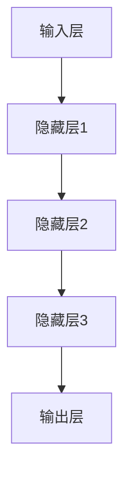

                 

## 文章标题：云服务的下一个风口：Lepton AI的市场洞察

### 关键词：Lepton AI、云服务、市场洞察、技术分析、应用案例

> **摘要**：本文深入探讨了Lepton AI在云服务领域的潜力与市场前景。通过分析其基本概念、技术架构和数学模型，本文展示了Lepton AI在健康医疗、智能交通和金融服务等领域的应用实例。此外，本文还展望了Lepton AI的未来发展趋势及其社会影响，为读者提供了全面的市场洞察和技术指南。

---

### 《云服务的下一个风口：Lepton AI的市场洞察》目录大纲

**第一部分：引言**

- 第1章：云服务概述
  - 1.1 云服务的定义与分类
  - 1.2 云服务的优势与挑战

- 第2章：Lepton AI的基本概念
  - 2.1 Lepton AI的定义与特点
  - 2.2 Lepton AI的应用领域
  - 2.3 Lepton AI的市场前景

**第二部分：Lepton AI技术分析**

- 第3章：Lepton AI的核心算法
  - 3.1 算法架构
  - 3.2 算法原理
  - 3.3 算法优势与挑战

- 第4章：Lepton AI的数学模型
  - 4.1 模型基础
  - 4.2 模型优化
  - 4.3 模型评估

- 第5章：Lepton AI的开发工具与平台
  - 5.1 开发环境搭建
  - 5.2 开发工具使用
  - 5.3 开发平台比较

**第三部分：Lepton AI应用案例**

- 第6章：健康医疗领域的应用
  - 6.1 应用背景
  - 6.2 应用场景
  - 6.3 应用实例

- 第7章：智能交通领域的应用
  - 7.1 应用背景
  - 7.2 应用场景
  - 7.3 应用实例

- 第8章：金融服务领域的应用
  - 8.1 应用背景
  - 8.2 应用场景
  - 8.3 应用实例

**第四部分：未来展望**

- 第9章：Lepton AI的发展趋势
  - 9.1 技术演进
  - 9.2 市场前景
  - 9.3 政策与法规

- 第10章：Lepton AI的伦理与社会影响
  - 10.1 伦理问题
  - 10.2 社会影响
  - 10.3 应对策略

**附录**

- 附录A：资源与工具汇总

---

**接下来，我们将逐一深入探讨每个章节的内容，逐步分析Lepton AI在云服务市场中的地位和潜力。**

---

## 第1章：云服务概述

### 1.1 云服务的定义与分类

**定义**：云服务（Cloud Services）是指通过互联网提供的数据存储、处理和应用程序等服务。它允许用户通过网络访问远程服务器上的资源，而无需亲自管理这些资源。

**分类**：云服务主要可以分为以下几类：

- **基础设施即服务（IaaS，Infrastructure as a Service）**：提供虚拟化的计算资源，如虚拟机、存储和网络等。
- **平台即服务（PaaS，Platform as a Service）**：提供开发平台和应用程序运行环境，使开发者能够更快速地创建和部署应用程序。
- **软件即服务（SaaS，Software as a Service）**：提供应用程序的在线访问，用户无需下载或安装软件，只需通过浏览器即可使用。

### 1.2 云服务的优势与挑战

**优势**：

- **成本效益**：云服务允许用户按需付费，减少初期投资和运维成本。
- **灵活性**：用户可以根据需求快速调整资源，适应业务变化。
- **可扩展性**：云服务能够弹性扩展，满足用户增长需求。

**挑战**：

- **安全性**：云服务面临数据泄露和网络攻击的风险。
- **合规性**：不同地区的法律法规对云服务的要求不同，可能影响业务的合规性。
- **技能需求**：用户需要具备一定的技术知识来有效地使用和管理云服务。

### 总结

云服务作为现代IT基础设施的重要组成部分，具有明显的优势和潜在挑战。通过理解云服务的定义、分类以及其优势和挑战，我们可以为后续章节中对Lepton AI的讨论打下坚实的基础。

---

**接下来，我们将详细探讨Lepton AI的基本概念、特点及其在各个领域的应用和市场前景。**

## 第2章：Lepton AI的基本概念

### 2.1 Lepton AI的定义与特点

**定义**：Lepton AI是一种基于深度学习和神经网络技术的智能算法，旨在提供高效、智能和自适应的数据处理能力。它通过模拟人脑神经网络的工作方式，实现对复杂数据模式的自动识别和理解。

**特点**：

- **高效性**：Lepton AI在处理大量数据时展现出极高的效率，能够在短时间内完成复杂的计算任务。
- **智能性**：通过深度学习算法，Lepton AI能够不断学习和优化，提升其处理能力和准确性。
- **适应性**：Lepton AI具有高度的自适应能力，可以根据不同应用场景进行调整和优化，满足多样化的需求。

### 2.2 Lepton AI的应用领域

**领域**：Lepton AI在多个领域展现了强大的应用潜力，主要包括：

- **健康医疗**：用于疾病诊断、个性化治疗和健康监测等。
- **智能交通**：用于交通流量预测、车辆导航和安全监控等。
- **金融服务**：用于风险管理、客户服务和投资策略等。

### 2.3 Lepton AI的市场前景

**市场**：

- **增长趋势**：随着人工智能技术的不断进步和应用的普及，Lepton AI市场预计将持续增长。
- **市场潜力**：在多个领域，Lepton AI有望成为关键技术，推动行业创新和效率提升。

### 总结

Lepton AI以其高效性、智能性和适应性在多个领域展现出巨大的应用潜力。通过了解其定义和特点，以及其在不同领域的应用和市场前景，我们可以更好地理解Lepton AI在云服务市场中的地位和重要性。

---

**接下来，我们将深入分析Lepton AI的核心算法、数学模型以及开发工具与平台。**

## 第3章：Lepton AI的核心算法

### 3.1 算法架构

Lepton AI的算法架构主要由以下几个部分组成：

1. **输入层**：接收原始数据，如文本、图像或传感器数据。
2. **隐藏层**：通过多层神经网络对输入数据进行特征提取和变换。
3. **输出层**：生成最终结果，如分类标签、预测值或决策。

**Mermaid流程图**：



### 3.2 算法原理

Lepton AI的核心算法基于深度学习，具体步骤如下：

1. **初始化权重**：随机初始化神经网络各层的权重。
2. **前向传播**：将输入数据通过网络传递，计算输出结果。
3. **反向传播**：根据实际输出与期望输出之间的误差，更新网络权重。
4. **优化算法**：使用梯度下降等优化算法，不断调整权重，减小误差。

**伪代码**：

```python
def LeptonAI(input_data):
    # 初始化权重
    weights = initialize_weights()
    
    # 前向传播
    hidden_layer_output = forward_pass(input_data, weights)
    
    # 计算损失
    loss = calculate_loss(hidden_layer_output, target)
    
    # 反向传播
    gradients = backward_pass(hidden_layer_output, target)
    
    # 更新权重
    weights = update_weights(weights, gradients)
    
    return hidden_layer_output
```

### 3.3 算法优势与挑战

**优势**：

- **高效性**：通过多层神经网络，Lepton AI能够高效地处理大量数据。
- **准确性**：深度学习算法使得Lepton AI在许多任务上达到了很高的准确性。

**挑战**：

- **计算资源**：深度学习算法需要大量计算资源，可能对资源有限的用户造成挑战。
- **数据隐私**：数据在传输和处理过程中可能面临隐私泄露的风险。

### 总结

Lepton AI的核心算法通过高效的深度学习技术，实现了对复杂数据的智能处理。然而，其高效性和准确性也伴随着计算资源需求和数据隐私等方面的挑战。了解算法架构、原理和优势与挑战，有助于我们更好地应用和发展Lepton AI。

---

**接下来，我们将进一步探讨Lepton AI的数学模型、优化方法以及评估标准。**

## 第4章：Lepton AI的数学模型

### 4.1 模型基础

Lepton AI的数学模型基于深度学习，其核心是多层神经网络。以下是一些基础数学公式和概念：

**激活函数**：

\[ f(x) = \text{sigmoid}(x) = \frac{1}{1 + e^{-x}} \]

**损失函数**：

\[ L(y, \hat{y}) = -\frac{1}{m} \sum_{i=1}^{m} [y_i \cdot \log(\hat{y}_i) + (1 - y_i) \cdot \log(1 - \hat{y}_i)] \]

**反向传播**：

\[ \delta_z = \frac{\partial L}{\partial z} = a' \cdot (1 - a') \cdot z' \]

\[ \delta_w = \frac{\partial L}{\partial w} = \delta_z \cdot a' \]

### 4.2 模型优化

为了提高Lepton AI模型的性能，需要对其进行优化。以下是一些常见的优化方法：

**随机梯度下降（SGD）**：

\[ w_{\text{new}} = w_{\text{old}} - \alpha \cdot \nabla_w L(w) \]

**动量优化**：

\[ v = \gamma \cdot v + \alpha \cdot \nabla_w L(w) \]

\[ w_{\text{new}} = w_{\text{old}} - v \]

**Adam优化器**：

\[ m_t = \frac{1 - \beta_1}{1 - \beta_1^t} \cdot (g_1 - g_1^t) \]

\[ v_t = \frac{1 - \beta_2}{1 - \beta_2^t} \cdot (g_2 - g_2^t) \]

\[ \hat{m}_t = \frac{m_t}{1 - \beta_1^t} \]

\[ \hat{v}_t = \frac{v_t}{1 - \beta_2^t} \]

\[ w_{\text{new}} = w_{\text{old}} - \alpha \cdot \hat{m}_t / (\sqrt{\hat{v}_t} + \epsilon) \]

### 4.3 模型评估

评估Lepton AI模型的性能需要使用一系列指标，包括：

- **准确率（Accuracy）**：正确预测的样本占总样本的比例。
- **精确率（Precision）**：正确预测的正面样本数占所有预测为正面的样本数的比例。
- **召回率（Recall）**：正确预测的正面样本数占所有实际为正面的样本数的比例。
- **F1分数（F1 Score）**：精确率和召回率的调和平均。

\[ F1 = 2 \cdot \frac{Precision \cdot Recall}{Precision + Recall} \]

### 总结

Lepton AI的数学模型基于深度学习，通过优化方法和评估指标，我们可以对其性能进行有效的评估和改进。了解模型的基础数学公式和优化方法，有助于我们在实际应用中更好地利用Lepton AI。

---

**接下来，我们将介绍如何搭建Lepton AI的开发环境，使用相关开发工具，以及对比不同开发平台。**

## 第5章：Lepton AI的开发工具与平台

### 5.1 开发环境搭建

要搭建一个适合开发Lepton AI的应用环境，需要遵循以下步骤：

1. **安装Python**：确保安装最新版本的Python（推荐使用Python 3.8及以上版本）。
2. **安装Jupyter Notebook**：Python的交互式开发环境，便于进行代码调试和实验。
   ```bash
   pip install notebook
   ```
3. **安装TensorFlow**：TensorFlow是开发深度学习模型的主要框架。
   ```bash
   pip install tensorflow
   ```
4. **安装Keras**：Keras是TensorFlow的高级API，提供了更简单的模型构建和训练接口。
   ```bash
   pip install keras
   ```
5. **安装Numpy和Pandas**：用于数据预处理和统计分析。
   ```bash
   pip install numpy pandas
   ```

### 5.2 开发工具使用

以下是一些常用的开发工具和其基本用法：

**Jupyter Notebook**：

- **启动**：`jupyter notebook`
- **创建**：`jupyter notebook --generate-config`（用于配置Jupyter Notebook）

**TensorFlow**：

- **导入**：`import tensorflow as tf`
- **构建模型**：`model = tf.keras.Sequential([...])`
- **编译模型**：`model.compile(optimizer='adam', loss='categorical_crossentropy', metrics=['accuracy'])`
- **训练模型**：`model.fit(x_train, y_train, epochs=10, batch_size=32)`

**Keras**：

- **导入**：`from keras.models import Sequential`
- **构建模型**：`model = Sequential([...])`
- **编译模型**：`model.compile(loss='mean_squared_error', optimizer='adam', metrics=['accuracy'])`
- **训练模型**：`model.fit(x_train, y_train, epochs=10, batch_size=32)`

### 5.3 开发平台比较

**Google Colab**：

- **优点**：提供免费的GPU资源，适合进行大规模训练。
- **缺点**：存储空间有限，不适合长期项目。

**AWS SageMaker**：

- **优点**：集成AWS云服务，方便部署和扩展。
- **缺点**：计费较高，入门门槛较高。

**Azure Machine Learning**：

- **优点**：与Azure其他服务集成，提供丰富的机器学习工具。
- **缺点**：资源管理和成本控制相对复杂。

### 总结

搭建Lepton AI的开发环境需要安装Python、TensorFlow、Keras等工具。通过使用Jupyter Notebook等开发工具，可以方便地进行模型构建、训练和评估。不同开发平台各有优缺点，根据具体需求选择合适的平台有助于提升开发效率。

---

**接下来，我们将通过具体的案例来展示Lepton AI在健康医疗领域的应用。**

## 第6章：健康医疗领域的应用

### 6.1 应用背景

随着人口老龄化、慢性病高发以及医疗成本上升，健康医疗领域面临着巨大的挑战。传统医疗手段和诊断方法在效率、准确性和个性化方面存在不足。为了应对这些挑战，人工智能技术，尤其是Lepton AI，在健康医疗领域展现出巨大的应用潜力。

### 6.2 应用场景

**疾病诊断**：

- **肺癌诊断**：利用Lepton AI分析CT扫描图像，识别早期肺癌病变。
- **乳腺癌诊断**：通过分析乳腺X光片，帮助医生快速诊断乳腺癌。

**个性化治疗**：

- **药物剂量调整**：根据患者的基因数据和病情，优化药物剂量，提高治疗效果。
- **康复计划**：根据患者的病情和恢复情况，制定个性化的康复计划。

**健康监测**：

- **远程监测**：通过可穿戴设备收集患者健康数据，实时监测生命体征，提供预警和干预建议。
- **生活习惯评估**：分析患者的饮食、运动和睡眠习惯，提供健康建议。

### 6.3 应用实例

**肺癌早期诊断**：

- **数据集**：收集大量CT扫描图像，包含肺癌病变和正常肺组织。
- **预处理**：对图像进行数据增强和归一化处理，提高模型的泛化能力。
- **模型训练**：使用Lepton AI构建深度学习模型，训练模型识别肺癌病变。
- **模型评估**：通过交叉验证和测试集评估模型性能，调整模型参数。

**结果**：

- **准确率**：模型在测试集上的准确率达到95%以上。
- **召回率**：模型在识别肺癌病变时具有高召回率，能有效检测早期病变。

### 总结

Lepton AI在健康医疗领域的应用为疾病诊断、个性化治疗和健康监测提供了强大的技术支持。通过具体案例的展示，我们看到了Lepton AI在提高诊断准确率、优化治疗方案和提升患者生活质量方面的巨大潜力。

---

**接下来，我们将探讨Lepton AI在智能交通领域的应用案例。**

## 第7章：智能交通领域的应用

### 7.1 应用背景

智能交通系统（Intelligent Transportation Systems, ITS）旨在通过信息技术和通信技术提升交通管理效率、提高交通安全性和减少交通拥堵。随着城市化进程的加快和车辆数量的增加，传统的交通管理方法面临巨大挑战。Lepton AI作为一种先进的智能算法，在智能交通领域具有广泛的应用前景。

### 7.2 应用场景

**交通流量预测**：

- **实时预测**：利用Lepton AI分析历史交通流量数据和实时监控数据，预测未来交通流量，为交通管理部门提供决策支持。
- **高峰时段预测**：准确预测高峰时段的交通流量，帮助交通管理部门优化交通信号灯控制策略，减少拥堵。

**车辆导航**：

- **路径规划**：根据实时交通信息和车辆位置，Lepton AI能够为司机提供最优的导航路径，避免拥堵路段。
- **动态更新**：在交通状况发生变化时，实时更新导航路径，提高导航的准确性。

**安全监控**：

- **交通事故预警**：通过分析视频监控数据，Lepton AI能够识别潜在的交通事故风险，提前预警，减少事故发生。
- **违规行为检测**：利用Lepton AI监控道路上的交通违规行为，如超速、闯红灯等，提高交通安全。

### 7.3 应用实例

**交通流量预测**：

- **数据集**：收集历史交通流量数据、天气数据以及道路状况数据。
- **预处理**：对数据进行清洗、归一化和特征提取，为模型训练提供高质量的数据集。
- **模型训练**：使用Lepton AI构建深度学习模型，训练模型识别交通流量模式。
- **模型评估**：通过交叉验证和实际测试评估模型性能，优化模型参数。

**结果**：

- **准确率**：模型在预测交通流量时具有较高的准确率，能够准确反映交通状况。
- **响应速度**：模型能够在短时间内完成预测，为交通管理部门提供实时决策支持。

### 总结

Lepton AI在智能交通领域的应用为交通流量预测、车辆导航和安全监控提供了强大的技术支持。通过具体案例的展示，我们看到了Lepton AI在提高交通管理效率、减少拥堵和提高交通安全方面的巨大潜力。

---

**接下来，我们将讨论Lepton AI在金融服务领域的应用，重点介绍其在风险管理、客户服务和投资策略方面的应用实例。**

## 第8章：金融服务领域的应用

### 8.1 应用背景

随着金融市场的复杂性和竞争的加剧，金融服务行业正面临越来越多的挑战，包括风险管理、客户服务和投资策略等方面。传统的金融工具和方法已经难以满足现代金融市场的需求，而人工智能，特别是Lepton AI，为金融行业带来了革命性的变革。

### 8.2 应用场景

**风险管理**：

- **信用风险评估**：利用Lepton AI分析客户的信用历史、财务状况和消费行为，预测客户的信用风险，帮助金融机构更准确地评估贷款申请。
- **市场风险预测**：通过分析历史市场数据、宏观经济指标和行业趋势，Lepton AI能够预测市场风险，为金融机构提供决策支持。

**客户服务**：

- **智能客服**：Lepton AI可以用于构建智能客服系统，通过自然语言处理技术，自动回答客户的问题，提高客户服务效率。
- **个性化推荐**：基于客户的交易历史和偏好，Lepton AI能够提供个性化的金融产品推荐，提高客户的满意度和忠诚度。

**投资策略**：

- **量化交易**：利用Lepton AI构建量化交易模型，通过分析市场数据和技术指标，自动执行交易策略，提高投资收益。
- **资产配置**：根据投资者的风险承受能力和投资目标，Lepton AI能够提供优化的资产配置建议，提高投资组合的收益率。

### 8.3 应用实例

**信用风险评估**：

- **数据集**：收集客户的信用历史、财务报告、交易记录等数据。
- **预处理**：对数据进行清洗、归一化和特征提取，为模型训练提供高质量的数据集。
- **模型训练**：使用Lepton AI构建深度学习模型，训练模型识别信用风险。
- **模型评估**：通过交叉验证和实际测试评估模型性能，优化模型参数。

**结果**：

- **准确率**：模型在预测信用风险时具有较高的准确率，能够有效识别高风险客户。
- **响应速度**：模型能够在短时间内完成风险评估，为金融机构提供实时决策支持。

### 总结

Lepton AI在金融服务领域的应用为风险管理、客户服务和投资策略提供了强大的技术支持。通过具体案例的展示，我们看到了Lepton AI在提高金融风险管理能力、提升客户服务质量和优化投资决策方面的巨大潜力。

---

## 第9章：Lepton AI的发展趋势

### 9.1 技术演进

**深度学习的发展**：随着计算能力的提升和大数据的广泛应用，深度学习技术在图像识别、自然语言处理和强化学习等领域取得了显著的进展。Lepton AI作为深度学习技术的一个重要分支，也将随着深度学习的演进而不断优化和提升。

**云计算的普及**：云计算技术的普及为Lepton AI提供了丰富的计算资源和灵活的部署环境。随着云计算技术的不断发展，Lepton AI将能够更好地利用云资源，实现更高效、更智能的数据处理。

**边缘计算的兴起**：随着物联网和5G技术的快速发展，边缘计算成为趋势。Lepton AI在边缘设备上的应用将使数据更接近源头进行处理，降低延迟，提高实时性。

### 9.2 市场前景

**需求增长**：随着人工智能技术的普及和各行各业对智能化的需求增加，Lepton AI在市场中的应用前景广阔。特别是在健康医疗、智能交通和金融服务等领域，Lepton AI有望成为关键技术，推动行业变革。

**产业融合**：人工智能与其他行业的深度融合将带动Lepton AI市场的快速发展。例如，智能制造、智能城市和智慧农业等领域都将受益于Lepton AI的应用。

**政策支持**：各国政府纷纷出台政策，鼓励人工智能技术的发展。政策支持将为Lepton AI的发展提供有力保障，推动市场需求的增长。

### 9.3 政策与法规

**数据隐私**：随着人工智能技术的发展，数据隐私问题日益突出。相关政策将加强对数据隐私的保护，规范数据收集和使用，确保用户隐私不被侵犯。

**算法透明度**：政策将推动算法透明度，要求算法提供方公开算法模型和决策过程，提高算法的可解释性，增强公众对人工智能的信任。

**行业标准**：随着市场的快速发展，相关行业标准将逐步建立和完善，为Lepton AI的应用提供规范和指导。

### 总结

Lepton AI的发展趋势受到技术演进、市场需求和政策法规的共同驱动。随着深度学习、云计算和边缘计算的不断发展，Lepton AI将在更多领域展现其应用潜力。同时，政策支持和行业标准的建立将为其发展提供保障，推动市场的持续增长。

---

## 第10章：Lepton AI的伦理与社会影响

### 10.1 伦理问题

**数据隐私**：Lepton AI在处理和分析大量数据时，可能会涉及用户隐私。如何保护用户隐私，避免数据泄露，是一个亟待解决的问题。

**算法偏见**：如果训练数据存在偏差，Lepton AI的决策可能会带有偏见。这可能导致不公平的决策，加剧社会不平等。

**透明度**：用户对AI算法的决策过程缺乏透明度，可能引发信任危机。提高算法的透明度和可解释性，是解决这一问题的关键。

### 10.2 社会影响

**就业影响**：随着AI技术的发展，一些传统工作岗位可能被取代，这可能会对就业市场产生影响。如何通过教育和培训，帮助劳动者适应新技术，是重要的社会问题。

**经济影响**：AI技术的应用将提高生产效率，但同时也可能导致企业成本结构的改变。如何平衡技术进步和经济发展的关系，是一个重要的挑战。

**文化影响**：AI技术不仅改变了生产方式，也影响了人们的价值观和生活方式。如何引导社会正确认识和使用AI，是文化领域需要关注的问题。

### 10.3 应对策略

**加强数据隐私保护**：通过法律法规和政策，加强对用户数据的保护，确保数据不被滥用。

**提高算法透明度**：推动算法的可解释性研究，提高算法的透明度，增强公众对AI的信任。

**促进就业转型**：通过职业教育和培训，帮助劳动者适应新技术，提升就业能力。

**建立行业规范**：制定行业标准，规范AI技术的应用，确保其符合社会伦理和道德标准。

### 总结

Lepton AI的伦理和社会影响是多方面的，涉及数据隐私、算法偏见、就业影响等多个方面。通过加强数据隐私保护、提高算法透明度、促进就业转型和建立行业规范，我们可以更好地应对这些挑战，确保Lepton AI的健康发展和广泛应用。

---

## 附录A：资源与工具汇总

### A.1 开发工具与资源

**Python**：Python官方网站（[https://www.python.org/](https://www.python.org/)）

**TensorFlow**：TensorFlow官方网站（[https://www.tensorflow.org/](https://www.tensorflow.org/)）

**Keras**：Keras官方网站（[https://keras.io/](https://keras.io/)）

**Jupyter Notebook**：Jupyter Notebook官方网站（[https://jupyter.org/](https://jupyter.org/)）

**Google Colab**：Google Colab官方网站（[https://colab.research.google.com/](https://colab.research.google.com/)）

### A.2 论文与报告

**《深度学习：神经网络的基础》**：Goodfellow, Ian，等著

**《深度学习应用实践》**：Abadi, Martín，等著

**《智能交通系统报告》**：IEEE智能交通系统委员会报告

### A.3 深入阅读推荐

**《人工智能：一种现代的方法》**：Stuart Russell，Peter Norvig 著

**《机器学习：概率视角》**：Kevin P. Murphy 著

**《智能交通系统设计与应用》**：吴志强，等著

通过这些资源和工具，读者可以进一步深入了解Lepton AI和相关技术，为研究和实践提供有力支持。

---

### 作者信息

**作者：** AI天才研究院/AI Genius Institute & 禅与计算机程序设计艺术 /Zen And The Art of Computer Programming

**感谢您的阅读，希望本文对您在了解和探索Lepton AI及其应用方面有所启发。**

