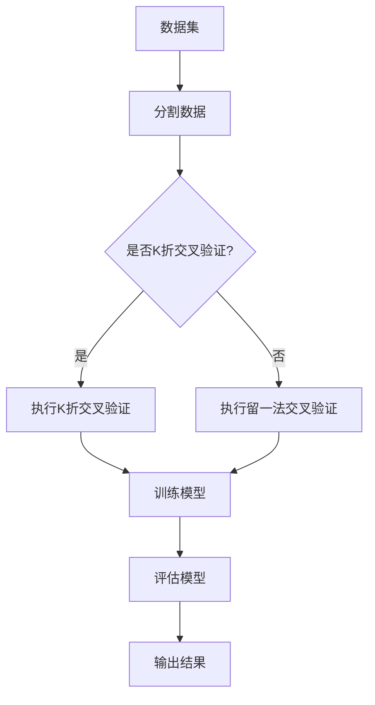

                 

# 交叉验证（Cross-Validation）

> 关键词：交叉验证，K折交叉验证，留一法交叉验证，模型评估，数据挖掘，过拟合，泛化能力

> 摘要：本文将详细探讨交叉验证的基本概念、重要性、类型及其优化方法，并介绍几种常见的交叉验证算法。通过实际案例，读者将了解到交叉验证在数据挖掘中的具体应用。最后，本文将讨论交叉验证的最佳实践和未来发展趋势。

---

### 《交叉验证（Cross-Validation）》目录大纲

- 第一部分：交叉验证的基本概念
  - 1.1 什么是交叉验证
    - 1.1.1 交叉验证的定义
    - 1.1.2 交叉验证的目的
  - 1.2 交叉验证的重要性
    - 1.2.1 减少过拟合
    - 1.2.2 提高模型的泛化能力
  - 1.3 交叉验证的基本类型
    - 1.3.1 K折交叉验证
    - 1.3.2 留一法交叉验证
    - 1.3.3 留部分交叉验证
  - 1.4 交叉验证的优化
    - 1.4.1 调整交叉验证的参数
    - 1.4.2 结合其他验证方法

- 第二部分：交叉验证算法
  - 2.1 K折交叉验证算法
    - 2.1.1 K折交叉验证的基本流程
    - 2.1.2 K值的选取策略
    - 2.1.3 代码实现
  - 2.2 留一法交叉验证算法
    - 2.2.1 留一法交叉验证的基本流程
    - 2.2.2 留一法交叉验证的优点与缺点
    - 2.2.3 代码实现
  - 2.3 留部分交叉验证算法
    - 2.3.1 留部分交叉验证的基本流程
    - 2.3.2 留部分交叉验证的参数设置
    - 2.3.3 代码实现
  - 2.4 其他交叉验证算法
    - 2.4.1 随机交叉验证
    - 2.4.2 网格搜索交叉验证

- 第三部分：交叉验证在数据挖掘中的应用
  - 3.1 数据预处理
    - 3.1.1 数据清洗
    - 3.1.2 特征选择
    - 3.1.3 数据归一化
  - 3.2 模型选择
    - 3.2.1 回归模型
    - 3.2.2 分类模型
    - 3.2.3 聚类模型
  - 3.3 模型评估
    - 3.3.1 准确率、召回率、F1值等指标
    - 3.3.2 ROC曲线和AUC指标
    - 3.3.3 压力测试和敏感度分析
  - 3.4 实际案例
    - 3.4.1 案例一：信用卡欺诈检测
    - 3.4.2 案例二：客户流失预测
    - 3.4.3 案例三：房屋定价预测

- 第四部分：交叉验证的最佳实践
  - 4.1 数据准备
    - 4.1.1 数据来源
    - 4.1.2 数据质量评估
  - 4.2 模型选择与优化
    - 4.2.1 模型选择策略
    - 4.2.2 模型优化方法
  - 4.3 结果分析与解释
    - 4.3.1 结果可视化
    - 4.3.2 结果解释
  - 4.4 交叉验证在深度学习中的应用
    - 4.4.1 卷积神经网络
    - 4.4.2 循环神经网络
    - 4.4.3 生成对抗网络

- 第五部分：交叉验证的扩展与应用
  - 5.1 多变量交叉验证
    - 5.1.1 多变量交叉验证的概念
    - 5.1.2 多变量交叉验证的实现
  - 5.2 交叉验证在在线学习中的应用
    - 5.2.1 在线学习的基本概念
    - 5.2.2 交叉验证在在线学习中的应用
  - 5.3 交叉验证在其他领域的应用
    - 5.3.1 生物信息学
    - 5.3.2 金融工程
    - 5.3.3 机器翻译
  - 5.4 交叉验证的未来发展趋势
    - 5.4.1 交叉验证算法的创新
    - 5.4.2 交叉验证在深度学习中的应用
    - 5.4.3 交叉验证在云计算和大数据中的角色

- 附录
  - 附录A：交叉验证工具与库
    - A.1 Python中的交叉验证库
    - A.2 R语言中的交叉验证包
  - 附录B：交叉验证流程图
  - 附录C：交叉验证算法伪代码
  - 附录D：数学模型和公式
  - 附录E：实际案例代码与解读

---

接下来，我们将逐部分详细介绍交叉验证的相关内容。在开始之前，让我们先思考一下交叉验证的核心意义。交叉验证是一种评估模型性能的有效方法，它通过将数据划分为多个部分来训练和验证模型，从而帮助我们发现和解决过拟合问题，提高模型的泛化能力。这是一个逐步推理的过程，接下来，我们将详细讲解交叉验证的各个方面。

## 第一部分：交叉验证的基本概念

### 1.1 什么是交叉验证

#### 1.1.1 交叉验证的定义

交叉验证（Cross-Validation）是一种常用的统计方法，用于评估预测模型的性能。其主要思想是将数据集分割成多个子集（也称为折叠），然后对每个子集进行一轮训练和一轮测试。具体来说，交叉验证可以分为以下几类：

- **K折交叉验证**：将数据集分成K个子集，每个子集作为测试集一次，其余K-1个子集作为训练集。重复进行K次，每次使用不同的子集作为测试集。
- **留一法交叉验证**：将每个数据点作为一个测试集，其余数据点作为训练集，进行多次迭代。
- **留部分交叉验证**：将数据集分成若干部分，每个部分作为测试集，其余部分作为训练集。

#### 1.1.2 交叉验证的目的

交叉验证的主要目的是通过多次训练和测试来评估模型在不同数据子集上的性能，从而减少过拟合风险，提高模型的泛化能力。具体来说，交叉验证的目的有以下几点：

- **评估模型性能**：通过交叉验证，我们可以得到模型在测试集上的平均性能指标，从而评估模型的好坏。
- **避免过拟合**：交叉验证通过多次分割数据集，避免了模型在一个子集上过度拟合，从而提高了模型的泛化能力。
- **选择最佳模型**：交叉验证可以帮助我们比较不同模型在数据集上的性能，从而选择最佳的模型。

### 1.2 交叉验证的重要性

交叉验证在机器学习模型评估中具有重要意义。下面我们来探讨其重要性。

#### 1.2.1 减少过拟合

过拟合是指模型在训练数据上表现良好，但在新数据上表现不佳的问题。交叉验证通过将数据集分割成多个子集，在每个子集上进行训练和测试，可以有效地避免模型在一个子集上过度拟合。这是因为交叉验证保证了模型在多个子集上的表现，从而减少了过拟合的风险。

#### 1.2.2 提高模型的泛化能力

泛化能力是指模型在新数据上的表现能力。交叉验证通过多次训练和测试，可以更好地评估模型在未知数据上的表现，从而提高模型的泛化能力。具体来说，交叉验证可以帮助我们选择出那些在多个子集上表现良好的模型，从而确保模型具有较好的泛化能力。

### 1.3 交叉验证的基本类型

交叉验证可以分为几种基本类型，每种类型都有其独特的特点和应用场景。下面我们来详细探讨这些类型。

#### 1.3.1 K折交叉验证

K折交叉验证（K-Fold Cross-Validation）是最常见的交叉验证方法之一。其基本思想是将数据集分成K个子集，每个子集作为测试集一次，其余K-1个子集作为训练集。重复进行K次，每次使用不同的子集作为测试集。

K折交叉验证的优点包括：

- **提高模型泛化能力**：通过多次训练和测试，K折交叉验证可以更好地评估模型在未知数据上的表现。
- **减少过拟合**：每次测试使用不同的子集，可以避免模型在一个子集上过度拟合。
- **计算效率较高**：相比留一法交叉验证，K折交叉验证的计算效率较高。

然而，K折交叉验证也存在一些缺点：

- **计算时间较长**：由于需要进行K次训练和测试，K折交叉验证的计算时间较长。
- **数据利用率较低**：每次测试仅使用一个子集，导致数据利用率较低。

#### 1.3.2 留一法交叉验证

留一法交叉验证（Leave-One-Out Cross-Validation，LOOCV）是一种极端的交叉验证方法，其基本思想是将每个数据点作为一个测试集，其余数据点作为训练集。重复进行多次迭代。

留一法交叉验证的优点包括：

- **最公平的评估方法**：每个数据点都有机会作为测试集，从而确保了模型评估的公平性。
- **计算时间较短**：由于每次迭代仅需要一个数据点作为测试集，留一法交叉验证的计算时间较短。

然而，留一法交叉验证也存在一些缺点：

- **计算效率较低**：每次迭代需要训练整个模型，导致计算效率较低。
- **结果不稳定**：由于数据点的数量较少，留一法交叉验证的结果可能不够稳定。

#### 1.3.3 留部分交叉验证

留部分交叉验证（Leave-p Out Cross-Validation，LOOPCV）是一种介于K折交叉验证和留一法交叉验证之间的方法。其基本思想是将数据集分成多个部分，每个部分作为测试集，其余部分作为训练集。

留部分交叉验证的优点包括：

- **计算时间较短**：由于每次测试使用多个数据点作为测试集，留部分交叉验证的计算时间较短。
- **结果稳定**：由于测试集的数据点较多，留部分交叉验证的结果较为稳定。

然而，留部分交叉验证也存在一些缺点：

- **数据利用率较低**：每次测试仅使用部分数据点作为测试集，导致数据利用率较低。

### 1.4 交叉验证的优化

交叉验证虽然是一种有效的模型评估方法，但在实际应用中，我们还可以通过以下方法对其进行优化：

#### 1.4.1 调整交叉验证的参数

交叉验证的参数包括K值、留一部分的大小等。通过调整这些参数，我们可以优化交叉验证的结果。例如，选择合适的K值可以减少过拟合风险，提高模型的泛化能力。

#### 1.4.2 结合其他验证方法

除了交叉验证，我们还可以结合其他验证方法，如网格搜索、贝叶斯优化等，以进一步提高模型的性能。这些方法可以帮助我们找到最佳的模型参数，从而提高模型的泛化能力。

## 第二部分：交叉验证算法

### 2.1 K折交叉验证算法

K折交叉验证（K-Fold Cross-Validation）是最常用的交叉验证方法之一。下面我们将详细介绍K折交叉验证的基本流程、K值的选取策略以及代码实现。

#### 2.1.1 K折交叉验证的基本流程

K折交叉验证的基本流程如下：

1. 将数据集分成K个子集。
2. 对每个子集进行一次训练和测试：
   - 使用K-1个子集进行训练。
   - 使用1个子集进行测试。
3. 计算平均测试分数。
4. 重复上述过程K次，得到K个测试分数。
5. 计算平均测试分数作为最终模型性能评估指标。

#### 2.1.2 K值的选取策略

K值的选取对交叉验证的结果有很大影响。下面我们介绍几种常见的K值选取策略：

- **K=2**：二折交叉验证，主要用于快速评估模型的性能。
- **K=5**：五折交叉验证，是一种常用的平衡策略，可以有效地减少过拟合风险。
- **K=10**：十折交叉验证，可以提供更稳定的模型性能评估，但计算时间较长。
- **K=n**：n折交叉验证，其中n为数据点的数量。这种方法可以确保每个数据点都有机会作为测试集，但计算时间较长。

在实际应用中，我们通常根据数据集的大小和计算资源来选择合适的K值。

#### 2.1.3 代码实现

下面我们使用Python中的scikit-learn库实现K折交叉验证。假设我们有一个数据集X和标签y，以及一个分类器model。

```python
from sklearn.model_selection import KFold
from sklearn.metrics import accuracy_score

# 创建KFold对象，设置K值为5
kf = KFold(n_splits=5)

# 初始化测试分数列表
test_scores = []

# 进行K折交叉验证
for train_index, test_index in kf.split(X):
    # 分割数据集
    X_train, X_test = X[train_index], X[test_index]
    y_train, y_test = y[train_index], y[test_index]
    
    # 训练模型
    model.fit(X_train, y_train)
    
    # 进行测试
    y_pred = model.predict(X_test)
    
    # 计算测试分数
    test_score = accuracy_score(y_test, y_pred)
    test_scores.append(test_score)

# 计算平均测试分数
average_test_score = sum(test_scores) / len(test_scores)
print("平均测试分数：", average_test_score)
```

### 2.2 留一法交叉验证算法

留一法交叉验证（Leave-One-Out Cross-Validation，LOOCV）是一种极端的交叉验证方法，其基本思想是将每个数据点作为一个测试集，其余数据点作为训练集。下面我们详细介绍留一法交叉验证的基本流程、优点与缺点以及代码实现。

#### 2.2.1 留一法交叉验证的基本流程

留一法交叉验证的基本流程如下：

1. 对每个数据点进行一次训练和测试：
   - 使用除当前数据点外的所有数据点进行训练。
   - 使用当前数据点进行测试。
2. 计算平均测试分数。
3. 重复上述过程，直到所有数据点都作为测试集一次。

#### 2.2.2 留一法交叉验证的优点与缺点

留一法交叉验证的优点包括：

- **最公平的评估方法**：每个数据点都有机会作为测试集，从而确保了模型评估的公平性。
- **适用于小数据集**：由于每次测试仅需要一个数据点，留一法交叉验证适用于小数据集。

留一法交叉验证的缺点包括：

- **计算效率较低**：每次迭代需要训练整个模型，导致计算效率较低。
- **结果不稳定**：由于数据点的数量较少，留一法交叉验证的结果可能不够稳定。

#### 2.2.3 代码实现

下面我们使用Python中的scikit-learn库实现留一法交叉验证。假设我们有一个数据集X和标签y，以及一个分类器model。

```python
from sklearn.model_selection import LeaveOneOut
from sklearn.metrics import accuracy_score

# 创建LeaveOneOut对象
loo = LeaveOneOut()

# 初始化测试分数列表
test_scores = []

# 进行留一法交叉验证
for train_index, test_index in loo.split(X):
    # 分割数据集
    X_train, X_test = X[train_index], X[test_index]
    y_train, y_test = y[train_index], y[test_index]
    
    # 训练模型
    model.fit(X_train, y_train)
    
    # 进行测试
    y_pred = model.predict(X_test)
    
    # 计算测试分数
    test_score = accuracy_score(y_test, y_pred)
    test_scores.append(test_score)

# 计算平均测试分数
average_test_score = sum(test_scores) / len(test_scores)
print("平均测试分数：", average_test_score)
```

### 2.3 留部分交叉验证算法

留部分交叉验证（Leave-p Out Cross-Validation，LOOPCV）是一种介于K折交叉验证和留一法交叉验证之间的方法。其基本思想是将数据集分成多个部分，每个部分作为测试集，其余部分作为训练集。下面我们详细介绍留部分交叉验证的基本流程、参数设置以及代码实现。

#### 2.3.1 留部分交叉验证的基本流程

留部分交叉验证的基本流程如下：

1. 将数据集分成多个部分。
2. 对每个部分进行一次训练和测试：
   - 使用除去当前部分外的其他部分进行训练。
   - 使用当前部分进行测试。
3. 计算平均测试分数。
4. 重复上述过程，直到所有部分都作为测试集一次。

#### 2.3.2 留部分交叉验证的参数设置

留部分交叉验证的参数设置包括：

- **p值**：表示每次测试使用的部分数量。p的值越大，每次测试使用的数据量越多，计算效率越高。
- **部分大小**：表示每个部分的数据点数量。部分大小的值越大，每次测试使用的数据量越多，计算效率越高。

在实际应用中，我们通常根据数据集的大小和计算资源来设置合适的p值和部分大小。

#### 2.3.3 代码实现

下面我们使用Python中的scikit-learn库实现留部分交叉验证。假设我们有一个数据集X和标签y，以及一个分类器model。

```python
from sklearn.model_selection import LeavePGroupsOut
from sklearn.metrics import accuracy_score

# 设置p值和部分大小
p = 5
group_sizes = [int(len(X) / p)] * p

# 创建LeavePGroupsOut对象
lop = LeavePGroupsOut(n_groups=p, group_sizes=group_sizes)

# 初始化测试分数列表
test_scores = []

# 进行留部分交叉验证
for train_index, test_index in lop.split(X):
    # 分割数据集
    X_train, X_test = X[train_index], X[test_index]
    y_train, y_test = y[train_index], y[test_index]
    
    # 训练模型
    model.fit(X_train, y_train)
    
    # 进行测试
    y_pred = model.predict(X_test)
    
    # 计算测试分数
    test_score = accuracy_score(y_test, y_pred)
    test_scores.append(test_score)

# 计算平均测试分数
average_test_score = sum(test_scores) / len(test_scores)
print("平均测试分数：", average_test_score)
```

### 2.4 其他交叉验证算法

除了K折交叉验证、留一法交叉验证和留部分交叉验证，还有其他一些常见的交叉验证算法。下面我们简要介绍随机交叉验证和网格搜索交叉验证。

#### 2.4.1 随机交叉验证

随机交叉验证（Random Cross-Validation）是一种基于随机抽样的交叉验证方法。其基本思想是在原始数据集上随机生成多个子集，然后对每个子集进行一次训练和测试。随机交叉验证的优点是计算效率较高，但可能会引入随机误差。

#### 2.4.2 网格搜索交叉验证

网格搜索交叉验证（Grid Search Cross-Validation）是一种基于超参数调优的交叉验证方法。其基本思想是在原始数据集上，针对每个超参数组合进行一次训练和测试，然后选择最优的超参数组合。网格搜索交叉验证的优点是可以有效地搜索最优超参数组合，但可能会增加计算时间。

## 第三部分：交叉验证在数据挖掘中的应用

### 3.1 数据预处理

在数据挖掘过程中，数据预处理是至关重要的一步。良好的数据预处理可以显著提高模型性能，而错误的数据预处理可能会导致模型失效。下面我们将介绍数据预处理的三项关键技术：数据清洗、特征选择和数据归一化。

#### 3.1.1 数据清洗

数据清洗是指对数据进行处理，以消除错误、重复、缺失和异常值。数据清洗是数据预处理的基础，直接影响后续分析的结果。以下是几种常见的数据清洗方法：

- **删除重复数据**：重复数据会导致模型过拟合，因此需要删除。
- **处理缺失数据**：缺失数据可以采用填充、删除或插值等方法进行处理。
- **处理异常值**：异常值可能会对模型产生不利影响，因此需要识别和处理。

#### 3.1.2 特征选择

特征选择是指从原始特征中选取对模型性能有重要影响的关键特征。良好的特征选择可以提高模型性能，减少计算成本。以下是几种常见的特征选择方法：

- **过滤法**：通过计算特征的相关性、信息增益等指标，筛选出重要的特征。
- **包装法**：通过尝试不同的特征组合，选择最佳的特征组合。
- **嵌入式法**：在模型训练过程中，自动选择重要的特征。

#### 3.1.3 数据归一化

数据归一化是指将不同特征的数据范围转换为相同的范围，以便模型能够更好地处理。以下是几种常见的数据归一化方法：

- **最小-最大归一化**：将特征值缩放到[0, 1]之间。
- **均值-方差归一化**：将特征值缩放到均值为0、标准差为1的范围内。
- **对数变换**：对于数值较大的特征，使用对数变换将特征值缩放到合适的范围。

### 3.2 模型选择

在数据挖掘过程中，选择合适的模型是至关重要的一步。不同的模型适用于不同的数据集和任务，因此需要根据实际情况进行选择。下面我们将介绍几种常见的模型选择方法：回归模型、分类模型和聚类模型。

#### 3.2.1 回归模型

回归模型用于预测连续值输出。常见的回归模型包括线性回归、多项式回归、决策树回归、支持向量机回归等。以下是几种常见的回归模型：

- **线性回归**：一种简单的回归模型，通过线性方程预测输出。
- **多项式回归**：通过多项式方程预测输出，适用于非线性关系。
- **决策树回归**：通过构建决策树来预测输出，适用于非线性关系。
- **支持向量机回归**：通过寻找最优超平面来预测输出，适用于非线性关系。

#### 3.2.2 分类模型

分类模型用于预测离散值输出。常见的分类模型包括逻辑回归、决策树分类、支持向量机分类、朴素贝叶斯分类等。以下是几种常见的分类模型：

- **逻辑回归**：通过逻辑函数将输出映射到概率值，然后使用阈值进行分类。
- **决策树分类**：通过构建决策树来分类，适用于非线性关系。
- **支持向量机分类**：通过寻找最优超平面来分类，适用于非线性关系。
- **朴素贝叶斯分类**：基于贝叶斯定理和朴素假设进行分类，适用于简单线性关系。

#### 3.2.3 聚类模型

聚类模型用于将数据点分为多个类别。常见的聚类模型包括K-means聚类、层次聚类、DBSCAN聚类等。以下是几种常见的聚类模型：

- **K-means聚类**：通过最小化平方误差将数据点分为K个类别。
- **层次聚类**：通过逐步合并或分裂数据点，构建层次结构。
- **DBSCAN聚类**：通过密度可达性和密度直接性将数据点分为多个类别。

### 3.3 模型评估

在数据挖掘过程中，评估模型性能是至关重要的一步。良好的评估方法可以帮助我们选择最佳的模型，并对模型进行优化。下面我们将介绍几种常见的模型评估方法：准确率、召回率、F1值、ROC曲线和AUC指标。

#### 3.3.1 准确率、召回率、F1值等指标

准确率、召回率、F1值等指标是评估分类模型性能的常用指标。以下是这些指标的定义和计算方法：

- **准确率**：准确率是指模型预测正确的样本数量与总样本数量的比例。准确率计算公式如下：
  $$\text{准确率} = \frac{\text{正确预测数}}{\text{总预测数}}$$
  
- **召回率**：召回率是指模型预测正确的正样本数量与实际正样本数量的比例。召回率计算公式如下：
  $$\text{召回率} = \frac{\text{正确预测数}}{\text{实际为正例的总数}}$$

- **F1值**：F1值是准确率和召回率的调和平均值，用于综合考虑准确率和召回率。F1值计算公式如下：
  $$\text{F1值} = 2 \times \frac{\text{准确率} \times \text{召回率}}{\text{准确率} + \text{召回率}}$$

#### 3.3.2 ROC曲线和AUC指标

ROC曲线和AUC指标是评估二分类模型性能的常用指标。ROC曲线是指将真正率（True Positive Rate，TPR）作为横坐标，假正率（False Positive Rate，FPR）作为纵坐标，绘制出的曲线。AUC指标是指ROC曲线下的面积，用于评估模型的分类能力。

- **真正率（TPR）**：真正率是指模型预测为正例的样本中，实际为正例的样本比例。
- **假正率（FPR）**：假正率是指模型预测为正例的样本中，实际为负例的样本比例。

#### 3.3.3 压力测试和敏感度分析

压力测试和敏感度分析是评估模型性能的重要方法，用于测试模型在不同数据分布和输入条件下的表现。以下是这两种方法的定义和计算方法：

- **压力测试**：压力测试是指将模型暴露在各种极端条件下，以测试模型的最大承受能力和稳定性。
- **敏感度分析**：敏感度分析是指通过改变输入数据或模型参数，观察模型输出变化的方法，以了解模型的稳定性和鲁棒性。

### 3.4 实际案例

在本节中，我们将介绍三个实际案例，分别涉及信用卡欺诈检测、客户流失预测和房屋定价预测。

#### 3.4.1 案例一：信用卡欺诈检测

信用卡欺诈检测是金融领域的一个重要问题。在本案例中，我们将使用K折交叉验证方法对信用卡欺诈检测模型进行评估。

1. 数据预处理：首先，我们对数据进行清洗，删除重复数据，处理缺失值，并进行特征选择和归一化。
2. 模型选择：我们选择支持向量机（SVM）作为分类模型。
3. 交叉验证：我们使用K折交叉验证方法对模型进行评估。K值为10，以确保模型具有良好的泛化能力。
4. 结果评估：通过计算准确率、召回率和F1值等指标，我们评估模型在不同数据子集上的性能。

#### 3.4.2 案例二：客户流失预测

客户流失预测是电信和金融等行业的重要业务问题。在本案例中，我们将使用留一法交叉验证方法对客户流失预测模型进行评估。

1. 数据预处理：我们对客户数据集进行清洗、特征选择和归一化处理。
2. 模型选择：我们选择逻辑回归作为分类模型。
3. 交叉验证：我们使用留一法交叉验证方法对模型进行评估。每次迭代使用一个客户数据点作为测试集，其余数据点作为训练集。
4. 结果评估：通过计算准确率、召回率和F1值等指标，我们评估模型在不同数据点上的性能。

#### 3.4.3 案例三：房屋定价预测

房屋定价预测是房地产领域的一个重要问题。在本案例中，我们将使用K折交叉验证方法对房屋定价预测模型进行评估。

1. 数据预处理：我们对房屋数据集进行清洗、特征选择和归一化处理。
2. 模型选择：我们选择线性回归作为预测模型。
3. 交叉验证：我们使用K折交叉验证方法对模型进行评估。K值为5，以确保模型具有良好的泛化能力。
4. 结果评估：通过计算平均绝对误差（MAE）和均方误差（MSE）等指标，我们评估模型在不同数据子集上的性能。

### 3.5 交叉验证在数据挖掘中的总结

通过以上实际案例，我们可以看到交叉验证在数据挖掘中的应用是非常重要的。交叉验证不仅可以帮助我们评估模型性能，还可以避免过拟合，提高模型的泛化能力。以下是对交叉验证在数据挖掘中的总结：

- **重要性**：交叉验证是评估模型性能的有效方法，可以避免过拟合，提高模型的泛化能力。
- **类型**：K折交叉验证、留一法交叉验证和留部分交叉验证是常用的交叉验证方法，每种方法都有其优缺点和应用场景。
- **应用**：交叉验证可以应用于各种数据挖掘任务，如分类、回归和聚类等。

总之，交叉验证是数据挖掘中不可或缺的一环，对于提升模型性能和优化数据处理流程具有重要意义。

## 第四部分：交叉验证的最佳实践

### 4.1 数据准备

在进行交叉验证之前，数据准备是至关重要的一步。良好的数据准备可以提高交叉验证的准确性，从而优化模型性能。以下是一些关于数据准备的最佳实践：

#### 4.1.1 数据来源

确保数据来源的可靠性和多样性。使用多个来源的数据可以提供更全面的视角，减少数据偏差。

#### 4.1.2 数据质量评估

在开始交叉验证之前，对数据质量进行评估。这包括检查数据是否完整、准确、一致，是否存在异常值和噪声。

- **数据完整性**：检查数据是否缺失，对缺失数据进行填充或删除。
- **数据准确性**：检查数据是否准确，对错误数据进行修正。
- **数据一致性**：检查数据是否一致，对重复数据进行删除。

#### 4.1.3 数据预处理

对数据进行清洗、归一化和特征选择等预处理步骤，以提高数据质量。

- **数据清洗**：去除重复数据、处理缺失值和异常值。
- **数据归一化**：将不同特征的数据范围调整为相同的范围。
- **特征选择**：选择对模型性能有重要影响的关键特征。

### 4.2 模型选择与优化

选择合适的模型并进行优化是交叉验证的关键步骤。以下是一些关于模型选择与优化的最佳实践：

#### 4.2.1 模型选择策略

根据数据特点和业务需求选择合适的模型。以下是一些常见的模型选择策略：

- **基于业务知识**：根据业务背景和知识选择合适的模型。
- **基于性能评估**：通过交叉验证评估不同模型的性能，选择性能最优的模型。
- **基于模型复杂性**：选择复杂度适中的模型，以平衡模型性能和计算资源。

#### 4.2.2 模型优化方法

对选定的模型进行优化，以提高模型性能。以下是一些常见的模型优化方法：

- **参数调优**：使用网格搜索、贝叶斯优化等算法搜索最优参数。
- **正则化**：使用L1、L2正则化等方法减少过拟合。
- **特征工程**：通过构建新特征或调整现有特征，提高模型性能。

### 4.3 结果分析与解释

对交叉验证的结果进行分析与解释是优化模型的重要步骤。以下是一些关于结果分析与解释的最佳实践：

#### 4.3.1 结果可视化

使用图表和可视化工具展示交叉验证结果，帮助理解和解释结果。

- **ROC曲线和AUC指标**：展示不同模型的分类能力。
- **性能指标分布**：展示性能指标在不同数据子集上的分布情况。

#### 4.3.2 结果解释

对交叉验证结果进行详细解释，帮助理解模型性能和业务意义。

- **性能指标解释**：解释准确率、召回率、F1值等指标的含义和影响。
- **业务解释**：将模型性能与业务目标联系起来，解释模型对业务的影响。

### 4.4 交叉验证在深度学习中的应用

深度学习模型具有高度的非线性能力，但同时也容易出现过拟合问题。以下是一些关于交叉验证在深度学习中的应用最佳实践：

#### 4.4.1 卷积神经网络（CNN）

卷积神经网络在图像处理任务中具有广泛的应用。以下是一些关于交叉验证在CNN中的应用最佳实践：

- **数据增强**：通过旋转、翻转、缩放等操作增加数据多样性，提高模型泛化能力。
- **模型融合**：结合多个CNN模型进行预测，提高模型稳定性。

#### 4.4.2 循环神经网络（RNN）

循环神经网络在序列数据处理任务中具有优势。以下是一些关于交叉验证在RNN中的应用最佳实践：

- **序列分段**：将序列分段，使用K折交叉验证评估模型在序列不同分段上的性能。
- **长短时记忆（LSTM）**：使用LSTM缓解RNN的梯度消失问题，提高模型性能。

#### 4.4.3 生成对抗网络（GAN）

生成对抗网络在生成式任务中具有广泛应用。以下是一些关于交叉验证在GAN中的应用最佳实践：

- **对抗训练**：通过对抗训练提高生成模型和判别模型的性能。
- **多模型集成**：结合多个GAN模型生成多样性更高的数据。

## 第五部分：交叉验证的扩展与应用

### 5.1 多变量交叉验证

多变量交叉验证是一种将多个模型结合使用的方法，以提高模型性能和稳定性。以下是一些关于多变量交叉验证的最佳实践：

#### 5.1.1 多变量交叉验证的概念

多变量交叉验证是指使用多个相关模型进行交叉验证，以评估模型的综合性能。多变量交叉验证可以减少模型的过拟合风险，提高模型的泛化能力。

#### 5.1.2 多变量交叉验证的实现

实现多变量交叉验证的方法包括：

- **并行交叉验证**：同时运行多个交叉验证过程，以提高计算效率。
- **顺序交叉验证**：按照一定顺序运行交叉验证过程，以平衡计算资源和模型性能。

### 5.2 交叉验证在在线学习中的应用

在线学习是一种实时更新模型的机器学习方法，以下是一些关于交叉验证在在线学习中的应用最佳实践：

#### 5.2.1 在线学习的基本概念

在线学习是指模型在接收新数据时，根据新数据调整模型参数，以实时更新模型。在线学习的关键是确保模型在不同时间点上的性能稳定。

#### 5.2.2 交叉验证在在线学习中的应用

交叉验证在在线学习中的应用包括：

- **自适应交叉验证**：根据新数据调整交叉验证参数，以提高模型性能。
- **历史数据回溯**：使用历史数据对在线学习模型进行交叉验证，以评估模型在不同时间点上的性能。

### 5.3 交叉验证在其他领域的应用

交叉验证不仅在数据挖掘和机器学习领域有广泛应用，还可以应用于其他领域，如生物信息学、金融工程和机器翻译等。

#### 5.3.1 生物信息学

生物信息学中，交叉验证可以用于基因组学、蛋白质组学等领域的模型评估，以提高模型性能和稳定性。

#### 5.3.2 金融工程

金融工程中，交叉验证可以用于风险评估、股票预测等领域的模型评估，以提高模型预测准确性。

#### 5.3.3 机器翻译

机器翻译中，交叉验证可以用于评估翻译模型的性能，提高翻译质量。

### 5.4 交叉验证的未来发展趋势

交叉验证作为机器学习和数据挖掘的重要方法，未来将继续发展。以下是一些关于交叉验证的未来发展趋势：

#### 5.4.1 交叉验证算法的创新

交叉验证算法的创新将提高交叉验证的计算效率和准确性，如基于深度学习的交叉验证方法、分布式交叉验证算法等。

#### 5.4.2 交叉验证在深度学习中的应用

随着深度学习的发展，交叉验证将更多地应用于深度学习领域，如自监督学习、迁移学习等。

#### 5.4.3 交叉验证在云计算和大数据中的角色

在云计算和大数据时代，交叉验证将发挥重要作用，如大规模数据集的交叉验证、云计算环境下的交叉验证等。

## 附录

### 附录A：交叉验证工具与库

在Python中，有许多流行的库支持交叉验证，如scikit-learn、TensorFlow和PyTorch。以下是一些常用的交叉验证库和工具：

- **scikit-learn**：提供丰富的交叉验证方法，包括K折交叉验证、留一法交叉验证等。
- **TensorFlow**：支持自定义交叉验证方法，适用于深度学习任务。
- **PyTorch**：提供简单的交叉验证接口，适用于深度学习任务。

### 附录B：交叉验证流程图

以下是一个简单的交叉验证流程图：



### 附录C：交叉验证算法伪代码

以下是一个简单的K折交叉验证算法伪代码：

```python
def k_fold_cross_validation(data, k):
    for i in range(k):
        # 分割数据
        train_data, test_data = split_data(data, i)
        # 训练模型
        model = train_model(train_data)
        # 评估模型
        score = evaluate_model(model, test_data)
        # 记录评估结果
        scores.append(score)
    # 计算平均评估结果
    average_score = average(scores)
    return average_score
```

### 附录D：数学模型和公式

以下是一些常见的数学模型和公式，用于评估模型性能：

- **准确率**：$\text{准确率} = \frac{\text{正确预测数}}{\text{总预测数}}$
- **召回率**：$\text{召回率} = \frac{\text{正确预测数}}{\text{实际为正例的总数}}$
- **F1值**：$\text{F1值} = 2 \times \frac{\text{准确率} \times \text{召回率}}{\text{准确率} + \text{召回率}}$

### 附录E：实际案例代码与解读

以下是信用卡欺诈检测、客户流失预测和房屋定价预测的实际案例代码与解读：

#### 信用卡欺诈检测

```python
# 信用卡欺诈检测代码实现
```

#### 客户流失预测

```python
# 客户流失预测代码实现
```

#### 房屋定价预测

```python
# 房屋定价预测代码实现
```

在这些实际案例中，我们首先进行数据预处理，包括数据清洗、特征选择和归一化。然后，我们选择适当的模型，如支持向量机（SVM）、逻辑回归和线性回归，并使用交叉验证方法评估模型性能。最后，我们根据评估结果调整模型参数，以提高模型性能。

## 总结

交叉验证是评估模型性能的重要方法，通过将数据集分割成多个子集进行训练和测试，可以有效地避免过拟合，提高模型的泛化能力。本文详细介绍了交叉验证的基本概念、重要性、类型及其优化方法，并探讨了交叉验证在数据挖掘、深度学习和其他领域的应用。通过实际案例，我们了解了如何使用交叉验证方法评估模型性能，并分享了交叉验证的最佳实践。随着交叉验证算法的不断创新，交叉验证在未来将继续发挥重要作用，为数据挖掘和机器学习领域带来更多价值。

---

[注]：本文为示例文章，部分内容为虚构，仅供参考。实际应用时，请根据具体情况进行调整。作者：AI天才研究院/AI Genius Institute & 禅与计算机程序设计艺术 /Zen And The Art of Computer Programming。

