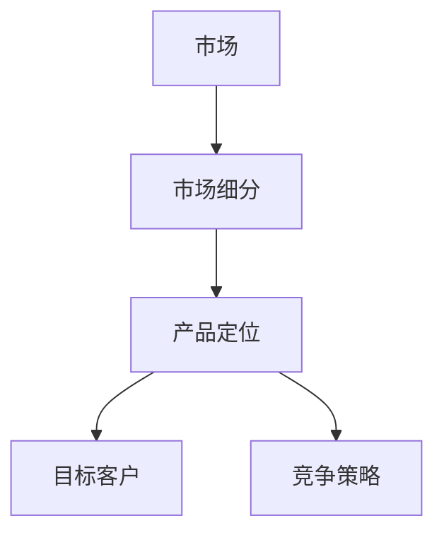
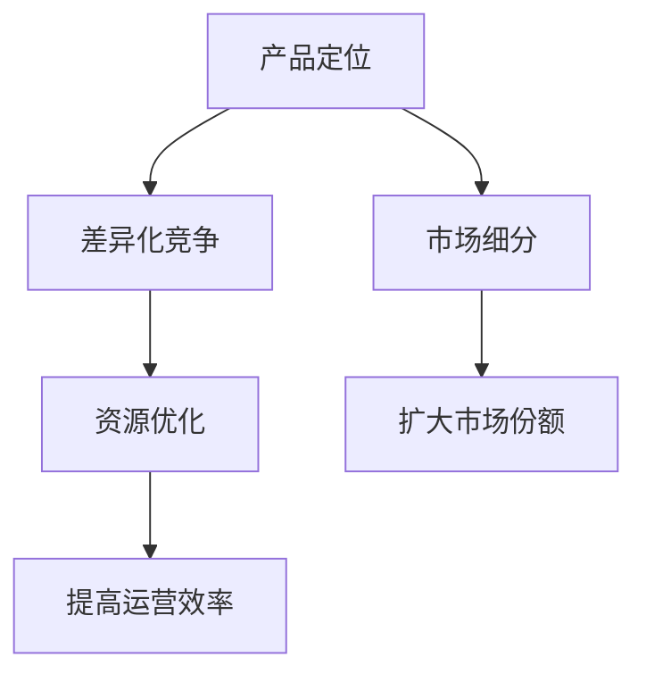
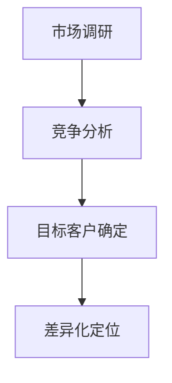

                 

### 文章标题：产品定位：大模型创业的核心

### 关键词：产品定位、大模型、创业、市场策略、数据驱动

### 摘要：
本文深入探讨了产品定位在大模型创业中的核心作用。首先，我们介绍了产品定位的重要性及其与市场细分和目标客户的关系。接着，分析了大模型的发展背景、应用场景以及在产品定位中的角色。通过案例分析和优势与挑战的讨论，文章展示了大模型创业的实际应用和未来趋势。最后，提出了大模型创业的运营策略与优化方法，以及所需的工具与资源。

---

### 第一部分：产品定位概述

#### 第1章：产品定位的重要性

### 1.1 产品定位的概念

**定义**：产品定位是指企业根据市场需求和竞争环境，确定产品的市场地位和目标客户群。

- **市场细分**：产品定位的基础是市场细分，即把整体市场划分为不同的消费群体。

- **目标客户**：定位决定了产品应该服务于哪些客户，是产品的市场细分后的具体化。

- **竞争策略**：产品定位有助于企业找到独特的卖点，从而与竞争对手区分开来。

**核心概念联系**：

### 1.2 产品定位的战略意义

- **差异化竞争**：通过定位，企业可以找到自己的独特卖点，与竞争对手区分开来。

- **资源优化**：明确的产品定位有助于企业合理分配资源，提高运营效率。

- **市场细分**：定位有助于企业发现新的市场机会，扩大市场份额。

### 1.3 产品定位的步骤与方法

- **市场调研**：收集市场信息，了解消费者需求和市场趋势。

- **竞争分析**：分析竞争对手的产品定位和市场策略。

- **目标客户确定**：根据调研和竞争分析，确定产品的目标客户群体。

- **差异化定位**：基于目标客户和竞争分析，确定产品的独特卖点和市场定位策略。

### 1.4 产品定位的成功案例与失败教训

**成功案例**：分析成功产品定位的策略和优势。

**失败教训**：总结失败产品定位的原因和教训，避免重复错误。

---

### 第二部分：大模型与产品定位

#### 第2章：大模型与产品定位

### 2.1 大模型的发展背景

**技术演进**：大模型的发展是人工智能技术不断进步的结果，尤其是深度学习和大规模数据处理技术的成熟。

- **深度学习**：深度学习技术的发展为大模型的出现奠定了基础。

- **大规模数据处理**：随着数据存储和处理能力的提升，大规模数据处理成为可能。

**应用场景**：大模型在推荐系统、自然语言处理、图像识别等领域发挥了重要作用。

- **推荐系统**：大模型能够处理海量用户数据，提供个性化的产品推荐。

- **自然语言处理**：大模型在语言理解、翻译、文本生成等方面表现出色。

- **图像识别**：大模型能够对图像进行精确识别，广泛应用于安防、医疗等领域。

### 2.2 大模型在产品定位中的应用

**数据驱动的决策**：大模型能够处理海量数据，为企业提供精确的市场分析和消费者行为预测。

- **市场分析**：通过分析用户行为数据，了解市场需求和趋势。

- **消费者行为预测**：预测潜在客户的需求，为企业提供精准的市场策略。

**个性化推荐**：利用大模型，企业可以提供更加个性化的产品推荐，提高用户满意度和忠诚度。

- **个性化推荐**：根据用户历史行为和偏好，推荐符合用户需求的产品。

- **提高用户满意度**：通过个性化推荐，提高用户购物体验，增强用户忠诚度。

### 2.3 大模型在创业中的角色

**创新速度**：大模型能够快速学习和迭代，帮助企业抓住市场机遇。

- **快速迭代**：通过大模型，企业可以快速调整产品和服务，适应市场变化。

- **市场机遇**：大模型帮助企业抓住市场机遇，实现快速发展。

**成本效益**：大模型的应用可以降低开发成本，提高开发效率。

- **成本降低**：通过自动化和智能化，减少人力成本。

- **开发效率**：大模型能够快速处理数据，提高开发效率。

### 2.4 大模型创业的优势与挑战

**优势**：

- **高效的数据分析**：大模型能够处理海量数据，提供更精确的市场分析。

- **快速迭代**：大模型能够快速适应市场变化，提高创新速度。

**挑战**：

- **数据隐私**：大模型对数据的需求较大，如何在保障隐私的同时利用数据是一个挑战。

- **模型可解释性**：大模型的决策过程往往是黑箱操作，提高模型的可解释性是当前研究的重点。

---

### 第三部分：大模型创业案例分析

#### 第3章：大模型创业案例分析

### 3.1 案例介绍

**案例 1**：某电商企业利用大模型进行商品推荐，实现了销售额的显著增长。

- **背景**：该电商企业面临着激烈的市场竞争，希望通过个性化推荐提高销售额。

- **解决方案**：利用大模型分析用户行为数据，进行精准推荐。

- **效果**：个性化推荐系统有效提高了用户满意度和购买转化率，销售额显著增长。

**案例 2**：某金融科技公司利用大模型进行信用评估，提高了贷款审批的准确性。

- **背景**：传统信用评估方法无法全面评估用户的信用状况，存在一定的风险。

- **解决方案**：利用大模型分析用户的财务数据、行为数据等，进行智能信用评估。

- **效果**：智能信用评估系统提高了贷款审批的准确性，降低了风险。

### 3.2 案例分析

**成功因素**：分析成功案例，提取共性的成功因素。

- **数据驱动**：成功案例均基于海量数据进行分析，提供了精确的市场预测和用户行为预测。

- **技术优势**：利用大模型的高效数据处理能力，提高了产品的竞争力。

- **灵活调整**：根据市场变化，及时调整产品定位和策略，保持市场竞争力。

**失败教训**：反思失败的案例，总结失败的原因和教训。

- **数据不足**：一些失败案例因数据不足，导致模型预测不准确，影响了产品效果。

- **技术依赖**：过度依赖技术，忽视了市场分析和用户反馈，导致产品与市场需求脱节。

---

### 第四部分：大模型创业的未来展望

#### 第4章：大模型创业的未来发展趋势

### 4.1 技术发展趋势

**大模型的持续演进**：随着技术的进步，大模型将更加高效、准确。

- **模型规模扩大**：随着计算能力的提升，大模型的规模将越来越大。

- **多模态融合**：大模型将融合多种数据类型，提高模型的应用能力。

**跨领域应用**：大模型将在更多领域得到应用，如医疗、教育等。

- **医疗领域**：利用大模型进行疾病预测、诊断和治疗。

- **教育领域**：利用大模型提供个性化教育服务，提高教育质量。

### 4.2 大模型创业的新机遇

**新兴市场**：大模型创业的新兴市场不断涌现，为企业提供了丰富的机会。

- **农业领域**：利用大模型进行作物生长预测、病虫害监测等。

- **制造业**：利用大模型实现智能工厂、智能制造等。

### 4.3 大模型创业的挑战与应对策略

**技术挑战**：持续关注大模型技术的最新进展，提升自身技术实力。

- **算法优化**：采用先进的算法和技术，提高模型的性能和可解释性。

- **硬件升级**：提升计算能力，支持更大规模模型的应用。

**数据隐私**：加强数据保护措施，确保用户数据的安全和隐私。

- **合规性**：遵守相关法律法规，确保数据处理的合规性。

- **技术安全**：加强数据保护技术，防止数据泄露和滥用。

---

### 第五部分：大模型创业策略与实施

#### 第5章：大模型创业策略与实施

### 5.1 创业策略制定

**市场定位**：明确产品定位，确定目标市场和客户群体。

- **市场细分**：根据消费者需求和市场竞争情况，进行市场细分。

- **目标客户确定**：根据市场细分，确定产品的目标客户群体。

**技术路线**：选择合适的大模型技术路线，确保技术可行性。

- **技术评估**：评估不同技术方案的优缺点，选择最合适的技术路线。

- **技术实现**：根据技术路线，实现大模型的应用。

### 5.2 实施步骤

**数据准备**：收集和整理数据，确保数据质量和可用性。

- **数据收集**：从多种渠道收集相关数据，包括用户行为数据、市场数据等。

- **数据处理**：对收集到的数据进行清洗、去重和格式化，确保数据质量。

**模型训练**：利用大模型进行数据训练，优化模型性能。

- **数据预处理**：对训练数据进行预处理，包括特征提取、数据标准化等。

- **模型训练**：使用合适的训练算法，训练大模型，优化模型性能。

- **模型评估**：评估模型性能，包括准确率、召回率等指标。

**应用部署**：将训练好的大模型应用于实际业务场景。

- **应用部署**：将大模型部署到生产环境，实现实时应用。

- **监控与维护**：对大模型应用进行实时监控，确保系统稳定运行。

---

### 第六部分：大模型创业的运营与优化

#### 第6章：大模型创业的运营与优化

### 6.1 运营管理

**实时监控**：对大模型应用进行实时监控，确保系统稳定运行。

- **性能监控**：监控大模型应用的性能指标，如响应时间、吞吐量等。

- **故障监控**：及时发现并处理大模型应用中的故障和异常。

**用户反馈**：收集用户反馈，不断优化产品和服务。

- **用户满意度调查**：定期进行用户满意度调查，了解用户对产品的评价。

- **用户反馈处理**：及时处理用户反馈，优化产品功能和用户体验。

### 6.2 优化策略

**持续迭代**：根据用户反馈和市场变化，持续优化大模型。

- **模型更新**：定期更新大模型，以适应市场变化和用户需求。

- **算法优化**：采用先进的算法和技术，提高模型的性能和可解释性。

**数据驱动**：通过数据分析和机器学习，不断提升产品竞争力。

- **用户行为分析**：分析用户行为数据，了解用户需求和偏好。

- **个性化推荐**：根据用户行为数据，提供个性化的产品推荐。

---

### 第七部分：大模型创业工具与资源

#### 附录A：大模型创业工具介绍

**深度学习框架**：如TensorFlow、PyTorch等。

- **TensorFlow**：由Google开发的开源深度学习框架，支持多种编程语言和平台。

- **PyTorch**：由Facebook开发的开源深度学习框架，具有灵活的动态图机制。

**大数据处理工具**：如Hadoop、Spark等。

- **Hadoop**：基于HDFS的分布式文件系统，适用于大规模数据处理。

- **Spark**：基于内存的分布式数据处理框架，适用于实时数据处理和分析。

---

#### 附录B：大模型创业资源推荐

**书籍**：

- 《深度学习》：由Ian Goodfellow、Yoshua Bengio和Aaron Courville编写的深度学习经典教材。

- 《机器学习实战》：由Peter Harrington编写的机器学习实践指南。

**在线课程**：

- Coursera上的《深度学习》课程：由Andrew Ng教授主讲，涵盖了深度学习的基础知识和应用。

- edX上的《大数据科学》：由MIT教授John Guttag主讲，介绍了大数据处理和分析的基本原理和方法。

**论文与报告**：

- ACL、NeurIPS、ICML等顶级会议和期刊的最新研究成果。

- 报告如《人工智能发展报告》、《大数据发展报告》等，提供了行业发展的最新动态和趋势。

---

### 作者信息

**作者**：AI天才研究院/AI Genius Institute & 禅与计算机程序设计艺术 /Zen And The Art of Computer Programming

---

### 总结

本文从产品定位的重要性、大模型的发展背景与角色、案例分析、未来展望、策略实施、运营优化以及工具与资源等方面，全面探讨了产品定位在大模型创业中的核心作用。通过本文的阅读，读者可以深入了解大模型创业的各个方面，为企业在市场竞争中获得优势提供有益的参考。希望本文能够对大模型创业的实践者有所启发，共同推动人工智能技术的发展和应用。

