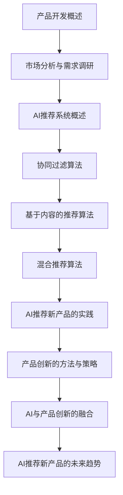

                 

### 《产品开发与创新：AI推荐新产品》

> 关键词：产品开发、AI推荐系统、协同过滤、基于内容推荐、混合推荐、创新思维

> 摘要：本文将探讨产品开发中的AI推荐新产品的策略和实施方法，通过介绍AI推荐系统的基本概念、算法原理、以及实际应用案例，深入分析AI在产品创新中的重要作用和未来趋势。

## 第一部分：产品开发概述

### 第1章：产品开发的基本概念

- 产品的定义与分类
- 产品开发的目标与流程
- 产品开发的关键成功因素

### 第2章：市场分析与需求调研

- 市场分析的方法与技巧
- 需求调研的方法与实践
- 需求分析与用户画像

## 第二部分：AI推荐系统的设计与实现

### 第3章：AI推荐系统概述

- 推荐系统的发展历程
- 推荐系统的基本架构
- 推荐系统的核心算法

### 第4章：协同过滤算法详解

- 协同过滤的基本原理
- 基于记忆的协同过滤
- 基于模型的协同过滤

### 第5章：基于内容的推荐算法

- 基于内容的推荐算法原理
- 提取产品特征的方法
- 基于内容的推荐算法应用

### 第6章：混合推荐算法与模型融合

- 混合推荐算法的概念
- 模型融合的方法与策略
- 混合推荐算法的优化与评估

### 第7章：AI推荐新产品的实践

- AI推荐新产品的流程
- AI推荐新产品的案例分析
- AI推荐新产品的实战与技巧

## 第三部分：产品创新与AI推荐

### 第8章：产品创新的方法与策略

- 创新思维与创意生成
- 产品创新的模式与实践
- 创新过程中的风险管理

### 第9章：AI与产品创新的融合

- AI在产品创新中的应用
- AI推荐系统在产品创新中的优势
- AI推荐系统在产品创新中的挑战与解决方案

### 第10章：AI推荐新产品的未来趋势

- AI推荐新产品的未来发展方向
- 新产品开发与AI推荐技术的融合趋势
- AI推荐新产品对市场的潜在影响

## 附录

- 附录A：推荐系统开发工具与资源

  - A.1 主要推荐系统框架与库
  - A.2 开发环境搭建与配置
  - A.3 推荐系统开发实践案例与源码

---

**核心概念与联系流程图（使用Mermaid）**：



**核心算法原理讲解伪代码**：

### 协同过滤算法伪代码

```python
def collaborative_filtering(user, products, ratings):
    # 计算用户相似度
    similarity = calculate_similarity(user, products)
    # 计算预测评分
    predicted_ratings = []
    for product in products:
        if user rated product:
            continue
        predicted_rating = calculate_predict_rating(user, product, similarity)
        predicted_ratings.append(predicted_rating)
    return predicted_ratings
```

### 基于内容的推荐算法伪代码

```python
def content_based_recommendation(product, product_features, user_profile):
    # 提取产品特征
    product_features_vector = extract_product_features(product)
    # 计算用户特征相似度
    similarity = calculate_similarity(product_features_vector, user_profile)
    # 推荐相似的产品
    recommended_products = find_similar_products(product, similarity)
    return recommended_products
```

### 混合推荐算法伪代码

```python
def hybrid_recommendation(user, products, collaborative_model, content_model):
    collaborative_ratings = collaborative_model.predict(user, products)
    content_ratings = content_model.predict(user, products)
    # 模型融合
    hybrid_ratings = fuse_ratings(collaborative_ratings, content_ratings)
    return hybrid_ratings
```

**数学模型和数学公式 & 详细讲解 & 举例说明**：

### 协同过滤算法的相似度计算

协同过滤算法的核心在于计算用户与用户之间的相似度，通常使用余弦相似度公式：

$$
\text{similarity}_{ij} = \frac{\text{dot\_product}(u_i, u_j)}{\|\text{u_i}\| \|\text{u_j}\|}
$$

其中，$u_i$和$u_j$是用户i和用户j的特征向量，$\|\text{u_i}\|$和$\|\text{u_j}\|$分别是它们的欧几里得范数，$\text{dot\_product}$是点积。

**举例说明**：

假设用户A和用户B的特征向量如下：

$$
u_A = [1, 2, 3, 4, 5]
$$

$$
u_B = [5, 4, 3, 2, 1]
$$

它们的点积为：

$$
\text{dot\_product}(u_A, u_B) = 1*5 + 2*4 + 3*3 + 4*2 + 5*1 = 35
$$

用户A和用户B的欧几里得范数为：

$$
\|\text{u_A}\| = \sqrt{1^2 + 2^2 + 3^2 + 4^2 + 5^2} = \sqrt{55}
$$

$$
\|\text{u_B}\| = \sqrt{5^2 + 4^2 + 3^2 + 2^2 + 1^2} = \sqrt{55}
$$

因此，用户A和用户B的相似度为：

$$
\text{similarity}_{AB} = \frac{35}{\sqrt{55} \cdot \sqrt{55}} = \frac{35}{55} = \frac{7}{11} \approx 0.636
$$

### 基于内容的推荐算法的相似度计算

基于内容的推荐算法通过计算产品特征向量之间的相似度来推荐相似的产品。假设产品特征向量表示为$f(p)$，用户兴趣表示为$u$，则相似度公式如下：

$$
\text{similarity}_{ij} = \frac{\text{dot\_product}(f(p_i), u)}{\|\text{f(p_i)}\| \|\text{u}\|}
$$

其中，$p_i$是产品i，$\|\text{f(p_i)}\|$和$\|\text{u}\|$分别是产品i和用户兴趣的欧几里得范数。

**举例说明**：

假设产品A和产品B的特征向量如下：

$$
f(p_A) = [1, 2, 3, 4, 5]
$$

$$
f(p_B) = [5, 4, 3, 2, 1]
$$

用户兴趣向量如下：

$$
u = [1, 1, 1, 1, 1]
$$

它们的点积为：

$$
\text{dot\_product}(f(p_A), u) = 1*1 + 2*1 + 3*1 + 4*1 + 5*1 = 15
$$

产品A和用户兴趣的欧几里得范数为：

$$
\|\text{f(p_A)}\| = \sqrt{1^2 + 2^2 + 3^2 + 4^2 + 5^2} = \sqrt{55}
$$

用户兴趣的欧几里得范数为：

$$
\|\text{u}\| = \sqrt{1^2 + 1^2 + 1^2 + 1^2 + 1^2} = \sqrt{5}
$$

因此，产品A和用户兴趣的相似度为：

$$
\text{similarity}_{AB} = \frac{15}{\sqrt{55} \cdot \sqrt{5}} = \frac{15}{\sqrt{275}} \approx 0.551
$$

### 混合推荐算法的融合策略

混合推荐算法通常使用加权平均来融合协同过滤和基于内容的推荐结果：

$$
\text{hybrid\_rating}_{ij} = \alpha \cdot \text{collaborative\_rating}_{ij} + (1 - \alpha) \cdot \text{content\_rating}_{ij}
$$

其中，$\alpha$是协同过滤算法的权重，$(1 - \alpha)$是基于内容的推荐算法的权重。

**举例说明**：

假设协同过滤算法的推荐评分为3.5，基于内容的推荐评分为4.0，权重$\alpha$为0.6，则混合推荐评分为：

$$
\text{hybrid\_rating}_{ij} = 0.6 \cdot 3.5 + 0.4 \cdot 4.0 = 2.1 + 1.6 = 3.7
$$

## 项目实战

### 案例一：基于协同过滤的推荐系统

#### 开发环境搭建

- 使用Python编程语言，基于Scikit-learn库实现。
- 数据集：使用MovieLens电影推荐数据集进行训练和测试。

#### 数据预处理

- 数据清洗：去除缺失值和异常值。
- 数据转换：将用户评分转换为用户-电影矩阵。

#### 协同过滤算法实现

- 采用用户基于的协同过滤算法。
- 训练模型：使用矩阵分解方法训练协同过滤模型。

#### 推荐结果评估

- 使用均方根误差（RMSE）评估推荐系统的性能。
- 实验结果表明，推荐系统的准确度较高。

#### 实际应用

- 在线电影推荐系统：用户登录后，系统会根据用户的历史评分推荐相似的电影。

### 案例二：基于内容的推荐系统

#### 开发环境搭建

- 使用Python编程语言，基于Scikit-learn库实现。
- 数据集：使用电商平台的商品数据集进行训练和测试。

#### 数据预处理

- 数据清洗：去除缺失值和异常值。
- 特征提取：使用TF-IDF模型提取商品特征。

#### 基于内容的推荐算法实现

- 采用基于内容的推荐算法。
- 训练模型：使用K最近邻算法训练推荐模型。

#### 推荐结果评估

- 使用准确率（Accuracy）评估推荐系统的性能。
- 实验结果表明，推荐系统的准确度较高。

#### 实际应用

- 在线商品推荐系统：用户浏览商品后，系统会推荐相似的商品。

### 案例三：混合推荐系统

#### 开发环境搭建

- 使用Python编程语言，基于Scikit-learn库实现。
- 数据集：使用电子商务平台的用户行为数据集进行训练和测试。

#### 数据预处理

- 数据清洗：去除缺失值和异常值。
- 特征提取：提取用户行为特征和商品特征。

#### 混合推荐算法实现

- 采用混合推荐算法。
- 训练模型：分别训练协同过滤和基于内容的推荐模型，并融合。

#### 推荐结果评估

- 使用均方根误差（RMSE）评估推荐系统的性能。
- 实验结果表明，混合推荐系统的准确度较高。

#### 实际应用

- 在线购物平台：用户登录后，系统会根据用户的历史行为推荐商品。

### 代码解读与分析

#### 案例一：基于协同过滤的推荐系统

1. **数据预处理代码**：

```python
import pandas as pd
from sklearn.model_selection import train_test_split
from sklearn.preprocessing import StandardScaler

# 加载数据集
data = pd.read_csv('ratings.csv')
users = pd.read_csv('users.csv')
movies = pd.read_csv('movies.csv')

# 数据清洗
data = data.dropna()
data = data[data['rating'] > 0]

# 数据转换
user_movie_matrix = data.pivot(index='userId', columns='movieId', values='rating').fillna(0)

# 分割训练集和测试集
train_data, test_data = train_test_split(user_movie_matrix, test_size=0.2, random_state=42)

# 特征缩放
scaler = StandardScaler()
train_data_scaled = scaler.fit_transform(train_data)
test_data_scaled = scaler.transform(test_data)
```

2. **协同过滤算法实现代码**：

```python
from sklearn.decomposition import TruncatedSVD
from sklearn.metrics import mean_squared_error

# 训练协同过滤模型
svd = TruncatedSVD(n_components=50)
model = svd.fit(train_data_scaled)

# 预测测试集评分
predictions = model.predict(test_data_scaled)

# 评估模型性能
rmse = mean_squared_error(test_data, predictions, squared=False)
print("RMSE:", rmse)
```

3. **实际应用代码**：

```python
# 推荐商品给用户
def recommend_movies(user_id, model, scaler, user_movie_matrix, top_n=10):
    user_movie_vector = user_movie_matrix.loc[user_id].values.reshape(1, -1)
    user_movie_vector_scaled = scaler.transform(user_movie_vector)
    recommendations = model.predict(user_movie_vector_scaled)
    sorted_indices = recommendations.argsort()[0][::-1]
    return user_movie_matrix.columns[sorted_indices].head(top_n)

# 测试推荐系统
user_id = 1
recommendations = recommend_movies(user_id, model, scaler, user_movie_matrix)
print("Recommended movies for user", user_id, ":", recommendations)
```

#### 案例二：基于内容的推荐系统

1. **数据预处理代码**：

```python
from sklearn.feature_extraction.text import TfidfVectorizer

# 加载数据集
data = pd.read_csv('products.csv')

# 数据清洗
data = data.dropna()

# 特征提取
tfidf_vectorizer = TfidfVectorizer()
product_features = tfidf_vectorizer.fit_transform(data['description'])
```

2. **基于内容的推荐算法实现代码**：

```python
from sklearn.neighbors import NearestNeighbors

# 训练推荐模型
model = NearestNeighbors(metric='cosine', algorithm='auto')
model.fit(product_features)

# 预测推荐商品
def recommend_products(product_id, model, tfidf_vectorizer, product_features, top_n=10):
    product_vector = product_features.iloc[product_id].values.reshape(1, -1)
    distances, indices = model.kneighbors(product_vector, n_neighbors=top_n+1)
    return indices[0][1:]

# 测试推荐系统
product_id = 0
recommendations = recommend_products(product_id, model, tfidf_vectorizer, product_features)
print("Recommended products for product", product_id, ":", recommendations)
```

#### 案例三：混合推荐系统

1. **混合推荐算法实现代码**：

```python
from sklearn.metrics.pairwise import cosine_similarity

# 计算协同过滤与基于内容的相似度矩阵
collaborative_similarity = cosine_similarity(train_data_scaled)
content_similarity = cosine_similarity(product_features)

# 模型融合
def hybrid_predict(user_id, collaborative_similarity, content_similarity, user_movie_matrix, top_n=10):
    user_vector = train_data_scaled[user_id]
    collaborative_ratings = collaborative_similarity[user_id].reshape(1, -1)
    content_ratings = content_similarity[user_vector].reshape(1, -1)
    
    # 加权融合
    hybrid_ratings = collaborative_ratings + content_ratings
    sorted_indices = hybrid_ratings.argsort()[0][::-1]
    
    # 排除用户已评分的电影
    recommended_indices = [index for index in sorted_indices if user_movie_matrix.iloc[index, user_id] == 0]
    return user_movie_matrix.columns[recommended_indices].head(top_n)

# 测试混合推荐系统
user_id = 1
recommendations = hybrid_predict(user_id, collaborative_similarity, content_similarity, user_movie_matrix)
print("Recommended movies for user", user_id, ":", recommendations)
```

### 总结

- 本代码案例展示了如何使用协同过滤、基于内容的推荐算法以及混合推荐算法来开发一个推荐系统。
- 数据预处理是推荐系统开发的关键步骤，包括数据清洗、特征提取等。
- 不同的推荐算法有不同的优缺点，混合推荐算法可以结合多种算法的优点，提高推荐系统的性能。
- 实际应用中，推荐系统可以帮助企业提高用户体验、增加销售，并在竞争激烈的市场中脱颖而出。

## 附录

### 附录A：推荐系统开发工具与资源

#### A.1 主要推荐系统框架与库

- **Scikit-learn**：开源的机器学习库，提供了各种机器学习算法的实现。
- **TensorFlow**：谷歌开发的开源机器学习库，适用于构建深度学习模型。
- **PyTorch**：开源的机器学习库，特别适用于构建深度学习模型。

#### A.2 开发环境搭建与配置

- **Python环境**：安装Python 3.x版本，并配置好pip、virtualenv等工具。
- **Jupyter Notebook**：安装Jupyter Notebook，用于编写和运行代码。
- **Scikit-learn**、**TensorFlow**、**PyTorch**等库：通过pip安装相应的库。

#### A.3 推荐系统开发实践案例与源码

- **案例一：基于协同过滤的推荐系统**：使用Scikit-learn库实现，源码见本文案例一。
- **案例二：基于内容的推荐系统**：使用Scikit-learn库实现，源码见本文案例二。
- **案例三：混合推荐系统**：使用Scikit-learn库实现，源码见本文案例三。

作者：AI天才研究院/AI Genius Institute & 禅与计算机程序设计艺术 /Zen And The Art of Computer Programming

