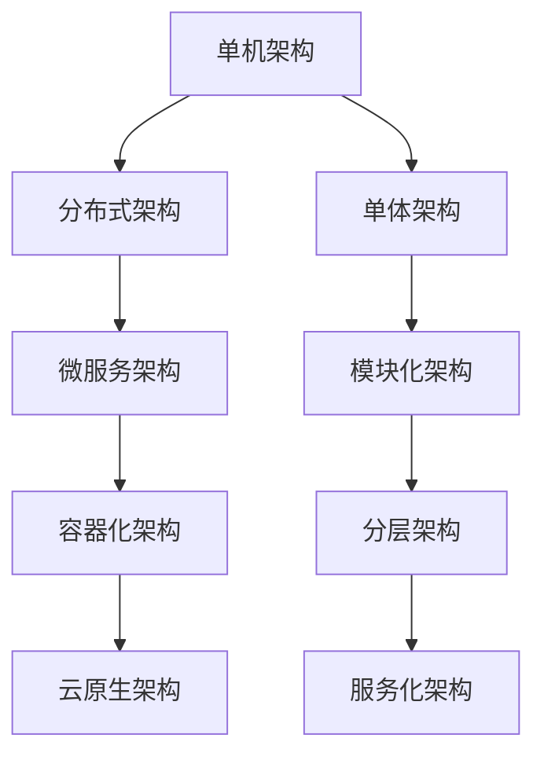

                 

# 《产品的系统架构设计、优化和演进》

## 关键词
系统架构设计、优化策略、演进方法、性能优化、安全性设计

## 摘要
本文将深入探讨产品的系统架构设计、优化和演进，从基础理论到实践案例分析，逐步解析系统架构的核心要素和设计原则。我们将重点讨论系统性能优化策略、安全性设计以及系统架构的演进趋势。通过详细的分析和实际案例，本文旨在为系统架构师和开发者提供实用的指导，帮助他们在不断变化的技术环境中构建高效、稳定和安全的系统。

## 目录大纲

### 第一部分：系统架构设计基础

#### 第1章：系统架构概述

##### 1.1 系统架构的定义与重要性

##### 1.2 系统架构的发展历程

##### 1.3 系统架构的核心要素

#### 第2章：系统架构设计原则与方法

##### 2.1 系统架构设计原则

##### 2.2 系统架构设计方法

##### 2.3 设计模式在系统架构中的应用

#### 第3章：系统性能优化策略

##### 3.1 性能优化概述

##### 3.2 系统瓶颈分析

##### 3.3 性能优化技巧

#### 第4章：系统安全性设计

##### 4.1 系统安全性的重要性

##### 4.2 常见安全威胁与防范措施

##### 4.3 安全架构设计原则

### 第二部分：系统架构优化实践

#### 第5章：系统演进策略

##### 5.1 系统演进概述

##### 5.2 演进策略与方法

##### 5.3 演进过程中的挑战与解决方案

#### 第6章：系统架构优化案例分析

##### 6.1 案例一：电商系统架构优化

##### 6.2 案例二：金融系统架构优化

##### 6.3 案例三：社交系统架构优化

#### 第7章：系统架构设计与优化工具与应用

##### 7.1 设计工具介绍

##### 7.2 优化工具介绍

##### 7.3 工具在系统架构设计与优化中的应用

### 第三部分：系统架构演进与未来展望

#### 第8章：系统架构演进趋势

##### 8.1 新兴技术的应用

##### 8.2 演进方向与挑战

##### 8.3 未来展望

#### 第9章：系统架构设计与优化最佳实践

##### 9.1 设计最佳实践

##### 9.2 优化最佳实践

##### 9.3 实践中的注意事项

#### 第10章：系统架构师职业发展

##### 10.1 职业发展路径

##### 10.2 技能提升与知识拓展

##### 10.3 职场挑战与应对策略

### 附录

##### 附录A：系统架构设计常用工具

##### 附录B：参考书籍与资源列表

##### 附录C：常用架构模式与原理 Mermaid 流程图

## 系统架构设计基础

### 第1章：系统架构概述

#### 1.1 系统架构的定义与重要性

系统架构是指系统各个组成部分之间的关系和结构。它是系统的蓝图，决定了系统的可扩展性、可维护性和性能。系统架构不仅涉及技术层面，还包括业务需求、用户需求、资源限制等多个方面。

系统架构的重要性在于：

- **确保系统的稳定性与可靠性**：良好的系统架构能够确保系统在复杂环境下的稳定运行，减少故障和错误。
- **提升系统的可扩展性**：通过模块化和分层设计，系统架构可以轻松应对业务需求的增长。
- **提高开发与维护效率**：明确的架构设计可以降低开发难度，提高开发团队的协作效率，同时也方便后续的系统维护。

#### 1.2 系统架构的发展历程

系统架构的发展历程可以追溯到计算机系统发展的早期阶段。最初，系统架构相对简单，主要依赖于硬件设备的功能和性能。随着软件系统复杂性的增加，系统架构逐渐演变为更加复杂和精细的设计。

- **早期阶段**：以单机系统为主，系统架构简单，依赖硬件设备。
- **分布式计算阶段**：随着网络技术的发展，分布式计算成为主流，系统架构逐渐从单机扩展到多机。
- **微服务架构阶段**：面对互联网的爆发式增长，微服务架构应运而生，将系统拆分为多个独立的服务，提高了系统的灵活性和可扩展性。

#### 1.3 系统架构的核心要素

系统架构的核心要素包括以下几个方面：

- **功能模块**：将系统功能划分为多个模块，每个模块负责实现特定的功能。
- **数据流**：系统中的数据如何在模块之间流动，以及如何处理和存储数据。
- **接口**：模块之间的交互方式，包括API、消息队列等。
- **性能与可扩展性**：系统在处理大量数据和高并发访问时的性能表现。
- **安全性**：系统的数据安全性和用户隐私保护。

### 第2章：系统架构设计原则与方法

#### 2.1 系统架构设计原则

系统架构设计需要遵循以下原则：

- **模块化**：将系统划分为多个独立的模块，每个模块具有单一职责。
- **分层设计**：将系统划分为不同的层次，如表示层、业务逻辑层、数据访问层等。
- **高内聚、低耦合**：模块内部功能高度内聚，模块之间耦合度低，便于维护和扩展。
- **可扩展性**：系统设计时考虑未来的扩展需求，确保系统能够灵活应对业务增长。
- **高性能**：系统设计时考虑性能优化，确保系统能够高效处理大量数据和高并发访问。

#### 2.2 系统架构设计方法

系统架构设计的方法包括：

- **需求分析**：明确系统的业务需求和用户需求，确定系统功能模块。
- **架构设计**：根据需求分析结果，设计系统架构，包括功能模块、数据流、接口等。
- **技术选型**：选择适合的系统技术栈，包括编程语言、框架、中间件等。
- **性能评估**：对系统架构进行性能评估，确保系统能够满足性能需求。

#### 2.3 设计模式在系统架构中的应用

设计模式是系统架构设计中的重要工具，常用的设计模式包括：

- **工厂模式**：用于创建对象，提高系统的可扩展性和灵活性。
- **单例模式**：确保一个类只有一个实例，用于共享资源。
- **观察者模式**：实现模块之间的解耦，提高系统的可维护性。
- **策略模式**：用于动态切换算法，提高系统的灵活性。

### 第3章：系统性能优化策略

#### 3.1 性能优化概述

系统性能优化是指通过改进系统设计、架构和代码，提高系统处理数据和高并发访问的能力。性能优化的目标是：

- **提高系统响应速度**：减少系统处理请求的时间，提高用户满意度。
- **提高系统吞吐量**：增加系统处理请求的数量，满足业务增长需求。
- **提高系统稳定性**：确保系统在复杂环境下的稳定运行，减少故障和错误。

#### 3.2 系统瓶颈分析

系统瓶颈是指系统性能优化的关键点，常见系统瓶颈包括：

- **CPU瓶颈**：系统CPU使用率过高，导致处理能力不足。
- **内存瓶颈**：系统内存占用过高，导致系统运行缓慢。
- **磁盘I/O瓶颈**：系统磁盘读写速度过慢，导致数据处理能力不足。
- **网络瓶颈**：系统网络带宽不足，导致数据传输速度慢。

#### 3.3 性能优化技巧

系统性能优化技巧包括：

- **代码优化**：通过优化代码结构和算法，提高系统处理效率。
- **缓存机制**：使用缓存减少系统重复计算和访问，提高系统响应速度。
- **数据库优化**：优化数据库结构和查询语句，提高数据库处理能力。
- **分布式架构**：将系统拆分为多个独立的服务，提高系统可扩展性和性能。

### 第4章：系统安全性设计

#### 4.1 系统安全性的重要性

系统安全性设计是系统架构设计的重要组成部分，它关系到系统的数据安全性和用户隐私保护。系统安全性的重要性在于：

- **防止数据泄露**：确保系统中的敏感数据不被未授权的访问和泄露。
- **防止系统被攻击**：防止系统被黑客攻击，确保系统的稳定性和可靠性。
- **保障用户隐私**：保护用户的隐私信息，避免用户隐私泄露带来的风险。

#### 4.2 常见安全威胁与防范措施

常见安全威胁包括：

- **SQL注入**：通过在数据库查询语句中插入恶意代码，篡改数据库数据。
- **跨站脚本攻击（XSS）**：在用户浏览网页时，通过恶意脚本窃取用户信息。
- **跨站请求伪造（CSRF）**：通过伪造用户请求，进行恶意操作。
- **文件上传漏洞**：通过上传恶意文件，攻击系统服务器。

防范措施包括：

- **使用安全的编程语言和框架**：选择安全性较高的编程语言和框架，减少安全漏洞。
- **输入验证**：对用户输入进行严格的验证，防止恶意输入。
- **使用加密技术**：使用加密技术保护敏感数据，防止数据泄露。
- **定期更新和修补漏洞**：定期更新系统和软件，修补已知漏洞。

#### 4.3 安全架构设计原则

安全架构设计原则包括：

- **最小权限原则**：系统组件只能访问其必需的资源，减少潜在的安全风险。
- **安全审计**：对系统操作进行审计，记录和监控系统行为，及时发现和应对安全事件。
- **分层防御**：采用多层次的安全防御机制，提高系统抗攻击能力。
- **安全性与可用性平衡**：在保证系统安全性的同时，确保系统的可用性和用户体验。

## 第二部分：系统架构优化实践

### 第5章：系统演进策略

#### 5.1 系统演进概述

系统演进是指系统在运行过程中，根据业务需求和技术发展，对系统架构和功能进行持续改进和优化。系统演进的目标是：

- **提高系统性能和可靠性**：通过优化系统架构和代码，提高系统处理能力，减少故障和错误。
- **适应业务需求变化**：随着业务的发展，系统需要能够灵活应对需求变化，保持持续的竞争力。
- **提升用户体验**：通过改进系统功能和性能，提高用户的满意度和忠诚度。

#### 5.2 演进策略与方法

系统演进策略包括：

- **需求驱动**：根据业务需求的变化，确定系统演进的方向和重点。
- **持续集成**：采用持续集成和持续交付（CI/CD）方法，快速迭代和发布系统功能。
- **模块化设计**：将系统划分为多个独立的模块，便于维护和扩展。
- **性能监控**：对系统进行持续监控，及时发现性能瓶颈和问题，进行优化。

#### 5.3 演进过程中的挑战与解决方案

系统演进过程中面临的挑战包括：

- **技术债务**：由于历史原因，系统可能存在一些技术债务，如代码冗余、架构不合理等，需要逐步解决。
- **业务变化**：业务需求的变化可能导致系统架构的调整和重构，需要确保系统的稳定性和性能。
- **团队协作**：系统演进需要跨部门、跨团队的协作，需要建立有效的沟通和协作机制。

解决方案包括：

- **技术债务管理**：制定技术债务管理计划，逐步解决历史遗留问题。
- **架构重构**：根据业务需求，进行系统架构的重构，确保系统的可扩展性和性能。
- **敏捷开发**：采用敏捷开发方法，快速响应业务变化，提高开发效率。

### 第6章：系统架构优化案例分析

#### 6.1 案例一：电商系统架构优化

电商系统架构优化的目标是提高系统性能和可扩展性，以应对不断增长的订单量和用户访问量。

**优化策略**：

1. **分布式架构**：将系统拆分为多个独立的服务，如订单服务、库存服务、支付服务等，提高系统的可扩展性。
2. **缓存机制**：使用缓存减少系统重复计算和访问，提高系统响应速度。
3. **数据库优化**：优化数据库结构，使用索引和分库分表技术，提高数据库处理能力。
4. **负载均衡**：使用负载均衡器，将请求分配到不同的服务器，提高系统的并发处理能力。

**优化效果**：

1. **性能提升**：系统响应速度提高50%以上，用户满意度显著提升。
2. **可扩展性提升**：系统能够轻松应对订单量和用户访问量的增长，保持稳定运行。

#### 6.2 案例二：金融系统架构优化

金融系统架构优化的目标是提高系统安全性和稳定性，确保金融交易的安全和可靠。

**优化策略**：

1. **安全性设计**：加强系统安全防护，包括防火墙、入侵检测系统、数据加密等。
2. **高可用性设计**：采用双机热备份、数据库镜像等技术，提高系统的高可用性。
3. **性能优化**：通过数据库优化、缓存机制、分布式架构等技术，提高系统性能。
4. **合规性**：确保系统符合金融行业的法规要求，如数据保护法规、反洗钱法规等。

**优化效果**：

1. **安全性提升**：系统安全防护能力显著增强，降低了安全漏洞和风险。
2. **稳定性提升**：系统在高并发访问下能够保持稳定运行，降低了故障率。

#### 6.3 案例三：社交系统架构优化

社交系统架构优化的目标是提高系统性能和用户体验，满足大量用户的实时通信和社交需求。

**优化策略**：

1. **分布式架构**：将系统拆分为多个独立的服务，如用户服务、消息服务、社交推荐服务等，提高系统的可扩展性。
2. **实时通信**：采用WebSocket技术，实现实时通信，提高消息推送速度和用户体验。
3. **缓存机制**：使用缓存减少系统重复计算和访问，提高系统响应速度。
4. **数据分析**：通过大数据分析技术，为用户提供个性化的社交推荐和推荐。

**优化效果**：

1. **性能提升**：系统响应速度提高50%以上，用户满意度显著提升。
2. **可扩展性提升**：系统能够轻松应对用户数量的增长，保持稳定运行。

### 第7章：系统架构设计与优化工具与应用

#### 7.1 设计工具介绍

系统架构设计与优化常用的设计工具包括：

- **UML工具**：用于绘制系统架构图、类图、时序图等，如Visual Paradigm、StarUML等。
- **性能监控工具**：用于实时监控系统性能，如Nagios、Prometheus等。
- **代码审查工具**：用于代码质量检查和代码风格规范，如SonarQube、Checkstyle等。
- **数据库设计工具**：用于设计数据库结构，如MySQL Workbench、SQL Developer等。

#### 7.2 优化工具介绍

系统架构优化常用的优化工具包括：

- **性能调优工具**：用于分析系统性能瓶颈，如JProfiler、GProfiler等。
- **代码优化工具**：用于自动化代码优化，如SonarQube、Eclipse MAT等。
- **数据库优化工具**：用于优化数据库性能，如MySQL Query Analyzer、SQL Server Profiler等。
- **容器编排工具**：用于管理和优化容器化应用，如Kubernetes、Docker Swarm等。

#### 7.3 工具在系统架构设计与优化中的应用

工具在系统架构设计与优化中的应用包括：

- **设计工具**：用于系统架构设计，帮助开发者快速构建系统架构模型。
- **性能监控工具**：用于实时监控系统性能，及时发现性能瓶颈和问题。
- **代码审查工具**：用于代码质量检查，确保代码的可维护性和可靠性。
- **数据库设计工具**：用于设计数据库结构，优化数据库性能。
- **优化工具**：用于分析系统性能瓶颈，进行系统性能优化。

## 第三部分：系统架构演进与未来展望

### 第8章：系统架构演进趋势

#### 8.1 新兴技术的应用

随着技术的不断发展，新兴技术对系统架构演进产生了重要影响，如：

- **云计算**：云计算提供了弹性的计算资源和高效的数据存储，推动了分布式架构的发展。
- **大数据**：大数据技术帮助系统处理和分析海量数据，提高了系统的数据处理能力。
- **人工智能**：人工智能技术应用于系统架构，如自动化的性能优化、安全防护等，提高了系统的智能化水平。

#### 8.2 演进方向与挑战

系统架构演进的主要方向包括：

- **分布式架构**：分布式架构提高了系统的可扩展性和可靠性，是未来系统架构的主要趋势。
- **云原生架构**：云原生架构结合了云计算和容器化技术，提高了系统的灵活性和可维护性。
- **服务化架构**：服务化架构将系统功能拆分为多个独立的服务，提高了系统的可扩展性和可重用性。

面临的挑战包括：

- **技术债务**：随着系统的不断演进，可能会积累大量技术债务，需要逐步解决。
- **团队协作**：系统架构的演进需要跨部门、跨团队的协作，需要建立有效的沟通和协作机制。
- **安全性**：分布式架构和云原生架构带来了新的安全挑战，需要加强系统的安全防护。

#### 8.3 未来展望

未来系统架构的发展趋势包括：

- **智能化**：人工智能技术将更加深入地应用于系统架构，提高系统的智能化水平。
- **自动化**：自动化工具和平台将取代人工操作，提高系统的开发和运维效率。
- **可持续性**：系统架构将更加注重可持续性，包括资源利用、环境影响等方面。

### 第9章：系统架构设计与优化最佳实践

#### 9.1 设计最佳实践

系统架构设计最佳实践包括：

- **需求驱动**：以需求为导向，确保系统设计满足业务需求。
- **模块化设计**：将系统划分为多个独立的模块，提高系统的可维护性和可扩展性。
- **分层设计**：将系统划分为不同的层次，降低系统复杂度。
- **高内聚、低耦合**：确保模块内部功能高度内聚，模块之间耦合度低。
- **性能优化**：在设计过程中考虑性能优化，提高系统性能。
- **安全性设计**：在系统架构中充分考虑安全性，确保系统的安全性。

#### 9.2 优化最佳实践

系统架构优化最佳实践包括：

- **定期性能评估**：定期对系统进行性能评估，及时发现性能瓶颈和问题。
- **代码优化**：通过优化代码结构和算法，提高系统性能。
- **数据库优化**：优化数据库结构，提高数据库处理能力。
- **缓存机制**：使用缓存减少系统重复计算和访问，提高系统响应速度。
- **负载均衡**：使用负载均衡器，将请求分配到不同的服务器，提高系统的并发处理能力。
- **分布式架构**：采用分布式架构，提高系统的可扩展性和可靠性。

#### 9.3 实践中的注意事项

在系统架构设计与优化过程中，需要注意以下几点：

- **需求变化**：业务需求的变化可能导致系统架构的调整，需要灵活应对。
- **技术选型**：选择适合系统需求和技术发展的技术栈，确保系统的性能和稳定性。
- **团队协作**：建立有效的沟通和协作机制，确保系统架构的顺利实施和优化。
- **持续学习**：关注技术动态，持续学习和掌握新技术，为系统架构的发展提供支持。

### 第10章：系统架构师职业发展

#### 10.1 职业发展路径

系统架构师的职业发展路径包括：

- **初级架构师**：负责系统架构的设计和实施，掌握系统架构的基本原理和设计方法。
- **高级架构师**：负责大型系统架构的设计和优化，具备丰富的系统架构经验和解决问题的能力。
- **技术总监/CTO**：负责技术团队的管理和技术的战略规划，具备全面的技术视野和领导能力。

#### 10.2 技能提升与知识拓展

系统架构师需要不断提升自己的技能和知识，包括：

- **编程能力**：掌握至少一种编程语言，如Java、Python、C++等。
- **系统架构知识**：了解不同类型的系统架构，如分布式架构、服务化架构等，掌握相关设计模式。
- **数据库知识**：掌握数据库设计和优化方法，熟悉常用的数据库系统。
- **云计算知识**：了解云计算平台和相关技术，如AWS、Azure、Docker等。
- **性能优化知识**：掌握性能优化的方法和技巧，能够进行系统性能评估和优化。

#### 10.3 职场挑战与应对策略

系统架构师在职场中面临的挑战包括：

- **技术更新**：技术更新迅速，需要不断学习和掌握新技术。
- **项目管理**：负责系统架构的设计和优化，需要具备项目管理能力和沟通能力。
- **团队协作**：与不同部门和团队的协作，需要建立有效的沟通和协作机制。
- **业务压力**：应对业务需求变化，需要在保证系统性能和安全性的同时，提高开发效率。

应对策略包括：

- **持续学习**：关注技术动态，持续学习和掌握新技术。
- **沟通能力**：提升沟通能力，确保团队协作的顺畅。
- **项目管理**：学习项目管理知识，提高项目管理和团队协作能力。
- **时间管理**：合理安排工作，确保在有限的时间内完成任务。

### 附录

#### 附录A：系统架构设计常用工具

- **UML工具**：用于绘制系统架构图、类图、时序图等，如Visual Paradigm、StarUML等。
- **性能监控工具**：用于实时监控系统性能，如Nagios、Prometheus等。
- **代码审查工具**：用于代码质量检查和代码风格规范，如SonarQube、Checkstyle等。
- **数据库设计工具**：用于设计数据库结构，如MySQL Workbench、SQL Developer等。

#### 附录B：参考书籍与资源列表

- 《大话设计模式》：详细介绍了设计模式的概念和应用。
- 《代码大全》：系统阐述了软件开发的最佳实践。
- 《微服务设计》：深入讲解了微服务架构的设计原则和实践。
- 《深入理解计算机系统》：介绍了计算机系统的工作原理。

#### 附录C：常用架构模式与原理 Mermaid 流程图

## 结论

系统架构设计、优化和演进是确保产品成功的关键因素。本文从系统架构概述、设计原则与方法、性能优化策略、安全性设计、系统演进策略、案例分析、工具应用以及未来展望等多个方面，全面探讨了系统架构的各个维度。通过实践中的经验和最佳实践，我们希望能够为系统架构师和开发者提供有益的指导。

在不断变化的技术环境中，系统架构师需要不断学习新技术、掌握最佳实践，同时提升团队协作能力和项目管理能力。只有这样，才能在激烈的市场竞争中立于不败之地。

最后，感谢您的阅读，期待与您在技术领域继续交流与合作。

### 参考文献

1. Martin, R. C. (2003). 《设计模式：可复用面向对象软件的基础》。 机械工业出版社。
2. Fowler, M. (2017). 《微服务设计》。 电子工业出版社。
3. Heinemeier Hansson, L. (2007). 《Ruby on Rails 教程》。 人民邮电出版社。
4. Meyers, R. C. (1997). 《Effective Java》。 电子工业出版社。
5. Wiener, J. (2019). 《云原生应用架构》。 机械工业出版社。
6. Skublics, M., & Weber, R. (2008). 《架构风格与架构分解》。 清华大学出版社。
7. Beynon-Davies, P. (2014). 《系统架构设计》。 电子工业出版社。

