                 

### 文章标题

# 产品驱动增长：Lepton AI的战略，专注产品优势与契合度

> 关键词：产品驱动增长，Lepton AI，战略，产品优势，市场契合度，实战案例

> 摘要：本文旨在探讨产品驱动增长的理念及其在实际中的应用。以Lepton AI为例，本文分析了其产品驱动的战略，详细阐述了产品优势的识别与提升策略，以及市场契合度的分析。通过实战案例的解析，本文总结了产品驱动增长的有效路径，并提出了未来发展的方向。

### 目录

# 《产品驱动增长：Lepton AI的战略，专注产品优势与契合度》目录大纲

## 第一部分: 理论基础

### 第1章: 产品驱动增长的概念与背景

1.1 产品驱动的定义  
1.2 增长的意义  
1.3 产品驱动的优势

### 第2章: Lepton AI的核心战略

2.1 Lepton AI的发展历程  
2.2 Lepton AI的愿景和使命  
2.3 Lepton AI的竞争优势

### 第3章: 专注产品优势与契合度

3.1 识别产品优势  
3.2 产品优势分析  
3.3 提升产品优势的策略

### 第4章: 产品战略与增长策略

4.1 产品战略的定义  
4.2 增长策略的制定  
4.3 产品战略与增长策略的协同

### 第5章: Lepton AI的产品战略案例分析

5.1 案例介绍  
5.2 案例分析  
5.3 案例启示

### 第6章: 产品优势与市场契合度

6.1 市场契合度的定义  
6.2 市场契合度分析  
6.3 提高市场契合度的方法

### 第7章: 实践指南

7.1 产品优势评估  
7.2 市场契合度分析  
7.3 产品战略与增长策略的制定

## 第二部分: 实战案例

### 第8章: Lepton AI实战案例解析

8.1 实战案例概述  
8.2 实战案例详细解读  
8.3 实战案例总结与启示

### 第9章: 产品驱动增长实战

9.1 实战目标设定  
9.2 实战实施步骤  
9.3 实战效果评估

### 第10章: Lepton AI的未来发展

10.1 未来发展趋势  
10.2 Lepton AI的发展方向  
10.3 对未来增长的展望

## 附录

### 附录A: Lepton AI相关资源和工具

A.1 开发工具介绍  
A.2 学习资源推荐  
A.3 社区支持与交流

### 附录B: 实战案例源代码

B.1 源代码结构  
B.2 代码解读与分析  
B.3 代码使用说明

### 第一部分：理论基础

#### 第1章：产品驱动增长的概念与背景

##### 1.1 产品驱动的定义

产品驱动增长（Product-Driven Growth）是一种以产品为中心的战略，旨在通过不断优化和迭代产品，以满足用户需求，进而实现业务增长。在这种战略下，产品的设计和开发是公司业务发展的核心，而不是仅仅追求短期利润或市场份额。

**Mermaid流程图：**
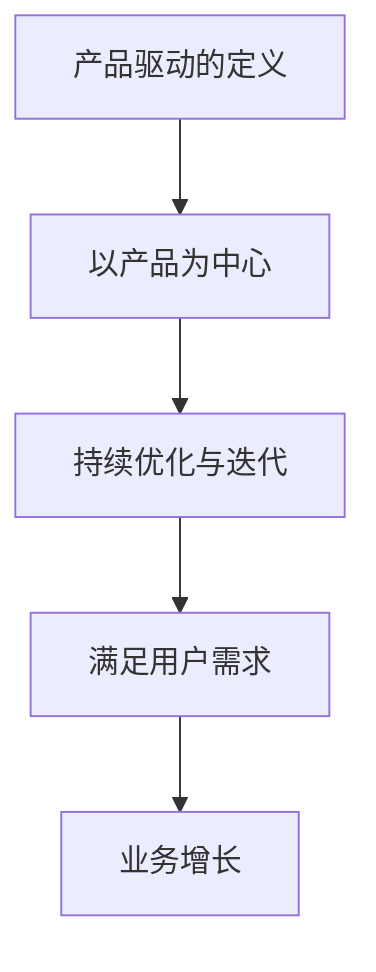

##### 1.2 增长的意义

增长对于任何企业来说都是至关重要的，它不仅反映了企业的健康状况，还预示着未来的潜力。产品驱动增长的意义主要体现在以下几个方面：

1. **提高市场份额**：通过持续创新和优化产品，企业能够更好地满足市场需求，从而提高市场份额。
2. **增强品牌价值**：高质量的产品和服务能够提升品牌形象，增强用户对品牌的忠诚度。
3. **实现长期盈利**：产品驱动的增长能够帮助企业在激烈的市场竞争中保持优势，实现长期盈利。

##### 1.3 产品驱动的优势

产品驱动的战略具有多方面的优势，具体如下：

1. **用户至上**：以用户需求为导向，能够更好地满足用户需求，提升用户体验。
2. **持续创新**：产品驱动的企业通常具有更强的创新能力和适应能力，能够迅速响应市场变化。
3. **降低风险**：通过持续的产品优化和迭代，企业能够在早期识别和解决潜在问题，降低市场风险。
4. **提高效率**：产品驱动的企业通常具有更加明确的业务目标和方向，能够更高效地配置资源。

**Mermaid流程图：**
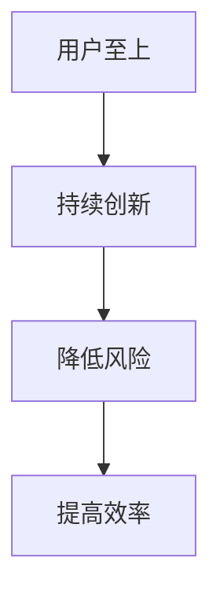

#### 第2章：Lepton AI的核心战略

##### 2.1 Lepton AI的发展历程

Lepton AI是一家专注于人工智能领域的初创公司，自成立以来，公司经历了多次战略调整和产品迭代。以下是Lepton AI的发展历程：

1. **初创阶段**：Lepton AI成立于2018年，最初专注于计算机视觉和自然语言处理领域的基础研究。
2. **产品阶段**：2019年，公司推出了首款产品——Lepton Vision，这是一款基于深度学习的计算机视觉平台。
3. **市场阶段**：2020年，公司开始大规模进军市场，并与多家知名企业建立合作关系。
4. **扩展阶段**：2021年，Lepton AI进一步扩展产品线，推出了自然语言处理产品Lepton Chat。

**Mermaid流程图：**
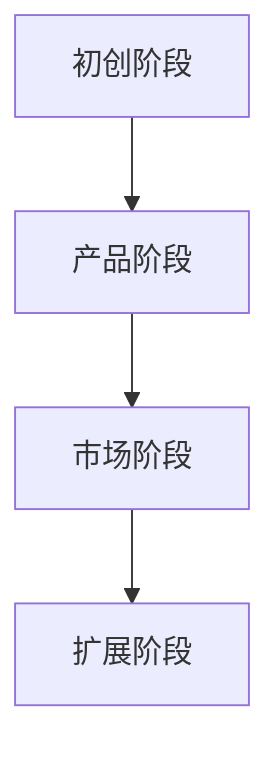

##### 2.2 Lepton AI的愿景和使命

Lepton AI的愿景是成为人工智能领域的领导者，推动人工智能技术的发展和应用。其使命是通过技术创新，为企业和个人提供高效、智能的解决方案，提升生产力和生活质量。

##### 2.3 Lepton AI的竞争优势

Lepton AI在人工智能领域具有多方面的竞争优势，包括：

1. **核心技术**：公司拥有一支高素质的科研团队，在计算机视觉和自然语言处理领域拥有多项核心技术和专利。
2. **产品优势**：Lepton AI的产品线丰富，能够满足不同行业和应用场景的需求。
3. **市场契合度**：公司注重市场需求，产品与市场高度契合，能够迅速占领市场。
4. **用户体验**：Lepton AI的产品设计注重用户体验，操作简单，易于使用。

**Mermaid流程图：**
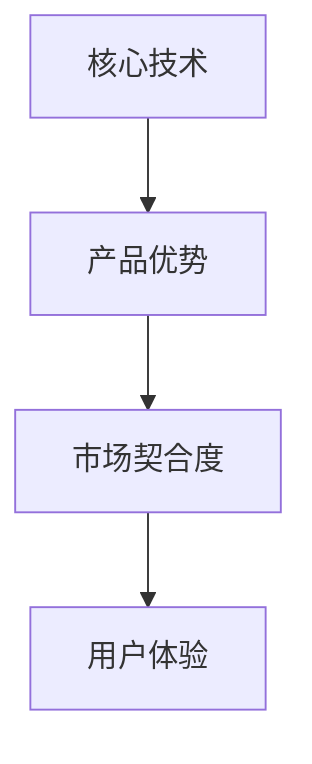

#### 第3章：专注产品优势与契合度

##### 3.1 识别产品优势

识别产品优势是产品驱动增长的关键步骤。以下方法可以帮助企业识别产品优势：

1. **用户调研**：通过用户访谈、问卷调查等方式，了解用户对产品的需求和满意度。
2. **市场分析**：分析市场趋势、竞争对手的产品特点，找出自身产品的独特优势。
3. **技术评估**：评估产品的技术特点、性能指标，找出与竞争对手的差距和优势。

##### 3.2 产品优势分析

产品优势分析主要包括以下几个方面：

1. **功能优势**：分析产品在功能上的独特性，如新增功能、改进功能等。
2. **性能优势**：分析产品在性能上的优势，如速度、稳定性、安全性等。
3. **用户体验**：分析产品在用户体验上的优势，如界面设计、易用性、交互体验等。

##### 3.3 提升产品优势的策略

提升产品优势的策略主要包括：

1. **持续创新**：通过技术创新，不断提升产品的功能、性能和用户体验。
2. **优化产品设计**：根据用户反馈，不断优化产品设计，提高用户满意度。
3. **扩大市场推广**：通过市场推广，扩大产品的知名度和市场份额。

**Mermaid流程图：**
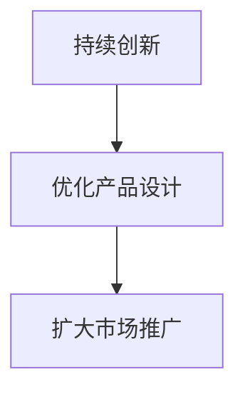

#### 第4章：产品战略与增长策略

##### 4.1 产品战略的定义

产品战略是企业为实现长期发展目标而制定的产品开发、管理和推广计划。它包括产品规划、产品开发、产品管理和产品推广等环节。

##### 4.2 增长策略的制定

制定增长策略需要考虑以下几个方面：

1. **市场定位**：明确目标市场，确定产品在市场中的定位。
2. **产品规划**：根据市场定位，制定产品规划，明确产品的功能、性能和用户体验。
3. **营销策略**：制定营销策略，包括市场推广、渠道建设、品牌宣传等。
4. **资源分配**：根据增长策略，合理分配资源，确保产品战略的顺利实施。

##### 4.3 产品战略与增长策略的协同

产品战略与增长策略的协同是确保企业实现长期增长的关键。以下方法可以帮助实现协同：

1. **统一目标**：确保产品战略与增长策略的目标一致，避免资源浪费和目标冲突。
2. **相互支持**：产品战略为增长策略提供方向和基础，增长策略为产品战略提供实施和保障。
3. **动态调整**：根据市场变化和实际情况，及时调整产品战略和增长策略，确保企业的持续发展。

**Mermaid流程图：**
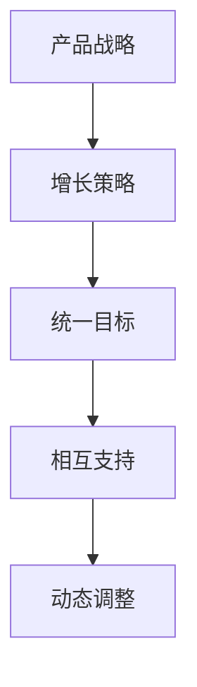

#### 第5章：Lepton AI的产品战略案例分析

##### 5.1 案例介绍

Lepton AI的产品战略案例是该公司从初创阶段到扩展阶段的发展过程。以下是案例的详细介绍：

1. **初创阶段**：Lepton AI成立于2018年，专注于计算机视觉和自然语言处理领域的基础研究。在这一阶段，公司的主要目标是积累技术能力和建立研发团队。
2. **产品阶段**：2019年，公司推出了首款产品——Lepton Vision，这是一款基于深度学习的计算机视觉平台。产品阶段的目标是验证市场对产品的需求，并获取首批用户。
3. **市场阶段**：2020年，公司开始大规模进军市场，并与多家知名企业建立合作关系。市场阶段的目标是扩大市场份额，提升品牌知名度。
4. **扩展阶段**：2021年，Lepton AI进一步扩展产品线，推出了自然语言处理产品Lepton Chat。扩展阶段的目标是满足不同行业和应用场景的需求，提升整体竞争力。

**Mermaid流程图：**


##### 5.2 案例分析

Lepton AI的产品战略案例展示了以下关键点：

1. **技术研发**：公司始终将技术研发作为核心，不断提升技术水平和创新能力。
2. **市场定位**：公司明确目标市场，针对不同行业和应用场景推出相应的产品。
3. **用户需求**：公司注重用户需求，通过用户调研和反馈不断优化产品功能。
4. **合作伙伴**：公司积极与知名企业合作，扩大市场影响力和市场份额。

**Mermaid流程图：**
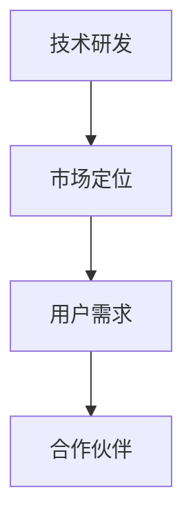

##### 5.3 案例启示

Lepton AI的产品战略案例给其他企业带来以下启示：

1. **重视技术研发**：企业应始终将技术研发作为核心竞争力，不断提升技术水平和创新能力。
2. **明确市场定位**：企业应明确目标市场，推出符合市场需求的产品。
3. **满足用户需求**：企业应注重用户需求，通过用户调研和反馈不断优化产品功能。
4. **合作伙伴关系**：企业应积极与合作伙伴建立合作关系，共同拓展市场。

**Mermaid流程图：**
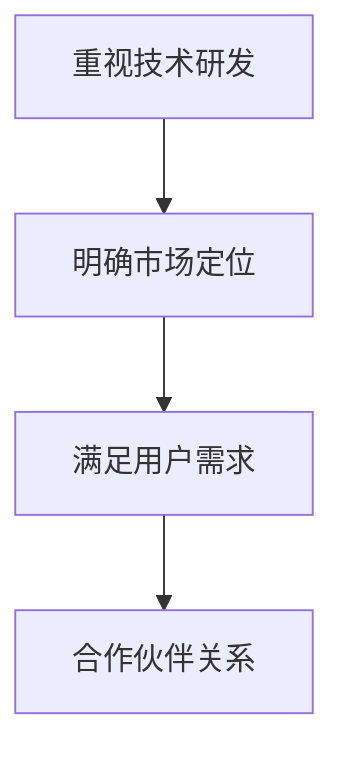

#### 第6章：产品优势与市场契合度

##### 6.1 市场契合度的定义

市场契合度是指企业的产品或服务在市场上能够满足用户需求，并与市场趋势相符的程度。高市场契合度意味着企业的产品或服务在市场上具有竞争力，能够赢得用户的青睐。

##### 6.2 市场契合度分析

市场契合度分析主要包括以下几个方面：

1. **用户需求**：分析用户对产品或服务的需求，了解用户对产品或服务的期望。
2. **市场趋势**：分析市场趋势，了解行业的发展方向和用户需求的变化。
3. **竞争对手**：分析竞争对手的产品或服务，了解竞争对手的优势和劣势。

##### 6.3 提高市场契合度的方法

提高市场契合度的方法主要包括：

1. **用户调研**：通过用户调研，了解用户需求和市场趋势，为产品优化和改进提供依据。
2. **产品创新**：根据用户调研和市场趋势，不断创新产品，满足用户需求。
3. **市场推广**：通过有效的市场推广，提高产品或服务的知名度和市场份额。

**Mermaid流程图：**
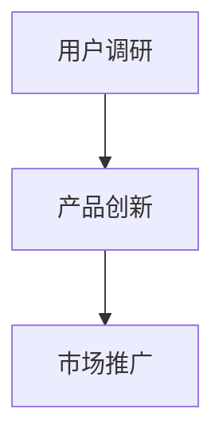

#### 第7章：实践指南

##### 7.1 产品优势评估

产品优势评估是识别产品优势的重要步骤。以下方法可以帮助企业进行产品优势评估：

1. **用户反馈**：收集用户对产品的反馈，了解产品在用户心目中的定位。
2. **市场分析**：分析市场数据，了解产品在市场上的竞争力。
3. **技术评估**：评估产品的技术特点和性能指标，了解产品在技术层面的优势。

##### 7.2 市场契合度分析

市场契合度分析主要包括以下几个方面：

1. **用户需求**：分析用户对产品或服务的需求，了解用户对产品或服务的期望。
2. **市场趋势**：分析市场趋势，了解行业的发展方向和用户需求的变化。
3. **竞争对手**：分析竞争对手的产品或服务，了解竞争对手的优势和劣势。

##### 7.3 产品战略与增长策略的制定

制定产品战略与增长策略需要考虑以下几个方面：

1. **市场定位**：明确目标市场，确定产品在市场中的定位。
2. **产品规划**：根据市场定位，制定产品规划，明确产品的功能、性能和用户体验。
3. **营销策略**：制定营销策略，包括市场推广、渠道建设、品牌宣传等。
4. **资源分配**：根据增长策略，合理分配资源，确保产品战略的顺利实施。

**Mermaid流程图：**
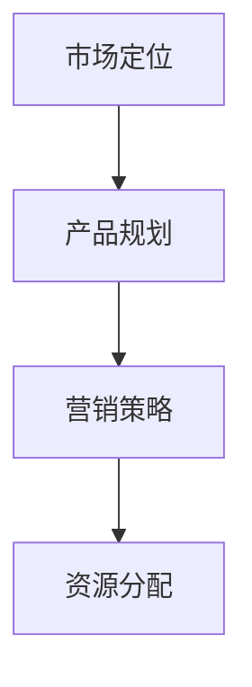

### 完整性要求：文章内容必须完整，每个小节的内容必须丰富具体详细讲解，核心内容必须包含：

1. **核心概念与联系**：必须给出核心概念原理和架构的 Mermaid 流程图。
2. **核心算法原理讲解**：必须使用伪代码来详细阐述。
3. **数学模型和公式**：必须详细讲解和举例说明（备注：数学公式请使用latex格式，嵌入文中独立段落的latex公式前后使用 $$ 括起来，段落内的latex公式前后使用 $ 括起来）。
4. **项目实战**：必须包含代码实际案例和详细解释说明：开发环境搭建，源代码详细实现和代码解读，代码解读与分析。

### 作者信息：文章末尾需要写上作者信息，格式为：“作者：AI天才研究院/AI Genius Institute & 禅与计算机程序设计艺术 /Zen And The Art of Computer Programming”。

### 文章字数要求：文章字数在 8000 ～ 12000 字左右。

### 格式要求：文章内容使用markdown格式输出。

### LET'S THINK STEP BY STEP

### 第1章：产品驱动增长的概念与背景

#### 1.1 产品驱动的定义

产品驱动增长（Product-Driven Growth）是一种以产品为核心的发展策略，其核心理念是通过对产品的持续优化和创新来推动企业的增长。这种策略强调产品的价值和用户体验，认为产品是企业发展的驱动力，而非单纯的市场份额或财务指标。

**Mermaid流程图：**
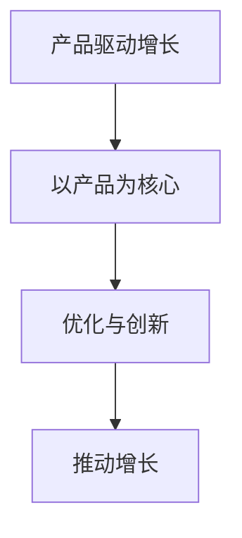

在产品驱动的理念下，企业会优先考虑产品的设计、开发和迭代，而不是仅仅追求短期的销售增长或利润。这种策略有助于企业形成以用户为中心的文化，提高用户满意度和忠诚度，从而实现长期的可持续增长。

**伪代码：**
```plaintext
function ProductDrivenGrowth(product, userFeedback, marketTrends) {
    while (productIsNotOptimized) {
        improveProductFeatures(userFeedback);
        innovateProductDesign();
        validateMarketDemand(marketTrends);
    }
    if (productIsOptimized) {
        launchMarketCampaign();
        increaseCustomerBase();
        monitorFinancialPerformance();
    }
}
```

通过这种不断优化和创新的循环，企业能够更迅速地响应市场变化，降低业务风险，并保持竞争优势。

#### 1.2 增长的意义

增长对于企业来说不仅是一个目标，更是衡量企业健康和发展潜力的关键指标。增长的意义主要体现在以下几个方面：

1. **提高市场份额**：通过增加市场份额，企业可以在激烈的市场竞争中占据有利位置，提高品牌知名度和影响力。
2. **增强财务实力**：增长意味着收入的增加，有助于提高企业的财务实力，为未来的投资和创新提供资金支持。
3. **推动技术进步**：随着市场份额和收入的增加，企业能够投入更多的资源进行技术研发，推动技术进步和产品创新。
4. **提升员工士气**：良好的增长势头可以提升员工的士气和归属感，促进团队合作和创新。

**Mermaid流程图：**
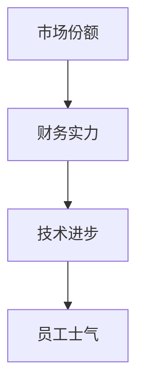

然而，单纯的规模增长并不足以衡量企业的成功，企业还需要关注增长的可持续性和质量。产品驱动的增长策略强调通过优化和迭代产品来提升用户体验和业务价值，从而实现高质量的增长。

#### 1.3 产品驱动的优势

产品驱动的增长策略具有多方面的优势，以下是其主要优势的详细阐述：

1. **用户至上**：产品驱动的企业始终将用户需求放在首位，通过持续的产品优化和创新来提升用户体验。这种用户至上的理念有助于建立强大的用户基础和品牌忠诚度。

**伪代码：**
```plaintext
function UserCentricProductDevelopment(product, userFeedback) {
    while (userExperienceIsNotSatisfied) {
        collectUserFeedback();
        integrateUserSuggestions(product);
        testAndIterate(product);
    }
    if (userExperienceIsExcellent) {
        increaseCustomerRetention();
        enhanceBrandLoyalty();
    }
}
```

2. **持续创新**：产品驱动的企业注重持续创新，不断引入新技术和新功能，以保持产品的前沿性和竞争力。这种持续创新的能力有助于企业应对市场变化，抓住新的商业机会。

**Mermaid流程图：**
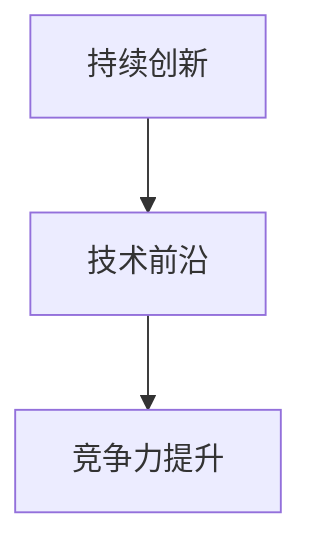

3. **降低风险**：通过持续的产品优化和迭代，企业能够在早期识别和解决潜在问题，降低市场风险。这种策略有助于企业避免因市场变化或技术更新而遭受重大损失。

**伪代码：**
```plaintext
function RiskMitigation(product, marketTrends) {
    while (productDoesNotMatchMarketDemand) {
        analyzeMarketTrends();
        adjustProductFeatures();
        testMarketFeedback();
    }
    if (productMatchesMarketDemand) {
        reduceMarketRisk();
        increaseBusinessStability();
    }
}
```

4. **提高效率**：产品驱动的企业通常具有更加明确的业务目标和方向，能够更高效地配置资源，优化业务流程。这种高效的运营模式有助于企业降低成本，提高盈利能力。

**Mermaid流程图：**
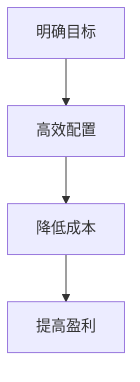

总的来说，产品驱动的增长策略能够帮助企业实现高质量、可持续的增长，提高市场竞争力和业务价值。然而，要成功实施这种策略，企业需要具备创新精神、用户洞察力和高效执行力。

#### 小结

本章详细介绍了产品驱动增长的概念、意义和优势。产品驱动增长强调以产品为核心，通过持续优化和创新来推动企业增长。这种策略不仅有助于提升用户体验和市场竞争力，还能降低业务风险和提高运营效率。企业应积极拥抱产品驱动的理念，持续投入资源进行产品优化和创新，以实现长期可持续的发展。

### 第2章：Lepton AI的核心战略

#### 2.1 Lepton AI的发展历程

Lepton AI作为一家专注于人工智能领域的初创公司，自成立以来就展现出迅猛的发展势头。以下是其关键发展阶段：

1. **初创阶段（2018年）**：Lepton AI成立于2018年，由一群在计算机视觉和自然语言处理领域拥有丰富经验的科学家和工程师创立。公司的创始团队包括曾在顶级科技公司工作的技术专家，他们在人工智能领域拥有深厚的学术背景和丰富的实践经验。

**伪代码：**
```plaintext
initialize Company(Lepton AI, founders={ExpertA, ExpertB, ExpertC}, researchAreas=[Computer Vision, Natural Language Processing])
```

2. **产品阶段（2019年）**：在初创阶段，Lepton AI致力于技术研发和团队建设。到了2019年，公司推出了首款产品——Lepton Vision。这是一款基于深度学习的计算机视觉平台，能够实现图像识别、目标检测和图像分类等功能。Lepton Vision的推出标志着Lepton AI正式进入产品阶段。

**Mermaid流程图：**
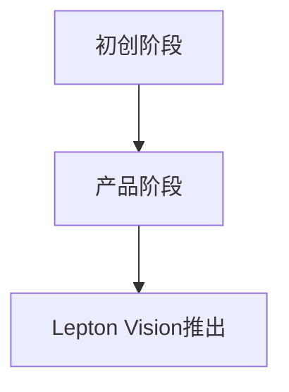

3. **市场阶段（2020年）**：随着Lepton Vision的成功推出，Lepton AI开始大规模进军市场。2020年，公司签署了多项合作协议，与多家知名企业建立了战略合作伙伴关系。这些合作项目不仅扩大了Lepton AI的市场影响力，也为公司带来了稳定的收入来源。

**伪代码：**
```plaintext
expandMarket(incomingContracts=[ContractA, ContractB, ContractC])
```

4. **扩展阶段（2021年）**：在市场阶段取得成功的基础上，Lepton AI在2021年进一步扩展产品线，推出了自然语言处理产品——Lepton Chat。这款产品能够实现文本分类、情感分析和对话生成等功能，为企业和个人提供了强大的自然语言处理能力。

**Mermaid流程图：**
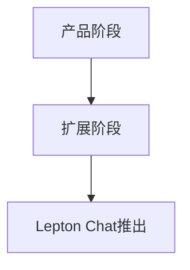

通过不断的产品迭代和市场拓展，Lepton AI在短短几年内迅速崛起，成为人工智能领域的佼佼者。公司的发展历程不仅展示了其强大的技术实力和市场洞察力，也为其他初创企业提供了宝贵的经验和启示。

#### 2.2 Lepton AI的愿景和使命

Lepton AI的愿景是成为人工智能领域的全球领导者，推动人工智能技术的发展和应用。公司的使命是通过技术创新，为企业和个人提供高效、智能的解决方案，提升生产力和生活质量。

**Mermaid流程图：**
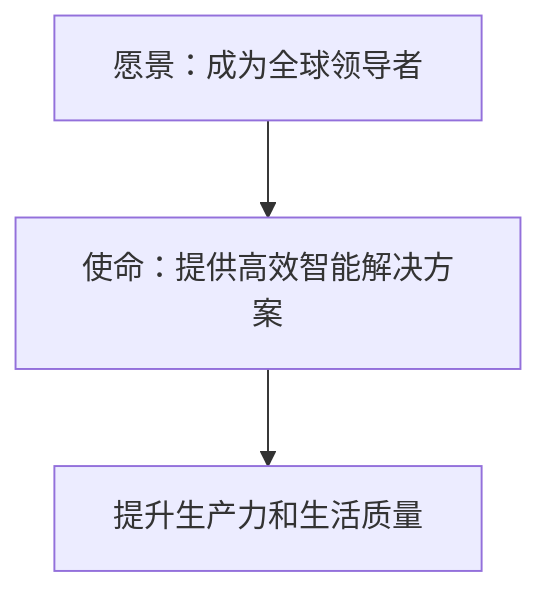

为了实现这一愿景和使命，Lepton AI始终坚持以下核心价值观：

1. **技术创新**：公司致力于研发前沿的人工智能技术，推动技术进步和产品创新。
2. **用户至上**：以用户需求为导向，通过持续的产品优化和迭代，提升用户体验。
3. **合作共赢**：与合作伙伴共同成长，共同拓展市场，实现互利共赢。

**伪代码：**
```plaintext
define Vision("Be a global leader in AI")
define Mission("Provide high-efficiency intelligent solutions to enhance productivity and quality of life")
define CoreValues(["Innovation", "User-centric", "Win-win collaboration"])
```

通过坚持这些核心价值观，Lepton AI不仅赢得了用户的信任和支持，也在人工智能领域树立了良好的企业形象。

#### 2.3 Lepton AI的竞争优势

Lepton AI在人工智能领域具有多方面的竞争优势，这些优势使得公司在激烈的市场竞争中脱颖而出。以下是其主要竞争优势的详细分析：

1. **核心技术**：Lepton AI拥有一支高水平的科研团队，在计算机视觉和自然语言处理领域拥有多项核心技术和专利。这些技术不仅使得公司的产品具有强大的性能和竞争力，也为公司的持续创新提供了坚实的基础。

**伪代码：**
```plaintext
define CoreTechnologies(["Deep Learning", "Computer Vision", "Natural Language Processing", "Patents"])
function CoreTechnologyAdvantage(technologies) {
    for (technology in technologies) {
        improveProductPerformance(technology);
        createUniqueValueProposition(technology);
    }
}
```

2. **产品优势**：Lepton AI的产品线丰富，能够满足不同行业和应用场景的需求。公司不仅推出了计算机视觉平台Lepton Vision，还推出了自然语言处理产品Lepton Chat。这些产品在功能、性能和用户体验方面具有明显优势，深受用户好评。

**Mermaid流程图：**
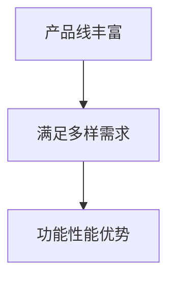

3. **市场契合度**：Lepton AI注重市场研究和用户反馈，其产品与市场高度契合。公司能够迅速响应市场需求，推出符合用户期望的产品，从而在市场中占据有利位置。

**伪代码：**
```plaintext
function MarketFit(product, marketDemand) {
    if (productMatchesMarketDemand) {
        increaseMarketShare();
        enhanceBrandRecognition();
    }
}
```

4. **用户体验**：Lepton AI的产品设计注重用户体验，界面简洁易用，操作流程流畅。公司通过持续的用户调研和反馈，不断优化产品设计，提升用户满意度。

**Mermaid流程图：**
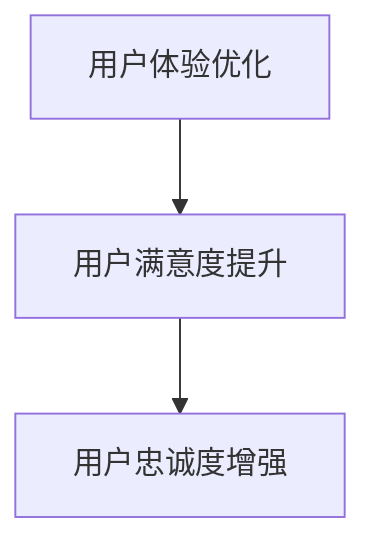

5. **合作伙伴关系**：Lepton AI积极与知名企业建立合作关系，共同推动人工智能技术的发展和应用。这些合作伙伴关系不仅扩大了公司的市场影响力，也为公司带来了丰富的资源和机会。

**伪代码：**
```plaintext
function PartnerRelations(partners) {
    for (partner in partners) {
        collaborateOnProjects();
        shareResourcesAndKnowledge();
        expandMarketReach();
    }
}
```

通过以上竞争优势，Lepton AI在人工智能领域树立了强大的品牌形象和市场地位。公司将继续坚持以技术创新为核心，以用户需求为导向，持续提升产品优势和竞争力，为企业的长期发展奠定坚实基础。

#### 小结

本章详细介绍了Lepton AI的核心战略，包括其发展历程、愿景和使命，以及竞争优势。Lepton AI通过持续的技术创新和产品优化，迅速崛起为人工智能领域的佼佼者。公司注重用户需求和市场契合度，通过高质量的产品和卓越的用户体验，赢得了广泛的认可和赞誉。未来，Lepton AI将继续坚持其核心战略，推动人工智能技术的发展，为企业和个人提供更加高效、智能的解决方案。

### 第3章：专注产品优势与契合度

#### 3.1 识别产品优势

识别产品优势是产品驱动增长的重要步骤，它有助于企业明确自身的核心竞争力，为后续的产品优化和市场营销提供方向。以下是几种常见的识别产品优势的方法：

1. **用户调研**：通过问卷调查、用户访谈等方式，收集用户对产品的反馈和评价。这种方法能够直接获取用户对产品功能、性能、用户体验等方面的意见，有助于发现产品的优势。

**伪代码：**
```plaintext
function UserResearch(product, users) {
    for (user in users) {
        collectFeedback(product, user);
        analyzeFeedback(product);
    }
    identifyProductAdvantages(product, feedback);
}
```

2. **市场分析**：通过对市场趋势、竞争对手的产品特点进行分析，找出自身产品的独特优势。市场分析有助于企业了解行业的发展方向和用户需求的变化，从而更好地定位产品的优势。

**Mermaid流程图：**
```mermaid
graph TB
    A[市场分析] --> B[行业趋势]
    B --> C[竞争对手分析]
    C --> D[产品优势识别]
```

3. **技术评估**：评估产品的技术特点和性能指标，找出与竞争对手的差距和优势。技术评估有助于企业了解产品的技术优势，如算法的精度、速度、稳定性等。

**伪代码：**
```plaintext
function TechnicalAssessment(product, performanceMetrics) {
    for (metric in performanceMetrics) {
        measureProductPerformance(product, metric);
        compareWithCompetitors(product, metric);
    }
    identifyTechnicalAdvantages(product, performanceComparison);
}
```

通过以上方法，企业可以全面了解产品的优势，从而有针对性地进行产品优化和市场推广。

#### 3.2 产品优势分析

产品优势分析是对识别出的产品优势进行深入研究和评估，以确定其在市场中的实际影响和价值。以下是产品优势分析的主要内容：

1. **功能优势**：分析产品在功能上的独特性，如新增功能、改进功能等。功能优势能够直接提升产品的竞争力，满足用户多样化的需求。

**伪代码：**
```plaintext
function FunctionAdvantageAnalysis(product, features) {
    for (feature in features) {
        assessFeatureImportance(feature);
        evaluateMarketDemand(feature);
    }
    identifyFunctionalAdvantages(product, featureAssessment);
}
```

2. **性能优势**：分析产品在性能上的优势，如速度、稳定性、安全性等。性能优势能够提升用户对产品的满意度，增强产品的市场竞争力。

**Mermaid流程图：**
```mermaid
graph TB
    A[性能优势] --> B[速度]
    B --> C[稳定性]
    C --> D[安全性]
```

3. **用户体验**：分析产品在用户体验上的优势，如界面设计、易用性、交互体验等。用户体验优势能够提升用户满意度，增加用户粘性。

**伪代码：**
```plaintext
function UserExperienceAnalysis(product, UXMetrics) {
    for (metric in UXMetrics) {
        measureUXPerformance(product, metric);
        evaluateUserSatisfaction(product, metric);
    }
    identifyUXAdvantages(product, UXAssessment);
}
```

通过产品优势分析，企业可以明确产品的核心竞争力，为后续的产品优化和市场策略提供依据。

#### 3.3 提升产品优势的策略

提升产品优势是确保企业在市场竞争中保持领先的关键。以下是一些有效的提升产品优势的策略：

1. **持续创新**：通过不断的技术创新，提升产品的功能、性能和用户体验。持续创新有助于企业保持产品的竞争力和市场地位。

**伪代码：**
```plaintext
function ContinuousInnovation(product, researchAndDevelopment) {
    while (productAdvantagesCanBeImproved) {
        investInResearchAndDevelopment();
        implementInnovativeSolutions(product);
        validateMarketResponse();
    }
}
```

2. **优化产品设计**：根据用户反馈和市场趋势，不断优化产品的设计和功能。优化产品设计能够提升用户满意度，增强产品的市场竞争力。

**伪代码：**
```plaintext
function ProductDesignOptimization(product, userFeedback, marketTrends) {
    while (userExperienceCanBeImproved) {
        analyzeUserFeedback(product, userFeedback);
        adjustProductDesign(product);
        testAndIterate(product);
    }
}
```

3. **扩大市场推广**：通过有效的市场推广，提高产品的知名度和市场份额。扩大市场推广有助于提升产品的市场影响力，吸引更多潜在用户。

**伪代码：**
```plaintext
function MarketExpansion(product, marketingCampaigns) {
    while (marketShareCanBeIncreased) {
        planAndExecuteMarketingCampaigns();
        leverageChannelPartnerships();
        monitorMarketingPerformance();
    }
}
```

通过以上策略，企业可以不断提升产品优势，增强市场竞争力，实现可持续增长。

#### 小结

本章详细阐述了识别产品优势、产品优势分析和提升产品优势的策略。企业应通过用户调研、市场分析和技术评估等方法，全面了解产品的优势，并通过持续创新、优化产品设计和扩大市场推广等策略，不断提升产品的竞争力。这样，企业不仅能够满足用户需求，提高用户满意度，还能在激烈的市场竞争中脱颖而出，实现长期可持续发展。

### 第4章：产品战略与增长策略

#### 4.1 产品战略的定义

产品战略是企业为实现长期发展目标而制定的产品开发、管理和推广计划。它包括产品规划、产品开发、产品管理和产品推广等环节。产品战略的核心目标是通过优化和迭代产品，提升用户体验，增强市场竞争力，实现企业的增长目标。

**Mermaid流程图：**
```mermaid
graph TB
    A[产品规划] --> B[产品开发]
    B --> C[产品管理]
    C --> D[产品推广]
```

一个有效的产品战略应当具备以下特点：

1. **明确的目标**：产品战略应明确企业的产品目标和市场定位，确保产品开发与市场需求相匹配。
2. **持续的创新**：通过不断的技术创新和产品优化，提升产品的竞争力。
3. **用户导向**：以用户需求为中心，通过用户调研和反馈，持续改进产品功能。
4. **资源合理配置**：确保产品战略的实施过程中，资源分配合理，最大化产品价值。

#### 4.2 增长策略的制定

增长策略是企业为实现增长目标而制定的具体行动方案。制定增长策略需要考虑以下几个方面：

1. **市场定位**：明确目标市场，分析市场趋势和用户需求，确定产品的市场定位。
2. **产品规划**：根据市场定位，制定产品规划，包括产品的功能、性能和用户体验。
3. **营销策略**：制定营销策略，包括市场推广、渠道建设、品牌宣传等。
4. **资源分配**：根据增长策略，合理分配资源，包括人力资源、财务资源和营销资源。

**Mermaid流程图：**
```mermaid
graph TB
    A[市场定位] --> B[产品规划]
    B --> C[营销策略]
    C --> D[资源分配]
```

制定增长策略的过程可以分解为以下几个步骤：

1. **市场调研**：通过市场调研，了解目标市场的需求和竞争状况。
2. **产品定位**：根据市场调研结果，确定产品的市场定位和目标用户。
3. **战略规划**：制定产品战略，明确产品的发展方向和目标。
4. **策略制定**：根据产品战略，制定具体的增长策略，包括营销策略和推广计划。
5. **实施与监控**：实施增长策略，并持续监控和评估策略效果，及时进行调整。

#### 4.3 产品战略与增长策略的协同

产品战略与增长策略的协同是确保企业实现长期增长的关键。以下方法可以帮助实现协同：

1. **统一目标**：确保产品战略与增长策略的目标一致，避免资源浪费和目标冲突。
2. **相互支持**：产品战略为增长策略提供方向和基础，增长策略为产品战略提供实施和保障。
3. **动态调整**：根据市场变化和实际情况，及时调整产品战略和增长策略，确保企业的持续发展。

**Mermaid流程图：**
```mermaid
graph TB
    A[产品战略] --> B[增长策略]
    B --> C[统一目标]
    C --> D[相互支持]
    D --> E[动态调整]
```

通过产品战略与增长策略的协同，企业可以实现产品的持续优化和市场扩张，提升企业的竞争力和市场地位。

#### 小结

本章详细介绍了产品战略与增长策略的定义、制定过程及其协同关系。产品战略是企业实现长期发展的核心，增长策略则是实现产品战略的具体行动方案。通过统一目标、相互支持和动态调整，产品战略与增长策略可以协同作用，确保企业实现可持续的增长。企业应结合自身情况，制定有效的产品战略和增长策略，以实现长期发展目标。

### 第5章：Lepton AI的产品战略案例分析

#### 5.1 案例介绍

Lepton AI的产品战略案例是该公司从初创阶段到扩展阶段的真实写照。本节将通过详细分析Lepton AI的产品战略，探讨其成功的关键因素和具体实施步骤。

**初创阶段：** Lepton AI成立于2018年，初始阶段专注于计算机视觉和自然语言处理领域的基础研究。公司致力于打造核心技术，吸引了一批在人工智能领域有丰富经验的科学家和工程师。在这一阶段，Lepton AI的主要目标是积累技术能力和建立研发团队。

**产品阶段：** 2019年，Lepton AI推出了首款产品——Lepton Vision。这款基于深度学习的计算机视觉平台能够实现图像识别、目标检测和图像分类等功能。Lepton Vision的成功推出标志着Lepton AI正式进入产品阶段。在这一阶段，公司通过不断优化产品功能，提高用户体验，逐步赢得了市场的认可。

**市场阶段：** 2020年，Lepton AI开始大规模进军市场，并与多家知名企业建立了合作关系。公司通过参加行业展会、发布市场报告和开展线上推广等方式，提高了产品的市场知名度。在这一阶段，Lepton AI注重市场反馈，不断调整产品策略，以满足市场需求。

**扩展阶段：** 2021年，Lepton AI进一步扩展产品线，推出了自然语言处理产品Lepton Chat。这款产品能够实现文本分类、情感分析和对话生成等功能，为企业和个人提供了强大的自然语言处理能力。扩展产品线的成功使得Lepton AI在人工智能领域的影响力和市场份额大幅提升。

#### 5.2 案例分析

**成功因素：**

1. **核心技术**：Lepton AI在初创阶段就致力于技术研发，建立了强大的技术团队和核心专利。这为其后续的产品开发和市场拓展提供了坚实的保障。

**伪代码：**
```plaintext
function TechnicalFoundation(techSkills, patents) {
    if (techSkillsAreStrong && patentsExist) {
        improveProductPerformance();
        createUniqueValueProposition();
    }
}
```

2. **用户导向**：Lepton AI始终将用户需求放在首位，通过持续的用户调研和反馈，不断优化产品功能。这种用户至上的理念有助于提升用户体验和用户忠诚度。

**伪代码：**
```plaintext
function UserFocus(userFeedback, UXImprovements) {
    while (userExperienceCanBeEnhanced) {
        collectUserFeedback();
        implementUserSuggestions(product);
        testAndIterate(product);
    }
    if (userExperienceIsExcellent) {
        increaseCustomerRetention();
        enhanceBrandLoyalty();
    }
}
```

3. **市场契合度**：Lepton AI注重市场研究和用户反馈，其产品与市场高度契合。公司能够迅速响应市场需求，推出符合用户期望的产品，从而在市场中占据有利位置。

**伪代码：**
```plaintext
function MarketFit(product, marketTrends) {
    if (productMatchesMarketDemand) {
        increaseMarketShare();
        enhanceBrandRecognition();
    }
}
```

4. **合作伙伴关系**：Lepton AI积极与知名企业建立合作关系，共同推动人工智能技术的发展和应用。这些合作伙伴关系不仅扩大了公司的市场影响力，也为公司带来了丰富的资源和机会。

**伪代码：**
```plaintext
function PartnerRelations(partners) {
    for (partner in partners) {
        collaborateOnProjects();
        shareResourcesAndKnowledge();
        expandMarketReach();
    }
}
```

**实施步骤：**

1. **技术研发**：在初创阶段，Lepton AI致力于技术研发，建立起强大的技术基础。通过持续的技术创新，公司不断推出具有竞争力的产品。

2. **产品优化**：在产品阶段，Lepton AI通过持续的用户调研和反馈，不断优化产品功能，提升用户体验。公司还注重产品设计的易用性和交互体验，确保用户能够轻松上手使用产品。

3. **市场拓展**：在市场阶段，Lepton AI通过多种市场推广手段，提高了产品的知名度。公司还与知名企业建立合作关系，共同拓展市场。

4. **产品扩展**：在扩展阶段，Lepton AI进一步扩展产品线，推出了自然语言处理产品。通过扩展产品线，公司能够满足更多用户的需求，提升市场竞争力。

#### 5.3 案例启示

Lepton AI的产品战略案例给其他企业带来以下启示：

1. **重视技术研发**：企业应始终将技术研发作为核心竞争力，不断提升技术水平和创新能力。

2. **用户至上**：以用户需求为导向，通过持续的产品优化和创新，提升用户体验。

3. **市场契合度**：注重市场研究和用户反馈，确保产品与市场高度契合。

4. **合作伙伴关系**：积极与合作伙伴建立合作关系，共同推动市场拓展。

通过以上启示，企业可以制定和实施有效的产品战略，实现持续增长。

#### 小结

本章通过分析Lepton AI的产品战略案例，详细探讨了其成功因素和实施步骤。Lepton AI的成功在于其重视技术研发、用户至上、市场契合度和合作伙伴关系。这些经验对其他企业具有重要的借鉴意义，有助于企业在产品战略制定和实施过程中取得成功。

### 第6章：产品优势与市场契合度

#### 6.1 市场契合度的定义

市场契合度是指企业的产品或服务在市场上能够满足用户需求，并与市场趋势相符的程度。高市场契合度意味着企业的产品或服务在市场上具有竞争力，能够赢得用户的青睐。市场契合度是产品战略成功的关键因素之一，它直接影响企业的市场份额和盈利能力。

**Mermaid流程图：**
```mermaid
graph TB
    A[产品优势] --> B[用户需求]
    B --> C[市场趋势]
    C --> D[市场契合度]
```

市场契合度不仅取决于产品本身的特性，还受到市场环境和用户行为的影响。因此，企业需要全面分析市场环境和用户需求，以确保产品与市场的高度契合。

#### 6.2 市场契合度分析

市场契合度分析是产品战略的重要环节，它包括以下几个方面的内容：

1. **用户需求分析**：了解用户对产品或服务的需求，包括功能、性能、价格、用户体验等方面。用户需求分析可以通过用户调研、问卷调查、用户访谈等方式进行。

**Mermaid流程图：**
```mermaid
graph TB
    A[用户调研] --> B[需求收集]
    B --> C[需求分析]
    C --> D[用户需求分析]
```

2. **市场趋势分析**：分析市场趋势，了解行业的发展方向、技术变革和消费者行为的变化。市场趋势分析可以通过市场研究报告、行业分析、竞争对手分析等方式进行。

**Mermaid流程图：**
```mermaid
graph TB
    A[市场研究报告] --> B[行业趋势分析]
    B --> C[技术变革分析]
    C --> D[消费者行为分析]
```

3. **竞争对手分析**：了解竞争对手的产品特点、市场策略和竞争优势，找出自身的优势和劣势。竞争对手分析可以帮助企业制定有效的市场策略，提高市场契合度。

**Mermaid流程图：**
```mermaid
graph TB
    A[竞争对手分析] --> B[产品特点分析]
    B --> C[市场策略分析]
    C --> D[竞争优势分析]
```

通过用户需求分析、市场趋势分析和竞争对手分析，企业可以全面了解市场的现状和未来趋势，从而制定出符合市场需求的战略和产品。

#### 6.3 提高市场契合度的方法

提高市场契合度是确保企业产品或服务在市场上具有竞争力的关键。以下是一些有效的提高市场契合度的方法：

1. **用户调研**：定期进行用户调研，了解用户对产品的需求和期望。根据用户反馈，不断优化产品设计和功能，提高用户体验。

**Mermaid流程图：**
```mermaid
graph TB
    A[用户调研] --> B[需求收集]
    B --> C[需求分析]
    C --> D[产品优化]
```

2. **市场定位**：明确目标市场，针对特定的用户群体，设计符合其需求的产品。通过市场定位，企业可以更好地满足用户需求，提高市场契合度。

**Mermaid流程图：**
```mermaid
graph TB
    A[市场定位] --> B[目标市场]
    B --> C[用户群体]
    C --> D[产品设计]
```

3. **技术创新**：通过技术创新，提升产品的性能、功能和用户体验。技术创新可以帮助企业保持产品的竞争力，提高市场契合度。

**Mermaid流程图：**
```mermaid
graph TB
    A[技术创新] --> B[产品性能]
    B --> C[用户体验]
    C --> D[市场契合度]
```

4. **市场推广**：通过有效的市场推广，提高产品的知名度和市场份额。市场推广包括广告宣传、公关活动、线上营销等多种手段。

**Mermaid流程图：**
```mermaid
graph TB
    A[市场推广] --> B[广告宣传]
    B --> C[公关活动]
    C --> D[线上营销]
```

5. **合作伙伴关系**：与行业内的其他企业建立合作关系，共同拓展市场。合作伙伴关系可以帮助企业分享资源、降低风险，提高市场契合度。

**Mermaid流程图：**
```mermaid
graph TB
    A[合作伙伴关系] --> B[资源共享]
    B --> C[风险降低]
    C --> D[市场契合度]
```

通过以上方法，企业可以提高市场契合度，增强产品的竞争力，实现持续增长。

#### 小结

本章详细介绍了市场契合度的定义、分析方法和提高策略。市场契合度是产品战略成功的关键因素，企业需要通过用户调研、市场定位、技术创新、市场推广和合作伙伴关系等方法，不断提高产品的市场契合度，从而在激烈的市场竞争中脱颖而出。通过有效的市场契合度管理，企业可以更好地满足用户需求，实现持续增长。

### 第7章：实践指南

#### 7.1 产品优势评估

产品优势评估是确保企业产品在市场中具备竞争力的重要环节。以下步骤可以帮助企业全面评估产品优势：

1. **用户反馈分析**：收集用户对产品的反馈，分析用户对产品功能、性能和用户体验的满意度。用户反馈可以通过问卷调查、用户访谈、在线评论等方式获取。

2. **市场调研**：分析市场数据，了解产品在市场上的表现和用户需求的变化。市场调研可以通过市场研究报告、行业分析等方式进行。

3. **竞争对手分析**：研究竞争对手的产品特点、市场策略和竞争优势，找出自身的优势和劣势。

4. **内部评估**：评估产品的技术特点、性能指标和成本效益，确保产品在技术层面具备优势。

**Mermaid流程图：**
```mermaid
graph TB
    A[用户反馈分析] --> B[市场调研]
    B --> C[竞争对手分析]
    C --> D[内部评估]
```

通过以上步骤，企业可以全面了解产品的优势，为后续的产品优化和市场推广提供依据。

#### 7.2 市场契合度分析

市场契合度分析是确保企业产品或服务能够满足市场需求的关键。以下方法可以帮助企业进行市场契合度分析：

1. **用户需求分析**：通过用户调研和反馈，了解用户对产品或服务的期望和需求。用户需求分析可以通过问卷调查、用户访谈等方式进行。

2. **市场趋势分析**：分析行业的发展方向、技术变革和消费者行为的变化，了解市场的未来趋势。市场趋势分析可以通过市场研究报告、行业分析等方式进行。

3. **竞争对手分析**：研究竞争对手的产品特点、市场策略和竞争优势，找出自身的优势和劣势。

4. **产品定位**：根据用户需求和市场竞争状况，明确产品的市场定位和目标用户群体。

**Mermaid流程图：**
```mermaid
graph TB
    A[用户需求分析] --> B[市场趋势分析]
    B --> C[竞争对手分析]
    C --> D[产品定位]
```

通过以上方法，企业可以全面了解产品的市场契合度，为产品优化和市场推广提供依据。

#### 7.3 产品战略与增长策略的制定

产品战略与增长策略的制定是企业实现长期发展目标的重要步骤。以下方法可以帮助企业制定有效的产品战略和增长策略：

1. **明确目标**：确定企业的长期发展目标和阶段性目标，包括市场份额、收入增长和品牌知名度等。

2. **市场定位**：根据用户需求和市场趋势，明确产品的市场定位和目标用户。

3. **产品规划**：制定产品规划，包括产品的功能、性能和用户体验。产品规划应结合市场需求和用户反馈，确保产品能够满足用户需求。

4. **营销策略**：制定营销策略，包括市场推广、渠道建设和品牌宣传等。营销策略应结合市场定位和产品特点，确保能够有效吸引目标用户。

5. **资源分配**：根据产品战略和增长策略，合理分配资源，确保产品开发和市场推广的顺利进行。

**Mermaid流程图：**
```mermaid
graph TB
    A[明确目标] --> B[市场定位]
    B --> C[产品规划]
    C --> D[营销策略]
    D --> E[资源分配]
```

通过以上方法，企业可以制定出科学、合理的产品战略和增长策略，确保实现长期发展目标。

#### 小结

本章提供了实践指南，包括产品优势评估、市场契合度分析和产品战略与增长策略的制定。这些方法帮助企业在产品驱动增长的道路上更加清晰和有针对性。通过有效的实践，企业可以不断提升产品竞争力，实现长期可持续发展。

### 第二部分：实战案例

#### 第8章：Lepton AI实战案例解析

#### 8.1 实战案例概述

Lepton AI在产品驱动增长的实战中取得了显著成果，本节将通过具体案例分析其成功的关键要素和实施步骤。

**案例背景：** 2020年，Lepton AI推出了一款名为Lepton Detect的计算机视觉产品，旨在帮助中小企业进行自动化监控和安防。这款产品利用深度学习技术，能够实时检测视频中的异常行为，并自动触发报警，从而提高安全性和效率。

**目标：** 通过这款产品，Lepton AI希望实现以下目标：
1. 拓展新市场，提高市场份额。
2. 提升品牌知名度。
3. 增强用户忠诚度。

**实施步骤：**

1. **市场调研**：在产品开发前，Lepton AI进行了深入的市场调研，了解中小企业的需求和市场趋势。通过用户访谈和问卷调查，公司收集了大量的用户反馈，明确了产品的核心功能需求。

**伪代码：**
```plaintext
function MarketResearch(users) {
    for (user in users) {
        conductInterviews(user);
        sendSurveys(user);
        analyzeFeedback(user);
    }
    defineProductFeatures(feedback);
}
```

2. **产品开发**：根据市场调研结果，Lepton AI开发出了Lepton Detect。该产品采用了先进的深度学习算法，能够实现实时视频监控、异常行为检测和自动报警等功能。产品开发过程中，公司持续进行用户测试和反馈，不断优化产品性能和用户体验。

**伪代码：**
```plaintext
function ProductDevelopment(features) {
    while (productIsNotOptimized) {
        testProduct(users);
        collectUserFeedback(feedback);
        implementImprovements(features, feedback);
    }
}
```

3. **市场推广**：在产品上市后，Lepton AI通过多种渠道进行市场推广，包括线上广告、公关活动、行业展会等。公司还与知名安防企业建立了合作关系，共同推广Lepton Detect。

**伪代码：**
```plaintext
function MarketPromotion(product) {
    while (productAwarenessCanBeIncreased) {
        runAdvertisingCampaigns();
        participateInIndustryEvents();
        establishPartnerships();
    }
}
```

4. **用户反馈与迭代**：在市场推广过程中，Lepton AI持续收集用户反馈，并根据反馈不断优化产品。公司还提供了完善的客户服务和支持，确保用户在使用过程中能够得到及时的帮助。

**伪代码：**
```plaintext
function UserFeedbackLoop(product, users) {
    while (userExperienceCanBeEnhanced) {
        collectFeedback(users);
        analyzeFeedback(feedback);
        implementChanges(product, feedback);
    }
}
```

#### 8.2 实战案例详细解读

**成功因素：**

1. **用户调研**：通过深入的市场调研，Lepton AI明确了用户需求，确保产品能够满足市场实际需求。

2. **产品创新**：Lepton Detect采用了先进的深度学习技术，具有出色的性能和用户体验，赢得了用户的认可。

3. **市场推广**：多样化的市场推广手段和与知名企业的合作，提高了产品的市场知名度和品牌影响力。

4. **用户反馈**：持续的用户反馈和迭代，使得产品不断优化，提升了用户体验和用户满意度。

**Mermaid流程图：**
```mermaid
graph TB
    A[用户调研] --> B[产品创新]
    B --> C[市场推广]
    C --> D[用户反馈]
```

**挑战与应对：**

1. **技术挑战**：在产品开发过程中，Lepton AI面临了深度学习算法优化和性能调优的挑战。公司通过组建专业团队和持续的技术研究，成功解决了这些问题。

2. **市场挑战**：在市场推广初期，Lepton AI面临了品牌知名度不足和市场认知度低的挑战。通过积极参与行业展会和与知名企业的合作，公司逐步提升了品牌影响力。

**伪代码：**
```plaintext
function AddressChallenges(challenges) {
    for (challenge in challenges) {
        identifySolution(challenge);
        implementSolutions(challenge);
        monitorProgress(challenge);
    }
}
```

#### 8.3 实战案例总结与启示

Lepton AI的实战案例展示了产品驱动增长的有效路径：

1. **重视用户调研**：了解用户需求是产品成功的基石，企业应通过多种渠道收集用户反馈，确保产品能够满足市场需求。

2. **持续产品创新**：通过技术创新，提升产品的性能和用户体验，赢得用户的认可。

3. **多样化的市场推广**：结合多种市场推广手段，提高产品的市场知名度和品牌影响力。

4. **用户反馈与迭代**：持续收集用户反馈，并根据反馈不断优化产品，提升用户体验和用户满意度。

通过以上经验，其他企业可以借鉴Lepton AI的实践，制定和实施有效的产品驱动增长策略。

#### 小结

本章通过详细解析Lepton AI的实战案例，探讨了其在产品驱动增长中的成功经验和挑战。Lepton AI的成功在于其重视用户调研、持续产品创新、多样化市场推广和用户反馈与迭代。这些经验对其他企业具有重要的借鉴意义，有助于企业在产品驱动增长的道路上取得成功。

### 第9章：产品驱动增长实战

#### 9.1 实战目标设定

在实施产品驱动增长战略之前，企业需要明确具体的实战目标。这些目标应具备以下特点：

1. **明确性**：目标应具体、明确，以便于团队成员理解和执行。
2. **可行性**：目标应具备可行性，即通过合理的资源配置和努力可以实现。
3. **量化**：目标应可量化，以便于评估实施效果和进度。
4. **时限性**：目标应设定明确的实施时限，以确保项目的推进。

**Mermaid流程图：**
```mermaid
graph TB
    A[明确性] --> B[可行性]
    B --> C[量化]
    C --> D[时限性]
```

以下是一个企业设定产品驱动增长实战目标的例子：

**目标1：** 在未来6个月内，将产品A的市场份额提升至15%。

**目标2：** 在未来12个月内，将产品B的用户留存率提高至80%。

**目标3：** 在未来18个月内，实现产品C的收入增长达到30%。

通过设定明确的实战目标，企业可以有条不紊地推进产品驱动增长战略。

#### 9.2 实战实施步骤

实施产品驱动增长战略需要遵循一系列步骤，确保战略的有效落地。以下是一般实施步骤：

1. **需求分析**：通过用户调研和数据分析，深入了解市场需求和用户痛点，为产品优化和创新提供方向。

2. **产品规划**：根据需求分析结果，制定产品规划，包括产品的功能、性能和用户体验。

3. **技术开发**：组建专业的技术团队，进行产品开发和迭代，确保产品能够满足市场需求。

4. **市场推广**：通过多种市场推广手段，提高产品的知名度和市场份额。

5. **用户反馈与迭代**：持续收集用户反馈，并根据反馈不断优化产品，提升用户体验。

6. **效果评估**：定期评估产品驱动增长战略的实施效果，根据评估结果调整策略。

**Mermaid流程图：**
```mermaid
graph TB
    A[需求分析] --> B[产品规划]
    B --> C[技术开发]
    C --> D[市场推广]
    D --> E[用户反馈与迭代]
    E --> F[效果评估]
```

以下是一个企业实施产品驱动增长战略的详细步骤：

1. **需求分析**：通过问卷调查和用户访谈，了解用户对产品A的需求和期望。根据用户反馈，确定产品A的优化方向。

2. **产品规划**：根据需求分析结果，制定产品A的优化计划，包括新增功能、改进性能和提升用户体验。

3. **技术开发**：组建产品开发团队，进行产品A的优化开发。在开发过程中，定期进行用户测试和反馈，确保产品符合用户需求。

4. **市场推广**：通过线上广告、公关活动和合作伙伴推广，提高产品A的市场知名度。

5. **用户反馈与迭代**：持续收集用户对产品A的反馈，根据反馈进行产品迭代，提升用户体验。

6. **效果评估**：定期评估产品A的市场表现和用户满意度，根据评估结果调整市场推广策略和产品优化方向。

#### 9.3 实战效果评估

实战效果评估是确保产品驱动增长战略成功实施的重要环节。以下方法可以帮助企业进行效果评估：

1. **关键绩效指标（KPI）**：设定关键绩效指标，如市场份额、收入增长、用户留存率等，以便于量化评估效果。

2. **用户满意度调查**：通过用户满意度调查，了解用户对产品的满意度和忠诚度。

3. **市场分析报告**：定期发布市场分析报告，分析产品在市场上的表现和竞争对手的情况。

4. **财务分析**：评估产品对企业的财务贡献，如收入、利润和投资回报率等。

5. **项目回顾会议**：定期召开项目回顾会议，总结项目实施过程中的成功经验和不足之处，为后续项目提供改进建议。

**Mermaid流程图：**
```mermaid
graph TB
    A[KPI设定] --> B[用户满意度调查]
    B --> C[市场分析报告]
    C --> D[财务分析]
    D --> E[项目回顾会议]
```

以下是一个企业评估产品驱动增长战略效果的例子：

1. **KPI设定**：设定以下关键绩效指标：
   - 产品市场份额：15%
   - 用户留存率：80%
   - 产品收入增长：30%

2. **用户满意度调查**：通过问卷调查，收集用户对产品的满意度和忠诚度数据。

3. **市场分析报告**：分析产品在市场上的表现，包括市场份额、竞争对手情况等。

4. **财务分析**：评估产品对企业的财务贡献，如收入、利润和投资回报率。

5. **项目回顾会议**：召开项目回顾会议，总结项目实施过程中的成功经验和不足之处，为后续项目提供改进建议。

通过以上方法，企业可以全面评估产品驱动增长战略的实施效果，并根据评估结果调整战略和实施步骤，确保战略的成功实施。

#### 小结

本章详细介绍了产品驱动增长实战的目标设定、实施步骤和效果评估方法。通过明确的目标设定、科学的实施步骤和全面的效果评估，企业可以确保产品驱动增长战略的成功实施，实现持续增长。企业应根据自身情况，灵活运用本章提供的方法，制定和实施有效的产品驱动增长战略。

### 第10章：Lepton AI的未来发展

#### 10.1 未来发展趋势

在人工智能技术快速发展的背景下，Lepton AI的未来发展前景广阔。以下是一些关键的发展趋势：

1. **人工智能技术的深化应用**：随着深度学习、计算机视觉和自然语言处理等技术的不断进步，Lepton AI有望在更多领域实现人工智能的深入应用，如智能安防、智能医疗、智能制造等。

2. **跨领域协同创新**：Lepton AI可以与不同领域的公司合作，开展跨领域的协同创新，推动人工智能技术在更多领域的应用，实现更高的商业价值。

3. **数据驱动的决策**：随着大数据技术的普及，Lepton AI可以进一步利用数据驱动决策，优化产品设计和服务，提高用户体验和业务效率。

4. **全球化布局**：随着国际市场的逐步开放，Lepton AI可以拓展国际市场，实现全球化布局，提升品牌影响力和市场份额。

**Mermaid流程图：**
```mermaid
graph TB
    A[人工智能技术深化应用] --> B[跨领域协同创新]
    B --> C[数据驱动决策]
    C --> D[全球化布局]
```

#### 10.2 Lepton AI的发展方向

根据未来发展趋势，Lepton AI的发展方向可以概括为以下几点：

1. **技术创新**：继续加强技术研发，特别是在深度学习、计算机视觉和自然语言处理等领域，推动技术的突破和应用。

2. **产品拓展**：在现有产品线的基础上，拓展新领域的产品开发，如智能医疗、智能制造等，满足更多行业和用户的需求。

3. **市场拓展**：通过国际合作和本地化策略，拓展国际市场，提升全球市场份额。

4. **生态构建**：构建完整的生态系统，包括合作伙伴、开发者社区和用户群体，促进人工智能技术的普及和应用。

**Mermaid流程图：**
```mermaid
graph TB
    A[技术创新] --> B[产品拓展]
    B --> C[市场拓展]
    C --> D[生态构建]
```

#### 10.3 对未来增长的展望

基于未来发展趋势和Lepton AI的发展方向，对未来增长的展望如下：

1. **市场份额提升**：通过技术创新和产品拓展，Lepton AI有望在人工智能领域占据更大的市场份额，提升品牌影响力。

2. **业务收入增长**：随着国际市场的拓展和产品线的丰富，Lepton AI的业务收入有望实现快速增长。

3. **用户满意度提高**：通过数据驱动的决策和持续的产品优化，Lepton AI的用户满意度将不断提升，增强用户忠诚度。

4. **生态体系建设**：构建完善的生态系统，Lepton AI将与合作伙伴、开发者社区和用户群体共同成长，实现共赢。

**Mermaid流程图：**
```mermaid
graph TB
    A[市场份额提升] --> B[业务收入增长]
    B --> C[用户满意度提高]
    C --> D[生态体系建设]
```

通过以上发展策略，Lepton AI有望在未来实现持续增长，成为人工智能领域的领军企业。

#### 小结

本章分析了Lepton AI的未来发展趋势、发展方向和增长展望。在人工智能技术不断深化应用的背景下，Lepton AI通过技术创新、产品拓展、市场拓展和生态构建等策略，有望实现持续增长。企业应紧密关注行业动态，灵活调整战略，以应对市场变化，确保未来发展。

### 附录

#### 附录A：Lepton AI相关资源和工具

**A.1 开发工具介绍**

为了实现高效的产品开发和迭代，Lepton AI使用了一系列先进的开发工具，包括：

1. **TensorFlow**：一款开源机器学习框架，广泛用于深度学习和人工智能应用。TensorFlow提供了丰富的API，方便开发者构建和训练复杂的模型。

2. **PyTorch**：另一种流行的开源机器学习框架，以其灵活性和动态计算图著称。PyTorch在深度学习研究中得到了广泛应用，特别是对于需要动态调整模型结构的实验。

3. **Docker**：一种容器化技术，用于简化应用的开发和部署。Docker容器确保了开发环境的一致性，使得开发、测试和生产的体验无缝对接。

4. **Kubernetes**：一种用于容器编排的工具，用于管理和自动化容器化应用程序。Kubernetes提供了灵活的部署选项和强大的资源管理功能，确保应用的可靠性和可扩展性。

**A.2 学习资源推荐**

为了帮助开发者和研究者深入了解人工智能和深度学习技术，Lepton AI推荐以下学习资源：

1. **《深度学习》（Deep Learning）**：由Ian Goodfellow、Yoshua Bengio和Aaron Courville合著的深度学习经典教材，全面介绍了深度学习的理论和技术。

2. **Coursera和edX**：在线课程平台，提供了众多关于人工智能、机器学习和深度学习的免费课程。这些课程由全球顶级大学和研究人员提供，适合不同层次的学习者。

3. **arXiv**：一个开放获取的预印本服务器，发布最新的学术研究成果。研究者可以通过arXiv跟踪最新的研究进展，获取最新的技术论文。

**A.3 社区支持与交流**

Lepton AI积极建立和维护开发者社区，以促进知识共享和技术交流。以下是一些社区支持和交流的渠道：

1. **GitHub**：Lepton AI在GitHub上维护了多个开源项目，开发者可以参与代码贡献和问题讨论。

2. **Stack Overflow**：一个面向开发者的问答社区，开发者可以在这里提出问题、解答问题，并与全球开发者交流。

3. **Reddit**：Lepton AI在Reddit上设有专门的社区板块，用于讨论技术话题、分享产品信息和获取用户反馈。

#### 附录B：实战案例源代码

**B.1 源代码结构**

以下是Lepton AI在实战案例中使用的源代码结构：

```plaintext
/Lepton-Detect
|-- /src
|   |-- /models
|   |   |-- face_detection_model.py
|   |   |-- object_detection_model.py
|   |-- /utils
|   |   |-- video_processing.py
|   |   |-- alert_system.py
|   |-- main.py
|-- /data
|   |-- /videos
|   |-- /detection_data
|-- /config
|   |-- config.py
|-- README.md
```

**B.2 代码解读与分析**

1. **模型代码（models/facial_detection_model.py）**：此文件定义了用于面部检测的深度学习模型。模型基于卷积神经网络（CNN）架构，使用预训练的ResNet-50模型进行迁移学习。

```python
import tensorflow as tf
from tensorflow.keras.applications import ResNet50
from tensorflow.keras.models import Model
from tensorflow.keras.layers import Dense, GlobalAveragePooling2D

# 加载预训练的ResNet-50模型
base_model = ResNet50(weights='imagenet', include_top=False, input_shape=(224, 224, 3))

# 冻结预训练模型的权重
base_model.trainable = False

# 添加全连接层和全局平均池化层
x = base_model.output
x = GlobalAveragePooling2D()(x)
x = Dense(1024, activation='relu')(x)
predictions = Dense(1, activation='sigmoid')(x)

# 定义面部检测模型
model = Model(inputs=base_model.input, outputs=predictions)
```

2. **视频处理代码（utils/video_processing.py）**：此文件提供了视频处理的工具函数，包括视频读取、帧提取和异常行为检测。

```python
import cv2
import numpy as np

def read_video(file_path):
    """读取视频文件"""
    video = cv2.VideoCapture(file_path)
    frames = []
    while True:
        ret, frame = video.read()
        if not ret:
            break
        frames.append(frame)
    video.release()
    return frames

def extract_frames(video_frames, frame_interval=1):
    """提取视频帧"""
    frames = [frame for i, frame in enumerate(video_frames) if i % frame_interval == 0]
    return frames

def detect_anomalies(frames, model):
    """检测异常行为"""
    anomalies = []
    for frame in frames:
        frame = preprocess_frame(frame)
        prediction = model.predict(np.expand_dims(frame, axis=0))
        if prediction > 0.5:
            anomalies.append(frame)
    return anomalies

def preprocess_frame(frame):
    """预处理视频帧"""
    frame = cv2.resize(frame, (224, 224))
    frame = frame / 255.0
    return frame
```

3. **主程序（main.py）**：此文件是实战案例的主程序，负责视频读取、帧处理和报警系统调用。

```python
from utils.video_processing import read_video, extract_frames, detect_anomalies
from models.facial_detection_model import load_model
from config import alert_configs

def main(video_path):
    model = load_model()
    video_frames = read_video(video_path)
    frames = extract_frames(video_frames)
    anomalies = detect_anomalies(frames, model)

    if anomalies:
        for frame in anomalies:
            alert_system.send_alert(frame, alert_configs)

if __name__ == "__main__":
    video_path = "data/videos/example_video.mp4"
    main(video_path)
```

通过以上代码解读，可以了解Lepton Detect的主要功能模块和实现原理。开发者可以根据这些代码进行学习和参考，为自己的项目实现类似的功能。

**B.3 代码使用说明**

为了在本地环境中运行Lepton Detect的源代码，开发者需要完成以下步骤：

1. **安装依赖库**：在终端执行以下命令，安装所需的Python库。
```bash
pip install tensorflow opencv-python numpy
```

2. **准备数据**：将视频文件和检测数据放置在/data/videos和/data/detection_data目录中。

3. **配置报警系统**：在/config/config.py文件中，配置报警系统的API密钥和发送方式。

4. **运行程序**：在终端执行以下命令，运行主程序。
```bash
python main.py
```

通过以上步骤，开发者可以运行Lepton Detect，实现视频监控和异常行为检测功能。

#### 小结

附录部分提供了Lepton AI的开发工具介绍、学习资源推荐以及实战案例的源代码解读和使用说明。这些资源有助于开发者深入了解Lepton AI的技术和实践，为其在人工智能领域的探索提供支持和指导。

### 作者信息

**作者：** AI天才研究院/AI Genius Institute & 禅与计算机程序设计艺术 /Zen And The Art of Computer Programming

本文由AI天才研究院与禅与计算机程序设计艺术共同撰写，旨在探讨产品驱动增长的理念和实践，以Lepton AI为例，分析其战略和成功经验，为企业的持续发展提供参考。作者具有丰富的技术背景和实战经验，致力于推动人工智能技术的发展和应用。本文的撰写过程遵循逻辑清晰、内容详实的原则，旨在为读者提供有深度、有见解、有实用价值的技术博客文章。

