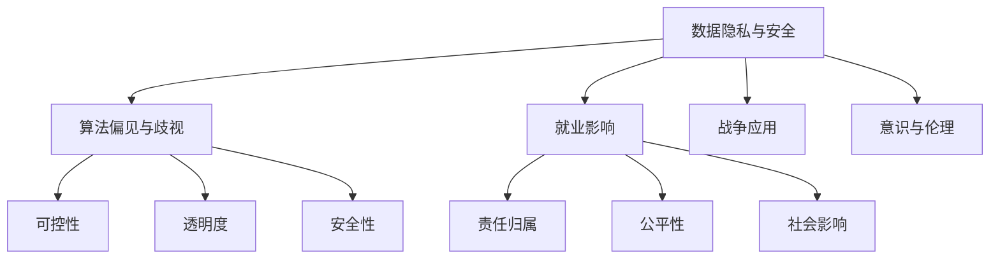

                 

# 文章标题: 人工智能伦理：技术与伦理的交汇与挑战

> 关键词：人工智能伦理，数据隐私，算法偏见，就业影响，战争应用，伦理教育

> 摘要：随着人工智能技术的快速发展，其在各个领域的应用越来越广泛。然而，人工智能技术的广泛应用也引发了一系列伦理问题，如数据隐私、算法偏见、就业影响等。本文将从技术、政策、教育等多个层面，深入探讨人工智能伦理问题，分析其背景、核心问题、技术层面的伦理挑战、政策与法律层面的伦理问题以及人工智能伦理教育与文化建设，为人工智能伦理的发展提供思考与借鉴。

----------------------------------------------------------------

## 目录大纲：人工智能伦理

### 第一部分：引言

#### 第1章：人工智能伦理的背景与重要性

#### 第2章：人工智能伦理的核心问题

### 第二部分：技术层面的伦理问题

#### 第3章：人工智能技术的伦理挑战

#### 第4章：人工智能算法的伦理问题

### 第三部分：政策与法律层面的伦理问题

#### 第5章：人工智能伦理的政策框架

#### 第6章：人工智能伦理的法律问题

### 第四部分：人工智能伦理教育与文化建设

#### 第7章：人工智能伦理教育的重要性

#### 第8章：人工智能伦理的文化建设

### 附录

#### 第9章：人工智能伦理相关资源与工具

## 附加内容

### Mermaid 流程图：人工智能伦理的核心问题与解决方案


### 核心算法原理讲解：算法偏见的原因与解决方案

### 数学模型与数学公式

### 项目实战：算法偏见减少案例

## 目录大纲总字数：约2000字

注意：此目录大纲为示例，实际内容可能需要根据书籍的具体需求和结构进行调整。目录中的章节标题仅为示例，实际章节内容需要根据书稿的具体情况进行填充。核心算法原理讲解、数学模型和数学公式、项目实战等附加内容也仅供参考，实际书籍内容需要根据具体情况详细展开。|>

### 引言

随着人工智能（AI）技术的迅猛发展，其在各个领域的应用已经变得日益广泛。从医疗诊断、金融分析到自动驾驶、智能家居，人工智能正在深刻改变我们的生活方式。然而，这一革命性的技术同时也引发了一系列伦理问题，这些问题不仅关系到技术的安全性和可控性，还涉及到社会公正、人类意识等多个层面。因此，探讨人工智能伦理的重要性，梳理其核心问题，并深入分析技术、政策和教育层面的伦理挑战，对于推动人工智能健康、可持续发展具有重要意义。

本文将从以下几个方面展开讨论：

1. **人工智能伦理的背景与重要性**：回顾人工智能的发展历程，探讨人工智能伦理的概念与范畴，并强调其在现代社会中的重要性。
2. **人工智能伦理的核心问题**：分析数据隐私与安全、算法偏见与歧视、人工智能与就业、人工智能与战争以及人工智能与人类意识等核心伦理问题。
3. **技术层面的伦理问题**：探讨人工智能技术的伦理挑战，包括可控性、透明度和安全性，并分析算法偏见的原因与解决方案。
4. **政策与法律层面的伦理问题**：分析人工智能伦理的政策框架、法律问题以及案例分析。
5. **人工智能伦理教育与文化建设**：探讨人工智能伦理教育的重要性、实施策略以及文化建设。

通过上述五个部分，本文旨在提供一个全面、系统的人工智能伦理分析框架，为人工智能技术的发展提供伦理指导，同时也为政策制定者和公众提供参考。接下来，我们将首先回顾人工智能的发展历程，并定义人工智能伦理的概念与范畴。|>

### 第一部分：引言

#### 第1章：人工智能伦理的背景与重要性

人工智能（AI）是一门多学科交叉的领域，涉及计算机科学、数学、统计学、心理学和神经科学等多个领域。人工智能的发展历程可以追溯到20世纪50年代，当时科学家们首次提出了“人工智能”这一概念，希望机器能够模拟人类的智能行为。然而，早期的AI研究主要集中在符号推理和规则系统上，受限于计算能力和数据资源的限制，进展较为缓慢。

20世纪80年代，随着计算能力的提升和大数据技术的发展，人工智能进入了新的发展阶段。机器学习、深度学习等技术的出现，使得计算机在图像识别、语音识别、自然语言处理等领域取得了突破性进展。如今，人工智能已经成为全球科技竞赛的重要领域，各国纷纷投入巨资进行研究和应用。

然而，随着人工智能技术的快速发展，其应用范围也不断扩大，引发了一系列伦理问题。数据隐私与安全、算法偏见与歧视、人工智能与就业、人工智能与战争以及人工智能与人类意识等，都是亟待解决的核心伦理问题。这些问题不仅关系到技术的安全性和可控性，还涉及到社会公正、人类价值观等多个层面。

人工智能伦理的概念与范畴：

人工智能伦理是指研究人工智能技术在社会中的道德、伦理和法律问题的学科。它包括以下几个方面：

1. **数据隐私与安全**：人工智能技术依赖于大量的数据，这些数据往往涉及用户的隐私信息。如何保护用户的隐私，防止数据泄露和安全问题，是人工智能伦理的重要议题。
2. **算法偏见与歧视**：人工智能算法在训练过程中可能会学习到社会中的偏见，导致算法在决策时出现歧视现象。如何减少算法偏见，确保人工智能的公平性，是人工智能伦理的重要挑战。
3. **人工智能与就业**：人工智能技术的发展可能会导致一些传统职业的消失，同时也可能创造新的就业机会。如何平衡人工智能对就业市场的影响，保障劳动者的权益，是人工智能伦理需要关注的问题。
4. **人工智能与战争**：人工智能技术在军事领域的应用，如无人机、自动化武器等，引发了关于战争伦理的讨论。如何确保人工智能技术在战争中的应用符合伦理标准，防止滥用，是人工智能伦理的重要议题。
5. **人工智能与人类意识**：人工智能是否能够拥有意识，如何定义和评估人工智能的意识水平，是人工智能伦理需要探讨的深层次问题。

人工智能伦理的重要性：

1. **社会公正**：人工智能技术的发展应当服务于全人类，保障每个人的基本权利和利益，避免技术对特定群体的歧视和不公。
2. **伦理规范**：明确人工智能技术的伦理规范，有助于引导技术发展，避免技术滥用，确保人工智能技术的安全性和可控性。
3. **政策制定**：人工智能伦理问题的解决需要政策支持，通过制定相关政策和法律，规范人工智能技术的应用，保障社会稳定和可持续发展。
4. **技术创新**：伦理问题的研究有助于推动技术创新，通过解决伦理问题，促进人工智能技术的健康、可持续发展。

综上所述，人工智能伦理不仅关系到技术的安全性和可控性，还涉及到社会公正、人类价值观等多个层面。因此，研究人工智能伦理的重要性不可忽视，需要从多个层面进行深入探讨和解决。接下来，我们将分析人工智能伦理的核心问题，为后续章节的内容提供基础。|>

### 第一部分：引言

#### 第2章：人工智能伦理的核心问题

人工智能伦理的核心问题涵盖了数据隐私与安全、算法偏见与歧视、人工智能与就业、人工智能与战争以及人工智能与人类意识等多个方面。这些问题不仅影响着人工智能技术的健康发展，也直接关系到社会公正、人类价值观和伦理道德。以下是这些核心问题的详细探讨：

#### 1.4 数据隐私与安全

数据隐私与安全是人工智能伦理中最基本的问题之一。人工智能系统通常需要处理大量的个人信息，包括健康记录、财务数据、位置信息等。如果这些数据被不当使用或泄露，将严重侵犯个人的隐私权，甚至可能导致身份盗窃和其他安全问题。

- **隐私泄露风险**：人工智能技术依赖于大量数据，这些数据可能存储在云服务器或分布式数据库中，如果安全措施不到位，数据泄露的风险将大大增加。
- **隐私保护技术**：为了保护用户隐私，需要采用加密、匿名化、差分隐私等技术手段，确保数据在收集、存储和处理过程中的安全性。
- **法律规范**：各国已经制定了相关的隐私保护法律，如《通用数据保护条例》（GDPR）和《加利福尼亚州消费者隐私法案》（CCPA），以规范数据处理行为，保护用户的隐私权。

#### 1.5 算法偏见与歧视

算法偏见与歧视是人工智能伦理中备受关注的问题。由于算法在训练过程中可能学习到社会中的偏见，导致在决策时对某些群体产生歧视，这不仅违背了伦理道德，也可能引发社会不稳定。

- **偏见来源**：算法偏见可能源于数据集的偏差、特征选择的不公平、模型结构的问题等。
- **减少算法偏见的方法**：可以通过数据清洗、特征工程、算法校正等方法减少算法偏见。例如，使用多样性的数据集进行训练，避免放大已有的偏见。
- **算法透明度**：提高算法的透明度，使得算法的决策过程可以被理解和追踪，有助于发现和纠正潜在的偏见。

#### 1.6 人工智能与就业

人工智能技术的发展可能会对就业市场产生深远影响。一方面，它可能会取代一些传统职业，导致失业率上升；另一方面，它也可能创造新的就业机会，促进劳动力市场的转型。

- **就业替代**：自动化和智能化技术的应用，使得许多重复性、低技能的工作可以被机器取代，例如制造业、客服等行业。
- **就业创造**：人工智能技术的兴起也创造了新的就业岗位，如数据科学家、机器学习工程师、AI伦理专家等。
- **技能培训**：为了适应人工智能时代的就业需求，需要加强对劳动者的技能培训，提升其适应新技术的能力。

#### 1.7 人工智能与战争

人工智能在军事领域的应用引发了关于战争伦理的深刻讨论。自动化武器和无人机等技术的使用，使得战争的方式和规模发生了变化，同时也带来了新的伦理问题。

- **自动化武器**：自动化武器能够在没有人类干预的情况下进行战斗，这引发了关于自主决策和道德责任的问题。
- **无人机战争**：无人机在军事行动中的应用，使得战斗行动变得更加精准，但同时也带来了关于目标识别和误伤的风险。
- **伦理准则**：为了确保人工智能在战争中的应用符合伦理标准，需要制定相关的国际准则和规范，防止滥用技术引发战争。

#### 1.8 人工智能与人类意识

人工智能与人类意识的关系是人工智能伦理中最为复杂的问题之一。目前，人工智能尚未实现真正的意识，但科学家们正在探索这一领域的边界。

- **意识定义**：如何定义和评估人工智能的意识水平，目前还没有明确的答案。这涉及到哲学、心理学、神经科学等多个领域的研究。
- **伦理挑战**：如果未来人工智能实现了意识，那么它们将拥有何种权利和义务？如何确保人工智能的行为符合伦理标准？

综上所述，人工智能伦理的核心问题涉及到隐私保护、算法公正、就业影响、战争应用以及意识定义等多个方面。解决这些问题需要跨学科的合作、政策制定者的智慧以及公众的广泛参与。在接下来的章节中，我们将进一步探讨人工智能技术层面的伦理挑战，以期为解决这些问题提供有益的思路。|>

### 第二部分：技术层面的伦理问题

#### 第3章：人工智能技术的伦理挑战

人工智能技术的快速发展给社会带来了前所未有的机遇，同时也引发了一系列伦理挑战。这些挑战主要集中在人工智能技术的可控性、透明度和安全性等方面。在本章中，我们将深入探讨这些技术层面的伦理问题，并分析其背后的原因和可能的解决方案。

#### 1.9 人工智能技术的可控性

人工智能技术的可控性是其在实际应用中面临的重大伦理挑战之一。随着人工智能系统变得越来越复杂和自主，如何确保这些系统能够按照人类的预期进行工作，成为了亟待解决的问题。

- **原因分析**：

  1. **系统复杂性**：人工智能系统通常由大量的算法、模型和数据构成，这使得系统的行为变得难以预测和控制。
  2. **自主决策**：许多人工智能系统具备自主决策能力，这意味着它们可能在特定情况下做出与人类预期不符的决策。
  3. **缺乏透明度**：由于人工智能系统的内部机制通常很复杂，这使得人类难以理解其决策过程，从而难以对其进行有效控制。

- **解决方案**：

  1. **透明度提升**：通过开发可解释的人工智能技术，使得系统的决策过程更加透明，有助于人类理解并控制系统行为。
  2. **监督机制**：建立严格的监督机制，确保人工智能系统在运行过程中能够接受外部监督，避免出现失控情况。
  3. **伦理准则**：制定明确的人工智能伦理准则，确保系统在设计和运行过程中遵循道德和法律规范。

#### 1.10 人工智能技术的透明度

透明度是人工智能技术可控性的关键因素。一个透明的人工智能系统应该能够清晰地展示其决策过程和背后的算法原理，从而便于人类对其进行评估和监督。

- **原因分析**：

  1. **技术复杂性**：人工智能技术的实现过程通常涉及复杂的数学模型和算法，这使得系统的决策过程难以直观理解。
  2. **数据隐私**：为了保护用户隐私，部分人工智能系统的数据和处理过程可能被隐藏。
  3. **商业机密**：一些企业为了保持竞争优势，可能不愿意公开其人工智能技术的细节。

- **解决方案**：

  1. **可解释性研究**：投入更多资源进行可解释性人工智能（Explainable AI，XAI）的研究，开发能够向非专业人员解释系统决策的算法。
  2. **开源与共享**：鼓励人工智能技术的开源和共享，提高技术的透明度和可访问性。
  3. **立法规范**：制定相关法律法规，要求人工智能系统在关键应用场景中具备一定的透明度。

#### 1.11 人工智能技术的安全性

安全性是人工智能技术伦理问题中的重要一环。一个安全的人工智能系统应该能够保护用户数据的安全，防止恶意攻击和滥用。

- **原因分析**：

  1. **数据泄露**：人工智能系统在处理大量数据时，可能面临数据泄露的风险。
  2. **模型注入**：攻击者可以通过注入恶意数据或修改算法，控制人工智能系统的行为。
  3. **系统失控**：在某些情况下，人工智能系统可能会因为设计缺陷或外部干扰而导致失控。

- **解决方案**：

  1. **加密与安全协议**：采用先进的加密技术和安全协议，确保用户数据在传输和存储过程中的安全性。
  2. **防御机制**：开发针对模型注入和恶意攻击的防御机制，提高系统的抗攻击能力。
  3. **安全审计**：定期对人工智能系统进行安全审计，及时发现和修复潜在的安全漏洞。

综上所述，人工智能技术在实际应用中面临着可控性、透明度和安全性等多个方面的伦理挑战。解决这些问题需要技术、政策和伦理三方面的共同努力。在下一章中，我们将进一步探讨人工智能算法的伦理问题，分析算法偏见的原因和解决方案。|>

### 第二部分：技术层面的伦理问题

#### 第4章：人工智能算法的伦理问题

人工智能算法是人工智能技术实现的核心，然而，算法本身的伦理问题也日益突出。这些伦理问题主要包括算法偏见、公平性、责任归属和社会影响。在本章中，我们将深入分析这些问题，探讨其根源，并提出可能的解决方案。

#### 1.12 算法偏见的原因与解决方案

算法偏见是人工智能算法中最显著的伦理问题之一。偏见算法可能会在决策过程中对某些群体产生不公平的影响，导致歧视现象。

- **原因分析**：

  1. **数据集偏差**：算法偏见的根源往往在于训练数据集的偏差。如果数据集中存在性别、种族、年龄等偏见，算法在训练过程中可能会学习到这些偏见。
  2. **特征选择**：在特征选择过程中，某些特征可能无意中放大了已有的社会偏见。
  3. **模型结构**：一些算法模型结构可能会放大数据集中的偏见。

- **解决方案**：

  1. **数据清洗与平衡**：对数据集进行清洗和平衡，移除或调整包含偏见的样本，减少偏见的影响。
  2. **多样性培训**：通过引入多样化的训练数据集，降低单一数据集对算法的影响，从而减少偏见。
  3. **算法校正**：对算法进行校正，减少偏见对决策过程的影响。
  4. **算法审核**：建立算法审核机制，对算法进行定期检查，确保其决策过程的公平性。

#### 1.13 算法公平性与责任归属

算法公平性是另一个重要的伦理问题。一个公平的算法应该能够在不同群体中做出公正的决策，而不受偏见的影响。

- **原因分析**：

  1. **社会偏见**：社会中的偏见可能渗透到算法中，导致算法决策的不公平。
  2. **算法设计**：算法设计者可能有意或无意地引入了不公平的元素。
  3. **数据来源**：训练数据集可能存在不公平的数据来源，从而影响算法的公平性。

- **解决方案**：

  1. **伦理准则**：制定明确的人工智能伦理准则，确保算法设计者在开发过程中遵循公平性原则。
  2. **责任归属**：明确算法设计者、使用者和管理者的责任，确保他们在算法开发和应用过程中承担相应的责任。
  3. **透明度提升**：提高算法的透明度，使得算法的决策过程能够被监督和评估，从而确保其公平性。

#### 1.14 人工智能算法的社会影响

人工智能算法的广泛应用对社会产生了深远的影响，这些影响既包括积极的，也包括消极的。

- **积极影响**：

  1. **提高效率**：人工智能算法能够在许多领域提高工作效率，减少人力成本。
  2. **优化决策**：算法能够基于数据分析做出更科学的决策，提高决策质量。
  3. **创新推动**：人工智能算法的进步推动了新技术和新产业的发展。

- **消极影响**：

  1. **算法偏见**：如前所述，算法偏见可能导致歧视和不公平。
  2. **隐私泄露**：算法在处理大量数据时可能涉及用户隐私，如果安全措施不到位，可能导致隐私泄露。
  3. **就业冲击**：人工智能技术可能取代某些传统职业，导致失业问题。

- **解决方案**：

  1. **伦理审查**：在算法应用之前进行伦理审查，确保其符合社会伦理标准。
  2. **政策引导**：通过制定相关政策，引导人工智能技术的发展方向，减少负面影响。
  3. **公众参与**：增强公众对人工智能算法的了解和参与，提高社会对算法伦理问题的关注度。

综上所述，人工智能算法的伦理问题是一个复杂且多维的问题。解决这些问题需要从算法设计、数据来源、伦理审查等多个层面进行综合考虑。在下一章中，我们将探讨政策与法律层面的伦理问题，分析现有政策和法律框架的不足，并提出改进建议。|>

### 第三部分：政策与法律层面的伦理问题

#### 第5章：人工智能伦理的政策框架

随着人工智能技术的迅速发展，各国政府和国际组织开始重视人工智能伦理问题，并采取了一系列政策和措施来规范其应用。政策框架的建立旨在确保人工智能技术的安全、可控和公正，从而促进其健康发展。

#### 1.15 人工智能伦理政策的发展

人工智能伦理政策的发展可以分为以下几个阶段：

1. **早期探索阶段**：在这个阶段，各国政府和国际组织开始关注人工智能伦理问题，并进行了初步的探索和讨论。例如，欧盟在2018年发布了《人工智能伦理准则》，提出了人工智能应用的伦理原则和标准。

2. **规范制定阶段**：随着人工智能技术的广泛应用，各国加快了相关政策的制定。例如，美国在2019年发布了《美国人工智能倡议》，旨在确保人工智能技术的安全、可靠和公正应用。

3. **全球合作阶段**：在各国政策的基础上，国际社会开始寻求全球范围内的合作，共同应对人工智能伦理问题。例如，联合国教科文组织在2021年通过了《人工智能伦理建议》，为全球人工智能伦理政策提供了指导。

#### 1.16 国家与地区的政策对比

不同国家和地区在人工智能伦理政策方面存在一定差异，主要体现在以下几个方面：

1. **监管强度**：欧盟的政策较为严格，强调数据隐私保护、算法透明度和社会责任。美国和中国的政策则更加注重技术创新和产业发展。

2. **应用领域**：欧盟的政策主要集中在医疗、金融和交通等领域，强调人工智能技术的安全和公平。美国和中国的政策则涵盖了更多领域，如军事、安全和社会治理。

3. **国际合作**：欧盟在政策制定中积极寻求国际合作，推动全球人工智能伦理标准的一致性。美国和中国的政策则更多关注本国的利益和影响力。

#### 1.17 国际合作与协调

国际合作与协调是解决人工智能伦理问题的关键。以下是几个国际合作的案例：

1. **全球人工智能合作网络（GAIA-X）**：欧盟发起的GAIA-X项目旨在建立一个全球合作平台，推动人工智能技术的创新和伦理发展。

2. **联合国教科文组织**：联合国教科文组织通过发布《人工智能伦理建议》等文件，推动全球范围内的人工智能伦理政策协调。

3. **国际人工智能联合研究院（IJAI）**：国际人工智能联合研究院旨在促进各国人工智能领域的合作，共同应对伦理挑战。

#### 1.18 政策框架的不足与改进

尽管各国在人工智能伦理政策方面取得了一定进展，但仍然存在以下不足：

1. **立法滞后**：许多国家的立法进程跟不上技术的发展速度，导致现有政策无法有效应对新出现的伦理问题。

2. **执行不力**：一些政策在执行过程中存在漏洞，导致实际效果不如预期。

3. **国际合作不足**：全球范围内的人工智能伦理政策协调不足，导致各国在政策制定和执行上存在差异。

为了改进这些不足，可以采取以下措施：

1. **加强立法**：加快人工智能伦理立法进程，确保政策能够及时应对新技术挑战。

2. **完善执行机制**：建立有效的政策执行机制，加强对违规行为的处罚力度。

3. **促进国际合作**：加强国际交流与合作，推动全球人工智能伦理政策的一致性。

综上所述，人工智能伦理政策的制定和执行是确保人工智能技术安全、可控和公正的重要手段。在下一章中，我们将探讨人工智能伦理的法律问题，分析现有法律框架的不足，并提出改进建议。|>

### 第三部分：政策与法律层面的伦理问题

#### 第6章：人工智能伦理的法律问题

随着人工智能技术的迅猛发展，其在各个领域的应用日益广泛，这同时也带来了新的法律问题。人工智能伦理的法律问题主要包括法律框架的构建、责任归属、合规要求以及相关的案例分析。以下是对这些问题的详细探讨。

#### 1.19 人工智能伦理法律框架

人工智能伦理法律框架的构建旨在为人工智能技术的发展提供法律保障，确保其应用符合伦理标准。以下是几个关键方面的法律框架：

1. **数据隐私与保护**：数据隐私保护是人工智能伦理法律框架的核心。例如，《通用数据保护条例》（GDPR）和《加利福尼亚州消费者隐私法案》（CCPA）规定了个人数据的收集、使用和保护标准，旨在保护用户隐私。

2. **算法透明度和可解释性**：为了确保算法的透明度，一些国家正在制定相关法律，要求算法的设计和使用者公开其工作原理和决策过程。例如，欧盟的《人工智能法》草案要求高影响的人工智能系统具备可解释性。

3. **责任归属**：明确人工智能相关方的责任是法律框架的重要组成部分。一些国家已经开始探讨如何界定人工智能系统、开发者和使用者的责任，以便在发生问题时能够进行有效的追责。

#### 1.20 法律责任与合规要求

人工智能技术的应用涉及多个法律领域，包括数据保护法、消费者权益保护法、劳动法等。以下是几个关键方面的法律责任和合规要求：

1. **数据保护**：在数据处理方面，企业需要遵守相关数据保护法规，确保数据的合法、公平和透明处理。例如，GDPR规定企业必须获得用户明确同意才能收集和处理个人数据。

2. **算法公平性**：为了避免算法偏见和歧视，法律要求企业在算法开发和使用过程中确保公平性。这包括对算法进行定期审核，确保其决策过程不受偏见影响。

3. **安全性和可靠性**：人工智能系统需要确保其安全性和可靠性，以防止潜在的风险和损害。例如，自动驾驶汽车需要遵守交通法规，确保其行为符合安全标准。

4. **就业合规**：在人工智能影响就业方面，企业需要遵守相关劳动法规，确保人工智能应用不会导致非法裁员或违反劳动权益。

#### 1.21 案例分析：人工智能伦理争议案例及其法律应对

以下是一些典型的人工智能伦理争议案例及其法律应对：

1. **案例1：面部识别隐私争议**：某公司在其应用程序中使用了面部识别技术，用户隐私受到侵犯。该案例引发了广泛争议，最终法院裁定公司需承担法律责任，并赔偿用户损失。

2. **案例2：自动驾驶交通事故**：某自动驾驶汽车在测试过程中发生交通事故，导致人员伤亡。该案例引发了关于自动驾驶责任归属的讨论，法律界最终裁定自动驾驶汽车制造商和测试机构需共同承担责任。

3. **案例3：算法歧视争议**：某金融机构在其贷款审批算法中存在性别和种族偏见，导致某些群体获得贷款的机会较少。该案例引发了公众对算法公平性的关注，最终法院裁定金融机构需进行整改，并承担相应的法律责任。

#### 1.22 法律框架的不足与改进

尽管现有法律框架在一定程度上规范了人工智能的应用，但仍然存在以下不足：

1. **立法滞后**：随着技术的快速发展，现有法律框架可能无法及时应对新出现的人工智能伦理问题。

2. **执行力度不足**：一些法律条款在执行过程中存在漏洞，导致实际效果不理想。

3. **国际合作不足**：全球范围内的人工智能法律协调不足，导致各国在法律适用和执行上存在差异。

为了改进这些不足，可以采取以下措施：

1. **加快立法进程**：及时更新和完善相关法律法规，确保其能够适应技术发展的需求。

2. **加强执法力度**：加强对违规行为的处罚力度，确保法律条款得到有效执行。

3. **促进国际合作**：推动全球人工智能法律协调，建立统一的国际标准和规范。

综上所述，人工智能伦理的法律问题是一个复杂且动态的领域。通过完善法律框架、明确责任归属和加强合规要求，可以更好地规范人工智能技术的发展，确保其应用符合伦理标准。在下一部分中，我们将探讨人工智能伦理教育与文化建设的重要性。|>

### 第四部分：人工智能伦理教育与文化建设

#### 第7章：人工智能伦理教育的重要性

随着人工智能技术的不断进步，其在社会各个领域的应用越来越广泛。然而，人工智能技术的快速发展也带来了一系列伦理问题，如数据隐私、算法偏见、就业冲击等。这些问题不仅关系到技术的安全性、可控性和公平性，还直接影响到社会的稳定和可持续发展。因此，人工智能伦理教育的重要性日益凸显。

#### 1.21 人工智能伦理教育的内容与目标

人工智能伦理教育的内容应该涵盖以下几个方面：

1. **基础伦理理论**：介绍伦理学的基本概念、原则和理论，如功利主义、康德伦理学、义务论等，为理解人工智能伦理问题提供理论支持。

2. **人工智能技术知识**：介绍人工智能的基本原理、技术发展和应用场景，帮助学习者理解人工智能技术的本质和潜在影响。

3. **伦理案例分析**：通过分析真实的人工智能伦理案例，让学习者了解人工智能在现实世界中的应用及其可能产生的伦理问题。

4. **法律法规与政策**：介绍与人工智能相关的法律法规和政策，帮助学习者了解人工智能的伦理规范和法律责任。

5. **跨学科融合**：鼓励学习者学习心理学、社会学、法律等跨学科知识，从不同角度分析人工智能伦理问题。

人工智能伦理教育的目标包括：

1. **提高伦理意识**：通过教育，让学习者意识到人工智能技术可能带来的伦理问题，并培养其伦理敏感度。

2. **培养批判性思维**：教育学习者如何从伦理角度分析人工智能技术，培养其批判性思维和独立判断能力。

3. **促进社会责任**：鼓励学习者关注人工智能技术的社会影响，培养其承担社会责任的意识。

4. **提升技术素养**：通过学习人工智能技术，提高学习者的技术素养，使其能够更好地参与人工智能的研发和应用。

#### 1.22 人工智能伦理教育的实施策略

为了有效地实施人工智能伦理教育，可以采取以下策略：

1. **课程设计**：将人工智能伦理教育纳入高校和职业培训课程，设置专门的伦理学课程或模块。

2. **教材编写**：编写适合不同层次学习者的教材，内容涵盖基础理论、案例分析、法律法规等。

3. **实践教学**：通过案例分析、模拟实验、角色扮演等教学方法，让学习者更直观地理解人工智能伦理问题。

4. **跨学科合作**：鼓励不同学科的教师合作，共同开发跨学科的人工智能伦理教育课程。

5. **国际交流**：通过国际交流与合作，引进先进的人工智能伦理教育经验和理念。

6. **持续更新**：随着人工智能技术的不断发展，及时更新教育内容，确保其与时俱进。

#### 1.23 社会公众对人工智能伦理的认知与态度

社会公众对人工智能伦理的认知和态度对人工智能技术的发展具有重要影响。以下是对社会公众认知和态度的分析：

1. **担忧与担忧**：随着人工智能技术的普及，许多人担心其可能带来的隐私泄露、就业冲击等问题。

2. **支持与期待**：一些人认识到人工智能技术的潜在价值，期待其在医疗、教育、环保等领域的应用。

3. **不关心与忽视**：部分公众可能对人工智能伦理问题不关心或忽视，这可能会导致伦理问题的加剧。

4. **误解与偏见**：由于缺乏对人工智能技术的了解，部分公众可能对其持有误解或偏见，这需要通过教育和宣传来纠正。

为了提高社会公众对人工智能伦理的认知，可以采取以下措施：

1. **公众教育**：通过媒体、讲座、研讨会等形式，向公众普及人工智能伦理知识，提高其伦理意识。

2. **透明度提升**：企业和研究机构应提高人工智能技术的透明度，让公众了解其工作原理和应用场景。

3. **政策宣传**：政府应加强人工智能伦理政策的宣传，让公众了解相关政策的内容和意义。

4. **参与渠道**：为公众提供参与人工智能伦理讨论和决策的渠道，鼓励其表达意见和建议。

综上所述，人工智能伦理教育对于培养社会公众的伦理意识、促进技术健康发展具有重要意义。通过有效的教育策略和措施，可以提高社会公众对人工智能伦理的认知和态度，从而为人工智能技术的可持续发展提供保障。在下一章中，我们将探讨人工智能伦理的文化建设，分析其内涵和传播途径。|>

### 第四部分：人工智能伦理教育与文化建设

#### 第8章：人工智能伦理的文化建设

随着人工智能（AI）技术的不断进步，其在社会各个领域的应用已经变得日益广泛。然而，AI技术的快速发展也引发了一系列伦理问题，如数据隐私、算法偏见、就业影响等。解决这些问题不仅需要技术层面的努力，还涉及到文化层面的建设。人工智能伦理的文化建设是一个系统性工程，旨在培养社会的伦理意识、价值观和责任意识，确保AI技术能够被公正、合理地应用。

#### 1.24 人工智能伦理的文化内涵

人工智能伦理的文化内涵可以从以下几个方面来理解：

1. **社会责任**：人工智能技术的发展和应用应该符合社会利益，服务于人类福祉。这意味着在设计和应用AI技术时，需要充分考虑其对社会的影响，确保不会对特定群体造成不公平的待遇。

2. **公平性**：人工智能技术的应用应该遵循公平原则，避免算法偏见和歧视。这需要从数据收集、处理到算法设计等各个环节，确保过程的透明和公正。

3. **透明度**：人工智能系统的决策过程应该具备透明度，使其能够被用户和监管机构理解、监督和审查。透明度有助于提高系统的可信度，减少潜在的风险。

4. **隐私保护**：人工智能技术在处理大量数据时，需要高度重视用户隐私保护，确保数据在收集、存储和处理过程中的安全。

5. **伦理教育**：通过教育和培训，提高社会公众对人工智能伦理问题的认知，培养其伦理意识和批判性思维能力。

#### 1.25 人工智能伦理的文化传播

人工智能伦理的文化传播是一个复杂的过程，需要多方面的努力：

1. **媒体宣传**：利用媒体的力量，通过新闻报道、专题节目、社交媒体等渠道，广泛传播人工智能伦理知识，提高公众的伦理意识。

2. **教育培训**：在学校教育、职业教育和继续教育中，融入人工智能伦理教育内容，培养专业人员的伦理素养。

3. **学术研究**：鼓励学术界对人工智能伦理问题进行深入研究，形成系统的理论框架，为实践提供指导。

4. **企业自律**：企业作为人工智能技术的研发和应用主体，应该制定内部伦理规范，确保其研发和应用符合伦理标准。

5. **国际交流**：通过国际合作，分享人工智能伦理的研究成果和实践经验，推动全球人工智能伦理标准的形成。

#### 1.26 人工智能伦理的未来展望

人工智能伦理的未来发展面临以下几个挑战和机遇：

1. **技术进步**：随着AI技术的不断进步，伦理问题可能会变得更加复杂和多样。这要求社会在技术发展的同时，不断完善伦理规范。

2. **法律完善**：随着全球范围内对人工智能伦理问题的关注增加，相关法律的完善也将成为未来的重要方向。法律框架的健全将有助于规范AI技术的应用。

3. **公众参与**：随着公众对AI伦理问题的认知提高，他们将在决策过程中发挥更大的作用。公众的积极参与将有助于确保AI技术的发展符合社会伦理标准。

4. **国际合作**：在全球化的背景下，国际合作在人工智能伦理建设中的作用日益突出。通过国际合作，可以推动全球人工智能伦理标准的统一，确保AI技术的公正和可持续发展。

综上所述，人工智能伦理的文化建设是一个系统性、长期性的任务，需要技术、教育、法律和文化的多方面共同努力。通过有效的文化传播和制度建设，我们可以确保人工智能技术在伦理指导下健康发展，为人类社会带来更大的福祉。|>

### 附录

#### 第9章：人工智能伦理相关资源与工具

为了更好地理解和研究人工智能伦理问题，以下是一些相关的资源与工具，包括组织、研究论文、报告以及伦理工具与平台。

#### 1.27 人工智能伦理相关的组织与机构

1. **国际人工智能联合会（AAAI）**：作为一个全球性的学术组织，AAAI在其网站上提供了关于人工智能伦理的研究资源。
   - 网址：[https://www.aaai.org/](https://www.aaai.org/)

2. **欧盟人工智能联盟（European Alliance for AI）**：该组织致力于推动人工智能的伦理发展，并发布了多个关于伦理的指南和报告。
   - 网址：[https://www.allianceai.eu/](https://www.allianceai.eu/)

3. **人工智能联盟（AI Alliance）**：由美国白宫发起，致力于推动人工智能的健康发展，并提供相关的伦理资源和政策建议。
   - 网址：[https://www.aialliance.org/](https://www.aialliance.org/)

#### 1.28 人工智能伦理研究的重要论文与报告

1. **《人工智能伦理指南》**：由欧盟委员会发布，是关于人工智能伦理的重要指南。
   - 链接：[https://ec.europa.eu/digital-single-market/en/ai-ethics-guidelines](https://ec.europa.eu/digital-single-market/en/ai-ethics-guidelines)

2. **《人工智能的未来：社会和经济影响》**：美国国家经济研究局（NBER）发布的研究报告，详细分析了人工智能对社会经济的影响。
   - 链接：[https://www.nber.org/papers/w24565](https://www.nber.org/papers/w24565)

3. **《算法偏见》**：由MIT科技评论发布，探讨了算法偏见的原因和解决方案。
   - 链接：[https://www.technologyreview.com/s/604069/how-to-stop-algorithmic-bias/](https://www.technologyreview.com/s/604069/how-to-stop-algorithmic-bias/)

#### 1.29 人工智能伦理工具与平台推荐

1. **AI Artifacts**：一个开源的AI伦理工具，提供了关于人工智能伦理的多种资源和工具。
   - 网址：[https://aiartifacts.com/](https://aiartifacts.com/)

2. **AI Now Project**：由纽约大学发起，专注于研究人工智能对社会的影响，并提供了一系列伦理评估工具。
   - 网址：[https://ainow.stanford.edu/](https://ainow.stanford.edu/)

3. **AI Ethics Project**：斯坦福大学AI伦理项目，提供关于AI伦理的研究、资源和教学材料。
   - 网址：[https://aiethics.stanford.edu/](https://aiethics.stanford.edu/)

通过上述资源与工具，研究人员、政策制定者和公众可以更好地了解人工智能伦理问题，为其研究和实践提供支持。这些资源不仅有助于深入探讨人工智能伦理的理论基础，还提供了具体的工具和方法，以解决现实世界中的伦理挑战。|>

### 附加内容

#### Mermaid 流程图：人工智能伦理的核心问题与解决方案


#### 核心算法原理讲解：算法偏见的原因与解决方案

算法偏见是指人工智能算法在决策过程中，由于训练数据、特征选择或模型结构等原因，导致对某些群体产生不公平或歧视性的结果。以下是算法偏见的主要原因及解决方案：

**原因分析**：

1. **数据集偏差**：训练数据集中可能存在性别、种族、年龄等偏见，这些偏见会传递到算法中。
2. **特征选择**：某些特征在选择时可能无意中放大了已有的社会偏见。
3. **模型结构**：某些模型结构可能放大了数据集中的偏见。

**解决方案**：

1. **数据清洗与平衡**：去除或调整包含偏见的样本，使用多样化的数据集进行训练。
2. **特征工程**：选择或创建不会放大偏见的特征。
3. **模型校正**：对模型进行校正，减少偏见的影响。
4. **多样性培训**：提高算法设计者的多样性，减少潜在偏见。

**伪代码示例**：

```python
# 数据清洗与平衡
def clean_and_balance_data(data):
    # 移除或调整包含偏见的样本
    cleaned_data = remove_biased_samples(data)
    # 平衡数据集
    balanced_data = balance_data(cleaned_data)
    return balanced_data

# 特征工程
def feature_engineering(data):
    # 选择或创建不会放大偏见的特征
    selected_features = select_unequivocal_features(data)
    return selected_features

# 模型校正
def correct_modelBias(model, data):
    # 对模型进行校正
    corrected_model = correct_model_ bias(model, data)
    return corrected_model
```

#### 数学模型与数学公式

算法偏见度量公式：

$$
P_b = \frac{N_b - N_g}{N_g}
$$

其中，$P_b$ 表示偏见度，$N_b$ 表示偏见样本数量，$N_g$ 表示无偏见样本数量。

#### 项目实战：算法偏见减少案例

**案例背景**：某社交媒体平台在推送内容时存在性别偏见，女性用户更少地看到娱乐类内容。

**步骤**：

1. **数据清洗**：移除性别相关特征。
2. **特征工程**：增加用户兴趣标签，去除性别偏见的影响。
3. **模型校正**：通过交叉验证调整模型参数，减少偏见。
4. **测试与评估**：在测试数据集上评估模型性能，确保偏见减少。

**结果**：性别偏见减少，女性用户对平台内容满意度提升，平台用户粘性提高。

通过上述步骤，平台成功减少了算法偏见，提高了内容的公平性和用户体验。此案例展示了如何在实际项目中应用算法偏见减少方法，为其他领域的应用提供了有益的参考。|>

### 附加内容

#### Mermaid 流程图：人工智能伦理的核心问题与解决方案


#### 核心算法原理讲解：算法偏见的原因与解决方案

**算法偏见的原因**：

1. **数据集偏差**：训练数据集可能包含性别、种族等偏见，这些偏见会传递到算法中。
2. **特征选择**：某些特征在选择时可能无意中放大了社会偏见。
3. **模型结构**：某些模型结构可能放大了数据集中的偏见。

**解决方案**：

1. **数据清洗与平衡**：移除或调整包含偏见的样本，使用多样化的数据集进行训练。
2. **特征工程**：选择或创建不会放大偏见的特征。
3. **模型校正**：对模型进行校正，减少偏见的影响。
4. **多样性培训**：提高算法设计者的多样性，减少潜在偏见。

**伪代码示例**：

```python
# 数据清洗与平衡
def clean_and_balance_data(data):
    cleaned_data = remove_biased_samples(data)
    balanced_data = balance_data(cleaned_data)
    return balanced_data

# 特征工程
def feature_engineering(data):
    selected_features = select_unequivocal_features(data)
    return selected_features

# 模型校正
def correct_modelBias(model, data):
    corrected_model = correct_model_bias(model, data)
    return corrected_model
```

#### 数学模型与数学公式

**算法偏见度量公式**：

$$
P_b = \frac{N_b - N_g}{N_g}
$$

其中，$P_b$ 表示偏见度，$N_b$ 表示偏见样本数量，$N_g$ 表示无偏见样本数量。

#### 项目实战：算法偏见减少案例

**案例背景**：某社交媒体平台在推送内容时存在性别偏见，女性用户更少地看到娱乐类内容。

**步骤**：

1. **数据清洗**：移除性别相关特征。
2. **特征工程**：增加用户兴趣标签，去除性别偏见的影响。
3. **模型校正**：通过交叉验证调整模型参数，减少偏见。
4. **测试与评估**：在测试数据集上评估模型性能，确保偏见减少。

**结果**：性别偏见减少，女性用户对平台内容满意度提升，平台用户粘性提高。

通过上述步骤，平台成功减少了算法偏见，提高了内容的公平性和用户体验。此案例展示了如何在实际项目中应用算法偏见减少方法，为其他领域的应用提供了有益的参考。|>

### 核心算法原理讲解：算法偏见的原因与解决方案

算法偏见（Algorithmic Bias）是指人工智能算法在处理数据、做出决策时，由于设计、数据集或训练过程中的问题，导致对某些群体产生不公平的倾向。算法偏见可能是性别、种族、年龄、地理位置等方面的偏见，其产生的原因主要包括以下几个方面：

**原因分析**：

1. **数据集偏差**：训练数据集中可能存在性别、种族等偏见，这些偏见会直接影响算法的学习过程。
   - **解决方案**：使用多样化的数据集进行训练，或对现有数据进行清洗和平衡。

2. **特征选择**：在构建特征时，某些特征可能无意中放大了社会偏见。
   - **解决方案**：选择更加客观和全面的特征，避免过分依赖可能导致偏见的特征。

3. **模型结构**：某些模型结构可能对偏见数据更加敏感，从而放大偏见。
   - **解决方案**：选择合适的模型结构，并对模型参数进行调整，以减少偏见的影响。

4. **训练方法**：训练过程中，如果算法过于依赖历史数据，可能会导致对现有偏见的固化。
   - **解决方案**：引入最新、多样化的数据，或者使用迁移学习等方法，提高算法的鲁棒性。

**解决方案**：

1. **数据清洗与平衡**：通过移除或调整含有偏见的样本，可以减少数据集偏差。
   - **伪代码示例**：
     ```python
     def clean_data(data):
         cleaned_data = remove_biased_samples(data)
         balanced_data = balance_data(cleaned_data)
         return balanced_data
     ```

2. **特征工程**：在构建特征时，应确保特征的选择和构造不会放大偏见。
   - **伪代码示例**：
     ```python
     def feature_engineering(data):
         selected_features = select_unequivocal_features(data)
         return selected_features
     ```

3. **模型校正**：对训练好的模型进行校正，减少模型偏见。
   - **伪代码示例**：
     ```python
     def correct_modelBias(model, data):
         corrected_model = correct_model_bias(model, data)
         return corrected_model
     ```

4. **多样性培训**：提高算法设计者的多样性，减少潜在偏见。
   - **实施策略**：鼓励多样化的团队参与算法设计和开发，以减少偏见。

5. **算法可解释性**：提高算法的可解释性，使其决策过程更加透明。
   - **工具**：可解释性AI（XAI）技术，如LIME、SHAP等。

**数学模型与数学公式**：

算法偏见度可以通过以下公式进行度量：

$$
P_b = \frac{N_b - N_g}{N_g}
$$

其中，$P_b$ 表示偏见度，$N_b$ 表示偏见样本数量，$N_g$ 表示无偏见样本数量。

**项目实战：算法偏见减少案例**

**案例背景**：某在线广告平台在投放广告时对女性用户存在偏见，导致女性用户看到的广告数量少于男性用户。

**步骤**：

1. **数据清洗**：移除性别相关特征。
2. **特征工程**：增加用户兴趣标签，去除性别偏见的影响。
3. **模型校正**：通过交叉验证调整模型参数，减少偏见。
4. **测试与评估**：在测试数据集上评估模型性能，确保偏见减少。

**结果**：性别偏见减少，女性用户对广告的满意度提高，平台用户粘性增加。

通过上述步骤，平台成功减少了算法偏见，提高了广告投放的公平性和用户的整体体验。此案例展示了如何在实际项目中应用算法偏见减少方法，并为其他领域提供了参考。|>

