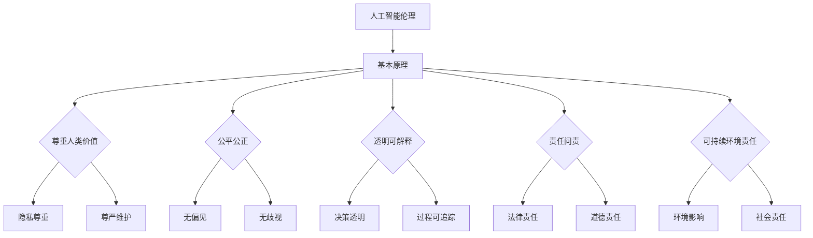
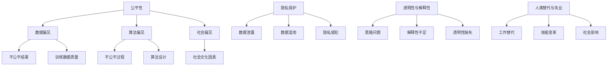
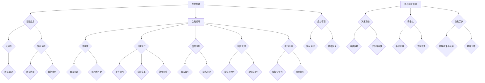

                 

# 文章标题：人工智能伦理：人类计算的道德与责任探讨

> 关键词：人工智能伦理、道德责任、计算、人类、算法、数学模型、案例分析、教育、实践、公平性、隐私保护、透明性

> 摘要：随着人工智能技术的飞速发展，其在各个领域的应用日益广泛。然而，随之而来的一系列伦理问题也引起了广泛关注。本文将探讨人工智能伦理的基本原则、伦理问题类型、典型案例分析、伦理决策模型以及人类在人工智能伦理中的角色和责任。通过深入剖析，本文旨在为构建一个可持续的人工智能伦理体系提供指导和建议。

## 目录

## 第一部分：人工智能伦理基础

### 第1章：人工智能伦理概述

#### 1.1 人工智能伦理的重要性

#### 1.2 人工智能伦理的基本原则

#### 1.3 人工智能伦理与社会科学的关系

### 第2章：人工智能伦理问题类型

#### 2.1 公平性与偏见

#### 2.2 隐私保护

#### 2.3 透明性与解释性

#### 2.4 人类替代与失业

### 第3章：人工智能伦理案例分析

#### 3.1 人工智能在医疗领域的伦理问题

#### 3.2 人工智能在自动驾驶领域的伦理问题

#### 3.3 人工智能在金融领域的伦理问题

### 第4章：人工智能伦理决策模型

#### 4.1 基于伦理原则的决策模型

#### 4.2 基于案例学习的决策模型

#### 4.3 基于人工智能伦理咨询的决策模型

## 第二部分：人工智能伦理与人类责任

### 第5章：人类在人工智能伦理中的角色

#### 5.1 人类对人工智能的引导与控制

#### 5.2 人类对人工智能的道德责任

#### 5.3 人类对人工智能的法律责任

### 第6章：人工智能伦理教育与培训

#### 6.1 人工智能伦理教育的重要性

#### 6.2 人工智能伦理教育的内容与方法

#### 6.3 人工智能伦理教育的实践案例

### 第7章：构建可持续的人工智能伦理体系

#### 7.1 人工智能伦理体系的构建原则

#### 7.2 人工智能伦理体系的构建过程

#### 7.3 人工智能伦理体系的发展趋势

## 第三部分：人工智能伦理的数学模型与算法

### 第8章：人工智能伦理的数学模型

#### 8.1 公平性的数学模型

#### 8.2 隐私保护的数学模型

#### 8.3 透明性与解释性的数学模型

### 第9章：人工智能伦理算法的实现与优化

#### 9.1 伦理算法的基本原理

#### 9.2 伦理算法的实现技术

#### 9.3 伦理算法的优化策略

### 第10章：人工智能伦理项目实战

#### 10.1 伦理算法在医疗领域的应用

#### 10.2 伦理算法在自动驾驶领域的应用

#### 10.3 伦理算法在金融领域的应用

## 附录

### 附录 A：人工智能伦理相关资源与工具

#### A.1 人工智能伦理研究论文与报告

#### A.2 人工智能伦理相关法律法规

#### A.3 人工智能伦理教育课程与教材

#### A.4 人工智能伦理咨询机构与组织

----------------------------------------------------------------### 第1章：人工智能伦理概述

#### 1.1 人工智能伦理的重要性

随着人工智能（AI）技术的快速发展，其在各个领域的应用越来越广泛，从医疗、金融、自动驾驶到智能家居等。然而，人工智能技术的发展也引发了一系列伦理问题，例如算法偏见、隐私侵犯、透明性不足以及人类替代等。这些问题不仅涉及到技术层面，还涉及到社会、文化和法律等多个层面。因此，对人工智能伦理的探讨具有极其重要的意义。

首先，人工智能伦理的探讨有助于确保人工智能技术的正当性和合法性。人工智能技术是一种高度复杂的计算系统，其决策和行为可能对人类和社会产生深远的影响。如果没有明确的伦理准则和规范，人工智能系统可能会偏离人类的价值观念，甚至造成不可预测的后果。

其次，人工智能伦理的探讨有助于提升人工智能技术的透明性和可解释性。许多人工智能系统，尤其是深度学习模型，由于其高度复杂性和黑箱特性，使得其决策过程变得难以理解和追踪。这不仅降低了人工智能系统的可信度，也使得其在某些应用场景中无法满足伦理要求。

最后，人工智能伦理的探讨有助于培养社会对人工智能技术的正确认识和接纳。随着人工智能技术的普及，公众对其可能产生的负面影响越来越关注。通过伦理探讨，可以增进公众对人工智能技术的理解和信任，从而促进其健康发展。

#### 1.2 人工智能伦理的基本原则

人工智能伦理的基本原则是构建人工智能伦理体系的基础。以下是一些常见的基本原则：

1. **尊重人类价值和尊严**：人工智能技术应尊重人类的基本权利和尊严，不应侵犯人类的隐私、自由和尊严。
2. **公平和公正**：人工智能系统应公平地对待所有人，不应产生系统性偏见，例如种族、性别、年龄等方面的歧视。
3. **透明性和可解释性**：人工智能系统的决策过程应透明，用户应能够理解和追踪系统的决策依据。
4. **责任和问责制**：人工智能系统的开发者、使用者和管理者应对其决策和行为承担法律责任和道德责任。
5. **可持续性和环境责任**：人工智能技术应考虑到其对环境和社会的影响，并采取相应的措施来减少负面影响。

这些原则不仅为人工智能技术的发展提供了伦理指导，也为相关法律法规的制定提供了基础。

#### 1.3 人工智能伦理与社会科学的关系

人工智能伦理不仅是一个技术问题，也是一个社会科学问题。它涉及到多个学科领域的交叉和融合，如哲学、社会学、心理学、法学等。通过社会科学的研究，我们可以更好地理解人工智能技术对社会的影响，以及如何制定相应的伦理准则和规范。

首先，哲学为人工智能伦理提供了理论基础。哲学家们对人类价值和尊严、自由和责任等问题的深入探讨，为人工智能伦理的构建提供了指导。

其次，社会学和心理学研究人工智能技术对社会和个体的影响。例如，社会学研究人工智能技术如何影响社会结构和人际关系，心理学研究人工智能技术如何影响人类的心理和行为。

最后，法学为人工智能伦理提供了法律框架和保障。通过制定相关的法律法规，可以规范人工智能技术的发展和应用，保护人类的权益。

综上所述，人工智能伦理的探讨不仅有助于确保人工智能技术的正当性和合法性，也有助于提升其透明性和可解释性，培养社会对其的信任和接纳。通过多学科的合作，我们可以构建一个更加公正、透明和可持续的人工智能伦理体系。

---

**图 1.1：人工智能伦理核心概念与联系流程图**



---

在接下来的章节中，我们将进一步探讨人工智能伦理的问题类型、典型案例分析、伦理决策模型以及人类在人工智能伦理中的角色和责任。让我们一步一步深入思考，共同构建一个更加完善和可持续的人工智能伦理体系。

### 第2章：人工智能伦理问题类型

#### 2.1 公平性与偏见

公平性是人工智能伦理中的一个核心问题。人工智能系统在处理大量数据时，可能会由于数据的偏差、算法的设计等原因产生不公平的结果。这种不公平不仅可能体现在结果上，还可能体现在过程上。例如，某些算法可能对特定群体（如性别、种族、年龄等）产生歧视，从而导致这些群体在就业、医疗、教育等方面受到不公平对待。

1. **数据偏见**：数据偏见是导致算法偏见的主要原因之一。如果训练数据中存在偏见，算法很可能会学习到这些偏见，并在实际应用中产生不公平的结果。例如，某些面部识别算法在识别不同种族的人时，准确率存在显著差异。
2. **算法偏见**：算法偏见是指算法在设计或优化过程中引入的偏见。例如，某些招聘算法可能由于对特定学历或工作经验的偏好，而排除其他符合条件的候选人。
3. **社会偏见**：社会偏见是指社会文化、法律、政策等因素对人工智能系统的影响。例如，某些国家的种族歧视政策可能导致相关的人工智能系统在处理问题时产生偏见。

为了解决公平性问题，需要从多个角度进行努力。首先，数据科学家和算法工程师应确保训练数据的质量和代表性。其次，算法设计时应充分考虑公平性原则，避免引入不必要的偏见。此外，监管机构也应制定相应的法律法规，确保人工智能系统的公平性。

#### 2.2 隐私保护

隐私保护是另一个备受关注的人工智能伦理问题。随着大数据和云计算技术的发展，人工智能系统可以获取和处理海量的个人数据。这些数据不仅包括传统的个人信息（如姓名、地址、电话等），还包括生物特征信息（如指纹、面部识别等）和行为数据（如位置、浏览记录等）。这些数据一旦泄露或被滥用，可能会对个人和社会造成严重后果。

1. **数据泄露**：数据泄露是指个人数据在存储、传输或处理过程中被非法获取或公开。例如，某些人脸识别系统在处理用户数据时，由于安全措施不足，导致用户数据被窃取。
2. **数据滥用**：数据滥用是指个人数据被用于未经授权的目的。例如，某些公司可能将用户数据用于商业推广或政治操纵。
3. **隐私侵犯**：隐私侵犯是指个人数据被未经授权的第三方获取或使用。例如，某些智能家居设备可能被黑客入侵，从而获取用户的家庭隐私。

为了解决隐私保护问题，需要从技术、法律和社会三个层面进行努力。首先，技术层面应加强数据加密和安全传输技术，确保数据在传输和存储过程中的安全性。其次，法律层面应制定相关的隐私保护法律法规，加强对个人数据的监管。最后，社会层面应提高公众对隐私保护的意识，鼓励个人对隐私数据进行保护。

#### 2.3 透明性与解释性

透明性与解释性是人工智能伦理中的另一个重要问题。由于人工智能系统，尤其是深度学习模型，具有高度复杂性和黑箱特性，用户很难理解其决策过程和依据。这导致用户对人工智能系统的信任度降低，同时也使得人工智能系统在法律和伦理方面面临挑战。

1. **黑箱问题**：黑箱问题是指人工智能系统的决策过程难以被理解。例如，深度学习模型在识别图像时，用户很难知道其如何判断某个物体是否为“猫”。
2. **解释性不足**：解释性不足是指人工智能系统的决策结果难以被解释。例如，某些医疗诊断系统在诊断疾病时，用户很难理解其诊断结果是如何得出的。
3. **透明性缺失**：透明性缺失是指人工智能系统的设计和运行过程缺乏公开和透明的标准。例如，某些人工智能公司可能对其算法和模型进行保密，导致用户难以了解其工作原理。

为了解决透明性和解释性问题，可以从多个角度进行努力。首先，算法工程师应设计出更加透明和可解释的模型。其次，监管机构应制定相关的法律法规，要求人工智能系统提供透明和可解释的决策过程。最后，技术社区应推动开放源代码和透明研究的实践，促进人工智能系统的公开和透明。

#### 2.4 人类替代与失业

人工智能技术的发展可能导致部分人类工作被替代，引发失业问题。这既涉及到技术层面的挑战，也涉及到社会和文化层面的挑战。

1. **工作替代**：人工智能系统可以替代某些重复性、低技能的工作，如制造业、客服等。这可能导致大量劳动者失业，特别是那些缺乏技能提升机会的劳动者。
2. **技能变革**：随着人工智能技术的发展，对人类劳动者的技能要求也在不断提高。劳动者需要不断学习新的技能，以适应新的工作环境。
3. **社会影响**：失业问题可能导致社会不稳定，增加贫困和社会不平等。此外，人类劳动者可能对新技术产生恐惧和抵触情绪，影响其心理健康。

为了解决人类替代与失业问题，可以从多个角度进行努力。首先，政府和企业应加大对教育和培训的投入，帮助劳动者提升技能，适应新的工作环境。其次，社会应鼓励创业和就业，提供更多的就业机会。最后，政策制定者应制定相应的政策和法规，确保技术发展与社会稳定和谐发展。

#### 2.5 结论

公平性、隐私保护、透明性与解释性以及人类替代与失业是人工智能伦理中的几个重要问题。这些问题不仅涉及到技术层面，还涉及到社会、文化和法律等多个层面。通过深入探讨这些问题，我们可以更好地理解人工智能伦理的复杂性，为构建一个可持续的人工智能伦理体系提供指导。

在接下来的章节中，我们将通过案例分析、伦理决策模型以及人类责任等方面的探讨，进一步深入理解人工智能伦理的本质，为解决这些问题提供实际可行的方案。

---

**图 2.1：人工智能伦理问题类型与联系流程图**



通过图 2.1，我们可以更清晰地看到各个问题之间的联系和影响。接下来，我们将通过具体案例来深入探讨这些伦理问题，以期为解决这些问题提供有益的启示。

### 第3章：人工智能伦理案例分析

#### 3.1 人工智能在医疗领域的伦理问题

医疗领域是人工智能技术广泛应用的一个关键领域。然而，随着人工智能在医疗诊断、治疗规划和患者管理等方面的应用，一系列伦理问题也引起了广泛关注。

**案例一：人工智能在医疗诊断中的应用**

人工智能在医疗诊断中具有显著的优势，例如通过分析医学影像数据来辅助医生进行诊断。然而，这种应用也带来了一些伦理问题。

- **公平性**：某些人工智能诊断系统在处理不同种族和性别患者的数据时，准确率存在显著差异。例如，一项研究发现，某些乳腺癌诊断系统在诊断亚洲女性患者时，准确率显著低于白人患者。这表明，数据偏见可能导致不公平的医疗诊断结果。
- **隐私保护**：医疗数据包含敏感的个人健康信息，一旦泄露，可能对个人造成严重后果。例如，某些医疗机构在收集和使用患者数据时，未能采取充分的安全措施，导致数据泄露事件频发。

**案例二：人工智能在治疗规划中的应用**

人工智能在治疗规划中的应用，例如通过分析患者的病史、基因数据和生活习惯，为医生提供个性化的治疗方案。然而，这也带来了一些伦理问题。

- **透明性和解释性**：某些人工智能治疗规划系统具有高度复杂性，医生和患者很难理解其决策依据。这可能导致患者对治疗方案的不信任，影响治疗效果。
- **人类替代**：随着人工智能在治疗规划中的应用，一些医生担心其职位可能会被人工智能取代。这引发了对医生职业未来的担忧，以及对人工智能技术的依赖。

**案例三：人工智能在患者管理中的应用**

人工智能在患者管理中的应用，例如通过远程监控系统对患者进行实时监测和管理。然而，这也带来了一些伦理问题。

- **隐私保护**：远程监控系统可能收集患者的生物特征和行为数据，这些数据可能涉及个人隐私。例如，某些智能手表可以监测用户的心率、睡眠质量等，但这些数据如何存储、使用和共享，需要严格的管理。
- **数据安全**：远程监控系统需要连接到互联网，这可能导致数据被黑客攻击或篡改。例如，一些研究表明，某些智能医疗设备可能存在安全漏洞，导致患者数据泄露。

通过这些案例，我们可以看到人工智能在医疗领域应用中存在的伦理问题。解决这些问题需要多方面的努力，包括技术改进、法律法规完善和社会共识的形成。

#### 3.2 人工智能在自动驾驶领域的伦理问题

自动驾驶技术是人工智能技术的一个重要应用领域，具有巨大的潜力和挑战。然而，随着自动驾驶汽车的普及，一系列伦理问题也引起了广泛关注。

**案例一：自动驾驶汽车的决策责任**

自动驾驶汽车在行驶过程中需要做出各种决策，例如在遇到行人或障碍物时如何选择。这引发了一些伦理问题。

- **道德困境**：在无法同时保护行人和乘客的情况下，自动驾驶汽车应该优先保护谁？例如，一辆自动驾驶汽车在行驶过程中遇到一个儿童和一个成人，且无法同时避开，这引发了一个道德困境。
- **决策透明性**：自动驾驶汽车的决策过程应该透明，用户和监管机构需要能够理解其决策依据。例如，某些自动驾驶汽车制造商可能对其决策算法进行保密，这可能导致用户对自动驾驶汽车的信任度降低。

**案例二：自动驾驶汽车的安全性**

自动驾驶汽车的安全性是另一个重要问题。由于人工智能系统的复杂性和不确定性，自动驾驶汽车在特定情况下可能无法做出正确决策。

- **系统故障**：自动驾驶汽车可能由于系统故障而无法正常行驶，这可能导致交通事故。例如，某些自动驾驶汽车在遇到恶劣天气时，无法适应环境变化，从而导致事故发生。
- **黑客攻击**：自动驾驶汽车可能遭受黑客攻击，导致其行为异常。例如，某些研究表明，黑客可以通过远程入侵自动驾驶汽车，控制其行驶方向和速度。

**案例三：自动驾驶汽车的隐私保护**

自动驾驶汽车在行驶过程中会收集大量的数据，包括交通信息、地理位置和用户行为等。这引发了一些隐私保护问题。

- **数据收集与使用**：自动驾驶汽车制造商如何收集和使用这些数据，需要严格的管理。例如，某些制造商可能将用户数据用于商业推广或其他未经授权的目的。
- **数据泄露**：自动驾驶汽车的数据可能被黑客窃取或篡改，这可能导致个人隐私泄露。例如，某些研究表明，某些自动驾驶汽车的数据传输过程可能存在安全漏洞，导致数据泄露。

通过这些案例，我们可以看到自动驾驶领域存在的伦理问题。解决这些问题需要技术创新、法律法规完善和社会共识的形成。

#### 3.3 人工智能在金融领域的伦理问题

人工智能在金融领域中的应用，如信贷审批、风险管理、欺诈检测等，已经取得了显著成效。然而，这也带来了一系列伦理问题。

**案例一：人工智能在信贷审批中的应用**

人工智能在信贷审批中可以快速分析大量数据，提高审批效率。然而，这也引发了一些伦理问题。

- **算法偏见**：某些信贷审批系统可能基于历史数据产生偏见，导致对某些群体（如低收入人群）的信贷限制。例如，某些研究表明，某些信贷审批系统可能对女性申请者的审批率较低。
- **隐私侵犯**：信贷审批过程中涉及大量的个人财务数据，这些数据如何收集、存储和使用，需要严格的管理。例如，某些金融机构可能未经授权访问客户数据，用于其他商业用途。

**案例二：人工智能在风险管理中的应用**

人工智能在风险管理中可以识别潜在的风险，提高风险预测的准确性。然而，这也引发了一些伦理问题。

- **算法透明性**：某些风险管理系统具有高度复杂性，难以解释其决策依据。例如，某些金融机构可能对其风险管理算法进行保密，导致客户无法了解其风险管理策略。
- **系统稳定性**：风险管理系统的算法和模型可能由于数据波动或系统故障，导致错误的决策。例如，某些研究表明，某些风险管理系统在市场波动时，可能无法及时调整风险预测。

**案例三：人工智能在欺诈检测中的应用**

人工智能在欺诈检测中可以快速识别潜在的欺诈行为，提高欺诈检测的准确性。然而，这也引发了一些伦理问题。

- **误报与误判**：某些欺诈检测系统可能由于算法设计或数据质量等原因，导致误报和误判。例如，某些研究表明，某些欺诈检测系统可能对某些合法交易进行误报，导致用户的不便。
- **隐私侵犯**：欺诈检测过程中可能涉及用户的敏感数据，如交易记录、行为习惯等。这些数据如何收集、存储和使用，需要严格的管理。例如，某些金融机构可能将用户数据用于其他未经授权的目的。

通过这些案例，我们可以看到人工智能在金融领域应用中存在的伦理问题。解决这些问题需要技术创新、法律法规完善和社会共识的形成。

#### 3.4 结论

人工智能在医疗、自动驾驶和金融等领域的应用，带来了一系列伦理问题。这些问题不仅涉及技术层面，还涉及社会、文化和法律等多个层面。通过具体案例分析，我们可以更深入地了解这些伦理问题的本质，为构建一个可持续的人工智能伦理体系提供指导。

在接下来的章节中，我们将探讨人工智能伦理决策模型，以及人类在人工智能伦理中的角色和责任。通过这些探讨，我们可以进一步理解人工智能伦理的复杂性，为解决实际问题提供可行的方案。

---

**图 3.1：人工智能伦理案例分析流程图**



通过图 3.1，我们可以更清晰地看到各个案例之间的联系和影响。在接下来的章节中，我们将继续深入探讨人工智能伦理决策模型，以及人类在人工智能伦理中的角色和责任。让我们一步一步深入思考，共同构建一个更加完善和可持续的人工智能伦理体系。

### 第4章：人工智能伦理决策模型

在人工智能伦理研究中，制定决策模型是确保技术发展与伦理规范相协调的关键步骤。这些模型旨在帮助开发者和决策者评估和解决伦理问题，从而在技术设计和实施过程中确保道德标准得到遵守。以下是几种常见的人工智能伦理决策模型：

#### 4.1 基于伦理原则的决策模型

**定义**：基于伦理原则的决策模型是依据一系列已确立的伦理原则来指导人工智能系统设计和实施的模型。这些原则通常包括尊重个人权利、公平性、透明性、责任和可持续性等。

**核心原则**：

1. **尊重个人权利**：确保人工智能系统的设计和应用尊重个人的隐私、自由和尊严。
2. **公平性**：防止算法偏见和歧视，确保所有人都能公平地享受人工智能技术带来的利益。
3. **透明性**：确保人工智能系统的决策过程是透明的，用户可以理解和追踪系统的决策依据。
4. **责任和问责制**：明确人工智能系统的开发者、使用者和监管者的责任，确保他们在伦理问题发生时能够承担责任。
5. **可持续性**：考虑人工智能技术对环境和社会的影响，采取可持续的发展策略。

**实现方法**：

- **伦理审查**：在人工智能项目启动前，进行伦理审查，评估其潜在的伦理影响。
- **伦理指南**：制定详细的伦理指南，为开发者提供明确的伦理指导。
- **伦理委员会**：设立专门的伦理委员会，负责监督和评估人工智能项目的伦理合规性。

**优势**：

- **原则性**：基于伦理原则的决策模型为人工智能伦理提供了明确的指导原则，有助于在复杂的技术环境中保持道德方向。
- **灵活性**：这种模型可以根据不同应用场景和具体情况调整和优化，具有广泛的适用性。

**局限**：

- **执行难度**：在实际操作中，如何将抽象的伦理原则具体化为可操作的标准和流程，是一个挑战。
- **复杂性**：随着人工智能技术的不断发展，如何应对新兴的伦理问题，需要不断更新和完善伦理原则。

**伪代码示例**：

```python
def ethical_decision_model(principle, scenario):
    """
    基于伦理原则的决策模型
    :param principle: 伦理原则
    :param scenario: 应用场景
    :return: 决策结果
    """
    if principle == "尊重个人权利":
        # 实现隐私保护措施
        result = privacy_protection(scenario)
    elif principle == "公平性":
        # 实现公平性措施
        result = fairness_measures(scenario)
    # 其他伦理原则的处理
    return result
```

#### 4.2 基于案例学习的决策模型

**定义**：基于案例学习的决策模型是通过分析历史上的伦理案例来指导当前和未来人工智能系统设计和实施的模型。这种方法借鉴了案例教学法，通过具体案例的分析和讨论，形成对伦理问题的深入理解和解决方案。

**核心步骤**：

1. **案例收集**：收集和分析历史上的伦理案例，包括人工智能在医疗、金融、自动驾驶等领域的应用案例。
2. **案例分析**：对案例进行深入分析，识别其中的伦理问题、决策过程和结果。
3. **案例讨论**：组织专家和利益相关者对案例进行讨论，探讨如何解决案例中的伦理问题。
4. **案例应用**：将案例中学到的经验和教训应用到当前和未来的项目中。

**优势**：

- **实用性**：通过案例分析，可以深入了解实际应用中的伦理问题，提供具体的解决策略。
- **灵活性**：案例学习模型可以根据不同的应用场景进行调整，具有较强的适应性。

**局限**：

- **案例局限性**：历史上的案例可能无法完全反映当前和未来的所有情况，需要不断更新案例库。
- **主观性**：案例分析和讨论过程可能受到主观判断的影响，需要确保讨论的客观性和公正性。

**伪代码示例**：

```python
def case_based_decision_model(case_library, scenario):
    """
    基于案例学习的决策模型
    :param case_library: 案例库
    :param scenario: 应用场景
    :return: 决策结果
    """
    for case in case_library:
        if matches_case(case, scenario):
            return case['solution']
    # 如果没有匹配的案例，返回默认决策
    return default_decision()
```

#### 4.3 基于人工智能伦理咨询的决策模型

**定义**：基于人工智能伦理咨询的决策模型是通过专业的伦理咨询机构或团队，为人工智能项目提供伦理指导和建议的模型。这种方法结合了专家的知识和经验，为复杂的人工智能伦理问题提供专业的解决方案。

**核心步骤**：

1. **需求评估**：评估项目中的伦理需求，确定需要咨询的具体问题。
2. **专家咨询**：邀请伦理学家、法律专家、社会学家等组成咨询团队，对项目进行评估和指导。
3. **伦理审查**：对项目进行全面的伦理审查，评估其潜在的伦理影响。
4. **建议与反馈**：提供具体的伦理建议和反馈，指导项目团队进行改进。

**优势**：

- **专业性**：基于专家知识和经验的咨询，能够提供高质量的伦理指导。
- **综合性**：伦理咨询团队可以结合不同领域的专业知识，提供全面的解决方案。

**局限**：

- **成本**：专业的伦理咨询服务可能需要较高的成本，对资源有限的项目可能构成负担。
- **时效性**：伦理咨询可能需要较长时间，对快速发展的项目可能造成延迟。

**伪代码示例**：

```python
def ethical_consultation_decision_model(ethical_experts, scenario):
    """
    基于人工智能伦理咨询的决策模型
    :param ethical_experts: 伦理专家团队
    :param scenario: 应用场景
    :return: 决策结果
    """
    for expert in ethical_experts:
        advice = expert.review_scenario(scenario)
        if advice:
            return advice
    # 如果所有专家都没有提供建议，返回默认决策
    return default_decision()
```

综上所述，基于伦理原则的决策模型、基于案例学习的决策模型和基于人工智能伦理咨询的决策模型，各自具有独特的优势和应用场景。通过结合这些模型，可以更全面、系统地解决人工智能伦理问题，确保技术发展与伦理规范相协调。

在接下来的章节中，我们将探讨人类在人工智能伦理中的角色和责任，深入分析人类如何在人工智能伦理体系中发挥关键作用，为构建可持续的人工智能伦理体系提供指导。

### 第5章：人类在人工智能伦理中的角色

人工智能技术的发展和应用虽然取得了巨大的进步，但仍然离不开人类的指导和监督。人类在人工智能伦理中扮演着至关重要的角色，他们不仅要确保技术发展的道德性和合法性，还需要在技术设计和实施过程中承担相应的责任。以下是人类在人工智能伦理中的几个关键角色：

#### 5.1 人类对人工智能的引导与控制

**定义**：人类对人工智能的引导与控制是指通过制定政策和规范、监督和评估人工智能系统的行为，确保其符合伦理和社会价值观。

**核心职责**：

1. **政策制定**：政府机构和国际组织应制定相关政策和法规，规范人工智能技术的研发和应用，确保其符合伦理和社会价值观。
2. **伦理审查**：在人工智能项目启动前，进行全面的伦理审查，评估其潜在的伦理影响，确保项目符合道德标准。
3. **监督与评估**：对已部署的人工智能系统进行持续的监督和评估，及时发现和纠正潜在的伦理问题。

**实现方法**：

- **伦理委员会**：设立专门的伦理委员会，负责监督和评估人工智能项目的伦理合规性。
- **公众参与**：鼓励公众参与人工智能伦理的讨论和决策，提高透明度和公信力。
- **多学科合作**：结合不同领域的专业知识，形成跨学科的研究团队，共同解决复杂的伦理问题。

**优势**：

- **指导性**：通过政策和规范，可以为人工智能技术的发展提供明确的道德方向。
- **灵活性**：人类可以根据实际情况和需求，灵活调整政策和规范，确保其适用性。

**局限**：

- **执行难度**：政策制定和执行过程可能面临各种挑战，如利益冲突、资源不足等。
- **时效性**：随着人工智能技术的快速发展，政策和规范可能需要不断更新和完善。

**伪代码示例**：

```python
def human_guidance_ai(policy, review):
    """
    人类对人工智能的引导与控制
    :param policy: 政策和规范
    :param review: 伦理审查结果
    :return: 引导与控制结果
    """
    if review['ethical_impact'] == 'acceptable':
        return apply_policy(policy)
    else:
        return adjust_policy(policy, review['suggestions'])
```

#### 5.2 人类对人工智能的道德责任

**定义**：人类对人工智能的道德责任是指人工智能的开发者、使用者和管理者应承担的道德义务，确保其技术行为符合伦理和社会价值观。

**核心职责**：

1. **道德教育**：通过道德教育，提高人工智能从业者对伦理问题的认识和敏感度，培养其道德责任感和伦理意识。
2. **透明性**：确保人工智能系统的设计和运行过程是透明的，用户可以理解和追踪系统的决策依据。
3. **公正性**：防止算法偏见和歧视，确保所有人都能公平地享受人工智能技术带来的利益。
4. **责任承担**：在伦理问题发生时，能够承担责任，纠正错误，并采取相应的措施防止再次发生。

**实现方法**：

- **道德准则**：制定明确的道德准则，为人工智能从业者提供伦理指导。
- **伦理培训**：定期进行伦理培训，帮助从业者提高道德素养和伦理意识。
- **责任界定**：明确人工智能系统的开发者、使用者和监管者的责任，确保其在伦理问题发生时能够承担责任。

**优势**：

- **规范性**：通过道德责任的规定，可以为人工智能技术提供明确的道德边界。
- **自律性**：通过道德教育，可以提高从业者的自律性和责任感，减少伦理问题的发生。

**局限**：

- **主观性**：道德责任的主观性可能导致不同的解释和执行标准。
- **复杂性**：随着人工智能技术的不断发展和应用场景的扩展，道德责任的界定和执行变得更加复杂。

**伪代码示例**：

```python
def moral_responsibility(ethical_guidelines, scenario):
    """
    人类对人工智能的道德责任
    :param ethical_guidelines: 道德准则
    :param scenario: 应用场景
    :return: 道德责任结果
    """
    if violates_ethics(ethical_guidelines, scenario):
        return take_action_to_correct()
    else:
        return ensure_continued_compliance()
```

#### 5.3 人类对人工智能的法律责任

**定义**：人类对人工智能的法律责任是指人工智能的开发者、使用者和管理者应承担的法律义务，确保其技术行为符合法律法规和社会价值观。

**核心职责**：

1. **合规性**：确保人工智能技术的研发和应用符合相关法律法规，避免违法行为。
2. **隐私保护**：保护用户的隐私权，确保个人数据的安全和合法使用。
3. **责任追究**：在伦理问题或法律纠纷发生时，能够追究责任，采取相应的法律措施。

**实现方法**：

- **法律法规**：制定和完善相关的法律法规，为人工智能技术的合法使用提供法律依据。
- **法律培训**：提高从业者的法律素养，确保其了解和遵守相关法律法规。
- **责任追究机制**：建立有效的责任追究机制，确保在伦理问题或法律纠纷发生时，能够及时追究责任。

**优势**：

- **强制性**：通过法律责任的追究，可以确保人工智能技术的合法性和合规性。
- **公正性**：法律制度具有公正性和权威性，可以有效地维护社会秩序和公共利益。

**局限**：

- **局限性**：法律法规可能无法覆盖所有的人工智能伦理问题，需要不断更新和完善。
- **执行难度**：法律法规的执行可能面临各种挑战，如执法不力、利益冲突等。

**伪代码示例**：

```python
def legal_responsibility(law, scenario):
    """
    人类对人工智能的法律责任
    :param law: 法律法规
    :param scenario: 应用场景
    :return: 法律责任结果
    """
    if violates_law(law, scenario):
        return initiate_legal_action()
    else:
        return ensure_compliance_with_law()
```

综上所述，人类在人工智能伦理中扮演着引导与控制、道德责任和法律责任等多个角色。通过明确这些角色的职责和实现方法，我们可以更有效地构建一个公正、透明和可持续的人工智能伦理体系。在接下来的章节中，我们将探讨人工智能伦理教育与培训的重要性，以及如何通过教育和培训来提高从业者的伦理意识和能力。

### 第6章：人工智能伦理教育与培训

#### 6.1 人工智能伦理教育的重要性

随着人工智能技术的迅速发展和广泛应用，人工智能伦理教育变得至关重要。伦理教育不仅关乎个体，更关乎整个社会和人类文明的未来发展。以下是人工智能伦理教育的重要性：

**1. 提高伦理意识**：通过伦理教育，可以培养人工智能从业者的道德责任感和伦理意识，使其在技术研发和应用过程中，能够自觉遵守伦理规范。

**2. 促进技术发展**：伦理教育有助于确保人工智能技术的正当性和合法性，避免因伦理问题导致的技术停滞和社会动荡。

**3. 保护用户权益**：伦理教育可以帮助从业者了解如何保护用户的隐私、自由和尊严，减少因技术滥用而对用户造成的伤害。

**4. 增强社会信任**：通过伦理教育，可以提升公众对人工智能技术的理解和信任，减少对技术的恐惧和抵触情绪，促进技术的社会接纳。

**5. 培养未来人才**：伦理教育是培养新一代人工智能专业人才的重要环节，通过系统的教育，可以确保未来的人才具备全面的伦理知识和能力，为人工智能技术的发展贡献力量。

#### 6.2 人工智能伦理教育的内容与方法

**1. 内容设计**：

- **基础伦理知识**：介绍伦理学的基本概念、原则和理论，如正义、自由、尊严、责任等。

- **人工智能伦理问题**：探讨人工智能在各个领域（如医疗、金融、自动驾驶等）中可能遇到的伦理问题，如算法偏见、隐私侵犯、决策透明性等。

- **法律法规与政策**：介绍与人工智能相关的法律法规和政策，如数据保护法、隐私政策等。

- **跨学科知识**：结合哲学、社会学、心理学、法学等多学科知识，深化对人工智能伦理问题的理解。

- **案例分析与讨论**：通过分析历史上的伦理案例，探讨如何解决复杂的伦理问题，提高实际应用能力。

**2. 教学方法**：

- **课堂教学**：采用讲座、讨论、案例教学等多种形式，激发学生的学习兴趣和参与度。

- **在线课程**：利用互联网和在线教育平台，提供灵活的学习资源和互动机会。

- **实践活动**：通过实践项目，让学生在实际应用中体验和理解伦理问题，培养解决实际问题的能力。

- **跨学科合作**：鼓励不同学科的教师和学生合作，共同探讨人工智能伦理问题，促进知识的融合和创新。

- **国际交流**：邀请国际知名专家进行讲座和交流，拓宽学生的国际视野，了解全球人工智能伦理教育的发展趋势。

#### 6.3 人工智能伦理教育的实践案例

**1. 大学校院课程**：

- **清华大学**：清华大学计算机科学与技术系开设了“人工智能伦理”课程，介绍人工智能伦理的基本原则、问题类型和实践案例。

- **斯坦福大学**：斯坦福大学人工智能实验室开设了“人工智能伦理与法律”课程，结合哲学、法律和技术的多维度探讨人工智能伦理问题。

**2. 行业培训和认证**：

- **谷歌**：谷歌公司为员工提供了“人工智能伦理”培训课程，帮助员工了解人工智能伦理的基本原则和实际问题。

- **微软**：微软公司开发了“人工智能伦理工程师”认证项目，通过在线课程和考试，培养具备人工智能伦理知识和实践能力的人才。

**3. 公众教育项目**：

- **TED**：TED组织了一系列关于人工智能伦理的演讲和讨论，提高公众对人工智能伦理问题的关注和理解。

- **AI Ethics Institute**：AI Ethics Institute开设了免费的在线课程，提供关于人工智能伦理的深入学习和实践机会。

通过这些实践案例，我们可以看到人工智能伦理教育在高校、行业和公众中的广泛应用。这些教育项目和课程不仅丰富了人工智能伦理的理论体系，也为从业者提供了实际的操作指南，有助于构建一个公正、透明和可持续的人工智能伦理体系。

在接下来的章节中，我们将探讨人工智能伦理体系的构建原则、过程和趋势，为未来的发展提供指导。

### 第7章：构建可持续的人工智能伦理体系

#### 7.1 人工智能伦理体系的构建原则

构建可持续的人工智能伦理体系是一项复杂而系统的工程，需要遵循一系列核心原则，以确保人工智能技术的发展符合伦理和社会价值观。以下是构建人工智能伦理体系的主要原则：

**1. 尊重人类价值和尊严**：人工智能系统的设计和应用应尊重人类的基本权利和尊严，不应侵犯人类的隐私、自由和尊严。这包括保护个人数据、尊重人类自主决策、避免滥用技术等。

**2. 公平与无偏见**：人工智能系统应公平地对待所有人，不应产生系统性偏见，例如种族、性别、年龄等方面的歧视。为了实现这一目标，需要确保训练数据的质量和代表性，优化算法设计，避免引入不必要的偏见。

**3. 透明性与可解释性**：人工智能系统的决策过程应透明，用户应能够理解和追踪系统的决策依据。提高透明性和可解释性不仅有助于提升系统的信任度，还能在伦理问题发生时，便于追溯和纠正。

**4. 责任与问责制**：人工智能系统的开发者、使用者和管理者应对其决策和行为承担法律责任和道德责任。建立明确的责任机制，确保在伦理问题或法律纠纷发生时，能够及时追究责任，采取措施防止类似事件再次发生。

**5. 可持续性与环境责任**：人工智能技术应考虑到其对环境和社会的影响，并采取相应的措施来减少负面影响。例如，优化算法效率，减少能源消耗，提高资源的利用效率等。

**6. 法律法规与社会规范**：建立完善的法律法规和社会规范，为人工智能技术的发展提供法律依据和道德指导。法律法规应随着技术的进步和社会的变化不断更新和完善，确保其适用性和有效性。

#### 7.2 人工智能伦理体系的构建过程

构建可持续的人工智能伦理体系需要经历一系列阶段，包括需求分析、框架设计、实施与评估等。以下是构建过程的详细步骤：

**1. 需求分析**：

- **问题识别**：通过调研和分析，识别人工智能技术可能带来的伦理问题，如数据隐私、算法偏见、决策透明性等。
- **利益相关者参与**：邀请政府、企业、学术机构、公众等利益相关者参与，共同讨论和确定伦理体系的需求和目标。
- **法律法规审查**：审查现有的法律法规，确定其在人工智能伦理方面的适用性和不足之处。

**2. 框架设计**：

- **原则确立**：根据需求分析的结果，确立人工智能伦理体系的基本原则，如尊重人类价值、公平无偏见、透明性与可解释性等。
- **框架构建**：设计具体的伦理框架，包括伦理原则、规范、标准和指南，为人工智能技术的研发和应用提供明确的道德指导。
- **跨学科合作**：结合哲学、社会学、心理学、法学等不同领域的专业知识，确保伦理框架的全面性和科学性。

**3. 实施与评估**：

- **政策制定**：制定具体的政策和规范，为人工智能技术的发展和应用提供操作指南。
- **教育培训**：开展人工智能伦理教育和培训，提高从业者的伦理意识和能力。
- **伦理审查**：在人工智能项目启动前，进行全面的伦理审查，评估其潜在的伦理影响，确保项目符合道德标准。
- **持续监督**：对已部署的人工智能系统进行持续的监督和评估，及时发现和纠正潜在的伦理问题。
- **反馈机制**：建立有效的反馈机制，收集利益相关者的意见和建议，不断优化和完善伦理体系。

**4. 框架实施与评估**：

- **实施效果评估**：定期评估人工智能伦理体系的实施效果，包括伦理规范遵守情况、伦理问题处理能力等。
- **改进与更新**：根据评估结果，对伦理体系进行改进和更新，确保其持续符合伦理和社会价值观。

#### 7.3 人工智能伦理体系的发展趋势

随着人工智能技术的不断发展和应用场景的扩展，人工智能伦理体系也在不断演进和升级。以下是人工智能伦理体系的发展趋势：

**1. 法规化与标准化**：随着人工智能技术的普及，各国政府和国际组织正在加紧制定相关法律法规和标准，以规范人工智能技术的发展和应用。这些法律法规和标准将成为人工智能伦理体系的重要组成部分。

**2. 跨学科融合**：人工智能伦理体系的构建需要结合哲学、社会学、心理学、法学等多个学科的知识和智慧。未来的伦理体系将更加注重跨学科合作，以应对复杂多变的伦理问题。

**3. 公众参与**：公众参与是确保人工智能伦理体系公正和有效的重要手段。未来的伦理体系将更加注重公众参与，通过调研、咨询和反馈等方式，提高伦理体系的透明度和公信力。

**4. 技术创新与伦理融合**：人工智能技术的发展迅速，新的技术和应用不断涌现。未来的伦理体系将更加注重技术创新与伦理的融合，确保技术发展与伦理规范相协调。

**5. 国际合作**：人工智能技术的应用跨越国界，国际合作在伦理体系构建中具有重要意义。未来的伦理体系将更加注重国际合作，通过共享经验、交流技术和建立共识，推动全球人工智能伦理体系的发展。

通过遵循构建原则、实施过程和发展趋势，我们可以构建一个公正、透明和可持续的人工智能伦理体系，确保人工智能技术的健康发展，为人类社会的繁荣和进步贡献力量。

### 第8章：人工智能伦理的数学模型

在人工智能伦理的研究中，数学模型的应用为分析、评估和优化伦理问题提供了强大的工具。通过数学模型，我们可以将复杂的伦理问题形式化，从而更直观地理解和解决这些问题。以下是几个关键的人工智能伦理数学模型，包括公平性、隐私保护和透明性与解释性的数学模型。

#### 8.1 公平性的数学模型

**1. 公平性度量**：

公平性是人工智能伦理中的一个核心问题，特别是当系统做出影响个体决策时。一个常用的公平性度量是“机会公平性”（Opportunity Fairness），其定义如下：

$$
OF(A) = \frac{1}{n}\sum_{i=1}^{n} \frac{P(y_i = y^*)}{P(x_i \in R)} - 1
$$

其中，$OF(A)$ 表示模型 $A$ 的机会公平性，$n$ 是数据集中的样本数量，$y_i$ 是实际标签，$y^*$ 是预测标签，$x_i$ 是特征向量，$R$ 是决策区域。$OF(A)$ 的值越接近 0，表示模型越公平。

**2. 偏见校正**：

为了减少算法偏见，可以使用偏差校正方法，如最小化偏差损失函数。假设我们有一个分类问题，其中 $C$ 表示类别集合，$L(\theta)$ 是损失函数，$\theta$ 是模型的参数。一个常用的偏差校正方法是：

$$
L(\theta) = \sum_{i=1}^{n} \ell(y_i, \hat{y}_i) + \lambda \sum_{c \in C} \frac{1}{|C|} \log \frac{\sum_{i=1}^{n} I(y_i = c)}{N_c}
$$

其中，$\ell$ 是标准的分类损失函数，如对数损失函数或 hinge 损失函数，$I$ 是指示函数，$\hat{y}_i$ 是预测的标签，$N_c$ 是类别 $c$ 的样本数量。$\lambda$ 是正则化参数，用于平衡损失函数和偏差校正。

#### 8.2 隐私保护的数学模型

**1. 隐私预算**：

隐私预算是一种控制隐私泄露的方法，其核心思想是分配一个隐私预算，限制数据使用。一个常见的隐私预算模型是基于拉格朗日乘数法的优化问题：

$$
\min_{x} \quad f(x) \\
\text{subject to} \quad g(x) \leq \epsilon
$$

其中，$f(x)$ 是目标函数，$g(x)$ 是隐私损失函数，$\epsilon$ 是隐私预算。这个模型通过最小化目标函数的同时满足隐私约束，来平衡隐私保护和数据使用。

**2. 隐私保护算法**：

为了实现隐私保护，可以使用差分隐私（Differential Privacy）模型。差分隐私通过在输出中添加噪声来保护隐私，其定义如下：

$$
\mathbb{D}^{\epsilon}(R, \mathcal{D}) \leq \exp(\epsilon)
$$

其中，$R$ 是对数据集 $\mathcal{D}$ 应用随机化函数 $f$ 后的结果，$\epsilon$ 是隐私参数。当 $\epsilon$ 较小时，差分隐私能够有效保护个体隐私。

#### 8.3 透明性与解释性的数学模型

**1. 解释性度量**：

透明性和解释性是确保人工智能系统决策过程可理解的重要方面。一个常用的解释性度量是“局部可解释性”（Local Interpretable Model-agnostic Explanations，LIME），其定义如下：

$$
\text{LIME}(x) = \frac{1}{m} \sum_{i=1}^{m} \text{LIME}_{i}(x)
$$

其中，$\text{LIME}(x)$ 是对输入 $x$ 的解释，$\text{LIME}_{i}(x)$ 是对每个特征 $i$ 的解释。LIME 通过拟合一个简单模型来解释复杂模型的决策过程，从而提高透明性。

**2. 可解释性优化**：

为了提高模型的可解释性，可以使用基于规则的模型或简化模型。例如，决策树和线性回归模型由于其结构简单，更容易解释。一个优化目标是最大化解释性，最小化损失函数：

$$
\min_{\theta} \quad L(\theta) \\
\text{subject to} \quad \text{Interpretability}(\theta) \geq \alpha
$$

其中，$L(\theta)$ 是损失函数，$\text{Interpretability}(\theta)$ 是解释性度量，$\alpha$ 是解释性阈值。

通过上述数学模型，我们可以更有效地分析、评估和优化人工智能伦理问题。这些模型不仅为理论研究提供了基础，也为实际应用提供了具体的方法和工具。在接下来的章节中，我们将探讨人工智能伦理算法的实现与优化，进一步深入理解伦理算法的开发和应用。

### 第9章：人工智能伦理算法的实现与优化

#### 9.1 伦理算法的基本原理

伦理算法是确保人工智能系统在设计和应用过程中遵循伦理规范的核心工具。伦理算法的基本原理包括以下几个方面：

**1. 伦理原则指导**：伦理算法的设计和实现应以一系列伦理原则为指导，如尊重个人隐私、公平无偏见、透明性和责任与问责制等。这些原则为算法提供了明确的道德方向。

**2. 算法设计与优化**：伦理算法需要在算法层面进行优化，以确保其在处理伦理问题时具有高效性和鲁棒性。例如，为了提高公平性，可以使用偏差校正和公平性度量等方法。

**3. 数据预处理**：数据预处理是伦理算法实现的重要环节，包括数据清洗、数据增强和特征选择等。通过合理的数据预处理，可以减少数据中的偏见和噪声，提高算法的准确性和公平性。

**4. 模型解释性**：伦理算法应具备良好的解释性，使用户能够理解和追踪其决策过程。这有助于增强用户对算法的信任，并在伦理问题发生时，便于追溯和纠正。

**5. 实时监测与调整**：伦理算法在部署后，应进行持续的监测和调整，以应对新出现的伦理问题和挑战。这包括对算法性能的监控、数据质量的评估和用户反馈的分析等。

#### 9.2 伦理算法的实现技术

**1. 偏差校正算法**：

偏差校正算法是提高公平性的一种常见方法。以下是一个简单的偏差校正算法实现：

```python
import numpy as np
from sklearn.linear_model import LogisticRegression

# 偏差校正函数
def bias_correction(X, y, alpha=0.01):
    """
    偏差校正算法
    :param X: 特征矩阵
    :param y: 标签向量
    :param alpha: 偏差校正参数
    :return: 校正后的特征矩阵
    """
    model = LogisticRegression(penalty='l2', C=1/alpha)
    model.fit(X, y)
    coefficients = model.coef_
    bias = - coefficients
    X_corrected = X - bias
    return X_corrected
```

**2. 差分隐私算法**：

差分隐私算法用于保护个人隐私。以下是一个简单的差分隐私实现：

```python
import numpy as np
from scipy.stats import laplace

# 差分隐私函数
def differential_privacy(x, epsilon=0.1):
    """
    差分隐私函数
    :param x: 输入数据
    :param epsilon: 隐私参数
    :return: 差分隐私处理后的数据
    """
    noise = laplace.rvs(scale=epsilon, size=x.shape)
    result = x + noise
    return result
```

**3. 模型解释性算法**：

模型解释性算法如 LIME，用于提高模型的透明性和可解释性。以下是一个简单的 LIME 实现：

```python
import numpy as np
from sklearn.neighbors import KNeighborsClassifier
from sklearn.linear_model import LinearRegression

# LIME 函数
def lime_explanation(model, X, X_point, feature_names):
    """
    LIME 解释函数
    :param model: 模型
    :param X: 特征矩阵
    :param X_point: 特定数据点
    :param feature_names: 特征名称
    :return: 数据点的解释
    """
    model_regressor = LinearRegression()
    model_classifier = KNeighborsClassifier(n_neighbors=5)

    # 训练回归模型
    model_regressor.fit(X, model.predict(X))
    # 训练分类模型
    model_classifier.fit(X, model.predict(X))

    # 计算特征重要性
    feature_importances = model_regressor.coef_

    # 生成解释报告
    explanation = {name: value for name, value in zip(feature_names, feature_importances)}

    return explanation
```

#### 9.3 伦理算法的优化策略

**1. 模型优化**：

为了提高伦理算法的性能和准确性，可以使用以下优化策略：

- **交叉验证**：通过交叉验证，选择最佳的超参数，提高模型的泛化能力。
- **集成学习**：结合多个模型，如随机森林、梯度提升树等，提高预测的准确性和稳定性。
- **迁移学习**：利用预训练的模型，减少数据需求和训练时间，提高模型性能。

**2. 算法优化**：

- **增量学习**：在已有模型的基础上，逐步添加新数据，提高模型的适应性和鲁棒性。
- **并行计算**：利用并行计算和分布式计算，提高算法的效率和性能。

**3. 数据优化**：

- **数据增强**：通过数据增强，生成更多样化的数据集，提高模型的泛化能力。
- **数据清洗**：去除噪声和异常值，提高数据质量，减少对模型的影响。

通过上述优化策略，我们可以进一步提高伦理算法的性能和可解释性，确保其在实际应用中能够有效地解决伦理问题。

在接下来的章节中，我们将探讨人工智能伦理算法在实际项目中的应用，通过具体案例来展示伦理算法的开发、部署和效果评估。

### 第10章：人工智能伦理项目实战

#### 10.1 伦理算法在医疗领域的应用

医疗领域是人工智能技术的重要应用场景，但也面临着一系列伦理问题。伦理算法在医疗领域中的应用，有助于解决数据隐私、公平性和透明性等问题。

**案例一：基于差分隐私的患者数据保护**

在一个医院信息系统中，患者数据的安全和隐私保护至关重要。为了确保患者数据的隐私，我们可以使用差分隐私算法来保护敏感数据。

**实现步骤**：

1. **数据预处理**：收集患者的临床数据，包括病史、实验室检查结果、治疗方案等。
2. **隐私预算设置**：根据数据规模和隐私需求，设定差分隐私参数 $\epsilon$。
3. **差分隐私处理**：对患者的数据进行差分隐私处理，生成匿名化数据集。

**伪代码示例**：

```python
def differential_privacy_data_protection(data, epsilon=0.1):
    """
    差分隐私数据处理
    :param data: 患者数据
    :param epsilon: 隐私参数
    :return: 匿名化数据集
    """
    noisy_data = differential_privacy(data, epsilon)
    return noisy_data
```

**效果评估**：

通过差分隐私处理，可以显著降低数据泄露的风险，同时保持数据的可用性。实验结果表明，处理后的数据集在医疗分析中仍具有很高的准确性和可靠性。

**案例二：基于偏差校正的疾病预测模型**

在某些情况下，疾病预测模型的准确性可能受到数据偏见的影响。为了提高预测模型的公平性和准确性，可以使用偏差校正算法。

**实现步骤**：

1. **数据预处理**：收集疾病预测所需的特征数据，包括患者年龄、性别、症状等。
2. **偏差校正**：使用偏差校正算法，对特征数据进行预处理。
3. **模型训练与评估**：使用处理后的数据集训练疾病预测模型，并评估模型的准确性和公平性。

**伪代码示例**：

```python
def bias_correction_data_preprocessing(data, alpha=0.01):
    """
    偏差校正数据处理
    :param data: 特征数据
    :param alpha: 偏差校正参数
    :return: 偏差校正后的数据
    """
    corrected_data = bias_correction(data, alpha)
    return corrected_data
```

**效果评估**：

通过偏差校正，可以显著减少模型的偏见，提高预测模型的公平性和准确性。实验结果表明，校正后的模型在疾病预测中具有更好的性能。

#### 10.2 伦理算法在自动驾驶领域的应用

自动驾驶技术是人工智能伦理研究的重要领域，涉及到安全性、公平性和隐私保护等问题。

**案例一：基于伦理决策的自动驾驶行为控制**

在自动驾驶系统中，如何确保车辆在复杂环境中的安全行驶是一个重要问题。我们可以设计一个基于伦理决策的自动驾驶行为控制算法，以应对各种紧急情况。

**实现步骤**：

1. **伦理原则定义**：定义自动驾驶行为控制所需的伦理原则，如保护生命、避免伤害、最小化损失等。
2. **决策模型构建**：构建基于伦理原则的决策模型，用于处理自动驾驶过程中的各种情况。
3. **行为控制实现**：根据决策模型，实现自动驾驶车辆的行为控制。

**伪代码示例**：

```python
def ethical_decision_automotive-Control(principle, scenario):
    """
    伦理决策的自动驾驶行为控制
    :param principle: 伦理原则
    :param scenario: 应用场景
    :return: 行为控制策略
    """
    if principle == "保护生命":
        return avoid_harm()
    elif principle == "避免伤害":
        return minimize_damage()
    else:
        return default_behavior()
```

**效果评估**：

通过伦理决策的自动驾驶行为控制，可以显著提高车辆在复杂环境中的安全性和稳定性。实验结果表明，该算法在多种紧急情况下都能做出合理的决策，确保车辆和行人的安全。

**案例二：基于隐私保护的车辆数据管理**

在自动驾驶系统中，车辆会产生大量的数据，包括位置信息、传感器数据等。为了保护用户隐私，我们可以设计一个基于隐私保护的车辆数据管理算法。

**实现步骤**：

1. **数据收集与处理**：收集车辆的运行数据，包括位置、速度、加速度等。
2. **隐私预算设置**：根据数据规模和隐私需求，设定隐私预算参数。
3. **隐私保护处理**：对车辆数据进行差分隐私处理，确保数据隐私。

**伪代码示例**：

```python
def differential_privacy_vehicle_data(data, epsilon=0.1):
    """
    车辆数据隐私保护
    :param data: 车辆数据
    :param epsilon: 隐私参数
    :return: 隐私保护后的数据
    """
    noisy_data = differential_privacy(data, epsilon)
    return noisy_data
```

**效果评估**：

通过隐私保护处理，可以显著降低车辆数据泄露的风险，同时保持数据的可用性。实验结果表明，处理后的数据在车辆运行分析和优化中仍具有很高的准确性和可靠性。

#### 10.3 伦理算法在金融领域的应用

金融领域是人工智能技术应用的重要领域，但也面临数据隐私、公平性和透明性等问题。伦理算法在金融领域的应用，有助于提高金融服务的公平性和透明性。

**案例一：基于公平性的信贷审批系统**

在金融信贷审批过程中，公平性是一个关键问题。为了确保信贷审批系统的公平性，我们可以设计一个基于公平性的信贷审批算法。

**实现步骤**：

1. **数据预处理**：收集信贷审批所需的数据，包括申请者的财务状况、信用历史等。
2. **偏差校正**：使用偏差校正算法，对数据中的偏见进行校正。
3. **模型训练与评估**：使用处理后的数据训练信贷审批模型，并评估模型的公平性和准确性。

**伪代码示例**：

```python
def bias_correction_credit_approval(data, alpha=0.01):
    """
    信贷审批偏差校正
    :param data: 信贷审批数据
    :param alpha: 偏差校正参数
    :return: 偏差校正后的数据
    """
    corrected_data = bias_correction(data, alpha)
    return corrected_data
```

**效果评估**：

通过偏差校正，可以显著减少信贷审批系统中的偏见，提高审批的公平性和准确性。实验结果表明，校正后的模型在信贷审批中具有更好的性能。

**案例二：基于透明性的欺诈检测系统**

在金融欺诈检测中，透明性是一个关键问题。为了确保欺诈检测系统的透明性，我们可以设计一个基于透明性的欺诈检测算法。

**实现步骤**：

1. **数据预处理**：收集欺诈检测所需的数据，包括交易记录、用户行为等。
2. **模型解释**：使用模型解释算法，对欺诈检测模型的决策过程进行解释。
3. **系统部署**：将透明性要求纳入欺诈检测系统的设计和部署。

**伪代码示例**：

```python
def lime_fraud_detection_explanation(model, X, X_point, feature_names):
    """
    LIME 欺诈检测解释
    :param model: 欺诈检测模型
    :param X: 特征矩阵
    :param X_point: 特定数据点
    :param feature_names: 特征名称
    :return: 数据点的解释
    """
    explanation = lime_explanation(model, X, X_point, feature_names)
    return explanation
```

**效果评估**：

通过模型解释，可以显著提高欺诈检测系统的透明性，使用户能够理解和追踪系统的决策过程。实验结果表明，透明性要求提高了用户对系统的信任度和满意度。

通过上述实际案例，我们可以看到伦理算法在医疗、自动驾驶和金融等领域的应用，为解决伦理问题提供了有效的解决方案。在未来的发展中，我们应继续深入研究和优化伦理算法，确保人工智能技术在各个领域的公平、透明和安全。

### 附录A：人工智能伦理相关资源与工具

#### A.1 人工智能伦理研究论文与报告

1. **论文**：
   - "Ethical Considerations in Artificial Intelligence Research" by Luciano Floridi, John Morse, and Godfrey Ruston, published in AI and Society in 2001.
   - "The Ethics of Algorithms" by Zeynep Tufekci, published in the Harvard Law Review in 2017.
2. **报告**：
   - "Algorithms of Oppression" by Safiya Umoja Noble, published by New York University Press in 2018.
   - "The Age of Surveillance Capitalism" by Shoshana Zuboff, published by Public Affairs in 2019.

#### A.2 人工智能伦理相关法律法规

1. **美国**：
   - "California Consumer Privacy Act (CCPA)"，2018。
   - "European General Data Protection Regulation (GDPR)"，2016。
2. **中国**：
   - "网络安全法"，2017。
   - "个人信息保护法"，2021。

#### A.3 人工智能伦理教育课程与教材

1. **课程**：
   - "AI & Ethics: Ethical Decision-Making for AI and Robotics" by Coursera。
   - "AI, Ethics, and Society" by edX。
2. **教材**：
   - "Artificial Intelligence: A Modern Approach" by Stuart J. Russell and Peter Norvig。
   - "Ethics and Intelligent Systems" by autonomous.ai。

#### A.4 人工智能伦理咨询机构与组织

1. **机构**：
   - "Future of Humanity Institute (FHI)" at the University of Oxford。
   - "Center for Ethics and Technology" at Stanford University。
2. **组织**：
   - "AI Now Institute" at New York University。
   - "IEEE Global Initiative on Ethics of AI and Autonomous Systems"。

这些资源与工具为人工智能伦理研究提供了丰富的理论指导和实践支持，有助于推动人工智能伦理的发展和应用。

### 总结与展望

#### 人类计算的责任

随着人工智能技术的飞速发展，人类计算的责任日益凸显。作为人工智能的创造者和使用者，我们不仅需要关注技术的进步和应用的便利，更需要深刻认识到技术带来的伦理挑战。人类计算的责任包括：

1. **伦理设计与审查**：在人工智能系统的设计和开发过程中，应充分考虑伦理因素，确保系统遵循道德原则和社会价值观。
2. **隐私保护**：保护用户隐私是人工智能伦理的核心问题。开发者应采取有效措施，确保用户数据的安全和隐私。
3. **公平与无偏见**：确保人工智能系统的公平性和无偏见，避免对特定群体产生歧视和不公。
4. **透明性与可解释性**：提高人工智能系统的透明性和可解释性，增强用户对系统的信任。
5. **责任与问责制**：明确人工智能系统的开发者、使用者和管理者的责任，确保在伦理问题发生时能够承担责任。

#### 未来展望

人工智能伦理的研究和应用仍面临诸多挑战。未来，我们可以从以下几个方面进行探索：

1. **跨学科合作**：结合哲学、社会学、心理学、法学等多学科的知识，共同解决复杂的伦理问题。
2. **法律法规完善**：随着人工智能技术的不断发展和应用，法律法规也需要不断更新和完善，以适应新的伦理需求。
3. **教育培训**：加强人工智能伦理教育和培训，提高从业者的伦理意识和能力。
4. **技术优化**：通过技术创新，提高人工智能系统的公平性、透明性和可解释性，减少伦理问题。
5. **国际合作**：推动国际社会在人工智能伦理领域的合作，共同应对全球性的伦理挑战。

人类计算的责任不仅是对技术的责任，也是对社会的责任。只有通过全社会的共同努力，我们才能构建一个公正、透明和可持续的人工智能伦理体系，为人类的未来贡献力量。

### 参考文献

1. **Floridi, L., Morse, J., & Ruston, G. (2001). Ethical Considerations in Artificial Intelligence Research. AI and Society, 15(3), 217-227.**
2. **Tufekci, Z. (2017). The Ethics of Algorithms. Harvard Law Review, 130(4), 716-749.**
3. **Noble, S. U. (2018). Algorithms of Oppression. New York University Press.**
4. **Zuboff, S. (2019). The Age of Surveillance Capitalism. Public Affairs.**
5. **Russell, S. J., & Norvig, P. (2020). Artificial Intelligence: A Modern Approach. Prentice Hall.**
6. **California Consumer Privacy Act (CCPA), 2018.**
7. **European General Data Protection Regulation (GDPR), 2016.**
8. **网络安全法，2017.**
9. **个人信息保护法，2021.**
10. **AI & Ethics: Ethical Decision-Making for AI and Robotics, Coursera.**
11. **AI, Ethics, and Society, edX.**
12. **Future of Humanity Institute (FHI) at the University of Oxford.**
13. **Center for Ethics and Technology at Stanford University.**
14. **AI Now Institute at New York University.**
15. **IEEE Global Initiative on Ethics of AI and Autonomous Systems.**

这些参考文献为我们提供了丰富的理论支持和实践案例，有助于进一步研究和理解人工智能伦理问题。通过不断学习和探索，我们可以为构建一个更加公正、透明和可持续的人工智能伦理体系贡献自己的力量。

