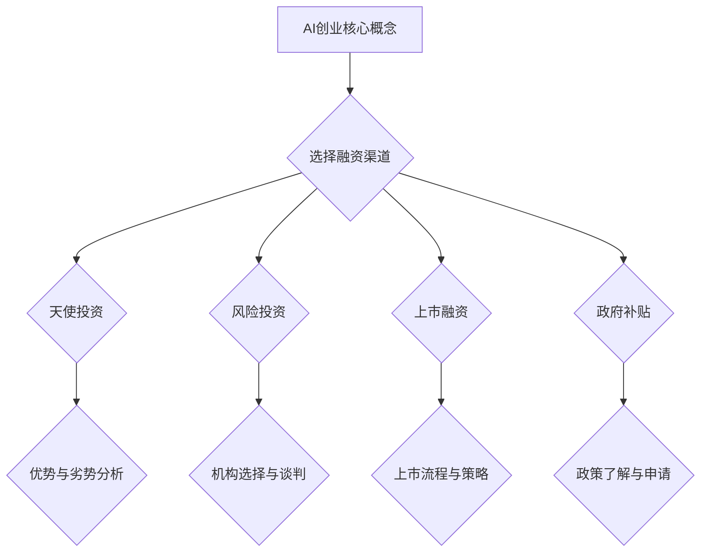

                 

# 文章标题：人工智能创业：选择融资渠道

> 关键词：人工智能、创业、融资、渠道、风险投资、天使投资、上市融资、政府补贴

> 摘要：本文深入探讨了人工智能创业企业选择融资渠道的策略与技巧。通过分析人工智能创业的背景、优势与挑战，以及不同融资渠道的特点和策略，为创业者提供了一套全面的融资指南。文章结合实际案例，详细讲解了如何进行融资后管理，并对未来趋势进行了展望。

## 第一部分：人工智能创业概述

### 第1章：人工智能创业概览

#### 1.1 AI创业背景分析

随着人工智能技术的飞速发展，AI创业成为了一个热门领域。全球范围内，越来越多的创业公司投身于人工智能的研究与开发，旨在通过技术创新解决实际问题。以下是当前全球AI创业的几个主要趋势：

1. **技术创新**：AI创业公司不断推动算法创新、硬件升级和大数据应用，以提升人工智能系统的性能和效率。
2. **市场热点**：自动驾驶、智能家居、智能医疗、金融科技等成为AI创业的焦点领域，吸引了大量资本的关注。
3. **投资需求**：AI创业项目往往需要大量资金支持研发和市场推广，因此投资需求旺盛。
4. **成功案例**：特斯拉、谷歌、微软等全球知名公司都在AI领域取得了巨大成功，为AI创业树立了榜样。

#### 1.2 AI创业优势与挑战

**技术优势**：

- **算法创新**：AI创业公司有机会推动算法创新，开发出具有竞争力的算法模型。
- **数据优势**：AI创业公司可以积累大量数据，通过数据挖掘和分析提升系统性能。

**市场挑战**：

- **竞争激烈**：AI领域竞争激烈，创业者需要不断创新以保持竞争优势。
- **用户需求变化**：用户需求多变，创业者需要快速响应市场变化，调整产品策略。

**法律风险与合规要求**：

- **隐私保护**：AI系统在处理用户数据时，需要严格遵守隐私保护法规。
- **数据安全**：AI创业公司需要确保数据安全，防止数据泄露和滥用。

### 第2章：AI创业策略与模式

#### 2.1 创业策略制定

**明确目标市场**：创业者需要明确自己的目标市场，了解市场需求和用户痛点，以便针对性地开发产品。

**市场调研与竞品分析**：通过市场调研和竞品分析，创业者可以了解市场现状和竞争对手，制定有效的市场策略。

**资源整合与团队构建**：创业者需要整合各类资源，包括资金、人才、技术等，并构建一个高效的团队。

#### 2.2 创业模式探讨

**自主研发与外包合作**：AI创业公司可以选择自主研发，以保持技术竞争力；也可以选择与外部团队合作，共享资源，降低成本。

**创新型创业与传统创业**：创新型创业注重技术创新和商业模式创新，而传统创业则更注重市场开发和客户服务。

**风险投资与自筹资金**：风险投资是一种重要的融资方式，适用于有发展潜力的创业项目；自筹资金则适用于初创阶段，创业者可以通过个人积蓄、朋友和家人等渠道筹集资金。

## 第二部分：融资渠道选择与策略

### 第3章：融资渠道概述

#### 3.1 融资渠道分类

**天使投资**：天使投资通常由个人投资者提供，他们对初创公司进行早期的投资，以换取股权。

**风险投资**：风险投资是由专业机构进行的投资，旨在为有发展潜力的创业公司提供资金支持。

**上市融资**：上市融资是企业通过公开发行股票，在证券市场上筹集资金。

**政府补贴与扶持**：政府补贴与扶持是政府对创业公司的直接资助，旨在促进创新和就业。

#### 3.2 融资流程与注意事项

**融资准备工作**：包括项目策划、市场调研、财务预测等，为融资谈判做好准备。

**融资材料准备**：包括商业计划书、财务报表、市场分析报告等，以证明项目的可行性和潜力。

**融资谈判与签订**：与投资人进行谈判，协商投资金额、股权比例、投资条款等，最终签订投资协议。

## 第三部分：融资后的管理与运营

### 第4章：融资后管理策略

#### 4.1 融资后的运营管理

**团队管理优化**：通过引入专业人才、优化团队结构，提升团队执行力。

**财务管理加强**：建立健全财务管理体系，确保资金使用效率。

**产品研发与市场推广**：加大产品研发投入，同时制定有效的市场推广策略。

#### 4.2 融资后的风险管理

**风险识别与评估**：定期评估项目风险，包括市场风险、技术风险、财务风险等。

**风险应对策略**：根据风险评估结果，制定相应的风险应对策略。

**法律合规管理**：确保公司运营符合法律法规要求，防范法律风险。

### 第5章：案例分析与实战指南

#### 5.1 成功融资案例分析

**优秀创业公司融资路径**：介绍成功创业公司的融资路径，分析成功要素。

**融资策略与成功要素**：总结成功融资的策略和关键要素，为创业者提供借鉴。

#### 5.2 融资实战指南

**准备工作清单**：列出融资前需要完成的准备工作，确保项目成熟。

**融资谈判技巧**：介绍融资谈判的关键技巧，提高谈判成功率。

**融资后的管理实践**：分享融资后的管理实践，确保公司持续发展。

## 第四部分：未来展望与趋势

### 第6章：AI创业未来趋势

#### 6.1 AI技术在创业中的应用前景

**新兴技术应用领域**：随着AI技术的发展，新的应用领域不断涌现，如机器人、无人驾驶、智能医疗等。

**行业变革趋势**：AI技术将对传统行业产生深远影响，推动产业变革。

#### 6.2 未来创业融资环境展望

**政策环境与市场环境**：分析未来创业融资的政策环境和市场环境，为创业者提供指导。

**投资机构与创业者关系**：探讨投资机构与创业者之间的互动关系，促进共同发展。

### 第7章：创业者的成长之路

#### 7.1 创业者素质要求

**创业精神与心态**：强调创业精神的重要性，培养积极的心态。

**管理能力与领导力**：提升管理能力和领导力，带领团队实现目标。

#### 7.2 创业者成长路径

**初创期发展策略**：在初创期，创业者需要注重产品开发、市场调研和团队建设。

**成长期战略规划**：在成长期，创业者需要制定明确的战略规划，提升企业竞争力。

**扩张期战略布局**：在扩张期，创业者需要拓展市场、优化产品和服务，实现企业规模化发展。

## 结语言篇

### 11.1 总结与展望

**回顾全书内容**：总结本书的主要内容和核心观点，为读者提供全面的融资指南。

**展望未来发展趋势**：分析未来AI创业和融资的趋势，为创业者提供发展方向。

### 11.2 致谢与致意

**感谢作者**：感谢作者为读者提供这篇有深度、有思考、有见解的技术博客文章。

**感谢读者**：感谢读者对本文的关注和支持，期待与您共同探讨AI创业的未来。

## 附录

### 附录A：融资渠道参考表

**天使投资机构列表**：列举知名天使投资机构及其联系方式。

**风险投资机构列表**：列举知名风险投资机构及其联系方式。

**政府补贴与扶持政策介绍**：介绍各国政府针对创业企业的补贴政策。

### 附录B：创业资源与工具

**创业服务平台推荐**：推荐优质的创业服务平台，为创业者提供全方位支持。

**创业相关书籍与资料**：推荐经典创业书籍和相关资料，帮助创业者提升知识储备。

### 附录C：参考文献

**人工智能创业相关研究**：介绍人工智能创业领域的研究成果和最新动态。

**融资策略与案例研究**：分析不同创业项目的融资策略和案例，提供实践参考。

### Mermaid 流程图



### 核心算法原理讲解

#### 风险评估算法

```plaintext
输入：项目基本情况、市场前景、团队素质、融资需求等
输出：风险评估结果（高、中、低）

算法步骤：
1. 收集数据：项目相关数据、市场数据、团队数据等
2. 数据预处理：标准化处理、缺失值处理等
3. 特征提取：根据数据特征构建模型输入特征
4. 建模：采用分类模型，如决策树、随机森林、支持向量机等
5. 训练模型：使用历史数据训练模型
6. 测试模型：使用测试数据验证模型准确性
7. 应用模型：对新项目进行风险评估
8. 输出结果：根据模型输出结果，给出风险评估结论
```

### 数学模型和数学公式

#### 投资回报率（ROI）计算

$$
ROI = \frac{净利润}{投资成本} \times 100\%
$$

其中，净利润为项目成功后的总收益减去总成本；投资成本包括初始投资金额和运营成本。

### 项目实战

#### 实例：搭建一个简单的AI创业公司融资网站

**开发环境搭建**

- 使用Python语言进行开发，基于Flask框架构建后端
- 使用HTML/CSS/JavaScript进行前端开发，采用Bootstrap框架提升用户体验
- 安装相关依赖库，如Flask、SQLAlchemy、Flask-WTF等

**源代码实现**

```python
# app.py

from flask import Flask, render_template, request
from sqlalchemy import create_engine
from flask_sqlalchemy import SQLAlchemy

app = Flask(__name__)
app.config['SQLALCHEMY_DATABASE_URI'] = 'sqlite:///finance.db'
db = SQLAlchemy(app)

class Company(db.Model):
    id = db.Column(db.Integer, primary_key=True)
    name = db.Column(db.String(100), nullable=False)
    funding_goal = db.Column(db.Float, nullable=False)
    raised_amount = db.Column(db.Float, nullable=False)

@app.route('/')
def index():
    companies = Company.query.all()
    return render_template('index.html', companies=companies)

@app.route('/submit', methods=['POST'])
def submit():
    name = request.form['name']
    funding_goal = float(request.form['funding_goal'])
    raised_amount = float(request.form['raised_amount'])
    new_company = Company(name=name, funding_goal=funding_goal, raised_amount=raised_amount)
    db.session.add(new_company)
    db.session.commit()
    return 'Company added successfully!'

if __name__ == '__main__':
    db.create_all()
    app.run(debug=True)
```

**代码解读与分析**

- **数据模型设计**：使用SQLAlchemy创建`Company`模型，包括公司名称、融资目标和已筹集金额。
- **后端路由**：定义两个路由，一个是主页`/`，用于展示所有公司信息；另一个是`/submit`，用于处理表单提交。
- **前端界面**：使用HTML表单收集公司信息，并通过AJAX提交到后端。
- **数据库操作**：将新公司的信息插入到SQLite数据库中，并返回成功消息。

通过上述实战案例，读者可以了解如何搭建一个简单的AI创业公司融资网站，包括开发环境搭建、源代码实现和代码解读与分析。这样的实战案例有助于读者将所学知识应用到实际项目中。

### 作者信息

**作者：AI天才研究院/AI Genius Institute & 禅与计算机程序设计艺术 /Zen And The Art of Computer Programming**

