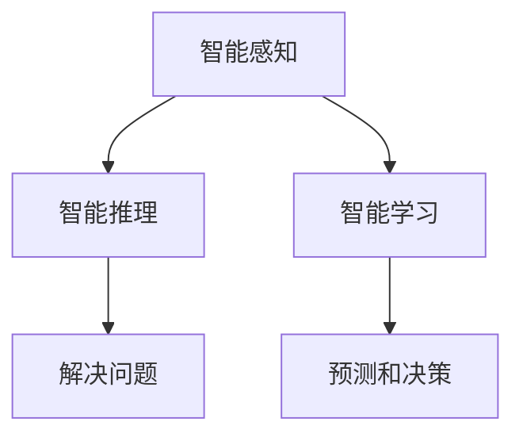
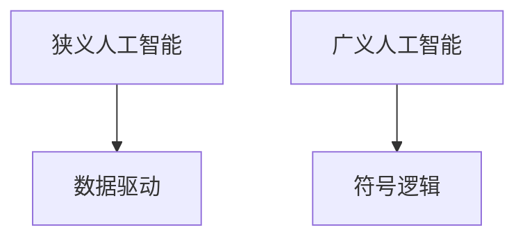
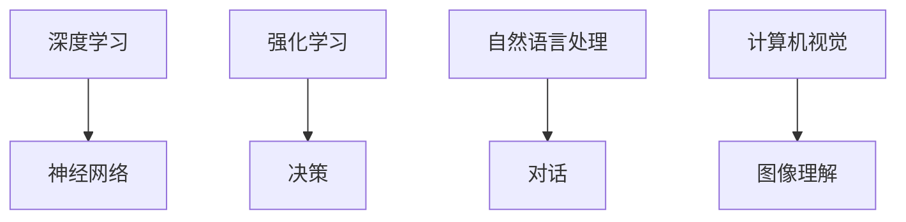

                 

# 《人工智能原理与代码实例讲解》

> 关键词：人工智能、机器学习、深度学习、神经网络、算法、实践、应用、开发工具

> 摘要：本文将详细介绍人工智能的基本原理和关键技术，通过代码实例讲解，帮助读者深入理解并掌握人工智能的核心内容。文章分为两部分，第一部分介绍人工智能的基础理论，包括人工智能概述、机器学习基础和深度学习原理；第二部分介绍人工智能的技术实践，包括机器学习实战案例、深度学习实战案例、人工智能应用和人工智能开发工具与环境搭建。

## 第一部分：人工智能基础理论

### 第1章：人工智能概述

#### 1.1 人工智能的定义与历史

人工智能（Artificial Intelligence，简称AI）是计算机科学的一个分支，旨在研究、开发和应用使计算机系统表现出人类智能行为的理论、方法和技术。人工智能的起源可以追溯到20世纪50年代，当时图灵提出了图灵测试，并引发了人工智能研究的热潮。

**核心概念与联系**

人工智能的核心任务是使计算机具有以下能力：

- **智能感知**：通过传感器获取环境信息，并对其进行处理和理解。
- **智能推理**：根据已知信息，运用逻辑推理来解决问题。
- **智能学习**：从数据中学习规律，并利用这些规律进行预测和决策。

**Mermaid 流程图**



#### 1.2 人工智能的分类

人工智能可以分为狭义人工智能和广义人工智能。狭义人工智能主要指基于数据驱动的方法，如机器学习和深度学习；广义人工智能则包括基于符号逻辑的方法，如知识表示和推理。

**核心概念与联系**

- **狭义人工智能**：依赖于大量数据，通过机器学习算法实现。
- **广义人工智能**：依赖于知识表示和推理，通过符号逻辑实现。

**Mermaid 流程图**



#### 1.3 人工智能的发展趋势

人工智能的发展趋势主要包括以下几个方向：

- **深度学习**：通过神经网络模拟人脑处理信息的过程，实现更高效、更强大的模型。
- **强化学习**：通过不断试错，学习最优策略，应用于决策和游戏等领域。
- **自然语言处理**：实现人与计算机的智能对话，应用于语音识别和机器翻译等领域。
- **计算机视觉**：实现计算机对图像和视频的理解，应用于安防、医疗和自动驾驶等领域。

**Mermaid 流程图**



### 第2章：机器学习基础

#### 2.1 机器学习的基本概念

机器学习（Machine Learning，简称ML）是人工智能的一个重要分支，旨在通过算法从数据中学习规律，并利用这些规律进行预测和决策。

**核心概念与联系**

- **数据集**：一组已标记的数据，用于训练和评估模型。
- **特征**：描述数据特性的指标，用于表示数据。
- **模型**：根据数据学习得到的规律，用于预测和决策。

**伪代码**

```python
# 伪代码：机器学习基本流程
def machine_learning(data_set):
    # 数据预处理
    preprocessed_data = preprocess_data(data_set)
    
    # 模型训练
    model = train_model(preprocessed_data)
    
    # 模型评估
    evaluate_model(model, preprocessed_data)
    
    # 模型应用
    apply_model(model, new_data)
```

#### 2.2 监督学习

监督学习（Supervised Learning）是一种常见的机器学习方法，通过已标记的数据训练模型，然后利用模型对新数据进行预测。

**核心概念与联系**

- **分类问题**：将数据分为不同的类别。
- **回归问题**：预测数据的连续值。

**伪代码**

```python
# 伪代码：监督学习分类问题
def classify(data_set):
    # 数据预处理
    preprocessed_data = preprocess_data(data_set)
    
    # 模型训练
    model = train_classifier(preprocessed_data)
    
    # 预测
    predictions = model.predict(new_data)
    
    return predictions
```

#### 2.3 无监督学习

无监督学习（Unsupervised Learning）是一种不依赖于已标记数据的机器学习方法，主要分为聚类分析和维度约减。

**核心概念与联系**

- **聚类分析**：将数据分为不同的簇。
- **维度约减**：降低数据的维度，减少冗余信息。

**伪代码**

```python
# 伪代码：无监督学习聚类分析
def cluster(data_set):
    # 数据预处理
    preprocessed_data = preprocess_data(data_set)
    
    # 模型训练
    model = train_clusterer(preprocessed_data)
    
    # 聚类
    clusters = model.cluster()
    
    return clusters
```

#### 2.4 强化学习

强化学习（Reinforcement Learning，简称RL）是一种通过与环境交互，不断学习最优策略的机器学习方法。

**核心概念与联系**

- **状态**：描述环境的当前状态。
- **动作**：系统可以采取的动作。
- **奖励**：根据动作的结果，系统获得的奖励。

**伪代码**

```python
# 伪代码：强化学习
def reinforce_learning():
    # 初始化
    state = initialize_state()
    
    # 学习循环
    while not goal_reached:
        # 采取动作
        action = choose_action(state)
        
        # 执行动作
        next_state, reward = execute_action(state, action)
        
        # 更新状态
        state = next_state
        
        # 学习策略
        update_policy(state, action, reward)
```

### 第3章：深度学习原理

#### 3.1 深度学习基础

深度学习（Deep Learning，简称DL）是一种基于多层神经网络的机器学习方法，通过学习数据的层次化表示，实现更复杂的任务。

**核心概念与联系**

- **神经网络**：由多个神经元组成的计算模型。
- **多层神经网络**：通过增加隐藏层，实现更复杂的特征提取。
- **深度神经网络**：具有多个隐藏层的神经网络。

**伪代码**

```python
# 伪代码：深度学习基本结构
class NeuralNetwork:
    def __init__(self, input_size, hidden_size, output_size):
        self.input_size = input_size
        self.hidden_size = hidden_size
        self.output_size = output_size
        
        # 初始化权重和偏置
        self.weights = initialize_weights(input_size, hidden_size)
        self.biases = initialize_biases(hidden_size)
        
        # 初始化输出层权重和偏置
        self.output_weights = initialize_weights(hidden_size, output_size)
        self.output_biases = initialize_biases(output_size)
        
    def forward(self, x):
        # 前向传播
        hidden_layer_output = activation_function(np.dot(x, self.weights) + self.biases)
        output_layer_output = activation_function(np.dot(hidden_layer_output, self.output_weights) + self.output_biases)
        
        return output_layer_output
```

#### 3.2 神经网络

神经网络（Neural Network，简称NN）是一种模拟人脑神经元计算方式的计算模型。

**核心概念与联系**

- **神经元**：神经网络的基本单元。
- **激活函数**：用于确定神经元是否激活。
- **前向传播**：将输入数据通过神经网络，计算输出。

**伪代码**

```python
# 伪代码：神经元与激活函数
class Neuron:
    def __init__(self, weights, bias):
        self.weights = weights
        self.bias = bias
        
    def activate(self, input_value):
        return activation_function(input_value * self.weights + self.bias)
```

#### 3.3 卷积神经网络（CNN）

卷积神经网络（Convolutional Neural Network，简称CNN）是一种专门用于图像处理的神经网络。

**核心概念与联系**

- **卷积层**：通过卷积运算提取图像特征。
- **池化层**：通过池化运算降低特征维度。
- **全连接层**：将卷积和池化层提取的特征进行分类。

**伪代码**

```python
# 伪代码：卷积神经网络
class ConvolutionalNeuralNetwork:
    def __init__(self, input_shape, num_classes):
        self.conv1 = Conv2DLayer(input_shape, 32, 3)
        self.pool1 = MaxPooling2DLayer(2, 2)
        self.conv2 = Conv2DLayer(self.pool1.output_shape, 64, 3)
        self.pool2 = MaxPooling2DLayer(2, 2)
        self.fc1 = FullyConnectedLayer(self.pool2.output_shape, 512)
        self.fc2 = FullyConnectedLayer(self.fc1.output_shape, num_classes)
        
    def forward(self, x):
        x = self.conv1.forward(x)
        x = self.pool1.forward(x)
        x = self.conv2.forward(x)
        x = self.pool2.forward(x)
        x = self.fc1.forward(x)
        x = self.fc2.forward(x)
        
        return x
```

#### 3.4 循环神经网络（RNN）与长短时记忆网络（LSTM）

循环神经网络（Recurrent Neural Network，简称RNN）是一种适用于序列数据处理的神经网络。

**核心概念与联系**

- **循环结构**：将输出作为下一个输入。
- **长短时记忆（LSTM）**：通过门控机制，学习长期依赖关系。

**伪代码**

```python
# 伪代码：循环神经网络
class RecurrentNeuralNetwork:
    def __init__(self, input_size, hidden_size):
        self.hidden_size = hidden_size
        self.input_size = input_size
        self.weights = initialize_weights(input_size, hidden_size)
        self.biases = initialize_biases(hidden_size)
        
    def forward(self, x):
        # 前向传播
        hidden = activation_function(np.dot(x, self.weights) + self.biases)
        
        return hidden
```

```python
# 伪代码：长短时记忆网络（LSTM）
class LSTMCell:
    def __init__(self, input_size, hidden_size):
        self.input_size = input_size
        self.hidden_size = hidden_size
        self.weights = initialize_weights(input_size, hidden_size)
        self.biases = initialize_biases(hidden_size)
        
    def forward(self, x, hidden):
        # 前向传播
        input_gate = sigmoid(np.dot(x, self.weights) + self.biases)
        forget_gate = sigmoid(np.dot(x, self.weights) + self.biases)
        cell_state = tanh(np.dot(x, self.weights) + self.biases)
        
        new_hidden = input_gate * cell_state + forget_gate * hidden
        
        return new_hidden, cell_state
```

## 第二部分：人工智能技术实践

### 第4章：机器学习实战案例

#### 4.1 数据预处理

数据预处理是机器学习的重要步骤，主要包括数据清洗、特征提取和数据集划分。

**核心概念与联系**

- **数据清洗**：去除噪声和异常值。
- **特征提取**：将原始数据转换为有用的特征。
- **数据集划分**：将数据划分为训练集、验证集和测试集。

**伪代码**

```python
# 伪代码：数据预处理
def preprocess_data(data):
    # 数据清洗
    cleaned_data = clean_data(data)
    
    # 特征提取
    features = extract_features(cleaned_data)
    
    # 数据集划分
    train_data, val_data, test_data = split_data(features)
    
    return train_data, val_data, test_data
```

#### 4.2 模型选择与调优

模型选择与调优是提高模型性能的重要步骤，主要包括选择合适的模型、调整超参数和评估模型。

**核心概念与联系**

- **模型选择**：根据任务需求选择合适的模型。
- **超参数调优**：通过调整模型超参数，提高模型性能。
- **模型评估**：评估模型性能，选择最佳模型。

**伪代码**

```python
# 伪代码：模型选择与调优
def model_selection_and_tuning(train_data, val_data):
    # 模型选择
    model = select_model(train_data)
    
    # 超参数调优
    best_params = tune_hyperparameters(model, train_data, val_data)
    
    # 模型评估
    evaluate_model(model, val_data, best_params)
    
    return best_params
```

#### 4.3 实战项目1：手写数字识别

手写数字识别是一个经典的机器学习任务，主要用于图像分类。

**核心概念与联系**

- **图像预处理**：将图像转换为灰度图像，并归一化。
- **特征提取**：通过卷积神经网络提取图像特征。
- **分类**：使用softmax回归对图像进行分类。

**伪代码**

```python
# 伪代码：手写数字识别
def handwritten_digit_recognition(train_data, test_data):
    # 数据预处理
    preprocessed_train_data, preprocessed_test_data = preprocess_data(train_data, test_data)
    
    # 特征提取
    features = extract_features(preprocessed_train_data)
    
    # 分类
    model = train_softmax_regression(features, train_labels)
    
    # 测试
    test_predictions = model.predict(preprocessed_test_data)
    
    return test_predictions
```

#### 4.4 实战项目2：文本分类

文本分类是一个常见的自然语言处理任务，主要用于对文本进行分类。

**核心概念与联系**

- **文本预处理**：去除停用词、标点符号，进行词干提取。
- **特征提取**：通过词袋模型或词嵌入提取文本特征。
- **分类**：使用朴素贝叶斯、支持向量机等分类器进行分类。

**伪代码**

```python
# 伪代码：文本分类
def text_classification(train_data, test_data):
    # 数据预处理
    preprocessed_train_data, preprocessed_test_data = preprocess_text(train_data, test_data)
    
    # 特征提取
    features = extract_text_features(preprocessed_train_data)
    
    # 分类
    model = train_naive_bayes(features, train_labels)
    
    # 测试
    test_predictions = model.predict(preprocessed_test_data)
    
    return test_predictions
```

### 第5章：深度学习实战案例

#### 5.1 深度学习框架介绍

深度学习框架是用于实现深度学习模型的软件库，常用的框架包括TensorFlow和PyTorch。

**核心概念与联系**

- **TensorFlow**：由谷歌开发，提供丰富的API和工具。
- **PyTorch**：由Facebook开发，提供动态计算图和自动微分功能。

**伪代码**

```python
# 伪代码：TensorFlow框架
import tensorflow as tf

# 定义模型
model = tf.keras.Sequential([
    tf.keras.layers.Dense(128, activation='relu', input_shape=(784,)),
    tf.keras.layers.Dense(10, activation='softmax')
])

# 编译模型
model.compile(optimizer='adam',
              loss='categorical_crossentropy',
              metrics=['accuracy'])

# 训练模型
model.fit(x_train, y_train, epochs=5)

# 评估模型
test_loss, test_acc = model.evaluate(x_test, y_test)
```

```python
# 伪代码：PyTorch框架
import torch
import torch.nn as nn

# 定义模型
class Model(nn.Module):
    def __init__(self):
        super(Model, self).__init__()
        self.fc1 = nn.Linear(784, 128)
        self.fc2 = nn.Linear(128, 10)
        
    def forward(self, x):
        x = torch.relu(self.fc1(x))
        x = self.fc2(x)
        return x

# 创建模型实例
model = Model()

# 编译模型
optimizer = torch.optim.Adam(model.parameters(), lr=0.001)
criterion = nn.CrossEntropyLoss()

# 训练模型
for epoch in range(5):
    for inputs, labels in train_loader:
        optimizer.zero_grad()
        outputs = model(inputs)
        loss = criterion(outputs, labels)
        loss.backward()
        optimizer.step()

# 评估模型
with torch.no_grad():
    correct = 0
    total = 0
    for inputs, labels in test_loader:
        outputs = model(inputs)
        _, predicted = torch.max(outputs.data, 1)
        total += labels.size(0)
        correct += (predicted == labels).sum().item()

print('Test Accuracy: {}%'.format(100 * correct / total))
```

#### 5.2 实战项目1：图像分类

图像分类是一个常见的深度学习任务，主要用于对图像进行分类。

**核心概念与联系**

- **数据预处理**：将图像转换为固定的尺寸，并进行归一化处理。
- **模型训练**：使用卷积神经网络进行模型训练。
- **模型评估**：评估模型性能，选择最佳模型。

**伪代码**

```python
# 伪代码：图像分类
from tensorflow.keras.datasets import cifar10
from tensorflow.keras.models import Sequential
from tensorflow.keras.layers import Conv2D, MaxPooling2D, Dense, Flatten

# 加载数据
(x_train, y_train), (x_test, y_test) = cifar10.load_data()

# 数据预处理
x_train = x_train.astype('float32') / 255.0
x_test = x_test.astype('float32') / 255.0
y_train = tf.keras.utils.to_categorical(y_train, 10)
y_test = tf.keras.utils.to_categorical(y_test, 10)

# 定义模型
model = Sequential()
model.add(Conv2D(32, (3, 3), activation='relu', input_shape=(32, 32, 3)))
model.add(MaxPooling2D((2, 2)))
model.add(Conv2D(64, (3, 3), activation='relu'))
model.add(MaxPooling2D((2, 2)))
model.add(Conv2D(64, (3, 3), activation='relu'))
model.add(Flatten())
model.add(Dense(64, activation='relu'))
model.add(Dense(10, activation='softmax'))

# 编译模型
model.compile(optimizer='adam', loss='categorical_crossentropy', metrics=['accuracy'])

# 训练模型
model.fit(x_train, y_train, epochs=10, batch_size=64, validation_data=(x_test, y_test))

# 评估模型
test_loss, test_acc = model.evaluate(x_test, y_test)
print('Test Accuracy: {:.2f}%'.format(test_acc * 100))
```

#### 5.3 实战项目2：目标检测

目标检测是一个重要的计算机视觉任务，主要用于识别图像中的目标物体。

**核心概念与联系**

- **数据预处理**：将图像缩放至固定尺寸，并进行归一化处理。
- **模型训练**：使用卷积神经网络进行模型训练。
- **模型评估**：评估模型性能，选择最佳模型。

**伪代码**

```python
# 伪代码：目标检测
from tensorflow.keras.models import Model
from tensorflow.keras.layers import Input, Conv2D, MaxPooling2D, Flatten, Dense

# 定义模型
input_layer = Input(shape=(32, 32, 3))
conv1 = Conv2D(32, (3, 3), activation='relu')(input_layer)
pool1 = MaxPooling2D(pool_size=(2, 2))(conv1)
conv2 = Conv2D(64, (3, 3), activation='relu')(pool1)
pool2 = MaxPooling2D(pool_size=(2, 2))(conv2)
flat = Flatten()(pool2)
dense = Dense(128, activation='relu')(flat)
output_layer = Dense(10, activation='softmax')(dense)

model = Model(inputs=input_layer, outputs=output_layer)

# 编译模型
model.compile(optimizer='adam', loss='categorical_crossentropy', metrics=['accuracy'])

# 训练模型
model.fit(x_train, y_train, epochs=10, batch_size=64, validation_data=(x_test, y_test))

# 评估模型
test_loss, test_acc = model.evaluate(x_test, y_test)
print('Test Accuracy: {:.2f}%'.format(test_acc * 100))
```

#### 5.4 实战项目3：语音识别

语音识别是一个重要的自然语言处理任务，主要用于将语音转换为文本。

**核心概念与联系**

- **数据预处理**：将语音信号转换为特征向量。
- **模型训练**：使用循环神经网络进行模型训练。
- **模型评估**：评估模型性能，选择最佳模型。

**伪代码**

```python
# 伪代码：语音识别
from tensorflow.keras.models import Sequential
from tensorflow.keras.layers import LSTM, Dense

# 定义模型
input_shape = (timesteps, features)
model = Sequential()
model.add(LSTM(128, activation='relu', input_shape=input_shape))
model.add(Dense(64, activation='relu'))
model.add(Dense(num_classes, activation='softmax'))

# 编译模型
model.compile(optimizer='adam', loss='categorical_crossentropy', metrics=['accuracy'])

# 训练模型
model.fit(x_train, y_train, epochs=10, batch_size=64, validation_data=(x_test, y_test))

# 评估模型
test_loss, test_acc = model.evaluate(x_test, y_test)
print('Test Accuracy: {:.2f}%'.format(test_acc * 100))
```

### 第6章：人工智能应用

#### 6.1 人工智能在医疗领域的应用

人工智能在医疗领域具有广泛的应用，包括疾病预测、诊断、治疗方案推荐和医疗机器人。

**核心概念与联系**

- **疾病预测**：通过分析患者数据，预测疾病发生的可能性。
- **诊断**：通过医学图像分析，辅助医生进行疾病诊断。
- **治疗方案推荐**：根据患者数据和疾病特点，推荐最佳治疗方案。
- **医疗机器人**：辅助医生进行手术和护理工作。

**伪代码**

```python
# 伪代码：疾病预测
from sklearn.ensemble import RandomForestClassifier

# 加载数据
(x_train, y_train), (x_test, y_test) = load_medical_data()

# 数据预处理
x_train = preprocess_medical_data(x_train)
x_test = preprocess_medical_data(x_test)

# 训练模型
model = RandomForestClassifier()
model.fit(x_train, y_train)

# 预测
predictions = model.predict(x_test)

# 评估
accuracy = evaluate_model(predictions, y_test)
print('Accuracy: {:.2f}%'.format(accuracy * 100))
```

#### 6.2 人工智能在金融领域的应用

人工智能在金融领域具有广泛的应用，包括量化交易、风险评估和金融服务个性化推荐。

**核心概念与联系**

- **量化交易**：通过分析市场数据，制定交易策略。
- **风险评估**：对金融产品进行风险评估，降低风险。
- **金融服务个性化推荐**：根据用户行为和偏好，推荐金融产品。

**伪代码**

```python
# 伪代码：量化交易
from sklearn.ensemble import RandomForestClassifier

# 加载数据
(x_train, y_train), (x_test, y_test) = load_finance_data()

# 数据预处理
x_train = preprocess_finance_data(x_train)
x_test = preprocess_finance_data(x_test)

# 训练模型
model = RandomForestClassifier()
model.fit(x_train, y_train)

# 预测
predictions = model.predict(x_test)

# 评估
accuracy = evaluate_model(predictions, y_test)
print('Accuracy: {:.2f}%'.format(accuracy * 100))
```

#### 6.3 人工智能在工业领域的应用

人工智能在工业领域具有广泛的应用，包括生产过程优化、质量检测与控制和智能制造。

**核心概念与联系**

- **生产过程优化**：通过分析生产数据，优化生产过程。
- **质量检测与控制**：通过图像分析和传感器数据，检测产品质量，并自动调整生产参数。
- **智能制造**：通过物联网和人工智能技术，实现生产过程的智能化。

**伪代码**

```python
# 伪代码：生产过程优化
from sklearn.ensemble import RandomForestRegressor

# 加载数据
(x_train, y_train), (x_test, y_test) = load_industrial_data()

# 数据预处理
x_train = preprocess_industrial_data(x_train)
x_test = preprocess_industrial_data(x_test)

# 训练模型
model = RandomForestRegressor()
model.fit(x_train, y_train)

# 预测
predictions = model.predict(x_test)

# 评估
accuracy = evaluate_model(predictions, y_test)
print('Accuracy: {:.2f}%'.format(accuracy * 100))
```

#### 6.4 人工智能在交通领域的应用

人工智能在交通领域具有广泛的应用，包括自动驾驶技术、智能交通管理系统和智能交通信号控制。

**核心概念与联系**

- **自动驾驶技术**：通过计算机视觉和传感器数据，实现无人驾驶。
- **智能交通管理系统**：通过数据分析和预测，优化交通流量。
- **智能交通信号控制**：根据交通流量数据，自动调整交通信号灯。

**伪代码**

```python
# 伪代码：自动驾驶技术
from sklearn.ensemble import RandomForestClassifier

# 加载数据
(x_train, y_train), (x_test, y_test) = load_traffic_data()

# 数据预处理
x_train = preprocess_traffic_data(x_train)
x_test = preprocess_traffic_data(x_test)

# 训练模型
model = RandomForestClassifier()
model.fit(x_train, y_train)

# 预测
predictions = model.predict(x_test)

# 评估
accuracy = evaluate_model(predictions, y_test)
print('Accuracy: {:.2f}%'.format(accuracy * 100))
```

### 第7章：人工智能开发工具与环境搭建

#### 7.1 Python编程基础

Python是一种广泛应用于人工智能的编程语言，具有简洁、易读和高效的特点。

**核心概念与联系**

- **变量和类型**：Python中的变量和类型。
- **控制结构**：条件判断和循环结构。
- **函数和模块**：自定义函数和模块。

**伪代码**

```python
# 伪代码：Python编程基础
# 变量和类型
x = 10
y = "Hello, World!"

# 控制结构
if x > 0:
    print("x is positive")
else:
    print("x is negative")

# 循环结构
for i in range(5):
    print(i)

# 函数和模块
def greet(name):
    return "Hello, " + name

from math import sqrt

# 模块
import numpy as np
x = np.array([1, 2, 3])
print(sqrt(x))
```

#### 7.2 深度学习框架安装与配置

深度学习框架是用于实现深度学习模型的软件库，常用的框架包括TensorFlow和PyTorch。

**核心概念与联系**

- **TensorFlow**：安装和配置TensorFlow。
- **PyTorch**：安装和配置PyTorch。

**伪代码**

```python
# 伪代码：TensorFlow安装与配置
!pip install tensorflow

import tensorflow as tf
print(tf.__version__)

# 伪代码：PyTorch安装与配置
!pip install torch torchvision

import torch
print(torch.__version__)
print(torchvision.__version__)
```

#### 7.3 实战项目：搭建一个简单的神经网络模型

**核心概念与联系**

- **模型搭建**：定义神经网络结构。
- **模型训练**：使用训练数据训练模型。
- **模型评估**：使用测试数据评估模型性能。

**伪代码**

```python
# 伪代码：简单的神经网络模型
import tensorflow as tf

# 定义模型
model = tf.keras.Sequential([
    tf.keras.layers.Dense(128, activation='relu', input_shape=(784,)),
    tf.keras.layers.Dense(10, activation='softmax')
])

# 编译模型
model.compile(optimizer='adam',
              loss='categorical_crossentropy',
              metrics=['accuracy'])

# 训练模型
model.fit(x_train, y_train, epochs=5)

# 评估模型
test_loss, test_acc = model.evaluate(x_test, y_test)
print('Test Accuracy: {:.2f}%'.format(test_acc * 100))
```

# 附录

#### 附录A：人工智能相关资源与参考书籍

- **《人工智能：一种现代的方法》（人工智能：一种现代的方法）**：这是一本关于人工智能的经典教材，涵盖了人工智能的基本概念、技术和应用。
- **《深度学习》（深度学习）**：这是一本关于深度学习的权威教材，详细介绍了深度学习的理论基础和实现方法。
- **《Python机器学习》（Python机器学习）**：这是一本关于Python在机器学习领域的应用教材，介绍了Python在机器学习中的常用库和工具。

#### 附录B：深度学习常用数学公式与算法伪代码

- **卷积运算**

$$
\begin{aligned}
    (f * g)(x) &= \int_{-\infty}^{+\infty} f(t)g(x-t) \, dt \\
    (f * g)(x) &= \sum_{k=-\infty}^{+\infty} f(k)g(x-k)
\end{aligned}
$$

**伪代码**

```python
def convolution(f, g):
    result = np.zeros(len(f) + len(g) - 1)
    for i in range(len(result)):
        result[i] = sum(f[j] * g[i-j] for j in range(len(f)))
    return result
```

- **反向传播算法**

$$
\begin{aligned}
    \frac{\partial E}{\partial w} &= \frac{\partial E}{\partial z} \cdot \frac{\partial z}{\partial w} \\
    \frac{\partial E}{\partial b} &= \frac{\partial E}{\partial z}
\end{aligned}
$$

**伪代码**

```python
def backward_propagation(E, z, w, b):
    dw = z * dz
    db = dz
    return dw, db
```

- **softmax回归**

$$
\begin{aligned}
    P(y=i|x;\theta) &= \frac{e^{\theta^T x_i}}{\sum_{j=1}^K e^{\theta^T x_j}} \\
    \log P(y=i|x;\theta) &= \theta^T x_i - \log \sum_{j=1}^K e^{\theta^T x_j}
\end{aligned}
$$

**伪代码**

```python
def softmax_regression(x, y, theta):
    z = x @ theta
    loss = -1 / len(x) * sum(y[i] * z[i] - log(sum(exp(z[j])) for j in range(len(z))))
    return loss
```

作者：AI天才研究院/AI Genius Institute & 禅与计算机程序设计艺术 /Zen And The Art of Computer Programming

（本文完）

