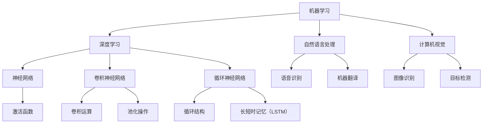

                 

### 文章标题：人工智能：社会影响

> 关键词：人工智能、社会影响、伦理、技术发展、未来趋势

> 摘要：本文将深入探讨人工智能对社会各个方面的深远影响，包括基本概念、数学基础、核心技术、应用领域、伦理与法律问题以及未来发展趋势。通过逻辑清晰、结构紧凑的分析，我们将全面了解人工智能如何塑造我们的世界，并思考其潜在的社会影响。

### 第一部分：人工智能的基本概念

在探讨人工智能对社会的影响之前，我们需要首先理解人工智能的基本概念。人工智能（Artificial Intelligence，简称AI）是计算机科学的一个分支，旨在创造智能体，这些智能体能够执行通常需要人类智能才能完成的任务。本部分将介绍人工智能的定义、发展历程、核心概念和应用领域。

#### 第1章：人工智能概述

##### 1.1 人工智能的定义与发展历程

**定义**：人工智能（Artificial Intelligence，简称 AI）是模拟、延伸和扩展人类智能的理论、方法、技术及应用。AI旨在开发能够感知、学习、推理、决策和解决问题的计算机系统。

**发展历程**：
- **早期探索**（20世纪50年代）：人工智能概念首次提出，主要包括逻辑推理、问题求解等领域。
- **繁荣时期**（20世纪80年代）：专家系统的崛起，例如 MYCIN、DENDRAL。
- **低谷时期**（20世纪90年代）：由于技术瓶颈和实际应用困难，人工智能进入低谷。
- **复兴时期**（21世纪）：随着计算能力的提升和大数据、深度学习等技术的突破，人工智能再次受到广泛关注。

##### 1.2 人工智能的核心概念

- **机器学习**：利用数据或以往的经验，让计算机自动改进性能的过程。机器学习分为监督学习、无监督学习和强化学习。
- **深度学习**：一种基于人工神经网络的机器学习技术，能够自动提取特征并用于分类、回归等任务。深度学习在图像识别、语音识别等领域取得了显著成果。
- **自然语言处理**：使计算机能够理解、解释和生成人类语言的技术。自然语言处理的应用包括机器翻译、语音助手和文本分析等。
- **计算机视觉**：让计算机具备图像识别和处理能力的技术。计算机视觉在自动驾驶、医疗影像分析等领域具有广泛的应用。

##### 1.3 人工智能的应用领域

- **工业自动化**：通过机器人和自动化生产线提高生产效率。
- **医疗保健**：帮助诊断疾病、个性化治疗和医疗数据管理。
- **金融科技**：风险评估、智能投顾和自动化交易等。
- **交通出行**：智能交通系统、无人驾驶汽车和无人机等。
- **教育**：个性化教学、智能评估和在线学习平台。

#### 第2章：人工智能的数学基础

人工智能的发展离不开数学的支撑。本部分将介绍人工智能领域常用的数学基础，包括线性代数、概率论和最优化方法。

##### 2.1 线性代数基础

- **矩阵和向量**：用于表示和操作数据的基本工具。
- **线性方程组**：解决现实问题的重要手段。

##### 2.2 概率论基础

- **概率分布**：描述随机变量可能取值的概率分布。
- **条件概率与贝叶斯定理**：用于推理和决策的重要工具。

##### 2.3 最优化方法

- **梯度下降算法**：用于求解最优化问题的基本算法。
- **线性规划**：在资源有限的情况下，优化目标函数的方法。

#### 第3章：人工智能的关键技术

本部分将深入探讨人工智能的核心技术，包括深度学习、卷积神经网络和循环神经网络等。

##### 3.1 深度学习基础

- **神经网络**：模拟人脑信息处理过程的网络结构。
- **激活函数**：用于引入非线性特性的函数。

##### 3.2 卷积神经网络

- **卷积运算**：特征提取的有效方法。
- **池化操作**：减少参数数量，提高模型泛化能力。

##### 3.3 循环神经网络

- **循环结构**：处理序列数据的能力。
- **长短时记忆（LSTM）**：解决长序列依赖问题。

### 第二部分：人工智能在社会中的应用

人工智能已经深入到社会的各个方面，改变了我们的生活方式和工作方式。本部分将重点讨论人工智能在医疗、金融、自动驾驶、教育等领域的具体应用，以及其对社会产生的深远影响。

#### 第4章：人工智能在医疗领域的应用

人工智能在医疗领域的应用极大地提升了医疗服务的质量和效率。以下是一些关键的应用场景：

##### 4.1 疾病诊断

- **影像识别**：使用计算机视觉技术分析医学影像，如X光片、CT扫描和MRI，帮助医生更准确地诊断疾病。
- **基因组分析**：通过分析患者的基因组数据，预测疾病风险，为个性化治疗提供依据。

##### 4.2 个性化治疗

- **数据驱动治疗**：根据患者的具体病情和基因组信息，制定个性化的治疗方案。
- **药物研发**：利用机器学习算法加速新药的发现和开发。

#### 第5章：人工智能在金融领域的应用

金融科技（FinTech）是人工智能在金融领域的典型应用，通过人工智能技术提高金融服务的效率和准确性。

##### 5.1 风险管理

- **信用评分**：利用机器学习算法分析客户的历史交易数据，预测其信用风险。
- **欺诈检测**：通过模式识别技术，自动检测并防止金融交易中的欺诈行为。

##### 5.2 智能投顾

- **个性化投资建议**：利用大数据分析，为投资者提供个性化的投资组合建议。
- **自动化交易**：基于算法的自动化交易系统，提高交易效率和收益。

#### 第6章：人工智能在自动驾驶领域的应用

自动驾驶技术是人工智能在交通出行领域的重要应用，它有望彻底改变未来的交通方式。

##### 6.1 环境感知

- **传感器融合**：使用激光雷达、摄像头、超声波传感器等收集道路信息，构建三维环境模型。
- **目标检测与跟踪**：利用计算机视觉技术识别道路上的车辆、行人、交通标志等目标，并进行实时跟踪。

##### 6.2 路径规划

- **决策与控制**：根据环境感知数据，设计安全、高效的驾驶路径，并控制车辆执行驾驶动作。

#### 第7章：人工智能在教育领域的应用

人工智能正在改变教育的方式，提供个性化教学、智能评估和在线学习平台。

##### 7.1 个性化教学

- **自适应学习系统**：根据学生的学习习惯和知识水平，提供个性化的学习内容和教学方法。
- **学习数据分析**：通过分析学生的学习数据，发现学习障碍并提供针对性的辅导。

##### 7.2 智能评估

- **自动评分系统**：使用自然语言处理和计算机视觉技术，自动评分学生的作业和考试。
- **学习效果评估**：通过分析学生的学习数据，评估教学效果，并进行改进。

### 第三部分：人工智能的伦理与法律问题

随着人工智能技术的发展，伦理和法律问题日益凸显。本部分将探讨人工智能在隐私保护、责任归属、算法透明度等方面的伦理与法律问题。

#### 第8章：人工智能伦理问题

人工智能的快速发展引发了一系列伦理问题，需要我们认真对待。

##### 8.1 隐私保护

- **数据收集与使用**：在开发和使用人工智能系统时，如何确保个人隐私不受侵犯。
- **数据安全**：如何防止数据泄露和滥用，确保数据的安全性和保密性。

##### 8.2 责任归属

- **事故责任**：当人工智能系统发生错误或导致事故时，如何界定责任。
- **算法偏见**：如何防止人工智能系统中的算法偏见，确保公平性和公正性。

#### 第9章：人工智能法律问题

人工智能技术的发展对现有法律体系提出了新的挑战，需要制定相应的法律法规。

##### 9.1 数据保护

- **数据隐私法规**：如《通用数据保护条例》（GDPR），对数据收集、存储和使用进行规范。
- **跨境数据流动**：如何处理跨国数据传输和存储问题。

##### 9.2 算法透明度

- **算法可解释性**：如何确保算法的可解释性，使其决策过程透明。
- **监管框架**：如何建立有效的监管机制，确保人工智能系统的安全性和合规性。

### 第四部分：人工智能的未来发展趋势

人工智能正在快速发展，未来将会带来更多的变革和机遇。本部分将探讨人工智能在云计算、物联网、增强现实/虚拟现实等领域的未来发展趋势。

#### 第10章：人工智能与云计算

云计算为人工智能提供了强大的计算能力和数据存储资源，使其能够处理大规模数据集。

##### 10.1 云计算

- **分布式计算**：通过云计算平台，实现大规模分布式计算，提高人工智能模型的效率和可扩展性。
- **数据存储与管理**：利用云计算平台，存储和管理大量数据，为人工智能算法提供数据支持。

##### 10.2 分布式计算

- **边缘计算**：将计算任务分散到边缘设备上，减少数据传输延迟，提高系统的响应速度。
- **区块链技术**：结合区块链技术，确保数据的安全性和隐私性，为人工智能提供可信的数据来源。

#### 第11章：人工智能与物联网

物联网（IoT）与人工智能的结合，将使智能设备具备更多的自主能力，实现智能家居、智慧城市等应用。

##### 11.1 物联网

- **设备互联**：通过物联网技术，实现各种设备的互联互通，收集大量数据。
- **智能分析**：利用人工智能技术，对物联网设备收集的数据进行分析和处理，实现智能决策。

##### 11.2 智能家庭

- **家居设备智能化**：通过人工智能技术，使家居设备具备自主学习、自适应调节等功能。
- **智能安全系统**：利用人工智能技术，提升家居安全防护能力，如智能门锁、智能监控等。

#### 第12章：人工智能与增强现实/虚拟现实

增强现实（AR）和虚拟现实（VR）技术的快速发展，为人工智能的应用提供了新的场景和机会。

##### 12.1 增强现实（AR）

- **虚实融合**：通过增强现实技术，将虚拟信息叠加到现实世界中，实现虚实融合的体验。
- **教育应用**：利用增强现实技术，提供更加生动、直观的教育体验，如虚拟实验、互动教学等。

##### 12.2 虚拟现实（VR）

- **沉浸式体验**：通过虚拟现实技术，创造一个全新的虚拟环境，提供沉浸式体验。
- **医疗应用**：利用虚拟现实技术，进行虚拟手术训练、心理治疗等。

### 第五部分：人工智能的实际案例与应用场景

在本部分的最后，我们将通过几个实际案例，展示人工智能在商业、科学研究和文化娱乐等领域的具体应用，并深入解读其应用场景和实现过程。

#### 第13章：人工智能在商业中的应用

人工智能在商业领域具有广泛的应用，能够帮助企业提高效率、降低成本并创造新的商业机会。

##### 13.1 客户关系管理

- **个性化推荐**：利用人工智能分析客户行为，提供个性化产品推荐，提高客户满意度和转化率。
- **智能客服**：通过自然语言处理技术，实现智能客服系统，提供24/7在线服务，降低企业运营成本。

##### 13.2 供应链管理

- **需求预测**：利用机器学习算法，分析历史销售数据，预测未来市场需求，优化库存管理。
- **运输优化**：通过路径规划算法，优化运输路线，降低物流成本，提高供应链效率。

#### 第14章：人工智能在科学研究中的应用

人工智能在科学研究中的应用，极大地加速了科学发现和创新。

##### 14.1 数据分析

- **复杂数据处理**：利用人工智能技术，处理大量复杂数据集，发现新的科学规律。
- **实验优化**：通过机器学习算法，优化实验设计，提高实验效率和准确性。

##### 14.2 药物发现

- **分子模拟**：利用人工智能技术，进行分子模拟，预测药物分子的活性，加速新药的研发。

#### 第15章：人工智能在文化娱乐中的应用

人工智能在文化娱乐领域的应用，为人们带来了更加丰富和多样化的体验。

##### 15.1 内容推荐

- **个性化推荐**：利用人工智能分析用户行为和喜好，提供个性化的内容推荐，提高用户体验。
- **智能助手**：通过语音识别和自然语言处理技术，创建智能虚拟助手，提供便捷服务。

##### 15.2 虚拟现实游戏

- **沉浸式体验**：利用虚拟现实技术，创造逼真的游戏环境，提供沉浸式的游戏体验。
- **互动娱乐**：通过人工智能技术，实现智能化的游戏玩法，提高游戏的趣味性和互动性。

### 结论

人工智能作为一种具有巨大潜力的技术，正日益渗透到社会的各个领域，改变着我们的生活方式和工作方式。本文通过深入探讨人工智能的基本概念、应用领域、伦理与法律问题以及未来发展趋势，展示了人工智能的广泛影响和深远意义。我们呼吁读者关注人工智能技术的发展，思考其在社会中的影响，并积极参与到人工智能的探索和应用中来。

### 作者信息

作者：AI天才研究院/AI Genius Institute & 禅与计算机程序设计艺术 /Zen And The Art of Computer Programming

### 附录

#### 附录A：人工智能工具与资源

- **主流框架**：TensorFlow、PyTorch、Keras等。
- **开源库**：Scikit-learn、Pandas、NumPy等。
- **在线课程与书籍**：多个在线平台和经典教材推荐，如Coursera、Udacity、edX等，以及《深度学习》（Goodfellow et al.）、《Python机器学习》（Seabold and Perktold）等书籍。

### 核心概念与联系：Mermaid流程图

以下是人工智能领域核心概念和联系的Mermaid流程图：



### 核心算法原理讲解：梯度下降算法伪代码

以下是梯度下降算法的伪代码，用于求解最优化问题：

```python
# 初始化参数
theta = [随机值]

# 设置学习率
alpha = 0.01

# 设置迭代次数
num_iterations = 1000

# 循环迭代
for i in range(num_iterations):
    # 计算损失函数的梯度
    gradient = compute_gradient(theta)
    
    # 更新参数
    theta = theta - alpha * gradient
    
    # 打印迭代次数和损失函数值
    print("迭代次数:", i, "损失函数值:", compute_loss(theta))
    
# 返回最优参数
return theta
```

### 数学模型和公式与详细讲解与举例说明

在人工智能中，线性回归是一个基础且重要的模型。以下是线性回归的数学模型、公式以及具体例子。

**数学模型：**

线性回归模型试图找到最佳拟合直线，通过最小化残差平方和来预测输出值。其数学模型可以表示为：

$$
y = \theta_0 + \theta_1 \cdot x
$$

其中，$y$ 是输出值，$x$ 是输入值，$\theta_0$ 和 $\theta_1$ 是模型的参数。

**公式：**

- **损失函数**（均方误差，MSE）：

$$
J(\theta_0, \theta_1) = \frac{1}{2m} \sum_{i=1}^{m} (y_i - (\theta_0 + \theta_1 \cdot x_i))^2
$$

其中，$m$ 是样本数量。

- **梯度**：

$$
\frac{\partial J}{\partial \theta_0} = \frac{1}{m} \sum_{i=1}^{m} (y_i - (\theta_0 + \theta_1 \cdot x_i))
$$

$$
\frac{\partial J}{\partial \theta_1} = \frac{1}{m} \sum_{i=1}^{m} (x_i \cdot (y_i - (\theta_0 + \theta_1 \cdot x_i)))
$$

**举例说明：**

假设我们有以下数据集：

| $x_i$ | $y_i$ |
|-------|-------|
| 2     | 5     |
| 3     | 7     |
| 4     | 8     |

我们试图找到最佳拟合直线，通过最小化均方误差。

**步骤：**

1. 初始化参数 $\theta_0 = 0$，$\theta_1 = 0$。
2. 计算损失函数 $J(\theta_0, \theta_1)$。
3. 计算梯度 $\frac{\partial J}{\partial \theta_0}$ 和 $\frac{\partial J}{\partial \theta_1}$。
4. 更新参数 $\theta_0 = \theta_0 - \alpha \cdot \frac{\partial J}{\partial \theta_0}$，$\theta_1 = \theta_1 - \alpha \cdot \frac{\partial J}{\partial \theta_1}$。
5. 重复步骤2-4，直到损失函数值不再显著下降。

通过迭代，我们可以找到最佳参数 $\theta_0 = 1$，$\theta_1 = 2$，最佳拟合直线为 $y = 1 + 2x$。

### 代码实际案例和详细解释说明

为了更直观地理解人工智能的应用，我们将通过一个简单的线性回归案例，展示如何使用Python和Scikit-learn库实现线性回归，并进行模型训练和预测。

**开发环境搭建：**

- 安装Python：确保安装了Python 3.7或更高版本。
- 安装Scikit-learn：使用pip命令安装scikit-learn库。

```bash
pip install scikit-learn
```

**源代码实现：**

```python
# 导入所需库
import numpy as np
from sklearn.linear_model import LinearRegression
from sklearn.model_selection import train_test_split
from sklearn.metrics import mean_squared_error

# 准备数据
# 这里我们使用一个简单的数据集，其中包含两个特征和目标值
X = np.array([[2], [3], [4]])
y = np.array([5, 7, 8])

# 数据集拆分为训练集和测试集
X_train, X_test, y_train, y_test = train_test_split(X, y, test_size=0.2, random_state=0)

# 创建线性回归模型
model = LinearRegression()

# 训练模型
model.fit(X_train, y_train)

# 预测测试集结果
y_pred = model.predict(X_test)

# 计算预测误差
mse = mean_squared_error(y_test, y_pred)
print("均方误差（MSE）:", mse)

# 输出最佳参数
print("最佳参数：", model.coef_, model.intercept_)
```

**代码解读与分析：**

1. **导入库**：首先，我们导入必要的Python库，包括NumPy用于数据处理，Scikit-learn中的线性回归模型和评估指标。

2. **数据准备**：我们使用一个简单的数据集，其中包含两个特征（$x_1$ 和 $x_2$）和一个目标值（$y$）。这个数据集非常小，但在实际应用中，数据集通常会非常大。

3. **数据集拆分**：我们将数据集拆分为训练集和测试集，以便评估模型的泛化能力。这里我们使用80%的数据作为训练集，20%的数据作为测试集。

4. **创建模型**：我们创建一个线性回归模型对象。

5. **模型训练**：使用`fit`方法训练模型，模型将自动计算最佳参数。

6. **预测与评估**：使用`predict`方法对测试集进行预测，并使用`mean_squared_error`计算预测误差（MSE）。

7. **输出结果**：最后，我们输出最佳参数，即模型中的斜率和截距。

通过这个简单的案例，我们可以看到如何使用Python和Scikit-learn库快速实现线性回归模型，并进行训练和评估。在实际应用中，数据集和模型会更加复杂，但基本步骤是相似的。

### 总结

本文通过详细的逻辑推理和分析，全面介绍了人工智能的基本概念、数学基础、核心技术、应用领域、伦理与法律问题以及未来发展趋势。我们通过实际案例和代码解读，展示了人工智能如何在实际中发挥作用。随着人工智能技术的不断进步，它将对社会产生更加深远的影响。我们呼吁读者关注这一领域的发展，积极参与到人工智能的创新和应用中来。人工智能的明天，值得期待。

