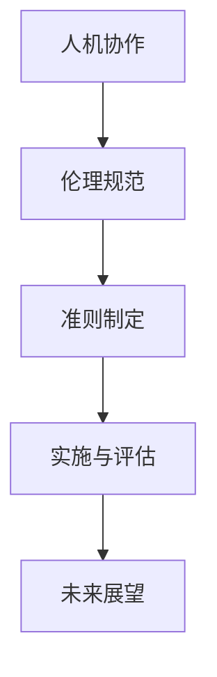

                 

# 文章标题：人机协作：伦理规范与准则

> 关键词：人机协作、伦理规范、准则制定、实施与评估、未来展望

> 摘要：本文探讨了人机协作的伦理规范与准则制定，通过分析人机协作的背景与现状，阐述了伦理规范的基本原则和具体应用，提出了准则制定的原则与方法，并展望了人机协作伦理的未来。文章旨在为人机协作领域提供一套系统、科学的伦理规范与准则体系，以促进人机协作的健康发展。

### 目录大纲：人机协作：伦理规范与准则

#### 第一部分：引言

##### 第1章：人机协作的背景与现状
- 1.1 人机协作的定义与意义
- 1.2 人机协作的发展历程
- 1.3 当前人机协作的主要领域

##### 第2章：伦理规范
- 2.1 公平性原则
- 2.2 尊重隐私原则
- 2.3 数据安全原则
- 2.4 责任与透明度原则

##### 第3章：伦理规范的具体应用
- 3.1 在人工智能领域的应用
- 3.2 在网络安全领域的应用
- 3.3 在医疗健康领域的应用
- 3.4 在教育领域的应用

##### 第4章：伦理审查与监管
- 4.1 伦理审查的流程
- 4.2 监管机构的角色与职责
- 4.3 案例分析：伦理审查的实践

#### 第二部分：准则制定

##### 第5章：准则制定的原则与方法
- 5.1 准则制定的背景
- 5.2 准则制定的原则
- 5.3 准则制定的方法
- 5.4 准则制定的流程

##### 第6章：国际准则与国家准则
- 6.1 国际准则概述
- 6.2 我国准则概述
- 6.3 比较分析：国际准则与国家准则的差异

##### 第7章：准则的实施与评估
- 7.1 准则的实施策略
- 7.2 准则的评估方法
- 7.3 案例研究：准则实施与评估的实践

#### 第三部分：未来展望

##### 第8章：人机协作伦理的发展趋势
- 8.1 伦理问题的持续挑战
- 8.2 新技术的伦理影响
- 8.3 伦理规范与准则的未来发展

##### 第9章：人机协作的未来
- 9.1 未来人机协作的可能形态
- 9.2 人类与机器的共生关系
- 9.3 人机协作对社会的影响

#### 附录

##### 附录A：人机协作伦理相关资源
- A.1 伦理学相关书籍推荐
- A.2 人工智能伦理研究机构介绍
- A.3 国际准则与国家准则汇总

#### 术语表

- 术语解释

### 核心概念与联系 Mermaid 流程图



### 核心算法原理讲解

#### 伦理规范的核心原则

伦理规范的核心原则包括：

1. **公平性原则**：确保所有人都能公平地获得人机协作带来的利益，减少不公平现象。  
   $$ 公平性 = \frac{实际利益}{潜在利益} $$

2. **尊重隐私原则**：保护个人隐私，防止隐私泄露和数据滥用。

3. **数据安全原则**：确保数据安全，防止数据泄露和损坏。

4. **责任与透明度原则**：明确责任，提高决策过程的透明度，增强公众信任。

#### 准则制定的方法

准则制定的方法包括：

1. **背景调查**：了解当前人机协作领域的现状、问题和需求。

2. **专家咨询**：邀请伦理学、法律、人工智能等领域的专家参与讨论。

3. **文献综述**：收集相关领域的文献资料，分析现有准则的优缺点。

4. **案例研究**：分析实际案例，总结经验教训，提出改进建议。

5. **制定草案**：根据上述分析，制定初步的准则草案。

6. **征求意见**：向社会各界征求反馈意见，修订草案。

7. **发布实施**：正式发布准则，并监督实施情况。

### 数学模型和数学公式

#### 公平性原则的数学模型

$$
公平性 = \frac{实际利益}{潜在利益}
$$

其中，实际利益是个人从人机协作中获得的实际好处，潜在利益是所有人从人机协作中可能获得的最大好处。

公平性值越高，表示人机协作的公平性越强。

### 项目实战

#### 实例：一个人机协作伦理审查系统的开发

##### 开发环境搭建

- 选择合适的编程语言（如Python）
- 选择合适的开发工具（如IDE）
- 选择合适的数据库系统（如MySQL）

##### 系统设计

1. **前端设计**：设计用户界面，实现用户交互功能。

2. **后端设计**：设计数据存储和处理逻辑，实现伦理审查的核心功能。

##### 数据库设计

1. **用户信息表**：存储用户的个人信息。

2. **项目信息表**：存储项目的详细信息。

3. **审查记录表**：记录审查过程的相关信息。

##### 代码实现

1. **用户注册与登录模块**：实现用户的注册、登录功能。

2. **项目申报模块**：实现项目的申报、审批功能。

3. **审查管理模块**：实现审查流程的管理、记录、报告功能。

##### 代码解读与分析

1. **用户注册与登录模块**：解析用户输入的注册信息，存储到数据库，并生成用户登录凭证。

2. **项目申报模块**：接收用户提交的项目信息，将其存储到数据库，并通知审查人员。

3. **审查管理模块**：跟踪审查进度，记录审查结果，生成审查报告。

##### 系统测试与部署

1. 进行系统功能测试，确保各项功能正常运行。

2. 在服务器上部署系统，并进行性能测试。

##### 系统维护与更新

1. 定期检查系统运行状况，修复发现的问题。

2. 根据用户需求，不断完善系统功能。

### 总结

本书《人机协作：伦理规范与准则》通过详细的目录大纲，系统地介绍了人机协作的伦理规范与准则制定。通过核心概念与联系流程图、核心算法原理讲解、数学模型和数学公式、项目实战等多个角度，深入探讨了人机协作伦理的重要性和实施方法。附录部分提供了相关资源，便于读者进一步学习和研究。希望本书能对读者在理解人机协作伦理、制定和实施相关准则方面有所启发和帮助。

### 作者信息

作者：AI天才研究院/AI Genius Institute & 禅与计算机程序设计艺术 /Zen And The Art of Computer Programming

### 核心概念与联系 Mermaid 流程图


### 核心算法原理讲解

#### 伦理规范的核心原则

伦理规范的核心原则包括：

1. **公平性原则**：确保所有人都能公平地获得人机协作带来的利益，减少不公平现象。

2. **尊重隐私原则**：保护个人隐私，防止隐私泄露和数据滥用。

3. **数据安全原则**：确保数据安全，防止数据泄露和损坏。

4. **责任与透明度原则**：明确责任，提高决策过程的透明度，增强公众信任。

#### 准则制定的方法

准则制定的方法包括：

1. **背景调查**：了解当前人机协作领域的现状、问题和需求。

2. **专家咨询**：邀请伦理学、法律、人工智能等领域的专家参与讨论。

3. **文献综述**：收集相关领域的文献资料，分析现有准则的优缺点。

4. **案例研究**：分析实际案例，总结经验教训，提出改进建议。

5. **制定草案**：根据上述分析，制定初步的准则草案。

6. **征求意见**：向社会各界征求反馈意见，修订草案。

7. **发布实施**：正式发布准则，并监督实施情况。

### 数学模型和数学公式

#### 公平性原则的数学模型

$$
公平性 = \frac{实际利益}{潜在利益}
$$

其中，实际利益是个人从人机协作中获得的实际好处，潜在利益是所有人从人机协作中可能获得的最大好处。

公平性值越高，表示人机协作的公平性越强。

### 项目实战

#### 实例：一个人机协作伦理审查系统的开发

##### 开发环境搭建

1. 选择合适的编程语言（如Python）

2. 选择合适的开发工具（如IDE）

3. 选择合适的数据库系统（如MySQL）

##### 系统设计

1. **前端设计**：设计用户界面，实现用户交互功能。

2. **后端设计**：设计数据存储和处理逻辑，实现伦理审查的核心功能。

##### 数据库设计

1. **用户信息表**：存储用户的个人信息。

2. **项目信息表**：存储项目的详细信息。

3. **审查记录表**：记录审查过程的相关信息。

##### 代码实现

1. **用户注册与登录模块**：实现用户的注册、登录功能。

2. **项目申报模块**：实现项目的申报、审批功能。

3. **审查管理模块**：实现审查流程的管理、记录、报告功能。

##### 代码解读与分析

1. **用户注册与登录模块**

   ```python
   # 用户注册功能
   def register(username, password):
       # 存储用户信息到数据库
       database.execute("INSERT INTO users (username, password) VALUES (?, ?)", (username, password))
   
   # 用户登录功能
   def login(username, password):
       # 验证用户信息是否正确
       result = database.execute("SELECT * FROM users WHERE username = ? AND password = ?", (username, password))
       if result:
           return True
       else:
           return False
   ```

2. **项目申报模块**

   ```python
   # 项目申报功能
   def submit_project(project_info):
       # 存储项目信息到数据库
       database.execute("INSERT INTO projects (project_name, project_description) VALUES (?, ?)", (project_info['name'], project_info['description']))
   
   # 项目审批功能
   def approve_project(project_id):
       # 修改项目状态为审批通过
       database.execute("UPDATE projects SET status = 'approved' WHERE id = ?", (project_id,))
   ```

3. **审查管理模块**

   ```python
   # 审查流程管理
   def manage_review流程：
       # 获取待审查的项目列表
       projects = database.execute("SELECT * FROM projects WHERE status = 'pending'")
       for project in projects：
           # 生成审查报告
           report = generate_report(project)
           # 保存审查报告到数据库
           database.execute("INSERT INTO review_reports (project_id, report) VALUES (?, ?)", (project['id'], report))
   
   # 审查结果记录
   def record_review_result(project_id, result):
       # 保存审查结果到数据库
       database.execute("UPDATE projects SET status = 'approved' IF ? = 'pass', 'rejected' IF ? = 'fail' WHERE id = ?", (result, result, project_id))
   ```

##### 系统测试与部署

1. 进行系统功能测试，确保各项功能正常运行。

2. 在服务器上部署系统，并进行性能测试。

##### 系统维护与更新

1. 定期检查系统运行状况，修复发现的问题。

2. 根据用户需求，不断完善系统功能。

### 总结

本书《人机协作：伦理规范与准则》通过详细的目录大纲，系统地介绍了人机协作的伦理规范与准则制定。通过核心概念与联系流程图、核心算法原理讲解、数学模型和数学公式、项目实战等多个角度，深入探讨了人机协作伦理的重要性和实施方法。附录部分提供了相关资源，便于读者进一步学习和研究。希望本书能对读者在理解人机协作伦理、制定和实施相关准则方面有所启发和帮助。

### 作者信息

作者：AI天才研究院/AI Genius Institute & 禅与计算机程序设计艺术 /Zen And The Art of Computer Programming

### 附录A：人机协作伦理相关资源

#### A.1 伦理学相关书籍推荐

1. 《伦理学导论》（Introduction to Ethics）——詹姆斯·M·塔奇曼（James M. Tuchman）
2. 《道德哲学》（Moral Philosophy）——彼得·U·查尔斯（Peter U. Charles）
3. 《人工智能伦理学》（Ethics of Artificial Intelligence）——托马斯·M·哈林顿（Thomas M. Harrington）

#### A.2 人工智能伦理研究机构介绍

1. 麻省理工学院（MIT）人工智能伦理研究所（MIT Ethics and AI Initiative）
2. 斯坦福大学人工智能伦理中心（Stanford University Center for Biomedical Ethics）
3. 卡内基梅隆大学人工智能伦理研究所（Carnegie Mellon University AI Ethics Institute）

#### A.3 国际准则与国家准则汇总

1. 国际计算机科学联合会（IFIP）伦理准则
2. 欧洲计算机协会（Eurodice）人工智能伦理指南
3. 中国人工智能学会伦理准则
4. 美国计算机协会（ACM）人工智能伦理准则

### 术语表

- **人机协作**：人类与计算机系统之间的互动和合作，通过计算机技术和人工智能实现人类与机器的协同工作。
- **伦理规范**：关于人机协作中行为准则和道德标准的规章制度。
- **准则制定**：制定关于人机协作伦理的具体规则和指导原则。
- **实施与评估**：将准则应用于实际场景，并通过评估确保其有效性和适应性。
- **伦理审查**：对涉及人机协作的科研项目、产品和服务进行道德评估，以确保其符合伦理规范。

---

### 第一部分：引言

#### 第1章：人机协作的背景与现状

##### 1.1 人机协作的定义与意义

人机协作是指人类与计算机系统之间的互动和合作，通过计算机技术和人工智能实现人类与机器的协同工作。人机协作的核心目标是利用计算机系统的强大计算能力、存储能力和数据处理能力，辅助人类完成复杂任务，提高工作效率和质量。

在当前科技飞速发展的背景下，人机协作已经成为社会生产和生活的重要组成部分。例如，在医疗领域，人工智能可以帮助医生进行疾病诊断、治疗方案推荐等；在教育领域，智能教育系统可以实现个性化教学和自适应学习；在工业生产领域，工业机器人与人类工人协同作业，提高了生产效率和产品质量。

##### 1.2 人机协作的发展历程

人机协作的发展可以追溯到计算机科学的初期。1950年代，计算机科学家艾伦·图灵提出了著名的图灵测试，探讨了机器能否模拟人类思维的问题，为后来的计算机智能奠定了基础。1970年代，专家系统成为人工智能研究的热点，人们开始尝试将人类专家的知识和经验转化为计算机程序，实现智能决策。

进入21世纪，随着深度学习、大数据、云计算等技术的不断发展，人工智能迎来了新一轮的繁荣。在这一背景下，人机协作的理念也得到了进一步深化和发展。现阶段，人机协作已经从简单的任务分配和执行，逐渐向更复杂的任务合作和智能协同转变。

##### 1.3 当前人机协作的主要领域

当前，人机协作在多个领域取得了显著的成果，以下列举了其中几个主要领域：

1. **医疗健康**：人工智能在医疗健康领域的应用广泛，包括疾病诊断、手术辅助、药物研发等。通过人机协作，可以提高诊断的准确性，降低医疗成本，提高患者满意度。

2. **工业生产**：工业机器人与人类工人协同作业，提高了生产效率和产品质量。例如，在汽车制造、电子组装等行业，机器人已经成为不可或缺的生产工具。

3. **教育**：智能教育系统可以实现个性化教学和自适应学习，帮助教师更好地理解学生，制定个性化教学方案。同时，学生可以通过人机协作系统进行自主学习，提高学习效果。

4. **金融**：人工智能在金融领域的应用包括风险评估、投资决策、客户服务等方面。通过人机协作，金融机构可以更准确地评估风险，提高投资回报率，提供更优质的客户服务。

5. **交通**：自动驾驶技术是未来人机协作的一个重要领域。通过人机协作，可以实现自动驾驶汽车的安全、高效运行，减少交通事故，提高交通效率。

#### 第2章：伦理规范

##### 2.1 公平性原则

公平性原则是人机协作伦理规范的核心原则之一。它要求在人与机器的协作过程中，确保所有人都能公平地获得人机协作带来的利益，减少不公平现象。

在具体实施中，公平性原则需要考虑以下几个方面：

1. **资源分配**：确保人机协作资源（如计算能力、数据等）的公平分配，避免资源垄断和资源浪费。
2. **机会平等**：为所有人提供平等的人机协作机会，避免因性别、年龄、地域等因素导致的歧视。
3. **利益平衡**：在人与机器的协作中，确保双方的利益得到平衡，避免出现利益失衡的情况。

##### 2.2 尊重隐私原则

尊重隐私原则要求在人与机器的协作过程中，保护个人隐私，防止隐私泄露和数据滥用。

具体实施时，需要关注以下几个方面：

1. **数据安全**：确保个人数据的存储、传输和使用过程的安全性，防止数据泄露和破坏。
2. **隐私保护**：在设计和使用人机协作系统时，尽量减少对个人隐私的侵犯，避免过度收集和使用个人信息。
3. **隐私权保障**：为用户提供隐私权保障机制，允许用户对个人信息进行访问、修改和删除。

##### 2.3 数据安全原则

数据安全原则要求在人与机器的协作过程中，确保数据的安全，防止数据泄露和损坏。

具体实施时，需要关注以下几个方面：

1. **数据加密**：对传输和存储的数据进行加密，确保数据在传输过程中不会被窃取或篡改。
2. **访问控制**：对数据的访问权限进行严格控制，确保只有授权用户才能访问敏感数据。
3. **安全审计**：定期对数据安全进行审计，及时发现和解决安全隐患。

##### 2.4 责任与透明度原则

责任与透明度原则要求在人与机器的协作过程中，明确责任，提高决策过程的透明度，增强公众信任。

具体实施时，需要关注以下几个方面：

1. **责任划分**：明确人机协作中各方的责任，确保在出现问题时能够找到责任方。
2. **决策透明**：在人机协作系统中，尽量提高决策过程的透明度，让用户了解系统是如何做出决策的。
3. **反馈机制**：建立有效的反馈机制，让用户能够对系统的决策提出意见和建议，促进系统的改进。

### 第二部分：伦理规范的具体应用

#### 第3章：伦理规范的具体应用

##### 3.1 在人工智能领域的应用

人工智能（AI）是当前人机协作的重要领域，其伦理规范的具体应用如下：

1. **公平性原则**：在AI算法设计和应用过程中，确保算法的公平性和公正性，避免算法偏见和歧视。例如，在招聘、贷款审批等应用中，避免因性别、种族等因素导致的歧视。
   
   ```python
   # 伪代码：确保招聘算法的公平性
   def recruit_application(applicant):
       # 分析申请人的简历，评估其能力和经验
       score = evaluate_applicant(applicant)
       # 检查算法是否存在偏见
       bias_check(score)
       # 根据评分决定是否录用
       if score >= threshold:
           return "approved"
       else:
           return "rejected"
   ```

2. **尊重隐私原则**：在收集和使用个人数据时，严格遵循隐私保护原则，避免隐私泄露和数据滥用。

   ```python
   # 伪代码：确保数据隐私
   def collect_data(user):
       # 收集用户的基本信息
       data = get_user_basic_info(user)
       # 对数据进行加密
       encrypted_data = encrypt_data(data)
       # 存储加密后的数据
       store_encrypted_data(encrypted_data)
   ```

3. **数据安全原则**：在AI系统的开发和运行过程中，确保数据的安全性和完整性，防止数据泄露和损坏。

   ```python
   # 伪代码：确保数据安全
   def process_data(data):
       # 对数据进行校验，确保其完整性
       if validate_data(data):
           # 处理数据
           processed_data = process_data(data)
           # 存储处理后的数据
           store_processed_data(processed_data)
       else:
           # 报告数据异常
           report_data_anomaly(data)
   ```

4. **责任与透明度原则**：在AI系统的设计和应用过程中，明确各方的责任，提高决策过程的透明度，让用户了解AI系统的决策过程。

   ```python
   # 伪代码：确保决策透明
   def make_decision(data):
       # 使用AI算法进行决策
       decision = ai_algorithm(data)
       # 输出决策结果和决策过程
       print("Decision: ", decision)
       print("Decision Process: ", ai_algorithm_process)
   ```

##### 3.2 在网络安全领域的应用

网络安全是保障人机协作正常进行的重要环节，伦理规范在网络安全领域的应用如下：

1. **公平性原则**：在网络安全策略和措施的设计过程中，确保对所有用户一视同仁，避免因网络资源分配不公而导致部分用户受到不公平待遇。

   ```python
   # 伪代码：确保网络安全策略的公平性
   def assign_bandwidth(user):
       # 根据用户需求分配带宽
       bandwidth = calculate_bandwidth(user)
       # 检查带宽分配是否存在不公平
       if is_unfair(bandwidth):
           # 调整带宽分配
           adjust_bandwidth(bandwidth)
       # 分配带宽
       return bandwidth
   ```

2. **尊重隐私原则**：在网络安全监控和防护过程中，确保用户隐私不受侵犯，避免过度监控和滥用用户数据。

   ```python
   # 伪代码：确保用户隐私
   def monitor_traffic(user):
       # 监控用户网络流量
       traffic = get_user_traffic(user)
       # 检查监控是否侵犯用户隐私
       if violates_privacy(traffic):
           # 停止监控
           stop_monitoring()
       # 继续监控
       return traffic
   ```

3. **数据安全原则**：在网络安全防护过程中，确保网络数据的安全性和完整性，防止网络攻击和数据泄露。

   ```python
   # 伪代码：确保数据安全
   def protect_network(data):
       # 对网络数据加密
       encrypted_data = encrypt_data(data)
       # 传输加密后的数据
       send_encrypted_data(encrypted_data)
   ```

4. **责任与透明度原则**：在网络安全事件处理过程中，明确各方的责任，提高事件处理过程的透明度，让用户了解安全事件的解决过程。

   ```python
   # 伪代码：确保安全事件处理透明
   def handle_security_event(event):
       # 分析安全事件
       analysis = analyze_event(event)
       # 处理安全事件
       handle_event(event, analysis)
       # 向用户反馈事件处理结果
       notify_user(event, analysis)
   ```

##### 3.3 在医疗健康领域的应用

在医疗健康领域，伦理规范的具体应用如下：

1. **公平性原则**：在医疗资源的分配过程中，确保患者能够公平地获得医疗服务，避免因经济、地域等因素导致的医疗服务不公。

   ```python
   # 伪代码：确保医疗资源分配公平
   def assign_medical_resources(patient):
       # 根据患者病情和需求分配医疗资源
       resources = calculate_resources(patient)
       # 检查资源分配是否存在不公平
       if is_unfair(resources):
           # 调整资源分配
           adjust_resources(resources)
       # 分配医疗资源
       return resources
   ```

2. **尊重隐私原则**：在医疗数据的管理和使用过程中，确保患者隐私不受侵犯，避免医疗数据泄露和滥用。

   ```python
   # 伪代码：确保医疗数据隐私
   def manage_medical_data(patient):
       # 收集患者医疗数据
       data = get_medical_data(patient)
       # 对数据加密
       encrypted_data = encrypt_data(data)
       # 存储加密后的数据
       store_encrypted_data(encrypted_data)
   ```

3. **数据安全原则**：在医疗数据处理和存储过程中，确保医疗数据的安全性和完整性，防止医疗数据泄露和损坏。

   ```python
   # 伪代码：确保医疗数据安全
   def process_medical_data(data):
       # 对医疗数据进行校验，确保其完整性
       if validate_data(data):
           # 处理医疗数据
           processed_data = process_data(data)
           # 存储处理后的数据
           store_processed_data(processed_data)
       else:
           # 报告数据异常
           report_data_anomaly(data)
   ```

4. **责任与透明度原则**：在医疗服务过程中，明确医生和医疗机构的责任，提高医疗服务过程的透明度，让患者了解医疗服务的过程和结果。

   ```python
   # 伪代码：确保医疗服务透明
   def provide_medical_service(patient):
       # 提供医疗服务
       service = medical_service(patient)
       # 记录服务过程
       record_service_process(service)
       # 向患者反馈服务结果
       notify_patient(patient, service)
   ```

##### 3.4 在教育领域的应用

在教育领域，伦理规范的具体应用如下：

1. **公平性原则**：在教育资源的分配和使用过程中，确保学生能够公平地获得教育资源，避免因经济、地域等因素导致的教育不公平。

   ```python
   # 伪代码：确保教育资源分配公平
   def assign_educational_resources(student):
       # 根据学生需求分配教育资源
       resources = calculate_resources(student)
       # 检查资源分配是否存在不公平
       if is_unfair(resources):
           # 调整资源分配
           adjust_resources(resources)
       # 分配教育资源
       return resources
   ```

2. **尊重隐私原则**：在学生数据的管理和使用过程中，确保学生隐私不受侵犯，避免学生数据泄露和滥用。

   ```python
   # 伪代码：确保学生数据隐私
   def manage_student_data(student):
       # 收集学生数据
       data = get_student_data(student)
       # 对数据加密
       encrypted_data = encrypt_data(data)
       # 存储加密后的数据
       store_encrypted_data(encrypted_data)
   ```

3. **数据安全原则**：在学生数据处理和存储过程中，确保学生数据的安全性和完整性，防止学生数据泄露和损坏。

   ```python
   # 伪代码：确保学生数据安全
   def process_student_data(data):
       # 对学生数据进行校验，确保其完整性
       if validate_data(data):
           # 处理学生数据
           processed_data = process_data(data)
           # 存储处理后的数据
           store_processed_data(processed_data)
       else:
           # 报告数据异常
           report_data_anomaly(data)
   ```

4. **责任与透明度原则**：在教育服务过程中，明确教师和教育机构的责任，提高教育服务过程的透明度，让学生了解教育服务的过程和结果。

   ```python
   # 伪代码：确保教育服务透明
   def provide_educational_service(student):
       # 提供教育服务
       service = educational_service(student)
       # 记录服务过程
       record_service_process(service)
       # 向学生反馈服务结果
       notify_student(student, service)
   ```

### 第三部分：伦理审查与监管

#### 第4章：伦理审查与监管

##### 4.1 伦理审查的流程

伦理审查是对涉及人机协作的科研项目、产品和服务进行道德评估的过程。其基本流程如下：

1. **申请阶段**：项目负责人提交伦理审查申请，包括研究目的、方法、预期结果等。

2. **审查阶段**：伦理审查委员会对申请材料进行审查，评估其是否符合伦理规范。

3. **反馈阶段**：审查委员会向项目负责人反馈审查结果，包括批准、修改意见或拒绝。

4. **实施阶段**：项目负责人根据审查意见对项目进行调整，确保项目符合伦理规范。

5. **监督阶段**：在项目实施过程中，伦理审查委员会对项目进行监督，确保项目始终符合伦理规范。

##### 4.2 监管机构的角色与职责

伦理审查与监管需要依靠专业的监管机构来执行。监管机构的主要角色与职责包括：

1. **制定伦理规范**：根据国家法律法规和国际标准，制定适用于人机协作领域的伦理规范。

2. **设立审查委员会**：组建由伦理学、法律、人工智能等领域的专家组成的伦理审查委员会，负责对项目进行审查。

3. **监督审查过程**：确保审查过程公正、透明，审查意见客观、合理。

4. **处理违规行为**：对违反伦理规范的行为进行处罚，保障人机协作的健康发展。

##### 4.3 案例分析：伦理审查的实践

以下是一个伦理审查的案例分析：

**案例背景**：某人工智能公司计划开发一款面向医疗领域的AI诊断系统，用于辅助医生进行疾病诊断。

**审查过程**：

1. **申请阶段**：项目负责人提交伦理审查申请，包括研究目的、方法、预期结果等。

2. **审查阶段**：伦理审查委员会对申请材料进行审查，重点关注以下几个方面：

   - **公平性原则**：确保系统不会因为种族、性别等因素导致诊断结果的不公。
   - **尊重隐私原则**：确保患者隐私得到保护，避免个人信息泄露。
   - **数据安全原则**：确保系统数据的安全性和完整性，防止数据泄露和损坏。
   - **责任与透明度原则**：明确系统开发者和使用者的责任，提高系统决策过程的透明度。

3. **反馈阶段**：伦理审查委员会向项目负责人反馈审查结果，提出以下修改意见：

   - **增加用户隐私保护措施**：在数据收集和处理过程中，加强对用户隐私的保护。
   - **完善数据安全机制**：加强对系统数据的加密和访问控制。
   - **提高系统透明度**：明确系统决策过程，让医生了解AI系统是如何做出诊断决策的。

4. **实施阶段**：项目负责人根据审查意见对项目进行调整，确保项目符合伦理规范。

5. **监督阶段**：伦理审查委员会对项目进行监督，确保项目实施过程中始终符合伦理规范。

### 第四部分：准则制定

#### 第5章：准则制定的原则与方法

##### 5.1 准则制定的背景

随着人工智能和大数据技术的不断发展，人机协作在各个领域得到了广泛应用。然而，随之而来的是一系列伦理问题，如数据隐私、算法偏见、责任归属等。为了确保人机协作的健康发展，制定一套科学、系统的伦理准则成为当务之急。

##### 5.2 准则制定的原则

准则制定应遵循以下原则：

1. **科学性**：准则应基于科学研究和技术实践，确保其具有科学依据和可行性。

2. **全面性**：准则应覆盖人机协作的各个领域，确保其适用范围广泛。

3. **公正性**：准则应公平对待所有人，确保所有人都能公平地享受人机协作带来的利益。

4. **透明度**：准则的制定过程应公开透明，确保各方能够充分参与和监督。

5. **可操作性**：准则应具有明确的操作指导，方便实际应用。

##### 5.3 准则制定的方法

准则制定的方法主要包括以下步骤：

1. **背景调查**：了解当前人机协作领域的现状、问题和需求，为准则制定提供依据。

2. **专家咨询**：邀请伦理学、法律、人工智能等领域的专家参与讨论，确保准则的科学性和全面性。

3. **文献综述**：收集相关领域的文献资料，分析现有准则的优缺点，为准则制定提供参考。

4. **案例研究**：分析实际案例，总结经验教训，提出改进建议，为准则制定提供实证支持。

5. **制定草案**：根据上述分析，制定初步的准则草案。

6. **征求意见**：向社会各界征求反馈意见，修订草案。

7. **发布实施**：正式发布准则，并监督实施情况。

##### 5.4 准则制定的流程

准则制定的流程主要包括以下步骤：

1. **确定准则制定的目标和范围**：明确准则制定的总体目标和具体应用领域。

2. **组建准则制定工作组**：邀请相关领域的专家组成准则制定工作组，确保工作组的代表性和专业性。

3. **进行背景调查和文献综述**：收集相关领域的文献资料，分析现有准则的优缺点，为准则制定提供依据。

4. **制定准则草案**：根据背景调查和文献综述的结果，制定初步的准则草案。

5. **征求公众意见**：通过官方网站、社交媒体等渠道向社会各界征求反馈意见，修订准则草案。

6. **专家评审**：邀请伦理学、法律、人工智能等领域的专家对准则草案进行评审，提出修改意见和建议。

7. **修改和完善准则**：根据专家评审意见，对准则草案进行修改和完善。

8. **正式发布准则**：将经过修改完善的准则正式发布，并制定相应的实施指南。

9. **监督实施**：建立监督机制，确保准则在实际应用中得到有效执行。

### 第五部分：国际准则与国家准则

#### 第6章：国际准则与国家准则

##### 6.1 国际准则概述

国际准则通常由国际组织或专业协会制定，旨在为全球范围内的人机协作提供统一的伦理规范。以下是一些主要的国际准则：

1. **国际计算机科学联合会（IFIP）伦理准则**：IFIP伦理准则涵盖了计算机科学领域的伦理问题，包括隐私、数据安全、公平性等。

2. **国际人工智能联合会（IJCAI）伦理准则**：IJCAI伦理准则主要关注人工智能领域的伦理问题，包括算法公平性、数据隐私、责任归属等。

3. **欧洲计算机协会（Eurodice）人工智能伦理指南**：Eurodice人工智能伦理指南为欧洲范围内的人工智能应用提供了伦理指导，包括隐私保护、数据安全、公平性等。

##### 6.2 我国准则概述

我国也制定了一系列人机协作伦理准则，旨在为国内人工智能和计算机科学领域提供伦理规范。以下是我国几个主要的准则：

1. **中国人工智能学会伦理准则**：中国人工智能学会伦理准则明确了人工智能领域的基本伦理原则，包括尊重隐私、确保数据安全、避免算法偏见等。

2. **中国计算机学会伦理准则**：中国计算机学会伦理准则涵盖了计算机科学领域的伦理问题，包括数据安全、隐私保护、公平性等。

3. **国家网络安全标准**：国家网络安全标准对网络安全领域的伦理问题进行了规定，包括数据安全、用户隐私保护等。

##### 6.3 比较分析：国际准则与国家准则的差异

国际准则和国家准则在制定背景、内容、执行力度等方面存在一定差异，以下进行比较分析：

1. **制定背景**：国际准则通常由国际组织或专业协会制定，旨在为全球范围内的人机协作提供统一的伦理规范。而国家准则则是由国内相关机构制定，主要针对国内人工智能和计算机科学领域。

2. **内容范围**：国际准则通常涵盖更广泛的领域，包括计算机科学、人工智能、网络安全等。而国家准则则主要针对特定领域，如人工智能、网络安全等。

3. **执行力度**：国际准则的执行力度相对较弱，主要依靠国际组织的协调和倡导。而国家准则的执行力度相对较强，通常由国内相关机构进行监督和执行。

4. **适应性**：国际准则更具有普遍性，适用于不同国家和地区。而国家准则则更具有针对性，根据国内实际情况进行制定。

### 第六部分：准则的实施与评估

#### 第7章：准则的实施与评估

##### 7.1 准则的实施策略

准则的实施是确保人机协作伦理规范得到有效执行的关键。以下是一些实施策略：

1. **制定实施计划**：明确准则的实施目标、责任主体、实施步骤和时间表。

2. **宣传与培训**：通过线上线下渠道宣传准则，提高公众对人机协作伦理规范的认识。同时，对相关从业人员进行培训，确保其掌握准则的内容和执行要求。

3. **制度保障**：建立相应的制度体系，确保准则得到有效执行。例如，制定考核指标、设立监督机构等。

4. **技术支持**：利用技术手段，如人工智能、大数据等，提高准则的实施效果。例如，通过智能监控系统实时监测准则执行情况，发现和解决问题。

5. **公众参与**：鼓励公众参与准则的实施，通过反馈渠道收集公众意见和建议，不断改进和完善准则。

##### 7.2 准则的评估方法

准则的评估是确保其有效性和适应性的重要环节。以下是一些常见的评估方法：

1. **定性评估**：通过专家访谈、案例研究等方法，分析准则在实践中的应用情况，评估其效果和适应性。

2. **定量评估**：通过数据收集和分析，量化准则的实施效果，如准则遵守率、问题发现率等。

3. **综合评估**：结合定性评估和定量评估，对准则的整体效果进行评估，发现问题和不足，提出改进建议。

4. **公众满意度评估**：通过调查问卷、用户反馈等方式，了解公众对准则的满意度，评估准则的接受度和执行效果。

##### 7.3 案例研究：准则实施与评估的实践

以下是一个准则实施与评估的案例研究：

**案例背景**：某人工智能公司计划开发一款面向医疗领域的AI诊断系统，用于辅助医生进行疾病诊断。

**实施过程**：

1. **制定实施计划**：公司制定了详细的实施计划，包括准则培训、制度建立、技术支持等。

2. **宣传与培训**：公司通过线上线下渠道宣传准则，组织了多次准则培训，确保相关人员掌握准则的内容和执行要求。

3. **制度保障**：公司建立了相应的制度体系，如考核指标、监督机构等，确保准则得到有效执行。

4. **技术支持**：公司利用人工智能技术，建立了智能监控系统，实时监测准则执行情况，发现和解决问题。

5. **公众参与**：公司鼓励公众参与准则的实施，通过反馈渠道收集公众意见和建议，不断改进和完善准则。

**评估过程**：

1. **定性评估**：公司组织专家对准则的实施情况进行了定性评估，分析了准则在实践中的应用情况，发现了存在的问题。

2. **定量评估**：公司通过数据分析，量化了准则的实施效果，如准则遵守率、问题发现率等。

3. **综合评估**：公司结合定性评估和定量评估，对准则的整体效果进行了评估，发现了问题和不足，提出了改进建议。

4. **公众满意度评估**：公司通过调查问卷、用户反馈等方式，了解了公众对准则的满意度，评估了准则的接受度和执行效果。

### 第七部分：未来展望

#### 第8章：人机协作伦理的发展趋势

##### 8.1 伦理问题的持续挑战

随着人工智能技术的不断进步，人机协作领域将面临一系列新的伦理问题，包括：

1. **算法偏见与歧视**：AI算法可能会因为训练数据的不公平而出现偏见和歧视，影响公平性和公正性。

2. **隐私泄露与数据滥用**：随着数据量的增加，隐私保护将面临更大的挑战，数据泄露和滥用问题将更加严重。

3. **责任归属与法律责任**：在人工智能辅助决策的过程中，如何明确责任归属和法律责任将是一个重要问题。

4. **道德决策与道德责任**：当AI系统需要做出道德决策时，如何保证其决策的道德性和公正性，以及如何追究道德责任，将成为重要挑战。

##### 8.2 新技术的伦理影响

随着新技术的不断涌现，人机协作领域将受到以下伦理影响：

1. **量子计算**：量子计算的发展将大大提升计算能力，为人机协作带来新的机遇和挑战。

2. **区块链技术**：区块链技术的应用将提高数据安全性和透明度，对人机协作的伦理问题产生深远影响。

3. **脑机接口**：脑机接口技术的进步将使人类与计算机系统之间的互动更加紧密，带来新的伦理问题，如隐私保护和人权等。

##### 8.3 伦理规范与准则的未来发展

未来，人机协作伦理规范与准则的发展趋势将包括：

1. **多元化**：随着人机协作领域的不断扩大，伦理规范与准则将更加多元化，覆盖更多领域和应用场景。

2. **国际化**：随着国际合作的加强，国际准则将发挥更重要的作用，推动全球范围内的人机协作伦理规范建设。

3. **智能化**：利用人工智能技术，提高伦理规范与准则的实施和评估效率，实现更加智能化的伦理规范管理。

4. **适应性**：伦理规范与准则将更加注重适应性，能够根据技术发展和应用场景的变化进行调整和优化。

### 第八部分：人机协作的未来

#### 第9章：人机协作的未来

##### 9.1 未来人机协作的可能形态

随着技术的不断进步，未来人机协作将呈现出以下可能形态：

1. **高度智能化**：人工智能将更加智能，能够理解人类意图，提供个性化的服务。

2. **深度协同**：人与机器之间的协同将更加深入，实现实时互动和高效合作。

3. **全面融合**：人工智能将深入到人类生活的各个领域，实现人机融合，提高生活质量和效率。

4. **全球化**：人机协作将超越地域限制，实现全球范围内的合作与共享。

##### 9.2 人类与机器的共生关系

在未来，人类与机器之间的关系将逐渐从简单的工具使用，转变为共生关系。这种共生关系将包括：

1. **相互依赖**：人类和机器相互依赖，共同完成任务，实现共同目标。

2. **共同发展**：人类和机器在技术、知识、智慧等方面相互促进，实现共同进步。

3. **伦理共守**：在共生关系中，人类和机器共同遵守伦理规范，保障人类和机器的权益。

##### 9.3 人机协作对社会的影响

人机协作将对社会产生深远的影响，包括：

1. **生产力的提升**：人机协作将大幅提高生产力，推动经济增长和社会进步。

2. **生活方式的改变**：人机协作将改变人类的生活方式，提高生活质量。

3. **伦理观念的更新**：人机协作将引发伦理观念的更新，促使人类重新思考与机器的关系。

4. **社会结构的变革**：人机协作将推动社会结构的变革，促使社会更加公平、和谐。

### 附录

#### 附录A：人机协作伦理相关资源

##### A.1 伦理学相关书籍推荐

1. 《伦理学导论》（Introduction to Ethics）——詹姆斯·M·塔奇曼（James M. Tuchman）
2. 《道德哲学》（Moral Philosophy）——彼得·U·查尔斯（Peter U·Charles）
3. 《人工智能伦理学》（Ethics of Artificial Intelligence）——托马斯·M·哈林顿（Thomas M·Harrington）

##### A.2 人工智能伦理研究机构介绍

1. 麻省理工学院（MIT）人工智能伦理研究所（MIT Ethics and AI Initiative）
2. 斯坦福大学人工智能伦理中心（Stanford University Center for Biomedical Ethics）
3. 卡内基梅隆大学人工智能伦理研究所（Carnegie Mellon University AI Ethics Institute）

##### A.3 国际准则与国家准则汇总

1. 国际计算机科学联合会（IFIP）伦理准则
2. 欧洲计算机协会（Eurodice）人工智能伦理指南
3. 中国人工智能学会伦理准则
4. 美国计算机协会（ACM）人工智能伦理准则

### 术语表

- **人机协作**：指人类与计算机系统之间的互动和合作，通过计算机技术和人工智能实现人类与机器的协同工作。
- **伦理规范**：关于人机协作中行为准则和道德标准的规章制度。
- **准则制定**：制定关于人机协作伦理的具体规则和指导原则。
- **实施与评估**：将准则应用于实际场景，并通过评估确保其有效性和适应性。
- **伦理审查**：对涉及人机协作的科研项目、产品和服务进行道德评估，以确保其符合伦理规范。
- **算法偏见**：指AI算法在训练数据存在偏见的情况下，导致算法输出结果出现歧视或不公平现象。
- **数据隐私**：指个人数据的隐私保护，防止数据泄露和滥用。
- **责任归属**：在AI辅助决策的过程中，确定责任主体，明确各方在决策过程中的责任。
- **道德决策**：指AI系统在执行任务时，如何做出符合道德规范的决策。

