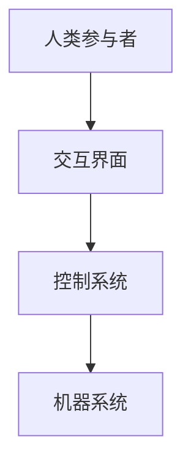
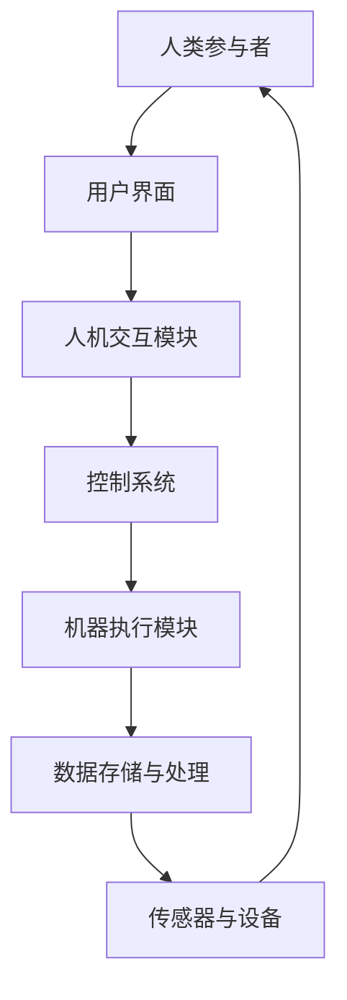

                 

# 文章标题：人机协同：未来工作的核心驱动力

> 关键词：人机协同、智能技术、工作自动化、劳动力市场、未来趋势

> 摘要：本文深入探讨了人机协同的概念、原理、应用及其在未来的发展趋势。通过分析人机协同在制造业、服务业、医疗健康等领域的实际案例，揭示了其提升工作效率、优化劳动力结构、推动社会创新的重要价值。本文旨在为读者提供一个全面、系统的关于人机协同的视角，帮助理解其在未来工作中的核心驱动力。

---

### 《人机协同：未来工作的核心驱动力》目录大纲

## 第一部分：引言与背景

### 第1章：人机协同的概念与重要性
- 1.1 人机协同的定义
- 1.2 人机协同的兴起背景
- 1.3 人机协同的价值与意义
- 1.4 人机协同的应用领域
- 1.5 未来展望

### 第2章：人机协同的基本原理
- 2.1 人机协同的基本框架
- 2.2 人机协同的关键技术
- 2.3 人机协同的基本模式
- 2.4 人机协同系统的设计原则
- 2.5 人机协同系统的案例分析

## 第二部分：人机协同在不同行业中的应用

### 第3章：人机协同在制造业中的应用
- 3.1 制造业中的自动化与智能化
- 3.2 机器人技术在制造业中的应用
- 3.3 制造业人机协同案例分析

### 第4章：人机协同在服务业中的应用
- 4.1 服务业中的自动化服务系统
- 4.2 人机协同在客户服务中的应用
- 4.3 服务业人机协同案例分析

### 第5章：人机协同在医疗健康领域的应用
- 5.1 医疗健康领域的自动化诊断系统
- 5.2 医疗机器人技术在医疗健康中的应用
- 5.3 医疗健康领域人机协同案例分析

## 第三部分：人机协同的实现与优化

### 第6章：人机协同系统的设计与实现
- 6.1 人机协同系统的架构设计
- 6.2 人机协同系统的开发流程
- 6.3 人机协同系统的测试与优化
- 6.4 人机协同系统的案例分析

### 第7章：人机协同系统中的挑战与应对
- 7.1 人机协同系统中的挑战
- 7.2 人机协同系统中的解决方案
- 7.3 人机协同系统的可持续发展

## 第四部分：未来展望

### 第8章：人机协同的未来发展趋势
- 8.1 未来人机协同的技术趋势
- 8.2 未来人机协同的应用场景
- 8.3 人机协同在社会发展中的角色与影响

### 第9章：人机协同与人类工作者的未来
- 9.1 人机协同对劳动力市场的影响
- 9.2 提高人类工作者效率与技能
- 9.3 人类工作者与智能机器人的合作模式

## 附录

### 附录A：人机协同相关技术资源
- A.1 机器学习与人工智能工具介绍
- A.2 人机协同系统开发最佳实践
- A.3 人机协同领域的相关文献与资料

---

接下来，我们将逐步深入探讨人机协同的概念、原理及其在不同领域中的应用，分析其在未来工作中的核心驱动力。让我们一起思考，一起探索人机协同的未来。

## 第1章：人机协同的概念与重要性

### 1.1 人机协同的定义

人机协同（Human-Machine Collaboration）是指人类与机器系统通过智能技术实现协作，共同完成复杂任务的过程。在这个过程中，人类和机器系统相互依赖，各自发挥优势，实现高效、准确的任务执行。

人机协同的核心在于**信息共享**、**任务分配**和**协同操作**。具体来说，人机协同系统通常包括以下几个基本组成部分：

1. **人类参与者**：指执行任务的人类操作员或专家。
2. **机器系统**：包括智能机器、自动化设备、传感器等，能够执行特定的任务或提供特定的功能。
3. **交互界面**：提供人类与机器系统之间进行通信和协作的平台，如图形用户界面、语音交互系统等。
4. **控制逻辑**：负责协调人类操作员和机器系统的交互，确保任务的顺利执行。

### 定义与描述

人机协同的定义可以从以下几个方面进行详细描述：

- **参与角色**：人机协同的参与角色包括人类操作员和机器系统。人类操作员通常具有丰富的经验和专业知识，而机器系统则具备高速计算、精确控制和自主决策的能力。
- **互动机制**：人机协同通过交互界面实现人类与机器系统的信息交换和协作。这些互动机制可以是图形界面、语音指令、手势控制等，使得人类可以方便地与机器系统进行交互。
- **应用场景**：人机协同可以应用于各种领域，如制造业、服务业、医疗健康等。在这些领域中，人类与机器系统的协同工作能够显著提高工作效率、降低成本、提升产品质量。

### 核心概念与联系

为了更好地理解人机协同，我们需要了解其核心概念及其相互联系：

- **智能技术**：人机协同依赖于多种智能技术的支持，包括人工智能、机器学习、物联网等。这些技术为人机协同系统提供了智能感知、智能决策和智能控制的能力。
- **协作模式**：人机协同的基本协作模式可以分为两种：主动协作和被动协作。主动协作是指机器系统主动执行任务，并在必要时向人类操作员寻求帮助；被动协作则是指人类操作员主导任务执行，机器系统提供辅助和支持。
- **任务分配**：人机协同系统需要根据任务的特点和双方的能力进行任务分配。例如，对于复杂的决策任务，人类操作员可能更适合执行，而对于重复性高的操作任务，机器系统则可能更具优势。

### 1.2 人机协同的兴起背景

人机协同的概念并不是突然出现的，而是随着科技进步和工业发展的结果。以下是人机协同兴起的主要背景：

- **工业革命**：第一次工业革命引入了机械化生产，使得人类与机器的协同工作开始萌芽。随着自动化技术的发展，人类与机器的协作逐渐变得更加紧密和高效。
- **计算机科学**：计算机科学的快速发展为人机协同提供了强大的计算和数据处理能力。特别是人工智能和机器学习技术的突破，为人机协同提供了智能化的基础。
- **物联网**：物联网技术的兴起使得各种设备、系统和数据可以相互连接和通信。这为人机协同创造了更多的应用场景和可能性。

### 技术驱动因素

推动人机协同技术发展的关键技术和应用场景变化如下：

- **人工智能**：人工智能技术的快速发展为人机协同提供了智能决策和智能控制的能力。机器学习算法可以训练出具备高度智能化的机器系统，从而更好地与人类操作员协作。
- **物联网**：物联网技术使得各种设备、系统和数据可以无缝连接，为人机协同提供了丰富的信息来源和协作平台。
- **大数据**：大数据技术的应用为人机协同提供了大量的数据支持，使得系统可以更准确地理解和预测人类操作员的需求和偏好。
- **云计算**：云计算技术为人机协同系统提供了弹性的计算资源和存储空间，使得系统可以更加高效地处理和存储海量数据。

### 1.3 人机协同的价值与意义

人机协同在现代社会中具有重要的价值和意义，主要体现在以下几个方面：

- **提升工作效率**：人机协同通过智能技术实现了人类与机器的高效协作，能够显著提高工作效率和生产力。例如，在制造业中，机器人与人类操作员的协同工作可以大大缩短生产周期，提高生产效率。
- **优化劳动力结构**：人机协同可以替代人类执行重复性高、危险或繁琐的任务，从而优化劳动力结构，降低劳动力成本。同时，人类操作员可以将更多精力投入到创造性和高价值的工作中。
- **推动社会创新**：人机协同促进了社会各个领域的创新和发展。在医疗健康领域，智能诊断和医疗机器人可以提供更准确、更高效的医疗服务；在服务业中，自动化服务系统和智能客服可以提升客户体验和服务质量。
- **促进可持续发展**：人机协同系统通过自动化和智能化技术，可以实现资源的优化利用和环境的友好保护，从而促进社会的可持续发展。

### 1.4 人机协同的应用领域

人机协同技术已经广泛应用于多个行业和领域，以下是一些典型应用领域：

- **制造业**：在制造业中，人机协同技术主要用于自动化生产线、智能机器人、智能制造系统等。通过人机协同，可以实现高效、精准的生产过程，降低生产成本，提高产品质量。
- **服务业**：在服务业中，人机协同技术主要用于自动化服务系统、智能客服、智能导购等。通过人机协同，可以提升服务质量，提高客户满意度，降低运营成本。
- **医疗健康**：在医疗健康领域，人机协同技术主要用于智能诊断、医疗机器人、远程医疗服务等。通过人机协同，可以提升医疗服务的效率和准确性，改善患者体验，降低医疗成本。

### 1.5 未来展望

人机协同技术在未来具有广阔的发展前景，以下是一些未来展望：

- **人机融合**：随着人工智能和物联网技术的进步，人机协同将进一步走向人机融合。人类操作员与机器系统的界限将逐渐模糊，人类将更多地借助智能技术来扩展自身的认知和能力。
- **新型应用场景**：人机协同技术将在更多领域得到应用，如智能家居、智慧城市、无人驾驶等。这些新型应用场景将为人机协同技术带来新的挑战和机遇。
- **社会影响**：人机协同技术将对社会产生深远影响，如劳动力市场变化、教育模式创新、医疗健康改革等。人机协同将成为推动社会进步的重要力量。

通过以上内容，我们初步了解了人机协同的概念、背景、价值和应用领域，以及其对未来工作和社会发展的潜在影响。接下来，我们将进一步探讨人机协同的基本原理和应用技术，以便更深入地理解这一领域。请继续关注下一章节的内容。

## 第2章：人机协同的基本原理

人机协同作为现代科技发展的重要方向，其实现和应用离不开一系列基本原理和技术支撑。本章将详细讨论人机协同的基本框架、关键技术、基本模式、设计原则以及具体案例分析。

### 2.1 人机协同的基本框架

人机协同系统的基本框架通常包括以下几个关键组成部分：

- **人类参与者**：包括操作员、设计师、专家等，他们是系统的核心决策者和使用者。
- **机器系统**：包括机器人、自动化设备、计算机系统等，它们执行具体的任务和操作。
- **交互界面**：提供人类与机器系统之间的通信和交互渠道，如触摸屏、语音识别、手势控制等。
- **控制系统**：负责协调人类与机器系统之间的操作，包括任务分配、状态监测、异常处理等。

以下是一个简化的人机协同系统框架图：

在这个框架中，交互界面是连接人类与机器系统的桥梁，控制系统则是整个系统的核心，负责协调和优化人类与机器系统的协作。

### 2.2 人机协同的关键技术

人机协同的实现依赖于一系列先进的技术，以下是一些关键技术：

- **智能感知技术**：通过传感器、摄像头、麦克风等设备收集环境信息和状态数据，为机器系统和人类参与者提供实时信息。
- **人机交互技术**：利用自然语言处理、虚拟现实、增强现实等技术，实现人类与机器系统之间的自然、高效、直观的交互。
- **决策与控制技术**：运用人工智能、机器学习、模糊逻辑等技术，为机器系统提供智能决策和自主控制能力。
- **通信与网络技术**：通过有线和无线通信技术，实现机器系统之间以及机器系统与外部设备之间的数据传输和通信。

### 2.3 人机协同的基本模式

人机协同的基本模式可以分为以下几种：

- **主动协作模式**：在这种模式下，机器系统主动执行任务，并在必要时向人类参与者寻求帮助或反馈。机器系统通常具备自主决策和执行任务的能力，能够实时响应环境变化和人类参与者的需求。
- **被动协作模式**：在这种模式下，人类参与者主导任务执行，机器系统提供辅助和支持。机器系统通常作为工具或辅助设备，帮助人类参与者完成复杂的任务。
- **混合协作模式**：在这种模式下，人类参与者和机器系统共同决策和执行任务。人类参与者在关键决策环节发挥主导作用，而机器系统则在执行环节提供高效、精准的支持。

### 2.4 人机协同系统的设计原则

在设计人机协同系统时，应遵循以下原则：

- **安全性**：确保系统在运行过程中不会对人类参与者或机器系统造成伤害，包括物理安全和数据安全。
- **可靠性**：确保系统稳定运行，能够在各种环境下正常工作，且具有高度的容错能力。
- **易用性**：设计直观、易操作的交互界面，使人类参与者能够轻松地与机器系统进行交互。
- **灵活性**：系统应具有高度的灵活性，能够适应不同的应用场景和需求变化。

### 2.5 人机协同系统的案例分析

为了更好地理解人机协同系统的实现和应用，以下提供两个具体案例：

#### 案例一：智能工厂

**背景**：智能工厂是一个高度自动化和智能化的生产环境，通过人机协同实现高效、灵活的生产过程。

**系统设计**：

1. **感知层**：采用传感器和摄像头收集生产线上的实时数据，包括生产状态、设备状态等。
2. **控制层**：利用工业机器人执行具体的生产任务，如装配、搬运、检测等。
3. **决策层**：通过智能算法和数据分析，实现生产计划的优化和异常处理。
4. **交互层**：通过触摸屏和语音交互系统，提供实时监控和生产操作界面。

**实现效果**：智能工厂实现了生产过程的自动化和智能化，大大提高了生产效率，降低了人力成本和错误率。

#### 案例二：智能客服系统

**背景**：智能客服系统是利用人工智能技术提供高效、准确的客户服务。

**系统设计**：

1. **感知层**：通过自然语言处理技术，理解和解析客户的语音或文本输入。
2. **控制层**：利用机器学习算法，生成相应的回答或处理建议。
3. **决策层**：结合知识库和业务逻辑，实现复杂问题的智能解答和转接。
4. **交互层**：通过语音合成和文本展示，将回答或处理建议呈现给客户。

**实现效果**：智能客服系统能够快速、准确地解答客户问题，提升客户满意度，同时降低了人工客服的工作量。

通过以上案例分析，我们可以看到人机协同系统在实际应用中的多样性和复杂性。在设计人机协同系统时，需要综合考虑技术、安全和用户体验等多方面因素，以确保系统的有效运行和广泛应用。

接下来，我们将进一步探讨人机协同在制造业、服务业、医疗健康等领域的具体应用，分析其在不同行业中的作用和价值。请继续关注下一章节的内容。

## 第3章：人机协同在制造业中的应用

制造业作为全球经济的重要支柱，正经历着一场深刻的变革。人机协同技术在制造业中的应用，不仅提升了生产效率，还推动了制造业向智能化和自动化方向发展。本章将详细探讨人机协同在制造业中的应用、自动化与智能化技术，以及具体案例分析。

### 3.1 制造业中的自动化与智能化

自动化与智能化是制造业发展的两大趋势，也是人机协同技术的重要应用场景。自动化技术主要解决生产过程的重复性、单调性和危险性问题，而智能化技术则通过大数据、人工智能等手段提升生产决策的准确性和效率。

**自动化技术**：

1. **机器人自动化**：机器人是自动化技术的核心组件，广泛应用于制造、装配、搬运、焊接等领域。机器人可以替代人工完成重复性高、危险或繁琐的工作，提高生产效率和质量。
2. **自动化生产线**：通过将机器人、传感器、自动化控制系统等集成在一起，实现生产线的自动化运行。自动化生产线可以根据生产需求灵活调整，提高生产灵活性和适应性。
3. **自动化检测**：自动化检测技术用于对生产过程和产品质量进行实时监控和检测，及时发现和纠正问题。

**智能化技术**：

1. **工业物联网**：工业物联网（IIoT）通过传感器、网络和数据分析，实现设备、系统和数据之间的互联互通，从而实现对生产过程的智能监控和管理。
2. **大数据分析**：通过大数据技术，对生产过程中产生的海量数据进行分析，提取有价值的信息，用于生产优化、故障预测和决策支持。
3. **人工智能**：人工智能技术在制造业中的应用包括智能规划、智能控制、智能检测等。通过机器学习、深度学习等技术，实现生产过程的智能决策和自主控制。

### 3.2 机器人技术在制造业中的应用

机器人技术在制造业中的应用已经非常广泛，以下是一些具体的应用场景：

**应用场景**：

1. **装配与搬运**：机器人可以完成各种装配和搬运任务，如电子元件的装配、汽车零部件的搬运等。通过精确的运动控制和力控制，机器人能够高效、安全地完成任务。
2. **焊接与切割**：焊接和切割是制造业中的重要环节，机器人可以精确控制焊接参数和切割路径，提高焊接质量和切割效率。
3. **检测与监测**：机器人可以用于对产品进行质量检测和过程监测，如外观检测、尺寸检测等。通过视觉传感器和传感器阵列，机器人能够实时监测生产过程，及时发现问题。

**应用案例**：

**案例一：汽车制造中的机器人应用**

在汽车制造过程中，机器人被广泛应用于车身焊接、零部件装配和涂装等环节。例如，车身焊接机器人可以在短时间内完成复杂的焊接任务，确保焊接质量和生产效率。装配机器人则可以精确安装汽车零部件，减少人为误差。涂装机器人可以实现自动化喷涂，确保涂装均匀性。

**案例二：电子制造中的机器人应用**

在电子制造领域，机器人被广泛应用于装配、焊接、检测等环节。例如，在智能手机的制造过程中，机器人可以自动装配电路板、电池等零部件，确保产品的精度和质量。同时，检测机器人可以对产品进行严格的品质检测，确保每件产品都符合标准。

### 3.3 制造业人机协同案例分析

以下是人机协同在制造业中的两个具体案例，展示了人机协同技术在提高生产效率和优化生产过程方面的应用。

**案例一：智能工厂**

**背景**：某汽车制造企业计划建设一个智能工厂，通过人机协同实现生产过程的自动化和智能化。

**解决方案**：

1. **感知层**：在工厂各个生产环节安装传感器，实时监测设备状态、生产参数等。
2. **控制层**：采用工业机器人完成车身焊接、零部件装配等任务，实现生产过程的自动化。
3. **决策层**：利用人工智能算法和大数据分析，对生产数据进行实时分析和处理，优化生产计划和资源配置。
4. **交互层**：通过触摸屏和语音交互系统，提供实时监控和生产操作界面，方便操作员进行生产监控和操作。

**效果**：智能工厂实现了生产过程的自动化和智能化，大大提高了生产效率和质量。同时，通过数据分析和优化，企业能够更好地控制生产成本，提高市场竞争力。

**案例二：智能化生产线的升级**

**背景**：某家电制造企业希望对其现有的生产线进行智能化升级，以提升生产效率和产品质量。

**解决方案**：

1. **感知层**：在生产线的关键节点安装传感器，实时监测生产状态和设备状态。
2. **控制层**：引入工业机器人，实现生产线的自动化运行，减少人工干预。
3. **决策层**：通过机器学习算法和大数据分析，对生产过程进行实时监控和优化，提高生产效率和产品质量。
4. **交互层**：提供智能监控系统，操作员可以通过触摸屏和语音交互系统实时监控生产过程，进行故障诊断和操作调整。

**效果**：智能化生产线升级后，企业的生产效率得到了显著提升，产品质量也得到了明显改善。同时，通过实时监控和优化，企业能够更好地应对生产过程中的各种问题，提高了生产稳定性和可靠性。

通过以上案例分析，我们可以看到人机协同技术在制造业中的应用不仅提高了生产效率和质量，还推动了制造业的智能化和自动化发展。在未来，人机协同技术将在制造业中发挥越来越重要的作用，为企业的创新和发展提供强有力的支持。

接下来，我们将探讨人机协同在服务业中的应用，分析其在提升服务效率、优化客户体验方面的作用。请继续关注下一章节的内容。

## 第4章：人机协同在服务业中的应用

服务业作为现代社会的重要组成部分，人机协同技术的应用正在改变传统的服务模式，提升服务效率，优化客户体验。本章将详细探讨人机协同在服务业中的应用，包括自动化服务系统、客户服务中的应用，以及具体案例分析。

### 4.1 服务业中的自动化服务系统

自动化服务系统是服务业人机协同的重要组成部分，通过自动化技术实现服务的智能化和高效化。以下是一些常见的自动化服务系统：

**自助服务终端**：自助服务终端（如自助结账机、自助取票机等）广泛应用于零售、交通、娱乐等行业。通过自助服务终端，客户可以独立完成交易、查询、取票等操作，减少了人工服务的需求，提高了服务效率。

**自动化物流系统**：在物流和快递行业，自动化物流系统（如自动分拣机、无人仓库等）被广泛应用。这些系统能够自动处理包裹分拣、存储和配送等任务，提高了物流效率，降低了运营成本。

**智能客服系统**：智能客服系统利用人工智能技术，通过自然语言处理、语音识别等技术，实现与客户的智能对话和问题解决。智能客服系统能够24小时在线服务，提供快速、准确的答案，提升了客户满意度。

### 4.2 人机协同在客户服务中的应用

在客户服务中，人机协同技术通过优化服务流程、提高服务效率，实现了客户体验的提升。以下是人机协同在客户服务中的应用：

**智能客服机器人**：智能客服机器人是服务业中广泛应用的人机协同工具。通过自然语言处理和机器学习技术，智能客服机器人可以模拟人类的对话方式，与客户进行互动。智能客服机器人能够处理大量的客户咨询，提供快速、准确的答案，减轻了人工客服的工作负担。

**智能推荐系统**：智能推荐系统利用大数据和人工智能技术，根据客户的历史行为和偏好，提供个性化的产品推荐和服务。例如，在电子商务平台，智能推荐系统可以帮助客户发现他们可能感兴趣的商品，提升了购物体验。

**智能语音交互系统**：智能语音交互系统通过语音识别和语音合成技术，实现与客户的语音互动。客户可以通过语音命令获取信息、完成操作，这种交互方式更加自然和便捷，提升了客户体验。

### 4.3 服务业人机协同案例分析

以下是人机协同在服务业中的两个具体案例，展示了人机协同技术在提升服务效率、优化客户体验方面的应用。

**案例一：智能酒店服务**

**背景**：某连锁酒店引入智能服务系统，通过人机协同提升客户体验和酒店运营效率。

**解决方案**：

1. **自助入住/退房系统**：客户可以通过自助入住/退房系统，自助完成入住和退房流程，无需排队等待。
2. **智能客房服务系统**：客户可以通过智能设备（如手机、平板电脑）远程控制客房设备，如空调、照明、电视等。
3. **智能客服机器人**：客户可以通过智能客服机器人咨询酒店服务、解答疑问，获得快速响应。

**效果**：智能酒店服务系统提高了客户入住和退房的效率，提升了客户体验。同时，酒店运营成本得到了降低，服务效率得到了提高。

**案例二：智能餐厅服务**

**背景**：某连锁餐厅引入智能点餐系统和智能送餐机器人，通过人机协同提升餐厅服务效率。

**解决方案**：

1. **智能点餐系统**：客户可以通过手机或平板电脑进行在线点餐，减少了排队等待时间，提升了点餐效率。
2. **智能送餐机器人**：餐厅引入智能送餐机器人，自动将订单送至客户座位，减少了人工送餐的误差和效率。
3. **智能客服机器人**：客户可以通过智能客服机器人获取餐厅信息、解答疑问，获得及时的帮助。

**效果**：智能餐厅服务系统提升了点餐和送餐效率，减少了人力成本。同时，客户体验得到了显著提升，餐厅的整体运营效率得到了提高。

通过以上案例分析，我们可以看到人机协同在服务业中的应用，不仅提升了服务效率，还优化了客户体验。随着技术的不断进步，人机协同将在服务业中发挥更大的作用，推动服务业的智能化和高效化发展。

接下来，我们将探讨人机协同在医疗健康领域的应用，分析其在提高医疗效率、改善患者体验方面的作用。请继续关注下一章节的内容。

## 第5章：人机协同在医疗健康领域的应用

医疗健康领域是现代科技的重要应用场景之一，人机协同技术的引入，为医疗服务带来了新的发展机遇。本章将详细探讨人机协同在医疗健康领域的应用，包括自动化诊断系统、医疗机器人技术，以及具体案例分析。

### 5.1 医疗健康领域的自动化诊断系统

自动化诊断系统是医疗健康领域中的一项重要技术，它利用人工智能和大数据分析，实现疾病诊断的自动化和精准化。以下是一些自动化诊断系统的具体应用：

**医学影像诊断**：医学影像诊断是自动化诊断系统的重要应用领域。通过深度学习和计算机视觉技术，自动化诊断系统可以自动识别和分析医学影像（如X光片、CT扫描、MRI等），提供准确的诊断结果。这种技术可以显著提高诊断速度和准确性，减少医生的工作量。

**基因诊断**：基因诊断是通过分析患者的基因序列，预测疾病风险和制定个性化治疗方案。自动化诊断系统可以利用机器学习和大数据分析技术，快速识别基因突变和异常，为医生提供准确的诊断依据。

**电子病历系统**：电子病历系统（EMR）是一种将患者病历数据电子化的系统。通过人工智能技术，自动化诊断系统可以对电子病历数据进行智能分析，发现潜在的健康风险，提供预防性建议。

### 5.2 医疗机器人技术在医疗健康中的应用

医疗机器人是医疗健康领域中的一项重要技术，它们在手术辅助、康复治疗、护理支持等方面发挥了重要作用。以下是一些医疗机器人技术的具体应用：

**手术机器人**：手术机器人是一种高精度的手术辅助设备，可以在微创手术中发挥重要作用。通过精确的运动控制和视觉系统，手术机器人可以实现微小的手术操作，减少手术创伤和并发症，提高手术成功率。

**康复机器人**：康复机器人用于帮助患者进行康复训练，如肢体功能康复、语言康复等。通过智能控制和反馈系统，康复机器人可以根据患者的具体情况进行个性化训练，提高康复效果。

**护理机器人**：护理机器人主要用于辅助护理工作，如患者监护、药品配送、清洁等。通过智能感知和自主导航技术，护理机器人可以在医院内自主行动，为患者提供高质量的护理服务。

### 5.3 医疗健康领域人机协同案例分析

以下是人机协同在医疗健康领域的两个具体案例，展示了人机协同技术在提高医疗效率、改善患者体验方面的应用。

**案例一：智能医院**

**背景**：某智能医院引入了多种人机协同技术，实现了医疗服务的智能化和高效化。

**解决方案**：

1. **智能诊断系统**：医院引入智能诊断系统，通过人工智能技术对医学影像和电子病历进行自动分析，提供准确的诊断建议。医生可以根据智能诊断系统的建议进行诊断，提高诊断速度和准确性。
2. **手术机器人**：医院配备了先进的手术机器人，用于微创手术。手术机器人可以实现高精度的操作，减少手术创伤和并发症，提高手术成功率。
3. **康复机器人**：医院引进康复机器人，用于患者的康复训练。康复机器人可以根据患者的具体情况，制定个性化的康复计划，提高康复效果。
4. **智能护理系统**：医院部署智能护理系统，通过护理机器人辅助护士完成日常护理工作，如患者监护、药品配送等。智能护理系统可以实时监测患者状况，及时提供护理建议。

**效果**：智能医院实现了医疗服务的智能化和高效化，提高了诊断和手术的准确性，减少了手术和护理的工作量。同时，患者的体验得到了显著提升，医院的整体运营效率得到了提高。

**案例二：远程医疗服务**

**背景**：某地区由于地理位置偏远，医疗资源相对匮乏。为了解决当地居民看病难的问题，当地政府引入了远程医疗服务，通过人机协同技术提供高质量的医疗服务。

**解决方案**：

1. **远程会诊系统**：通过远程会诊系统，当地医生可以与上级医院的专家进行实时视频会诊，获取诊断意见和治疗方案。远程会诊系统提高了医生的诊断水平，减少了患者外出就医的需求。
2. **智能诊断系统**：当地医院引入智能诊断系统，对患者的医学影像和电子病历进行自动分析，提供准确的诊断结果。智能诊断系统可以帮助医生快速做出诊断，提高了诊断速度和准确性。
3. **移动护理机器人**：医院部署移动护理机器人，为患者提供全天候的监护和护理服务。移动护理机器人可以实时监测患者生命体征，及时发现问题并通知医生。

**效果**：远程医疗服务通过人机协同技术，提高了当地医疗服务的质量和效率，解决了当地居民看病难的问题。同时，远程医疗服务也缓解了上级医院的工作压力，实现了医疗资源的合理分配。

通过以上案例分析，我们可以看到人机协同技术在医疗健康领域的广泛应用，不仅提高了医疗服务的效率和质量，还改善了患者的体验。随着技术的不断进步，人机协同技术将在医疗健康领域发挥更大的作用，推动医疗服务的智能化和高效化发展。

接下来，我们将探讨人机协同系统的设计与实现，分析其架构设计、开发流程以及优化方法。请继续关注下一章节的内容。

## 第6章：人机协同系统的设计与实现

人机协同系统的设计与实现是确保其高效、稳定运行的关键步骤。本章将详细讨论人机协同系统的架构设计、开发流程、测试与优化，以及具体案例分析。

### 6.1 人机协同系统的架构设计

人机协同系统的架构设计需要综合考虑系统的功能需求、性能要求、可靠性以及用户体验。以下是人机协同系统的一种典型架构设计：

**架构设计图：**

**组件解析：**

- **用户界面（User Interface, UI）**：提供人类参与者与系统交互的界面，包括触摸屏、语音控制、手势控制等。
- **人机交互模块（Human-Machine Interaction Module, HIIM）**：负责处理用户输入，将人类参与者的指令转换为系统能够理解的操作指令。
- **控制系统（Control System）**：核心部分，负责协调各个模块的运行，执行任务分配、状态监测、异常处理等。
- **机器执行模块（Machine Execution Module, MEM）**：执行具体任务的机器系统，如机器人、自动化设备等。
- **数据存储与处理（Data Storage & Processing, DSP）**：用于存储系统数据，并提供数据分析和处理功能。
- **传感器与设备（Sensors & Devices, SD）**：用于收集环境信息和状态数据，如温度传感器、摄像头、麦克风等。

### 6.2 人机协同系统的开发流程

人机协同系统的开发流程通常包括以下几个阶段：

**1. 需求分析（Requirement Analysis）：**

- 与利益相关者（如用户、工程师、项目经理等）进行沟通，明确系统的功能需求、性能要求、安全性需求等。
- 收集和分析相关数据，为系统设计提供依据。

**2. 系统设计（System Design）：**

- 根据需求分析结果，设计系统的整体架构，确定各个模块的功能和接口。
- 设计数据存储和处理方案，确保数据的可靠性和安全性。

**3. 开发与实现（Development & Implementation）：**

- 根据系统设计，开发各个模块的功能，实现系统的核心功能。
- 进行系统集成，确保各个模块之间能够无缝协作。

**4. 测试与验证（Testing & Verification）：**

- 进行功能测试，确保系统的各项功能符合设计要求。
- 进行性能测试，确保系统在高负载情况下的稳定性和响应速度。
- 进行安全性测试，确保系统的数据安全和用户隐私保护。

**5. 部署与维护（Deployment & Maintenance）：**

- 将系统部署到实际环境中，进行现场测试和调试。
- 提供系统维护和更新服务，确保系统的长期稳定运行。

### 6.3 人机协同系统的测试与优化

**测试策略：**

- **功能测试（Functional Testing）**：确保系统按照设计要求执行各项功能，包括基本功能、边界条件和异常情况。
- **性能测试（Performance Testing）**：评估系统在高负载、高并发情况下的性能，包括响应时间、吞吐量、资源利用率等。
- **安全性测试（Security Testing）**：检测系统的安全漏洞，确保系统的数据安全和用户隐私保护。

**优化方法：**

- **算法优化（Algorithm Optimization）**：对系统中的算法进行优化，提高计算效率和准确性。
- **系统调优（System Tuning）**：调整系统的配置参数，优化系统的性能和稳定性。
- **资源管理（Resource Management）**：合理分配系统资源，确保系统的资源利用率最大化。
- **用户体验优化（User Experience Optimization）**：优化用户界面和交互设计，提高用户的操作便捷性和满意度。

### 6.4 人机协同系统的案例分析

**案例一：智能工厂监控系统**

**背景**：某智能工厂引入了人机协同监控系统，用于实时监控生产设备和生产线状态。

**解决方案**：

- **系统架构设计**：采用分布式架构，确保系统的稳定性和扩展性。传感器和设备实时收集数据，通过人机交互模块上传至控制系统，控制系统根据数据进行分析和处理，生成监控报告。
- **开发与实现**：采用微服务架构，将系统功能拆分为多个微服务，确保系统的模块化和可维护性。使用Python和Java等编程语言进行开发。
- **测试与优化**：进行功能测试，确保监控系统各项功能正常运行。进行性能测试，确保系统能够在高并发情况下稳定运行。进行安全性测试，确保数据的安全传输和存储。

**效果**：智能工厂监控系统实现了生产设备的实时监控和生产线的智能调度，提高了生产效率，降低了设备故障率和维护成本。

**案例二：智能医院导诊系统**

**背景**：某医院引入了智能导诊系统，用于提供患者导诊、预约挂号、缴费等自助服务。

**解决方案**：

- **系统架构设计**：采用B/S架构，前端使用HTML5和CSS3进行界面设计，后端使用Java和Spring框架进行开发。系统通过自然语言处理技术实现与患者的智能对话。
- **开发与实现**：采用模块化开发，将系统功能拆分为多个模块，如导诊模块、预约挂号模块、缴费模块等。使用Python进行自然语言处理模块的开发。
- **测试与优化**：进行功能测试，确保系统各项功能正常运行。进行性能测试，确保系统能够应对高峰期的用户请求。进行用户体验测试，优化系统的交互设计和界面布局。

**效果**：智能医院导诊系统提高了医院的服务效率，减少了患者等待时间，提升了患者的满意度。同时，系统通过数据分析和优化，为医院提供了有效的运营管理支持。

通过以上案例分析，我们可以看到人机协同系统在设计与实现过程中的关键步骤和优化方法。随着技术的不断发展，人机协同系统将在更多领域得到应用，为人类的生产和生活带来更多便利。

接下来，我们将探讨人机协同系统中的挑战与应对策略，分析其技术、伦理和社会层面的挑战，并提出相应的解决方案。请继续关注下一章节的内容。

## 第7章：人机协同系统中的挑战与应对

随着人机协同技术的不断进步，其在各个领域的应用也日益广泛。然而，这一新兴技术也带来了一系列挑战，包括技术、伦理和社会层面的问题。本章将深入分析人机协同系统中的挑战，并提出相应的解决方案。

### 7.1 人机协同系统中的挑战

**技术挑战**

1. **系统集成与兼容性**：人机协同系统通常由多个不同厂商的设备、软件和服务组成，系统集成和兼容性是一个重大挑战。确保各个组件之间的无缝协作和数据共享是系统稳定运行的关键。

2. **算法复杂性和效率**：随着人工智能和机器学习技术的应用，人机协同系统中的算法复杂度不断提升。如何在保证算法准确性的同时，提高系统的实时性和效率，是一个亟待解决的问题。

3. **数据安全和隐私保护**：人机协同系统涉及大量的个人和敏感数据，数据安全和隐私保护是系统设计和实现中必须考虑的问题。如何确保数据在传输和存储过程中的安全性，防止数据泄露和滥用，是一个重要挑战。

**伦理挑战**

1. **责任归属**：在人机协同系统中，当发生错误或事故时，如何确定责任归属是一个复杂的问题。是机器系统负责、人类操作员负责，还是两者共同负责，需要明确的责任界定。

2. **道德决策**：人机协同系统在某些决策场景中需要做出道德判断，例如在医疗领域中，机器人可能需要决定是否进行高风险手术。如何确保机器系统能够做出符合伦理标准的决策，是一个亟待解决的问题。

3. **隐私侵犯**：人机协同系统收集和处理大量的个人数据，如何确保这些数据不被滥用，避免隐私侵犯，是伦理层面的重要挑战。

**社会挑战**

1. **就业影响**：人机协同技术的发展可能会对就业市场产生重大影响，尤其是那些重复性高、低技能的工作。如何应对自动化带来的就业失业问题，是社会各界需要关注的问题。

2. **技能需求变化**：随着人机协同技术的普及，劳动力市场的技能需求也在发生变化。人类工作者需要具备更多的技术技能和协作能力，以适应新的工作环境。

3. **社会接受度**：人机协同技术的普及需要社会各界的接受和支持。如何提高公众对人机协同技术的认知和接受度，减少恐慌和抵制情绪，是一个重要的社会挑战。

### 7.2 人机协同系统中的解决方案

**技术解决方案**

1. **标准化与规范化**：制定统一的接口规范和通信协议，确保系统组件之间的兼容性和互操作性。

2. **算法优化与调优**：通过改进算法和优化数据结构，提高系统的实时性和效率。例如，使用深度学习优化神经网络模型，提高预测准确性。

3. **数据安全和隐私保护**：采用加密技术、访问控制策略和安全审计，确保数据在传输和存储过程中的安全性。此外，引入隐私保护算法，如差分隐私，减少数据泄露风险。

**伦理解决方案**

1. **责任归属**：建立明确的责任归属机制，例如制定相关法律法规，明确机器系统和人类操作员的责任范围。

2. **道德决策框架**：开发基于伦理准则的决策框架，确保机器系统能够做出符合伦理标准的决策。例如，在医疗领域中，引入伦理委员会监督机器人的决策过程。

3. **隐私保护**：在系统设计中引入隐私保护机制，如数据匿名化、最小化数据收集和使用范围，确保个人隐私不被侵犯。

**社会解决方案**

1. **就业转型与培训**：政府和企业应共同努力，提供就业转型和技能培训，帮助劳动者适应新的工作环境。例如，开展技能提升计划，提供技术培训和职业转换支持。

2. **公共教育**：加强公共教育，提高公众对人机协同技术的认知和理解，减少恐慌和抵制情绪。例如，通过媒体宣传、社区讲座等形式普及人机协同技术知识。

3. **政策支持**：政府应制定支持人机协同技术发展的政策，包括税收优惠、研发补贴等，鼓励企业和科研机构加大投入，推动技术进步。

通过以上解决方案，我们可以更好地应对人机协同系统中的挑战，确保其在技术、伦理和社会层面的可持续发展。未来，人机协同技术将在更多领域得到应用，为人类带来更多的便利和创新。

接下来，我们将探讨人机协同的未来发展趋势，分析其在技术、应用和社会层面的发展前景。请继续关注下一章节的内容。

## 第8章：人机协同的未来发展趋势

随着科技的不断进步，人机协同技术正逐渐成为各行各业中的重要驱动力。未来，人机协同技术将在多个方面取得显著发展，从而进一步推动社会进步和经济发展。本章将详细分析人机协同的未来发展趋势，探讨其在技术、应用和社会层面的潜在影响。

### 8.1 未来人机协同的技术趋势

**人工智能技术**：人工智能（AI）是人机协同的核心技术之一。未来，随着AI技术的不断进步，特别是在深度学习、自然语言处理、计算机视觉等领域的突破，人机协同系统的智能化水平将得到大幅提升。智能算法将能够更好地理解人类意图，提供更加个性化和高效的服务。

**物联网技术**：物联网（IoT）技术的发展为人机协同提供了丰富的数据资源和广泛的应用场景。未来，随着更多设备和系统的联网，人机协同系统将实现更广泛的数据收集和共享，从而提高系统的实时性和响应能力。

**边缘计算**：边缘计算技术能够将部分计算任务从云端转移到网络边缘，从而减少延迟、降低带宽需求。未来，边缘计算与人机协同技术的结合将使得系统更加高效、可靠，特别是在实时性要求高的应用场景中，如自动驾驶、智能医疗等。

**5G通信技术**：5G通信技术的高带宽、低延迟特性将为人机协同系统提供更加稳定和高速的数据传输通道，从而支持更复杂的协同任务和更多的设备接入。

### 8.2 未来人机协同的应用场景

**智能家居**：智能家居是人机协同技术的一个重要应用领域。未来，随着AI和物联网技术的进步，智能家居系统将变得更加智能和个性化，能够自动识别和满足家庭成员的需求。例如，智能家电将能够根据家庭成员的日程和习惯自动调整工作状态，提高生活便利性。

**智慧城市**：智慧城市是人机协同技术的另一个重要应用领域。通过人机协同技术，城市管理者可以实现更高效的城市管理和公共服务。例如，智能交通系统可以通过实时数据分析和智能调度，缓解交通拥堵，提高交通效率。

**智能制造**：智能制造是制造业发展的方向。未来，人机协同技术在智能制造中的应用将更加广泛，实现生产过程的自动化和智能化。智能工厂将能够通过人机协同技术，实现生产线的自我优化和智能调度，提高生产效率和质量。

**医疗健康**：在医疗健康领域，人机协同技术将实现从疾病诊断到治疗的全流程智能化。智能诊断系统将能够自动分析医学影像，提供准确的诊断建议；智能手术机器人将能够实现微创手术，提高手术成功率。

**教育**：在教育领域，人机协同技术将改变传统的教学方式，提供更加个性化和互动性的学习体验。智能教育平台将能够根据学生的学习进度和需求，提供个性化的学习资源和指导。

### 8.3 人机协同在社会发展中的角色与影响

**提高生产力和效率**：人机协同技术能够实现生产过程的自动化和智能化，从而提高生产效率和生产力。通过人机协同，企业可以减少人力成本，提高生产质量，增强市场竞争力。

**优化劳动力市场**：人机协同技术的发展将改变劳动力市场的结构，对就业产生深远影响。一方面，重复性高、危险或繁琐的工作将被机器人替代，降低劳动强度；另一方面，人类劳动者需要提升技能，适应新的工作环境。

**促进社会创新**：人机协同技术将推动社会各个领域的创新和发展。通过人机协同，企业可以更加高效地开发新产品和服务，提高创新能力。同时，人机协同技术也为政府和社会组织提供了新的管理和服务工具，促进了社会进步。

**改善生活质量**：人机协同技术在智能家居、医疗健康等领域的应用，将提高人们的生活质量和健康水平。智能家居系统可以提供更加舒适和便捷的生活环境；智能医疗服务可以实现远程诊断和个性化治疗，提高医疗服务的质量和可及性。

综上所述，人机协同技术在未来具有广阔的发展前景，将在技术、应用和社会发展中发挥重要作用。随着技术的不断进步，人机协同将更加深入地融入人类生活，为人类社会带来更多的便利和创新。

## 第9章：人机协同与人类工作者的未来

随着人机协同技术的不断发展，人类工作者的工作方式和生活方式正在发生深刻的变革。本章将探讨人机协同对劳动力市场的影响、如何提高人类工作者的效率与技能，以及人类工作者与智能机器人的合作模式。

### 9.1 人机协同对劳动力市场的影响

人机协同技术的应用将深刻影响劳动力市场，主要体现在以下几个方面：

**就业机会的变化**：人机协同技术将替代一些重复性高、技能要求低的工作，如流水线操作、数据处理等。同时，它也将创造新的就业机会，特别是那些需要高度技能和创造性思维的工作，如系统维护、软件开发、高级数据分析等。

**技能需求的转变**：随着人机协同技术的发展，劳动力市场对技能的要求也在发生变化。未来，劳动者需要具备更多的技术技能，如编程、数据分析、机器学习等，以及与智能系统协作的能力。

**就业结构的优化**：人机协同技术可以提高生产效率和降低运营成本，从而促进企业的发展和创新。这可能导致劳动力市场的就业结构优化，促使劳动力从传统制造业向高科技产业和服务业转移。

### 9.2 提高人类工作者效率与技能

为了适应人机协同技术的发展，人类工作者需要提高自身的效率与技能，以下是一些具体措施：

**技术培训**：政府和企业应提供技术培训课程，帮助劳动者掌握新的技能，如编程、数据分析、机器学习等。这不仅可以提升劳动者的就业竞争力，还可以促进技术技能的普及。

**职业规划**：劳动者应进行合理的职业规划，识别自身的优势和兴趣，并围绕这些因素进行技能提升。职业规划可以帮助劳动者更好地适应人机协同技术的发展，找到合适的工作岗位。

**跨学科学习**：人机协同技术的应用涉及多个学科领域，如计算机科学、工程学、心理学等。劳动者应进行跨学科学习，拓宽知识面，提高解决复杂问题的能力。

**实践与应用**：理论学习固然重要，但实践与应用同样关键。劳动者应通过实际项目参与和实践，将所学知识应用到实际工作中，提高解决问题的能力。

### 9.3 人类工作者与智能机器人的合作模式

人类工作者与智能机器人的合作模式将决定人机协同系统的发展和应用效果。以下是一些有效的合作模式：

**协同工作模式**：在这种模式下，人类工作者和智能机器人共同完成任务。人类工作者负责制定策略、处理复杂决策和进行创新性工作，而智能机器人则负责执行具体任务、处理重复性和标准化工作。这种模式充分发挥了人类和机器的优势，实现了高效协作。

**辅助工作模式**：在这种模式下，智能机器人作为人类工作者的辅助工具，帮助人类工作者完成工作任务。智能机器人可以提供实时数据支持、自动化操作辅助和智能决策建议，从而减轻人类工作者的工作负担，提高工作效率。

**交互协作模式**：在这种模式下，人类工作者和智能机器人通过人机交互界面进行实时互动和协作。这种模式不仅提高了任务执行的效率，还可以增强人类工作者对系统的理解和控制能力。

**智能决策模式**：在这种模式下，智能机器人通过人工智能算法和大数据分析，自主制定决策和执行任务。人类工作者则负责监督和干预，确保任务执行的正确性和有效性。这种模式可以显著提高系统的自动化水平和决策准确性。

### 案例研究

**案例一：智能工厂中的协同工作模式**

在智能工厂中，人类工作者和智能机器人共同参与生产线的运营。人类工作者负责制定生产计划、进行质量控制和技术支持，而智能机器人则负责执行具体的装配、搬运和检测任务。通过协同工作模式，工厂实现了生产效率的大幅提升和产品质量的显著提高。

**案例二：智能客服系统中的辅助工作模式**

在智能客服系统中，人类客服代表和智能机器人共同处理客户咨询。智能机器人负责回答常见问题、提供基本信息和转接服务，而人类客服代表则负责处理复杂问题和提供个性化服务。通过辅助工作模式，客服系统的响应速度和客户满意度得到了显著提升。

**案例三：智能医疗系统中的交互协作模式**

在智能医疗系统中，医生和智能机器人通过交互协作进行疾病诊断和治疗。智能机器人利用大数据和人工智能技术，提供诊断建议和治疗计划，而医生则根据实际病例和经验进行决策。通过交互协作模式，医疗系统的诊断准确性和治疗效果得到了显著提高。

**案例四：智能交通系统中的智能决策模式**

在智能交通系统中，智能机器人通过实时数据分析，自动调整交通信号灯、规划最优路线和分配交通资源。人类交通管理人员则负责监督和干预，确保交通系统的正常运行。通过智能决策模式，智能交通系统提高了交通效率，减少了交通事故和拥堵。

通过以上案例研究，我们可以看到人类工作者与智能机器人的合作模式在各个领域中的应用效果。随着技术的不断进步，这些合作模式将变得更加成熟和多样化，为人类工作者的生活和工作带来更多便利和效益。

## 附录A：人机协同相关技术资源

为了更好地了解和研究人机协同技术，以下提供了人机协同相关的技术资源和资料，包括机器学习与人工智能工具介绍、人机协同系统开发最佳实践，以及人机协同领域的相关文献和资料。

### A.1 机器学习与人工智能工具介绍

**机器学习框架**：

- **TensorFlow**：由谷歌开发的开源机器学习框架，广泛应用于深度学习领域。
- **PyTorch**：由Facebook开发的开源机器学习框架，具有良好的灵活性和社区支持。
- **Scikit-learn**：一个开源的Python库，提供了一系列机器学习算法和工具。

**人工智能工具**：

- **OpenCV**：一个开源的计算机视觉库，用于图像处理和计算机视觉应用。
- **Keras**：一个高层次的神经网络API，可以简化TensorFlow和PyTorch的使用。
- **SpeechRecognition**：一个开源的Python库，用于语音识别。

### A.2 人机协同系统开发最佳实践

**开发流程**：

- **需求分析**：明确系统的功能需求和性能要求。
- **系统设计**：设计系统的架构和组件，制定详细的开发计划。
- **编码与实现**：按照设计文档进行编码和实现，遵循良好的编程规范。
- **测试与验证**：进行功能测试、性能测试和安全测试，确保系统的稳定性和可靠性。
- **部署与维护**：将系统部署到实际环境中，进行监控和维护，确保系统的长期稳定运行。

**项目管理**：

- **进度管理**：制定详细的开发进度计划，确保项目按期完成。
- **风险管理**：识别项目风险，制定应对措施，降低风险对项目的影响。
- **质量管理**：确保系统的质量，制定质量管理和测试计划。
- **团队协作**：建立有效的团队协作机制，提高开发效率和团队凝聚力。

### A.3 人机协同领域的相关文献与资料

**学术文献**：

- **期刊文章**：查阅相关领域的学术期刊，如《人工智能学报》、《计算机学报》等，了解最新的研究成果和发展趋势。
- **会议论文**：参加国际会议，如AAAI、NeurIPS、ICML等，获取前沿的研究成果和实际应用案例。

**行业报告**：

- **市场分析报告**：查阅市场分析机构发布的报告，如Gartner、IDC等，了解人机协同技术的发展趋势和市场前景。
- **技术白皮书**：阅读各大科技公司发布的技术白皮书，如IBM、微软等，获取关于人机协同技术的详细信息和应用案例。

通过以上技术资源，读者可以深入了解人机协同技术的最新进展和应用实践，为研究和开发提供参考和指导。希望这些资源能够为读者在学习和应用人机协同技术时提供帮助。

