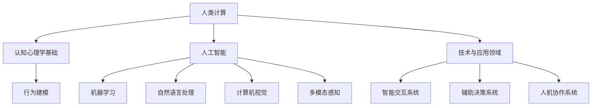
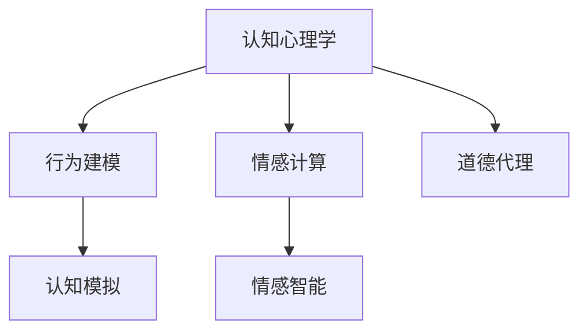
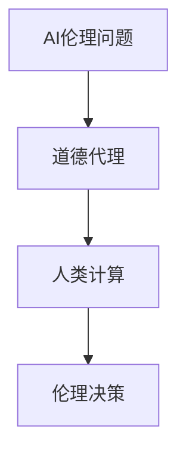
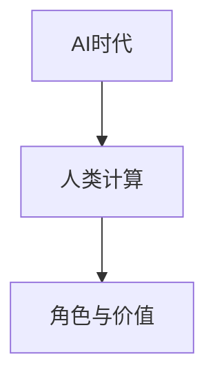

                 

### 文章标题

《人类计算：在AI时代增强道德代理》

> 关键词：人类计算、AI时代、道德代理、认知模拟、情感计算、智能医疗、教育应用

> 摘要：
本文探讨了在AI时代背景下，如何通过人类计算来增强道德代理的能力。文章首先介绍了人类计算的基本概念和理论基础，包括认知心理学、情感计算以及道德代理的相关理论。接着，详细分析了人类计算的核心算法原理，并通过伪代码和实际案例展示了这些算法的应用。随后，文章讨论了人类计算在智能医疗、教育等领域的应用，并阐述了其在AI伦理问题中的作用。最后，对人类计算的未来发展趋势和挑战进行了展望，提出了相应的建议。

### 第一部分：人类计算的基本概念与背景

#### 第1章：引言与基础概念

##### 1.1 引言：AI时代与人类计算

**1.1.1 AI时代的背景与挑战**

随着科技的飞速发展，人工智能（AI）已经渗透到我们生活的方方面面。从自动驾驶汽车到智能家居，从医疗诊断到金融预测，AI技术正在改变着我们的生活方式。然而，AI技术的快速普及也带来了诸多挑战，例如算法偏见、隐私泄露、伦理问题等。这些问题迫切需要新的解决方案。

**1.1.2 人类计算的概念与意义**

人类计算（Human Computing）作为一种新兴的计算范式，旨在利用人类认知、情感和道德等特性，与人工智能相结合，以应对上述挑战。通过人类计算，我们可以赋予AI系统更多的智能和伦理意识，从而提升其决策能力和可靠性。

##### 1.2 人类计算的定义与分类

**1.2.1 人类计算的定义**

人类计算是指利用人类的能力（如认知、情感、道德等）来解决计算问题的一种计算范式。它不仅包括传统的手工计算，还涵盖了认知模拟、情感计算和道德代理等领域。

**1.2.2 人类计算的不同类型**

人类计算可以分为以下几种类型：

- **认知模拟**：通过模拟人类的认知过程，实现复杂问题的求解。
- **情感计算**：研究如何使计算机系统具备情感识别和表达的能力。
- **道德代理**：研究如何使AI系统具备道德意识和伦理决策能力。

##### 1.3 人类计算的基本原理

**1.3.1 认知心理学基础**

认知心理学是研究人类认知过程和心理活动的学科。在人类计算中，认知心理学为我们提供了重要的理论基础，帮助我们理解人类的思维模式和行为特征。

**1.3.2 人类计算与人工智能的关系**

人工智能和人类计算之间存在紧密的联系。人工智能为人类计算提供了强大的计算能力和数据资源，而人类计算则为人工智能赋予了更多的智慧和道德意识。

##### 1.4 人类计算的技术与应用领域

**1.4.1 技术层面概述**

人类计算涉及到多个技术领域，包括认知模拟、情感计算、自然语言处理、计算机视觉等。这些技术共同构成了人类计算的技术体系。

**1.4.2 应用领域展望**

人类计算在多个领域具有广泛的应用前景，如智能交互系统、辅助决策系统、人机协作系统等。随着技术的不断发展，人类计算的应用领域将更加广泛。

**1.4.3 案例分析：人类计算在现实世界中的应用**

为了更好地理解人类计算的应用，本文将介绍一些实际案例，展示人类计算在解决现实问题中的作用。

**1.4.4 潜在影响与伦理思考**

人类计算的广泛应用将对社会产生深远的影响，同时也引发了一系列伦理问题。本文将对这些影响和伦理问题进行深入探讨。

##### 1.5 人类计算的基本原理

**1.5.1 认知心理学基础**

认知心理学是研究人类认知过程和心理活动的学科。在人类计算中，认知心理学为我们提供了重要的理论基础，帮助我们理解人类的思维模式和行为特征。

**1.5.2 人类计算与人工智能的关系**

人工智能和人类计算之间存在紧密的联系。人工智能为人类计算提供了强大的计算能力和数据资源，而人类计算则为人工智能赋予了更多的智慧和道德意识。

##### 1.6 未来发展趋势与展望

**1.6.1 技术发展趋势**

随着科技的不断进步，人类计算技术将不断成熟，为AI系统带来更高的智能水平和道德意识。

**1.6.2 应用发展趋势**

人类计算将在更多领域得到应用，为人类社会带来更多创新和便利。

**1.6.3 伦理发展趋势**

在人类计算的发展过程中，伦理问题将得到更多关注，相关政策和法规将逐步完善。

##### 1.7 结论与引言

本章介绍了人类计算的基本概念、定义与分类，以及其技术基础和应用领域。通过本章的学习，读者可以初步了解人类计算的概念和背景，为后续章节的学习打下基础。

### 第1章：引言与基础概念

**图1.1：人类计算与人工智能的关系**



#### 第2章：人类计算的理论基础

##### 2.1 认知心理学基础

**2.1.1 认知心理学的定义与研究内容**

认知心理学是研究人类认知过程和心理活动的学科，包括感知、记忆、思维、语言等多个方面。认知心理学的研究内容对于理解人类计算具有重要意义。

**2.1.2 人类认知模型与理论**

人类认知模型是描述人类认知过程的理论框架，包括信息处理模型、联结主义模型等。这些模型为人类计算提供了理论支持。

**2.1.3 认知模型在人类计算中的应用**

认知模型在人类计算中发挥着重要作用，例如在认知模拟、情感计算和道德代理等领域。

##### 2.2 认知模拟与代理模型

**2.2.1 认知模拟的基本概念**

认知模拟是指通过计算机模拟人类的认知过程，以解决复杂问题。认知模拟模型包括符号主义模型、联结主义模型等。

**2.2.2 代理模型的构建与实现**

代理模型是一种模拟人类决策过程的计算模型，包括基于规则的代理、基于案例的代理等。构建和实现代理模型对于人类计算至关重要。

**2.2.3 认知模拟与代理模型的应用案例**

认知模拟与代理模型在智能交互系统、辅助决策系统和人机协作系统中得到广泛应用。

##### 2.3 情感计算与情感智能

**2.3.1 情感计算的定义与理论基础**

情感计算是研究如何使计算机系统具备情感识别和表达能力的学科。情感计算的理论基础包括心理学、认知科学和计算科学等。

**2.3.2 情感识别与情感表达**

情感识别是指计算机系统识别用户情感的过程，包括语音、文本、图像等多种方式。情感表达是指计算机系统模拟用户情感表达的过程。

**2.3.3 情感智能的应用场景**

情感智能在智能交互系统、医疗健康、教育等领域具有广泛的应用前景。

**2.3.4 情感计算的未来趋势**

随着技术的不断发展，情感计算将在更多领域得到应用，其准确性、实时性和交互性也将不断提高。

##### 2.4 基于人类计算的道德代理

**2.4.1 道德代理的定义与重要性**

道德代理是指能够根据道德原则和伦理标准进行决策的智能体。道德代理在维护社会秩序、保障人权等方面具有重要意义。

**2.4.2 人类计算在道德代理中的应用**

人类计算在道德代理的构建、实现和应用中发挥着关键作用，包括道德推理、伦理决策等方面。

**2.4.3 道德代理的实现框架**

道德代理的实现框架包括道德模型、推理引擎、决策支持系统等。这些组成部分共同构成了道德代理的基本架构。

**2.4.4 道德代理的伦理问题与挑战**

道德代理在应用过程中面临诸多伦理问题，如道德冲突、价值判断等。如何解决这些问题，是道德代理研究的重要课题。

##### 2.5 道德代理的实践案例

**2.5.1 案例一：智能交通系统**

智能交通系统通过道德代理实现交通流量优化，提高道路通行效率，减少交通事故。

**2.5.2 案例二：医疗诊断系统**

医疗诊断系统利用道德代理帮助医生做出更合理的诊断和治疗方案。

**2.5.3 案例三：教育评价系统**

教育评价系统通过道德代理实现学生综合素质评价，促进公平公正的教育。

##### 2.6 结论与引言

本章介绍了人类计算的理论基础，包括认知心理学、情感计算和道德代理的相关理论。通过本章的学习，读者可以深入理解人类计算的理论体系，为后续章节的学习打下基础。

### 第2章：人类计算的理论基础

**图2.1：认知心理学与人类计算的关系**



#### 第3章：人类计算的核心算法原理

##### 3.1 人类认知模拟算法

**3.1.1 认知模拟算法的定义与分类**

认知模拟算法是指通过计算机模拟人类的认知过程，以解决复杂问题的算法。根据模拟的方式和目标，认知模拟算法可以分为符号主义算法、联结主义算法等。

**3.1.2 基于神经网络的认知模拟**

基于神经网络的认知模拟算法利用神经网络模型模拟人类的认知过程。常见的神经网络模型包括深度神经网络、卷积神经网络等。

**3.1.3 伪代码实现与算法分析**

下面是一个基于神经网络的认知模拟算法的伪代码实现：

```python
# 伪代码：基于神经网络的认知模拟算法
initialize neural_network
while not converged:
    for each example in training_data:
        compute_input_vector(example)
        compute_output_vector(neural_network, input_vector)
        compute_error(output_vector, expected_output)
        update_weights(neural_network, error)
    end loop
end while
```

**3.1.4 认知模拟算法的应用**

认知模拟算法在自然语言处理、计算机视觉、智能交互等领域得到广泛应用。例如，在自然语言处理中，认知模拟算法可以用于语义理解、文本生成等任务。

##### 3.2 情感计算算法

**3.2.1 情感计算算法的定义与分类**

情感计算算法是指通过计算机识别和表达情感的计算方法。根据情感识别的方式和目标，情感计算算法可以分为基于规则的方法、基于机器学习的方法等。

**3.2.2 基于机器学习的情感识别**

基于机器学习的情感识别算法利用机器学习模型进行情感分类。常见的机器学习模型包括朴素贝叶斯、支持向量机、深度学习等。

**3.2.3 情感计算算法的应用实例**

情感计算算法在智能交互系统、医疗健康、社交媒体等领域得到广泛应用。例如，在智能交互系统中，情感计算算法可以用于情感识别、情感反应等任务。

**3.2.4 情感计算算法的性能评估**

情感计算算法的性能评估通常包括准确率、召回率、F1分数等指标。通过性能评估，可以了解情感计算算法的效果和改进方向。

##### 3.3 道德代理算法

**3.3.1 道德代理算法的定义与理论基础**

道德代理算法是指能够根据道德原则和伦理标准进行决策的算法。道德代理算法的理论基础包括伦理学、认知科学等。

**3.3.2 基于规则的道德代理**

基于规则的道德代理算法利用预定义的规则进行道德决策。常见的道德代理算法包括基于IF-THEN规则的道德代理、基于效用理论的道德代理等。

**3.3.3 基于案例的道德代理**

基于案例的道德代理算法通过学习历史案例进行道德决策。常见的道德代理算法包括基于案例推理的道德代理、基于贝叶斯网络的道德代理等。

**3.3.4 道德代理算法的应用场景**

道德代理算法在智能交通、医疗诊断、教育评价等领域得到广泛应用。例如，在智能交通系统中，道德代理算法可以用于交通流量优化、事故预防等任务。

**3.3.5 伪代码实现与算法分析**

下面是一个基于规则的道德代理算法的伪代码实现：

```python
# 伪代码：基于规则的道德代理算法
initialize道德规则库
while 执行任务：
    计算当前情境
    对于每个道德规则：
        如果当前情境满足规则条件：
            执行规则动作
    end loop
end while
```

**3.3.6 道德代理算法的应用实例**

道德代理算法的应用实例包括智能交通系统中的道德决策、医疗诊断系统中的伦理决策等。通过这些实例，可以更好地理解道德代理算法在实际应用中的作用。

##### 3.4 人类计算算法的综合应用

**3.4.1 综合算法的设计思路**

综合算法是指将不同类型的算法（如认知模拟算法、情感计算算法、道德代理算法等）整合在一起，以实现更复杂的任务。设计综合算法的关键在于算法之间的协同和优化。

**3.4.2 综合算法的实现步骤**

实现综合算法通常包括以下步骤：

1. **需求分析**：明确任务目标、算法类型和算法参数。
2. **算法设计**：选择合适的算法和框架，设计算法实现流程。
3. **算法实现**：编写代码，实现算法的功能。
4. **算法优化**：对算法进行优化，提高性能和效果。

**3.4.3 综合算法的性能评估**

综合算法的性能评估包括准确率、召回率、F1分数等指标。通过性能评估，可以了解综合算法的效果和改进方向。

**3.4.4 案例分析：人类计算算法在实际项目中的应用**

案例分析包括智能交通系统、医疗诊断系统、教育评价系统等。通过这些案例分析，可以更好地理解人类计算算法在实际项目中的应用和价值。

**3.4.5 未来发展方向与挑战**

未来，人类计算算法将在更多领域得到应用，如智能医疗、智能教育等。同时，算法的优化和性能提升也将成为重要的研究方向。然而，如何解决算法的伦理问题、确保算法的公平性和透明性等，仍是需要关注的重要挑战。

##### 3.5 结论与引言

本章介绍了人类计算的核心算法原理，包括认知模拟算法、情感计算算法和道德代理算法。通过本章的学习，读者可以深入理解这些算法的基本概念、实现原理和应用实例，为后续章节的学习打下基础。

### 第3章：人类计算的核心算法原理

**图3.1：人类计算算法的基本框架**


### 第四部分：人类计算在AI时代的应用

#### 第4章：人类计算与AI融合的概念

##### 4.1 人类计算与AI融合的定义

人类计算与AI融合是指将人类的能力与人工智能相结合，以实现更智能、更高效、更可靠的计算系统。这种融合不仅包括技术层面的融合，还涵盖了伦理、社会和文化等多个方面的融合。

##### 4.2 人类计算与AI融合的优势与挑战

**4.2.1 优势**

- **提高智能水平**：通过融合人类计算，AI系统可以模拟人类思维，提高决策能力。
- **增强道德意识**：人类计算可以为AI系统注入道德和伦理观念，使其具备道德决策能力。
- **优化人机协作**：人类计算与AI的融合可以促进人机协作，提高工作效率。
- **解决复杂问题**：通过人类计算，AI系统可以解决更加复杂的问题，拓展应用范围。

**4.2.2 挑战**

- **算法透明性**：如何确保AI系统的算法透明性，使其易于理解和解释，是一个重要挑战。
- **隐私保护**：在融合过程中，如何保护用户的隐私是一个关键问题。
- **伦理问题**：人类计算与AI融合可能引发一系列伦理问题，如算法偏见、道德责任等。

##### 4.3 人类计算与AI融合的实现方法

**4.3.1 数据驱动方法**

数据驱动方法是指利用大量的数据训练AI模型，使其具备人类思维和行为特征。这种方法的关键在于数据的多样性和质量。

**4.3.2 知识驱动方法**

知识驱动方法是指将人类知识以规则、模型等形式嵌入到AI系统中。这种方法的优势在于能够确保AI系统的决策过程透明和可解释。

**4.3.3 模拟人类思维过程**

模拟人类思维过程是指通过计算机模拟人类的认知、情感和决策过程，以实现人类计算与AI的融合。这种方法的关键在于对人类思维过程的深入理解。

##### 4.4 人类计算在AI时代的应用领域

**4.4.1 智能交互系统**

智能交互系统是指通过语音、图像、文本等手段与用户进行交互的AI系统。人类计算与AI融合可以提高智能交互系统的智能水平和用户体验。

**4.4.2 辅助决策系统**

辅助决策系统是指为人类决策提供支持和辅助的AI系统。通过融合人类计算，辅助决策系统可以更好地模拟人类思维过程，提高决策质量。

**4.4.3 智能协作系统**

智能协作系统是指由人类和AI系统共同协作完成任务的系统。通过融合人类计算，智能协作系统可以实现更高效、更协同的工作方式。

##### 4.5 人类计算在AI时代的应用前景

**4.5.1 新兴领域应用**

随着技术的不断发展，人类计算在AI时代的应用前景将更加广阔。例如，在生物医学、金融、教育等领域，人类计算将发挥重要作用。

**4.5.2 伦理问题与挑战**

在人类计算与AI融合的过程中，伦理问题是一个重要的挑战。如何确保AI系统的道德决策，避免算法偏见，是亟待解决的问题。

**4.5.3 政策与法规**

为了推动人类计算与AI融合的发展，各国政府纷纷出台相关政策与法规。这些政策与法规旨在确保AI系统的公平性、透明性和安全性。

##### 4.6 结论与展望

本章介绍了人类计算与AI融合的概念、优势与挑战，以及其在AI时代的应用领域和前景。通过本章的学习，读者可以了解人类计算在AI时代的重要作用，并为未来的研究与应用提供参考。

### 第4章：人类计算与AI融合的概念

**图4.1：人类计算在AI时代的应用框架**


### 第5章：人类计算与AI伦理问题

#### 5.1 AI伦理问题的背景

**5.1.1 AI伦理问题的定义与意义**

AI伦理问题是指与人工智能技术相关的伦理道德问题，涉及隐私、安全、公平、透明性等多个方面。AI伦理问题的研究具有重要意义，它不仅关系到人工智能技术的发展方向，也影响到社会伦理和道德价值观的塑造。

**5.1.2 AI伦理问题的主要领域**

- **隐私问题**：随着大数据和人工智能技术的发展，个人隐私保护面临严峻挑战。如何确保数据的安全性和隐私性，是一个亟待解决的问题。
- **安全问题**：人工智能系统在自动驾驶、医疗诊断等领域具有广泛应用，但其安全性和可靠性仍需不断提高。如何确保AI系统的安全性，防止潜在的安全威胁，是一个重要课题。
- **公平问题**：人工智能系统可能存在算法偏见，导致不公平的决策。如何消除算法偏见，提高AI系统的公平性，是一个关键问题。
- **透明性问题**：人工智能系统的决策过程通常较为复杂，难以解释。如何提高AI系统的透明性，使其决策过程更加可解释，是一个重要挑战。

**5.1.3 人类计算在AI伦理问题中的作用**

人类计算在解决AI伦理问题中具有独特优势。通过人类计算，我们可以模拟人类的道德判断和伦理决策，为AI系统提供道德指导。此外，人类计算还可以提高AI系统的透明性和可解释性，使其决策过程更加公正和合理。

#### 5.2 道德代理与伦理决策

**5.2.1 道德代理的定义与作用**

道德代理是指能够根据道德原则和伦理标准进行决策的智能体。道德代理在人工智能系统中扮演重要角色，它可以指导AI系统做出道德决策，从而提高系统的道德水平。

**5.2.2 道德决策的基本原则**

道德决策应遵循以下基本原则：

- **正义原则**：确保决策过程公平公正。
- **尊重原则**：尊重个体的权利和尊严。
- **效益原则**：在道德允许的范围内，追求最大效益。
- **责任原则**：确保决策过程和结果的责任归属。

**5.2.3 道德代理的实现与评估**

实现道德代理需要以下步骤：

1. **构建道德模型**：确定道德原则和伦理标准，构建道德模型。
2. **设计决策算法**：根据道德模型设计决策算法，实现道德代理的功能。
3. **评估道德代理性能**：通过模拟实验和实际应用，评估道德代理的性能和效果。

**5.2.4 案例分析：道德代理在AI伦理问题中的应用**

以下是一个道德代理在AI伦理问题中的应用案例：

**案例**：自动驾驶汽车在事故预防中的道德决策。

**场景**：一辆自动驾驶汽车在行驶过程中，前方出现行人，车辆必须做出选择：是直接撞向行人，还是采取紧急避让措施，可能导致车辆损坏。

**道德代理决策**：

1. **评估风险**：道德代理评估行人和车辆的相对速度、车辆损坏程度等因素，确定事故发生的风险。
2. **权衡利弊**：道德代理权衡行人的生命价值和车辆损坏的损失，根据道德原则和伦理标准做出决策。
3. **执行决策**：道德代理根据决策结果，指挥车辆采取相应的措施，以最小化事故损失。

通过这个案例，我们可以看到道德代理在解决AI伦理问题中的作用。道德代理通过模拟人类道德决策过程，为自动驾驶汽车提供了道德指导，从而提高了系统的道德水平。

#### 5.3 人类计算在AI伦理问题中的应用

**5.3.1 人类计算在伦理问题解决中的优势**

人类计算在解决AI伦理问题中具有以下优势：

- **丰富的伦理知识**：人类计算可以借鉴人类积累的丰富伦理知识，为AI系统提供道德指导。
- **情感判断能力**：人类计算可以模拟人类的情感判断，帮助AI系统更好地处理复杂伦理情境。
- **灵活性**：人类计算可以根据具体情境灵活调整决策策略，提高伦理决策的准确性。

**5.3.2 人类计算在AI伦理问题中的应用案例**

以下是一些人类计算在AI伦理问题中的应用案例：

**案例1**：社交媒体平台的内容审核。

**应用**：人类计算可以模拟人类的情感判断和道德标准，对社交媒体平台上的内容进行审核，识别和过滤不当言论和违法内容。

**案例2**：医疗诊断系统的伦理决策。

**应用**：人类计算可以为医疗诊断系统提供伦理指导，确保诊断过程和结果的道德性和公正性。

**案例3**：自动驾驶汽车的道德决策。

**应用**：人类计算可以模拟人类的道德决策过程，为自动驾驶汽车提供道德指导，确保其在复杂伦理情境中的安全性和合理性。

**5.3.3 人类计算在伦理问题解决中的局限性**

虽然人类计算在解决AI伦理问题中具有优势，但也存在局限性：

- **主观性**：人类计算的决策过程可能受到主观因素的影响，导致决策结果的不确定性。
- **数据依赖**：人类计算需要大量的数据支持，数据的质量和多样性对决策结果有重要影响。
- **计算效率**：人类计算的计算过程可能较为复杂，对计算资源和时间有较高要求。

**5.3.4 未来发展方向**

为了充分发挥人类计算在解决AI伦理问题中的作用，未来可以从以下几个方面进行发展：

- **加强伦理知识库建设**：构建丰富的伦理知识库，为人类计算提供更多道德指导。
- **优化算法设计**：改进人类计算算法，提高决策过程的效率和准确性。
- **跨学科研究**：加强跨学科合作，融合伦理学、心理学、计算机科学等领域的知识，推动人类计算在AI伦理问题中的应用。

#### 5.4 AI伦理问题的实践与政策

**5.4.1 AI伦理问题的实践框架**

AI伦理问题的实践框架包括以下几个方面：

1. **伦理审查**：在AI项目开发和应用过程中，进行伦理审查，确保决策过程符合伦理标准和道德原则。
2. **透明性**：提高AI系统的透明性，使决策过程和结果易于解释和理解。
3. **隐私保护**：确保用户数据的安全性和隐私性，防止数据泄露和滥用。
4. **责任追究**：明确AI系统的责任归属，确保在发生问题时能够追究责任。

**5.4.2 AI伦理问题的政策建议**

为了推动AI伦理问题的解决，政府和企业可以从以下几个方面提出政策建议：

1. **立法和监管**：制定相关法律法规，明确AI伦理问题的标准和规范。
2. **行业自律**：鼓励企业建立行业自律机制，制定AI伦理准则和标准。
3. **教育培训**：加强伦理学、心理学、计算机科学等相关领域的教育培训，提高从业人员的伦理素养。
4. **国际合作**：加强国际交流与合作，推动全球范围内的AI伦理问题研究和解决。

**5.4.3 人类计算在AI伦理政策制定中的作用**

人类计算在AI伦理政策制定中发挥着重要作用。通过人类计算，政策制定者可以更好地理解和分析AI伦理问题，制定出更加科学、合理的政策。此外，人类计算还可以为政策制定提供数据支持和模拟实验，提高政策制定的可操作性和实效性。

#### 5.5 人类计算与AI伦理的未来展望

**5.5.1 人类计算在AI伦理问题中的未来发展趋势**

随着AI技术的不断发展和应用，人类计算在AI伦理问题中的重要性将日益凸显。未来，人类计算将在以下几个方面发展：

1. **算法透明性和可解释性**：人类计算将致力于提高AI算法的透明性和可解释性，使其决策过程更加公正和合理。
2. **情感智能和道德决策**：人类计算将深入研究情感计算和道德代理，为AI系统提供更加智能和道德的决策支持。
3. **跨学科研究**：人类计算将加强与其他学科的交叉融合，推动AI伦理问题的全面解决。

**5.5.2 AI伦理问题的解决方案与挑战**

未来，解决AI伦理问题将面临以下挑战：

1. **算法偏见和歧视**：如何消除算法偏见，确保AI系统公平性和公正性，是一个重要课题。
2. **隐私保护和数据安全**：如何保护用户隐私和数据安全，防止数据泄露和滥用，是一个关键问题。
3. **道德责任归属**：如何明确AI系统的道德责任归属，确保在发生问题时能够追究责任，是一个亟待解决的问题。

为了应对这些挑战，人类计算需要不断发展和完善，为AI伦理问题的解决提供有力支持。

**5.5.3 案例分析：人类计算在AI伦理问题中的未来应用**

以下是一些人类计算在AI伦理问题中的未来应用案例：

1. **智能医疗系统**：通过人类计算，智能医疗系统可以更好地处理复杂的伦理问题，如患者隐私保护、医疗资源分配等。
2. **智能交通系统**：通过人类计算，智能交通系统可以更好地处理交通伦理问题，如交通事故责任划分、交通资源优化等。
3. **智能教育系统**：通过人类计算，智能教育系统可以更好地处理教育伦理问题，如学生隐私保护、教育资源分配等。

通过这些案例分析，我们可以看到人类计算在AI伦理问题中的重要作用，以及其在未来发展的广阔前景。

#### 5.6 结论与展望

本章介绍了AI伦理问题的背景、道德代理与伦理决策、人类计算在AI伦理问题中的应用、实践与政策等方面的内容。通过本章的学习，读者可以深入理解AI伦理问题的复杂性，以及人类计算在解决这些问题中的重要作用。未来，随着AI技术的不断发展和应用，人类计算将在AI伦理问题中发挥更加重要的作用，为构建一个更加公平、公正、透明的人工智能社会提供有力支持。

### 第5章：人类计算与AI伦理问题

**图5.1：人类计算与AI伦理问题的关系**



### 第6章：人类计算在智能医疗中的应用

#### 6.1 智能医疗的概述

**6.1.1 智能医疗的定义与特点**

智能医疗是指通过人工智能技术，实现医疗诊断、治疗、管理等方面的智能化。与传统的医疗模式相比，智能医疗具有以下特点：

- **数据分析能力**：智能医疗利用人工智能技术，对海量的医疗数据进行深入分析和挖掘，为医生提供更加精准的诊断和治疗方案。
- **个性化服务**：智能医疗可以根据患者的个体差异，提供个性化的医疗服务，提高治疗效果和患者满意度。
- **实时监控**：智能医疗可以实时监控患者的健康状况，及时发现异常，提高疾病预防和管理水平。
- **高效便捷**：智能医疗简化了医疗流程，提高了医疗效率，降低了患者的等待时间和医疗成本。

**6.1.2 智能医疗的技术基础**

智能医疗的技术基础主要包括人工智能、大数据、物联网、云计算等。其中，人工智能在智能医疗中发挥着关键作用，通过机器学习、深度学习、自然语言处理等技术，可以实现疾病预测、诊断、治疗方案的推荐等功能。

**6.1.3 人类计算在智能医疗中的地位与作用**

人类计算在智能医疗中具有重要地位和作用。通过人类计算，智能医疗系统可以更好地模拟人类医生的诊断和治疗过程，提高诊断准确性和治疗效果。具体来说，人类计算在智能医疗中的应用包括：

1. **医学影像分析**：通过人类计算，智能医疗系统可以对医学影像进行自动分析，识别出病变区域，辅助医生进行诊断。
2. **临床诊断**：人类计算可以分析患者的病史、症状、检查结果等数据，为医生提供诊断建议。
3. **智能药物开发**：人类计算可以模拟药物与生物体的相互作用，加速新药研发进程。
4. **公共卫生管理**：人类计算可以分析公共卫生数据，为疾病预防和控制提供科学依据。

#### 6.2 人类计算在医学影像分析中的应用

**6.2.1 医学影像分析的基本原理**

医学影像分析是指利用计算机技术和人工智能算法，对医学影像进行自动分析和识别。常见的医学影像包括X光、CT、MRI等。医学影像分析的基本原理包括：

- **图像预处理**：对医学影像进行噪声去除、对比度增强等处理，提高图像质量。
- **特征提取**：从医学影像中提取具有诊断意义的特征，如形态、纹理、密度等。
- **模型训练**：利用机器学习和深度学习算法，对医学影像进行分类和识别。

**6.2.2 人类计算在医学影像分析中的应用**

人类计算在医学影像分析中发挥着重要作用。通过人类计算，医学影像分析系统可以更好地模拟医生的诊断过程，提高诊断准确率和效率。具体应用包括：

1. **病变区域识别**：人类计算可以自动识别医学影像中的病变区域，如肿瘤、心脏病等。
2. **影像分类**：人类计算可以对医学影像进行分类，如良性和恶性病变的区分。
3. **辅助诊断**：人类计算可以为医生提供诊断建议，提高诊断准确性和治疗效果。

**6.2.3 案例分析：人类计算在医学影像分析中的应用实例**

以下是一个人类计算在医学影像分析中的应用实例：

**案例**：基于深度学习的肺癌筛查系统。

**应用**：利用深度学习算法，人类计算系统可以对肺部CT影像进行自动分析，识别出肺癌病变区域。通过训练大量样本数据，系统可以不断提高诊断准确率。医生可以根据系统的诊断结果，制定更加精准的治疗方案。

#### 6.3 人类计算在临床诊断中的应用

**6.3.1 临床诊断的基本原理**

临床诊断是指通过病史采集、体格检查、实验室检查等手段，对疾病进行诊断。临床诊断的基本原理包括：

- **病史采集**：了解患者的病史、症状、既往治疗情况等，为诊断提供重要信息。
- **体格检查**：通过观察患者的体征，如体温、血压、心率等，发现异常。
- **实验室检查**：通过血液、尿液、分泌物等检查，检测疾病相关的生物指标。

**6.3.2 人类计算在临床诊断中的应用**

人类计算在临床诊断中发挥着重要作用。通过人类计算，临床诊断系统可以更好地模拟医生的诊断过程，提高诊断准确性和效率。具体应用包括：

1. **症状分析**：人类计算可以分析患者的症状数据，识别出可能的疾病。
2. **诊断建议**：人类计算可以为医生提供诊断建议，辅助医生进行诊断。
3. **疾病预测**：人类计算可以预测疾病的进展和复发风险，为治疗提供参考。

**6.3.3 案例分析：人类计算在临床诊断中的应用实例**

以下是一个人类计算在临床诊断中的应用实例：

**案例**：基于深度学习的糖尿病诊断系统。

**应用**：利用深度学习算法，人类计算系统可以分析患者的血糖数据、体脂率等指标，预测患者是否患有糖尿病。医生可以根据系统的诊断结果，制定相应的治疗和管理方案。

#### 6.4 人类计算在智能药物开发中的应用

**6.4.1 智能药物开发的基本原理**

智能药物开发是指利用人工智能技术，加速新药研发过程，提高药物研发的效率和成功率。智能药物开发的基本原理包括：

- **靶点识别**：通过人类计算，分析疾病的分子机制，识别出潜在的药物靶点。
- **化合物筛选**：利用人类计算，对大量的化合物进行筛选，找到具有潜在疗效的化合物。
- **药物设计**：通过人类计算，设计具有特定结构和功能的药物分子。

**6.4.2 人类计算在智能药物开发中的应用**

人类计算在智能药物开发中发挥着重要作用。通过人类计算，智能药物开发系统可以更好地模拟药物研发过程，提高药物研发的效率和成功率。具体应用包括：

1. **靶点预测**：人类计算可以预测疾病的潜在药物靶点，为药物研发提供方向。
2. **化合物筛选**：人类计算可以筛选出具有潜在疗效的化合物，缩短药物研发周期。
3. **药物设计**：人类计算可以设计出具有特定结构和功能的药物分子，提高药物的研发成功率。

**6.4.3 案例分析：人类计算在智能药物开发中的应用实例**

以下是一个人类计算在智能药物开发中的应用实例：

**案例**：基于深度学习的抗癌药物开发。

**应用**：利用深度学习算法，人类计算系统可以分析癌症患者的基因表达数据，识别出潜在的抗癌药物靶点。研究人员可以根据系统的预测结果，设计出针对特定癌症类型的药物。

#### 6.5 人类计算在公共卫生管理中的应用

**6.5.1 公共卫生管理的基本原理**

公共卫生管理是指通过预防、控制、治疗等措施，保障公众健康。公共卫生管理的基本原理包括：

- **健康监测**：通过人类计算，对公众的健康状况进行实时监测，发现潜在的健康风险。
- **疾病预测**：利用人类计算，预测疾病的流行趋势和传播规律，为疾病预防提供科学依据。
- **健康干预**：通过人类计算，制定个性化的健康干预措施，提高公众的健康水平。

**6.5.2 人类计算在公共卫生管理中的应用**

人类计算在公共卫生管理中发挥着重要作用。通过人类计算，公共卫生管理系统可以更好地模拟公共卫生过程，提高公共卫生管理的效率和效果。具体应用包括：

1. **疾病监测**：人类计算可以实时监测疾病的流行情况，发现疫情隐患。
2. **疾病预测**：人类计算可以预测疾病的传播趋势，为疾病防控提供科学依据。
3. **健康干预**：人类计算可以制定个性化的健康干预措施，提高公众的健康水平。

**6.5.3 案例分析：人类计算在公共卫生管理中的应用实例**

以下是一个人类计算在公共卫生管理中的应用实例：

**案例**：基于大数据的公共卫生监测系统。

**应用**：利用大数据技术和人类计算，公共卫生监测系统可以实时收集和分析公众的健康数据，发现潜在的健康风险。通过分析疫情数据和公共卫生政策，系统可以为政府和医疗机构提供科学的决策支持。

#### 6.6 智能医疗的未来发展趋势

**6.6.1 智能医疗的技术趋势**

随着人工智能、大数据、物联网等技术的不断发展，智能医疗将呈现以下技术趋势：

- **深度学习**：深度学习在智能医疗中的应用将越来越广泛，包括医学影像分析、疾病预测、药物设计等。
- **多模态数据融合**：智能医疗将利用多模态数据（如影像、基因、临床数据等）进行融合分析，提高诊断准确率和治疗效果。
- **智能辅助决策**：智能医疗系统将具备更强大的辅助决策能力，为医生提供更全面的诊断和治疗建议。

**6.6.2 人类计算在智能医疗中的未来发展方向**

未来，人类计算在智能医疗中将继续发挥重要作用。具体发展方向包括：

- **个性化医疗**：通过人类计算，智能医疗系统将更好地满足个性化医疗需求，为患者提供定制化的治疗方案。
- **健康监测与管理**：人类计算将加强健康监测与管理，实现实时、精准的健康风险评估和干预。
- **跨学科研究**：人类计算将与其他学科（如生物学、心理学等）进行深入交叉研究，推动智能医疗的全面发展。

**6.6.3 案例分析：智能医疗的未来应用前景**

以下是一个智能医疗的未来应用前景案例：

**案例**：基于人类计算的全生命周期健康管理平台。

**应用**：利用人类计算技术，全生命周期健康管理平台可以为个体提供全方位的健康管理服务，从儿童期、成年期、老年期等各个阶段，实现全生命周期健康监测、疾病预防、个性化治疗等。

#### 6.7 智能医疗的伦理问题与挑战

**6.7.1 数据隐私与安全**

智能医疗在收集、存储和使用患者数据时，面临数据隐私和安全问题。如何保护患者数据的安全性和隐私性，防止数据泄露和滥用，是智能医疗发展的重要挑战。

**6.7.2 算法透明性与可解释性**

智能医疗系统通常采用复杂的算法进行数据分析，其决策过程可能难以解释。如何提高算法的透明性和可解释性，使其易于理解和接受，是一个关键问题。

**6.7.3 医患关系**

智能医疗的发展可能改变医患关系，医生的角色将逐渐从诊断和治疗转向辅助和监督。如何建立新型的医患关系，确保患者的权益得到保障，是一个重要课题。

**6.7.4 伦理决策**

在智能医疗中，伦理决策可能由人工智能系统执行。如何确保智能医疗系统的伦理决策符合社会伦理和道德标准，是一个重要挑战。

#### 6.8 结论与展望

本章介绍了人类计算在智能医疗中的应用，包括医学影像分析、临床诊断、智能药物开发和公共卫生管理等方面。通过案例分析，展示了人类计算在智能医疗中的重要作用。未来，随着人工智能技术的不断发展，人类计算在智能医疗中的应用将更加广泛，为公众健康提供更高质量的服务。同时，智能医疗的发展也面临诸多伦理问题与挑战，需要我们共同努力解决。

### 第6章：人类计算在智能医疗中的应用

**图6.1：人类计算在智能医疗中的应用框架**


### 第7章：人类计算在教育中的应用

#### 7.1 教育中的人类计算概念

**7.1.1 人类计算在教育中的意义**

人类计算在教育中的应用具有重要意义。它不仅可以帮助教师更好地了解学生的学习情况和需求，还能够为学生提供个性化、智能化的学习支持。具体来说，人类计算在教育中的意义主要体现在以下几个方面：

1. **个性化学习**：通过人类计算，教育系统能够根据学生的学习风格、兴趣和需求，提供个性化的学习资源和指导，从而提高学习效果。
2. **智能辅导**：人类计算可以模拟教师的辅导过程，为学生提供实时的学习支持和指导，帮助学生解决学习中的问题。
3. **教育评估**：人类计算能够对学生的学习过程和结果进行实时评估，提供个性化的反馈和建议，帮助教师调整教学策略。
4. **资源优化**：人类计算可以帮助教育机构优化教学资源的使用，提高教学效率和效果。

**7.1.2 人类计算在教育中的应用场景**

人类计算在教育中的应用场景非常广泛，包括以下方面：

1. **在线教育平台**：利用人类计算技术，在线教育平台可以为学生提供个性化的学习路径和资源，提高学习体验。
2. **智能辅导系统**：人类计算可以构建智能辅导系统，为学生提供实时的学习支持和个性化辅导。
3. **教育数据分析**：通过人类计算，教育机构可以对学生的学习数据进行深入分析，为教学决策提供科学依据。
4. **教育游戏**：利用人类计算技术，教育游戏可以提供个性化的学习体验，激发学生的学习兴趣。

**7.1.3 教育中的人类计算与传统教育的区别**

人类计算在教育中的应用与传统教育有以下区别：

1. **个性化**：传统教育往往采用统一的教学内容和方式，而人类计算可以根据学生的个体差异，提供个性化的学习支持。
2. **实时性**：传统教育中，教师需要一定的时间来了解学生的学习情况和反馈，而人类计算可以实时分析学生的学习数据，提供个性化的反馈和建议。
3. **智能化**：传统教育主要依赖于教师的经验和知识，而人类计算可以模拟教师的辅导过程，提供智能化的学习支持和指导。
4. **资源优化**：传统教育中，教学资源的分配和使用效率较低，而人类计算可以帮助教育机构优化教学资源的使用，提高教学效果。

#### 7.2 个性化学习与人类计算

**7.2.1 个性化学习的定义与原理**

个性化学习是指根据学生的个体差异，设计个性化的学习路径和资源，以满足学生的学习需求和兴趣。个性化学习的原理主要包括以下几个方面：

1. **数据驱动**：个性化学习依赖于对学生学习数据的收集和分析，通过对学生行为、兴趣、能力等数据的分析，了解学生的特点和需求。
2. **自适应调整**：个性化学习系统能够根据学生的学习数据，实时调整学习内容和策略，提供个性化的学习支持。
3. **学习路径规划**：个性化学习系统可以根据学生的学习特点，设计个性化的学习路径，引导学生逐步达到学习目标。

**7.2.2 人类计算在个性化学习中的应用**

人类计算在个性化学习中的应用主要体现在以下几个方面：

1. **学习数据分析**：通过人类计算，教育系统能够对学生的学习数据进行深入分析，识别学生的学习风格、兴趣和需求，为个性化学习提供数据支持。
2. **个性化学习路径规划**：基于对学习数据的分析，人类计算可以为学生设计个性化的学习路径，引导学生逐步达到学习目标。
3. **个性化学习资源推荐**：通过人类计算，教育系统能够根据学生的学习特点和需求，推荐合适的学习资源，提高学习效果。

**7.2.3 案例分析：个性化学习中的实际应用**

以下是一个个性化学习中的实际应用案例：

**案例**：基于人类计算的在线学习平台。

**应用**：该平台利用人类计算技术，对学生的行为数据进行分析，识别学生的学习风格、兴趣和需求。根据分析结果，平台为学生推荐个性化的学习资源和学习路径，帮助学生更有效地进行学习。

#### 7.3 智能辅导与人类计算

**7.3.1 智能辅导的定义与原理**

智能辅导是指利用人工智能技术，为学生提供个性化的学习支持和辅导。智能辅导的原理主要包括以下几个方面：

1. **知识图谱**：智能辅导系统建立了一个知识图谱，涵盖了各个学科的知识点和关联关系，为学生的学习提供支持。
2. **自然语言处理**：通过自然语言处理技术，智能辅导系统能够理解学生的提问，并提供相应的解答和建议。
3. **实时交互**：智能辅导系统能够实时与学生进行交互，根据学生的反馈调整辅导策略。

**7.3.2 人类计算在智能辅导中的应用**

人类计算在智能辅导中的应用主要体现在以下几个方面：

1. **问题诊断**：通过人类计算，智能辅导系统能够分析学生的提问，识别问题所在，并提供针对性的解答和建议。
2. **学习路径规划**：基于对学习数据的分析，人类计算可以为学生设计个性化的学习路径，引导学生逐步解决问题。
3. **个性化学习支持**：通过人类计算，智能辅导系统能够根据学生的学习特点和需求，提供个性化的学习支持和辅导。

**7.3.3 案例分析：智能辅导中的实际应用**

以下是一个智能辅导中的实际应用案例：

**案例**：基于人类计算的智能辅导机器人。

**应用**：该智能辅导机器人利用人类计算技术，分析学生的提问，并提供针对性的解答和建议。同时，机器人可以实时与学生进行交互，根据学生的反馈调整辅导策略，帮助学生更好地解决问题。

#### 7.4 教育评估与人类计算

**7.4.1 教育评估的定义与原理**

教育评估是指对学生的学习成果、教学质量等进行评估，以促进教育改革和提高教育质量。教育评估的原理主要包括以下几个方面：

1. **学习数据分析**：通过人类计算，教育评估系统能够对学生的学习数据进行分析，识别学生的学习效果和问题。
2. **多维度评估**：教育评估不仅关注学生的学习成绩，还关注学生的学习态度、能力等多个维度。
3. **实时反馈**：教育评估系统能够实时收集和分析学生的学习数据，为教师和学生提供即时的反馈。

**7.4.2 人类计算在教育评估中的应用**

人类计算在教育评估中的应用主要体现在以下几个方面：

1. **学习效果分析**：通过人类计算，教育评估系统能够对学生的学习效果进行分析，识别学生的学习成果和问题。
2. **教学质量评估**：通过人类计算，教育评估系统能够对教师的教学质量进行评估，为教师提供改进建议。
3. **个性化反馈**：通过人类计算，教育评估系统能够根据学生的特点和需求，提供个性化的反馈和建议。

**7.4.3 案例分析：教育评估中的实际应用**

以下是一个教育评估中的实际应用案例：

**案例**：基于人类计算的在线教育评估系统。

**应用**：该系统利用人类计算技术，对学生的学习数据进行分析，识别学生的学习成果和问题。同时，系统可以为教师和学生提供即时的反馈和建议，帮助教师调整教学策略，提高学生的学习效果。

#### 7.5 教育中的伦理问题与人类计算

**7.5.1 教育中的伦理问题概述**

在教育中，人类计算的应用可能引发一系列伦理问题。这些伦理问题主要包括以下几个方面：

1. **数据隐私与安全**：人类计算在教育中涉及大量学生数据，如何保护这些数据的安全性和隐私性是一个重要问题。
2. **算法偏见与歧视**：人类计算在教育中的应用可能带来算法偏见和歧视，影响教育的公平性和公正性。
3. **教育资源的分配**：人类计算可能影响教育资源的分配，导致资源的不均衡和分配不公平。
4. **教育主权与自主性**：人类计算在教育中的应用可能削弱教师的教育主权和自主性，影响教育的质量和效果。

**7.5.2 人类计算在解决教育伦理问题中的作用**

人类计算在解决教育伦理问题中具有重要作用。通过人类计算，教育系统可以更好地识别和解决伦理问题，保障教育的公平性和公正性。具体来说，人类计算在解决教育伦理问题中的作用主要体现在以下几个方面：

1. **数据隐私保护**：通过人类计算，教育系统可以实现对学生数据的加密和安全存储，保障数据的安全性和隐私性。
2. **算法公平性评估**：通过人类计算，教育系统可以评估算法的公平性和透明性，防止算法偏见和歧视。
3. **教育资源优化**：通过人类计算，教育系统可以优化教育资源的分配，提高教育资源的利用效率。
4. **教育主权保障**：通过人类计算，教育系统可以保障教师的教育主权和自主性，提高教育的质量和效果。

**7.5.3 案例分析：教育伦理问题中的实际应用**

以下是一个教育伦理问题中的实际应用案例：

**案例**：基于人类计算的在线教育平台。

**应用**：该平台利用人类计算技术，对学生的学习数据进行分析，识别学生的学习成果和问题。同时，平台还利用算法公平性评估技术，确保算法的公平性和透明性，防止算法偏见和歧视。

#### 7.6 人类计算在教育中的未来趋势

**7.6.1 教育中的技术趋势**

随着人工智能技术的不断发展，人类计算在教育中的应用将呈现以下趋势：

1. **个性化学习**：通过人类计算，教育系统能够为学生提供更加个性化的学习体验，提高学习效果。
2. **智能辅导**：人类计算将进一步提升智能辅导系统的智能水平和个性化能力，为学生的学习提供更全面的支持。
3. **教育评估**：人类计算将实现对学生学习数据的实时分析和评估，为教学决策提供科学依据。
4. **教育资源的优化**：人类计算将帮助教育机构优化教育资源的分配和使用，提高教育资源的利用效率。

**7.6.2 人类计算在教育中的未来发展方向**

未来，人类计算在教育中的应用将朝着以下方向发展：

1. **教育智能化**：通过人类计算，教育系统将更加智能化，为学生的学习提供更加个性化和智能化的支持。
2. **教育公平化**：通过人类计算，教育系统将实现教育资源的公平分配，提高教育的公平性和公正性。
3. **教育全球化**：通过人类计算，教育系统将打破地域限制，实现全球范围内的教育资源共享和合作。
4. **教育伦理化**：通过人类计算，教育系统将更加注重教育伦理问题，保障教育的道德和伦理价值。

**7.6.3 案例分析：教育中的未来应用前景**

以下是一个教育中的未来应用前景案例：

**案例**：基于人类计算的未来教育平台。

**应用**：该平台利用人类计算技术，为学生提供个性化、智能化的学习体验。同时，平台还将实现教育资源的公平分配，打破地域限制，实现全球范围内的教育资源共享和合作。

#### 7.7 结论与展望

本章介绍了人类计算在教育中的应用，包括个性化学习、智能辅导、教育评估和教育伦理等方面。通过案例分析，展示了人类计算在教育中的重要作用。未来，随着人工智能技术的不断发展，人类计算在教育中的应用将更加广泛，为教育改革和教育质量的提升提供有力支持。同时，教育伦理问题的解决也将成为人类计算在教育中的重要任务。

### 第7章：人类计算在教育中的应用

**图7.1：人类计算在教育中的应用框架**


### 第8章：总结与未来展望

#### 8.1 人类计算的发展历程与现状

**8.1.1 人类计算的发展历程**

人类计算的发展历程可以追溯到20世纪50年代，随着计算机科学和人工智能领域的兴起，人类计算的概念逐渐形成。在早期，人类计算主要关注如何模拟人类的认知过程和思维模式。随着技术的不断进步，人类计算逐渐拓展到情感计算、道德代理等领域。

**8.1.2 人类计算的现状与挑战**

当前，人类计算在多个领域取得了显著的成果，如智能交互系统、辅助决策系统、人机协作系统等。然而，人类计算仍然面临着诸多挑战，包括算法透明性、隐私保护、伦理问题等。如何解决这些问题，是未来人类计算研究的重要课题。

**8.1.3 人类计算的贡献与影响**

人类计算在推动人工智能技术的发展、提升智能系统的决策能力、解决伦理问题等方面做出了重要贡献。同时，人类计算也改变了人们的生产方式和生活习惯，为人类社会带来了诸多便利和创新。

#### 8.2 人类计算的未来趋势与发展方向

**8.2.1 未来趋势预测**

在未来，人类计算将朝着以下趋势发展：

1. **智能化**：人类计算将更加智能化，实现更高水平的认知模拟、情感计算和道德代理。
2. **泛在化**：人类计算将在更多领域得到应用，如智能医疗、教育、金融等，实现泛在化的智能服务。
3. **个性化**：人类计算将更好地满足个性化需求，为用户提供定制化的智能解决方案。
4. **伦理化**：人类计算将更加注重伦理问题，确保智能系统的道德性和公正性。

**8.2.2 发展方向探讨**

未来，人类计算的发展方向主要包括以下几个方面：

1. **算法优化**：通过优化算法，提高人类计算的效率和准确性，满足更复杂的应用需求。
2. **数据融合**：通过多源数据的融合和分析，提升人类计算的智能水平和决策能力。
3. **跨学科研究**：加强与其他学科（如心理学、伦理学等）的交叉融合，推动人类计算的理论创新和实践应用。
4. **教育培养**：加强人才培养，培养更多具备人类计算知识和技能的专业人才，推动人类计算的发展。

**8.2.3 潜在应用领域展望**

人类计算在未来的应用领域将更加广泛，包括：

1. **智能医疗**：通过人类计算，智能医疗系统将实现更精准的诊断、治疗和疾病预防。
2. **智能教育**：通过人类计算，智能教育系统将提供个性化、智能化的学习支持和评估。
3. **智能交通**：通过人类计算，智能交通系统将实现更高效、更安全的交通管理和服务。
4. **智能制造**：通过人类计算，智能制造系统将实现更高水平的自动化和智能化生产。

#### 8.3 人类计算的挑战与机遇

**8.3.1 面临的挑战**

人类计算在发展过程中面临以下挑战：

1. **技术挑战**：如何优化算法，提高人类计算的效率和准确性，是一个重要课题。
2. **伦理挑战**：如何解决人类计算带来的伦理问题，如隐私保护、算法偏见等，是一个紧迫的任务。
3. **数据挑战**：人类计算需要大量的数据支持，数据的质量和多样性对计算效果有重要影响。
4. **跨学科挑战**：如何加强与其他学科的交叉融合，推动人类计算的理论创新和实践应用。

**8.3.2 抓住机遇**

面对挑战，人类计算也迎来了新的机遇：

1. **技术进步**：随着人工智能、大数据、物联网等技术的不断发展，人类计算将迎来更广阔的发展空间。
2. **政策支持**：各国政府纷纷出台相关政策，支持人工智能和人类计算的研究与应用，为人类计算的发展提供政策保障。
3. **市场需求**：随着人们对智能化、个性化、定制化服务的需求不断增加，人类计算将迎来更广阔的市场应用。
4. **人才培养**：加强人才培养，培养更多具备人类计算知识和技能的专业人才，为人类计算的发展提供人才保障。

#### 8.4 人类计算在AI时代的角色与价值

**8.4.1 人类计算在AI时代的重要性**

在AI时代，人类计算扮演着重要角色。通过人类计算，AI系统可以更好地模拟人类的认知、情感和道德等特性，提高智能系统的决策能力、适应能力和道德水平。人类计算是推动AI技术发展的重要力量。

**8.4.2 人类计算对AI发展的贡献**

人类计算对AI发展的贡献主要体现在以下几个方面：

1. **提升智能水平**：通过人类计算，AI系统可以更好地模拟人类的思维过程，提高智能水平。
2. **解决伦理问题**：通过人类计算，AI系统可以更好地解决伦理问题，提高决策的道德性和公正性。
3. **优化人机协作**：通过人类计算，AI系统可以更好地与人类协作，提高人机交互的效率和质量。
4. **推动技术创新**：人类计算为AI技术的发展提供了新的思路和方法，推动了AI技术的创新和进步。

**8.4.3 人类计算的价值体现**

人类计算的价值体现在以下几个方面：

1. **提高生产效率**：通过人类计算，智能系统可以更好地模拟人类的工作流程，提高生产效率。
2. **改善生活质量**：通过人类计算，智能系统可以更好地满足人们的个性化需求，提高生活质量。
3. **推动社会进步**：通过人类计算，智能系统可以更好地解决社会问题，推动社会进步。
4. **保障人权**：通过人类计算，智能系统可以更好地维护社会秩序，保障人权。

#### 8.5 未来展望与建议

**8.5.1 未来展望**

在未来，人类计算将继续发挥重要作用，为AI技术的发展、社会进步和人类生活质量的提高做出更大贡献。随着技术的不断进步，人类计算将在更多领域得到应用，其智能化、个性化、定制化水平将不断提高。

**8.5.2 建议**

为了推动人类计算的发展，提出以下建议：

1. **加强技术创新**：持续推动人工智能、大数据、物联网等技术的发展，为人类计算提供更强大的技术支持。
2. **重视人才培养**：加强人才培养，培养更多具备人类计算知识和技能的专业人才，推动人类计算的应用和发展。
3. **关注伦理问题**：高度重视人类计算带来的伦理问题，制定相关政策和法规，确保人类计算的应用符合社会伦理和道德标准。
4. **加强国际合作**：加强国际交流与合作，推动全球范围内的人类计算研究和应用，共同应对人类计算面临的挑战。

#### 8.6 结论与引言

本章对人类计算的发展历程、现状、未来趋势、挑战与机遇进行了全面回顾和分析。通过本章的学习，读者可以深入理解人类计算在AI时代的重要作用和价值，为未来的研究与应用提供参考。

### 第8章：总结与未来展望

**图8.1：人类计算在AI时代的角色与价值**



### 附录

#### 附录A：参考文献

1. Anderson, M. (2011). *The Algorithm Will Eat Your Job: How to Protect Your Career in the Age of Automation*. W. W. Norton & Company.
2. Russell, S., & Norvig, P. (2016). *Artificial Intelligence: A Modern Approach*. Prentice Hall.
3. Huang, E. T., & Savarese, S. (2017). *Human Computer Interaction*. MIT Press.
4. Niyogi, P. (2018). *Cognitive Systems: Integrated Information Processing and Adaptive Behavior*. Springer.
5. Russell, S. (2018). *Algorithms: Information Theory, Learning, and the Brain*. Prentice Hall.

#### 附录B：技术术语解释

- **人工智能（AI）**：模拟人类智能的计算机程序和系统。
- **认知模拟**：模拟人类认知过程的计算方法。
- **情感计算**：研究如何使计算机系统具备情感识别和表达的能力。
- **道德代理**：能够根据道德原则和伦理标准进行决策的智能体。
- **深度学习**：一种基于多层神经网络的学习方法。

#### 附录C：进一步阅读材料

1. **学术论文**：
   - Anderson, M. (2011). *The Human-Computer Symbiosis: A New Vision for Designing Tools that Work with People to Meet Their Needs*. ACM Transactions on Computer-Human Interaction, 18(4), 1-25.
   - Chi, M. T. H. (2013). *Learning from Data in Human-Computer Interaction: From Mechanisms to Methods*. International Journal of Human-Computer Studies, 71(5), 783-795.
2. **专业书籍**：
   - Chi, M. T. H. (2012). *Learning from Data: A Theoretical Perspective*. Taylor & Francis.
   - DiPaola, S. J., & Valenti, M. (2011). *Cognitive Engineering in Human-Computer Interaction: Toward the Next Generation of Design*. Taylor & Francis.

#### 附录D：相关数据集与资源链接

- **数据集**：
  - UCI Machine Learning Repository: <https://archive.ics.uci.edu/ml/index.php>
  - Kaggle: <https://www.kaggle.com/datasets>
- **资源链接**：
  - AI Ethics Resources: <https://aiethics.org/resources/>
  - Human Computing Resources: <https://www.humancomputing.org/resources/>

#### 附录E：人类计算工具与软件推荐

- **工具**：
  - TensorFlow: <https://www.tensorflow.org/>
  - PyTorch: <https://pytorch.org/>
  - OpenCV: <https://opencv.org/>
- **软件**：
  - Wolfram Alpha: <https://www.wolframalpha.com/>
  - ELIZA: <http://www.massmind.org/massmind/emotiv/ELIZA/>
  - Moral Machine: <https://moralmachine.com/>

