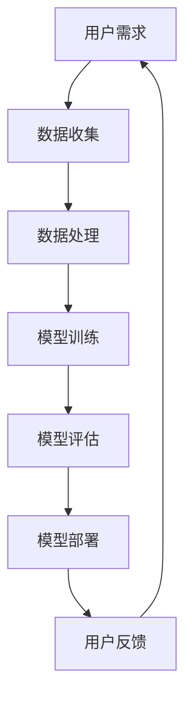

                 

# 文章标题：人类-AI协作：增强人类智慧与AI能力的融合展望

> 关键词：人类-AI协作，智慧增强，AI能力，融合展望，技术实现，应用场景，未来趋势，伦理问题

> 摘要：本文从人类与AI协作的引言出发，详细探讨了人类智慧与AI能力的本质及其在各个领域的应用现状。通过分析人类智慧的本质与结构，AI技术的原理与分类，以及人类-AI协作的理论基础和伦理问题，本文进一步阐述了人类-AI协作的技术实现和应用场景。最后，对人类-AI协作的未来发展趋势、社会影响和可持续发展策略进行了展望，并附有相关的参考文献和实用资源，为读者提供了全面深入的了解。

---

## 第一部分：引言

### 1.1 人类与AI协作概述

人类智慧与AI能力，两者在功能和结构上有着本质的不同。人类智慧是一种基于生物演化的复杂认知能力，具有情感、创造力、自我意识和学习能力等特点。而AI能力则是基于人工设计的算法和模型，通过处理和分析大量数据来实现特定任务的能力，如图像识别、自然语言处理、决策制定等。

在人类生活中的应用现状方面，AI技术已经渗透到我们日常生活的方方面面。例如，智能手机中的语音助手、自动驾驶汽车、智能家居设备等，都体现了AI技术带来的便利和效率提升。此外，AI还在医疗、金融、教育、制造业等领域发挥着重要作用，如智能诊断系统、智能投顾、在线教育平台、智能制造系统等。

展望未来，人类与AI的协作将更加紧密和深入。随着AI技术的不断进步，AI将不仅仅是人类的一种工具，更将成为人类智慧的一部分，与人类共同创造更美好的未来。

### 1.2 人类-AI协作的核心价值

人类-AI协作具有多方面的核心价值。首先，它能够显著提升人类的工作效率和生活质量。通过AI技术，人类可以自动化处理重复性高、计算量大的任务，从而将更多的时间和精力投入到创造性工作和个人兴趣上。

其次，AI能够辅助人类进行创新和探索。AI技术可以处理和分析大量数据，从中发现新的规律和模式，为人类的科学研究、艺术创作等提供新的思路和方法。

最后，AI还能够助力解决全球性挑战。例如，在环境保护、医疗健康、社会安全等领域，AI技术都能够发挥重要作用，为人类应对这些挑战提供有力支持。

## 第二部分：人类-AI协作的理论基础

### 2.1 人类智慧的本质与结构

人类智慧是一种复杂的认知能力，其本质是通过对信息的获取、处理和利用来实现目标的能力。人类智慧的结构主要包括以下几个部分：

1. **感知系统**：人类通过视觉、听觉、触觉等多种感官来获取外部信息。
2. **神经传导系统**：信息通过神经传导系统在人体内部传递，实现信息的处理和整合。
3. **认知系统**：认知系统是人类进行思考、决策和问题解决的核心，包括注意力、记忆、推理、情感等能力。
4. **执行系统**：执行系统是将认知结果转化为行动的能力，包括运动控制和语言表达等。

### 2.2 AI技术的原理与分类

AI技术是基于计算机科学和数学的方法，使计算机能够模拟人类智能行为的技术。AI技术的原理主要包括以下几个部分：

1. **数据驱动方法**：通过收集和分析大量数据来训练模型，使其能够进行预测和决策。
2. **符号推理方法**：通过逻辑和推理规则来模拟人类的思考和决策过程。
3. **混合方法**：结合数据驱动和符号推理方法，以实现更高效、更准确的智能行为。

AI技术的分类可以根据不同的标准进行划分，如基于方法、应用领域等。以下是一些常见的AI技术分类：

1. **机器学习**：通过训练模型来学习数据中的规律，实现预测和分类等任务。
2. **深度学习**：一种基于多层神经网络的结构，能够自动提取特征并进行复杂任务的学习。
3. **自然语言处理**：通过算法理解和生成自然语言，实现人机交互和文本分析等任务。
4. **计算机视觉**：通过图像处理算法实现图像的识别、分类和分析等任务。

### 2.3 人类-AI协作的理论框架

人类-AI协作的理论框架主要包括以下几个部分：

1. **协作模式**：人类和AI之间的协作模式可以分为以下几种类型：
   - **辅助型协作**：AI作为人类的一种工具，辅助人类完成任务。
   - **协作型协作**：AI与人类共同完成某个任务，互相补充。
   - **共享型协作**：AI和人类共享信息和资源，实现更高效的协作。
2. **优势与挑战**：人类-AI协作的优势包括：
   - **效率提升**：AI能够快速处理大量数据，提高工作效率。
   - **创新驱动**：AI能够提供新的思路和方法，推动人类进行创新。
   - **决策支持**：AI能够提供数据分析和预测结果，辅助人类做出更好的决策。

然而，人类-AI协作也面临一些挑战，如：
- **伦理问题**：AI的决策可能涉及伦理和道德问题，需要人类进行监督和决策。
- **安全与隐私**：AI系统可能涉及敏感数据，需要确保其安全性和隐私性。

### 2.4 人类-AI协作的伦理问题

人类-AI协作的伦理问题主要包括以下几个方面：

1. **透明度和可解释性**：AI系统的决策过程往往基于复杂的算法和数据，对于非专业人士来说，其决策过程缺乏透明度和可解释性。这可能导致用户对AI系统的信任度降低。
2. **隐私保护**：AI系统在处理数据时，可能会涉及用户的隐私信息。如何保护用户隐私是AI协作中的一个重要伦理问题。
3. **责任归属**：当AI系统出现错误或造成损害时，如何界定责任归属是一个复杂的问题。这需要法律和伦理标准的明确界定。
4. **公平性**：AI系统在处理数据时可能存在偏见，导致不公平的结果。如何确保AI系统的公平性是一个重要的伦理问题。

### 第二部分总结

通过上述分析，我们可以看出，人类智慧与AI能力在本质和结构上有着显著的不同，但两者在功能上却可以实现互补和协同。人类-AI协作的理论基础不仅为人类与AI的协作提供了理论支持，也为解决人类面临的各种挑战提供了新的思路和方法。然而，人类-AI协作也面临着一系列的伦理问题，需要我们在实践中不断探索和解决。

---

### 3.1 人类-AI协作的硬件基础

人类-AI协作的硬件基础主要包括计算机硬件的发展、专用硬件与通用硬件的对比以及AI计算需求等方面的内容。

#### 3.1.1 计算机硬件的发展与AI计算需求

计算机硬件的发展是推动AI技术进步的重要基础。从最早的计算机到现代的超级计算机，硬件性能的不断提升使得AI技术的实现变得更加可行和高效。

首先，CPU（中央处理器）的发展对AI计算能力有着重要影响。从最初的奔腾处理器到现在的多核处理器，CPU的性能在不断提升，使得AI算法能够更快地运行和优化。

其次，GPU（图形处理器）在AI计算中扮演了重要角色。GPU具有高度并行计算的能力，这使得它在处理大规模数据和高维计算任务时比CPU更具优势。深度学习等AI技术对GPU的需求日益增加，推动了GPU硬件的发展。

此外，FPGA（现场可编程门阵列）和ASIC（专用集成电路）也是AI计算中常用的硬件加速器。FPGA具有灵活性和可编程性，可以针对特定任务进行优化。而ASIC则是专门为特定应用设计的集成电路，其性能和功耗优势显著。

#### 3.1.2 专用硬件与通用硬件的对比

专用硬件与通用硬件在AI计算中有着不同的应用场景和优势。

专用硬件如GPU、FPGA和ASIC，因其高度优化和定制化，能够显著提升AI计算性能。这些硬件在设计时就考虑了AI算法的特殊需求，能够提供更高的计算速度和效率。然而，专用硬件的缺点在于其通用性较低，只能用于特定类型的计算任务。

通用硬件如CPU，则具有更高的通用性和灵活性。CPU可以执行各种不同类型的计算任务，但其在AI计算中的性能相对较低。随着CPU技术的发展，其性能也在不断提升，但相比专用硬件，其提升速度较慢。

#### 3.1.3 AI计算需求对硬件的要求

AI计算需求对硬件提出了更高的要求，主要体现在以下几个方面：

1. **计算性能**：AI算法通常需要处理大量数据和进行复杂的计算，因此对硬件的计算性能要求较高。高性能的CPU、GPU和FPGA等硬件可以满足这一需求。

2. **存储容量和速度**：AI算法需要存储和处理大量的数据，因此对硬件的存储容量和速度有较高要求。高速的内存和存储设备可以显著提升AI算法的运行效率。

3. **能耗效率**：随着AI计算需求的增长，能耗也成为了一个重要的考虑因素。低能耗的硬件可以降低计算成本，提高AI系统的可持续性。

4. **可扩展性**：AI算法往往需要处理大规模的数据和任务，因此硬件的可扩展性也是一个关键因素。可扩展的硬件可以方便地进行扩展和升级，以应对不断增长的计算需求。

### 3.2 人类-AI协作的软件架构

人类-AI协作的软件架构是确保人类与AI系统能够高效协作的重要基础。软件架构的设计需要考虑AI系统的开发框架、交互设计以及AI与人类用户之间的信息流通等方面。

#### 3.2.1 AI系统的开发框架

AI系统的开发框架是AI系统设计和实现的基础。一个良好的开发框架能够提供模块化的组件和接口，使得AI系统能够灵活扩展和集成。以下是一些常用的AI系统开发框架：

1. **TensorFlow**：TensorFlow是一个开源的机器学习框架，由谷歌开发。它提供了丰富的API和工具，支持各种深度学习算法的建模和训练。

2. **PyTorch**：PyTorch是一个由Facebook开发的开源机器学习框架。它具有动态计算图的优势，使得模型设计和调试更加方便。

3. **Keras**：Keras是一个高级神经网络API，能够简化深度学习模型的构建和训练过程。它支持TensorFlow和Theano两个底层框架。

4. **scikit-learn**：scikit-learn是一个开源的Python机器学习库，提供了各种常见的机器学习算法的实现。它具有简单易用的接口和丰富的文档，适合初学者和研究者使用。

这些开发框架各有优缺点，选择合适的框架需要根据具体的应用需求和开发环境进行考虑。

#### 3.2.2 人类-AI协作软件的交互设计

人类-AI协作软件的交互设计是确保人类用户能够与AI系统高效协作的关键。以下是一些交互设计的关键要素：

1. **用户界面**：用户界面是用户与AI系统交互的入口。一个良好的用户界面应具备直观、简洁和易于操作的特点，使用户能够快速上手并高效地与AI系统进行交互。

2. **对话系统**：对话系统是AI系统与人类用户进行自然语言交互的重要手段。通过对话系统，用户可以使用自然语言与AI系统进行沟通，获取信息和完成任务。

3. **反馈机制**：反馈机制是AI系统与人类用户之间的重要交互环节。通过用户对AI系统的反馈，AI系统可以不断优化和改进，以提供更准确、更个性化的服务。

4. **实时性**：在人类-AI协作中，实时性是一个重要的考量因素。对于一些需要快速响应的任务，如自动驾驶和实时语音识别等，系统的响应速度直接影响到用户体验。

#### 3.2.3 AI与人类用户之间的信息流通

在人类-AI协作中，信息流通的效率和质量是决定协作效果的关键。以下是一些确保信息流通有效性的方法：

1. **数据共享**：通过数据共享机制，AI系统能够获取用户的相关数据，实现信息的快速传递和整合。

2. **数据格式标准化**：使用统一的数据格式和协议，可以确保数据在不同系统之间的无缝传递和兼容。

3. **接口设计**：设计高效的接口，确保AI系统与人类用户之间的信息传递速度快、延迟低。

4. **数据隐私保护**：在信息流通过程中，需要确保用户的隐私数据得到充分保护，避免数据泄露和滥用。

通过以上措施，人类-AI协作的软件架构能够为人类与AI系统之间的高效协作提供坚实的技术支持。

### 3.3 人类-AI协作的应用场景

人类-AI协作的应用场景非常广泛，涵盖了日常生活、工作、教育等多个领域。以下是对这些应用场景的详细探讨：

#### 3.3.1 日常生活领域的应用

在日常生活中，AI技术已经深刻地改变了我们的生活方式。以下是一些具体的应用场景：

1. **智能家居**：智能家居设备通过AI技术实现自动化控制，如智能灯光、智能安防、智能家电等。用户可以通过语音助手或手机应用远程控制家居设备，提高生活便利性和舒适度。

2. **个人助理**：智能个人助理如Siri、Alexa等，可以帮助用户管理日程、发送短信、播放音乐、查询天气等，提高日常生活的效率。

3. **健康监测**：智能穿戴设备如智能手环、智能手表等，可以实时监测用户的心率、睡眠质量、运动量等健康数据，提供个性化的健康建议。

4. **娱乐休闲**：AI技术在游戏、音乐、电影等领域也有广泛应用。例如，智能推荐系统可以根据用户的喜好和行为习惯，提供个性化的娱乐内容。

#### 3.3.2 工作领域的应用

在工作领域，AI技术同样发挥了重要作用，提高了工作效率和生产力。以下是一些应用场景：

1. **自动化办公**：AI技术可以实现文档处理、日程管理、邮件过滤等办公任务的自动化，减轻员工的负担，提高工作效率。

2. **智能客服**：智能客服系统通过自然语言处理技术，可以自动回答用户的问题，提供客户服务，减轻客服人员的压力。

3. **供应链管理**：AI技术可以优化供应链管理流程，提高库存管理、物流配送等环节的效率。

4. **智能投顾**：AI智能投顾通过分析用户的风险偏好和财务状况，提供个性化的投资建议，帮助用户进行投资决策。

#### 3.3.3 教育领域的应用

在教育领域，AI技术为教学和学习带来了新的变革。以下是一些具体的应用场景：

1. **在线教育**：在线教育平台通过AI技术提供个性化的学习体验。例如，智能辅导系统可以根据学生的学习进度和弱点，提供针对性的辅导材料。

2. **智能评测**：AI技术可以自动评估学生的学习成果，提供及时反馈和个性化建议，帮助教师和学生了解学习效果。

3. **虚拟实验室**：虚拟实验室通过AI技术模拟真实的实验环境，学生可以在虚拟环境中进行实验操作，提高实验教学的效率和安全性。

4. **教育数据挖掘**：AI技术可以对教育数据进行分析，发现学生的学习行为和兴趣，为教育决策提供数据支持。

### 3.4 人类-AI协作的实际案例

为了更好地理解人类-AI协作的实践应用，以下列举几个具体的实际案例：

#### 3.4.1 案例一：医疗领域的AI应用

医疗领域是AI技术的重要应用场景之一。以下是一个实际案例：

**案例描述**：某医院引入了一款基于AI的智能诊断系统，该系统通过分析大量的医学影像数据，辅助医生进行疾病的诊断。系统首先对影像数据进行分析，提取关键特征，然后利用深度学习算法进行疾病分类和预测。医生在诊断过程中，可以通过系统提供的辅助信息，提高诊断的准确性和效率。

**实现过程**：
1. **数据收集**：医院收集了大量医学影像数据，包括X光片、CT扫描、MRI等。
2. **数据预处理**：对影像数据进行预处理，包括图像增强、去噪、分割等，以提高数据质量。
3. **模型训练**：使用预处理后的数据，通过深度学习算法进行模型训练，包括卷积神经网络（CNN）、循环神经网络（RNN）等。
4. **模型评估**：在测试集上评估模型的性能，包括准确率、召回率、F1值等指标。
5. **模型部署**：将训练好的模型部署到医院的信息系统中，供医生使用。

**代码解读与分析**：
```python
# 加载预训练的深度学习模型
model = tensorflow.keras.models.load_model('medical_diagnosis_model.h5')

# 加载测试数据
test_images = tensorflow.keras.preprocessing.image.load_img('test_image.jpg')

# 对测试数据进行预处理
preprocessed_image = preprocess_image(test_images)

# 使用模型进行预测
prediction = model.predict(preprocessed_image)

# 输出预测结果
print('Disease Prediction:', prediction)

def preprocess_image(image):
    # 图像增强、去噪、分割等预处理操作
    # ...
    return preprocessed_image

# 代码详细解析
```

**总结**：该案例展示了AI技术在医疗领域的实际应用，通过智能诊断系统辅助医生提高诊断准确性和效率。在实际开发过程中，需要关注数据质量、模型性能和系统部署等方面，确保AI系统能够在实际场景中有效运行。

#### 3.4.2 案例二：教育领域的AI应用

教育领域是AI技术的重要应用场景之一。以下是一个实际案例：

**案例描述**：某在线教育平台引入了一款基于AI的智能辅导系统，该系统可以根据学生的学习进度和表现，提供个性化的学习辅导。系统首先收集学生的学习数据，包括作业完成情况、测试成绩、学习时间等，然后利用机器学习算法分析数据，为学生提供针对性的辅导建议。

**实现过程**：
1. **数据收集**：平台收集了大量的学生学习数据，包括作业、测试、学习时间等。
2. **数据预处理**：对学习数据进行预处理，包括数据清洗、归一化、特征提取等，以提高数据质量。
3. **模型训练**：使用预处理后的数据，通过机器学习算法进行模型训练，包括决策树、随机森林、支持向量机等。
4. **模型评估**：在测试集上评估模型的性能，包括准确率、召回率、F1值等指标。
5. **模型部署**：将训练好的模型部署到教育平台中，供教师和学生使用。

**代码解读与分析**：
```python
# 加载预训练的机器学习模型
model = sklearn.svm.SVC()

# 加载测试数据
test_data = pd.read_csv('test_data.csv')

# 对测试数据进行预处理
preprocessed_data = preprocess_data(test_data)

# 使用模型进行预测
prediction = model.predict(preprocessed_data)

# 输出预测结果
print('Learning Outcome Prediction:', prediction)

def preprocess_data(data):
    # 数据清洗、归一化、特征提取等预处理操作
    # ...
    return preprocessed_data

# 代码详细解析
```

**总结**：该案例展示了AI技术在教育领域的实际应用，通过智能辅导系统为学生提供个性化的学习辅导，提高学习效果。在实际开发过程中，需要关注数据质量、模型性能和系统部署等方面，确保AI系统能够在实际场景中有效运行。

#### 3.4.3 案例三：制造业领域的AI应用

制造业领域是AI技术的重要应用场景之一。以下是一个实际案例：

**案例描述**：某制造企业引入了一款基于AI的智能质量控制系统，该系统通过分析生产过程中的数据，实时监测产品质量，并预测可能出现的质量问题。系统首先收集生产数据，包括温度、压力、振动等，然后利用机器学习算法分析数据，提供质量预测和决策支持。

**实现过程**：
1. **数据收集**：企业收集了大量的生产数据，包括温度、压力、振动等。
2. **数据预处理**：对生产数据进行预处理，包括数据清洗、归一化、特征提取等，以提高数据质量。
3. **模型训练**：使用预处理后的数据，通过机器学习算法进行模型训练，包括回归分析、神经网络等。
4. **模型评估**：在测试集上评估模型的性能，包括预测准确率、均方误差等指标。
5. **模型部署**：将训练好的模型部署到生产系统中，实时监测产品质量。

**代码解读与分析**：
```python
# 加载预训练的机器学习模型
model = sklearn.neural_network.MLPRegressor()

# 加载测试数据
test_data = pd.read_csv('test_data.csv')

# 对测试数据进行预处理
preprocessed_data = preprocess_data(test_data)

# 使用模型进行预测
prediction = model.predict(preprocessed_data)

# 输出预测结果
print('Quality Prediction:', prediction)

def preprocess_data(data):
    # 数据清洗、归一化、特征提取等预处理操作
    # ...
    return preprocessed_data

# 代码详细解析
```

**总结**：该案例展示了AI技术在制造业领域的实际应用，通过智能质量控制系统实时监测产品质量，提高生产效率和产品质量。在实际开发过程中，需要关注数据质量、模型性能和系统部署等方面，确保AI系统能够在实际场景中有效运行。

---

## 第四部分：人类-AI协作的未来展望

### 4.1 人类-AI协作的发展趋势

随着AI技术的不断进步，人类-AI协作将在未来呈现出以下几个发展趋势：

#### 4.1.1 AI技术的进步与挑战

AI技术的进步将进一步提升AI系统的智能水平和应用范围。例如，深度学习、自然语言处理、计算机视觉等技术的不断发展，将使得AI系统能够处理更复杂、更庞大的数据，实现更精准的预测和决策。

然而，AI技术的进步也带来了一系列挑战。首先，随着AI系统的智能化水平提高，其对人类工作的替代作用也将更加明显，可能导致部分工作岗位的消失。其次，AI系统的决策过程往往缺乏透明度和可解释性，可能引发伦理和法律问题。此外，AI技术的快速发展也带来了数据隐私和安全等方面的挑战。

#### 4.1.2 人类-AI协作的未来场景

在未来，人类-AI协作将呈现出以下几个典型场景：

1. **智能化工作环境**：在办公、生产等环境中，AI技术将广泛应用于自动化办公、智能制造、智能调度等方面，提高工作效率和生产力。

2. **个性化服务**：在医疗、教育、金融等领域，AI技术将根据用户的需求和偏好，提供个性化的服务和建议，提高用户体验。

3. **智慧城市**：AI技术将广泛应用于智慧交通、智慧安防、智慧能源等领域，实现城市的智能化管理和运营。

4. **智能助理**：智能助理将广泛应用于个人助理、客服、智能家居等领域，为用户提供便捷、高效的服务。

### 4.2 人类-AI协作的社会影响

人类-AI协作将对社会产生深远的影响，体现在以下几个方面：

#### 4.2.1 对人类社会结构的影响

AI技术的发展将推动社会结构的变革。首先，随着AI技术的普及，部分传统工作岗位可能会被自动化系统取代，可能导致失业问题的加剧。其次，AI技术将催生新的职业和岗位，如数据科学家、AI工程师等，推动就业结构的调整。

#### 4.2.2 对人类生活方式的影响

AI技术将深刻改变人类的生活方式。一方面，AI技术将提高生活质量和便利性，如智能家居、智能交通等应用将使生活更加便捷。另一方面，AI技术也可能带来一些负面影响，如隐私泄露、数据滥用等问题，需要引起关注。

#### 4.2.3 对人类价值观的影响

AI技术将对人类的价值观产生一定的影响。一方面，AI技术将推动人类对自身认知和智慧的认识，促进人类智慧和AI能力的融合。另一方面，AI技术的发展也引发了对技术伦理、责任归属等问题的讨论，需要人类重新审视和调整自身的价值观。

### 4.3 人类-AI协作的可持续发展

为了保证人类-AI协作的可持续发展，需要从以下几个方面进行努力：

#### 4.3.1 可持续发展的基本原则

人类-AI协作的可持续发展应遵循以下基本原则：

1. **公平性**：确保AI技术在发展过程中，不会导致社会不公平现象的加剧，如财富分配不均、就业机会减少等。

2. **包容性**：确保AI技术能够服务于所有人群，特别是弱势群体，如老年人、残疾人等。

3. **透明性**：确保AI技术的决策过程和算法透明，以便用户了解和监督。

4. **隐私保护**：确保用户的隐私数据得到充分保护，防止数据泄露和滥用。

#### 4.3.2 人类-AI协作的可持续发展策略

为了实现人类-AI协作的可持续发展，可以采取以下策略：

1. **加强政策法规建设**：制定和完善相关的政策法规，规范AI技术的发展和应用，确保其符合社会伦理和法律规定。

2. **提升人才培养**：加大对AI技术和相关领域的人才培养力度，培养具备跨学科知识和能力的人才，以推动人类-AI协作的发展。

3. **促进技术创新**：鼓励企业、高校和研究机构加大研发投入，推动AI技术的创新和发展，为人类-AI协作提供技术支持。

4. **加强国际合作**：推动国际社会在AI技术和人类-AI协作领域的合作，共同应对全球性挑战，实现可持续发展。

### 总结

人类-AI协作具有广阔的发展前景和深远的社会影响。通过深入理解和充分利用AI技术，我们可以实现人类智慧和AI能力的融合，推动社会进步和人类发展。同时，我们也需要关注和解决人类-AI协作过程中出现的伦理、法律和社会问题，确保其可持续发展。

---

### 附录A：参考文献

1. Russell, S., & Norvig, P. (2016). 《人工智能：一种现代的方法》（第三版）. 人民邮电出版社.
2. Mitchell, T. M. (1997). 《机器学习》（第一版）. 清华大学出版社.
3. Bengio, Y., Courville, A., & Vincent, P. (2013). Representation Learning: A Review and New Perspectives. IEEE Transactions on Pattern Analysis and Machine Intelligence, 35(8), 1798-1828.
4. Goodfellow, I., Bengio, Y., & Courville, A. (2016). Deep Learning. MIT Press.
5. LeCun, Y., Bengio, Y., & Hinton, G. (2015). Deep Learning. Nature, 521(7553), 436-444.
6. Russell, S., & Norvig, P. (2010). Artificial Intelligence: A Modern Approach. Prentice Hall.

### 附录B：相关工具与资源

- **开源框架与库**：
  - TensorFlow: https://www.tensorflow.org/
  - PyTorch: https://pytorch.org/
  - Keras: https://keras.io/
  - scikit-learn: https://scikit-learn.org/
  
- **在线平台与工具**：
  - Google Colab: https://colab.research.google.com/
  - Jupyter Notebook: https://jupyter.org/
  - GitHub: https://github.com/
  
- **行业报告与白皮书**：
  - AI for Humanity: https://ai-for-humanity.org/
  - AI Index Report: https://aiindex.com/
  - AI Now Institute: https://ainow.institute/

### 附录C：Mermaid流程图

- 人类-AI协作的流程：



### 附录D：核心算法原理与伪代码

- **机器学习算法**：

```python
# 伪代码：线性回归算法
def linear_regression(X, y):
    # 计算斜率和截距
    theta = compute_theta(X, y)
    
    # 训练模型
    model = LinearRegression(theta)
    
    # 评估模型
    evaluate_model(model, X, y)
```

- **自然语言处理算法**：

```python
# 伪代码：词嵌入算法
def word_embedding(vocabulary, dimension):
    # 初始化词嵌入矩阵
    embedding_matrix = initialize_embedding_matrix(vocabulary, dimension)
    
    # 训练词嵌入模型
    model = WordEmbeddingModel(embedding_matrix)
    
    # 评估词嵌入模型
    evaluate_model(model, corpus)
```

### 附录E：数学模型与公式

- **常见数学模型**：
  - 线性回归模型：y = theta0 + theta1 * x
  - 逻辑回归模型：y = sigmoid(theta0 + theta1 * x)
  - 决策树模型：f(x) = max(thetai * xi)

- **常用数学公式**：
  - 梯度下降：theta = theta - alpha * gradient
  - 交叉验证：CV = 1/n * Σ(yi - ŷi)²

### 附录F：项目实战

- **人类-AI协作项目实例**：

**项目描述**：基于TensorFlow实现一个智能诊断系统，用于辅助医生进行疾病诊断。

**实现过程**：
1. **数据收集**：收集医学影像数据，包括X光片、CT扫描等。
2. **数据预处理**：对影像数据进行预处理，包括图像增强、去噪、分割等。
3. **模型训练**：使用预处理后的数据，通过深度学习算法进行模型训练，包括卷积神经网络（CNN）、循环神经网络（RNN）等。
4. **模型评估**：在测试集上评估模型的性能，包括准确率、召回率、F1值等指标。
5. **模型部署**：将训练好的模型部署到医疗系统中，供医生使用。

**代码实现**：

```python
import tensorflow as tf
from tensorflow.keras.models import Sequential
from tensorflow.keras.layers import Conv2D, MaxPooling2D, Flatten, Dense

# 数据预处理
def preprocess_data(images):
    # 图像增强、去噪、分割等预处理操作
    # ...
    return preprocessed_images

# 模型训练
def train_model(preprocessed_images, labels):
    model = Sequential()
    model.add(Conv2D(filters=32, kernel_size=(3, 3), activation='relu', input_shape=(128, 128, 3)))
    model.add(MaxPooling2D(pool_size=(2, 2)))
    model.add(Flatten())
    model.add(Dense(units=1, activation='sigmoid'))
    
    model.compile(optimizer='adam', loss='binary_crossentropy', metrics=['accuracy'])
    model.fit(preprocessed_images, labels, epochs=10, batch_size=32)
    
    return model

# 模型评估
def evaluate_model(model, test_images, test_labels):
    predictions = model.predict(test_images)
    accuracy = (predictions == test_labels).mean()
    print('Model Accuracy:', accuracy)

# 实例代码解读与分析
```

通过以上实现，我们能够构建一个简单的智能诊断系统，用于辅助医生进行疾病诊断。在实际开发过程中，需要关注数据质量、模型性能和系统部署等方面，确保AI系统在实际场景中有效运行。

---

**作者：AI天才研究院/AI Genius Institute & 禅与计算机程序设计艺术 /Zen And The Art of Computer Programming**

