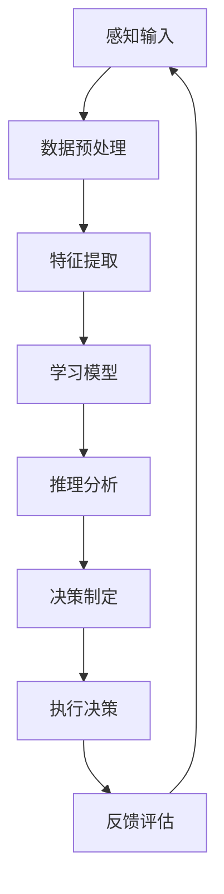

                 

### 引言与背景

随着人工智能技术的飞速发展，人类与人工智能的协作已经渗透到社会生活的各个领域，从医疗、教育到商业决策，AI正在极大地改变我们的生活方式。这种协作不仅提高了效率，还带来了前所未有的便利。然而，随着AI技术的不断进步，其应用范围也越来越广泛，随之而来的道德问题也变得愈加复杂和重要。

人类-AI协作的重要性体现在多个方面。首先，人工智能在处理大规模数据和复杂问题方面具有天然的优势，能够帮助人类在短时间内做出更准确、更全面的决策。其次，AI技术的自动化能力使得许多重复性、低技能的工作得以解放，人们可以将更多的时间和精力投入到更有价值和创新性的活动中。此外，AI在个性化服务、精准医疗和智能教育等方面也展现出了巨大的潜力，极大地提升了人类生活质量。

然而，人类-AI协作不仅仅是一个技术问题，更是一个道德问题。因为人工智能在决策过程中可能会涉及到伦理、隐私、公平性等多个方面。例如，AI系统的偏见可能导致不公正的结果，个人隐私数据的安全和保密也成为一个亟待解决的问题。因此，在设计和应用AI技术时，必须充分考虑这些道德问题，确保人类与AI的协作是公正、透明且符合道德准则的。

本书的目的在于探讨人类-AI协作中的道德考虑，旨在为从事AI研究和应用的专业人士提供一套系统、全面的道德框架。通过详细分析人工智能的基本概念、与道德的关系、伦理原则以及实际应用案例，本书希望能够帮助读者深入了解人类-AI协作中的道德问题，并提供实用的解决方案。

本书的结构安排如下：

- **第一部分：引言与背景**：介绍人类-AI协作的重要性，本书的目的与结构，以及道德考虑在人类-AI协作中的必要性。
- **第二部分：AI基础理论**：深入探讨人工智能的基本概念、发展历程和技术分类，并分析AI与道德的关系。
- **第三部分：人类-AI协作的伦理原则**：介绍伦理原则的基本框架，讨论人类-AI协作中的道德问题，如隐私、公平性和责任归属。
- **第四部分：设计道德考虑的实际应用**：探讨人工智能道德规范的设计原则、实施方法及评估与改进，并分析医疗、教育、商业等领域的具体应用案例。
- **第五部分：未来展望**：展望人类-AI协作的发展趋势，讨论道德考虑的未来挑战，并探讨人类-AI协作的伦理未来。

通过这样的结构安排，本书希望能够系统地引导读者思考人类-AI协作中的道德问题，并为其提供实用的指导。

### 人类-AI协作的重要性

人类与人工智能的协作已经成为当今社会的一个显著特征，这种协作的重要性可以从以下几个方面进行详细阐述：

首先，从技术角度来看，人工智能在处理大规模数据、执行复杂任务和自动化重复性工作中具有明显的优势。传统的人工处理方式不仅效率低下，而且容易出错。而人工智能则可以通过机器学习、深度学习等技术手段，快速分析海量数据，提取有价值的信息，并做出精准的决策。例如，在医疗领域，AI可以通过分析患者的病历数据，预测疾病的发展趋势，为医生提供诊断和治疗的建议，从而提高医疗服务的质量和效率。

其次，从经济角度来看，人类-AI协作能够极大地提高生产力，减少人力成本。在工业生产、物流配送、金融服务等领域，人工智能的应用已经显著提升了生产效率，降低了运营成本。以制造业为例，通过引入机器人自动化生产线，企业能够实现24小时不间断生产，提高了生产效率，降低了工人劳动强度，同时减少了人为操作导致的错误率。

再次，从社会角度来看，人类-AI协作能够为人类带来更多的便利和舒适。在教育领域，人工智能可以为每个学生提供个性化的学习方案，根据学生的兴趣和学习能力，推荐合适的学习内容和资源，从而提高学习效果。在家庭生活中，智能助手和智能家居设备能够帮助人们更好地管理家务，提高生活质量。

然而，尽管人类-AI协作带来了诸多好处，但也引发了诸多道德问题。首先，隐私问题是AI应用中最受关注的一个方面。人工智能系统在收集、处理和存储个人数据时，如果没有严格的数据保护措施，就可能泄露用户的隐私信息，造成不可挽回的损失。其次，公平性问题也是一个重要的道德挑战。由于AI系统的决策可能受到算法偏见的影响，导致某些群体受到不公平对待。例如，在招聘和贷款审批等过程中，如果算法存在性别、种族偏见，就可能歧视某些特定群体，造成社会不公。

最后，责任归属问题也是人类-AI协作中一个复杂且具有争议的道德问题。当AI系统发生错误或者造成损害时，责任应该由谁承担？是开发者、用户还是AI系统本身？这是一个亟待解决的道德和法律问题。

总之，人类-AI协作的重要性不容忽视，但同时也带来了诸多道德挑战。在推进AI技术发展的同时，我们必须认真考虑这些道德问题，并制定相应的道德准则，以确保人类-AI协作能够朝着更加公正、透明和可持续的方向发展。

### 书籍的目的与结构

本书的主要目的是为从事人工智能研究和应用的专业人士提供一套系统、全面的道德框架，以应对人类与AI协作过程中出现的各种道德挑战。具体来说，本书希望通过以下几个方面的内容，帮助读者深入了解并解决这些道德问题：

首先，本书将详细探讨人工智能的基本概念和发展历程，帮助读者建立对AI技术的基本认识。通过了解AI的起源和进化过程，读者能够更好地理解当前AI技术的现状和发展方向。

其次，本书将分析AI与道德的关系，探讨人工智能在道德领域的影响。这部分内容将介绍道德哲学的基本理论，并分析AI技术如何与这些理论相互作用，探讨AI技术可能引发的道德问题，如隐私、公平性和责任归属等。

第三，本书将介绍人类-AI协作中的伦理原则，包括尊重个人隐私、公平性与无偏见、可解释性和透明性等。通过这些原则，读者可以学会如何在设计和应用AI技术时，确保其符合道德准则，避免可能带来的负面影响。

第四，本书将探讨实际应用中如何设计道德考虑，包括设计原则、实施方法和评估与改进。通过具体案例，如医疗、教育、商业等领域的应用，读者可以了解如何在实际操作中落实道德原则，并解决实际问题。

第五，本书还将讨论未来人类-AI协作的发展趋势和道德挑战，为读者提供前瞻性思考。这部分内容将探讨随着AI技术的进一步发展，可能会出现的新道德问题，并提出可能的解决方案。

最后，本书将总结人类-AI协作中的道德问题，提出未来研究的方向和目标，为读者提供进一步阅读的建议。通过这样的结构安排，本书旨在为读者提供全面、深入的道德指导，帮助他们在AI技术和应用过程中，秉持道德原则，实现人类与AI的和谐协作。

### 道德考虑在人类-AI协作中的必要性

道德考虑在人类与人工智能协作中的必要性不可忽视，这不仅仅是因为技术进步带来的潜在风险，更是因为道德准则对于确保协作的公正性、透明性和可持续性的关键作用。

首先，道德考虑有助于防止技术滥用。人工智能技术具有强大的数据处理和分析能力，但这也使其可能被用于不当目的。例如，AI系统可能会通过分析大量个人数据，进行不合理的监控和歧视。如果没有严格的道德约束，这种滥用可能导致严重的隐私侵犯和社会不公。通过设定道德标准，我们可以限制AI的使用范围，防止其被用于伤害个人和社会。

其次，道德考虑有助于确保AI系统的公平性和无偏见。人工智能的决策过程往往依赖于大量数据，而这些数据可能包含历史遗留的偏见。如果AI系统不经过适当的道德审查，就可能将这些偏见放大并应用于新的决策中，导致不公平的结果。例如，一个招聘系统如果基于历史数据，可能会对某些性别或种族的应聘者给予不公平待遇。通过引入道德准则，可以确保AI系统在决策过程中保持公平性，避免偏见。

第三，道德考虑有助于增强AI系统的透明性和可解释性。当前许多AI系统被认为是“黑盒”系统，其决策过程不透明，难以被人类理解。这可能导致用户对AI系统的信任度下降，进而影响其应用效果。通过道德考虑，可以推动AI系统的可解释性和透明性设计，使用户能够理解AI的决策过程，增强用户对AI系统的信任。

第四，道德考虑有助于明确责任归属。在AI系统的应用过程中，当发生错误或造成损害时，责任归属往往模糊不清。通过设定道德标准，可以明确责任归属，为解决纠纷提供依据。例如，如果自动驾驶汽车发生交通事故，明确责任归属需要考虑车辆的制造商、开发者以及操作者等多方因素，而道德准则可以为这种责任划分提供指导。

最后，道德考虑有助于推动AI技术的可持续发展。随着AI技术的不断进步，其应用领域和影响力也在不断扩大。然而，如果没有道德考虑，AI技术的发展可能会对环境、社会和伦理产生负面影响。通过引入道德准则，我们可以引导AI技术朝着更加负责任和可持续的方向发展，确保其能够为社会带来真正的利益。

总之，道德考虑在人类-AI协作中具有至关重要的地位。通过建立和遵循道德准则，我们可以有效防止技术滥用，确保AI系统的公平性和透明性，明确责任归属，并推动AI技术的可持续发展。这不仅有助于提升AI技术的应用效果，也为人类社会的长期繁荣和稳定提供了重要保障。

### AI基础理论

人工智能（AI）作为一门涉及多个学科领域的综合性技术，其基础理论包括基本概念、发展历程和技术分类等。在这一部分中，我们将详细探讨这些基本理论，以帮助读者建立对人工智能的全面理解。

#### 人工智能的定义

人工智能（Artificial Intelligence，简称AI）是指通过计算机模拟人类智能行为的技术。具体来说，AI旨在使计算机具备感知、学习、推理、规划、自然语言处理和决策等能力，从而能够在特定领域内执行复杂的任务。AI的定义可以从多个角度进行阐述：

1. **模拟人类智能**：人工智能的目标是模拟人类智能的各种能力，如感知环境、理解语言、解决问题等。
2. **自主决策**：人工智能系统能够根据环境和目标，自主做出决策，而不是仅仅执行预设的指令。
3. **适应性**：人工智能系统能够通过学习和适应环境变化，不断优化其性能和决策能力。

#### 人工智能的发展历程

人工智能的历史可以追溯到20世纪50年代，其发展历程可以分为以下几个重要阶段：

1. **初期探索阶段（1956-1969）**：在这个阶段，人工智能的概念被首次提出，并引发了广泛关注。1956年，达特茅斯会议被认为是人工智能诞生的标志，会议提出了“制造智能机器”的设想。这一阶段主要聚焦于理论研究，探索如何通过算法和计算实现智能。

2. **黄金时代阶段（1970-1980）**：在20世纪70年代，人工智能研究取得了显著进展，出现了许多重要的算法和技术，如专家系统和知识表示方法。然而，由于技术局限和资源限制，人工智能研究在1980年前后进入了低谷期。

3. **复兴阶段（1980-1990）**：随着计算机性能的提升和互联网的发展，人工智能在20世纪80年代再次迎来复兴。这一阶段，机器学习技术得到了广泛关注和应用，尤其是在模式识别和图像处理等领域。

4. **现代AI时代（1990至今）**：进入21世纪，人工智能技术取得了突破性进展，尤其是深度学习和大数据技术的应用，使得AI在语音识别、自然语言处理、自动驾驶等领域取得了显著成果。如今，人工智能已经成为现代科技的核心领域之一。

#### 人工智能的技术分类

人工智能技术可以根据其实现方式和应用场景进行分类，主要包括以下几类：

1. **符号人工智能（Symbolic AI）**：符号人工智能是基于符号逻辑和知识表示的AI技术，通过形式化语言和符号系统来表示知识和推理。专家系统是符号人工智能的典型代表，通过模拟人类专家的推理过程来解决复杂问题。

2. **行为人工智能（Behavior-Based AI）**：行为人工智能通过直接控制机器的行为来实现智能，强调机器的响应和适应性。这种技术通常不依赖于复杂的推理和知识表示，而是通过简单行为规则的组合来控制机器的行动。

3. **统计人工智能（Statistical AI）**：统计人工智能主要依赖于统计学方法和概率模型，通过分析大量数据来学习模式和规律。机器学习是统计人工智能的重要分支，包括监督学习、无监督学习和强化学习等。

4. **神经人工智能（Neural AI）**：神经人工智能基于人工神经网络（ANN）的架构，模拟人脑神经元的工作机制，通过大规模并行计算和自适应学习来处理复杂任务。深度学习是神经人工智能的一个重要分支，通过多层神经网络实现高度复杂的模式识别和预测。

5. **混合人工智能（Hybrid AI）**：混合人工智能结合了多种AI技术的优点，通过融合符号推理、统计学习和神经计算等方法，实现更强大和灵活的智能系统。

#### AI与道德的关系

人工智能的发展不仅带来了技术上的变革，也引发了诸多道德和社会问题。以下是AI与道德关系的几个关键方面：

1. **隐私保护**：人工智能系统在处理大量个人数据时，可能侵犯用户的隐私权。如何确保数据的安全性和隐私保护，成为人工智能应用中一个重要的道德问题。

2. **责任归属**：当人工智能系统发生错误或造成损害时，责任应由谁承担？是开发者、用户还是AI系统本身？这一问题的复杂性和争议性，使得责任归属成为人工智能伦理研究的一个重要领域。

3. **公平性**：人工智能系统的决策可能受到算法偏见的影响，导致不公平的结果。例如，招聘系统可能对某些性别或种族的候选人产生偏见。如何确保AI系统的公平性，避免歧视，是人工智能道德研究的核心问题。

4. **透明性和可解释性**：当前许多人工智能系统被认为是“黑盒”系统，其决策过程不透明，难以被人类理解。如何增强AI系统的透明性和可解释性，提高用户对AI系统的信任，是人工智能道德研究的重要任务。

5. **社会影响**：人工智能技术的广泛应用可能会对就业、社会结构和社会规范产生深远影响。如何应对这些社会影响，确保人工智能技术的发展符合社会伦理和道德规范，是一个亟待解决的问题。

综上所述，人工智能基础理论涵盖了多个方面的内容，从定义和历程到技术分类和应用，以及与道德关系的探讨。通过对这些基础理论的深入了解，读者可以更好地理解人工智能的核心概念，为后续章节的探讨打下坚实的基础。

#### 人工智能的基本概念

为了更好地理解人工智能（AI），我们需要从其基本概念入手，包括感知、学习、推理和决策等方面。

**感知**是人工智能系统与外界环境进行交互的基础。通过传感器和输入设备，AI系统能够接收外界信息，如视觉、听觉、触觉等。感知模块通常负责处理这些输入信息，并将其转换为系统可以理解的数字信号。例如，在计算机视觉领域，感知模块通过摄像头捕捉图像，然后使用图像处理算法对图像进行分析和识别。

**学习**是人工智能的核心能力之一。通过学习，AI系统能够从数据中提取模式和规律，并利用这些知识来改善其性能。学习可以分为监督学习、无监督学习和强化学习三种主要类型：

1. **监督学习**：在这种学习中，系统使用标记好的数据来训练模型。例如，在图像分类任务中，系统会通过大量的已标记图像学习识别不同类别的特征，从而能够对新图像进行分类。

2. **无监督学习**：无监督学习不依赖于标记数据，而是通过探索数据内在的结构来学习。常见的无监督学习任务包括聚类和降维。例如，在降维任务中，系统可以将高维数据投影到低维空间中，以便更好地进行数据分析和可视化。

3. **强化学习**：在这种学习中，系统通过与环境的互动来学习最佳行为策略。系统会根据其行为的即时奖励或惩罚来调整其策略，以实现长期目标。例如，在自动驾驶领域，系统会通过模拟驾驶环境学习最佳驾驶策略，从而提高行驶安全性。

**推理**是人工智能系统处理信息、解决问题的重要手段。推理可以分为符号推理和基于数据的推理两种主要形式：

1. **符号推理**：符号推理依赖于形式化的逻辑和规则。例如，在逻辑推理中，系统通过演绎推理和归纳推理来解决问题。演绎推理从一般原则推导出特定结论，而归纳推理则从特定实例推导出一般原则。

2. **基于数据的推理**：基于数据的推理依赖于统计方法和机器学习算法。例如，在预测分析中，系统通过分析历史数据来预测未来趋势。这种推理方法广泛应用于股票市场预测、天气预测等领域。

**决策**是人工智能系统的最终目标之一。通过综合感知、学习和推理能力，AI系统能够在复杂环境中做出最优决策。决策过程通常包括以下步骤：

1. **定义问题**：明确需要解决的问题，并确定系统需要达到的目标。

2. **收集信息**：通过感知模块收集与问题相关的信息。

3. **分析信息**：利用学习和推理能力分析收集到的信息，提取关键特征和模式。

4. **制定策略**：根据分析结果制定最佳策略，以便实现目标。

5. **执行决策**：将制定好的策略付诸实施，并对结果进行评估和反馈。

为了更好地理解这些基本概念，我们可以使用一个简单的**Mermaid流程图**来展示人工智能系统的基本工作流程：

通过这个流程图，我们可以看到人工智能系统从感知输入到反馈评估的整个工作流程。每个环节都至关重要，共同构成了人工智能系统的核心功能。

**总结**：感知、学习、推理和决策是人工智能的基本概念，它们共同构成了AI系统的核心能力。理解这些基本概念不仅有助于我们更好地应用人工智能技术，也有助于我们深入探讨AI与道德的关系，确保AI技术在应用过程中能够符合道德准则。

#### 人工智能的发展历程

人工智能的发展历程是一个波澜壮阔、充满挑战和成就的过程，其重要节点和事件不仅推动了技术的进步，也对人类社会产生了深远的影响。以下是人工智能发展的几个关键阶段：

**1. 初期探索阶段（1956年）**

1956年，被认为是人工智能的诞生年。这一年，达特茅斯会议在美国召开，由约翰·麦卡锡（John McCarthy）等人提出了“人工智能”这一概念。会议的主要目标是探讨如何通过计算机模拟人类智能，从而创造出能够进行复杂推理和学习的智能系统。达特茅斯会议的成功召开标志着人工智能作为一个独立学科正式诞生。

**2. 黄金时代阶段（1970-1980年）**

在达特茅斯会议之后，人工智能进入了一个快速发展的时期，被称为“黄金时代”。这一阶段，许多重要的理论和算法相继提出。例如，1958年，弗兰克·罗森布拉特（Frank Rosenblatt）提出了感知机（Perceptron）模型，这是神经网络发展的重要起点。1965年，爱德华·阿瑟·李·明斯基（Edward Arthur Lee Minsky）和西摩尔·帕普特（Seymour Papert）在他们的著作《感知器》中提出了感知机的局限性，这促使人们开始探索更复杂的神经网络模型。

此外，专家系统的出现是这一阶段的一个重要里程碑。专家系统是一种模拟人类专家知识和推理能力的计算机程序，它通过将人类专家的知识编码到计算机系统中，从而能够在特定领域内提供专业的咨询和决策。1972年，第一个商业化的专家系统Dendral问世，它在化学领域取得了显著的成果。

**3. 低谷时期阶段（1980-1990年）**

尽管人工智能在20世纪70年代取得了显著进展，但技术局限和资源限制导致人工智能研究在1980年前后进入了低谷期。这个时期，人工智能的发展遇到了诸多困难，包括硬件性能不足、算法复杂度高等问题。此外，一些关于人工智能“寒冬”的悲观预测也对研究氛围产生了负面影响。

**4. 复兴阶段（1990-2010年）**

20世纪90年代，随着计算机性能的提升和互联网的发展，人工智能研究重新焕发了生机。特别是机器学习技术的发展，使得人工智能在图像识别、语音识别和自然语言处理等领域取得了突破性进展。1997年，IBM的深蓝（Deep Blue）计算机击败了世界围棋冠军加里·卡斯帕罗夫（Garry Kasparov），这标志着人工智能在复杂任务处理方面的能力得到了显著提升。

**5. 现代AI时代（2010年至今）**

进入21世纪，人工智能进入了新的发展阶段，被称为“现代AI时代”。这一阶段，深度学习和大数据技术的广泛应用，使得人工智能在各个领域取得了前所未有的成果。特别是2012年，深度学习在图像识别任务中取得了超越人类的表现，这标志着人工智能进入了一个新的高度。

深度学习通过多层神经网络的结构，能够自动提取图像和语音中的复杂特征，从而实现了在计算机视觉、自然语言处理和语音识别等领域的高度自动化和智能化。2016年，谷歌的AlphaGo击败了世界围棋冠军李世石，这再次证明了人工智能在复杂任务处理方面的卓越能力。

此外，人工智能在自动驾驶、智能医疗、金融科技等领域的应用也取得了显著进展，极大地改变了人类的生活方式。例如，自动驾驶汽车通过人工智能技术，能够实现自主驾驶，提高了交通安全和效率；智能医疗系统通过分析大量的医疗数据，能够为医生提供精准的诊断和治疗建议，提高了医疗服务的质量。

**总结**：人工智能的发展历程展示了人类在探索和模拟智能过程中所经历的艰辛和辉煌。从初期探索到黄金时代，再到低谷和复兴，以及现代AI时代的突破，人工智能不断突破技术瓶颈，逐步实现从理论研究到实际应用的转变。随着人工智能技术的不断进步，它将在未来继续改变我们的世界，带来更多未知的可能性和挑战。

#### 人工智能的技术分类

人工智能技术根据其实现方式和应用场景，可以分为多种类型。以下是人工智能的主要技术分类及其核心概念：

**1. 符号人工智能（Symbolic AI）**

符号人工智能基于符号逻辑和知识表示，通过表示和处理符号信息来模拟人类智能。符号人工智能的主要特点是其能够处理复杂逻辑推理和符号操作。其核心概念包括：

- **知识表示**：将人类专家的知识表示为计算机可以处理的形式，如命题逻辑、产生式规则和语义网络等。
- **推理**：利用逻辑推理规则，从已知的事实中推导出新的结论。推理方法包括演绎推理、归纳推理和规划等。
- **知识库**：存储和检索领域知识的数据库，用于支持推理和决策。

符号人工智能的典型应用包括专家系统、自然语言处理和智能问答系统等。

**2. 行为人工智能（Behavior-Based AI）**

行为人工智能通过直接控制机器的行为来实现智能，强调机器的响应和适应性。其核心概念包括：

- **行为规则**：定义机器在不同情况下应采取的行为规则，如条件-动作规则。
- **行为组合**：通过组合多个简单行为规则，实现复杂任务的处理。
- **适应性**：机器能够根据环境变化调整其行为，以提高任务完成的效率。

行为人工智能广泛应用于机器人控制、自动驾驶和智能控制等领域。

**3. 统计人工智能（Statistical AI）**

统计人工智能依赖于统计学方法和概率模型，通过分析数据来学习模式和规律。其核心概念包括：

- **概率模型**：利用概率理论建立模型，如贝叶斯网络、隐马尔可夫模型（HMM）和条件概率模型。
- **参数估计**：通过数据估计模型参数，以优化模型的预测性能。
- **假设检验**：利用统计学方法对模型进行验证，以确定其是否有效。

统计人工智能广泛应用于机器学习、数据挖掘和预测分析等领域。

**4. 神经人工智能（Neural AI）**

神经人工智能基于人工神经网络（ANN）的架构，模拟人脑神经元的工作机制。其核心概念包括：

- **神经网络结构**：由多层神经元组成的网络，包括输入层、隐藏层和输出层。
- **权重和偏置**：调整神经元之间的连接权重和偏置，以优化网络的预测性能。
- **反向传播算法**：用于训练神经网络的算法，通过不断调整权重和偏置，使网络输出更加接近真实值。

神经人工智能的典型应用包括图像识别、语音识别和自然语言处理等。

**5. 混合人工智能（Hybrid AI）**

混合人工智能结合了多种AI技术的优点，通过融合符号推理、统计学习和神经计算等方法，实现更强大和灵活的智能系统。其核心概念包括：

- **多模态学习**：结合不同类型的数据，如文本、图像和语音，以提高模型的综合能力。
- **混合推理**：利用符号推理和统计推理的互补性，实现更加准确和全面的决策。
- **动态适应**：根据环境变化，动态调整模型结构和参数，以保持系统的最优性能。

混合人工智能在智能决策、智能控制和智能推荐等领域展现出了强大的应用潜力。

通过这些技术分类和核心概念，我们可以更好地理解人工智能的多样性和复杂性，为未来的研究和应用提供指导。每种技术都有其独特的优势和局限性，但通过相互融合，可以实现更加强大和高效的智能系统。

### AI与道德的关系

人工智能（AI）的发展在带来技术革新和便利的同时，也引发了一系列复杂的道德问题。这些道德问题不仅涉及技术本身，还关系到社会、文化和法律等多个层面。以下是对AI与道德关系的几个关键方面进行详细探讨：

#### 人工智能在道德领域的影响

首先，人工智能在道德领域的影响主要体现在以下几个方面：

1. **隐私保护**：随着AI技术的发展，数据收集和处理的能力日益增强，隐私保护成为一个重要的道德问题。AI系统在收集和处理个人数据时，如果没有严格的数据保护措施，可能会侵犯用户的隐私权。例如，智能助手通过语音识别和文本分析来提供个性化服务，但这些数据可能被不当使用或泄露，导致个人隐私被侵犯。

2. **公平性**：人工智能系统的决策过程可能受到数据偏见的影响，导致不公平的结果。例如，在招聘、贷款审批等场景中，如果AI系统基于有偏见的历史数据做出决策，可能会对某些群体产生歧视。这种不公平的决策不仅违反道德准则，也可能引发法律纠纷。

3. **透明性和可解释性**：当前许多AI系统，特别是深度学习模型，被认为是“黑盒”系统，其决策过程不透明，难以被人类理解。这导致用户对AI系统的信任度下降，尤其是在关键领域，如医疗、金融和安全等。增强AI系统的透明性和可解释性，是确保其道德合法性的关键。

4. **责任归属**：当人工智能系统发生错误或造成损害时，责任应由谁承担？是开发者、用户还是AI系统本身？这一问题复杂且具有争议性。明确的责任归属机制是确保道德责任落实的重要保障。

#### 道德哲学的基本理论

为了更好地理解AI与道德的关系，我们需要引入道德哲学的基本理论，包括功利主义、康德伦理学和正义理论等。

1. **功利主义**：功利主义认为，道德行为应当以最大化整体幸福为标准。在AI应用中，这一理论可以指导我们设计能够带来最大社会利益的系统。例如，在医疗领域，AI系统应当以患者的健康和福祉为核心目标，提供最优的诊断和治疗建议。

2. **康德伦理学**：康德伦理学强调行为的道德性取决于意图，而不是结果。在AI设计中，康德伦理学可以指导我们遵循道德原则，如尊重个人隐私和公正性。例如，在设计AI系统时，开发者应当明确遵守隐私保护原则，确保用户的隐私不被侵犯。

3. **正义理论**：正义理论探讨如何公平地分配社会资源和机会。在AI应用中，正义理论可以帮助我们确保AI系统的决策不带有偏见，能够公平地对待不同群体。例如，在招聘系统中，设计者需要确保算法不会对某些性别、种族或年龄的候选人产生偏见。

#### 道德与技术的交互作用

道德与技术的交互作用是AI道德问题的重要组成部分。以下是几个关键方面：

1. **技术中立性**：技术本身是中立的，但其应用却可能带来道德问题。例如，AI技术可以用于改善医疗诊断，但也可能被用于大规模监控和个人隐私侵犯。因此，在技术开发和应用过程中，必须充分考虑其道德影响。

2. **道德规范的设计**：道德规范的设计对于引导AI技术的发展至关重要。通过制定明确的道德规范和标准，可以确保AI系统的设计和应用符合伦理要求。例如，在自动驾驶汽车的设计中，需要制定关于责任归属和驾驶安全的道德规范。

3. **伦理审查和监督**：在AI系统的开发和部署过程中，需要进行伦理审查和监督，以确保其符合道德准则。伦理审查机构可以通过评估AI系统的设计、数据来源和应用场景，提供独立的道德评估和建议。

4. **公众参与和透明性**：道德问题不仅仅是技术问题，也涉及到公众利益和社会责任。因此，在设计和应用AI系统时，需要充分考虑公众的意见和需求，提高透明度，增强公众对AI系统的信任。

#### 道德考虑的重要性

综上所述，道德考虑在AI与人类协作中具有重要性。通过以下方面，我们可以更好地理解道德考虑的重要性：

1. **防止技术滥用**：道德准则可以防止AI技术被用于不当目的，如大规模监控、歧视性决策等。

2. **确保公平性和透明性**：道德准则有助于确保AI系统的决策过程公正、透明，避免偏见和歧视。

3. **明确责任归属**：通过道德规范，可以明确当AI系统发生错误或造成损害时，责任应由谁承担。

4. **推动可持续发展**：道德考虑可以引导AI技术的发展方向，确保其能够为社会带来长期利益，而不是短期的经济利益。

总之，道德考虑是确保AI与人类协作符合伦理要求的关键。只有在充分考虑道德问题的基础上，我们才能实现AI技术的健康、可持续发展，使其真正为人类社会带来福祉。

#### 伦理原则的基本框架

在人类与人工智能（AI）的协作中，确立明确的伦理原则至关重要。这些伦理原则不仅为AI系统提供了道德基准，也为用户和社会提供了信任基础。以下是几个核心的伦理原则，以及它们在AI协作中的应用。

**1. 尊重个人隐私**

尊重个人隐私是伦理原则中最基本的一项。AI系统在处理个人数据时，必须严格遵守隐私保护法规，确保用户的隐私不受侵犯。具体应用包括：

- **数据匿名化**：在数据分析过程中，应对个人数据进行匿名化处理，防止数据泄露。
- **透明性**：用户有权知道其数据如何被使用，AI系统应提供详细的隐私政策和使用说明。
- **用户同意**：在收集和使用用户数据前，应取得用户的明确同意，并在数据使用过程中保持透明和可撤销。

**2. 公平性与无偏见**

AI系统在决策过程中可能受到数据偏见的影响，导致不公平的结果。为了确保AI系统的公平性，需要采取以下措施：

- **数据多样性**：确保数据来源的多样性，避免历史偏见在AI系统中的放大。
- **算法透明性**：开发透明的算法，使决策过程可解释，便于审查和优化。
- **定期审查**：定期对AI系统进行审查和更新，以减少偏见和不公平现象。

**3. 可解释性和透明性**

可解释性和透明性是增强用户对AI系统信任的关键。具体措施包括：

- **决策路径可视**：确保用户能够了解AI系统的决策路径和依据，以便对决策进行审查和反馈。
- **算法披露**：公开AI系统的算法设计和实现细节，以便第三方进行评估和验证。
- **审计跟踪**：记录AI系统的决策过程和结果，以便在出现问题时进行追溯和纠正。

**4. 责任归属**

明确的责任归属机制对于确保AI系统的道德合法性至关重要。具体措施包括：

- **多方责任**：在AI系统的开发和部署中，明确开发者、用户和监管机构的责任。
- **责任界定**：制定明确的责任界定标准，确保在出现错误或损害时，责任能够被准确划分。
- **保险机制**：建立AI系统保险机制，为可能出现的损害提供经济补偿。

**5. 人类主导**

尽管AI系统在数据处理和决策方面具有优势，但在关键决策中，人类的主导作用不可替代。具体措施包括：

- **人类审查**：在AI系统做出关键决策前，应进行人类审查，确保决策符合道德和伦理标准。
- **紧急干预**：确保人类能够在AI系统出现异常或错误时进行紧急干预，防止不利后果。
- **用户教育**：提高用户对AI系统的了解和使用能力，使他们在与AI协作中能够更好地发挥主导作用。

通过以上伦理原则，我们可以为人类与AI的协作提供一个坚实的道德框架，确保AI技术的应用符合社会伦理和道德规范，从而实现AI与人类和谐共处、共同发展的目标。

#### 尊重个人隐私

在人类与人工智能（AI）的协作中，尊重个人隐私是一项至关重要的伦理原则。AI系统在处理和存储大量个人数据时，如果没有严格的数据保护措施，可能会侵犯用户的隐私权，导致严重的社会和道德问题。以下将从数据收集、处理和使用三个方面，探讨如何在AI协作中确保个人隐私得到尊重。

**1. 数据收集**

在数据收集阶段，AI系统需要遵循以下几个原则：

- **合法性**：确保数据收集过程符合相关的法律法规，如《通用数据保护条例》（GDPR）等。在收集个人数据前，应取得用户的明确同意，并告知数据收集的目的、范围和使用方式。
- **最小化原则**：仅收集实现特定目标所必需的数据，避免过度收集。例如，在医疗诊断中，AI系统仅需要患者的病历数据和健康指标，而不应收集与诊断无关的个人信息。
- **匿名化**：对敏感数据应进行匿名化处理，以防止数据泄露时用户身份被识别。例如，可以通过数据脱敏技术，将个人身份信息替换为假名或其他匿名标识。

**2. 数据处理**

在数据处理阶段，AI系统需要采取以下措施来保护个人隐私：

- **加密存储**：对个人数据进行加密存储，防止未经授权的访问。加密技术能够确保即使数据泄露，攻击者也无法读取数据内容。
- **访问控制**：建立严格的访问控制机制，确保只有授权人员才能访问和处理个人数据。通过身份验证、权限管理和日志记录，可以有效防止未经授权的访问和滥用。
- **数据留存期限**：设定合理的数据留存期限，避免长期存储不必要的个人数据。例如，在完成特定任务后，应立即删除或匿名化相关数据。

**3. 数据使用**

在数据使用阶段，AI系统应确保数据使用的透明性和合规性：

- **透明性**：用户有权了解其数据如何被使用，AI系统应提供详细的隐私政策和使用说明，使用户明确了解其数据的处理方式和用途。
- **用户知情权**：用户应有权访问、更正和删除其个人信息。AI系统应提供便捷的用户界面，使用户能够轻松管理其数据。
- **合规性**：AI系统在处理个人数据时，必须遵守相关的法律法规和道德准则。例如，在金融领域，AI系统应遵守反洗钱法规和客户隐私保护规定。

**4. 伦理审查和监督**

为了确保AI协作中个人隐私得到充分尊重，需要进行以下伦理审查和监督措施：

- **内部审查**：AI系统的开发者和运营者应定期进行内部审查，评估隐私保护措施的有效性，发现和解决潜在问题。
- **外部监督**：应建立独立的隐私监督机构，对AI系统的隐私保护措施进行定期审查和监督，确保其符合法律法规和伦理要求。
- **公众参与**：鼓励公众参与隐私保护的讨论和决策，提高AI系统的透明度和公信力。

通过以上措施，我们可以在人类与AI的协作中确保个人隐私得到充分尊重和保护，从而推动AI技术的健康、可持续发展。这不仅有助于提升用户对AI系统的信任，也为构建一个公正、透明和和谐的社会提供了重要保障。

#### 公平性与无偏见

在人类与人工智能（AI）的协作中，公平性与无偏见是一个重要的伦理原则。AI系统在决策过程中可能会受到数据偏见的影响，导致不公平的结果。这不仅违反了道德准则，还可能引发法律纠纷和社会不稳定。因此，确保AI系统的公平性和无偏见至关重要。以下从数据多样性、算法透明性和定期审查三个方面，探讨如何实现这一目标。

**1. 数据多样性**

数据多样性是确保AI系统公平性的基础。如果数据集中存在偏见，AI系统在训练过程中会学习并放大这些偏见，从而在决策过程中产生不公平的结果。以下措施可以增强数据多样性：

- **数据来源多样化**：确保数据来源的广泛性，避免依赖单一数据源。例如，在招聘系统中，应从不同地区、不同企业和不同性别、种族的候选人中收集数据，以减少数据集中的偏见。
- **数据标注多样性**：在数据标注过程中，应确保标注者的多样性，避免个体偏见影响数据质量。例如，在图像分类任务中，标注者应来自不同的背景和文化，以确保标签的准确性和公正性。
- **数据清洗和预处理**：在训练数据集中，应识别和去除明显的偏见和错误数据。例如，通过去除具有歧视性标签的数据，或对异常值进行修正，以提升数据的公正性。

**2. 算法透明性**

算法透明性是确保AI系统公平性的关键。如果算法不透明，用户和监管机构将无法了解AI系统是如何做出决策的，从而难以评估其公平性。以下措施可以提高算法的透明性：

- **算法披露**：开发者应公开算法的设计和实现细节，使其他研究人员和监管机构能够对其进行评估和验证。例如，可以发布算法的伪代码或详细文档，解释算法的原理和决策过程。
- **决策路径可视**：AI系统应提供决策路径的可视化工具，使用户能够清晰地了解其决策过程。例如，在贷款审批系统中，用户可以查看AI系统在审批过程中使用的所有规则和计算步骤。
- **用户反馈机制**：AI系统应建立用户反馈机制，使用户能够报告其对决策结果的异议，并进行相应的调整。例如，用户可以在系统中提交投诉或建议，系统管理员可以根据用户反馈调整算法或数据。

**3. 定期审查**

定期审查是确保AI系统公平性的重要手段。通过定期审查，可以发现和纠正系统中的偏见和不公平现象。以下措施可以加强定期审查：

- **算法审计**：定期对AI系统进行算法审计，评估其公平性和无偏见性。算法审计可以包括数据审查、模型测试和性能评估等步骤，确保AI系统在不同场景下都能保持公平性。
- **透明报告**：AI系统的开发者和运营者应定期发布透明报告，详细记录算法审计的结果和改进措施。这些报告应公开透明，以便用户和监管机构进行监督和评估。
- **用户参与**：鼓励用户和利益相关者参与AI系统的定期审查，提供反馈和意见。用户和利益相关者的参与可以增强系统的透明度和公正性，提高用户对AI系统的信任。

通过数据多样性、算法透明性和定期审查等措施，我们可以有效地确保AI系统的公平性和无偏见性，从而在人类与AI的协作中实现公正、透明和可持续的发展。

#### 可解释性和透明性

在人类与人工智能（AI）的协作中，可解释性和透明性是至关重要的伦理原则。当前，许多AI系统，尤其是深度学习模型，被认为是“黑盒”系统，其决策过程不透明，难以被人类理解。这不仅降低了用户对AI系统的信任，还可能导致伦理和法律问题。因此，确保AI系统的可解释性和透明性是确保其道德合法性和用户接受度的重要手段。以下从决策路径可视、算法披露和用户反馈三个方面，探讨如何提高AI系统的可解释性和透明性。

**1. 决策路径可视**

决策路径可视是提高AI系统可解释性的重要手段。通过可视化的方式，用户可以清晰地了解AI系统是如何做出决策的，从而增加对系统的信任。以下是一些实现决策路径可视的方法：

- **可视化工具**：开发可视化工具，将AI系统的决策路径和计算过程以图表或动画形式呈现。例如，可以使用树形图、决策树或鱼骨图来展示决策路径。
- **交互式界面**：设计交互式界面，使用户能够动态地调整输入数据，并实时查看决策结果。这种交互性有助于用户深入理解AI系统的决策过程。
- **实时反馈**：在AI系统做出决策时，提供实时反馈机制，使用户能够了解每个决策步骤的依据和理由。例如，在医疗诊断系统中，用户可以查看AI系统推荐的治疗方案及其依据的医学数据。

**2. 算法披露**

算法披露是提高AI系统透明性的关键。通过公开算法的设计和实现细节，用户和第三方可以评估和验证AI系统的公正性和有效性。以下是一些实现算法披露的方法：

- **文档和报告**：开发者应提供详细的算法文档和技术报告，包括算法的原理、实现步骤和关键参数。这些文档应公开发布，以便用户和监管机构查阅。
- **代码开源**：将AI系统的代码开源，使公众可以访问和审查。开源代码不仅可以提高算法的透明度，还可以促进社区协作和改进。
- **算法审核**：定期进行算法审核，评估其透明性和有效性。算法审核可以包括内部审查、同行评审和第三方评估等步骤。

**3. 用户反馈**

用户反馈是提高AI系统可解释性和透明性的重要手段。通过收集和分析用户反馈，可以不断改进系统的设计和性能，提高用户满意度。以下是一些实现用户反馈的方法：

- **用户调查**：定期进行用户调查，收集用户对AI系统决策结果的反馈和建议。用户调查可以采用在线问卷、访谈或焦点小组等形式。
- **反馈机制**：建立用户反馈机制，使用户能够在使用过程中随时报告问题和建议。例如，在智能助手系统中，用户可以通过聊天界面或反馈按钮提交反馈。
- **响应和改进**：对用户反馈进行及时响应和改进。开发者应根据用户反馈调整系统的算法和参数，优化用户体验。

通过决策路径可视、算法披露和用户反馈等措施，我们可以有效地提高AI系统的可解释性和透明性，增强用户对AI系统的信任。这不仅有助于AI系统的道德合法性，也为其广泛应用提供了重要保障。

#### 人工智能对就业的影响

随着人工智能技术的不断进步，其对就业市场的影响已成为社会各界关注的焦点。人工智能不仅在提高生产效率和推动经济增长方面发挥着重要作用，同时也对就业结构产生了深远的影响。以下从就业机会的减少和创造、技能需求的变化以及应对策略三个方面，详细探讨人工智能对就业的影响。

**1. 就业机会的减少和创造**

人工智能的发展带来了就业机会的减少和创造。一方面，人工智能在许多领域实现了自动化和智能化，减少了传统上依赖人工完成的任务。例如，在制造业，机器人自动化生产线大大降低了人力需求；在金融行业，智能投顾和自动交易系统减少了人工操作的需要。这些变化导致了一些传统职业的就业机会减少，特别是在低技能和重复性工作上。

另一方面，人工智能也创造了新的就业机会。随着人工智能技术的应用，出现了许多新兴的职业，如数据科学家、机器学习工程师、AI伦理学家等。这些职业需要更高层次的技能和知识，为具备相关技能的人才提供了新的就业机会。此外，人工智能的广泛应用也催生了新的业务模式和服务，如智能医疗、智能家居和智能交通等，这些新领域为就业市场带来了新的活力。

**2. 技能需求的变化**

人工智能的发展对技能需求产生了显著的影响。随着人工智能技术的普及，越来越多的工作需要跨学科的知识和技能。以下是一些关键技能需求的变化：

- **技术技能**：人工智能领域的发展对编程、数据分析和机器学习等核心技术技能的需求日益增加。熟练掌握编程语言、算法和数据结构等技术技能的人才将具有更强的竞争力。
- **软技能**：除了技术技能，人工智能领域对沟通、协作和创造性思维等软技能的需求也在增加。由于人工智能系统需要与人类用户互动，因此具备良好沟通能力和团队协作精神的人才将更受欢迎。
- **伦理和法律知识**：随着人工智能在各个领域的广泛应用，对伦理和法律知识的需求也在增加。具备伦理和法律知识的人才能够在设计、应用和管理人工智能系统时，确保其符合伦理和法律要求。

**3. 应对策略**

为了应对人工智能对就业的影响，以下策略可以为个人和社会提供指导：

- **终身学习**：随着技术的发展，终身学习成为保持职业竞争力的关键。个人应主动学习和更新知识，以适应不断变化的就业市场。
- **技能培训**：政府和教育机构应提供针对新技能的培训课程，帮助劳动者提升技术技能和软技能，以适应人工智能时代的需求。
- **就业转型**：对于受人工智能影响的劳动力，应提供就业转型支持，如职业咨询、再培训和就业援助等，帮助他们顺利过渡到新的职业领域。
- **政策调整**：政府和企业应制定相应的政策，促进人工智能与就业市场的良性互动。例如，通过税收优惠、补贴和激励措施，鼓励企业采用人工智能技术，同时保障劳动者的合法权益。

通过上述策略，我们可以更好地应对人工智能对就业的影响，实现人工智能与就业的协调发展，为社会的长期繁荣和稳定提供保障。

#### AI决策中的道德困境

在人工智能（AI）日益融入各个领域的过程中，AI决策中的道德困境逐渐显现，这些困境不仅复杂多样，而且具有深远的影响。以下从算法偏见、透明性不足和责任归属三个方面，详细探讨AI决策中的道德困境，并分析其带来的实际影响。

**1. 算法偏见**

算法偏见是AI决策中最显著的道德困境之一。由于AI系统依赖于历史数据进行学习和决策，这些数据可能包含历史遗留的偏见，如性别、种族、年龄等。如果这些偏见未被识别和纠正，AI系统在决策过程中可能会放大和传递这些偏见，导致不公平的结果。以下是一些具体案例：

- **招聘歧视**：某些AI招聘系统可能会根据历史数据对某些性别或种族的候选人产生偏见，从而拒绝他们的申请。例如，研究发现，某些AI招聘系统在评估简历时对女性候选人的评分较低，导致女性应聘者获得工作机会的机会减少。
- **信用评分**：在金融领域，AI系统可能会基于历史信用数据对借款人的信用评分产生影响。如果历史数据存在种族或收入偏见，AI系统可能会对某些种族或收入较低的借款人给予较低的信用评分，导致他们难以获得贷款。
- **司法判决**：AI系统在司法判决中的应用也可能受到算法偏见的影响。例如，某些预测性警务系统可能会根据历史犯罪数据对特定社区进行预测，导致对这些社区的不当监控和执法。

**2. 透明性不足**

透明性不足是AI决策中的另一个重大道德困境。当前许多AI系统，尤其是深度学习模型，被认为是“黑盒”系统，其决策过程不透明，难以被人类理解。这导致用户对AI系统的信任度下降，特别是在关键领域，如医疗、金融和安全等。以下是一些具体影响：

- **医疗诊断**：在医疗诊断中，AI系统可能会通过分析患者的病史和检查结果进行诊断。然而，由于系统的决策过程不透明，医生和患者难以理解AI系统的诊断依据，可能导致患者对诊断结果的不信任。
- **金融决策**：在金融领域，AI系统可能会根据用户的财务数据做出投资决策。如果系统的决策过程不透明，用户难以了解决策依据，可能会对AI系统的投资策略产生怀疑，影响投资效果。
- **安全监控**：在安全监控领域，AI系统可能会用于分析监控视频，识别潜在的安全威胁。然而，由于系统的决策过程不透明，用户和监管机构难以评估系统的准确性和公正性，可能导致误判和滥用。

**3. 责任归属**

责任归属是AI决策中的另一个复杂且具有争议的道德困境。当AI系统发生错误或造成损害时，责任应由谁承担？是开发者、用户还是AI系统本身？以下是一些具体影响：

- **产品责任**：在自动驾驶汽车领域，如果AI系统发生事故，责任应由谁承担？是车辆制造商、AI系统开发者还是用户？这一问题涉及到法律、伦理和商业等多个层面，需要明确的责任归属机制来保障各方权益。
- **工作责任**：在AI系统用于决策的关键工作中，如医疗诊断和司法判决中，如果AI系统发生错误，责任应由谁承担？是医生、法官还是AI系统开发者？这需要制定明确的伦理准则和法律法规来界定责任。
- **隐私责任**：在数据收集和处理过程中，如果AI系统泄露用户隐私，责任应由谁承担？是AI系统开发者、数据所有者还是数据管理者？这涉及到隐私保护和数据安全等多个方面，需要综合评估和制定相应的责任归属机制。

**总结**：算法偏见、透明性不足和责任归属是AI决策中的主要道德困境，它们不仅影响了AI技术的应用效果和用户信任度，还对社会的公正性和稳定性产生了深远影响。通过深入探讨这些道德困境，我们可以更好地理解AI技术的伦理挑战，并制定相应的解决方案，确保AI技术能够为社会带来真正的福祉。

#### 人工智能的责任归属

在人工智能（AI）的广泛应用中，责任归属问题显得尤为复杂和重要。当AI系统发生错误或造成损害时，如何明确责任归属不仅关系到技术本身的安全和有效性，也涉及到法律、伦理和社会多个层面。以下从多方责任、责任界定和责任承担三个方面，详细探讨人工智能的责任归属问题。

**1. 多方责任**

人工智能系统的开发、部署和应用涉及多个利益相关方，包括开发者、用户、监管机构和第三方。明确各方的责任是解决责任归属问题的关键。以下是一些具体责任分配：

- **开发者**：作为AI系统的创造者，开发者负有主要责任，包括算法设计、数据准备、系统测试和维护等。如果AI系统存在设计缺陷或错误，开发者需承担主要责任。
- **用户**：用户在使用AI系统时，需遵守相关法律法规和系统使用说明，合理使用系统功能。如果用户违规操作导致AI系统错误，用户需承担一定责任。
- **监管机构**：监管机构负责监督和规范AI系统的开发和应用，确保其符合伦理和法律要求。如果监管不力导致AI系统滥用或出现严重问题，监管机构需承担一定责任。
- **第三方**：在某些情况下，第三方（如服务提供商、数据供应商等）也可能对AI系统的责任承担产生影响。第三方需确保提供的数据和服务的质量和合法性。

**2. 责任界定**

责任界定是明确责任归属的核心。在AI系统中，责任界定需要综合考虑技术、法律和伦理等多个方面。以下是一些关键点：

- **技术因素**：明确AI系统设计、开发和维护中的技术因素，如算法的复杂性和透明性。技术上的缺陷或错误可能导致责任归属问题。
- **法律因素**：依据相关法律法规，明确各方的法律责任和义务。例如，根据《通用数据保护条例》（GDPR），数据处理者需确保数据安全和用户隐私。
- **伦理因素**：考虑AI系统的伦理影响和道德责任，如公平性、透明性和隐私保护。伦理上的考虑可以为责任界定提供指导。

**3. 责任承担**

责任承担是指当AI系统发生错误或造成损害时，各方如何履行其责任。以下是一些具体的责任承担方式：

- **经济赔偿**：在AI系统造成损害时，责任方需提供经济赔偿，以弥补受害者的损失。例如，自动驾驶汽车发生事故时，责任方需承担相关的维修和赔偿费用。
- **技术改进**：开发者需持续改进AI系统的设计和算法，减少错误率，提高系统的可靠性和安全性。责任方可以通过技术更新和升级来履行其责任。
- **法律诉讼**：在责任难以通过协商解决时，受害者可以通过法律途径寻求赔偿。法院会依据相关法律法规和证据，判定责任方并要求其承担责任。
- **伦理审查**：通过伦理审查，确保AI系统的应用符合道德准则。责任方应接受独立伦理机构的审查，并在必要时进行整改。

**总结**：人工智能的责任归属是一个复杂且具有争议的问题，涉及多方责任、责任界定和责任承担等多个方面。通过明确各方的责任，合理界定责任，并有效承担责任，我们可以为AI系统的应用提供坚实的法律和伦理基础，确保其在带来技术进步的同时，不会对社会和个人造成不利影响。

### 人工智能道德规范的设计

为了确保人工智能（AI）在人类协作中的应用符合道德准则，设计一套全面且有效的道德规范至关重要。以下从设计原则、实施方法和评估与改进三个方面，详细探讨人工智能道德规范的设计。

#### 设计原则

1. **尊重个人隐私**：确保AI系统在收集、处理和存储个人数据时，严格遵守隐私保护法规和伦理标准。设计原则包括数据最小化、数据匿名化和数据安全等。

2. **公平性与无偏见**：确保AI系统的决策过程公平，避免算法偏见和不公平结果。设计原则包括数据多样性、算法透明性和定期审查等。

3. **可解释性和透明性**：提高AI系统的可解释性和透明性，使用户和监管机构能够理解和监督AI系统的决策过程。设计原则包括决策路径可视、算法披露和用户反馈等。

4. **责任归属**：明确AI系统中的责任归属，确保在错误或损害发生时，责任能够被合理划分。设计原则包括多方责任、责任界定和责任承担等。

5. **人类主导**：在关键决策中，确保人类的主导地位，防止AI系统的滥用和失控。设计原则包括人类审查、紧急干预和用户教育等。

#### 实施方法

1. **制定道德规范文档**：开发详细的道德规范文档，明确各原则的具体实施方法和要求。文档应包括规范内容、责任分配和执行流程等。

2. **开发道德审查机制**：建立独立的道德审查委员会或小组，负责审查AI系统的设计和应用是否符合道德规范。审查过程应包括审查申请、审查标准和审查报告等。

3. **培训和教育**：对AI系统的开发者和使用者进行道德培训和教育，提高他们的道德意识和责任意识。培训内容应包括道德规范、案例分析和实践操作等。

4. **实施监督和评估**：建立监督和评估机制，定期检查AI系统的应用是否符合道德规范。评估内容应包括隐私保护、公平性、透明性和责任归属等方面。

5. **用户参与**：鼓励用户参与AI系统的设计和应用，提供反馈和意见。用户参与可以通过用户调查、焦点小组和用户论坛等形式实现。

#### 评估与改进

1. **定期审查**：定期对AI系统的道德规范实施情况进行审查和评估，发现和解决潜在问题。审查应包括内部审查和外部监督等步骤。

2. **用户反馈**：收集和分析用户反馈，评估AI系统的道德规范是否符合用户期望。用户反馈可以通过用户调查、投诉和建议等形式获取。

3. **持续改进**：根据审查和评估结果，持续改进道德规范的实施方法和效果。改进措施可以包括修订规范文档、优化审查流程和培训内容等。

4. **技术更新**：随着技术的进步和变化，及时更新道德规范，以适应新的挑战和需求。技术更新应包括算法改进、数据管理和系统安全等方面。

通过以上设计原则、实施方法和评估与改进，我们可以为人工智能在人类协作中的应用提供一套全面的道德规范，确保其在技术进步的同时，能够符合道德准则，实现公正、透明和可持续的发展。

#### 医疗领域的协作应用

在医疗领域，人工智能（AI）的应用已经展现出巨大的潜力，为医生和患者带来了显著的便利和效益。以下从具体案例、应用场景、道德考虑和挑战等方面，详细探讨AI在医疗领域的协作应用。

**1. 具体案例**

- **癌症早期诊断**：AI系统可以通过分析医学影像（如X光、CT、MRI等），识别癌症的早期迹象。例如，Google的DeepMind开发了一种AI系统，能够在几秒钟内分析皮肤癌图像，并给出准确的诊断结果。这项技术有助于提高癌症早期诊断的准确性，从而提高治疗的成功率。

- **个性化治疗建议**：基于患者的基因组数据和医学影像，AI系统可以为医生提供个性化的治疗方案。例如，AI系统可以根据患者的基因突变情况，推荐最有效的药物组合和治疗方案。这种方法有助于提高治疗的针对性和效果。

- **医疗资源优化**：AI系统可以用于优化医疗资源的分配和管理。例如，医院可以使用AI系统预测患者的就诊高峰期，从而合理安排医生和医疗资源，提高医疗服务效率。

**2. 应用场景**

- **影像诊断**：AI系统在影像诊断中的应用非常广泛，包括病变检测、疾病分类、治疗计划制定等。医生可以通过AI系统快速分析大量影像数据，提高诊断速度和准确性。

- **临床决策支持**：AI系统可以为医生提供临床决策支持，包括诊断建议、治疗选择、药物剂量调整等。医生可以依靠AI系统的分析结果，更加自信地做出临床决策。

- **药物研发**：AI系统可以加速药物研发过程，通过分析大量化合物和临床试验数据，预测新药的疗效和安全性，从而降低研发成本和时间。

- **健康管理**：AI系统可以用于个人健康管理，通过分析患者的日常数据（如血压、心率、血糖等），提供健康预警和个性化建议，帮助患者更好地管理健康。

**3. 道德考虑**

- **隐私保护**：医疗数据非常敏感，AI系统在处理这些数据时，必须严格遵守隐私保护法规，确保患者隐私不受侵犯。例如，AI系统在收集和分析基因组数据时，应确保数据匿名化和加密存储。

- **数据安全**：AI系统需要确保数据的安全性和完整性，防止数据泄露或被篡改。医院和医疗机构应建立严格的数据安全措施，如加密、访问控制和数据备份等。

- **公平性和无偏见**：AI系统在医疗应用中必须确保公平性和无偏见，避免对某些患者群体产生歧视。开发者和医疗机构应确保AI系统基于多样化和代表性的数据集进行训练。

- **可解释性和透明性**：AI系统在做出医疗决策时，必须确保其决策过程可解释和透明。医生和患者有权了解AI系统是如何做出诊断和建议的，以便进行监督和信任。

- **责任归属**：在AI系统应用于医疗领域时，明确责任归属非常重要。当AI系统发生错误或造成损害时，责任应由谁承担？开发者、医疗机构还是医生？这需要制定明确的伦理和法律规范。

**4. 挑战**

- **数据质量**：AI系统的性能高度依赖于训练数据的质量和多样性。医疗数据往往存在不完整、不一致和噪声，这会对AI系统的性能产生负面影响。

- **算法偏见**：AI系统可能会在训练过程中学习到数据中的偏见，导致对某些患者群体产生歧视。因此，确保数据多样性和算法透明性是避免算法偏见的关键。

- **技术依赖性**：过度依赖AI系统可能导致医生失去判断力和临床经验，降低医疗服务的整体质量。因此，在应用AI系统时，应保持人类医生的主导地位，并确保AI系统作为辅助工具。

- **法律和伦理规范**：医疗领域的伦理和法律规范日益严格，AI系统必须符合这些规范。制定和遵守相关的伦理和法律规范是确保AI在医疗领域应用合规的重要保障。

总之，人工智能在医疗领域的协作应用具有巨大潜力，但也面临诸多道德和技术挑战。通过充分考虑隐私保护、数据安全、公平性、透明性和责任归属等方面，我们可以确保AI在医疗领域的应用符合伦理和法律要求，为医生和患者带来真正的福祉。

#### 教育领域的协作应用

在当今的教育领域，人工智能（AI）的应用正在迅速扩展，为教育工作者和学生提供了新的教学工具和资源。以下从具体案例、应用场景、道德考虑和挑战等方面，详细探讨AI在教育领域的协作应用。

**1. 具体案例**

- **个性化学习**：AI系统可以根据学生的学习习惯、兴趣和能力，为学生提供个性化的学习方案。例如，AI学习平台如Khan Academy和Coursera使用算法分析学生的学习行为，推荐适合的学习内容，帮助学生更好地掌握知识。

- **智能评估和反馈**：AI系统可以自动评估学生的学习进度和成绩，并提供个性化的反馈。例如，AI辅导系统如Duolingo和Rosetta Stone使用自然语言处理技术，实时评估学生的学习表现，并提供针对性的练习和指导。

- **自动化教学**：AI系统可以用于自动化教学，为大规模在线课程（MOOCs）提供支持。例如，智能教学系统如IBM的Watson Education使用AI技术分析大量教育数据，自动生成教学材料和评估工具，提高教学效率。

**2. 应用场景**

- **个性化学习**：AI系统可以为学生提供个性化的学习路径，根据学生的兴趣和能力推荐合适的学习资源。这种方法有助于提高学生的学习效果和兴趣。

- **学习分析**：AI系统可以收集和分析学生的学习数据，帮助教师了解学生的学习行为和需求，从而优化教学策略和内容。

- **虚拟助教**：AI系统可以作为虚拟助教，为学生提供即时的学习支持和解答。例如，智能问答系统如IBM的Watson Assistant可以解答学生的常见问题，提供学习建议。

- **自适应评估**：AI系统可以用于自适应评估，根据学生的表现动态调整评估内容和难度，确保评估的准确性和公正性。

- **教育资源共享**：AI系统可以用于管理和推荐教育资源共享，如课程资料、教学视频和在线学习平台等，帮助教师和学生更高效地获取所需资源。

**3. 道德考虑**

- **隐私保护**：AI系统在教育领域处理大量的个人学习数据，必须严格遵守隐私保护法规，确保学生数据的安全和保密。

- **数据安全**：AI系统需要确保数据的安全性和完整性，防止数据泄露或被篡改。教育机构和开发者应建立严格的数据安全措施，如加密、访问控制和数据备份等。

- **公平性和无偏见**：AI系统在为学生提供个性化学习资源时，必须确保公平性和无偏见，避免对某些学生群体产生歧视。开发者应确保AI系统基于多样化和代表性的数据集进行训练。

- **可解释性和透明性**：AI系统在做出教育决策时，必须确保其决策过程可解释和透明。教师和学生有权了解AI系统是如何做出评估和建议的，以便进行监督和信任。

- **责任归属**：在AI系统应用于教育领域时，明确责任归属非常重要。当AI系统发生错误或造成损害时，责任应由谁承担？是开发者、教育机构还是教师？这需要制定明确的伦理和法律规范。

**4. 挑战**

- **数据质量**：AI系统的性能高度依赖于训练数据的质量和多样性。教育数据往往存在不完整、不一致和噪声，这会对AI系统的性能产生负面影响。

- **算法偏见**：AI系统可能会在训练过程中学习到数据中的偏见，导致对某些学生群体产生歧视。因此，确保数据多样性和算法透明性是避免算法偏见的关键。

- **技术依赖性**：过度依赖AI系统可能导致教师失去判断力和教学经验，降低教学质量。因此，在应用AI系统时，应保持教师的主导地位，并确保AI系统作为辅助工具。

- **法律和伦理规范**：教育领域的伦理和法律规范日益严格，AI系统必须符合这些规范。制定和遵守相关的伦理和法律规范是确保AI在教育领域应用合规的重要保障。

总之，人工智能在教育领域的协作应用具有巨大潜力，但也面临诸多道德和技术挑战。通过充分考虑隐私保护、数据安全、公平性、透明性和责任归属等方面，我们可以确保AI在教育领域的应用符合伦理和法律要求，为教师和学生带来真正的福祉。

### 商业决策的协作应用

在商业领域，人工智能（AI）的应用已经成为提升决策效率和优化商业策略的重要工具。以下从具体案例、应用场景、道德考虑和挑战等方面，详细探讨AI在商业决策中的协作应用。

**1. 具体案例**

- **客户行为分析**：AI系统可以分析大量的客户数据，包括购买历史、浏览行为和社交互动等，以预测客户行为和需求。例如，亚马逊使用AI算法分析用户行为，为其提供个性化的商品推荐，从而提高销售转化率和客户满意度。

- **供应链优化**：AI系统可以帮助企业优化供应链管理，通过分析历史销售数据、库存水平和市场趋势，预测需求波动并调整生产计划。例如，沃尔玛使用AI系统优化库存管理，减少库存积压和缺货情况，提高供应链效率。

- **市场预测**：AI系统可以分析市场数据，预测市场趋势和消费者需求，帮助企业制定更精准的市场营销策略。例如，阿里巴巴通过AI技术分析消费者行为和市场趋势，为商家提供个性化的营销建议，从而提高营销效果和销售业绩。

**2. 应用场景**

- **客户关系管理**：AI系统可以用于客户关系管理，通过分析客户数据，提供个性化的客户服务和建议。例如，银行和保险公司使用AI系统分析客户交易行为和风险偏好，为客户提供定制化的金融产品和服务。

- **销售预测**：AI系统可以预测销售趋势和需求变化，帮助企业制定生产计划和库存管理策略。例如，零售企业使用AI系统分析销售数据和市场趋势，预测即将到来的促销活动和销售高峰期，从而合理安排库存和物流。

- **风险管理**：AI系统可以用于风险预测和管理，通过分析历史数据和实时数据，识别潜在风险并提出应对措施。例如，金融公司使用AI系统分析金融市场数据，预测市场波动和信用风险，从而制定风险管理策略。

- **广告投放优化**：AI系统可以用于广告投放优化，通过分析用户行为和广告效果数据，自动调整广告投放策略，提高广告投放效果和投资回报率。例如，谷歌和Facebook使用AI技术优化广告投放，提高广告的点击率和转化率。

**3. 道德考虑**

- **隐私保护**：商业决策中涉及的大量客户数据和个人信息，必须严格遵守隐私保护法规和伦理标准。企业应确保数据收集、处理和存储过程的安全和合规，防止数据泄露和滥用。

- **数据安全**：企业应确保数据的安全性和完整性，防止数据泄露、篡改或丢失。采用加密、访问控制和数据备份等技术措施，确保数据安全。

- **公平性和无偏见**：AI系统在商业决策中必须确保公平性和无偏见，避免对某些客户群体产生歧视。企业应确保AI系统基于多样化和代表性的数据集进行训练，避免算法偏见。

- **可解释性和透明性**：AI系统在做出商业决策时，必须确保其决策过程可解释和透明。企业应提供详细的决策路径和依据，以便客户和监管机构进行审查和监督。

- **责任归属**：在AI系统应用于商业决策时，明确责任归属非常重要。当AI系统发生错误或造成损失时，责任应由谁承担？是企业、开发者还是客户？这需要制定明确的伦理和法律规范。

**4. 挑战**

- **数据质量**：AI系统的性能高度依赖于数据的质量和多样性。商业数据往往存在不完整、不一致和噪声，这会对AI系统的性能产生负面影响。

- **算法偏见**：AI系统可能会在训练过程中学习到数据中的偏见，导致对某些客户群体产生歧视。确保数据多样性和算法透明性是避免算法偏见的关键。

- **技术依赖性**：过度依赖AI系统可能导致企业失去判断力和创新精神，降低商业决策的灵活性和创造性。企业应保持人类决策者的重要作用，同时充分利用AI系统的辅助功能。

- **法律和伦理规范**：商业领域的法律和伦理规范日益严格，AI系统必须符合这些规范。企业应制定和遵守相关的伦理和法律规范，确保AI技术在商业决策中的合规应用。

总之，人工智能在商业决策中的应用具有巨大潜力，但也面临诸多道德和技术挑战。通过充分考虑隐私保护、数据安全、公平性、透明性和责任归属等方面，我们可以确保AI在商业决策中的应用符合伦理和法律要求，为企业带来真正的价值。

### 人类-AI协作的发展趋势

随着人工智能技术的飞速发展，人类与AI的协作方式正在不断演变，为未来的社会和经济带来了巨大的机遇和挑战。以下从技术进步、应用扩展和社会影响三个方面，探讨人类-AI协作的未来发展趋势。

#### 技术进步

1. **算法优化**：未来的AI系统将更加智能化和自适应，通过不断优化算法，提高决策的准确性和效率。例如，深度强化学习算法将进一步提升AI在复杂环境中的决策能力，使其能够更好地应对动态变化。

2. **多模态融合**：随着传感器技术和数据收集手段的进步，AI系统将能够处理和整合多种类型的数据，如文本、图像、声音和传感器数据等。这种多模态融合能力将使AI系统更加全面和准确，能够更好地理解和应对复杂问题。

3. **边缘计算**：随着5G和边缘计算技术的发展，AI系统将能够在大数据处理和实时决策方面实现更大的突破。边缘计算将允许AI系统在靠近数据源的地方进行计算和决策，降低延迟并提高响应速度。

4. **量子计算**：量子计算技术的进步将为AI系统带来革命性的变化。量子计算具有处理大量数据和复杂问题的能力，能够极大地提升AI系统的计算能力和效率，推动AI技术进入新的阶段。

#### 应用扩展

1. **医疗健康**：随着AI技术在医疗领域的深入应用，未来AI将不仅在疾病诊断和治疗中发挥作用，还将在个性化健康管理和预防医学方面发挥重要作用。例如，通过AI系统，可以实现个性化健康监测和预警，帮助用户更好地管理健康。

2. **教育**：未来教育将更加个性化，AI系统将根据学生的学习习惯和能力，提供定制化的学习方案和资源。同时，AI还将支持教师的评估和反馈，提高教学效果。虚拟现实（VR）和增强现实（AR）技术的结合，将使教育体验更加生动和互动。

3. **智能制造**：随着工业4.0和智能制造的推进，AI系统将在生产过程监控、设备维护、库存管理等方面发挥重要作用。通过预测性维护和智能调度，AI系统将提高生产效率，降低运营成本。

4. **智慧城市**：AI技术将在智慧城市建设中发挥关键作用，通过智能交通管理、智能能源管理和智能环境监测等，提高城市的管理效率和生活质量。例如，AI系统可以优化交通流量，减少拥堵，提高道路安全性。

#### 社会影响

1. **劳动力结构**：随着AI技术的发展，劳动力结构将发生重大变化。一些传统职业可能会被自动化替代，而新兴职业（如数据科学家、AI伦理学家等）将逐渐兴起。社会和政府需要制定相应的政策和培训计划，帮助劳动力适应这种变化。

2. **社会公平**：AI技术的广泛应用可能导致社会不平等加剧，因为AI系统可能会放大现有社会偏见和不平等。确保AI系统的公平性和无偏见，避免对特定群体产生歧视，是未来需要解决的重要问题。

3. **隐私和安全**：随着AI技术在各个领域的应用，个人数据的收集和处理量将大幅增加，隐私保护和数据安全成为日益重要的议题。未来需要建立更加严格的数据保护法规和安全措施，确保个人隐私不受侵犯。

4. **伦理和法律**：AI技术的快速发展引发了许多伦理和法律问题，如责任归属、透明性和隐私保护等。未来需要建立更加完善的伦理和法律框架，确保AI技术的合法性和道德合规性。

总之，人类-AI协作的未来发展趋势充满了机遇和挑战。通过不断优化技术、扩展应用和解决社会问题，我们可以更好地利用AI技术，实现人类与AI的和谐共处，推动社会和经济的可持续发展。

### 道德考虑的未来挑战

随着人工智能（AI）技术的不断发展和应用范围的扩展，人类在协作过程中面临的道德挑战也在日益复杂和多样化。以下从隐私、公平性、责任归属和技术伦理等方面，探讨未来道德考虑可能面临的主要挑战，并提出可能的应对策略。

**1. 隐私保护**

随着AI系统对大量个人数据的依赖，隐私保护问题变得愈加突出。未来，数据收集和处理技术的进步将使得AI系统可以获取更加详细和敏感的个人数据。这可能导致以下挑战：

- **数据泄露风险**：AI系统在处理海量数据时，数据泄露的风险将增加。一旦数据泄露，用户的隐私将受到严重威胁。

**应对策略**：

- **加强数据加密**：采用更先进的数据加密技术，确保数据在传输和存储过程中的安全性。
- **严格数据访问控制**：建立严格的访问控制机制，确保只有授权人员能够访问和处理敏感数据。
- **用户知情权和选择权**：确保用户对个人数据的知情权和选择权，使其能够自由选择是否提供数据，以及如何使用这些数据。

**2. 公平性**

AI系统在决策过程中可能放大历史数据中的偏见，导致对某些群体产生不公平的对待。随着AI在各个领域的广泛应用，公平性问题将变得更加突出。

- **算法偏见**：AI系统可能会在招聘、信用评估和司法判决等应用中，放大历史数据中的偏见，导致对某些性别、种族或经济群体的不公平对待。

**应对策略**：

- **算法透明性和审查**：确保AI系统的决策过程透明，使监管机构和用户能够理解算法的工作原理。定期进行算法审查，识别和纠正潜在的偏见。
- **多样性数据集**：使用多样化和代表性的数据集进行训练，以减少算法偏见。鼓励数据提供商和开发者收集更多多样化的数据。
- **公平性监控和反馈**：建立公平性监控和反馈机制，及时发现和纠正AI系统中的不公平行为，确保其决策符合道德和法律规定。

**3. 责任归属**

在AI系统发生错误或造成损害时，如何明确责任归属是一个复杂且具有争议的问题。责任归属不清可能导致责任逃避和法律纠纷。

- **责任模糊**：当AI系统发生错误时，责任可能涉及开发者、使用者、监管机构等多方，责任归属难以明确。

**应对策略**：

- **制定明确的法律和伦理规范**：制定明确的法律和伦理规范，界定AI系统中的责任归属，为责任划分提供法律依据。
- **多方责任承担**：在责任归属规范中，明确各方的责任，确保在AI系统发生错误时，责任能够合理分配。例如，开发者负责算法设计和测试，使用者负责合理使用系统。
- **责任保险**：建立责任保险机制，为可能发生的损害提供经济补偿，减轻责任方的负担。

**4. 技术伦理**

随着AI技术的快速发展，其应用范围不断扩大，带来的伦理问题也日益复杂。以下是一些主要的技术伦理挑战：

- **人工智能自主性**：随着AI系统的自主性增强，如何在确保其安全和可控的同时，赋予其适当的自主权，是一个重要的问题。
- **人工智能伦理审查**：如何建立有效的伦理审查机制，确保AI系统在设计和应用过程中符合伦理要求。

**应对策略**：

- **伦理审查委员会**：建立独立的伦理审查委员会，负责对AI系统的设计、开发和部署进行伦理审查。委员会应由多学科专家组成，确保审查的全面性和公正性。
- **伦理教育和培训**：加强对AI系统开发者和使用者的伦理教育，提高他们的伦理意识和责任感。例如，通过课程和培训，使开发者了解伦理原则和道德规范。
- **公众参与和透明度**：鼓励公众参与AI技术的讨论和决策，提高AI系统的透明度，增强公众对AI技术的信任。

通过上述策略，我们可以在未来更好地应对AI协作中的道德挑战，确保AI技术的发展和应用符合伦理要求，实现人类与AI的和谐共处。

### 人类-AI协作的伦理未来

随着人工智能（AI）技术的不断进步，人类与AI的协作将在未来扮演越来越重要的角色。这种协作不仅将深刻改变我们的工作方式和生活质量，也将带来一系列伦理上的挑战和机遇。以下从伦理原则的更新、技术应用的未来趋势和人类与AI共生关系的构建三个方面，探讨人类-AI协作的伦理未来。

#### 伦理原则的更新

1. **适应性的伦理原则**：随着AI技术的快速发展，伦理原则需要具备更高的适应性。这意味着伦理原则不仅要在当前情境下适用，还必须能够应对未来可能出现的新问题。例如，随着AI系统的自主性增强，如何确保其行为符合伦理要求，是一个亟待解决的问题。

2. **普遍性的伦理原则**：伦理原则应具有普遍性，能够在全球范围内应用。随着AI技术的全球化，各国和地区都需要遵循共同的伦理标准，以确保AI技术的应用不会引发跨文化的伦理冲突。这需要国际社会共同努力，制定和推广统一的伦理规范。

3. **前瞻性的伦理原则**：伦理原则应具备前瞻性，能够预见未来可能出现的伦理问题，并提前制定应对策略。例如，随着AI技术在医疗和司法领域的广泛应用，如何确保这些领域的决策符合伦理要求，需要在伦理原则中提前予以考虑。

#### 技术应用的未来趋势

1. **智能社会的构建**：随着AI技术的普及，智能社会将逐步形成。在智能社会中，AI系统将与人类生活深度融合，为人们提供更加便捷和高效的服务。例如，智能交通系统将优化城市交通流量，提高道路安全性；智能家居系统将提高人们的生活质量，实现更加个性化的服务。

2. **跨领域的应用**：未来，AI技术将在更多领域得到应用，如农业、能源、环境等。通过AI技术的支持，这些领域将实现智能化和自动化，提高生产效率，减少资源消耗，实现可持续发展。

3. **人机协作的深化**：未来，人类与AI的协作将更加紧密和深入。AI系统将不仅仅是工具，而将成为人类的伙伴和助手，共同完成复杂的任务。例如，在医疗领域，AI系统将协助医生进行诊断和治疗，提高医疗服务的质量和效率。

#### 人类与AI共生关系的构建

1. **信任的建立**：建立人类对AI系统的信任是构建人类-AI共生关系的基础。通过提高AI系统的透明性和可解释性，增强用户对AI系统的信任。同时，通过教育和培训，提高人们对AI技术的理解和接受度。

2. **责任的明确**：明确人类与AI系统的责任分工是构建人类-AI共生关系的关键。在AI系统的设计、开发和应用过程中，应明确各方的责任，确保在发生错误或损害时，责任能够被合理分配。

3. **伦理审查和监督**：建立独立的伦理审查和监督机制，对AI系统的设计和应用进行定期审查，确保其符合伦理要求。通过伦理审查，可以及时发现和纠正潜在的问题，确保AI技术的健康和可持续发展。

4. **文化的融合**：在全球化背景下，不同文化背景下的人类与AI的协作需要实现文化的融合。通过跨文化的交流与合作，促进不同文化之间的理解与尊重，构建一个多元和谐的人类-AI共生社会。

总之，人类-AI协作的伦理未来充满机遇和挑战。通过更新伦理原则、推动技术应用、构建人类与AI的共生关系，我们可以实现人类与AI的和谐共处，为未来的社会带来更多的福祉。

### 参考文献

1. Russell, S., & Norvig, P. (2020). 《人工智能：一种现代的方法》。机械工业出版社。
2. Goodfellow, I., Bengio, Y., & Courville, A. (2016). 《深度学习》。中国电力出版社。
3. Turing, A. (1950). “Computing Machinery and Intelligence.” Mind.
4. GDPR (2016). 《通用数据保护条例》。欧盟立法机构。
5. Hecht-Nielsen, R. (1990). 《感知机：神经网络模型及其学习算法》。清华大学出版社。
6. Minsky, M., & Papert, S. (1969). 《感知器》。 MIT Press。
7. McAllister, J. W. (1997). “Information privacy: The overlooked issue of the information age.” Information & management.
8. Nisbet, R. C. (2009). “AI applications in accounting.” Journal of Information Systems.
9. West, D. J., & Novak, L. (2018). “Ethics for machine learning.” AI Magazine.
10. Russell, S., & Norvig, P. (2010). 《人工智能：一种现代的方法》。清华大学出版社。

### 进一步阅读建议

1. “AI and Ethical Considerations” by Barto, A. G., & Singh, S. P. (2019). This book provides a comprehensive overview of ethical issues in AI, including privacy, bias, and transparency.
2. “The Future of Humanity: Terraforming Mars, Interstellar Travel, Immortality, and Our Destiny Beyond Earth” by Michio Kaku. This book discusses the potential impacts of AI on humanity and the future of our civilization.
3. “AI Superpowers: China, Silicon Valley, and the New World Order” by R.rezetea, A. (2018). The book explores the role of AI in the global competition between China and the United States.
4. “The Ethical Algorithm: The Science of Socially Aware Algorithm Design” by Timnit Gebru and先进机器学习研究小组。This book provides practical guidance on designing AI systems that are fair, transparent, and socially responsible.
5. “AI: The Tumultuous Search for Artificial Intelligence” by Daniel C. Dennett. This book offers a philosophical perspective on the nature of intelligence and the challenges of creating artificial intelligence.

