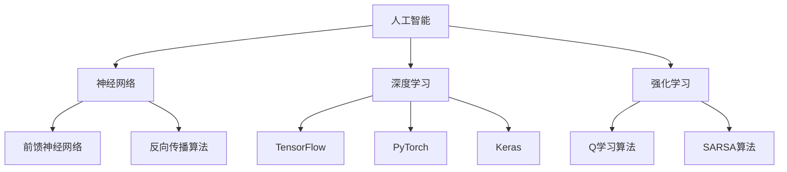

                 

### 文章标题

《人类智慧：AI 时代的新力量》

#### 关键词

人工智能，人类智慧，深度学习，强化学习，认知科学，伦理问题

#### 摘要

在人工智能飞速发展的今天，人类智慧与AI技术的结合正日益成为推动社会进步的重要力量。本文旨在探讨人类智慧与AI的关系，分析AI在模拟和扩展人类智慧方面的成就与挑战，并探讨AI时代的新力量如何影响医疗、教育、商业、安全等领域。同时，本文还将探讨AI时代的伦理与法律问题，以及对其未来的展望。

## 《人类智慧：AI 时代的新力量》

### 第1章 引言

#### 1.1 AI时代的来临

人工智能（AI）的起源可以追溯到20世纪50年代，当时科学家们首次提出了“人工智能”这一概念。从最初的符号推理到后来的机器学习，人工智能经历了数十年的发展。随着深度学习等技术的突破，AI逐渐从实验室走向实际应用，对人类社会产生了深远的影响。

AI技术的快速发展主要得益于以下几个因素：

1. **计算能力的提升**：随着计算能力的提高，复杂的AI算法得以高效运行，大幅提升了AI的性能。
2. **大数据的普及**：海量数据的积累为AI算法提供了丰富的训练素材，促进了AI技术的进步。
3. **算法的优化**：深度学习、强化学习等算法的优化，使得AI在视觉识别、自然语言处理等领域取得了显著的突破。

AI对人类社会的影响主要体现在以下几个方面：

1. **产业变革**：AI技术改变了传统产业的运营模式，提高了生产效率，降低了成本。
2. **日常生活**：AI已经深入到我们的日常生活中，从智能助手到智能家居，AI无处不在。
3. **社会管理**：AI技术在医疗、交通、金融等领域的应用，提高了社会管理的效率和质量。

#### 1.2 人类智慧与AI的关系

人类智慧是指人类在认知、思维、情感、创造力等方面表现出的复杂能力。而AI技术则通过模拟人类智慧的各种机制，试图实现与人类相似的智能水平。

1. **人类智慧的特点**：

   - **认知灵活性**：人类能够根据不同的情境和问题灵活调整思维模式。
   - **创造力**：人类能够产生新颖的想法和解决方案。
   - **情感与社交**：人类能够理解并表达情感，进行有效的社交互动。

2. **AI如何模拟人类智慧**：

   - **神经网络**：通过模拟人脑的结构和功能，神经网络实现了对数据的自动学习和分类。
   - **机器学习**：通过算法学习大量数据，机器学习使得计算机能够识别模式和进行预测。
   - **自然语言处理**：通过算法模拟人类的语言理解与表达，自然语言处理使得计算机能够理解并生成自然语言。

3. **人类智慧与AI的互补性**：

   - **分工协作**：AI擅长处理海量数据和复杂计算，而人类智慧则擅长创新和决策。
   - **知识扩展**：AI可以快速获取和积累知识，而人类智慧则能够在已有知识的基础上进行创新。

#### 1.3 书籍结构概述

全书共分为七个章节，主要内容包括：

- **第1章 引言**：介绍AI时代的来临、人类智慧与AI的关系，以及本书的结构概述。
- **第2章 AI基础理论**：详细阐述人工智能的定义、神经网络原理、深度学习框架和强化学习。
- **第3章 人类智慧的构成**：分析认知科学基础、语言与思维、情感与情绪、创造力与直觉。
- **第4章 AI模拟人类智慧**：探讨语言理解与生成、决策与推理、创造性与想象力、情感识别与表达。
- **第5章 AI时代的新力量**：分析AI在医疗、教育、商业、安全领域的应用。
- **第6章 AI时代的伦理与法律**：讨论AI伦理问题、AI法律规范和AI与人工智能伦理。
- **第7章 AI时代的未来展望**：展望AI技术发展趋势、AI对人类生活的影响以及AI与人类智慧的未来。

## 第2章 AI基础理论

#### 2.1 人工智能的定义

人工智能（Artificial Intelligence，简称AI）是指由人制造出来的系统所表现出来的智能行为。根据不同的定义和分类，人工智能可以分为以下几种类型：

1. **弱人工智能（Narrow AI）**：

   弱人工智能是指专注于特定任务的AI系统，如语音识别、图像识别、自然语言处理等。这些系统在特定领域内表现出高水平的智能，但无法进行跨领域的智能行为。

2. **强人工智能（General AI）**：

   强人工智能是指具有广泛智能的AI系统，能够在各种领域内进行智能行为，具备与人类相似的认知能力和思维能力。目前，强人工智能仍处于理论阶段，尚未实现。

3. **超人工智能（Super AI）**：

   超人工智能是指超越人类智能的AI系统，能够在所有领域内进行智能行为，甚至能够自我改进和学习。超人工智能的存在尚未得到证实，但许多科学家和哲学家认为它可能在未来实现。

#### 2.2 神经网络原理

神经网络（Neural Network）是模拟人脑神经元之间连接和交互的人工智能模型。神经网络的基本概念包括：

1. **神经元**：神经元是神经网络的基本单元，用于接收和处理信息。
2. **连接权重**：神经元之间的连接带有权重，表示连接的强度。
3. **激活函数**：激活函数用于决定神经元是否被激活，常见的激活函数包括Sigmoid函数、ReLU函数等。

神经网络的工作原理可以分为以下几个步骤：

1. **前向传播**：输入数据通过神经网络的前向传播过程，逐层传递到每个神经元，最终输出结果。
2. **反向传播**：根据输出结果与实际结果的误差，反向传播误差信息，调整神经元的连接权重，以优化网络性能。

#### 2.3 深度学习框架

深度学习（Deep Learning）是一种基于神经网络的高级机器学习技术，通过多层神经网络结构来提取数据特征。主流的深度学习框架包括：

1. **TensorFlow**：由谷歌开发的开源深度学习框架，支持多种深度学习模型和算法。
2. **PyTorch**：由Facebook开发的开源深度学习框架，以动态图计算著称，易于实现和调试。
3. **Keras**：基于TensorFlow和Theano的开源深度学习框架，提供简洁的API和丰富的预训练模型。

深度学习框架的使用场景主要包括：

1. **计算机视觉**：用于图像分类、目标检测、人脸识别等任务。
2. **自然语言处理**：用于文本分类、机器翻译、情感分析等任务。
3. **语音识别**：用于语音信号处理、语音合成等任务。

#### 2.4 强化学习

强化学习（Reinforcement Learning，简称RL）是一种通过不断试错和反馈来学习最优策略的机器学习技术。强化学习的基本概念包括：

1. **环境**：强化学习中的环境是指系统所处的状态和动作空间。
2. **状态**：状态是指系统当前所处的状态，通常用向量表示。
3. **动作**：动作是指系统可以采取的行为，通常用向量表示。
4. **奖励**：奖励是指系统在采取特定动作后获得的奖励，用于指导学习过程。

强化学习算法可以分为以下几种：

1. **Q学习算法**：Q学习是一种基于价值函数的强化学习算法，通过迭代更新价值函数，找到最优策略。
2. **SARSA算法**：SARSA是一种基于策略的强化学习算法，通过迭代更新策略，找到最优策略。

### 2.5 AI基础理论的联系与扩展

为了更好地理解AI基础理论，我们可以使用Mermaid流程图来展示各个概念之间的联系和扩展。



通过这个流程图，我们可以清晰地看到AI基础理论之间的联系和扩展，为后续章节的内容奠定了基础。

### 核心概念与联系

在理解AI基础理论的过程中，以下几个核心概念和联系是至关重要的：

1. **神经网络与深度学习的联系**：

   神经网络是深度学习的基础，而深度学习则是神经网络在多层结构上的扩展。通过多层神经网络，深度学习能够提取更加复杂和抽象的特征，从而提高模型的性能。

2. **强化学习与其他机器学习技术的区别**：

   强化学习与其他机器学习技术（如监督学习和无监督学习）的区别在于其基于环境反馈进行学习。强化学习通过不断尝试和反馈，寻找最优策略，而其他机器学习技术则是通过已有数据进行模式识别和分类。

3. **神经网络与生物神经系统的相似性**：

   神经网络试图模拟生物神经系统的结构和功能，包括神经元之间的连接、激活函数和反向传播算法。这些模拟使得神经网络能够处理复杂的数据和任务，成为AI领域的重要工具。

通过上述核心概念和联系，我们可以更好地理解AI基础理论，为后续章节的内容做好准备。

### 核心算法原理讲解

在AI基础理论中，核心算法的原理讲解是理解和应用AI技术的关键。以下将分别使用伪代码详细阐述神经网络、深度学习和强化学习的基本算法原理。

#### 神经网络

神经网络的基本算法包括前向传播和反向传播。以下是使用伪代码表示的前向传播和反向传播算法：

```python
# 前向传播伪代码
def forward_propagation(x, weights, biases):
    z = [x * weights + biases]  # 初始化z为输入乘以权重加上偏置
    a = [1 / (1 + exp(-z))]  # 初始化a为激活值，使用Sigmoid函数
    return a

# 反向传播伪代码
def backward_propagation(a, z, dervatives_of_a, dervatives_of_z):
    delta = [dervatives_of_a * (1 - a) * a]  # 初始化delta
    dervatives_of_weights = [delta * a]  # 初始化权重偏置的导数
    dervatives_of_biases = [delta]  # 初始化偏置的导数
    return dervatives_of_weights, dervatives_of_biases
```

#### 深度学习

深度学习通常涉及多层神经网络的训练。以下是使用伪代码表示的基于梯度下降的深度学习训练过程：

```python
# 梯度下降伪代码
def train_network(inputs, targets, epochs, learning_rate):
    for epoch in range(epochs):
        for x, y in dataset:
            a = forward_propagation(x, weights, biases)
            z = compute_loss(a, y)
            dervatives_of_weights, dervatives_of_biases = backward_propagation(a, z, dervatives_of_a, dervatives_of_z)
            update_weights_and_biases(weights, biases, dervatives_of_weights, dervatives_of_biases, learning_rate)
    return weights, biases
```

#### 强化学习

强化学习的基本算法包括Q学习和SARSA算法。以下是使用伪代码表示的Q学习和SARSA算法：

```python
# Q学习伪代码
def q_learning(states, actions, rewards, next_states, learning_rate, discount_factor):
    for state, action, reward, next_state in experience Replay Memory:
        Q[s][a] = Q[s][a] + learning_rate * (reward + discount_factor * max(Q[next_state].values()) - Q[s][a])
    return Q

# SARSA算法伪代码
def sarsa_learning(states, actions, rewards, next_states, learning_rate, discount_factor):
    for state, action, reward, next_action, next_state in experience Replay Memory:
        Q[s][a] = Q[s][a] + learning_rate * (reward + discount_factor * Q[next_state][next_action] - Q[s][a])
    return Q
```

通过上述伪代码，我们可以清晰地看到神经网络、深度学习和强化学习的基本算法原理。这些算法构成了AI技术的基础，为后续的应用提供了强大的支持。

### 数学模型和公式

在AI基础理论中，数学模型和公式是理解和应用AI技术的关键。以下将详细介绍神经网络、深度学习和强化学习中的关键数学模型和公式，并通过具体例子进行详细讲解。

#### 神经网络

1. **前向传播公式**

   在神经网络的前向传播过程中，每个神经元的输出可以通过以下公式计算：

   $$
   z_i = \sum_j w_{ij} x_j + b_i
   $$

   其中，$z_i$ 表示神经元 $i$ 的输入，$w_{ij}$ 表示从神经元 $j$ 到神经元 $i$ 的权重，$x_j$ 表示神经元 $j$ 的输出，$b_i$ 表示神经元 $i$ 的偏置。

   例如，对于一个有两个输入神经元和一个输出神经元的神经网络，前向传播公式可以表示为：

   $$
   z_1 = w_{11} x_1 + w_{12} x_2 + b_1
   $$

   $$
   z_2 = w_{21} x_1 + w_{22} x_2 + b_2
   $$

   $$
   a_2 = \frac{1}{1 + e^{-z_2}}
   $$

2. **反向传播公式**

   在神经网络的反向传播过程中，每个神经元的权重和偏置的更新可以通过以下公式计算：

   $$
   \delta_i = (1 - a_i) \cdot a_i \cdot \frac{dC}{dz_i}
   $$

   $$
   \frac{dw_{ij}}{dz_i} = x_j \cdot \delta_i
   $$

   $$
   \frac{db_i}{dz_i} = \delta_i
   $$

   其中，$\delta_i$ 表示神经元 $i$ 的误差项，$a_i$ 表示神经元 $i$ 的输出，$dC/dz_i$ 表示损失函数关于 $z_i$ 的导数。

   例如，对于一个有两个输入神经元和一个输出神经元的神经网络，反向传播公式可以表示为：

   $$
   \delta_1 = (1 - a_1) \cdot a_1 \cdot \frac{dC}{dz_1}
   $$

   $$
   \delta_2 = (1 - a_2) \cdot a_2 \cdot \frac{dC}{dz_2}
   $$

   $$
   \frac{dw_{11}}{dz_1} = x_1 \cdot \delta_1
   $$

   $$
   \frac{dw_{12}}{dz_1} = x_2 \cdot \delta_1
   $$

   $$
   \frac{dw_{21}}{dz_2} = x_1 \cdot \delta_2
   $$

   $$
   \frac{dw_{22}}{dz_2} = x_2 \cdot \delta_2
   $$

#### 深度学习

1. **损失函数**

   在深度学习中，常用的损失函数有均方误差（MSE）和交叉熵（Cross Entropy）。以下分别介绍这两种损失函数的公式：

   - **均方误差（MSE）**

     $$
     MSE = \frac{1}{m} \sum_{i=1}^{m} (y_i - \hat{y}_i)^2
     $$

     其中，$y_i$ 表示实际输出，$\hat{y}_i$ 表示预测输出，$m$ 表示样本数量。

     例如，对于一个有两个输出神经元和一个输入神经元的神经网络，MSE可以表示为：

     $$
     MSE = \frac{1}{2} \left( (y_1 - \hat{y}_1)^2 + (y_2 - \hat{y}_2)^2 \right)
     $$

   - **交叉熵（Cross Entropy）**

     $$
     CE = - \frac{1}{m} \sum_{i=1}^{m} y_i \log(\hat{y}_i)
     $$

     其中，$y_i$ 表示实际输出，$\hat{y}_i$ 表示预测输出，$m$ 表示样本数量。

     例如，对于一个有两个输出神经元和一个输入神经元的神经网络，交叉熵可以表示为：

     $$
     CE = - \frac{1}{2} \left( y_1 \log(\hat{y}_1) + y_2 \log(\hat{y}_2) \right)
     $$

2. **优化算法**

   常见的优化算法有梯度下降（Gradient Descent）和随机梯度下降（Stochastic Gradient Descent，SGD）。以下分别介绍这两种优化算法的公式：

   - **梯度下降**

     $$
     w_{new} = w_{old} - \alpha \cdot \frac{dC}{dw}
     $$

     其中，$w_{old}$ 表示当前权重，$w_{new}$ 表示更新后的权重，$\alpha$ 表示学习率，$dC/dw$ 表示损失函数关于权重的导数。

     例如，对于一个有两个输入神经元和一个输出神经元的神经网络，梯度下降可以表示为：

     $$
     w_{11\_new} = w_{11\_old} - \alpha \cdot \frac{dC}{dw_{11}}
     $$

     $$
     w_{12\_new} = w_{12\_old} - \alpha \cdot \frac{dC}{dw_{12}}
     $$

     $$
     w_{21\_new} = w_{21\_old} - \alpha \cdot \frac{dC}{dw_{21}}
     $$

     $$
     w_{22\_new} = w_{22\_old} - \alpha \cdot \frac{dC}{dw_{22}}
     $$

   - **随机梯度下降**

     $$
     w_{new} = w_{old} - \alpha \cdot \frac{dC}{dw}
     $$

     其中，$w_{old}$ 表示当前权重，$w_{new}$ 表示更新后的权重，$\alpha$ 表示学习率，$dC/dw$ 表示损失函数关于权重的导数。

     例如，对于一个有两个输入神经元和一个输出神经元的神经网络，随机梯度下降可以表示为：

     $$
     w_{11\_new} = w_{11\_old} - \alpha \cdot \frac{dC}{dw_{11}}
     $$

     $$
     w_{12\_new} = w_{12\_old} - \alpha \cdot \frac{dC}{dw_{12}}
     $$

     $$
     w_{21\_new} = w_{21\_old} - \alpha \cdot \frac{dC}{dw_{21}}
     $$

     $$
     w_{22\_new} = w_{22\_old} - \alpha \cdot \frac{dC}{dw_{22}}
     $$

#### 强化学习

1. **Q学习**

   Q学习的目标是最小化以下损失函数：

   $$
   J = \sum_{s} \sum_{a} Q(s, a) - r(s, a)
   $$

   其中，$Q(s, a)$ 表示状态-动作值函数，$r(s, a)$ 表示在状态 $s$ 执行动作 $a$ 后的即时奖励。

   例如，对于状态 $s_1$ 和动作 $a_1$，Q学习的损失函数可以表示为：

   $$
   J = Q(s_1, a_1) - r(s_1, a_1)
   $$

2. **SARSA**

   SARSA算法的目标是最小化以下损失函数：

   $$
   J = \sum_{s} \sum_{a} \sum_{s'} Q(s, a) - r(s, a) - \gamma \cdot max(Q(s', a'))
   $$

   其中，$Q(s, a)$ 表示状态-动作值函数，$r(s, a)$ 表示在状态 $s$ 执行动作 $a$ 后的即时奖励，$\gamma$ 表示折扣因子，$max(Q(s', a'))$ 表示在状态 $s'$ 下执行动作 $a'$ 后的最大Q值。

   例如，对于状态 $s_1$、动作 $a_1$ 和状态 $s_2$，SARSA算法的损失函数可以表示为：

   $$
   J = Q(s_1, a_1) - r(s_1, a_1) - \gamma \cdot max(Q(s_2, a_1'), Q(s_2, a_2'))
   $$

通过上述数学模型和公式的详细讲解，我们可以更好地理解神经网络、深度学习和强化学习的基本原理，为后续章节的内容奠定坚实的基础。

### 项目实战

为了更好地理解AI基础理论，我们可以通过一个具体的代码实例来展示神经网络、深度学习和强化学习在实际应用中的实现过程。以下将使用Python和常见AI库（如TensorFlow和PyTorch）来搭建一个简单的神经网络模型，并进行训练和评估。

#### 开发环境搭建

首先，我们需要搭建一个Python开发环境，并安装所需的AI库。以下是安装过程：

```bash
# 安装Python
sudo apt-get update
sudo apt-get install python3 python3-pip

# 安装TensorFlow
pip3 install tensorflow

# 安装PyTorch
pip3 install torch torchvision
```

#### 神经网络模型

以下是一个简单的神经网络模型，用于实现手写数字识别任务：

```python
import tensorflow as tf

# 创建模型
model = tf.keras.Sequential([
    tf.keras.layers.Flatten(input_shape=(28, 28)),
    tf.keras.layers.Dense(128, activation='relu'),
    tf.keras.layers.Dense(10, activation='softmax')
])

# 编译模型
model.compile(optimizer='adam',
              loss='sparse_categorical_crossentropy',
              metrics=['accuracy'])

# 打印模型结构
model.summary()
```

#### 数据预处理

接下来，我们需要下载并预处理MNIST手写数字数据集。以下是数据预处理的过程：

```python
# 导入数据集
mnist = tf.keras.datasets.mnist
(train_images, train_labels), (test_images, test_labels) = mnist.load_data()

# 数据归一化
train_images = train_images / 255.0
test_images = test_images / 255.0

# 打印数据集大小
print("Training set size:", train_images.shape)
print("Test set size:", test_images.shape)
```

#### 训练模型

使用预处理后的数据集训练神经网络模型：

```python
# 训练模型
model.fit(train_images, train_labels, epochs=5)

# 评估模型
test_loss, test_acc = model.evaluate(test_images, test_labels)
print("Test accuracy:", test_acc)
```

#### 代码解读与分析

1. **模型搭建**：

   - `tf.keras.Sequential`：创建一个序列模型，可以逐层添加神经网络层。
   - `tf.keras.layers.Flatten`：将输入数据展平为一维数组，方便后续处理。
   - `tf.keras.layers.Dense`：创建全连接层，其中`128`表示神经元个数，`activation='relu'`表示使用ReLU激活函数，`10`表示输出层的神经元个数，`activation='softmax'`表示使用softmax激活函数。

2. **模型编译**：

   - `optimizer='adam'`：使用Adam优化器进行模型训练。
   - `loss='sparse_categorical_crossentropy'`：使用稀疏分类交叉熵作为损失函数。
   - `metrics=['accuracy']`：将准确率作为模型评估指标。

3. **数据预处理**：

   - `tf.keras.datasets.mnist`：导入MNIST手写数字数据集。
   - `train_images / 255.0`：将输入数据归一化到[0, 1]范围内，以加速模型收敛。
   - `test_images / 255.0`：将测试数据归一化到[0, 1]范围内。

4. **训练模型**：

   - `model.fit()`：使用训练数据集训练模型，`epochs=5`表示训练5个周期。
   - `model.evaluate()`：使用测试数据集评估模型性能，返回测试损失和准确率。

通过上述实例，我们可以看到如何使用Python和常见AI库搭建一个简单的神经网络模型，并进行训练和评估。这个实例展示了AI基础理论在实际应用中的具体实现过程，为后续的深入学习提供了实践基础。

### 第3章 人类智慧的构成

#### 3.1 认知科学基础

认知科学是一门研究人类思维和智能的跨学科领域，它结合了心理学、神经科学、计算机科学和哲学等多个学科。认知科学的主要目标是理解人类是如何获取、处理和应用知识的，以及这些过程是如何在大脑中实现的。

1. **认知科学的研究领域**：

   - **感知**：研究人类如何感知外部世界，包括视觉、听觉、触觉、嗅觉和味觉等。
   - **记忆**：研究人类如何存储、检索和使用信息。
   - **注意力**：研究人类在处理信息时如何分配注意力。
   - **思维**：研究人类如何推理、解决问题和进行决策。
   - **语言**：研究人类如何学习和使用语言。

2. **神经科学对认知的启示**：

   - **神经元模型**：认知科学借鉴神经科学中的神经元模型，将思维过程视为大脑中的神经元活动。
   - **神经网络**：神经网络是认知科学中用于模拟大脑处理信息方式的一种模型。
   - **脑成像技术**：如功能性磁共振成像（fMRI）等技术，可以帮助认知科学家研究大脑在不同认知任务中的活动模式。

#### 3.2 语言与思维

语言是人类思维的重要工具，它不仅用于交流，还在思维过程中起到关键作用。

1. **语言的本质**：

   - **符号系统**：语言是一种符号系统，通过词汇和语法规则来表达意义。
   - **抽象性**：语言能够抽象地表达概念和关系，使人类能够进行抽象思维。
   - **创造性**：语言具有创造性，人类可以通过语言创造出新的概念和想法。

2. **思维过程中的语言作用**：

   - **概念形成**：语言帮助人类形成和定义概念。
   - **逻辑推理**：语言是人类进行逻辑推理的基础。
   - **问题解决**：语言帮助人类分析和解决复杂问题。
   - **情感表达**：语言是人类表达情感和社交互动的重要方式。

#### 3.3 情感与情绪

情感与情绪是认知科学中的重要研究领域，它们对人类的行为和思维有深远的影响。

1. **情感的定义**：

   - **情感**：情感是一种复杂的心理体验，包括认知、生理和行为反应。
   - **情绪**：情绪是一种短期的、强烈的情感反应，通常与特定情境相关。

2. **情绪的类型与作用**：

   - **基本情绪**：如快乐、愤怒、悲伤、恐惧等。
   - **复杂情绪**：如爱、厌恶、羞耻等。
   - **情绪调节**：情绪对人类的行为和思维有调节作用，如激励行为、影响决策和社交互动。

#### 3.4 创造力与直觉

创造力与直觉是认知科学中另外两个重要领域，它们对人类的创新和发展至关重要。

1. **创造力的定义与培养**：

   - **定义**：创造力是指产生新颖、有价值想法的能力。
   - **培养**：创造力的培养包括训练思维的灵活性、开放性和联想能力。

2. **直觉的作用与产生机制**：

   - **作用**：直觉在快速决策和问题解决中起到关键作用。
   - **产生机制**：直觉可能源于长期的训练和经验积累，以及大脑中的模式识别和联想机制。

### 核心概念与联系

在理解人类智慧的构成过程中，以下几个核心概念和联系是至关重要的：

1. **认知科学、神经科学与计算机科学的联系**：

   认知科学借鉴神经科学的神经元模型，结合计算机科学的方法和技术，试图模拟和解释人类智能。计算机科学中的神经网络模型和算法为认知科学研究提供了强大的工具。

2. **语言与思维的互动**：

   语言不仅是沟通的工具，还在思维过程中起到关键作用。通过语言，人类能够抽象地表达概念和关系，进行逻辑推理和问题解决。

3. **情感、情绪与创造力**：

   情感与情绪对人类的行为和思维有重要影响，同时创造力与直觉在问题解决和创新中起到关键作用。这三者共同构成了人类智慧的重要组成部分。

通过上述核心概念和联系，我们可以更好地理解人类智慧的构成，为后续章节的内容奠定基础。

### 第4章 AI模拟人类智慧

#### 4.1 语言理解与生成

在人工智能领域，语言理解与生成是两个重要的研究方向。通过语言理解，AI能够理解人类输入的文本，而通过语言生成，AI能够生成自然流畅的文本。以下将详细探讨这些技术的基础、实现方法及应用。

##### 4.1.1 自然语言处理的基础

自然语言处理（Natural Language Processing，NLP）是AI的核心研究领域之一，主要研究如何让计算机理解和生成自然语言。NLP的基础技术包括：

1. **词法分析**：将文本分解成单词、词组或标记，以便后续处理。
2. **句法分析**：分析句子的结构，确定单词之间的语法关系。
3. **语义分析**：理解文本中的含义，包括单词的含义、句子之间的逻辑关系等。
4. **情感分析**：判断文本中的情感倾向，如正面、负面或中性。

##### 4.1.2 机器翻译技术

机器翻译是指利用计算机技术将一种自然语言文本翻译成另一种自然语言。机器翻译的主要方法包括：

1. **规则翻译**：基于规则的方法，通过编写大量的语法规则和翻译规则进行翻译。
2. **基于实例的翻译**：通过查找和匹配已有翻译实例进行翻译。
3. **统计机器翻译**：使用统计学方法，如隐马尔可夫模型（HMM）和条件概率模型，根据输入文本的统计特性进行翻译。
4. **神经机器翻译**：基于深度学习的方法，使用神经网络模型进行翻译，特别是基于注意力机制的序列到序列（Seq2Seq）模型，如循环神经网络（RNN）和Transformer。

以下是一个简单的神经机器翻译模型的实现示例（使用TensorFlow和PyTorch）：

```python
# 使用TensorFlow实现神经机器翻译
import tensorflow as tf

# 创建模型
model = tf.keras.Sequential([
    tf.keras.layers.Embedding(input_dim=vocab_size, output_dim=embedding_dim),
    tf.keras.layers.LSTM(units=hidden_size),
    tf.keras.layers.Dense(units=target_vocab_size)
])

# 编译模型
model.compile(optimizer='adam', loss='categorical_crossentropy', metrics=['accuracy'])

# 训练模型
model.fit(input_sequences, target_sequences, epochs=10)

# 评估模型
test_loss, test_acc = model.evaluate(test_input_sequences, test_target_sequences)
print("Test accuracy:", test_acc)
```

##### 4.1.3 聊天机器人

聊天机器人是NLP技术在实际应用中的一个重要领域。通过对话系统，聊天机器人能够与用户进行自然语言交互，提供信息或服务。

1. **基于规则的聊天机器人**：通过预定义的规则和模板，聊天机器人能够生成回复。
2. **基于模板的聊天机器人**：使用模板和填充词来生成回复。
3. **基于机器学习的聊天机器人**：使用NLP技术，如序列到序列（Seq2Seq）模型、循环神经网络（RNN）和Transformer，进行对话生成。

以下是一个简单的基于机器学习的聊天机器人实现示例：

```python
# 使用PyTorch实现聊天机器人
import torch
import torch.nn as nn

# 创建模型
class ChatBotModel(nn.Module):
    def __init__(self, input_dim, hidden_dim, output_dim):
        super(ChatBotModel, self).__init__()
        self.lstm = nn.LSTM(input_dim, hidden_dim)
        self.fc = nn.Linear(hidden_dim, output_dim)
        
    def forward(self, x):
        x, _ = self.lstm(x)
        x = self.fc(x[-1, :, :])
        return x

# 初始化模型
model = ChatBotModel(input_dim=50, hidden_dim=100, output_dim=50)

# 训练模型
optimizer = torch.optim.Adam(model.parameters(), lr=0.001)
for epoch in range(num_epochs):
    for input_seq, target_seq in dataset:
        model.zero_grad()
        output = model(input_seq)
        loss = nn.CrossEntropyLoss()(output, target_seq)
        loss.backward()
        optimizer.step()

# 评估模型
with torch.no_grad():
    for input_seq, target_seq in test_dataset:
        output = model(input_seq)
        print("Input:", input_seq)
        print("Expected:", target_seq)
        print("Output:", output)
```

通过上述实现示例，我们可以看到如何使用NLP技术构建聊天机器人和机器翻译模型，这些技术在现实应用中具有广泛的应用前景。

#### 4.2 决策与推理

决策与推理是人工智能中非常重要的研究领域，它们涉及到AI系统如何处理信息、作出决策以及进行推理。以下将详细探讨决策理论、推理算法以及模式识别技术。

##### 4.2.1 决策理论

决策理论是研究个体或系统如何在不确定性和风险下作出合理决策的学科。决策理论主要包括以下几个方面：

1. **效用理论**：效用理论研究个体在不同情况下的偏好和选择。一个常见的效用函数是期望效用函数，表示个体在不同情况下的期望效用：

   $$
   U(A) = \sum_{s} p(s) \cdot u(A, s)
   $$

   其中，$A$ 表示决策，$s$ 表示状态，$p(s)$ 表示状态 $s$ 发生的概率，$u(A, s)$ 表示在状态 $s$ 下采取决策 $A$ 的效用。

2. **风险理论**：风险理论关注个体如何在不确定的情况下评估和选择决策。常见的风险度量包括期望值、方差和条件方差。

3. **期望最大化（EM）算法**：期望最大化算法是一种用于参数估计的迭代算法，通过交替优化期望值和最大化步骤来估计模型参数。

##### 4.2.2 推理算法

推理算法是人工智能系统中用于处理信息和推导结论的方法。常见的推理算法包括：

1. **演绎推理**：演绎推理是从一般到特殊的推理方法，它基于一系列前提（假设）推导出结论。例如，如果所有的人都会死亡，苏格拉底是人，那么苏格拉底会死亡。

   演绎推理的公式表示为：

   $$
   P \land Q \Rightarrow R
   $$

   其中，$P$ 和 $Q$ 表示前提，$R$ 表示结论。

2. **归纳推理**：归纳推理是从特殊到一般的推理方法，它基于一系列特定实例推导出一般规律。例如，观察许多天鹅都是白色的，推断所有天鹅都是白色的。

   归纳推理的公式表示为：

   $$
   C_1, C_2, ..., C_n \Rightarrow H
   $$

   其中，$C_1, C_2, ..., C_n$ 表示特定实例，$H$ 表示一般规律。

3. **模糊推理**：模糊推理是处理模糊性和不确定性的推理方法。它基于模糊逻辑，将模糊集合和模糊关系应用于推理过程。

   模糊推理的公式表示为：

   $$
   IF A THEN B
   $$

   其中，$A$ 表示前提，$B$ 表示结论。

##### 4.2.3 模式识别

模式识别是人工智能中用于识别和分析数据中模式的方法。常见的模式识别技术包括：

1. **监督学习**：监督学习是一种基于已有标签数据来训练模型的方法。常见的监督学习算法包括线性回归、决策树、支持向量机和神经网络。

   监督学习的基本流程包括：

   - 数据收集和预处理：收集并预处理训练数据。
   - 模型训练：使用训练数据训练模型。
   - 模型评估：使用测试数据评估模型性能。

2. **无监督学习**：无监督学习是一种不使用标签数据来训练模型的方法。常见的无监督学习算法包括聚类、降维和生成模型。

   无监督学习的基本流程包括：

   - 数据收集和预处理：收集并预处理数据。
   - 模型训练：使用无监督学习算法训练模型。
   - 模型评估：使用可视化或其他方法评估模型性能。

3. **深度学习**：深度学习是一种基于多层神经网络的高级机器学习技术。常见的深度学习模型包括卷积神经网络（CNN）、循环神经网络（RNN）和生成对抗网络（GAN）。

   深度学习的基本流程包括：

   - 数据收集和预处理：收集并预处理数据。
   - 模型设计：设计并实现深度学习模型。
   - 模型训练：使用训练数据训练模型。
   - 模型评估：使用测试数据评估模型性能。

##### 实例：决策树

以下是一个简单的决策树实现的示例：

```python
import numpy as np
import pandas as pd

# 数据准备
data = pd.DataFrame({
    'feature1': [1, 1, 0, 0],
    'feature2': [0, 1, 1, 0],
    'label': [1, 0, 0, 1]
})

# 决策树分类器
from sklearn.tree import DecisionTreeClassifier

# 训练模型
model = DecisionTreeClassifier()
model.fit(data[['feature1', 'feature2']], data['label'])

# 预测
print(model.predict([[1, 0]]))
```

通过上述实例，我们可以看到如何使用决策树进行分类任务，这展示了决策与推理技术在实际应用中的实现过程。

### 4.3 创造性与想象力

创造性与想象力是人类智慧的重要组成部分，它们在艺术、科学、技术等领域中发挥着关键作用。在人工智能时代，AI也在尝试模拟和扩展人类的创造力与想象力。

##### 4.3.1 AI的创造力表现

AI的创造力主要体现在以下几个方面：

1. **艺术创作**：AI可以通过生成对抗网络（GAN）等算法生成艺术作品，如绘画、音乐和文学。例如，GAN可以将两个不同的数据分布（如动物和景观）融合，创造出独特的艺术作品。
2. **科学发现**：AI在科学研究中也展现出了创造力，如在药物发现、蛋白质折叠预测和天体物理学等领域。AI可以通过深度学习模型分析和处理大量数据，发现新的科学规律。
3. **工程设计**：AI可以帮助设计师生成新的设计，如建筑、机械和电子产品。通过进化算法和神经网络，AI可以优化设计，提高性能和效率。

##### 4.3.2 想象力与AI模拟

想象力是人类产生创新想法和解决问题的重要工具，而AI也在尝试模拟和扩展人类的想象力。

1. **场景生成**：AI可以通过生成模型生成虚拟场景，如电影场景、游戏世界和城市规划。这些场景可以用于电影制作、游戏开发和城市规划等领域。
2. **故事创作**：AI可以通过自然语言处理技术生成故事，如科幻小说、童话故事和新闻报道。这些故事可以用于文学创作、媒体制作和娱乐产业。
3. **虚拟现实**：AI可以帮助构建虚拟现实环境，如虚拟旅游、虚拟购物和虚拟培训。这些环境可以用于教育、娱乐和培训等领域。

##### 实例：生成艺术作品

以下是一个使用生成对抗网络（GAN）生成艺术作品的实例：

```python
import tensorflow as tf
from tensorflow.keras import layers

# 创建生成器模型
def create_generator(z_dim):
    model = tf.keras.Sequential([
        layers.Dense(7 * 7 * 256, use_bias=False, input_shape=(z_dim,)),
        layers.BatchNormalization(),
        layers.LeakyReLU(),
        layers.Reshape((7, 7, 256)),
        layers.Conv2DTranspose(128, (5, 5), strides=(1, 1), padding='same', use_bias=False),
        layers.BatchNormalization(),
        layers.LeakyReLU(),
        layers.Conv2DTranspose(64, (5, 5), strides=(2, 2), padding='same', use_bias=False),
        layers.BatchNormalization(),
        layers.LeakyReLU(),
        layers.Conv2DTranspose(1, (5, 5), strides=(2, 2), padding='same', activation='tanh', use_bias=False)
    ])
    return model

# 创建判别器模型
def create_discriminator(image_shape):
    model = tf.keras.Sequential([
        layers.Conv2D(64, (5, 5), strides=(2, 2), padding='same', input_shape=image_shape, activation='leaky_relu'),
        layers.Dense(1, activation='sigmoid')
    ])
    return model

# 创建 GAN 模型
def create_gan(generator, discriminator):
    model = tf.keras.Sequential([generator, discriminator])
    return model

# 配置训练参数
z_dim = 100
image_shape = (28, 28, 1)

generator = create_generator(z_dim)
discriminator = create_discriminator(image_shape)
gan = create_gan(generator, discriminator)

# 编译模型
gan.compile(loss='binary_crossentropy', optimizer=tf.keras.optimizers.Adam(0.0001), metrics=['accuracy'])

# 训练模型
batch_size = 64
epochs = 100
for epoch in range(epochs):
    for _ in range(batch_size):
        noise = np.random.normal(0, 1, (batch_size, z_dim))
        gen_images = generator.predict(noise)
        real_images = np.random.choice(real_images, size=batch_size)
        combined_images = np.concatenate([real_images, gen_images], axis=0)
        labels = np.concatenate([np.ones(batch_size), np.zeros(batch_size)], axis=0)
        d_loss = discriminator.train_on_batch(combined_images, labels)
        noise = np.random.normal(0, 1, (batch_size, z_dim))
        g_loss = gan.train_on_batch(noise, np.ones(batch_size))
    print(f"{epoch+1}/{epochs} [D loss: {d_loss[0]}, acc: {d_loss[1]}] [G loss: {g_loss}]")
```

通过上述实例，我们可以看到如何使用生成对抗网络（GAN）生成艺术作品，这展示了AI在创造力与想象力方面的潜力。

#### 4.4 情感识别与表达

情感识别与表达是人工智能中一个重要的研究方向，它涉及到如何让AI理解和生成情感。以下将详细探讨情感识别技术、情感表达的算法以及相关的应用案例。

##### 4.4.1 情感识别技术

情感识别技术是指通过分析文本、语音或图像等数据，识别出其中蕴含的情感。以下是一些常见的情感识别技术：

1. **文本情感分析**：文本情感分析是情感识别中最常见的应用，它主要通过分析文本中的词语、句法和语义特征来识别情感。常见的文本情感分析方法包括：

   - **基于规则的方法**：通过预定义的规则和词典进行情感分析。
   - **基于机器学习的方法**：使用机器学习算法，如朴素贝叶斯、支持向量机和决策树，从大量标注数据中学习情感分类模型。
   - **基于深度学习的方法**：使用深度学习模型，如卷积神经网络（CNN）和循环神经网络（RNN），从文本中提取深层特征进行情感分析。

2. **语音情感分析**：语音情感分析是指通过分析语音信号中的情感特征，识别出说话人的情感状态。常见的语音情感分析方法包括：

   - **声学特征分析**：通过提取语音信号中的声学特征，如音高、音强和时长等，进行情感分析。
   - **基于深度学习的方法**：使用深度学习模型，如卷积神经网络（CNN）和循环神经网络（RNN），从语音信号中提取情感特征。

3. **图像情感分析**：图像情感分析是指通过分析图像中的视觉特征，识别出图像蕴含的情感。常见的图像情感分析方法包括：

   - **基于视觉特征的方法**：通过提取图像中的视觉特征，如颜色、纹理和形状等，进行情感分析。
   - **基于深度学习的方法**：使用深度学习模型，如卷积神经网络（CNN）和生成对抗网络（GAN），从图像中提取情感特征。

##### 4.4.2 情感表达的算法

情感表达算法是指如何让AI生成具有特定情感的文本、语音或图像。以下是一些常见的情感表达算法：

1. **文本情感生成**：文本情感生成是指通过算法生成具有特定情感的文本。常见的文本情感生成算法包括：

   - **基于规则的方法**：通过预定义的情感模板和词汇进行文本生成。
   - **基于生成模型的方法**：使用生成模型，如生成对抗网络（GAN）和变分自编码器（VAE），生成情感文本。

2. **语音情感生成**：语音情感生成是指通过算法生成具有特定情感的语音。常见的语音情感生成算法包括：

   - **基于合成语音的方法**：通过调整语音信号中的声学特征，如音高、音强和时长等，生成情感语音。
   - **基于深度学习的方法**：使用深度学习模型，如循环神经网络（RNN）和生成对抗网络（GAN），生成情感语音。

3. **图像情感生成**：图像情感生成是指通过算法生成具有特定情感的图像。常见的图像情感生成算法包括：

   - **基于生成模型的方法**：使用生成模型，如生成对抗网络（GAN）和变分自编码器（VAE），生成情感图像。
   - **基于图像编辑的方法**：通过图像编辑技术，如颜色调整、纹理合成和光照调整，生成情感图像。

##### 应用案例

以下是一些情感识别与表达技术的实际应用案例：

1. **社交媒体情感分析**：通过对社交媒体上的文本、语音和图像进行情感分析，可以识别用户的情感状态，用于市场分析、品牌管理和社会情绪监测。

2. **虚拟助手**：通过情感识别技术，虚拟助手可以理解用户的情感需求，生成相应的情感回复，提供个性化服务。

3. **娱乐内容创作**：通过情感表达技术，可以生成具有特定情感的文本、语音和图像，用于电影、电视剧和广告等娱乐内容创作。

4. **心理健康监测**：通过情感识别技术，可以监测个体的情感状态，用于心理健康评估和干预。

通过上述情感识别与表达技术的应用案例，我们可以看到AI在情感领域的重要作用，以及这些技术在现实世界中的广泛应用前景。

### 第5章 AI时代的新力量

#### 5.1 AI在医疗领域的应用

人工智能在医疗领域的应用正日益广泛，从诊断与预测到精准医疗，再到医疗服务智能化，AI正深刻改变着医疗行业的面貌。

1. **诊断与预测**

   - **影像诊断**：AI通过分析医学影像，如X光、CT和MRI，可以帮助医生快速准确地诊断疾病。例如，深度学习算法可以自动识别并分类肺癌、乳腺癌等疾病，提高诊断的准确性和效率。
   - **基因组分析**：AI可以处理和分析大量的基因组数据，预测个体患病的风险，帮助医生制定个性化的治疗方案。例如，通过基因测序数据，AI可以预测个体患癌症的风险，为癌症早期筛查提供依据。
   - **预测疾病进展**：AI可以通过分析患者的病史、生理参数和基因信息，预测疾病的发展趋势，为医生提供治疗决策依据。

2. **精准医疗**

   - **个性化治疗**：AI可以根据患者的基因信息、病史和生活习惯，制定个性化的治疗方案。例如，通过分析癌症患者的基因突变，AI可以推荐特定的药物组合，提高治疗效果。
   - **药物研发**：AI可以帮助加速药物研发过程，通过模拟药物与生物分子的相互作用，预测药物的疗效和安全性。例如，AI可以快速筛选出具有潜在疗效的化合物，减少药物研发的时间和成本。

3. **医疗服务智能化**

   - **智能诊断系统**：AI可以帮助医生进行影像诊断，减少误诊率，提高诊断效率。例如，AI系统可以通过分析大量医学影像数据，自动识别病变区域，辅助医生进行诊断。
   - **智能导医**：AI可以通过语音识别和自然语言处理技术，为患者提供智能导医服务。例如，患者可以通过语音询问医院信息、科室分布和医生预约等，提高就医体验。
   - **智能护理**：AI可以通过智能机器人实现病房护理、患者监护和康复指导等功能，提高护理效率和质量。例如，智能护理机器人可以帮助护理人员监测患者的生命体征，提供康复训练方案。

#### 5.2 AI在教育领域的应用

人工智能在教育领域的应用正在改变传统的教学模式和学习方式，从个性化学习到自动评分与反馈，再到教育资源的优化配置，AI正推动教育行业的革新。

1. **个性化学习**

   - **学习路径推荐**：AI可以根据学生的学习行为、兴趣和成绩，推荐个性化的学习资源和学习路径。例如，通过分析学生的学习数据，AI可以为每个学生量身定制学习计划，提高学习效果。
   - **智能辅导**：AI可以通过自然语言处理和机器学习技术，为学生提供智能辅导服务。例如，学生可以通过智能辅导系统进行在线问答，获得即时解答和指导。
   - **自适应学习**：AI可以根据学生的学习进度和能力，调整学习内容和难度，实现自适应学习。例如，通过分析学生的答题情况，AI可以动态调整题目难度，提高学生的参与度和学习效果。

2. **自动评分与反馈**

   - **自动评分系统**：AI可以通过自然语言处理和图像识别技术，自动评分学生的作业和考试。例如，AI可以自动批改作文、阅读理解和数学题目，提高评分的效率和准确性。
   - **即时反馈**：AI可以为学生提供即时反馈，帮助学生发现学习中的问题并改正错误。例如，通过智能辅导系统，学生可以即时收到答题反馈，了解自己的学习状况和改进方向。

3. **教育资源的优化配置**

   - **资源推荐**：AI可以通过分析学生的需求和资源的使用情况，推荐合适的教育资源。例如，AI可以根据学生的学习兴趣和成绩，推荐相关的课程、书籍和视频，提高资源利用效率。
   - **智能课堂**：AI可以通过智能传感器和监控系统，实现智能课堂管理。例如，AI可以监控学生的出勤率、课堂参与度和学习状态，为教师提供教学决策依据。
   - **教育资源共享**：AI可以通过数据分析和技术手段，优化教育资源的分配和使用。例如，AI可以分析学校的教学资源使用情况，提出资源调配建议，提高教育资源的使用效率。

通过上述AI在教育领域的应用，我们可以看到AI如何改变传统的教育模式，提高教学效果和学习体验。AI在教育领域的广泛应用，将为培养未来人才和社会发展做出重要贡献。

### 5.3 AI在商业领域的应用

人工智能在商业领域的应用日益广泛，从供应链管理到风险控制，再到智能客服，AI正在改变传统商业运作模式，提高效率和决策质量。

1. **供应链管理**

   - **需求预测**：AI可以通过分析历史销售数据、市场趋势和外部环境因素，预测未来的需求，优化库存和供应链管理。例如，通过深度学习算法，AI可以准确预测商品的销售量，减少库存积压和缺货情况。
   - **物流优化**：AI可以通过优化算法，优化物流路线和运输方式，提高物流效率。例如，通过路径规划算法，AI可以找到最短的物流路径，减少运输时间和成本。
   - **供应链可视化**：AI可以通过数据分析和可视化技术，实现供应链的可视化管理。例如，通过大数据分析和可视化工具，AI可以实时监控供应链中的各个环节，提高供应链的透明度和可控性。

2. **风险控制**

   - **欺诈检测**：AI可以通过机器学习和大数据分析技术，识别和检测金融交易中的欺诈行为。例如，通过分析交易数据和行为特征，AI可以自动识别异常交易，减少金融损失。
   - **信用评估**：AI可以通过分析个人或企业的历史数据、行为特征和信用记录，评估信用风险。例如，通过信用评分模型，AI可以准确预测个人或企业的信用风险，为金融机构提供决策依据。
   - **市场风险预测**：AI可以通过分析市场数据、宏观经济指标和行业趋势，预测市场风险。例如，通过时间序列分析和机器学习算法，AI可以预测股票市场的波动，帮助投资者做出明智的决策。

3. **智能客服**

   - **自动问答系统**：AI可以通过自然语言处理和机器学习技术，实现自动问答系统。例如，通过聊天机器人，AI可以自动回答客户的问题，提高客服效率和客户满意度。
   - **情感分析**：AI可以通过情感分析技术，识别客户的情感状态，提供个性化的服务。例如，通过分析客户的语言和行为，AI可以识别客户的情感需求，提供针对性的解决方案。
   - **智能推荐系统**：AI可以通过大数据分析和推荐算法，为客户提供个性化的产品和服务推荐。例如，通过分析客户的购买历史和行为特征，AI可以推荐符合客户需求的产品和服务，提高销售转化率。

通过上述AI在商业领域的应用，我们可以看到AI如何提高商业运作效率，优化决策过程，提升客户体验。随着AI技术的不断进步，商业领域将迎来更加智能和高效的运营模式。

### 5.4 AI在安全领域的应用

人工智能在安全领域的应用日益重要，从防范与检测到应急响应，再到智能监控，AI正在改变传统的安全防护模式，提升安全防护能力和效率。

1. **防范与检测**

   - **入侵检测**：AI可以通过分析网络流量、日志数据和系统行为，实时检测潜在的安全威胁。例如，通过基于机器学习的入侵检测系统，AI可以识别并阻止未授权访问、恶意攻击和异常行为。
   - **恶意软件检测**：AI可以通过分析软件的代码、行为和特征，识别并阻止恶意软件的传播。例如，通过深度学习算法，AI可以自动检测并隔离恶意软件，保护系统安全。
   - **威胁情报分析**：AI可以通过分析大量的威胁情报数据，识别潜在的安全威胁，为安全防护提供决策支持。例如，通过大数据分析技术，AI可以预测网络攻击的来源、手段和目标，提前采取防护措施。

2. **应急响应**

   - **快速响应**：AI可以通过自动化技术，实现快速应急响应。例如，通过智能监控系统，AI可以自动识别并定位安全事件，立即通知相关人员并启动应急响应程序。
   - **智能决策**：AI可以通过分析历史数据、模拟场景和实时监控信息，为应急响应提供智能决策支持。例如，通过基于机器学习的应急响应系统，AI可以自动制定最优的应急响应策略，提高应急响应的效率和准确性。
   - **协同作战**：AI可以通过协同作战平台，实现跨部门、跨地域的安全应急响应。例如，通过智能应急指挥系统，AI可以整合各方资源和信息，实现协同作战，提高应急响应的整体效能。

3. **智能监控**

   - **视频监控**：AI可以通过视频分析技术，实现智能监控。例如，通过深度学习算法，AI可以自动识别并跟踪视频中的异常行为，提高监控的精度和效率。
   - **语音监控**：AI可以通过语音识别和自然语言处理技术，实现智能监控。例如，通过分析通话内容，AI可以自动识别并预警潜在的欺诈、骚扰等违规行为。
   - **数据监控**：AI可以通过大数据分析技术，实现全面的数据监控。例如，通过分析网络流量、用户行为和系统日志，AI可以实时监控系统的安全状况，及时发现和预警潜在的安全问题。

通过上述AI在安全领域的应用，我们可以看到AI如何提升安全防护能力，优化应急响应流程，提高智能监控的效率和精度。随着AI技术的不断进步，安全领域将迎来更加智能化和高效化的安全防护模式。

### 第6章 AI时代的伦理与法律

#### 6.1 AI伦理问题

随着人工智能技术的快速发展，AI在给社会带来巨大变革的同时，也引发了一系列伦理问题，这些问题的解决对于确保AI技术的健康发展和广泛应用至关重要。

1. **隐私保护**

   - **数据收集与使用**：人工智能系统依赖于大量数据的收集和使用，这往往涉及个人隐私。如何确保数据收集的合法性、透明性和最小化处理，是隐私保护的核心问题。
   - **数据保护法规**：各国已经制定了一系列数据保护法规，如欧盟的《通用数据保护条例》（GDPR），这些法规对数据收集、存储、处理和传输提出了严格的要求。

2. **职业替代**

   - **就业影响**：随着AI技术的普及，许多传统职业面临被自动化替代的风险。这可能导致失业率上升、收入不平等加剧等社会问题。
   - **劳动力转型**：需要制定政策，支持劳动力向高技能岗位的转型，提供培训和再教育机会，以适应AI时代的职业需求。

3. **社会不平等**

   - **算法偏见**：人工智能系统在处理数据时可能会引入偏见，这些偏见可能基于性别、种族、年龄等，导致社会不平等加剧。
   - **公平性**：需要确保AI系统的设计和应用遵循公平原则，避免对特定群体产生不利影响。

#### 6.2 AI法律规范

为了应对AI技术带来的挑战，各国纷纷制定了相关的法律规范，以保障AI技术的健康发展和社会利益。

1. **数据保护法规**

   - **国内法规**：中国制定了《个人信息保护法》，明确了个人信息收集、使用和保护的规范，加强了对个人隐私的保护。
   - **国际合作**：在数据跨境传输和保护方面，各国需要加强国际合作，制定统一的标准和规则，确保数据的安全和隐私。

2. **人工智能责任认定**

   - **责任主体**：需要明确人工智能系统的责任主体，包括开发者、运营者和使用者，确保在发生事故时能够追溯责任。
   - **责任分担**：在涉及人工智能系统的责任认定中，需要明确各方的责任分担比例，以合理分配责任。

3. **国际合作与监管**

   - **全球框架**：需要建立全球性的AI监管框架，统一各国对AI技术的规范和标准，确保国际间的协调与合作。
   - **国际监管机构**：可以设立专门的AI监管机构，负责制定AI技术的全球规范，监督和评估各国AI技术的发展和应用。

#### 6.3 AI与人工智能伦理

人工智能伦理学研究人工智能系统在社会、伦理和法律方面的道德责任和行为规范，旨在确保AI技术的可持续发展和社会公共利益。

1. **人工智能伦理原则**

   - **透明性**：AI系统应具有透明性，确保用户能够理解和追踪其决策过程。
   - **公平性**：AI系统应设计为公平，避免引入或放大社会偏见。
   - **可控性**：AI系统应具备可控性，确保其行为符合人类的价值观和道德标准。
   - **责任感**：AI系统的开发者、运营者和使用者应对其行为承担相应的责任。

2. **人工智能伦理学的发展**

   - **伦理框架**：人工智能伦理学的发展涉及建立一系列伦理框架和准则，指导AI系统的设计和应用。
   - **跨学科合作**：人工智能伦理学研究需要跨学科合作，结合心理学、社会学、法律和计算机科学等领域的知识和方法。

3. **伦理决策框架**

   - **伦理评估**：建立AI系统的伦理评估机制，确保在开发和应用过程中考虑潜在的伦理风险和挑战。
   - **伦理审查委员会**：设立专门的伦理审查委员会，负责评估AI项目的伦理影响，确保符合伦理原则。

通过上述对AI伦理问题的分析、AI法律规范的发展以及人工智能伦理学的研究，我们可以更好地理解AI时代面临的法律和伦理挑战，为AI技术的健康发展和社会应用提供指导。

### 7.1 AI技术发展趋势

随着人工智能技术的不断发展，未来AI领域将迎来一系列关键趋势，这些趋势不仅将推动AI技术的进步，还将深刻影响社会的各个方面。

#### 7.1.1 量子计算与AI

量子计算作为一种革命性的计算技术，有望在未来为AI带来巨大的计算能力提升。量子计算机利用量子位（qubit）的叠加和纠缠特性，能够在某些问题上实现指数级别的速度提升。以下是一些量子计算在AI领域的应用前景：

1. **优化算法**：量子计算可以显著加速优化问题的求解，如组合优化和神经网络训练。例如，通过量子计算，可以快速找到神经网络的最低能量状态，提高训练效率。
2. **机器学习**：量子机器学习算法利用量子计算的并行性，可以处理大规模数据集，并发现复杂的数据模式。例如，量子支持向量机（QSVM）和量子神经网络（QNN）是量子计算在机器学习领域的两个重要研究方向。
3. **量子模拟**：量子计算可以在模拟分子和材料时实现超越经典计算机的能力。这为AI在药物发现、材料科学和量子化学等领域提供了强大的工具。

#### 7.1.2 脑机接口

脑机接口（Brain-Computer Interface，BCI）是一种直接连接大脑和外部设备的技术，它使人们能够通过思维控制计算机和其他设备。脑机接口技术正在快速发展，并在多个领域展现出巨大潜力：

1. **辅助沟通与康复**：脑机接口可以帮助严重运动障碍的患者进行沟通和控制外部设备，如轮椅和假肢。例如，通过脑电信号控制，患者可以发送文本消息或操作虚拟手。
2. **增强人类能力**：脑机接口可以增强人类的学习、记忆和感知能力。例如，通过直接向大脑发送信号，可以提升记忆力和注意力。
3. **神经康复**：脑机接口技术可以用于神经康复治疗，通过反馈和刺激机制，帮助患者恢复运动和感知功能。

#### 7.1.3 新一代AI架构

新一代AI架构旨在解决现有AI系统的局限性和挑战，提升AI的灵活性和可解释性。以下是一些新一代AI架构的关键特点：

1. **自适应性**：新一代AI架构具有更强的自适应性，能够根据环境和任务的需求，动态调整自身结构和参数。这包括自适应神经网络和自进化算法。
2. **可解释性**：新一代AI架构强调模型的可解释性，使得AI的决策过程更加透明和可信。这有助于提高AI系统的可接受度和信任度。
3. **分布式计算**：新一代AI架构利用分布式计算资源，如云计算和边缘计算，实现更大规模的AI应用。这包括分布式深度学习和联邦学习。

#### 7.1.4 跨学科融合

AI技术的未来发展将越来越多地依赖于与其他学科的深度融合。以下是一些跨学科融合的研究方向：

1. **认知科学与心理学**：认知科学和心理学为AI提供了丰富的理论资源和实验数据，用于理解和模拟人类认知过程。
2. **神经科学与计算机科学**：神经科学和计算机科学的结合，可以推动神经形态计算和脑启发计算的发展。
3. **生物学与AI**：生物学的知识和技术，如基因编辑和合成生物学，可以为AI提供新的算法和模型，例如进化算法和生成对抗网络（GAN）。

通过上述发展趋势的分析，我们可以看到AI技术的未来充满机遇和挑战。量子计算、脑机接口、新一代AI架构和跨学科融合等关键技术，将共同推动AI技术迈向新的高度，为人类社会带来更加智能和高效的解决方案。

### 7.2 AI对人类生活的影响

人工智能（AI）的快速发展已经并将继续对人类生活的各个方面产生深远影响。从工作与生活方式的变化，到社会结构的变化，再到人际关系的变化，AI正在以不可逆转的方式塑造我们的未来。

#### 7.2.1 工作与生活方式的变化

AI技术的进步正在改变劳动市场的格局，带来一系列显著的变化：

1. **自动化与就业替代**：AI和自动化技术正在取代许多传统的工作岗位，尤其是在制造、物流和客服等领域。例如，自动化流水线和智能仓储系统的应用，使得许多重复性劳动被机器取代。这种趋势引发了关于就业和职业转型的广泛讨论。

2. **工作性质的变化**：随着AI技术的发展，工作的性质也在发生变化。越来越多的工作要求员工具备更高层次的技能，如分析能力、创造力和复杂决策能力。与此同时，AI正在成为企业运营和管理的重要工具，提高工作效率和生产力。

3. **远程工作和数字化生活**：AI和互联网技术的结合，使得远程工作成为可能，并且越来越普遍。远程工作和数字化生活方式的兴起，改变了人们的居住和工作方式，提高了工作灵活性，同时也带来了新的挑战，如工作与生活平衡的维护。

#### 7.2.2 社会结构的变化

AI的普及对社会结构产生了深远的影响，改变了社会分层和经济模式：

1. **经济模式**：AI技术促进了数字经济的发展，改变了传统的经济结构。在线平台、共享经济和人工智能驱动的商业模式，正在重塑经济活动，推动社会向数字化、网络化方向发展。

2. **社会分层**：AI技术的普及导致了新的社会分层，技术掌握者与非技术人群之间的差距不断扩大。高技能人才在AI领域获得了更多的机会和收益，而低技能劳动者则面临着就业压力和收入不平等的问题。这种社会分层可能会加剧社会不平等和矛盾。

3. **教育体系**：AI对教育体系提出了新的要求。为了适应AI时代的需求，教育体系需要更加注重培养学生的批判性思维、创造力和技术能力。同时，终身学习和技能再培训将成为未来教育的重要组成部分。

#### 7.2.3 人际关系的变化

AI技术的普及对人际关系产生了多重影响：

1. **人际互动**：AI智能助手和聊天机器人的普及，改变了人们之间的互动方式。虚拟助手可以提供即时信息和服务，但同时也减少了人与人之间的直接交流和互动。

2. **情感交流**：虽然AI可以模拟人类的交流方式，但仍然无法完全替代真实的情感交流。人们对于情感的需求和对人际关系的重视，使得真实的人际互动依然不可或缺。

3. **家庭关系**：家庭关系也在AI的影响下发生了变化。智能家居设备提供了便利的生活体验，但同时也可能减少了家庭成员之间的面对面交流和互动。

总之，AI对人类生活的影响是全方位的，从工作与生活方式，到社会结构，再到人际关系，都在经历深刻的变革。为了应对这些变化，我们需要积极适应和调整，探索如何在AI时代保持人性的光辉和良好的社会秩序。

### 7.3 AI与人类智慧的未来

随着人工智能技术的不断进步，AI与人类智慧的未来发展正变得愈发清晰。在未来，人类智慧与AI的融合将开创一个前所未有的智能时代。

#### 7.3.1 人类智慧的发展

1. **认知能力的提升**：随着认知科学和神经科学的深入发展，人类对自身认知机制的理解将更加深入。这种理解将有助于提升人类的认知能力，使其在面对复杂问题时更加高效和精准。

2. **教育体系的变革**：未来的教育体系将更加注重培养学生的创造力、批判性思维和解决复杂问题的能力。人工智能将作为教育工具，帮助个性化教学和智能评估，推动教育质量的提升。

3. **智慧城市**：智慧城市的建设将依赖于AI技术，实现城市管理的智能化、高效化。通过大数据、物联网和AI的融合，智慧城市将能够实时监测城市运行状态，提供更加精准和高效的城市服务。

#### 7.3.2 人类智慧与AI的融合

1. **智能协同**：人类智慧与AI的结合将实现更高效的智能协同。AI将辅助人类完成复杂任务，提高工作效率和创造力。同时，人类智慧将指导AI的决策过程，确保AI的行为符合人类的伦理和价值观。

2. **智慧助理**：未来的智能助理将不仅限于完成特定的任务，还将具备更高的自主性和学习能力。它们将能够理解人类的需求，提供个性化的服务和建议，成为人类生活中的重要伙伴。

3. **智慧医疗**：在医疗领域，AI与人类智慧的融合将带来革命性的变化。AI将协助医生进行诊断、治疗和康复指导，提供更加精准和个性化的医疗服务。同时，人类智慧将确保医疗决策的伦理性和人性化。

#### 7.3.3 未来社会的展望

1. **可持续发展**：在未来社会中，AI将发挥重要作用，推动可持续发展和环境保护。通过优化资源分配、提高能源利用效率和减少污染，AI将为实现可持续发展的目标提供强有力的支持。

2. **社会公平**：AI技术的普及将有助于实现更公平的社会。通过智能决策和数据分析，AI可以帮助减少社会不平等，提供更加公正的社会资源分配。

3. **全球合作**：在全球化背景下，AI技术将成为国际合作的新动力。各国通过共享AI技术和资源，共同应对全球性挑战，推动人类社会的共同发展。

总之，AI与人类智慧的融合将为未来社会带来巨大的变革和发展机遇。通过不断探索和创新，人类将能够更好地应对未来的挑战，实现更加智能、公平和可持续的发展。

### 附录

#### 附录A：AI应用实例

1. **医疗诊断系统**

   - **应用场景**：使用深度学习算法，自动分析医学影像，如X光、CT和MRI，辅助医生进行疾病诊断。
   - **实现方式**：收集并标注大量医学影像数据，训练深度学习模型，将模型应用于实际诊断，如肺癌、乳腺癌等疾病的早期检测。

2. **智能教育平台**

   - **应用场景**：利用AI技术提供个性化的学习服务，包括学习路径推荐、智能辅导和自适应学习。
   - **实现方式**：通过自然语言处理和机器学习算法，分析学生的学习行为和数据，生成个性化的学习计划和反馈。

3. **营销自动化工具**

   - **应用场景**：自动化营销流程，包括客户识别、客户行为分析、营销策略优化和广告投放。
   - **实现方式**：通过大数据分析和机器学习算法，分析客户的购买行为和偏好，自动生成营销策略和个性化广告。

#### 附录B：AI工具与资源

1. **开源深度学习框架**

   - **TensorFlow**：由谷歌开发的开源深度学习框架，支持多种深度学习模型和算法。
   - **PyTorch**：由Facebook开发的开源深度学习框架，以动态图计算著称，易于实现和调试。
   - **Keras**：基于TensorFlow和Theano的开源深度学习框架，提供简洁的API和丰富的预训练模型。

2. **人工智能研究论文**

   - **arXiv**：一个涵盖人工智能、计算机科学和物理学等领域的预印本论文库。
   - **NeurIPS**：人工智能和机器学习领域的顶级会议，发布大量高质量的研究论文。
   - **JMLR**：《机器学习研究期刊》是机器学习和统计领域的顶级学术期刊。

3. **人工智能社区与论坛**

   - **AIStack**：一个关于人工智能技术问题的问答社区，提供丰富的技术讨论和解决方案。
   - **AICommunity**：一个全球性的AI社区，涵盖人工智能的多个领域，提供学习和交流平台。
   - **Reddit AI**：Reddit上关于人工智能的讨论论坛，用户可以分享最新研究和见解。

#### 附录C：参考文献

1. **人工智能相关书籍**

   - **《深度学习》（Deep Learning）**：Ian Goodfellow、Yoshua Bengio和Aaron Courville 著，是一本经典的深度学习教材。
   - **《人工智能：一种现代方法》（Artificial Intelligence: A Modern Approach）**：Stuart J. Russell和Peter Norvig 著，是一本全面的人工智能教材。
   - **《强化学习》（Reinforcement Learning: An Introduction）**：Richard S. Sutton和Andrew G. Barto 著，是一本关于强化学习的入门书籍。

2. **学术期刊与会议**

   - **《自然》（Nature）**：自然科学领域的顶级学术期刊，经常发表人工智能相关的研究论文。
   - **《科学》（Science）**：自然科学领域的顶级学术期刊，涵盖人工智能领域的最新研究成果。
   - **AAAI会议（AAAI Conference on Artificial Intelligence）**：人工智能领域的顶级国际会议，发布大量高质量的研究论文。

3. **AI研究机构与组织**

   - **斯坦福大学人工智能实验室（Stanford University AI Lab）**：一个在人工智能研究领域具有重要影响力的学术机构。
   - **谷歌人工智能（Google AI）**：谷歌公司的人工智能研究部门，负责研发和应用AI技术。
   - **OpenAI**：一个非营利组织，致力于推动人工智能的研究和应用，提高AI的安全性和透明度。

通过这些AI应用实例、工具和资源的介绍，读者可以更好地了解人工智能技术的实际应用和未来发展。参考文献则提供了深入研究的途径，有助于读者进一步拓展知识面。

