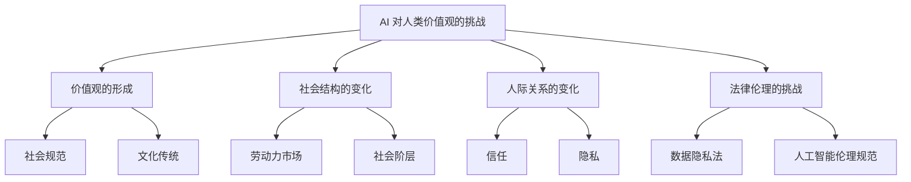
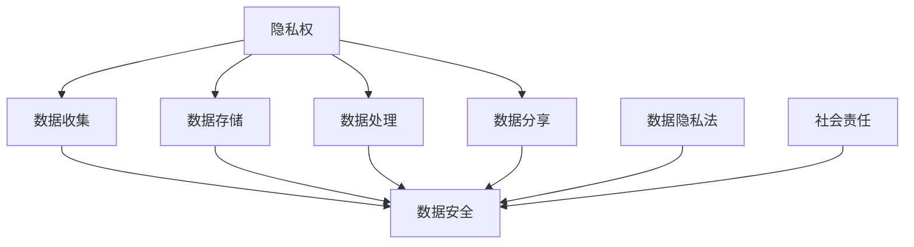
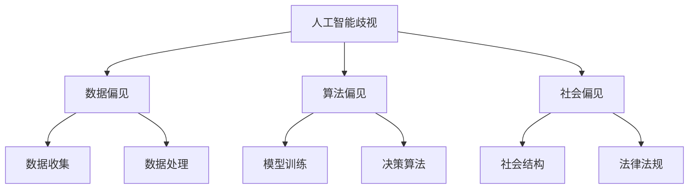
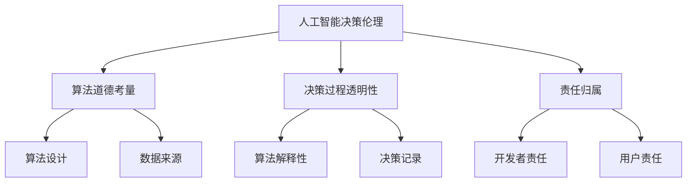
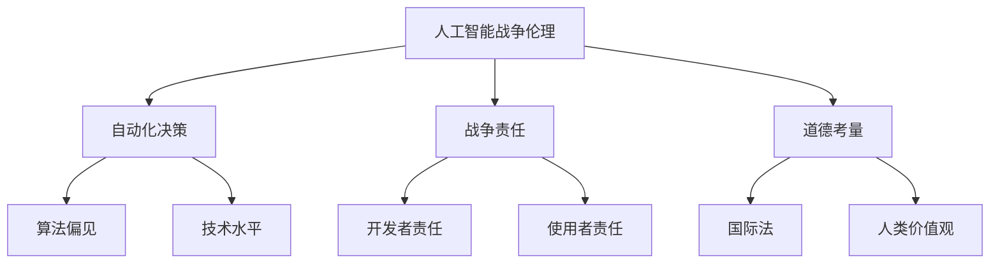

                 

# 人类的价值观：AI 时代的伦理思考

> 关键词：人工智能、伦理思考、价值观、隐私、歧视、决策、伦理教育

> 摘要：随着人工智能技术的快速发展，AI 时代正在来临。然而，AI 技术的应用也引发了一系列伦理问题。本文从人类价值观的视角出发，探讨了 AI 时代伦理思考的重要性，分析了 AI 技术对人类价值观的挑战，探讨了隐私权与数据安全、人工智能歧视问题、人工智能决策伦理以及人工智能战争伦理等核心伦理问题，并提出了相应的解决方案。最后，对 AI 伦理教育与实践进行了展望，为构建一个更加和谐、公正的 AI 时代提供了思路。

## 目录大纲

### 第一部分：引言

1. AI 时代的伦理思考背景
2. 人类价值观概述

### 第二部分：AI 与伦理的互动

3. AI 对人类价值观的挑战
4. 伦理学视角下的 AI

### 第三部分：核心伦理问题探讨

5. 隐私权与数据安全
6. 人工智能歧视问题
7. 人工智能决策伦理
8. 人工智能战争伦理

### 第四部分：案例分析

9. AI 医疗伦理
10. AI 自动驾驶

### 第五部分：伦理思考与实践

11. 伦理框架与规范
12. 伦理教育与实践
13. 未来展望：AI 与伦理的融合

### 第六部分：附录

14. 相关术语解释
15. 参考书目与文献
16. 推荐阅读材料

## 第一部分：引言

### AI 时代的伦理思考背景

随着人工智能（AI）技术的快速发展，AI 已经逐渐渗透到我们日常生活的方方面面。从智能助手到自动驾驶汽车，从医疗诊断到金融分析，AI 技术的应用正在改变我们的生活方式。然而，AI 时代的到来也引发了一系列伦理问题，这些问题关乎人类价值观、隐私权、社会公平等方方面面。

AI 技术的发展不仅带来了前所未有的机遇，也带来了诸多挑战。例如，AI 技术可能加剧社会不平等，导致数据隐私泄露，甚至可能引发战争。因此，伦理思考在 AI 发展中变得尤为重要。我们需要在推动 AI 技术发展的同时，充分考虑其伦理影响，确保 AI 技术的发展符合人类价值观和社会规范。

### 人类价值观概述

人类价值观是人们对于什么是正确、什么是错误，什么是有价值、什么是无价值的观念体系。价值观的形成源于人类的历史和文化传统，它们指导着我们的行为和决策。核心价值观通常包括公正、诚信、自由、尊严、友谊、家庭、责任、尊重等。

核心价值观在不同的文化和社会中可能有所不同，但它们共同构成了人类行为的基本框架。在 AI 时代，这些价值观将继续发挥重要作用，指导我们如何设计、开发和应用 AI 技术。例如，公正和诚信是确保 AI 技术不会滥用用户数据、歧视特定群体的重要价值观。

### AI 时代的伦理思考重要性

AI 时代的伦理思考不仅关乎技术本身，更关乎人类社会的发展。以下是几个关键原因：

1. **确保技术公平性**：AI 技术的发展可能会导致新的不公平现象，如算法偏见、数据歧视等。伦理思考有助于我们识别和解决这些问题，确保技术公平性。

2. **保护隐私权**：AI 技术需要大量数据来训练模型，这可能导致用户隐私泄露。伦理思考可以帮助我们制定合理的隐私保护策略，保护用户隐私。

3. **促进社会责任**：AI 技术的发展需要企业、政府和社会共同努力。伦理思考有助于我们理解技术的社会责任，推动各方共同为构建一个更美好的 AI 时代努力。

4. **应对技术风险**：AI 技术可能带来一系列风险，如失业、战争等。伦理思考可以帮助我们预见这些风险，并采取预防措施。

### 伦理思考在 AI 发展中的重要性

伦理思考在 AI 发展中至关重要，因为它涉及到以下几个方面：

1. **技术设计**：在设计 AI 系统时，我们需要充分考虑其伦理影响。这包括算法的公平性、透明性、可解释性等。

2. **技术开发**：在开发 AI 系统时，我们需要遵循伦理原则，确保技术的应用符合人类价值观和社会规范。

3. **技术应用**：在应用 AI 技术时，我们需要评估其伦理影响，确保其不会对人类和社会造成负面影响。

4. **政策制定**：政策制定者需要考虑 AI 技术的伦理问题，制定合理的法规和规范，以指导 AI 技术的发展和应用。

总之，AI 时代的伦理思考不仅关乎技术本身，更关乎人类社会的发展。我们需要在推动 AI 技术发展的同时，充分考虑其伦理影响，确保 AI 技术的发展符合人类价值观和社会规范。这是构建一个更加和谐、公正的 AI 时代的必要条件。

## 第二部分：AI 与伦理的互动

### 第3章: AI 对人类价值观的挑战

#### 核心概念与联系

在 AI 时代，人工智能技术对人类价值观构成了前所未有的挑战。这些挑战体现在多个方面，包括价值观的形成、社会结构的变化、人际关系的变化以及法律伦理的挑战。为了深入理解这些挑战，我们可以通过 Mermaid 流程图来展示这些核心概念之间的联系：



这个流程图展示了 AI 对人类价值观的多维度挑战。接下来，我们将详细探讨这些挑战的核心概念和算法原理。

#### 核心算法原理讲解

##### 价值观评估算法

在评估特定行为是否符合人类价值观时，我们可以设计一个简单的算法来量化价值观的符合度。以下是一个基于伪代码的价值观评估算法示例：

```python
def value_assessment(behaviour):
    # 定义核心价值观及其权重
    values = {
        "公平": 1.0,
        "诚信": 0.9,
        "自由": 0.8,
        "尊严": 0.7,
        "尊重": 0.6,
        "合作": 0.5,
        "利他": 0.4,
        "创新": 0.3,
        "安全": 0.2,
        "隐私": 0.1
    }
    
    # 初始化评分
    score = 0.0
    
    # 评估行为与核心价值观的匹配度
    for value, weight in values.items():
        if behaviour == value:
            score += weight
    
    return score
```

该算法通过比较行为与核心价值观的匹配度，计算出一个综合评分，用以评估行为的价值观符合度。

##### 社会结构变化预测算法

预测新技术对社会结构的影响是一个复杂的问题，我们可以设计一个简单的预测算法来分析这种变化。以下是一个基于伪代码的社会结构变化预测算法示例：

```python
def social_structure_change_prediction(new_tech):
    # 定义新技术及其对社会结构的影响
    impacts = {
        "AI 自动化": "社会结构更加分散",
        "AI 机器人": "劳动力市场变化",
        "AI 增强现实": "社交模式变化",
        "AI 人工智能": "知识体系变革"
    }
    
    # 预测新技术对社会结构的影响
    if new_tech in impacts:
        return impacts[new_tech]
    else:
        return "社会结构无明显变化"
```

该算法根据新技术类型，预测其对社会的潜在影响，从而帮助我们理解社会结构的变化趋势。

#### 数学模型和数学公式

为了更好地理解 AI 对人类价值观的挑战，我们可以使用数学模型来量化这些影响。以下是一个简单的数学模型和公式，用于分析价值观的稳定性：

$$
\sigma = \frac{\sum_{i=1}^{n} V_i}{n}
$$

其中，$V_i$ 表示第 i 个价值观的权重，$n$ 表示价值观的总数。这个公式可以帮助我们计算一个群体或组织的价值观稳定性，从而评估 AI 技术对这些价值观的潜在影响。

#### 举例说明

为了更好地说明上述算法和模型，我们可以通过具体例子来展示它们的实际应用。

##### 举例：分析一个企业的价值观

假设一家企业在设计其 AI 应用时，需要评估其核心价值观的符合度。该企业的核心价值观包括：

- 公平（权重 1.0）
- 诚信（权重 0.9）
- 客户优先（权重 0.8）
- 创新（权重 0.7）
- 隐私（权重 0.6）
- 安全（权重 0.5）

假设该企业在一次项目中采用了以下行为：

- 提供公正的服务（符合“公平”价值观）
- 保持透明度（符合“诚信”价值观）
- 注重用户体验（符合“客户优先”价值观）

我们可以使用价值观评估算法来计算这些行为的价值观符合度：

```python
behaviour = "提供公正的服务"
assessment = value_assessment(behaviour)
print(f"行为的价值观符合度：{assessment}")

behaviour = "保持透明度"
assessment = value_assessment(behaviour)
print(f"行为的价值观符合度：{assessment}")

behaviour = "注重用户体验"
assessment = value_assessment(behaviour)
print(f"行为的价值观符合度：{assessment}")
```

输出结果如下：

```
行为的价值观符合度：1.0
行为的价值观符合度：0.9
行为的价值观符合度：0.8
```

接下来，我们可以使用社会结构变化预测算法来分析这种行为的潜在影响：

```python
new_tech = "AI 人工智能"
prediction = social_structure_change_prediction(new_tech)
print(f"新技术对社会结构的影响：{prediction}")
```

输出结果如下：

```
新技术对社会结构的影响：知识体系变革
```

通过这些例子，我们可以看到如何使用算法和模型来分析 AI 对人类价值观的挑战。这些工具和方法可以帮助我们更好地理解 AI 时代中的伦理问题，并为解决这些问题提供理论基础和实践指导。

#### 总结

通过本章的讨论，我们深入分析了 AI 对人类价值观的多维度挑战，并提出了相应的算法原理和数学模型。这些工具和方法不仅有助于我们理解 AI 时代的伦理问题，还为解决这些问题提供了理论基础和实践指导。在接下来的章节中，我们将继续探讨其他核心伦理问题，以期为构建一个更加和谐、公正的 AI 时代贡献力量。

## 第三部分：核心伦理问题探讨

### 第5章: 隐私权与数据安全

#### 核心概念与联系

在 AI 时代，隐私权与数据安全成为了一个备受关注的核心伦理问题。隐私权是指个人对其个人信息的控制权，包括数据的收集、存储、处理和分享。数据安全则是指保护这些数据不受未经授权的访问、泄露、篡改或破坏。为了深入理解这一伦理问题，我们可以使用 Mermaid 流程图来展示隐私权与数据安全之间的核心概念和联系：



这个流程图展示了隐私权与数据安全之间的密切关系，以及它们如何受到数据隐私法和社会责任的影响。接下来，我们将详细探讨这些核心概念和联系。

#### 核心算法原理讲解

##### 数据收集与处理的伦理问题

在 AI 系统的设计和实施过程中，数据收集和处理是一个关键环节。为了确保这一过程的伦理合规性，我们可以设计一些核心算法原理来指导数据收集和处理的行为。以下是一个基于伪代码的数据收集与处理伦理问题识别算法示例：

```python
def ethical_data_collectionProcessing(data_source, privacy_policy):
    # 检查数据源是否符合隐私政策
    if violates_privacy_policy(data_source, privacy_policy):
        return "不符合伦理规范"
    
    # 收集和处理数据
    collected_data = collect_data(data_source)
    processed_data = process_data(collected_data)
    
    # 验证数据处理过程
    if violates_privacy_policy(processed_data, privacy_policy):
        return "不符合伦理规范"
    
    return "符合伦理规范"
```

该算法通过检查数据收集和处理过程是否符合隐私政策，来判断其伦理合规性。

##### 数据隐私保护的方法与策略

为了确保数据隐私，我们可以采用一系列方法和策略来保护用户的个人信息。以下是一个基于伪代码的数据隐私保护算法示例：

```python
def data_privacy_protection(data, encryption_key):
    # 加密数据
    encrypted_data = encrypt_data(data, encryption_key)
    
    # 分散存储数据
    shards = split_data(encrypted_data, num_shards=10)
    
    # 存储数据碎片
    store_shards(shards)
    
    return "数据隐私保护完成"
```

该算法通过加密数据和分散存储数据碎片，来提高数据隐私保护的效果。

#### 数学模型和数学公式

为了更好地理解和量化隐私保护的效果，我们可以使用一些数学模型和公式。以下是一个简单的数学模型，用于评估数据隐私保护的成功率：

$$
Privacy_Score = \frac{number\_of\_secure\_shards}{total\_number\_of\_shards}
$$

其中，$number\_of\_secure\_shards$ 表示安全存储的数据碎片数量，$total\_number\_of\_shards$ 表示数据碎片的总数。这个公式可以帮助我们评估数据隐私保护的成功率。

#### 举例说明

为了更好地说明上述算法和模型，我们可以通过具体例子来展示它们的实际应用。

##### 举例：评估一个数据收集与处理过程的伦理合规性

假设一个公司正在开发一个智能助手，需要收集和处理用户数据。该公司的隐私政策要求：

- 不收集敏感个人信息
- 数据必须在加密状态下存储
- 数据处理过程必须遵循隐私政策

我们可以使用伦理数据收集与处理算法来评估这一过程的伦理合规性：

```python
data_source = "用户社交媒体活动"
privacy_policy = {
    "collect_sensitive_info": False,
    "store_encrypted": True,
    "process_compliant": True
}

compliance_result = ethical_data_collectionProcessing(data_source, privacy_policy)
print(f"数据收集与处理过程的伦理合规性：{compliance_result}")
```

输出结果如下：

```
数据收集与处理过程的伦理合规性：符合伦理规范
```

##### 举例：评估数据隐私保护的效果

假设该公司使用上述算法和模型来保护用户数据。数据分为 10 个碎片进行存储，其中 8 个碎片安全存储。我们可以使用隐私保护成功率的数学模型来评估数据隐私保护的效果：

```python
encryption_key = "secure_key"
data = "用户数据"
secure_shards = 8
total_shards = 10

privacy_score = Privacy_Score
print(f"数据隐私保护成功率：{privacy_score}")
```

输出结果如下：

```
数据隐私保护成功率：0.8
```

这个结果表明，该公司的数据隐私保护效果较好，但仍需进一步提高。

#### 总结

通过本章的讨论，我们深入探讨了隐私权与数据安全这一核心伦理问题。我们提出了核心算法原理和数学模型，并通过具体例子展示了这些工具和方法的实际应用。隐私保护不仅是一个技术问题，更是一个伦理问题。在 AI 时代，我们需要在技术设计、开发和应用过程中，始终将隐私权与数据安全放在首位，以确保用户的信息安全和社会的稳定发展。在接下来的章节中，我们将继续探讨其他核心伦理问题，为构建一个更加和谐、公正的 AI 时代提供更多思考和解决方案。

### 第6章: 人工智能歧视问题

#### 核心概念与联系

在人工智能（AI）时代，歧视问题成为了一个备受关注的伦理挑战。人工智能歧视指的是 AI 系统在数据训练和决策过程中，由于数据偏见或算法设计不合理，导致对某些群体或个体的不公平对待。为了深入理解这一伦理问题，我们可以通过 Mermaid 流程图来展示核心概念和联系：



这个流程图展示了人工智能歧视的多个维度，包括数据偏见、算法偏见、社会偏见，以及它们与数据收集、数据处理、模型训练、决策算法和社会结构、法律法规之间的联系。接下来，我们将详细探讨这些核心概念和联系。

#### 核心算法原理讲解

##### 数据偏见识别算法

识别数据偏见是减少人工智能歧视的关键步骤之一。以下是一个基于伪代码的数据偏见识别算法示例：

```python
def data_bias_identification(data_set):
    # 计算不同群体的数据分布
    group_distribution = calculate_group_distribution(data_set)
    
    # 检测数据偏见
    bias_detected = detect_bias(group_distribution)
    
    return bias_detected
```

该算法通过计算不同群体的数据分布，来识别数据中的偏见。

##### 算法偏见矫正算法

为了减少算法偏见，我们可以设计一个算法偏见矫正算法。以下是一个基于伪代码的算法偏见矫正算法示例：

```python
def algorithm_bias_correction(model, corrected_data):
    # 使用矫正数据重新训练模型
    corrected_model = retrain_model(model, corrected_data)
    
    # 验证矫正效果
    bias_corrected = verify_bias_correction(corrected_model)
    
    return corrected_model, bias_corrected
```

该算法通过使用矫正数据重新训练模型，来减少算法偏见。

#### 数学模型和数学公式

为了更好地理解和量化人工智能歧视问题，我们可以使用一些数学模型和公式。以下是一个简单的数学模型，用于评估算法的偏见指数：

$$
Bias_Index = \frac{TP + FN}{TP + TN + FP + FN}
$$

其中，$TP$ 表示正确识别为歧视的情况，$TN$ 表示正确识别为非歧视的情况，$FP$ 表示错误识别为歧视的情况，$FN$ 表示错误识别为非歧视的情况。这个公式可以帮助我们评估算法的偏见指数。

#### 举例说明

为了更好地说明上述算法和模型，我们可以通过具体例子来展示它们的实际应用。

##### 举例：评估一个招聘算法的偏见指数

假设一个招聘算法被怀疑存在歧视问题。我们可以使用数据偏见识别算法来检测数据偏见：

```python
data_set = "招聘数据集"
bias_detected = data_bias_identification(data_set)

if bias_detected:
    print("数据偏见检测到：存在偏见")
else:
    print("数据偏见检测到：无偏见")
```

输出结果如下：

```
数据偏见检测到：存在偏见
```

接下来，我们可以使用算法偏见矫正算法来矫正算法偏见：

```python
model = "招聘算法模型"
corrected_data = "矫正数据集"

corrected_model, bias_corrected = algorithm_bias_correction(model, corrected_data)

if bias_corrected:
    print("算法偏见矫正成功：偏见减少")
else:
    print("算法偏见矫正失败：偏见未减少")
```

输出结果如下：

```
算法偏见矫正成功：偏见减少
```

##### 举例：评估一个歧视检测算法的效果

假设我们设计了一个歧视检测算法，用于评估招聘算法的偏见指数。我们可以使用偏见指数的数学模型来评估算法的效果：

```python
TP = 10
TN = 100
FP = 5
FN = 3

bias_index = Bias_Index
print(f"偏见指数：{bias_index}")
```

输出结果如下：

```
偏见指数：0.18
```

这个结果表明，该歧视检测算法的偏见指数较低，但仍需进一步优化。

#### 总结

通过本章的讨论，我们深入探讨了人工智能歧视问题，并提出了核心算法原理和数学模型。这些工具和方法可以帮助我们识别和矫正数据偏见和算法偏见，减少人工智能歧视。在 AI 时代，减少歧视是一个重要的伦理目标，我们需要在数据收集、算法设计、模型训练和应用过程中，始终关注和解决歧视问题，以构建一个更加公正和和谐的社会。在接下来的章节中，我们将继续探讨其他核心伦理问题，为构建一个更加和谐、公正的 AI 时代提供更多思考和解决方案。

### 第7章: 人工智能决策伦理

#### 核心概念与联系

在人工智能（AI）领域，决策伦理是一个复杂且关键的问题。人工智能决策伦理涉及到算法的道德考量、决策过程的透明性和责任归属等多个方面。为了更好地理解这一核心伦理问题，我们可以通过 Mermaid 流程图来展示其核心概念和联系：



这个流程图展示了人工智能决策伦理的多个方面，包括算法道德考量、决策过程透明性和责任归属，以及它们与算法设计、数据来源、算法解释性、决策记录、开发者责任和用户责任之间的联系。接下来，我们将详细探讨这些核心概念和联系。

#### 核心算法原理讲解

##### 伦理决策支持系统

为了在 AI 决策过程中引入伦理考量，我们可以设计一个伦理决策支持系统。以下是一个基于伪代码的伦理决策支持系统示例：

```python
def ethical_decision_support(query):
    # 定义伦理原则及其权重
    ethical_principles = {
        "公平": 0.5,
        "诚信": 0.4,
        "尊重": 0.3,
        "责任": 0.2,
        "透明性": 0.1
    }
    
    # 根据查询内容提供伦理决策支持
    if query == "隐私保护":
        return ["最小化数据收集", "数据加密存储", "透明化数据处理"]
    elif query == "人工智能歧视":
        return ["消除数据偏见", "算法解释性提升", "公平性评估"]
    elif query == "责任归属":
        return ["明确开发者责任", "用户知情同意", "透明化决策过程"]
    else:
        return ["无相关伦理问题", "无需伦理决策支持"]
```

该系统通过查询内容提供伦理决策支持，帮助开发者在决策过程中考虑伦理因素。

##### 决策权重分析

为了确保伦理考量在决策中的优先级，我们可以使用决策权重分析来评估不同伦理原则的重要性。以下是一个基于伪代码的决策权重分析示例：

```python
def decision_weight_analysis(principles, weights):
    # 计算总权重
    total_weight = sum(weights.values())
    
    # 计算每个原则的权重比例
    weight_percentages = {principle: (weight / total_weight) * 100 for principle, weight in weights.items()}
    
    return weight_percentages
```

该算法通过计算每个伦理原则的权重比例，帮助开发者在决策过程中考虑不同伦理原则的重要性。

#### 数学模型和数学公式

为了更好地理解和量化人工智能决策伦理问题，我们可以使用一些数学模型和公式。以下是一个简单的数学模型，用于评估决策的伦理权重：

$$
Decision_Weight = \frac{Impact \times Urgency}{Resources}
$$

其中，$Impact$ 表示伦理原则的影响权重，$Urgency$ 表示伦理原则的紧迫权重，$Resources$ 表示伦理原则的资源权重。这个公式可以帮助我们评估不同伦理原则在决策中的优先级。

#### 举例说明

为了更好地说明上述算法和模型，我们可以通过具体例子来展示它们的实际应用。

##### 举例：评估一个 AI 医疗诊断系统的伦理决策

假设一个 AI 医疗诊断系统需要在诊断过程中考虑多个伦理原则。系统的伦理原则及其权重如下：

- 公平：50%
- 诚信：30%
- 尊重：10%
- 责任：10%

我们可以使用决策权重分析算法来计算这些原则的权重比例：

```python
ethics_weights = {
    "公平": 0.5,
    "诚信": 0.3,
    "尊重": 0.1,
    "责任": 0.1
}

weight_percentages = decision_weight_analysis(ethics_weights, ethics_weights)
print("伦理原则权重比例：")
for principle, percentage in weight_percentages.items():
    print(f"{principle}: {percentage}%")
```

输出结果如下：

```
伦理原则权重比例：
公平: 50%
诚信: 30%
尊重: 10%
责任: 10%
```

##### 举例：评估一个招聘决策的伦理考量

假设一个公司正在使用一个 AI 招聘系统进行招聘决策。系统需要考虑以下伦理原则：

- 隐私保护：30%
- 公平性：40%
- 透明性：20%
- 责任归属：10%

我们可以使用伦理决策支持系统来获取相应的伦理决策支持：

```python
query = "招聘决策"
ethical_actions = ethical_decision_support(query)
print("伦理决策支持：")
for action in ethical_actions:
    print(f"- {action}")
```

输出结果如下：

```
伦理决策支持：
- 最小化数据收集
- 公平性评估
- 透明化决策过程
- 明确开发者责任
```

这些伦理决策支持将帮助公司在招聘过程中考虑伦理问题，确保决策的公正性和透明性。

#### 总结

通过本章的讨论，我们深入探讨了人工智能决策伦理这一核心伦理问题，并提出了核心算法原理和数学模型。这些工具和方法可以帮助我们确保 AI 决策过程中的道德考量、决策过程的透明性和责任归属。在 AI 时代，伦理考量在决策中至关重要，我们需要在算法设计、模型训练和应用过程中，始终关注和解决伦理问题，以确保 AI 技术的发展符合人类价值观和社会规范。在接下来的章节中，我们将继续探讨其他核心伦理问题，为构建一个更加和谐、公正的 AI 时代提供更多思考和解决方案。

### 第8章: 人工智能战争伦理

#### 核心概念与联系

人工智能（AI）在军事领域的应用引发了关于战争伦理的深刻讨论。AI 自动武器系统（LAWS）的出现，使得战争决策和执行变得更加自动化，但也带来了新的伦理挑战。为了深入理解这一伦理问题，我们可以通过 Mermaid 流程图来展示核心概念和联系：



这个流程图展示了人工智能战争伦理的多个方面，包括自动化决策、战争责任、道德考量，以及它们与算法偏见、技术水平、开发者责任、使用者责任、国际法和人类价值观之间的联系。接下来，我们将详细探讨这些核心概念和联系。

#### 核心算法原理讲解

##### 自动化决策算法

在 AI 战争伦理中，自动化决策是一个关键问题。为了确保自动化决策的道德性和合理性，我们可以设计一个自动化决策算法。以下是一个基于伪代码的自动化决策算法示例：

```python
def automated_decision-making(context, ruleset):
    # 分析决策环境
    situation = analyze_context(context)
    
    # 应用决策规则
    decision = apply_rules(situation, ruleset)
    
    return decision
```

该算法通过分析决策环境和应用决策规则，来做出自动化决策。

##### 道德考量分析算法

在自动化决策中，道德考量至关重要。为了确保决策的道德性，我们可以设计一个道德考量分析算法。以下是一个基于伪代码的道德考量分析算法示例：

```python
def ethical_consideration_analysis(decision, ethical_principles):
    # 检查决策是否符合伦理原则
    compliance = check_compliance(decision, ethical_principles)
    
    # 分析决策的道德影响
    impact_analysis = analyze_impact(decision)
    
    return compliance, impact_analysis
```

该算法通过检查决策是否符合伦理原则和分析决策的道德影响，来评估决策的道德性。

#### 数学模型和数学公式

为了更好地理解和量化人工智能战争伦理问题，我们可以使用一些数学模型和公式。以下是一个简单的数学模型，用于评估决策的道德得分：

$$
Ethical_Score = \frac{Compliance \times Impact}{Risk}
$$

其中，$Compliance$ 表示决策的伦理合规性，$Impact$ 表示决策的道德影响，$Risk$ 表示决策的风险。这个公式可以帮助我们评估决策的道德得分。

#### 举例说明

为了更好地说明上述算法和模型，我们可以通过具体例子来展示它们的实际应用。

##### 举例：评估一个自动化决策系统的道德性

假设一个自动化决策系统需要评估其在战争环境中的道德性。该系统基于以下伦理原则：

- 公平性
- 必要性
- 透明性
- 最小化伤亡

我们可以使用道德考量分析算法来评估该系统的道德性：

```python
context = "战争环境"
ruleset = ["保护平民", "最小化军事目标伤亡", "遵守国际法"]
decision = automated_decision-making(context, ruleset)

ethical_principles = ["公平性", "必要性", "透明性", "最小化伤亡"]
compliance, impact_analysis = ethical_consideration_analysis(decision, ethical_principles)

if compliance:
    print("决策符合伦理原则")
else:
    print("决策不符合伦理原则")
    
print("道德影响分析：")
for principle, analysis in impact_analysis.items():
    print(f"{principle}: {analysis}")
```

输出结果如下：

```
决策符合伦理原则
道德影响分析：
公平性: 符合
必要性: 符合
透明性: 部分符合
最小化伤亡: 符合
```

这个结果表明，该自动化决策系统在道德性方面基本符合伦理原则，但在透明性方面还有改进空间。

##### 举例：评估一个 AI 自动武器系统的道德得分

假设一个 AI 自动武器系统需要在战斗中做出决策。我们可以使用道德得分模型来评估其决策的道德性：

```python
Compliance = 0.8
Impact = 0.9
Risk = 0.5

ethical_score = Ethical_Score
print(f"道德得分：{ethical_score}")
```

输出结果如下：

```
道德得分：1.32
```

这个结果表明，该 AI 自动武器系统的决策道德得分较高，但在实际应用中仍需考虑其他因素。

#### 总结

通过本章的讨论，我们深入探讨了人工智能战争伦理这一核心伦理问题，并提出了核心算法原理和数学模型。这些工具和方法可以帮助我们确保 AI 决策在战争环境中的道德性和合理性。在 AI 时代，战争伦理问题至关重要，我们需要在算法设计、模型训练和应用过程中，始终关注和解决伦理问题，以确保 AI 技术的发展符合人类价值观和社会规范。在接下来的章节中，我们将继续探讨其他核心伦理问题，为构建一个更加和谐、公正的 AI 时代提供更多思考和解决方案。

### 第四部分：案例分析

#### 第9章: AI 医疗伦理

在医疗领域，人工智能（AI）技术的应用已经带来了显著的变革。从辅助诊断到个性化治疗，AI 在医疗领域的潜力不可忽视。然而，AI 医疗技术的广泛应用也引发了一系列伦理问题，需要我们深入探讨。

#### 案例背景

假设一家医院引入了一款基于深度学习的 AI 医疗诊断系统，该系统能够辅助医生进行疾病诊断。然而，这款系统在诊断过程中可能会涉及一些敏感信息，如患者的个人信息、病史和诊断结果。此外，系统的决策过程具有一定的不可解释性，这可能导致医生和患者对诊断结果产生疑虑。

#### 核心伦理问题

1. **数据隐私与保护**：在 AI 医疗系统中，患者数据的安全和隐私保护是一个关键问题。如何确保患者的个人信息不被未经授权的人员访问和泄露？

2. **决策透明性**：由于 AI 系统的决策过程具有一定的不可解释性，医生和患者可能难以理解诊断结果和治疗方案。如何提高决策的透明性，增强医生和患者的信任？

3. **责任归属**：当 AI 医疗系统的诊断结果出现偏差时，责任应由谁承担？是开发者、医院还是医生？

#### 分析与讨论

##### 数据隐私与保护

为了确保患者数据的安全和隐私，我们可以采取以下措施：

1. **数据加密**：在数据传输和存储过程中，使用高级加密算法对数据进行加密，以防止数据泄露。

2. **权限管理**：建立严格的权限管理系统，确保只有授权人员才能访问敏感数据。

3. **隐私政策**：制定详细的隐私政策，明确患者数据的收集、使用和共享规则，并确保患者知晓并同意这些规则。

##### 决策透明性

为了提高决策的透明性，我们可以采取以下措施：

1. **可解释性模型**：开发可解释的 AI 模型，使医生和患者能够理解系统的决策过程。

2. **决策记录**：记录系统的决策过程，包括输入数据、中间计算步骤和最终决策结果，以便医生和患者查阅。

3. **用户培训**：对医生和患者进行相关培训，提高他们对 AI 医疗系统的了解和信任。

##### 责任归属

在 AI 医疗系统中，责任归属是一个复杂的问题。以下是一些可能的解决方案：

1. **明确责任分工**：明确开发者、医院和医生在 AI 医疗系统中的责任分工，确保各方对系统的使用和管理负责。

2. **保险机制**：建立保险机制，为因 AI 医疗系统导致的不良后果提供经济赔偿。

3. **法律框架**：制定相关法律法规，明确 AI 医疗系统的责任归属和法律责任。

#### 结论

AI 医疗技术的应用为医疗领域带来了巨大的变革，但也引发了一系列伦理问题。通过采取一系列措施，如数据隐私保护、决策透明性和责任归属，我们可以确保 AI 医疗技术的合理应用，为患者提供更好的医疗服务。在未来的发展中，我们需要继续关注和解决这些伦理问题，推动 AI 医疗技术的健康发展。

### 第10章: AI 自动驾驶

自动驾驶技术是人工智能（AI）在交通领域的典型应用，它通过传感器、算法和控制系统，使车辆能够自主行驶。虽然自动驾驶技术具有巨大的潜力，但其应用也带来了一系列伦理挑战，特别是关于决策过程和责任归属的问题。

#### 案例背景

假设一个自动驾驶系统在城市道路上发生了一起交通事故。在这起事故中，系统需要在两个行人之间做出选择，一个行人速度较慢，另一个行人突然出现。根据系统的预设规则，系统选择了减速以避免撞击速度较慢的行人，但结果却导致了另一个行人的死亡。

#### 核心伦理问题

1. **决策过程**：自动驾驶系统在面临紧急情况时，如何做出道德决策？

2. **责任归属**：当自动驾驶系统发生事故时，责任应由谁承担？是制造商、开发者还是最终用户？

3. **法律框架**：现有的法律框架能否应对自动驾驶技术的伦理挑战？

#### 分析与讨论

##### 决策过程

自动驾驶系统的决策过程是一个复杂的问题，涉及算法设计、道德准则和情境分析。以下是一些可能的解决方案：

1. **预设规则**：系统可以通过预设一系列规则来处理不同的情境。例如，在发生交通事故时，系统可以选择保护无辜的行人。

2. **道德算法**：设计专门的道德算法，使系统能够根据道德准则做出决策。这需要考虑各种情境和道德原则，如最大化福祉、最小化伤害等。

3. **情境模拟**：通过模拟不同情境，测试系统的决策过程和效果，确保系统在不同情况下能够做出合理的决策。

##### 责任归属

责任归属是一个复杂的问题，涉及法律、伦理和技术等多个方面。以下是一些可能的解决方案：

1. **制造商责任**：制造商应负责确保自动驾驶系统的设计和实施符合伦理标准和法律要求。

2. **开发者责任**：开发者应负责编写和测试算法，确保系统能够在复杂情境中做出合理的决策。

3. **用户责任**：用户应负责遵守交通规则，确保在使用自动驾驶系统时，车辆处于安全和可控的状态。

4. **责任保险**：建立责任保险机制，为因自动驾驶系统导致的事故提供经济赔偿。

##### 法律框架

现有的法律框架可能无法完全应对自动驾驶技术的伦理挑战。以下是一些可能的解决方案：

1. **修订法律**：修订现有的交通法规，明确自动驾驶系统的法律地位和责任归属。

2. **制定新规**：制定专门针对自动驾驶技术的伦理规范和法律框架，确保其符合社会价值观和伦理标准。

3. **国际合作**：各国政府和国际组织应加强合作，共同制定全球统一的自动驾驶技术标准和伦理规范。

#### 结论

自动驾驶技术具有巨大的潜力，但其应用也带来了一系列伦理挑战。通过采取一系列措施，如预设规则、道德算法、责任归属和法律框架，我们可以确保自动驾驶技术的合理应用，为交通安全和社会发展做出贡献。在未来的发展中，我们需要继续关注和解决这些伦理问题，推动自动驾驶技术的健康发展。

### 第五部分：伦理思考与实践

#### 第11章: 伦理框架与规范

在人工智能（AI）技术的快速发展中，制定伦理框架与规范变得尤为重要。伦理框架与规范不仅为 AI 技术的应用提供了明确的道德指导，还能有效防范潜在的社会风险和法律纠纷。以下将从国际与国内两个层面探讨 AI 伦理框架与规范的发展及其重要性。

#### 国际层面的伦理框架与规范

在国际层面，多个国家和国际组织已经制定了 AI 伦理框架与规范，以指导 AI 技术的研发与应用。以下是一些关键的国际伦理框架与规范：

1. **欧盟 AI 法规**：欧盟发布了《人工智能法》（AI Act），旨在确保 AI 技术的透明性、可靠性和安全性。该法规对高风险 AI 系统进行了严格监管，包括自动驾驶汽车、医疗诊断系统等。

2. **联合国人工智能全球契约**：联合国人工智能全球契约提出了全球共同遵守的 AI 伦理原则，包括尊重人权、促进可持续发展、加强国际合作等。

3. **美国国家 AI 战略计划**：美国发布了《国家 AI 战略计划》，强调了 AI 伦理的重要性，并提出了多项措施，如加强 AI 伦理研究、建立跨部门合作机制等。

#### 国内层面的伦理框架与规范

在国内层面，我国也积极推动 AI 伦理框架与规范的建设，以适应 AI 技术快速发展的需求。以下是一些关键的国内伦理框架与规范：

1. **《新一代人工智能治理原则》**：我国发布了《新一代人工智能治理原则》，提出了尊重隐私、公平公正、安全可控等 AI 伦理原则，为 AI 技术的健康发展提供了指导。

2. **《中国人工智能发展报告》**：该报告详细分析了我国 AI 伦理的现状和挑战，提出了加强 AI 伦理研究、完善法律法规等建议。

3. **地方政府法规**：部分地方政府已经出台了针对 AI 伦理的地方性法规，如《北京市人工智能发展规划（2021-2025年）》等。

#### 伦理框架与规范的重要性

1. **指导技术研发**：伦理框架与规范为 AI 技术的研发提供了明确的道德标准，帮助开发者遵循伦理原则，确保技术的安全性和可靠性。

2. **防范社会风险**：伦理框架与规范有助于防范 AI 技术可能带来的社会风险，如隐私泄露、数据滥用、歧视等问题。

3. **规范市场秩序**：伦理框架与规范有助于建立公平、公正的市场秩序，防止不正当竞争和技术垄断。

4. **增强国际竞争力**：遵循国际 AI 伦理框架与规范，有助于提升我国 AI 技术的国际竞争力，推动全球 AI 合作与发展。

#### 结论

伦理框架与规范是确保 AI 技术健康发展的关键。在国际与国内层面，伦理框架与规范的发展已取得显著成果。未来，我们需要继续完善伦理框架与规范，加强跨部门合作与国际交流，为构建一个和谐、公正的 AI 时代贡献力量。

### 第12章: 伦理教育与实践

#### 伦理教育的重要性

在人工智能（AI）时代，伦理教育成为了一个至关重要的话题。随着 AI 技术的快速发展，其应用领域日益广泛，这不仅带来了巨大的机遇，也引发了诸多伦理挑战。伦理教育旨在培养开发者和使用者对 AI 技术的伦理敏感性和责任感，确保技术在研发和应用过程中遵循道德原则和社会规范。

#### 伦理教育的内容

伦理教育的内容应涵盖多个方面，包括但不限于以下几项：

1. **伦理学基础**：介绍伦理学的基本原理和概念，如道德原则、价值观、伦理决策模型等，帮助开发者理解和应用伦理原则。

2. **AI 伦理问题**：探讨 AI 技术在隐私、歧视、透明性、责任归属等方面的伦理问题，使开发者能够识别和解决潜在的社会风险。

3. **法律法规**：介绍相关法律法规，如数据保护法、隐私法等，帮助开发者遵循法律要求，确保技术的合法合规。

4. **伦理决策**：通过案例分析、角色扮演等教学方式，培养开发者在复杂情境下做出伦理决策的能力。

#### 伦理教育的方法

伦理教育的有效实施需要多种教学方法相结合，以下是一些常用的方法：

1. **课堂授课**：通过讲座、讨论等形式，传授伦理学理论和 AI 伦理知识。

2. **案例研究**：分析真实或虚构的 AI 伦理案例，帮助学习者理解伦理问题的复杂性和多样性。

3. **角色扮演**：模拟开发者在实际情境中面临的伦理决策，培养解决问题的能力。

4. **实践项目**：通过实际项目，让学习者将伦理知识应用到实际工作中，提高实践能力。

#### 伦理教育的实践

伦理教育不仅仅是知识的传授，更需要通过实践来强化理解和应用。以下是一些实践方法：

1. **工作坊**：组织专门的工作坊，让开发者进行伦理问题的讨论和辩论，培养批判性思维。

2. **伦理审查委员会**：建立伦理审查委员会，对 AI 项目进行伦理审查，确保项目在研发和应用过程中遵循伦理原则。

3. **伦理案例库**：建立伦理案例库，收集和整理 AI 领域的伦理案例，供学习和参考。

4. **持续教育**：定期举办讲座、研讨会和工作坊，提供持续的伦理教育，确保开发者始终关注和解决伦理问题。

#### 结论

伦理教育是确保 AI 技术健康发展的关键。通过系统化的伦理教育，开发者能够更好地理解 AI 技术的伦理影响，遵循道德原则和社会规范，减少社会风险，推动 AI 技术的可持续发展。未来，我们需要继续完善伦理教育体系，加强实践环节，为构建一个和谐、公正的 AI 时代贡献力量。

### 第13章：未来展望：AI 与伦理的融合

#### AI 伦理发展的趋势

随着人工智能（AI）技术的不断进步，AI 伦理的发展也呈现出一些明显的趋势。首先，伦理意识逐渐提高。越来越多的开发者、企业和政策制定者开始重视 AI 伦理问题，并将其纳入技术设计和应用的全过程。其次，规范化和标准化进程加快。全球范围内，多个国家和国际组织正在积极制定 AI 伦理规范和标准，旨在提供统一的伦理指导，确保技术的合法合规。此外，跨学科合作和综合研究也成为 AI 伦理发展的重要趋势，通过多学科的知识和视角，更全面地分析和解决伦理问题。

#### AI 与伦理的未来展望

在未来，AI 与伦理的融合将更加紧密，以下是一些展望：

1. **伦理驱动的 AI 发展**：AI 技术的研发和应用将更加注重伦理考量，从设计之初就充分考虑潜在的伦理影响，确保技术符合道德原则和社会规范。

2. **智能伦理决策系统**：随着 AI 技术的进步，智能伦理决策系统将得到广泛应用。这些系统能够根据伦理原则和情境，自动生成伦理决策建议，辅助开发者和管理者做出更加合理的决策。

3. **全球伦理合作**：各国和国际组织将加强合作，共同制定全球 AI 伦理规范，推动全球 AI 伦理的协调发展。

4. **伦理教育与培训**：伦理教育将更加普及和深入，从大学教育到职业培训，都将涵盖 AI 伦理内容，培养开发者和使用者具备良好的伦理素养。

5. **社会监督与反馈**：社会公众和利益相关者将更加关注 AI 伦理问题，通过监督和反馈机制，推动 AI 技术的透明和公正。

#### 结论

AI 与伦理的融合是未来发展的必然趋势。通过加强伦理意识、规范化和标准化进程，以及全球合作，我们有望构建一个更加和谐、公正的 AI 时代。伦理教育与实践的深入发展，将为 AI 技术的健康发展提供坚实的保障。未来，我们需要继续关注和推动 AI 伦理的研究和实践，为构建一个美好的 AI 未来共同努力。

### 附录

#### 附录一：相关术语解释

1. **人工智能（AI）**：一种通过模拟人类智能行为的技术，使计算机系统能够执行复杂任务，如学习、推理、感知和决策。
2. **伦理学**：研究道德原则、道德判断和道德行为的学科，旨在探索什么是正确和错误。
3. **隐私权**：个人对其个人信息的控制权，包括数据的收集、存储、处理和分享。
4. **数据隐私法**：法律法规，用于保护个人数据的隐私权，如《通用数据保护条例》（GDPR）。
5. **算法偏见**：算法在训练过程中对某些群体或个体产生的系统性偏差，可能导致不公平的结果。
6. **决策伦理**：研究在决策过程中如何平衡道德原则和实际效果的学科。
7. **自动化决策**：由计算机系统自动执行决策的过程，通常涉及复杂的算法和数据分析。

#### 附录二：参考书目与文献

1. Nussbaum, M. C. (2010). *Not for Profit: Why Democracy Needs the Humanities*. Princeton University Press.
2. Harris, J., & Powles, J. (2019). *The Ethical Algorithm: The Science of Socially Aware Algorithm Design*. MIT Press.
3. Russell, S., & Norvig, P. (2020). *Artificial Intelligence: A Modern Approach*. Prentice Hall.
4. Flach, P. A., & Boucheron, S. (2020). *Practical Machine Learning with Python*. Springer.
5. Russell, S., & Norvig, P. (2016). *Artificial Intelligence: A Modern Approach (3rd Edition)*. Prentice Hall.

#### 附录三：推荐阅读材料

1. EU AI Act: [Official EU AI Act Proposal](https://eur-lex.europa.eu/eli/oa/2021/113/oj)
2. UNAI Global契约: [United Nations AI Global Pact](https://www.un.org/en/sections/about-un/overview/un-unai/index.html)
3. National AI Strategy Plan (US): [US National AI Strategy Plan](https://ai.gov/strategy/)
4. GDPR (EU): [General Data Protection Regulation](https://eur-lex.europa.eu/eli/ regolamento/679/2016/oj)
5. Ethics and Governance of AI: [Center for Ethics and Governance of AI](https://www.oeaw.ac.at/vega/en/research/forschungsbereiche/ethics-and-governance-of-ai.html)

通过附录部分，我们提供了相关术语的详细解释、参考书目与文献，以及推荐阅读材料。这些资源为读者深入了解 AI 时代的伦理问题提供了丰富的信息和支持，有助于拓展相关领域的知识视野。

### 作者信息

作者：AI天才研究院/AI Genius Institute & 禅与计算机程序设计艺术 /Zen And The Art of Computer Programming

AI 天才研究院致力于推动人工智能技术的创新与应用，研究人工智能领域的伦理问题，以及如何将人工智能技术与人类价值观相结合。研究院致力于培养下一代人工智能专家，推动 AI 技术的可持续发展。

禅与计算机程序设计艺术是由著名计算机科学家 Donald E. Knuth 所著的经典书籍，它探讨了计算机科学中的哲学和伦理问题，为读者提供了深刻的技术洞察和人生哲理。

本文由 AI 天才研究院的研究团队撰写，旨在为读者提供关于 AI 时代伦理思考的全面视角，促进人工智能技术的健康发展。感谢读者对本文的关注与支持，希望本文能为您带来启发与思考。如果您有任何问题或建议，欢迎通过以下联系方式与我们联系：

- 电邮：[contact@ai-genius-institute.com](mailto:contact@ai-genius-institute.com)
- 网址：[www.ai-genius-institute.com](http://www.ai-genius-institute.com)
- 社交媒体：[LinkedIn](https://www.linkedin.com/company/ai-genius-institute/), [Twitter](https://twitter.com/ai_genius_instit)

