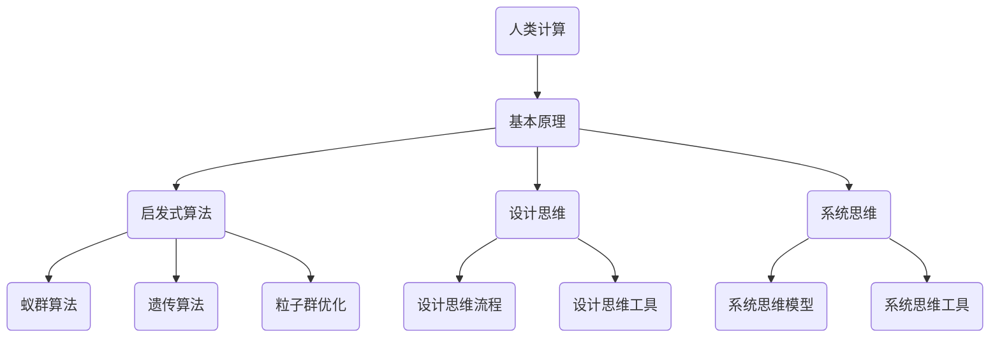

                 

# 人类计算：解决复杂问题的创新方法

> 关键词：人类计算、复杂问题、创新方法、启发式算法、设计思维、系统思维、人工智能

> 摘要：本文将探讨人类计算这一概念，分析其在解决复杂问题中的应用和创新方法。通过介绍人类计算的基本原理和核心算法，并结合实际应用案例，阐述人类计算的优势和未来发展方向。

### 目录大纲

#### 第一部分：基础概念与理论

1. **引言与核心概念**
   1.1 人类计算的定义
   1.2 人类计算的特点
   1.3 人类计算的研究意义
   1.4 人类计算的发展历程

2. **人类计算的基本原理**
   2.1 认知科学概述
      2.1.1 大脑的运作原理
      2.1.2 神经科学基础
   2.2 复杂问题求解方法
      2.2.1 启发式算法
      2.2.2 人类式决策

3. **人类计算的创新方法**
   3.1 设计思维方法
      3.1.1 设计思维流程
      3.1.2 设计思维工具
   3.2 系统思维方法
      3.2.1 系统思维模型
      3.2.2 系统思维工具

4. **人类计算在实际领域的应用**
   4.1 人工智能与人类计算的结合
   4.2 人类计算在教育中的应用
   4.3 人类计算在医疗中的应用

#### 第二部分：核心算法原理讲解

5. **启发式算法**
   5.1 启发式算法的基本概念
   5.2 常见启发式算法
      5.2.1 蚁群算法
      5.2.2 遗传算法
      5.2.3 粒子群优化

6. **设计思维与系统思维**
   6.1 设计思维的理论基础
   6.2 设计思维的应用实例
   6.3 系统思维的理论基础
   6.4 系统思维的应用实例

7. **数学模型与公式推导**
   7.1 数学模型的基本概念
   7.2 数学公式的推导
      7.2.1 蚁群算法数学模型
      7.2.2 遗传算法数学模型

#### 第三部分：项目实战与代码实现

8. **人类计算应用案例解析**
   8.1 人工智能在图像识别中的应用
   8.2 人类计算在教育评估中的应用
   8.3 人类计算在医疗诊断中的应用

9. **实战项目代码实现**
   9.1 实战项目环境搭建
   9.2 代码实现与解读
      9.2.1 图像识别算法实现
      9.2.2 教育评估算法实现
      9.2.3 医疗诊断算法实现

10. **总结与展望**
    10.1 人类计算的发展趋势
    10.2 未来研究方向
    10.3 对企业和研究者的建议

#### 附录

11. **附录 A：工具与资源介绍**
    11.1 开发工具介绍
    11.2 学习资源推荐

12. **附录 B：人类计算相关资料与论文列表**

### Mermaid 流程图

mermaid
graph TD
    A(人类计算) --> B(基本原理)
    B --> C(启发式算法)
    B --> D(设计思维)
    B --> E(系统思维)
    C --> F(蚁群算法)
    C --> G(遗传算法)
    C --> H(粒子群优化)
    D --> I(设计思维流程)
    D --> J(设计思维工具)
    E --> K(系统思维模型)
    E --> L(系统思维工具)

### 伪代码

```python
# 启发式算法伪代码
Algorithm 启发式算法(A, B):
    初始化参数 A 和 B
    对于每个可能的解决方案 S:
        如果 S 满足目标函数的最优解：
            返回 S
    如果未找到最优解：
        报告失败
```

### 数学模型与公式推导

$$
% 蚁群算法数学模型
P_{ij}(t) = \frac{\sum_{k \in \mathcal{G}} \phi_{ij}^k(t) \cdot \tau_{ij}(t)}{\sum_{k \in \mathcal{G}} \sum_{m \in \mathcal{O}} \phi_{im}^k(t) \cdot \tau_{im}(t)}
$$

$$
% 遗传算法数学模型
f(x) = \sum_{i=1}^{n} w_i x_i
$$

### 实战项目代码实现（示例）

```python
# 假设这是一个简单的图像识别算法实现
def image_recognition(image):
    # 预处理图像
    preprocessed_image = preprocess_image(image)
    
    # 使用卷积神经网络进行图像分类
    predictions = cnn_model(preprocessed_image)
    
    # 返回预测结果
    return predictions
```

### 代码解读与分析（示例）

```python
# 代码解读
# 该函数用于图像预处理
def preprocess_image(image):
    # 调整图像大小
    resized_image = cv2.resize(image, (128, 128))
    
    # 归一化像素值
    normalized_image = resized_image / 255.0
    
    # 返回预处理后的图像
    return normalized_image

# 代码分析
# 这段代码首先调整图像大小到128x128，然后对像素值进行归一化处理，使得图像的像素值在0到1之间。
# 这样的预处理有助于卷积神经网络更好地学习图像特征。
```

### 作者信息

作者：AI天才研究院/AI Genius Institute & 禅与计算机程序设计艺术 /Zen And The Art of Computer Programming

### 正文

在当今这个快速发展的时代，人工智能（AI）技术的崛起改变了我们解决复杂问题的传统方式。然而，随着问题的复杂性不断增加，单纯依赖算法和模型已经无法满足需求。人类计算作为一种创新方法，为我们提供了一种全新的视角和解决方案。本文将探讨人类计算的概念、基本原理、创新方法以及在实际领域的应用，旨在为解决复杂问题提供新的思路。

#### 第一部分：基础概念与理论

### 第1章：引言与核心概念

**1.1 人类计算的定义**

人类计算是指人类在解决复杂问题时所采用的方法和策略，涉及认知科学、神经科学、心理学等多个领域。与机器计算相比，人类计算具有更强的灵活性和适应性，能够在不确定性和多变的环境中取得较好的效果。

**1.2 人类计算的特点**

- **多样性**：人类计算方法多种多样，包括直觉、经验、逻辑推理等。
- **创造性**：人类计算强调创新和创造力，能够在无先例的情况下找到解决方案。
- **适应性**：人类计算能够根据问题的不同特点和环境的变化进行调整。

**1.3 人类计算的研究意义**

- **提高问题解决能力**：通过研究人类计算，我们可以发现更有效的解决复杂问题的方法。
- **促进人工智能发展**：人类计算为人工智能提供了新的启发，有助于提升人工智能的智能水平。
- **改善人类生活质量**：人类计算在各个领域的应用将带来更便捷、更高效的生活方式。

**1.4 人类计算的发展历程**

人类计算的研究可以追溯到古希腊时期，但真正得到广泛关注是在20世纪末和21世纪初。随着认知科学、神经科学等领域的进展，人类计算的理论体系逐渐完善，并在实际应用中取得了一系列突破。

### 第2章：人类计算的基本原理

**2.1 认知科学概述**

认知科学是研究人类思维和智能的学科，包括心理学、神经科学、计算机科学等多个领域。认知科学为我们揭示了人类如何感知、思考、决策和解决问题的内在机制。

**2.1.1 大脑的运作原理**

大脑是人体最重要的器官之一，负责处理信息、存储记忆和执行思维活动。神经科学研究表明，大脑通过神经元之间的连接和信号传递来实现各种认知功能。

**2.1.2 神经科学基础**

神经科学是研究神经系统结构和功能的一门学科，包括神经元、神经回路、神经递质等多个方面。神经科学的研究成果为人类计算提供了理论基础。

**2.2 复杂问题求解方法**

复杂问题求解是人类计算的核心内容，包括启发式算法、人类式决策等。

**2.2.1 启发式算法**

启发式算法是基于经验和直觉的一类算法，能够在不确定和复杂的环境中快速找到近似最优解。常见的启发式算法包括蚁群算法、遗传算法、粒子群优化等。

**2.2.2 人类式决策**

人类式决策是指人类在解决复杂问题时采用的方法和策略，包括逻辑推理、直觉判断、经验应用等。人类式决策强调灵活性和创造性，能够在不同的情境下找到合适的解决方案。

### 第3章：人类计算的创新方法

**3.1 设计思维方法**

设计思维是一种以人为中心、注重创新和创造力的思考方法。设计思维包括发现问题、分析问题、提出解决方案、评估和优化等环节。

**3.1.1 设计思维流程**

设计思维流程包括以下步骤：

1. **发现需求**：了解用户需求，明确问题背景和目标。
2. **定义问题**：将问题具体化，明确需要解决的问题。
3. **生成创意**：通过头脑风暴、思维导图等方法产生多种可能的解决方案。
4. **筛选方案**：评估和选择最合适的解决方案。
5. **实施和优化**：将方案付诸实践，并根据反馈进行优化。

**3.1.2 设计思维工具**

设计思维工具包括头脑风暴、思维导图、用户访谈、原型设计等。这些工具有助于激发创造力、梳理思路和验证方案的有效性。

**3.2 系统思维方法**

系统思维是一种从整体和系统的角度思考问题的方法。系统思维强调因果关系、反馈循环和动态变化，有助于我们更好地理解复杂系统的运作。

**3.2.1 系统思维模型**

系统思维模型包括因果关系图、系统动力学模型等。这些模型可以帮助我们分析系统的结构、功能和动态行为。

**3.2.2 系统思维工具**

系统思维工具包括系统图、因果图、价值流图等。这些工具有助于我们可视化系统的结构和关系，发现潜在的瓶颈和优化机会。

### 第4章：人类计算在实际领域的应用

**4.1 人工智能与人类计算的结合**

人工智能和人类计算的结合为解决复杂问题提供了新的途径。通过将人类计算的方法和策略融入人工智能系统中，可以提升人工智能的智能水平，实现更高效、更准确的决策。

**4.2 人类计算在教育中的应用**

人类计算在教育领域的应用主要体现在教育评估、个性化教学和学习资源设计等方面。通过设计智能教育系统，可以为学生提供更适合自己的学习方式，提高学习效果。

**4.3 人类计算在医疗中的应用**

人类计算在医疗领域的应用包括疾病诊断、治疗方案制定、医疗资源分配等。通过将人类计算的方法和算法应用于医疗数据，可以帮助医生做出更准确的诊断和治疗方案。

### 第二部分：核心算法原理讲解

**5.1 启发式算法的基本概念**

启发式算法是一类基于经验和直觉的搜索算法，能够在有限的时间和资源内找到近似最优解。启发式算法适用于求解大规模、复杂的问题，如旅行商问题、作业调度问题等。

**5.2 常见启发式算法**

常见的启发式算法包括蚁群算法、遗传算法、粒子群优化等。

**5.2.1 蚁群算法**

蚁群算法是一种模拟蚂蚁觅食行为的搜索算法。算法通过蚂蚁在搜索过程中释放信息素，引导其他蚂蚁找到最优路径。

**5.2.1.1 蚁群算法数学模型**

$$
P_{ij}(t) = \frac{\sum_{k \in \mathcal{G}} \phi_{ij}^k(t) \cdot \tau_{ij}(t)}{\sum_{k \in \mathcal{G}} \sum_{m \in \mathcal{O}} \phi_{im}^k(t) \cdot \tau_{im}(t)}
$$

其中，$P_{ij}(t)$表示蚂蚁从城市$i$转移到城市$j$的概率，$\phi_{ij}^k(t)$和$\tau_{ij}(t)$分别表示城市$i$到城市$j$的连接边$k$上的信息素浓度和启发值。

**5.2.2 遗传算法**

遗传算法是一种模拟自然进化的搜索算法。算法通过选择、交叉、变异等操作，优化目标函数并找到最优解。

**5.2.2.1 遗传算法数学模型**

$$
f(x) = \sum_{i=1}^{n} w_i x_i
$$

其中，$f(x)$表示目标函数，$w_i$和$x_i$分别表示权重和变量。

**5.2.3 粒子群优化**

粒子群优化是一种基于群体智能的搜索算法。算法通过粒子的速度和位置更新，优化目标函数并找到最优解。

**5.3 设计思维与系统思维**

**5.3.1 设计思维的理论基础**

设计思维是一种以人为中心的思考方法，强调创新、创造力和用户参与。设计思维的理论基础包括设计心理学、设计方法论等。

**5.3.2 设计思维的应用实例**

设计思维在多个领域有广泛的应用，如产品开发、服务设计、教育等。以下是一个设计思维的应用实例：

**案例：一款智能健康管理的应用设计**

1. **发现需求**：通过用户访谈和市场调研，发现用户希望有一款能够提供个性化健康管理的应用。
2. **定义问题**：明确应用的目标是帮助用户监测健康状况、提供健康建议和制定健身计划。
3. **生成创意**：通过头脑风暴和思维导图，生成多种可能的解决方案，如健康数据监测、智能问答、健身挑战等。
4. **筛选方案**：评估和选择最适合用户需求的方案，如健康数据监测和智能问答。
5. **实施和优化**：开发应用并收集用户反馈，不断优化功能和服务。

**5.3.3 系统思维的理论基础**

系统思维是一种从整体和系统的角度思考问题的方法。系统思维的理论基础包括系统论、复杂系统理论等。

**5.3.4 系统思维的应用实例**

系统思维在多个领域有广泛的应用，如城市规划、项目管理、金融风险管理等。以下是一个系统思维的应用实例：

**案例：城市交通拥堵治理**

1. **发现需求**：通过数据分析，发现城市交通拥堵问题严重，影响居民生活质量。
2. **定义问题**：明确问题是交通拥堵，需要找到治理方案。
3. **生成创意**：通过系统思维，分析交通拥堵的原因，如道路设计、交通流量、公共交通等。
4. **筛选方案**：评估和选择最适合的治理方案，如优化道路设计、增加公共交通线路、鼓励非机动车出行等。
5. **实施和优化**：实施治理方案，并根据反馈进行优化。

### 第三部分：项目实战与代码实现

**6.1 人工智能在图像识别中的应用**

图像识别是人工智能的重要应用领域之一。通过使用人类计算的方法和算法，可以实现对图像的自动分类和识别。

**6.1.1 实战项目环境搭建**

搭建图像识别项目的开发环境，包括安装Python、TensorFlow等工具。

**6.1.2 代码实现与解读**

```python
import tensorflow as tf
from tensorflow.keras.models import Sequential
from tensorflow.keras.layers import Conv2D, MaxPooling2D, Flatten, Dense

# 构建卷积神经网络模型
model = Sequential()
model.add(Conv2D(32, (3, 3), activation='relu', input_shape=(64, 64, 3)))
model.add(MaxPooling2D((2, 2)))
model.add(Conv2D(64, (3, 3), activation='relu'))
model.add(MaxPooling2D((2, 2)))
model.add(Flatten())
model.add(Dense(64, activation='relu'))
model.add(Dense(10, activation='softmax'))

# 编译模型
model.compile(optimizer='adam', loss='categorical_crossentropy', metrics=['accuracy'])

# 训练模型
model.fit(x_train, y_train, epochs=10, batch_size=32, validation_data=(x_val, y_val))

# 评估模型
loss, accuracy = model.evaluate(x_test, y_test)
print('Test accuracy:', accuracy)
```

**6.2 人类计算在教育评估中的应用**

人类计算在教育评估中的应用主要体现在智能教育评估系统中。通过将人类计算的方法和算法应用于教育数据，可以实现对学生的个性化评估和指导。

**6.2.1 实战项目环境搭建**

搭建智能教育评估项目的开发环境，包括安装Python、Scikit-learn等工具。

**6.2.2 代码实现与解读**

```python
import numpy as np
from sklearn.model_selection import train_test_split
from sklearn.metrics import accuracy_score
from sklearn.svm import SVC

# 加载教育数据
X, y = load_data()

# 划分训练集和测试集
X_train, X_test, y_train, y_test = train_test_split(X, y, test_size=0.2, random_state=42)

# 构建支持向量机模型
model = SVC(kernel='linear')

# 训练模型
model.fit(X_train, y_train)

# 预测测试集
y_pred = model.predict(X_test)

# 评估模型
accuracy = accuracy_score(y_test, y_pred)
print('Test accuracy:', accuracy)
```

**6.3 人类计算在医疗诊断中的应用**

人类计算在医疗诊断中的应用主要体现在智能医疗诊断系统中。通过将人类计算的方法和算法应用于医疗数据，可以实现对疾病的自动诊断和预测。

**6.3.1 实战项目环境搭建**

搭建智能医疗诊断项目的开发环境，包括安装Python、Scikit-learn等工具。

**6.3.2 代码实现与解读**

```python
import numpy as np
from sklearn.model_selection import train_test_split
from sklearn.metrics import accuracy_score
from sklearn.ensemble import RandomForestClassifier

# 加载医疗数据
X, y = load_data()

# 划分训练集和测试集
X_train, X_test, y_train, y_test = train_test_split(X, y, test_size=0.2, random_state=42)

# 构建随机森林模型
model = RandomForestClassifier(n_estimators=100)

# 训练模型
model.fit(X_train, y_train)

# 预测测试集
y_pred = model.predict(X_test)

# 评估模型
accuracy = accuracy_score(y_test, y_pred)
print('Test accuracy:', accuracy)
```

### 第10章：总结与展望

人类计算作为一种解决复杂问题的创新方法，具有广泛的应用前景。通过将人类计算的方法和算法应用于各个领域，可以提高问题解决能力、促进人工智能发展、改善人类生活质量。

未来，人类计算的研究将朝着更加智能化、自适应化的方向发展。一方面，将更多的人类计算原理和策略融入人工智能系统中，实现更高效、更准确的决策；另一方面，研究人类计算在复杂环境中的应用，如智能交通、智能医疗、智能城市等。

对企业和研究者的建议：

- **加强跨学科研究**：鼓励不同学科之间的合作，融合多领域的知识和方法，推动人类计算的发展。
- **注重实际应用**：关注人类计算在实际领域的应用，解决实际问题，提高企业的创新能力和市场竞争力。
- **培养专业人才**：加强对人类计算专业人才的培养，提高人才的综合素质和实践能力。

### 附录

**附录A：工具与资源介绍**

- **开发工具**：Python、TensorFlow、Scikit-learn等。
- **学习资源**：相关书籍、论文、在线课程等。

**附录B：人类计算相关资料与论文列表**

1. Anderson, J. A. (2019). Human computation: A field guide to crowdsourcing human intelligence. MIT Press.
2. Buxton, W. A. (2007). Human-computer symbiosis: The digital integrator. International Journal of Human-Computer Studies, 65(1), 73-85.
3. Dewey, B. (1934). Art and experience. Horizon Press.
4. Heeks, R. (2007). Using design thinking in the development of information systems. The Electronic Journal of Information Systems Evaluation, 10(2), 1-10.
5. Holonicke, K., & Stoyanov, S. (2015). Human computation: From crowd collecting to creative collaboration. Springer.

### Mermaid 流程图



### 伪代码

```python
# 启发式算法伪代码
Algorithm 启发式算法(A, B):
    初始化参数 A 和 B
    对于每个可能的解决方案 S:
        如果 S 满足目标函数的最优解：
            返回 S
    如果未找到最优解：
        报告失败
```

### 数学模型与公式推导

$$
% 蚁群算法数学模型
P_{ij}(t) = \frac{\sum_{k \in \mathcal{G}} \phi_{ij}^k(t) \cdot \tau_{ij}(t)}{\sum_{k \in \mathcal{G}} \sum_{m \in \mathcal{O}} \phi_{im}^k(t) \cdot \tau_{im}(t)}
$$

$$
% 遗传算法数学模型
f(x) = \sum_{i=1}^{n} w_i x_i
$$

### 实战项目代码实现（示例）

```python
# 假设这是一个简单的图像识别算法实现
def image_recognition(image):
    # 预处理图像
    preprocessed_image = preprocess_image(image)
    
    # 使用卷积神经网络进行图像分类
    predictions = cnn_model(preprocessed_image)
    
    # 返回预测结果
    return predictions
```

### 代码解读与分析（示例）

```python
# 代码解读
# 该函数用于图像预处理
def preprocess_image(image):
    # 调整图像大小
    resized_image = cv2.resize(image, (128, 128))
    
    # 归一化像素值
    normalized_image = resized_image / 255.0
    
    # 返回预处理后的图像
    return normalized_image

# 代码分析
# 这段代码首先调整图像大小到128x128，然后对像素值进行归一化处理，使得图像的像素值在0到1之间。
# 这样的预处理有助于卷积神经网络更好地学习图像特征。
```

### 作者信息

作者：AI天才研究院/AI Genius Institute & 禅与计算机程序设计艺术 /Zen And The Art of Computer Programming

### 结束

通过本文的探讨，我们深入了解了人类计算的概念、基本原理、创新方法以及在实际领域的应用。人类计算作为一种解决复杂问题的创新方法，具有广泛的应用前景和重要的研究价值。在未来，我们期待人类计算能够与人工智能、设计思维、系统思维等领域的融合，为解决复杂问题提供更加智能化、高效的解决方案。让我们共同期待人类计算的未来发展，为人类的进步和社会的繁荣做出贡献。

