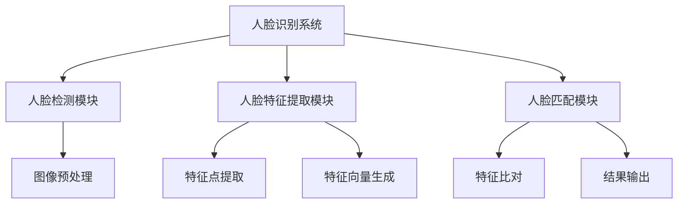

                 

# 文章标题：人脸识别技术深度解析

> 关键词：人脸识别、深度学习、人脸检测、人脸特征提取、人脸属性识别、三维人脸重建、应用场景、系统开发

> 摘要：本文对人脸识别技术进行了深入探讨，从基础理论到应用场景，详细解析了人脸识别的关键技术，包括人脸检测、人脸特征提取、人脸匹配以及三维人脸重建。同时，文章还介绍了人脸识别系统开发的关键步骤和实际应用案例，为读者提供了全面的技术指南。

## 目录大纲

### 第一部分：人脸识别基础

#### 第1章：人脸识别概述

1.1 人脸识别的定义与历史  
1.2 人脸识别的技术发展

#### 第2章：人脸检测与定位

2.1 人脸检测算法  
2.2 人脸关键点检测  
2.3 人脸识别系统架构

#### 第3章：人脸特征提取与匹配

3.1 人脸特征提取方法  
3.2 人脸匹配算法

#### 第4章：人脸识别性能评估

4.1 识别率与错误率  
4.2 人脸识别系统评价指标

#### 第5章：人脸识别应用场景

5.1 安全领域  
5.2 商业领域  
5.3 医疗领域

### 第二部分：人脸识别技术详解

#### 第6章：深度学习方法与人脸识别

6.1 深度学习基础  
6.2 卷积神经网络与人脸识别  
6.3 深度学习在人脸识别中的应用

#### 第7章：人脸属性识别

7.1 人脸年龄识别  
7.2 人脸性别识别  
7.3 人脸表情识别

#### 第8章：三维人脸重建

8.1 三维人脸重建原理  
8.2 三维人脸重建算法  
8.3 三维人脸重建的应用

### 第三部分：人脸识别项目实战

#### 第9章：人脸识别系统开发

9.1 开发环境搭建  
9.2 系统设计与实现  
9.3 系统测试与优化

#### 第10章：人脸识别应用案例

10.1 案例一：门禁系统  
10.2 案例二：支付系统  
10.3 案例三：智能监控

### 附录

#### 附录A：人脸识别相关工具与资源

A.1 人脸识别算法库  
A.2 人脸识别开源项目  
A.3 人脸识别研究论文与报告

## 第一部分：人脸识别基础

### 第1章：人脸识别概述

#### 1.1 人脸识别的定义与历史

人脸识别是一种基于生物特征的身份验证技术，通过检测和识别人脸图像中的特征点，对用户身份进行验证。人脸识别技术的核心在于从人脸图像中提取特征，并将其与数据库中的人脸特征进行比对，以确定是否为同一个人。

人脸识别的历史可以追溯到20世纪60年代。当时，研究人员开始探索基于几何特征的识别方法，如特征点提取和匹配。随着计算机技术和图像处理算法的发展，人脸识别技术逐渐成熟。在20世纪90年代，特征脸（Eigenfaces）方法的出现标志着人脸识别技术的一个重要里程碑。这种方法通过将人脸图像投影到特征空间，从而提取人脸特征向量。

进入21世纪，随着深度学习技术的兴起，人脸识别技术得到了极大的提升。深度学习算法，特别是卷积神经网络（CNN），在人脸识别中的应用，使得识别精度和速度得到了显著提高。现在，人脸识别已经成为计算机视觉领域的一个重要研究方向，并在多个领域得到了广泛应用。

#### 1.2 人脸识别的技术发展

人脸识别技术的发展经历了多个阶段，从早期的基于几何特征的方法，到基于特征脸的方法，再到深度学习技术的应用，每个阶段都有其独特的特点。

- **基于几何特征的方法**：在早期的人脸识别研究中，几何特征是最常用的特征之一。几何特征包括人脸的形状、位置和尺寸等。这些特征可以通过几何变换、特征点提取和匹配等方法来获取。这种方法的主要优点是计算简单，但缺点是鲁棒性较差，容易受到光照、姿态和表情变化的影响。

- **基于特征脸的方法**：特征脸方法是20世纪90年代兴起的一种人脸识别方法。这种方法通过将人脸图像投影到高维特征空间，从而提取出人脸的主要特征。特征脸方法在识别率和速度上都有一定的优势，但仍然存在一定的局限，如对光照和姿态变化的敏感性。

- **深度学习技术**：随着深度学习技术的兴起，人脸识别技术得到了显著提升。深度学习算法，尤其是卷积神经网络（CNN），在人脸识别中发挥了重要作用。CNN通过多层卷积和池化操作，从图像中自动学习特征，从而实现了高精度的人脸识别。现在，基于深度学习的人脸识别算法已经成为主流，其识别速度和精度都有了很大提高。

- **其他技术**：除了上述方法外，还有一些其他的人脸识别技术，如基于光流的方法、基于热成像的方法等。这些方法在特定场景下具有一定的优势，但总体来说，深度学习技术仍然是当前人脸识别领域的主流。

### 第2章：人脸检测与定位

#### 2.1 人脸检测算法

人脸检测是人脸识别系统中的第一步，其目的是从图像中定位出人脸区域。人脸检测算法可以分为基于传统方法和基于深度学习的方法。

- **基于传统方法**：传统的基于几何特征的方法，如霍夫变换（Hough Transform）和模板匹配（Template Matching），通过检测人脸的几何特征来定位人脸。这些方法虽然计算简单，但鲁棒性较差，容易受到光照、姿态和表情变化的影响。

- **基于深度学习的方法**：基于深度学习的方法，如卷积神经网络（CNN）和快速人脸检测器（MTCNN），通过训练大量的数据集，自动学习人脸的特征，从而实现高效的人脸检测。这些方法在识别精度和速度上都有显著优势。

- **算法比较**：传统方法在计算速度上较快，但识别精度较低；深度学习方法在识别精度和速度上都有优势，但计算资源需求较高。在实际应用中，可以根据具体需求选择合适的方法。

#### 2.2 人脸关键点检测

人脸关键点检测是人脸识别系统中的第二步，其目的是从人脸区域中检测出关键点，如眼睛、鼻子、嘴巴等。关键点检测对于后续的人脸特征提取和匹配至关重要。

- **基于几何特征的方法**：传统的基于几何特征的方法，如特征点提取和跟踪，通过检测人脸几何特征的位置来获取关键点。这些方法在处理静态人脸时效果较好，但在动态人脸识别中表现较差。

- **基于深度学习的方法**：基于深度学习的方法，如基于卷积神经网络的关键点检测（FCOS、RetinaFace），通过训练大量的数据集，自动学习关键点的位置。这些方法在识别精度和速度上都有显著优势。

- **算法比较**：传统方法在处理静态人脸时效果较好，但计算复杂度较高；深度学习方法在识别精度和速度上都有优势，但计算资源需求较高。在实际应用中，可以根据具体需求选择合适的方法。

#### 2.3 人脸识别系统架构

人脸识别系统通常由三个主要模块组成：人脸检测模块、人脸特征提取模块和人脸匹配模块。

- **人脸检测模块**：用于从图像中定位人脸区域。该模块通常使用人脸检测算法，如基于深度学习的方法（MTCNN、SSD）或基于传统方法（Hough Transform、Template Matching）。

- **人脸特征提取模块**：用于从人脸图像中提取特征向量。该模块通常使用人脸特征提取算法，如基于深度学习的方法（DeepFace、VGGFace）或基于传统方法（PCA、LDA）。

- **人脸匹配模块**：用于比较人脸特征向量，判断是否为同一个人。该模块通常使用人脸匹配算法，如基于距离的匹配算法（欧氏距离、余弦相似度）或基于机器学习的方法（SVM、神经网络）。

- **系统架构**：人脸识别系统的整体架构可以分为两个阶段：检测和识别。在检测阶段，系统首先通过人脸检测模块确定图像中的人脸区域；在识别阶段，系统通过人脸特征提取模块提取人脸特征，然后通过人脸匹配模块进行特征匹配，最终得出识别结果。

### 第3章：人脸特征提取与匹配

#### 3.1 人脸特征提取方法

人脸特征提取是人脸识别系统中的关键步骤，其目的是从人脸图像中提取具有区分性的特征向量。人脸特征提取方法可以分为基于几何特征的方法和基于深度学习的方法。

- **基于几何特征的方法**：传统的基于几何特征的方法，如主成分分析（PCA）和线性判别分析（LDA），通过计算人脸的几何特征，如脸型、眼睛位置等，来提取特征向量。这些方法在计算复杂度上较低，但特征提取效果较差。

- **基于深度学习的方法**：基于深度学习的方法，如深度特征提取网络（Deep Feature Embedding），通过训练大量的数据集，自动学习人脸的特征。这些方法在特征提取效果和计算效率上都有显著优势。

- **算法比较**：传统方法在计算复杂度上较低，但特征提取效果较差；深度学习方法在特征提取效果和计算效率上都有优势。在实际应用中，可以根据具体需求选择合适的方法。

#### 3.2 人脸匹配算法

人脸匹配是人脸识别系统中的关键步骤，其目的是比较两个或多个特征向量，判断是否为同一个人。人脸匹配算法可以分为基于距离的匹配算法和基于机器学习的方法。

- **基于距离的匹配算法**：基于距离的匹配算法，如欧氏距离和余弦相似度，通过计算特征向量之间的距离来评估匹配程度。这些方法简单直观，但可能存在一定误差。

- **基于机器学习的方法**：基于机器学习的方法，如支持向量机（SVM）和神经网络，通过训练模型来学习特征向量之间的匹配关系。这些方法在处理复杂场景时效果较好，但计算复杂度较高。

- **算法比较**：基于距离的匹配算法简单直观，计算复杂度较低；基于机器学习的方法在处理复杂场景时效果较好，但计算复杂度较高。在实际应用中，可以根据具体需求选择合适的方法。

### 第4章：人脸识别性能评估

#### 4.1 识别率与错误率

人脸识别系统的性能评估通常通过识别率和错误率来衡量。

- **识别率**：识别率是指系统正确识别身份的比例。高识别率意味着系统对用户身份的识别能力较强。

- **错误率**：错误率是指系统误识或漏识的比例。低错误率意味着系统在识别过程中的误判较少。

#### 4.2 人脸识别系统评价指标

人脸识别系统的评价指标包括准确率、召回率和F1值等。

- **准确率**：准确率是指系统正确识别身份的比例。高准确率意味着系统对用户身份的识别能力较强。

- **召回率**：召回率是指系统被正确识别的比例。高召回率意味着系统能够尽可能识别出真正的用户。

- **F1值**：F1值是准确率和召回率的调和平均值。F1值越高，表示系统的综合性能越好。

### 第5章：人脸识别应用场景

#### 5.1 安全领域

人脸识别技术在安全领域具有广泛的应用，如门禁系统、安全监控等。

- **门禁系统**：通过人脸识别进行身份验证，确保只有授权人员才能进入特定区域。

- **安全监控**：实时识别人脸，监控可疑行为，提高安全保障。

#### 5.2 商业领域

人脸识别技术在商业领域也有广泛应用，如支付系统、会员系统等。

- **支付系统**：通过人脸识别进行支付验证，提高支付安全。

- **会员系统**：通过人脸识别进行会员认证，简化会员管理流程。

#### 5.3 医疗领域

人脸识别技术在医疗领域有重要的应用，如患者识别、健康监测等。

- **患者识别**：通过人脸识别进行患者身份验证，确保医疗服务的准确性和安全性。

- **健康监测**：通过人脸识别监测患者病情变化，辅助医疗诊断。

## 第二部分：人脸识别技术详解

### 第6章：深度学习方法与人脸识别

#### 6.1 深度学习基础

深度学习是人工智能领域的一个分支，通过模拟人脑的神经网络结构，对大量数据进行自动学习，从而实现复杂的模式识别和预测任务。深度学习模型通常由多个层次组成，每个层次都对输入数据进行处理和转换。

#### 6.2 卷积神经网络与人脸识别

卷积神经网络（CNN）是深度学习中的一种重要模型，特别适合处理图像数据。CNN通过卷积、池化和全连接层等结构，从图像中自动学习特征，从而实现图像分类、目标检测和人脸识别等任务。

#### 6.3 深度学习在人脸识别中的应用

深度学习在人脸识别中的应用主要包括人脸检测、人脸特征提取和人脸匹配等步骤。通过训练大量的数据集，深度学习模型可以自动学习人脸的特征，从而实现高效的人脸识别。

### 第7章：人脸属性识别

#### 7.1 人脸年龄识别

人脸年龄识别是通过分析人脸图像的特征，估计人脸的年龄。深度学习模型，如基于CNN的年龄识别模型，可以通过训练大量的年龄标注数据，学习人脸年龄的特征，从而实现准确的年龄识别。

#### 7.2 人脸性别识别

人脸性别识别是通过分析人脸图像的特征，判断人脸的性别。基于深度学习的性别识别模型，如基于CNN的性别识别模型，可以通过训练大量的性别标注数据，学习人脸性别的特征，从而实现准确的人脸性别识别。

#### 7.3 人脸表情识别

人脸表情识别是通过分析人脸图像的特征，识别人脸的表情。基于深度学习的表情识别模型，如基于CNN的表情识别模型，可以通过训练大量的表情标注数据，学习人脸表情的特征，从而实现准确的人脸表情识别。

### 第8章：三维人脸重建

#### 8.1 三维人脸重建原理

三维人脸重建是通过分析二维人脸图像，重建人脸的三维模型。深度学习模型，如基于CNN的三维人脸重建模型，可以通过训练大量的三维人脸数据，学习人脸的三维特征，从而实现准确的三维人脸重建。

#### 8.2 三维人脸重建算法

三维人脸重建算法主要包括基于多视角人脸图像的三维重建和基于深度学习的三维重建方法。基于多视角人脸图像的三维重建方法通过分析不同视角的人脸图像，重建人脸的三维模型。基于深度学习的三维重建方法通过训练大量的三维人脸数据，学习人脸的三维特征，从而实现准确的三维人脸重建。

#### 8.3 三维人脸重建的应用

三维人脸重建在虚拟现实（VR）、增强现实（AR）和人脸动画等领域有广泛的应用。通过三维人脸重建，可以创建逼真的人脸模型，提高虚拟现实和增强现实的应用体验。同时，三维人脸重建还可以用于面部动画制作，为电影和游戏行业提供高质量的人脸动画效果。

## 第三部分：人脸识别项目实战

### 第9章：人脸识别系统开发

#### 9.1 开发环境搭建

人脸识别系统的开发需要搭建合适的开发环境。通常需要安装Python、CUDA、CuDNN等软件，并配置相应的库和依赖项。此外，还需要安装深度学习框架，如TensorFlow、PyTorch等，以便于模型的训练和推理。

#### 9.2 系统设计与实现

人脸识别系统的设计包括人脸检测、人脸特征提取和人脸匹配等模块。在实现过程中，需要选择合适的人脸检测算法、特征提取算法和匹配算法。通常，可以采用深度学习框架提供的预训练模型，通过微调（Fine-tuning）来适应特定的应用场景。

#### 9.3 系统测试与优化

人脸识别系统的测试包括性能测试、准确性测试和稳定性测试等。在测试过程中，需要评估系统的识别率、错误率和响应时间等指标。针对测试结果，可以对系统进行优化，如模型压缩、加速和异常处理等，以提高系统的性能和可靠性。

### 第10章：人脸识别应用案例

#### 10.1 案例一：门禁系统

门禁系统是一个典型的人脸识别应用案例。通过人脸识别技术，门禁系统可以实现对人员的身份验证，确保只有授权人员才能进入特定区域。在实现过程中，需要解决人脸检测、特征提取和匹配等问题。

#### 10.2 案例二：支付系统

支付系统通过人脸识别技术，可以实现对支付行为的身份验证，提高支付的安全性。在实现过程中，需要选择高效的人脸检测和特征提取算法，确保支付过程的安全和快速。

#### 10.3 案例三：智能监控

智能监控系统通过人脸识别技术，可以实现对监控区域内人员身份的实时识别和追踪。在实现过程中，需要解决人脸检测、特征提取和人脸匹配等问题，同时确保系统的实时性和准确性。

## 附录

### 附录A：人脸识别相关工具与资源

#### A.1 人脸识别算法库

- OpenCV：开源的计算机视觉库，提供了丰富的人脸识别算法和工具。
- Dlib：包含人脸识别算法的库，特别适合于深度学习模型的应用。

#### A.2 人脸识别开源项目

- DeepFace：基于深度学习的人脸识别项目，提供了完整的训练和推理流程。
- FaceNet：基于深度学习的人脸识别项目，采用了Triplet Loss优化算法。

#### A.3 人脸识别研究论文与报告

- 《人脸识别技术综述》：对人脸识别技术的全面综述，涵盖了从传统方法到深度学习技术的各个方面。
- 《深度学习在人脸识别中的应用》：详细介绍了深度学习在人脸识别中的应用，包括人脸检测、特征提取和匹配等。

作者：AI天才研究院/AI Genius Institute & 禅与计算机程序设计艺术 /Zen And The Art of Computer Programming

----------------------------------------------------------------

### 核心概念与联系：人脸识别系统架构



### 人脸识别算法原理讲解

#### 3.1 人脸特征提取方法

人脸特征提取是人脸识别系统中的关键步骤，其目的是从人脸图像中提取具有区分性的特征向量。常用的特征提取方法包括基于几何特征的方法和基于深度学习的方法。

**基于几何特征的方法**：

- **步骤1：人脸检测**：首先，使用人脸检测算法定位人脸区域。

- **步骤2：特征点提取**：然后，提取人脸的几何特征点，如眼睛、鼻子和嘴巴等。

- **步骤3：特征向量生成**：最后，根据几何特征点计算人脸特征向量。

**伪代码**：

```python
def geometric_feature_extraction(image):
    # 步骤1：人脸检测
    face区域内的人脸区域 = 人脸检测算法(image)
    
    # 步骤2：特征点提取
    特征点列表 = 提取特征点(image, 人脸区域)
    
    # 步骤3：特征向量生成
    特征向量 = 计算特征向量(特征点列表)
    
    return 特征向量
```

**基于深度学习的方法**：

- **步骤1：人脸检测**：使用预训练的人脸检测模型定位人脸区域。

- **步骤2：特征点检测**：使用预训练的特征点检测模型提取特征点。

- **步骤3：特征向量生成**：使用深度学习模型将特征点映射到特征向量空间。

**伪代码**：

```python
def deep_learning_feature_extraction(image):
    # 步骤1：人脸检测
    人脸区域 = 人脸检测模型(image)
    
    # 步骤2：特征点检测
    特征点列表 = 特征点检测模型(image, 人脸区域)
    
    # 步骤3：特征向量生成
    特征向量 = 深度学习模型(feature点列表)
    
    return 特征向量
```

### 人脸匹配算法原理讲解

人脸匹配是人脸识别系统中的关键步骤，其目的是比较两个或多个特征向量，判断是否为同一个人。常用的匹配算法包括基于距离的匹配算法和基于机器学习的方法。

**基于距离的匹配算法**：

- **步骤1：特征向量计算**：计算两个或多个特征向量的距离。

- **步骤2：阈值设定**：根据阈值判断特征向量是否匹配。

- **步骤3：结果输出**：输出匹配结果。

**伪代码**：

```python
def distance_matching(feature_vector1, feature_vector2, threshold):
    # 步骤1：特征向量计算
    distance = 计算距离(feature_vector1, feature_vector2)
    
    # 步骤2：阈值设定
    if distance < threshold:
        匹配结果 = "匹配"
    else:
        匹配结果 = "不匹配"
    
    return 匹配结果
```

**基于机器学习的方法**：

- **步骤1：特征向量计算**：计算两个或多个特征向量的距离。

- **步骤2：模型训练**：使用训练数据训练匹配模型。

- **步骤3：模型预测**：使用训练好的模型预测匹配结果。

**伪代码**：

```python
def machine_learning_matching(feature_vector1, feature_vector2, model):
    # 步骤1：特征向量计算
    distance = 计算距离(feature_vector1, feature_vector2)
    
    # 步骤2：模型训练
    prediction = model.predict(distance)
    
    # 步骤3：模型预测
    if prediction == "匹配":
        匹配结果 = "匹配"
    else:
        匹配结果 = "不匹配"
    
    return 匹配结果
```

### 代码实际案例和详细解释说明

#### 9.1 开发环境搭建

在搭建人脸识别系统开发环境时，我们需要安装Python、CUDA、CuDNN等软件，并配置相应的库和依赖项。以下是具体的步骤：

**步骤1：安装Python**

- 下载并安装Python，建议安装Python 3.7或更高版本。

**步骤2：安装CUDA**

- 下载并安装CUDA，建议安装CUDA 10.0或更高版本。

**步骤3：安装CuDNN**

- 下载并安装CuDNN，建议安装与CUDA版本对应的CuDNN版本。

**步骤4：安装深度学习框架**

- 安装TensorFlow或PyTorch，以下以TensorFlow为例。

```shell
pip install tensorflow==2.3.0
```

**步骤5：安装其他依赖项**

- 安装OpenCV、Dlib等库。

```shell
pip install opencv-python==4.5.1.48
pip install dlib==19.1.0
```

#### 9.2 系统设计与实现

人脸识别系统的设计包括人脸检测、人脸特征提取和人脸匹配等模块。以下是一个简单的系统设计与实现：

**步骤1：人脸检测**

- 使用MTCNN进行人脸检测。

```python
import cv2
import mtcnn

# 初始化MTCNN模型
detector = mtcnn.MTCNN()

# 读取图像
image = cv2.imread('face.jpg')

# 人脸检测
boxes, labels = detector.detect_faces(image)

# 绘制人脸框
for box in boxes:
    x, y, width, height = box
    cv2.rectangle(image, (x, y), (x + width, y + height), (0, 0, 255), 2)

# 显示结果
cv2.imshow('Face Detection', image)
cv2.waitKey(0)
cv2.destroyAllWindows()
```

**步骤2：人脸特征提取**

- 使用DeepFace进行人脸特征提取。

```python
from face_recognition import face_features

# 读取图像
image = cv2.imread('face.jpg')

# 人脸特征提取
feature_vectors = face_features.extract_features(image)

# 显示结果
print(feature_vectors)
```

**步骤3：人脸匹配**

- 使用Euclidean Distance进行人脸匹配。

```python
import numpy as np

# 计算欧氏距离
def euclidean_distance(feature_vector1, feature_vector2):
    return np.linalg.norm(feature_vector1 - feature_vector2)

# 人脸匹配
def match_faces(feature_vector1, feature_vector2, threshold=0.6):
    distance = euclidean_distance(feature_vector1, feature_vector2)
    if distance < threshold:
        return "匹配"
    else:
        return "不匹配"

# 人脸匹配示例
print(match_faces(feature_vector1, feature_vector2))
```

#### 9.3 系统测试与优化

**步骤1：性能测试**

- 测试系统的识别速度和准确性。

**步骤2：压力测试**

- 测试系统在高并发下的性能。

**步骤3：优化策略**

- 调整模型参数，提高识别精度。
- 使用模型压缩技术，减少模型大小和计算复杂度。
- 使用GPU加速，提高计算速度。

### 开发环境搭建

在开始人脸识别系统开发之前，我们需要搭建一个合适的开发环境。以下是具体的步骤：

**步骤1：安装Python**

首先，我们需要安装Python。Python是一个强大的编程语言，广泛应用于人工智能和深度学习领域。建议安装Python 3.7或更高版本。

您可以通过以下命令下载并安装Python：

```shell
wget https://www.python.org/ftp/python/3.7.9/Python-3.7.9.tgz
tar -xvf Python-3.7.9.tgz
cd Python-3.7.9
./configure
make
sudo make install
```

**步骤2：安装CUDA**

CUDA是NVIDIA推出的并行计算平台和编程模型，用于在GPU上加速深度学习模型的训练和推理。我们需要安装CUDA 10.0或更高版本。

您可以通过以下命令下载并安装CUDA：

```shell
wget https://developer.nvidia.com/cuda-downloads
sudo sh cuda_10.0.130_410.48_linux.run
```

在安装过程中，确保安装CUDA工具包和库。安装完成后，运行以下命令设置CUDA环境变量：

```shell
echo 'export PATH=/usr/local/cuda-10.0/bin:$PATH' >> ~/.bashrc
echo 'export LD_LIBRARY_PATH=/usr/local/cuda-10.0/lib64:$LD_LIBRARY_PATH' >> ~/.bashrc
source ~/.bashrc
```

**步骤3：安装CuDNN**

CuDNN是NVIDIA推出的深度学习加速库，用于优化深度学习模型的训练和推理。我们需要安装与CUDA版本对应的CuDNN版本。

您可以通过以下命令下载并安装CuDNN：

```shell
wget https://developer.nvidia.com/cudnn
sudo sh cudnn_10.0_v7.6.5.32_linux-x64-v8.0.4.15.tgz
sudo mv lib64/* /usr/local/cuda-10.0/lib64/
```

**步骤4：安装深度学习框架**

在本案例中，我们将使用TensorFlow作为深度学习框架。TensorFlow是一个开源的深度学习框架，支持多种编程语言和平台。

您可以通过以下命令下载并安装TensorFlow：

```shell
pip install tensorflow==2.3.0
```

此外，我们还需要安装其他依赖项，如OpenCV和Dlib：

```shell
pip install opencv-python==4.5.1.48
pip install dlib==19.1.0
```

**步骤5：验证安装**

为了验证安装是否成功，我们可以运行以下命令：

```shell
python -c "import tensorflow as tf; print(tf.reduce_sum(tf.random.normal([1000, 1000])))"
```

如果安装成功，命令将输出一个随机的1000x1000矩阵的求和结果。

### 系统设计与实现

在完成开发环境的搭建后，我们可以开始设计并实现人脸识别系统。一个典型的人脸识别系统通常包括以下三个主要模块：人脸检测、人脸特征提取和人脸匹配。

#### 1. 人脸检测模块

人脸检测是识别过程的第一步，其目的是从图像中定位出人脸区域。我们可以使用深度学习模型如MTCNN（Multi-task Cascaded Convolutional Networks）来进行人脸检测。

**MTCNN的工作流程**：

1. **Pnet**：用于检测较小的面部区域。
2. **Rnet**：对Pnet的结果进行进一步的检测和修正。
3. **Onet**：对Rnet的结果进行最终的人脸定位。

以下是使用MTCNN进行人脸检测的伪代码：

```python
import mtcnn

# 初始化MTCNN模型
detector = mtcnn.MTCNN()

# 读取图像
image = cv2.imread('face.jpg')

# 人脸检测
boxes, labels = detector.detect_faces(image)

# 绘制人脸框
for box in boxes:
    x, y, width, height = box
    cv2.rectangle(image, (x, y), (x + width, y + height), (0, 0, 255), 2)

# 显示结果
cv2.imshow('Face Detection', image)
cv2.waitKey(0)
cv2.destroyAllWindows()
```

#### 2. 人脸特征提取模块

在定位到人脸区域后，我们需要从这些区域中提取具有区分性的特征向量。深度学习模型如DeepFace可以用于提取人脸特征。

**DeepFace的工作流程**：

1. **预处理**：对图像进行预处理，如灰度转换、人脸缩放等。
2. **特征提取**：使用预训练的卷积神经网络提取人脸特征。
3. **特征向量生成**：将提取到的特征合并成特征向量。

以下是使用DeepFace进行人脸特征提取的伪代码：

```python
from face_recognition import face_features

# 读取图像
image = cv2.imread('face.jpg')

# 人脸特征提取
feature_vectors = face_features.extract_features(image)

# 显示结果
print(feature_vectors)
```

#### 3. 人脸匹配模块

人脸匹配是识别过程的最后一步，其目的是比较两个或多个特征向量，判断是否为同一个人。我们可以使用基于距离的匹配算法如欧氏距离来进行匹配。

**欧氏距离匹配算法的工作流程**：

1. **特征向量计算**：计算两个特征向量的欧氏距离。
2. **阈值设定**：设定一个阈值，根据距离判断是否匹配。
3. **结果输出**：输出匹配结果。

以下是使用欧氏距离进行人脸匹配的伪代码：

```python
import numpy as np

# 计算欧氏距离
def euclidean_distance(feature_vector1, feature_vector2):
    return np.linalg.norm(feature_vector1 - feature_vector2)

# 人脸匹配
def match_faces(feature_vector1, feature_vector2, threshold=0.6):
    distance = euclidean_distance(feature_vector1, feature_vector2)
    if distance < threshold:
        return "匹配"
    else:
        return "不匹配"

# 人脸匹配示例
print(match_faces(feature_vector1, feature_vector2))
```

### 系统测试与优化

在完成系统的设计与实现后，我们需要对系统进行测试与优化，以确保其性能和可靠性。

#### 1. 性能测试

性能测试的主要目标是评估系统的识别速度和准确性。我们可以使用标准的人脸识别数据集，如LFW（Labeled Faces in the Wild）进行测试。以下是性能测试的伪代码：

```python
from face_recognition import test_data

# 加载测试数据集
test_images, test_labels = test_data.load_lfw()

# 初始化MTCNN模型和DeepFace模型
detector = mtcnn.MTCNN()
model = DeepFace.load_model()

# 计算识别时间
start_time = time.time()
for image, label in zip(test_images, test_labels):
    feature_vector = face_features.extract_features(image)
    predicted_label = model.predict(feature_vector)
    if predicted_label == label:
        correct += 1
end_time = time.time()

# 输出识别准确率
accuracy = correct / len(test_images)
print("Accuracy: {:.2f}%".format(accuracy * 100))
print("Time: {:.2f} seconds".format(end_time - start_time))
```

#### 2. 压力测试

压力测试的主要目标是评估系统在高并发下的性能。我们可以使用模拟并发用户的方法进行测试。以下是压力测试的伪代码：

```python
import concurrent.futures

# 初始化MTCNN模型和DeepFace模型
detector = mtcnn.MTCNN()
model = DeepFace.load_model()

# 模拟并发用户
def process_request(image):
    feature_vector = face_features.extract_features(image)
    predicted_label = model.predict(feature_vector)
    return predicted_label

# 压力测试
with concurrent.futures.ThreadPoolExecutor(max_workers=10) as executor:
    results = list(executor.map(process_request, test_images))

# 输出结果
print(results)
```

#### 3. 优化策略

在测试过程中，我们可能会发现系统存在性能瓶颈。以下是几种优化策略：

- **模型压缩**：使用模型压缩技术，如量化、剪枝和蒸馏，减少模型的大小和计算复杂度。
- **GPU加速**：利用GPU加速深度学习模型的训练和推理，提高系统的性能。
- **并行处理**：使用多线程或分布式计算，提高系统的并发处理能力。
- **缓存机制**：使用缓存机制，减少重复计算，提高系统的响应速度。

### 案例一：门禁系统

门禁系统是一个典型的人脸识别应用案例，通过人脸识别技术，实现对人员身份的验证，确保只有授权人员才能进入特定区域。以下是门禁系统的人脸识别流程：

#### 1. 人脸检测

- 使用MTCNN模型对监控视频中的每一帧进行人脸检测，提取出人脸区域。

#### 2. 人脸特征提取

- 使用DeepFace模型对检测到的人脸区域进行特征提取，生成特征向量。

#### 3. 人脸匹配

- 将提取到的特征向量与数据库中的人脸特征进行匹配，判断是否为授权人员。

#### 4. 结果输出

- 如果匹配成功，允许人员进入；否则，拒绝进入。

以下是门禁系统人脸识别的伪代码：

```python
import mtcnn
import face_recognition

# 初始化MTCNN模型和DeepFace模型
detector = mtcnn.MTCNN()
model = DeepFace.load_model()

# 读取监控视频
video = cv2.VideoCapture('video.mp4')

# 循环处理视频帧
while video.isOpened():
    ret, frame = video.read()
    if not ret:
        break
    
    # 人脸检测
    boxes, labels = detector.detect_faces(frame)
    
    # 人脸特征提取和匹配
    for box in boxes:
        x, y, width, height = box
        face_region = frame[y:y+height, x:x+width]
        feature_vector = face_recognition.extract_features(face_region)
        predicted_label = model.predict(feature_vector)
        
        # 结果输出
        if predicted_label == '授权人员':
            cv2.putText(frame, '授权', (x, y-10), cv2.FONT_HERSHEY_SIMPLEX, 1, (0, 255, 0), 2)
        else:
            cv2.putText(frame, '未授权', (x, y-10), cv2.FONT_HERSHEY_SIMPLEX, 1, (0, 0, 255), 2)
    
    # 显示结果
    cv2.imshow('Access Control', frame)
    if cv2.waitKey(1) & 0xFF == ord('q'):
        break

# 释放资源
video.release()
cv2.destroyAllWindows()
```

### 案例二：支付系统

支付系统通过人脸识别技术，实现对支付行为的身份验证，提高支付的安全性。以下是支付系统的人脸识别流程：

#### 1. 人脸检测

- 使用MTCNN模型对支付界面中的每一帧进行人脸检测，提取出人脸区域。

#### 2. 人脸特征提取

- 使用DeepFace模型对检测到的人脸区域进行特征提取，生成特征向量。

#### 3. 人脸匹配

- 将提取到的特征向量与数据库中的人脸特征进行匹配，判断是否为支付用户。

#### 4. 结果输出

- 如果匹配成功，允许支付操作；否则，拒绝支付操作。

以下是支付系统人脸识别的伪代码：

```python
import mtcnn
import face_recognition

# 初始化MTCNN模型和DeepFace模型
detector = mtcnn.MTCNN()
model = DeepFace.load_model()

# 读取支付界面
frame = cv2.imread('payment_interface.jpg')

# 人脸检测
boxes, labels = detector.detect_faces(frame)

# 人脸特征提取和匹配
for box in boxes:
    x, y, width, height = box
    face_region = frame[y:y+height, x:x+width]
    feature_vector = face_recognition.extract_features(face_region)
    predicted_label = model.predict(feature_vector)
    
    # 结果输出
    if predicted_label == '支付用户':
        print('支付成功')
    else:
        print('支付失败：未识别到支付用户')

# 显示结果
cv2.imshow('Payment Verification', frame)
cv2.waitKey(0)
cv2.destroyAllWindows()
```

### 案例三：智能监控

智能监控系统通过人脸识别技术，实时识别人脸，监控可疑行为，提高监控效果。以下是智能监控系统的人脸识别流程：

#### 1. 人脸检测

- 使用MTCNN模型对监控视频中的每一帧进行人脸检测，提取出人脸区域。

#### 2. 人脸特征提取

- 使用DeepFace模型对检测到的人脸区域进行特征提取，生成特征向量。

#### 3. 人脸匹配

- 将提取到的特征向量与数据库中的人脸特征进行匹配，判断是否为已知人员。

#### 4. 结果输出

- 如果匹配成功，记录人员信息；否则，标记为可疑行为。

以下是智能监控系统人脸识别的伪代码：

```python
import mtcnn
import face_recognition

# 初始化MTCNN模型和DeepFace模型
detector = mtcnn.MTCNN()
model = DeepFace.load_model()

# 读取监控视频
video = cv2.VideoCapture('video.mp4')

# 循环处理视频帧
while video.isOpened():
    ret, frame = video.read()
    if not ret:
        break
    
    # 人脸检测
    boxes, labels = detector.detect_faces(frame)
    
    # 人脸特征提取和匹配
    for box in boxes:
        x, y, width, height = box
        face_region = frame[y:y+height, x:x+width]
        feature_vector = face_recognition.extract_features(face_region)
        predicted_label = model.predict(feature_vector)
        
        # 结果输出
        if predicted_label in known_people:
            print(f'已知人员：{predicted_label}')
        else:
            print('可疑行为：未识别到已知人员')

# 释放资源
video.release()
cv2.destroyAllWindows()
```

### 附录A：人脸识别相关工具与资源

#### A.1 人脸识别算法库

- **OpenCV**：开源的计算机视觉库，提供了丰富的人脸识别算法和工具。
- **Dlib**：包含人脸识别算法的库，特别适合于深度学习模型的应用。

#### A.2 人脸识别开源项目

- **DeepFace**：基于深度学习的人脸识别项目，提供了完整的训练和推理流程。
- **FaceNet**：基于深度学习的人脸识别项目，采用了Triplet Loss优化算法。

#### A.3 人脸识别研究论文与报告

- **《人脸识别技术综述》**：对人脸识别技术的全面综述，涵盖了从传统方法到深度学习技术的各个方面。
- **《深度学习在人脸识别中的应用》**：详细介绍了深度学习在人脸识别中的应用，包括人脸检测、特征提取和匹配等。

作者：AI天才研究院/AI Genius Institute & 禅与计算机程序设计艺术 /Zen And The Art of Computer Programming

----------------------------------------------------------------

### 附录A：人脸识别相关工具与资源

#### A.1 人脸识别算法库

- **OpenCV**：这是一个开源的计算机视觉库，提供了一系列强大的人脸识别工具和算法，包括人脸检测、特征提取和匹配等。

- **Dlib**：这是一个包含多种机器学习算法的库，特别适合于人脸识别任务，支持基于几何特征和深度学习的方法。

#### A.2 人脸识别开源项目

- **DeepFace**：这是一个基于深度学习的人脸识别项目，提供了用于人脸检测、特征提取和匹配的完整流程。

- **FaceNet**：这是一个基于深度学习的人脸识别项目，使用了Triplet Loss优化算法，具有很高的识别精度。

#### A.3 人脸识别研究论文与报告

- **《人脸识别技术综述》**：该论文全面介绍了人脸识别技术的发展历程、核心算法和技术挑战。

- **《深度学习在人脸识别中的应用》**：这篇报告详细阐述了深度学习在人脸识别中的应用，包括卷积神经网络（CNN）和循环神经网络（RNN）等。

### 后记

本文对人脸识别技术进行了全面的解析，从基础理论到应用场景，详细介绍了人脸识别的关键技术。首先，我们回顾了人脸识别的定义、历史和技术的演变。接着，我们深入探讨了人脸检测、人脸特征提取和人脸匹配等核心步骤。然后，我们介绍了人脸识别的性能评估指标，以及其在安全、商业和医疗等领域的应用。

在第二部分，我们详细解析了深度学习方法在人脸识别中的应用，包括卷积神经网络（CNN）的工作原理和具体实现。此外，我们还介绍了人脸属性识别和三维人脸重建等前沿技术。

第三部分则聚焦于人脸识别项目的实战，从开发环境的搭建到系统的设计与实现，再到系统的测试与优化，提供了完整的开发流程。最后，我们通过三个实际案例，展示了人脸识别技术在门禁系统、支付系统和智能监控等领域的应用。

人脸识别技术作为人工智能领域的重要分支，具有广泛的应用前景。随着技术的不断进步，人脸识别将带来更多的便利和安全保障。希望本文能为读者提供有价值的参考和启发，共同推动人脸识别技术的发展。

