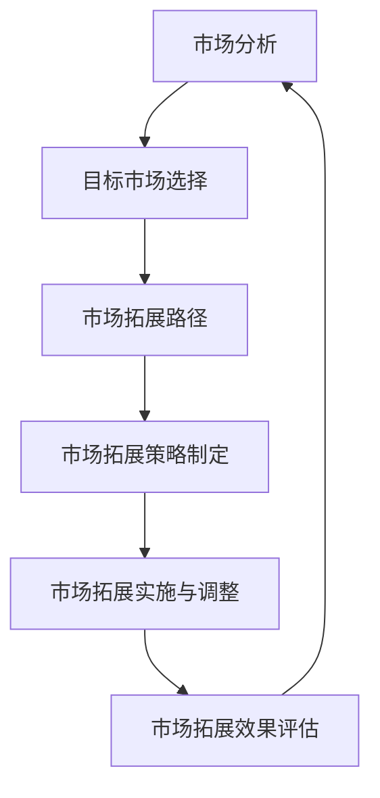

                 

### 文章标题：从B端到C端：Lepton AI的市场拓展策略

#### 关键词：市场拓展、Lepton AI、B端到C端、数据分析、人工智能

> 摘要：本文深入探讨了Lepton AI从B端到C端市场拓展的策略。首先，我们介绍了市场拓展策略的基本概念和重要性，接着详细阐述了市场分析与定位、市场拓展策略规划、市场拓展策略实施以及市场拓展效果评估与调整的方法。随后，本文以Lepton AI为例，通过市场拓展策略案例分析、实施细节和效果评估，详细解读了市场拓展策略在Lepton AI中的应用。最后，我们对市场拓展策略的核心概念、算法原理、数学模型进行了深度剖析，并展望了市场拓展策略的前沿趋势和未来发展方向。

---

### 《从B端到C端：Lepton AI的市场拓展策略》

#### # 第一部分：市场拓展策略基础

#### 第1章：市场拓展策略概述

##### 1.1 市场拓展的概念与重要性

**市场拓展**，顾名思义，是企业通过开发新的市场、拓展产品线、开拓销售渠道等手段，以实现市场占有率和业务增长的过程。市场拓展策略是企业为了实现这一目标而制定的系统性计划和行动方案。

##### 1.1.1 市场拓展的定义

市场拓展是指企业通过以下方式扩大其业务范围和市场份额：

- **开发新市场**：开拓新的地域市场，将产品或服务推广到尚未覆盖的区域。
- **拓展产品线**：通过开发新产品或服务，扩大企业的产品组合，满足不同客户群体的需求。
- **开拓销售渠道**：通过建立新的销售网络，如线上商城、分销合作伙伴等，增加销售途径。

##### 1.1.2 市场拓展的重要性

市场拓展对企业来说至关重要，具体表现在以下几个方面：

- **增加收入来源**：通过开拓新的市场和客户群体，企业可以增加收入来源，实现业务增长。
- **提升竞争力**：市场拓展可以帮助企业更好地应对市场变化，提升市场地位和竞争力。
- **分散风险**：通过多元化市场布局，企业可以降低单一市场风险，提高抗风险能力。
- **品牌影响力**：市场拓展有助于提升企业品牌影响力，树立良好的市场形象。

##### 1.2 市场拓展策略的基本框架

市场拓展策略的基本框架通常包括以下几个步骤：

1. **市场分析**：通过对市场需求、竞争态势、消费者行为等因素进行分析，为市场拓展提供数据支持。
2. **目标市场选择**：根据市场分析结果，选择具有发展潜力和竞争优势的目标市场。
3. **市场拓展路径选择**：确定市场拓展的具体路径，包括产品定位、品牌建设、营销策略等。
4. **市场拓展策略制定**：结合企业实际情况，制定科学合理的市场拓展策略。
5. **市场拓展策略实施与调整**：实施市场拓展策略，并根据市场反馈进行调整，确保市场拓展目标实现。

##### 1.3 市场拓展的挑战与机遇

市场拓展虽然具有诸多优势，但也面临着一系列挑战：

- **市场需求变化**：市场需求的变化对企业市场拓展策略的制定和调整提出了挑战，企业需要及时响应市场变化。
- **竞争加剧**：市场上竞争对手的增多，使得企业需要不断提高产品质量和服务水平，以保持竞争力。
- **政策法规限制**：不同国家和地区的政策法规可能对市场拓展产生限制，企业需要遵守相关法规，确保合规性。

然而，市场拓展也蕴藏着巨大的机遇：

- **新兴市场**：新兴市场的开发为企业提供了巨大的增长空间，特别是在发展中国家和地区。
- **产品升级换代**：随着技术的进步，企业可以通过产品升级换代，开拓新的市场领域。
- **跨界合作**：跨界合作可以为企业带来新的商业模式和市场机会，实现资源整合和优势互补。

##### 总结

市场拓展策略是企业实现业务增长和提升竞争力的关键手段。通过科学的规划和有效的实施，企业可以抓住市场机遇，应对挑战，实现长期稳定发展。

---

### 第2章：市场分析与定位

##### 2.1 市场分析的方法与工具

市场分析是市场拓展策略的基础，它涉及对市场环境的深入理解和分析。以下是市场分析常用的方法和工具：

##### 2.1.1 宏观环境分析

宏观环境分析主要关注外部环境对企业的影响。常用的分析方法包括：

- **PEST分析**：政治（Political）、经济（Economic）、社会（Social）、技术（Technological）分析，用于评估宏观环境因素对企业市场拓展的影响。
- **PESTLE分析**：在PEST分析的基础上，增加了法律（Legal）和生态（Environmental）因素，更加全面地分析宏观环境。

##### 2.1.2 微观环境分析

微观环境分析关注直接影响企业运营的因素，包括：

- **5力模型**：由波特提出，用于分析行业竞争态势，包括供应商、买家、潜在竞争者、替代品和现有竞争者。
- **SWOT分析**：分析企业的优势（Strengths）、劣势（Weaknesses）、机会（Opportunities）和威胁（Threats），帮助企业识别自身优劣势和外部环境的变化。

##### 2.1.3 消费者行为分析

消费者行为分析旨在了解消费者的购买行为和偏好，常用的工具包括：

- **问卷调查**：通过设计问卷，收集消费者的观点和反馈，了解他们的需求和行为模式。
- **深度访谈**：与消费者进行一对一访谈，深入了解他们的购买动机、购买习惯和偏好。

##### 2.2 目标市场的选择

选择目标市场是企业市场拓展成功的关键。以下步骤有助于企业选择合适的细分市场：

##### 2.2.1 市场细分

市场细分是指将整个市场划分为若干个具有相似需求和特征的子市场。常见的市场细分方法包括：

- **地理细分**：根据地域、国家、城市等因素划分市场。
- **人口细分**：根据人口统计特征，如年龄、性别、收入、职业等划分市场。
- **行为细分**：根据消费者的购买行为、使用习惯、忠诚度等划分市场。
- **心理细分**：根据消费者的价值观、生活方式、个性特征等划分市场。

##### 2.2.2 选择标准

选择目标市场时，企业应考虑以下标准：

- **市场潜力**：目标市场是否具有足够的增长空间和潜力。
- **竞争优势**：企业在目标市场上是否具备竞争优势，如技术优势、品牌影响力等。
- **资源条件**：企业是否有足够的资源和能力进入并服务于目标市场。
- **战略目标**：目标市场是否符合企业的长期战略发展方向。

##### 2.2.3 目标市场的确定

企业应根据市场细分结果和选择标准，确定最具潜力和竞争优势的目标市场。在确定目标市场时，应充分考虑市场容量、竞争态势、消费者需求和企业的资源能力。

##### 2.3 竞争对手分析

竞争对手分析是市场分析的重要部分，有助于企业了解竞争对手的定位、策略和优势，从而制定有效的市场拓展策略。以下是竞争对手分析的步骤：

##### 2.3.1 竞争对手的识别

通过市场调研和竞争分析，识别出与企业产品或服务相关的直接和间接竞争对手。

##### 2.3.2 竞争对手分析的方法

- **波特五力模型**：用于分析行业竞争态势，包括供应商、买家、潜在竞争者、替代品和现有竞争者。
- **波士顿矩阵**：根据市场份额和增长率，将竞争对手分为不同类别，如明星、现金牛、问题儿童和瘦狗。
- **SWOT分析**：分析竞争对手的优势、劣势、机会和威胁。

##### 2.3.3 对竞争对手的应对策略

根据竞争对手分析结果，企业可以制定以下应对策略：

- **差异化策略**：通过产品差异化、品牌差异化等手段，与竞争对手形成区别。
- **价格策略**：根据竞争对手的价格水平，制定合适的价格策略，如高价策略、低价策略等。
- **市场细分策略**：在竞争对手尚未覆盖的市场细分领域，寻找市场空缺，开拓新的市场机会。

##### 总结

市场分析与定位是市场拓展策略的核心环节。通过科学的市场分析，企业可以准确选择目标市场，制定有效的市场拓展策略，从而在激烈的市场竞争中立于不败之地。

---

### 第3章：市场拓展策略规划

市场拓展策略规划是确保企业市场拓展活动有序进行的关键步骤。一个全面、科学的规划可以帮助企业明确市场拓展的目标、路径和具体实施方法。以下是市场拓展策略规划的主要步骤和内容：

##### 3.1 市场拓展目标的制定

市场拓展目标的制定是市场拓展策略规划的首要任务。企业需要明确以下目标：

- **短期目标**：通常为1年或更短的时间范围内要实现的目标，如市场份额提升、销售额增长等。
- **长期目标**：通常为3年或更长时间范围内要实现的目标，如市场份额扩张、品牌知名度提升等。

在制定市场拓展目标时，企业应考虑以下因素：

- **市场现状**：根据市场分析结果，了解市场容量、竞争态势和消费者需求。
- **企业资源**：评估企业的资源条件，如资金、人力、技术等。
- **战略目标**：结合企业整体战略目标，确保市场拓展目标与企业发展方向一致。

##### 3.2 市场拓展路径的选择

市场拓展路径是指企业实现市场拓展目标的具体途径。企业可以根据自身的资源和市场环境选择以下几种市场拓展路径：

- **横向拓展**：通过开发新业务领域，扩大市场份额。例如，从B端市场拓展到C端市场。
- **纵向拓展**：通过深入挖掘现有客户需求，提供更全面的产品和服务。例如，从单纯的硬件产品拓展到软硬件一体化解决方案。
- **多元化拓展**：通过跨行业合作，实现产品线的多元化。例如，与金融行业合作，提供智能理财服务。
- **市场细分拓展**：针对不同的细分市场，制定针对性的拓展策略。例如，针对高端消费群体，提供定制化产品和服务。

在选择市场拓展路径时，企业应考虑以下因素：

- **市场潜力**：选择具有发展潜力和增长空间的市场路径。
- **竞争优势**：选择企业具备竞争优势和市场优势的市场路径。
- **资源条件**：确保企业有足够的资源和能力支持市场拓展路径的实施。

##### 3.3 市场拓展策略的制定

市场拓展策略的制定是市场拓展策略规划的核心。企业需要制定以下方面的策略：

- **产品策略**：根据市场拓展路径，制定产品开发计划，包括新产品研发、产品升级换代等。
- **品牌策略**：确定品牌定位、品牌形象和品牌传播策略，提升品牌知名度和美誉度。
- **价格策略**：根据市场环境和竞争态势，制定合理的产品定价策略，如高价策略、低价策略、差异化定价等。
- **渠道策略**：选择合适的销售渠道，包括直销、分销、电商平台等，确保产品能够顺利进入市场。
- **促销策略**：制定促销计划，包括广告宣传、促销活动、会员营销等，提高产品销量和市场份额。

在制定市场拓展策略时，企业应考虑以下因素：

- **市场分析结果**：根据市场分析结果，确定目标市场和竞争态势，为策略制定提供依据。
- **企业资源**：结合企业资源条件，制定切实可行的市场拓展策略。
- **战略目标**：确保市场拓展策略与企业发展目标一致，实现长期稳定发展。

##### 3.4 市场拓展策略实施与调整

市场拓展策略的实施是市场拓展策略规划的重要环节。企业需要制定详细的实施计划，确保市场拓展策略能够顺利执行。以下是市场拓展策略实施的主要步骤：

- **计划制定**：根据市场拓展策略，制定详细的实施计划，明确任务分工、时间表和资源分配。
- **执行监督**：对市场拓展策略的实施过程进行监督和检查，确保各项任务按时完成。
- **效果评估**：对市场拓展策略的实施效果进行评估，包括市场份额、销售额、客户满意度等指标。
- **调整优化**：根据市场反馈和评估结果，对市场拓展策略进行调整和优化，确保策略的有效性和适应性。

在市场拓展策略实施过程中，企业需要保持灵活性和应变能力，及时应对市场变化和竞争态势，确保市场拓展目标的实现。

##### 总结

市场拓展策略规划是企业实现市场拓展目标的关键步骤。通过科学的规划，企业可以明确市场拓展的目标、路径和具体策略，确保市场拓展活动的有序进行，从而在激烈的市场竞争中取得优势。

---

### 第4章：市场拓展策略实施

市场拓展策略的实施是确保市场拓展计划顺利执行的关键环节。一个成功的市场拓展策略不仅需要科学合理的规划，更需要通过有效的实施手段将其转化为实际的市场成果。以下是市场拓展策略实施的主要步骤和具体方法：

##### 4.1 品牌定位与传播

品牌定位是市场拓展策略的核心之一，它关系到企业能否在竞争激烈的市场中脱颖而出。品牌定位不仅仅是给品牌一个名字和标识，更是要明确品牌在消费者心中的形象和地位。

- **品牌定位的重要性**：品牌定位决定了企业的市场形象和消费者认知，是市场拓展的基础。一个清晰的品牌定位可以帮助企业在市场中建立差异化优势，提升品牌知名度和美誉度。
- **品牌定位的方法**：
  - **市场调研**：通过市场调研，了解消费者需求、竞争对手品牌定位以及市场趋势，为品牌定位提供数据支持。
  - **SWOT分析**：通过对企业自身的优势、劣势、机会和威胁进行分析，确定品牌定位的切入点。
  - **品牌价值主张**：明确品牌的核心价值和差异化优势，将其转化为消费者可以感知的品牌主张。

- **品牌传播策略**：品牌传播是品牌定位的外在体现，通过各种渠道将品牌形象传递给目标消费者。
  - **广告宣传**：通过广告宣传，提高品牌知名度和市场曝光度。选择合适的广告渠道，如电视、互联网、户外广告等。
  - **公关活动**：通过举办新闻发布会、产品发布会、行业论坛等活动，塑造品牌形象，提升品牌影响力。
  - **社交媒体营销**：利用社交媒体平台，与消费者进行互动，增强品牌与消费者的情感联系，提高品牌忠诚度。

##### 4.2 产品营销策略

产品营销策略是市场拓展策略的重要组成部分，它关系到产品的市场接受度和销售业绩。

- **产品定位**：产品定位是产品营销策略的基础。企业需要根据市场需求和竞争态势，确定产品的市场定位，明确产品的目标消费者和核心卖点。
- **价格策略**：合理的价格策略可以影响消费者的购买决策。价格策略包括高价策略、低价策略、渗透定价策略等。企业应根据市场环境、产品特点和消费者需求，选择合适的定价策略。
- **渠道策略**：渠道策略是产品进入市场的重要途径。企业需要选择合适的销售渠道，包括直销、分销、电商平台等，确保产品能够快速、广泛地覆盖目标市场。
- **促销策略**：促销策略是提高产品销量和市场份额的有效手段。企业可以通过广告促销、折扣促销、捆绑销售、会员营销等方式，激发消费者的购买欲望，提高销售业绩。

##### 4.3 渠道拓展与销售管理

渠道拓展和销售管理是市场拓展策略实施的关键环节，它关系到产品能否顺利进入市场并实现销售。

- **渠道拓展策略**：渠道拓展策略包括选择合适的渠道类型、建立渠道合作关系、制定渠道激励政策等。企业应根据市场环境和产品特点，选择最适合的渠道拓展策略。
- **销售团队建设**：销售团队是市场拓展的执行者，企业需要建设一支高效、专业的销售团队。包括销售人员的招聘、培训、激励等。
- **销售数据分析**：销售数据分析是优化销售策略的重要手段。企业通过对销售数据进行分析，可以发现销售过程中的问题和机会，及时调整销售策略。

- **客户关系管理**：客户关系管理是维护客户满意度和忠诚度的关键。企业需要建立有效的客户关系管理机制，包括客户信息管理、客户服务、客户反馈等。

##### 4.4 实施步骤与工具

- **实施步骤**：
  1. 制定详细的实施计划：明确市场拓展策略的执行步骤、时间表和责任人。
  2. 实施计划监督：对实施过程进行监控和检查，确保各项任务按时完成。
  3. 效果评估：对市场拓展策略的实施效果进行评估，包括市场份额、销售额、客户满意度等指标。
  4. 调整优化：根据评估结果，对市场拓展策略进行调整和优化，确保策略的有效性和适应性。

- **实施工具**：
  - **项目管理工具**：如Trello、Asana等，用于任务分配和进度管理。
  - **数据分析工具**：如Excel、Tableau等，用于销售数据分析和效果评估。
  - **社交媒体管理工具**：如Hootsuite、Sprout Social等，用于社交媒体营销活动管理。

##### 总结

市场拓展策略的实施是确保市场拓展计划顺利执行的关键。通过科学的品牌定位与传播、产品营销策略、渠道拓展与销售管理，企业可以有效地将市场拓展策略转化为实际的市场成果，实现业务增长和市场份额提升。

---

### 第5章：市场拓展效果评估与调整

市场拓展效果评估是衡量市场拓展策略实施效果的重要环节，它有助于企业了解市场拓展活动的成效，发现存在的问题，并据此进行调整和优化。以下是市场拓展效果评估的主要方法和步骤：

##### 5.1 市场拓展效果的评估指标

市场拓展效果的评估需要依据一系列指标进行，这些指标能够全面反映市场拓展活动的成效。以下是常用的评估指标：

- **市场份额**：企业在目标市场中的占有率，是衡量市场拓展成效的重要指标。
- **销售额**：市场拓展活动带来的销售收入，可以反映市场拓展的财务成果。
- **客户满意度**：消费者对产品和服务的满意度，是衡量市场拓展活动质量的重要指标。
- **渠道覆盖率**：企业在目标市场中的销售渠道覆盖率，是衡量市场拓展深度和广度的重要指标。
- **品牌知名度**：消费者对企业品牌的认知程度，是衡量市场拓展策略在品牌建设方面成效的重要指标。
- **市场反馈**：消费者对产品和服务的反馈，可以反映市场拓展活动的实际效果。

##### 5.1.1 评估指标的类型

- **定量指标**：如市场份额、销售额、渠道覆盖率等，可以通过数据统计和分析得出。
- **定性指标**：如客户满意度、品牌知名度、市场反馈等，需要通过问卷调查、访谈、市场调研等方式收集。

##### 5.1.2 评估指标的设定

在设定评估指标时，企业应考虑以下因素：

- **市场目标**：根据市场拓展策略和市场目标，设定具体的评估指标。
- **资源条件**：结合企业资源条件，选择可量化和可操作的评估指标。
- **竞争态势**：分析竞争对手的市场表现，设定具有竞争力的评估指标。
- **长期发展**：考虑企业的长期发展目标，设定能够持续衡量市场拓展效果的指标。

##### 5.2 市场拓展策略的调整

市场拓展策略的调整是基于效果评估结果，对市场拓展策略进行优化和调整，以实现更好的市场拓展成效。以下是市场拓展策略调整的方法：

- **发现与问题**：通过效果评估，发现市场拓展活动中存在的问题，如市场份额不足、客户满意度低等。
- **原因分析**：分析问题产生的原因，包括市场环境变化、竞争态势变化、企业内部管理问题等。
- **调整方案**：根据问题原因，制定相应的调整方案，包括产品调整、价格调整、渠道调整、促销策略调整等。
- **实施与监控**：实施调整方案，并对调整效果进行监控和评估，确保调整措施的有效性。

##### 5.2.1 调整的原因

市场拓展策略调整的原因可能包括：

- **市场环境变化**：如经济形势、政策法规、技术进步等外部因素的变化，可能需要企业调整市场拓展策略。
- **竞争态势变化**：竞争对手的市场策略变化，可能对企业市场拓展产生直接影响，需要企业及时调整策略。
- **企业战略调整**：企业战略方向的变化，可能要求市场拓展策略与之相适应，进行相应调整。
- **内部管理问题**：如组织结构、流程管理、人力资源管理等内部问题，可能影响市场拓展效果，需要调整策略。

##### 5.2.2 调整的方法

市场拓展策略调整的方法包括：

- **产品调整**：根据市场需求和消费者反馈，对产品进行改进和优化，提高市场竞争力。
- **价格调整**：根据市场环境和竞争态势，调整产品价格策略，如提高价格、降低价格、实行差异化定价等。
- **渠道调整**：根据市场拓展效果，优化销售渠道，如增加新渠道、改进渠道管理、提高渠道覆盖率等。
- **促销策略调整**：根据市场反馈和销售数据，调整促销策略，如增加促销活动、优化促销手段、提高促销效果等。

##### 总结

市场拓展效果评估与调整是市场拓展策略的重要组成部分。通过科学合理的评估，企业可以了解市场拓展活动的成效，发现存在的问题，并据此进行调整和优化，确保市场拓展策略的有效性和适应性，从而实现业务增长和市场拓展目标。

---

### 第二部分：Lepton AI案例实战

#### 第6章：Lepton AI产品概述

Lepton AI是一款基于人工智能技术的智能营销解决方案，旨在帮助企业通过个性化推荐、数据分析和智能决策，提升营销效果和客户体验。以下是Lepton AI的产品特点、应用场景和技术优势的详细概述。

##### 6.1 Lepton AI的产品特点

- **人工智能技术**：Lepton AI采用了深度学习和自然语言处理等先进的人工智能技术，能够处理海量数据并从中提取有价值的信息。
- **个性化推荐**：基于用户行为和偏好，Lepton AI能够提供个性化的产品推荐，提高用户满意度和转化率。
- **数据分析**：Lepton AI具备强大的数据分析能力，能够实时监控和分析市场趋势、消费者行为等，为企业提供决策支持。
- **智能决策**：通过机器学习算法，Lepton AI能够自动生成营销策略和决策建议，帮助企业优化营销活动。

##### 6.2 Lepton AI的应用场景

Lepton AI可以应用于多个行业和领域，以下是一些典型的应用场景：

- **电商平台**：通过个性化推荐，提高用户购物体验和转化率；通过数据分析，优化商品摆放和促销策略。
- **社交媒体**：根据用户行为和兴趣，提供个性化的内容推荐，提高用户粘性和活跃度；通过数据分析，了解用户需求和市场趋势。
- **广告营销**：通过精准投放，提高广告效果和投资回报率；通过数据分析，优化广告内容和投放策略。
- **金融服务**：通过用户行为分析，提供个性化的金融服务和投资建议；通过数据分析，识别潜在风险和机会。
- **零售行业**：通过个性化推荐，提高商品销售和库存管理效率；通过数据分析，优化供应链和门店运营。

##### 6.3 Lepton AI的技术优势

- **高效性**：Lepton AI采用了高效的人工智能算法，能够快速处理大量数据，提供实时分析和决策支持。
- **准确性**：基于大量数据和高级算法，Lepton AI能够提供准确的市场预测和个性化推荐，提高营销效果。
- **可扩展性**：Lepton AI支持多种数据源接入和算法扩展，能够适应不同行业和应用场景的需求。
- **易用性**：Lepton AI提供了友好的用户界面和便捷的操作流程，方便企业快速上手和使用。

##### 总结

Lepton AI作为一款智能营销解决方案，具有高效性、准确性和可扩展性等技术优势，可以广泛应用于多个行业和领域。通过个性化推荐、数据分析和智能决策，Lepton AI能够帮助企业提升营销效果和客户体验，实现业务增长。

---

### 第7章：市场拓展策略案例分析

Lepton AI作为一家专注于人工智能技术的企业，其市场拓展策略的成功实施是其业务快速增长和市场份额提升的关键因素。本章节将通过详细分析Lepton AI的市场拓展策略，探讨其市场分析过程、市场拓展路径选择和市场拓展策略制定。

##### 7.1 Lepton AI市场拓展策略的制定

Lepton AI在制定市场拓展策略时，首先进行了全面的市场分析。以下是其市场分析过程和市场拓展策略制定的详细步骤：

###### 7.1.1 市场分析

Lepton AI通过以下方法进行了市场分析：

- **宏观环境分析**：利用PESTLE分析法，对政治、经济、社会、技术、法律和生态环境进行了评估，了解外部环境对企业市场拓展的影响。
- **微观环境分析**：通过5力模型，分析了供应商、买家、潜在竞争者、替代品和现有竞争者的状况，评估行业竞争态势。
- **消费者行为分析**：通过问卷调查、用户访谈和数据分析，了解消费者的需求、购买行为和偏好，为产品开发和市场定位提供依据。

###### 7.1.2 目标市场选择

在市场分析的基础上，Lepton AI选择了以下目标市场：

- **电商行业**：电商行业对智能营销解决方案的需求较大，且电商平台的用户基数巨大，具有广阔的市场空间。
- **广告营销行业**：广告营销行业对数据分析和个性化推荐技术有强烈需求，通过提供精准投放和效果分析工具，可以帮助广告主提高广告效果。
- **金融服务行业**：金融服务行业对用户行为分析和风险管理有较高需求，Lepton AI的智能决策功能可以为金融机构提供有力支持。

###### 7.1.3 市场拓展路径选择

根据目标市场的特点和需求，Lepton AI选择了以下市场拓展路径：

- **产品创新**：持续研发和优化智能营销解决方案，满足不同行业和应用场景的需求。
- **合作伙伴关系**：与电商、广告和金融服务等行业的关键企业建立合作关系，通过战略合作和渠道拓展，共同开拓市场。
- **品牌推广**：通过广告宣传、公关活动和社交媒体营销，提高品牌知名度和市场影响力。

###### 7.1.4 市场拓展策略制定

基于市场分析和目标市场选择，Lepton AI制定了以下市场拓展策略：

- **产品策略**：推出多款智能营销解决方案，满足不同客户群体的需求。同时，提供定制化服务，满足特定行业的特殊需求。
- **品牌策略**：通过品牌故事、品牌形象设计和品牌传播，树立Lepton AI在智能营销领域的领导地位。
- **价格策略**：根据不同市场和客户需求，制定灵活的价格策略，如高价值定价、折扣定价和捆绑销售等。
- **渠道策略**：通过直销、分销和合作伙伴渠道，扩大市场覆盖面，提高产品销售和市场份额。
- **促销策略**：定期举办促销活动，如限时优惠、优惠券和会员活动等，刺激客户购买和增强品牌忠诚度。

##### 总结

Lepton AI通过科学的市场分析和精细的市场拓展策略制定，成功实现了从B端到C端的市场拓展。其市场拓展策略的成功实施，不仅提升了公司的市场份额和品牌影响力，也为客户提供了优质的智能营销解决方案。

---

### 第8章：Lepton AI市场拓展实施细节

市场拓展策略的成功实施需要具体的操作细节和有效的执行手段。本章节将详细讨论Lepton AI在市场拓展过程中，品牌定位与传播、产品营销策略、渠道拓展与销售管理的具体实施细节。

##### 8.1 Lepton AI品牌定位与传播

品牌定位与传播是市场拓展策略中的关键环节，它关系到品牌知名度和市场认可度。以下是Lepton AI在品牌定位与传播方面的具体实施细节：

###### 8.1.1 品牌定位

Lepton AI的品牌定位为“人工智能驱动的智能营销解决方案提供商”，旨在传达公司以人工智能技术为核心，提供高效、精准的智能营销服务。

- **核心价值**：高效性、精准性、可扩展性。
- **目标受众**：电商、广告、金融等行业的企业决策者和营销专业人员。

###### 8.1.2 品牌传播策略

为了提升品牌知名度和影响力，Lepton AI采用了以下品牌传播策略：

- **广告宣传**：在行业媒体、专业论坛和社交媒体上投放广告，增加品牌曝光度。
- **公关活动**：举办行业论坛、技术研讨会和产品发布会，与行业专家和媒体建立良好关系。
- **内容营销**：发布高质量的博客文章、白皮书和案例研究，分享智能营销的最佳实践和技术见解。
- **社交媒体营销**：通过微博、微信、LinkedIn等社交媒体平台，与目标受众进行互动，传播品牌价值。

##### 8.2 Lepton AI产品营销策略

产品营销策略是市场拓展的核心，它关系到产品的市场接受度和销售业绩。以下是Lepton AI在产品营销策略方面的具体实施细节：

###### 8.2.1 产品定位

Lepton AI的产品定位为高端智能营销解决方案，针对有较高技术需求和预算的企业。

- **核心卖点**：个性化推荐、数据分析和智能决策。
- **目标客户**：电商企业、广告公司、金融投资机构等。

###### 8.2.2 价格策略

为了满足不同客户的需求，Lepton AI采用了以下价格策略：

- **高价值定价**：针对有较高预算的大型企业，提供定制化的高端服务。
- **灵活定价**：根据不同客户的需求和预算，提供多种定价方案，如按需付费、包月付费等。
- **折扣定价**：对于长期合作的客户，提供优惠折扣，增强客户忠诚度。

###### 8.2.3 渠道策略

Lepton AI通过以下渠道推广产品：

- **直销**：直接向有需求的企业销售产品，提供专业的技术支持和售后服务。
- **分销**：与行业内的分销合作伙伴建立合作关系，通过他们的渠道推广产品。
- **电商平台**：在主流电商平台开设旗舰店，方便客户购买和咨询。

###### 8.2.4 促销策略

为了刺激销售和提升品牌知名度，Lepton AI采用了以下促销策略：

- **限时优惠**：定期推出限时优惠活动，如打折促销、免费试用等，吸引新客户。
- **会员活动**：设立会员体系，为会员提供专属优惠和增值服务，增强客户黏性。
- **合作促销**：与行业内的其他企业或机构合作，举办联合促销活动，扩大市场影响力。

##### 8.3 Lepton AI渠道拓展与销售管理

渠道拓展与销售管理是市场拓展策略实施的关键环节，它关系到产品的市场覆盖面和销售业绩。以下是Lepton AI在渠道拓展与销售管理方面的具体实施细节：

###### 8.3.1 渠道拓展策略

Lepton AI通过以下策略拓展销售渠道：

- **建立直销团队**：组建专业的直销团队，负责直接向客户销售产品，提供定制化解决方案。
- **发展分销伙伴**：与行业内的分销合作伙伴建立合作关系，通过他们的渠道推广产品。
- **电商平台合作**：与主流电商平台合作，开设旗舰店，提高产品曝光度和销售量。

###### 8.3.2 销售团队建设

Lepton AI注重销售团队的建设，具体措施包括：

- **招聘与培训**：招聘具有行业经验和营销技能的员工，进行系统化的培训，提升团队整体能力。
- **激励机制**：建立合理的激励机制，如销售奖金、提成制度等，激励员工提高销售业绩。
- **团队协作**：通过团队协作和跨部门合作，提升销售效率和市场拓展效果。

###### 8.3.3 销售数据分析

Lepton AI通过销售数据分析，优化销售策略，提升销售业绩：

- **销售数据收集**：收集销售数据，包括销售额、客户满意度、渠道反馈等。
- **数据分析**：使用数据分析工具，对销售数据进行详细分析，识别销售过程中的问题和机会。
- **调整优化**：根据数据分析结果，调整销售策略和渠道布局，优化销售流程，提升销售业绩。

##### 总结

Lepton AI通过科学的品牌定位与传播、精准的产品营销策略、有效的渠道拓展与销售管理，成功实现了市场拓展目标。其市场拓展实施细节的成功实践，为其他企业提供了宝贵的经验和参考。

---

### 第9章：Lepton AI市场拓展效果评估与调整

市场拓展效果评估是确保市场拓展策略有效性的关键步骤。通过评估市场拓展策略的实施效果，企业可以及时发现问题和不足，进行调整和优化，以实现更好的市场拓展成果。本章节将详细讨论Lepton AI的市场拓展效果评估方法、评估指标、调整原因和调整方法。

##### 9.1 Lepton AI市场拓展效果评估

Lepton AI通过以下方法和指标对市场拓展效果进行评估：

###### 9.1.1 评估方法

- **定量评估**：使用具体的数据指标进行评估，如市场份额、销售额、客户满意度等。
- **定性评估**：通过市场调研、用户反馈、竞争对手分析等定性方法，了解市场拓展活动的实际效果。

###### 9.1.2 评估指标

- **市场份额**：评估Lepton AI在目标市场中的占有率，反映市场拓展策略的市场效果。
- **销售额**：评估市场拓展活动带来的实际销售收入，衡量市场拓展策略的财务成效。
- **客户满意度**：评估客户对Lepton AI产品和服务的满意度，反映市场拓展策略的质量和客户体验。
- **渠道覆盖率**：评估Lepton AI销售渠道的覆盖范围和效果，衡量市场拓展策略的深度和广度。
- **品牌知名度**：评估Lepton AI品牌在目标市场中的知名度和影响力，反映品牌传播效果。

###### 9.1.3 评估过程

- **数据收集**：收集与市场拓展效果相关的数据，包括销售数据、客户反馈、市场调研结果等。
- **数据分析**：对收集的数据进行详细分析，识别市场拓展活动的成效和问题。
- **结果报告**：编写市场拓展效果评估报告，总结评估结果，提出改进建议。

##### 9.2 调整原因

Lepton AI在市场拓展过程中，可能会遇到以下原因需要进行调整：

- **市场环境变化**：如宏观经济形势、政策法规调整、行业趋势变化等，可能影响市场拓展策略的有效性。
- **竞争态势变化**：竞争对手的市场策略调整，可能对Lepton AI的市场拓展产生压力，需要调整策略以应对竞争。
- **内部管理问题**：如组织结构、流程管理、人力资源管理等内部问题，可能影响市场拓展活动的效率和质量，需要调整策略。
- **市场需求变化**：消费者需求的变化，可能需要调整产品定位、价格策略、渠道策略等，以更好地满足市场需求。

##### 9.3 调整方法

Lepton AI根据评估结果和市场环境变化，采取以下方法进行调整：

###### 9.3.1 产品策略调整

- **产品优化**：根据客户反馈和市场调研结果，对产品进行优化和改进，提升产品性能和用户体验。
- **产品创新**：根据市场趋势和行业需求，开发新产品或功能，扩大产品线，满足更多客户需求。

###### 9.3.2 价格策略调整

- **价格调整**：根据市场需求和竞争态势，调整产品价格策略，如提高价格、降低价格、实行差异化定价等。
- **促销活动**：举办促销活动，如限时优惠、捆绑销售、会员优惠等，刺激客户购买。

###### 9.3.3 渠道策略调整

- **渠道拓展**：根据市场反馈和竞争态势，拓展新的销售渠道，如电商平台、社交媒体等。
- **渠道优化**：对现有销售渠道进行优化，提高渠道效率和覆盖面，如加强直销团队建设、改进分销合作伙伴关系管理等。

###### 9.3.4 品牌传播策略调整

- **品牌定位**：根据市场反馈和竞争态势，调整品牌定位，明确品牌核心价值和市场差异化优势。
- **品牌传播**：优化品牌传播策略，如调整广告投放渠道、增加内容营销、加强与社交媒体的合作等。

##### 总结

Lepton AI通过科学的市场拓展效果评估和灵活的调整方法，确保市场拓展策略的有效性和适应性。通过不断优化产品、价格、渠道和品牌传播，Lepton AI能够更好地满足市场需求，提升市场拓展成效，实现持续增长。

---

### 第三部分：市场拓展策略深度剖析

#### 第10章：市场拓展策略核心概念与联系

市场拓展策略的深度剖析需要理解其核心概念与联系。以下是对市场拓展策略核心概念、架构以及它们之间关系的详细讲解。

##### 10.1 市场拓展策略核心概念概述

市场拓展策略的核心概念包括市场分析、目标市场选择、市场拓展路径、市场拓展策略制定和效果评估与调整。以下是这些概念的定义和相互关系：

- **市场分析**：市场分析是市场拓展策略的基础，包括宏观环境分析、微观环境分析和消费者行为分析等。市场分析为市场拓展策略提供了数据支持和现实依据。
- **目标市场选择**：目标市场选择是在市场分析的基础上，根据市场潜力和竞争态势，确定企业要进入的市场。目标市场选择直接影响市场拓展策略的有效性和可行性。
- **市场拓展路径**：市场拓展路径是企业在实现市场拓展目标的过程中采取的具体步骤和手段。常见的市场拓展路径包括横向拓展、纵向拓展、多元化拓展等。
- **市场拓展策略制定**：市场拓展策略制定是基于市场分析、目标市场选择和市场拓展路径，制定具体的策略和方法，包括产品策略、价格策略、渠道策略、促销策略等。
- **效果评估与调整**：效果评估与调整是市场拓展策略实施后的评估和优化过程。通过评估市场拓展效果，发现存在的问题，并进行调整，确保市场拓展策略的有效性和适应性。

##### 10.2 市场拓展策略架构 Mermaid 流程图

为了更直观地展示市场拓展策略的架构，我们可以使用Mermaid流程图来表示各个核心概念之间的关系。

在这个流程图中，市场分析是起点，通过目标市场选择确定目标市场，然后制定市场拓展路径和策略，实施市场拓展活动，并不断进行效果评估与调整，形成一个闭环。

##### 10.3 市场拓展策略核心概念之间的联系

市场拓展策略中的各个核心概念之间紧密联系，相互影响。以下是这些概念之间的联系：

- **市场分析**决定了市场拓展策略的基础和方向，为后续的选择和制定提供依据。
- **目标市场选择**是市场分析的结果，它直接影响市场拓展路径和策略的制定。
- **市场拓展路径**是市场拓展策略的核心，它决定了市场拓展的具体实施方法和手段。
- **市场拓展策略制定**是将市场分析、目标市场选择和市场拓展路径转化为具体策略的过程。
- **效果评估与调整**是确保市场拓展策略有效性和适应性的关键，它通过不断反馈和调整，优化市场拓展策略。

##### 总结

市场拓展策略的核心概念与联系构成了一个完整的市场拓展框架。理解这些概念及其相互关系，有助于企业制定科学合理、切实可行的市场拓展策略，从而实现市场占有率和业务增长的目标。

---

### 第11章：市场拓展策略核心算法原理讲解

市场拓展策略的有效

