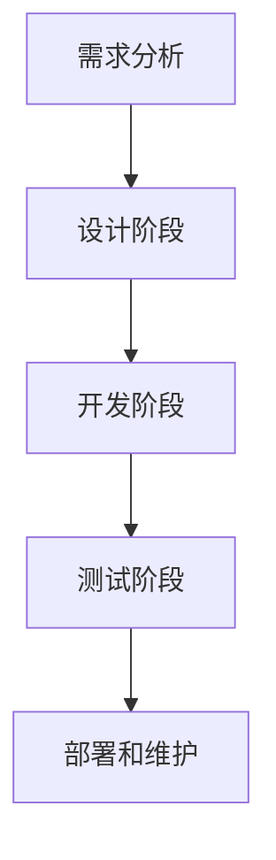
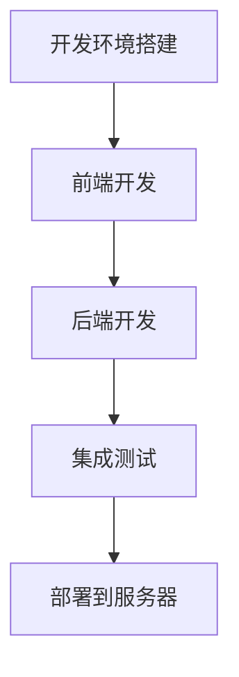

                 

# 文章标题：从全栈开发到技术创业

> 关键词：全栈开发、技术创业、前端开发、后端开发、数据库技术、项目实战、性能优化、安全与测试、自动化部署与持续集成、创业思维、市场运营、产品创新

> 摘要：本文旨在深入探讨从全栈开发到技术创业的完整过程。我们将首先介绍全栈开发的定义、核心技能和开发流程，然后详细讲解前端和后端开发技术，以及前后端通信技术。接下来，我们将通过一个全栈项目实战，展示全栈开发的实际应用。随后，我们将探讨全栈开发的进阶技术，包括性能优化、安全与测试、自动化部署与持续集成。最后，我们将转向技术创业，分析创业思维、产品设计与开发、融资与运营策略，以及市场竞争与持续创新。希望通过本文，读者能够全面了解并掌握从全栈开发到技术创业的知识和技能。

## 第一部分：全栈开发基础

### 第1章：全栈开发概述

#### 1.1 什么是全栈开发

全栈开发（Full Stack Development）指的是掌握前端、后端和数据库技术，能够独立完成整个Web应用程序的开发工作。与传统的分工明确的开发模式不同，全栈开发要求开发者具备全面的技术能力，能够在不同的技术层面进行工作。

全栈开发的优点在于：

1. **提升开发效率**：全栈开发者可以独立完成项目的各个环节，减少沟通成本和协作时间。
2. **增强问题解决能力**：全栈开发者对系统有整体理解，能够快速定位和解决复杂问题。
3. **提高职业竞争力**：掌握多种技术，能够适应不同的工作需求，增加职业发展的机会。

然而，全栈开发也存在一些缺点：

1. **学习成本高**：需要掌握多种技术，学习成本较高。
2. **开发周期长**：初期需要投入大量时间学习各种技术，可能延长项目开发周期。

#### 1.2 全栈开发与传统开发模式对比

传统开发模式通常分为前端开发、后端开发和数据库管理三个部分，每个部分由不同的团队负责。这种方式的优势在于专业化，每个团队成员专注于自己的领域，提高工作效率。然而，也存在着以下问题：

1. **沟通成本高**：不同团队之间的沟通和协调需要耗费大量时间。
2. **问题解决复杂**：由于对系统缺乏整体理解，团队成员可能难以快速解决跨领域的问题。
3. **效率受限**：专业化分工可能导致某些环节的瓶颈，影响整体项目进度。

相比之下，全栈开发模式通过将多个技术领域融合，提高了开发效率，减少了沟通成本，并且能够更好地解决复杂问题。

#### 1.3 全栈开发的核心技能

全栈开发涉及多个技术领域，以下是全栈开发者需要掌握的核心技能：

- **前端开发**：包括HTML、CSS、JavaScript等技术，负责用户界面的设计与实现。
- **后端开发**：包括Node.js、Django、Flask等技术，负责服务器端逻辑处理和数据存储。
- **数据库管理**：包括MySQL、PostgreSQL等关系型数据库，以及MongoDB等非关系型数据库，负责数据存储和管理。
- **网络编程**：包括HTTP协议、RESTful API等技术，负责前后端的数据通信。
- **前后端通信**：包括AJAX、Fetch API、WebSocket等技术，负责前端与后端的实时数据交互。

掌握这些核心技能，是成为一位合格全栈开发者的基础。

#### 1.4 全栈开发的工作流程

全栈开发的工作流程可以分为以下几个阶段：

- **需求分析**：与客户或产品经理沟通，了解项目需求，确定项目的目标、功能和性能要求。
- **设计阶段**：根据需求分析结果，进行系统架构设计和详细设计，包括前端界面设计、后端逻辑设计、数据库设计等。
- **开发阶段**：根据设计文档，进行前端和后端的开发工作，包括代码编写、调试和测试。
- **测试阶段**：对开发完成的功能进行测试，确保系统的正确性和稳定性。
- **部署和维护**：将系统部署到生产环境，进行上线，并进行长期的维护和更新。

通过以上阶段的工作，全栈开发者能够确保项目的成功实施和持续优化。

### 第2章：前端开发技术

#### 2.1 HTML与CSS基础

HTML（超文本标记语言）是网页内容的骨架，负责定义网页的结构和内容。CSS（层叠样式表）则负责网页的布局和样式，使网页内容更加美观。以下是HTML和CSS的基础知识：

- **HTML标签**：HTML标签用于定义网页中的元素，如`<div>`、`<p>`、`<a>`等。
- **CSS样式**：CSS样式用于控制网页元素的显示效果，如颜色、字体、大小等。
- **响应式设计**：通过媒体查询（`@media`）和弹性布局（Flexbox），实现网页在不同设备上的自适应显示。

掌握HTML和CSS基础，是进行前端开发的第一步。

#### 2.2 前端框架

前端框架提供了预构建的组件和库，帮助开发者更高效地进行前端开发。以下是当前最受欢迎的前端框架：

- **React**：由Facebook开发，以组件化为核心思想，易于学习和使用。
- **Angular**：由Google开发，提供了完整的开发平台，适合大型应用开发。
- **Vue**：由尤雨溪开发，兼具React和Angular的优点，适合快速开发小型到中型的应用。

选择合适的前端框架，可以显著提高开发效率和项目质量。

#### 2.3 JavaScript基础

JavaScript是前端开发的核心语言，负责实现网页的动态交互效果。以下是JavaScript的基础知识：

- **基本语法**：包括变量、函数、条件语句、循环语句等。
- **对象与函数**：包括对象字面量、构造函数、原型链、函数表达式等。
- **常用内置对象**：包括`Array`、`String`、`Math`、`Date`等，提供了丰富的操作方法。
- **ES6新特性**：包括`let`、`const`、`async/await`、`Promise`等，提升了代码的可读性和性能。

掌握JavaScript基础，是进行复杂前端开发的必备技能。

#### 2.4 前端工程化

前端工程化是指通过构建工具和自动化流程，提高前端开发的效率和质量。以下是当前流行的前端工程化工具：

- **Webpack**：模块打包工具，用于合并和压缩资源文件，提高加载速度。
- **Babel**：转译器，用于将ES6代码转译为ES5代码，兼容旧浏览器。
- **Vue CLI**：Vue.js的官方脚手架工具，用于快速搭建Vue项目。

使用前端工程化工具，可以显著提升前端项目的开发效率和稳定性。

### 第3章：后端开发技术

#### 3.1 常见后端框架

后端框架提供了预构建的组件和库，帮助开发者更高效地进行后端开发。以下是当前最受欢迎的后端框架：

- **Node.js**：基于JavaScript的后端框架，适合构建实时应用程序。
- **Django**：Python后端框架，以“快速开发”和“不重复发明轮子”为核心原则。
- **Flask**：Python后端框架，轻量级且灵活，适合小型项目。
- **Spring Boot**：Java后端框架，提供了丰富的功能和良好的性能，适合大型企业级应用。

选择合适的后端框架，可以显著提高后端开发的效率和质量。

#### 3.2 数据库技术

数据库是后端开发的核心组成部分，用于存储和管理数据。以下是常用的数据库技术：

- **关系型数据库**：如MySQL、PostgreSQL，适合结构化数据存储，支持复杂的查询操作。
- **非关系型数据库**：如MongoDB、Redis，适合快速读取和存储大量数据，适用于分布式系统。
- **数据库设计原则**：包括实体-关系模型（ER模型）、范式等，用于确保数据的完整性和一致性。

掌握数据库技术，是进行后端开发的基础。

#### 3.3 接口设计与实现

接口设计是后端开发的关键环节，决定了前端与后端的交互方式。以下是接口设计与实现的要点：

- **RESTful API设计**：基于REST原则，通过HTTP协议的GET、POST、PUT、DELETE等方法进行数据操作。
- **GraphQL**：一种查询语言，允许前端直接查询所需的数据，减少数据传输和浪费。
- **接口安全与优化**：包括数据验证、授权机制、缓存策略等，确保接口的安全和性能。

设计并实现良好的接口，是确保前后端高效协作的关键。

#### 3.4 后端安全

后端安全是保护系统免受恶意攻击和数据泄露的重要措施。以下是后端安全的要点：

- **数据库安全**：包括数据库备份与恢复、SQL注入防护等。
- **代码安全**：包括输入验证、输出编码、安全配置等，防止代码漏洞。
- **session与token管理**：包括用户认证、会话管理、令牌生成等，确保用户身份的安全。

确保后端安全，是保护系统数据的安全和用户隐私的关键。

### 第4章：前后端通信技术

#### 4.1 AJAX与Fetch API

AJAX（异步JavaScript和XML）是一种用于前后端数据交互的技术，通过XMLHttpRequest对象发送异步请求，获取数据并更新页面内容。Fetch API是现代浏览器提供的一种用于发送异步请求的API，具有更好的异步处理能力和更简洁的语法。

以下是AJAX和Fetch API的基本使用方法：

- **AJAX基本原理**：
  ```javascript
  function makeAjaxRequest(url) {
    var xhr = new XMLHttpRequest();
    xhr.open('GET', url);
    xhr.onload = function() {
      if (xhr.status === 200) {
        console.log(xhr.responseText);
      }
    };
    xhr.send();
  }
  ```

- **Fetch API使用**：
  ```javascript
  fetch('https://api.example.com/data')
    .then(response => response.json())
    .then(data => console.log(data))
    .catch(error => console.error('Error:', error));
  ```

#### 4.2 WebSockets

WebSockets是一种双向通信协议，允许服务器和客户端之间进行实时通信，适用于需要实时数据传输的应用，如聊天室、在线游戏等。

以下是WebSockets的基本原理和使用方法：

- **WebSocket协议**：
  - 客户端通过HTTP/HTTPS请求建立WebSocket连接。
  - 服务器响应建立连接，客户端与服务器之间进行双向通信。

- **WebSocket在实时通信中的应用**：
  - 实时数据推送：服务器向客户端发送实时更新的数据。
  - 实时消息传输：客户端与服务器之间发送实时消息。

- **实现WebSocket通信**：
  ```javascript
  // 客户端
  var ws = new WebSocket('wss://example.com/socket');
  ws.onmessage = function(event) {
    console.log('Received message:', event.data);
  };
  ws.send('Hello, server!');

  // 服务器
  var server = new WebSocketServer({ port: 8080 });
  server.on('connection', function(socket) {
    socket.on('message', function(message) {
      console.log('Received message:', message);
      socket.send('Hello, client!');
    });
  });
  ```

#### 4.3 GraphQL

GraphQL是一种查询语言，允许客户端直接查询所需的数据，减少了数据传输和浪费，提高了接口的性能和灵活性。

以下是GraphQL的基本概念和优势：

- **GraphQL基本概念**：
  - 查询语言：客户端通过编写GraphQL查询语句，获取所需的数据。
  - 类型系统：定义数据结构和类型，确保数据的完整性和一致性。

- **GraphQL查询**：
  ```graphql
  {
    user(id: "1") {
      name
      email
    }
  }
  ```

- **GraphQL优势**：
  - 减少数据传输：客户端仅获取所需的数据，减少了不必要的请求和传输。
  - 提高灵活性：允许动态查询，适应不同的数据需求。

### 第5章：全栈项目实战

#### 5.1 项目概述

本节将通过一个实际的全栈项目，展示全栈开发的完整流程。该项目是一个简单的博客系统，包括前端和后端两个部分。前端负责展示博客文章和用户界面，后端负责处理数据存储和业务逻辑。

#### 5.2 前端部分

前端部分使用Vue.js框架进行开发，包括以下功能模块：

- **文章展示**：通过Ajax请求从后端获取文章列表，并在前端进行渲染。
- **文章编辑**：允许用户对文章进行编辑和发布，通过WebSocket实现实时更新。
- **用户认证**：实现用户登录、注册和权限管理，使用JWT（JSON Web Token）进行身份验证。

前端部分的核心代码如下：

```javascript
// 文章展示
new Vue({
  el: '#app',
  data: {
    articles: [],
    isLoading: true
  },
  created() {
    this.fetchArticles();
  },
  methods: {
    fetchArticles() {
      fetch('https://api.example.com/articles')
        .then(response => response.json())
        .then(data => {
          this.articles = data;
          this.isLoading = false;
        });
    }
  }
});

// 文章编辑
new Vue({
  el: '#editor',
  data: {
    article: {
      title: '',
      content: ''
    },
    isEditing: false
  },
  methods: {
    submitArticle() {
      if (this.isEditing) {
        fetch('https://api.example.com/articles/' + this.article.id, {
          method: 'PUT',
          headers: {
            'Content-Type': 'application/json'
          },
          body: JSON.stringify(this.article)
        });
      } else {
        fetch('https://api.example.com/articles', {
          method: 'POST',
          headers: {
            'Content-Type': 'application/json'
          },
          body: JSON.stringify(this.article)
        });
      }
      this.isEditing = false;
      this.article = {
        title: '',
        content: ''
      };
    }
  }
});

// 用户认证
new Vue({
  el: '#auth',
  data: {
    user: {
      username: '',
      password: ''
    },
    isAuthenticated: false
  },
  methods: {
    login() {
      fetch('https://api.example.com/login', {
        method: 'POST',
        headers: {
          'Content-Type': 'application/json'
        },
        body: JSON.stringify(this.user)
      })
        .then(response => response.json())
        .then(data => {
          if (data.token) {
            localStorage.setItem('token', data.token);
            this.isAuthenticated = true;
          }
        });
    },
    logout() {
      localStorage.removeItem('token');
      this.isAuthenticated = false;
    }
  }
});
```

#### 5.3 后端部分

后端部分使用Node.js和Express框架进行开发，包括以下功能模块：

- **文章管理**：处理文章的增删改查（CRUD）操作，支持分页和搜索。
- **用户管理**：处理用户注册、登录和权限验证。
- **认证与授权**：使用JWT进行用户认证和授权。

后端部分的核心代码如下：

```javascript
const express = require('express');
const jwt = require('jsonwebtoken');
const app = express();

app.use(express.json());

// 文章管理
app.get('/articles', (req, res) => {
  // 获取文章列表，支持分页和搜索
});

app.get('/articles/:id', (req, res) => {
  // 获取指定文章
});

app.post('/articles', (req, res) => {
  // 添加新文章
});

app.put('/articles/:id', (req, res) => {
  // 更新指定文章
});

app.delete('/articles/:id', (req, res) => {
  // 删除指定文章
});

// 用户管理
app.post('/register', (req, res) => {
  // 用户注册
});

app.post('/login', (req, res) => {
  // 用户登录
});

// 认证与授权
app.use((req, res, next) => {
  // 验证用户身份
  const token = req.headers.authorization;
  if (!token) return res.status(401).send({ error: 'Unauthorized' });
  try {
    const decoded = jwt.verify(token, 'secretKey');
    req.user = decoded;
    next();
  } catch (err) {
    res.status(401).send({ error: 'Unauthorized' });
  }
});

const PORT = process.env.PORT || 3000;
app.listen(PORT, () => {
  console.log(`Server listening on port ${PORT}`);
});
```

#### 5.4 前后端集成

前后端集成是确保项目正常运行的关键环节。以下是前后端集成的要点：

- **API设计**：设计统一的API接口规范，确保前后端的数据交互清晰明确。
- **数据交互**：使用AJAX、Fetch API等技术，实现前后端的数据传输。
- **项目部署**：将前端和后端部署到服务器，确保项目的稳定运行。

通过以上步骤，全栈项目可以顺利上线，提供稳定的服务。

### 第6章：全栈开发进阶

#### 6.1 性能优化

性能优化是提高系统性能和用户体验的重要手段。以下是性能优化的一些技术手段：

- **网页性能优化**：包括资源压缩、代码分割、懒加载等技术，减少网页的加载时间和资源消耗。
- **后端性能优化**：包括数据库查询优化、缓存机制、异步处理等技术，提高系统的响应速度和处理能力。
- **缓存机制**：使用Redis、Memcached等缓存技术，提高数据读取速度和系统性能。

#### 6.2 安全与测试

安全与测试是确保系统稳定性和可靠性的重要保障。以下是安全与测试的一些要点：

- **安全漏洞与防范**：包括SQL注入、XSS攻击、CSRF攻击等常见漏洞的防范措施。
- **单元测试**：编写单元测试，验证代码的功能和性能。
- **集成测试**：在系统集成阶段进行测试，确保系统各个部分的功能和性能。

#### 6.3 自动化部署与持续集成

自动化部署与持续集成是提高开发效率和系统稳定性的重要手段。以下是自动化部署与持续集成的一些要点：

- **Jenkins**：使用Jenkins等持续集成工具，实现自动化测试和部署。
- **Docker**：使用Docker等技术，实现应用程序的容器化部署，提高部署效率和可移植性。
- **Kubernetes**：使用Kubernetes等容器编排工具，实现大规模应用的自动化部署和管理。

通过以上技术手段，可以显著提高全栈项目的开发效率和系统性能。

### 第7章：从全栈开发到技术创业

#### 7.1 创业思维培养

创业思维是成功创业的关键。以下是培养创业思维的一些要点：

- **创业者必备素质**：包括创新精神、抗压能力、团队协作等。
- **市场调研与定位**：通过市场调研，了解市场需求和竞争态势，确定产品定位和目标用户。
- **团队建设**：组建合适的团队，发挥每个人的优势，实现团队协作。

#### 7.2 产品设计与开发

产品设计与开发是创业的核心环节。以下是产品设计与开发的一些要点：

- **产品规划**：明确产品的功能、性能、用户体验等要求。
- **产品迭代**：根据用户反馈和市场变化，不断优化产品，提升用户体验。
- **用户反馈**：建立用户反馈机制，及时了解用户需求和问题，指导产品改进。

#### 7.3 融资与运营

融资与运营是确保创业项目持续发展的关键。以下是融资与运营的一些要点：

- **融资途径**：包括天使投资、风险投资、政府资金等，选择合适的融资方式。
- **市场推广**：通过线上线下渠道，扩大产品的知名度和用户基础。
- **运营策略**：包括用户增长、用户活跃度、内容运营等，提升产品价值。

#### 7.4 市场竞争与持续创新

市场竞争与持续创新是创业项目持续发展的动力。以下是市场竞争与持续创新的一些要点：

- **市场竞争分析**：分析竞争对手的优势和劣势，制定针对性的市场策略。
- **产品创新**：通过技术、设计、商业模式等方面的创新，提升产品竞争力。
- **技术创新**：持续投入研发，推动技术的创新和应用，提升产品的技术含量。

### 附录

#### 附录 A：全栈开发常用工具与资源

以下是全栈开发常用的一些工具与资源：

- **开发工具**：包括Visual Studio Code、Sublime Text、Atom等。
- **学习资源**：包括官方文档、在线教程、开源项目等。
- **实战项目推荐**：包括GitHub上的开源项目，用于学习和实践。

#### 附录 B：Mermaid 流程图示例

以下是前端开发流程图的示例：



以下是后端开发流程图的示例：


以下是项目部署流程图的示例：



#### 附录 C：伪代码示例

以下是前端逻辑伪代码的示例：

```javascript
// 初始化Vue实例
new Vue({
  el: '#app',
  data: {
    articles: [],
    isLoading: true
  },
  created() {
    this.fetchArticles();
  },
  methods: {
    fetchArticles() {
      fetch('https://api.example.com/articles')
        .then(response => response.json())
        .then(data => {
          this.articles = data;
          this.isLoading = false;
        });
    }
  }
});
```

以下是后端逻辑伪代码的示例：

```javascript
const express = require('express');
const jwt = require('jsonwebtoken');
const app = express();

app.use(express.json());

// 文章管理
app.get('/articles', (req, res) => {
  // 获取文章列表，支持分页和搜索
});

app.get('/articles/:id', (req, res) => {
  // 获取指定文章
});

app.post('/articles', (req, res) => {
  // 添加新文章
});

app.put('/articles/:id', (req, res) => {
  // 更新指定文章
});

app.delete('/articles/:id', (req, res) => {
  // 删除指定文章
});

// 用户管理
app.post('/register', (req, res) => {
  // 用户注册
});

app.post('/login', (req, res) => {
  // 用户登录
});

// 认证与授权
app.use((req, res, next) => {
  // 验证用户身份
  const token = req.headers.authorization;
  if (!token) return res.status(401).send({ error: 'Unauthorized' });
  try {
    const decoded = jwt.verify(token, 'secretKey');
    req.user = decoded;
    next();
  } catch (err) {
    res.status(401).send({ error: 'Unauthorized' });
  }
});

const PORT = process.env.PORT || 3000;
app.listen(PORT, () => {
  console.log(`Server listening on port ${PORT}`);
});
```

以下是数据库操作伪代码的示例：

```sql
// MySQL数据库操作
CREATE TABLE articles (
  id INT PRIMARY KEY AUTO_INCREMENT,
  title VARCHAR(255),
  content TEXT,
  created_at DATETIME
);

INSERT INTO articles (title, content, created_at) VALUES ('Hello World', 'This is a sample article.', NOW());

SELECT * FROM articles WHERE id = 1;

UPDATE articles SET title = 'Updated Title', content = 'Updated content.', created_at = NOW() WHERE id = 1;

DELETE FROM articles WHERE id = 1;
```

#### 附录 D：数学模型和公式

以下是前端性能优化的公式示例：

$$
T = \frac{1}{\sum_{i=1}^{n} w_i \cdot c_i}
$$

其中，$T$ 表示页面加载时间，$w_i$ 表示资源权重，$c_i$ 表示资源大小。

以下是后端性能优化的公式示例：

$$
P = C \cdot \frac{Q}{1000}
$$

其中，$P$ 表示服务器处理能力，$C$ 表示服务器配置，$Q$ 表示请求量。

以下是数据库设计的公式示例：

$$
NF_1 \cup NF_2 \cup ... \cup NF_k = UR
$$

其中，$NF_i$ 表示第 $i$ 个范式，$UR$ 表示用户关系。

通过以上数学模型和公式，可以更好地理解和优化系统性能。

### 作者信息

作者：AI天才研究院/AI Genius Institute & 禅与计算机程序设计艺术 /Zen And The Art of Computer Programming

在本文中，我们从全栈开发的定义、核心技能和工作流程入手，详细介绍了前端和后端开发技术，以及前后端通信技术。通过一个实际的全栈项目实战，我们展示了全栈开发的实际应用。随后，我们探讨了全栈开发的进阶技术，包括性能优化、安全与测试、自动化部署与持续集成。最后，我们转向技术创业，分析了创业思维、产品设计与开发、融资与运营策略，以及市场竞争与持续创新。希望本文能够帮助读者全面了解并掌握从全栈开发到技术创业的知识和技能。在未来的学习和实践中，不断探索和创新，实现自己的技术梦想。

