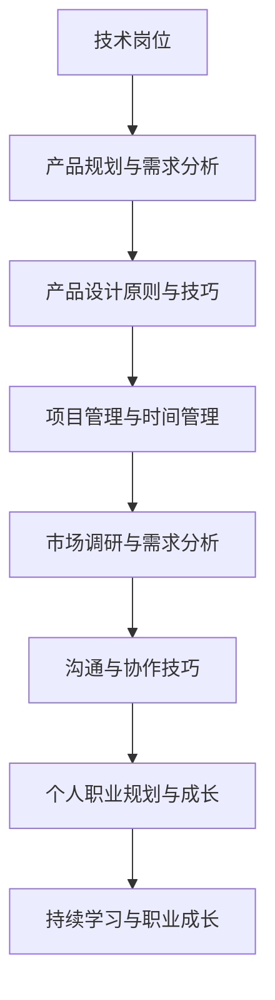

                 

# 《从技术岗位到产品经理的转型》

## 关键词
技术岗位，产品经理，职业转型，思维转变，技能提升，实战案例

> 摘要：本文旨在探讨技术岗位人员向产品经理角色转型的路径和方法。通过分析技术岗位与产品经理的职责差异，技术思维与产品思维的对比，以及转型所需的核心技能，为技术人员提供一条清晰的职业发展路径。

## 目录大纲

### 第一部分：转型准备

#### 第1章：技术岗位与产品经理的角色认知
1.1 技术岗位的职业发展路径
1.2 产品经理的工作职责和核心能力
1.3 技术背景对产品经理的重要性

#### 第2章：技术到产品思维的转变
2.1 技术思维与产品思维的对比
2.2 技术人员如何培养产品思维
2.3 技术人员转型产品经理的挑战

#### 第3章：产品经理的工作流程与方法论
3.1 产品规划与需求分析
3.2 产品设计与用户研究
3.3 项目管理与团队协作
3.4 数据分析与产品优化

### 第二部分：技能提升

#### 第4章：沟通与协作技巧
4.1 有效沟通的重要性
4.2 技术人员与非技术人员沟通策略
4.3 团队协作与冲突管理

#### 第5章：市场调研与需求分析
5.1 市场调研的方法和工具
5.2 需求收集与分析
5.3 用户画像与目标市场定位

#### 第6章：产品设计原则与技巧
6.1 产品设计的基本原则
6.2 用户界面设计与用户体验
6.3 产品原型设计与迭代

#### 第7章：项目管理与时间管理
7.1 项目管理的基本流程
7.2 时间管理技巧
7.3 团队协作中的风险管理

### 第三部分：实战演练

#### 第8章：从技术到产品的转型案例
8.1 案例一：技术工程师转型产品经理的成功故事
8.2 案例二：如何将技术优势转化为产品优势
8.3 案例三：跨部门协作中的技术产品经理角色

#### 第9章：个人职业规划与成长
9.1 职业发展规划的制定
9.2 技能提升路径与学习资源推荐
9.3 持续学习与职业成长

### 附录

#### 附录A：转型工具与资源推荐
A.1 产品管理工具的使用
A.2 产品管理相关书籍推荐
A.3 线上学习平台推荐

#### 附录B：技术到产品转型常见问题解答
B.1 技术人员如何开始产品经理的学习？
B.2 转型过程中遇到的常见困难及解决方案
B.3 转型成功的必备素质与能力

## Mermaid 流程图


## 从技术岗位到产品经理的转型

### 1. 技术岗位与产品经理的角色认知

#### 1.1 技术岗位的职业发展路径

技术人员在职业生涯中通常会经历以下几个阶段：

1. **初级工程师**：这个阶段的技术人员主要负责实现具体的开发任务，掌握基本的技术技能和编程能力。
2. **中级工程师**：这个阶段的技术人员需要具备一定的系统设计能力，能够独立完成中小型项目。
3. **高级工程师**：这个阶段的技术人员需要具备丰富的经验，能够解决复杂的技术问题，并对技术方向进行规划。
4. **技术专家**：这个阶段的技术人员通常是团队的技术领导者，负责技术方案的设计和决策。

#### 1.2 产品经理的工作职责和核心能力

产品经理的工作职责包括：

1. **需求分析**：理解用户需求，将需求转化为产品规格。
2. **产品规划**：根据市场需求和公司战略，制定产品规划和路线图。
3. **产品设计**：与设计团队合作，确保产品符合用户需求和市场趋势。
4. **项目管理**：协调开发团队，确保产品按时按质完成。
5. **市场推广**：与市场团队合作，制定市场推广计划。

产品经理需要具备以下核心能力：

1. **用户洞察**：理解用户需求，洞察用户行为。
2. **沟通能力**：与不同部门和人员有效沟通。
3. **数据分析**：能够通过数据驱动决策。
4. **项目协调**：能够有效管理项目进度和资源。

#### 1.3 技术背景对产品经理的重要性

技术背景对产品经理具有重要意义：

1. **技术理解**：能够与技术团队沟通，更好地理解技术实现的可能性。
2. **创新思维**：了解技术趋势，为产品创新提供支持。
3. **问题解决**：能够从技术角度分析问题，找到解决方案。

### 2. 技术到产品思维的转变

#### 2.1 技术思维与产品思维的对比

技术思维注重技术实现，关注的是如何解决技术问题。产品思维则注重用户需求，关注的是如何提供用户价值。

1. **技术思维**：追求技术上的极致，关注技术难题的解决。
2. **产品思维**：以用户为中心，关注用户需求和用户体验。

#### 2.2 技术人员如何培养产品思维

1. **多角度思考**：尝试从用户、市场、竞争对手等多个角度分析问题。
2. **用户调研**：与用户进行深入交流，了解用户需求和行为。
3. **数据驱动**：通过数据分析指导产品决策。

#### 2.3 技术人员转型产品经理的挑战

1. **角色转变**：从技术执行者到决策者，需要适应新的角色。
2. **技能提升**：需要掌握沟通、管理、市场调研等新技能。
3. **时间管理**：需要在有限的时间内完成多项任务。

### 3. 产品经理的工作流程与方法论

#### 3.1 产品规划与需求分析

1. **市场分析**：分析市场趋势，了解竞争对手。
2. **用户研究**：通过访谈、问卷等方式收集用户需求。
3. **需求整理**：将用户需求转化为产品需求。
4. **需求评审**：与团队共同评审需求，确保需求可实现。

#### 3.2 产品设计与用户研究

1. **设计原则**：遵循简洁、易用、美观等设计原则。
2. **原型设计**：使用Sketch、Axure等工具设计产品原型。
3. **用户测试**：通过用户测试，收集用户反馈。

#### 3.3 项目管理与团队协作

1. **项目计划**：制定项目计划，明确任务和时间节点。
2. **团队协作**：使用Git、JIRA等工具进行团队协作。
3. **风险管理**：预测潜在风险，制定应对策略。

#### 3.4 数据分析与产品优化

1. **数据收集**：收集用户行为数据。
2. **数据分析**：分析用户行为，优化产品体验。
3. **迭代优化**：根据分析结果，进行产品迭代。

### 4. 技能提升

#### 4.1 沟通与协作技巧

1. **有效沟通**：倾听、表达清晰、注重反馈。
2. **协作策略**：尊重团队成员，制定明确的协作目标。

#### 4.2 市场调研与需求分析

1. **市场调研**：使用问卷调查、用户访谈等方法。
2. **需求分析**：将用户需求转化为产品需求。

#### 4.3 产品设计与用户研究

1. **设计原则**：简洁、易用、美观。
2. **用户研究**：通过用户测试，收集用户反馈。

#### 4.4 项目管理与时间管理

1. **项目计划**：明确任务和时间节点。
2. **时间管理**：使用番茄工作法等技巧提高效率。

### 5. 实战演练

#### 5.1 案例一：技术工程师转型产品经理的成功故事

1. **背景**：一位有多年技术背景的工程师，转型为产品经理。
2. **过程**：通过学习产品管理知识，提升沟通协作能力。
3. **结果**：成功带领团队推出多款受欢迎的产品。

#### 5.2 案例二：如何将技术优势转化为产品优势

1. **背景**：一位技术专家，转型为产品经理。
2. **过程**：利用技术背景，优化产品设计，提升用户体验。
3. **结果**：产品获得用户好评，市场份额持续增长。

#### 5.3 案例三：跨部门协作中的技术产品经理角色

1. **背景**：技术产品经理在跨部门协作中的角色。
2. **过程**：协调技术、市场、设计等多部门，确保产品顺利推进。
3. **结果**：成功实现产品目标，提升团队协作效率。

### 6. 个人职业规划与成长

#### 6.1 职业发展规划的制定

1. **短期目标**：提升现有技能，寻找转型机会。
2. **长期目标**：成为优秀的行业专家。

#### 6.2 技能提升路径与学习资源推荐

1. **书籍推荐**：《产品经理手册》、《人人都是产品经理》。
2. **线上课程**：网易云课堂、腾讯课堂等。

#### 6.3 持续学习与职业成长

1. **定期学习**：每周阅读一篇相关文章，每月参加一次行业活动。
2. **实践反思**：通过实际项目，不断总结经验。

## 附录A：转型工具与资源推荐

#### A.1 产品管理工具的使用

1. **项目管理工具**：JIRA、Trello。
2. **原型设计工具**：Sketch、Axure。

#### A.2 产品管理相关书籍推荐

1. 《产品经理实战手册》。
2. 《人人都是产品经理》。

#### A.3 线上学习平台推荐

1. 网易云课堂。
2. 腾讯课堂。

## 附录B：技术到产品转型常见问题解答

#### B.1 技术人员如何开始产品经理的学习？

1. **了解产品管理基础知识**。
2. **学习相关技能**：如市场调研、需求分析、项目管理等。

#### B.2 转型过程中遇到的常见困难及解决方案

1. **困难**：角色转变带来的困惑。
   - **解决方案**：积极参与产品项目，逐步适应。
2. **困难**：技能不足。
   - **解决方案**：通过学习和实践，不断提升。

#### B.3 转型成功的必备素质与能力

1. **用户洞察**：理解用户需求。
2. **沟通能力**：与团队成员有效沟通。
3. **数据分析**：通过数据驱动决策。

### 伪代码：产品需求分析算法

```python
def productRequirementAnalysis(userNeeds, technicalCapabilities):
    # 初始化需求分析结果
    requirementResults = []

    # 分析用户需求
    for need in userNeeds:
        # 找到可以满足用户需求的最佳技术方案
        bestTechnicalSolution = findBestTechnicalSolution(need, technicalCapabilities)
        
        # 记录需求分析结果
        requirementResults.append({
            "userNeed": need,
            "technicalSolution": bestTechnicalSolution
        })
    
    # 返回需求分析结果
    return requirementResults
```

### 数学模型和数学公式

#### 用户满意度模型

$$
S = \frac{1}{n}\sum_{i=1}^{n} w_i \cdot U_i
$$

其中，$S$ 表示用户满意度，$n$ 表示用户数量，$w_i$ 表示第 $i$ 个用户的权重，$U_i$ 表示第 $i$ 个用户的满意度评分。

#### 用户满意度评分举例

假设有 5 个用户，他们的满意度评分分别为 4, 5, 3, 4, 5，权重分别为 0.2, 0.2, 0.2, 0.2, 0.2，则用户满意度为：

$$
S = \frac{1}{5} (4 \cdot 0.2 + 5 \cdot 0.2 + 3 \cdot 0.2 + 4 \cdot 0.2 + 5 \cdot 0.2) = 4.2
$$

### 项目实战

#### 案例一：产品需求分析实际案例

##### 1. 项目背景

在一家初创公司中，技术团队开发了一款智能助手应用，旨在帮助用户解决日常生活中的问题。

##### 2. 需求分析

- **用户需求**：用户希望能够通过智能助手获取天气预报、交通信息、健康咨询等。
- **技术能力**：技术团队具备自然语言处理、数据挖掘等人工智能技术。

##### 3. 需求分析过程

1. **用户访谈**：与潜在用户进行访谈，了解他们的具体需求和期望。
2. **需求分类**：将用户需求分类为天气预报、交通信息、健康咨询等。
3. **技术评估**：评估技术团队能否实现用户需求，确定优先级。

##### 4. 需求分析结果

- **天气预报**：通过API获取，技术团队可以快速实现。
- **交通信息**：需要与地图服务提供商合作，需要进一步评估。
- **健康咨询**：需要与医疗专家合作，优先级较低。

##### 5. 代码实现

- **API调用**：使用HTTP请求获取天气预报数据。
- **数据处理**：解析API返回的数据，提取关键信息。
- **用户界面**：设计用户界面，展示天气预报信息。

##### 6. 代码解读

```python
# API调用示例
import requests

def get_weather_forecast(city):
    api_url = f"http://api.weatherapi.com/v1/forecast.json?key=YOUR_API_KEY&q={city}&days=3"
    response = requests.get(api_url)
    return response.json()

# 数据处理示例
def process_weather_data(weather_data):
    forecast = weather_data['forecast']['forecastday']
    weather_info = []
    for day in forecast:
        weather_info.append({
            'date': day['date'],
            'temperature': day['day']['maxtemp_c'],
            'condition': day['day']['condition']['text']
        })
    return weather_info

# 用户界面示例
def display_weather_info(weather_info):
    for info in weather_info:
        print(f"{info['date']}: {info['temperature']}°C, {info['condition']}")
```

##### 7. 代码分析

- **API调用**：使用 requests 库发送HTTP请求，获取天气预报数据。
- **数据处理**：使用 json 模块解析API返回的JSON数据，提取关键信息。
- **用户界面**：使用 print 函数在控制台输出天气预报信息。

在实际项目中，我们还可以进一步优化代码，例如添加异常处理、缓存机制等，以提高代码的健壮性和性能。此外，我们还可以考虑使用前端框架（如 React、Vue 等）来构建用户界面，以提供更好的用户体验。此外，对于交通信息和健康咨询等需要合作的模块，技术团队可以与技术合作伙伴建立接口文档，确保数据传输的准确性和实时性。这些实战经验和技巧将有助于技术人员更好地完成产品需求分析，实现产品经理的角色转型。通过不断的实践和总结，技术人员可以逐步掌握产品经理所需的各项技能，从而在新的角色中取得成功。

## 作者

作者：AI天才研究院/AI Genius Institute & 禅与计算机程序设计艺术 /Zen And The Art of Computer Programming

