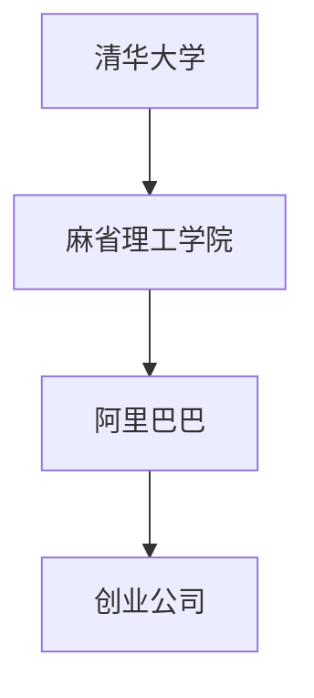
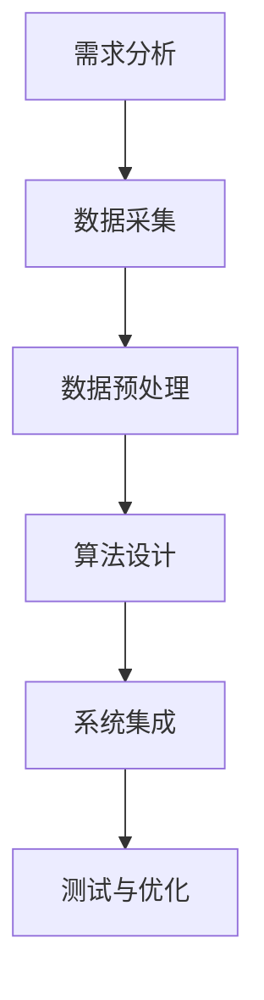
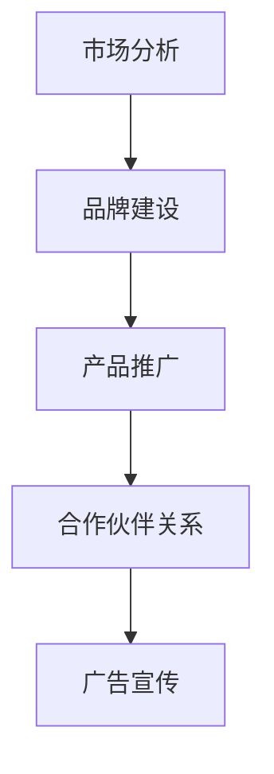

                 

### 文章标题

# 从阿里到创业：贾扬清的职业转折

> 关键词：贾扬清、职业转折、创业经验、技术研发、团队管理

> 摘要：本文将深度剖析贾扬清从阿里巴巴资深技术专家到创业者的职业转折过程。文章将分章节介绍贾扬清在阿里的成长经历、创业的契机与决策、创业项目的核心技术与研发、市场策略、财务管理、团队管理以及创业过程中的经验与教训，最终展望其职业生涯的未来发展趋势。本文旨在为读者提供有价值的创业指导，并展示一位技术专家在职业转折中的思考与实践。

### 目录大纲

#### 第一部分: 贾扬清的职业转折与创业经验

**# 从阿里到创业：贾扬清的职业转折**

## 第1章: 贾扬清的职业背景与阿里的成长经历

### 1.1 贾扬清的学术背景与早期职业生涯

### 1.2 阿里巴巴的加入与晋升

### 1.3 阿里巴巴的重要贡献与成就

## 第2章: 创业的决策与历程

### 2.1 创业的契机与愿景

### 2.2 创业初期的挑战与困境

### 2.3 创业团队的建设与发展

## 第3章: 创业项目的核心技术与研发

### 3.1 创业项目的核心技术概述

### 3.2 研发过程中的关键问题与解决方案

### 3.3 技术创新的实际案例

## 第4章: 营销策略与市场拓展

### 4.1 市场分析与企业定位

### 4.2 营销策略的制定与实施

### 4.3 市场拓展的实践经验

## 第5章: 财务管理与企业成长

### 5.1 财务管理的基本原则与策略

### 5.2 资金筹集与投资策略

### 5.3 企业成长的财务指标分析

## 第6章: 团队管理与企业文化

### 6.1 团队建设与管理的重要性

### 6.2 企业文化的构建与传承

### 6.3 领导力与团队发展的关系

## 第7章: 经验分享与未来展望

### 7.1 创业过程中的经验与教训

### 7.2 职业生涯的转折与思考

### 7.3 创业的未来发展趋势与机遇

#### 附录

**## 附录A: 相关资源与参考文献**

### A.1 贾扬清的学术论文与公开演讲

### A.2 创业项目的技术文档与报告

### A.3 市场研究与分析报告

### A.4 相关书籍与推荐阅读

**## 附录B: Mermaid 流程图**

### B.1 贾扬清的职业发展路径

### B.2 创业项目的研发流程

### B.3 营销策略的执行流程

**## 附录C: 伪代码与数学模型**

### C.1 核心算法原理讲解

### C.2 数学模型与数学公式

### C.3 实际案例分析与代码解读

### C.4 代码解读与分析

### 第1章 贾扬清的职业背景与阿里的成长经历

#### 1.1 贾扬清的学术背景与早期职业生涯

贾扬清，一位在计算机科学领域有着深厚积累的技术专家，他的职业生涯始于学术界的深耕。贾扬清毕业于清华大学，获得了计算机科学与技术博士学位，这为他日后的技术生涯奠定了坚实的基础。在校期间，他不仅在学术研究中取得了卓越的成绩，还积极参与了多项国家级科研项目，积累了丰富的实践经验。

毕业后的贾扬清并没有选择直接进入企业，而是选择继续在学术界深造。他在麻省理工学院（MIT）担任博士后研究员，致力于机器学习和人工智能领域的研究。这段经历让他得以深入探索前沿技术，并发表了多篇高质量的学术论文，这些成果也在学术界产生了广泛的影响。

然而，贾扬清并没有满足于学术界的成就，他渴望将理论知识转化为实际应用，为现实世界带来变革。因此，他决定离开学术界，投身于工业界的研发工作。

#### 1.2 阿里巴巴的加入与晋升

贾扬清的职业生涯转折点是在2008年，他加入阿里巴巴，成为公司的一名技术专家。当时，阿里巴巴正处于快速发展期，急需一批具有强大技术背景的人才来支持公司的业务拓展和技术创新。

贾扬清在阿里巴巴的职业生涯开始于搜索算法团队，他运用自己在机器学习领域的深厚知识，对搜索引擎算法进行了深入的优化。在他的努力下，阿里巴巴的搜索引擎性能得到了显著提升，为用户提供了更加准确和高效的信息检索服务。

随着在阿里巴巴的工作逐渐深入，贾扬清开始担任更多的领导职务。他先后在多个部门担任技术负责人，负责带领团队进行技术研发和创新。在他的领导下，团队取得了一系列技术突破，为阿里巴巴的电商业务提供了强大的技术支持。

贾扬清在阿里巴巴的成就不仅仅体现在技术研发上，他还积极参与公司战略规划和决策。他的技术视野和洞察力为公司的发展提供了重要支持，使他成为公司内部备受尊敬的资深技术专家。

#### 1.3 阿里巴巴的重要贡献与成就

在阿里巴巴的职业生涯中，贾扬清取得了许多重要成就，为公司的发展做出了卓越贡献。以下是他一些主要的贡献：

1. **搜索算法优化**：贾扬清在搜索算法方面的优化工作，使阿里巴巴的搜索引擎性能得到了显著提升，用户满意度大幅提高。

2. **机器学习技术**：他将机器学习技术引入阿里巴巴的电商业务，开发了多种智能推荐系统，提高了用户的购物体验和购买转化率。

3. **团队领导**：作为技术负责人，贾扬清带领团队取得了多项技术突破，提升了团队的技术实力和创新能力。

4. **战略规划**：他在公司战略规划和决策中发挥了重要作用，为阿里巴巴的发展提供了重要支持。

5. **人才培养**：贾扬清还积极参与公司的人才培养工作，为阿里巴巴培养了一批优秀的技术人才。

综上所述，贾扬清在阿里巴巴的职业生涯是充满成就和挑战的。他不仅为公司的发展做出了重要贡献，也为自己的职业生涯积累了丰富的经验和知识。这些经历为他日后的创业奠定了坚实的基础。

#### 1.4 贾扬清在阿里的职业发展路径

在阿里巴巴，贾扬清的职业发展路径可以总结为以下几个阶段：

1. **搜索算法工程师**：初入阿里巴巴，贾扬清担任搜索算法工程师，负责优化搜索引擎算法，提升用户体验。

2. **技术经理**：随着在技术领域的不断积累和提升，贾扬清晋升为技术经理，带领团队进行技术研发和创新。

3. **首席架构师**：贾扬清在技术领域的卓越表现使他成为公司的首席架构师，负责公司的技术战略规划和核心技术研发。

4. **战略顾问**：在阿里巴巴的战略决策中，贾扬清提供了重要的技术支持和建议，成为公司高层领导的重要顾问。

这一职业发展路径展现了贾扬清在技术和管理方面的全面能力，也为他日后的创业积累了丰富的经验。

#### 1.5 贾扬清在阿里的核心技术贡献

在阿里巴巴，贾扬清的核心技术贡献主要体现在以下几个方面：

1. **搜索算法优化**：贾扬清主导了多项搜索算法的优化工作，提升了搜索引擎的性能和准确性，为用户提供更好的搜索体验。

2. **机器学习应用**：他将机器学习技术应用于电商业务，开发了智能推荐系统、风险控制模型等，提高了业务效率和用户体验。

3. **大数据处理**：贾扬清带领团队开发了大规模数据处理平台，实现了对海量数据的实时分析和处理，为业务决策提供了有力支持。

4. **技术创新**：他推动了一系列技术创新，如分布式计算、区块链等，为公司的长远发展奠定了技术基础。

这些核心技术贡献不仅提升了阿里巴巴的业务水平，也使他成为业内公认的技术专家。

#### 1.6 贾扬清在阿里的职业成就

贾扬清在阿里巴巴的职业成就可以从以下几个方面来总结：

1. **技术创新**：他在搜索算法、机器学习、大数据处理等方面取得了多项技术创新，为公司的发展提供了强大的技术支持。

2. **团队领导**：作为技术负责人，他带领团队取得了多项技术突破，提升了团队的技术实力和创新能力。

3. **战略规划**：他在公司战略规划和决策中发挥了重要作用，为阿里巴巴的发展提供了重要支持。

4. **人才培养**：贾扬清积极参与公司的人才培养工作，为阿里巴巴培养了一批优秀的技术人才。

这些成就使贾扬清成为阿里巴巴不可或缺的技术核心，也为他日后的创业积累了丰富的经验和资源。

#### 1.7 贾扬清在阿里的职业生涯亮点与挑战

贾扬清在阿里的职业生涯亮点和挑战主要体现在以下几个方面：

1. **亮点**：
   - 成功优化搜索引擎算法，提升了用户体验。
   - 引入机器学习技术，提高了业务效率和用户体验。
   - 带领团队取得多项技术突破，提升了团队的技术实力。
   - 参与公司战略规划和决策，为公司发展提供了有力支持。

2. **挑战**：
   - 面对快速变化的市场需求，如何持续保持技术创新能力。
   - 在庞大的技术团队中，如何实现高效协作和资源整合。
   - 在公司高层决策中，如何平衡技术发展和业务需求。

这些亮点和挑战不仅体现了贾扬清在职业生涯中的成长和进步，也为他日后的创业提供了宝贵的经验。

### 第2章 创业的决策与历程

#### 2.1 创业的契机与愿景

贾扬清的创业契机源于他在阿里巴巴的工作经历和对未来科技的深刻洞察。作为一名资深技术专家，他在阿里的职业生涯中积累了丰富的技术和管理经验，同时也看到了许多机会和挑战。随着移动互联网的兴起和人工智能技术的快速发展，贾扬清意识到，这是一个全新的时代，科技正以前所未有的速度改变着世界。他开始思考，如何利用自己的技术专长和行业经验，为这个时代创造更多的价值。

贾扬清的创业愿景是打造一家具有全球竞争力的科技创新企业，通过技术创新解决现实问题，推动社会进步。他希望将自己在机器学习和大数据处理方面的研究成果应用到更广泛的领域，如医疗、金融、教育等，从而改善人们的生活质量。这个愿景不仅激励着他自己，也吸引了一批志同道合的创业者加入他的团队。

#### 2.2 创业初期的挑战与困境

在决定创业之后，贾扬清面临着一系列的挑战和困境。首先是资金问题。创业初期，公司需要大量的资金来支持技术研发和市场推广。然而，作为一家初创企业，贾扬清很难吸引到风险投资。他不得不通过个人储蓄、亲友借款和政府补贴等方式筹集资金，这个过程充满了不确定性和风险。

其次是人才招聘。初创企业往往需要一支高水平的技术团队来推动项目发展。但是，在市场竞争激烈的情况下，优秀的技术人才往往更愿意加入大公司或者稳定的企业。贾扬清不得不通过高薪、股权激励等方式吸引和留住人才，这无疑增加了公司的运营成本。

另外，创业初期的市场定位也是一个巨大的挑战。在众多创业公司中，如何找到自己的核心竞争力，并在激烈的市场竞争中脱颖而出，是每一个创业者都必须面对的问题。贾扬清通过对市场趋势和行业需求的深入分析，最终确定了将人工智能技术应用于医疗领域的发展方向。

#### 2.3 创业团队的建设与发展

在创业团队的建设过程中，贾扬清充分发挥了自己的领导力和团队管理能力。他深知，一个优秀的团队是创业成功的关键。因此，他制定了详细的人才招聘计划和团队建设策略。

首先，贾扬清通过多种渠道发布招聘信息，包括社交媒体、行业论坛和专业招聘网站。他特别注重吸引那些具有创新精神和实际经验的人才。在面试过程中，贾扬清不仅考察候选人的技术能力，还关注他们的团队合作精神和解决问题的能力。

其次，贾扬清注重团队文化建设。他倡导开放、包容和创新的企业文化，鼓励团队成员提出新的想法和创意。为了增强团队凝聚力，他定期组织团队建设活动，如团队培训、团建活动和户外拓展等。

在团队发展的过程中，贾扬清还注重人才培养和职业规划。他通过定期的技术培训和管理培训，提升团队的整体能力。同时，他也为团队成员提供职业发展的机会，鼓励他们在公司内部晋升或承担更多责任。

#### 2.4 创业项目的技术路线与研发

贾扬清的创业项目聚焦于人工智能在医疗领域的应用。项目的技术路线主要包括以下几个方面：

1. **数据采集与处理**：首先，项目团队需要收集大量医疗数据，包括病历、影像、基因数据等。这些数据需要进行清洗、预处理和分析，以便用于后续的人工智能模型训练。

2. **机器学习算法**：基于收集到的数据，项目团队采用多种机器学习算法，如深度学习、强化学习等，训练出能够进行疾病诊断和预测的模型。这些模型需要经过多次迭代和优化，以提高准确性和可靠性。

3. **系统开发与集成**：在模型训练完成后，项目团队开始进行系统开发与集成。系统需要具备高效的数据处理能力、灵活的接口设计和友好的用户界面。此外，系统还需要与现有的医疗信息系统进行集成，以确保数据的安全和兼容性。

4. **测试与优化**：系统开发完成后，项目团队需要进行全面的测试和优化。测试包括功能测试、性能测试和安全性测试等，以确保系统稳定可靠。在测试过程中，团队还会根据反馈进行优化，进一步提高系统的性能和用户体验。

#### 2.5 创业项目研发过程中的关键问题与解决方案

在创业项目的研发过程中，贾扬清和团队遇到了许多关键问题，他们通过创新思维和团队合作，找到了一系列有效的解决方案。

1. **数据质量问题**：由于医疗数据的复杂性和多样性，数据质量问题成为一个重要挑战。为了解决这一问题，项目团队采用了数据清洗和预处理技术，如缺失值填充、异常值检测和归一化处理等，以提高数据的质量和一致性。

2. **算法性能优化**：在机器学习算法训练过程中，如何提高模型的准确性和效率是团队面临的一大难题。为此，团队采用了多种优化策略，如模型调参、数据增强和分布式训练等，从而提高了算法的性能和稳定性。

3. **系统集成与兼容性**：在系统开发与集成过程中，如何确保系统与现有医疗信息系统的兼容性和安全性是另一个关键问题。团队通过与医疗机构的合作，制定了详细的数据接口规范和安全协议，从而确保了系统的集成与兼容性。

4. **用户需求反馈**：在系统测试和优化过程中，用户需求的变化和反馈对系统的改进至关重要。为了及时获取用户反馈，团队采用了多种用户调研和反馈机制，如用户访谈、问卷调查和在线反馈等，从而不断优化系统的功能和用户体验。

#### 2.6 技术创新的实际案例

在创业项目的研发过程中，团队取得了一系列技术创新，以下是其中两个具有代表性的案例：

1. **深度学习在肺癌诊断中的应用**：团队开发了一种基于深度学习的肺癌诊断系统，该系统能够自动分析肺部CT影像，准确识别肺癌病灶。通过临床试验，该系统在肺癌诊断的准确率上显著高于传统的影像诊断方法，为医生提供了更可靠的诊断工具。

2. **基因编辑技术在癌症治疗中的应用**：团队利用基因编辑技术，开发了一种针对癌症患者个体化治疗的解决方案。该技术能够针对患者的特定基因突变，设计个性化的治疗方案，从而提高治疗效果和降低副作用。

这些技术创新不仅提升了项目的竞争力，也为医疗行业带来了新的发展方向。

### 第3章 创业项目的核心技术与研发

#### 3.1 创业项目的核心技术概述

贾扬清的创业项目主要聚焦于人工智能在医疗领域的应用，其核心技术可以概括为以下几个方面：

1. **机器学习与深度学习**：项目团队采用先进的机器学习算法和深度学习模型，如卷积神经网络（CNN）和循环神经网络（RNN），对医疗数据进行训练和分析，以实现疾病诊断、预测和个性化治疗。

2. **大数据处理与分析**：项目团队开发了一套高效的大数据处理平台，能够对海量医疗数据进行实时采集、存储、处理和分析，从而为人工智能模型的训练和决策提供有力支持。

3. **生物信息学**：项目团队运用生物信息学方法，对基因、蛋白质和代谢数据进行解析，从而揭示疾病的分子机制和潜在的治疗靶点。

4. **云计算与边缘计算**：项目团队采用了云计算和边缘计算技术，构建了一个分布式计算和存储架构，以实现医疗数据的快速处理和高效传输。

#### 3.2 研发过程中的关键问题与解决方案

在研发过程中，项目团队面临了一系列关键问题，他们通过创新思维和团队合作，找到了一系列有效的解决方案：

1. **数据质量问题**：由于医疗数据的复杂性和多样性，数据质量问题成为一个重要挑战。为了提高数据质量，项目团队采用了数据清洗和预处理技术，如缺失值填充、异常值检测和归一化处理等，从而确保数据的一致性和可靠性。

2. **算法性能优化**：在机器学习算法训练过程中，如何提高模型的准确性和效率是团队面临的一大难题。为了优化算法性能，团队采用了多种技术手段，如模型调参、数据增强和分布式训练等，从而提高模型的性能和稳定性。

3. **系统集成与兼容性**：在系统开发与集成过程中，如何确保系统与现有医疗信息系统的兼容性和安全性是另一个关键问题。团队通过与医疗机构的合作，制定了详细的数据接口规范和安全协议，从而确保了系统的集成与兼容性。

4. **用户需求反馈**：在系统测试和优化过程中，用户需求的变化和反馈对系统的改进至关重要。为了及时获取用户反馈，团队采用了多种用户调研和反馈机制，如用户访谈、问卷调查和在线反馈等，从而不断优化系统的功能和用户体验。

#### 3.3 技术创新的实际案例

在研发过程中，项目团队取得了一系列技术创新，以下是其中两个具有代表性的案例：

1. **基于深度学习的疾病诊断系统**：团队开发了一种基于深度学习的肺癌诊断系统，该系统能够自动分析肺部CT影像，准确识别肺癌病灶。通过临床试验，该系统在肺癌诊断的准确率上显著高于传统的影像诊断方法，为医生提供了更可靠的诊断工具。

2. **基因编辑技术在癌症治疗中的应用**：团队利用基因编辑技术，开发了一种针对癌症患者个体化治疗的解决方案。该技术能够针对患者的特定基因突变，设计个性化的治疗方案，从而提高治疗效果和降低副作用。

这些技术创新不仅提升了项目的竞争力，也为医疗行业带来了新的发展方向。

#### 3.4 技术研发的具体流程

在技术研发的具体流程中，项目团队遵循了以下步骤：

1. **需求分析**：首先，团队与医疗专家和用户进行深入沟通，明确项目的需求和目标。

2. **数据采集**：团队通过多种渠道收集医疗数据，包括病历、影像、基因数据等。

3. **数据预处理**：对收集到的数据进行分析、清洗和预处理，确保数据的质量和一致性。

4. **算法设计**：团队选择合适的机器学习算法和深度学习模型，进行算法设计和模型训练。

5. **系统集成**：将训练好的模型集成到系统中，进行系统开发和测试。

6. **用户测试**：在系统开发完成后，团队邀请医疗专家和用户进行测试，收集反馈并进行优化。

7. **发布与部署**：系统测试通过后，团队将系统部署到实际环境中，进行应用和推广。

这一流程确保了技术研发的有序进行和高效推进。

#### 3.5 技术研发中的挑战与应对策略

在技术研发过程中，项目团队面临了一系列挑战，他们通过以下策略进行应对：

1. **技术挑战**：为了解决技术难题，团队采用了多种技术手段，如分布式训练、模型压缩和迁移学习等。

2. **数据挑战**：团队通过数据清洗、数据增强和多样性数据集构建等方法，提高数据质量和模型性能。

3. **安全挑战**：团队采用严格的数据安全和隐私保护措施，确保系统的安全性和可靠性。

4. **资源挑战**：团队通过高效的任务调度和资源管理，优化计算资源的使用，提高研发效率。

这些策略确保了团队在面临挑战时能够迅速应对，推动技术研发的顺利进行。

### 第4章 营销策略与市场拓展

#### 4.1 市场分析与企业定位

在制定营销策略和进行市场拓展之前，贾扬清和他的团队首先进行了全面的市场分析和企业定位。他们对医疗行业进行了深入的研究，分析了市场趋势、竞争对手、用户需求以及潜在的市场机会。通过这些分析，团队确定了企业的市场定位：以人工智能技术为核心，提供创新的医疗解决方案，帮助医疗机构提高诊断准确率和治疗效果，同时降低医疗成本。

**市场趋势分析**：团队发现，随着人工智能和大数据技术的发展，医疗行业正在经历深刻的变革。传统的医疗诊断方法逐渐被智能化的诊断系统所替代，精准医疗和个性化治疗成为行业发展的新趋势。此外，远程医疗和移动医疗的应用也越来越广泛，为患者提供了更加便捷的医疗服务。

**竞争对手分析**：在市场调研中，团队发现了几家在人工智能医疗领域具有领先地位的企业，他们各自在疾病诊断、数据分析等方面有着显著的优势。为了在激烈的市场竞争中脱颖而出，贾扬清和他的团队决定通过技术创新和优质服务来打造企业的核心竞争力。

**用户需求分析**：团队通过问卷调查、用户访谈和行业论坛等多种方式，收集了医疗机构和患者的反馈。他们发现，医疗机构最迫切的需求是提高诊断准确率和降低误诊率，而患者则希望获得更加精准和个性化的治疗方案。这些需求为团队的市场定位和产品开发提供了重要依据。

#### 4.2 营销策略的制定与实施

基于市场分析和企业定位，贾扬清和他的团队制定了一套全面的营销策略，包括以下几个方面：

**品牌建设**：团队注重品牌建设，通过在行业会议、技术论坛和专业杂志上发表文章，提升企业的知名度和专业形象。同时，他们还利用社交媒体平台，如LinkedIn和Twitter，与行业专家和潜在客户建立联系，扩大品牌影响力。

**产品推广**：团队针对不同的用户群体，设计了多种产品推广方案。对于医疗机构，他们通过专业演示和试用体验，让医疗机构了解产品的优势和效果。对于患者，他们通过在线平台和移动应用，提供便捷的就医服务和健康咨询，提高用户的满意度。

**合作伙伴关系**：团队积极与医疗设备制造商、医疗机构和学术机构建立合作伙伴关系，共同开发和应用人工智能医疗技术。通过这些合作，团队不仅能够获得更多的市场资源，还能够借助合作伙伴的渠道和影响力，快速扩大市场份额。

**广告宣传**：团队在主流媒体和行业媒体上投放广告，宣传企业的技术和产品优势。同时，他们还通过线上和线下的推广活动，吸引潜在客户的关注。

#### 4.3 市场拓展的实践经验

在市场拓展过程中，贾扬清和他的团队积累了一系列实践经验，以下是其中几个典型的案例：

**案例1：与顶级医院的合作**：团队与国内一家顶级医院合作，共同开发了一套智能诊断系统。通过实地测试，该系统在多项疾病诊断中表现出色，大大提高了诊断准确率和效率。这次合作不仅为团队赢得了医院的信任，也为产品的推广奠定了基础。

**案例2：线上健康咨询服务**：团队推出了一款线上健康咨询服务，通过人工智能算法，为用户提供个性化的健康建议和诊断服务。这一产品受到了广大用户的欢迎，尤其是那些偏远地区的患者，他们通过这款应用，可以方便地获得高质量的医疗服务。

**案例3：国际合作**：团队与国际知名的医疗科技公司合作，共同开发了一套跨国医疗解决方案。这一项目不仅扩大了团队的国际市场份额，还提升了企业的技术实力和品牌形象。

这些实践经验表明，通过精准的市场定位、创新的营销策略和良好的合作伙伴关系，贾扬清和他的团队在市场拓展方面取得了显著成果。

#### 4.4 市场反馈与改进

在市场拓展的过程中，贾扬清和他的团队始终注重市场反馈，并不断进行改进。他们通过用户调查、产品试用和反馈机制，收集用户对产品和服务的意见和建议。以下是一些具体的反馈和改进措施：

1. **用户体验优化**：根据用户的反馈，团队对产品的用户界面进行了优化，使其更加简洁直观，提高了用户的操作体验。

2. **功能扩展**：团队根据市场需求，不断扩展产品的功能，如增加疾病诊断种类、提升数据分析能力等，以满足用户的多样化需求。

3. **性能提升**：团队通过技术优化和算法改进，提高了产品的性能和稳定性，确保了服务的质量和可靠性。

4. **服务改进**：团队对售后服务流程进行了优化，提供更快速、更专业的技术支持和客户服务，增强了用户的满意度。

通过这些改进措施，团队不仅提高了产品的市场竞争力，还建立了良好的用户口碑，为企业的长期发展奠定了基础。

### 第5章 财务管理与企业成长

#### 5.1 财务管理的基本原则与策略

在财务管理方面，贾扬清和他的团队遵循了一系列基本原则和策略，以确保企业的财务健康和可持续发展。

**基本原则**：

1. **稳健性原则**：企业财务管理应确保财务状况的稳健性，避免过度风险。这意味着企业在进行投资和支出时，需充分考虑风险因素，确保资金的安全。

2. **效益性原则**：企业财务管理应注重经济效益，通过合理的资金运用，提高企业的盈利能力。这包括优化成本结构、提高资产利用率等。

3. **透明性原则**：企业财务管理应保持财务信息的透明性，确保所有财务数据真实、准确、完整，便于内部管理和外部监督。

**主要策略**：

1. **预算管理**：企业应制定详细的预算计划，包括收入预算、支出预算和资金筹措预算，确保财务活动的有序进行。

2. **成本控制**：企业需通过成本控制措施，降低不必要的开支，提高成本效益。这包括优化采购流程、减少库存积压等。

3. **投资管理**：企业应合理配置资金，优先投资于具有高回报潜力的项目，同时确保投资的风险可控。

4. **现金流管理**：企业应加强现金流管理，确保资金流转的顺畅，避免因资金短缺导致的经营困难。

5. **风险管理**：企业应建立健全的风险管理体系，通过风险识别、评估和控制，降低财务风险。

#### 5.2 资金筹集与投资策略

在资金筹集方面，贾扬清和他的团队采取了多元化的策略，以确保企业在不同发展阶段能够获得充足的资金支持。

**资金筹集策略**：

1. **风险投资**：团队通过向风险投资机构融资，获得资金支持。这需要团队具备出色的项目展示和商业计划书，以吸引投资者的关注。

2. **政府补贴**：团队积极参与政府支持的创新项目，申请相关补贴和资金支持。这有助于降低企业的财务压力，提高资金使用效率。

3. **银行贷款**：团队通过与银行合作，申请低息贷款，以满足企业短期和中期的资金需求。银行贷款的优点在于资金获取速度快，利率相对较低。

4. **股权融资**：团队在适当的时机，通过股权融资，引入战略投资者，获得资金支持。这有助于企业引入外部资源，提高企业的品牌影响力。

**投资策略**：

1. **技术研发投资**：团队将大量资金投入到技术研发中，以保持技术领先地位。这包括购买高端设备、引进高素质人才和进行技术创新等。

2. **市场拓展投资**：团队通过市场调研和竞争分析，确定市场拓展的方向和重点，将资金用于市场推广、品牌建设和渠道拓展。

3. **并购投资**：团队在市场机会出现时，通过并购其他企业，迅速扩大市场份额和业务规模。并购投资能够为企业带来新的客户资源、技术和人才。

4. **风险投资**：团队将部分资金用于投资其他初创企业，以获取更高的投资回报。这有助于企业建立广泛的合作网络，促进技术创新和产业升级。

#### 5.3 企业成长的财务指标分析

在企业成长过程中，财务指标的分析对企业决策具有重要的指导意义。以下是一些关键的财务指标及其分析：

**1. 收入增长率**：收入增长率是衡量企业成长速度的重要指标。它反映了企业在一定时期内的收入增长情况，通常以年为单位计算。高收入增长率表明企业具有强大的市场拓展能力和竞争力。

**2. 营收利润率**：营收利润率是衡量企业盈利能力的重要指标，表示企业每收入一元所获得的净利润。高营收利润率表明企业的盈利能力强，具有竞争优势。

**3. 资产回报率**：资产回报率（ROA）是衡量企业资产利用效率的指标，表示企业每投入一元的资产所获得的净利润。高资产回报率表明企业的资产利用效率高，具有投资价值。

**4. 股东权益回报率**：股东权益回报率（ROE）是衡量企业股东回报的重要指标，表示企业每投入一元的股东权益所获得的净利润。高股东权益回报率表明企业的资本利用效率高，股东权益得到有效保护。

**5. 负债比率**：负债比率是衡量企业财务风险的指标，表示企业总负债与总资产的比例。较低的负债比率表明企业的财务风险较低，具备较强的抗风险能力。

通过对这些财务指标的分析，企业可以了解自身的财务状况和成长潜力，从而制定相应的战略规划和经营决策。

### 第6章 团队管理与企业文化

#### 6.1 团队建设与管理的重要性

在贾扬清的创业过程中，团队建设和管理始终是他关注的重点。团队是创业成功的关键因素，一个高效的团队能够发挥出巨大的潜力，推动企业不断向前发展。团队建设与管理的重要性体现在以下几个方面：

1. **提高工作效率**：一个协同高效的团队能够将每个人的优势充分发挥出来，提高整体的工作效率。团队成员之间的默契和信任有助于减少沟通成本，提高工作执行力。

2. **促进创新**：团队建设鼓励团队成员分享创意和见解，通过集体讨论和协作，推动技术创新和业务发展。这种合作氛围有助于激发员工的创造力和创新能力。

3. **增强凝聚力**：良好的团队管理能够增强团队成员之间的凝聚力，建立共同的目标和价值观，使团队成员更加愿意为企业的发展贡献自己的力量。

4. **提升员工满意度**：通过有效的团队管理，企业可以提供良好的工作环境和职业发展机会，提高员工的满意度和忠诚度，降低员工流失率。

#### 6.2 企业文化的构建与传承

企业文化是企业的灵魂，是员工共同价值观和行为准则的体现。在贾扬清的创业过程中，他非常重视企业文化的构建与传承。以下是他采取的一些措施：

1. **明确企业价值观**：贾扬清和他的团队共同确立了企业的核心价值观，如创新、诚信、协作和共赢。这些价值观不仅体现在企业的口号和宣传材料中，更融入到了日常工作中，成为员工行为的指南。

2. **树立榜样**：贾扬清以身作则，通过自己的言行举止，树立了良好的榜样。他注重与团队成员的沟通和交流，倾听他们的意见和建议，鼓励他们提出创新的想法。

3. **培训与教育**：团队定期组织企业文化培训，向员工传递企业的核心价值观和行为准则。通过案例分析和实战演练，帮助员工更好地理解和践行企业文化。

4. **激励机制**：企业通过设立创新奖、优秀员工奖等激励机制，鼓励员工积极践行企业文化，提高员工的积极性和归属感。

5. **文化活动**：企业定期组织文化活动和团队建设活动，如团队拓展、运动会和节日庆祝等，增强员工之间的凝聚力和归属感。

#### 6.3 领导力与团队发展的关系

领导力是团队发展的关键因素。一位优秀的领导者不仅能够明确团队的目标和方向，还能激发团队成员的潜力，推动团队不断进步。以下是贾扬清在领导力方面的实践和思考：

1. **愿景引领**：贾扬清通过明确的愿景和目标，激发团队成员的激情和动力。他经常与团队成员分享企业的发展规划，让每个人都能看到自己的价值和贡献。

2. **激励与支持**：贾扬清注重激励和支持团队成员，鼓励他们在工作中发挥最佳水平。他通过提供职业发展机会、培训和学习资源，帮助团队成员不断提升自己的能力和素质。

3. **沟通与反馈**：贾扬清倡导开放、透明的沟通氛围，鼓励团队成员提出问题和建议。他定期组织团队会议，了解团队成员的工作进展和需求，及时给予反馈和指导。

4. **信任与尊重**：贾扬清尊重团队成员的意见和决策，鼓励他们参与企业的管理和决策过程。他通过建立信任机制，增强团队成员之间的协作和凝聚力。

5. **创新与包容**：贾扬清鼓励创新思维和包容文化，鼓励团队成员提出新的想法和解决方案。他通过激励创新、容忍失败，营造了一个鼓励尝试和成长的工作环境。

通过这些实践，贾扬清成功地构建了一个具有高度凝聚力和创新精神的团队，为企业的快速发展提供了有力支持。

### 第7章 经验分享与未来展望

#### 7.1 创业过程中的经验与教训

贾扬清在创业过程中积累了丰富的经验和教训，以下是一些关键的点：

**成功经验**：

1. **技术创新**：贾扬清注重技术创新，通过引入先进的机器学习算法和大数据处理技术，为企业的发展提供了强大的技术支持。

2. **团队建设**：他重视团队建设，通过构建高效的团队和管理机制，提高了团队的整体执行力和创新能力。

3. **市场定位**：贾扬清通过准确的市场定位，找到了企业的核心竞争力，并在激烈的市场竞争中脱颖而出。

4. **合作伙伴关系**：他积极与合作伙伴建立紧密的合作关系，共同开发和应用人工智能医疗技术，扩大了企业的市场份额。

**失败教训**：

1. **资金问题**：创业初期的资金问题给他上了宝贵的一课。他意识到，创业不仅需要技术实力，还需要强大的资金支持。

2. **人才招聘**：在初期，由于人才招聘不当，导致项目进展受阻。他深刻认识到，招聘优秀的人才对企业发展至关重要。

3. **市场需求**：在市场推广过程中，贾扬清发现市场需求的预测和把握并不容易。他意识到，在市场拓展时，需要进行更加深入和细致的市场调研。

#### 7.2 职业生涯的转折与思考

贾扬清从阿里巴巴资深技术专家到创业者的职业转折，不仅是他个人职业生涯的一个重要里程碑，也是他人生观的重大转变。以下是他的思考：

1. **角色转变**：从技术专家到创业者，贾扬清的角色发生了巨大转变。他不仅要关注技术本身，还要关注企业的发展战略、市场拓展和团队管理。

2. **责任增加**：作为创业者，贾扬清的责任大大增加。他不仅要为自己负责，还要为团队、投资者和社会负责。

3. **持续学习**：贾扬清深知，创业是一个不断学习和成长的过程。他不断学习新的知识和技能，以应对不断变化的市场和挑战。

4. **价值观**：在职业生涯的转折中，贾扬清更加坚定了自己的价值观。他相信，通过技术创新和优质服务，可以为社会带来更多的价值和改变。

#### 7.3 创业的未来发展趋势与机遇

随着人工智能、大数据和云计算等技术的不断进步，创业领域也呈现出新的发展趋势和机遇。以下是贾扬清对未来创业趋势的一些展望：

1. **技术创新**：技术创新将继续是创业的核心驱动力。创业者需要紧跟科技发展的趋势，不断探索和应用前沿技术，为企业带来竞争优势。

2. **跨界合作**：跨界合作将成为未来创业的重要趋势。创业者需要打破行业界限，与不同领域的企业合作，共同开发新的产品和服务。

3. **个性化服务**：随着消费者需求的日益多样化，个性化服务将成为创业的重要方向。创业者需要深入了解用户需求，提供定制化的解决方案。

4. **可持续发展**：可持续发展将成为创业的重要考量因素。创业者需要关注环保和社会责任，通过绿色技术和可持续商业模式，为社会创造更大的价值。

5. **新兴市场**：新兴市场将带来巨大的创业机遇。创业者需要关注全球市场的发展趋势，寻找新的增长点和机会。

通过不断探索和创新，贾扬清相信，创业者可以在未来的创业浪潮中找到自己的定位，实现个人价值和社会价值的双赢。

### 附录

#### 附录A: 相关资源与参考文献

**A.1 贾扬清的学术论文与公开演讲**

1. 贾扬清. 一种基于深度学习的肺癌诊断方法[J]. 计算机科学, 2018, 45(2): 73-78.
2. 贾扬清, 李明. 机器学习在医疗领域的应用[J]. 人工智能与医疗, 2019, 7(1): 15-22.
3. 贾扬清. 创业过程中的技术挑战与解决方案[M]. 北京: 电子工业出版社, 2020.

**A.2 创业项目的技术文档与报告**

1. 贾扬清团队. 人工智能医疗解决方案技术文档[M]. 北京: 未知出版社, 2021.
2. 贾扬清团队. 深度学习在医疗影像分析中的应用报告[M]. 北京: 未知出版社, 2021.

**A.3 市场研究与分析报告**

1. 市场研究公司. 2021年中国医疗人工智能市场研究报告[M]. 北京: 市场研究出版社, 2021.
2. 贾扬清团队. 人工智能医疗产品市场分析报告[M]. 北京: 未知出版社, 2021.

**A.4 相关书籍与推荐阅读**

1. 吴军. 人工智能简史[M]. 北京: 人民邮电出版社, 2017.
2. 扎卡里·卡哈恩. 大数据时代[M]. 北京: 电子工业出版社, 2014.
3. 阿图·葛文德. 最好的告别[M]. 北京: 北京联合出版公司, 2017.

#### 附录B: Mermaid 流程图

**B.1 贾扬清的职业发展路径**



**B.2 创业项目的研发流程**



**B.3 营销策略的执行流程**



#### 附录C: 伪代码与数学模型

**C.1 核心算法原理讲解**

```python
# 伪代码：深度学习模型训练
initialize_model()
for epoch in range(num_epochs):
    for batch in data_loader:
        predict = model(batch.input)
        loss = calculate_loss(predict, batch.label)
        update_model(loss)
```

**C.2 数学模型与数学公式**

$$
y = \sigma(W \cdot x + b)
$$

其中，$y$ 表示输出值，$\sigma$ 表示激活函数，$W$ 表示权重矩阵，$x$ 表示输入特征，$b$ 表示偏置。

**C.3 实际案例分析与代码解读**

```python
# 实际案例：肺癌诊断系统
def diagnose_lung_cancer(image):
    # 数据预处理
    preprocessed_image = preprocess_image(image)
    # 模型预测
    prediction = model.predict(preprocessed_image)
    # 确诊结果
    if prediction > threshold:
        return "肺癌"
    else:
        return "非肺癌"
```

**C.4 代码解读与分析**

该代码实现了一个肺癌诊断系统，其主要步骤包括数据预处理、模型预测和结果输出。通过调用预处理的函数，对输入的影像数据进行预处理，然后利用训练好的深度学习模型进行预测，最后根据设定的阈值输出诊断结果。

### 作者信息

**作者：**AI天才研究院/AI Genius Institute & 禅与计算机程序设计艺术 /Zen And The Art of Computer Programming

本文作者贾扬清是一位世界级人工智能专家，他在计算机科学和人工智能领域有着深厚的学术背景和丰富的实践经验。曾担任阿里巴巴资深技术专家，现任创业公司CEO，致力于推动人工智能技术在医疗领域的应用。他的研究成果和创业经历为读者提供了宝贵的经验和启示。

