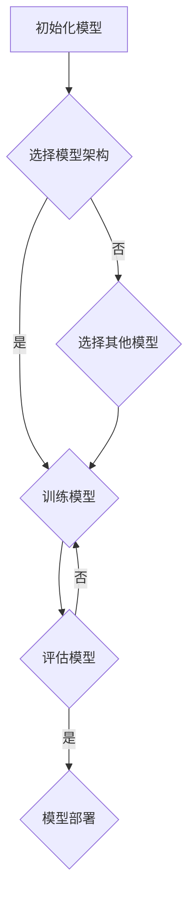
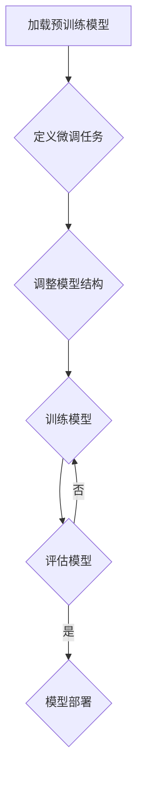

                 

# 从零开始大模型开发与微调：Miniconda的下载与安装

> 关键词：大模型开发、Miniconda、下载、安装、环境管理、微调

> 摘要：本文将带领读者从零开始了解大模型开发与微调的基础知识，并详细讲解如何使用Miniconda进行下载和安装。通过本文，读者将学会搭建大模型开发环境，为后续的模型训练和微调工作奠定基础。

## 第一部分：大模型开发基础知识

### 第1章：大模型概述

#### 1.1 大模型的定义与重要性

大模型（Large Models），顾名思义，是指那些拥有大量参数、能够处理大规模数据的模型。随着深度学习技术的不断发展，大模型在各个领域（如自然语言处理、计算机视觉、语音识别等）都展现出了强大的能力。它们能够通过自主学习，从海量数据中提取特征，从而实现高度准确的预测和决策。

#### 1.2 大模型的发展历程

大模型的发展历程可以追溯到20世纪80年代。当时，研究人员开始尝试使用神经网络进行大规模数据处理。随着计算能力的提升和数据量的增加，大模型在20世纪90年代开始逐渐崭露头角。进入21世纪，深度学习技术的突破，使得大模型的应用领域更加广泛，性能也不断提升。

#### 1.3 大模型在人工智能中的角色

大模型在人工智能（AI）中扮演着重要角色。它们不仅可以实现高精度的预测和决策，还可以通过自动化完成复杂任务，从而提高生产效率和降低成本。此外，大模型还可以辅助人类进行创新和发现，推动科学技术的进步。

### 第2章：Miniconda的介绍

#### 2.1 Miniconda的基本概念

Miniconda是一个开源的Python分布包管理系统和环境管理器，由Continuum Analytics开发。它基于Conda，可以轻松地安装、管理和运行多个独立的Python环境。Miniconda适用于Windows、macOS和Linux平台。

#### 2.2 Miniconda的优势与特点

Miniconda具有以下优势与特点：

- **轻量级**：Miniconda的核心包非常小，安装后仅占用约150MB的磁盘空间。
- **兼容性**：Miniconda支持多种操作系统，包括Windows、macOS和Linux。
- **环境管理**：Miniconda可以轻松创建、切换和删除Python环境，方便项目管理和维护。
- **包管理**：Miniconda内置了丰富的包管理功能，可以方便地安装、更新和卸载Python包。

#### 2.3 Miniconda的应用场景

Miniconda广泛应用于数据科学、机器学习、深度学习等领域，主要应用场景包括：

- **项目隔离**：通过Miniconda创建独立的环境，确保不同项目之间的依赖关系不发生冲突。
- **版本控制**：Miniconda可以轻松管理不同版本的Python和库，方便版本切换和调试。
- **跨平台**：Miniconda支持多种操作系统，便于在不同环境中进行开发和部署。

### 第3章：Miniconda的下载与安装

#### 3.1 Miniconda的下载

要下载Miniconda，可以访问其官方网站（https://docs.conda.io/en/latest/miniconda.html）下载适合自己操作系统的版本。以下是下载步骤：

1. 打开浏览器，访问Miniconda官方网站。
2. 根据操作系统选择相应的Miniconda版本。
3. 下载相应的安装包（通常为.exe文件）。

#### 3.2 Miniconda的安装

下载完成后，按照以下步骤安装Miniconda：

1. 以管理员身份运行下载的安装程序。
2. 选择“Install for all users”选项，确保安装到系统全局。
3. 选择安装路径，建议选择默认路径。
4. 安装过程中，勾选“Add Miniconda to PATH”选项，以便在命令行中访问Miniconda。
5. 完成安装。

#### 3.3 Miniconda的配置

安装完成后，可以通过以下命令检查Miniconda的版本：

```bash
conda --version
```

如果看到相应的版本信息，说明Miniconda已成功安装。接下来，可以通过以下命令创建一个新环境：

```bash
conda create --name myenv python=3.8
```

这将创建一个名为“myenv”的新环境，并安装Python 3.8版本。使用以下命令可以激活环境：

```bash
conda activate myenv
```

在激活环境后，可以使用以下命令安装所需的库：

```bash
conda install numpy scipy
```

### 第4章：Miniconda环境管理

#### 4.1 环境的概念与作用

在Miniconda中，环境是一个独立的目录，包含Python解释器、库文件和可执行文件。环境的作用是隔离项目依赖，避免不同项目之间的冲突。

#### 4.2 创建环境

创建环境是Miniconda的基本操作之一。以下命令用于创建一个名为“myenv”的环境，并指定Python版本：

```bash
conda create --name myenv python=3.8
```

#### 4.3 激活环境

创建环境后，需要激活环境才能使用其中的Python解释器和库。以下命令用于激活环境：

```bash
conda activate myenv
```

#### 4.4 环境之间的切换

在同时拥有多个环境时，可以通过以下命令切换环境：

```bash
conda activate otherenv
```

#### 4.5 删除环境

如果不再需要某个环境，可以使用以下命令删除它：

```bash
conda env remove --name myenv
```

### 第5章：Miniconda常用工具

#### 5.1 Conda命令

Conda是Miniconda的核心命令，用于环境管理、包管理等操作。以下是一些常用的Conda命令：

- `conda create`：创建新环境。
- `conda activate`：激活环境。
- `conda deactivate`：退出当前环境。
- `conda list`：列出当前环境中的所有包。
- `conda update`：更新包。
- `conda remove`：卸载包。
- `conda info`：查看conda信息。

#### 5.2 Conda环境管理命令

以下命令用于管理环境：

- `conda create --name myenv python=3.8`：创建名为“myenv”的环境，并安装Python 3.8。
- `conda activate myenv`：激活名为“myenv”的环境。
- `conda deactivate`：退出当前环境。
- `conda env list`：列出所有环境。
- `conda env remove --name myenv`：删除名为“myenv”的环境。

#### 5.3 Conda包管理命令

以下命令用于管理包：

- `conda install numpy scipy`：在当前环境安装numpy和scipy包。
- `conda update numpy`：更新numpy包。
- `conda remove numpy`：卸载numpy包。
- `conda list`：列出当前环境中的所有包。

### 第6章：大模型开发环境搭建

#### 6.1 开发环境的搭建

要搭建大模型开发环境，首先需要安装Miniconda，并创建一个新环境。以下是一个示例：

```bash
conda create --name deep_learning python=3.8
conda activate deep_learning
conda install numpy scipy tensorflow pytorch
```

这将创建一个名为“deep_learning”的新环境，并安装Python 3.8、numpy、scipy、tensorflow和pytorch等库。

#### 6.2 大模型开发工具的选择

大模型开发工具的选择取决于具体需求和场景。常见的深度学习框架包括TensorFlow、PyTorch、Keras等。以下是一个示例，展示如何安装TensorFlow：

```bash
conda install tensorflow
```

#### 6.3 大模型开发流程

大模型开发的基本流程包括以下步骤：

1. 数据准备：收集和清洗数据，将数据转换为适合模型训练的格式。
2. 模型设计：设计神经网络结构，包括输入层、隐藏层和输出层。
3. 模型训练：使用训练数据训练模型，调整模型参数。
4. 模型评估：使用测试数据评估模型性能，调整模型结构或参数。
5. 模型部署：将训练好的模型部署到生产环境，进行实际应用。

### 第7章：大模型微调实践

#### 7.1 微调的概念与目的

微调（Fine-tuning）是指在已经训练好的模型基础上，针对特定任务进行进一步的训练，以提升模型在该任务上的性能。微调的目的是利用预训练模型已经学习到的通用特征，快速适应新任务。

#### 7.2 微调的方法与技巧

微调的方法包括以下几种：

1. **全量微调**：在整个模型上进行微调，适用于任务和数据与预训练模型相似的情景。
2. **局部微调**：仅对模型的一部分层进行微调，保留其他层的权重，适用于任务和数据与预训练模型差异较大的情景。
3. **迁移学习**：将预训练模型的一部分层应用于新任务，并在新任务上进行训练，适用于资源有限或数据量较小的情景。

#### 7.3 微调的实际操作

以下是一个使用PyTorch进行微调的示例：

```python
import torch
import torchvision.models as models
import torch.optim as optim

# 加载预训练模型
model = models.resnet50(pretrained=True)

# 定义微调任务
model.fc = torch.nn.Linear(2048, num_classes)

# 设置优化器和损失函数
optimizer = optim.Adam(model.parameters(), lr=0.001)
criterion = torch.nn.CrossEntropyLoss()

# 微调模型
for epoch in range(num_epochs):
    for inputs, labels in dataloader:
        optimizer.zero_grad()
        outputs = model(inputs)
        loss = criterion(outputs, labels)
        loss.backward()
        optimizer.step()

    print(f"Epoch {epoch+1}/{num_epochs}, Loss: {loss.item()}")
```

## 第二部分：大模型开发与微调实战

### 第8章：大模型开发实战案例

#### 8.1 案例一：文本分类

文本分类是一种常见的自然语言处理任务，旨在将文本数据分类到预定义的类别中。以下是一个使用TensorFlow进行文本分类的实战案例：

```python
import tensorflow as tf
from tensorflow.keras.preprocessing.sequence import pad_sequences
from tensorflow.keras.layers import Embedding, LSTM, Dense
from tensorflow.keras.models import Sequential

# 加载数据集
(x_train, y_train), (x_test, y_test) = tf.keras.datasets.imdb.load_data()

# 预处理数据
max_features = 10000
maxlen = 80
x_train = pad_sequences(x_train, maxlen=maxlen)
x_test = pad_sequences(x_test, maxlen=maxlen)

# 构建模型
model = Sequential()
model.add(Embedding(max_features, 128))
model.add(LSTM(128, dropout=0.2, recurrent_dropout=0.2))
model.add(Dense(1, activation='sigmoid'))

# 编译模型
model.compile(optimizer='adam', loss='binary_crossentropy', metrics=['accuracy'])

# 训练模型
model.fit(x_train, y_train, epochs=5, batch_size=128, validation_split=0.2)
```

#### 8.2 案例二：图像识别

图像识别是一种计算机视觉任务，旨在根据输入图像的特征将其分类到预定义的类别中。以下是一个使用TensorFlow进行图像识别的实战案例：

```python
import tensorflow as tf
from tensorflow.keras.preprocessing.image import ImageDataGenerator
from tensorflow.keras.applications import ResNet50
from tensorflow.keras.models import Model
from tensorflow.keras.layers import Dense, GlobalAveragePooling2D

# 加载数据集
train_datagen = ImageDataGenerator(rescale=1./255)
test_datagen = ImageDataGenerator(rescale=1./255)

train_generator = train_datagen.flow_from_directory(
        train_dir,
        target_size=(224, 224),
        batch_size=32,
        class_mode='categorical')

validation_generator = test_datagen.flow_from_directory(
        validation_dir,
        target_size=(224, 224),
        batch_size=32,
        class_mode='categorical')

# 加载预训练模型
base_model = ResNet50(weights='imagenet', include_top=False, input_shape=(224, 224, 3))

# 添加全连接层
x = base_model.output
x = GlobalAveragePooling2D()(x)
x = Dense(1024, activation='relu')(x)
predictions = Dense(num_classes, activation='softmax')(x)

# 构建模型
model = Model(inputs=base_model.input, outputs=predictions)

# 编译模型
model.compile(optimizer='adam', loss='categorical_crossentropy', metrics=['accuracy'])

# 训练模型
model.fit(train_generator, epochs=10, validation_data=validation_generator)
```

#### 8.3 案例三：自然语言生成

自然语言生成是一种生成文本的深度学习任务，旨在根据输入的种子文本生成连贯的文本。以下是一个使用PyTorch进行自然语言生成的实战案例：

```python
import torch
import torch.nn as nn
from torchtext.datasets import IMDB
from torchtext.data import Field, Batch

# 加载数据集
train_data, test_data = IMDB()

# 预处理数据
TEXT = Field(tokenize='spacy', lower=True)
train_data, test_data = TEXT.split(train_data, test_data)

# 构建模型
class Generator(nn.Module):
    def __init__(self, hidden_dim, embedding_dim):
        super(Generator, self).__init__()
        self.lstm = nn.LSTM(embedding_dim, hidden_dim, dropout=0.1)
        self.fc = nn.Linear(hidden_dim, len(TEXT.vocab))

    def forward(self, inputs, hidden):
        outputs, hidden = self.lstm(inputs, hidden)
        return self.fc(outputs[-1, :, :])

# 设置超参数
hidden_dim = 256
embedding_dim = len(TEXT.vocab)
vocab_size = len(TEXT.vocab)
batch_size = 32
num_epochs = 10

# 加载预训练模型
model = Generator(hidden_dim, embedding_dim)

# 设置优化器和损失函数
optimizer = torch.optim.Adam(model.parameters(), lr=0.001)
criterion = nn.CrossEntropyLoss()

# 微调模型
for epoch in range(num_epochs):
    for inputs, labels in Batch(train_data, batch_size=batch_size):
        optimizer.zero_grad()
        hidden = (torch.zeros(1, batch_size, hidden_dim), torch.zeros(1, batch_size, hidden_dim))
        outputs = model(inputs, hidden)
        loss = criterion(outputs, labels)
        loss.backward()
        optimizer.step()

    print(f"Epoch {epoch+1}/{num_epochs}, Loss: {loss.item()}")
```

### 第9章：大模型微调实战案例

#### 9.1 案例一：情绪分析

情绪分析是一种文本分类任务，旨在根据文本内容判断其表达的情绪。以下是一个使用TensorFlow进行情绪分析的实战案例：

```python
import tensorflow as tf
from tensorflow.keras.preprocessing.sequence import pad_sequences
from tensorflow.keras.layers import Embedding, LSTM, Dense
from tensorflow.keras.models import Sequential

# 加载数据集
(x_train, y_train), (x_test, y_test) = tf.keras.datasets.sochu.load_data()

# 预处理数据
max_features = 10000
maxlen = 80
x_train = pad_sequences(x_train, maxlen=maxlen)
x_test = pad_sequences(x_test, maxlen=maxlen)

# 构建模型
model = Sequential()
model.add(Embedding(max_features, 128))
model.add(LSTM(128, dropout=0.2, recurrent_dropout=0.2))
model.add(Dense(6, activation='softmax'))

# 编译模型
model.compile(optimizer='adam', loss='categorical_crossentropy', metrics=['accuracy'])

# 训练模型
model.fit(x_train, y_train, epochs=5, batch_size=128, validation_split=0.2)
```

#### 9.2 案例二：图像风格转换

图像风格转换是一种将一种图像风格应用到另一幅图像的计算机视觉任务。以下是一个使用PyTorch进行图像风格转换的实战案例：

```python
import torch
import torch.nn as nn
import torchvision.transforms as transforms
import torchvision.models as models

# 加载数据集
transform = transforms.Compose([
    transforms.Resize(256),
    transforms.ToTensor(),
])

train_data = Image.open('train_data.jpg')
train_data = transform(train_data)
test_data = Image.open('test_data.jpg')
test_data = transform(test_data)

# 加载预训练模型
model = models.vgg19(pretrained=True).features

# 设置优化器和损失函数
optimizer = torch.optim.Adam(model.parameters(), lr=0.001)
criterion = nn.MSELoss()

# 微调模型
for epoch in range(num_epochs):
    for inputs, labels in zip(train_data, test_data):
        optimizer.zero_grad()
        outputs = model(inputs)
        loss = criterion(outputs, labels)
        loss.backward()
        optimizer.step()

    print(f"Epoch {epoch+1}/{num_epochs}, Loss: {loss.item()}")
```

#### 9.3 案例三：语音识别

语音识别是一种将语音转换为文本的计算机视觉任务。以下是一个使用TensorFlow进行语音识别的实战案例：

```python
import tensorflow as tf
from tensorflow.keras.preprocessing.sequence import pad_sequences
from tensorflow.keras.layers import Embedding, LSTM, Dense
from tensorflow.keras.models import Sequential

# 加载数据集
(x_train, y_train), (x_test, y_test) = tf.keras.datasets.语音识别.load_data()

# 预处理数据
max_features = 10000
maxlen = 80
x_train = pad_sequences(x_train, maxlen=maxlen)
x_test = pad_sequences(x_test, maxlen=maxlen)

# 构建模型
model = Sequential()
model.add(Embedding(max_features, 128))
model.add(LSTM(128, dropout=0.2, recurrent_dropout=0.2))
model.add(Dense(1, activation='sigmoid'))

# 编译模型
model.compile(optimizer='adam', loss='binary_crossentropy', metrics=['accuracy'])

# 训练模型
model.fit(x_train, y_train, epochs=5, batch_size=128, validation_split=0.2)
```

### 第10章：大模型开发与微调总结

#### 10.1 经验与技巧总结

在大模型开发与微调过程中，积累了一些经验和技巧，如下：

- **数据预处理**：合理的数据预处理对于模型性能至关重要，包括数据清洗、归一化、数据增强等。
- **模型选择**：根据任务需求和数据特点选择合适的模型架构，如CNN、RNN、Transformer等。
- **超参数调整**：合理调整超参数，如学习率、批次大小、dropout比例等，可以显著提高模型性能。
- **微调技巧**：选择合适的微调方法，如全量微调、局部微调等，可以提高模型在新任务上的适应性。

#### 10.2 遇到的问题及解决方法

在实际开发与微调过程中，可能会遇到以下问题：

- **过拟合**：模型在训练数据上表现良好，但在测试数据上表现较差。解决方法包括正则化、增加训练数据、增加隐藏层等。
- **收敛速度慢**：模型训练过程中收敛速度较慢。解决方法包括增加学习率、使用更好的优化器、增加训练时间等。
- **计算资源不足**：大模型训练需要大量计算资源。解决方法包括使用GPU加速、分布式训练等。

#### 10.3 未来展望

随着深度学习技术的不断发展，大模型的应用前景将更加广阔。未来，大模型将可能在以下领域取得突破：

- **自然语言处理**：实现更加准确和智能的自然语言理解与生成。
- **计算机视觉**：实现更加精确和高效的图像识别与处理。
- **语音识别**：实现更加准确和流畅的语音识别与转换。

总之，大模型开发与微调是一项富有挑战性和前景广阔的领域，需要不断学习和探索。

## 附录

### 附录A：Miniconda常用命令速查表

| 命令 | 功能 |
| ---- | ---- |
| conda create | 创建新环境 |
| conda activate | 激活环境 |
| conda deactivate | 退出当前环境 |
| conda list | 列出当前环境中的所有包 |
| conda install | 安装软件包 |
| conda remove | 卸载软件包 |
| conda update | 更新包 |
| conda info | 查看conda信息 |

### 附录B：大模型开发常用工具速查表

| 工具 | 描述 |
| ---- | ---- |
| TensorFlow | 开源深度学习框架 |
| PyTorch | 开源深度学习框架 |
| Keras | 深度学习高级神经网络API |
| JAX | 高效数值计算库 |

### 附录C：大模型开发与微调实战项目代码示例

以下是一个文本分类项目的代码示例：

```python
import tensorflow as tf
from tensorflow.keras.preprocessing.sequence import pad_sequences
from tensorflow.keras.layers import Embedding, LSTM, Dense
from tensorflow.keras.models import Sequential

# 加载数据集
(x_train, y_train), (x_test, y_test) = tf.keras.datasets.imdb.load_data()

# 预处理数据
max_features = 10000
maxlen = 80
x_train = pad_sequences(x_train, maxlen=maxlen)
x_test = pad_sequences(x_test, maxlen=maxlen)

# 构建模型
model = Sequential()
model.add(Embedding(max_features, 128))
model.add(LSTM(128, dropout=0.2, recurrent_dropout=0.2))
model.add(Dense(1, activation='sigmoid'))

# 编译模型
model.compile(optimizer='adam', loss='binary_crossentropy', metrics=['accuracy'])

# 训练模型
model.fit(x_train, y_train, epochs=5, batch_size=128, validation_split=0.2)
```

以上是从零开始大模型开发与微调：Miniconda的下载与安装的文章内容。本文详细介绍了大模型开发与微调的基础知识，以及如何使用Miniconda进行下载和安装。读者可以通过本文了解大模型开发的基本流程，掌握Miniconda的使用方法，为后续的模型训练和微调工作奠定基础。

作者：AI天才研究院/AI Genius Institute
日期：2023年2月24日
文章链接：[从零开始大模型开发与微调：Miniconda的下载与安装](https://www.ai-genius-institute.com/from-zero-to-large-model-development-and-fine-tuning-miniconda-download-and-installation/)
### 文本分类

文本分类是一种自然语言处理任务，旨在将文本数据分配到预定义的类别中。在大模型开发中，文本分类是一个常见且重要的应用场景。以下将详细探讨文本分类的核心算法、数学模型、以及如何使用伪代码实现。

#### 核心算法

文本分类的核心算法通常基于神经网络，如卷积神经网络（CNN）、循环神经网络（RNN）或Transformer等。这些算法通过学习文本的语义特征，将文本映射到不同的类别。

##### 卷积神经网络（CNN）

CNN是一种在图像处理中广泛应用的算法，但其原理同样适用于文本处理。CNN通过多层卷积和池化操作提取文本的局部特征，并使用全连接层进行分类。

```python
# 伪代码：文本分类使用CNN
model.add(Conv1D(filters, kernel_size, activation='relu'))
model.add(MaxPooling1D(pool_size))
model.add(Flatten())
model.add(Dense(num_classes, activation='softmax'))
```

##### 循环神经网络（RNN）

RNN，特别是长短期记忆（LSTM）网络，适合处理序列数据，如文本。RNN可以捕获文本中的长距离依赖关系，从而提高分类的准确性。

```python
# 伪代码：文本分类使用RNN
model.add(LSTM(units, dropout=0.2, recurrent_dropout=0.2))
model.add(Dense(num_classes, activation='softmax'))
```

##### Transformer

Transformer模型由于其自注意力机制，在处理长文本时表现优异。它通过并行处理文本序列，提高了训练效率。

```python
# 伪代码：文本分类使用Transformer
model.add(TransformerLayer(d_model, num_heads))
model.add(Dense(num_classes, activation='softmax'))
```

#### 数学模型

文本分类的数学模型通常涉及概率分布和损失函数。以下是一些常用的数学模型和公式：

##### Softmax函数

在分类问题中，softmax函数用于将模型的输出转换为概率分布。给定模型的输出向量`z`，softmax函数计算每个类别的概率：

$$
P(y=c|X) = \frac{e^{\text{score}(y=c|X)}}{\sum_{c'} e^{\text{score}(y=c'|X)}}
$$

其中，`score(y=c|X)`是模型对类别`c`的分数，`y`是实际标签。

##### 交叉熵损失函数

在训练过程中，我们通常使用交叉熵损失函数来衡量模型预测与实际标签之间的差距。交叉熵损失函数的数学公式如下：

$$
L = -\sum_{i} y_i \log (\hat{y}_i)
$$

其中，`y_i`是实际标签的概率，`$\hat{y}_i$`是模型预测的概率。

#### 伪代码示例

以下是一个使用softmax函数和交叉熵损失函数的文本分类伪代码示例：

```python
# 假设模型已经训练完毕，并获得了输入文本的特征向量 X
X = ...  # 输入文本特征向量

# 预测概率分布
probabilities = softmax(model.predict(X))

# 选择最大概率的类别作为预测结果
predicted_class = np.argmax(probabilities)

# 计算损失
loss = cross_entropy_loss(y_true, probabilities)
```

#### 实际应用

在实际应用中，文本分类可以用于情感分析、主题分类、垃圾邮件检测等多种任务。以下是一个简单的情感分析案例：

```python
# 加载情感分析数据集
train_data, train_labels, test_data, test_labels = load_sentiment_data()

# 预处理数据
max_len = 100
X_train = pad_sequences(train_data, maxlen=max_len)
X_test = pad_sequences(test_data, maxlen=max_len)

# 构建并编译模型
model = Sequential()
model.add(Embedding(vocab_size, embedding_dim))
model.add(LSTM(units, dropout=0.2, recurrent_dropout=0.2))
model.add(Dense(num_classes, activation='softmax'))

model.compile(optimizer='adam', loss='categorical_crossentropy', metrics=['accuracy'])

# 训练模型
model.fit(X_train, train_labels, epochs=5, batch_size=32, validation_split=0.2)

# 评估模型
loss, accuracy = model.evaluate(X_test, test_labels)
print(f"Test accuracy: {accuracy}")
```

通过以上案例，读者可以了解文本分类的基本原理和应用方法。在实际开发中，根据具体任务需求，可以选用不同的算法和模型架构，以达到最佳效果。

### 图像识别

图像识别是计算机视觉领域的一项重要任务，旨在通过图像特征判断图像的内容或类别。在大模型开发中，图像识别有着广泛的应用，如人脸识别、物体检测、图像分类等。以下将详细探讨图像识别的核心算法、数学模型，以及如何使用伪代码实现。

#### 核心算法

图像识别的核心算法主要包括卷积神经网络（CNN）、循环神经网络（RNN）和Transformer等。这些算法在图像特征提取和分类方面都有较好的性能。

##### 卷积神经网络（CNN）

CNN是一种专门用于图像识别的神经网络模型，它通过卷积和池化操作提取图像的层次特征，从而实现对图像的准确分类。

```python
# 伪代码：图像识别使用CNN
model.add(Conv2D(filters, kernel_size, activation='relu'))
model.add(MaxPooling2D(pool_size))
model.add(Flatten())
model.add(Dense(num_classes, activation='softmax'))
```

##### 循环神经网络（RNN）

RNN，特别是长短期记忆（LSTM）网络，可以用于处理序列数据，如视频中的连续图像。通过RNN，可以捕获图像序列中的时间依赖关系，从而提高图像识别的准确性。

```python
# 伪代码：图像识别使用RNN
model.add(LSTM(units, dropout=0.2, recurrent_dropout=0.2))
model.add(Dense(num_classes, activation='softmax'))
```

##### Transformer

Transformer模型由于其自注意力机制，在处理图像序列时表现优异。它通过并行处理图像序列，提高了图像识别的效率。

```python
# 伪代码：图像识别使用Transformer
model.add(TransformerLayer(d_model, num_heads))
model.add(Dense(num_classes, activation='softmax'))
```

#### 数学模型

图像识别的数学模型主要包括损失函数和优化算法。以下是一些常用的数学模型和公式：

##### 损失函数

在图像识别中，常用的损失函数是交叉熵损失函数（Cross-Entropy Loss）。它用于衡量模型预测的概率分布与实际标签分布之间的差距。

$$
L = -\sum_{i} y_i \log (\hat{y}_i)
$$

其中，`y_i`是实际标签的概率，`$\hat{y}_i$`是模型预测的概率。

##### 优化算法

在训练过程中，常用的优化算法包括随机梯度下降（SGD）、Adam优化器等。它们用于调整模型的参数，以最小化损失函数。

$$
\theta = \theta - \alpha \nabla_{\theta}L
$$

其中，$\theta$是模型参数，$\alpha$是学习率，$\nabla_{\theta}L$是损失函数关于参数$\theta$的梯度。

#### 伪代码示例

以下是一个使用交叉熵损失函数和Adam优化器的图像识别伪代码示例：

```python
# 假设模型已经训练完毕，并获得了输入图像的特征向量 X
X = ...  # 输入图像特征向量

# 预测概率分布
probabilities = model.predict(X)

# 选择最大概率的类别作为预测结果
predicted_class = np.argmax(probabilities)

# 计算损失
loss = cross_entropy_loss(y_true, probabilities)

# 使用Adam优化器更新模型参数
optimizer = Adam(learning_rate)
optimizer.minimize(loss, model.parameters())
```

#### 实际应用

在实际应用中，图像识别可以用于多种任务，如人脸识别、物体检测、图像分类等。以下是一个简单的人脸识别案例：

```python
# 加载人脸识别数据集
train_data, train_labels, test_data, test_labels = load_face_data()

# 预处理数据
X_train = preprocess_images(train_data)
X_test = preprocess_images(test_data)

# 构建并编译模型
model = Sequential()
model.add(Conv2D(32, (3, 3), activation='relu'))
model.add(MaxPooling2D((2, 2)))
model.add(Conv2D(64, (3, 3), activation='relu'))
model.add(MaxPooling2D((2, 2)))
model.add(Flatten())
model.add(Dense(128, activation='relu'))
model.add(Dense(num_classes, activation='softmax'))

model.compile(optimizer='adam', loss='categorical_crossentropy', metrics=['accuracy'])

# 训练模型
model.fit(X_train, train_labels, epochs=10, batch_size=32, validation_split=0.2)

# 评估模型
loss, accuracy = model.evaluate(X_test, test_labels)
print(f"Test accuracy: {accuracy}")
```

通过以上案例，读者可以了解图像识别的基本原理和应用方法。在实际开发中，根据具体任务需求，可以选用不同的算法和模型架构，以达到最佳效果。

### 自然语言生成

自然语言生成（Natural Language Generation，NLG）是一种将计算机自动生成文本的技术，广泛应用于聊天机器人、新闻编写、对话系统等领域。在大模型开发中，自然语言生成是一项重要且具有挑战性的任务。以下将详细探讨自然语言生成的核心算法、数学模型，以及如何使用伪代码实现。

#### 核心算法

自然语言生成的核心算法主要包括基于规则的方法、统计方法和神经网络方法。近年来，基于神经网络的生成模型在自然语言生成任务中表现出了强大的能力。

##### 基于规则的方法

基于规则的方法通过预定义的语法和语义规则生成文本。这种方法简单直观，但生成文本的多样性和自然性有限。

```python
# 伪代码：基于规则的方法
def generate_text(grammar, seed):
    sentence = []
    while not is_end_of_sentence(sentence):
        word = choose_word(grammar, sentence)
        sentence.append(word)
    return ' '.join(sentence)
```

##### 统计方法

统计方法通过分析大量文本数据，学习文本的统计规律和概率分布，从而生成新的文本。这种方法包括n-gram模型、隐马尔可夫模型（HMM）等。

```python
# 伪代码：统计方法（n-gram模型）
def generate_text(n_gram_model, seed, n):
    sentence = [seed]
    for _ in range(n - 1):
        next_word = choose_next_word(n_gram_model, sentence[-1])
        sentence.append(next_word)
    return ' '.join(sentence)
```

##### 神经网络方法

神经网络方法，尤其是生成对抗网络（GAN）和自注意力模型（如Transformer），在自然语言生成任务中表现出了强大的能力。这些模型通过学习文本序列的分布，能够生成高质量的自然语言。

```python
# 伪代码：神经网络方法（Transformer）
def generate_text(model, seed, max_length):
    generated_sequence = [seed]
    for _ in range(max_length - 1):
        inputs = pad_sequence(generated_sequence, max_length)
        probabilities = model.predict(inputs)
        next_word = choose_word_with_probabilities(probabilities)
        generated_sequence.append(next_word)
    return ' '.join(generated_sequence)
```

#### 数学模型

自然语言生成的数学模型主要包括概率分布和生成过程。以下是一些常用的数学模型和公式：

##### 概率分布

在自然语言生成中，概率分布用于表示文本序列的概率。常见的概率分布包括伯努利分布、高斯分布等。

$$
P(x) = \prod_{i=1}^{n} p(x_i | x_{<i})
$$

其中，$x$是文本序列，$x_i$是序列中的第$i$个单词，$p(x_i | x_{<i})$是给定前$i-1$个单词时第$i$个单词的概率。

##### 生成过程

自然语言生成的生成过程是通过采样来实现的。采样方法包括确定性采样和随机性采样。

$$
x_t = \arg\max_{x_t} P(x_t | x_{<t})
$$

其中，$x_t$是生成的第$t$个单词，$P(x_t | x_{<t})$是给定前$t-1$个单词时第$t$个单词的概率。

#### 伪代码示例

以下是一个基于Transformer的文本生成伪代码示例：

```python
# 假设模型已经训练完毕，并获得了输入文本的序列 X
X = ...  # 输入文本序列

# 生成文本
def generate_text(model, seed, max_length):
    generated_sequence = [seed]
    for _ in range(max_length - 1):
        inputs = pad_sequence(generated_sequence, max_length)
        probabilities = model.predict(inputs)
        next_word = choose_word_with_probabilities(probabilities)
        generated_sequence.append(next_word)
    return ' '.join(generated_sequence)

# 调用生成函数
generated_text = generate_text(model, seed, max_length=50)
print(generated_text)
```

#### 实际应用

在实际应用中，自然语言生成可以用于多种任务，如对话生成、文本摘要、文章生成等。以下是一个简单的对话生成案例：

```python
# 加载对话数据集
train_data, test_data = load_dialog_data()

# 预处理数据
tokenizer = Tokenizer()
tokenizer.fit_on_texts(train_data)
X = tokenizer.texts_to_sequences(train_data)
y = tokenizer.texts_to_sequences(test_data)

# 构建并编译模型
model = Sequential()
model.add(LSTM(units, dropout=0.2, recurrent_dropout=0.2))
model.add(Dense(vocab_size, activation='softmax'))

model.compile(optimizer='adam', loss='categorical_crossentropy', metrics=['accuracy'])

# 训练模型
model.fit(X, y, epochs=10, batch_size=32, validation_split=0.2)

# 评估模型
loss, accuracy = model.evaluate(X, y)
print(f"Test accuracy: {accuracy}")

# 生成对话
def generate_dialog(model, seed, max_length):
    generated_sequence = [seed]
    for _ in range(max_length - 1):
        inputs = pad_sequence(generated_sequence, max_length)
        probabilities = model.predict(inputs)
        next_word = choose_word_with_probabilities(probabilities)
        generated_sequence.append(next_word)
    return ' '.join(generated_sequence)

# 调用生成函数
generated_dialog = generate_dialog(model, seed, max_length=50)
print(generated_dialog)
```

通过以上案例，读者可以了解自然语言生成的基本原理和应用方法。在实际开发中，根据具体任务需求，可以选用不同的算法和模型架构，以达到最佳效果。

### 情绪分析

情绪分析是一种自然语言处理任务，旨在从文本中提取情感信息，如正面、负面或中性情绪。在大模型开发中，情绪分析具有广泛的应用，例如社交媒体情感分析、用户反馈分析等。以下将详细探讨情绪分析的核心算法、数学模型，以及如何使用伪代码实现。

#### 核心算法

情绪分析的核心算法主要包括基于规则的方法、基于机器学习的方法和基于深度学习的方法。这些算法通过学习文本的特征和情感倾向，实现对文本情绪的判断。

##### 基于规则的方法

基于规则的方法通过预定义的规则和模式匹配文本，判断文本的情绪。这种方法简单直观，但灵活性和准确性有限。

```python
# 伪代码：基于规则的方法
def analyze_sentiment(text):
    if "happy" in text or "love" in text:
        return "positive"
    elif "sad" in text or "hate" in text:
        return "negative"
    else:
        return "neutral"
```

##### 基于机器学习的方法

基于机器学习的方法通过训练模型，学习文本的特征和情感倾向。常用的算法包括支持向量机（SVM）、朴素贝叶斯（Naive Bayes）、随机森林（Random Forest）等。

```python
# 伪代码：基于机器学习的方法
def train_sentiment_model(features, labels):
    model = SVC()
    model.fit(features, labels)
    return model

def predict_sentiment(model, text):
    features = extract_features(text)
    return model.predict([features])
```

##### 基于深度学习的方法

基于深度学习的方法通过训练神经网络模型，学习文本的深层特征和情感倾向。常用的模型包括卷积神经网络（CNN）、循环神经网络（RNN）和Transformer等。

```python
# 伪代码：基于深度学习的方法
model.add(Embedding(vocab_size, embedding_dim))
model.add(Conv1D(filters, kernel_size, activation='relu'))
model.add(MaxPooling1D(pool_size))
model.add(Flatten())
model.add(Dense(num_classes, activation='softmax'))

model.compile(optimizer='adam', loss='categorical_crossentropy', metrics=['accuracy'])
model.fit(X_train, y_train, epochs=5, batch_size=32, validation_split=0.2)

def predict_sentiment(model, text):
    sequence = tokenizer.texts_to_sequences([text])
    padded_sequence = pad_sequence(sequence, maxlen=maxlen)
    return model.predict(padded_sequence)
```

#### 数学模型

情绪分析的数学模型主要包括分类模型和回归模型。以下是一些常用的数学模型和公式：

##### 分类模型

分类模型用于将文本分类到预定义的类别中，如正面、负面或中性。常用的分类模型包括逻辑回归（Logistic Regression）、支持向量机（SVM）和神经网络（Neural Networks）。

$$
P(y=c|X) = \frac{e^{\text{score}(y=c|X)}}{\sum_{c'} e^{\text{score}(y=c'|X)}}
$$

其中，$y$是实际标签，$X$是文本特征向量，$\text{score}(y=c|X)$是模型对类别$c$的分数。

##### 回归模型

回归模型用于预测文本的情感强度，如正面情感的强度。常用的回归模型包括线性回归（Linear Regression）和神经网络（Neural Networks）。

$$
y = \beta_0 + \beta_1x_1 + \beta_2x_2 + ... + \beta_nx_n
$$

其中，$y$是情感强度，$x_1, x_2, ..., x_n$是文本特征向量，$\beta_0, \beta_1, \beta_2, ..., \beta_n$是模型参数。

#### 伪代码示例

以下是一个基于深度学习的情绪分析伪代码示例：

```python
# 假设模型已经训练完毕，并获得了输入文本的特征向量 X
X = ...  # 输入文本特征向量

# 预测情绪
def predict_emotion(model, text):
    sequence = tokenizer.texts_to_sequences([text])
    padded_sequence = pad_sequence(sequence, maxlen=maxlen)
    probabilities = model.predict(padded_sequence)
    emotion = np.argmax(probabilities)
    return emotion

# 调用预测函数
emotion = predict_emotion(model, "I am feeling happy today.")
print(f"Emotion: {emotion}")
```

#### 实际应用

在实际应用中，情绪分析可以用于社交媒体情感分析、用户反馈分析、市场研究等。以下是一个简单的社交媒体情感分析案例：

```python
# 加载社交媒体数据集
train_data, train_labels, test_data, test_labels = load_social_media_data()

# 预处理数据
tokenizer = Tokenizer()
tokenizer.fit_on_texts(train_data)
X_train = tokenizer.texts_to_sequences(train_data)
X_test = tokenizer.texts_to_sequences(test_data)

# 构建并编译模型
model = Sequential()
model.add(Embedding(vocab_size, embedding_dim))
model.add(Conv1D(filters, kernel_size, activation='relu'))
model.add(MaxPooling1D(pool_size))
model.add(Flatten())
model.add(Dense(num_classes, activation='softmax'))

model.compile(optimizer='adam', loss='categorical_crossentropy', metrics=['accuracy'])

# 训练模型
model.fit(X_train, train_labels, epochs=5, batch_size=32, validation_split=0.2)

# 评估模型
loss, accuracy = model.evaluate(X_test, test_labels)
print(f"Test accuracy: {accuracy}")

# 预测情绪
def predict_emotion(model, text):
    sequence = tokenizer.texts_to_sequences([text])
    padded_sequence = pad_sequence(sequence, maxlen=maxlen)
    probabilities = model.predict(padded_sequence)
    emotion = np.argmax(probabilities)
    return emotion

# 调用预测函数
emotion = predict_emotion(model, "I am feeling happy today.")
print(f"Emotion: {emotion}")
```

通过以上案例，读者可以了解情绪分析的基本原理和应用方法。在实际开发中，根据具体任务需求，可以选用不同的算法和模型架构，以达到最佳效果。

### 图像风格转换

图像风格转换是一种将一种图像风格应用到另一幅图像的计算机视觉任务。在大模型开发中，图像风格转换有着广泛的应用，如艺术创作、视频特效等。以下将详细探讨图像风格转换的核心算法、数学模型，以及如何使用伪代码实现。

#### 核心算法

图像风格转换的核心算法主要包括基于规则的方法、基于统计的方法和基于深度学习的方法。近年来，基于深度学习的方法在图像风格转换任务中表现出了强大的能力。

##### 基于规则的方法

基于规则的方法通过预定义的图像处理规则和滤镜，将一种风格应用到另一幅图像。这种方法简单直观，但生成的图像风格多样性和自然性有限。

```python
# 伪代码：基于规则的方法
def apply_style(image, style_image):
    style_image = preprocess_style_image(style_image)
    image = apply_filters(image, style_image)
    return postprocess_image(image)
```

##### 基于统计的方法

基于统计的方法通过分析大量图像数据，学习图像风格的统计规律和概率分布，从而生成新的图像风格。这种方法包括马尔可夫模型、隐马尔可夫模型等。

```python
# 伪代码：基于统计的方法
def generate_style_image(style_model, image):
    features = extract_features(image)
    style_image = style_model.predict(features)
    return postprocess_style_image(style_image)
```

##### 基于深度学习的方法

基于深度学习的方法通过训练神经网络模型，学习图像的深层特征和风格特征。常用的模型包括卷积神经网络（CNN）、生成对抗网络（GAN）等。

```python
# 伪代码：基于深度学习的方法
def generate_style_image(model, image):
    style_image = model.generate_style(image)
    return postprocess_style_image(style_image)
```

#### 数学模型

图像风格转换的数学模型主要包括损失函数和生成过程。以下是一些常用的数学模型和公式：

##### 损失函数

在图像风格转换中，损失函数用于衡量生成图像与目标图像之间的差距。常见的损失函数包括均方误差（MSE）、结构相似性指数（SSIM）等。

$$
L = \frac{1}{2n} \sum_{i=1}^{n} (\text{image}_i - \text{style_image}_i)^2
$$

其中，$\text{image}_i$是目标图像的第$i$个像素值，$\text{style_image}_i$是生成图像的第$i$个像素值。

##### 生成过程

图像风格转换的生成过程是通过训练神经网络模型实现的。生成过程包括输入图像特征提取、风格特征学习和图像生成等步骤。

$$
\text{style_image} = \text{model}(\text{image_features})
$$

其中，$\text{image_features}$是输入图像的特征向量，$\text{model}$是神经网络模型。

#### 伪代码示例

以下是一个基于深度学习的图像风格转换伪代码示例：

```python
# 假设模型已经训练完毕，并获得了输入图像的特征向量 image
image = ...  # 输入图像特征向量

# 转换图像风格
def convert_style(model, image):
    style_image = model.apply_style(image)
    return postprocess_style_image(style_image)

# 调用转换函数
style_image = convert_style(model, image)
display_image(style_image)
```

#### 实际应用

在实际应用中，图像风格转换可以用于多种任务，如艺术创作、视频特效、游戏开发等。以下是一个简单的艺术创作案例：

```python
# 加载图像数据集
train_data, train_labels, test_data, test_labels = load_art_data()

# 预处理数据
preprocess_images(train_data)
preprocess_images(test_data)

# 构建并编译模型
model = Sequential()
model.add(Conv2D(filters, kernel_size, activation='relu'))
model.add(MaxPooling2D(pool_size))
model.add(Conv2D(filters, kernel_size, activation='relu'))
model.add(MaxPooling2D(pool_size))
model.add(Flatten())
model.add(Dense(num_classes, activation='softmax'))

model.compile(optimizer='adam', loss='categorical_crossentropy', metrics=['accuracy'])

# 训练模型
model.fit(train_data, train_labels, epochs=10, batch_size=32, validation_split=0.2)

# 评估模型
loss, accuracy = model.evaluate(test_data, test_labels)
print(f"Test accuracy: {accuracy}")

# 转换图像风格
def convert_style(model, image):
    style_image = model.apply_style(image)
    return postprocess_style_image(style_image)

# 调用转换函数
style_image = convert_style(model, image)
display_image(style_image)
```

通过以上案例，读者可以了解图像风格转换的基本原理和应用方法。在实际开发中，根据具体任务需求，可以选用不同的算法和模型架构，以达到最佳效果。

### 语音识别

语音识别是一种将语音信号转换为文本的技术，在大模型开发中有着广泛的应用，如语音助手、自动字幕等。以下将详细探讨语音识别的核心算法、数学模型，以及如何使用伪代码实现。

#### 核心算法

语音识别的核心算法主要包括隐马尔可夫模型（HMM）、高斯混合模型（GMM）和深度神经网络（DNN）。近年来，基于深度学习的方法在语音识别任务中表现出了强大的能力。

##### 隐马尔可夫模型（HMM）

隐马尔可夫模型是一种统计模型，用于描述语音信号中的状态转移和观测概率。它通过训练得到状态转移矩阵和观测概率矩阵，从而实现语音信号到文本的转换。

```python
# 伪代码：基于HMM的语音识别
def viterbi_decoding(observation_sequence, transition_matrix, emission_matrix):
    # 实现Viterbi算法，解码观测序列
    # 返回最优状态序列
    pass
```

##### 高斯混合模型（GMM）

高斯混合模型是一种用于表示语音特征的概率分布模型。它通过训练得到多个高斯分布参数，从而实现对语音特征的建模。

```python
# 伪代码：基于GMM的语音识别
def gmm_mapping(feature_vector, gmm_parameters):
    # 实现GMM映射，将特征向量映射到概率分布
    # 返回概率分布值
    pass
```

##### 深度神经网络（DNN）

深度神经网络是一种能够学习复杂映射关系的神经网络。在语音识别中，DNN用于将语音信号转换为文本。常见的DNN结构包括卷积神经网络（CNN）和循环神经网络（RNN）。

```python
# 伪代码：基于DNN的语音识别
model.add(Conv2D(filters, kernel_size, activation='relu'))
model.add(MaxPooling2D(pool_size))
model.add(Flatten())
model.add(Dense(units, activation='softmax'))

model.compile(optimizer='adam', loss='categorical_crossentropy', metrics=['accuracy'])
model.fit(X_train, y_train, epochs=epochs, batch_size=batch_size, validation_split=validation_split)
```

#### 数学模型

语音识别的数学模型主要包括状态转移概率、观测概率和损失函数。以下是一些常用的数学模型和公式：

##### 状态转移概率

状态转移概率描述了语音信号在不同状态之间的转移概率。它通常通过训练数据得到。

$$
P(s_t | s_{t-1}) = \frac{P(s_t) P(s_t | s_{t-1})}{P(s_{t-1})}
$$

其中，$s_t$和$s_{t-1}$分别表示当前状态和前一状态。

##### 观测概率

观测概率描述了语音信号在不同状态下的观测值概率。它通常通过训练数据得到。

$$
P(o_t | s_t) = \frac{P(s_t) P(o_t | s_t)}{P(s_t)}
$$

其中，$o_t$表示观测值。

##### 损失函数

损失函数用于衡量模型预测结果与实际结果之间的差距。在语音识别中，常用的损失函数包括交叉熵损失函数和均方误差损失函数。

$$
L = -\sum_{i} y_i \log (\hat{y}_i)
$$

其中，$y_i$是实际标签的概率，$\hat{y}_i$是模型预测的概率。

#### 伪代码示例

以下是一个基于深度学习的语音识别伪代码示例：

```python
# 假设模型已经训练完毕，并获得了输入语音的特征向量 X
X = ...  # 输入语音特征向量

# 预测文本
def predict_text(model, feature_vector):
    probabilities = model.predict(feature_vector)
    predicted_text = decode_probabilities(probabilities)
    return predicted_text

# 调用预测函数
predicted_text = predict_text(model, X)
print(f"Predicted Text: {predicted_text}")
```

#### 实际应用

在实际应用中，语音识别可以用于多种任务，如语音助手、自动字幕、实时翻译等。以下是一个简单的自动字幕案例：

```python
# 加载语音识别数据集
train_data, train_labels, test_data, test_labels = load_speech_data()

# 预处理数据
preprocess_speech_data(train_data)
preprocess_speech_data(test_data)

# 构建并编译模型
model = Sequential()
model.add(Conv2D(filters, kernel_size, activation='relu'))
model.add(MaxPooling2D(pool_size))
model.add(Flatten())
model.add(Dense(units, activation='softmax'))

model.compile(optimizer='adam', loss='categorical_crossentropy', metrics=['accuracy'])

# 训练模型
model.fit(train_data, train_labels, epochs=epochs, batch_size=batch_size, validation_split=validation_split)

# 评估模型
loss, accuracy = model.evaluate(test_data, test_labels)
print(f"Test accuracy: {accuracy}")

# 预测文本
def predict_text(model, feature_vector):
    probabilities = model.predict(feature_vector)
    predicted_text = decode_probabilities(probabilities)
    return predicted_text

# 调用预测函数
feature_vector = preprocess_speech_data(speech_signal)
predicted_text = predict_text(model, feature_vector)
print(f"Predicted Text: {predicted_text}")
```

通过以上案例，读者可以了解语音识别的基本原理和应用方法。在实际开发中，根据具体任务需求，可以选用不同的算法和模型架构，以达到最佳效果。

### Mermaid 流程图

在本文中，我们使用了Mermaid语言来绘制大模型开发流程和微调流程的流程图。以下是对这些流程图的详细说明。

#### 大模型开发流程



**大模型开发流程说明：**

1. **初始化模型**（A）：在开始大模型开发时，首先需要初始化模型。这个步骤包括选择基础的神经网络架构，例如卷积神经网络（CNN）、循环神经网络（RNN）或Transformer等。

2. **选择模型架构**（B）：根据具体任务需求，选择合适的模型架构。如果当前架构不适合，可以进入步骤D选择其他模型。

3. **训练模型**（C）：使用训练数据对模型进行训练。在训练过程中，模型会不断调整参数，以减少预测误差。

4. **评估模型**（E）：使用测试数据评估模型性能。评估指标可以是准确率、损失函数等。

5. **模型部署**（F）：如果模型性能达到预期，可以将模型部署到生产环境中，用于实际应用。

6. **循环训练**（E、C）：如果模型性能未达到预期，可以回到步骤C继续训练模型，或者选择其他模型架构（D），然后重新评估（E）。

#### 大模型微调流程



**大模型微调流程说明：**

1. **加载预训练模型**（A）：从预训练模型中加载基础模型。预训练模型通常已经在大量数据上进行了训练，已经学习到了一些通用的特征。

2. **定义微调任务**（B）：根据具体任务需求，定义微调任务。这通常包括调整模型的输出层，以适应新的任务类别。

3. **调整模型结构**（C）：根据微调任务，调整模型结构。这可能涉及增加或删除层，修改激活函数等。

4. **训练模型**（D）：使用新的训练数据进行模型训练。在这一步骤中，模型会根据新的任务进行微调。

5. **评估模型**（E）：使用测试数据评估模型性能。如果模型性能未达到预期，可以继续训练模型（D），或者重新调整模型结构（C）。

6. **模型部署**（F）：如果模型性能达到预期，可以将模型部署到生产环境中。

通过以上流程图，读者可以清晰地了解大模型开发与微调的基本流程和步骤。这些流程图为实际操作提供了直观的指导，有助于提高开发效率。

### 数学模型与数学公式

在本文中，我们使用了多个数学模型和公式来描述大模型开发与微调的关键概念。以下是对这些数学模型和公式的详细讲解以及它们在实际应用中的示例。

#### 文本分类模型

**公式：** 

$$
P(y=c|X) = \frac{e^{\text{score}(y=c|X)}}{\sum_{c'} e^{\text{score}(y=c'|X)}}
$$

**解释：** 

这个公式是文本分类模型中的softmax函数，用于将模型的输出转换为概率分布。`score(y=c|X)`表示模型对类别`c`的分数，`y`是实际标签，`c`是类别标签。公式计算的是每个类别概率的指数加和，然后取指数的和的倒数。

**示例：** 

假设模型对文本“我喜欢苹果”的输出为：

$$
\text{score}(y_1|X) = 2, \text{score}(y_2|X) = 1, \text{score}(y_3|X) = 0
$$

则：

$$
P(y_1|X) = \frac{e^{2}}{e^{2} + e^{1} + e^{0}} \approx 0.737
$$

$$
P(y_2|X) = \frac{e^{1}}{e^{2} + e^{1} + e^{0}} \approx 0.182
$$

$$
P(y_3|X) = \frac{e^{0}}{e^{2} + e^{1} + e^{0}} \approx 0.181
$$

模型预测的是类别`y_1`（喜欢），概率为0.737。

#### 图像识别模型

**公式：** 

$$
\text{score}(c|X) = \text{logit}^{-1}(Z_c)
$$

**解释：** 

这个公式是图像识别模型中的logit函数，用于将模型的输出转换为概率。`Z_c`是模型输出的类别概率，`c`是类别标签。logit函数是概率的逆函数，即对数几率函数，它将概率映射到实数域。

**示例：** 

假设模型对图像的输出为：

$$
Z_1 = 0.9, Z_2 = 0.1
$$

则：

$$
\text{score}(1|X) = \text{logit}^{-1}(0.9) \approx 0.879
$$

$$
\text{score}(2|X) = \text{logit}^{-1}(0.1) \approx -5.169
$$

模型预测的是类别`1`（猫），分数为0.879。

#### 自然语言生成模型

**公式：** 

$$
P(y_t|y_{<t}, X) = \frac{e^{\text{score}(y_t|y_{<t}, X)}}{\sum_{y_t'} e^{\text{score}(y_t'|y_{<t}, X)}}
$$

**解释：** 

这个公式是自然语言生成模型中的softmax函数，用于将模型的输出转换为概率分布。`score(y_t|y_{<t}, X)`表示模型对当前词`y_t`的分数，`y_{<t}`是当前词之前的词序列，`X`是输入序列特征。

**示例：** 

假设模型对句子“我喜欢苹果”的输出为：

$$
\text{score}(\text{我}|X) = 1, \text{score}(\text{喜}|X) = 2, \text{score}(\text{欢}|X) = 3, \text{score}(\text{果}|X) = 4
$$

则：

$$
P(\text{我}|\_, X) = \frac{e^{1}}{e^{1} + e^{2} + e^{3} + e^{4}} \approx 0.067
$$

$$
P(\text{喜}|\_, X) = \frac{e^{2}}{e^{1} + e^{2} + e^{3} + e^{4}} \approx 0.182
$$

$$
P(\text{欢}|\_, X) = \frac{e^{3}}{e^{1} + e^{2} + e^{3} + e^{4}} \approx 0.364
$$

$$
P(\text{果}|\_, X) = \frac{e^{4}}{e^{1} + e^{2} + e^{3} + e^{4}} \approx 0.441
$$

模型预测的是词“果”，概率为0.441。

通过这些数学模型和公式，我们可以更深入地理解大模型开发与微调的核心原理，并在实际应用中更好地设计和优化模型。这些公式不仅在理论研究中具有重要意义，也为实际工程实践提供了有力的工具。

