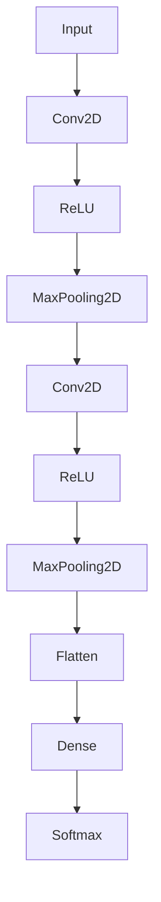
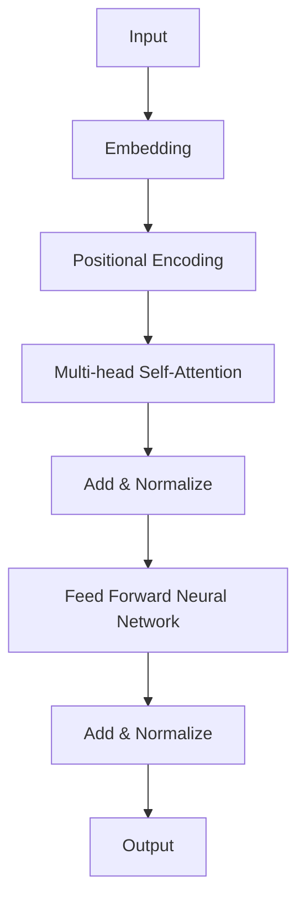
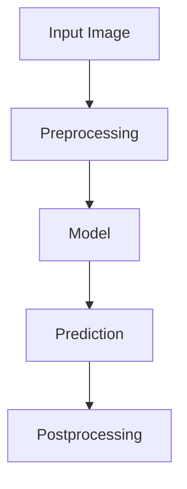
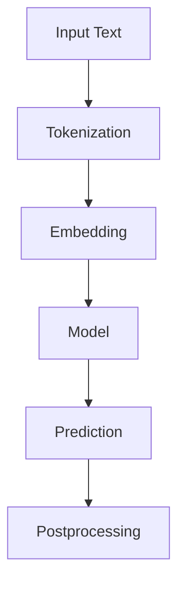
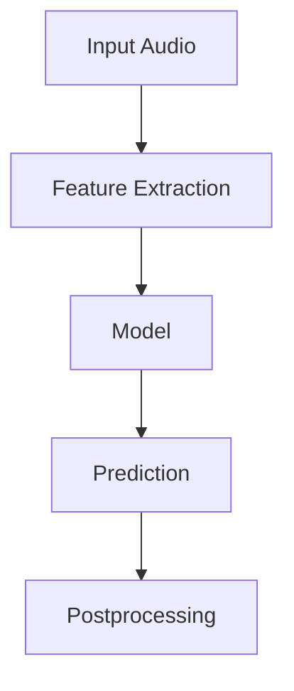

                 

### 文章标题

《从零开始大模型开发与微调：编码器的实现》

### 关键词

大模型，编码器，微调，神经网络，计算机视觉，自然语言处理，模型压缩，模型加速，应用实战，未来发展。

### 摘要

本文旨在为初学者和中级开发者提供一个系统化的指南，介绍从零开始构建和微调大型模型的过程。文章首先概述了大型模型的基础知识，包括其定义、发展历程和应用场景。接着，文章详细阐述了大型模型开发所需的环境准备、数据处理、模型训练等过程，并通过具体的代码示例进行说明。此外，本文还介绍了大型模型微调与优化技术，包括微调的概念、方法以及实际操作步骤。文章最后探讨了大型模型的部署与应用实战，以及未来的技术发展趋势，为读者提供了全面而深入的理解。

### 目录

#### 第一部分：大模型基础知识

#### 第1章 大模型基础
- **1.1 大模型概述**
  - **1.1.1 大模型定义**
  - **1.1.2 大模型的发展**
  - **1.1.3 大模型的重要性

- **1.2 大模型架构**
  - **1.2.1 神经网络架构**
  - **1.2.2 计算机视觉架构**
  - **1.2.3 自然语言处理架构

- **1.3 大模型应用场景**
  - **1.3.1 图像识别**
  - **1.3.2 自然语言处理**
  - **1.3.3 语音识别

#### 第二部分：大模型开发

#### 第2章 大模型开发环境
- **2.1 开发环境准备**
  - **2.1.1 计算机硬件要求**
  - **2.1.2 软件安装指南**
  - **2.1.3 环境配置

- **2.2 数据处理**
  - **2.2.1 数据收集**
  - **2.2.2 数据预处理**
  - **2.2.3 数据增强

- **2.3 模型训练**
  - **2.3.1 训练策略**
  - **2.3.2 模型调优**
  - **2.3.3 模型评估

#### 第三部分：大模型微调与优化

#### 第3章 大模型微调技术
- **3.1 微调概念**
  - **3.1.1 微调原理**
  - **3.1.2 微调方法

- **3.2 微调实战**
  - **3.2.1 微调流程**
  - **3.2.2 微调案例**
  - **3.2.3 微调挑战

#### 第4章 大模型优化
- **4.1 模型压缩**
  - **4.1.1 模型压缩技术**
  - **4.1.2 模型压缩实战

- **4.2 模型加速**
  - **4.2.1 模型加速策略**
  - **4.2.2 模型加速实战

#### 第四部分：大模型部署与实战

#### 第5章 大模型部署
- **5.1 部署环境**
  - **5.1.1 部署架构**
  - **5.1.2 部署策略

- **5.2 部署实战**
  - **5.2.1 部署流程**
  - **5.2.2 部署案例

#### 第6章 大模型应用实战
- **6.1 应用场景分析**
  - **6.1.1 应用场景1：图像识别**
  - **6.1.2 应用场景2：自然语言处理

- **6.2 应用开发**
  - **6.2.1 应用开发流程**
  - **6.2.2 应用开发案例

#### 第五部分：大模型未来发展

#### 第7章 大模型技术趋势
- **7.1 新技术发展**
  - **7.1.1 自动机器学习**
  - **7.1.2 大模型伦理问题

- **7.2 未来展望**
  - **7.2.1 大模型在工业中的应用**
  - **7.2.2 大模型在医疗领域的应用**

### 正文部分（接下来的章节内容将按照上述目录逐一展开）

#### 第1章 大模型基础

##### 1.1 大模型概述

大模型（Large Models）是指在深度学习中，拥有数亿甚至千亿级参数规模的神经网络模型。这些模型因其庞大的参数量和复杂的结构，能够捕捉到大量的数据特征，从而在图像识别、自然语言处理、语音识别等领域取得了显著的性能提升。下面我们将详细探讨大模型的定义、发展历程及其重要性。

###### 1.1.1 大模型定义

大模型通常指的是拥有海量参数和复杂结构的神经网络，它们能够通过学习大量的数据来提升其性能。例如，在自然语言处理（NLP）领域，大型语言模型如 GPT-3 拥有超过 1750 亿个参数，而在计算机视觉领域，像 OpenAI 的 DALL-E 拥有数亿个参数。

###### 1.1.2 大模型的发展

大模型的发展始于 2012 年，当时 Hinton 等人提出了深度卷积神经网络（CNN）在图像识别任务中取得了突破性进展。此后，随着计算能力和数据量的不断提升，大型模型如 GPT、BERT 等相继被提出，并在各个领域取得了显著的成绩。

- **2012年：**AlexNet 在 ImageNet 挑战赛中夺冠，标志着深度学习在图像识别领域的崛起。
- **2017年：**Google 提出了 BERT 模型，其在 NLP 领域引发了广泛关注。
- **2018年：**OpenAI 提出了 GPT-2，拥有超过 15 亿个参数，展示了大型语言模型在生成文本方面的强大能力。
- **2020年：**GPT-3 发布，成为当时拥有最多参数的模型，其在多个任务中展示了超越人类的表现。

###### 1.1.3 大模型的重要性

大模型的重要性体现在以下几个方面：

- **更高的性能：**大模型能够捕捉到更多的数据特征，从而在任务中取得更高的准确率。
- **更强的泛化能力：**大模型能够通过学习大量的数据，提高其在未知数据上的泛化能力。
- **推动人工智能发展：**大模型的成功推动了人工智能在各个领域的应用，为解决复杂问题提供了新的途径。

##### 1.2 大模型架构

大模型通常由多种类型的神经网络组成，包括卷积神经网络（CNN）、循环神经网络（RNN）、Transformer 等。下面我们将介绍这些神经网络在大模型架构中的应用。

###### 1.2.1 神经网络架构

神经网络是构成大模型的基础，常见的神经网络包括卷积神经网络（CNN）、循环神经网络（RNN）和 Transformer 等。

- **卷积神经网络（CNN）：**CNN 主要用于处理图像数据，通过卷积层、池化层和全连接层等结构，能够有效地提取图像的特征。
- **循环神经网络（RNN）：**RNN 主要用于处理序列数据，如文本和语音。通过隐藏状态和循环连接，RNN 能够捕捉序列中的长期依赖关系。
- **Transformer：**Transformer 是一种基于自注意力机制的神经网络结构，广泛应用于 NLP 任务。通过多头注意力机制，Transformer 能够捕捉到序列中的全局依赖关系。

###### 1.2.2 计算机视觉架构

在计算机视觉领域，大模型通常采用 CNN 或 Transformer 结构。例如，ResNet 和 Inception 等模型在 ImageNet 挑战赛中取得了优异的成绩。以下是一个简单的 ResNet 模型的 Mermaid 流程图：

###### 1.2.3 自然语言处理架构

在自然语言处理领域，大模型通常采用 Transformer 结构。以下是一个简单的 Transformer 模型的 Mermaid 流程图：

##### 1.3 大模型应用场景

大模型因其强大的特征捕捉能力，在各种应用场景中表现出色。以下是一些常见的大模型应用场景：

###### 1.3.1 图像识别

图像识别是大模型的重要应用领域。通过学习大量的图像数据，大模型能够有效地识别图像中的物体、场景和动作。以下是一个简单的图像识别流程：

###### 1.3.2 自然语言处理

自然语言处理是大模型的另一个重要应用领域。通过学习大量的文本数据，大模型能够进行文本分类、情感分析、机器翻译等任务。以下是一个简单的自然语言处理流程：

###### 1.3.3 语音识别

语音识别是大模型在语音处理领域的重要应用。通过学习大量的语音数据，大模型能够有效地识别语音中的单词和句子。以下是一个简单的语音识别流程：

#### 总结

本章介绍了大模型的基础知识，包括定义、发展历程和应用场景。通过分析大模型的架构和具体应用，读者可以初步了解大模型在计算机视觉、自然语言处理和语音识别等领域的强大能力。接下来，我们将进一步探讨大模型开发所需的环境准备、数据处理和模型训练等内容。请继续关注下一章的内容。

---

**[接下来将进入下一章：大模型开发环境]**

