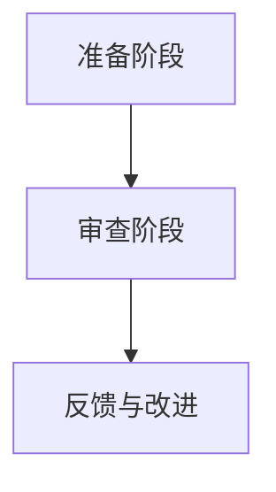
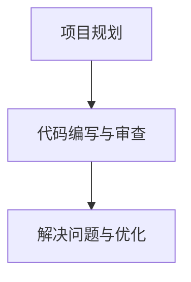

                 

# 《代码审查与结对编程原理与代码实战案例讲解》

> 关键词：代码审查，结对编程，代码质量，团队协作，实战案例

> 摘要：本文深入探讨了代码审查与结对编程的原理和实践方法，通过详细讲解和实战案例，帮助读者全面理解和应用这些技术，以提高软件开发项目的代码质量和团队协作效率。

### 引言

代码审查（Code Review）和结对编程（Pair Programming）是软件开发中常用的两种提高代码质量和促进团队协作的方法。代码审查通过团队成员之间的代码检查和反馈，确保代码质量；而结对编程则通过两位程序员协作完成工作，提高工作效率和代码质量。本文将详细讲解这两种方法的基本原理、实践步骤以及实际应用案例，帮助读者更好地理解和应用它们。

#### 第1章：代码审查的基础

## 1.1 代码审查的定义与重要性

代码审查是指团队成员对他人编写的代码进行检查、评论和反馈的过程。它有助于发现代码中的错误、潜在问题以及优化建议，从而提高代码质量。代码审查的重要性体现在以下几个方面：

1. **提高代码质量**：通过代码审查，可以发现代码中的潜在缺陷和性能问题，从而提高代码的可读性、可维护性和性能。
2. **促进知识共享**：代码审查过程中，团队成员可以互相学习和交流，提高整体技术水平和团队协作能力。
3. **减少缺陷和错误**：代码审查可以提前发现和修复代码中的错误，降低项目上线后的风险和成本。

## 1.2 代码审查的过程与步骤

代码审查的过程通常包括以下步骤：

1. **准备阶段**：在代码审查前，需要选择适当的代码片段进行审查，并通知相关人员进行审查。
2. **审查阶段**：审查者仔细阅读代码，查找潜在的问题，并给出反馈和建议。
3. **反馈与改进**：审查者将反馈和建议传达给代码编写者，代码编写者根据反馈进行改进。

## 1.3 代码审查的工具与技术

代码审查过程中可以使用以下工具和技术：

1. **静态代码分析工具**：如SonarQube、Checkstyle等，可以自动检测代码中的潜在问题。
2. **代码审查工具**：如Gerrit、Phabricator等，提供代码审查的界面和流程管理。
3. **沟通与协作**：使用聊天工具、邮件或会议等方式进行沟通和协作，确保审查过程顺利进行。

#### 第2章：结对编程原理与实践

## 2.1 结对编程的概念与原理

结对编程是指两位程序员在同一台计算机前合作完成软件开发任务的方法。其中一位担任“驱动员”（Driver），负责编写代码；另一位担任“导航员”（Navigator），负责审查代码、思考问题并提供解决方案。

## 2.2 结对编程的实际应用

结对编程在实际应用中具有以下优势：

1. **提高代码质量**：通过合作编写代码，可以及时发现和解决潜在问题，提高代码质量。
2. **促进知识共享**：两位程序员可以互相学习和交流，提高整体技术水平和团队协作能力。
3. **降低犯错概率**：通过合作编写代码，可以降低个人犯错的可能性。

## 2.3 结对编程的挑战与解决方案

结对编程在实际应用中可能面临以下挑战：

1. **沟通障碍**：两位程序员需要有效沟通，确保任务顺利进行。解决方案包括使用聊天工具、定期会议等方式加强沟通。
2. **时间管理**：需要合理分配时间，确保两位程序员都能有足够的时间进行编程和审查。解决方案包括制定工作计划、设定时间限制等。
3. **解决冲突的策略**：在合作过程中，两位程序员可能会产生分歧。解决方案包括互相尊重、充分讨论、寻找共识等。

#### 第3章：代码审查实战案例

## 3.1 案例背景与目标

假设有一个开发团队正在开发一个电子商务网站。为了确保代码质量，团队决定进行代码审查。

## 3.2 代码审查过程

1. **准备阶段**：团队选择了一个功能模块进行审查，并通知相关人员进行审查。
2. **审查阶段**：审查人员仔细阅读代码，查找潜在的问题，并给出反馈和建议。审查过程中，使用静态代码分析工具和代码审查工具辅助工作。
3. **反馈与改进**：审查人员将反馈和建议传达给代码编写者，代码编写者根据反馈进行改进。

## 3.3 案例分析与总结

通过代码审查，团队发现并解决了以下问题：

1. **代码冗长**：代码中有大量重复代码，可以通过重构提高可读性和可维护性。
2. **潜在性能问题**：代码中有一些不必要的循环和递归调用，可以通过优化算法提高性能。

通过代码审查，团队提高了代码质量，降低了潜在风险，为后续开发奠定了基础。

#### 第4章：结对编程实战案例

## 4.1 案例背景与目标

假设有一个开发团队正在开发一个在线教育平台。为了提高工作效率和代码质量，团队决定采用结对编程方法。

## 4.2 结对编程过程

1. **项目规划**：团队将项目分为若干个任务，并为每个任务分配两名程序员进行结对编程。
2. **代码编写与审查**：两名程序员合作完成代码编写，其中一名程序员负责编写代码，另一名程序员负责审查代码。在编写过程中，两人可以互相提问、讨论和解决问题。
3. **解决问题与优化**：在遇到问题时，两名程序员可以共同寻找解决方案，并进行优化。

## 4.3 案例分析与总结

通过结对编程，团队取得了以下成果：

1. **提高代码质量**：通过合作编写代码，团队及时发现和解决了潜在问题，提高了代码质量。
2. **促进知识共享**：两名程序员可以互相学习和交流，提高整体技术水平和团队协作能力。

虽然结对编程在项目初期可能会增加开发时间，但从长远来看，可以提高团队的工作效率和代码质量，为项目的成功奠定基础。

#### 第5章：代码质量评估

## 5.1 代码质量的指标

代码质量可以从以下几个方面进行评估：

1. **可读性**：代码是否容易理解，命名是否符合规范，代码结构是否清晰。
2. **可维护性**：代码是否容易修改和扩展，是否有良好的注释和文档。
3. **性能**：代码是否高效，是否有优化空间。

## 5.2 代码质量评估方法

评估代码质量的方法包括：

1. **静态代码分析**：使用工具对代码进行语法和语义分析，检测潜在的问题。
2. **动态代码分析**：在实际运行环境中对代码进行分析，检测性能和稳定性问题。
3. **自动化测试**：编写测试用例，对代码进行测试，确保代码的功能和性能符合预期。

## 5.3 提高代码质量的策略

以下是一些提高代码质量的策略：

1. **编码规范**：制定统一的编码规范，确保代码风格一致。
2. **代码重构**：定期对代码进行重构，提高代码的可读性和可维护性。
3. **持续集成与持续部署**：确保代码质量，及时发现问题并进行修复。

#### 第6章：代码审查与结对编程的结合应用

## 6.1 结合的优势

代码审查与结对编程的结合具有以下优势：

1. **提高代码质量**：通过代码审查和结对编程，可以及时发现和解决潜在问题，提高代码质量。
2. **促进团队协作**：通过协作和沟通，可以加强团队成员之间的联系，提高团队协作能力。
3. **降低开发风险**：通过代码审查和结对编程，可以降低代码缺陷和错误的风险。

## 6.2 实践方法

以下是一些实践方法：

1. **流程设计**：制定代码审查和结对编程的流程，明确责任和分工。
2. **实施步骤**：按照流程进行代码审查和结对编程，确保工作顺利进行。
3. **效果评估**：定期评估代码质量和团队协作效果，持续改进。

## 6.3 案例分析

### 6.3.1 成功案例

在一个大型电商项目中，团队采用了代码审查和结对编程的方法。通过代码审查，团队发现并修复了多个潜在问题，提高了代码质量。通过结对编程，团队提高了工作效率和代码质量，项目成功上线。

### 6.3.2 失败案例

在一个小型项目中，团队没有进行代码审查和结对编程，导致代码质量低下，项目进度延误。通过分析，团队认识到代码审查和结对编程的重要性，并开始采用这些方法，项目最终得以顺利完成。

#### 第7章：未来的发展趋势与展望

## 7.1 代码审查与结对编程的未来

随着技术的发展，代码审查与结对编程将不断创新和进步：

1. **自动化审查工具的发展**：未来将出现更多高效、智能的自动化审查工具，提高审查效率和准确性。
2. **人工智能在代码审查中的应用**：通过人工智能技术，可以实现更加智能的代码审查，提高代码质量。
3. **结对编程的智能化趋势**：未来将出现更多智能化、自动化的结对编程工具，提高协作效率。

## 7.2 未来的挑战与机遇

代码审查与结对编程在未来将面临以下挑战与机遇：

1. **团队协作的障碍**：如何更好地促进团队成员之间的协作，提高团队整体效率。
2. **技术进步带来的挑战**：如何适应新的技术变化，提高代码审查和结对编程的效率。
3. **持续学习的重要性**：团队成员需要不断学习和更新知识，以应对未来的挑战。

### 附录

#### 附录A：代码审查与结对编程工具推荐

- **代码审查工具**：
  - Gerrit：一个强大的代码审查工具，支持Git仓库。
  - Phabricator：一个集成代码审查、项目管理、部署等功能的平台。
  - GitHub Pull Requests：GitHub内置的代码审查功能，简单易用。

- **结对编程工具**：
  - Visual Studio Live Share：支持实时共享代码和屏幕的IDE扩展。
  - WebEx：一款视频会议软件，方便远程协作。
  - Zoom：一款功能强大的视频会议软件，适合远程团队协作。

#### 附录B：常见问题解答

- **如何处理代码审查中的争议？**
  - 在代码审查过程中，如果出现争议，建议双方首先保持冷静，充分沟通，了解对方的观点和需求。如果无法达成共识，可以寻求团队成员的帮助，或者进行投票决定。

- **代码审查的频率如何控制？**
  - 代码审查的频率应根据项目规模和团队情况灵活控制。一般建议每周至少进行一次代码审查，确保代码质量，并及时发现和解决问题。

### 总结

代码审查与结对编程是提高软件开发质量、促进团队协作的重要方法。通过本文的讲解和实战案例，读者可以深入了解这两种方法的基本原理、实践方法和效果评估。在未来的发展中，代码审查与结对编程将继续不断创新和进步，为软件开发带来更多的机遇与挑战。读者应保持持续学习，以应对未来的变化。

### 作者信息

作者：AI天才研究院/AI Genius Institute & 禅与计算机程序设计艺术 /Zen And The Art of Computer Programming

### Mermaid 流程图

以下是代码审查的基本流程：

以下是结对编程的基本流程：

