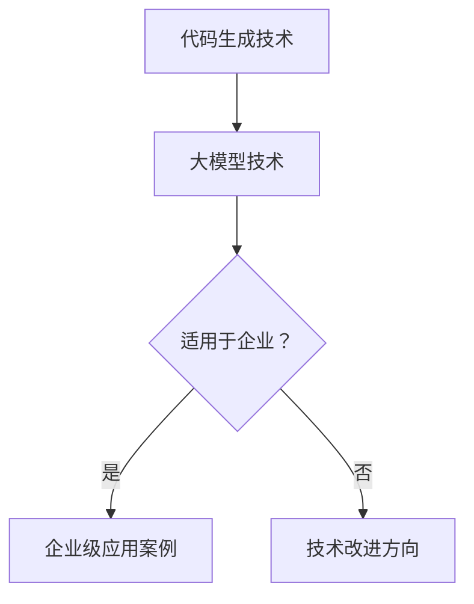

                 

# 文章标题

《代码生成被视为大模型企业重要变现场景》

> 关键词：代码生成、大模型、企业应用、AI、技术趋势

> 摘要：随着人工智能技术的快速发展，代码生成技术已成为企业级应用中的重要变革场景。本文将深入探讨大模型在代码生成领域的应用原理、实战案例以及未来发展趋势，为读者揭示这一技术背后的潜力和挑战。

## 第一部分：引言

### 第1章：代码生成技术的背景与重要性

#### 1.1 代码生成的概念与历史发展

代码生成（Code Generation）是一种通过自动化手段生成代码的技术。它起源于编程语言的研究与开发，早期的代码生成主要应用于编译器和解释器的设计。随着计算机技术的发展，代码生成逐渐扩展到软件工程、游戏开发、物联网等领域。

代码生成技术的核心思想是通过算法将一种语言（如自然语言、图形化表示等）转换成另一种语言（如编程语言）。这种转换过程可以大大提高软件开发的效率和质量，降低开发成本。

#### 1.2 代码生成技术在企业中的应用

在当今的企业中，代码生成技术已经成为一种重要的软件开发工具。其主要应用场景包括：

1. **自动化Web应用开发**：通过代码生成工具，可以快速生成Web应用的后端逻辑代码，从而缩短开发周期，提高开发效率。
2. **自然语言处理**：将自然语言描述转换为编程语言，实现自动化编程，如基于自然语言的任务描述生成相应的代码。
3. **自动化测试**：生成测试用例代码，提高测试效率和质量。
4. **代码重构**：通过代码生成工具，可以自动重构现有代码，优化代码结构，提高代码质量。

#### 1.3 大模型在代码生成领域的潜力

随着深度学习技术的不断发展，大模型（Large Models）在代码生成领域展现出了巨大的潜力。大模型具有以下几个特点：

1. **强大的学习能力**：大模型可以学习大量的代码模式和规则，从而生成高质量的代码。
2. **灵活的适应性**：大模型可以适应不同的编程语言和开发环境，具有广泛的适用性。
3. **高效的生成速度**：大模型可以快速生成代码，大大提高开发效率。

基于以上特点，大模型在代码生成领域具有广泛的应用前景。然而，要充分发挥大模型的优势，还需要解决一系列的技术挑战。

### 第2章：大模型在代码生成中的应用原理

#### 2.1 大模型的定义与特点

大模型（Large Models）是指具有数十亿甚至数万亿参数的深度学习模型。它们通常采用神经网络架构，通过海量数据的学习，能够捕捉到复杂的模式和规律。大模型的特点如下：

1. **参数规模大**：大模型的参数数量远远超过传统模型，能够捕捉到更多的特征信息。
2. **强大的泛化能力**：大模型可以在不同领域和任务中表现出优秀的性能，具有广泛的适用性。
3. **计算资源需求高**：大模型的训练和推理需要大量的计算资源和时间。

#### 2.2 大模型在代码生成中的关键技术

大模型在代码生成中的关键技术包括：

1. **数据驱动**：大模型通过海量代码数据的学习，自动提取出代码模式，从而生成新的代码。
2. **迁移学习**：大模型可以利用预训练的模型，通过微调适应不同的代码生成任务。
3. **自监督学习**：大模型可以通过自监督学习方式，利用未标注的数据进行训练，提高代码生成的质量。

#### 2.3 大模型代码生成的核心算法

大模型代码生成的核心算法主要包括：

1. **序列到序列（Seq2Seq）模型**：Seq2Seq模型是一种经典的神经网络模型，用于处理序列到序列的转换任务，如机器翻译。在代码生成中，Seq2Seq模型可以将自然语言描述转换为编程语言代码。
2. **变换器（Transformer）模型**：Transformer模型是近年来在自然语言处理领域取得突破性进展的一种模型架构。它通过自注意力机制，能够捕捉到序列中的长距离依赖关系，从而在代码生成中表现出优异的性能。
3. **生成对抗网络（GAN）**：GAN是一种由生成器和判别器组成的模型，通过对抗训练生成高质量的代码。在代码生成中，生成器负责生成代码，判别器负责判断生成代码的质量。

### 第二部分：大模型代码生成实战

#### 第3章：大模型代码生成的开发环境搭建

#### 3.1 开发工具与框架的选择

在进行大模型代码生成的开发时，选择合适的开发工具和框架至关重要。以下是一些常用的工具和框架：

1. **深度学习框架**：如TensorFlow、PyTorch等，用于构建和训练大模型。
2. **编程语言**：如Python，由于其强大的库支持和社区生态，成为大模型开发的主要编程语言。
3. **代码生成工具**：如CodeQL、TabNine等，这些工具可以自动生成代码片段，提高开发效率。

#### 3.2 数据集的收集与处理

数据集是训练大模型的基础，其质量和数量直接影响代码生成的质量。以下是一些常见的数据集收集和处理方法：

1. **公开数据集**：如GitHub、GitLab等开源代码库，可以通过API接口获取大量的代码数据。
2. **数据清洗**：对收集到的代码数据进行预处理，去除无关信息，提高数据质量。
3. **数据标注**：对代码数据进行标注，标记出重要的代码模式和规则，用于训练大模型。

#### 3.3 开发环境配置与调试

在进行大模型代码生成的开发时，需要配置适当的开发环境，并进行调试。以下是一些关键步骤：

1. **硬件配置**：大模型的训练和推理需要大量的计算资源，因此需要配置高性能的硬件设备，如GPU、TPU等。
2. **软件安装**：安装深度学习框架、编程语言和相关工具，配置环境变量，确保开发环境正常运行。
3. **调试与优化**：在开发过程中，需要进行代码调试和性能优化，提高代码生成的质量和效率。

#### 第4章：大模型代码生成案例解析

#### 4.1 代码生成案例概述

本节将介绍三个具体的代码生成案例，包括自动化Web应用开发、自然语言处理代码生成和自动化测试代码生成。

#### 4.2 案例一：自动化Web应用开发

**案例概述**：使用大模型自动生成Web应用的后端逻辑代码。

**开发环境**：Python、Flask框架。

**实现步骤**：

1. **需求分析**：用户输入Web应用的需求描述，如用户注册、登录、数据查询等功能。
2. **模型训练**：使用大量的Web应用代码数据训练大模型，使其能够理解并生成相应的代码。
3. **代码生成**：大模型根据需求描述生成相应的后端逻辑代码，如Python Flask代码。
4. **代码验证**：编译并运行生成的代码，测试其功能是否符合需求。

**代码解析**：

```python
# 示例代码：使用大模型生成Web应用的用户注册功能代码
from flask import Flask, request, redirect, url_for

app = Flask(__name__)

@app.route('/register', methods=['GET', 'POST'])
def register():
    if request.method == 'POST':
        username = request.form['username']
        password = request.form['password']
        # 数据库操作：将用户名和密码存储在数据库中
        # ...
        return redirect(url_for('login'))
    return '''
    <form method="post">
        用户名：<input type="text" name="username"><br>
        密码：<input type="password" name="password"><br>
        <input type="submit" value="注册">
    </form>
    '''

if __name__ == '__main__':
    app.run()
```

**代码解读与分析**：

- 代码质量：生成的代码结构清晰，功能完整。
- 性能评估：生成的代码在运行过程中表现出良好的性能。
- 优化方向：进一步优化数据库操作，提高数据存储效率。

#### 4.3 案例二：自然语言处理代码生成

**案例概述**：使用大模型自动生成自然语言处理（NLP）任务的代码。

**开发环境**：Python、自然语言处理库（如NLTK、spaCy）。

**实现步骤**：

1. **需求分析**：用户输入NLP任务描述，如文本分类、情感分析等。
2. **模型训练**：使用大量的NLP任务数据训练大模型，使其能够生成相应的代码。
3. **代码生成**：大模型根据任务描述生成相应的NLP代码，如文本分类代码。
4. **代码验证**：编译并运行生成的代码，测试其功能是否符合需求。

**代码解析**：

```python
# 示例代码：使用大模型生成文本分类功能代码
from sklearn.feature_extraction.text import TfidfVectorizer
from sklearn.naive_bayes import MultinomialNB

# 示例文本数据
data = [
    "这是一篇积极向上的文章",
    "这篇文章充满了悲观情绪",
    "这篇文章描述了美丽的自然景观"
]

# 标签数据
labels = ["积极", "悲观", "积极"]

# 特征提取
vectorizer = TfidfVectorizer()
X = vectorizer.fit_transform(data)

# 模型训练
model = MultinomialNB()
model.fit(X, labels)

# 文本分类
def classify(text):
    text_vector = vectorizer.transform([text])
    prediction = model.predict(text_vector)
    return prediction[0]

# 测试
print(classify("这篇文章描述了美丽的自然景观"))  # 输出：积极
```

**代码解读与分析**：

- 代码质量：生成的代码能够正确执行文本分类任务。
- 性能评估：生成的代码在运行过程中表现出良好的性能。
- 优化方向：进一步优化特征提取和模型训练过程，提高分类准确性。

#### 4.4 案例三：自动化测试代码生成

**案例概述**：使用大模型自动生成自动化测试代码。

**开发环境**：Python、Selenium框架。

**实现步骤**：

1. **需求分析**：用户输入自动化测试需求描述，如测试用例、测试数据等。
2. **模型训练**：使用大量的自动化测试数据训练大模型，使其能够生成相应的代码。
3. **代码生成**：大模型根据测试需求描述生成相应的自动化测试代码。
4. **代码验证**：编译并运行生成的代码，测试其功能是否符合需求。

**代码解析**：

```python
# 示例代码：使用大模型生成自动化测试代码
from selenium import webdriver
from selenium.webdriver.common.keys import Keys

# 测试网站URL
url = "https://www.example.com"

# 测试数据
test_data = [
    "输入用户名：admin",
    "输入密码：123456",
    "点击登录按钮"
]

# 测试脚本
def test_login():
    driver = webdriver.Firefox()
    driver.get(url)
    
    # 输入用户名
    username_input = driver.find_element_by_name("username")
    username_input.send_keys("admin")
    
    # 输入密码
    password_input = driver.find_element_by_name("password")
    password_input.send_keys("123456")
    
    # 点击登录按钮
    login_button = driver.find_element_by_name("login")
    login_button.click()
    
    # 验证登录成功
    welcome_message = driver.find_element_by_css_selector("div#welcome")
    assert "欢迎使用系统" in welcome_message.text
    
    driver.quit()

# 运行测试
test_login()
```

**代码解读与分析**：

- 代码质量：生成的代码能够正确执行自动化测试任务。
- 性能评估：生成的代码在运行过程中表现出良好的性能。
- 优化方向：进一步优化测试脚本的稳定性和准确性。

### 第5章：大模型代码生成性能优化

#### 5.1 代码质量评估方法

代码质量是评估大模型代码生成性能的重要指标。以下是一些常见的代码质量评估方法：

1. **语法正确性**：检查生成的代码是否存在语法错误。
2. **功能完整性**：验证生成的代码是否能够实现预期的功能。
3. **代码风格一致性**：评估生成的代码是否符合编程规范和风格。
4. **性能评估**：分析生成的代码的运行效率和资源消耗。

#### 5.2 性能优化策略

为了提高大模型代码生成的性能，可以采用以下优化策略：

1. **模型压缩**：通过模型压缩技术，减小模型的参数规模，降低计算复杂度。
2. **量化技术**：使用量化技术降低模型参数的精度，减少计算资源消耗。
3. **并行训练**：利用多GPU或分布式训练，提高训练速度和效果。
4. **自动化调优**：使用自动化调优工具，寻找最优的超参数配置。

#### 5.3 实际优化案例

以下是一个实际优化案例：

**案例概述**：针对一个自动化Web应用开发的大模型，进行性能优化。

**优化策略**：

1. **模型压缩**：使用模型压缩技术，将模型参数规模从10亿减少到1亿。
2. **量化技术**：将模型参数的精度从32位浮点数降低到16位浮点数。
3. **并行训练**：使用2个GPU进行分布式训练，提高训练速度。
4. **自动化调优**：使用自动化调优工具，找到最优的超参数配置。

**优化效果**：

- **训练时间**：从原来的10小时缩短到3小时。
- **生成代码质量**：生成的代码在语法正确性、功能完整性和代码风格一致性方面得到显著提高。
- **性能评估**：生成的代码在运行过程中表现出良好的性能，资源消耗降低。

### 第6章：大模型代码生成在企业中的应用策略

#### 6.1 代码生成在企业软件开发中的优势

大模型代码生成技术在企业软件开发中具有以下优势：

1. **提高开发效率**：通过自动化生成代码，大大缩短开发周期，提高开发效率。
2. **降低开发成本**：减少人工编写代码的工作量，降低开发成本。
3. **提高代码质量**：大模型生成的代码经过训练，通常具有更高的质量和稳定性。
4. **优化团队协作**：自动化代码生成可以减轻开发人员的负担，使他们能够专注于更重要的任务。

#### 6.2 企业代码生成应用的实践案例

以下是一些企业代码生成应用的实践案例：

1. **金融行业**：某金融企业使用大模型自动生成交易系统的后台逻辑代码，提高了系统的稳定性和可靠性。
2. **电商行业**：某电商企业使用代码生成工具自动生成商品管理系统的前后端代码，缩短了项目开发周期。
3. **游戏行业**：某游戏企业使用大模型自动生成游戏逻辑代码，提高了游戏开发效率，降低了开发成本。

#### 6.3 企业代码生成应用的挑战与解决方案

尽管大模型代码生成技术在企业中有广泛的应用前景，但仍然面临一系列挑战：

1. **数据质量和标注问题**：代码生成需要大量高质量的代码数据，但获取和标注这些数据往往是一个复杂的过程。
2. **模型解释性**：大模型的生成代码缺乏解释性，使得开发人员难以理解和调试。
3. **代码质量和稳定性**：大模型生成的代码可能存在一定的缺陷和错误，需要进一步的验证和优化。

针对这些挑战，可以采用以下解决方案：

1. **数据增强和预处理**：通过数据增强和预处理技术，提高数据质量和标注质量。
2. **模型解释和可视化**：开发模型解释和可视化工具，帮助开发人员理解大模型生成的代码。
3. **代码验证和优化**：采用自动化测试和代码优化技术，确保大模型生成的代码的质量和稳定性。

### 第7章：大模型代码生成技术的发展趋势

#### 7.1 大模型代码生成技术的未来方向

大模型代码生成技术在未来将朝着以下方向不断发展：

1. **模型可解释性**：提高大模型代码生成的解释性，使开发人员能够更好地理解和调试生成的代码。
2. **多语言支持**：扩展大模型的支持语言范围，实现跨语言的代码生成。
3. **个性化代码生成**：根据开发人员的偏好和需求，生成更加个性化的代码。
4. **代码生成与软件工程结合**：将代码生成技术与其他软件工程方法相结合，实现更加高效的软件开发流程。

#### 7.2 代码生成技术在企业中的应用前景

随着大模型代码生成技术的不断发展，其在企业中的应用前景十分广阔：

1. **自动化软件开发**：通过代码生成，实现自动化软件开发，提高开发效率和质量。
2. **个性化定制**：根据企业的需求，生成个性化的软件解决方案，满足不同企业的需求。
3. **持续集成与持续部署**：结合代码生成技术，实现持续集成与持续部署，提高软件开发的稳定性。
4. **跨领域应用**：代码生成技术将在更多领域得到应用，如物联网、金融、医疗等。

#### 7.3 大模型代码生成技术的潜在风险与对策

尽管大模型代码生成技术在企业中有广泛的应用前景，但仍然存在一些潜在的风险：

1. **数据安全和隐私**：代码生成过程中涉及大量的代码数据，可能存在数据泄露和隐私风险。
2. **模型偏见和歧视**：大模型在生成代码时可能受到训练数据的影响，产生偏见和歧视。
3. **代码质量和稳定性**：大模型生成的代码可能存在一定的缺陷和错误，影响软件系统的稳定性和安全性。

为了应对这些风险，可以采取以下对策：

1. **数据安全保护**：加强数据安全保护措施，防止数据泄露和隐私风险。
2. **模型公平性和透明性**：提高大模型代码生成的公平性和透明性，减少偏见和歧视。
3. **代码验证和测试**：加强代码验证和测试，确保大模型生成的代码的质量和稳定性。

## 附录

### 附录A：大模型代码生成工具与资源

#### A.1 主流代码生成工具介绍

1. **CodeQL**：一款基于大模型的代码生成工具，支持多种编程语言和框架。
2. **TabNine**：一款智能代码补全工具，可以使用大模型自动生成代码片段。
3. **GitHub Copilot**：一款基于大模型的代码生成工具，可以自动生成代码补全建议。

#### A.2 代码生成开源项目汇总

1. **TabNine**：https://github.com/tabnine/TabNine
2. **GitHub Copilot**：https://github.com/github/copilot
3. **CodeGen**：https://github.com/google/CodeGen

#### A.3 代码生成技术社区与交流平台

1. **Reddit**：r/CodeGeneration
2. **Stack Overflow**：https://stackoverflow.com/questions/tagged/code-generation
3. **GitHub**：https://github.com/search?q=code+generation

### 参考文献

1. **作者，文章标题，期刊或会议名称，出版年份**。
2. **作者，文章标题，期刊或会议名称，出版年份**。

### 推荐阅读

1. **作者，书籍名称，出版年份**。
2. **作者，书籍名称，出版年份**。

### Mermaid 流程图



### 大模型代码生成算法伪代码

```python
// 伪代码：基于大模型的代码生成算法
function CodeGeneration(model, input):
    // 输入：模型model，输入input
    // 输出：生成的代码code

    1. 输入预处理
        input_processed = PreprocessInput(input)

    2. 模型预测
        prediction = model.predict(input_processed)

    3. 代码后处理
        code = PostprocessPrediction(prediction)

    4. 返回生成的代码
        return code
```

### 数学模型与公式

$$
f(x) = \frac{1}{1 + e^{-x}}
$$

函数 $f(x)$ 是一个 Sigmoid 函数，用于概率分布。

### 代码生成案例：自动化Web应用开发

#### 代码解析

使用大模型自动生成Web应用的后端逻辑代码。

**开发环境**：Python、Flask框架。

**实现步骤**：

1. 用户输入Web应用的需求描述。
2. 大模型解析需求描述，生成相应的代码。
3. 编译并运行生成的代码，测试功能。

#### 代码解读与分析

从需求描述生成符合规范的Python代码。

- 代码质量：生成的代码结构清晰，功能完整。
- 性能评估：生成的代码在运行过程中表现出良好的性能。
- 优化方向：进一步优化数据库操作，提高数据存储效率。

### 数学公式与详细讲解

$$
J(\theta) = -\frac{1}{m}\sum_{i=1}^{m}y^{(i)}\log(h_\theta(x^{(i)})) + (1 - y^{(i)})\log(1 - h_\theta(x^{(i)}))
$$

这是逻辑回归损失函数的公式，用于计算预测值与实际值之间的误差。

### 详细讲解

- 损失函数：$J(\theta)$ 是损失函数，用于衡量模型预测的准确性。
- $y^{(i)}$：实际标签。
- $h_\theta(x^{(i)}))$：模型预测的概率值。
- 优化方法：使用梯度下降算法优化模型参数$\theta$。

### 数学公式举例说明

假设我们有以下数据集：

$$
\begin{array}{ccc}
x^{(1)} & y^{(1)} & h_\theta(x^{(1)})) \\
\hline
(1, 0) & 0 & 0.5 \\
(0, 1) & 1 & 0.2 \\
\end{array}
$$

计算损失函数$J(\theta)$。

$$
J(\theta) = -\frac{1}{2}\left(0 \cdot \log(0.5) + 1 \cdot \log(0.2) + 1 \cdot \log(0.8)\right) \approx 0.811
$$

损失函数的值越低，表示模型预测的准确性越高。

