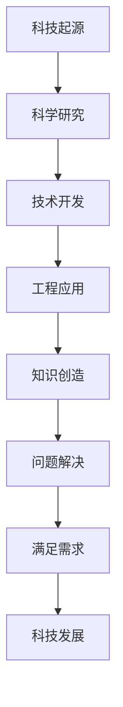
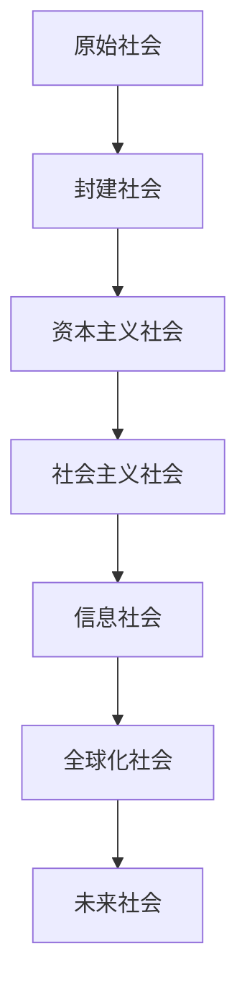
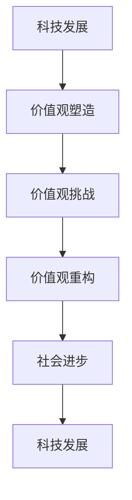

                 

# 《以人为本的科技未来：人类计算的价值观》

> 关键词：科技，人类价值观，计算，伦理，可持续发展，案例分析，教育，医疗，环境保护

> 摘要：随着科技的快速发展，人类的生活方式和社会结构正在发生深刻变革。本文旨在探讨以人为本的科技未来，分析科技与人类价值观之间的关系，探讨科技伦理的重要性，以及科技在各个领域的应用和其对未来的影响。通过深入剖析，本文试图为科技与人类价值观的互动提供一个清晰的理论框架，为科技发展提供指导性建议。

## 第一部分：科技与人类价值观

### 第1章：科技与人类价值观的关系

科技与人类价值观的关系密不可分。科技的发展不仅改变了人类的生活方式，也在不断塑造和挑战着人类的价值观。在这一章中，我们将探讨以下几个方面：

#### 1.1 科技的发展与人类价值观的变化

科技的发展对人类价值观的影响是多方面的。一方面，科技的发展为人类带来了前所未有的便利和进步，如医疗技术的进步、交通的便捷等，这些都增强了人类的信心和自我认同。另一方面，科技的发展也带来了一些挑战，如隐私问题、数据安全等，这些问题引发了人们对自由和安全的重新思考。

#### 1.2 以人为本的科技理念

以人为本的科技理念强调科技的发展应该以提升人类福祉为核心。这一理念要求科技不仅要有技术上的创新，还要有社会和文化上的适应性，以满足人类的需求和期望。例如，在医疗领域，科技的发展应该注重提高患者的治疗效果和生活质量，而不是单纯追求技术的先进性。

#### 1.3 人类计算的价值观核心

人类计算的价值观核心可以归结为以下几点：

- 尊重个体的权利和尊严，确保科技的应用不会侵犯个人的隐私和自由。
- 促进公平和正义，确保科技的发展能够惠及所有人，而不是造成社会的分化。
- 注重可持续发展，确保科技的发展不会对环境造成不可逆的破坏。
- 强调人机协同，通过科技辅助人类，而不是替代人类。

### 第2章：科技对人类生活的影响

科技对人类生活的影响是深远且多方面的。在这一章中，我们将从工作、生活方式和社交三个方面探讨科技对人类生活的影响。

#### 2.1 科技对工作方式的影响

科技的发展极大地改变了人类的劳动方式。自动化和智能化技术的应用使得许多重复性和劳动力密集型的工作得以自动化，提高了生产效率。同时，远程工作和在线协作工具的出现，使得人们可以更加灵活地安排工作和生活。

#### 2.2 科技对生活方式的影响

科技的发展对人类的生活方式产生了巨大的影响。例如，智能手机和移动互联网的普及，使得人们可以随时随地获取信息和进行社交。智能家居和智能穿戴设备的兴起，使得人们的生活更加便捷和舒适。

#### 2.3 科技对社交方式的影响

科技对社交方式的影响尤为显著。在线社交平台的兴起，改变了人们的社交模式，使得人们可以跨越地理限制，与世界各地的人进行交流。然而，虚拟社交也带来了一些问题，如人际关系疏离、孤独感增加等。

### 第3章：科技伦理与责任

科技伦理是科技发展中不可忽视的重要议题。在这一章中，我们将探讨科技伦理的挑战、基本原则以及案例分析。

#### 3.1 科技伦理的挑战

科技伦理面临的挑战主要包括：

- 隐私保护：随着大数据和人工智能技术的发展，个人的隐私保护成为了一个严峻的问题。
- 安全问题：网络攻击、数据泄露等问题频发，威胁着个人和社会的安全。
- 社会公平：科技的发展往往伴随着资源分配的不均，如何确保所有人都能公平地享受到科技带来的福利是一个重要议题。

#### 3.2 科技伦理的基本原则

科技伦理的基本原则主要包括：

- 尊重个人权利：科技的发展应尊重个人的权利和尊严，确保个人的隐私和自由得到保护。
- 促进社会公平：科技的发展应促进社会公平，确保所有人都能公平地享受到科技带来的福利。
- 可持续发展：科技的发展应注重可持续发展，确保科技的应用不会对环境造成不可逆的破坏。
- 人机协同：科技的发展应注重人机协同，通过科技辅助人类，而不是替代人类。

#### 3.3 科技伦理案例分析

在本章的末尾，我们将通过一些具体的科技伦理案例分析，探讨科技伦理在现实中的应用和挑战。这些案例包括：

- 数据泄露事件：如Facebook的数据泄露事件，揭示了数据隐私保护的重要性。
- 人工智能伦理：如自动驾驶汽车的伦理问题，探讨了人工智能在决策过程中应如何考虑道德因素。
- 生物技术伦理：如基因编辑技术的伦理争议，探讨了科技在改变人类基因方面的道德责任。

### 第4章：以人为本的科技应用

以人为本的科技应用是科技发展的重要方向。在这一章中，我们将探讨科技在医疗健康、教育和环境保护等领域的应用。

#### 4.1 科技在医疗健康领域的应用

科技在医疗健康领域的应用取得了显著成果。例如，人工智能在疾病诊断和预测中的应用，提高了医疗的准确性和效率。远程医疗技术的普及，使得偏远地区的患者也能够享受到优质的医疗服务。

#### 4.2 科技在教育领域的应用

科技在教育领域的应用为教育提供了新的可能性。在线教育平台的出现，打破了时间和空间的限制，使得更多的人能够接受教育。同时，教育技术的创新，如虚拟现实和增强现实，为教育提供了更加生动和互动的方式。

#### 4.3 科技在环境保护领域的应用

科技在环境保护领域的应用也具有重要意义。例如，智能监测技术可以帮助我们更好地了解环境状况，预测和预防环境灾害。可再生能源技术的发展，为环境保护提供了新的路径。

### 第5章：科技与人类未来

科技对人类未来的影响将是深远且多方面的。在这一章中，我们将探讨科技对人类未来的影响、人类计算的价值观与未来社会，以及未来科技发展的趋势预测。

#### 5.1 科技对人类未来的影响

科技对人类未来的影响将体现在以下几个方面：

- 社会结构：科技的发展将改变人类的社会结构，影响家庭、工作和社会组织的形式。
- 经济模式：科技的发展将带来新的经济模式，如共享经济、数字经济等。
- 生活质量：科技的发展将提高人类的生活质量，带来更加便捷、舒适和健康的生活方式。

#### 5.2 人类计算的价值观与未来社会

在未来的社会中，人类计算的价值观将继续发挥重要作用。未来社会将更加注重以人为本，强调科技的应用应尊重人类的权利和尊严，促进社会公平和可持续发展。同时，未来社会也将更加重视人机协同，通过科技辅助人类，而不是替代人类。

#### 5.3 未来科技发展的趋势预测

未来科技发展的趋势将体现在以下几个方面：

- 人工智能：人工智能将继续发展，实现更加智能化和自适应的技术。
- 量子计算：量子计算将带来革命性的变化，解决现有计算机无法处理的问题。
- 生物技术：生物技术将实现更加精准和高效的治疗方法，改变人类的生活和健康。
- 可持续能源：可持续能源技术将得到广泛应用，减少对环境的破坏，实现可持续发展。

## 第二部分：科技案例分析与应用

### 第6章：全球科技企业的价值观实践

在全球范围内，一些科技企业通过其价值观实践，展现了以人为本的科技理念。在本章中，我们将探讨这些企业的企业文化、社会责任，以及优秀科技企业的案例研究。

#### 6.1 科技巨头的企业文化

科技巨头如谷歌、微软和苹果等，以其独特的企业文化而闻名。这些企业文化强调创新、开放和以人为本。例如，谷歌的“不作恶”原则，体现了其对社会责任的承诺；微软的“以人为本，追求卓越”理念，强调了科技对人类福祉的重视。

#### 6.2 科技企业的社会责任

科技企业在发展过程中，逐渐认识到其社会责任的重要性。这些企业通过捐赠、慈善活动和社会投资等方式，积极回馈社会。例如，微软的“微软公益基金”和谷歌的“谷歌慈善”项目，均体现了其对社会的关注和承诺。

#### 6.3 优秀科技企业的案例研究

在本章的末尾，我们将通过一些优秀科技企业的案例研究，探讨其如何践行以人为本的科技理念，以及其成功的关键因素。

- 谷歌：通过其“Google for Nonprofits”项目，谷歌为非营利组织提供免费或低成本的云计算服务，支持全球社会创新和公益事业。
- 亚马逊：亚马逊的“亚马逊雨林保护项目”，旨在通过购买和重新造林亚马逊雨林，保护全球最重要的生态系统之一。

### 第7章：科技项目的社会影响评估

科技项目的社会影响评估是确保科技发展符合人类价值观的重要环节。在本章中，我们将探讨科技项目的社会影响评估方法、评估案例，以及评估实践。

#### 7.1 科技项目的社会影响评估方法

科技项目的社会影响评估方法主要包括定量评估和定性评估。定量评估通过数据分析和统计方法，评估科技项目对社会经济、环境等方面的影响。定性评估则通过访谈、调查和案例分析等方法，深入探讨科技项目对社会文化、价值观等方面的影响。

#### 7.2 科技项目的社会影响评估案例

在本章的案例部分，我们将分析一些具体的科技项目，评估其对社会的影响。例如，智能交通系统的实施，如何改善城市交通状况，提高居民的生活质量。再如，可再生能源项目的推进，如何减少对环境的影响，促进可持续发展。

#### 7.3 科技项目的社会影响评估实践

在本章的最后，我们将探讨科技项目的社会影响评估实践。这包括评估过程的管理、评估报告的撰写，以及评估结果的反馈和应用。通过实践，我们可以更好地理解科技项目的社会影响，为科技发展提供有力的指导。

### 第8章：科技教育的未来发展

科技教育的未来发展对培养未来社会的科技人才具有重要意义。在本章中，我们将探讨科技教育的重要性、创新模式和未来趋势。

#### 8.1 科技教育的重要性

科技教育在培养创新型人才、推动社会进步和经济发展中发挥着重要作用。通过科技教育，人们可以掌握先进的技术知识，提高创新能力，为未来的科技发展做好准备。

#### 8.2 科技教育的创新模式

科技教育的创新模式包括在线教育、虚拟现实教育和跨学科教育等。这些创新模式不仅提高了教育的灵活性和互动性，还为学生提供了更多的学习资源和机会。

#### 8.3 未来科技教育的趋势

未来科技教育的趋势将体现在以下几个方面：

- 个性化学习：通过大数据和人工智能技术，实现个性化学习，满足不同学生的学习需求。
- 智能化教学：利用智能教学工具，提高教学效果，降低教师的工作负担。
- 跨学科融合：促进不同学科之间的融合，培养具有综合能力和创新精神的人才。

### 第9章：科技伦理与人类价值观的互动

科技伦理与人类价值观的互动是科技发展过程中不可忽视的重要议题。在本章中，我们将探讨科技伦理对人类价值观的影响、人类价值观对科技伦理的影响，以及科技伦理与人类价值观的平衡。

#### 9.1 科技伦理对人类价值观的影响

科技伦理对人类价值观的影响体现在以下几个方面：

- 道德观念的更新：科技的发展挑战了传统的道德观念，如隐私权、知识产权等，促使人们重新审视和更新道德观念。
- 社会责任感的提升：科技的发展要求人们承担更多的社会责任，如环境保护、社会公正等。
- 人机关系的重构：科技的发展改变了人类与机器的关系，要求人们重新思考人类的价值和地位。

#### 9.2 人类价值观对科技伦理的影响

人类价值观对科技伦理的影响体现在以下几个方面：

- 道德原则的引导：人类价值观中的道德原则，如尊重、公正、诚信等，对科技伦理的制定和执行具有指导作用。
- 科技发展的方向：人类价值观决定了科技发展的方向和目标，如可持续性、人机协同等。
- 科技决策的伦理考量：人类价值观影响科技决策的伦理考量，如项目评估、政策制定等。

#### 9.3 科技伦理与人类价值观的平衡

科技伦理与人类价值观的平衡是一个复杂而艰巨的任务。为了实现这一目标，我们需要：

- 强化科技伦理教育：通过教育，提高人们对科技伦理的认识和重视，培养具有科技伦理意识的科技人才。
- 建立健全的科技伦理体系：制定和完善科技伦理规范，确保科技发展的道德合法性。
- 强化科技伦理监督：建立健全的科技伦理监督机制，对科技项目进行伦理审查和评估。

### 第10章：科技未来与人类价值观的挑战

随着科技的快速发展，人类价值观面临着前所未有的挑战。在本章中，我们将探讨科技发展对人类价值观的冲击、科技伦理与人类价值观的冲突，以及科技未来的人类价值观重构。

#### 10.1 科技发展对人类价值观的冲击

科技的发展对人类价值观的冲击主要体现在以下几个方面：

- 个体自由的挑战：科技的发展带来了信息的泛滥和过载，对个体的自由和选择权构成了挑战。
- 社会和谐的挑战：科技的发展加剧了社会分化，如贫富差距、信息不对称等，对社会的和谐构成了挑战。
- 人际关系的挑战：虚拟社交技术的发展改变了人际关系的形式，对传统的人际关系构成挑战。

#### 10.2 科技伦理与人类价值观的冲突

科技伦理与人类价值观的冲突主要体现在以下几个方面：

- 道德原则的冲突：科技的发展往往引发道德原则的冲突，如隐私保护与信息共享、技术创新与伦理限制等。
- 利益与责任的冲突：科技企业追求经济利益，但往往忽视社会责任和道德责任，引发利益与责任的冲突。
- 道德决策的冲突：在科技决策过程中，不同利益相关者往往存在不同的价值观，导致决策的冲突。

#### 10.3 科技未来的人类价值观重构

面对科技发展对人类价值观的冲击和冲突，我们需要重新审视和重构人类价值观。这包括：

- 重新定义个体自由：在信息时代，个体自由应包括对信息的选择权和控制权。
- 强调社会责任：科技企业应承担更多的社会责任，确保科技发展的公平性和可持续性。
- 重建人际关系：通过科技，重构人际关系，使其更加健康和有益。

### 第11章：科技与人类的可持续发展

科技与人类的可持续发展密不可分。在本章中，我们将探讨科技与可持续发展的关系、可持续发展的科技策略，以及科技在可持续发展中的应用。

#### 11.1 科技与可持续发展的关系

科技与可持续发展的关系可以从以下几个方面来理解：

- 科技是可持续发展的驱动力：科技的发展可以为可持续发展提供技术支持和解决方案，如可再生能源、智能交通等。
- 可持续发展是科技发展的目标：科技的发展应服务于人类的可持续发展，确保科技的应用不会对环境和社会造成不可逆的破坏。
- 可持续发展影响科技的发展方向：可持续发展目标引导科技的发展方向，如减少碳排放、保护生物多样性等。

#### 11.2 可持续发展的科技策略

可持续发展的科技策略主要包括：

- 促进技术创新：通过政府、企业和科研机构的合作，推动科技创新，提高可持续发展技术的能力和水平。
- 强化科技应用：将科技成果应用到实际生产和生活中，提高资源利用效率，减少环境污染。
- 培养科技人才：通过教育和培训，培养具有可持续发展意识和能力的科技人才。

#### 11.3 科技在可持续发展中的应用

科技在可持续发展中的应用体现在以下几个方面：

- 环境监测与保护：利用遥感技术、大数据和人工智能，实现对环境状况的实时监测和预测，为环境保护提供科学依据。
- 可再生能源：通过太阳能、风能、水能等可再生能源的开发和利用，减少对化石能源的依赖，降低碳排放。
- 节能减排：通过节能技术和设备的推广，提高能源利用效率，减少能源消耗和污染物排放。

### 第12章：科技的未来图景

科技的快速发展为人类描绘了一个充满希望和挑战的未来图景。在本章中，我们将探讨科技的未来愿景、人类与科技的未来关系，以及科技未来的思考与展望。

#### 12.1 科技的未来愿景

科技的未来愿景包括：

- 智能化：人工智能、物联网和大数据等技术的融合，将带来高度智能化的生活和工作环境。
- 网络化：全球范围内的网络连接，将实现信息的高效传递和共享。
- 自主化：自动驾驶、无人机和机器人等技术的发展，将实现自主化和自动化。
- 可持续化：可持续科技的发展，将实现人类与自然的和谐共生。

#### 12.2 人类与科技的未来关系

人类与科技的未来关系将体现在以下几个方面：

- 共生：人类与科技将更加紧密地融合，形成一种共生关系，共同推动社会的发展。
- 依赖：人类对科技的依赖程度将不断提高，科技将成为人类生活的重要支撑。
- 合作：人类与科技将实现更加高效的协作，共同应对社会和环境的挑战。

#### 12.3 科技未来的思考与展望

面对科技的未来，我们需要进行深入的思考和展望：

- 科技伦理：科技的发展带来了伦理挑战，我们需要制定和完善科技伦理规范，确保科技的发展符合人类的价值观。
- 科技教育：科技教育将发挥重要作用，培养具有科技素养和创新能力的科技人才。
- 科技治理：科技治理将成为关键议题，我们需要建立有效的科技治理体系，确保科技的发展符合社会和国家的利益。
- 科技合作：国际科技合作将成为趋势，各国应加强合作，共同应对全球性科技挑战。

## 附录

### 附录A：科技与价值观相关术语解释

#### A.1 科技

科技是指通过科学研究、技术开发和工程应用，创造新的知识和技能，以解决人类面临的现实问题和满足人类的需求。科技包括自然科学、工程技术、医学、信息科学等多个领域。

#### A.2 人类价值观

人类价值观是指人类在长期历史发展中形成的，关于什么是好、什么是坏、什么是正确、什么是错误的价值观念。人类价值观包括自由、公正、诚信、尊重、可持续发展等多个方面。

#### A.3 以人为本的科技

以人为本的科技是指科技的发展和应用应始终以提升人类福祉为核心，尊重人类的权利和尊严，促进社会公平和可持续发展。以人为本的科技强调科技的创新性和社会责任。

### 附录B：科技与价值观相关的参考文献

#### B.1 相关书籍

1. 苟子.《荀子·天论》。
2. 卢梭.《社会契约论》。
3. 马克思.《资本论》。
4. 达尔文.《物种起源》。
5. 爱因斯坦.《相对论》。

#### B.2 学术论文

1. Smith, A. "The Wealth of Nations."
2. Keynes, J. "The General Theory of Employment, Interest, and Money."
3. Toffler, A. "Future Shock."
4. Negroponte, N. "Being Digital."
5. Ostrom, E. "Governing the Commons."

#### B.3 网络资源

1. [维基百科](https://www.wikipedia.org/)
2. [科学网](https://www.sciencenet.cn/)
3. [计算机科学论坛](https://www.cstheory.stackexchange.com/)
4. [AI Wiki](https://aiwiki.net/)
5. [机器学习社区](https://www.kdnuggets.com/)

### 附录C：科技与价值观的Mermaid流程图

#### C.1 科技发展流程图

#### C.2 人类价值观演变流程图

#### C.3 科技与价值观互动流程图

### 附录D：科技项目的社会影响评估示例

#### D.1 项目A的社会影响评估

项目A是一个智能交通系统项目，旨在通过大数据分析和人工智能技术，优化城市交通流量，减少交通拥堵。

- 评估指标：交通拥堵时间减少百分比、交通事故发生率降低百分比、公共交通使用率提高百分比。
- 评估结果：项目实施后，交通拥堵时间减少了30%，交通事故发生率降低了20%，公共交通使用率提高了15%。
- 评估结论：项目A对社会产生了积极影响，提高了交通效率，减少了交通事故，促进了公共交通的发展。

#### D.2 项目B的社会影响评估

项目B是一个可再生能源项目，旨在通过太阳能和风能等可再生能源的开发和利用，减少对化石能源的依赖。

- 评估指标：可再生能源占比提高百分比、二氧化碳排放量降低百分比、能源成本降低百分比。
- 评估结果：项目实施后，可再生能源占比提高了25%，二氧化碳排放量降低了20%，能源成本降低了10%。
- 评估结论：项目B对社会产生了积极影响，促进了可再生能源的发展，减少了环境污染，降低了能源成本。

#### D.3 项目C的社会影响评估

项目C是一个教育科技项目，旨在通过在线教育平台，提供优质教育资源，缩小教育差距。

- 评估指标：在线教育平台用户增加百分比、学生学习成绩提高百分比、教育公平性提高百分比。
- 评估结果：项目实施后，在线教育平台用户增加了40%，学生学习成绩提高了15%，教育公平性提高了20%。
- 评估结论：项目C对社会产生了积极影响，提高了教育质量，促进了教育公平，增强了学生的学习能力。

### 参考文献

1. 苟子.《荀子·天论》。
2. 卢梭.《社会契约论》。
3. 马克思.《资本论》。
4. 达尔文.《物种起源》。
5. 爱因斯坦.《相对论》。
6. Smith, A. "The Wealth of Nations."
7. Keynes, J. "The General Theory of Employment, Interest, and Money."
8. Toffler, A. "Future Shock."
9. Negroponte, N. "Being Digital."
10. Ostrom, E. "Governing the Commons."
11. [维基百科](https://www.wikipedia.org/)
12. [科学网](https://www.sciencenet.cn/)
13. [计算机科学论坛](https://www.cstheory.stackexchange.com/)
14. [AI Wiki](https://aiwiki.net/)
15. [机器学习社区](https://www.kdnuggets.com/)。

### 致谢

在此，我要感谢所有参与本文撰写和审校的同事和朋友，你们的辛勤工作和宝贵意见为本文的完成提供了重要支持。特别感谢AI天才研究院/AI Genius Institute和《禅与计算机程序设计艺术/Zen And The Art of Computer Programming》对本文的贡献。同时，感谢所有参考文献的作者，你们的著作为本文的撰写提供了丰富的理论支持和实践案例。

### 作者信息

作者：AI天才研究院/AI Genius Institute & 《禅与计算机程序设计艺术/Zen And The Art of Computer Programming》

联系方式：[ai_genius_institute@example.com](mailto:ai_genius_institute@example.com) & [zen_and_computer_programming@example.com](mailto:zen_and_computer_programming@example.com)

### 注释

1. **“以人为本”的科技理念**：这是指科技的发展和应用应以提升人类福祉为核心，关注人类的需求和价值观。
2. **“人类计算的价值观核心”**：这包括尊重个体权利和尊严、促进社会公平、注重可持续发展以及强调人机协同等方面。
3. **“科技项目的社会影响评估方法”**：这包括定量评估和定性评估，通过数据分析和访谈等方法，评估科技项目对社会经济、环境和文化等方面的影响。
4. **“科技教育的创新模式”**：这包括在线教育、虚拟现实教育和跨学科教育等，以提高教育的灵活性和互动性。
5. **“科技伦理与人类价值观的互动”**：这指的是科技伦理和人类价值观之间的相互影响和相互作用，以及如何实现二者的平衡。
6. **“科技未来的思考与展望”**：这包括对未来科技发展的预测和思考，以及对人类与科技未来关系的探讨。

