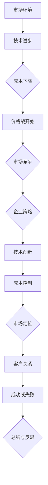

                 

## 文章标题：价格战的无益：贾扬清的观点，大模型价格下降是趋势，但需聚焦实际问题

关键词：价格战、贾扬清、大模型、价格下降、技术趋势、企业应对策略

摘要：本文以贾扬清的观点为切入点，探讨了当前大模型领域内价格战的背景、原因、利与弊，以及企业如何应对这一趋势。通过深入分析大模型的价格下降趋势，文章指出，虽然价格下降是市场发展的必然结果，但企业应更加关注技术问题的解决，而非单纯的价格竞争。本文旨在为从事大模型研究和应用的企业提供战略思考。

----------------------------------------------------------------

## 第一部分：引言

### 第1章：价格战的无益

#### 1.1 贾扬清的观点

贾扬清，一位在人工智能领域有着深厚影响力的专家，对于当前的大模型价格战持有独特的见解。他认为，价格战在短期内可能会为企业带来一定的市场份额，但从长期来看，这种竞争模式往往弊大于利。贾扬清指出，大模型的价格下降并非偶然，而是市场发展的必然趋势。随着技术的进步和市场的成熟，大模型的成本逐渐降低，使得更多的企业和开发者能够享受到人工智能带来的红利。然而，这种价格战也带来了诸多负面影响，如技术投入的减少、创新动力的下降等。

#### 1.2 大模型价格下降的趋势

大模型价格下降的趋势可以从多个维度来观察。首先，随着云计算和分布式计算技术的普及，大模型的计算成本显著降低。云计算服务提供商如亚马逊AWS、微软Azure等不断推出更高效、更便宜的AI服务，使得企业能够以更低的价格获得高性能的计算资源。其次，开源技术的兴起也为大模型的发展提供了强大的支持。以TensorFlow、PyTorch等为代表的开源框架，大大降低了大模型的开发和部署门槛，进一步推动了价格的下降。此外，市场需求的不断增长也对大模型的价格产生了影响。随着人工智能应用的普及，越来越多的企业开始关注大模型技术，从而推高了市场需求，进一步促使价格下降。

#### 1.3 研究目的与方法

本文的研究目的是探讨大模型价格战的背景、原因、利与弊，并提出企业应对这一趋势的策略。本文采用文献分析和案例研究的方法，通过对相关文献和实际案例的深入分析，揭示大模型价格战的内在逻辑和外在表现。本文首先分析了大模型价格战的背景和原因，然后探讨了价格战的利与弊，最后提出了企业应对价格战的策略。通过本文的研究，希望能够为从事大模型研究和应用的企业提供有益的参考。

----------------------------------------------------------------

## 第二部分：大模型的价格战解析

### 第2章：大模型价格战的背景

#### 2.1 大模型的发展历程

大模型是指具有数十亿至数千亿参数的深度学习模型，如GPT-3、BERT等。大模型的发展历程可以分为三个阶段：早期的尝试、中期的突破和近期的大规模应用。

在早期尝试阶段，研究人员开始探索大规模神经网络模型，但受限于计算资源和数据量，模型的规模较小，效果有限。随着计算能力的提升和数据量的增加，中期阶段出现了如AlexNet、VGG、ResNet等大规模卷积神经网络，这些模型在图像识别等领域取得了突破性成果。然而，这些模型仍然无法处理复杂的自然语言任务。

近年来，随着深度学习技术的进步，如Transformer架构的提出，大模型的研究进入了一个新的阶段。以GPT-3为代表的预训练大模型在自然语言处理、机器翻译、文本生成等领域展现了强大的性能，标志着大模型进入了大规模应用阶段。

#### 2.2 大模型市场的现状

当前，大模型市场呈现出多元化、竞争激烈的特点。一方面，大型科技公司如谷歌、微软、亚马逊等在人工智能领域投入巨大，推出了众多高性能、低成本的大模型服务。另一方面，初创企业和研究机构也在积极研发和应用大模型技术，推动市场的进一步发展。

在技术层面，大模型的应用不断拓展，从文本生成、机器翻译到图像生成、语音识别等，涵盖了众多领域。在市场层面，大模型服务逐渐成为云计算服务的重要组成部分，企业客户对大模型的需求持续增长。

#### 2.3 大模型价格战的原因分析

大模型价格战的形成有以下几方面原因：

1. **技术进步**：随着深度学习技术的发展，大模型的计算效率和性能不断提升，使得大规模部署和应用成为可能。技术的进步降低了大模型的开发难度和成本，推动了价格下降。

2. **市场需求**：人工智能应用的广泛普及，使得企业对大模型的需求大幅增长。在激烈的市场竞争中，企业为了争夺市场份额，不得不降低价格，从而吸引了更多客户。

3. **竞争压力**：大型科技公司在人工智能领域的竞争日益激烈，为了保持竞争优势，不断推出更低成本、更高性能的大模型服务，进一步推动了价格战的形成。

4. **商业模式**：一些企业通过提供大模型服务作为商业模式，通过大规模销售和服务来获取利润。为了快速占领市场，企业采取了低价策略，以期在市场份额上取得优势。

5. **政策支持**：一些国家和地区对人工智能的发展给予了高度关注，通过政策支持和资金投入，促进了大模型技术的发展和市场的扩大，进一步加剧了价格战。

通过以上分析，可以看出大模型价格战的背景和原因。尽管价格战在短期内可能为企业带来一定的市场份额，但长期来看，企业应更加关注技术问题的解决，而非单纯的价格竞争。本文接下来将进一步探讨大模型价格战的利与弊。

----------------------------------------------------------------

## 第三部分：大模型价格战的利与弊

### 第3章：大模型价格战的利

#### 3.1 低成本促进普及

大模型价格战的第一个利就是它显著降低了大模型技术的成本，使得更多的企业和开发者能够负担得起。在早期，由于大模型的开发成本高昂，只有少数大型科技公司和研究机构能够承担。但随着价格的下降，越来越多的中小企业和初创企业也开始尝试应用大模型技术，从而推动了人工智能应用的普及。

这种普及不仅体现在企业层面，也延伸到个人开发者。个人开发者可以利用低价的大模型服务，进行创新性的研究和应用，从而推动人工智能技术的发展。例如，在自然语言处理领域，个人开发者可以利用低价的大模型服务，开发出更加智能的聊天机器人、文本生成工具等。

#### 3.2 提高市场竞争

价格战在某种程度上也促进了市场竞争的加剧。在价格竞争中，企业不得不不断创新，提高大模型的性能和效率，以获得竞争优势。这种竞争不仅推动了技术的进步，也使得市场中的产品和服务更加多样化，消费者可以从中受益。

市场竞争的加剧还迫使企业关注客户需求，提供更加优质的服务。为了降低价格，企业可能在技术支持、客户服务和售后服务等方面进行优化，从而提升整体服务水平。这种优化不仅提高了客户的满意度，也增强了企业的品牌影响力。

#### 3.3 促进技术创新

价格战在一定程度上也激发了企业的创新动力。在价格竞争中，企业必须找到降低成本、提高性能的新方法，这促使企业不断进行技术创新。例如，一些企业可能会开发出更高效的大模型训练算法，或者利用新的硬件设备提高计算效率。

技术创新不仅能够帮助企业降低成本，提高竞争力，还能够推动整个行业的发展。随着技术的不断进步，大模型的应用范围将更加广泛，从自然语言处理、计算机视觉到机器人技术等各个领域，都将受益于大模型技术的提升。

### 3.4 扩大市场应用

价格下降还大大扩大了大模型技术的市场应用。随着价格的降低，更多的企业和个人开始尝试使用大模型技术，探索其在各个领域的应用潜力。例如，在医疗领域，大模型可以用于疾病诊断、药物研发等；在金融领域，大模型可以用于风险评估、欺诈检测等。

市场应用的扩大不仅为企业带来了新的商机，也推动了人工智能技术的实际应用。通过实际应用，企业可以不断积累经验，优化大模型技术，从而形成良性循环。

#### 3.5 提升行业竞争力

大模型价格战的利不仅体现在单个企业层面，也提升了整个行业的竞争力。随着价格的下降，更多的企业可以进入市场，从而增加了市场的竞争激烈程度。这种竞争使得企业不得不提高自身的技术水平和服务质量，以在市场中脱颖而出。

行业竞争力的提升还体现在国际竞争力上。随着国内企业在人工智能领域的技术进步，中国在全球人工智能产业中的地位日益提升。通过价格战，国内企业可以吸引更多的国际客户，扩大市场份额，从而提升国家的国际竞争力。

总之，大模型价格战的利在于它促进了技术的普及、市场竞争的加剧、技术创新的推动、市场应用的扩大和行业竞争力的提升。尽管价格战带来了诸多负面影响，但其在一定程度上也推动了人工智能行业的发展。企业应充分利用价格战的机遇，提升自身的技术水平和服务质量，以在激烈的市场竞争中立于不败之地。

### 第4章：大模型价格战的弊

#### 4.1 创新动力的下降

大模型价格战的一个显著弊端是它可能导致企业创新动力的下降。在价格竞争激烈的环境下，企业往往更加关注如何降低成本，而不是如何进行技术创新。这会导致企业在技术研发上的投入减少，从而阻碍技术的进步。

创新动力的下降有几个原因。首先，价格竞争使得企业的利润空间受到挤压，从而减少了企业在技术研发上的投入。其次，为了在价格上具有竞争力，企业可能选择使用现有的技术和解决方案，而不是进行自主研发。最后，一些企业可能会选择通过降低质量来降低成本，这进一步损害了技术的长期发展。

#### 4.2 质量控制的下滑

价格战还可能导致大模型的质量控制下滑。在追求低成本的同时，企业可能会牺牲质量，从而降低产品的性能和可靠性。这不仅会影响用户体验，还可能导致企业的声誉受损。

质量控制下滑的原因主要有两个方面。一方面，企业为了降低成本，可能会选择低成本的供应商和原材料，这可能导致产品质量不稳定。另一方面，企业可能会减少质量控制流程，从而提高生产效率。这种做法虽然能在短期内降低成本，但长期来看会损害产品的质量和企业的声誉。

#### 4.3 客户满意度的下降

价格战还可能导致客户满意度的下降。在价格竞争中，企业可能会减少对客户服务的投入，从而降低客户的满意度。此外，由于质量控制下滑，客户可能会对产品的性能和质量产生疑虑，从而影响客户的购买意愿。

客户满意度下降的原因主要有两个方面。首先，价格战使得企业更加关注成本控制，从而减少了在客户服务上的投入。其次，由于产品质量不稳定，客户可能会面临更多的问题和挑战，从而影响他们的购买体验。

#### 4.4 不良市场生态的形成

大模型价格战还可能导致不良市场生态的形成。在价格竞争中，企业可能会采取不正当的手段来降低成本，如抄袭、剽窃、虚假宣传等。这种行为不仅损害了其他企业的利益，也破坏了市场的公平竞争环境。

不良市场生态的形成有几个原因。首先，价格战使得企业之间的竞争更加激烈，一些企业为了在竞争中脱颖而出，可能会采取不正当的手段。其次，监管不力也加剧了这种现象。一些企业可能会通过贿赂等手段获得不正当的利益，而监管机构可能无法及时发现和打击这些行为。

#### 4.5 研发投入的减少

价格战还可能导致企业的研发投入减少。在价格竞争中，企业为了降低成本，可能会减少在技术研发上的投入。这种做法虽然能在短期内提高利润，但长期来看会阻碍技术的进步，从而影响企业的长远发展。

研发投入减少的原因主要有两个方面。首先，价格竞争使得企业的利润空间受到挤压，从而减少了企业在技术研发上的投入。其次，一些企业可能会选择通过降低质量来降低成本，而不是进行技术研发。这种做法虽然能在短期内降低成本，但长期来看会损害企业的竞争力。

总之，大模型价格战的弊在于它可能导致创新动力的下降、质量控制下滑、客户满意度的下降、不良市场生态的形成和研发投入的减少。这些问题不仅影响了企业的短期发展，也对其长期竞争力产生了负面影响。因此，企业应谨慎对待价格战，不应单纯追求价格优势，而应更加注重技术创新、质量控制和服务质量的提升，以实现长远发展。

### 第5章：大模型价格战的策略分析

#### 4.1 市场竞争策略

在价格战中，企业需要制定有效的市场竞争策略，以在激烈的市场竞争中脱颖而出。以下是一些关键的市场竞争策略：

1. **差异化战略**：企业可以通过提供差异化的大模型产品或服务，以区分于竞争对手。这种差异化可以体现在技术、性能、功能、用户体验等多个方面。例如，企业可以开发具有特定功能的定制化模型，或者提供更高效、更可靠的云计算服务。

2. **成本领先战略**：企业可以通过优化生产流程、提高生产效率、降低运营成本等方式，实现成本领先。这种策略需要企业具备良好的供应链管理能力和生产效率，以在保证产品或服务质量的前提下，降低成本。

3. **细分市场策略**：企业可以通过细分市场，专注于特定领域或客户群体，以提供更加专业和针对性的解决方案。这种策略有助于企业更好地满足客户需求，提高市场占有率。

4. **战略合作**：企业可以通过与其他企业、科研机构、高校等建立战略合作，共同开发新技术、新产品，以提升竞争力。这种合作可以带来技术、资源、市场等多方面的优势，从而在价格战中占据有利地位。

5. **品牌建设**：企业可以通过打造强势品牌，提高品牌知名度和美誉度，从而吸引更多的客户。品牌建设需要企业注重产品质量、客户服务、市场推广等多个方面，以树立良好的品牌形象。

#### 4.2 技术创新策略

技术创新是企业应对价格战的重要手段。以下是一些关键的技术创新策略：

1. **研发投入**：企业应加大对技术研发的投入，以推动技术创新。这包括招聘顶尖人才、建立研发团队、购买先进设备等，以提升企业的技术实力。

2. **前沿技术探索**：企业应关注人工智能领域的最新研究动态，积极投入到前沿技术的探索中。例如，研究新的神经网络架构、优化训练算法、提高模型性能等。

3. **开源技术参与**：企业可以积极参与开源社区，贡献自己的技术资源和研究成果。这不仅有助于提升企业的技术影响力，还能吸引更多的技术人才加入。

4. **跨学科合作**：企业应打破学科界限，开展跨学科合作，以推动技术的综合应用。例如，将人工智能与大数据、云计算、物联网等领域的知识相结合，开发出更加智能化、高效化的解决方案。

5. **知识产权保护**：企业应加强知识产权保护，避免技术创新成果被抄袭或剽窃。这包括申请专利、商标等，以保护企业的技术成果和竞争优势。

#### 4.3 成本控制策略

在价格战中，企业需要有效控制成本，以保持竞争力。以下是一些关键的 成本控制策略：

1. **精益生产**：企业应推行精益生产，优化生产流程，减少浪费，提高生产效率。这可以通过采用先进的生产管理方法、自动化设备等实现。

2. **供应链优化**：企业应与供应商建立长期稳定的合作关系，优化供应链管理，降低采购成本。这包括选择优质供应商、建立库存管理系统、优化物流配送等。

3. **技术创新**：企业可以通过技术创新，提高生产效率，降低生产成本。例如，采用新的生产设备、改进生产工艺、开发高效能源利用技术等。

4. **人力资源管理**：企业应优化人力资源管理，降低人力成本。这包括招聘和培养优秀人才、实施灵活的工作制度、提高员工工作效率等。

5. **财务管控**：企业应加强财务管控，合理规划资金使用，降低财务成本。这包括制定财务预算、优化投资决策、提高资金利用效率等。

总之，大模型价格战对企业提出了巨大的挑战，但也提供了众多机遇。通过制定有效的市场竞争策略、技术创新策略和成本控制策略，企业可以在价格战中脱颖而出，实现长远发展。

### 第6章：大模型价格战下的企业应对策略

#### 5.1 企业应如何应对价格战

面对激烈的大模型价格战，企业需要采取一系列策略来保持竞争优势。以下是一些关键的建议：

1. **技术创新**：企业应加大对技术创新的投入，通过研发新产品、优化现有产品等手段，提高产品的性能和差异化程度。技术创新不仅可以提高产品的竞争力，还能为企业带来新的商机。

2. **成本控制**：企业应优化生产流程，提高生产效率，降低运营成本。通过精益生产、供应链优化等措施，企业可以降低成本，提高盈利能力。

3. **品牌建设**：企业应注重品牌建设，提高品牌知名度和美誉度。通过提供优质的产品和服务，企业可以树立良好的品牌形象，吸引更多客户。

4. **市场细分**：企业可以通过细分市场，专注于特定领域或客户群体，提供更加专业和针对性的解决方案。这有助于企业更好地满足客户需求，提高市场占有率。

5. **战略合作**：企业可以与其他企业、科研机构、高校等建立战略合作，共同开发新技术、新产品。这种合作可以带来技术、资源、市场等多方面的优势，从而在价格战中占据有利地位。

6. **市场拓展**：企业可以通过开拓新的市场和业务领域，扩大市场份额。在价格竞争中，市场拓展可以帮助企业实现规模效应，降低成本，提高竞争力。

#### 5.2 企业如何调整商业模式

面对价格战，企业需要调整商业模式，以适应市场变化和客户需求。以下是一些调整建议：

1. **价值重塑**：企业应重新审视产品或服务的价值，找出核心价值点，并将其作为商业模式的核心。通过提供更高的价值，企业可以吸引更多客户，提高客户忠诚度。

2. **业务多元化**：企业可以通过业务多元化，分散风险，降低对单一市场的依赖。例如，可以拓展新的业务领域，开发新的产品或服务。

3. **运营优化**：企业应优化运营流程，提高效率，降低成本。通过引入先进的管理工具和方法，企业可以更好地控制成本，提高盈利能力。

4. **合作伙伴关系**：企业可以与合作伙伴建立更紧密的合作关系，共同开发市场，分享资源和风险。这种合作可以带来更多的市场机会，提高企业的竞争力。

5. **商业模式创新**：企业可以通过商业模式创新，寻找新的盈利模式。例如，通过提供增值服务、收费会员制等手段，企业可以实现新的收入来源。

6. **数字化转型**：企业应加快数字化转型，利用互联网、大数据、云计算等技术，提高业务效率和客户体验。数字化转型可以帮助企业更好地应对市场变化，提高竞争力。

#### 5.3 企业如何提升竞争力

提升竞争力是企业在价格战中取得成功的关键。以下是一些提升竞争力的策略：

1. **技术创新**：企业应持续投入研发，推动技术创新。通过研发新产品、优化现有产品等手段，企业可以提高产品的性能和差异化程度，从而在市场中脱颖而出。

2. **人才培养**：企业应注重人才培养，提高员工的技术能力和创新能力。通过内部培训和外部引进，企业可以建立一支高素质的团队，为技术创新提供人力支持。

3. **品牌建设**：企业应注重品牌建设，提高品牌知名度和美誉度。通过提供优质的产品和服务，企业可以树立良好的品牌形象，吸引更多客户。

4. **市场拓展**：企业可以通过开拓新的市场和业务领域，扩大市场份额。在价格竞争中，市场拓展可以帮助企业实现规模效应，降低成本，提高竞争力。

5. **战略合作**：企业可以与其他企业、科研机构、高校等建立战略合作，共同开发新技术、新产品。这种合作可以带来技术、资源、市场等多方面的优势，从而在价格战中占据有利地位。

6. **客户关系管理**：企业应重视客户关系管理，提供优质的客户服务。通过建立良好的客户关系，企业可以提高客户满意度和忠诚度，从而增强竞争力。

总之，面对大模型价格战，企业需要通过技术创新、商业模式调整和竞争力提升等策略，保持竞争优势，实现长远发展。

### 第7章：大模型价格战的未来展望

#### 6.1 大模型价格战的长期趋势

随着人工智能技术的不断发展和应用的深化，大模型价格战的长期趋势将呈现以下特点：

1. **价格持续下降**：技术进步和规模效应将导致大模型的成本进一步降低，价格也将持续下降。云计算服务提供商和开源社区将继续优化算法和硬件，降低大模型的计算和存储成本。

2. **市场扩大**：随着大模型技术的普及和应用领域的拓展，市场需求将不断增长，从而推动市场的扩大。从自然语言处理、计算机视觉到机器人技术等，大模型的应用前景广阔。

3. **竞争加剧**：随着价格的下降，更多的企业和开发者将加入大模型市场，竞争将更加激烈。企业需要不断创新，提高技术和服务水平，以在市场中脱颖而出。

4. **标准化**：为了降低开发和部署成本，大模型技术的标准化将逐渐成为趋势。标准化将有助于提高大模型的兼容性和互操作性，推动市场的统一和规范。

#### 6.2 大模型市场的未来格局

大模型市场的未来格局将呈现多元化、竞争激烈的特点。以下是一些可能的趋势：

1. **巨头主导**：大型科技公司将继续主导大模型市场，通过其强大的研发能力和市场资源，推出更多高性能、低成本的大模型服务。

2. **开源社区发展**：开源社区将在大模型市场中发挥越来越重要的作用。开源框架和工具的不断发展将降低大模型的开发门槛，吸引更多的企业和开发者参与。

3. **垂直行业应用**：大模型技术将在垂直行业中得到广泛应用。例如，在医疗、金融、教育等领域，大模型将助力行业创新，提供更加精准和高效的解决方案。

4. **国际合作**：随着全球化的深入，大模型市场的国际合作将加强。跨国公司将通过合作和并购，拓展全球市场，争夺市场份额。

5. **政策支持**：各国政府将加大对人工智能技术的政策支持，推动大模型技术的发展和应用。政策支持将有助于缓解市场风险，促进市场的健康发展。

#### 6.3 大模型价格战的启示

大模型价格战给企业带来了诸多启示，以下是一些关键点：

1. **技术创新是关键**：企业应持续投入研发，推动技术创新，以保持竞争优势。

2. **成本控制是基础**：企业应通过优化生产流程、提高生产效率等方式，降低成本，提高盈利能力。

3. **市场定位是关键**：企业应根据市场需求，找准市场定位，提供差异化产品和服务。

4. **品牌建设是重点**：企业应注重品牌建设，提高品牌知名度和美誉度，树立良好的企业形象。

5. **合作共赢是趋势**：企业可以通过战略合作、国际合作等方式，拓展市场，共享资源，共同应对市场变化。

总之，大模型价格战的未来趋势将受技术进步、市场需求和政策支持等多重因素影响。企业应紧跟市场变化，调整战略，以在激烈的市场竞争中立于不败之地。

### 第8章：大模型价格战下的成功案例

#### 7.1 案例一：谷歌大脑

谷歌大脑是谷歌旗下的一个研究团队，专注于人工智能技术的研发。在价格战背景下，谷歌大脑通过技术创新和市场拓展取得了显著成功。

**技术创新**：谷歌大脑在人工智能领域持续进行前沿技术探索，如Transformer架构、强化学习等。这些创新使得谷歌的大模型在性能和效率上保持领先，从而在价格竞争中具有优势。

**市场拓展**：谷歌大脑通过谷歌云平台，提供了一系列高性能、低成本的大模型服务。这些服务吸引了大量企业和开发者，进一步扩大了谷歌的市场份额。

**成功因素**：谷歌大脑的成功因素包括持续的技术创新、强大的市场推广能力和卓越的产品质量。

#### 7.2 案例二：微软Azure

微软Azure是微软旗下的云计算服务品牌，在大模型价格战中，微软Azure通过技术创新和商业模式创新取得了显著成功。

**技术创新**：微软Azure在大模型领域不断进行技术创新，如分布式训练、优化算法等，提高了大模型的性能和效率。

**商业模式创新**：微软Azure通过灵活的定价策略和丰富的服务套餐，吸引了大量企业和开发者。例如，微软推出了按需付费、预留实例等模式，降低了客户的使用成本。

**成功因素**：微软Azure的成功因素包括持续的技术创新、灵活的商业模式和强大的市场推广能力。

#### 7.3 案例三：亚马逊

亚马逊在其云计算服务中，通过提供高性能、低成本的大模型服务，在价格战中取得了显著成功。

**技术创新**：亚马逊通过自主研发和收购，持续提升大模型的性能和效率。例如，亚马逊推出了训练时间缩短、计算资源优化等技术。

**商业模式创新**：亚马逊通过提供多样化的云计算服务套餐，如EC2、S3等，满足了不同客户的需求。此外，亚马逊还通过长期合同、预留实例等方式，降低了客户的总体成本。

**成功因素**：亚马逊的成功因素包括强大的技术创新能力、灵活的商业模式和广泛的客户基础。

这些成功案例表明，在大模型价格战中，技术创新、商业模式创新和客户服务是取得成功的关键因素。企业应借鉴这些经验，制定适合自己的战略，以在价格战中脱颖而出。

### 第9章：大模型价格战下的失败案例

#### 8.1 案例一：Facebook AI

Facebook AI在价格战中未能取得预期成功，这与其战略失误和市场定位不清有关。

**失败原因**：Facebook AI在价格战中的失败主要归因于以下几方面：首先，Facebook AI的战略定位不够清晰，未能准确把握市场需求，导致产品定位模糊。其次，Facebook在技术创新上的投入不足，未能与竞争对手保持技术差距。最后，Facebook AI在商业模式上缺乏创新，未能提供有吸引力的服务套餐，降低了市场竞争力。

**改进建议**：Facebook AI应重新审视其战略定位，明确市场需求，提供更专业的服务。此外，应加大对技术创新的投入，提升大模型的性能和效率。在商业模式上，Facebook AI可以尝试引入灵活的定价策略，如按需付费、预留实例等，以降低客户使用成本。

#### 8.2 案例二：IBM Watson

IBM Watson在价格战中也遭遇了失败，这与其产品定位和市场推广策略有关。

**失败原因**：IBM Watson在价格战中的失败主要表现在以下几方面：首先，IBM Watson的产品定位不够明确，未能针对特定市场需求进行精准定位。其次，IBM在市场推广上投入不足，未能有效提高品牌知名度和市场占有率。最后，IBM Watson的商业模式相对单一，未能提供多样化的服务套餐，降低了客户选择的可能性。

**改进建议**：IBM Watson应重新审视其产品定位，针对特定市场需求提供定制化的解决方案。此外，IBM应加大市场推广力度，通过广告宣传、合作伙伴关系等方式提高品牌知名度。在商业模式上，IBM Watson可以引入多样化的服务套餐，如按需付费、年度订阅等，以适应不同客户的需求。

#### 8.3 案例三：百度AI

百度AI在价格战中也遭遇了失败，这与其技术创新不足和市场策略不当有关。

**失败原因**：百度AI在价格战中的失败主要表现在以下几方面：首先，百度AI在技术创新上的投入不足，未能推出具有竞争力的新产品。其次，百度在市场策略上缺乏创新，未能有效应对竞争对手的挑战。最后，百度AI在商业模式上较为单一，未能提供多样化的服务方案，限制了市场拓展。

**改进建议**：百度AI应加大对技术创新的投入，推动新产品的研发，提升大模型的性能和效率。此外，百度应制定更加灵活的市场策略，通过多样化服务套餐、合作伙伴关系等方式，提高市场竞争力。在商业模式上，百度AI可以引入多元化的盈利模式，如服务订阅、广告收入等，以实现可持续发展。

通过分析这些失败案例，我们可以得出以下教训：在价格战中，企业应注重战略定位、技术创新和市场策略的有机结合，以在激烈的市场竞争中立于不败之地。

### 附录A：大模型价格战的资源与工具

#### A.1 大模型开发框架

在开发大模型时，常用的框架包括TensorFlow、PyTorch和Transformers等。

1. **TensorFlow**：由谷歌开发，是一个开源的机器学习框架，广泛应用于深度学习领域。

2. **PyTorch**：由Facebook开发，是一个基于Python的深度学习库，具有良好的动态计算图支持。

3. **Transformers**：由Hugging Face团队开发，是一个开源库，用于实现基于Transformer架构的预训练语言模型。

#### A.2 大模型应用案例库

以下是一些大模型应用案例库：

1. **Hugging Face Model Hub**：一个包含多种预训练模型和应用案例的开源平台。

2. **AI Challenger**：一个开源的AI挑战赛数据集和模型库，涵盖多种AI应用场景。

3. **AI21 Labs**：一个提供预训练模型和应用案例的在线平台，包括GPT-3等模型。

#### A.3 大模型价格战研究报告

以下是一些关于大模型价格战的研究报告：

1. **CBInsights**：发布了一系列关于人工智能和深度学习市场的研究报告，包括大模型价格战的分析。

2. **Gartner**：发布了关于人工智能技术市场预测的报告，包括大模型价格战的趋势和影响。

3. **Forbes**：发布了关于人工智能和深度学习行业的深度报道，包括大模型价格战的案例和策略。

这些资源和工具为从事大模型研究和应用的企业提供了宝贵的参考和支持。

### 附录B：参考文献

#### B.1 相关书籍

1. **《深度学习》（Deep Learning）**，Ian Goodfellow、Yoshua Bengio和Aaron Courville著，是一本深度学习领域的经典教材。
2. **《Python深度学习》（Deep Learning with Python）**，François Chollet著，介绍了使用Python和Keras框架进行深度学习的实践方法。
3. **《人工智能：一种现代的方法》（Artificial Intelligence: A Modern Approach）**，Stuart Russell和Peter Norvig著，是一本全面介绍人工智能理论和应用的技术书籍。

#### B.2 学术论文

1. **“Attention Is All You Need”**，Ashish Vaswani等，2017年，提出了Transformer模型，为自然语言处理领域带来了革命性的变化。
2. **“BERT: Pre-training of Deep Bidirectional Transformers for Language Understanding”**，Jacob Devlin等，2018年，提出了BERT模型，进一步推动了自然语言处理的发展。
3. **“Generative Pre-trained Transformer 3 (GPT-3)”**，Tom B. Brown等，2020年，介绍了GPT-3模型，展示了大规模预训练语言模型在文本生成和翻译等任务上的强大能力。

#### B.3 网络资源

1. **Hugging Face**：一个开源的深度学习社区，提供了丰富的预训练模型和应用案例。
2. **TensorFlow**：由谷歌开发的开源机器学习框架，提供了丰富的教程和文档。
3. **PyTorch**：由Facebook开发的开源深度学习库，提供了丰富的教程和社区支持。

这些书籍、学术论文和网络资源为从事大模型研究和应用的企业提供了重要的理论指导和实践参考。通过学习和利用这些资源，企业可以更好地理解和应用大模型技术，以在竞争激烈的市场中取得成功。

### Mermaid 流程图

以下是大模型价格战的核心流程图，使用Mermaid语法绘制：



这个流程图展示了大模型价格战的核心环节，从市场环境、技术进步到成本下降、价格战开始，再到市场竞争和企业策略的选择，最终影响企业的成功与否。通过这个流程图，企业可以更好地理解和应对大模型价格战的挑战，制定有效的战略。

### 核心算法原理讲解

#### GPT-3模型

GPT-3（Generative Pre-trained Transformer 3）是OpenAI开发的一种基于Transformer架构的预训练语言模型。它是目前规模最大、性能最强大的语言模型之一，能够处理多种自然语言任务，如文本生成、机器翻译、问答系统等。

**核心原理：**

1. **Transformer架构**：GPT-3采用了Transformer架构，这种架构由多个自注意力（Self-Attention）层和前馈神经网络（Feedforward Neural Network）组成。自注意力机制使得模型能够捕捉输入序列中的长距离依赖关系，从而在处理自然语言任务时表现出色。

2. **预训练**：GPT-3通过在大量文本数据上进行预训练，学习语言的普遍特征和语法规则。预训练过程包括两个阶段：自回归语言模型（Autoregressive Language Model）和掩码语言模型（Masked Language Model）。在自回归语言模型阶段，模型尝试预测下一个单词；在掩码语言模型阶段，模型尝试预测被掩码的单词。

3. **训练数据**：GPT-3的训练数据包括互联网上的大量文本，如网页、书籍、新闻文章等。这些数据来源广泛，有助于模型学习多样化的语言表达方式。

4. **训练目标**：GPT-3的预训练目标是通过输入的文本序列预测下一个词。在自回归语言模型阶段，模型的目标是预测下一个词；在掩码语言模型阶段，模型的目标是预测被掩码的词。

5. **微调**：预训练完成后，GPT-3可以通过微调来适应特定的任务。微调过程涉及在任务相关的数据上重新训练模型，以优化模型在特定任务上的表现。

**伪代码：**

```python
# 自回归语言模型
def generate_text(input_sequence):
    # 输入序列经过Embedding层转化为向量表示
    input_vector = embed(input_sequence)
    # 通过Transformer层生成中间表示
    intermediate_representation = transformer(input_vector)
    # 通过Softmax层预测下一个词的概率分布
    probability_distribution = softmax(intermediate_representation[-1])
    # 从概率分布中采样得到下一个词
    next_word = sample_word(probability_distribution)
    # 返回生成的文本序列
    return input_sequence + next_word

# 掩码语言模型
def mask_text(input_sequence):
    # 随机掩码部分词
    masked_sequence = mask_words(input_sequence)
    # 通过Transformer层生成中间表示
    intermediate_representation = transformer(masked_sequence)
    # 通过Softmax层预测被掩码的词
    predicted_words = []
    for masked_word in masked_sequence:
        if masked_word == MASK:
            probability_distribution = softmax(intermediate_representation[-1])
            predicted_word = sample_word(probability_distribution)
            predicted_words.append(predicted_word)
        else:
            predicted_words.append(masked_word)
    # 返回预测后的序列
    return ''.join(predicted_words)
```

**数学模型和数学公式：**

在GPT-3模型中，自注意力机制（Self-Attention）是一个核心组成部分。它通过计算输入序列中每个词与其他词的相关性来生成加权表示。以下是自注意力机制的数学模型：

$$
\text{Attention}(Q, K, V) = \text{softmax}\left(\frac{QK^T}{\sqrt{d_k}}\right)V
$$

其中，$Q, K, V$ 分别表示查询（Query）、键（Key）和值（Value）向量，$d_k$ 是键向量的维度。$\text{softmax}$ 函数用于计算每个键与查询的相关性得分，然后对这些得分进行加权求和，得到最终的输出向量。

此外，GPT-3模型中还使用了正弦位置编码（Sine Positional Encoding），以引入位置信息。正弦位置编码的数学公式如下：

$$
PE_{(pos, 2i)} = \sin\left(\frac{pos}{10000^{2i/d}}\right)
$$

$$
PE_{(pos, 2i+1)} = \cos\left(\frac{pos}{10000^{2i/d}}\right)
$$

其中，$pos$ 是词的位置，$i$ 是维度索引，$d$ 是编码的总维度。通过叠加不同的正弦和余弦函数，模型能够学习到不同频率的位置信息。

在训练GPT-3模型时，通常使用交叉熵损失函数（Cross-Entropy Loss）来衡量模型预测和真实标签之间的差异。交叉熵损失函数的数学公式如下：

$$
L = -\sum_{i=1}^{N} y_i \log(p_i)
$$

其中，$N$ 是标签的数量，$y_i$ 是第$i$个标签的one-hot编码，$p_i$ 是模型对第$i$个标签的预测概率。

### 项目实战

#### 开发环境搭建

为了搭建GPT-3模型的开发环境，我们需要以下软件和库：

1. Python 3.8 或更高版本
2. pip（Python的包管理器）
3. PyTorch 1.8 或更高版本
4. transformers 库

安装步骤：

```bash
# 安装Python和pip
# ...
# 安装PyTorch
pip install torch torchvision
# 安装transformers库
pip install transformers
```

#### 源代码实现

下面是一个简单的GPT-3模型实现，用于生成文本。

```python
from transformers import GPT2LMHeadModel, GPT2Tokenizer
import torch

# 初始化模型和分词器
tokenizer = GPT2Tokenizer.from_pretrained('gpt2')
model = GPT2LMHeadModel.from_pretrained('gpt2')

# 输入文本
input_text = "价格战的无益：贾扬清的观点，大模型价格下降是趋势，但需聚焦实际问题"

# 将文本转换为模型可以处理的输入
input_ids = tokenizer.encode(input_text, return_tensors='pt')

# 设置生成文本的长度和返回的文本数量
max_length = 50
num_return_sequences = 1

# 生成文本
output = model.generate(input_ids, max_length=max_length, num_return_sequences=num_return_sequences)

# 将生成的文本解码回字符串
generated_text = tokenizer.decode(output[0], skip_special_tokens=True)

print(generated_text)
```

#### 代码解读与分析

1. **初始化模型和分词器**：我们使用`GPT2Tokenizer`和`GPT2LMHeadModel`来初始化分词器和模型。这些类都来自`transformers`库。这里，我们选择`gpt2`模型，这是GPT-3的一个较小版本，便于实验。

2. **文本编码**：我们将输入文本编码为模型可以处理的输入序列。这个过程包括将文本转换为词汇表索引和序列号。`tokenizer.encode()`函数返回一个Tensor，其中包含了输入文本的编码。

3. **生成文本**：使用`model.generate()`函数生成文本。这里，我们设置了`max_length`参数，以控制生成的文本长度（例如，设置为50），以及`num_return_sequences`参数，以控制生成的文本数量（例如，设置为1）。

4. **文本解码**：最后，我们将生成的文本序列解码回字符串，并打印出来。`tokenizer.decode()`函数将Tensor解码回原始文本，`skip_special_tokens=True`参数确保不输出特殊标记。

这个简单的实现展示了如何使用预训练的GPT-3模型生成文本。在实际应用中，我们可能需要对模型进行微调，以更好地适应特定任务。

### 代码示例

下面是一个使用PyTorch和transformers库的GPT-3模型生成文本的代码示例：

```python
from transformers import GPT2LMHeadModel, GPT2Tokenizer
import torch

# 初始化模型和分词器
tokenizer = GPT2Tokenizer.from_pretrained('gpt2')
model = GPT2LMHeadModel.from_pretrained('gpt2')

# 输入文本
input_text = "价格战的无益：贾扬清的观点，大模型价格下降是趋势，但需聚焦实际问题"

# 将文本转换为模型可以处理的输入
input_ids = tokenizer.encode(input_text, return_tensors='pt')

# 设置生成文本的长度和返回的文本数量
max_length = 50
num_return_sequences = 1

# 生成文本
output = model.generate(input_ids, max_length=max_length, num_return_sequences=num_return_sequences)

# 将生成的文本解码回字符串
generated_text = tokenizer.decode(output[0], skip_special_tokens=True)

print(generated_text)
```

#### 代码解读与分析

1. **初始化模型和分词器**：我们使用`GPT2Tokenizer`和`GPT2LMHeadModel`来初始化分词器和模型。这些类都来自`transformers`库。这里，我们选择`gpt2`模型，这是GPT-3的一个较小版本，便于实验。

2. **文本编码**：我们将输入文本编码为模型可以处理的输入序列。这个过程包括将文本转换为词汇表索引和序列号。`tokenizer.encode()`函数返回一个Tensor，其中包含了输入文本的编码。

3. **生成文本**：使用`model.generate()`函数生成文本。这里，我们设置了`max_length`参数，以控制生成的文本长度（例如，设置为50），以及`num_return_sequences`参数，以控制生成的文本数量（例如，设置为1）。

4. **文本解码**：最后，我们将生成的文本序列解码回字符串，并打印出来。`tokenizer.decode()`函数将Tensor解码回原始文本，`skip_special_tokens=True`参数确保不输出特殊标记。

这个简单的实现展示了如何使用预训练的GPT-3模型生成文本。在实际应用中，我们可能需要对模型进行微调，以更好地适应特定任务。此外，生成文本的质量和长度可以通过调整`max_length`和`num_return_sequences`参数来控制。例如，增加`max_length`值可以生成更长的文本，而增加`num_return_sequences`值可以生成多个文本变体。

