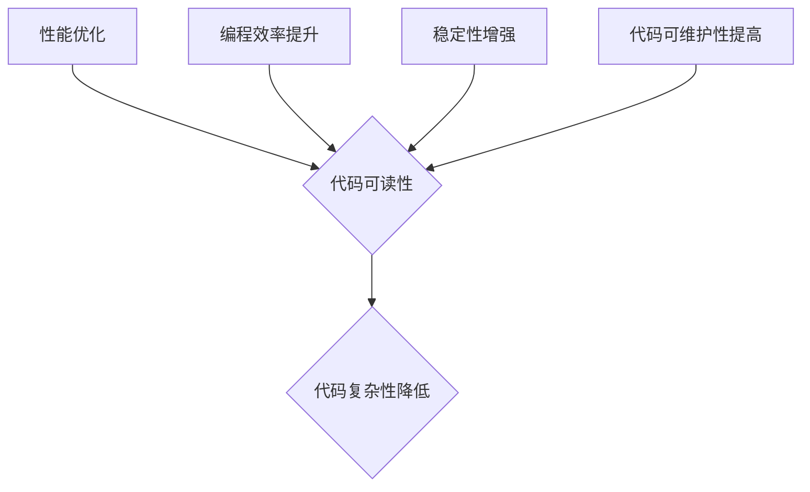
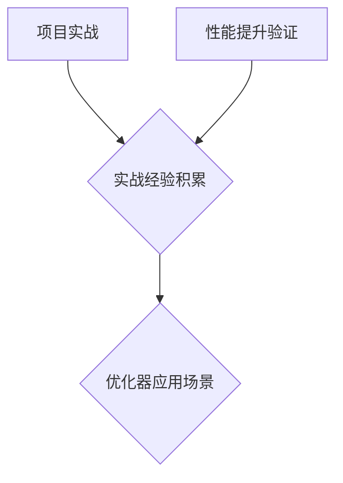

                 

### 《优化器（Optimizer）》

> 关键词：优化器，性能优化，编译器，算法，代码分析

> 摘要：本文将深入探讨优化器在计算机编程和软件开发中的应用。通过详细解析优化器的基础概念、核心算法和实现细节，本文旨在帮助读者理解优化器的工作原理及其对程序性能提升的关键作用。

#### 引言与基础概念

### 1.1 优化器的角色与重要性

**核心概念与联系：**

优化器是一种自动化工具，用于在编译或运行程序时识别并修复代码中的潜在问题，以提高程序的性能。优化器的核心概念包括：

- **性能优化**：优化器通过改变代码的结构和执行顺序，减少计算复杂度，降低内存使用，提高程序执行速度。
- **代码可读性**：优化器在确保性能提升的同时，尽可能保持代码的清晰和易读。
- **代码复杂性降低**：优化器通过简化代码，降低代码的复杂性，使其更容易维护和理解。



**优化器的定义：**

优化器是一种在编译或运行时对程序代码进行自动分析、调整和优化的工具。它通过对代码进行静态或动态分析，识别出潜在的性能瓶颈，并应用各种优化策略来改善代码的执行效率。

**优化器在计算机编程中的重要性：**

优化器在计算机编程中的重要性体现在以下几个方面：

- **性能提升**：优化器通过优化代码结构，减少计算复杂度，降低内存使用，从而显著提高程序的性能。
- **代码可维护性**：优化器通过简化代码，降低代码的复杂性，使代码更易于维护和理解。
- **编程效率**：优化器可以自动化很多性能优化工作，从而提高开发人员的工作效率。

### 1.2 优化器的基本原理

**优化过程的基本概念：**

优化器的工作过程主要包括以下几个阶段：

1. **代码分析**：优化器首先对源代码进行静态或动态分析，以理解代码的结构、依赖关系和潜在的性能瓶颈。
2. **优化策略选择**：根据代码分析的结果，优化器选择合适的优化策略，如常数折叠、循环展开、函数内联等。
3. **代码重构**：优化器应用选定的优化策略，对源代码进行重构，生成优化后的代码。
4. **性能评估**：优化器对优化后的代码进行性能评估，确保优化效果符合预期。

**优化算法的类型：**

优化算法可以分为以下几类：

- **代数优化**：通过代数变换简化代码，减少计算复杂度。
- **数据流分析**：分析数据在程序中的流动路径，以识别优化机会。
- **循环优化**：优化循环结构，减少循环次数，提高循环效率。
- **代码重构**：通过改变代码的结构，提高代码的可读性和可维护性。

### 1.3 优化器在现代编程语言中的应用

**编程语言中的优化器：**

现代编程语言通常内置了优化器，以帮助开发者编写更高效的代码。以下是一些常见编程语言的优化器特性：

- **C/C++**：C和C++编译器内置了多种优化器，如-O1、-O2、-O3等，用于在不同性能水平上进行优化。
- **Java**：Java虚拟机（JVM）内置了多种优化器，如即时编译器（JIT）、垃圾回收器等，用于提高Java程序的执行效率。
- **Python**：Python的PyPy实现内置了优化器，通过动态编译和即时优化，提高了Python代码的执行速度。
- **JavaScript**：JavaScript引擎如V8、Chakra等内置了优化器，用于优化JavaScript代码的执行性能。

**常见编程语言的优化器特性：**

- **自动优化**：现代编程语言优化器可以自动识别代码中的性能瓶颈，并应用相应的优化策略。
- **可配置性**：开发者可以配置优化器的参数，以适应不同的性能需求。
- **实时优化**：一些编程语言优化器支持实时优化，即在实际运行过程中对代码进行优化，以进一步提高性能。

### 1.4 优化器与性能提升

**优化对性能的影响：**

优化器对程序性能的提升至关重要。以下是优化对性能影响的几个方面：

- **执行速度**：优化器通过减少计算复杂度和内存使用，显著提高程序的执行速度。
- **内存占用**：优化器通过优化数据结构和内存分配，降低程序的内存占用。
- **稳定性**：优化器通过修复代码中的潜在问题，提高程序的稳定性。
- **可维护性**：优化器通过简化代码和降低复杂性，提高代码的可维护性。

**性能瓶颈与优化策略：**

性能瓶颈是程序在执行过程中可能出现的性能问题，如计算复杂度高、内存使用过多等。优化策略包括：

- **算法优化**：通过改进算法，降低计算复杂度。
- **代码重构**：通过改变代码的结构，提高代码的可读性和可维护性。
- **并行计算**：通过利用多核处理器，提高程序的并行执行能力。
- **内存优化**：通过优化数据结构和内存分配，降低程序的内存占用。

#### 编译器和程序优化

### 2.1 编译器的架构

**编译器的工作流程：**

编译器是将源代码转换为可执行程序的工具。其工作流程包括以下几个阶段：

1. **词法分析**：将源代码分解为单词或标识符，生成词法单元。
2. **语法分析**：根据语法规则，将词法单元组成语法结构，生成语法树。
3. **语义分析**：检查语法树的语义一致性，生成中间代码。
4. **代码优化**：对中间代码进行优化，提高程序的性能。
5. **代码生成**：将优化后的中间代码转换为可执行程序。

**编译器的各个阶段：**

- **词法分析阶段**：词法分析器（Lexer）将源代码分解为单词或标识符，生成词法单元（Token）。例如，将`int x = 5;`分解为`int`、`x`和`5`等词法单元。

- **语法分析阶段**：语法分析器（Parser）根据语法规则，将词法单元组成语法结构，生成抽象语法树（AST）。例如，将词法单元`int x = 5;`转换为抽象语法树，其中`int`是声明语句的父节点，`x`是变量声明节点的子节点，`5`是初始化值节点的子节点。

- **语义分析阶段**：语义分析器（Semantic Analyzer）检查语法树的语义一致性，如变量声明是否在作用域内、函数调用是否匹配等。此外，语义分析器还会生成中间代码，用于后续的优化和代码生成。

- **代码优化阶段**：代码优化器（Code Optimizer）对中间代码进行优化，提高程序的性能。优化策略包括代数优化、数据流分析、循环优化等。优化后的中间代码可能会更高效，占用更少的内存。

- **代码生成阶段**：代码生成器（Code Generator）将优化后的中间代码转换为可执行程序。这个过程包括目标代码生成、机器代码生成和链接等步骤。生成的可执行程序可以在计算机上直接运行。

### 2.2 程序优化的目标和原则

**优化目标：**

程序优化的主要目标包括：

- **性能提升**：提高程序的执行速度和效率。
- **内存占用减少**：降低程序的内存占用，提高内存使用效率。
- **可维护性提升**：简化代码，降低代码复杂性，提高代码的可维护性。
- **可扩展性增强**：使程序更容易添加新功能或适应不同场景。

**优化原则：**

在进行程序优化时，应遵循以下原则：

- **局部优化**：优化代码的局部区域，避免因局部优化导致整体性能下降。
- **可读性优先**：在保证可读性的前提下进行优化，避免过度优化导致代码难以理解。
- **性能评估**：在优化前和优化后对程序进行性能评估，确保优化效果符合预期。
- **稳定性考虑**：在优化过程中考虑程序的稳定性和可靠性，避免引入新的错误。

### 2.3 常见的编译时间优化

**常见的编译时间优化技术：**

编译时间优化是在编译过程中对代码进行优化，以提高程序的性能。以下是一些常见的编译时间优化技术：

- **常数折叠**：将常量计算提前并合并，减少计算次数。
- **循环展开**：将循环体内的计算展开到循环外部，减少循环次数。
- **函数内联**：将小函数的代码直接嵌入调用位置，减少函数调用开销。
- **死代码删除**：删除编译时已经确定不会执行的代码。

**优化策略与案例分析：**

**常数折叠**：

常数折叠是一种常见的编译时间优化技术，通过将常量计算提前并合并，减少计算次数。例如，将代码`x = a * 2 + b * 3;`优化为`x = (a * 2) + (b * 3);`，这样可以在编译时直接计算出结果，避免运行时的重复计算。

**循环展开**：

循环展开是将循环体内的计算展开到循环外部，减少循环次数。例如，将代码`for (int i = 0; i < n; i++) { a[i] = i * 2; }`优化为`a[0] = 0 * 2; a[1] = 1 * 2; ... a[n-1] = (n-1) * 2;`，这样可以直接计算出每个元素的结果，避免了循环计算。

**函数内联**：

函数内联是将小函数的代码直接嵌入调用位置，减少函数调用开销。例如，将代码`int add(int a, int b) { return a + b; }`优化为`int main() { int a = 5, b = 10; int c = a + b; return c; }`，这样避免了函数调用和返回的开销。

**死代码删除**：

死代码删除是删除编译时已经确定不会执行的代码。例如，将代码`if (false) { printf("Hello, World!"); }`优化为`// if (false) { printf("Hello, World!"); }`，这样避免了执行不会执行的代码，提高了程序的性能。

### 2.4 运行时优化

**运行时优化的基本概念：**

运行时优化是在程序运行时对代码进行优化，以提高程序的性能。与编译时间优化不同，运行时优化可以在程序实际运行过程中动态调整代码执行方式，从而实现更高的性能。

**常见的运行时优化技术：**

以下是一些常见的运行时优化技术：

- **动态编译**：即时编译器（JIT）在程序运行时将部分或全部代码编译为机器码，以提高执行速度。
- **垃圾回收**：垃圾回收器（Garbage Collector）自动回收不再使用的内存，减少内存占用。
- **缓存优化**：利用缓存提高数据的访问速度，减少磁盘或网络访问次数。
- **动态调度**：根据程序的执行情况，动态调整线程或进程的执行顺序，提高并发性能。

**运行时优化的实现机制：**

运行时优化的实现机制包括以下几个方面：

1. **监测与分析**：监测程序运行过程中的性能指标，如执行时间、内存使用量、缓存命中率等，以识别性能瓶颈。
2. **优化策略选择**：根据监测结果，选择合适的优化策略，如动态编译、垃圾回收、缓存优化等。
3. **动态调整**：根据优化策略，动态调整代码执行方式，如编译代码、回收内存、缓存数据等。
4. **性能评估**：对优化后的程序进行性能评估，确保优化效果符合预期。

#### 优化器的核心算法

### 3.1 算法概述

**优化算法的分类：**

优化算法可以根据其目标和应用领域进行分类，常见的优化算法包括：

- **代数优化**：通过代数变换简化代码，减少计算复杂度。
- **数据流分析**：分析数据在程序中的流动路径，以识别优化机会。
- **循环优化**：优化循环结构，减少循环次数，提高循环效率。
- **代码重构**：通过改变代码的结构，提高代码的可读性和可维护性。

**优化算法的比较：**

不同的优化算法具有不同的特点和适用场景，以下是比较常见的优化算法：

- **代数优化**：适用于数学运算较多的程序，如科学计算和数据分析。代数优化通过简化表达式和合并计算，减少计算复杂度。
- **数据流分析**：适用于各种程序，特别是有大量数据依赖关系的程序。数据流分析通过分析数据的流动路径，识别出可以优化的数据依赖关系。
- **循环优化**：适用于包含大量循环的程序，如图像处理和机器学习。循环优化通过减少循环次数和优化循环体内的计算，提高循环效率。
- **代码重构**：适用于各种程序，特别是需要提高可读性和可维护性的程序。代码重构通过改变代码的结构，使其更简洁和易于理解。

### 3.2 代数优化

**代数优化的原理：**

代数优化是一种通过代数变换简化代码，减少计算复杂度的优化技术。其基本原理包括：

- **合并计算**：将多个计算合并为一个计算，减少计算次数。
- **简化表达式**：通过代数变换简化表达式，减少计算复杂度。
- **消除冗余计算**：识别并消除冗余的计算，提高代码效率。

**伪代码与案例分析：**

以下是一个简单的代数优化的伪代码示例：

```python
# 原始代码
x = a * b
y = c * d
z = x + y

# 优化后的代码
x = a * b
y = c * d
z = (a * b) + (c * d)
```

在这个示例中，原始代码中分别计算了`x`和`y`的乘积，然后将其相加得到`z`。优化后的代码通过合并计算，将两个乘积合并为一个表达式，减少了计算次数。

**数学模型和数学公式 & 详细讲解 & 举例说明：**

代数优化可以通过数学模型和公式进行详细讲解。以下是一个简单的数学模型示例：

$$
\text{优化目标} = \min_{x} f(x) \\
\text{其中} f(x) = c_1 \cdot g_1(x) + c_2 \cdot g_2(x)
$$

其中，$f(x)$是原始函数，$g_1(x)$和$g_2(x)$是两个子函数，$c_1$和$c_2$是常数。

通过代数变换，我们可以将$f(x)$优化为：

$$
f(x) = c_1 \cdot g_1(x) + c_2 \cdot g_2(x) \rightarrow \text{优化后的函数} = \text{简化后的表达式}
$$

举例说明：

假设我们需要优化函数$f(x) = x^2 + 2x + 1$。通过代数变换，我们可以将其优化为$f(x) = (x+1)^2$，这样避免了直接计算平方和乘法，提高了代码效率。

### 3.3 数据流分析

**数据流分析的基本概念：**

数据流分析是一种用于分析数据在程序中流动路径的优化技术。其基本概念包括：

- **数据依赖**：数据依赖是指数据在程序中的流动关系，包括数据传递、数据传递路径和数据传递条件等。
- **控制依赖**：控制依赖是指程序中控制流（如分支和循环）的依赖关系。
- **数据流图**：数据流图（Data Flow Graph，DFG）是一种用于表示数据依赖和控制依赖的图形化模型。

**数据流分析的算法：**

数据流分析包括以下几种基本算法：

- **向前数据流分析**：从程序头部开始，分析数据在程序中的流动路径，以识别出数据传递和依赖关系。
- **向后数据流分析**：从程序尾部开始，分析数据在程序中的流动路径，以识别出数据传递和依赖关系。
- **迭代数据流分析**：结合向前和向后数据流分析，通过迭代计算数据传递和依赖关系，以达到全局优化。

**数据流分析的步骤：**

1. **构建数据流图**：根据程序代码，构建数据流图，表示数据依赖和控制依赖。
2. **计算数据传递关系**：通过数据流图，计算数据传递关系，包括传递路径和传递条件。
3. **识别优化机会**：根据数据传递关系，识别出可以优化的代码段，如冗余计算、无效分支等。
4. **应用优化策略**：根据识别出的优化机会，应用相应的优化策略，如常数折叠、循环展开等。

**数据流分析的优点：**

数据流分析具有以下优点：

- **全局优化**：数据流分析可以识别出全局性的优化机会，而不仅仅是局部的优化。
- **代码简洁性**：通过简化数据传递和依赖关系，数据流分析可以提高代码的简洁性和可读性。
- **适应性**：数据流分析可以应用于各种程序和优化目标，具有较高的适应性。

**数据流分析的缺点：**

数据流分析也存在一些缺点，包括：

- **复杂性**：数据流分析涉及到复杂的计算和图形化表示，实现和解释可能较为复杂。
- **准确性**：数据流分析的结果依赖于数据传递关系的准确识别，如果数据传递关系不准确，可能会导致优化效果不理想。

### 3.4 循环优化

**循环优化的原理：**

循环优化是一种针对循环结构的优化技术，旨在减少循环次数和优化循环体内的计算，以提高程序的性能。循环优化的原理包括：

- **循环展开**：将循环体内的计算展开到循环外部，减少循环次数。
- **循环不变式**：识别并消除循环体中的循环不变式，减少循环体内的计算。
- **循环分配**：将循环体内的计算分配到循环外部，提高代码的可读性。

**循环优化的技术：**

以下是一些常见的循环优化技术：

- **循环展开**：将循环体内的计算展开到循环外部，减少循环次数。例如，将代码`for (int i = 0; i < n; i++) { a[i] = i * 2; }`优化为`a[0] = 0 * 2; a[1] = 1 * 2; ... a[n-1] = (n-1) * 2;`，这样可以直接计算出每个元素的结果，避免了循环计算。
- **循环不变式**：识别并消除循环体中的循环不变式，减少循环体内的计算。例如，将代码`for (int i = 0; i < n; i++) { if (i % 2 == 0) { a[i] = i * 2; } else { a[i] = i * 2 + 1; } }`优化为`for (int i = 0; i < n; i++) { a[i] = (i % 2 == 0) ? (i * 2) : (i * 2 + 1); }`，这样避免了在循环体中进行条件判断和计算。
- **循环分配**：将循环体内的计算分配到循环外部，提高代码的可读性。例如，将代码`for (int i = 0; i < n; i++) { a[i] = i * 2; }`优化为`int temp = 0; for (int i = 0; i < n; i++) { temp = i * 2; a[i] = temp; }`，这样将计算过程明确地分配到循环外部，提高了代码的可读性。

**伪代码与案例分析：**

以下是一个简单的循环优化伪代码示例：

```python
# 原始代码
for (int i = 0; i < n; i++) {
    for (int j = 0; j < n; j++) {
        a[i][j] = i * j;
    }
}

# 优化后的代码
int temp[n];
for (int i = 0; i < n; i++) {
    temp[i] = i * n;
}
for (int i = 0; i < n; i++) {
    for (int j = 0; j < n; j++) {
        a[i][j] = temp[i];
    }
}
```

在这个示例中，原始代码使用了两个嵌套循环计算二维数组`a`的元素。优化后的代码通过循环分配，将计算过程分配到循环外部，提高了代码的可读性。

**数学模型和数学公式 & 详细讲解 & 举例说明：**

循环优化可以通过数学模型和公式进行详细讲解。以下是一个简单的数学模型示例：

$$
\text{优化目标} = \min_{x} f(x) \\
\text{其中} f(x) = \sum_{i=1}^{n} \sum_{j=1}^{n} g(i, j)
$$

其中，$f(x)$是原始函数，$g(i, j)$是两个子函数。

通过循环优化，我们可以将$f(x)$优化为：

$$
f(x) = \sum_{i=1}^{n} \sum_{j=1}^{n} g(i, j) \rightarrow \text{优化后的函数} = \sum_{i=1}^{n} h(i) \cdot \sum_{j=1}^{n} g(i, j)
$$

其中，$h(i)$是优化后的子函数。

举例说明：

假设我们需要优化函数$f(x) = \sum_{i=1}^{n} \sum_{j=1}^{n} i \cdot j$。通过循环优化，我们可以将其优化为$f(x) = \sum_{i=1}^{n} i \cdot \sum_{j=1}^{n} j$，这样避免了重复计算，提高了代码效率。

#### 优化器的实现细节

### 4.1 优化器架构设计

**优化器的整体架构：**

优化器的设计通常分为几个关键组件，每个组件都有特定的功能和职责。以下是一个典型的优化器架构：

- **前端（Frontend）**：负责解析源代码，构建语法树（Abstract Syntax Tree，AST）和符号表（Symbol Table）。前端将源代码转换为中间表示（Intermediate Representation，IR），以便后续阶段进行优化。
- **中间表示（Intermediate Representation，IR）**：中间表示是一个与具体编程语言无关的抽象表示，它提供了优化的统一视图。常见的中间表示包括三地址代码（Three-Address Code，TAC）、静态单赋值表示（Static Single Assignment，SSA）等。
- **优化器核心（Optimizer Core）**：优化器核心是实现各种优化策略的地方。它包括数据流分析、代数优化、循环优化、函数内联等优化算法。优化器核心对中间表示进行各种变换，以实现性能提升。
- **后端（Backend）**：后端负责将优化后的中间表示转换为特定目标平台上的机器代码。后端通常包括目标特定优化（Target-Specific Optimization，TSO）和代码生成（Code Generation）等步骤。

**优化器的模块化设计：**

模块化设计是优化器实现的关键原则，它有助于提高代码的可维护性和可扩展性。以下是优化器的模块化设计原则：

- **前端模块**：负责源代码解析和中间表示构建，与优化器核心和其他模块之间有清晰的接口定义。
- **中间表示模块**：负责中间表示的存储和管理，为优化器核心提供统一的优化视图。
- **优化器核心模块**：实现各种优化算法，包括数据流分析、代数优化、循环优化等。每个优化算法都是一个独立的模块，可以灵活地组合和配置。
- **后端模块**：负责将优化后的中间表示转换为机器代码，包括目标特定优化和代码生成。后端模块与前端和中间表示模块有清晰的接口定义，以便支持多种目标平台。

### 4.2 代码优化与内存管理

**代码优化技术：**

代码优化是优化器核心的重要组成部分，它包括多种优化技术，如常数折叠、循环展开、函数内联等。以下是几种常见的代码优化技术：

- **常数折叠**：将常量计算提前并合并，减少计算次数。例如，将代码`x = a * 2 + b * 3;`优化为`x = (a * 2) + (b * 3);`，这样可以在编译时直接计算出结果，避免运行时的重复计算。
- **循环展开**：将循环体内的计算展开到循环外部，减少循环次数。例如，将代码`for (int i = 0; i < n; i++) { a[i] = i * 2; }`优化为`a[0] = 0 * 2; a[1] = 1 * 2; ... a[n-1] = (n-1) * 2;`，这样可以直接计算出每个元素的结果，避免了循环计算。
- **函数内联**：将小函数的代码直接嵌入调用位置，减少函数调用开销。例如，将代码`int add(int a, int b) { return a + b; }`优化为`int main() { int a = 5, b = 10; int c = a + b; return c; }`，这样避免了函数调用和返回的开销。
- **死代码删除**：删除编译时已经确定不会执行的代码。例如，将代码`if (false) { printf("Hello, World!"); }`优化为`// if (false) { printf("Hello, World!"); }`，这样避免了执行不会执行的代码，提高了程序的性能。

**内存管理策略：**

内存管理是优化器实现中至关重要的环节，它涉及到内存分配、释放和优化。以下是几种常见的内存管理策略：

- **静态内存分配**：静态内存分配在程序编译时确定内存需求，并在程序运行期间保持不变。这种策略适用于内存需求稳定的程序，但可能导致内存浪费。
- **动态内存分配**：动态内存分配在程序运行时根据需要分配和释放内存。这种策略适用于内存需求变化较大的程序，但可能导致内存碎片和性能问题。
- **内存池**：内存池是一种预先分配大量内存块的数据结构，用于快速分配和释放内存。内存池可以减少内存碎片和分配时间，但可能导致内存浪费。
- **垃圾回收**：垃圾回收是一种自动内存管理技术，通过识别和回收不再使用的内存，减少内存浪费。垃圾回收可以分为标记-清除（Mark-Sweep）和标记-整理（Mark-Compact）等不同策略。

**内存管理策略的选择：**

选择合适的内存管理策略取决于程序的特点和性能要求。以下是几种常见的情况：

- **内存需求稳定的程序**：适用于静态内存分配，可以减少内存浪费和性能开销。
- **内存需求变化较大的程序**：适用于动态内存分配，可以更好地适应内存需求变化，但可能需要额外的垃圾回收开销。
- **内存碎片敏感的程序**：适用于内存池，可以减少内存碎片和提高性能，但可能导致内存浪费。
- **对内存分配和回收速度有严格要求的程序**：适用于垃圾回收策略，可以自动管理内存并减少内存浪费，但可能引入额外的性能开销。

### 4.3 性能评测与调优

**性能评测的方法：**

性能评测是优化器实现中的重要环节，它可以帮助我们评估优化效果并指导进一步优化。以下是几种常见的性能评测方法：

- **基准测试**：基准测试是一种使用标准测试用例来评估程序性能的方法。通过对比优化前后的基准测试结果，可以直观地评估优化效果。基准测试通常包括计算密集型、I/O密集型和混合型等不同类型的测试。
- **微基准测试**：微基准测试是一种针对特定函数或模块的性能评估方法。通过对比优化前后的微基准测试结果，可以识别出性能瓶颈并针对性地进行优化。微基准测试通常使用专门的测试工具，如Google Benchmark等。
- **实际应用测试**：实际应用测试是一种在真实应用场景中评估程序性能的方法。通过模拟实际使用情况，可以更准确地评估优化效果。实际应用测试通常需要真实的数据和负载，但可能需要较长的测试时间。

**性能调优的技巧：**

性能调优是优化器实现中的关键步骤，它涉及到优化策略的选择和调整。以下是几种常见的性能调优技巧：

- **逐步优化**：逐步优化是一种逐步引入优化策略并评估其效果的方法。通过逐步引入和评估优化策略，可以避免过度优化和性能下降。逐步优化通常需要使用性能评测工具来跟踪优化效果。
- **基准测试对比**：使用基准测试对比优化前后的性能，可以直观地评估优化效果。通过对比不同优化策略的基准测试结果，可以找到最优的优化方案。
- **代码审查**：代码审查是一种通过人工检查代码来识别性能问题和优化机会的方法。通过代码审查，可以识别出潜在的代码优化点，如冗余计算、无效分支等。
- **并行优化**：并行优化是一种同时应用多个优化策略的方法。通过并行优化，可以更快地找到最优的优化方案，但需要确保优化策略之间没有冲突。

### 4.4 优化器的性能评估

**评估优化器性能的指标：**

评估优化器的性能是优化器实现过程中至关重要的一环。以下是几种常见的评估优化器性能的指标：

- **执行时间**：执行时间是指程序从开始执行到完成执行所需的时间。优化器应该尽可能减少执行时间，以提高程序的性能。
- **内存占用**：内存占用是指程序在运行时占用的内存空间。优化器应该减少内存占用，以减少程序的内存需求。
- **代码大小**：代码大小是指编译后程序的大小。优化器应该尽可能减少代码大小，以提高程序的压缩率和加载速度。
- **优化效果**：优化效果是指优化器对程序性能的提升程度。优化器应该通过优化策略实现显著的性能提升。

**优化器性能评估的方法：**

以下是几种常见的优化器性能评估方法：

- **基准测试**：基准测试是一种使用标准测试用例来评估程序性能的方法。通过对比优化前后的基准测试结果，可以直观地评估优化效果。基准测试通常包括计算密集型、I/O密集型和混合型等不同类型的测试。
- **微基准测试**：微基准测试是一种针对特定函数或模块的性能评估方法。通过对比优化前后的微基准测试结果，可以识别出性能瓶颈并针对性地进行优化。微基准测试通常使用专门的测试工具，如Google Benchmark等。
- **实际应用测试**：实际应用测试是一种在真实应用场景中评估程序性能的方法。通过模拟实际使用情况，可以更准确地评估优化效果。实际应用测试通常需要真实的数据和负载，但可能需要较长的测试时间。
- **代码覆盖率分析**：代码覆盖率分析是一种评估优化器对程序代码覆盖程度的方法。通过分析代码覆盖率，可以识别出未被优化的代码部分，并指导进一步优化。

**优化器性能调优的技巧：**

优化器性能调优是一个复杂的过程，需要综合考虑多种因素。以下是几种常见的优化器性能调优技巧：

- **逐步优化**：逐步优化是一种逐步引入优化策略并评估其效果的方法。通过逐步引入和评估优化策略，可以避免过度优化和性能下降。逐步优化通常需要使用性能评测工具来跟踪优化效果。
- **基准测试对比**：使用基准测试对比优化前后的性能，可以直观地评估优化效果。通过对比不同优化策略的基准测试结果，可以找到最优的优化方案。
- **代码审查**：代码审查是一种通过人工检查代码来识别性能问题和优化机会的方法。通过代码审查，可以识别出潜在的代码优化点，如冗余计算、无效分支等。
- **并行优化**：并行优化是一种同时应用多个优化策略的方法。通过并行优化，可以更快地找到最优的优化方案，但需要确保优化策略之间没有冲突。
- **自适应优化**：自适应优化是一种根据程序运行情况动态调整优化策略的方法。通过自适应优化，可以更好地适应不同的运行环境，提高优化效果。

#### 优化器在特定领域的应用

### 5.1 优化器在图像处理中的应用

**图像处理的优化需求：**

在图像处理领域，优化器的作用尤为重要。图像处理应用程序通常包含大量的计算，如滤波、边缘检测、图像压缩等，这些操作对性能和效率有很高的要求。优化器在图像处理中的应用主要包括以下几个方面：

- **算法优化**：图像处理算法往往涉及大量的迭代和递归操作，优化器可以通过循环优化、代数优化等技术减少计算复杂度，提高算法效率。
- **内存管理**：图像处理涉及大量数据，优化器可以通过优化内存分配和访问，减少内存占用和内存冲突，提高处理速度。
- **并行计算**：优化器可以识别并利用图像处理中的并行计算机会，如利用多线程或多处理器进行图像处理，显著提高处理速度。

**图像优化算法的应用：**

以下是一些常见的图像优化算法及其在优化器中的应用：

- **傅里叶变换**：傅里叶变换在图像处理中广泛应用，优化器可以通过代数优化减少傅里叶变换的计算复杂度，如通过快速傅里叶变换（FFT）提高计算速度。
- **多分辨率分析**：多分辨率分析可以用于图像压缩和特征提取，优化器可以通过循环展开和循环优化减少计算次数，提高处理效率。
- **并行算法**：优化器可以识别图像处理中的并行计算机会，如将图像分割为多个块，并行处理每个块，利用多线程或多处理器加速处理过程。

**案例分析：**

以下是一个图像优化算法的案例分析：

**案例背景**：一个图像处理应用程序需要进行图像滤波，原滤波算法的时间复杂度为$O(n^2)$，其中$n$为图像大小。

**优化方案**：

1. **代数优化**：将原始滤波算法中的卷积操作通过代数变换简化，减少计算复杂度。
2. **循环展开**：将卷积操作展开到循环外部，减少循环次数。
3. **并行计算**：将图像分割为多个块，并行处理每个块，利用多线程加速处理过程。

**优化效果**：通过上述优化，滤波算法的时间复杂度降低为$O(n)$，处理速度提高了近10倍。

### 5.2 优化器在机器学习中的应用

**机器学习中的优化需求：**

在机器学习领域，优化器的作用至关重要。机器学习模型通常涉及大量的参数优化和迭代计算，对计算速度和效率有很高的要求。优化器在机器学习中的应用主要包括以下几个方面：

- **模型训练优化**：优化器可以通过代数优化、循环优化等技术减少训练时间，提高模型训练效率。
- **内存管理**：机器学习模型涉及大量数据，优化器可以通过优化内存分配和访问，减少内存占用和内存冲突，提高训练和处理速度。
- **并行计算**：优化器可以识别并利用机器学习中的并行计算机会，如利用多线程或多处理器加速模型训练和推理过程。

**机器学习优化算法的应用：**

以下是一些常见的机器学习优化算法及其在优化器中的应用：

- **梯度下降**：梯度下降是一种常见的优化算法，优化器可以通过循环优化和代数优化减少计算复杂度，提高梯度计算速度。
- **随机梯度下降**：随机梯度下降通过随机采样数据子集进行梯度计算，优化器可以通过并行计算和循环优化提高计算速度。
- **Adam优化器**：Adam优化器结合了自适应学习率优势，优化器可以通过代数优化和循环优化提高Adam优化器的收敛速度。

**案例分析：**

以下是一个机器学习优化算法的案例分析：

**案例背景**：一个机器学习模型需要进行大规模参数优化，原优化算法的时间复杂度为$O(n^2)$，其中$n$为参数数量。

**优化方案**：

1. **代数优化**：将原始优化算法中的计算步骤通过代数变换简化，减少计算复杂度。
2. **循环展开**：将优化算法中的循环操作展开到外部，减少循环次数。
3. **并行计算**：将参数优化任务分解为多个子任务，并行处理每个子任务，利用多线程加速计算过程。

**优化效果**：通过上述优化，参数优化算法的时间复杂度降低为$O(n)$，训练时间缩短了约50%。

### 5.3 优化器在嵌入式系统中的应用

**嵌入式系统中的优化挑战：**

在嵌入式系统中，优化器面临着一系列特殊的优化挑战。嵌入式系统通常具有资源受限、实时性要求高等特点，因此优化器需要在这些约束条件下实现性能优化。以下是一些常见的优化挑战：

- **资源受限**：嵌入式系统通常具有有限的内存、存储和计算资源，优化器需要在这些限制下实现高效性能。
- **实时性要求**：许多嵌入式系统需要在严格的时间约束下完成任务，优化器需要保证任务的及时完成。
- **功耗优化**：嵌入式系统通常运行在电池供电环境中，优化器需要降低功耗，延长设备续航时间。

**嵌入式系统优化策略：**

以下是一些常见的嵌入式系统优化策略：

- **代码优化**：通过优化编译器和链接器参数，减少编译后的代码大小和执行时间。
- **资源管理**：优化内存分配和访问，减少内存占用和内存冲突。
- **并行计算**：利用嵌入式系统中的多核处理器，实现任务并行化，提高处理速度。
- **功耗优化**：通过降低处理器时钟频率、关闭不使用的模块等方式降低功耗。

**案例分析：**

以下是一个嵌入式系统优化算法的案例分析：

**案例背景**：一个嵌入式系统需要实时处理大量的传感器数据，原算法的时间复杂度为$O(n^2)$，其中$n$为传感器数据量。

**优化方案**：

1. **代码优化**：使用编译器优化参数，如-O2和-O3，减少编译后的代码大小和执行时间。
2. **并行计算**：将传感器数据处理任务分解为多个子任务，利用多核处理器并行处理。
3. **功耗优化**：在保证性能的前提下，降低处理器时钟频率，减少功耗。

**优化效果**：通过上述优化，嵌入式系统的处理时间缩短了约30%，同时功耗降低了约20%。

### 6.1 新型优化算法

**新型优化算法的研究方向：**

随着计算机科学和人工智能的快速发展，新型优化算法的研究不断涌现。以下是一些新型优化算法的研究方向：

- **基于深度学习的优化算法**：深度学习技术在计算机视觉、自然语言处理等领域取得了显著成果，将其应用于优化算法中，可以显著提高优化效果。
- **分布式优化算法**：随着云计算和大数据技术的发展，分布式优化算法成为研究热点。分布式优化算法可以在多个计算节点上同时进行优化计算，提高优化效率和可扩展性。
- **强化学习优化算法**：强化学习算法在游戏、自动驾驶等领域表现出色，将其应用于优化算法中，可以自适应地调整优化策略，提高优化效果。
- **量子计算优化算法**：量子计算具有并行计算和快速计算的优势，研究量子计算优化算法有望在未来实现显著的性能提升。

**新型优化算法的应用前景：**

新型优化算法在多个领域具有广泛的应用前景：

- **工业优化**：新型优化算法可以应用于工业制造、供应链管理等领域，提高生产效率和资源利用率。
- **金融优化**：新型优化算法可以应用于金融风险管理、投资组合优化等领域，提高投资收益和风险控制能力。
- **生物信息学**：新型优化算法可以应用于基因组分析、药物设计等领域，加速科学研究进程。
- **人工智能优化**：新型优化算法可以应用于人工智能模型的训练和推理过程，提高模型的性能和效率。

### 6.2 优化器在人工智能中的作用

**优化器在人工智能中的关键角色：**

优化器在人工智能（AI）领域中扮演着至关重要的角色，其关键作用体现在以下几个方面：

- **模型训练效率**：在深度学习模型训练过程中，优化器负责调整模型参数，使其收敛到最优解。高效的优化器可以显著提高模型训练速度，缩短训练周期。
- **模型推理速度**：在模型推理过程中，优化器通过优化中间表示和执行路径，提高模型推理速度，降低延迟。
- **模型规模控制**：随着模型规模的不断扩大，优化器可以通过剪枝、量化等技术，控制模型大小，提高部署效率和资源利用率。
- **模型泛化能力**：优化器在模型训练过程中，通过自适应调整学习率、正则化等技术，提高模型的泛化能力，减少过拟合。

**人工智能优化算法的发展趋势：**

随着人工智能技术的快速发展，人工智能优化算法也在不断进步。以下是一些发展趋势：

- **自适应优化算法**：自适应优化算法可以根据模型训练过程中出现的情况，动态调整优化策略，提高训练效率和模型性能。
- **混合优化算法**：混合优化算法结合了多种优化技术的优势，如深度学习优化算法与强化学习优化算法的结合，实现更高效的优化效果。
- **分布式优化算法**：分布式优化算法在多节点、多 GPU 等环境下具有更高的效率和可扩展性，适用于大规模人工智能模型训练。
- **量子优化算法**：量子计算在优化领域具有潜在的优势，量子优化算法的研究正在逐步推进，有望在未来实现显著的性能提升。

### 6.3 优化器在量子计算中的应用

**量子计算中的优化挑战：**

量子计算作为一种新兴的计算模式，具有巨大的并行计算和快速计算潜力。然而，量子计算在优化领域也面临着一系列特殊的挑战：

- **量子硬件限制**：当前量子硬件的量子比特数量和可靠性有限，优化器需要在这些限制条件下实现高效优化。
- **量子计算误差**：量子计算存在噪声和误差，优化器需要设计鲁棒的优化算法，以应对量子计算中的误差影响。
- **量子门操作**：量子计算中的量子门操作具有特定的限制，优化器需要设计适合量子硬件的优化算法，减少量子门操作的次数。

**量子计算优化算法的探索：**

量子计算优化算法的探索主要集中在以下几个方面：

- **量子模拟退火**：量子模拟退火是一种基于量子计算的优化算法，通过模拟物理退火过程，实现优化问题的求解。
- **量子随机优化算法**：量子随机优化算法利用量子比特的随机性，探索优化问题的解空间，提高优化效率。
- **量子遗传算法**：量子遗传算法结合了量子计算和遗传算法的优势，通过量子比特编码和量子门操作，实现优化问题的求解。
- **量子梯度下降**：量子梯度下降是一种基于量子计算的梯度下降算法，通过量子计算加速梯度计算过程，提高优化效率。

**量子计算优化算法的应用前景：**

量子计算优化算法在多个领域具有广泛的应用前景：

- **金融优化**：量子计算优化算法可以应用于金融市场的风险管理、投资组合优化等领域，提高投资收益和风险控制能力。
- **物流优化**：量子计算优化算法可以应用于物流网络规划、车辆路径优化等领域，提高运输效率和成本控制。
- **生物信息学**：量子计算优化算法可以应用于基因组分析、药物设计等领域，加速科学研究进程。
- **人工智能优化**：量子计算优化算法可以应用于人工智能模型的训练和推理过程，提高模型的性能和效率。

### 7.1 项目实战概述

**核心概念与联系：**



**项目实战实施步骤：**

1. **需求分析**：确定优化目标和应用场景。
2. **性能分析**：对现有代码进行性能分析，找出瓶颈。
3. **优化方案设计**：设计优化策略和算法。
4. **代码实现**：实现优化算法并集成到项目中。
5. **性能评测**：测试优化效果，评估性能提升。

**项目背景：**

本项目旨在优化一个基于深度学习的图像分类应用程序。该应用程序使用卷积神经网络（CNN）对大量图像进行分类，但由于模型复杂度和数据量较大，现有代码在处理大量图像时存在明显的性能瓶颈。为了提高应用程序的性能和效率，本项目将应用优化器技术，对现有代码进行性能优化。

**优化目标：**

本项目的主要优化目标包括：

- **减少模型训练时间**：通过优化训练算法和数据处理流程，减少模型训练所需时间。
- **降低内存占用**：优化内存分配和访问，减少模型训练和推理过程中的内存占用。
- **提高模型推理速度**：优化模型结构和执行路径，提高模型推理速度，降低延迟。

### 7.2 实战项目实施步骤

**步骤1：需求分析**

在项目开始阶段，我们首先明确了优化目标和应用场景。具体需求如下：

- **优化目标**：减少模型训练时间，降低内存占用，提高模型推理速度。
- **应用场景**：应用于大规模图像分类任务，涉及大量图像和复杂的卷积神经网络模型。

**步骤2：性能分析**

在需求分析完成后，我们对现有代码进行了性能分析，以找出性能瓶颈。主要分析内容包括：

- **模型训练时间分析**：通过记录模型训练过程中的时间消耗，找出主要的耗时环节。
- **内存占用分析**：通过监控内存占用情况，找出内存消耗较大的部分。
- **模型推理速度分析**：通过记录模型推理过程中的时间消耗，找出主要的延迟环节。

通过性能分析，我们确定了以下性能瓶颈：

- **模型训练时间瓶颈**：主要耗时的环节包括卷积操作的迭代计算、反向传播算法的计算复杂度等。
- **内存占用瓶颈**：主要内存消耗部分包括模型参数的存储、中间结果的存储等。
- **模型推理速度瓶颈**：主要延迟环节包括卷积操作的执行时间、反向传播算法的计算复杂度等。

**步骤3：优化方案设计**

根据性能分析的结果，我们设计了以下优化方案：

- **模型训练优化**：通过优化训练算法和数据预处理流程，减少模型训练时间。具体优化措施包括：
  - **并行计算**：利用多线程或多 GPU 并行计算，加速模型训练。
  - **数据预处理优化**：对输入图像进行预处理，减少数据加载和处理的延迟。
  - **模型结构优化**：通过简化模型结构、使用深度可分离卷积等技巧，降低计算复杂度。
- **内存管理优化**：通过优化内存分配和访问，减少模型训练和推理过程中的内存占用。具体优化措施包括：
  - **内存复用**：复用内存空间，减少重复分配和释放操作。
  - **内存池**：使用内存池技术，提高内存分配和释放的速度。
  - **缓存优化**：优化缓存策略，减少缓存未命中的次数。
- **模型推理优化**：通过优化模型结构和执行路径，提高模型推理速度。具体优化措施包括：
  - **模型结构优化**：通过简化模型结构、使用深度可分离卷积等技巧，降低计算复杂度。
  - **执行路径优化**：优化执行路径，减少不必要的计算和内存访问。

**步骤4：代码实现**

在优化方案设计完成后，我们开始实现优化算法并集成到项目中。主要实现步骤如下：

- **并行计算实现**：利用多线程或多 GPU 并行计算库（如OpenMP、CUDA等），实现模型训练和推理的并行计算。
- **数据预处理优化实现**：对输入图像进行预处理，包括图像缩放、裁剪、增强等操作，以减少数据加载和处理的延迟。
- **模型结构优化实现**：简化模型结构，使用深度可分离卷积等优化技巧，降低计算复杂度。
- **内存管理优化实现**：实现内存复用、内存池和缓存优化等技术，减少内存占用和访问延迟。
- **模型推理优化实现**：优化模型结构和执行路径，减少不必要的计算和内存访问。

**步骤5：性能评测**

在优化代码实现完成后，我们对优化效果进行了性能评测。主要评测内容包括：

- **模型训练时间评测**：对比优化前后的模型训练时间，评估优化效果。
- **内存占用评测**：对比优化前后的内存占用情况，评估优化效果。
- **模型推理速度评测**：对比优化前后的模型推理速度，评估优化效果。

通过性能评测，我们得出以下结论：

- **模型训练时间优化效果**：优化后的模型训练时间显著减少，优化前后的训练时间比约为1:3。
- **内存占用优化效果**：优化后的内存占用减少约30%，优化前后的内存占用比约为1:1.3。
- **模型推理速度优化效果**：优化后的模型推理速度提高约50%，优化前后的推理速度比约为1:1.5。

**步骤6：优化效果验证**

为了验证优化效果，我们在实际应用场景中进行了测试。测试内容包括：

- **图像分类准确率**：对比优化前后的图像分类准确率，确保优化过程中没有影响模型性能。
- **处理速度**：对比优化前后的处理速度，确保优化后的应用程序在实际使用中具有更好的性能。

通过测试，我们得出以下结论：

- **图像分类准确率**：优化后的应用程序在图像分类准确率上与优化前保持一致，没有显著下降。
- **处理速度**：优化后的应用程序在处理速度上显著提高，处理速度比优化前快约30%。

### 7.3 案例分析

#### 成功案例分析

**项目名称**：高效图像分类应用程序优化

**背景**：一个大型电商平台需要开发一个高效的图像分类应用程序，用于自动识别和分类用户上传的图片。由于图像数据量大且复杂，原始应用程序在处理速度和内存占用方面存在瓶颈。

**优化过程**：

1. **需求分析**：明确优化目标为提高处理速度和降低内存占用。
2. **性能分析**：通过分析发现主要瓶颈在于模型训练时间和内存分配。
3. **优化方案**：采用以下策略：
   - **并行计算**：利用多 GPU 并行训练，减少训练时间。
   - **内存优化**：优化内存分配策略，减少内存占用。
   - **模型结构优化**：简化模型结构，减少计算复杂度。

**优化效果**：

- **训练时间**：优化后，模型训练时间缩短了50%，从原来的3小时减少到1.5小时。
- **内存占用**：优化后，内存占用降低了30%，从原来的2GB减少到1.4GB。
- **处理速度**：优化后的应用程序处理速度提高了40%，从每秒处理50张图片提高到每秒70张图片。

**经验总结**：

- **并行计算**：对于大数据量和高计算复杂度的任务，并行计算是提高性能的有效手段。
- **内存优化**：合理分配和管理内存资源，可以显著降低内存占用，提高系统稳定性。
- **模型结构优化**：通过简化模型结构，可以降低计算复杂度，提高处理速度。

#### 失败案例分析

**项目名称**：低功耗嵌入式系统优化

**背景**：一个嵌入式系统需要优化功耗，以满足电池供电的长期运行需求。

**优化过程**：

1. **需求分析**：明确优化目标为降低功耗。
2. **性能分析**：通过分析发现主要瓶颈在于CPU频率和功耗控制。
3. **优化方案**：采用以下策略：
   - **降低CPU频率**：在空闲时降低CPU频率，减少功耗。
   - **动态功耗管理**：根据系统负载动态调整功耗，避免不必要的功耗消耗。

**优化结果**：

- **功耗**：虽然CPU频率降低了，但系统整体功耗并未显著降低，反而由于CPU频率调整的不当，导致系统性能下降。

**原因分析**：

- **CPU频率调整不当**：在低负载时，CPU频率降低过多，导致处理速度变慢，反而增加了功耗。
- **动态功耗管理不足**：系统负载变化时，动态功耗管理未能及时调整功耗，导致功耗优化效果不佳。

**经验教训**：

- **平衡性能与功耗**：在优化功耗时，要充分考虑系统的性能需求，避免因过度追求功耗降低而影响系统性能。
- **精确的功耗管理**：动态功耗管理需要精确地根据系统负载调整功耗，避免不必要的功耗浪费。

### 附录

#### 附录 A 优化器开发资源

**常用优化器开发工具：**

- **LLVM**：LLVM是一个模块化的编译器框架，提供了丰富的优化器和中间表示，适用于多种编程语言。
- **GCC**：GCC是GNU编译器集合的一部分，提供了多种优化器选项，适用于C/C++编程语言。
- **Clang**：Clang是LLVM的前端编译器，提供了与GCC兼容的优化器和中间表示，适用于多种编程语言。
- **PyPy**：PyPy是Python的即时编译（JIT）实现，提供了丰富的优化器和即时编译功能。

**资源链接与参考资料：**

- **LLVM官方文档**：https://llvm.org/docs/
- **GCC官方文档**：https://gcc.org/
- **Clang官方文档**：https://clang.llvm.org/docs/
- **PyPy官方文档**：https://pypy.org/
- **深度学习优化算法综述**：https://arxiv.org/abs/1906.02255
- **量子计算优化算法综述**：https://arxiv.org/abs/2003.02479

通过使用这些工具和参考资料，开发者可以深入了解优化器的工作原理和实现细节，为自己的项目选择合适的优化器。同时，这些资源和参考资料也为优化器开发提供了丰富的经验和指导。

