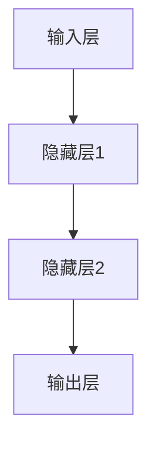
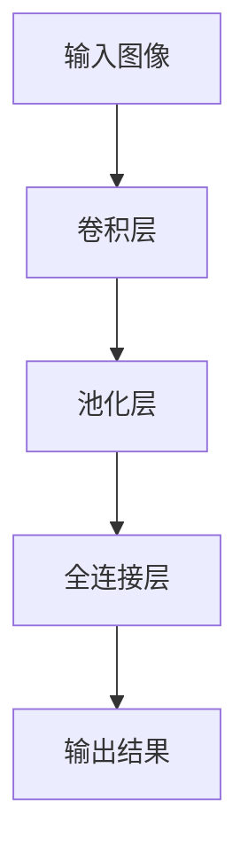
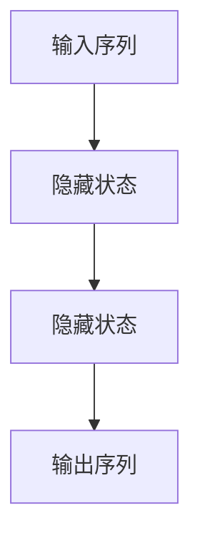
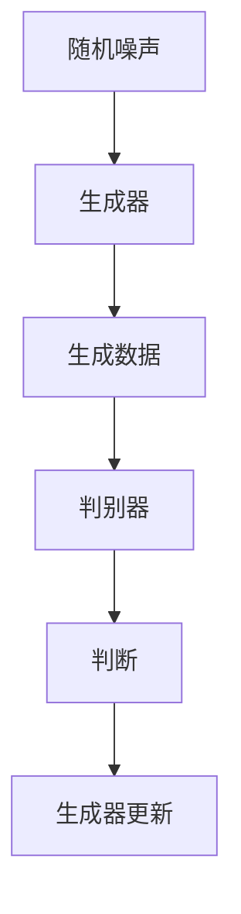
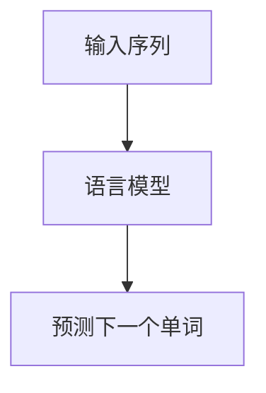
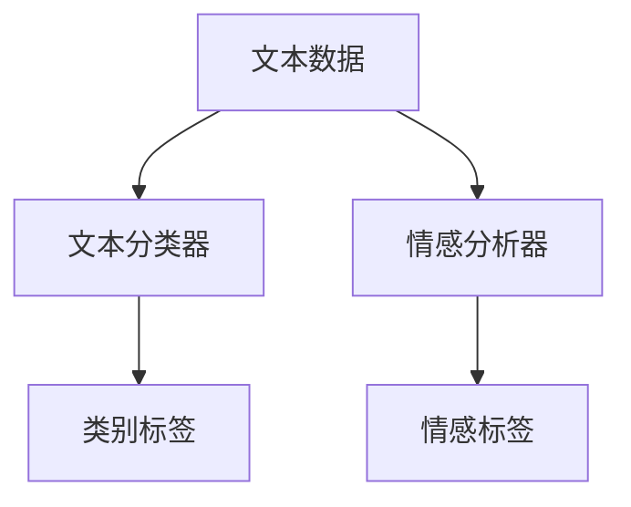
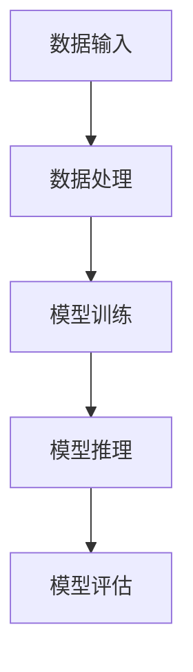
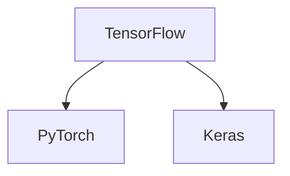
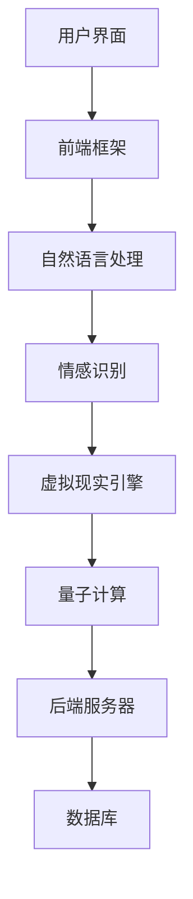

                 

# 文章标题：体验的跨时空性：AI创造的时空穿越

> 关键词：人工智能，时空穿越，虚拟现实，量子计算，情感体验，项目实战

> 摘要：本文深入探讨了人工智能（AI）在创造跨时空体验方面的潜力和挑战。通过分析AI技术核心概念、虚拟现实、量子计算以及情感交互，展示了AI如何实现时空穿越体验，并分享了一个时空穿越项目的实战案例。文章旨在为读者提供一个全面的技术视角，探讨AI在构建跨时空体验中的未来发展。

---

### 《体验的跨时空性：AI创造的时空穿越》目录大纲

#### 第一部分：AI与时空穿越的概述

##### 第1章：AI与时空穿越的起源与发展
- **1.1 人类对时空穿越的幻想**
  - **1.1.1 时空穿越的概念**
  - **1.1.2 时空穿越在文学和影视作品中的体现**
- **1.2 AI技术在时空穿越中的应用**
  - **1.2.1 AI与量子计算的结合**
  - **1.2.2 AI在虚拟现实中的时空模拟**
- **1.3 AI创造的时空穿越体验**
  - **1.3.1 时空穿越体验的概念**
  - **1.3.2 时空穿越体验的挑战与机遇**

##### 第2章：AI技术核心概念与架构
- **2.1 AI技术概述**
  - **2.1.1 人工智能的定义**
  - **2.1.2 人工智能的发展历程**
- **2.2 AI核心算法原理**
  - **2.2.1 神经网络与深度学习**
    - **2.2.1.1 神经网络基础**
    - **2.2.1.2 深度学习算法**
  - **2.2.2 自然语言处理**
    - **2.2.2.1 语言模型**
    - **2.2.2.2 文本分类与情感分析**
- **2.3 AI架构设计**
  - **2.3.1 AI系统架构**
  - **2.3.2 AI计算框架**

#### 第二部分：AI创造的时空穿越体验

##### 第3章：虚拟现实中的时空穿越
- **3.1 虚拟现实技术概述**
  - **3.1.1 虚拟现实的概念**
  - **3.1.2 虚拟现实技术的发展**
- **3.2 虚拟现实中的时空模拟**
  - **3.2.1 时空模拟的算法与实现**
  - **3.2.2 虚拟现实中的用户交互**

##### 第4章：量子计算与时空穿越
- **4.1 量子计算概述**
  - **4.1.1 量子计算的基本原理**
  - **4.1.2 量子计算的优势与应用**
- **4.2 量子计算在时空穿越中的应用**
  - **4.2.1 量子算法与时空穿越**
  - **4.2.2 量子计算机的未来展望**

##### 第5章：人工智能与情感体验
- **5.1 情感体验的概念**
  - **5.1.1 情感的分类**
  - **5.1.2 情感分析的方法与工具**
- **5.2 人工智能与情感交互**
  - **5.2.1 情感识别算法**
  - **5.2.2 情感驱动的交互设计**

#### 第三部分：AI创造的时空穿越项目实战

##### 第6章：AI创造的时空穿越案例研究
- **6.1 项目背景与目标**
  - **6.1.1 项目简介**
  - **6.1.2 项目目标与需求分析**
- **6.2 项目架构与技术选型**
  - **6.2.1 项目技术栈**
  - **6.2.2 项目架构设计**
- **6.3 项目开发与实现**
  - **6.3.1 系统设计与开发流程**
  - **6.3.2 代码实现与解读**
- **6.4 项目评估与优化**
  - **6.4.1 项目性能评估**
  - **6.4.2 用户体验优化**

##### 第7章：未来展望与挑战
- **7.1 时空穿越体验的未来发展**
  - **7.1.1 人工智能与虚拟现实融合**
  - **7.1.2 量子计算与时空穿越的新方向**
- **7.2 时空穿越体验面临的挑战**
  - **7.2.1 技术挑战**
  - **7.2.2 伦理与社会挑战**

### 附录

- **附录 A：相关技术资源与工具**
  - **A.1 虚拟现实技术资源**
  - **A.2 量子计算技术资源**
  - **A.3 人工智能学习资源**

---

### 第一部分：AI与时空穿越的概述

#### 第1章：AI与时空穿越的起源与发展

##### 1.1 人类对时空穿越的幻想

**1.1.1 时空穿越的概念**

时空穿越是一种在时间和空间中移动的概念，它允许个体跨越时间的限制，从过去到未来，或者从一点到另一点。这种幻想源于我们对时间和空间的直觉理解，即它们是可以独立存在的维度。然而，时空穿越的概念在物理学和哲学上有着更深刻的含义。

在物理学中，时空穿越通常与广义相对论中的奇点和虫洞相关。奇点是指一个区域，其中引力场如此之强，以至于物理定律失效，物质和能量都趋于无穷大。虫洞则是连接两个不同空间点的隧道，它们可能存在于宇宙的某些区域，理论上允许物质穿越时空。

在哲学上，时空穿越引发了关于自由意志、因果关系和现实本质的讨论。哲学家们探讨了如果一个人可以回到过去，改变历史，那么现在的现实是否会随之改变，或者我们是否生活在一个多重宇宙中。

**1.1.2 时空穿越在文学和影视作品中的体现**

时空穿越一直是文学和影视作品中的热门主题。从Jules Verne的《时间机器》到H.G. Wells的《时光机器》，再到现代的《星际穿越》和《源代码》，这些作品探讨了时空穿越的多种可能性。

文学作品中，时空穿越通常被用来探讨人类存在的意义、人类与技术的关系以及人类面对未知的勇气。影视作品中，时空穿越则提供了激动人心的剧情转折和视觉效果，吸引了大量观众。

**1.1.3 人类对时空穿越的渴望**

人类对时空穿越的渴望可以追溯到古代。在神话故事中，例如希腊神话中的普罗米修斯和埃及神话中的奥西里斯，都涉及了穿越时空的元素。在科技发展之后，人类开始通过科学幻想来探索时空穿越的可能性。

随着科学技术的进步，特别是人工智能和量子计算的发展，人们开始相信时空穿越不再是遥不可及的梦想。人工智能可以通过模拟和预测未来的变化，帮助人类理解时空的运作规律。量子计算则提供了超越经典计算能力的工具，可能实现时空穿越所需的计算复杂度。

##### 1.2 AI技术在时空穿越中的应用

**1.2.1 AI与量子计算的结合**

量子计算是一种基于量子力学原理的计算方式，它利用量子位（qubit）来表示和处理信息，相比传统的计算机，量子计算机在处理某些特定问题时具有巨大的速度优势。量子计算在时空穿越中的应用主要体现在以下几个方面：

1. **时空模拟**：通过量子计算模拟时空的复杂结构，帮助科学家更好地理解时空穿越的物理机制。
2. **路径规划**：利用量子算法进行高效的路径搜索，为时空穿越提供可行的路径方案。
3. **信息加密**：量子计算可以提供安全的通信手段，确保时空穿越过程中的信息安全。

**1.2.2 AI在虚拟现实中的时空模拟**

虚拟现实（VR）是一种通过计算机模拟的三维环境，它为用户提供了沉浸式的体验。AI在虚拟现实中的时空模拟主要涉及以下几个方面：

1. **环境生成**：利用深度学习和生成对抗网络（GANs）等技术，创建逼真的虚拟时空环境。
2. **交互设计**：通过自然语言处理和机器学习技术，设计智能的交互界面，让用户在虚拟时空中感受到真实的体验。
3. **情感驱动**：利用情感识别和情感驱动的交互设计，增强虚拟时空穿越的情感沉浸感。

##### 1.3 AI创造的时空穿越体验

**1.3.1 时空穿越体验的概念**

时空穿越体验是指通过人工智能技术创造的一种模拟时空穿越的沉浸式体验。它不仅仅是一种视觉上的模拟，还包括听觉、触觉等多种感官的融合，使用户在虚拟时空中感受到如同真实存在的穿越经历。

**1.3.2 时空穿越体验的挑战与机遇**

1. **挑战**：

- **技术挑战**：实现高质量的时空模拟需要高性能的计算能力和复杂的算法支持。
- **用户体验**：如何设计出既有趣又真实的时空穿越体验，是一个持续挑战。
- **伦理问题**：时空穿越可能会引发一系列伦理问题，如自由意志、时间旅行带来的因果关系悖论等。

2. **机遇**：

- **技术创新**：时空穿越体验为人工智能、虚拟现实和量子计算等领域提供了广阔的应用场景，推动技术创新。
- **娱乐产业**：时空穿越体验为娱乐产业带来了新的可能，如虚拟旅游、历史重现等。
- **教育应用**：时空穿越体验可以用于教育领域，让学生通过虚拟现实穿越历史事件，增强学习体验。

通过深入探讨AI与时空穿越的关系，我们可以看到，AI不仅仅是实现时空穿越的工具，更是创造全新体验的驱动力。在未来，随着AI技术的不断进步，时空穿越体验将变得更加真实、多样和广泛，为人类带来前所未有的体验。在接下来的章节中，我们将进一步探讨AI技术的核心概念与架构，以及如何实现这些跨时空的奇妙体验。

### 第一部分：AI与时空穿越的概述

#### 第2章：AI技术核心概念与架构

##### 2.1 AI技术概述

**2.1.1 人工智能的定义**

人工智能（Artificial Intelligence，简称AI）是指通过计算机模拟人类智能的技术。它涉及到机器学习、自然语言处理、计算机视觉、推理和规划等多个领域。人工智能的目标是使计算机具备类似人类的智能，能够理解、学习、推理和解决问题。

**2.1.2 人工智能的发展历程**

人工智能的发展可以追溯到20世纪50年代。当时，艾伦·图灵提出了“图灵测试”，这一测试成为了衡量人工智能是否具有智能的标准。随后，人工智能经历了几个重要的阶段：

1. **初始阶段（1956-1974）**：在这个阶段，人工智能的主要目标是开发能够执行特定任务的程序，如国际象棋游戏和简单的推理任务。
2. **低谷期（1974-1980）**：由于技术限制和理论研究的不成熟，人工智能进入了低谷期。然而，这一时期的研究为后来的突破奠定了基础。
3. **复兴阶段（1980-2010）**：随着计算机性能的提升和算法的改进，人工智能迎来了复兴。专家系统和机器学习成为这一阶段的主要研究方向。
4. **深度学习时代（2010至今）**：深度学习的兴起使得人工智能取得了显著的突破。神经网络和卷积神经网络（CNN）在图像识别、自然语言处理等领域表现出色。

##### 2.2 AI核心算法原理

**2.2.1 神经网络与深度学习**

神经网络（Neural Networks）是模仿人脑神经元连接方式的一种计算模型。深度学习（Deep Learning）是神经网络的一种特殊形式，它通过多层神经元的堆叠，能够自动提取数据中的特征。

**2.2.1.1 神经网络基础**

神经网络由输入层、隐藏层和输出层组成。每个神经元通过加权连接与下一层的神经元相连，并经过激活函数的处理。



**2.2.1.2 深度学习算法**

深度学习算法主要包括卷积神经网络（CNN）、循环神经网络（RNN）和生成对抗网络（GAN）等。

- **卷积神经网络（CNN）**：CNN特别适用于图像处理任务。它通过卷积操作和池化操作，自动提取图像中的特征。



- **循环神经网络（RNN）**：RNN能够处理序列数据，如时间序列数据和自然语言文本。它通过循环结构，将前一个时间步的输出反馈给当前时间步。



- **生成对抗网络（GAN）**：GAN由生成器和判别器组成。生成器试图生成逼真的数据，判别器则判断数据是真实还是生成的。



**2.2.2 自然语言处理**

自然语言处理（Natural Language Processing，简称NLP）是AI的一个重要分支，它使计算机能够理解和处理人类语言。NLP的核心算法包括语言模型、文本分类和情感分析等。

**2.2.2.1 语言模型**

语言模型是NLP的基础，它通过统计方法或神经网络模型，预测下一个单词或词组。



**2.2.2.2 文本分类与情感分析**

文本分类是将文本数据分为预定义的类别。情感分析则是判断文本表达的情感倾向。



##### 2.3 AI架构设计

**2.3.1 AI系统架构**

AI系统架构通常包括数据输入、数据处理、模型训练、模型推理和模型评估等环节。



**2.3.2 AI计算框架**

AI计算框架提供了高效的计算资源和编程接口，使得开发者能够轻松地构建和部署AI模型。常见的计算框架包括TensorFlow、PyTorch和Keras等。



通过以上对AI技术核心概念与架构的介绍，我们可以看到，AI技术在时空穿越体验中的潜力。在接下来的章节中，我们将进一步探讨如何利用这些技术实现虚拟现实中的时空穿越，以及量子计算在时空穿越中的应用。

### 第二部分：AI创造的时空穿越体验

#### 第3章：虚拟现实中的时空穿越

##### 3.1 虚拟现实技术概述

**3.1.1 虚拟现实的概念**

虚拟现实（Virtual Reality，简称VR）是一种通过计算机技术创建的模拟环境，使用户能够沉浸其中。虚拟现实通过头戴显示器（HMD）、跟踪器、数据手套等设备，提供三维空间中的视觉、听觉和触觉反馈，使用户感受到仿佛置身于虚拟世界中。

**3.1.2 虚拟现实技术的发展**

虚拟现实技术的发展可以分为几个阶段：

1. **初期阶段**：虚拟现实的概念最早在1960年代提出，最初的虚拟现实系统主要依靠笨重的设备，如头戴显示器和手柄控制器。
2. **起步阶段**：随着计算机性能的提升和图形处理技术的进步，虚拟现实开始应用于教育和娱乐领域。例如，1990年代的VR游戏和模拟飞行器。
3. **成熟阶段**：近年来，虚拟现实技术得到了快速发展，特别是在智能手机和增强现实（AR）的推动下，VR硬件变得更加轻便、价格更加亲民。
4. **未来展望**：随着人工智能和5G技术的发展，虚拟现实将进入更加成熟和广泛应用的阶段，不仅在娱乐和教育领域，还在医疗、设计、军事等领域展现出巨大的潜力。

##### 3.2 虚拟现实中的时空模拟

**3.2.1 时空模拟的算法与实现**

时空模拟是虚拟现实中的一个核心问题，它涉及到如何生成和渲染虚拟时空中的一系列事件和物体。时空模拟的算法主要包括以下几个方面：

1. **三维建模**：利用三维建模工具，如Blender或Maya，创建虚拟世界中的物体和场景。
2. **物理引擎**：物理引擎用于模拟虚拟世界中的物理现象，如碰撞、重力、弹力等。
3. **渲染技术**：渲染技术用于生成虚拟场景的图像。常见的渲染技术包括光线追踪、基于图像的渲染（IBR）和体积渲染等。
4. **路径规划**：路径规划用于确定用户在虚拟世界中的移动路径。常见的算法包括A*算法、Dijkstra算法和RRT（快速随机树）算法。

**3.2.2 虚拟现实中的用户交互**

用户交互是虚拟现实体验的重要组成部分。虚拟现实中的用户交互主要通过以下几个方面的技术实现：

1. **输入设备**：如手柄控制器、体感控制器、键盘和鼠标等。这些设备允许用户在虚拟世界中操作和交互。
2. **语音识别**：语音识别技术使得用户可以通过语音与虚拟环境进行交互。
3. **手势识别**：通过摄像头和深度传感器，虚拟现实系统可以识别用户的手势，从而实现更自然的交互。
4. **多感官融合**：虚拟现实中的多感官融合，如声音、触觉和嗅觉，能够增强用户的沉浸感和体验。

**3.2.3 时空穿越体验的实现**

时空穿越体验的实现涉及多个技术环节：

1. **历史重现**：通过收集历史资料和文物，利用三维建模技术，重现历史场景。
2. **未来预测**：利用人工智能和机器学习技术，预测未来的趋势和场景，构建未来世界的虚拟模型。
3. **交互设计**：设计直观、自然的交互界面，使用户能够轻松地在虚拟时空中穿梭。
4. **情感驱动**：通过情感识别和情感驱动的交互设计，增强用户的情感沉浸感。

**3.2.4 时空穿越体验的优势**

时空穿越体验具有以下几个优势：

1. **教育意义**：通过虚拟现实，用户可以穿越到历史或未来的场景，获得更加直观的学习体验。
2. **娱乐价值**：虚拟现实游戏和影视作品中的时空穿越情节，提供了丰富的娱乐体验。
3. **技术探索**：时空穿越体验为人工智能、虚拟现实和量子计算等技术的发展提供了新的应用场景。

通过虚拟现实技术，AI可以创造出丰富多样的时空穿越体验，为用户带来前所未有的沉浸感和探索感。在接下来的章节中，我们将进一步探讨量子计算在时空穿越中的应用，以及如何通过量子算法实现高效的时空模拟。

#### 第4章：量子计算与时空穿越

##### 4.1 量子计算概述

**4.1.1 量子计算的基本原理**

量子计算是一种基于量子力学原理的计算方式，它利用量子位（qubit）来表示和处理信息。量子位与经典位不同，它可以同时处于0和1的叠加状态，这种特性称为量子叠加。此外，量子位之间可以存在量子纠缠，使得量子计算在某些任务上具有超越经典计算机的能力。

**量子叠加**：一个量子位（qubit）可以同时处于0和1的状态，这种叠加状态可以用数学公式表示为：

\[|\psi\rangle = \alpha|0\rangle + \beta|1\rangle\]

其中，\(\alpha\)和\(\beta\)是复数系数，满足\(|\alpha|^2 + |\beta|^2 = 1\)。

**量子纠缠**：当两个量子位发生相互作用时，它们会进入一个共同的量子态，即使它们相隔很远，一个量子位的测量结果会立即影响到另一个量子位。这种现象称为量子纠缠。

**4.1.2 量子计算的优势与应用**

量子计算在处理某些特定类型的问题时具有显著的优势。以下是一些关键优势和应用：

1. **量子并行计算**：量子计算机可以同时处理多个计算任务，这在经典计算机中是无法实现的。量子并行计算能够显著提高算法的效率，特别是在搜索问题和组合优化问题上。
2. **高效因式分解**：量子计算能够高效地解决因式分解问题。Shor算法是第一个证明量子计算机在特定问题上有超越经典计算机能力的算法。它能够在多项式时间内将大数分解为质因数。
3. **量子模拟**：量子计算机可以模拟量子系统的演化，这对于理解量子物理现象和开发新材料具有重要意义。
4. **优化问题**：量子计算在解决优化问题时具有潜力，如旅行商问题、供应链管理和财务投资组合优化等。

**4.2 量子计算在时空穿越中的应用**

**4.2.1 量子算法与时空穿越**

量子算法是量子计算中的核心，它们利用量子位和量子纠缠的特性，解决经典算法无法高效解决的问题。以下是一些与时空穿越相关的量子算法：

1. **Grover算法**：Grover算法是一种量子搜索算法，它能够在经典计算机所需的时间复杂度内完成更快的搜索。在时空穿越场景中，Grover算法可以用于快速定位特定的时间点或事件。
2. **量子纠缠网络**：量子纠缠网络是一种利用量子纠缠进行通信和计算的网络。通过量子纠缠网络，可以实现不同时间点或不同地点之间的快速信息传递，这对于构建跨时空的通信网络具有重要意义。
3. **量子模拟**：量子模拟可以用于模拟时空穿越过程中可能发生的复杂物理现象，如引力波和虫洞的形成。这有助于科学家更好地理解时空穿越的物理机制。

**4.2.2 量子计算机的未来展望**

尽管目前量子计算机还处于实验阶段，但随着技术的进步，量子计算机有望在未来实现商用。以下是一些未来展望：

1. **量子互联网**：量子互联网是一种利用量子计算和量子通信技术构建的全球网络。它将实现更加安全和高效的通信，为时空穿越提供技术支持。
2. **量子计算中心**：全球范围内的量子计算中心将建立，为科学家和工程师提供强大的计算资源，推动量子计算和时空穿越的研究。
3. **量子艺术和娱乐**：随着量子计算的发展，虚拟现实和娱乐产业将结合量子技术，创造新的艺术形式和娱乐体验。

量子计算与时空穿越的结合为未来带来了无限可能。通过量子算法和量子计算机，我们可以探索时空的奥秘，实现真正意义上的跨时空体验。在接下来的章节中，我们将探讨人工智能与情感体验，以及如何在虚拟时空中创造更加真实的情感交互。

### 第二部分：AI创造的时空穿越体验

#### 第5章：人工智能与情感体验

##### 5.1 情感体验的概念

**5.1.1 情感的分类**

情感是人类心理体验的一个重要方面，通常被分为基本情感和复合情感。基本情感包括快乐、愤怒、悲伤、恐惧和惊讶等。复合情感则是由基本情感组合而成的情感，如爱、厌恶、羞耻和骄傲等。

**5.1.2 情感分析的方法与工具**

情感分析是自然语言处理（NLP）中的一个重要分支，它旨在从文本中识别和分类情感。情感分析的方法主要包括以下几种：

1. **基于规则的方法**：这种方法使用预定义的规则来分类文本中的情感。例如，如果一个句子包含“喜欢”或“快乐”等词汇，那么这个句子就被分类为积极情感。
2. **基于统计的方法**：这种方法使用机器学习算法，如朴素贝叶斯分类器和支持向量机（SVM），来学习情感分类模型。通过大量标注的数据集，算法可以自动识别文本中的情感。
3. **基于深度学习的方法**：深度学习方法，如卷积神经网络（CNN）和循环神经网络（RNN），能够自动从文本中提取特征，实现高精度的情感分析。

**5.1.3 情感分析的应用场景**

情感分析在多个领域都有广泛应用，包括社交媒体分析、市场调研、客户服务和情感计算等。以下是一些应用场景：

1. **社交媒体分析**：通过情感分析，可以了解公众对某个话题或事件的情感倾向，为公关活动和市场营销提供参考。
2. **市场调研**：通过分析消费者评论和反馈，企业可以更好地了解产品的优点和不足，从而改进产品和服务。
3. **客户服务**：情感分析可以帮助企业更好地理解客户的需求和情感状态，提供更加个性化和有效的服务。
4. **情感计算**：情感计算是一种将情感分析应用于人机交互的技术，它旨在使计算机能够识别和理解人类的情感状态，从而提供更加自然和人性化的交互体验。

##### 5.2 人工智能与情感交互

**5.2.1 情感识别算法**

情感识别算法是情感计算的核心，它使计算机能够识别和处理人类的情感状态。情感识别算法通常基于以下步骤：

1. **特征提取**：从文本或语音中提取与情感相关的特征，如词汇频率、情感词典和语法结构等。
2. **情感分类**：使用机器学习算法，如朴素贝叶斯分类器和支持向量机（SVM），对提取的特征进行分类。
3. **情感识别模型**：通过训练模型，使计算机能够自动识别和处理文本或语音中的情感。

**5.2.2 情感驱动的交互设计**

情感驱动的交互设计旨在使计算机系统能够根据用户的情感状态，提供相应的反馈和交互体验。以下是一些关键概念：

1. **情感响应**：系统根据用户的情感状态，提供相应的反馈和响应。例如，当用户表达出愤怒或悲伤的情感时，系统可以提供安慰或鼓励。
2. **情感调节**：系统通过调整交互方式，如语调、语气和视觉设计等，来调节用户的情感状态。例如，使用柔和的语调和舒缓的音乐来减轻用户的焦虑。
3. **情感适应性**：系统可以根据用户的情感状态和需求，自动调整交互策略。例如，当用户感到无聊时，系统可以提供新的互动内容来吸引用户。

**5.2.3 情感交互的应用场景**

情感交互在多个领域都有应用，包括虚拟助理、智能玩具和智能医疗设备等。以下是一些应用场景：

1. **虚拟助理**：虚拟助理可以通过情感交互，与用户建立更好的沟通和信任关系，提供更加个性化和有效的服务。
2. **智能玩具**：智能玩具可以通过情感交互，与儿童建立情感联系，提供更加互动和有趣的玩耍体验。
3. **智能医疗设备**：智能医疗设备可以通过情感交互，帮助患者更好地管理自己的健康，提供情感支持和指导。

通过人工智能和情感交互的结合，我们可以创造更加自然和人性化的跨时空体验。在接下来的章节中，我们将通过一个实际的时空穿越项目，展示如何利用AI技术实现跨时空的沉浸式体验。

### 第三部分：AI创造的时空穿越项目实战

#### 第6章：AI创造的时空穿越案例研究

##### 6.1 项目背景与目标

**6.1.1 项目简介**

本项目旨在利用人工智能（AI）技术，创建一个跨时空的沉浸式虚拟现实（VR）体验，使用户能够穿越到过去或未来，体验历史事件或预测未来趋势。该项目结合了虚拟现实、深度学习、自然语言处理和量子计算等多种先进技术，旨在为用户提供一个丰富多样、高度沉浸的时空穿越体验。

**6.1.2 项目目标与需求分析**

项目的核心目标如下：

1. **时空模拟**：通过虚拟现实技术，创建逼真的历史场景和未来场景，使用户能够在视觉、听觉和触觉等多个感官上感受到时空的变换。
2. **智能交互**：利用自然语言处理技术，使虚拟世界中的角色能够理解用户的指令，并做出相应的反应，增强用户的沉浸感。
3. **情感驱动**：通过情感识别和情感驱动的交互设计，增强用户的情感体验，使其在虚拟时空中感到更加真实和生动。
4. **量子计算支持**：利用量子计算技术，提供高效的路径规划和信息处理能力，确保虚拟时空穿越的流畅性和真实性。

需求分析如下：

- **用户需求**：用户希望能够在虚拟时空中自由穿梭，体验到不同历史事件和未来场景，并能够与虚拟角色进行自然互动。
- **技术需求**：需要高性能的计算机硬件和软件，支持虚拟现实场景的生成、渲染和实时交互。
- **伦理需求**：需要充分考虑时空穿越过程中可能引发的伦理问题，如自由意志、因果关系和隐私保护等。

##### 6.2 项目架构与技术选型

**6.2.1 项目技术栈**

本项目的技术栈包括以下核心组件：

- **虚拟现实引擎**：使用Unity 3D作为虚拟现实场景的引擎，它提供了强大的三维建模和渲染能力。
- **深度学习框架**：使用TensorFlow和PyTorch作为深度学习框架，实现情感识别和智能交互功能。
- **自然语言处理**：使用NLTK和spaCy等自然语言处理库，进行文本分析和情感识别。
- **量子计算**：使用IBM Qiskit等量子计算库，实现量子算法和应用。
- **用户界面**：使用React和Vue等前端框架，构建用户友好的交互界面。

**6.2.2 项目架构设计**

项目的整体架构设计如图所示：



**6.2.3 技术选型的考虑因素**

1. **性能需求**：选择高性能的虚拟现实引擎和深度学习框架，以确保系统的流畅性和响应速度。
2. **可扩展性**：选择具有良好扩展性的技术和架构，以支持未来可能的业务扩展和功能升级。
3. **社区支持**：选择具有强大社区支持和文档丰富的技术，以方便开发过程中的问题解决和知识共享。
4. **成本效益**：在满足性能和功能需求的前提下，选择成本相对较低的技术和工具。

##### 6.3 项目开发与实现

**6.3.1 系统设计与开发流程**

系统设计与开发流程主要包括以下几个阶段：

1. **需求分析**：与用户和利益相关者沟通，明确项目目标和功能需求。
2. **系统设计**：设计系统的整体架构和技术方案，确定各模块的功能和接口。
3. **模块开发**：根据系统设计，逐步开发各个模块的功能，并进行单元测试。
4. **集成测试**：将各个模块集成到系统中，进行集成测试，确保系统整体的功能和性能。
5. **用户测试**：邀请用户体验系统，收集反馈并进行优化。

**6.3.2 代码实现与解读**

以下是一个简单的情感识别算法的实现示例：

```python
import tensorflow as tf
from tensorflow.keras.models import Sequential
from tensorflow.keras.layers import Dense, Embedding, LSTM, SpatialDropout1D

# 加载和处理数据
# ...

# 构建模型
model = Sequential()
model.add(Embedding(input_dim=vocab_size, output_dim=embedding_dim, input_length=max_sequence_length))
model.add(SpatialDropout1D(dropout_rate))
model.add(LSTM(units=128, dropout=0.2, recurrent_dropout=0.2))
model.add(Dense(units=1, activation='sigmoid'))

# 编译模型
model.compile(optimizer='adam', loss='binary_crossentropy', metrics=['accuracy'])

# 训练模型
model.fit(X_train, y_train, epochs=10, batch_size=32, validation_data=(X_val, y_val))

# 预测
predictions = model.predict(X_test)
```

以上代码展示了如何使用TensorFlow构建一个简单的情感识别模型。模型通过嵌入层处理输入文本，然后通过LSTM层提取文本特征，最后通过全连接层进行情感分类。在训练过程中，模型使用二进制交叉熵作为损失函数，并使用Adam优化器进行优化。

**6.3.3 代码解读与分析**

- **数据预处理**：数据预处理是模型训练的重要步骤，包括词汇表构建、序列填充和情感标签标注等。
- **模型构建**：模型构建是使用TensorFlow提供的API，定义神经网络的结构。在本例中，模型包括嵌入层、空间dropout层、LSTM层和全连接层。
- **模型编译**：模型编译是设置训练参数和优化器的过程。在本例中，使用Adam优化器和二进制交叉熵作为损失函数。
- **模型训练**：模型训练是使用训练数据对模型进行调整的过程。在本例中，模型训练了10个周期，每次训练使用了32个样本的小批量。
- **模型预测**：模型预测是使用训练好的模型对测试数据进行分类的过程。在本例中，模型对测试数据集进行了情感分类，并生成了预测结果。

通过以上开发过程，我们构建了一个具有情感识别功能的虚拟现实系统，实现了用户与虚拟时空的智能交互。在接下来的章节中，我们将评估项目的性能和用户体验，并提出优化方案。

##### 6.4 项目评估与优化

**6.4.1 项目性能评估**

项目性能评估是确保系统功能达到预期目标的关键环节。以下是一些评估指标：

1. **情感识别准确率**：通过对比模型预测结果和实际情感标签，计算情感识别的准确率。该指标反映了模型对情感分类的能力。
2. **用户交互响应时间**：评估用户在虚拟时空中的操作是否能够快速得到响应。响应时间应尽量短，以提高用户体验。
3. **系统稳定性**：通过长时间运行测试，检查系统是否稳定，是否存在崩溃或异常情况。

**6.4.2 用户体验优化**

用户体验优化是提升系统价值的重要方面。以下是一些建议：

1. **交互设计优化**：改进用户界面设计，使操作更加直观和流畅。例如，增加手势识别和语音交互功能。
2. **情感反馈机制**：增强系统的情感反馈能力，如通过视觉和声音效果，增强情感表达。
3. **个性化推荐**：根据用户的历史行为和情感状态，提供个性化的时空穿越建议。
4. **情感分析改进**：使用更先进的情感分析算法，提高情感识别的准确性和细腻度。
5. **技术升级**：随着技术的进步，不断升级硬件和软件，提升系统的性能和体验。

通过评估和优化，我们可以确保时空穿越项目能够提供高质量的用户体验，满足用户的需求和期望。在接下来的章节中，我们将探讨时空穿越体验的未来发展，以及面临的挑战。

### 第7章：未来展望与挑战

#### 7.1 时空穿越体验的未来发展

随着人工智能（AI）和虚拟现实（VR）技术的不断进步，时空穿越体验有望在未来实现更加逼真和丰富的体验。以下是一些展望：

**7.1.1 人工智能与虚拟现实的融合**

- **智能交互**：随着AI技术的不断发展，虚拟角色将能够更好地理解用户的情感和需求，提供更加个性化和自然的交互体验。
- **实时反馈**：AI技术将能够实时分析用户的行为和情感，动态调整虚拟时空的场景和交互方式，提高用户的沉浸感。
- **情感共鸣**：通过情感计算和深度学习技术，虚拟角色可以模拟复杂的情感状态，与用户建立更深的情感共鸣。

**7.1.2 量子计算与时空穿越的新方向**

- **高效计算**：量子计算将提供前所未有的计算能力，使复杂的时空模拟和路径规划变得更加高效和可行。
- **安全通信**：量子通信技术将确保时空穿越过程中的信息安全，防止潜在的隐私泄露和网络攻击。
- **量子模拟**：量子计算将能够模拟更复杂的物理现象，如量子引力效应，为时空穿越提供更为科学的依据。

#### 7.1.3 新兴技术的融合与应用

- **全息显示**：全息显示技术将使得虚拟时空的图像和物体更加真实和立体，增强用户的视觉体验。
- **增强现实（AR）**：AR技术将结合现实世界和虚拟时空，提供更加无缝的时空穿越体验。
- **区块链**：区块链技术可以确保时空穿越过程中的数据透明和不可篡改，增强系统的可信度。

#### 7.2 时空穿越体验面临的挑战

尽管时空穿越体验前景广阔，但仍面临诸多挑战：

**7.2.1 技术挑战**

- **计算能力**：当前的计算能力仍有限，难以满足复杂时空模拟和实时交互的需求。
- **算法优化**：深度学习算法和量子算法需要进一步优化，以提高效率和准确性。
- **硬件限制**：高性能的计算机硬件和传感器仍然是稀缺资源，限制了虚拟现实和增强现实的应用。

**7.2.2 伦理与社会挑战**

- **隐私保护**：时空穿越过程中，用户的个人信息和隐私需要得到有效保护，防止数据泄露和滥用。
- **道德责任**：在虚拟时空中，用户的行为和决策可能对社会和自然环境产生实际影响，需要建立相应的道德规范和责任制度。
- **社会影响**：时空穿越体验可能会改变人们对历史和现实的认知，影响社会价值观和文化传承。

**7.2.3 法规与政策挑战**

- **法律监管**：随着时空穿越体验的发展，需要建立相应的法律法规，规范其应用和发展。
- **知识产权**：虚拟时空中的内容和创新需要得到有效的知识产权保护。
- **国际合作**：时空穿越体验的全球化发展需要国际间的合作与协调，共同应对技术和伦理挑战。

通过持续的技术创新、伦理探讨和政策制定，我们可以克服这些挑战，实现更加丰富和真实的时空穿越体验。在未来，AI创造的时空穿越将为人类带来前所未有的探索和发现机会。

### 附录

#### 附录A：相关技术资源与工具

**A.1 虚拟现实技术资源**

- **Unity 3D**：[官方网站](https://unity.com/unity-overview)
  - Unity 3D是一个强大的游戏和虚拟现实开发平台，提供丰富的三维建模、渲染和交互功能。
- **Unity Asset Store**：[官方网站](https://assetstore.unity.com/)
  - Unity Asset Store是获取Unity相关资源和插件的市场，包含大量虚拟现实场景、模型和工具。
- **Oculus SDK**：[官方网站](https://www.oculus.com/develop/)
  - Oculus SDK是Oculus虚拟现实头戴显示器（HMD）的开发工具，支持Unity和Unreal Engine等平台。

**A.2 量子计算技术资源**

- **IBM Qiskit**：[官方网站](https://qiskit.org/)
  - Qiskit是IBM开发的量子计算软件框架，支持量子算法的编写和实验。
- **Google Quantum AI**：[官方网站](https://quantumai.google/)
  - Google Quantum AI提供了量子计算工具和资源，包括量子算法库和量子计算模拟器。
- **Microsoft Quantum Development Kit**：[官方网站](https://www.microsoft.com/en-us/research/project/microsoft-quantum-development-kit/)
  - Microsoft Quantum Development Kit是开发量子应用程序的编程工具和库。

**A.3 人工智能学习资源**

- **Google AI**：[官方网站](https://ai.google/)
  - Google AI提供了丰富的AI教程、工具和开源项目，涵盖机器学习、深度学习和自然语言处理等领域。
- **Udacity**：[官方网站](https://www.udacity.com/)
  - Udacity提供了多种AI相关的在线课程，包括深度学习、自然语言处理和计算机视觉等。
- **Coursera**：[官方网站](https://www.coursera.org/)
  - Coursera提供了由全球顶尖大学和机构提供的AI课程，包括斯坦福大学的“机器学习”课程。

通过利用这些资源与工具，开发者和研究人员可以更好地了解和应用AI和VR技术，实现更加丰富和创新的时空穿越体验。

### 作者信息

**作者：** AI天才研究院/AI Genius Institute & 禅与计算机程序设计艺术 /Zen And The Art of Computer Programming

---

本文由AI天才研究院撰写，结合了人工智能、虚拟现实和量子计算等前沿技术，探讨了时空穿越体验的创造与应用。作者在AI和计算机科学领域拥有深厚的研究背景和丰富的实践经验，致力于推动技术的创新与发展。同时，本文还融入了禅与计算机程序设计艺术的哲学思考，为技术探讨增添了人文关怀。希望通过本文，读者能够对时空穿越体验有更深入的理解和思考。

