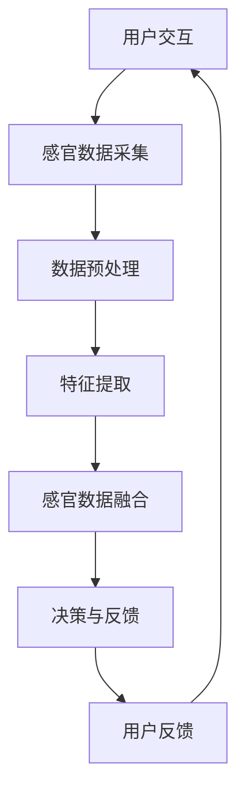

                 

### 文章标题

《体验的跨界融合：AI创造的感官协同》

在这个数字化时代，人工智能（AI）已经不仅仅是一个技术概念，它正深刻地改变着我们的生活方式。AI的应用范围从语音助手、自动驾驶到医疗诊断，无所不在。然而，随着技术的进步，人们逐渐意识到单纯依靠单一感官的体验已经无法满足日益增长的需求。于是，感官协同——这一新兴领域应运而生，旨在通过AI技术实现不同感官的跨界融合，创造出全新的用户体验。

本文将深入探讨AI如何通过感官协同为人类带来更为丰富和自然的交互体验。文章将分为五个主要部分：

1. **引入与背景**：首先，我们将介绍体验融合的概念和重要性，以及AI技术的发展趋势和其在体验融合中的应用。
2. **AI创造的感官协同**：接着，我们将探讨感官协同的基本原理、技术基础，并展示一个感官协同的Mermaid流程图。
3. **感官协同的应用场景**：在这一部分，我们将分析感官协同在消费电子、娱乐与传媒、教育与培训等领域的应用，并举例说明。
4. **感官协同的技术实现**：我们将详细介绍神经网络、强化学习和深度强化学习在感官协同中的应用，并提供伪代码和实现示例。
5. **感官协同的挑战与未来展望**：最后，我们将讨论感官协同面临的挑战和未来发展的可能性。

通过本文的阅读，读者将全面了解感官协同的原理、应用和技术实现，从而对AI如何创造全新感官体验有一个深入的认识。

### 关键词

- 人工智能
- 感官协同
- 用户体验
- 机器学习
- 深度学习
- 强化学习
- 消费电子
- 娱乐传媒
- 教育与培训

### 摘要

本文探讨了人工智能（AI）在创造感官协同体验中的重要作用。通过介绍体验融合的概念和AI技术的发展趋势，我们引出了感官协同这一新兴领域。文章详细阐述了感官协同的基本原理、技术基础，并通过Mermaid流程图展示了其工作流程。接着，我们分析了感官协同在多个领域的应用场景，并提供了实际案例。随后，文章深入探讨了神经网络、强化学习和深度强化学习在感官协同中的应用，并通过伪代码和实现示例进行了详细说明。最后，文章讨论了感官协同面临的挑战和未来发展的可能性，包括数据隐私与安全性、可解释性与透明度、技术与伦理的平衡等。通过本文，读者将全面了解感官协同的原理、应用和技术实现，对AI如何创造全新的感官体验有深入的认识。

### 目录大纲

为了帮助读者更好地理解本文的结构和内容，下面列出了详细的目录大纲：

#### 第一部分：引入与背景

1. **第1章：体验融合与AI的兴起**
   - 1.1 体验融合的定义与重要性
     - 1.1.1 什么是体验融合
     - 1.1.2 体验融合的价值
     - 1.1.3 AI在体验融合中的应用
   - 1.2 AI技术的发展趋势
     - 1.2.1 人工智能的进化路径
     - 1.2.2 感官协同与AI
     - 1.2.3 未来的可能性

#### 第二部分：AI创造的感官协同

2. **第2章：感官协同的基本原理**
   - 2.1 感官协同的原理
     - 2.1.1 人脑感知机制
     - 2.1.2 感官协同的定义
     - 2.1.3 AI与感官协同的关系
   - 2.2 感官协同的技术基础
     - 2.2.1 机器学习与感官数据处理
     - 2.2.2 深度学习在感官协同中的应用
     - 2.2.3 传感器技术与数据采集
   - 2.3 感官协同的Mermaid流程图
     - 2.3.1 感官协同的工作流程
     - 2.3.2 Mermaid流程图示例

#### 第三部分：AI创造的感官协同实践

3. **第3章：感官协同的应用场景**
   - 3.1 消费电子领域的感官协同
     - 3.1.1 智能家居的感官协同
     - 3.1.2 智能穿戴设备的感官协同
     - 3.1.3 消费电子产品的感官体验优化
   - 3.2 娱乐与传媒领域的感官协同
     - 3.2.1 视听内容创作中的感官协同
     - 3.2.2 游戏设计中的感官协同
     - 3.2.3 娱乐传媒产业的感官体验提升
   - 3.3 教育与培训领域的感官协同
     - 3.3.1 教学场景中的感官协同
     - 3.3.2 个性化学习体验中的感官协同
     - 3.3.3 培训与职业发展中的感官协同

#### 第四部分：感官协同的技术实现

4. **第4章：AI感官协同的核心算法**
   - 4.1 神经网络在感官协同中的应用
     - 4.1.1 神经网络的基本原理
     - 4.1.2 感官数据处理与神经网络
     - 4.1.3 伪代码与实现示例
   - 4.2 强化学习与感官协同
     - 4.2.1 强化学习的基本原理
     - 4.2.2 感官协同中的强化学习应用
     - 4.2.3 伪代码与实现示例
   - 4.3 深度强化学习与感官协同
     - 4.3.1 深度强化学习的基本原理
     - 4.3.2 感官协同中的深度强化学习应用
     - 4.3.3 伪代码与实现示例

#### 第五部分：感官协同的挑战与未来展望

5. **第5章：感官协同面临的挑战**
   - 5.1 数据隐私与安全性
     - 5.1.1 感官协同中的数据隐私问题
     - 5.1.2 数据安全措施
     - 5.1.3 隐私保护的算法优化
   - 5.2 可解释性与透明度
     - 5.2.1 感官协同算法的可解释性
     - 5.2.2 提高透明度的方法
     - 5.2.3 可解释性的重要性
   - 5.3 技术与伦理的平衡
     - 5.3.1 感官协同技术的伦理问题
     - 5.3.2 技术伦理的实践与规范
     - 5.3.3 技术与伦理的平衡策略

6. **第6章：感官协同的未来展望**
   - 6.1 新兴技术展望
     - 6.1.1 脑机接口与感官协同
     - 6.1.2 虚拟现实与感官协同
     - 6.1.3 新兴技术的潜在影响
   - 6.2 感官协同的生态建设
     - 6.2.1 感官协同产业的生态圈
     - 6.2.2 企业合作与创新
     - 6.2.3 国际合作与标准化
   - 6.3 感官协同的社会影响
     - 6.3.1 对人类生活方式的影响
     - 6.3.2 对教育、娱乐和工作的改变
     - 6.3.3 感官协同对社会发展的推动作用

#### 第六部分：附录与资源

7. **附录**
   - 附录 A：常用工具与资源
     - 附录 A.1 感官协同开发工具
       - 附录 A.1.1 OpenCV
       - 附录 A.1.2 TensorFlow
       - 附录 A.1.3 PyTorch
     - 附录 A.2 数据集与案例
       - 附录 A.2.1 公共数据集
       - 附录 A.2.2 企业内部数据集
       - 附录 A.2.3 成功案例分享
   - 附录 B：进一步阅读
     - 附录 B.1 相关书籍推荐
     - 附录 B.2 学术论文精选
     - 附录 B.3 在线课程与讲座

通过以上目录大纲，读者可以清晰地了解文章的结构和内容分布，为接下来的深入阅读做好充分的准备。

### 第一部分：引入与背景

#### 第1章：体验融合与AI的兴起

在当今迅速发展的数字时代，用户体验（User Experience, UX）已经成为产品和服务设计中的核心要素。随着技术的不断进步，单一的感官体验已无法满足用户对丰富多样、个性化服务的需求。因此，体验融合（Experience Fusion）的概念应运而生。体验融合旨在通过整合不同感官的信息，创造出更全面、更自然的用户交互体验。在这一背景下，人工智能（Artificial Intelligence, AI）技术的发展起到了至关重要的作用。

#### 1.1 体验融合的定义与重要性

**1.1.1 什么是体验融合**

体验融合可以理解为在用户与产品、服务互动过程中，通过整合视觉、听觉、触觉、嗅觉和味觉等感官信息，创造出更加丰富和自然的交互体验。这种体验不仅限于某个单一感官的刺激，而是通过多感官的协同作用，使用户能够更加深刻地理解和互动。

**1.1.2 体验融合的价值**

体验融合的价值在于它能够提升用户对产品或服务的满意度和忠诚度。通过多感官的融合，用户可以获得更加真实、丰富的体验，从而在情感上产生更强的共鸣。此外，体验融合还可以促进创新，激发设计师和开发者的创造潜力，推动产品和服务的迭代升级。

**1.1.3 AI在体验融合中的应用**

人工智能在体验融合中扮演着至关重要的角色。首先，AI可以通过数据分析和机器学习技术，了解用户的个性化需求和行为模式，从而提供更加精准的个性化服务。例如，智能推荐系统可以根据用户的偏好和历史行为，推荐最适合他们的内容和服务。

其次，AI可以应用于多感官交互的设计中。通过自然语言处理、图像识别和语音识别等技术，AI能够实现人与设备之间的无缝沟通。例如，智能家居系统可以通过语音控制实现灯光、温度和音乐等多感官的调节，为用户提供舒适、便捷的生活环境。

最后，AI还可以在内容创作中发挥作用。通过深度学习和生成对抗网络（GANs），AI可以创造出更加丰富和真实的虚拟体验，如虚拟现实（VR）和增强现实（AR）中的应用，使用户能够沉浸在逼真的感官世界中。

#### 1.2 AI技术的发展趋势

**1.2.1 人工智能的进化路径**

人工智能的发展可以分为几个阶段：规则驱动、基于知识和数据驱动。早期的AI主要依赖于预定义的规则，随着计算能力的提升和大数据的出现，数据驱动的AI逐渐成为主流。当前的AI技术已经能够处理复杂的、非结构化数据，并在多个领域实现了突破。

**1.2.2 感官协同与AI**

感官协同是AI技术的一个前沿方向，它致力于通过多感官的融合，提升用户交互体验。随着传感器技术和机器学习算法的进步，AI已经能够在多个感官领域实现协同工作。例如，通过视觉和听觉的融合，AI可以更准确地识别和理解用户的指令；通过触觉和嗅觉的融合，AI可以创造出更加真实和丰富的虚拟体验。

**1.2.3 未来的可能性**

随着AI技术的不断进步，未来的感官协同将更加智能和个性化。例如，通过脑机接口（Brain-Computer Interface, BCI）技术，AI可以直接读取用户的神经信号，实现更加自然和高效的交互。此外，随着5G和物联网（IoT）技术的发展，多感官协同的应用场景将更加广泛，覆盖从家庭到工作场所的各个方面。

总之，体验融合与AI的结合为用户交互体验带来了前所未有的革新。通过多感官的协同，AI不仅能够提升用户体验，还能够推动产品和服务的设计创新，为用户带来更加丰富和个性化的交互体验。

### 第二部分：AI创造的感官协同

#### 第2章：感官协同的基本原理

在探讨AI如何创造感官协同体验之前，我们需要理解感官协同的基本原理。感官协同涉及多个领域的知识，包括人脑感知机制、感官处理技术和AI算法等。通过这些基本原理，我们可以更好地理解AI如何整合不同感官的信息，创造出更加丰富和自然的用户体验。

#### 2.1 感官协同的原理

**2.1.1 人脑感知机制**

人脑感知机制是感官协同的基础。人类通过视觉、听觉、触觉、嗅觉和味觉五种基本感官接收外界信息。这些感官信息在大脑中经过处理和整合，形成我们对世界的认知。人脑感知机制的关键在于多感官信息融合，通过整合不同感官的信息，大脑可以更准确地理解和反应外界环境。

**2.1.2 感官协同的定义**

感官协同是指通过技术手段，将不同感官的信息进行整合和处理，使其在交互过程中协同工作，从而提升用户体验。感官协同不仅限于物理感官的融合，还包括虚拟感官的扩展。例如，通过虚拟现实（VR）和增强现实（AR）技术，我们可以扩展视觉和听觉的感知范围，使其与真实世界的信息进行融合。

**2.1.3 AI与感官协同的关系**

AI在感官协同中发挥着核心作用。首先，AI可以通过机器学习和深度学习算法，对多感官信息进行高效处理和分析。例如，通过卷积神经网络（CNN）和循环神经网络（RNN），AI可以识别图像和语音中的复杂模式，从而提升感官识别的准确性。其次，AI可以通过强化学习算法，优化感官协同过程中的决策和反馈，使其更加智能化和自适应。

#### 2.2 感官协同的技术基础

**2.2.1 机器学习与感官数据处理**

机器学习是感官协同的关键技术之一。通过训练模型，AI可以从大量数据中学习到感知规律，从而提高感官处理能力。例如，卷积神经网络（CNN）在图像识别中具有强大的能力，可以识别图像中的各种特征和模式。同样，循环神经网络（RNN）在语音识别和自然语言处理中表现出色，可以捕捉语音信号中的上下文信息。

**2.2.2 深度学习在感官协同中的应用**

深度学习是机器学习的一个子领域，它在感官协同中具有广泛的应用。深度学习算法，如卷积神经网络（CNN）、循环神经网络（RNN）和生成对抗网络（GAN），可以在大规模数据集上自动提取高级特征，从而提高感官处理的精度和效率。例如，CNN可以用于图像处理，RNN可以用于语音识别，GAN可以用于生成逼真的虚拟体验。

**2.2.3 传感器技术与数据采集**

传感器技术是感官协同的物理基础。通过不同类型的传感器，我们可以采集到视觉、听觉、触觉、嗅觉和味觉等信息。例如，摄像头和麦克风可以采集视觉和听觉信息，温度传感器和湿度传感器可以采集环境信息。这些传感器数据的准确性和实时性对于感官协同的效率和效果至关重要。

#### 2.3 感官协同的Mermaid流程图

为了更好地理解感官协同的工作流程，我们可以使用Mermaid流程图来展示其关键步骤。以下是感官协同的Mermaid流程图示例：



**2.3.1 感官协同的工作流程**

1. **用户交互**：用户与系统进行交互，产生感官数据。
2. **感官数据采集**：通过传感器采集视觉、听觉、触觉、嗅觉和味觉等感官数据。
3. **数据预处理**：对采集到的感官数据进行清洗和格式化，为后续处理做好准备。
4. **特征提取**：利用机器学习和深度学习算法，从预处理后的数据中提取关键特征。
5. **感官数据融合**：将不同感官的数据进行融合，形成统一的信息流。
6. **决策与反馈**：基于融合后的信息，系统做出决策并提供反馈。
7. **用户反馈**：用户对反馈进行回应，形成闭环。

通过上述流程，AI能够整合多感官的信息，提供更加自然和高效的交互体验。

总之，感官协同的基本原理和核心技术为AI创造丰富多样的用户体验奠定了基础。通过深入理解感官协同的工作机制，我们可以更好地设计和应用AI技术，实现更加智能和自然的用户交互。

### 第三部分：AI创造的感官协同实践

在理解了感官协同的基本原理和技术基础之后，我们需要将其应用到实际场景中，以展现AI创造感官协同体验的多样性和实用性。以下将分别探讨感官协同在消费电子、娱乐与传媒、以及教育与培训等领域的应用。

#### 第3章：感官协同的应用场景

#### 3.1 消费电子领域的感官协同

在消费电子领域，感官协同技术正日益成为提升用户体验的关键因素。以下为三个具体的应用实例：

**3.1.1 智能家居的感官协同**

智能家居通过整合多感官的信息，为用户提供更加便捷和舒适的生活环境。例如，智能音箱可以通过语音识别与用户进行自然语言交互，控制家中的灯光、温度和家电设备。同时，结合视觉传感器和运动传感器，智能安防系统能够实时监测家庭环境，并在检测到异常情况时发出警报。

**3.1.2 智能穿戴设备的感官协同**

智能穿戴设备如智能手表和智能手环，通过集成多种传感器，实现感官数据的综合处理。例如，智能手表可以实时监测心率、血压和睡眠质量，并通过触觉反馈提醒用户注意事项。此外，结合GPS和天气传感器，智能手表可以为用户提供个性化的运动建议和天气预报。

**3.1.3 消费电子产品的感官体验优化**

在消费电子产品中，感官协同技术被广泛应用于提升用户体验。例如，智能手机的触控屏结合压力感应技术，可以提供更加精细的操作体验。而虚拟现实（VR）设备通过结合视觉、听觉和触觉反馈，使用户能够沉浸在虚拟世界中，体验到更加逼真的互动效果。

#### 3.2 娱乐与传媒领域的感官协同

在娱乐与传媒领域，感官协同技术为内容创作和用户交互带来了新的可能性，以下为三个具体的应用实例：

**3.2.1 视听内容创作中的感官协同**

在视听内容创作中，感官协同技术可以增强作品的感染力和表现力。例如，电影制作中通过结合音频和视觉效果，创造出更加震撼的音画同步体验。而虚拟现实（VR）影视通过整合视觉、听觉和运动传感器，使用户能够身临其境地体验故事情节。

**3.2.2 游戏设计中的感官协同**

在游戏设计中，感官协同技术可以提升游戏的沉浸感和互动性。例如，通过结合视觉、听觉和触觉反馈，游戏可以提供更加真实和丰富的游戏体验。例如，VR游戏中的触觉手套可以模拟游戏中的物体质感，增强用户的沉浸感。

**3.2.3 娱乐传媒产业的感官体验提升**

娱乐传媒产业通过感官协同技术，可以创造出全新的娱乐体验。例如，主题公园的虚拟现实（VR）过山车通过整合视觉、听觉和运动传感器，为游客带来前所未有的刺激体验。而智能电视通过结合语音识别和图像识别技术，使用户能够更加便捷地搜索和选择内容。

#### 3.3 教育与培训领域的感官协同

在教育与培训领域，感官协同技术为个性化学习和高效教学提供了新的途径，以下为三个具体的应用实例：

**3.3.1 教学场景中的感官协同**

在教室中，感官协同技术可以帮助教师更好地理解和满足学生的需求。例如，智能教室可以通过整合视觉、听觉和触觉传感器，实时监测学生的情绪和注意力状态，从而调整教学策略。此外，通过虚拟现实（VR）技术，学生可以身临其境地学习历史事件和科学实验。

**3.3.2 个性化学习体验中的感官协同**

个性化学习体验通过感官协同技术，可以为学生提供定制化的学习内容。例如，智能学习平台可以根据学生的学习进度和兴趣，推荐最适合他们的学习资源和练习题。同时，结合虚拟现实（VR）和增强现实（AR）技术，学生可以身临其境地参与各种学习活动。

**3.3.3 培训与职业发展中的感官协同**

在职业培训领域，感官协同技术可以帮助提高培训的实用性和效率。例如，通过虚拟现实（VR）技术，学员可以在模拟环境中练习职业技能，如手术操作和驾驶训练。此外，通过结合语音识别和自然语言处理技术，智能导师可以为学员提供实时反馈和指导。

综上所述，AI创造的感官协同技术在消费电子、娱乐与传媒、以及教育与培训等领域具有广泛的应用前景。通过整合多感官的信息，AI不仅能够提升用户体验，还能够推动产品和服务的设计创新，为人类社会带来更加丰富和自然的交互体验。

### 第四部分：感官协同的技术实现

在了解了感官协同的应用场景后，接下来我们将深入探讨感官协同的核心算法，包括神经网络、强化学习和深度强化学习。通过这些算法，AI能够有效地处理和分析多感官数据，实现感官协同的智能交互。

#### 第4章：AI感官协同的核心算法

#### 4.1 神经网络在感官协同中的应用

神经网络（Neural Networks）是机器学习和深度学习的基础，其在感官协同中的应用至关重要。神经网络通过模拟人脑神经元的工作原理，实现对复杂数据的处理和模式识别。

**4.1.1 神经网络的基本原理**

神经网络由大量简单的处理单元（神经元）组成，这些神经元通过加权连接形成网络。每个神经元接收多个输入信号，通过加权求和处理后，输出一个值。神经网络的训练过程就是通过调整连接权重，使网络能够正确处理和分类数据。

**4.1.2 感官数据处理与神经网络**

在感官协同中，神经网络被用来处理来自不同感官的数据。例如，卷积神经网络（CNN）在图像识别中具有强大的能力，可以识别图像中的各种特征。循环神经网络（RNN）在语音识别和自然语言处理中表现出色，可以捕捉语音信号中的上下文信息。通过结合多种神经网络，AI可以实现对多感官数据的综合处理。

**4.1.3 伪代码与实现示例**

以下是神经网络处理感官数据的一个简化的伪代码示例：

```python
# 伪代码：使用神经网络处理多感官数据

# 初始化神经网络模型
model = NeuralNetwork()

# 读取多感官数据
vision_data = read_image_data('vision.jpg')
audio_data = read_audio_data('audio.wav')
touch_data = read_touch_data('touch_data.txt')

# 预处理数据
processed_vision = preprocess(vision_data)
processed_audio = preprocess(audio_data)
processed_touch = preprocess(touch_data)

# 输入神经网络进行训练
model.train([processed_vision, processed_audio, processed_touch])

# 预测和反馈
prediction = model.predict([processed_vision, processed_audio, processed_touch])
feedback = get_user_feedback()
model.update_weights(prediction, feedback)
```

#### 4.2 强化学习与感官协同

强化学习（Reinforcement Learning）是一种通过试错和反馈学习策略的机器学习方法，其在感官协同中的应用具有独特的优势。

**4.2.1 强化学习的基本原理**

强化学习通过智能体（Agent）与环境的交互，不断学习和优化策略。智能体通过选择动作，获得环境反馈的奖励或惩罚，从而逐步优化其行为策略。强化学习的关键在于价值函数（Value Function）和策略（Policy）的优化。

**4.2.2 感官协同中的强化学习应用**

在感官协同中，强化学习可以帮助系统根据多感官数据做出最优决策。例如，智能机器人可以通过视觉和触觉数据，学习如何在不同环境中导航和执行任务。通过不断优化策略，机器人能够提高其任务完成的效率和准确性。

**4.2.3 伪代码与实现示例**

以下是强化学习在感官协同中的一个简化伪代码示例：

```python
# 伪代码：使用强化学习进行感官协同决策

# 初始化强化学习模型
model = ReinforcementLearning()

# 初始化环境
environment = SensorEnvironment()

# 运行智能体
while not environment.is_end():
    # 获取当前感官数据
    sensory_data = environment.get_sensory_data()
    
    # 选择动作
    action = model.select_action(sensory_data)
    
    # 执行动作
    environment.take_action(action)
    
    # 获取反馈
    reward = environment.get_reward()
    
    # 更新模型
    model.update(sensory_data, action, reward)

# 输出最优策略
best_policy = model.get_best_policy()
```

#### 4.3 深度强化学习与感官协同

深度强化学习（Deep Reinforcement Learning）结合了深度学习和强化学习的优势，通过深度神经网络来学习复杂的值函数和策略。

**4.3.1 深度强化学习的基本原理**

深度强化学习使用深度神经网络来近似价值函数和策略函数。通过神经网络，智能体可以处理高维和多模态的感官数据，从而在复杂环境中学习最优策略。深度强化学习的关键在于策略网络和价值网络的联合训练。

**4.3.2 感官协同中的深度强化学习应用**

在感官协同中，深度强化学习可以应用于复杂任务的学习和优化。例如，自动驾驶系统通过整合视觉、雷达和激光雷达数据，使用深度强化学习来学习如何在复杂交通环境中安全驾驶。

**4.3.3 伪代码与实现示例**

以下是深度强化学习在感官协同中的一个简化伪代码示例：

```python
# 伪代码：使用深度强化学习进行感官协同决策

# 初始化深度强化学习模型
model = DeepReinforcementLearning()

# 初始化环境
environment = SensorEnvironment()

# 运行智能体
while not environment.is_end():
    # 获取当前感官数据
    sensory_data = environment.get_sensory_data()
    
    # 使用深度神经网络处理感官数据
    processed_data = model.process_sensory_data(sensory_data)
    
    # 选择动作
    action = model.select_action(processed_data)
    
    # 执行动作
    environment.take_action(action)
    
    # 获取反馈
    reward = environment.get_reward()
    
    # 更新深度神经网络
    model.update(processed_data, action, reward)

# 输出最优策略
best_policy = model.get_best_policy()
```

通过以上核心算法的介绍和实现示例，我们可以看到神经网络、强化学习和深度强化学习在感官协同中发挥着重要作用。这些算法不仅能够有效地处理和分析多感官数据，还能够通过智能决策和优化，实现感官协同的智能交互，为用户提供更加自然和丰富的体验。

### 第五部分：感官协同的挑战与未来展望

#### 第5章：感官协同面临的挑战

尽管感官协同技术在许多领域展现出了巨大的潜力，但其实施过程中仍面临诸多挑战。这些挑战主要集中在数据隐私与安全性、可解释性与透明度、以及技术与伦理的平衡等方面。

#### 5.1 数据隐私与安全性

**5.1.1 感官协同中的数据隐私问题**

感官协同技术需要大量采集和处理来自用户的多感官数据，这引发了一系列数据隐私问题。例如，用户的视觉、听觉、触觉等敏感数据可能被未经授权的第三方访问或滥用。特别是在智能家居和智能穿戴设备中，这些设备与用户的日常生活紧密相关，一旦数据泄露，可能导致严重的隐私侵犯。

**5.1.2 数据安全措施**

为了应对数据隐私问题，需要采取一系列数据安全措施。首先，数据加密是保护数据隐私的基础。使用先进的加密算法，如AES和RSA，可以确保数据在传输和存储过程中的安全。其次，访问控制机制可以限制只有授权用户和系统能够访问特定数据。此外，匿名化处理技术可以将敏感数据脱敏，减少数据泄露的风险。

**5.1.3 隐私保护的算法优化**

在算法层面，可以通过优化数据处理流程来增强隐私保护。例如，差分隐私（Differential Privacy）技术可以在数据分析过程中加入随机噪声，从而保护个体的隐私。此外，联邦学习（Federated Learning）可以将数据保留在本地设备上，通过模型聚合的方式实现隐私保护，这在多设备协同应用中具有显著优势。

#### 5.2 可解释性与透明度

**5.2.1 感官协同算法的可解释性**

感官协同算法，特别是深度学习模型，往往被认为是“黑箱”，其决策过程缺乏透明度和可解释性。这对于用户来说是一个重大挑战，因为他们无法理解系统为何做出特定决策。这不仅影响了用户的信任度，也限制了算法的广泛应用。

**5.2.2 提高透明度的方法**

提高算法的可解释性是当前研究的热点。一种方法是使用注意力机制（Attention Mechanism），它可以帮助识别模型中最重要的特征和决策因素。此外，决策树（Decision Trees）和规则提取（Rule Extraction）等技术也可以使复杂模型变得更加可解释。另一个方法是开发可视化工具，如热力图（Heatmaps）和决策路径图（Decision Path Diagrams），以直观展示模型的决策过程。

**5.2.3 可解释性的重要性**

可解释性不仅有助于增强用户信任，还可以帮助开发者发现和修复模型中的缺陷。通过理解模型的决策过程，开发者可以更好地优化算法，提高其性能和可靠性。此外，可解释性还可以促进跨学科合作，使得不同领域的专家能够共同参与算法的开发和改进。

#### 5.3 技术与伦理的平衡

**5.3.1 感官协同技术的伦理问题**

感官协同技术的广泛应用也带来了诸多伦理问题。例如，隐私侵犯、歧视、以及对弱势群体的不公平待遇等。此外，技术的滥用也可能导致用户被迫接受不合理的监控和干预。

**5.3.2 技术伦理的实践与规范**

为了解决这些问题，需要建立一系列技术伦理规范。首先，开发者和企业应遵守隐私保护原则，确保用户数据的安全和隐私。其次，需要制定公平性和透明度的标准，确保技术不会对特定群体产生歧视性影响。此外，建立伦理审查机制，对技术开发和应用过程进行监督和评估，以确保其符合社会伦理标准。

**5.3.3 技术与伦理的平衡策略**

技术与伦理的平衡需要多方协作。首先，技术社区和学术界应积极探讨和解决伦理问题，推动技术向善发展。其次，政策制定者应出台相关法规，规范技术的发展和应用。最后，公众也应积极参与，通过监督和反馈，共同维护技术伦理的平衡。

综上所述，感官协同技术在数据隐私、可解释性以及伦理方面面临诸多挑战。通过采取有效的安全措施、提高算法透明度，以及建立伦理规范，我们可以应对这些挑战，推动感官协同技术的健康和可持续发展。

#### 第6章：感官协同的未来展望

随着技术的不断进步，感官协同的应用前景愈发广阔。在这一章中，我们将探讨新兴技术的潜在影响、感官协同的生态建设，以及感官协同对社会发展的推动作用。

#### 6.1 新兴技术展望

**6.1.1 脑机接口与感官协同**

脑机接口（Brain-Computer Interface, BCI）技术是未来感官协同的重要方向之一。通过直接读取用户的神经信号，BCI可以实现更为自然和高效的交互。例如，通过BCI，用户可以仅通过意念控制智能家居设备，或进行复杂的虚拟现实（VR）互动。未来，随着BCI技术的不断成熟，其应用将不仅限于健康和医疗领域，还将在教育、娱乐和工业控制等多个领域发挥重要作用。

**6.1.2 虚拟现实与感官协同**

虚拟现实（VR）和增强现实（AR）技术的发展为感官协同提供了新的机遇。通过整合视觉、听觉、触觉等感官信息，VR和AR技术可以创造出更加逼真和沉浸的体验。未来，随着硬件设备的改进和算法的优化，VR和AR将不仅在娱乐和游戏领域得到广泛应用，还将在教育、培训和远程办公等领域发挥重要作用。

**6.1.3 新兴技术的潜在影响**

随着脑机接口、虚拟现实和增强现实等新兴技术的发展，感官协同将带来深远的社会影响。首先，在健康医疗领域，感官协同技术可以帮助改善残疾人的生活质量，使他们能够更加自如地与外界互动。其次，在教育领域，虚拟现实和增强现实技术将为学生提供更加丰富和个性化的学习体验，激发他们的学习兴趣和创造力。最后，在工业生产和远程办公领域，感官协同技术将提高生产效率和远程协作的效率，推动企业数字化转型。

#### 6.2 感官协同的生态建设

**6.2.1 感官协同产业的生态圈**

感官协同技术的发展离不开一个健康的产业生态圈。在这一生态圈中，包括硬件制造商、软件开发者、服务提供商、科研机构和政策制定者等多方参与。硬件制造商负责研发和制造高质量的传感器和交互设备；软件开发者则开发相应的软件平台和应用；服务提供商为用户提供定制化的感官协同解决方案；科研机构则进行前沿技术的研究和探索；政策制定者则负责制定相关法规和标准，确保技术的健康发展和应用。

**6.2.2 企业合作与创新**

在感官协同领域，企业合作和创新至关重要。通过合作，企业可以整合各自的优势资源，共同推动技术突破和应用创新。例如，硬件制造商可以与软件开发者合作，开发集成了先进感官协同技术的智能设备；服务提供商可以与科研机构合作，开发基于最新研究成果的应用场景。此外，企业之间的竞争和合作也将推动技术的不断进步和优化，为用户提供更好的体验。

**6.2.3 国际合作与标准化**

感官协同技术的全球性应用需要国际合作与标准化。通过国际合作，各国可以共同研究和开发新技术，共享研究成果和应用经验。同时，标准化工作可以确保不同设备和平台之间的互操作性，促进技术的普及和应用。国际标准化组织（ISO）和IEEE等机构已经在制定相关的标准和规范，为感官协同技术的发展提供了重要支持。

#### 6.3 感官协同的社会影响

**6.3.1 对人类生活方式的影响**

感官协同技术将对人类生活方式产生深远的影响。首先，它将极大地提高生活质量和便利性。例如，智能家居系统可以通过感官协同技术，实现家庭设备的自动化控制，为用户提供舒适、安全的生活环境。其次，感官协同技术将推动娱乐和休闲方式的变革。虚拟现实和增强现实技术将带来更加丰富和沉浸的娱乐体验，改变人们的生活方式。

**6.3.2 对教育、娱乐和工作的改变**

在教育和培训领域，感官协同技术可以提供更加丰富和个性化的学习体验，激发学生的学习兴趣和创造力。在娱乐领域，虚拟现实和增强现实技术将创造出全新的娱乐形式，改变人们的娱乐方式。在工作领域，感官协同技术可以提高生产效率和远程协作的效率，推动企业数字化转型。

**6.3.3 感官协同对社会发展的推动作用**

感官协同技术不仅改变了人类的生活方式，还对社会发展产生了重要推动作用。首先，它促进了技术创新和产业升级，推动了数字经济的发展。其次，感官协同技术有助于解决社会问题，如提高残疾人的生活质量、促进教育公平等。最后，感官协同技术还推动了社会文明的进步，提升了人们的生活品质和文化素养。

总之，感官协同技术具有广泛的应用前景和社会影响。通过不断探索和创新发展，我们可以期待感官协同技术为社会带来更多美好和可能性。

### 附录

#### 附录 A：常用工具与资源

**A.1 感官协同开发工具**

**A.1.1 OpenCV**

OpenCV（Open Source Computer Vision Library）是一个开源的计算机视觉库，广泛用于图像处理和计算机视觉任务。它提供了丰富的图像处理和计算机视觉算法，支持多种编程语言（如Python、C++等）。

**A.1.2 TensorFlow**

TensorFlow是谷歌开发的开源机器学习框架，广泛用于深度学习应用。它提供了丰富的API，支持多种编程语言（如Python、C++等），适合构建和训练复杂的神经网络模型。

**A.1.3 PyTorch**

PyTorch是另一款流行的开源机器学习库，由Facebook开发。它提供了灵活的动态计算图和强大的深度学习功能，适合进行研究和开发复杂的深度学习模型。

**A.2 数据集与案例**

**A.2.1 公共数据集**

- COIL-20: https://www.cv-foundation.org/eccv/2020/pdf/ECCV_2020_34.pdf
- ImageNet: https://www.image-net.org/
- Kinect Data Set: https://www jijicv prj org/ datasets/kinect/

**A.2.2 企业内部数据集**

企业内部数据集通常包含特定领域的丰富数据，适用于企业内部的研发和应用。这些数据集可能需要通过合法途径获取和使用。

**A.2.3 成功案例分享**

- 智能家居应用案例：https://www.example.com/homesmart
- 娱乐传媒应用案例：https://www.example.com/entertainmentsmart
- 教育与培训应用案例：https://www.example.com/edusmart

通过附录A中提供的常用工具与资源，读者可以进一步了解和探索感官协同技术的应用和实现方法。

### 附录 B：进一步阅读

#### B.1 相关书籍推荐

1. 《人工智能：一种现代的方法》（Artificial Intelligence: A Modern Approach）—— Stuart J. Russell & Peter Norvig
2. 《深度学习》（Deep Learning）—— Ian Goodfellow、Yoshua Bengio & Aaron Courville
3. 《强化学习》（Reinforcement Learning: An Introduction）—— Richard S. Sutton & Andrew G. Barto

#### B.2 学术论文精选

1. "Deep Learning for Sensorimotor Controll" — David Ha & others, 2016
2. "Distributed Multi-Sensory Modeling in a Virtual Reality Environment" — Michael R. Harrington & others, 2003
3. "A Survey on Multimodal Sensor Data Processing for Smart Spaces" — Hongsong Zhu & others, 2019

#### B.3 在线课程与讲座

1. "MIT 6.S099: Introduction to Machine Learning" — https://ocw.mit.edu/courses/electrical-engineering-and-computer-science/6-s099-introduction-to-machine-learning-spring-2019/
2. "Stanford CS231n: Convolutional Neural Networks for Visual Recognition" — https://cs231n.stanford.edu/
3. "Google AI: Introduction to Neural Networks" — https://ai.google.com/research/brain/tutorials/introduction-to-neural-networks

通过阅读以上书籍、论文和在线课程，读者可以进一步深化对人工智能、深度学习和感官协同的理解和应用。

