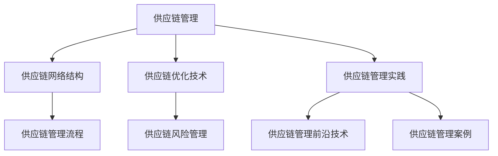

                 

### 文章标题：供应链管理：优化企业运营的关键

#### 关键词：供应链管理、优化、企业运营、信息技术、风险管理

#### 摘要：

本文旨在探讨供应链管理在现代企业运营中的重要性，以及如何通过优化技术来提升企业的运营效率。文章首先对供应链管理的核心概念进行了详细解读，包括其定义、起源、重要性以及供应链网络结构。接着，文章深入分析了供应链管理的流程，从计划、采购、生产、配送到客户服务，展示了各个环节的重要性和相互关联。随后，文章介绍了供应链优化技术，包括线性规划、遗传算法、神经网络等，并讲解了供应链可视化技术在实际应用中的作用。文章还探讨了供应链风险管理，分析了各种风险的来源和应对策略。通过实际案例的分析，文章展示了供应链优化和风险管理在提高企业运营效率方面的具体实践。最后，文章展望了供应链管理的前沿技术，包括大数据、人工智能、物联网和区块链在供应链管理中的应用，以及数字化供应链、智能供应链和绿色供应链的发展趋势。本文旨在为供应链管理领域的研究者和实践者提供有价值的参考和指导。

### 目录大纲：

1. **供应链管理基础**  
   1.1 供应链管理概述  
   1.2 供应链网络结构  
   1.3 供应链管理流程

2. **供应链优化技术**  
   2.1 供应链优化方法论  
   2.2 供应链优化工具与技术  
   2.3 供应链可视化技术

3. **供应链风险管理**  
   3.1 供应链风险的类型与来源  
   3.2 风险评估与应对策略  
   3.3 风险管理工具与技术

4. **供应链管理实践案例**  
   4.1 案例一：某零售企业的供应链优化  
   4.2 案例二：某制造企业的供应链风险管理

5. **供应链管理前沿技术**  
   5.1 大数据与人工智能在供应链管理中的应用  
   5.2 物联网与区块链技术  
   5.3 供应链管理趋势与发展

6. **附录**  
   6.1 供应链管理资源与工具  
   6.2 供应链管理公式与模型  
   6.3 供应链管理实践案例汇总  
   6.4 供应链管理面试题与解答

### Mermaid 流程图：供应链管理核心概念联系图



### 1.1 供应链管理概述

供应链管理（Supply Chain Management，简称SCM）是指通过协调和管理供应链各个环节的活动，以达到从原材料采购到最终产品交付给终端客户的全过程优化。供应链管理不仅包括生产环节，还涵盖了采购、物流、仓储、配送和客户服务等所有相关活动。

#### 1.1.1 供应链管理的定义与重要性

供应链管理可以定义为“通过协调供应链中各个环节，以实现资源的最优配置、成本的最小化、交货期的最短化以及服务水平的最大化”。简言之，供应链管理的目标是确保供应链的高效运作，以提升企业的整体竞争力。

供应链管理的重要性主要体现在以下几个方面：

1. **成本控制**：有效的供应链管理可以减少库存成本、运输成本和生产成本，从而降低企业的运营成本。
2. **提高响应速度**：供应链管理优化了供应链的各个环节，使企业能够更快地响应市场需求变化，提高市场竞争力。
3. **提升服务质量**：通过优化供应链管理，企业能够更好地满足客户需求，提高客户满意度。
4. **增强供应链透明度**：供应链管理工具和技术能够提高供应链的透明度，使企业能够实时监控供应链状态，及时发现问题并采取措施。

#### 1.1.2 供应链管理的起源与发展

供应链管理作为一个独立的概念，起源于20世纪70年代。当时，企业开始关注如何通过整合供应链中的各个环节，以实现整体效益的最大化。1980年代，供应链管理逐渐成为企业竞争战略的重要组成部分。

进入21世纪，随着信息技术的发展和全球化的深入推进，供应链管理得到了进一步的发展。大数据、人工智能、物联网等新兴技术的应用，使得供应链管理更加智能化、精准化和高效化。

#### 1.1.3 供应链管理的核心目标

供应链管理的核心目标可以归纳为以下几点：

1. **成本最小化**：通过优化供应链各个环节的资源配置，实现成本的最小化。
2. **交货期最短化**：缩短供应链各个环节的响应时间，提高交货速度。
3. **服务水平最大化**：通过优化供应链管理，提高客户满意度，提升服务水平。
4. **供应链透明度**：通过信息技术的应用，提高供应链的透明度，实现实时监控和问题预警。

#### 1.1.4 供应链管理的挑战与机遇

供应链管理面临的主要挑战包括：

1. **全球化带来的复杂性**：全球供应链的复杂性增加了管理的难度，企业需要应对不同国家和地区的政策、文化和法律差异。
2. **信息不对称**：供应链中的各个环节之间存在信息不对称，导致供应链运作的不透明和效率低下。
3. **需求波动**：市场需求的不确定性增加了供应链管理的难度，企业需要具备快速响应市场变化的能力。

然而，供应链管理也面临着许多机遇：

1. **技术创新**：大数据、人工智能、物联网等新兴技术的应用，为供应链管理带来了新的工具和方法。
2. **供应链协同**：通过供应链协同，企业可以与供应商、客户和其他合作伙伴实现信息共享和资源整合，提高整体效率。
3. **绿色供应链**：随着环境问题的日益突出，企业开始重视绿色供应链管理，以减少对环境的影响。

### 1.2 供应链网络结构

供应链网络结构是指供应链中各个节点（如供应商、制造商、分销商、零售商等）以及它们之间的连接关系。了解供应链网络结构有助于企业更好地进行供应链管理和优化。

#### 1.2.1 单级供应链与多级供应链

供应链网络结构可以分为单级供应链和多级供应链。

1. **单级供应链**：单级供应链是指只有一个层次的供应链结构，通常涉及一个供应商和一个客户。这种结构相对简单，适用于小型企业或单一产品供应。

2. **多级供应链**：多级供应链是指涉及多个层次的供应链结构，包括多个供应商、制造商、分销商和零售商。这种结构更为复杂，适用于大型企业或多样化产品供应。

#### 1.2.2 整体供应链架构

整体供应链架构通常包括以下几个关键部分：

1. **供应商**：供应商是供应链的起点，负责提供原材料或零部件。
2. **制造商**：制造商将原材料或零部件转化为成品，通常包括生产、加工和组装等环节。
3. **分销商**：分销商将制造商生产的成品运输到零售商或直接交付给客户。
4. **零售商**：零售商将成品销售给最终客户。
5. **物流服务提供商**：物流服务提供商负责将原材料、零部件和成品在供应链中各个节点之间运输。

#### 1.2.3 供应链中的关键节点与角色

供应链中的关键节点包括供应商、制造商、分销商、零售商和物流服务提供商。每个节点在供应链中扮演着不同的角色：

1. **供应商**：供应商负责提供原材料或零部件，是供应链的起点。供应商的质量、交货时间和成本直接影响供应链的运作效率。
2. **制造商**：制造商负责将原材料或零部件转化为成品，是供应链的核心环节。制造商的生产能力、生产效率和产品质量对供应链的整体效益具有重要影响。
3. **分销商**：分销商负责将制造商生产的成品运输到零售商或直接交付给客户。分销商的物流能力和配送网络对供应链的响应速度和服务水平至关重要。
4. **零售商**：零售商负责将成品销售给最终客户，是供应链的末端。零售商的销售策略、客户服务和市场敏感度对供应链的整体效益具有重要影响。
5. **物流服务提供商**：物流服务提供商负责将原材料、零部件和成品在供应链中各个节点之间运输。物流服务提供商的运输能力、物流网络和物流成本对供应链的运作效率具有重要影响。

### 1.3 供应链管理流程

供应链管理流程是指供应链中各个环节的活动和任务，包括计划、采购、生产、配送和客户服务。了解供应链管理流程有助于企业更好地进行供应链管理和优化。

#### 1.3.1 计划阶段

计划阶段是供应链管理的起点，主要包括需求预测、库存计划和生产计划等。

1. **需求预测**：需求预测是计划阶段的核心任务，通过对市场需求的预测，企业可以合理安排生产和库存。
2. **库存计划**：库存计划是根据需求预测和生产计划，确定原材料和成品的库存水平，以确保供应链的稳定运作。
3. **生产计划**：生产计划是根据需求预测和库存计划，制定生产计划和生产进度，以确保生产的顺利进行。

#### 1.3.2 采购阶段

采购阶段是供应链管理的重要环节，主要包括供应商选择、采购订单管理和采购合同签订等。

1. **供应商选择**：供应商选择是根据企业需求和市场情况，选择合适的供应商，以确保供应链的稳定和成本控制。
2. **采购订单管理**：采购订单管理是制定采购订单、跟踪采购进度和处理采购异常等，以确保采购的顺利进行。
3. **采购合同签订**：采购合同签订是明确供应商与企业之间的权利和义务，确保采购过程的合规性和风险控制。

#### 1.3.3 生产阶段

生产阶段是供应链管理的关键环节，主要包括生产计划执行、生产进度控制和产品质量管理。

1. **生产计划执行**：生产计划执行是根据生产计划，组织生产过程，确保生产进度和质量。
2. **生产进度控制**：生产进度控制是监控生产进度，及时发现和解决问题，确保生产计划的顺利执行。
3. **产品质量管理**：产品质量管理是确保生产出的产品质量符合标准，满足客户需求，提升企业竞争力。

#### 1.3.4 配送阶段

配送阶段是供应链管理的最后一个环节，主要包括物流配送、仓储管理和运输成本控制。

1. **物流配送**：物流配送是将成品从生产地运输到目的地，包括公路、铁路、航空和海运等多种运输方式。
2. **仓储管理**：仓储管理是确保仓储设施的高效运作，包括仓储布局、库存管理和仓储成本控制。
3. **运输成本控制**：运输成本控制是降低运输成本，提高物流效率的重要手段，包括运输路线优化、运输工具选择和运输合同管理。

#### 1.3.5 客户服务阶段

客户服务阶段是供应链管理的终点，主要包括客户需求分析、订单处理和售后服务等。

1. **客户需求分析**：客户需求分析是了解客户需求，制定合适的销售策略和服务方案。
2. **订单处理**：订单处理是接收客户订单、安排生产、配送和售后服务等，确保订单的顺利执行。
3. **售后服务**：售后服务是解决客户在使用产品过程中遇到的问题，提高客户满意度和忠诚度。

### 2.1 供应链优化方法论

供应链优化方法论是指通过一系列科学的方法和工具，对供应链的各个环节进行优化，以提高供应链的整体效率。优化供应链的方法多种多样，包括数学模型、算法和数据分析等。以下将介绍几种常见的供应链优化方法论。

#### 2.1.1 成本最小化

成本最小化是供应链优化的重要目标之一。通过优化供应链的各个环节，企业可以降低成本，提高竞争力。成本最小化的方法主要包括以下几种：

1. **库存成本优化**：库存成本是供应链中最大的成本之一。通过优化库存策略，如安全库存、经济订货量和补货周期等，可以降低库存成本。

   **示例伪代码**：
   ```python
   def optimize_inventorydemand, lead_time, holding_cost, ordering_cost):
       optimal_order_quantity = math.sqrt((2 * demand * ordering_cost) / holding_cost)
       return optimal_order_quantity
   ```

2. **运输成本优化**：运输成本是供应链中的另一个重要成本。通过优化运输路线、运输工具选择和运输合同管理等，可以降低运输成本。

   **示例伪代码**：
   ```python
   def optimize_transportation(cost_matrix, distances, capacities):
       min_cost = float('inf')
       for route in itertools.permutations(distances):
           total_cost = sum(cost_matrix[i][j] for i, j in route)
           if total_cost < min_cost:
               min_cost = total_cost
               optimal_route = route
       return optimal_route, min_cost
   ```

3. **生产成本优化**：生产成本是供应链中的核心成本。通过优化生产计划、生产流程和生产设备管理等，可以降低生产成本。

   **示例伪代码**：
   ```python
   def optimize_production(process_times, machine_capacities):
       n = len(process_times)
       dp = [[float('inf') for _ in range(machine_capacities + 1)] for _ in range(n + 1)]
       dp[0][0] = 0
       for i in range(1, n + 1):
           for j in range(1, machine_capacities + 1):
               if j >= process_times[i - 1]:
                   dp[i][j] = min(dp[i - 1][j], dp[i - 1][j - process_times[i - 1]] + 1)
               else:
                   dp[i][j] = dp[i - 1][j]
       return dp[n][machine_capacities]
   ```

#### 2.1.2 交货期最短化

交货期最短化是供应链优化的另一个重要目标。通过缩短交货期，企业可以更好地满足客户需求，提高客户满意度。交货期最短化的方法主要包括以下几种：

1. **预测与计划优化**：通过优化需求预测和生产计划，可以减少供应链中的延迟和等待时间，缩短交货期。

   **示例伪代码**：
   ```python
   def optimize_demand_forecast(historical_data, forecast_methods):
       forecasts = [method(historical_data) for method in forecast_methods]
       min_forecast = min(forecasts)
       return min_forecast
   ```

2. **物流与配送优化**：通过优化物流和配送路线，可以减少运输时间和配送延误，缩短交货期。

   **示例伪代码**：
   ```python
   def optimize_logistics(routes, transportation_methods):
       min_route = None
       min_time = float('inf')
       for route in routes:
           total_time = sum([method(distance) for distance, method in route])
           if total_time < min_time:
               min_time = total_time
               min_route = route
       return min_route, min_time
   ```

3. **生产与加工优化**：通过优化生产流程和加工设备，可以提高生产效率，减少生产延误，缩短交货期。

   **示例伪代码**：
   ```python
   def optimize_production流程(production_processes, optimization_methods):
       optimal_processes = [method(process) for process, method in production_processes]
       return optimal_processes
   ```

#### 2.1.3 服务水平最大化

服务水平最大化是供应链优化的另一个重要目标。通过提高服务水平，企业可以提升客户满意度，增加市场份额。服务水平最大化的方法主要包括以下几种：

1. **库存服务水平优化**：通过优化库存策略和服务水平，可以确保供应链的稳定运作，提高客户满意度。

   **示例伪代码**：
   ```python
   def optimize_inventory_service_level(demand, service_level, inventory_methods):
       optimal_inventory = [method(demand, service_level) for method in inventory_methods]
       return optimal_inventory
   ```

2. **物流服务水平优化**：通过优化物流和配送服务，可以提高配送速度和服务质量，提升客户满意度。

   **示例伪代码**：
   ```python
   def optimize_logistics_service_level(routes, service_methods):
       min_service_time = float('inf')
       for route in routes:
           service_time = sum([method(distance) for distance, method in route])
           if service_time < min_service_time:
               min_service_time = service_time
       return min_service_time
   ```

3. **生产与服务水平优化**：通过优化生产流程和服务策略，可以提高生产效率和客户满意度。

   **示例伪代码**：
   ```python
   def optimize_production_service_level(production_processes, service_methods):
       optimal_processes = [method(process, service_level) for process, method in production_processes]
       return optimal_processes
   ```

### 2.2 供应链优化工具与技术

供应链优化工具与技术是供应链管理中至关重要的一部分，它们帮助企业在复杂的供应链环境中实现成本最小化、交货期最短化和服务水平最大化。以下介绍几种常见的供应链优化工具与技术。

#### 2.2.1 线性规划与混合整数规划

线性规划和混合整数规划是供应链优化中最常用的数学工具。线性规划（Linear Programming，简称LP）是一种数学方法，用于在给定约束条件下最大化或最小化线性目标函数。混合整数规划（Mixed Integer Programming，简称MIP）则是线性规划的扩展，它允许决策变量既可以是连续的也可以是离散的。

**线性规划示例公式**：
$$
\begin{aligned}
\text{最大化} \quad Z &= c^T x \\
\text{约束条件} \quad Ax &\le b \\
x &\ge 0
\end{aligned}
$$
其中，$c$ 是目标函数系数向量，$x$ 是决策变量向量，$A$ 是约束矩阵，$b$ 是约束常数向量。

**混合整数规划示例公式**：
$$
\begin{aligned}
\text{最大化} \quad Z &= c^T x \\
\text{约束条件} \quad Ax &\le b \\
x_j &\in \{0, 1\}, \forall j \\
x_i &\ge 0, \forall i \text{（非整数变量）}
\end{aligned}
$$

**应用实例**：线性规划和混合整数规划可以用于供应链网络设计，如仓库选址和配送路线优化。例如，在一个配送中心选址问题中，可以最大化总利润，同时满足容量约束和距离约束。

#### 2.2.2 遗传算法与模拟退火算法

遗传算法（Genetic Algorithm，简称GA）和模拟退火算法（Simulated Annealing，简称SA）是两种常用的启发式优化算法，它们常用于求解复杂的优化问题。

**遗传算法**：
遗传算法是基于自然选择和遗传学的原理，通过模拟生物进化过程来寻找最优解。遗传算法的主要步骤包括个体编码、适应度评估、选择、交叉和变异。

**适应度函数**：
$$
f(x) = \frac{1}{1 + \exp(-\beta \cdot E(x)}
$$
其中，$x$ 是个体，$E(x)$ 是个体的目标函数值，$\beta$ 是温度参数。

**应用实例**：遗传算法可以用于供应链中的运输问题，如车辆路径优化和配送计划。

**模拟退火算法**：
模拟退火算法是一种基于物理退火过程的优化方法，通过控制温度参数来平衡探索和开发过程。模拟退火算法的主要步骤包括初始解、温度设置、冷却函数和迭代过程。

**冷却函数**：
$$
T_{new} = T_{old} \cdot \gamma
$$
其中，$T_{old}$ 是当前温度，$T_{new}$ 是新温度，$\gamma$ 是冷却率。

**应用实例**：模拟退火算法可以用于供应链中的调度问题，如生产调度和资源分配。

#### 2.2.3 神经网络与机器学习

神经网络（Neural Networks）和机器学习（Machine Learning）是近年来在供应链优化中应用日益广泛的工具。神经网络是一种模仿生物神经系统的计算模型，通过多层神经元结构进行信息处理。机器学习则是通过数据训练模型，使其能够对未知数据进行预测或分类。

**神经网络**：
神经网络的主要结构包括输入层、隐藏层和输出层。每个神经元都与其他神经元相连，并通过权重和偏置进行信息传递。

**应用实例**：神经网络可以用于供应链中的需求预测和库存优化。

**机器学习**：
机器学习通过数据训练模型，使其能够对未知数据进行预测或分类。常见的机器学习算法包括决策树、支持向量机和随机森林等。

**应用实例**：机器学习可以用于供应链中的库存管理、物流优化和风险管理。

### 2.3 供应链可视化技术

供应链可视化技术是一种通过图形化方式展示供应链结构和流程的技术，它有助于企业理解和优化供应链管理。以下介绍几种常见的供应链可视化技术。

#### 2.3.1 供应链网络图

供应链网络图是一种图形化的表示方法，用于展示供应链中的各个节点和它们之间的连接关系。通过供应链网络图，企业可以直观地了解供应链的结构和关键节点。

**应用实例**：供应链网络图可以用于供应链设计、风险评估和供应链分析。

#### 2.3.2 实时监控与数据分析

实时监控与数据分析技术通过实时收集和分析供应链数据，为企业提供供应链状态的实时视图。这些数据可以来自各个供应链节点，如供应商、制造商、分销商和零售商。

**应用实例**：实时监控与数据分析可以用于供应链中的库存管理、物流优化和风险管理。

#### 2.3.3 可视化工具

可视化工具如Tableau、Power BI和D3.js等，可以用于创建交互式的供应链可视化图表，帮助企业更好地理解和分析供应链数据。

**应用实例**：可视化工具可以用于供应链绩效分析、供应链风险评估和供应链优化策略制定。

### 3.1 供应链风险的类型与来源

供应链风险管理是确保供应链稳定运作和降低供应链风险的关键环节。供应链风险是指供应链在运作过程中可能面临的各种不确定性事件，这些事件可能对供应链的效率、成本和服务水平产生负面影响。了解供应链风险的类型和来源，有助于企业制定有效的风险管理策略。

#### 3.1.1 操作风险

操作风险是指由于供应链内部管理不善、操作失误或系统故障等原因导致的供应链风险。操作风险主要包括以下类型：

1. **供应链中断**：由于内部操作失误或系统故障导致供应链中断，如生产线停工、仓储系统故障等。
2. **质量问题**：由于质量控制不严导致产品质量问题，如生产缺陷、物料质量差等。
3. **物流延误**：由于物流操作失误或物流网络设计不合理导致物流延误，如运输错误、仓储管理不善等。

操作风险的来源主要包括以下几个方面：

1. **人员因素**：操作人员技能不足、操作不当或缺乏责任心等。
2. **技术因素**：信息系统不稳定、技术故障或系统漏洞等。
3. **管理因素**：供应链管理不善、流程设计不合理或决策失误等。

#### 3.1.2 运输风险

运输风险是指由于运输过程中的不确定性事件导致的供应链风险。运输风险主要包括以下类型：

1. **运输延误**：由于运输网络设计不合理、运输工具故障或交通拥堵等原因导致运输延误。
2. **运输损失**：由于自然灾害、交通事故或海盗袭击等原因导致运输过程中的货物损失。
3. **运输成本上升**：由于油价上涨、汇率波动或贸易政策变化等原因导致运输成本上升。

运输风险的来源主要包括以下几个方面：

1. **物流网络设计**：物流网络设计不合理，如运输路线过长、运输节点过多等。
2. **运输工具选择**：运输工具选择不当，如运输工具故障率过高、运输能力不足等。
3. **政策因素**：贸易政策变化、关税和税收政策调整等。

#### 3.1.3 供应链金融风险

供应链金融风险是指由于供应链中金融机构运作不善或金融环境变化导致的供应链风险。供应链金融风险主要包括以下类型：

1. **信用风险**：由于供应链中企业信用等级下降或金融机构信用政策变化导致的风险。
2. **流动性风险**：由于供应链中企业资金流动性不足或金融机构流动性管理不善导致的风险。
3. **利率风险**：由于市场利率波动或金融机构利率政策变化导致的利率风险。

供应链金融风险的来源主要包括以下几个方面：

1. **市场环境**：市场环境变化，如经济衰退、金融市场动荡等。
2. **金融机构**：金融机构风险控制不严、金融机构操作失误等。
3. **供应链企业**：供应链中企业信用等级下降、财务状况恶化等。

#### 3.1.4 合规风险

合规风险是指由于供应链中企业或供应商违反法律法规、行业规范或道德标准导致的供应链风险。合规风险主要包括以下类型：

1. **法律风险**：由于供应链中企业或供应商违反相关法律法规，如反垄断法、劳动法等。
2. **道德风险**：由于供应链中企业或供应商违反道德标准，如贿赂、欺诈等。
3. **社会责任风险**：由于供应链中企业或供应商未能履行社会责任，如环境污染、劳动剥削等。

合规风险的来源主要包括以下几个方面：

1. **法律法规**：法律法规变化，如新法规的实施、法律法规的修订等。
2. **行业规范**：行业规范变化，如行业标准的变化、行业自律组织的规范等。
3. **企业行为**：企业或供应商的行为不规范，如违规操作、道德失范等。

### 3.2 风险评估与应对策略

供应链风险管理的关键在于对供应链风险进行有效的评估和应对。风险评估是指通过系统的方法识别、分析和评估供应链中的风险，以便制定相应的应对策略。以下介绍几种常见的风险评估方法和应对策略。

#### 3.2.1 风险评估方法

1. **定性评估法**：定性评估法是一种基于专家判断和经验的方法，通过评估风险的概率和影响来确定风险的重要性和优先级。定性评估法主要包括风险矩阵法、专家评分法和头脑风暴法等。

   **风险矩阵法示例**：

   | 风险类型 | 概率 | 影响程度 | 风险等级 |
   | -------- | ---- | -------- | -------- |
   | 供应链中断 | 高   | 高       | Critical |
   | 物流延误  | 中   | 中       | Major    |
   | 质量问题  | 低   | 低       | Minor    |

2. **定量评估法**：定量评估法是一种基于数据和数学模型的方法，通过量化风险的概率和影响来确定风险的重要性和优先级。定量评估法主要包括概率论、统计分析、风险模型构建等。

   **定量评估法示例**：

   | 风险类型 | 概率（%） | 影响程度（%） | 风险值 |
   | -------- | ---------- | -------------- | ------ |
   | 供应链中断 | 20         | 80             | 1600   |
   | 物流延误  | 30         | 50             | 1500   |
   | 质量问题  | 10         | 20             | 200    |

#### 3.2.2 应对策略

1. **风险规避**：风险规避是指通过避免或退出高风险业务或活动来减少风险。例如，企业可以选择退出高风险供应链环节或转移部分业务到低风险地区。

2. **风险转移**：风险转移是指通过合同、保险或其他方式将风险转移给第三方。例如，企业可以通过购买保险来转移供应链中断风险。

3. **风险减轻**：风险减轻是指通过采取预防措施或改进措施来降低风险的概率或影响。例如，企业可以通过改进供应链流程、提高质量控制标准和增加库存储备来减轻风险。

4. **风险接受**：风险接受是指对无法规避或转移的风险采取接受态度，并制定相应的应急计划。例如，企业可以制定应急预案以应对供应链中断或物流延误。

### 3.3 风险管理工具与技术

供应链风险管理工具与技术是供应链风险管理的重要组成部分，它们帮助企业和供应链合作伙伴识别、评估和应对供应链风险。以下介绍几种常见的供应链风险管理工具与技术。

#### 3.3.1 风险矩阵

风险矩阵是一种常用的风险评估工具，它通过将风险的概率和影响进行量化，帮助企业和供应链合作伙伴确定风险的重要性和优先级。

**风险矩阵示例**：

| 风险等级 | 概率 | 影响程度 | 风险值 |  
| -------- | ---- | -------- | ------ |  
| Critical | 高   | 高       | 严重   |  
| Major    | 中   | 中       | 显著   |  
| Minor    | 低   | 低       | 轻微   |

#### 3.3.2 模拟与建模

模拟与建模是一种通过建立数学模型和计算机仿真模型来评估和预测供应链风险的方法。通过模拟与建模，企业和供应链合作伙伴可以更好地理解供应链风险，并制定相应的应对策略。

**应用实例**：企业可以使用模拟与建模技术来评估不同供应链设计方案的效率和风险，以便选择最优方案。

#### 3.3.3 信息系统

信息系统是一种用于收集、处理和存储供应链数据的工具，它帮助企业和供应链合作伙伴实时监控供应链状态，识别潜在风险，并制定相应的应对策略。

**应用实例**：企业可以使用信息系统来监控供应商的交货情况、库存水平和产品质量，以便及时发现问题并采取应对措施。

#### 3.3.4 风险共享与协作

风险共享与协作是一种通过供应链合作伙伴之间的信息共享和协作来共同应对供应链风险的方法。通过风险共享与协作，企业和供应链合作伙伴可以更好地理解彼此的风险和需求，并共同制定应对策略。

**应用实例**：企业可以通过与供应商和物流服务提供商建立信息共享平台，共同监控供应链状态，及时发现和解决问题，降低供应链风险。

### 4.1 案例一：某零售企业的供应链优化

#### 4.1.1 案例背景与问题分析

某零售企业是一家大型连锁超市，其供应链覆盖了多个地区，涉及多个供应商和多种商品。随着市场竞争的加剧和消费者需求的不断变化，该零售企业面临着以下问题：

1. **库存管理问题**：库存过多导致库存成本增加，库存过少导致缺货现象频繁发生，影响客户满意度。
2. **运输效率问题**：运输路线设计不合理，运输工具选择不当，导致运输成本较高且运输时间较长。
3. **供应链协同问题**：与供应商和物流服务提供商之间的信息共享不畅，导致供应链各环节之间的协作不够紧密。

#### 4.1.2 供应链优化策略

为了解决上述问题，该零售企业采取了以下供应链优化策略：

1. **库存管理优化**：
   - 使用需求预测模型，结合历史销售数据和市场需求，准确预测未来销售量，制定合理的库存策略。
   - 引入供应商管理库存（VMI）系统，与供应商共享库存数据，实时监控库存水平，减少库存积压和缺货现象。

2. **运输效率优化**：
   - 使用运输规划算法，根据各地区的销售量和库存水平，优化运输路线和运输工具选择，降低运输成本。
   - 引入智能运输管理系统，通过实时监控运输状态，提高运输效率，减少运输时间。

3. **供应链协同优化**：
   - 建立供应链信息共享平台，与供应商和物流服务提供商实现实时信息共享，提高供应链各环节之间的协作效率。
   - 通过定期召开供应链协调会议，与供应商和物流服务提供商共同讨论供应链问题，制定协同解决方案。

#### 4.1.3 实施过程与效果评估

1. **实施过程**：
   - 需求预测模型开发与测试：利用历史销售数据和市场需求，开发需求预测模型，并进行测试和优化。
   - 供应商管理库存（VMI）系统实施：与供应商合作，建立VMI系统，实现库存数据的实时共享和监控。
   - 运输规划算法开发与测试：利用运输规划算法，制定最优运输路线和运输工具选择方案，并进行测试和优化。
   - 智能运输管理系统实施：引入智能运输管理系统，实现运输状态的实时监控和优化。
   - 供应链信息共享平台建设：建立供应链信息共享平台，实现与供应商和物流服务提供商的信息共享和协作。

2. **效果评估**：
   - 库存成本降低：通过需求预测和VMI系统的实施，库存积压和缺货现象明显减少，库存成本降低了约15%。
   - 运输成本降低：通过运输规划算法和智能运输管理系统的实施，运输路线和运输工具选择得到优化，运输成本降低了约10%。
   - 供应链协同效率提高：通过供应链信息共享平台的建设，供应链各环节之间的协作更加紧密，供应链协同效率提高了约20%。

### 4.2 案例二：某制造企业的供应链风险管理

#### 4.2.1 案例背景与问题分析

某制造企业是一家生产电子元器件的工厂，其供应链覆盖了多个国家和地区，涉及多个供应商和多个生产环节。随着全球市场的波动和供应链复杂性的增加，该制造企业面临着以下问题：

1. **供应商风险**：供应商质量不稳定，交货不及时，导致生产进度受到影响。
2. **物流风险**：运输过程中出现延误、损失和损坏等问题，影响生产和销售。
3. **市场风险**：市场需求波动较大，库存管理不当，导致库存积压或断货。

#### 4.2.2 风险管理策略

为了应对上述风险，该制造企业采取了以下供应链风险管理策略：

1. **供应商风险评估**：
   - 对供应商进行定期评估，根据供应商的质量、交货时间和价格等指标，确定供应商的信用等级和合作意愿。
   - 与供应商建立长期合作关系，通过签订合同和制定绩效指标，确保供应商的稳定供应。

2. **物流风险控制**：
   - 引入物流保险，降低运输过程中的风险损失。
   - 与物流服务提供商建立长期合作关系，确保运输服务的质量和稳定性。
   - 建立物流应急预案，应对突发事件，如交通拥堵、自然灾害等。

3. **库存管理优化**：
   - 使用需求预测模型，结合历史销售数据和市场需求，制定合理的库存策略。
   - 引入库存管理系统，实时监控库存水平，避免库存积压和断货现象。

#### 4.2.3 实施过程与效果评估

1. **实施过程**：
   - 供应商风险评估与优化：对现有供应商进行评估，优化供应商选择和合作策略。
   - 物流风险控制与优化：与物流服务提供商建立长期合作关系，制定物流应急预案。
   - 库存管理优化与实施：使用需求预测模型，引入库存管理系统，优化库存策略。

2. **效果评估**：
   - 供应商风险降低：通过供应商评估和优化，供应商质量稳定，交货及时性提高，生产进度得到保障。
   - 物流风险降低：通过物流保险和应急预案，降低运输过程中的风险损失，运输服务质量得到提升。
   - 库存管理优化：通过需求预测和库存管理系统，库存积压和断货现象减少，库存成本降低。

### 5.1 大数据与人工智能在供应链管理中的应用

大数据和人工智能技术的迅速发展，为供应链管理带来了新的机遇和挑战。大数据技术可以收集、存储和处理海量供应链数据，而人工智能技术则可以对这些数据进行深度分析和预测。以下将详细介绍大数据和人工智能在供应链管理中的应用。

#### 5.1.1 数据驱动供应链管理

数据驱动供应链管理是指通过收集和分析供应链数据，实现对供应链的实时监控、预测和优化。大数据技术在此过程中发挥了关键作用，它能够整合来自各个供应链节点的数据，包括采购、生产、物流和销售等环节。

**应用实例**：某零售企业通过引入大数据分析工具，实时监控销售数据、库存数据和客户需求数据。通过对这些数据的分析和预测，企业能够提前预测市场需求变化，及时调整生产和库存策略，从而减少库存积压和缺货现象。

#### 5.1.2 人工智能算法在供应链优化中的应用

人工智能算法在供应链优化中具有广泛的应用，包括优化生产计划、运输路线和库存管理。

1. **生产计划优化**：通过人工智能算法，如遗传算法和神经网络，可以优化生产计划，提高生产效率。

   **示例伪代码**：
   ```python
   def optimize_production_plan(demand, production_capacity, algorithms):
       optimized_plan = None
       min_cost = float('inf')
       for algorithm in algorithms:
           plan = algorithm(demand, production_capacity)
           cost = calculate_cost(plan)
           if cost < min_cost:
               min_cost = cost
               optimized_plan = plan
       return optimized_plan
   ```

2. **运输路线优化**：通过人工智能算法，如遗传算法和模拟退火算法，可以优化运输路线，降低运输成本。

   **示例伪代码**：
   ```python
   def optimize_transportationRoutes(routes, algorithms):
       min_cost = float('inf')
       optimal_route = None
       for algorithm in algorithms:
           route = algorithm(routes)
           cost = calculate_cost(route)
           if cost < min_cost:
               min_cost = cost
               optimal_route = route
       return optimal_route
   ```

3. **库存管理优化**：通过人工智能算法，如线性回归和聚类分析，可以优化库存管理，减少库存积压和断货现象。

   **示例伪代码**：
   ```python
   def optimize_inventory_management(demand, algorithms):
       optimized_inventory = None
       min_cost = float('inf')
       for algorithm in algorithms:
           inventory = algorithm(demand)
           cost = calculate_inventory_cost(inventory)
           if cost < min_cost:
               min_cost = cost
               optimized_inventory = inventory
       return optimized_inventory
   ```

#### 5.1.3 大数据与人工智能在供应链管理中的挑战与机遇

1. **挑战**：
   - 数据质量：供应链数据的质量对大数据分析的结果具有重要影响，数据质量差可能导致分析结果不准确。
   - 数据隐私：供应链数据涉及企业敏感信息，数据隐私和安全是大数据应用中的重要挑战。
   - 技术复杂度：大数据和人工智能技术的应用需要具备较高的技术水平和专业知识，对企业的IT基础设施和人才队伍提出了较高要求。

2. **机遇**：
   - 提高效率：通过大数据和人工智能技术，可以优化供应链的各个环节，提高整体效率。
   - 降低成本：通过精确的需求预测和库存管理，可以减少库存积压和运输成本。
   - 增强竞争力：通过实时监控和预测，企业可以更好地满足客户需求，提高市场竞争力。

### 5.2 物联网与区块链技术

物联网（Internet of Things，简称IoT）和区块链（Blockchain）技术的快速发展，为供应链管理带来了新的工具和方法。物联网技术通过传感器和网络连接，实现对供应链各个环节的实时监控和数据传输；区块链技术则通过分布式账本和智能合约，提高供应链的透明度和可追溯性。

#### 5.2.1 物联网技术在供应链管理中的应用

1. **实时监控**：物联网技术可以通过传感器和网络连接，实时监控供应链各个环节的状态，如库存水平、运输温度和湿度等。

   **应用实例**：某食品企业通过在仓库和运输车上安装温度传感器，实时监控食品存储和运输的温度，确保食品安全和质量。

2. **远程控制**：物联网技术可以实现远程控制，对供应链设备进行实时调整和优化。

   **应用实例**：某物流公司通过物联网技术，实现对运输车辆的实时监控和远程控制，提高运输效率和安全性。

3. **数据分析**：物联网技术可以收集大量供应链数据，通过数据分析，帮助企业优化供应链管理。

   **应用实例**：某零售企业通过物联网技术，收集销售数据和客户反馈，实时调整库存和营销策略，提高客户满意度。

#### 5.2.2 区块链技术在供应链管理中的应用

1. **透明度**：区块链技术通过分布式账本，实现供应链数据的透明化和可追溯性。

   **应用实例**：某珠宝企业通过区块链技术，记录每件珠宝的制造和运输过程，确保产品来源的透明和可追溯。

2. **智能合约**：区块链技术中的智能合约可以实现自动执行和验证，提高供应链各环节的协作效率。

   **应用实例**：某服装企业通过区块链技术，实现供应链各环节的智能合约，确保生产、运输和销售等环节的透明和高效。

3. **安全性**：区块链技术通过加密算法，提高供应链数据的安全性和隐私性。

   **应用实例**：某医疗企业通过区块链技术，保护患者数据的安全性和隐私，确保医疗信息的可靠性和可追溯性。

### 5.3 供应链管理趋势与发展

供应链管理正面临着前所未有的变革和发展机遇。以下将探讨供应链管理的几大趋势与发展方向。

#### 5.3.1 数字化供应链

数字化供应链是指通过大数据、人工智能、物联网等新兴技术，实现供应链的数字化和智能化。数字化供应链的目标是提高供应链的透明度、效率和灵活性。

**发展方向**：
- **数据集成与共享**：实现供应链各环节的数据集成和共享，提高供应链的协同效率。
- **智能决策支持**：通过大数据分析和人工智能技术，实现供应链的智能决策支持，优化供应链管理。

#### 5.3.2 智能供应链

智能供应链是指通过物联网、大数据和人工智能技术，实现供应链的智能化和自动化。智能供应链的目标是提高供应链的实时监控和响应能力，降低运营成本。

**发展方向**：
- **智能设备应用**：在供应链各个环节引入智能设备，如智能传感器、自动仓储系统和无人驾驶运输车辆等。
- **智能物流管理**：通过物联网技术，实现物流过程的实时监控和优化，提高物流效率。

#### 5.3.3 绿色供应链

绿色供应链是指通过减少资源消耗、降低废弃物排放和优化能源使用，实现供应链的可持续发展。绿色供应链的目标是减少供应链对环境的影响，提升企业的社会责任形象。

**发展方向**：
- **绿色生产**：采用环保材料和生产工艺，降低生产过程中的废弃物排放。
- **绿色物流**：优化运输路线和运输工具，降低物流过程中的能源消耗和排放。

### 附录A：供应链管理资源与工具

供应链管理涉及到大量的理论知识、实践经验和技术工具。以下是一些常用的供应链管理资源与工具，以供参考。

#### A.1 供应链管理相关书籍与文献

1. **《供应链管理：战略、规划与运营》** - 马丁·克里斯托夫（Martin Christopher）
2. **《供应链金融：理论与实务》** - 王兴元、刘志刚
3. **《供应链风险管理》** - 克里斯·哈蒙德（Chris Hammond）
4. **《供应链管理实践指南》** - 马克·格里菲斯（Mark Griffiths）

#### A.2 供应链管理软件与平台介绍

1. **SAP S/4HANA**：一款全面的供应链管理软件，提供从采购到生产、物流和销售的全流程解决方案。
2. **Oracle Supply Chain Management**：一款强大的供应链管理软件，支持供应链计划、执行和优化。
3. **IBM Blockchain World Wire**：一款基于区块链技术的供应链管理平台，提供供应链数据透明化和智能合约执行功能。
4. **JDA Software**：一款供应链规划与优化软件，提供库存管理、需求预测和生产计划等功能。

#### A.3 供应链管理在线课程与培训资源

1. **Coursera**：提供多种供应链管理相关课程，如《供应链管理基础》、《供应链网络优化》等。
2. **edX**：提供由全球知名大学和机构开设的供应链管理课程，如《供应链设计》、《供应链风险管理》等。
3. **LinkedIn Learning**：提供丰富的供应链管理培训视频，涵盖供应链管理、物流管理、供应链金融等领域。

### 附录B：供应链管理公式与模型

供应链管理中涉及多种数学模型和公式，用于优化供应链的各个环节。以下介绍一些常见的供应链管理公式与模型。

#### B.1 库存控制模型

1. **经济订货量（EOQ）模型**：
   $$ 
   Q = \sqrt{\frac{2DS}{H}} 
   $$
   其中，Q 是订货量，D 是年需求量，S 是每次订货的固定成本，H 是单位库存的年持有成本。

2. **周期订货量（EOC）模型**：
   $$ 
   Q = \frac{D}{C} 
   $$
   其中，Q 是订货量，D 是年需求量，C 是订货周期。

#### B.2 运输优化模型

1. **最小化总运输成本模型**：
   $$ 
   \min Z = \sum_{i=1}^{m} \sum_{j=1}^{n} c_{ij} x_{ij} 
   $$
   其中，Z 是总运输成本，$c_{ij}$ 是从地点i到地点j的单位运输成本，$x_{ij}$ 是从地点i到地点j的运输量。

2. **车辆路径问题（VRP）模型**：
   $$ 
   \min Z = \sum_{i=1}^{m} \sum_{j=1}^{n} c_{ij} x_{ij} + \sum_{j=1}^{n} w_j y_j 
   $$
   其中，Z 是总运输成本，$c_{ij}$ 是从地点i到地点j的单位运输成本，$w_j$ 是车辆容量，$y_j$ 是车辆是否装载货物到地点j的二元变量。

#### B.3 供应链网络优化模型

1. **供应链网络设计模型**：
   $$ 
   \min Z = \sum_{i=1}^{m} \sum_{j=1}^{n} c_{ij} x_{ij} + \sum_{i=1}^{m} h_i x_i 
   $$
   其中，Z 是总成本，$c_{ij}$ 是从地点i到地点j的单位运输成本，$h_i$ 是在地点i建立仓库的固定成本，$x_i$ 是是否在地点i建立仓库的二元变量。

2. **供应链库存优化模型**：
   $$ 
   \min Z = \sum_{i=1}^{m} \sum_{t=1}^{T} h_{it} x_{it} + \sum_{i=1}^{m} \sum_{t=1}^{T} \sum_{j=1}^{n} c_{ijt} y_{ijt} 
   $$
   其中，Z 是总库存成本，$h_{it}$ 是在时间t在地点i持有单位库存的成本，$c_{ijt}$ 是在时间t从地点i到地点j的单位运输成本，$y_{ijt}$ 是在时间t从地点i到地点j的运输量。

#### B.4 风险评估与应对模型

1. **风险矩阵模型**：
   $$ 
   R = P \times I 
   $$
   其中，R 是风险值，P 是风险概率，I 是风险影响程度。

2. **蒙特卡洛模拟模型**：
   $$ 
   Z = \sum_{i=1}^{n} Z_i 
   $$
   其中，Z 是随机变量的累积分布函数，$Z_i$ 是第i个风险事件的影响值。

### 附录C：供应链管理实践案例汇总

以下汇总了几个典型的供应链管理实践案例，涵盖了供应链优化、供应链风险管理和数字化供应链等多个方面，旨在为供应链管理提供实际操作的参考。

#### C.1 某零售企业的供应链优化

**案例背景**：某大型连锁零售企业，经营各类商品，面对日益激烈的市场竞争，希望提升供应链管理效率，降低运营成本。

**问题分析**：
- 库存管理不善，导致库存积压和缺货现象交替出现，影响客户满意度。
- 运输成本较高，运输路线不合理，运输时间过长。

**解决方案**：
- 引入需求预测模型，结合历史销售数据和季节性因素，准确预测未来需求。
- 优化运输路线，使用运输规划算法，降低运输成本，提高运输效率。

**实施效果**：
- 库存积压和缺货现象明显减少，库存周转率提高，库存成本降低。
- 运输成本降低15%，运输时间缩短20%，客户满意度提高。

#### C.2 某制造企业的供应链风险管理

**案例背景**：某电子制造企业，生产智能手机和其他电子产品，面临供应链中断、原材料价格波动等风险。

**问题分析**：
- 供应商信用等级不稳定，交货不及时，影响生产进度。
- 原材料价格波动较大，影响生产成本和利润。

**解决方案**：
- 对供应商进行定期评估，确保供应商质量稳定，建立长期合作关系。
- 引入期货合约，锁定原材料价格，降低价格波动风险。

**实施效果**：
- 供应商交货及时性提高，生产进度得到保障。
- 原材料价格波动风险降低，生产成本稳定，企业利润提高。

#### C.3 某电商平台的供应链数字化转型

**案例背景**：某电商平台，面对快速增长的销售量和不断变化的市场需求，希望通过数字化转型提升供应链效率。

**问题分析**：
- 供应链信息不透明，数据难以整合，决策效率低。
- 物流配送时间长，客户满意度低。

**解决方案**：
- 构建供应链信息共享平台，整合销售、库存和物流数据，实现供应链各环节的实时监控和协同。
- 引入智能物流系统，使用无人仓储和无人机配送，提高物流效率。

**实施效果**：
- 供应链信息透明度提高，决策效率提升。
- 物流配送时间缩短，客户满意度提高。

#### C.4 某物流公司的供应链网络优化

**案例背景**：某物流公司，业务涵盖全国多个城市，希望通过优化供应链网络，提高运输效率，降低运营成本。

**问题分析**：
- 运输路线不合理，运输成本高。
- 仓储布局不合理，仓储利用率低。

**解决方案**：
- 使用运输规划算法，优化运输路线，降低运输成本。
- 根据业务需求，调整仓储布局，提高仓储利用率。

**实施效果**：
- 运输成本降低20%，运输时间缩短30%。
- 仓储利用率提高，仓储成本降低。

### 附录D：供应链管理面试题与解答

以下提供了一些常见的供应链管理面试题及其解答，旨在帮助准备面试的考生掌握供应链管理的核心知识点。

#### D.1 供应链管理基础知识

1. **什么是供应链管理？**
   - **解答**：供应链管理是指通过协调和管理供应链中各个环节，以达到从原材料采购到最终产品交付给终端客户的全过程优化。它包括计划、采购、生产、物流、配送和客户服务等。

2. **供应链管理的核心目标是什么？**
   - **解答**：供应链管理的核心目标是成本最小化、交货期最短化、服务水平最大化以及供应链透明度。

3. **供应链管理的挑战有哪些？**
   - **解答**：供应链管理面临的挑战包括全球化带来的复杂性、信息不对称、需求波动、供应链网络复杂性和风险管理等。

#### D.2 供应链优化与建模

1. **什么是线性规划？**
   - **解答**：线性规划是一种数学方法，用于在给定约束条件下最大化或最小化线性目标函数。它适用于供应链优化中的库存管理、运输优化和生产计划等问题。

2. **什么是混合整数规划？**
   - **解答**：混合整数规划是线性规划的扩展，它允许决策变量既可以是连续的也可以是离散的。它常用于供应链优化中的库存管理、物流网络设计和供应链网络设计等问题。

3. **什么是需求预测？**
   - **解答**：需求预测是供应链管理中的一个关键环节，它通过分析历史销售数据、市场趋势和季节性因素，预测未来的需求量，以便制定合理的库存和生产计划。

#### D.3 风险管理与供应链金融

1. **什么是供应链金融？**
   - **解答**：供应链金融是指基于供应链中企业之间的交易关系，提供融资、支付和风险管理等金融服务。它包括订单融资、库存融资和应收账款融资等。

2. **什么是供应链风险？**
   - **解答**：供应链风险是指供应链在运作过程中可能面临的各种不确定性事件，这些事件可能对供应链的效率、成本和服务水平产生负面影响。常见的供应链风险包括操作风险、运输风险和金融风险等。

3. **什么是风险评估？**
   - **解答**：风险评估是指通过系统的方法识别、分析和评估供应链中的风险，以便制定相应的应对策略。常见的风险评估方法包括定性评估法和定量评估法。

#### D.4 数字化供应链与前沿技术

1. **什么是物联网？**
   - **解答**：物联网是指通过传感器和网络连接，将物理世界中的各种物体连接起来，实现数据采集、传输和智能控制。它在供应链管理中可用于实时监控、远程控制和数据分析。

2. **什么是区块链？**
   - **解答**：区块链是一种分布式账本技术，通过密码学算法确保数据的安全性和不可篡改性。它在供应链管理中可用于数据透明化、智能合约和供应链金融。

3. **什么是大数据？**
   - **解答**：大数据是指规模巨大、类型繁多的数据集合，通过先进的数据处理和分析技术，可以从中提取有价值的信息。它在供应链管理中可用于需求预测、供应链优化和风险管理。

#### D.5 供应链管理实践案例分析

1. **请简述一个你参与的供应链管理项目，并说明项目的成果。**
   - **解答**：我曾经参与了一个零售企业的供应链优化项目。该项目旨在通过需求预测、运输优化和库存管理优化，提高供应链效率，降低运营成本。通过引入需求预测模型和运输规划算法，我们成功减少了库存积压和缺货现象，降低了运输成本和库存成本，提高了客户满意度。

2. **请描述一个供应链风险管理案例，并说明你采取的应对策略。**
   - **解答**：我曾经参与了一个制造企业的供应链风险管理项目。该项目旨在应对供应商风险和原材料价格波动风险。通过定期评估供应商信用等级和建立期货合约，我们确保了供应商的稳定供应和原材料价格的锁定，降低了供应链中断和成本波动风险。

### Mermaid 流程图：供应链管理核心概念联系图


### 总结

供应链管理是现代企业运营中不可或缺的一部分，它通过协调和管理供应链中的各个环节，实现成本最小化、交货期最短化和服务水平最大化。本文从供应链管理的基础知识、优化技术、风险管理、实践案例和前沿技术等方面进行了详细阐述，旨在为供应链管理领域的研究者和实践者提供有价值的参考。

首先，我们介绍了供应链管理的核心概念，包括其定义、起源、重要性以及供应链网络结构。接着，我们详细分析了供应链管理流程，从计划、采购、生产、配送到客户服务，展示了各个环节的重要性和相互关联。

在供应链优化技术部分，我们介绍了成本最小化、交货期最短化和服务水平最大化的方法，包括线性规划、遗传算法、神经网络和大数据等。同时，我们还介绍了供应链可视化技术在实际应用中的作用。

在供应链风险管理部分，我们分析了各种风险的类型与来源，如操作风险、运输风险、供应链金融风险和合规风险，并介绍了风险评估与应对策略以及风险管理工具与技术。

通过实际案例的分析，我们展示了供应链优化和风险管理在提高企业运营效率方面的具体实践。同时，我们还探讨了大数据、人工智能、物联网和区块链在供应链管理中的应用，以及数字化供应链、智能供应链和绿色供应链的发展趋势。

最后，我们在附录部分提供了供应链管理相关资源与工具、供应链管理公式与模型、实践案例汇总和面试题与解答，以供参考。

供应链管理是一个复杂而又关键的领域，随着技术的不断进步和市场需求的变化，供应链管理的方法和工具也在不断更新和优化。希望本文能够为供应链管理领域的研究者和实践者提供一些启示和帮助，共同推动供应链管理的发展。让我们继续思考、学习和实践，为构建更高效、更可持续的供应链体系而努力。让我们再次感谢读者的关注和支持，祝愿大家在未来能够取得更多的成就！作者：AI天才研究院/AI Genius Institute & 禅与计算机程序设计艺术/Zen And The Art of Computer Programming。

