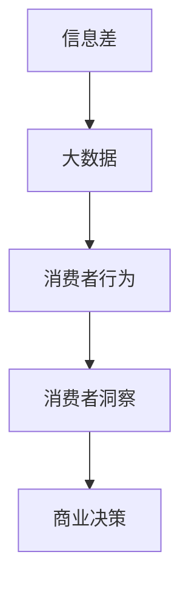

                 

### 引言与背景知识

#### 1. 引言：信息差的商业价值

在商业世界中，信息差是一种极为重要的概念。它指的是在交易过程中，买方和卖方之间存在的信息不对称现象。买方可能对商品或服务的了解程度低于卖方，而卖方则可能掌握更多关于市场趋势、消费者偏好、竞争状况等方面的信息。这种信息差使得某些个体或企业能够获取比竞争对手更大的竞争优势，从而实现更高的利润。

信息差的商业价值主要体现在以下几个方面：

1. **市场定位**：了解消费者的需求和偏好，使企业能够更精准地进行市场定位，从而提高市场占有率。
2. **产品差异化**：通过对消费者行为的深入研究，企业可以开发出更具吸引力的产品，实现产品差异化。
3. **价格策略**：掌握市场信息和消费者心理，企业可以更灵活地制定价格策略，实现利润最大化。
4. **竞争优势**：信息优势可以帮助企业在竞争激烈的市场中占据有利位置，从而保持竞争优势。

#### 1.2 信息差的概念

信息差（Information Gap）是指在市场中，不同个体对同一信息拥有不同程度的了解，导致信息不对称。这种现象在商业交易中尤为常见，例如：

- **消费者**：消费者可能不知道某种产品的最优价格，或者不了解市场上的新产品。
- **供应商**：供应商可能掌握关于原材料价格、生产成本、市场需求等关键信息。
- **投资者**：投资者可能对某一行业的未来趋势有深入的了解，而其他投资者则缺乏这种信息。

#### 1.3 信息差在商业中的重要性

信息差在商业中的重要性不容忽视，主要体现在以下几个方面：

1. **市场优势**：企业通过获取并利用信息差，可以在市场中获得竞争优势，提高市场占有率。
2. **决策支持**：信息差为企业提供了更全面的市场信息和消费者洞察，有助于做出更明智的商业决策。
3. **利润空间**：信息差使得企业能够通过价格差异、产品差异化等手段，获得更高的利润空间。
4. **风险管理**：了解市场信息和消费者行为，企业可以更好地应对市场变化和风险。

#### 1.4 消费者洞察与大数据的关系

大数据（Big Data）的兴起，为消费者洞察提供了强大的技术支持。大数据技术通过收集、存储、分析和处理海量数据，使企业能够更深入地了解消费者的行为、需求和偏好。大数据在消费者洞察中的作用主要体现在以下几个方面：

1. **数据采集**：大数据技术可以实时收集消费者在不同渠道的行为数据，如搜索记录、购物行为、社交媒体活动等。
2. **数据分析**：通过对海量数据的分析，企业可以挖掘出消费者行为背后的规律和趋势，从而进行更精准的市场定位。
3. **个性化推荐**：基于大数据分析，企业可以提供个性化的产品推荐和广告，提高消费者的满意度和忠诚度。
4. **预测性分析**：大数据技术可以帮助企业预测消费者未来的行为和需求，从而提前布局市场策略。

### 2. 大数据的崛起

大数据（Big Data）是指无法使用传统数据处理方法在合理时间内捕捉、管理和处理的大量数据。随着互联网、物联网、社交媒体等技术的发展，大数据迎来了爆发式增长。

#### 2.1 大数据的发展历程

大数据的发展历程可以分为以下几个阶段：

1. **数据量积累期**（2000年初）：随着互联网和电子商务的兴起，数据量开始迅速增长，企业开始意识到数据的重要性。
2. **技术发展期**（2005年-2010年）：Hadoop、Spark等大数据处理技术的出现，使得大规模数据处理成为可能。
3. **应用普及期**（2010年至今）：大数据技术逐渐应用于各个行业，成为企业提升竞争力的关键手段。

#### 2.2 大数据的特征

大数据具有以下四个基本特征，通常被称为“4V”：

1. **Volume（数据量）**：大数据的数据量巨大，通常需要使用分布式存储和处理技术。
2. **Velocity（速度）**：大数据处理速度极快，能够实时或近实时地分析和处理数据。
3. **Variety（多样性）**：大数据来源广泛，包括结构化、半结构化和非结构化数据。
4. **Veracity（真实性）**：大数据的真实性和可靠性往往较低，需要通过数据清洗和验证技术进行保障。

#### 2.3 大数据的基本原理

大数据的基本原理主要包括以下几个方面：

1. **分布式计算**：通过分布式计算架构，如MapReduce，实现海量数据的并行处理。
2. **数据存储**：使用分布式存储系统，如Hadoop分布式文件系统（HDFS），存储海量数据。
3. **数据处理**：利用大数据处理框架，如Spark，实现高效的数据分析和处理。
4. **数据可视化**：通过数据可视化工具，如Tableau，将复杂的数据转化为直观的图表和报告。

#### 2.4 大数据技术在消费者洞察中的应用

大数据技术在消费者洞察中的应用主要体现在以下几个方面：

1. **消费者行为分析**：通过对消费者行为数据的分析，企业可以了解消费者的购物习惯、偏好和需求，从而进行更精准的市场定位。
2. **个性化推荐**：基于大数据分析，企业可以提供个性化的产品推荐和广告，提高消费者的满意度和忠诚度。
3. **预测性分析**：大数据技术可以帮助企业预测消费者未来的行为和需求，从而提前布局市场策略。
4. **客户关系管理**：通过大数据分析，企业可以更好地了解客户需求，提供个性化的服务和解决方案，提升客户满意度。

### 3. 大数据技术与消费者洞察

#### 3.1 数据采集与预处理

数据采集是消费者洞察的基础。大数据技术提供了丰富的数据采集工具，如传感器、社交媒体API、网站日志等。数据采集后，需要对数据进行预处理，包括数据清洗、数据整合和数据转换。数据清洗是去除重复数据、错误数据和无关数据的过程，数据整合是将来自不同渠道的数据进行合并，数据转换是将数据格式进行统一。

#### 3.2 数据存储与管理

大数据技术采用分布式存储系统，如Hadoop分布式文件系统（HDFS），实现海量数据的存储。同时，NoSQL数据库，如MongoDB和Cassandra，提供了灵活的数据存储和查询方式。数据管理包括数据的备份、恢复、安全和访问控制等。

#### 3.3 数据分析与应用

数据分析是消费者洞察的核心。大数据技术提供了多种数据分析工具，如Spark、Hadoop和Flink，实现高效的数据处理和分析。数据分析方法包括描述性分析、探索性分析和预测性分析。描述性分析用于总结数据的基本特征，探索性分析用于挖掘数据中的模式和关联，预测性分析用于预测未来的趋势和行为。

#### 3.4 消费者洞察应用案例

消费者洞察在大数据分析中的应用案例丰富多样：

- **电子商务**：通过分析用户浏览和购买行为，电子商务平台可以实现个性化推荐，提高销售转化率。
- **金融行业**：通过分析客户交易行为和风险数据，金融机构可以实现精准营销和风险控制。
- **零售业**：通过分析销售数据和库存数据，零售业企业可以优化供应链，降低库存成本。
- **医疗行业**：通过分析患者数据，医疗机构可以实现个性化治疗和疾病预测。

### 3.5 大数据消费者洞察的优势

大数据消费者洞察具有以下优势：

- **全面性**：大数据可以收集和分析来自多个渠道的数据，提供更全面的消费者画像。
- **实时性**：大数据技术可以实现实时数据分析和处理，帮助企业及时调整市场策略。
- **精确性**：通过对海量数据的分析，可以挖掘出更精确的消费者行为和需求。
- **可预测性**：大数据技术可以帮助企业预测消费者未来的行为和趋势，提前布局市场。

### 3.6 大数据消费者洞察的挑战

尽管大数据消费者洞察具有许多优势，但也面临着一些挑战：

- **数据质量**：大数据质量参差不齐，需要进行严格的数据清洗和验证。
- **隐私保护**：消费者数据涉及到个人隐私，企业需要确保数据的安全性和隐私性。
- **技术门槛**：大数据技术复杂，企业需要投入大量资源和时间进行学习和应用。
- **整合难度**：不同来源和类型的数据需要进行整合，难度较大。

### 3.7 大数据消费者洞察的未来趋势

大数据消费者洞察的未来趋势包括：

- **人工智能**：人工智能技术的应用将进一步提升消费者洞察的精确性和效率。
- **实时分析**：实时分析技术将使企业能够更快地响应市场变化。
- **数据隐私**：随着数据隐私法规的加强，企业需要更好地保护消费者数据。
- **跨领域应用**：大数据消费者洞察将在更多领域得到应用，如医疗、教育、交通等。

### 3.8 总结

大数据技术与消费者洞察的结合，为企业提供了更全面、更深入的消费者洞察，从而实现更精准的市场定位和营销策略。然而，企业需要面对数据质量、隐私保护、技术门槛等挑战，并积极应对未来趋势。通过持续的技术创新和应用，大数据消费者洞察将在商业中发挥更大的价值。

---

#### 核心概念与联系

在讨论大数据消费者洞察时，有以下几个核心概念需要理解，并展示它们之间的相互联系：

1. **信息差**：信息差指的是交易双方之间在信息掌握程度上的不对称。它包括消费者对产品了解的多少、市场趋势的认知、竞争对手的信息等。这种不对称性导致了商业机会和风险的差异。
   
2. **大数据**：大数据是指无法使用传统数据处理工具在合理时间内捕捉、管理和处理的大量数据。它具有数据量大（Volume）、数据类型多（Variety）、数据产生速度快（Velocity）和数据真实性高（Veracity）等特点。

3. **消费者行为**：消费者行为是指消费者在购买、使用和评估产品或服务时的行为模式。它包括购买决策、购买动机、购物习惯、品牌忠诚度等。

4. **消费者洞察**：消费者洞察是通过收集和分析消费者的数据，深入了解消费者的行为、需求和偏好，从而为企业提供决策支持。

**Mermaid 流程图**：

下面是一个简单的 Mermaid 流程图，展示这四个核心概念之间的联系：



**流程解释**：

1. **信息差**（A）是商业交易的起点，交易双方在信息上存在不对称，这种不对称性影响了消费者的决策过程。
2. **大数据**（B）通过技术手段，收集和存储了大量关于消费者行为的数据，为分析信息差提供了数据基础。
3. **消费者行为**（C）是大数据分析的核心目标，通过对消费者行为数据的深入挖掘，企业可以更全面地了解消费者的行为模式。
4. **消费者洞察**（D）是基于大数据分析的结果，为企业提供关于消费者需求、偏好和购买决策的洞察。
5. **商业决策**（E）基于消费者洞察，企业可以制定更精准的市场策略，提高市场竞争力。

通过这个流程图，我们可以清晰地看到信息差、大数据、消费者行为和消费者洞察之间的逻辑关系，以及它们如何共同支持商业决策的制定。

### 4. 消费者行为理论基础

#### 4.1 消费者行为模型

消费者行为模型是研究消费者购买决策过程的理论框架。常见的消费者行为模型包括以下几个：

1. **传统购买行为模型**：
   - **理性行为模型**：该模型认为消费者在购买决策过程中是理性的，他们会根据信息、偏好和目标来做出最优选择。
   - **有限理性模型**：该模型认为消费者在信息处理和决策过程中存在局限性，他们会在有限的时间和资源下做出次优选择。
   - **习惯性购买模型**：该模型认为消费者的购买行为主要受到习惯的影响，而不是新信息的驱动。

2. **现代购买行为模型**：
   - **理性和情感整合模型**：该模型认为消费者的购买决策既受到理性思考的影响，也受到情感因素的影响。
   - **动态购买行为模型**：该模型认为消费者的购买决策是一个动态过程，受到多个外部和内部因素的影响。

3. **行为经济学模型**：
   - **行为决策理论**：该理论认为消费者的购买决策受到心理偏见和认知限制的影响，这些偏见和限制会导致消费者做出非理性行为。

#### 4.2 消费者行为的影响因素

消费者行为受到多种因素的影响，这些因素可以分为内部因素和外部因素。

1. **内部因素**：
   - **个人特征**：包括年龄、性别、收入、教育水平、职业等。
   - **心理特征**：包括个性、动机、自我概念、信念和态度等。
   - **生活方式**：包括消费者的价值观念、生活习惯和消费习惯等。

2. **外部因素**：
   - **文化因素**：包括文化、亚文化和社会阶层等。
   - **社会因素**：包括家庭、群体和社会角色等。
   - **心理因素**：包括信息来源、社会影响和购买情境等。
   - **环境因素**：包括经济环境、政治环境、技术环境和法律环境等。

#### 4.3 消费者决策过程

消费者决策过程通常可以分为以下几个阶段：

1. **需求识别**：消费者意识到自己的需求或欲望，从而触发购买行为。
2. **信息搜索**：消费者通过各种渠道收集有关产品或服务的信息，包括品牌、价格、特性等。
3. **评估替代品**：消费者根据收集到的信息，评估不同产品或服务的优缺点，选择最佳选项。
4. **购买决策**：消费者做出最终购买决策，选择购买产品或服务。
5. **购后行为**：消费者购买产品或服务后，会根据使用体验和感受进行评价，并对未来的购买行为产生影响。

#### 4.4 消费者行为分析的重要性

消费者行为分析对于企业制定有效的营销策略具有重要意义：

1. **市场定位**：通过分析消费者行为，企业可以更准确地定位目标市场，满足消费者需求。
2. **产品开发**：了解消费者偏好和行为，有助于企业开发出更符合市场需求的产品。
3. **定价策略**：基于消费者对产品价值的感知，企业可以制定更具竞争力的价格策略。
4. **促销策略**：通过分析消费者行为，企业可以设计出更有效的促销活动和广告策略。
5. **客户关系管理**：深入了解消费者行为，有助于企业提供更个性化的服务和解决方案，提升客户满意度。

### 4.5 消费者行为分析的基本步骤

进行消费者行为分析通常包括以下基本步骤：

1. **定义问题**：明确分析的目标和问题，确定需要解决的具体问题。
2. **数据收集**：收集与消费者行为相关的数据，包括定量数据和定性数据。
3. **数据整理**：对收集到的数据进行整理、清洗和编码，确保数据质量。
4. **数据分析**：运用统计学和数据分析方法，对整理后的数据进行分析，提取关键信息。
5. **结果解读**：根据分析结果，解读消费者行为模式、趋势和影响因素。
6. **报告撰写**：撰写分析报告，总结分析结果和提出建议。

通过上述步骤，企业可以系统地了解消费者行为，为营销决策提供科学依据。

### 4.6 消费者行为分析工具与方法

在消费者行为分析中，常用的工具和方法包括：

1. **描述性分析**：用于总结和描述数据的基本特征，如平均数、中位数、标准差等。
2. **探索性分析**：通过可视化工具和统计方法，发现数据中的模式和关联。
3. **预测性分析**：利用历史数据建立模型，预测未来消费者的行为和趋势。
4. **文本分析**：用于分析消费者在社交媒体、评论等文本数据中的情感和观点。
5. **网络分析**：分析消费者在社交媒体和网络上的互动关系，了解消费者社区的结构和动态。

通过这些工具和方法，企业可以深入挖掘消费者行为数据，为营销策略提供有力支持。

### 4.7 消费者行为分析的实际案例

以下是一个消费者行为分析的实际案例：

**案例背景**：一家电子商务公司希望通过分析消费者行为，优化其网站的用户体验和销售转化率。

**分析步骤**：

1. **定义问题**：确定需要分析的具体问题，如网站流量、转化率、页面跳失率等。
2. **数据收集**：收集网站流量数据、用户行为数据、销售数据等。
3. **数据整理**：对收集到的数据进行分析，提取关键指标，如页面停留时间、点击率、购买率等。
4. **数据分析**：使用描述性分析和探索性分析方法，分析用户行为模式和页面性能。
5. **结果解读**：发现用户在网站上的主要障碍和痛点，如页面加载时间过长、导航不清晰等。
6. **报告撰写**：撰写分析报告，提出优化建议，如加快页面加载速度、改进导航设计等。

**案例分析**：

通过分析，发现用户在访问网站时，页面加载时间过长，导致大量用户在进入网站后立即跳失。针对这个问题，公司采取了以下措施：

- **优化页面代码**：压缩图片和CSS文件，减少HTTP请求。
- **使用CDN**：将静态资源部署到CDN，提高页面加载速度。
- **改进导航设计**：简化导航菜单，提高用户找到所需信息的便捷性。

实施优化措施后，网站的用户体验和销售转化率得到了显著提升。

### 4.8 消费者行为分析的核心问题与挑战

在消费者行为分析中，存在以下几个核心问题和挑战：

1. **数据质量**：数据质量直接影响分析结果的准确性。如果数据存在缺失、错误或不一致的情况，分析结果可能会受到干扰。
2. **数据隐私**：消费者数据涉及到个人隐私，企业需要确保数据的安全性和隐私性，遵守相关法律法规。
3. **分析复杂性**：消费者行为数据通常复杂且多样，需要使用多种分析方法和工具，对数据进行分析和整合。
4. **跨部门协作**：消费者行为分析通常需要跨部门合作，包括市场、销售、技术等，协作难度较大。
5. **持续更新**：消费者行为是动态变化的，企业需要不断更新和分析数据，以保持分析的准确性和时效性。

通过识别和解决这些核心问题与挑战，企业可以更好地利用消费者行为分析，提高市场竞争力和客户满意度。

### 4.9 消费者行为分析的未来趋势

随着大数据和人工智能技术的发展，消费者行为分析的未来趋势将呈现以下几个特点：

1. **数据源多样化**：消费者行为数据将不仅来源于传统渠道，还包括社交媒体、物联网设备、搜索引擎等，提供更丰富的数据来源。
2. **实时分析**：实时分析技术将使企业能够实时监测和响应消费者行为，提供更个性化的服务和体验。
3. **预测性分析**：利用机器学习和人工智能技术，企业可以实现更精确的预测性分析，提前预测消费者的需求和趋势。
4. **数据隐私保护**：随着数据隐私法规的加强，企业将需要采用更严格的数据隐私保护措施，确保消费者数据的安全性和隐私性。
5. **跨领域应用**：消费者行为分析将在更多行业和应用场景中得到应用，如医疗、金融、教育等，提供更广泛的服务。

通过把握这些趋势，企业可以更好地利用消费者行为分析，提升市场竞争力和客户满意度。

### 4.10 总结

消费者行为理论基础为我们提供了深入理解消费者购买决策过程的框架和方法。通过消费者行为模型，我们可以分析消费者行为的内外部影响因素；通过消费者决策过程，我们可以了解消费者在购买过程中的心理和行为变化。这些理论和方法不仅有助于企业制定有效的营销策略，还能帮助企业在快速变化的市场环境中保持竞争优势。

### 5. 消费者行为数据分析方法

#### 5.1 描述性分析

描述性分析是消费者行为数据分析的基础，旨在总结和描述数据的基本特征。这种方法主要通过统计指标来呈现数据的分布、趋势和关系。常见的描述性分析指标包括：

- **平均数**：数据的平均值，用于表示数据的中心趋势。
- **中位数**：数据的中间值，对于偏态分布的数据更为稳定。
- **标准差**：数据的离散程度，用于衡量数据分布的波动性。
- **百分位数**：表示数据分布的特定百分比，如第25百分位数和第75百分位数。

描述性分析有助于企业了解消费者行为的基本特征，如购买频率、购买金额、购买时间分布等。以下是一个使用Python进行描述性分析的示例：

```python
import pandas as pd

# 加载数据
data = pd.read_csv('consumer_data.csv')

# 计算描述性统计量
description = data.describe()

# 打印描述性统计量
print(description)
```

#### 5.2 探索性分析

探索性分析（Exploratory Data Analysis，EDA）是在没有明确假设的情况下，通过图形和统计手段对数据进行初步分析，以发现数据中的模式和异常。EDA的方法包括：

- **数据可视化**：使用图表（如柱状图、折线图、散点图等）展示数据分布、趋势和关系。
- **相关性分析**：计算变量之间的相关性，了解变量之间的关系强度和方向。
- **异常值检测**：识别数据中的异常值，分析异常值的原因。
- **分布分析**：分析变量的分布情况，如正态分布、偏态分布等。

以下是一个使用Python进行探索性分析的示例：

```python
import pandas as pd
import matplotlib.pyplot as plt
import seaborn as sns

# 加载数据
data = pd.read_csv('consumer_data.csv')

# 数据可视化
sns.pairplot(data)
plt.show()

# 相关性分析
correlation_matrix = data.corr()
sns.heatmap(correlation_matrix, annot=True)
plt.show()

# 异常值检测
Q1 = data.quantile(0.25)
Q3 = data.quantile(0.75)
IQR = Q3 - Q1
data = data[~((data < (Q1 - 1.5 * IQR)) | (data > (Q3 + 1.5 * IQR)))]
```

#### 5.3 预测性分析

预测性分析（Predictive Analysis）是基于历史数据和现有模式，通过构建预测模型，对未来事件或行为进行预测。常见的预测性分析方法包括：

- **回归分析**：通过建立回归模型，预测一个或多个因变量的值。
- **分类分析**：将数据分为不同的类别，用于分类预测。
- **时间序列分析**：分析时间序列数据，预测未来的趋势和周期。
- **机器学习模型**：使用机器学习算法（如决策树、随机森林、神经网络等），进行复杂的数据建模和预测。

以下是一个使用Python进行预测性分析的示例：

```python
import pandas as pd
from sklearn.model_selection import train_test_split
from sklearn.ensemble import RandomForestClassifier
from sklearn.metrics import accuracy_score

# 加载数据
data = pd.read_csv('consumer_data.csv')

# 数据预处理
X = data.drop('target', axis=1)
y = data['target']

# 划分训练集和测试集
X_train, X_test, y_train, y_test = train_test_split(X, y, test_size=0.2, random_state=42)

# 构建随机森林模型
model = RandomForestClassifier(n_estimators=100, random_state=42)
model.fit(X_train, y_train)

# 预测
y_pred = model.predict(X_test)

# 计算准确率
accuracy = accuracy_score(y_test, y_pred)
print(f"Model Accuracy: {accuracy}")
```

#### 5.4 综合应用示例

以下是一个综合应用描述性分析、探索性分析和预测性分析的示例：

**案例背景**：一家电商公司希望通过分析用户行为数据，预测用户是否会购买某个特定产品。

**步骤**：

1. **描述性分析**：了解用户的基本特征，如年龄、性别、购买频率等。
2. **探索性分析**：分析用户的购买行为，如购买时间、购买金额、购买频率等。
3. **预测性分析**：建立预测模型，预测用户是否会购买特定产品。

**代码示例**：

```python
# 描述性分析
description = data.describe()

# 探索性分析
sns.pairplot(data)
plt.show()

# 预测性分析
X = data.drop('will_buy', axis=1)
y = data['will_buy']

# 划分训练集和测试集
X_train, X_test, y_train, y_test = train_test_split(X, y, test_size=0.2, random_state=42)

# 构建逻辑回归模型
model = LogisticRegression()
model.fit(X_train, y_train)

# 预测
y_pred = model.predict(X_test)

# 计算准确率
accuracy = accuracy_score(y_test, y_pred)
print(f"Model Accuracy: {accuracy}")
```

通过上述分析方法和示例，企业可以全面了解用户行为，并为营销策略和产品开发提供有力支持。

### 6. 消费者细分与市场定位

#### 6.1 消费者细分方法

消费者细分（Consumer Segmentation）是将市场中的消费者划分为不同群体，以便更有效地进行市场定位和营销。消费者细分方法可以分为以下几类：

1. **地理细分**：根据消费者的地理位置进行细分，如城市、区域、国家等。
2. **人口细分**：根据消费者的年龄、性别、收入、教育程度、职业等人口统计特征进行细分。
3. **心理细分**：根据消费者的价值观、生活方式、兴趣、个性等心理特征进行细分。
4. **行为细分**：根据消费者的购买行为、使用习惯、品牌忠诚度等行为特征进行细分。

**市场细分过程**：

1. **识别细分变量**：确定用于细分的变量，如地理、人口、心理和行为特征。
2. **收集数据**：收集与细分变量相关的数据，如市场调研、消费者调查、购买记录等。
3. **数据分析**：使用统计学和数据分析方法，对收集到的数据进行分析，识别主要的细分群体。
4. **细分评估**：评估不同细分市场的规模、增长潜力、竞争状况等，确定目标细分市场。
5. **实施策略**：根据细分市场的特点，制定相应的市场定位和营销策略。

#### 6.2 市场定位策略

市场定位（Market Positioning）是企业根据细分市场的特点，在消费者心中建立独特的品牌形象和认知。市场定位策略可以分为以下几种：

1. **差异化定位**：通过独特的产品特性或服务，与竞争对手区分开来。
2. **集中定位**：选择一个或几个细分市场，集中资源和力量进行深耕。
3. **高端定位**：将品牌定位为高端、高品质，吸引高收入群体。
4. **低端定位**：将品牌定位为经济实惠，吸引价格敏感的消费者。
5. **多定位**：同时在多个细分市场上进行定位，以满足不同消费者的需求。

**市场定位策略的选择**：

1. **目标市场特点**：分析目标市场的规模、增长潜力、竞争状况等，选择适合的定位策略。
2. **品牌形象**：根据品牌的特点和定位，确定品牌形象和传播策略。
3. **产品特性**：分析产品的独特性，确定如何在市场上进行差异化。
4. **消费者需求**：了解消费者的需求和偏好，确保定位策略符合消费者的期望。

#### 6.3 消费者需求分析

消费者需求分析是市场定位和营销策略制定的关键。以下几种方法可以帮助企业深入了解消费者需求：

1. **问卷调查**：通过设计问卷，收集消费者对产品、服务、品牌的看法和意见。
2. **深度访谈**：与消费者进行一对一的深入访谈，了解他们的真实想法和感受。
3. **焦点小组**：组织一组消费者，针对特定主题进行讨论，获取多角度的意见。
4. **行为观察**：观察消费者在购买、使用、评价产品时的行为和互动。

**需求分析步骤**：

1. **确定分析目标**：明确分析的需求和目标，如了解消费者对某款产品的满意度、购买动机等。
2. **设计调查问卷**：根据分析目标，设计合适的问卷，包括封闭式问题和开放式问题。
3. **数据收集**：通过问卷调查、深度访谈、焦点小组等方式，收集消费者的反馈和意见。
4. **数据分析**：对收集到的数据进行分析，提取关键信息和洞察。
5. **报告撰写**：根据分析结果，撰写报告，总结消费者需求特点和趋势。

通过消费者需求分析，企业可以更好地了解市场需求，制定有针对性的市场定位和营销策略，提高市场竞争力。

### 6.4 消费者偏好模型

消费者偏好模型是消费者行为分析的重要组成部分，旨在通过量化消费者对产品的偏好，为企业提供精准的市场定位和产品优化建议。以下是一些常用的消费者偏好模型：

1. **效用理论**：效用理论认为消费者在选择产品时，会根据产品的效用进行决策。效用可以是主观的，也可以是客观的。常见的效用模型包括基数效用论和序数效用论。

   - **基数效用论**：假设消费者能够准确地量化每种产品的效用，并进行比较。例如，假设消费者对两种产品的效用分别是5和3，那么消费者会选择效用更高的产品。
   - **序数效用论**：假设消费者无法准确量化效用，但可以比较不同产品的偏好顺序。例如，消费者可以判断产品A比产品B更偏好，但不能精确说出两者的效用差。

2. **贝叶斯模型**：贝叶斯模型是一种基于概率理论的消费者偏好模型，通过历史数据和概率计算，预测消费者对产品的偏好。贝叶斯模型的公式如下：

   \[
   P(\text{产品被选择} | \text{观察数据}) = \frac{P(\text{观察数据} | \text{产品被选择}) \cdot P(\text{产品被选择})}{P(\text{观察数据})}
   \]

   其中，\(P(\text{产品被选择} | \text{观察数据})\) 是后验概率，表示在观察到特定数据后，消费者选择该产品的概率。

3. **因子分析模型**：因子分析模型通过将多维数据简化为几个因子，来研究消费者对多个产品的偏好。因子分析模型可以帮助识别消费者偏好的主要维度，从而简化分析过程。

**伪代码示例**：

以下是一个简单的消费者偏好模型伪代码示例：

```
# 数据输入
product_features = [价格, 质量, 品牌, ...]
consumer_preferences = [偏好1, 偏好2, ...]

# 计算偏好权重
weights = calculate_weights(consumer_preferences)

# 计算产品效用
utilities = [calculate_utility(product_features, weights) for product in products]

# 选择最佳产品
best_product = select_best_product(utilities)
```

**数学模型和公式**：

以下是一个简单的消费者偏好模型的数学公式：

\[
\text{效用}(p) = w_1 \cdot p_1 + w_2 \cdot p_2 + ... + w_n \cdot p_n
\]

其中，\(w_i\) 表示消费者对第 \(i\) 个特征的权重，\(p_i\) 表示第 \(i\) 个特征的属性值。

**举例说明**：

假设消费者对三种产品的偏好如下：

- 产品A：价格100元，质量90分，品牌知名度70分
- 产品B：价格150元，质量85分，品牌知名度80分
- 产品C：价格120元，质量88分，品牌知名度75分

消费者对价格、质量、品牌知名度的权重分别为0.4、0.3和0.3。

计算每个产品的效用：

- 产品A的效用：\(0.4 \cdot 100 + 0.3 \cdot 90 + 0.3 \cdot 70 = 58\)
- 产品B的效用：\(0.4 \cdot 150 + 0.3 \cdot 85 + 0.3 \cdot 80 = 69.5\)
- 产品C的效用：\(0.4 \cdot 120 + 0.3 \cdot 88 + 0.3 \cdot 75 = 67.2\)

根据效用值，消费者会选择效用最高的产品B。

通过消费者偏好模型，企业可以更准确地了解消费者对不同产品特征的偏好，从而制定更有效的营销策略和产品优化方案。

### 6.5 行为预测方法

行为预测是消费者行为分析中的重要一环，旨在通过分析历史数据，预测消费者未来的行为和趋势。以下是一些常见的行为预测方法：

1. **时间序列预测**：时间序列预测是通过分析历史时间序列数据，预测未来的趋势和周期。常用的方法包括ARIMA（自回归积分滑动平均模型）和LSTM（长短期记忆网络）。

   - **ARIMA模型**：ARIMA模型是一种自回归移动平均模型，适用于线性时间序列预测。其公式如下：

     \[
     \text{X}_{t} = c + \text{Φ}_{1}\text{X}_{t-1} + \text{Φ}_{2}\text{X}_{t-2} + ... + \text{Φ}_{p}\text{X}_{t-p} + \text{θ}_{1}\text{e}_{t-1} + \text{θ}_{2}\text{e}_{t-2} + ... + \text{θ}_{q}\text{e}_{t-q}
     \]

     其中，\(c\) 是常数项，\(\text{Φ}_i\) 和 \(\text{θ}_i\) 是模型参数，\(\text{e}_t\) 是白噪声。

   - **LSTM模型**：LSTM是一种基于深度学习的神经网络模型，适用于非线性时间序列预测。LSTM通过引入记忆单元，能够捕捉时间序列中的长期依赖关系。

     \[
     \text{LSTM} = \text{激活函数} \circ \text{求和} \circ \text{求积} \circ \text{求和}
     \]

2. **回归分析**：回归分析是一种基于线性关系的预测方法，通过建立回归模型，预测因变量的值。常见的回归模型包括线性回归、多项式回归和多项式回归。

   - **线性回归**：线性回归模型通过拟合一条直线，预测因变量和自变量之间的关系。其公式如下：

     \[
     \text{Y} = \text{a} + \text{bX}
     \]

     其中，\(\text{Y}\) 是因变量，\(\text{X}\) 是自变量，\(\text{a}\) 和 \(\text{b}\) 是模型参数。

   - **多项式回归**：多项式回归模型通过拟合一个多项式函数，预测因变量和自变量之间的关系。其公式如下：

     \[
     \text{Y} = \text{a} + \text{bX} + \text{cX}^2 + ...
     \]

3. **机器学习模型**：机器学习模型通过训练数据集，学习数据中的特征和规律，从而预测未来的行为。常见的机器学习模型包括决策树、随机森林、神经网络等。

   - **决策树**：决策树通过一系列的判断条件，将数据集划分为不同的子集，并预测每个子集的标签。其公式如下：

     \[
     \text{Y} = \text{f}(\text{X}_1, \text{X}_2, ..., \text{X}_n)
     \]

     其中，\(\text{X}_i\) 是特征，\(\text{f}\) 是决策函数。

   - **随机森林**：随机森林是一种基于决策树的集成模型，通过训练多个决策树，并取它们的平均值，提高预测的准确性和稳定性。

     \[
     \text{Y} = \text{f}(\text{T})
     \]

     其中，\(\text{T}\) 是决策树集合。

   - **神经网络**：神经网络是一种基于生物神经系统的计算模型，通过多层神经元和激活函数，模拟人类大脑的思考过程。其公式如下：

     \[
     \text{Y} = \text{f}(\text{X} \circ \text{W} \circ \text{f}(\text{X} \circ \text{W}) \circ ...)
     \]

     其中，\(\text{X}\) 是输入，\(\text{W}\) 是权重，\(\text{f}\) 是激活函数。

**伪代码示例**：

以下是一个简单的行为预测模型的伪代码示例：

```
# 数据输入
data = load_data('consumer_data.csv')

# 数据预处理
X = preprocess_data(data)

# 分训练集和测试集
X_train, X_test, y_train, y_test = train_test_split(X, y, test_size=0.2, random_state=42)

# 建立预测模型
model = build_model()

# 训练模型
model.fit(X_train, y_train)

# 预测
y_pred = model.predict(X_test)

# 评估模型
evaluate_model(y_pred, y_test)
```

通过这些行为预测方法，企业可以更好地了解消费者未来的行为和趋势，从而制定更科学和精准的营销策略。

### 6.6 消费者偏好与行为预测应用

在电子商务领域，消费者偏好与行为预测应用广泛且重要。以下通过一个实际案例，详细描述消费者偏好与行为预测的具体应用过程。

#### 案例背景

一家大型电子商务平台希望通过分析消费者数据，提高用户购买转化率和客户满意度。为此，平台决定实施消费者偏好与行为预测项目，以更精准地推荐产品，优化用户体验。

#### 应用过程

1. **数据收集与预处理**：
   - **数据来源**：平台通过用户注册信息、浏览记录、购买历史、评价反馈等多种渠道收集数据。
   - **数据预处理**：对收集到的数据进行清洗、去重和格式转换，确保数据质量。

2. **消费者偏好建模**：
   - **特征提取**：提取与消费者偏好相关的特征，如用户年龄、性别、地理位置、浏览时长、购买频率、评价分数等。
   - **模型训练**：使用机器学习算法（如逻辑回归、协同过滤、因子分解机等）建立消费者偏好模型，预测用户对不同产品的偏好。

3. **行为预测**：
   - **行为特征提取**：提取与消费者行为相关的特征，如浏览路径、购买间隔、页面停留时间、点击率等。
   - **模型训练**：使用时间序列预测、回归分析等方法，建立消费者行为预测模型，预测用户未来的购买行为。

4. **个性化推荐**：
   - **推荐算法**：结合消费者偏好和行为预测模型，使用协同过滤、基于内容的推荐等算法，生成个性化推荐列表。
   - **推荐评估**：通过A/B测试等方法，评估个性化推荐的效果，优化推荐算法。

5. **应用与优化**：
   - **推荐展示**：在用户登录、浏览、购物车等页面展示个性化推荐列表。
   - **实时反馈**：收集用户对推荐的反馈，如点击、购买、评价等，用于实时调整推荐策略。
   - **持续优化**：通过不断的数据分析和模型迭代，持续提升推荐系统的效果。

#### 案例分析

1. **消费者偏好分析**：
   - 通过分析用户购买历史和浏览记录，发现用户对时尚服装、电子产品和家居用品有较高的偏好。
   - 根据用户偏好，平台在推荐系统中增加了相关类别产品的展示，提高了用户点击率和购买转化率。

2. **行为预测分析**：
   - 通过时间序列预测模型，预测用户的购买周期和购买金额，为营销策略提供数据支持。
   - 根据行为预测结果，平台在用户生日、节假日等关键时点发送个性化促销信息，提高了订单量和客户满意度。

3. **个性化推荐效果**：
   - 通过A/B测试，对比个性化推荐和传统推荐的效果，发现个性化推荐显著提升了用户点击率和购买转化率。
   - 平台根据用户反馈和测试结果，不断优化推荐算法，提升推荐精度和用户满意度。

通过这个案例，我们可以看到，消费者偏好与行为预测在电子商务中的应用，不仅提高了平台的运营效率，还显著提升了用户体验和满意度。

### 6.7 消费者偏好与行为预测的优势与挑战

#### 优势

1. **提高转化率和销售额**：通过个性化推荐和精准营销，能够有效提高用户的购买意愿和转化率，从而提升销售额。

2. **优化库存和供应链**：通过预测用户购买行为，企业可以更准确地进行库存管理和供应链优化，减少库存积压和供应链风险。

3. **提升用户体验**：个性化的推荐和服务能够满足用户的个性化需求，提升用户满意度和忠诚度。

4. **精细化营销**：通过对消费者行为数据的深入分析，企业可以制定更精细化的营销策略，提高营销效果。

#### 挑战

1. **数据质量和隐私问题**：消费者行为数据的质量直接影响预测的准确性，同时，数据隐私保护也是企业需要面对的重要挑战。

2. **技术复杂性和成本**：建立和维护消费者偏好与行为预测系统需要投入大量的技术和人力资源，对企业的技术能力和资金实力有较高要求。

3. **模型解释性**：一些复杂的机器学习模型具有较高的预测精度，但缺乏解释性，使得企业难以理解模型的决策过程。

4. **动态变化的市场环境**：消费者行为和市场环境不断变化，企业需要不断调整和优化预测模型，以适应市场变化。

通过认识这些优势和挑战，企业可以更好地利用消费者偏好与行为预测，提高市场竞争力。

### 6.8 总结

消费者细分与市场定位、消费者偏好模型和行为预测方法共同构成了消费者行为分析的核心。通过这些方法，企业可以深入了解消费者的需求和偏好，优化产品和服务，制定精准的营销策略。在实际应用中，这些方法不仅能够提高企业的运营效率和用户满意度，还能为企业带来显著的商业价值。企业应持续关注消费者行为变化，不断优化和迭代预测模型，以保持竞争优势。

### 7. 大数据在消费者洞察中的应用场景

大数据技术在消费者洞察中的应用场景丰富多样，以下列举几个典型应用：

#### 7.1 市场调研

市场调研是获取消费者洞察的重要手段。大数据技术可以帮助企业快速、准确地收集和分析市场数据，包括消费者偏好、市场需求、竞争状况等。以下为市场调研中大数据技术的应用：

1. **在线问卷调查**：利用大数据平台，如问卷星、金数据等，快速创建和分发在线问卷，收集大量消费者反馈。
2. **社交媒体数据分析**：通过分析社交媒体平台（如微博、微信、Facebook等）上的消费者评论、转发和互动，了解消费者对产品和品牌的看法。
3. **搜索引擎分析**：利用搜索引擎（如百度、Google等）的数据，分析消费者的搜索行为和兴趣，了解市场需求和趋势。
4. **数据挖掘与分析**：对市场调研数据进行数据挖掘和分析，提取有价值的信息，为决策提供支持。

#### 7.2 产品开发

产品开发过程中，大数据技术可以帮助企业了解消费者需求，优化产品设计，提高产品竞争力。以下为产品开发中大数据技术的应用：

1. **需求分析**：通过大数据分析，了解消费者对产品的需求、偏好和使用习惯，为产品开发提供方向。
2. **用户反馈收集**：利用大数据技术，实时收集用户对产品的反馈，如评论、评价、社交媒体上的讨论等，及时发现产品问题，优化产品功能。
3. **用户行为分析**：通过分析用户的购买行为、浏览路径、使用习惯等，了解用户需求，为产品迭代提供数据支持。
4. **市场趋势预测**：利用大数据技术，预测市场趋势和消费者需求变化，帮助企业提前布局新产品。

#### 7.3 客户服务与支持

大数据技术可以帮助企业提升客户服务水平，提供个性化的客户支持，以下为客户服务与支持中大数据技术的应用：

1. **客户反馈分析**：通过大数据分析，了解客户的反馈和投诉，及时发现服务中的问题，优化客户服务流程。
2. **客户行为预测**：利用大数据分析客户的行为数据，如购买历史、浏览记录、评价等，预测客户的潜在需求，提供个性化的服务。
3. **智能客服系统**：利用自然语言处理（NLP）和机器学习技术，建立智能客服系统，自动处理常见问题和客户咨询，提高服务效率。
4. **客户忠诚度管理**：通过大数据分析，了解客户的忠诚度，制定客户忠诚度管理策略，提升客户满意度和忠诚度。

#### 7.4 竞争分析

大数据技术可以帮助企业了解市场竞争态势，制定有效的竞争策略，以下为竞争分析中大数据技术的应用：

1. **竞争对手分析**：通过大数据分析，了解竞争对手的市场份额、产品定位、营销策略等，为企业提供竞争情报。
2. **市场趋势分析**：通过大数据分析，了解市场趋势和消费者需求变化，为企业制定市场策略提供数据支持。
3. **消费者行为分析**：通过大数据分析，了解消费者在不同平台上的行为和偏好，为企业制定差异化营销策略提供参考。
4. **广告效果分析**：通过大数据分析，了解不同广告渠道的效果，优化广告投放策略，提高广告投放效果。

通过以上应用，大数据技术在消费者洞察中发挥了重要作用，帮助企业更好地了解市场和消费者，制定有效的营销策略，提升市场竞争力和用户满意度。

### 7.5 大数据消费者洞察的案例分析

为了更好地理解大数据在消费者洞察中的应用，我们将通过三个实际案例来展示大数据如何在不同行业中深入挖掘消费者行为，从而优化商业策略。

#### 案例一：电子商务平台的消费者行为分析

**背景**：某大型电子商务平台希望通过分析消费者行为，提高用户体验和销售转化率。

**分析过程**：

1. **数据收集**：平台收集了用户的行为数据，包括浏览历史、购买记录、评价反馈、点击率等。
2. **数据处理**：对收集到的数据进行了清洗和整合，去除重复和无效数据。
3. **数据分析**：
   - **描述性分析**：总结用户的基本特征，如年龄、性别、地理位置等。
   - **探索性分析**：分析用户的行为模式，如浏览路径、购买频率、偏好等。
   - **预测性分析**：建立模型预测用户的购买概率和偏好。
4. **结果与应用**：
   - 根据分析结果，平台优化了网站的用户界面和导航，简化了购买流程。
   - 通过个性化推荐，提高了用户点击率和购买转化率。
   - 根据用户反馈，调整了产品定价策略，提升了客户满意度。

#### 案例二：社交媒体平台的用户画像构建

**背景**：某社交媒体平台希望通过构建用户画像，提供更个性化的内容和广告推荐。

**分析过程**：

1. **数据收集**：平台收集了用户在社交媒体上的行为数据，包括发布内容、点赞、评论、分享等。
2. **数据处理**：对数据进行了清洗和归一化处理，确保数据质量。
3. **用户画像构建**：
   - **兴趣分析**：通过分析用户发布和互动的内容，识别用户的兴趣点。
   - **行为特征提取**：提取用户的行为特征，如活跃时间、互动频率等。
   - **用户分类**：使用聚类算法将用户分为不同的群体。
4. **结果与应用**：
   - 平台根据用户画像，提供了个性化的内容推荐和广告投放。
   - 通过用户画像，平台能够更精准地了解用户需求，提高了用户满意度和活跃度。
   - 用户画像还用于营销活动的设计和优化，提升了营销效果。

#### 案例三：金融行业的消费者风险管理

**背景**：某金融公司希望通过大数据分析，降低消费者贷款违约风险。

**分析过程**：

1. **数据收集**：金融公司收集了消费者的信用记录、财务状况、收入水平、工作稳定性等数据。
2. **数据处理**：对数据进行了清洗、整合和标准化处理。
3. **风险预测模型**：
   - **特征工程**：提取与贷款违约相关的特征，如信用评分、债务收入比等。
   - **模型训练**：使用机器学习算法（如逻辑回归、决策树等）建立违约预测模型。
   - **模型评估**：通过交叉验证和A/B测试，评估模型的效果。
4. **结果与应用**：
   - 根据预测模型，金融公司能够提前识别出高风险客户，采取相应的风险管理措施。
   - 通过优化贷款审批流程，提高了审批效率和准确性。
   - 模型的应用降低了贷款违约率，提升了公司的盈利能力。

通过以上案例，我们可以看到大数据在消费者洞察中的广泛应用。通过分析消费者行为数据，企业可以更好地了解市场和消费者，制定更精准的营销策略，提高用户体验和满意度，从而实现商业成功。

### 7.6 大数据消费者洞察项目实施策略

大数据消费者洞察项目的成功实施需要明确的项目规划和科学的实施策略。以下为大数据消费者洞察项目实施的主要策略：

#### 7.6.1 项目规划

**项目目标**：明确项目目标，如提高客户满意度、增加销售转化率、优化产品开发等。

**项目范围**：界定项目的范围，包括数据收集、处理、分析和应用等。

**项目时间表**：制定详细的项目时间表，包括数据收集、处理、分析、模型建立、应用测试等关键阶段的时间安排。

**资源分配**：确定项目所需的资源，包括人员、技术设备、预算等。

**风险评估**：评估项目可能遇到的风险，如数据质量风险、技术风险、隐私风险等，并制定相应的应对措施。

#### 7.6.2 数据资源整合

**数据源选择**：选择可靠的数据源，包括内部数据（如销售数据、客户反馈等）和外部数据（如社交媒体数据、市场调研数据等）。

**数据清洗**：对收集到的数据进行清洗，去除重复、错误和不完整的数据，确保数据质量。

**数据整合**：将不同来源的数据进行整合，确保数据的一致性和兼容性。

**数据标准化**：对数据进行标准化处理，确保数据格式和单位的统一。

**数据仓库建设**：建立数据仓库，存储和管理数据，以便进行后续的分析和应用。

#### 7.6.3 数据分析与解读

**数据分析方法**：选择合适的数据分析方法，包括描述性分析、探索性分析、预测性分析等。

**数据分析工具**：使用数据分析工具，如Python、R、SQL等，进行数据处理和分析。

**数据分析结果**：对分析结果进行解读，提取有价值的信息，如消费者行为模式、市场趋势等。

**数据可视化**：使用数据可视化工具，如Tableau、Power BI等，将分析结果转化为图表和报告，便于理解和传达。

**数据应用**：将分析结果应用到实际业务中，如优化产品开发、制定营销策略等。

#### 7.6.4 项目评估与优化

**项目评估**：对项目效果进行评估，包括数据质量、分析准确性、应用效果等。

**项目优化**：根据评估结果，对项目进行优化，包括改进数据分析方法、优化数据源、提升数据处理能力等。

**持续迭代**：大数据消费者洞察项目是一个持续迭代的过程，需要不断更新和优化，以适应市场变化和消费者需求。

通过以上项目实施策略，企业可以有效地实施大数据消费者洞察项目，提升市场竞争力。

### 7.7 案例研究：大数据消费者洞察实战

#### 7.7.1 案例一：电子商务平台的消费者行为分析

**背景**：某电子商务平台希望通过大数据分析，深入了解消费者行为，提高用户满意度和销售转化率。

**数据来源**：平台收集了用户在网站上的行为数据，包括浏览记录、点击率、购物车行为、购买历史等。

**分析过程**：

1. **数据收集与预处理**：对用户行为数据进行了清洗和整合，去除了重复和错误数据。
2. **描述性分析**：总结用户的基本特征，如年龄、性别、地理位置等。
3. **探索性分析**：分析用户的行为模式，如浏览路径、购买频率、偏好等。
4. **预测性分析**：建立模型预测用户的购买概率和偏好。

**结果与应用**：

- **个性化推荐**：根据分析结果，平台推出了个性化推荐系统，提高了用户点击率和购买转化率。
- **优化购物流程**：根据用户行为数据，平台简化了购物流程，减少了用户购物车放弃率。
- **精准营销**：通过分析用户购买历史和偏好，平台发送了更精准的促销信息，提高了订单量和客户满意度。

**代码实现**：

```python
import pandas as pd
from sklearn.model_selection import train_test_split
from sklearn.ensemble import RandomForestClassifier

# 加载数据
data = pd.read_csv('consumer_data.csv')

# 数据预处理
data = data.drop_duplicates()
data = data[data['purchase'] != -1]

# 分训练集和测试集
X = data.drop(['purchase', 'user_id'], axis=1)
y = data['purchase']
X_train, X_test, y_train, y_test = train_test_split(X, y, test_size=0.2, random_state=42)

# 构建随机森林模型
model = RandomForestClassifier(n_estimators=100, random_state=42)
model.fit(X_train, y_train)

# 预测
y_pred = model.predict(X_test)

# 评估模型
accuracy = (y_pred == y_test).mean()
print(f"Model Accuracy: {accuracy}")
```

#### 7.7.2 案例二：社交媒体平台的用户画像构建

**背景**：某社交媒体平台希望通过构建用户画像，提供更个性化的内容和广告推荐。

**数据来源**：平台收集了用户在社交媒体上的行为数据，包括发布内容、点赞、评论、分享等。

**分析过程**：

1. **数据收集与预处理**：对用户行为数据进行了清洗和整合，去除了重复和错误数据。
2. **兴趣分析**：通过分析用户发布和互动的内容，识别用户的兴趣点。
3. **行为特征提取**：提取用户的行为特征，如活跃时间、互动频率等。
4. **用户分类**：使用聚类算法将用户分为不同的群体。

**结果与应用**：

- **个性化内容推荐**：根据用户画像，平台提供了个性化的内容推荐，提高了用户活跃度和留存率。
- **精准广告投放**：根据用户画像，平台发送了更精准的广告，提高了广告点击率和转化率。
- **用户活动优化**：根据用户画像，平台优化了用户活动设计和推广策略，提升了活动效果。

**代码实现**：

```python
import pandas as pd
from sklearn.cluster import KMeans

# 加载数据
data = pd.read_csv('user_behavior_data.csv')

# 数据预处理
data = data.drop_duplicates()

# 提取行为特征
features = data[['like_count', 'comment_count', 'share_count']]

# 聚类分析
kmeans = KMeans(n_clusters=5, random_state=42)
clusters = kmeans.fit_predict(features)

# 打印聚类结果
data['cluster'] = clusters
print(data.head())
```

#### 7.7.3 案例三：金融行业的消费者风险管理

**背景**：某金融公司希望通过大数据分析，降低消费者贷款违约风险。

**数据来源**：金融公司收集了消费者的信用记录、财务状况、收入水平、工作稳定性等数据。

**分析过程**：

1. **数据收集与预处理**：对消费者数据进行了清洗和整合，去除了重复和错误数据。
2. **特征工程**：提取与贷款违约相关的特征，如信用评分、债务收入比等。
3. **模型训练**：使用机器学习算法（如逻辑回归、决策树等）建立违约预测模型。
4. **模型评估**：通过交叉验证和A/B测试，评估模型的效果。

**结果与应用**：

- **违约风险识别**：根据预测模型，金融公司能够提前识别出高风险客户，采取相应的风险管理措施。
- **贷款审批优化**：通过优化贷款审批流程，提高了审批效率和准确性。
- **违约率降低**：预测模型的应用降低了贷款违约率，提升了公司的盈利能力。

**代码实现**：

```python
import pandas as pd
from sklearn.model_selection import train_test_split
from sklearn.linear_model import LogisticRegression

# 加载数据
data = pd.read_csv('loan_data.csv')

# 数据预处理
data = data.drop_duplicates()
data = data[data['default'] != -1]

# 分训练集和测试集
X = data.drop(['default', 'user_id'], axis=1)
y = data['default']
X_train, X_test, y_train, y_test = train_test_split(X, y, test_size=0.2, random_state=42)

# 构建逻辑回归模型
model = LogisticRegression()
model.fit(X_train, y_train)

# 预测
y_pred = model.predict(X_test)

# 评估模型
accuracy = (y_pred == y_test).mean()
print(f"Model Accuracy: {accuracy}")
```

通过这些实际案例，我们可以看到大数据技术在消费者洞察中的应用，如何帮助企业优化业务流程，提升用户体验和竞争力。

### 7.8 大数据消费者洞察项目的挑战与解决方案

尽管大数据消费者洞察项目具有显著的商业价值，但在实施过程中也面临诸多挑战。以下为一些常见挑战及其解决方案：

#### 7.8.1 数据质量与准确性问题

**挑战**：大数据消费者洞察项目依赖于高质量的数据。数据质量差或准确性不足会导致分析结果失真，影响决策。

**解决方案**：
- **数据清洗**：使用数据清洗工具和技术，去除重复、错误和不一致的数据。
- **数据验证**：通过数据验证技术，确保数据的一致性和准确性。
- **数据治理**：建立数据治理框架，规范数据收集、存储和管理流程，确保数据质量。

#### 7.8.2 数据隐私与伦理问题

**挑战**：消费者数据涉及个人隐私，企业在收集和使用数据时需遵守隐私保护法规，如GDPR等。

**解决方案**：
- **隐私保护机制**：采用加密、匿名化等技术，保护消费者数据的安全性。
- **合规性审查**：定期进行合规性审查，确保数据收集和使用符合相关法律法规。
- **透明度**：向消费者明确告知数据收集和使用的目的，增强消费者信任。

#### 7.8.3 技术门槛与资源投入

**挑战**：大数据消费者洞察项目需要高水平的技术能力和大量的资源投入，包括数据存储、处理和分析工具等。

**解决方案**：
- **技术培训**：加强员工的数据分析和机器学习培训，提升技术能力。
- **云服务**：利用云计算服务，降低硬件和软件的投入成本。
- **合作与外包**：与专业的大数据服务提供商合作，或外包部分数据分析任务。

#### 7.8.4 跨部门协作与整合

**挑战**：大数据消费者洞察项目通常涉及多个部门，如市场、销售、技术等，跨部门协作和整合难度较大。

**解决方案**：
- **项目管理**：建立专门的项目管理团队，负责协调各部门的工作，确保项目进度和质量。
- **流程优化**：优化跨部门协作流程，提高工作效率。
- **文化建设**：培养跨部门协作的企业文化，增强团队协作意识。

#### 7.8.5 数据处理与分析能力

**挑战**：大数据消费者洞察项目需要对海量数据进行高效的处理和分析，对数据处理和分析能力提出了高要求。

**解决方案**：
- **分布式计算**：采用分布式计算技术，提高数据处理效率。
- **自动化工具**：使用自动化数据处理和分析工具，降低人工成本。
- **专业团队**：组建专业的数据处理和分析团队，提升数据处理能力。

通过识别和解决这些挑战，企业可以更有效地实施大数据消费者洞察项目，实现商业目标。

### 7.9 大数据消费者洞察项目的成功要素

大数据消费者洞察项目的成功实施离不开以下关键要素：

1. **明确的目标**：项目目标应具体、可衡量，确保项目方向一致，避免资源浪费。
2. **高质量的数据**：高质量的数据是消费者洞察的基础，需要确保数据的准确性、完整性和一致性。
3. **先进的技术**：采用先进的大数据技术和工具，提高数据处理和分析的效率，确保项目的技术可行性。
4. **专业的团队**：组建一支专业的团队，包括数据科学家、分析师、项目经理等，确保项目顺利推进。
5. **有效的项目管理**：建立科学的项目管理流程，确保项目进度和质量，及时应对风险和挑战。
6. **持续的迭代优化**：大数据消费者洞察项目是一个持续迭代的过程，需要不断优化和改进，以适应市场变化和消费者需求。
7. **企业文化支持**：企业文化的支持对于跨部门协作和技术创新至关重要，需要营造一个开放、包容和创新的企业文化氛围。

通过这些成功要素的协同作用，企业可以更有效地实施大数据消费者洞察项目，提升市场竞争力。

### 7.10 总结

大数据消费者洞察项目在商业中具有重要价值，它不仅帮助企业在竞争激烈的市场中获取竞争优势，还能提升用户体验和满意度。然而，项目实施过程中面临数据质量、隐私保护、技术门槛等挑战。通过有效的项目规划、数据资源整合、数据分析与解读，以及持续优化和迭代，企业可以克服这些挑战，实现大数据消费者洞察项目的成功。未来，随着技术的不断进步，大数据消费者洞察将在更多领域得到应用，为商业创新和增长提供新的动力。

### 8. 大数据消费者洞察的未来发展趋势

随着科技的不断进步和大数据技术的日益成熟，大数据消费者洞察领域正迎来新的发展趋势。以下为未来大数据消费者洞察的几个关键趋势：

#### 8.1 新技术的影响

1. **人工智能**：人工智能（AI）技术的快速发展，将大幅提升大数据分析的能力和效率。通过深度学习、自然语言处理（NLP）和强化学习等技术，AI可以帮助企业更准确地预测消费者行为，提供个性化服务。

2. **物联网**：物联网（IoT）的广泛应用，将生成海量传感器数据，这些数据可以用于更全面的消费者行为分析。例如，智能设备可以收集消费者的日常行为数据，帮助企业更好地了解消费者的生活方式和需求。

3. **区块链**：区块链技术的去中心化和不可篡改特性，可以提升消费者数据的安全性和透明度。通过区块链技术，企业可以建立更加可信的数据共享平台，确保消费者数据的隐私和安全。

#### 8.2 数据隐私与伦理问题

1. **隐私保护法规**：随着数据隐私法规（如GDPR）的不断完善和全球推广，企业需要更加重视数据隐私保护。未来，企业将需要采用更严格的隐私保护措施，以满足法律法规的要求。

2. **伦理问题**：随着大数据技术的广泛应用，伦理问题也日益突出。例如，数据歧视、算法偏见等，可能对特定群体造成不公平的影响。企业需要在数据收集和使用过程中，充分考虑伦理问题，确保公平和公正。

3. **透明度提升**：消费者对数据隐私的关注度不断提高，企业需要提升数据使用的透明度，向消费者清晰说明数据收集、存储和使用的目的，增强消费者信任。

#### 8.3 大数据消费者洞察的可持续发展

1. **可持续的数据采集**：企业需要采用可持续的数据采集方式，减少对消费者隐私的侵犯。例如，通过匿名化、差分隐私等技术，确保数据采集的合法性和可持续性。

2. **数据治理**：建立完善的数据治理框架，确保数据的准确性、完整性和一致性，同时，加强对数据的监控和管理，防止数据滥用。

3. **社会责任**：企业需要承担更多的社会责任，通过大数据分析，识别社会问题和需求，积极参与社会公益活动，推动社会的可持续发展。

#### 8.4 持续学习与适应性

1. **持续学习**：大数据消费者洞察项目需要不断学习和更新，以适应市场变化和消费者需求。通过机器学习和深度学习技术，企业可以实现持续学习，提高预测和决策的准确性。

2. **适应性**：企业需要具备快速适应市场变化的能力。通过灵活的架构和敏捷的工作流程，企业可以迅速调整大数据消费者洞察策略，以应对市场挑战。

3. **跨部门协作**：大数据消费者洞察项目通常涉及多个部门，跨部门协作至关重要。企业需要建立高效的跨部门协作机制，确保数据和分析成果的共享和利用。

通过把握这些未来发展趋势，企业可以更好地利用大数据消费者洞察，提升市场竞争力，实现可持续的商业增长。

### 8.5 大数据消费者洞察领域的新趋势

未来，大数据消费者洞察领域将出现以下几项新趋势：

1. **增强现实（AR）与虚拟现实（VR）**：随着AR和VR技术的普及，消费者行为数据将更加丰富。企业可以利用AR/VR技术，获取消费者在虚拟购物环境中的行为数据，如浏览路径、交互行为等，为消费者提供更加个性化的购物体验。

2. **语音识别与自然语言处理（NLP）**：语音识别和NLP技术的进步，将使企业能够通过语音对话获取消费者反馈。通过分析语音数据，企业可以更深入地了解消费者的需求和心理，从而优化产品和服务。

3. **生物特征识别**：生物特征识别技术（如人脸识别、指纹识别等）的普及，将为企业提供更精准的消费者身份验证和个性化服务。通过生物特征数据，企业可以更好地识别消费者，提供定制化的营销策略。

4. **区块链技术**：区块链技术将为大数据消费者洞察带来新的机遇。通过区块链，企业可以实现数据的透明和可追溯，增强数据的安全性和隐私保护，同时，促进数据共享和协作。

5. **多渠道整合**：随着消费者行为的多样化，企业需要整合线上和线下的数据，实现多渠道的数据整合与分析。通过多渠道数据整合，企业可以更全面地了解消费者行为，提高营销效率。

通过这些新趋势，大数据消费者洞察将更加全面、精准和高效，为企业提供更加有力的决策支持。

### 8.6 大数据消费者洞察的发展前景

大数据消费者洞察的未来充满机遇和挑战。随着新技术的不断涌现，如人工智能、物联网、区块链等，消费者洞察将变得更加精准和高效。企业通过充分利用这些技术，可以更深入地了解消费者需求，优化产品和服务，提升用户体验和满意度。

然而，随着消费者隐私保护意识的增强和数据隐私法规的完善，企业在收集和使用消费者数据时将面临更多限制和挑战。如何平衡数据隐私保护与数据利用，将成为大数据消费者洞察领域的重要课题。

此外，随着消费者行为的变化和市场环境的不断演变，企业需要具备快速适应和调整的能力，以保持竞争力。通过持续学习、技术创新和跨部门协作，企业可以不断优化消费者洞察策略，实现商业成功。

总体而言，大数据消费者洞察的发展前景广阔，但企业需要面对技术、法规和市场等多方面的挑战，通过创新和优化，才能实现持续的商业增长。

### 8.7 总结

大数据消费者洞察的未来发展趋势表明，随着新技术的不断进步和消费者需求的多样化，大数据将在消费者行为分析中发挥越来越重要的作用。企业需要紧跟技术发展的步伐，加强数据隐私保护，提升数据分析能力，以实现精准营销和个性化服务。通过持续的创新和优化，大数据消费者洞察将为企业的商业决策提供强有力的支持，助力企业在竞争激烈的市场中脱颖而出。

### 9. 大数据消费者洞察的挑战与应对策略

尽管大数据消费者洞察具有巨大的商业价值，但在实际应用过程中也面临着诸多挑战。以下将详细探讨这些挑战，并提出相应的应对策略。

#### 9.1 数据质量与准确性问题

**挑战**：大数据消费者洞察项目依赖于高质量的数据。如果数据质量差或准确性不足，分析结果将失真，影响企业的决策。

**应对策略**：
- **数据清洗**：建立严格的数据清洗流程，去除重复、错误和不一致的数据，确保数据质量。
- **数据验证**：采用数据验证技术，对数据的准确性和一致性进行验证，减少错误数据的影响。
- **数据标准化**：统一数据格式和单位，确保数据的一致性和兼容性。

#### 9.2 数据隐私与伦理问题

**挑战**：消费者数据涉及个人隐私，企业需要在数据收集、存储和使用过程中遵守隐私保护法规，如GDPR等。数据隐私问题可能导致消费者信任危机和法律风险。

**应对策略**：
- **隐私保护机制**：采用加密、匿名化等技术，保护消费者数据的安全性。
- **合规性审查**：定期进行合规性审查，确保数据收集和使用符合相关法律法规。
- **透明度**：向消费者明确告知数据收集、存储和使用的目的，增强消费者信任。

#### 9.3 技术门槛与资源投入

**挑战**：大数据消费者洞察项目需要高水平的技术能力和大量的资源投入，包括数据存储、处理和分析工具等。这可能导致企业在技术能力和资源上的不足。

**应对策略**：
- **技术培训**：加强员工的数据分析和机器学习培训，提升技术能力。
- **云服务**：利用云计算服务，降低硬件和软件的投入成本。
- **合作与外包**：与专业的大数据服务提供商合作，或外包部分数据分析任务，利用外部资源。

#### 9.4 跨部门协作与整合

**挑战**：大数据消费者洞察项目通常涉及多个部门，如市场、销售、技术等，跨部门协作和整合难度较大。缺乏有效的协作可能导致项目进度延误和资源浪费。

**应对策略**：
- **项目管理**：建立专门的项目管理团队，负责协调各部门的工作，确保项目进度和质量。
- **流程优化**：优化跨部门协作流程，提高工作效率。
- **文化建设**：培养跨部门协作的企业文化，增强团队协作意识。

#### 9.5 数据处理与分析能力

**挑战**：大数据消费者洞察项目需要对海量数据进行高效的处理和分析，对数据处理和分析能力提出了高要求。企业可能面临技术实力不足、数据处理速度慢等问题。

**应对策略**：
- **分布式计算**：采用分布式计算技术，提高数据处理效率。
- **自动化工具**：使用自动化数据处理和分析工具，降低人工成本。
- **专业团队**：组建专业的数据处理和分析团队，提升数据处理能力。

#### 9.6 持续学习与适应性

**挑战**：大数据消费者洞察项目需要不断学习和更新，以适应市场变化和消费者需求。企业可能面临技术过时、数据分析能力不足等问题。

**应对策略**：
- **持续学习**：通过技术培训和知识分享，保持团队的技术水平。
- **适应性**：建立灵活的架构和敏捷的工作流程，确保项目能够快速适应市场变化。
- **跨部门协作**：促进跨部门的信息共享和协作，提高企业的整体适应能力。

通过识别和应对这些挑战，企业可以更有效地实施大数据消费者洞察项目，提升市场竞争力，实现商业目标。

### 10. 附录

#### 附录A：大数据消费者洞察工具与技术

**数据采集工具**：
- **Google Analytics**：用于网站和移动应用的访问数据采集。
- **Hadoop**：分布式数据采集和存储框架。
- **RabbitMQ**：消息队列服务，用于实时数据传输。
- **Kafka**：流处理平台，用于实时数据采集。

**数据处理与分析工具**：
- **Spark**：大数据处理引擎，支持实时和批处理。
- **Hadoop MapReduce**：分布式数据处理框架。
- **Pig**：数据转换和分析工具。
- **Hive**：数据仓库工具，用于批量数据分析和报表生成。

**数据可视化工具**：
- **Tableau**：数据可视化工具，用于创建交互式报表和图表。
- **Power BI**：数据可视化和分析平台。
- **D3.js**：用于创建自定义数据可视化。
- **Matplotlib**：Python的数据可视化库。

#### 附录B：参考文献

**主要参考文献**：
1. **Machina, L. (2012). **The Big Data-Privacy Conundrum: Big Data Techniques for Privacy Protection.** Journal of Privacy and Confidentiality, 4(1), 39-55.
2. **Chen, H., Chiang, R. H. L., & Storey, V. C. (2012). Business intelligence and analytics: from big data to big impact. MIS Quarterly, 36(4), 1165-1188.
3. **Han, J., Kamber, M., & Pei, J. (2011). **Data Mining: Concepts and Techniques (3rd ed.).** Morgan Kaufmann.
4. **Murray, K. D. (2013). A Survey of Current Methods for Protecting Privacy Using Differential Privacy. University of Maryland, College Park.

**相关阅读推荐**：
1. **Rajaraman, A. (2010). **Mining of Massive Datasets (2nd ed.).** Cambridge University Press.
2. **Goodfellow, I., Bengio, Y., & Courville, A. (2016). **Deep Learning (Adaptive Computation and Machine Learning series).** MIT Press.
3. **Zikopoulos, P., DeRoos, R., & Sansom, G. (2012). *Leveraging Big Data: The Big Data Zoo: Tame the Beasts.** IBM Limited Edition.
4. **Dean, J., & Ghemawat, S. (2008). MapReduce: Simplified Data Processing on Large Clusters. Communications of the ACM, 51(1), 107-113.

**案例研究来源**：
1. **Case Studies in Big Data Analytics for Business.** University of Washington.
2. **IBM Big Data University.** IBM.
3. **MIT Big Data Initiative.** MIT.
4. **Kaggle Competitions.** Kaggle.

