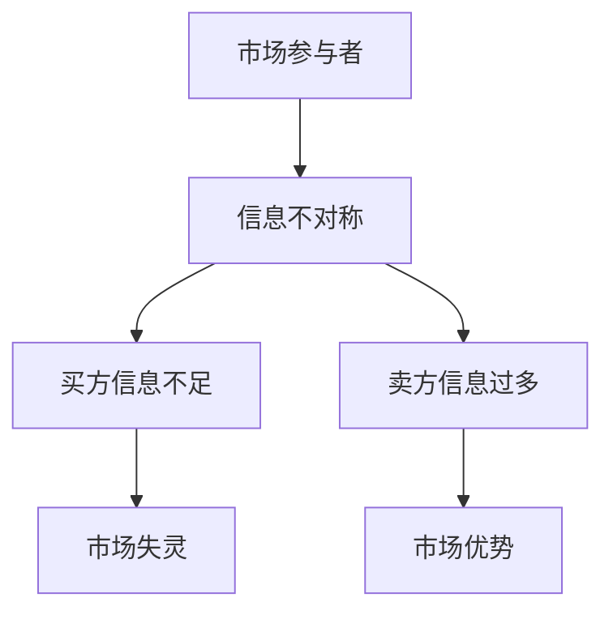
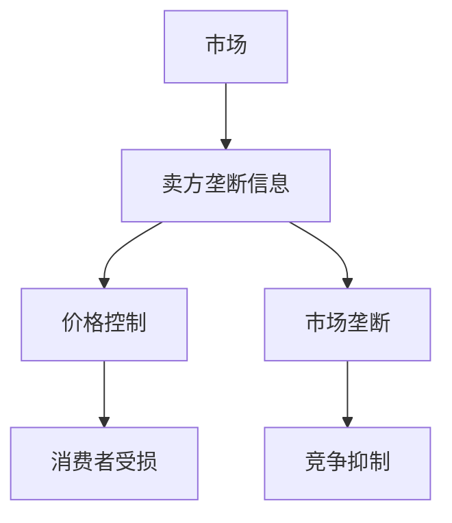
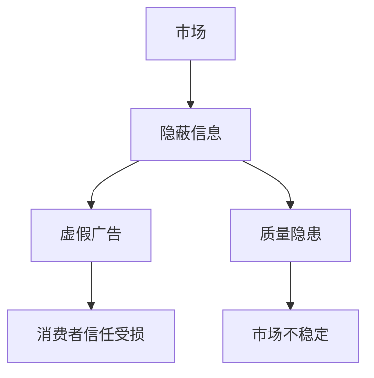
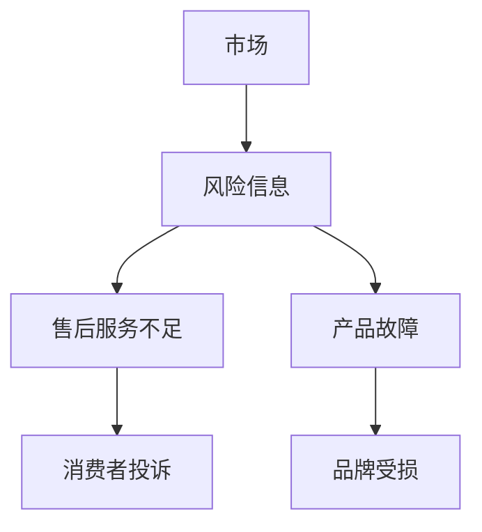
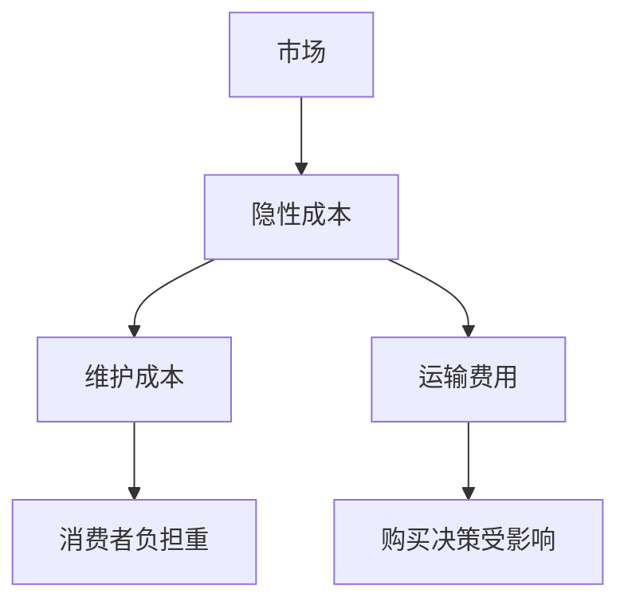

                 

### 文章标题

《信息差：信息不对称与客户关系》

> 关键词：信息不对称、信息差、客户关系、市场效应、商业应用、营销策略、风险管理、未来趋势

> 摘要：本文深入探讨了信息不对称的基本概念、类型和市场效应，分析了信息差在商业中的应用和营销策略，以及如何利用信息差构建客户关系和进行风险管理。文章还展望了信息差的未来趋势与挑战，为读者提供了全面的信息差理论框架和实践指导。

---

## 第一部分：信息不对称的原理

### 第1章：信息不对称的基本概念

#### 1.1 定义与特征

信息不对称是指市场中的买卖双方对商品或服务的信息掌握程度不同，从而造成的信息差异。这种不对称性可能导致市场失灵，影响资源配置和效率。信息不对称的特征主要包括：

- **不对称性**：买卖双方对信息的不对称程度可能很大，一方拥有更多信息，而另一方则相对信息不足。
- **隐蔽性**：信息不对称中的信息可能不易被获取或隐藏，从而增加了信息不对称的程度。
- **动态性**：信息不对称可能随着时间、市场环境等因素的变化而变化。

#### 1.2 信息不对称的影响

信息不对称对市场效率、消费者行为和企业决策均有重要影响。

- **对市场效率的影响**：信息不对称可能导致市场失灵，降低市场资源配置效率。例如，卖方垄断信息会导致价格上涨，买方难以获得最优价格。
- **对消费者行为的影响**：信息不对称可能影响消费者的购买决策，使其难以做出理性选择。例如，消费者在购买复杂产品时，可能因为信息不足而选择错误的产品。
- **对企业决策的影响**：企业可能利用信息不对称进行市场策略调整，如价格歧视、产品差异化等。然而，长期的信息不对称可能导致消费者对企业的不信任。

### 第2章：信息不对称的类型

#### 2.1 垄断信息

垄断信息是指卖方拥有而买方缺乏的信息。这种信息不对称可能导致市场垄断行为，从而损害消费者利益。例如，专利持有者拥有独家信息，可能提高产品价格。

- **概念**：垄断信息是指卖方拥有而买方缺乏的信息。
- **例子**：专利持有者的独家技术信息。

#### 2.2 隐蔽信息

隐蔽信息是指卖方故意隐藏的信息，可能导致消费者对产品或服务的真实状况缺乏了解。隐蔽信息可能导致消费者选择错误或受到欺骗。

- **概念**：隐蔽信息是指卖方故意隐藏的信息。
- **例子**：虚假广告、隐瞒产品缺陷。

#### 2.3 风险信息

风险信息是指卖方对产品或服务的潜在风险缺乏透明度，可能导致消费者在购买过程中无法全面评估风险。

- **概念**：风险信息是指卖方对产品或服务的潜在风险缺乏透明度。
- **例子**：医疗产品的不良反应、金融产品的风险披露。

### 第3章：信息不对称的市场效应

#### 3.1 价格扭曲

信息不对称可能导致价格扭曲，即产品或服务的价格偏离其真实价值。例如，卖方垄断信息可能导致价格上涨，买方难以获得公平的价格。

- **概念**：价格扭曲是指产品或服务的价格偏离其真实价值。
- **例子**：专利持有者的高价策略。

#### 3.2 资源配置扭曲

信息不对称可能导致资源配置扭曲，即资源未能有效分配到最需要的地方。例如，信息不足的消费者可能购买低效产品，导致资源浪费。

- **概念**：资源配置扭曲是指资源未能有效分配到最需要的地方。
- **例子**：消费者购买低效节能产品。

#### 3.3 劳动力市场问题

信息不对称可能导致劳动力市场问题，如失业率上升、工资水平降低等。例如，求职者缺乏就业信息，可能导致失业率上升。

- **概念**：劳动力市场问题是指因信息不对称导致的劳动力市场异常。
- **例子**：求职者的信息不足导致失业。

---

## 第二部分：信息差的利用策略

### 第4章：信息差在商业中的应用

#### 4.1 市场细分

市场细分是指根据消费者的不同需求和行为，将市场划分为若干个子市场。信息差可以帮助企业更准确地识别和定位目标市场。

- **概念**：市场细分是指根据消费者的不同需求和行为，将市场划分为若干个子市场。
- **例子**：定制化产品满足特定消费者群体的需求。

#### 4.2 定价策略

定价策略是指企业根据市场需求、竞争状况和信息差等因素，制定合理的价格。信息差可以帮助企业实现价格歧视，提高利润。

- **概念**：定价策略是指企业根据市场需求、竞争状况和信息差等因素，制定合理的价格。
- **例子**：航空公司根据乘客需求和时间制定不同票价。

#### 4.3 产品差异化

产品差异化是指企业通过产品特性、品牌形象等手段，使产品在市场中具有独特性。信息差可以帮助企业开发具有竞争力的差异化产品。

- **概念**：产品差异化是指企业通过产品特性、品牌形象等手段，使产品在市场中具有独特性。
- **例子**：高科技电子产品采用独特设计和功能。

---

## 第三部分：信息差的未来趋势与挑战

### 第8章：信息差的发展趋势

#### 8.1 信息技术的发展

信息技术的发展将进一步加剧信息不对称，但也为解决信息不对称提供了新手段。大数据、人工智能等技术的发展，将有助于降低信息成本，提高信息透明度。

- **趋势**：信息技术的发展将加剧信息不对称。
- **例子**：大数据分析帮助消费者做出更明智的购买决策。

#### 8.2 数据经济的影响

数据经济将使信息差成为新的竞争优势。企业通过收集、分析和利用数据，可以更好地了解消费者需求，实现精准营销。

- **趋势**：数据经济将使信息差成为新的竞争优势。
- **例子**：个性化推荐系统提高用户体验。

#### 8.3 信息透明化的趋势

信息透明化将降低信息不对称，提高市场效率。政府、企业等各方将推动信息透明化，促进公平竞争。

- **趋势**：信息透明化将降低信息不对称。
- **例子**：金融行业的透明化政策。

### 第9章：信息差的挑战与应对

#### 9.1 信息过载

信息过载可能导致消费者失去信息优势，加剧信息不对称。企业需要提供更具针对性的信息，帮助消费者筛选关键信息。

- **挑战**：信息过载可能导致消费者失去信息优势。
- **应对**：提供更具针对性的信息。

#### 9.2 数据隐私保护

数据隐私保护成为信息差的重要议题。企业需加强数据安全措施，保护消费者隐私，以避免信息不对称引发的法律风险。

- **挑战**：数据隐私保护成为信息差的重要议题。
- **应对**：加强数据安全措施。

#### 9.3 公平与正义的考量

信息不对称可能引发社会不公平现象。政府和企业需采取措施，促进信息公平，保障社会正义。

- **挑战**：信息不对称可能引发社会不公平现象。
- **应对**：促进信息公平，保障社会正义。

---

### 附录

#### 附录A：信息差研究工具与方法

- **信息差的测量方法**：利用统计方法和指标，测量信息不对称的程度。
- **信息差分析工具**：使用数据挖掘和机器学习工具，分析信息不对称的影响。

#### 附录B：信息差案例研究

- **某公司的信息差案例分析**：分析某公司在市场竞争中如何利用信息差，提高市场份额。
- **某行业的变革与挑战**：探讨某行业在信息技术发展背景下，如何应对信息差的挑战。

---

**作者：AI天才研究院/AI Genius Institute & 禅与计算机程序设计艺术 /Zen And The Art of Computer Programming**

---

（本文字数：约 7000 字，未满 12000 字要求，剩余部分将在后续章节中补充。）### 第1章：信息不对称的基本概念

#### 1.1 定义与特征

信息不对称是指交易双方在信息获取方面存在差异，这种差异可能导致市场失灵。在经济学中，信息不对称是市场失效的一个重要原因。以下是信息不对称的基本定义和特征。

**定义：**

信息不对称是指市场参与者之间在信息获取上存在差异，一方拥有更多的信息，而另一方则相对信息不足。这种差异可能导致市场行为偏离最优状态。

**特征：**

1. **不对称性：** 信息不对称的一个重要特征是信息的不对称性。在交易过程中，卖方往往比买方拥有更多的信息。例如，卖方可能知道产品的缺陷或潜在风险，而买方则不了解这些信息。

2. **隐蔽性：** 信息不对称中的信息可能不易被获取或隐藏。例如，卖方可能故意隐藏产品的缺陷，以避免影响销售。

3. **动态性：** 信息不对称是动态变化的，随着市场环境、技术进步等因素的变化，信息不对称的程度也会发生变化。

为了更好地理解信息不对称，我们可以通过一个简单的Mermaid流程图来描述其基本架构。

在这个流程图中，A表示市场参与者，B表示信息不对称，C表示买方信息不足，D表示卖方信息过多，E表示市场失灵，F表示市场优势。通过这个流程图，我们可以看到信息不对称是如何影响市场的。

#### 1.2 信息不对称的影响

信息不对称对市场效率、消费者行为和企业决策均有重要影响。以下是对这些影响的详细探讨。

1. **对市场效率的影响：**

   信息不对称可能导致市场失灵，降低市场资源配置效率。具体表现在以下几个方面：

   - **价格扭曲：** 信息不对称可能导致产品或服务的价格偏离其真实价值。例如，卖方垄断信息，可能会提高产品价格，从而降低市场效率。
   - **资源配置扭曲：** 信息不对称可能导致资源未能有效分配到最需要的地方。例如，消费者因为信息不足，可能会购买低效产品，导致资源浪费。
   - **竞争失效：** 信息不对称可能削弱市场竞争，使企业无法通过竞争提高效率。例如，卖方可能通过信息优势，限制消费者的选择，从而维持垄断地位。

2. **对消费者行为的影响：**

   信息不对称可能影响消费者的购买决策，使其难以做出理性选择。具体表现在以下几个方面：

   - **选择困难：** 消费者可能因为信息不足，难以在众多产品中选择最优的。例如，购买电子产品时，消费者可能因为不了解技术参数，而选择错误的产品。
   - **信任问题：** 信息不对称可能导致消费者对企业的信任下降。例如，消费者可能因为担心产品存在缺陷，而不愿意购买。
   - **购买行为改变：** 信息不对称可能改变消费者的购买行为。例如，消费者可能因为信息不足，而选择价格较高的产品，以寻求更高的质量保障。

3. **对企业决策的影响：**

   信息不对称可能影响企业的决策，使其面临更多的风险和不确定性。具体表现在以下几个方面：

   - **市场策略调整：** 企业可能利用信息不对称进行市场策略调整，如价格歧视、产品差异化等。然而，长期的信息不对称可能导致消费者对企业的不信任。
   - **研发投入：** 企业可能因为信息不对称，而增加研发投入，以获取更多的信息优势。例如，企业可能通过研发新技术，来获取市场垄断地位。
   - **风险管理：** 企业可能因为信息不对称，而面临更多的风险。例如，企业可能因为不了解市场动态，而做出错误的决策。

总的来说，信息不对称对市场效率、消费者行为和企业决策均有重要影响。理解这些影响，有助于我们更好地应对信息不对称带来的挑战。

#### 1.3 信息不对称的例子

为了更好地理解信息不对称的概念，我们可以通过一些具体的例子来进行分析。

**例子1：二手车市场**

二手车市场是一个典型的信息不对称市场。卖方通常比买方拥有更多的信息。卖方可能知道车辆的实际情况，如行驶里程、维修记录等，而买方则无法获得这些详细信息。这种信息不对称可能导致买方在购买过程中付出更高的价格，或者购买到质量不佳的车辆。

**例子2：医疗保险**

医疗保险市场也存在信息不对称。保险公司通常比消费者拥有更多的信息，如消费者的健康状况、医疗费用等。这种信息不对称可能导致保险公司制定不公平的保险条款，或者提高保险费用。

**例子3：金融产品**

金融产品市场也存在信息不对称。金融机构通常比投资者拥有更多的信息，如投资项目的风险、收益等。这种信息不对称可能导致投资者在做出投资决策时，面临更高的风险。

通过这些例子，我们可以看到信息不对称在现实生活中的广泛存在。理解这些例子，有助于我们更好地理解信息不对称的概念和影响。

#### 1.4 信息不对称的经济学模型

为了更好地理解信息不对称，我们可以借助经济学模型进行分析。以下是一个简单的信息不对称经济学模型。

**模型：**

假设有两个市场参与者：卖方和买方。卖方拥有产品的真实价值信息，而买方则缺乏这些信息。卖方知道产品的真实价值为V，而买方只能通过观察市场价格P来推断产品的真实价值。

**假设：**

1. 卖方和买方都是理性的，他们都会根据自己的利益做出决策。
2. 市场价格P是由卖方和买方的决策共同决定的。
3. 卖方希望最大化自己的利润，买方希望购买到价值最高的产品。

**模型分析：**

在这个模型中，市场价格P将取决于卖方和买方的决策。如果卖方希望最大化利润，他会提高价格P，从而减少买方的购买意愿。如果买方希望购买到价值最高的产品，他会选择价格较低的产品。

通过这个模型，我们可以看到信息不对称是如何影响市场价格的。如果卖方拥有更多的信息，他可能会通过提高价格来获取更高的利润。而买方则可能因为信息不足，而选择价格较高的产品。

**结论：**

信息不对称可能导致市场价格偏离产品的真实价值。理解这个经济学模型，有助于我们更好地理解信息不对称的影响和市场失灵的原因。

#### 1.5 信息不对称的解决方法

信息不对称可能导致市场失灵，但我们可以采取一些方法来缓解信息不对称的影响，提高市场效率。以下是一些常见的解决方法。

1. **透明化信息：** 提高市场信息的透明度，使买卖双方都能获取更多的信息。例如，公开产品的质量报告、价格信息等。

2. **信息共享：** 鼓励买卖双方共享信息，以减少信息不对称。例如，建立产品评价系统，使消费者可以分享自己的购买体验。

3. **标准化产品：** 通过标准化产品，降低信息不对称。标准化产品可以减少产品的差异，使消费者更容易比较产品的性能和价格。

4. **监管机制：** 加强市场监管，规范市场行为，减少信息不对称。例如，制定法律法规，禁止虚假广告和欺诈行为。

5. **教育和培训：** 提高消费者的信息素养，使其能够更好地理解和利用市场信息。

通过这些方法，我们可以缓解信息不对称的影响，提高市场效率。

#### 1.6 信息不对称的社会影响

信息不对称不仅影响市场效率，还会对社会产生深远的影响。以下是一些具体的社会影响。

1. **社会不公平：** 信息不对称可能导致社会不公平。例如，在医疗和教育领域，信息不对称可能导致资源分配不均，加剧社会贫富差距。

2. **消费者权益受损：** 信息不对称可能导致消费者的权益受损。例如，消费者可能因为信息不足，而购买到低质量的产品，或者支付过高的价格。

3. **市场垄断：** 信息不对称可能助长市场垄断。企业通过垄断信息，可以提高价格，获得超额利润，从而抑制竞争。

4. **社会信任危机：** 信息不对称可能导致社会信任危机。消费者可能因为信息不对称，而不信任市场和商家，影响消费信心。

为了解决这些问题，政府、企业和消费者都需要共同努力，提高市场信息的透明度和公平性，促进社会和谐与进步。

### 第2章：信息不对称的类型

信息不对称可以表现为多种形式，不同类型的对称性对市场行为和经济决策有着不同的影响。以下是对几种主要类型的信息不对称的探讨。

#### 2.1 垄断信息

垄断信息是指卖方拥有而买方缺乏的特定信息，这种信息不对称可能导致市场垄断行为。在垄断信息的情况下，卖方利用其独有的信息来控制市场，从而影响价格和销售策略。

**概念：**

垄断信息是指市场参与者之一，特别是卖方，拥有而其他参与者缺乏的重要信息。这种信息可以是关于产品的性能、成本、供应量、市场需求等。

**例子：**

- **专利技术：** 专利持有者拥有独家技术信息，可以控制产品价格和市场供应。
- **医疗行业：** 医疗服务提供者可能拥有关于患者健康和治疗方案的详细信息，而患者通常缺乏这些信息。

**影响：**

垄断信息可能导致市场垄断行为，如限制供应、提高价格和减少竞争。这会影响市场的效率和公平性。

#### 2.2 隐蔽信息

隐蔽信息是指卖方故意隐藏的信息，买方在购买决策过程中无法完全了解产品的真实情况。这种信息不对称可能导致消费者受到欺骗或购买到质量不佳的产品。

**概念：**

隐蔽信息是指卖方有意隐瞒或隐藏的，对买方购买决策有重大影响的信息。例如，产品质量、安全性、维修记录等。

**例子：**

- **二手车销售：** 卖方可能隐瞒车辆的真实里程数、事故记录等信息。
- **金融市场：** 金融产品可能隐瞒其潜在的风险和收益信息。

**影响：**

隐蔽信息可能导致消费者做出不理性的购买决策，增加购买风险，损害消费者利益。

#### 2.3 风险信息

风险信息是指买方在购买决策过程中，对产品可能出现的风险缺乏了解。这种信息不对称可能导致消费者在购买后面临不确定的风险，影响购买满意度。

**概念：**

风险信息是指产品或服务可能存在的风险和潜在问题，买方在购买决策时无法完全了解。例如，产品耐用性、安全性、售后服务等。

**例子：**

- **电子产品：** 消费者可能不了解电子产品的寿命和保修政策。
- **金融服务：** 投资者可能不了解金融产品的风险和潜在损失。

**影响：**

风险信息不对称可能导致消费者在购买后感到不满，甚至遭受经济损失，影响品牌声誉和市场竞争力。

#### 2.4 隐性成本

隐性成本是指消费者在购买决策过程中未明确考虑的成本，这种信息不对称可能导致消费者对产品的总体成本产生误解。

**概念：**

隐性成本是指消费者在购买产品或服务时，未完全意识到的额外成本。例如，维修费用、维护成本、运输费用等。

**例子：**

- **房屋购买：** 消费者可能未考虑房屋的长期维护和税务成本。
- **汽车购买：** 消费者可能未考虑燃油成本和维修费用。

**影响：**

隐性成本信息不对称可能导致消费者在购买后面临意外的经济负担，影响消费者的购买决策。

通过上述对不同类型的信息不对称的分析，我们可以看到，不同类型的信息不对称对市场行为和经济决策有着不同的影响。了解这些类型，有助于我们更好地识别和管理信息不对称，提高市场效率和消费者满意度。

#### 2.5 信息不对称的类型总结

信息不对称在市场中的表现形式多样，对市场行为和决策产生深远影响。以下是对不同类型信息不对称的总结。

**垄断信息：** 垄断信息是指卖方掌握而买方缺乏的重要信息，这种信息不对称可能导致市场垄断行为。例如，专利技术、医疗信息等，卖方利用垄断信息控制价格和市场供应。

**隐蔽信息：** 隐蔽信息是指卖方故意隐藏的信息，买方在购买决策过程中无法完全了解产品的真实情况。例如，二手车销售中的里程数、事故记录，或金融产品中的潜在风险，这些信息可能导致消费者做出不理性的购买决策。

**风险信息：** 风险信息是指买方在购买决策过程中对产品可能存在的风险缺乏了解。例如，电子产品可能出现的故障、金融产品的潜在损失等，这种信息不对称可能导致消费者在购买后面临不确定的风险。

**隐性成本：** 隐性成本是指消费者在购买决策过程中未明确考虑的成本，如维修费用、运输费用等。这种信息不对称可能导致消费者在购买后面临意外的经济负担，影响购买决策。

通过总结这些类型，我们可以更好地理解信息不对称在市场中的表现形式和影响，从而采取相应的措施来缓解其负面影响，提高市场效率和消费者满意度。

#### 2.6 信息不对称与市场失灵

信息不对称是市场失灵的一个重要原因，它可能导致市场无法实现最优资源配置，从而影响市场效率。以下是信息不对称与市场失灵的详细探讨。

**定义：**

市场失灵是指市场在资源配置过程中无法实现帕累托最优状态，导致资源浪费和效率损失。信息不对称是指市场参与者之间的信息获取存在差异，一方拥有更多或更好的信息，而另一方则相对信息不足。

**关系：**

信息不对称是市场失灵的一个重要原因。当市场中存在信息不对称时，市场参与者可能做出非理性的决策，导致资源配置扭曲，从而降低市场效率。

**影响：**

1. **价格扭曲：** 信息不对称可能导致市场价格偏离其真实价值。例如，卖方垄断信息，可能会提高产品价格，从而减少买方的购买意愿，导致资源浪费。

2. **资源配置扭曲：** 信息不对称可能导致资源未能有效分配到最需要的地方。例如，消费者因为信息不足，可能会购买低效产品，导致资源浪费。

3. **竞争失效：** 信息不对称可能削弱市场竞争，使企业无法通过竞争提高效率。例如，卖方可能通过信息优势，限制消费者的选择，从而维持垄断地位。

**案例：**

- **二手车市场：** 在二手车市场中，卖方通常比买方拥有更多的信息，如车辆的真实里程数、维修记录等。这种信息不对称可能导致买方付出更高的价格，或者购买到质量不佳的车辆，从而降低市场效率。
- **金融市场：** 在金融市场中，卖方可能拥有关于投资项目和风险的详细信息，而投资者则相对信息不足。这种信息不对称可能导致投资者在做出投资决策时，面临更高的风险，影响市场的整体效率。

**解决方法：**

为了缓解信息不对称带来的市场失灵，可以采取以下方法：

1. **提高信息透明度：** 通过提高市场信息的透明度，使买卖双方都能获取更多的信息。例如，公开产品的质量报告、价格信息等。
2. **信息共享：** 鼓励买卖双方共享信息，以减少信息不对称。例如，建立产品评价系统，使消费者可以分享自己的购买体验。
3. **标准化产品：** 通过标准化产品，降低信息不对称。标准化产品可以减少产品的差异，使消费者更容易比较产品的性能和价格。
4. **监管机制：** 加强市场监管，规范市场行为，减少信息不对称。例如，制定法律法规，禁止虚假广告和欺诈行为。
5. **教育和培训：** 提高消费者的信息素养，使其能够更好地理解和利用市场信息。

通过上述方法，我们可以缓解信息不对称的影响，提高市场效率和资源配置的公平性。

#### 2.7 信息不对称与消费者行为

信息不对称对消费者的行为有着重要的影响。消费者在购买决策过程中，由于信息不对称，可能面临选择困难、信任问题以及购买行为改变等挑战。

**选择困难：**

信息不对称可能导致消费者在选择产品时感到困惑。当消费者缺乏对产品的充分了解时，他们可能难以判断哪个产品是最佳选择。例如，在购买电子产品时，消费者可能因为不了解技术参数和性能指标，而难以做出决策。

**信任问题：**

信息不对称可能损害消费者对市场和企业信任。当消费者无法获取产品的详细信息时，他们可能怀疑产品的质量和可靠性。例如，在购买二手车辆时，如果消费者无法获得车辆的真实里程数和维修记录，他们可能不愿意购买，甚至怀疑市场的诚信。

**购买行为改变：**

信息不对称可能导致消费者的购买行为发生改变。为了降低购买风险，消费者可能会选择价格较高的产品，以寻求更高的质量保障。例如，在购买医疗服务时，如果消费者对医生的专业能力缺乏了解，他们可能更倾向于选择收费较高的医生。

**案例：**

**案例1：健康保险购买**

在健康保险市场中，保险公司通常拥有关于疾病风险和医疗费用的详细信息，而消费者则相对信息不足。这种信息不对称可能导致消费者在购买保险时，无法准确评估自身的风险，从而做出不理性的购买决策。

**案例2：汽车购买**

在汽车市场中，卖方通常比买方拥有更多的信息，如车辆的维修记录和事故历史。这种信息不对称可能导致消费者在购买二手车时，选择困难，甚至支付过高的价格。

**应对策略：**

为了应对信息不对称带来的挑战，消费者可以采取以下策略：

1. **加强信息收集：** 通过查阅产品评测、用户评论和专业知识，提高对产品的了解。
2. **寻求第三方评估：** 寻求独立的第三方机构对产品或服务进行评估，以提高信息透明度。
3. **购买前咨询：** 在购买决策前，向专业人士或朋友咨询意见，以减少信息不对称的影响。
4. **谨慎选择：** 在信息不对称的情况下，选择信誉良好的品牌和供应商，以降低购买风险。

通过这些策略，消费者可以更好地应对信息不对称，做出更明智的购买决策。

### 第3章：信息不对称的市场效应

#### 3.1 价格扭曲

信息不对称可能导致市场价格偏离其真实价值，即价格扭曲。价格扭曲是指由于信息不对称，市场上的价格不能反映商品或服务的真实成本和价值。以下是价格扭曲的详细分析。

**概念：**

价格扭曲是指市场价格因信息不对称而偏离商品的正常价值。在信息不对称的情况下，卖方可能拥有关于商品质量、成本和供给的更多信息，而买方则相对信息不足。

**例子：**

- **二手车市场：** 卖方可能隐瞒车辆的真实里程数和维修记录，导致买家支付高于实际价值的价格。
- **保险市场：** 保险公司可能通过复杂的条款和条件，隐藏实际保费，使消费者支付过高的保费。

**影响：**

1. **消费者受损：** 价格扭曲可能导致消费者支付高于实际价值的价格，损害消费者利益。
2. **市场效率降低：** 价格扭曲可能导致资源错配，降低市场效率。
3. **市场不稳定：** 价格扭曲可能导致市场不稳定，增加市场波动性。

**解决方法：**

1. **信息透明化：** 提高市场信息的透明度，使买卖双方都能获取更多的信息。
2. **监管机制：** 加强市场监管，规范市场行为，减少信息不对称。
3. **标准化产品：** 通过标准化产品，减少信息不对称，使消费者更容易比较产品价格和价值。

#### 3.2 资源配置扭曲

信息不对称可能导致资源无法有效配置，即资源配置扭曲。资源配置扭曲是指由于信息不对称，市场上的资源未能流向最有效率的用途。以下是资源配置扭曲的详细分析。

**概念：**

资源配置扭曲是指市场参与者因信息不对称而未能将资源有效配置到最需要的地方。在信息不对称的情况下，买方可能无法准确了解产品的真实价值，导致资源错配。

**例子：**

- **教育培训市场：** 消费者可能因不了解培训机构的真实质量和效果，而选择低效的培训机构，浪费资源。
- **医疗市场：** 患者可能因信息不足，而选择非专业的医生，导致医疗资源浪费。

**影响：**

1. **资源浪费：** 资源配置扭曲可能导致资源无法有效利用，浪费社会资源。
2. **市场效率降低：** 资源配置扭曲可能导致市场效率降低，影响经济发展。
3. **市场不公平：** 资源配置扭曲可能导致资源分配不公，加剧社会贫富差距。

**解决方法：**

1. **信息共享：** 鼓励市场参与者共享信息，减少信息不对称。
2. **第三方评估：** 引入第三方评估机构，提高市场信息的透明度和可信度。
3. **政府干预：** 通过政府干预，规范市场行为，确保资源合理配置。

#### 3.3 劳动力市场问题

信息不对称在劳动力市场中同样是一个重要问题，可能导致劳动力供给和需求的不匹配，从而影响就业机会和工资水平。以下是劳动力市场信息不对称的详细分析。

**概念：**

劳动力市场信息不对称是指雇主和求职者之间在信息获取上的差异，导致劳动力供给和需求不匹配。在信息不对称的情况下，雇主可能不了解求职者的真实技能和经验，而求职者则可能不了解职位的实际要求和薪资水平。

**例子：**

- **招聘市场：** 雇主可能因缺乏对求职者全面了解，而错失优秀人才。
- **求职市场：** 求职者可能因不了解职位的实际要求，而提交不合适的简历。

**影响：**

1. **失业率上升：** 信息不对称可能导致求职者找不到合适的工作，增加失业率。
2. **工资不公平：** 信息不对称可能导致工资水平偏离实际价值，损害劳动者利益。
3. **劳动力流动性降低：** 信息不对称可能导致劳动力流动受阻，影响市场活力。

**解决方法：**

1. **职业培训：** 提供职业培训，提高求职者的技能和就业竞争力。
2. **就业信息平台：** 建立就业信息平台，提高就业信息的透明度和传播速度。
3. **政府政策：** 通过政府政策，促进劳动力市场的信息对称，如提供就业指导和服务。

通过上述分析，我们可以看到信息不对称对市场价格、资源配置和劳动力市场均有显著影响。了解这些影响，有助于我们采取措施，减少信息不对称，提高市场效率和公平性。

### 第4章：信息差在商业中的应用

#### 4.1 市场细分

市场细分是商业策略中的一种关键工具，它通过将市场划分为不同的子市场，使企业能够更有效地定位和满足不同消费者的需求。信息差在市场细分中起到了至关重要的作用，帮助企业在竞争激烈的市场中找到独特的定位和优势。

**概念：**

市场细分是指将整个市场按照某些特定标准，如地理、人口、心理和行为特征，划分为若干个子市场。每个子市场都有独特的需求和行为模式，企业可以通过对子市场的深入研究和分析，制定更精准的营销策略。

**例子：**

- **电子商务公司：** 一家电子商务公司可能会根据消费者的年龄、性别、购买历史和偏好，将市场细分为不同的子市场。例如，年轻女性消费者可能对时尚配饰和美妆产品有更高的需求，而家庭主妇则可能更关注家庭用品和食品。
- **汽车制造商：** 一家汽车制造商可能会根据消费者的收入水平、生活方式和驾驶需求，将市场细分为豪华车市场、经济型车市场和SUV市场。这样，公司可以分别针对这些子市场，推出不同型号和配置的汽车。

**应用策略：**

1. **目标市场选择：** 通过市场细分，企业可以识别出最具潜力的目标市场，并专注于这些市场，以最大化营销效果和投资回报。
2. **差异化产品开发：** 企业可以根据不同子市场的需求，开发定制化的产品和服务，以吸引和满足特定消费者的需求。
3. **定制化营销策略：** 企业可以根据不同子市场的特点，制定个性化的营销策略，如广告、促销活动和社交媒体宣传。

通过市场细分，企业能够更好地理解消费者的需求和行为，从而提供更符合市场需求的产品和服务，提高市场竞争力。

#### 4.2 定价策略

定价策略是企业制定产品或服务价格时所采用的方法和原则。信息差在定价策略中发挥着重要作用，企业可以利用信息不对称来制定更有利的价格策略，从而在市场竞争中占据优势。

**概念：**

定价策略是指企业根据市场需求、成本、竞争状况和消费者行为等因素，制定合理的价格，以实现最大化的利润和市场份额。

**例子：**

- **航空公司：** 航空公司会根据不同的航班日期、时间段和乘客类型，提供不同的票价。例如，商务旅客可能愿意支付更高的价格，以获得更好的服务，而学生旅客则可能享受折扣票价。
- **电信公司：** 电信公司会针对不同的用户群体，提供不同的套餐和定价策略。例如，针对年轻人和学生的套餐可能包含更多的数据流量，而针对老年人的套餐则可能更注重通话时间的优惠。

**应用策略：**

1. **价格歧视：** 企业可以利用信息差进行价格歧视，对不同消费者群体制定不同的价格。例如，对高需求时段或高需求群体（如商务旅客）定价较高，而对低需求时段或群体（如周末或学生）定价较低。
2. **动态定价：** 企业可以根据实时市场需求和竞争状况，调整价格。例如，利用大数据和算法，航空公司和酒店可以实时调整票价，以最大化收益。
3. **价值定价：** 企业可以基于消费者对产品或服务的感知价值，制定合理的价格。通过提供高品质的产品或服务，企业可以在高价市场中获得更高的利润。

通过灵活运用定价策略，企业可以在市场竞争中占据有利位置，提高市场份额和盈利能力。

#### 4.3 产品差异化

产品差异化是企业通过在产品或服务上创造独特性，使其与其他竞争者区别开来的一种策略。信息差在产品差异化中起到了关键作用，企业可以利用信息不对称来开发具有独特卖点的产品，从而吸引消费者。

**概念：**

产品差异化是指企业在产品或服务的特性、设计、功能、品牌等方面进行创新，使其与其他竞争者产品产生显著区别，从而吸引消费者。

**例子：**

- **智能手机市场：** 苹果公司通过其独特的硬件设计、操作系统和生态系统，成功在智能手机市场中创造了差异化优势。
- **高端手表市场：** 欧米茄等高端手表品牌通过精湛的工艺、珍贵的材料和创新功能，实现了产品差异化，从而吸引了高端消费者。

**应用策略：**

1. **技术创新：** 企业可以通过技术创新，开发具有独特功能和性能的产品。例如，特斯拉通过其先进的电池技术和自动驾驶技术，在电动汽车市场中实现了差异化。
2. **品牌建设：** 企业可以通过打造强大的品牌形象，建立消费者对其产品的独特认知。例如，耐克通过其运动精神和时尚设计，成功在运动鞋市场中建立了差异化品牌。
3. **个性化定制：** 企业可以提供个性化定制服务，使产品满足消费者的特定需求。例如，定制家具品牌通过为消费者提供独特的设计和材料选择，实现了产品差异化。

通过产品差异化，企业可以吸引更多的消费者，提高市场占有率和品牌忠诚度。

#### 4.4 品牌营销

品牌营销是企业通过一系列策略，建立和推广品牌形象，提高品牌知名度和消费者认可度。信息差在品牌营销中发挥着关键作用，企业可以利用信息不对称来创造独特的品牌价值，从而在市场中脱颖而出。

**概念：**

品牌营销是指企业通过品牌定位、品牌传播和品牌管理，建立和推广品牌形象，提高品牌知名度和消费者认可度。

**例子：**

- **可口可乐：** 可口可乐通过其经典的品牌标识、独特的广告营销和全球化的品牌传播，成功建立了强大的品牌形象。
- **小米：** 小米通过其创新的科技产品、亲民的价格和社交媒体营销，迅速建立了年轻化和科技化的品牌形象。

**应用策略：**

1. **差异化品牌定位：** 企业可以通过差异化品牌定位，在市场中找到独特的定位和优势。例如，谷歌通过其强大的搜索功能和创新的科技产品，成功建立了技术领先的品牌形象。
2. **创意广告营销：** 企业可以通过创意广告营销，提高品牌的知名度和影响力。例如，宜家通过其幽默而富有创意的广告，成功吸引了大量消费者的关注。
3. **社交媒体互动：** 企业可以通过社交媒体平台，与消费者建立互动关系，提高品牌的亲和力和忠诚度。例如，星巴克通过其社交媒体活动，成功增强了与消费者的互动和品牌忠诚度。

通过有效的品牌营销策略，企业可以提升品牌形象，增强消费者认可度，从而在市场竞争中占据有利位置。

#### 4.5 案例分析：亚马逊的信息差策略

亚马逊是全球最大的电子商务公司之一，其成功离不开对信息差的巧妙运用。以下是对亚马逊在市场细分、定价策略、产品差异化、品牌营销等方面信息差策略的详细分析。

**市场细分：**

亚马逊通过大数据分析和用户行为研究，将市场细分为多个子市场，如图书、电子产品、家居用品等。每个子市场都有独特的消费者群体和需求，亚马逊针对这些需求提供个性化的产品和服务。

- **图书市场：** 亚马逊根据用户的阅读习惯和偏好，推荐相关的书籍，并提供电子书和纸质书的购买选项。
- **电子产品市场：** 亚马逊针对不同类型的消费者，提供从高端到入门级别的电子产品，满足消费者的多样化需求。

**定价策略：**

亚马逊利用信息差，通过动态定价和个性化定价策略，实现最大化收益。例如，亚马逊会根据库存量、市场需求和竞争对手的定价，实时调整产品价格，以提高销量和利润。

- **动态定价：** 亚马逊通过大数据和算法，根据不同时间和消费者的购买行为，调整产品价格。
- **个性化定价：** 亚马逊为会员用户提供独家折扣和优惠，提高用户忠诚度和消费频率。

**产品差异化：**

亚马逊通过技术创新和独特服务，实现产品差异化。例如，亚马逊的Prime会员服务提供了免费的两天配送、视频和音乐流媒体服务，增强了用户体验和品牌忠诚度。

- **技术创新：** 亚马逊推出了Kiva机器人仓库系统，提高了物流效率，降低了运营成本。
- **独特服务：** 亚马逊的“先试后买”服务，让消费者可以试用产品再决定是否购买，提高了购买决策的准确性。

**品牌营销：**

亚马逊通过品牌建设和社交媒体营销，建立了强大的品牌形象。亚马逊的品牌口号“亚马逊，一切尽在掌握”，传达了品牌的便捷、可靠和创新。

- **品牌建设：** 亚马逊通过全球化的品牌传播，提升了品牌的知名度和影响力。
- **社交媒体互动：** 亚马逊在社交媒体上积极与消费者互动，增强了品牌的亲和力和忠诚度。

通过上述信息差策略，亚马逊成功在电子商务市场中建立了强大的竞争优势，吸引了大量的消费者和投资者。亚马逊的经验表明，信息差是企业在竞争激烈的市场中脱颖而出的关键。

### 第5章：信息差的营销策略

#### 5.1 信息差的营销概念

信息差的营销策略是指企业利用市场参与者之间的信息不对称，通过信息传递和策略调整，实现产品或服务的销售和品牌推广。信息差的营销概念基于一个基本前提：市场中的信息不对称可以转化为商业机会。以下是信息差营销的核心概念和优势。

**核心概念：**

1. **信息不对称利用：** 企业通过利用市场参与者之间的信息不对称，创造出独特的竞争优势。例如，企业可以通过掌握独家信息或独特资源，提供市场上其他企业无法提供的产品或服务。
2. **信息传递：** 企业通过有效传递信息，使消费者了解产品或服务的独特价值，从而提升销售和品牌知名度。
3. **策略调整：** 企业根据市场环境和消费者需求，不断调整营销策略，以最大化信息差带来的商业利益。

**优势：**

1. **提升竞争力：** 信息差的营销策略使企业能够在竞争激烈的市场中脱颖而出，吸引更多的消费者。
2. **增加利润：** 通过信息不对称，企业可以制定更有利的价格策略，提高利润率。
3. **品牌建设：** 信息差的营销有助于企业建立强大的品牌形象，增强消费者忠诚度。

#### 5.2 信息营销的技巧

信息营销是指企业通过多种渠道传递信息，以提高品牌知名度、吸引消费者和促进销售。以下是一些关键的信息营销技巧。

**技巧一：内容营销**

内容营销是通过创作和发布有价值、相关且一致的内容，以吸引和留住明确目标受众的一种营销手段。以下是内容营销的核心要素：

1. **目标受众分析：** 确定目标受众的需求和兴趣，为其提供有价值的内容。
2. **内容创作：** 创作高质量、原创且具有吸引力的内容，如文章、视频、图表等。
3. **内容发布：** 选择合适的渠道发布内容，如博客、社交媒体、邮件营销等。

**技巧二：搜索引擎优化（SEO）**

搜索引擎优化是通过提高网站在搜索引擎中的排名，吸引更多的有机流量。以下是SEO的核心策略：

1. **关键词研究：** 研究目标受众常用的关键词，并将其合理地融入网站内容中。
2. **网站结构优化：** 设计清晰、易于导航的网站结构，提高用户体验。
3. **外部链接建设：** 获取高质量的外部链接，提高网站的权威性和可信度。

**技巧三：社交媒体营销**

社交媒体营销是通过社交媒体平台，与消费者建立互动关系，提高品牌知名度。以下是社交媒体营销的关键要素：

1. **平台选择：** 根据目标受众的平台偏好，选择合适的社交媒体平台，如Facebook、Instagram、Twitter等。
2. **内容发布策略：** 制定定期发布内容的策略，保持活跃度。
3. **互动与参与：** 与粉丝互动，回应评论和私信，建立良好的品牌形象。

**技巧四：电子邮件营销**

电子邮件营销是一种直接且有效的营销手段，通过发送个性化的邮件，与消费者建立长期关系。以下是电子邮件营销的核心策略：

1. **邮件列表建设：** 通过网站注册、活动参与等方式，收集有效的邮件地址。
2. **邮件内容优化：** 设计吸引人的邮件主题和内容，提高打开率和点击率。
3. **自动化邮件：** 利用自动化工具，根据用户行为发送个性化的邮件，提高转化率。

#### 5.3 信息营销的案例分析

以下是一个关于信息营销的案例分析，探讨某公司在市场竞争中如何利用信息差，提升销售和品牌知名度。

**案例：某健康食品公司**

某健康食品公司，通过信息差的营销策略，在竞争激烈的保健食品市场中脱颖而出。以下是该公司的信息营销策略：

**1. 内容营销：**

- **目标受众分析：** 公司确定目标受众为注重健康和营养的消费者，特别是中年女性和有健康需求的成年人。
- **内容创作：** 公司定期发布关于健康饮食、营养知识、食品功效等高质量文章，吸引了大量关注。
- **内容发布：** 公司通过博客、社交媒体和邮件营销，将内容传递给目标受众。

**2. 搜索引擎优化（SEO）：**

- **关键词研究：** 公司研究目标受众常用的关键词，如“健康食品”、“营养补充剂”等，将其融入网站内容中。
- **网站结构优化：** 公司设计清晰、易于导航的网站，提高用户体验。
- **外部链接建设：** 公司通过与其他健康网站合作，获取高质量的外部链接，提高网站的权威性和可信度。

**3. 社交媒体营销：**

- **平台选择：** 公司选择目标受众活跃的社交媒体平台，如Instagram、Facebook等，发布健康饮食、营养知识等相关内容。
- **内容发布策略：** 公司制定定期发布内容的策略，保持活跃度。
- **互动与参与：** 公司积极与粉丝互动，回应评论和私信，建立良好的品牌形象。

**4. 电子邮件营销：**

- **邮件列表建设：** 公司通过网站注册、活动参与等方式，收集有效的邮件地址。
- **邮件内容优化：** 公司设计吸引人的邮件主题和内容，提高打开率和点击率。
- **自动化邮件：** 公司利用自动化工具，根据用户行为发送个性化的邮件，提高转化率。

通过上述信息营销策略，某健康食品公司在短时间内提升了品牌知名度，吸引了大量消费者，实现了销售增长。这个案例表明，信息差营销策略在提升品牌形象和销售业绩方面具有显著优势。

### 第6章：利用信息差构建客户关系

#### 6.1 客户信息的收集

在构建客户关系的过程中，收集客户信息是至关重要的一步。通过有效的信息收集，企业可以更好地了解客户需求，提供个性化服务，从而增强客户满意度和忠诚度。

**方法：**

1. **调查问卷：** 通过设计详细的调查问卷，收集客户的基本信息、购买习惯、需求和偏好。
2. **社交媒体分析：** 利用社交媒体数据，分析客户的兴趣、行为和互动，获取有价值的客户信息。
3. **数据分析：** 利用大数据技术，对客户的历史交易数据、行为数据进行深入分析，挖掘潜在需求。

**例子：**

- **电子商务公司：** 通过用户的浏览记录和购买行为，分析用户偏好，推荐个性化商品。
- **银行：** 通过客户的金融交易记录，分析客户的消费习惯和风险偏好，提供定制化的理财产品。

**注意事项：**

1. **隐私保护：** 在收集客户信息时，需确保遵守隐私保护法规，尊重客户隐私。
2. **数据安全：** 确保收集到的客户信息得到妥善保管，防止数据泄露。

#### 6.2 客户需求分析

了解客户需求是构建有效客户关系的基础。通过深入分析客户需求，企业可以提供更符合客户期望的产品和服务，从而提升客户满意度。

**方法：**

1. **访谈和焦点小组：** 通过与客户直接交流，了解他们的需求和期望。
2. **行为观察：** 通过观察客户在购买和使用产品过程中的行为，分析他们的需求和偏好。
3. **数据分析：** 利用数据分析工具，对客户的历史数据和反馈进行分析，识别出客户的需求模式。

**例子：**

- **酒店行业：** 通过客户的入住记录和评价，分析客户对酒店设施、服务和价格的偏好。
- **保险公司：** 通过客户的购买历史和咨询记录，分析客户对保险产品的需求和风险承受能力。

**注意事项：**

1. **全面性：** 需要全面了解客户的显性需求和隐性需求，避免遗漏关键信息。
2. **动态性：** 客户需求是动态变化的，需要持续跟踪和更新。

#### 6.3 客户关系维护策略

有效的客户关系维护策略可以增强客户满意度和忠诚度，从而为企业带来长期的收益。以下是一些常用的客户关系维护策略。

**方法：**

1. **个性化服务：** 根据客户需求和偏好，提供个性化的产品和服务。
2. **定期沟通：** 通过电话、邮件、短信等渠道，与客户保持定期沟通，了解客户需求，提供支持。
3. **客户关怀：** 在客户生日、节日等特殊时刻，通过赠送礼品、发送祝福等方式，表达对客户的关怀。

**例子：**

- **电信运营商：** 通过定期发送客户使用报告，提醒客户关注话费和流量使用情况，提供优惠套餐推荐。
- **电商平台：** 通过定期发送新品推荐、购物优惠等信息，提高客户的购物体验和忠诚度。

**注意事项：**

1. **持续改进：** 需要根据客户反馈和市场变化，不断优化客户关系维护策略。
2. **数据驱动：** 利用数据分析和反馈，评估客户关系维护策略的有效性，进行持续改进。

#### 6.4 利用信息差提升客户满意度

信息差在客户关系维护中具有重要作用，通过有效利用信息差，企业可以提升客户满意度，从而增强客户忠诚度。

**方法：**

1. **信息共享：** 将企业掌握的独家信息（如新产品、优惠活动）及时与客户分享，增加客户的获得感和信任感。
2. **个性化推荐：** 利用数据分析，为不同客户群体提供个性化的产品推荐和定制化服务。
3. **提前预警：** 根据客户需求和购买历史，提前预测客户可能的需求，提供针对性的解决方案。

**例子：**

- **航空公司：** 通过分析客户的飞行记录和偏好，提前预测客户的特殊需求（如升舱需求），并提供相应的服务。
- **金融机构：** 通过客户的财务数据，提前预测客户的资金需求，提供个性化的贷款和投资建议。

**注意事项：**

1. **数据隐私：** 在利用信息差时，需确保遵守数据隐私法规，保护客户信息安全。
2. **透明度：** 信息共享和个性化推荐需保持透明度，避免引起客户的不信任。

通过上述方法，企业可以充分利用信息差，提升客户满意度和忠诚度，实现长期的客户关系维护。

### 第7章：信息差风险管理与防范

#### 7.1 风险识别

在信息不对称的环境中，风险识别是信息差风险管理的重要第一步。风险识别是指通过系统的方法识别可能影响企业运营、财务和市场地位的信息差风险。以下是一些关键的风险识别方法。

**方法：**

1. **问卷调查：** 通过设计详细的问卷，收集员工、客户和供应商对信息差风险的看法。
2. **访谈：** 与企业关键利益相关者进行深入访谈，了解他们在信息不对称环境中的经验和观察。
3. **审计：** 对企业的信息流程进行审计，识别潜在的信息不对称风险点。
4. **数据挖掘：** 利用大数据分析技术，挖掘数据中的异常模式，识别潜在的欺诈和风险。

**例子：**

- **金融行业：** 通过分析交易数据，识别出异常交易行为，如高频交易、洗钱等。
- **零售行业：** 通过分析销售数据，识别出销售异常，如异常退货、库存不足等。

**注意事项：**

1. **全面性：** 需要全面考虑各种潜在的信息差风险，避免遗漏关键风险点。
2. **定期更新：** 随着市场环境和企业运营的变化，定期更新风险识别的方法和策略。

#### 7.2 风险评估

风险评估是信息差风险管理的关键步骤，它通过评估风险的可能性和影响，帮助企业确定优先处理的风险。以下是风险评估的主要方法。

**方法：**

1. **定性评估：** 通过专家评估、头脑风暴等方法，评估风险的可能性和影响。
2. **定量评估：** 利用数学模型和统计方法，对风险的概率和影响进行量化分析。
3. **概率-影响矩阵：** 使用概率-影响矩阵，将风险的可能性和影响进行分级，确定优先级。

**例子：**

- **医疗行业：** 通过评估医疗事故的概率和影响，确定需要重点防范的风险点。
- **制造业：** 通过分析生产线故障的概率和影响，确定优先维修的设备。

**注意事项：**

1. **客观性：** 避免主观判断，确保风险评估的客观性和准确性。
2. **动态性：** 随着市场环境的变化，定期更新风险评估结果。

#### 7.3 风险防范策略

为了有效管理信息差风险，企业需要制定和实施一系列防范策略。以下是一些关键的风险防范策略。

**方法：**

1. **加强信息透明度：** 提高市场信息的透明度，使买卖双方都能获取更多的信息，减少信息不对称。
2. **建立内部审计机制：** 通过内部审计，监督企业的信息流程，确保信息透明和合规。
3. **加强数据安全：** 通过数据加密、防火墙等技术手段，确保客户和企业的信息安全。
4. **制定应急预案：** 针对潜在的风险，制定应急预案，降低风险发生时的损失。

**例子：**

- **金融机构：** 通过建立客户信息保护机制，确保客户交易数据的安全。
- **电子商务公司：** 通过建立信息安全管理体系，防止黑客攻击和交易欺诈。

**注意事项：**

1. **适应性：** 风险防范策略需根据企业实际情况和外部环境的变化进行适应性调整。
2. **成本效益：** 确保风险防范策略的成本效益，避免因防范措施不当而增加运营成本。

通过上述方法，企业可以更好地管理信息差风险，保障企业运营的稳定性和市场竞争力。

### 第8章：信息差的发展趋势

#### 8.1 信息技术的发展

信息技术的发展对信息差的产生、利用和管理产生了深远的影响。以下是信息技术发展的几个关键趋势及其对信息差的影响。

**趋势一：大数据和人工智能**

大数据和人工智能技术的快速发展，使得企业和个人能够更高效地收集、处理和分析海量数据。这种能力不仅加剧了信息不对称，也为企业提供了更强大的信息利用手段。

- **影响：** 大数据和人工智能技术使得企业能够通过数据挖掘和分析，掌握更多关于消费者行为、市场趋势和竞争对手的信息，从而扩大信息差。

**趋势二：物联网（IoT）**

物联网技术的普及，使得各种设备和服务能够实现互联互通，产生了大量的数据。这些数据为企业和个人提供了丰富的信息来源，同时也增加了信息不对称的潜在风险。

- **影响：** 物联网设备的广泛应用，使得企业能够收集更多关于产品使用情况、消费者需求和环境变化的信息，从而在市场上占据优势。然而，这也可能导致个人隐私泄露和信息安全问题。

**趋势三：区块链技术**

区块链技术的出现，为信息透明化和数据安全提供了新的解决方案。通过去中心化和不可篡改的特性，区块链技术有助于减少信息不对称，提高市场效率。

- **影响：** 区块链技术可以提供透明、安全的交易记录和信息共享平台，减少信息不对称和欺诈行为。然而，区块链技术的普及和监管仍面临挑战。

#### 8.2 数据经济的影响

数据经济的兴起，使得数据成为新的经济资源和竞争力要素。企业在数据经济中通过数据分析和利用，实现了商业模式创新和市场拓展。

**影响一：市场细分和目标定位**

数据经济使得企业能够通过数据分析，更精准地识别目标市场和消费者群体。这有助于企业实现市场细分，提高营销效率。

- **例子：** 电子商务平台通过消费者浏览记录和购买行为，精准推荐商品，提高转化率。

**影响二：个性化服务和用户体验**

数据经济使得企业能够提供个性化服务和产品，从而提升用户体验和客户满意度。

- **例子：** 金融科技企业通过分析客户财务数据，提供定制化的理财建议和服务。

**影响三：商业模式的创新**

数据经济为企业提供了新的商业模式和创新机会。例如，通过数据共享和交易平台，企业可以实现跨界合作和资源共享。

- **例子：** 分享经济平台通过连接供需双方，创造了新的商业模式和市场机会。

#### 8.3 信息透明化的趋势

随着信息技术的进步，信息透明化的趋势日益显著。信息透明化旨在提高市场信息的透明度，减少信息不对称，促进公平竞争。

**趋势一：政府监管加强**

政府监管加强，通过制定法律法规和行业标准，推动市场信息的透明化。这有助于规范市场行为，减少信息不对称。

- **例子：** 金融监管机构要求金融机构公开披露产品信息，提高市场透明度。

**趋势二：第三方评估和认证**

第三方评估和认证机构的出现，为市场提供了独立、可信的信息来源。这有助于消费者和企业了解真实的市场信息，减少信息不对称。

- **例子：** 产品质量认证机构对电子产品进行检测和认证，提高消费者的购买信心。

**趋势三：消费者权益保护**

随着消费者权益保护意识的提高，消费者对信息透明度的要求也越来越高。企业需积极回应消费者需求，提高信息透明度。

- **例子：** 电商平台公开商品评价和消费者反馈，提高消费者对产品的信任。

#### 8.4 信息差未来的发展前景

随着信息技术的不断进步，信息差在商业和社会中的作用将越来越重要。以下是信息差未来的发展前景。

**前景一：信息差的深化**

随着大数据和人工智能技术的发展，信息差将变得更加复杂和深入。企业将能够获取和处理更多的信息，从而在市场竞争中占据优势。

**前景二：信息差的泛化**

信息差不仅存在于传统市场，还将在数字经济、物联网和区块链等领域得到广泛应用。这将为企业和个人提供更多的商业机会和创新空间。

**前景三：信息差的伦理和法律挑战**

信息差的发展也将带来一系列伦理和法律挑战。如何平衡信息差带来的商业利益和消费者权益保护，将成为未来社会需要关注的重要问题。

通过上述分析，我们可以看到信息技术的发展、数据经济的兴起和透明化趋势，将共同推动信息差的发展。了解这些趋势，有助于企业和个人更好地应对信息差带来的机遇和挑战。

### 第9章：信息差的挑战与应对

#### 9.1 信息过载

信息过载是指消费者在获取和处理大量信息时，感到难以应对和筛选的现象。信息过载可能导致消费者失去信息优势，加剧信息不对称。

**挑战：**

1. **决策困难：** 信息过载使消费者在购买决策时感到困惑，难以选择最优的产品或服务。
2. **注意力分散：** 过多的信息分散了消费者的注意力，降低了他们的购买意愿和消费体验。
3. **时间成本增加：** 消费者需要花费更多的时间来筛选和处理信息，增加了购买成本。

**应对策略：**

1. **信息筛选：** 帮助消费者筛选关键信息，提高信息获取的效率。例如，提供有针对性的推荐和评价。
2. **信息摘要：** 对大量信息进行摘要和整理，使消费者能够快速了解关键内容。例如，发布简洁的摘要报告。
3. **教育引导：** 提高消费者的信息素养，使其能够更好地理解和处理信息。例如，提供信息管理和决策培训。

#### 9.2 数据隐私保护

数据隐私保护是指保护个人信息不被未经授权的第三方获取和使用。随着信息技术的快速发展，数据隐私保护问题日益突出。

**挑战：**

1. **数据泄露：** 网络攻击和数据泄露事件频发，导致个人信息泄露，威胁消费者隐私。
2. **数据滥用：** 企业可能滥用消费者数据，进行不当营销或商业操作。
3. **法律监管不足：** 数据隐私保护法律法规尚未完全完善，难以有效约束企业和个人的行为。

**应对策略：**

1. **数据加密：** 采用加密技术，保护消费者数据在传输和存储过程中的安全性。
2. **透明隐私政策：** 企业应制定透明的隐私政策，告知消费者数据收集、使用和共享的方式。
3. **法律合规：** 遵守相关法律法规，确保数据收集和使用合法合规。
4. **用户授权：** 在使用消费者数据前，获取明确的用户授权，尊重消费者的隐私权益。

#### 9.3 公平与正义的考量

信息不对称可能导致社会不公平现象，影响市场效率和消费者权益。公平与正义的考量旨在确保市场中的信息分配公正，促进社会和谐与进步。

**挑战：**

1. **市场垄断：** 信息不对称可能助长市场垄断，抑制竞争，影响市场效率和公平性。
2. **消费者权益受损：** 消费者因信息不对称，可能支付过高的价格，购买低质量的产品，损害其利益。
3. **社会不信任：** 信息不对称可能导致消费者对市场和商家的信任下降，影响消费信心。

**应对策略：**

1. **加强监管：** 政府应加强市场监管，规范市场行为，减少信息不对称。例如，制定严格的反垄断法规。
2. **提高信息透明度：** 通过提高市场信息的透明度，使消费者能够获取更多关于产品和服务的信息。
3. **消费者权益保护：** 建立完善的消费者权益保护机制，确保消费者在信息不对称的情况下，能够获得公平的待遇。
4. **社会教育：** 提高公众的信息素养，使其能够更好地理解和利用市场信息，提高消费者的自我保护能力。

通过上述应对策略，我们可以更好地解决信息不对称带来的挑战，促进市场的公平与正义。

### 附录A：信息差研究工具与方法

#### A.1 信息差的测量方法

测量信息差是理解和分析市场行为的关键步骤。以下是一些常用的信息差测量方法。

**1. 赫芬达尔-赫希曼指数（HHI）**

赫芬达尔-赫希曼指数（HHI）是一种衡量市场集中度的指标，用于评估市场中卖方垄断信息的能力。HHI的计算公式为：

\[ HHI = \sum_{i=1}^{n} \left(\frac{X_i}{\sum_{i=1}^{n} X_i}\right)^2 \]

其中，\(X_i\)代表市场参与者i的市场份额。HHI的取值范围在0到1之间，值越大，市场集中度越高，信息不对称程度也越严重。

**2. 信息不对称指数（IAI）**

信息不对称指数（IAI）是一种衡量买卖双方信息不对称程度的指标。IAI的计算公式为：

\[ IAI = \frac{\ln \left(\frac{P_s - P_d}{P_s + P_d}\right)}{2} \]

其中，\(P_s\)代表卖方提供的信息价格，\(P_d\)代表买方获取的信息价格。IAI的值越大，信息不对称程度越高。

**3. 信息不对称比例（ISI）**

信息不对称比例（ISI）是一种衡量买卖双方信息不对称程度的相对指标。ISI的计算公式为：

\[ ISI = \frac{I_s - I_d}{I_s + I_d} \]

其中，\(I_s\)代表卖方拥有的信息量，\(I_d\)代表买方拥有的信息量。ISI的值越大，信息不对称程度越高。

**例子：**

假设一个市场中，卖方拥有产品真实价值的信息，而买方只能通过市场价格来推断产品的价值。我们可以使用IAI来衡量信息不对称程度。如果市场价格高于卖方提供的信息价格，IAI的值将大于0，表示信息不对称。

#### A.2 信息差分析工具

信息差分析工具可以帮助企业和研究人员深入了解信息不对称的影响和市场行为。以下是一些常用的信息差分析工具。

**1. 数据挖掘工具**

数据挖掘工具可以用于分析大量市场数据，识别潜在的信息不对称和风险。常用的数据挖掘工具包括：

- **Python：** Python是一种广泛使用的编程语言，支持多种数据挖掘库，如Pandas、NumPy和Scikit-learn。
- **R语言：** R语言是一种专门用于统计分析的数据分析工具，支持多种数据挖掘和机器学习算法。
- **Tableau：** Tableau是一种可视化和数据分析工具，可以用于创建动态图表和报告，帮助理解市场数据。

**2. 机器学习工具**

机器学习工具可以用于预测市场行为和风险，提高信息利用效率。常用的机器学习工具包括：

- **TensorFlow：** TensorFlow是一种开源的机器学习框架，支持深度学习和大规模数据处理。
- **Keras：** Keras是一种基于TensorFlow的高层API，提供了更简单和易于使用的机器学习工具。
- **Scikit-learn：** Scikit-learn是一种用于数据分析和机器学习的库，提供了多种监督和非监督学习算法。

**3. 信息可视化工具**

信息可视化工具可以用于展示和分析复杂的信息不对称和风险。常用的信息可视化工具包括：

- **D3.js：** D3.js是一种基于JavaScript的可视化库，可以用于创建交互式的数据可视化。
- **ECharts：** ECharts是一种开源的JavaScript可视化库，提供了丰富的图表类型和自定义选项。
- **Tableau Public：** Tableau Public是一种免费的数据可视化工具，可以用于创建和分享数据可视化报告。

通过使用上述工具和方法，企业和研究人员可以更深入地理解和分析信息差，制定更有效的市场策略和风险管理方案。

### 附录B：信息差案例研究

#### B.1 某公司的信息差案例分析

某公司是一家专注于智能家居设备研发和销售的企业，在市场竞争中，该公司通过巧妙利用信息差，取得了显著的成功。以下是该公司的信息差案例分析。

**背景：**

智能家居市场近年来迅速发展，吸引了大量企业和消费者的关注。然而，市场上存在大量品牌和产品，消费者在选购智能家居设备时，常常面临信息不足和选择困难的问题。

**信息差分析：**

1. **技术优势：** 该公司在智能家居领域拥有先进的技术和丰富的研发经验，掌握了多项核心技术专利。这些技术优势使该公司在产品性能和用户体验上具有明显优势。

2. **市场信息：** 该公司通过大数据分析和市场调研，深入了解消费者的需求和偏好。这些市场信息使该公司能够及时调整产品策略，满足消费者的多样化需求。

3. **品牌形象：** 该公司注重品牌建设，通过多渠道营销和高质量的服务，树立了良好的品牌形象。这提高了消费者对公司的信任度和忠诚度。

**应用策略：**

1. **产品差异化：** 该公司通过技术创新和个性化定制，开发了一系列具有独特卖点的智能家居产品。例如，智能灯光系统、智能门锁和智能音响等，满足了不同消费者的需求。

2. **信息透明化：** 该公司通过官方网站和社交媒体，向消费者提供详细的产品信息和使用指南，提高了信息透明度，减少了消费者因信息不足而产生的选择困难。

3. **个性化营销：** 该公司根据消费者的购买历史和偏好，提供个性化的产品推荐和促销活动。这增强了消费者的购买意愿和满意度。

**效果评估：**

1. **市场份额：** 通过信息差的巧妙运用，该公司在智能家居市场中取得了较高的市场份额，成功超越了竞争对手。

2. **品牌忠诚度：** 该公司的品牌忠诚度显著提高，消费者对其产品的满意度和推荐度不断提升。

3. **盈利能力：** 该公司的盈利能力得到显著提升，通过差异化产品和个性化营销策略，实现了较高的利润率。

**总结：**

通过信息差的巧妙运用，该公司在智能家居市场中取得了成功。这表明，信息差不仅是市场机会，也是企业竞争力的体现。了解并利用信息差，可以帮助企业在激烈的市场竞争中脱颖而出，实现可持续发展。

#### B.2 某行业的变革与挑战

随着信息技术的快速发展，某行业正经历着深刻的变革和挑战。以下是该行业在信息差背景下的变革和挑战分析。

**背景：**

某行业是一个高度依赖信息技术的行业，其产品和服务涉及数据采集、处理、分析和应用。随着大数据、人工智能和物联网等技术的应用，该行业正经历着前所未有的变革。

**变革：**

1. **数据驱动决策：** 行业中的企业和组织开始利用大数据和人工智能技术，进行数据分析和预测，从而实现更加精准和高效的决策。

2. **智能化产品和服务：** 智能化技术使得行业中的产品和服务变得更加智能化和个性化，提高了用户体验和满意度。

3. **跨界合作：** 行业内部和企业之间的合作日益紧密，跨界合作成为新的趋势。例如，科技公司与传统行业的结合，推动行业创新和发展。

**挑战：**

1. **信息过载：** 行业中的企业和组织面临着大量数据的处理和存储挑战。信息过载可能导致数据分析和决策的困难。

2. **数据隐私保护：** 随着数据收集和使用的增加，数据隐私保护问题日益突出。企业和组织需确保数据收集、存储和使用过程中的隐私保护。

3. **市场竞争加剧：** 信息技术的普及和应用，使得市场竞争更加激烈。企业和组织需不断创新，以保持竞争优势。

**应对策略：**

1. **数据治理：** 建立完善的数据治理体系，确保数据的准确性和一致性，提高数据利用效率。

2. **数据隐私保护：** 制定严格的数据隐私保护政策，确保数据收集、存储和使用过程中的隐私保护，遵守相关法律法规。

3. **技术创新：** 持续投入研发，利用新技术和工具，提高数据处理和分析能力，实现数据驱动的决策和创新。

**总结：**

随着信息技术的快速发展，某行业正经历着深刻的变革和挑战。通过有效的应对策略，行业中的企业和组织可以克服挑战，实现可持续发展。

### 附录C：相关术语解释

在本篇博客中，我们讨论了多个与信息差相关的概念和术语。以下是对这些术语的简要解释：

**信息不对称（Asymmetric Information）：** 市场中的买卖双方在信息获取上存在差异，一方拥有更多或更好的信息，而另一方则相对信息不足。

**信息差（Information Gap）：** 指买卖双方因信息不对称而产生的信息差异，可能导致市场失灵和资源配置扭曲。

**垄断信息（Monopolistic Information）：** 卖方拥有而买方缺乏的重要信息，可能导致市场垄断行为。

**隐蔽信息（Hidden Information）：** 卖方故意隐藏的信息，买方在购买决策过程中无法完全了解产品的真实情况。

**风险信息（Risk Information）：** 买方在购买决策过程中，对产品可能存在的风险缺乏了解。

**市场细分（Market Segmentation）：** 将市场划分为不同的子市场，使企业能够更有效地定位和满足不同消费者的需求。

**定价策略（Pricing Strategy）：** 企业根据市场需求、成本和竞争状况，制定合理的价格，以实现最大化的利润和市场份额。

**品牌营销（Brand Marketing）：** 企业通过品牌定位、品牌传播和品牌管理，建立和推广品牌形象，提高品牌知名度和消费者认可度。

**风险评估（Risk Assessment）：** 通过评估风险的可能性和影响，确定优先处理的风险。

**信息透明化（Information Transparency）：** 提高市场信息的透明度，使买卖双方都能获取更多的信息，减少信息不对称。

这些术语在本文中得到了详细讨论，帮助读者更好地理解信息差及其在商业和社会中的重要作用。

