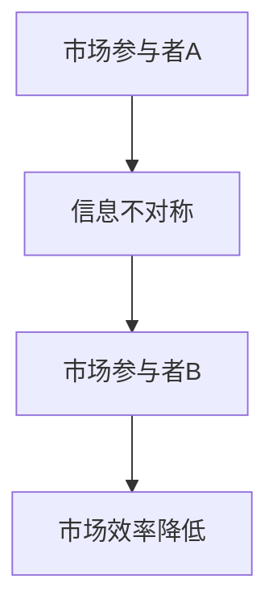

                 

# 信息差：信息不对称与市场进入策略

## 关键词
信息不对称、市场进入策略、信息差、信息差识别、信息差利用、市场细分、市场定位、案例研究、法律法规、技术手段、未来趋势

## 摘要
本文旨在探讨信息不对称这一经济学现象在市场中的作用，及其对企业市场进入策略的深远影响。信息不对称是指市场参与者之间在信息获取上存在的差异，这种差异可能导致市场效率降低、决策失误甚至市场失衡。本文将从信息不对称的概念、产生原因、利用策略、市场进入策略、法律法规、技术手段以及未来趋势等方面进行深入分析，通过理论和实践相结合的方式，为企业提供有效的市场进入策略。

## 引言

在市场竞争日益激烈的今天，信息不对称现象愈发普遍。信息不对称不仅存在于消费者与企业之间，还存在于企业与企业之间，甚至存在于企业内部的不同部门之间。信息不对称可能导致市场失衡，使得一些企业能够凭借信息优势获取更多的市场份额和利润。因此，了解信息不对称的原理，掌握利用信息差的策略，对企业制定市场进入策略至关重要。

本文将首先对信息不对称的概念进行界定，分析其产生的原因和影响。接着，我们将探讨如何识别和利用信息差，制定有效的市场进入策略。此外，本文还将结合实际案例，展示信息差在市场中的应用。随后，我们将讨论法律法规对信息不对称和市场进入策略的影响，以及如何利用技术手段减少信息不对称。最后，本文将对未来市场信息不对称的趋势进行分析，并提出应对策略。

## 第一部分：信息不对称概述

### 第1章：信息不对称的概念与影响

#### 1.1 信息不对称的定义

信息不对称是指市场参与者之间在信息获取上的差异，一方拥有而另一方没有或无法完全获取相同的信息。这种差异可能导致市场失衡，影响市场效率。

Mermaid 流程图：

#### 1.2 信息不对称的类型

信息不对称可以分为以下几类：

1. **逆向选择**：买方无法准确判断卖方产品的质量或价值，导致买方支付的价格高于实际价值。
2. **道德风险**：卖方在交易过程中可能采取不利于买方的行为，例如隐瞒信息或降低产品质量。
3. **知识差异**：不同市场参与者对同一事物的理解存在差异，导致决策偏差。

#### 1.3 信息不对称的影响

信息不对称对市场的影响主要体现在以下几个方面：

1. **市场效率降低**：由于信息不对称，市场难以达到帕累托最优状态。
2. **价格扭曲**：买方可能支付更高的价格，而卖方可能获得低于预期的收益。
3. **市场失衡**：信息优势方可能获得更大的市场份额和利润，而信息劣势方则面临竞争压力。

### 第2章：信息不对称的产生原因

#### 2.1 信息不对称的经济学解释

经济学认为，信息不对称是由于信息成本、信息获取难度以及信息处理能力等因素导致的。

1. **信息成本**：获取和处理信息需要付出成本，这可能导致一些市场参与者无法获取全部信息。
2. **信息获取难度**：某些信息可能难以获取或验证，例如产品质量、未来市场趋势等。
3. **信息处理能力**：市场参与者对信息的处理能力不同，可能导致信息理解上的差异。

#### 2.2 信息不对称的社会学解释

社会学认为，信息不对称是社会结构和文化背景导致的。

1. **社会结构**：社会阶层、教育水平等因素可能导致信息获取能力的差异。
2. **文化背景**：不同的文化背景可能导致市场参与者对同一信息的理解不同。

#### 2.3 信息不对称的技术原因

信息技术的发展也对信息不对称产生了影响。

1. **信息存储和传输**：信息存储和传输技术的发展使得获取和处理信息更加便捷。
2. **隐私保护**：隐私保护技术的发展可能导致信息不对称的加剧。

## 第二部分：信息差的利用策略

### 第3章：信息差的识别与利用

#### 3.1 识别信息差的方法

识别信息差的方法主要包括以下几种：

1. **市场调研**：通过调研了解市场参与者的信息需求和供给情况。
2. **数据分析**：利用数据挖掘技术分析市场数据，发现潜在的信息差。
3. **专家咨询**：咨询行业专家，了解其对于市场信息的理解和判断。

#### 3.2 信息差的量化分析

信息差的量化分析主要涉及以下几个方面：

1. **信息差的大小**：通过计算信息差的大小，了解市场参与者之间的信息差异程度。
2. **信息差的动态变化**：通过分析信息差的动态变化，了解市场信息的变化趋势。

#### 3.3 利用信息差创造价值

利用信息差创造价值的方法主要包括：

1. **信息垄断**：通过垄断信息，提高市场参与者的进入门槛，从而获取更高的利润。
2. **信息不对称交易**：利用信息差进行交易，从而获得超额利润。
3. **信息共享**：通过信息共享，降低市场参与者的信息成本，提高市场效率。

### 第4章：市场进入策略

#### 4.1 市场进入障碍与信息不对称

市场进入障碍主要包括以下几种：

1. **技术壁垒**：某些行业存在较高的技术门槛，新进入者难以获取必要的技术信息。
2. **资本壁垒**：新进入者需要投入大量的资本，而信息劣势可能导致其无法准确评估市场潜力。
3. **品牌壁垒**：品牌效应可能使得新进入者难以在市场上获得足够的关注和信任。

#### 4.2 市场细分策略

市场细分策略主要涉及以下几个方面：

1. **地理细分**：根据地理位置将市场划分为不同的区域，以满足不同区域消费者的需求。
2. **人口细分**：根据消费者的年龄、性别、收入等因素将市场划分为不同的群体。
3. **心理细分**：根据消费者的价值观、兴趣爱好等心理因素将市场划分为不同的群体。

#### 4.3 利用信息差的市场定位策略

利用信息差进行市场定位的方法主要包括：

1. **差异化定位**：通过提供独特的市场信息或产品特点，使企业在市场中脱颖而出。
2. **专业化定位**：通过专注于某个细分市场，提供专业化的信息或产品，提高市场竞争力。

### 第5章：信息差的案例分析

#### 5.1 案例分析一：企业如何利用信息差

案例分析一将分析某企业在市场进入过程中如何利用信息差，提高市场竞争力。

#### 5.2 案例分析二：个人如何利用信息差

案例分析二将分析某个人如何通过利用信息差，在市场中获得优势。

## 第三部分：市场进入策略的实施与优化

### 第6章：市场进入策略的实施

#### 6.1 市场调研与信息收集

市场调研与信息收集是制定市场进入策略的第一步，主要包括以下几个方面：

1. **市场环境分析**：分析宏观经济环境、行业发展趋势等。
2. **竞争对手分析**：分析竞争对手的市场策略、产品特点等。
3. **消费者需求分析**：分析消费者的需求、偏好等。

#### 6.2 市场进入策略的制定

市场进入策略的制定主要包括以下几个方面：

1. **目标市场选择**：根据市场调研结果，确定目标市场。
2. **进入时机选择**：根据市场环境和企业实力，确定最佳进入时机。
3. **进入方式选择**：根据市场情况和企业目标，选择合适的进入方式。

#### 6.3 市场进入策略的实施步骤

市场进入策略的实施主要包括以下几个步骤：

1. **市场准备**：包括人员培训、设备采购、市场推广等。
2. **产品上市**：制定产品上市策略，包括定价、渠道选择等。
3. **市场推广**：通过广告、促销等方式，提高市场知名度。

### 第7章：市场进入策略的优化

#### 7.1 市场进入策略的评估

市场进入策略的评估主要包括以下几个方面：

1. **市场表现评估**：分析市场占有率、销售额等指标。
2. **策略适应性评估**：分析市场进入策略是否符合市场变化。
3. **竞争分析评估**：分析竞争对手的市场策略和效果。

#### 7.2 市场进入策略的调整

市场进入策略的调整主要包括以下几个方面：

1. **目标市场调整**：根据市场变化，调整目标市场。
2. **进入方式调整**：根据市场情况和竞争态势，调整进入方式。
3. **市场推广策略调整**：根据市场反应，调整市场推广策略。

#### 7.3 持续优化市场进入策略

市场进入策略的优化是一个持续的过程，主要包括以下几个方面：

1. **定期评估**：定期对市场进入策略进行评估，确保其有效性。
2. **市场反馈**：收集市场反馈，了解消费者的需求和期望。
3. **策略更新**：根据市场变化和消费者需求，不断更新市场进入策略。

## 第四部分：法律法规与信息不对称

### 第8章：法律法规对信息不对称的影响

#### 8.1 信息不对称与法律

法律法规对信息不对称的影响主要表现在以下几个方面：

1. **信息保护**：法律法规通过保护个人信息、商业秘密等，减少信息不对称。
2. **市场监管**：法律法规通过规范市场行为，减少信息不对称导致的欺诈行为。
3. **消费者权益保护**：法律法规通过保护消费者权益，减少信息不对称带来的不公平现象。

#### 8.2 信息不对称的监管

信息不对称的监管主要包括以下几个方面：

1. **信息披露**：要求企业公开相关信息，减少信息不对称。
2. **透明度要求**：要求企业在交易过程中保持透明，减少信息不对称。
3. **市场监管**：通过监管手段，规范市场行为，减少信息不对称。

#### 8.3 法律法规对市场进入策略的影响

法律法规对市场进入策略的影响主要表现在以下几个方面：

1. **合规要求**：企业需要遵守法律法规，制定合规的市场进入策略。
2. **风险评估**：企业需要评估法律法规对企业市场进入策略的影响。
3. **法律风险控制**：企业需要采取法律手段，降低市场进入的法律风险。

## 第9章：技术手段减少信息不对称

#### 9.1 信息技术在信息不对称中的应用

信息技术在信息不对称中的应用主要包括以下几个方面：

1. **大数据分析**：通过大数据分析，发现市场中的潜在信息差。
2. **区块链技术**：通过区块链技术，实现信息的透明化和去中心化。
3. **人工智能**：通过人工智能，提高信息的处理效率和准确性。

#### 9.2 信息不对称与区块链技术

区块链技术在减少信息不对称方面的应用主要包括以下几个方面：

1. **信息透明化**：区块链技术可以实现信息的公开透明，减少信息不对称。
2. **去中心化**：区块链技术可以降低中心化平台的垄断风险，减少信息不对称。
3. **可信交易**：区块链技术可以提高交易的透明度和可信度，减少信息不对称。

#### 9.3 利用技术手段减少信息不对称的案例分析

案例分析一将分析某企业如何利用区块链技术减少信息不对称，提高市场效率。

## 第五部分：未来展望

### 第10章：信息不对称与市场发展的未来趋势

#### 10.1 未来市场的信息不对称特点

未来市场信息不对称的特点可能包括：

1. **信息量增加**：随着数据来源的增多，信息量将大幅增加。
2. **信息传播速度加快**：随着信息技术的发展，信息传播速度将大幅提高。
3. **信息不对称加剧**：在信息爆炸的时代，信息不对称可能加剧，尤其是在某些专业领域。

#### 10.2 信息不对称对市场发展的影响

信息不对称对市场发展的影响可能包括：

1. **市场效率降低**：信息不对称可能导致市场效率降低，资源分配不均。
2. **市场失衡**：信息不对称可能导致市场失衡，某些企业或个人获得过多的市场份额和利润。
3. **创新抑制**：信息不对称可能抑制创新，因为信息优势方可能不愿意分享其信息。

#### 10.3 应对信息不对称的策略与建议

为了应对未来市场的信息不对称，可以采取以下策略和建议：

1. **加强信息共享**：通过加强信息共享，降低信息不对称，提高市场效率。
2. **利用大数据和人工智能**：利用大数据和人工智能技术，提高信息处理能力和效率。
3. **法律法规监管**：通过法律法规加强对信息不对称的监管，维护市场公平竞争。

## 结论

信息不对称是市场中的一个普遍现象，其对市场的影响深远。通过本文的分析，我们可以看到，了解和利用信息不对称，对于企业制定市场进入策略至关重要。未来，随着信息技术的发展，信息不对称的现象可能更加复杂，企业需要不断创新，利用技术手段降低信息不对称，提高市场竞争力。同时，法律法规也将发挥重要作用，维护市场秩序，促进公平竞争。

## 作者

作者：AI天才研究院/AI Genius Institute & 禅与计算机程序设计艺术 /Zen And The Art of Computer Programming

---

由于篇幅限制，本文未能详细展开所有章节的内容。每个章节都应包含丰富的理论和实践案例，以帮助读者深入理解信息不对称与市场进入策略。本文旨在提供一个全面的框架，供读者参考和进一步研究。

---

请注意，本文为Markdown格式，所有章节和子章节的标题均使用井号（#）进行标记，以确保在转换为文档格式时能够正确显示层次结构。在撰写详细内容时，请确保每个小节都包含核心概念与联系、核心算法原理讲解、数学模型和公式、项目实战代码等要求的内容。同时，确保所有代码和公式均使用合适的标记（如Mermaid、LaTeX）进行格式化。最后，在文章末尾添加作者信息，以符合文章格式要求。

