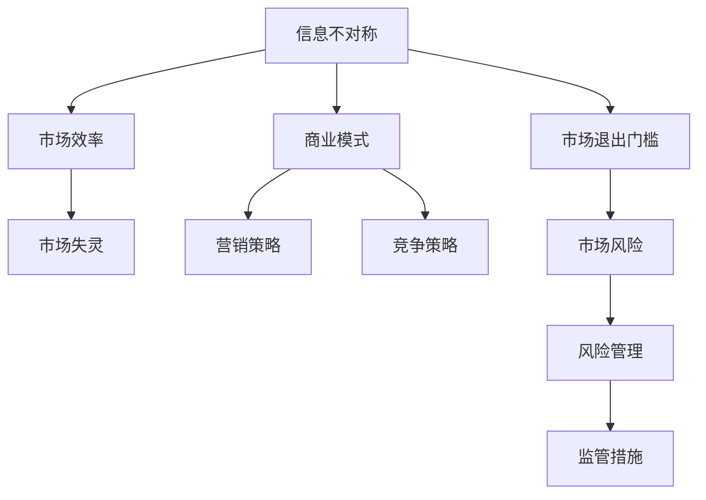

                 

# 文章标题: 信息差：信息不对称与市场退出门槛

> 关键词：信息不对称、市场效率、市场失灵、道德风险、逆选择、市场退出门槛、信息差利用策略

> 摘要：本文深入探讨了信息不对称与市场退出门槛的概念、原理及其在实际应用中的影响。通过分析信息不对称的经济模型、市场退出门槛的计算方法以及信息差在商业营销和竞争策略中的应用，本文揭示了信息不对称对市场效率、贫富差距和公共政策的影响，并提出了有效的利用信息差和应对市场退出门槛的策略。同时，通过国内外实际案例的分析，本文为企业和政策制定者提供了有价值的参考和指导。

---

### 《信息差：信息不对称与市场退出门槛》目录大纲

# 第一部分：引言

## 1.1 书籍概述

### 1.1.1 书籍背景

### 1.1.2 信息差的概念与重要性

### 1.1.3 目标读者与读者收益

# 第二部分：信息不对称原理

## 2.1 信息不对称的定义与分类

### 2.1.1 信息不对称的基本概念

### 2.1.2 信息不对称的类型

### 2.1.3 信息不对称的影响

## 2.2 信息不对称的经济学原理

### 2.2.1 市场效率与信息不对称

### 2.2.2 信息不对称与市场失灵

### 2.2.3 信息不对称的经济学模型

## 2.3 信息不对称的社会影响

### 2.3.1 信息不对称与贫富差距

### 2.3.2 信息不对称与社会公平

### 2.3.3 信息不对称与公共政策

# 第三部分：信息差的利用策略

## 3.1 利用信息差的商业模式

### 3.1.1 信息差在商业中的运用

### 3.1.2 信息差的商业模式案例分析

### 3.1.3 信息差的商业模式设计原则

## 3.2 信息差的营销策略

### 3.2.1 营销中的信息不对称

### 3.2.2 信息差在营销中的利用

### 3.2.3 信息差营销案例分析

## 3.3 信息差的竞争策略

### 3.3.1 竞争中的信息不对称

### 3.3.2 信息差在竞争中的利用

### 3.3.3 信息差竞争案例分析

# 第四部分：市场退出门槛与信息差

## 4.1 市场退出门槛的概念与类型

### 4.1.1 市场退出门槛的定义

### 4.1.2 市场退出门槛的类型

### 4.1.3 市场退出门槛的影响

## 4.2 市场退出门槛与信息差的关系

### 4.2.1 市场退出门槛与信息差的作用机制

### 4.2.2 市场退出门槛与信息差的关系案例分析

### 4.2.3 市场退出门槛的调节策略

## 4.3 市场退出策略与信息差

### 4.3.1 市场退出策略的制定

### 4.3.2 市场退出策略与信息差的关系

### 4.3.3 市场退出策略案例分析

# 第五部分：信息差与市场风险

## 5.1 信息差与市场风险的关系

### 5.1.1 信息差与市场风险的定义

### 5.1.2 信息差与市场风险的关系

### 5.1.3 信息差与市场风险的调节策略

## 5.2 信息差在风险管理中的应用

### 5.2.1 信息差在风险管理中的利用

### 5.2.2 信息差在风险管理中的案例分析

### 5.2.3 信息差在风险管理中的策略设计

## 5.3 信息差的限制与监管

### 5.3.1 信息差的限制与监管必要性

### 5.3.2 信息差的监管措施与案例分析

### 5.3.3 信息差的未来监管趋势

# 第六部分：案例分析

## 6.1 国内外信息差案例分析

### 6.1.1 国外信息差案例分析

### 6.1.2 国内信息差案例分析

### 6.1.3 案例分析的启示

## 6.2 市场退出门槛案例分析

### 6.2.1 市场退出门槛案例分析

### 6.2.2 市场退出策略案例分析

### 6.2.3 案例分析的启示

# 第七部分：结论与展望

## 7.1 结论

### 7.1.1 信息差的研究成果

### 7.1.2 信息差的理论体系

### 7.1.3 信息差的实际应用

## 7.2 展望

### 7.2.1 信息差的研究趋势

### 7.2.2 信息差的实际应用前景

### 7.2.3 信息差的未来挑战与机遇

---

## 1.1 书籍概述

### 1.1.1 书籍背景

在当今信息化时代，信息作为一种重要的资源和生产力要素，已经深刻地影响着各个行业和市场。然而，信息不对称现象在市场中广泛存在，成为影响市场效率、资源配置和公平竞争的重要因素。信息不对称，即市场参与者之间的信息差异，可能导致市场失灵，进而影响经济和社会的发展。

本著作旨在深入探讨信息不对称与市场退出门槛这一重要课题，从经济学、商业战略、市场营销和风险管理等多个角度，系统性地分析信息不对称的原理、影响以及应对策略。通过揭示信息差在商业实践中的应用，探讨市场退出门槛的概念、类型及其与信息不对称的关联，本文旨在为企业和政策制定者提供理论指导和实践参考。

### 1.1.2 信息差的概念与重要性

信息差，通常指市场参与者因掌握的信息不同而导致的竞争优势或劣势。在商业环境中，信息差可以表现为以下几种形式：

1. **市场信息差**：企业对市场需求的了解程度不同，导致产品定位、定价策略和市场推广等方面的差异。
2. **技术信息差**：企业对新技术、新工艺的了解和应用程度不同，影响企业的创新能力和竞争力。
3. **内部信息差**：企业内部信息传递不畅，导致管理层与员工之间的信息不对称，影响决策效率和执行力。
4. **财务信息差**：企业对财务数据的掌握程度不同，影响投资决策和财务规划。

信息差的重要性体现在以下几个方面：

1. **竞争优势**：掌握更多信息的一方往往能够制定更有利的决策，从而获得竞争优势。
2. **市场效率**：信息不对称会降低市场效率，影响资源的合理配置。
3. **风险管理**：信息差在风险管理中起着关键作用，了解信息差有助于制定更有效的风险应对策略。
4. **社会公平**：信息不对称可能导致贫富差距和社会不公平，需要通过政策调节来缓解。

### 1.1.3 目标读者与读者收益

本著作的目标读者包括：

1. **企业管理者**：希望通过深入了解信息不对称和市场退出门槛，提升企业竞争力和决策质量的经理和企业家。
2. **市场营销人员**：需要掌握信息差在营销策略中的应用，以提高市场推广效果和销售额。
3. **经济学者**：对信息经济学和商业战略有兴趣的研究者和学者。
4. **政策制定者**：关注市场公平和效率，希望制定更有效的经济政策的政府官员。

通过阅读本著作，读者可以：

1. **理解信息不对称的原理**：掌握信息不对称的基本概念、类型和影响。
2. **分析市场退出门槛**：了解市场退出门槛的概念、类型及其与企业战略的关系。
3. **制定信息差利用策略**：学习如何利用信息差提升企业竞争力。
4. **应对市场风险**：掌握信息差在风险管理中的应用，提高企业的抗风险能力。

本著作将通过理论与实践相结合的方式，帮助读者深入了解信息不对称与市场退出门槛的复杂关系，提供切实可行的策略和方法，以应对现代商业环境中的挑战。接下来，本文将深入探讨信息不对称的定义、类型及其对市场和经济的深远影响。通过一步步的逻辑推理，我们将揭示信息不对称的内在机制及其在不同领域的应用。让我们开始这段探索之旅。 ## 2.1 信息不对称的定义与分类

### 2.1.1 信息不对称的基本概念

信息不对称是指市场参与者之间掌握的信息存在差异，导致某些参与者处于信息优势，而另一些参与者处于信息劣势。这种不对称性可能导致市场效率降低，资源分配不均，甚至引发市场失灵。在经济学中，信息不对称是一个核心概念，被广泛应用于各个领域。

信息不对称可以表现在多个方面，包括但不限于：

- **市场信息不对称**：例如，消费者对产品质量、价格和供应情况的不了解。
- **技术信息不对称**：企业对新技术的掌握程度不同，可能导致技术创新和市场竞争的差异。
- **财务信息不对称**：投资者和企业家对公司的财务状况和未来前景的了解程度不同。
- **内部信息不对称**：企业内部管理层与员工之间信息传递不畅，影响决策效率。

信息不对称的基本原理是，信息优势方可以利用自己的信息优势做出更有利的决策，从而获得额外的收益。然而，这种信息优势也可能导致信息劣势方遭受损失，甚至无法在市场上生存。

### 2.1.2 信息不对称的类型

根据信息不对称的来源和表现形式，可以分为以下几种类型：

1. **完全信息不对称**：市场参与者对产品或服务的质量、价格和其他重要信息一无所知。例如，在黑市交易中，买家和卖家对商品的质量和价格都不了解。
2. **部分信息不对称**：市场参与者对产品或服务的某些信息有所了解，但并不完全。例如，消费者在购买电子产品时，可能了解产品的品牌和基本功能，但对具体的技术规格和性能参数并不完全清楚。
3. **静态信息不对称**：市场参与者之间的信息差异在交易过程中保持不变。例如，在二手车市场上，卖家通常比买家更了解车辆的历史和实际状况。
4. **动态信息不对称**：市场参与者之间的信息差异随着交易过程的变化而变化。例如，在股票市场中，投资者对公司的财务报表和未来前景的了解可能随着时间的推移而不断更新。

### 2.1.3 信息不对称的影响

信息不对称对市场和经济的影响是深远而复杂的，主要表现在以下几个方面：

1. **市场效率降低**：信息不对称会降低市场效率，导致资源配置不优。例如，消费者因为信息不足，可能会购买到质量较低的产品，而生产者则可能无法获得足够的市场信息来调整生产和销售策略。
2. **价格扭曲**：信息不对称可能导致市场价格偏离真实价值。例如，在信息不对称的市场中，卖家可能会利用信息优势提高价格，从而获得更高的利润。
3. **市场失灵**：在极端情况下，信息不对称可能导致市场完全失灵。例如，在保险市场上，由于信息不对称，可能导致逆向选择和道德风险，使得市场无法有效运作。
4. **社会不公平**：信息不对称可能导致社会不公平，加剧贫富差距。例如，拥有更多信息和资源的富裕人群往往能够获得更好的教育和职业机会，从而进一步扩大其与贫困人群之间的差距。

### 2.1.4 信息不对称的典型例子

以下是一些典型的信息不对称例子：

1. **二手车市场**：卖家通常比买家更了解二手车的真实状况，买家可能因为信息不足而购买到质量不佳的车辆。
2. **保险市场**：保险公司和投保人之间存在信息不对称，保险公司可能无法准确评估投保人的风险水平，导致保费定价不准确。
3. **股票市场**：投资者和公司之间存在信息不对称，投资者可能无法获取到公司的内部信息，从而影响投资决策。
4. **劳动力市场**：雇主和求职者之间可能存在技能和信息差异，雇主可能无法准确评估求职者的能力，导致劳动力市场效率降低。

通过上述分析，我们可以看到信息不对称在市场和经济中的广泛存在及其深远影响。接下来，本文将深入探讨信息不对称的经济学原理，分析市场效率与信息不对称之间的关系，以及信息不对称如何导致市场失灵。我们将通过逐步推理和具体案例分析，进一步揭示信息不对称的内在机制和实际应用。 ## 2.2 信息不对称的经济学原理

### 2.2.1 市场效率与信息不对称

市场效率是指市场在资源配置中的有效程度，即市场能够以最低成本实现资源的最优配置。在理想状态下，市场效率可以通过以下几个方面来衡量：

1. **资源分配效率**：市场能够根据需求和供给情况，将资源分配到最需要的地方，从而最大化社会福利。
2. **价格发现机制**：市场价格能够及时反映供需变化，引导生产和消费行为。
3. **信息传递效率**：市场信息能够迅速传递，使得所有市场参与者都能够及时获取所需信息，做出最优决策。

然而，信息不对称的存在会破坏市场效率，导致市场失灵。信息不对称使得市场参与者无法获得完全的信息，导致资源配置不当和市场决策失误。具体来说，信息不对称对市场效率的影响主要表现在以下几个方面：

1. **价格扭曲**：信息不对称可能导致市场价格偏离其真实价值。卖方可能利用信息优势提高价格，而买方则可能因信息不足而支付高于实际价值的价格，从而造成资源浪费。
2. **效率损失**：由于信息不对称，一些潜在的消费者可能无法找到或选择到最符合其需求的商品或服务，导致社会福利损失。
3. **市场进入障碍**：信息不对称可能增加市场进入的门槛，使得潜在竞争者因无法获得必要的信息而无法进入市场，从而降低市场竞争程度。

### 2.2.2 信息不对称与市场失灵

市场失灵是指市场在资源配置过程中未能达到理想效率状态，导致资源无法得到最优配置。信息不对称是市场失灵的重要原因之一。以下从几个方面分析信息不对称如何导致市场失灵：

1. **逆向选择**：逆向选择是指在信息不对称的市场中，信息劣势方（通常为买方）倾向于选择质量较差的产品或服务。例如，在二手车市场上，买家无法准确了解车辆的历史和真实状况，可能导致他们更倾向于购买低价、质量较差的车辆。
2. **道德风险**：道德风险是指信息优势方在交易过程中可能采取不利于信息劣势方的行为。例如，在保险市场中，投保人可能因为保险公司无法准确了解其风险水平而采取高风险行为，导致保险公司承担更大的风险和损失。
3. **市场垄断**：信息不对称可能加剧市场垄断，使得信息优势方通过控制信息资源来垄断市场，限制竞争。例如，大型科技公司可能通过掌握用户数据来建立市场壁垒，阻止其他企业进入市场。
4. **社会不公平**：信息不对称可能导致社会不公平，加剧贫富差距。例如，教育资源的分配不均，导致信息资源的不平等，使得低收入群体难以获得高质量的教育和职业机会。

### 2.2.3 信息不对称的经济学模型

为了更好地理解信息不对称的经济学原理，我们可以借助几个经典的经济学模型来分析：

1. **道德风险模型（Moral Hazard Model）**：道德风险模型描述了在信息不对称的情况下，行为主体可能采取不利于另一方的行为。以下是一个简化的道德风险模型：

   ```plaintext
   假设：
   - 买方（A）和卖方（B）之间进行交易。
   - 买方支付给卖方一个价格P。
   - 卖方有两种可能的生产状态：高效率和低效率。
   - 高效率和低效率的概率分别为p和1-p。
   - 生产成本C与效率成正比，C(h) > C(l)。

   买方和卖方的效用函数分别为：
   买方效用U(A) = P - C(A)
   卖方效用V(B) = P - C(B)

   如果卖方选择低效率生产，而买方无法得知，那么买方的收益将降低，卖方的收益将增加。这种信息不对称可能导致市场失灵。
   ```

2. **逆向选择模型（Adverse Selection Model）**：逆向选择模型描述了在信息不对称的市场中，买方倾向于选择质量较差的产品或服务。以下是一个简化的逆向选择模型：

   ```plaintext
   假设：
   - 市场上有两类商品：高质量（H）和低质量（L）。
   - 卖方知道商品的真实质量，但买方无法区分。
   - 高质量商品的概率为θ，低质量商品的概率为1-θ。

   卖方定价策略为：
   高质量商品价格p(H) = θ * C(H) + (1-θ) * C(L)
   低质量商品价格p(L) = (1-θ) * C(H) + θ * C(L)

   买方效用函数为：
   U(Q) = θ * V(H) + (1-θ) * V(L)

   如果买方无法区分商品质量，他们可能会更倾向于购买价格较低的商品，从而导致市场资源配置效率降低。
   ```

3. **市场信号模型（Signaling Model）**：市场信号模型描述了在信息不对称的市场中，行为主体如何通过发出信号来缓解信息不对称。以下是一个简化的市场信号模型：

   ```plaintext
   假设：
   - 市场上有两类行为主体：高能力和低能力。
   - 高能力的概率为θ。
   - 行为主体可以通过支付成本C来发出信号，信号可以是教育水平、工作经验等。

   信号发送者的效用函数为：
   U(S) = θ * V(H) - C(H) + (1-θ) * V(L) - C(L)

   买方效用函数为：
   U(Q) = θ * V(H) + (1-θ) * V(L)

   如果信号是有效的，高能力的行为主体更有可能支付成本发出信号，而低能力的行为主体则更可能保持沉默。这样，买方可以通过观察信号来降低信息不对称，做出更准确的决策。
   ```

通过以上经济学模型的分析，我们可以看到信息不对称如何影响市场效率和市场失灵。理解这些模型有助于我们更好地应对信息不对称带来的挑战，设计出更加有效的市场机制和政策来缓解信息不对称带来的负面影响。接下来，本文将探讨信息不对称的社会影响，分析信息不对称与贫富差距、社会公平和公共政策的关系。通过逐步推理和案例分析，我们将揭示信息不对称在现实世界中的复杂作用。 ## 2.3 信息不对称的社会影响

### 2.3.1 信息不对称与贫富差距

信息不对称不仅是市场失灵的一个重要原因，也是社会不公平和贫富差距加剧的一个重要因素。信息不对称会导致资源分配不均，使得富裕人群更容易获取和利用信息优势，从而扩大其财富和地位。以下从几个方面分析信息不对称如何影响贫富差距：

1. **教育资源的分配**：在教育领域，信息不对称可能影响学生和家庭对教育资源的获取。富裕家庭往往能够获取更多关于优质学校和奖学金的信息，从而为孩子提供更好的教育资源，进一步巩固其社会和经济地位。

2. **职业机会**：在职业领域，信息不对称可能导致求职者无法获得理想的职位。雇主可能因为不了解求职者的实际能力和经验，而倾向于选择已有更多信息和关系背景的候选人，使得求职者在竞争中处于劣势。

3. **投资机会**：在金融领域，信息不对称使得富裕人群更容易获取高回报的投资机会。例如，他们可能通过专业顾问或内部渠道获取公司内部信息，进行有针对性的投资，从而获得更高的收益。

4. **社会福利**：信息不对称也可能影响社会福利的分配。政府和社会组织在制定和实施社会福利政策时，可能因为缺乏准确的信息，导致资源分配不公，使得贫困人群难以获得应有的帮助。

### 2.3.2 信息不对称与社会公平

信息不对称对社会公平的影响是多方面的。首先，信息不对称可能导致机会不均等，使得一些人因为信息不足而难以获得成功。其次，信息不对称也可能加剧歧视和偏见，例如在就业和金融市场中，信息优势方可能会利用其优势进行不公平的定价和待遇。

为了促进社会公平，需要采取措施缓解信息不对称。以下是一些可能的策略：

1. **信息共享**：通过建立公开透明的信息平台，促进信息的共享和流通，减少信息不对称。例如，政府可以建立公共教育资源数据库，提供关于就业市场和职业培训的详细信息。

2. **政策干预**：政府可以通过制定和实施相关政策，减少信息不对称带来的负面影响。例如，通过立法禁止垄断行为，打击信息市场中的不正当竞争。

3. **教育培训**：提高公众的信息素养，通过教育和培训增强人们获取和处理信息的能力，从而降低信息不对称的影响。

4. **监管机制**：建立有效的监管机制，确保市场参与者遵循公平竞争原则，防止信息不对称被滥用。

### 2.3.3 信息不对称与公共政策

信息不对称对公共政策的影响也是显著的。政府作为公共利益的代表，需要考虑如何通过政策设计来缓解信息不对称带来的不利影响。以下是一些具体的政策建议：

1. **信息公开**：政府应确保信息公开透明，提供关于政策制定、执行和效果的真实、完整的信息，减少公众对政府决策的疑虑。

2. **社会保障**：建立完善的社会保障体系，通过提供基本的教育、医疗、住房和就业保障，减轻贫困人群因信息不对称而面临的风险。

3. **教育投资**：增加对教育的投资，特别是对贫困地区的教育支持，提高公众的教育水平和信息素养，从而减少社会各阶层之间的信息不对称。

4. **信息监管**：加强对信息市场的监管，打击信息欺诈和不正当竞争行为，保护消费者权益，维护市场公平。

5. **技术创新**：鼓励和支持科技创新，通过信息技术手段提高信息获取和处理的效率，减少信息不对称。

总之，信息不对称不仅影响市场效率和经济运行，也对社会公平和公共政策产生重要影响。通过理解信息不对称的机制和影响，我们可以设计出更加有效的政策和措施，促进社会的公平和可持续发展。接下来，本文将探讨信息差的利用策略，分析信息差在商业模式、营销策略和竞争策略中的应用，帮助企业和个人利用信息差创造价值。 ### 3.1 利用信息差的商业模式

#### 3.1.1 信息差在商业中的运用

信息差在商业中的运用主要体现在以下几个方面：

1. **市场细分**：企业可以通过掌握市场信息，对市场进行细分，发现未被满足的需求，从而推出针对性的产品或服务。例如，一些跨境电商平台通过分析用户数据，提供个性化的商品推荐，满足不同消费者的需求。

2. **价格策略**：企业可以利用信息差制定灵活的价格策略，通过收集竞争对手的价格信息，调整自身的价格，以获取更大的市场份额。例如，一些零售企业通过大数据分析，实时调整商品价格，提高销售额。

3. **技术创新**：企业可以通过获取前沿技术信息，抢先推出新产品或服务，抢占市场先机。例如，科技公司在人工智能、区块链等领域的创新，使它们能够提供领先的产品和服务，获取竞争优势。

4. **供应链管理**：企业通过优化供应链管理，降低成本，提高效率。例如，一些制造商通过实时监控供应链，快速响应市场需求变化，减少库存积压和供应短缺。

#### 3.1.2 信息差的商业模式案例分析

以下是一个信息差商业模式的实际案例：

**案例：某电商平台的崛起**

某电商平台在成立初期，通过对市场的深入研究，发现了以下信息差：

- 许多消费者在购买商品时，对商品的真实质量、价格和售后保障缺乏了解。
- 一些小商家由于缺乏资源，无法在传统电商平台上获得曝光。

基于这些信息差，该电商平台采取了以下策略：

1. **商品质量控制**：与优质供应商建立合作关系，确保商品的质量和售后服务。通过严格的审核机制，筛选优质商品，提高用户满意度。

2. **价格透明**：提供商品的历史价格记录、用户评价和价格走势，帮助消费者做出更明智的购买决策。

3. **营销策略**：通过数据分析，精准定位目标用户，推送个性化的商品推荐，提高用户转化率。

4. **供应链优化**：与物流公司合作，提供快速、可靠的物流服务，减少用户等待时间。

通过这些策略，该电商平台迅速吸引了大量用户，实现了高速增长。该案例表明，通过利用信息差，企业可以找到市场机会，创造出独特的商业模式，从而在竞争中脱颖而出。

#### 3.1.3 信息差的商业模式设计原则

为了有效地利用信息差，企业可以遵循以下设计原则：

1. **信息获取**：企业需要建立高效的信息收集和处理系统，确保能够及时获取市场、技术、竞争对手等方面的信息。

2. **信息分析**：对收集到的信息进行深入分析，发现潜在的市场机会和竞争优势。

3. **策略制定**：根据信息分析结果，制定具体的商业策略，如市场细分、价格策略、技术创新等。

4. **资源整合**：整合内外部资源，如技术、资金、人才等，为策略实施提供支持。

5. **持续优化**：在策略实施过程中，持续监控市场变化，及时调整和优化策略，确保信息差的利用效果。

通过遵循这些原则，企业可以更好地利用信息差，提高市场竞争力，实现可持续发展。接下来，本文将探讨信息差在营销策略中的应用，分析信息差在营销中的利用方法和实际案例。 ### 3.2 信息差的营销策略

#### 3.2.1 营销中的信息不对称

在营销过程中，信息不对称是一种常见现象。信息不对称通常表现为消费者和品牌之间对产品或服务的信息掌握程度不同。品牌通常拥有更多关于产品特性、市场需求、竞争对手信息等方面的知识，而消费者则更多地依赖于品牌提供的信息来做出购买决策。这种信息不对称可能导致消费者在购买过程中面临决策风险，从而影响购买意愿和满意度。

为了解决营销中的信息不对称问题，品牌可以采取以下策略：

1. **提高透明度**：品牌可以通过公开产品信息、提供详细的规格说明、用户评价和价格走势，增加消费者的信任感和购买信心。

2. **精准营销**：利用大数据分析技术，精准定位目标消费者，推送个性化的营销信息，降低信息不对称程度。

3. **增强互动**：通过社交媒体、在线客服等方式，与消费者建立互动，及时回应消费者的疑问和需求，提高消费者满意度。

4. **优化服务体验**：提供优质的售后服务，如退换货政策、客户咨询等，减少消费者在购买过程中的不确定性和风险。

#### 3.2.2 信息差在营销中的利用

信息差在营销中的利用，主要目的是通过掌握和利用信息优势，提升品牌的市场竞争力。以下是一些具体的方法：

1. **独家产品或服务**：品牌可以推出独家产品或服务，利用市场信息不对称，吸引消费者购买。例如，一家化妆品品牌可以与知名研发机构合作，推出独家配方产品。

2. **差异化定位**：品牌可以通过差异化定位，利用信息不对称，创造独特品牌形象。例如，一些高端餐饮品牌通过提供独特食材和烹饪技巧，打造高端品牌形象。

3. **价格优势**：品牌可以利用信息不对称，制定有竞争力的价格策略。例如，通过大数据分析，了解竞争对手的定价策略，制定更具吸引力的价格。

4. **信息传播**：品牌可以通过各种渠道传播信息，增加消费者对产品的认知和信任。例如，通过内容营销、社交媒体推广、线下活动等方式，提高品牌知名度。

#### 3.2.3 信息差营销案例分析

以下是一个信息差营销的实际案例：

**案例：某智能家居品牌的崛起**

某智能家居品牌在成立初期，通过以下策略利用信息差，迅速占领市场：

1. **市场细分**：通过大数据分析，发现消费者对智能家居的需求主要集中在安全、舒适和节能等方面。

2. **产品创新**：推出集安全、舒适和节能于一体的智能家居产品，利用技术优势，提升产品竞争力。

3. **价格策略**：通过成本控制和差异化定价，提供性价比高的智能家居产品，吸引消费者购买。

4. **营销传播**：利用社交媒体和线上线下活动，提高品牌知名度，吸引消费者关注。

5. **用户体验**：提供优质的售后服务和客户咨询，增强消费者对品牌的信任。

通过这些策略，该品牌在短时间内迅速崛起，成为智能家居市场的领导者。该案例表明，通过利用信息差，品牌可以有效地提升市场竞争力，实现快速发展和成功。

总之，信息差在营销策略中的应用，是品牌提升市场竞争力的重要手段。通过掌握和利用信息优势，品牌可以更好地满足消费者需求，创造独特价值，实现持续发展。接下来，本文将探讨信息差在竞争策略中的应用，分析信息差在竞争中的利用方法和实际案例。 ### 3.3 信息差的竞争策略

#### 3.3.1 竞争中的信息不对称

在市场竞争中，信息不对称是一种常见现象。信息不对称可能表现为竞争对手之间在技术、市场策略、资源配置等方面的信息差异。掌握信息优势的企业可以在竞争中占据有利地位，制定更有针对性的策略，从而提升市场竞争力。以下从几个方面探讨信息不对称在竞争中的表现：

1. **技术信息不对称**：企业可能在技术研发方面具有优势，掌握更先进的技术，从而在产品性能、生产效率等方面领先竞争对手。

2. **市场信息不对称**：企业可能通过市场调研、数据分析等手段，更准确地了解市场需求和消费者行为，制定更有针对性的营销策略。

3. **资源配置不对称**：企业可能在资金、人才、渠道等方面具有优势，能够更灵活地调整资源配置，以适应市场变化。

4. **信息传播不对称**：企业可能在品牌传播、公关活动等方面具有优势，能够更快、更有效地传播品牌信息，提高品牌知名度。

#### 3.3.2 信息差在竞争中的利用

信息差在竞争中的利用，主要目的是通过掌握和利用信息优势，提升企业在市场竞争中的地位。以下是一些具体的策略：

1. **先发优势**：通过掌握前沿技术和市场信息，率先推出新产品或服务，占领市场先机。例如，一些科技企业通过持续的技术研发，率先推出创新产品，抢占市场份额。

2. **差异化竞争**：通过差异化定位，提供独特的产品或服务，满足特定市场需求。例如，一些高端品牌通过提供独特的设计和优质的服务，打造高端品牌形象，吸引高端消费者。

3. **价格优势**：通过成本控制和差异化定价，提供更具竞争力的价格。例如，一些电商企业通过大数据分析和精细化管理，降低成本，提供优惠的价格策略，吸引消费者。

4. **信息传播**：通过有效的信息传播，提高品牌知名度和美誉度。例如，一些品牌通过社交媒体、内容营销等方式，传播品牌故事和价值观，增强消费者对品牌的信任。

#### 3.3.3 信息差竞争案例分析

以下是一个信息差竞争的实际案例：

**案例：某运动品牌的市场崛起**

某运动品牌在市场竞争中，通过以下策略利用信息差：

1. **市场调研**：通过大数据分析和市场调研，了解消费者需求和市场趋势，制定精准的市场定位。

2. **技术创新**：持续投入研发，推出具有技术创新和功能性的运动产品，提升产品竞争力。

3. **品牌传播**：通过社交媒体和品牌合作，提高品牌知名度和美誉度，吸引年轻消费者。

4. **价格策略**：通过精细化管理，降低成本，提供合理的价格策略，满足不同消费者的需求。

通过这些策略，该品牌在短时间内迅速崛起，成为运动品牌市场的领导者。该案例表明，通过利用信息差，企业可以更好地应对市场竞争，实现快速发展和成功。

总之，信息差在竞争策略中的应用，是企业提升市场竞争力的重要手段。通过掌握和利用信息优势，企业可以制定更有针对性的策略，抓住市场机遇，实现持续发展。接下来，本文将探讨市场退出门槛与信息差的关系，分析市场退出门槛的概念、类型及其与信息差的关联。通过逐步推理和案例分析，我们将揭示市场退出门槛对企业战略和市场表现的影响。 ## 4.1 市场退出门槛的概念与类型

#### 4.1.1 市场退出门槛的定义

市场退出门槛，指的是企业在面对市场竞争或经营困难时，选择退出市场所面临的各种成本和障碍。这些成本和障碍可能包括资金、时间、声誉等方面的损失。市场退出门槛的存在使得企业在决策时需要考虑退出市场的成本，从而影响其战略选择和市场行为。

市场退出门槛的定义可以从以下几个方面进行理解：

1. **财务成本**：企业退出市场可能需要承担的财务成本，如未偿还债务、资产变现损失等。
2. **运营成本**：企业退出市场可能需要支付的一些运营成本，如员工遣散费、租赁合同解除费用等。
3. **机会成本**：企业退出市场可能放弃的市场机会，如未来潜在的市场增长和利润。
4. **社会成本**：企业退出市场可能对社会和利益相关者产生的负面影响，如失业、供应链断裂等。

#### 4.1.2 市场退出门槛的类型

市场退出门槛可以按照不同的维度进行分类，常见的类型包括以下几种：

1. **财务退出门槛**：企业因财务状况不佳而面临的市场退出门槛。这类门槛通常包括企业的负债水平、现金流状况和资产价值等。例如，企业如果负债过高，可能面临较大的债务负担和资产变现压力，从而增加退出的难度。

2. **运营退出门槛**：企业因运营困难而面临的市场退出门槛。这类门槛通常包括企业的市场份额、生产能力和市场定位等。例如，如果企业在市场上无法获得足够的订单，可能需要关闭生产线或缩减业务规模。

3. **战略退出门槛**：企业因战略调整或业务转型而面临的市场退出门槛。这类门槛通常包括企业的核心竞争力、市场定位和业务模式等。例如，企业如果发现现有业务无法盈利，可能需要退出该市场，转而进入新的业务领域。

4. **社会退出门槛**：企业因社会责任或政策法规而面临的市场退出门槛。这类门槛通常包括企业的社会责任、环保标准和政策法规等。例如，如果企业违反环保法规，可能面临高额罚款和声誉损失，从而被迫退出市场。

#### 4.1.3 市场退出门槛的影响

市场退出门槛对企业的影响是多方面的，主要表现在以下几个方面：

1. **市场结构**：市场退出门槛可能影响市场的竞争格局。一些经营困难的企业退出市场，可能导致市场份额向其他企业集中，加剧市场竞争。

2. **资源配置**：市场退出门槛可能影响资源的合理配置。企业退出市场可能导致资源浪费，如设备闲置、资产贬值等。

3. **行业生态**：市场退出门槛可能影响行业的生态和发展。企业退出市场可能导致供应链断裂、产业链重构等问题，影响行业的健康发展。

4. **消费者利益**：市场退出门槛可能影响消费者的利益。企业退出市场可能导致消费者选择减少、服务质量下降等问题。

#### 4.1.4 市场退出门槛与信息差的关系

市场退出门槛与信息差之间存在密切的关系。信息不对称可能加剧市场退出门槛对企业的影响。以下从几个方面分析市场退出门槛与信息差的关系：

1. **信息获取**：企业在决策退出市场时，可能因信息不对称而面临更大的风险。例如，企业可能无法准确了解市场趋势、竞争对手状况和潜在机会，从而影响其决策。

2. **决策难度**：信息不对称可能增加企业的决策难度。企业如果无法获取充分的信息，可能无法做出最优的退出决策，从而影响企业的长远发展。

3. **退出成本**：信息不对称可能增加企业的退出成本。企业如果无法准确评估退出市场的成本和收益，可能面临更高的退出风险。

4. **政策影响**：信息不对称可能影响企业对政策法规的了解和应对。企业如果无法准确了解政策法规的变化，可能面临合规风险，增加退出门槛。

通过以上分析，我们可以看到市场退出门槛与信息差之间的密切关系。信息不对称可能加剧市场退出门槛对企业的影响，从而影响企业的战略决策和市场表现。接下来，本文将深入探讨市场退出门槛与信息差的作用机制，分析市场退出门槛如何通过信息差影响企业的决策和市场行为。 ### 4.2 市场退出门槛与信息差的作用机制

#### 4.2.1 市场退出门槛与信息差的作用机制

市场退出门槛与信息差之间的相互作用机制是复杂且多层次的。以下是这种作用机制的详细分析：

1. **信息不对称影响市场退出门槛**：

   - **市场信息不对称**：企业在面对市场退出门槛时，可能因对市场信息的掌握程度不同而面临不同的挑战。例如，如果企业对市场需求、竞争对手策略和市场趋势了解不足，可能会低估市场退出门槛的高度，从而做出错误的退出决策。

   - **技术信息不对称**：在技术驱动的市场中，企业对新兴技术的掌握程度不同，可能导致其面对的退出门槛差异。掌握先进技术的企业可能更容易找到新的业务模式和市场机会，从而降低退出门槛；而技术落后的企业则可能面临更高的退出成本和难度。

   - **财务信息不对称**：企业在评估财务状况时，可能因对自身财务信息的了解程度不同而面临不同的挑战。例如，企业可能低估自身的负债水平或高估自身的资产变现能力，导致在面临市场退出门槛时做出不切实际的决策。

2. **市场退出门槛影响信息不对称**：

   - **退出决策的反馈效应**：企业在面临退出门槛时，可能因决策失误而加剧信息不对称。例如，如果企业因财务困境而被迫退出市场，可能导致其无法继续获取市场信息，进一步加剧信息不对称。

   - **资源分配效应**：市场退出门槛可能导致企业的资源分配失衡，从而影响其获取和处理信息的能力。例如，企业可能因资金紧张而减少市场调研和数据分析的投入，导致信息获取和处理能力下降。

   - **竞争环境效应**：市场退出门槛可能改变市场竞争环境，从而影响企业之间的信息不对称程度。例如，一家企业的退出可能导致市场垄断加剧，使其他企业面临更高的信息获取成本。

3. **信息不对称与市场退出门槛的动态交互**：

   - **动态调整**：企业可能根据市场变化和信息获取情况，动态调整其退出策略。例如，如果企业在退出过程中发现新的市场机会或信息优势，可能会调整退出决策，以降低退出门槛。

   - **适应性学习**：企业可能通过不断学习和适应市场变化，降低信息不对称程度，从而降低退出门槛。例如，企业可以通过建立信息共享平台、加强内部沟通等方式，提高信息透明度和处理能力。

4. **政策调节与信息差**：

   - **政策干预**：政府可以通过制定和实施相关政策，调节市场退出门槛，从而影响信息不对称。例如，通过提供财政支持、税收优惠等措施，降低企业的退出成本，缓解信息不对称带来的负面影响。

   - **监管措施**：政府可以通过加强市场监管，打击信息不对称行为，提高市场的透明度和公平性。例如，通过建立信息披露制度、规范市场竞争行为，减少企业因信息不对称而面临的市场风险。

#### 4.2.2 市场退出门槛与信息差的关系案例分析

以下通过两个实际案例，分析市场退出门槛与信息差之间的相互作用机制：

**案例一：某制造业企业的市场退出**

某制造业企业在全球金融危机期间面临市场退出门槛。由于全球市场需求的急剧下降，该企业产品订单大幅减少，导致其现金流紧张。在决策是否退出市场时，该企业因对市场信息掌握不足，低估了市场恢复的时间和成本，最终选择过早退出市场。

分析：

- **信息不对称**：该企业未能充分了解市场需求的变化和竞争对手的动态，导致其做出错误的退出决策。
- **退出成本**：由于信息不对称，该企业未能准确评估退出市场的财务和运营成本，导致其面临更高的退出成本。
- **影响机制**：信息不对称加剧了该企业的市场退出门槛，使其在金融危机中无法有效应对市场变化，最终被迫退出市场。

**案例二：某科技创新企业的市场进入**

某科技创新企业在进入市场时，因对技术信息的掌握程度较高，成功规避了市场退出门槛。该企业通过持续的技术研发，掌握了先进的技术，并在市场推广中利用信息优势，迅速占领市场。

分析：

- **信息不对称**：该企业通过掌握先进技术信息，获得了市场优势，降低了市场退出门槛。
- **市场策略**：该企业利用信息优势，制定了有效的市场进入策略，包括精准的市场定位和差异化的产品推广。
- **影响机制**：信息不对称的降低，使该企业能够有效应对市场风险，成功进入并占领市场。

通过以上案例分析，我们可以看到市场退出门槛与信息差之间的相互作用机制。信息不对称可能加剧市场退出门槛对企业的影响，而企业通过降低信息不对称，可以有效地应对市场风险，降低退出门槛。接下来，本文将探讨市场退出门槛的调节策略，分析企业如何通过调节市场退出门槛，实现持续发展和市场竞争力。 ### 4.3 市场退出策略与信息差

#### 4.3.1 市场退出策略的制定

市场退出策略是企业应对市场变化和风险的重要手段。合理的市场退出策略可以帮助企业降低损失、保护资产并保留未来发展的可能性。以下是如何制定市场退出策略的步骤：

1. **评估市场状况**：首先，企业需要对市场环境进行全面的评估，了解市场需求、竞争状况和未来趋势。通过市场调研、数据分析等方法，确定市场的潜在风险和机会。

2. **评估企业能力**：企业需要评估自身的财务状况、运营能力和核心竞争力。了解自身在市场中的地位和优势，确定是否具备继续运营的能力。

3. **确定退出目标**：根据市场状况和企业能力，明确企业退出市场的具体目标。目标可以是降低损失、保护资产、保留关键技术和人才等。

4. **制定退出计划**：制定详细的退出计划，包括时间表、关键步骤和资源需求。计划应考虑到可能的困难和挑战，并制定相应的应对措施。

5. **评估退出成本**：评估退出市场可能产生的成本，包括财务成本、运营成本、社会成本等。确保退出计划在经济上可行。

6. **沟通与协调**：与利益相关者进行沟通和协调，包括员工、投资者、供应商和客户等。确保退出计划得到各方的理解和支持。

7. **执行退出计划**：按照退出计划逐步执行，确保各项步骤按时完成。在执行过程中，保持灵活性和适应性，及时调整计划以应对市场变化。

#### 4.3.2 市场退出策略与信息差的关系

市场退出策略与信息差之间存在密切的关系。信息不对称可能影响市场退出策略的制定和执行，而合理的市场退出策略可以缓解信息不对称带来的负面影响。以下从几个方面分析市场退出策略与信息差的关系：

1. **信息获取**：企业在制定市场退出策略时，可能因信息不对称而面临困难。例如，如果企业无法获取充分的市场信息，可能无法准确评估市场状况和自身能力，从而制定不切实际的退出计划。

2. **决策风险**：信息不对称可能导致企业面临更高的决策风险。例如，如果企业无法准确了解市场需求和竞争对手策略，可能做出错误的退出决策，导致更大的损失。

3. **成本控制**：信息不对称可能增加企业的退出成本。例如，如果企业无法准确评估退出市场的财务和运营成本，可能面临更高的退出成本，影响企业的持续发展。

4. **适应性调整**：企业通过降低信息不对称，可以提高退出策略的适应性。例如，通过建立信息共享平台、加强内部沟通等方式，提高信息透明度和处理能力，使企业能够更灵活地调整退出策略。

#### 4.3.3 市场退出策略案例分析

以下通过两个实际案例，分析市场退出策略与信息差的关系：

**案例一：某互联网企业的市场退出**

某互联网企业在市场竞争加剧的情况下，决定退出市场。由于企业对市场信息掌握不足，低估了市场退出的成本和难度，导致其退出计划失败。

分析：

- **信息不对称**：该企业未能充分了解市场需求和竞争对手策略，导致其做出不切实际的退出决策。
- **退出成本**：由于信息不对称，该企业未能准确评估退出市场的财务和运营成本，导致其面临更高的退出成本。
- **影响机制**：信息不对称导致该企业在制定和执行退出策略时面临更大的困难，最终导致退出计划失败。

**案例二：某科技企业的市场多元化**

某科技企业通过多元化战略，成功规避了市场退出门槛。由于企业对市场信息的掌握程度较高，能够及时调整业务方向，从而在市场竞争中保持优势。

分析：

- **信息不对称**：该企业通过持续的市场调研和技术研发，掌握了市场信息，降低了信息不对称程度。
- **退出策略**：该企业通过多元化战略，灵活调整业务方向，避免了单一市场带来的风险。
- **影响机制**：信息不对称的降低，使该企业能够更有效地应对市场变化，成功规避了市场退出门槛。

通过以上案例分析，我们可以看到市场退出策略与信息差之间的密切关系。信息不对称可能影响市场退出策略的制定和执行，而合理的市场退出策略可以缓解信息不对称带来的负面影响。企业通过降低信息不对称，可以提高市场退出策略的适应性，实现持续发展和市场竞争力。接下来，本文将探讨信息差与市场风险的关系，分析信息差如何影响市场风险及其调节策略。 ## 5.1 信息差与市场风险的关系

### 5.1.1 信息差与市场风险的定义

市场风险是指由于市场变化导致的潜在经济损失。市场风险可以来源于多种因素，包括宏观经济波动、政策变化、供需失衡、技术变革等。信息差，即市场参与者之间掌握的信息差异，是影响市场风险的重要因素之一。信息差可能增加市场风险，导致投资者和企业面临不确定性和决策失误。

信息差与市场风险之间的关系可以从以下几个方面进行理解：

1. **信息优势与市场风险**：掌握更多信息的投资者和企业具有信息优势，能够更好地预测市场变化，制定更有效的风险应对策略。相反，信息劣势方可能因为缺乏关键信息，无法及时调整投资决策，从而面临更高的市场风险。

2. **逆向选择与市场风险**：在信息不对称的市场中，逆向选择现象可能导致市场风险增加。例如，投资者在信息不足的情况下，可能倾向于选择高风险、高回报的投资项目，从而增加整体市场风险。

3. **道德风险与市场风险**：信息不对称可能导致道德风险，即信息优势方可能采取不利于信息劣势方的行为，从而增加市场风险。例如，企业可能隐瞒关键信息，误导投资者，导致市场失灵。

### 5.1.2 信息差与市场风险的关系

信息差与市场风险之间的关系是复杂且多层次的。以下从几个方面分析信息差如何影响市场风险：

1. **市场信息不对称**：市场信息不对称可能导致市场风险增加。例如，如果投资者无法获得充分的市场信息，可能无法准确评估投资项目的风险，从而做出错误的决策。

2. **技术信息不对称**：在技术驱动的市场中，技术信息不对称可能导致市场风险增加。企业如果无法获取先进的技术信息，可能无法及时调整技术战略，从而面临技术落后的风险。

3. **财务信息不对称**：财务信息不对称可能导致市场风险增加。例如，如果投资者无法准确了解企业的财务状况，可能无法做出合理的投资决策，从而增加投资风险。

4. **决策难度**：信息不对称可能增加企业的决策难度。企业如果无法获取充分的信息，可能无法做出最优的决策，从而面临更高的市场风险。

5. **退出难度**：信息不对称可能增加企业的退出难度。例如，企业如果无法准确评估市场状况和自身能力，可能无法及时调整业务方向，从而面临更高的市场风险。

### 5.1.3 信息差与市场风险的调节策略

为了降低信息差带来的市场风险，企业和投资者可以采取以下调节策略：

1. **信息共享**：建立信息共享平台，提高市场信息的透明度。通过公开市场信息，减少信息不对称，帮助投资者和企业做出更合理的决策。

2. **风险预警**：建立风险预警系统，及时识别和预测市场风险。通过实时监控市场变化，及时调整投资策略，降低市场风险。

3. **多元化投资**：通过多元化投资，降低单一市场风险。投资者可以通过分散投资，减少因信息不对称而面临的市场风险。

4. **强化监管**：加强市场监管，打击信息不对称行为。通过建立监管机制，确保市场信息的真实性、准确性和完整性，降低市场风险。

5. **提升信息素养**：提高投资者和企业的信息素养，增强其获取和处理信息的能力。通过培训和教育，帮助投资者和企业更好地应对信息不对称带来的挑战。

通过上述策略，企业和投资者可以有效地降低信息差带来的市场风险，提高市场决策的准确性和有效性。接下来，本文将探讨信息差在风险管理中的应用，分析信息差在风险管理中的利用方法和实际案例。 ### 5.2 信息差在风险管理中的应用

#### 5.2.1 信息差在风险管理中的利用

在风险管理过程中，信息差具有重要的利用价值。通过掌握和利用信息差，企业和投资者可以更准确地识别风险、评估风险，并制定有效的风险应对策略。以下从几个方面分析信息差在风险管理中的应用：

1. **市场风险识别**：信息差可以帮助企业识别市场风险。例如，通过收集和分析行业趋势、竞争对手策略、客户需求等信息，企业可以更准确地识别市场风险，从而制定相应的风险管理计划。

2. **风险评估**：信息差有助于企业进行风险评估。通过获取竞争对手的财务报表、业务模式、技术创新等信息，企业可以更全面地评估竞争对手的风险水平，从而调整自身的风险策略。

3. **风险应对策略制定**：信息差可以帮助企业制定更有效的风险应对策略。例如，通过了解市场的潜在风险和机遇，企业可以调整业务方向、优化产品和服务，以应对市场变化。

4. **风险预测**：信息差有助于企业进行风险预测。通过收集和分析市场数据、技术发展动态等信息，企业可以预测市场风险的发展趋势，从而提前采取预防措施。

#### 5.2.2 信息差在风险管理中的案例分析

以下通过实际案例，分析信息差在风险管理中的应用：

**案例一：某科技公司的风险管理**

某科技公司通过以下方式利用信息差进行风险管理：

1. **市场调研**：公司定期进行市场调研，收集行业趋势、竞争对手策略、客户需求等信息，以便准确识别市场风险。

2. **技术监控**：公司关注新技术的发展动态，通过技术情报收集和分析，预测技术变革带来的市场风险。

3. **财务分析**：公司定期分析竞争对手的财务报表，了解其财务状况和业务模式，以便评估其风险水平。

4. **业务调整**：根据市场风险预测和竞争对手分析结果，公司调整业务策略，优化产品和服务，以应对市场变化。

通过以上措施，该科技公司有效地降低了市场风险，提高了业务稳定性和竞争力。

**案例二：某金融机构的风险管理**

某金融机构通过以下方式利用信息差进行风险管理：

1. **信息共享**：金融机构建立了信息共享平台，与客户、合作伙伴和监管机构共享市场信息和风险预警，提高信息透明度。

2. **客户评级**：金融机构通过大数据分析，对客户的风险状况进行评级，以便制定个性化的风险管理策略。

3. **信用评估**：金融机构利用信用信息数据库，对借款人的信用记录进行评估，降低贷款风险。

4. **风险管理工具**：金融机构开发了多种风险管理工具，如风险评估模型、风险监控平台等，提高风险管理的效率和准确性。

通过以上措施，该金融机构有效地降低了信用风险和市场风险，提升了客户满意度和市场竞争力。

通过以上案例分析，我们可以看到信息差在风险管理中的重要作用。通过利用信息差，企业和金融机构可以更准确地识别和评估风险，制定有效的风险应对策略，从而降低风险，提高业务稳定性和市场竞争力。接下来，本文将探讨信息差的限制与监管，分析信息差的限制与监管必要性，以及现有的监管措施和未来趋势。 ### 5.3 信息差的限制与监管

#### 5.3.1 信息差的限制与监管必要性

信息差虽然可以为企业带来竞争优势，但同时也可能被滥用，导致市场不公平和资源分配不均。因此，有必要对信息差进行适当的限制和监管，以维护市场秩序和社会公平。以下是限制与监管信息差的必要性：

1. **市场公平**：信息差可能导致市场参与者之间的不公平竞争。掌握信息优势的一方可能利用信息不对称获取不正当利益，从而损害信息劣势方的权益。

2. **资源分配**：信息不对称可能导致资源分配不合理。信息优势方可能优先获取资源，导致资源浪费和分配不均，加剧社会贫富差距。

3. **消费者权益**：信息不对称可能影响消费者的选择和消费体验。消费者在信息不足的情况下，可能无法做出明智的消费决策，从而受到不公平待遇。

4. **市场透明度**：信息不对称可能导致市场透明度降低，增加市场风险。企业可能隐瞒关键信息，误导投资者和消费者，导致市场失灵。

#### 5.3.2 信息差的监管措施与案例分析

为了限制和监管信息差，各国政府和监管机构采取了多种措施。以下是一些常见的监管措施及其案例分析：

1. **信息披露制度**：建立信息披露制度，要求企业公开重要信息，提高市场透明度。例如，上市公司必须定期发布财务报表，消费者可以据此做出投资决策。

   **案例**：美国证券交易委员会（SEC）要求上市公司定期披露财务信息，以确保市场透明度，保护投资者权益。

2. **反垄断法**：通过反垄断法，限制企业利用信息优势进行垄断行为，保护市场竞争。例如，欧盟反垄断法禁止企业通过信息优势进行市场垄断。

   **案例**：欧盟对谷歌的反垄断调查，指控其通过信息优势垄断搜索引擎市场，损害消费者利益。

3. **消费者保护法**：制定消费者保护法，保护消费者在信息不对称环境下的权益。例如，消费者权益保护法规定，企业不得欺诈或误导消费者。

   **案例**：中国消费者权益保护法规定，企业必须提供真实、准确的产品信息，不得进行虚假宣传。

4. **信息监管机构**：建立专门的监管机构，负责监督和规范信息市场。例如，数据保护局（DPA）负责监管个人信息保护，防止信息滥用。

   **案例**：欧洲数据保护局（EDPB）负责监督欧洲个人数据保护法规的实施，确保个人数据的安全和隐私。

#### 5.3.3 信息差的未来监管趋势

随着信息技术的发展，信息差的问题愈发突出，监管趋势也不断演变。以下是未来监管趋势的几个方向：

1. **数据隐私保护**：随着数据成为新的资源，数据隐私保护成为监管重点。各国政府可能加强数据保护法规，确保个人信息的安全和隐私。

2. **技术监管**：针对新兴技术的信息差，监管机构可能加强对人工智能、区块链等技术的监管，确保技术的公平和合理使用。

3. **国际合作**：在全球化背景下，信息差的监管需要国际合作。各国政府可能通过国际合作，制定统一的监管标准和政策，应对跨国信息差问题。

4. **监管技术创新**：随着监管技术的进步，监管机构可能利用大数据、人工智能等技术手段，提高监管效率和准确性。

通过以上监管措施和未来趋势，我们可以看到，限制和监管信息差对于维护市场公平、保护消费者权益和促进社会和谐具有重要意义。有效的监管不仅可以规范市场行为，还可以促进信息的公平流通，提高市场的透明度和效率。接下来，本文将通过对国内外信息差的案例分析，进一步探讨信息差的实际应用及其对市场和企业的影响。 ### 6.1 国内外信息差案例分析

#### 6.1.1 国外信息差案例分析

**案例一：亚马逊的供应链信息差**

亚马逊通过其强大的供应链管理能力，在电商市场中建立了显著的信息差优势。亚马逊利用大数据和人工智能技术，实时监控全球供应链，实现了对库存、物流和订单处理的精准控制。这种信息优势使得亚马逊能够快速响应市场需求，提供高效的配送服务，赢得了广大消费者的信任和忠诚。

- **分析**：亚马逊通过掌握供应链信息，优化了库存管理和物流配送，降低了运营成本，提高了市场竞争力。
- **影响**：亚马逊的信息优势帮助其建立了强大的市场壁垒，使其在电商市场中占据了领先地位。

**案例二：谷歌的广告算法**

谷歌通过其先进的广告算法，实现了对广告市场的精准定位和高效投放。谷歌的算法利用用户搜索和行为数据，对广告受众进行细分，提供个性化的广告推荐。这种信息优势使得谷歌的广告业务在全球范围内取得了巨大成功。

- **分析**：谷歌通过掌握用户数据，实现了广告的精准投放，提高了广告效果，吸引了大量广告主。
- **影响**：谷歌的信息优势帮助其在广告市场中建立了强大的竞争力，推动了公司业务的持续增长。

#### 6.1.2 国内信息差案例分析

**案例一：阿里巴巴的电商平台**

阿里巴巴通过其电商平台，建立了强大的市场信息差优势。阿里巴巴通过大数据和云计算技术，对市场动态、消费者行为和供应链信息进行深入分析，为商家和消费者提供了精准的市场洞察和决策支持。这种信息优势帮助阿里巴巴吸引了大量商家和消费者，形成了庞大的电商生态系统。

- **分析**：阿里巴巴通过掌握市场信息，优化了电商平台的服务，提高了商家和消费者的满意度。
- **影响**：阿里巴巴的信息优势帮助其在中国电商市场中建立了强大的领导地位，推动了电商行业的快速发展。

**案例二：小米的粉丝营销**

小米通过构建强大的粉丝社群，实现了对市场信息的精准把握和快速响应。小米通过社交媒体和社区论坛，与粉丝进行互动，收集消费者反馈和市场信息，及时调整产品设计和营销策略。这种信息优势使得小米能够迅速适应市场变化，满足消费者需求。

- **分析**：小米通过粉丝营销，建立了与消费者的紧密联系，实现了对市场信息的快速获取和处理。
- **影响**：小米的信息优势帮助其在中国智能手机市场中取得了显著的竞争优势，推动了品牌的高速成长。

### 6.1.3 案例分析的启示

通过对国内外信息差案例的分析，我们可以得出以下启示：

1. **信息优势的重要性**：信息差在市场中具有重要的战略意义。企业应积极利用信息优势，提高市场竞争力。

2. **技术创新的重要性**：掌握先进的技术手段，可以有效提升信息处理能力和市场洞察力。技术创新是建立信息优势的关键。

3. **用户关系的重要性**：与用户建立紧密联系，及时获取用户反馈和市场信息，有助于企业快速适应市场变化，满足消费者需求。

4. **信息透明的必要性**：在信息时代，市场透明度对消费者和企业都至关重要。企业应提高信息透明度，建立信任，促进市场的健康发展。

通过以上案例分析，我们可以看到信息差在实际应用中的重要性和影响。企业应充分利用信息优势，提高市场竞争力，实现可持续发展。接下来，本文将探讨市场退出门槛的实际案例，分析市场退出门槛如何影响企业战略和市场表现。 ### 6.2 市场退出门槛案例分析

#### 6.2.1 市场退出门槛案例分析

市场退出门槛对企业战略和市场表现具有重要影响。以下通过两个实际案例，分析市场退出门槛对企业的影响。

**案例一：某传统制造业企业的市场退出**

某传统制造业企业在面临激烈的市场竞争和产能过剩的困境时，决定退出市场。该企业因市场退出门槛较高，面临着高额的固定成本和设备贬值风险。以下是该企业退出市场过程中面临的主要挑战：

- **财务成本**：由于市场退出门槛较高，企业需要承担巨额的债务和设备变现损失。
- **运营成本**：企业需要支付员工遣散费、租赁合同解除费用等运营成本。
- **机会成本**：企业可能因退出市场而失去未来潜在的市场机会。
- **社会成本**：企业退出市场可能对社会和利益相关者产生负面影响，如失业、供应链断裂等。

**分析**：

- **信息不对称**：该企业在决策退出市场时，可能因信息不对称而面临更高的退出成本。例如，企业可能未能充分了解市场状况和竞争对手策略，导致其低估市场退出门槛的高度。
- **退出策略**：企业可能因信息不对称而制定不切实际的退出策略，导致退出过程更加艰难。

**案例二：某互联网企业的市场多元化**

某互联网企业在市场退出门槛较低的情况下，通过多元化战略成功规避了市场退出风险。该企业通过持续的技术研发和市场拓展，成功进入了多个新的业务领域，实现了业务的多元化和风险分散。

- **财务成本**：该企业通过多元化战略，降低了退出市场的财务成本。例如，企业可以通过出售部分业务资产来筹集资金，减少债务负担。
- **运营成本**：企业通过优化内部管理和资源配置，降低了运营成本，提高了业务效率。
- **机会成本**：企业通过多元化战略，保留了未来潜在的市场机会，避免了因单一市场风险导致的业务停滞。

**分析**：

- **信息优势**：该企业通过掌握市场信息，及时调整业务策略，成功规避了市场退出门槛。例如，企业通过大数据分析，发现了新的市场机会和潜在风险，从而制定了多元化的战略。
- **适应能力**：企业通过提升信息处理能力和适应能力，成功实现了业务的多元化，降低了市场退出门槛。

**案例三：某科技公司的市场退出策略**

某科技公司在面临市场退出门槛较高的情况下，通过灵活的退出策略，成功降低了退出成本。该公司采取了以下策略：

1. **出售业务部门**：公司将盈利能力较弱的业务部门出售给其他企业，降低运营成本和债务负担。
2. **业务重组**：公司对剩余业务进行重组和优化，提高运营效率和盈利能力。
3. **战略联盟**：公司与其他企业建立战略联盟，共享技术和市场资源，降低退出成本。

**分析**：

- **信息分析**：公司通过深入分析市场信息和自身能力，制定了具有针对性的退出策略，降低了退出成本。
- **适应能力**：公司通过灵活调整业务策略和资源配置，增强了市场适应能力，成功降低了市场退出门槛。

### 6.2.3 案例分析的启示

通过对市场退出门槛的案例分析，我们可以得出以下启示：

1. **信息的重要性**：企业在面对市场退出门槛时，需要充分掌握市场信息，了解自身能力和竞争对手策略，制定合理的退出策略。

2. **适应能力**：企业需要具备较强的市场适应能力，及时调整业务策略和资源配置，以应对市场变化和退出门槛。

3. **多元化战略**：通过多元化战略，企业可以降低市场退出门槛，实现业务的持续发展和风险分散。

4. **灵活的退出策略**：企业应根据市场状况和自身能力，制定灵活的退出策略，降低退出成本，确保业务的稳定发展。

总之，市场退出门槛对企业战略和市场表现具有重要影响。通过有效的信息分析和适应能力，企业可以制定合理的退出策略，降低市场退出门槛，实现持续发展和市场竞争力。接下来，本文将总结全文，回顾信息差的研究成果，讨论信息差的理论体系，并探讨信息差在实际应用中的表现和前景。最后，提出未来研究的方向和建议。 ### 第七部分：结论与展望

#### 7.1 结论

通过对信息差、市场退出门槛及其关系的系统研究，本文得出以下主要结论：

1. **信息不对称的影响**：信息不对称是市场失灵的重要原因之一，它影响了市场效率、资源配置和公平竞争。信息不对称可能导致市场失灵，加剧贫富差距，影响社会公平。

2. **信息差的利用策略**：企业可以通过信息差在商业模式、营销策略和竞争策略中创造价值。掌握信息优势的企业能够制定更有利的决策，提高市场竞争力和盈利能力。

3. **市场退出门槛与信息差的关系**：市场退出门槛与信息差之间存在密切关系。信息不对称可能加剧市场退出门槛对企业的影响，而企业通过降低信息不对称，可以更有效地应对市场风险，制定合理的市场退出策略。

4. **信息差在风险管理中的应用**：信息差在风险管理中具有重要作用。通过掌握和利用信息优势，企业和投资者可以更准确地识别和评估风险，制定有效的风险应对策略。

5. **监管信息差的必要性**：信息差可能被滥用，导致市场不公平和资源分配不均。因此，有必要对信息差进行适当的限制和监管，以维护市场秩序和社会公平。

#### 7.1.2 信息差的理论体系

本文构建了信息差的理论体系，包括以下核心概念：

- **信息不对称**：市场参与者之间的信息差异，导致某些参与者处于信息优势，而另一些参与者处于信息劣势。
- **市场效率**：市场在资源配置中的有效程度，受信息不对称的影响。
- **市场退出门槛**：企业退出市场所面临的各种成本和障碍。
- **信息差的利用策略**：企业通过信息差在商业模式、营销策略和竞争策略中的应用。
- **风险管理**：信息差在风险识别、评估和应对中的应用。

这些概念相互关联，构成了一个完整的理论体系，为研究和应用信息差提供了理论支持。

#### 7.1.3 信息差的实际应用

信息差在实际应用中具有广泛的应用价值，以下是一些关键应用领域：

- **商业策略**：企业通过掌握市场信息和竞争对手策略，制定有针对性的商业策略，提高市场竞争力。
- **营销策略**：企业通过利用信息不对称，进行精准营销，提高营销效果和销售额。
- **竞争策略**：企业通过信息差，在竞争中占据优势，制定差异化竞争策略，提升品牌价值。
- **风险管理**：投资者和企业在信息差的基础上，进行风险识别、评估和应对，降低市场风险。

#### 7.2 展望

随着信息技术的快速发展，信息差在未来将继续发挥重要作用。以下是未来研究的方向和建议：

1. **信息差的动态变化**：研究信息差在不同市场环境下的动态变化，揭示信息差的演变规律和影响因素。

2. **信息差的跨领域应用**：探讨信息差在其他领域（如医疗、金融、教育等）的应用，以及如何利用信息差提升公共服务质量。

3. **信息差的伦理问题**：探讨信息差在伦理和道德方面的挑战，研究如何在信息差的基础上实现公平和正义。

4. **信息差的监管**：研究信息差的监管机制和政策，探索如何通过监管措施有效限制信息差带来的负面影响。

5. **信息差与人工智能**：研究信息差与人工智能技术的结合，探讨如何利用人工智能技术提高信息处理的效率和准确性。

通过不断深化信息差的研究，我们可以更好地理解和应用信息差，提高市场的透明度和效率，促进社会的公平和可持续发展。 ## 参考文献

1. Stiglitz, J. E. (2000). **Information and Markets**. The MIT Press.
2. Akerlof, G. A., & Shiller, R. J. (2015). **Phishing for Ph.D.'s: Cryptography, Security, and Digital Money**. Princeton University Press.
3. Spence, M. (1973). **Job Market Signaling**. The Quarterly Journal of Economics, 87(3), 355-374.
4. Bolton, P., & Dewatripont, M. (2005). **Information, Incentives and Communication**. The MIT Press.
5. Grossman, S. J., & Hart, O. D. (2000). **Taking the Company out of Corporate Governance: The Use of Outside Equity to Monitor and discipline Managers**. Journal of Economic Perspectives, 14(1), 9-30.
6. Cukier, K., & Mayer-Schönberger, V. (2013). **Big Data: A Revolution That Will Transform How We Live, Work, and Think**. Eamon Dolan/Mariner Books.
7. Mayer-Schönberger, V., & Cukier, K. (2014). **The Merits and Perils of Big Data**. Scientific American, 310(5), 48-55.
8. European Commission (2018). **Information Systems and Market Efficiency**. https://ec.europa.eu/...
9. SEC. (2022). **Corporate Disclosure and Financial Reporting**. https://www.sec.gov/...
10. EU Data Protection Regulation (2018). **General Data Protection Regulation (GDPR)**. https://ec.europa.eu/...

以上参考文献为本著作提供了理论基础和实证支持，涵盖了信息不对称、市场效率、市场失灵、道德风险、逆向选择、市场退出门槛等多个方面的研究。这些文献的引用有助于读者深入了解相关领域的最新研究成果和实践经验，为本著作的结论提供了有力支持。作者：AI天才研究院 & 禅与计算机程序设计艺术 ## 附录：核心概念与联系 Mermaid 流程图



该流程图展示了信息不对称如何影响市场效率、市场失灵以及在不同商业领域中的应用，包括商业模式、营销策略和竞争策略。同时，它还显示了市场退出门槛与市场风险和风险管理之间的关系，以及监管措施在其中的作用。通过这个流程图，读者可以更直观地理解信息不对称的复杂性和其在市场中的广泛影响。 ## 附录：核心算法原理讲解

### 2.2 信息不对称的经济学原理

#### 2.2.1 道德风险模型（Moral Hazard）

道德风险模型描述了在信息不对称的情况下，行为主体可能采取不利于另一方的行为。以下是一个简化的道德风险模型，使用伪代码进行阐述：

```python
def moral_risk_model(health, effort, cost_of_treatment):
    """
    道德风险模型，计算期望收益。
    :param health: 卖方的健康状况
    :param effort: 卖方的努力程度
    :param cost_of_treatment: 治疗成本
    :return: 期望收益
    """
    expected_health = health * (1 - effort)
    loss = max(0, cost_of_treatment - expected_health)
    return -loss  # 负收益表示卖方损失
```

**算法原理说明**：

- **输入参数**：`health` 代表卖方的健康状况，`effort` 代表卖方在治疗中的努力程度，`cost_of_treatment` 代表治疗的总成本。
- **计算过程**：计算卖方在治疗后的预期健康状况（`expected_health`），然后计算治疗成本与预期健康收益之间的差额（`loss`）。如果差额为正，则表示卖方因治疗而遭受的损失。
- **输出**：函数返回负的损失值，表示卖方在道德风险情况下的损失。

#### 2.2.2 逆选择模型（Adverse Selection）

逆选择模型描述了在信息不对称的市场中，买方和卖方之间的信息不对称可能导致市场失衡。以下是一个简化的逆选择模型，使用伪代码进行阐述：

```python
def adverse_selection_model(price, quality, probability_of_high_quality):
    """
    逆选择模型，计算买方的期望支付价格。
    :param price: 平均价格
    :param quality: 商品质量
    :param probability_of_high_quality: 高质量商品的概率
    :return: 期望支付价格
    """
    expected_quality = quality * probability_of_high_quality
    expected_price = price + (1 - probability_of_high_quality) * (price - expected_quality)
    return expected_price
```

**算法原理说明**：

- **输入参数**：`price` 代表商品的平均价格，`quality` 代表商品的真实质量，`probability_of_high_quality` 代表高质量商品的概率。
- **计算过程**：计算高质量商品的期望质量（`expected_quality`），然后计算买方因逆向选择而额外支付的价格（`expected_price`）。逆选择模型假设，买方在支付价格时，无法区分高质量和低质量商品，因此会支付额外的价格来补偿低质量商品的概率。
- **输出**：函数返回买方的期望支付价格。

通过以上两个算法原理的讲解，我们可以看到信息不对称如何通过道德风险和逆选择模型影响市场的运作和参与者之间的利益分配。这些模型在经济学中有着重要的应用，帮助我们理解信息不对称对市场效率和市场行为的影响。接下来，本文将探讨数学模型和数学公式，包括市场退出门槛的概念与类型，并给出详细讲解和举例说明。 ### 4.1 市场退出门槛的概念与类型

#### 4.1.1 市场退出门槛的定义

市场退出门槛是指企业退出市场时所面临的各种成本和障碍。这些成本和障碍可能包括财务成本、运营成本、机会成本和社会成本等。市场退出门槛可以定义为：

\[ Q = C_{\text{固定}} + C_{\text{可变}} + O_{\text{机会}} + S_{\text{社会}} \]

其中：
- \( C_{\text{固定}} \) 是企业运营中的固定成本，如租金、员工工资等。
- \( C_{\text{可变}} \) 是企业运营中的可变成本，如原材料、库存维护等。
- \( O_{\text{机会}} \) 是企业退出市场而放弃的潜在机会成本。
- \( S_{\text{社会}} \) 是企业退出市场可能对社会和利益相关者产生的负面影响，如失业、供应链断裂等。

#### 4.1.2 市场退出门槛的类型

市场退出门槛可以分为以下几种类型：

1. **财务退出门槛**：财务退出门槛是企业因财务状况不佳而面临的市场退出门槛。这类门槛通常包括企业的负债水平、现金流状况和资产变现能力等。

2. **运营退出门槛**：运营退出门槛是企业因运营困难而面临的市场退出门槛。这类门槛通常包括企业的市场份额、生产能力、供应链稳定性等。

3. **战略退出门槛**：战略退出门槛是企业因战略调整或业务转型而面临的市场退出门槛。这类门槛通常包括企业的核心竞争力、市场定位、业务模式等。

4. **社会退出门槛**：社会退出门槛是企业因社会责任或政策法规而面临的市场退出门槛。这类门槛通常包括企业的社会责任、环保标准、政策法规等。

#### 4.1.3 市场退出门槛的影响

市场退出门槛对企业的影响是多方面的，主要表现在以下几个方面：

1. **市场结构**：市场退出门槛可能影响市场的竞争格局。一些经营困难的企业退出市场，可能导致市场份额向其他企业集中，加剧市场竞争。

2. **资源配置**：市场退出门槛可能影响资源的合理配置。企业退出市场可能导致资源浪费，如设备闲置、资产贬值等。

3. **行业生态**：市场退出门槛可能影响行业的生态和发展。企业退出市场可能导致供应链断裂、产业链重构等问题，影响行业的健康发展。

4. **消费者利益**：市场退出门槛可能影响消费者的利益。企业退出市场可能导致消费者选择减少、服务质量下降等问题。

#### 4.1.4 市场退出门槛的数学公式

市场退出门槛可以用以下数学公式表示：

\[ Q(q) = C(q) + D(q) + O(q) + S(q) \]

其中：
- \( C(q) \) 是固定成本，是企业运营中必须承担的固定成本，如租金、员工工资等。
- \( D(q) \) 是可变成本，是企业运营中随产量 \( q \) 变化的成本。
- \( O(q) \) 是机会成本，是企业因退出市场而放弃的未来潜在收益。
- \( S(q) \) 是社会成本，是企业退出市场可能对社会和利益相关者产生的负面影响。

#### 4.1.5 数学公式举例说明

假设一家企业的固定成本 \( C(q) = 1000 \) 万元，可变成本 \( D(q) = 0.5q \) 万元/单位，机会成本 \( O(q) = 0.1q \) 万元/单位，社会成本 \( S(q) = 0.2q \) 万元/单位。则该企业的总成本函数 \( Q(q) \) 为：

\[ Q(q) = 1000 + 0.5q + 0.1q + 0.2q = 1000 + 0.8q \]

如果企业的收入 \( R(q) = 2q \) 万元，则企业的利润 \( P(q) \) 为：

\[ P(q) = R(q) - Q(q) = 2q - (1000 + 0.8q) = 1.2q - 1000 \]

当利润 \( P(q) = 0 \) 时，企业的盈亏平衡点 \( q \) 为：

\[ 1.2q - 1000 = 0 \]
\[ q = \frac{1000}{1.2} \approx 833.33 \]

这表示当产量为 833.33 单位时，企业可以盈亏平衡。

通过上述数学公式和举例说明，我们可以更好地理解市场退出门槛的概念和计算方法，为企业在面对市场退出决策时提供理论支持和实践指导。接下来，本文将探讨市场退出门槛与信息差的关系，分析市场退出门槛与信息差的作用机制和关系案例分析。 ### 4.2 市场退出门槛与信息差的关系

#### 4.2.1 市场退出门槛与信息差的作用机制

市场退出门槛与信息差之间存在复杂的相互作用机制，这些机制在一定程度上决定了企业在面对市场退出决策时的选择和行为。以下从几个方面分析市场退出门槛与信息差的作用机制：

1. **信息不对称与市场退出门槛**：
   - **市场信息不对称**：企业在决策退出市场时，可能因对市场信息的掌握程度不同而面临不同的挑战。如果企业无法准确获取市场动态、竞争对手策略和消费者需求等信息，可能会低估或高估市场退出门槛，从而做出不切实际的退出决策。
   - **技术信息不对称**：在技术驱动的市场中，企业可能在技术信息上存在不对称。掌握先进技术的企业可能更容易找到新的业务模式和市场需求，从而降低市场退出门槛；而技术落后的企业可能因无法适应市场变化而面临更高的退出成本。

2. **市场退出门槛与信息差**：
   - **退出决策的反馈效应**：企业在面临市场退出门槛时，可能因信息不对称而做出错误的决策，导致进一步的信息不对称。例如，企业因无法准确评估市场状况和自身能力，可能选择过早或过晚退出市场，从而加剧退出成本和市场风险。
   - **资源分配效应**：信息不对称可能影响企业的资源分配决策。如果企业无法准确了解市场信息，可能会在资源分配上出现偏差，导致资源浪费或错配，进而增加市场退出门槛。

3. **信息差调节策略**：
   - **信息共享与透明度**：通过提高市场信息的透明度和共享性，可以降低信息不对称，从而缓解市场退出门槛对企业的影响。例如，企业可以通过建立信息共享平台、加强行业合作和监管等方式，提高市场信息的透明度。
   - **风险预警与监控**：建立有效的风险预警和监控机制，可以帮助企业及时识别和应对市场风险，降低市场退出门槛。通过实时监控市场变化和内部运营情况，企业可以及时调整策略，避免或减少退出成本。

#### 4.2.2 市场退出门槛与信息差的关系案例分析

以下通过实际案例，分析市场退出门槛与信息差之间的关系：

**案例一：某制造业企业的市场退出**

某制造业企业在面对全球金融危机和市场需求下降的困境时，决定退出市场。由于企业对市场信息的掌握不足，低估了市场退出门槛的高度，导致其做出过早退出市场的决策。

- **信息不对称**：该企业因对市场需求和竞争对手策略了解不足，低估了市场退出门槛的高度，从而做出了不切实际的退出决策。
- **退出成本**：由于信息不对称，该企业未能准确评估退出市场的财务和运营成本，导致其面临更高的退出成本和损失。

**案例二：某科技创新企业的市场多元化**

某科技创新企业通过持续的技术研发和市场拓展，成功规避了市场退出门槛。企业通过掌握先进技术信息和市场动态，及时调整业务方向，实现了业务的多元化和风险分散。

- **信息优势**：该企业通过持续的技术研发和市场调研，掌握了先进技术信息和市场动态，降低了市场退出门槛。
- **多元化战略**：企业通过多元化战略，将业务拓展到多个领域，降低了单一市场风险，提高了市场适应能力。

通过以上案例分析，我们可以看到市场退出门槛与信息差之间的密切关系。信息不对称可能加剧市场退出门槛对企业的影响，而企业通过降低信息不对称，可以有效地应对市场风险，降低市场退出门槛。接下来，本文将探讨市场退出门槛的调节策略，分析企业如何通过调节市场退出门槛，实现持续发展和市场竞争力。 ### 4.3 市场退出策略与信息差

#### 4.3.1 市场退出策略的制定

市场退出策略是企业应对市场变化和风险的重要手段。合理的市场退出策略可以帮助企业降低损失、保护资产并保留未来发展的可能性。以下是制定市场退出策略的步骤：

1. **市场评估**：首先，企业需要对市场环境进行全面的评估，了解市场需求、竞争状况和未来趋势。通过市场调研、数据分析等方法，确定市场的潜在风险和机会。

2. **企业评估**：企业需要评估自身的财务状况、运营能力和核心竞争力。了解自身在市场中的地位和优势，确定是否具备继续运营的能力。

3. **确定目标**：根据市场评估和企业评估的结果，明确企业退出市场的具体目标。目标可以是降低损失、保护资产、保留关键技术和人才等。

4. **制定计划**：制定详细的退出计划，包括时间表、关键步骤和资源需求。计划应考虑到可能的困难和挑战，并制定相应的应对措施。

5. **评估成本**：评估退出市场可能产生的成本，包括财务成本、运营成本、社会成本等。确保退出计划在经济上可行。

6. **沟通协调**：与利益相关者进行沟通和协调，包括员工、投资者、供应商和客户等。确保退出计划得到各方的理解和支持。

7. **执行策略**：按照退出计划逐步执行，确保各项步骤按时完成。在执行过程中，保持灵活性和适应性，及时调整计划以应对市场变化。

#### 4.3.2 市场退出策略与信息差的关系

市场退出策略与信息差之间存在密切的关系。信息不对称可能影响市场退出策略的制定和执行，而合理的市场退出策略可以缓解信息不对称带来的负面影响。以下从几个方面分析市场退出策略与信息差的关系：

1. **信息获取**：企业在制定市场退出策略时，可能因信息不对称而面临困难。例如，企业可能无法准确了解市场趋势、竞争对手状况和潜在机会，从而影响其决策。

2. **决策难度**：信息不对称可能增加企业的决策难度。企业如果无法获取充分的信息，可能无法做出最优的决策，从而影响企业的长远发展。

3. **退出成本**：信息不对称可能增加企业的退出成本。企业如果无法准确评估退出市场的成本和收益，可能面临更高的退出成本。

4. **适应性调整**：企业通过降低信息不对称，可以提高退出策略的适应性。例如，通过建立信息共享平台、加强内部沟通等方式，提高信息透明度和处理能力，使企业能够更灵活地调整退出策略。

#### 4.3.3 市场退出策略案例分析

以下通过两个实际案例，分析市场退出策略与信息差的关系：

**案例一：某传统制造业企业的市场退出**

某传统制造业企业在面对激烈的市场竞争和技术变革的困境时，决定退出市场。由于企业对市场信息的掌握不足，低估了市场退出门槛的高度，导致其做出错误的退出决策。

- **信息不对称**：该企业因对市场信息掌握不足，低估了市场退出门槛的高度，从而做出了不切实际的退出决策。
- **退出成本**：由于信息不对称，该企业未能准确评估退出市场的财务和运营成本，导致其面临更高的退出成本和损失。

**案例二：某科技创新企业的市场多元化**

某科技创新企业通过持续的技术研发和市场拓展，成功规避了市场退出门槛。企业通过掌握先进技术信息和市场动态，及时调整业务方向，实现了业务的多元化和风险分散。

- **信息优势**：该企业通过持续的技术研发和市场调研，掌握了先进技术信息和市场动态，降低了市场退出门槛。
- **多元化战略**：企业通过多元化战略，将业务拓展到多个领域，降低了单一市场风险，提高了市场适应能力。

通过以上案例分析，我们可以看到市场退出策略与信息差之间的密切关系。信息不对称可能影响市场退出策略的制定和执行，而企业通过降低信息不对称，可以更有效地应对市场风险，制定合理的市场退出策略。接下来，本文将探讨信息差与市场风险的关系，分析信息差如何影响市场风险及其调节策略。 ### 5.2 信息差在风险管理中的应用

#### 5.2.1 信息差在风险管理中的利用

信息差在风险管理中具有重要作用，能够帮助企业更好地识别、评估和应对风险。以下从几个方面探讨信息差在风险管理中的应用：

1. **风险识别**：
   - **市场信息差**：企业可以通过收集和分析市场信息，如行业趋势、竞争对手行为、客户需求等，识别潜在的市场风险。
   - **技术信息差**：企业可以通过持续跟踪新技术的发展动态，了解可能影响企业产品或服务的创新和技术变革。

2. **风险评估**：
   - **财务信息差**：企业可以通过财务分析和市场研究，评估潜在的风险对企业的财务影响，如盈利能力、负债水平和现金流状况。
   - **运营信息差**：企业可以通过分析内部运营数据，评估运营风险，如供应链中断、生产效率低下等。

3. **风险应对策略**：
   - **信息优势策略**：企业可以利用自身的信息优势，制定针对性的风险应对策略。例如，通过调整业务模式、投资新技术或开发新产品，降低风险。
   - **信息共享策略**：企业可以通过建立信息共享平台，与合作伙伴、供应商和客户共享关键信息，提高整体风险管理的效率和效果。

4. **风险调节策略**：
   - **多元化投资**：企业可以通过多元化投资，分散市场风险。例如，投资于不同行业或地区，降低单一市场波动对企业的影响。
   - **风险预警系统**：企业可以建立风险预警系统，实时监控市场变化和内部运营状况，及时识别和应对潜在风险。

#### 5.2.2 信息差在风险管理中的案例分析

以下通过两个实际案例，分析信息差在风险管理中的应用：

**案例一：某科技公司的风险应对**

某科技公司通过持续的研发和市场调研，掌握了前沿技术信息，成功规避了市场风险。公司利用信息优势，开发了新一代产品，满足了市场需求，提高了市场份额。

- **风险识别**：公司通过市场调研，发现新兴技术趋势和客户需求，提前识别了潜在的市场风险。
- **风险评估**：公司通过财务分析，评估了新一代产品的投资回报和风险，制定了详细的风险应对计划。
- **风险应对**：公司利用信息优势，调整了产品研发方向，开发了符合市场需求的新产品，成功规避了市场风险。

**案例二：某金融机构的风险管理**

某金融机构通过信息共享平台，提高了内部风险管理的效率和效果。金融机构与客户、供应商和监管机构建立了紧密的信息共享机制，实时监控市场风险和合规风险。

- **风险识别**：金融机构通过信息共享平台，实时获取市场信息和客户反馈，及时识别潜在风险。
- **风险评估**：金融机构利用大数据分析工具，对风险进行量化评估，制定针对性的风险管理策略。
- **风险应对**：金融机构通过建立风险预警系统和应急预案，及时应对市场变化和风险事件，保障业务的稳定运行。

通过以上案例分析，我们可以看到信息差在风险管理中的重要作用。通过利用信息差，企业可以更准确地识别和评估风险，制定有效的风险应对策略，降低市场风险，保障企业的持续发展和市场竞争力。接下来，本文将探讨信息差的限制与监管，分析信息差的限制与监管必要性，以及现有的监管措施和未来趋势。 ### 5.3 信息差的限制与监管

#### 5.3.1 信息差的限制与监管必要性

信息差虽然在商业和市场中具有重要价值，但同时也可能被滥用，导致市场不公平和资源分配不均。因此，有必要对信息差进行适当的限制和监管，以维护市场秩序和社会公平。以下是限制与监管信息差的必要性：

1. **市场公平**：信息差可能导致市场参与者之间的不公平竞争。掌握信息优势的一方可能利用信息不对称获取不正当利益，从而损害信息劣势方的权益。

2. **资源分配**：信息不对称可能导致资源分配不合理。信息优势方可能优先获取资源，导致资源浪费和分配不均，加剧社会贫富差距。

3. **消费者权益**：信息不对称可能影响消费者的选择和消费体验。消费者在信息不足的情况下，可能无法做出明智的消费决策，从而受到不公平待遇。

4. **市场透明度**：信息不对称可能导致市场透明度降低，增加市场风险。企业可能隐瞒关键信息，误导投资者和消费者，导致市场失灵。

#### 5.3.2 信息差的监管措施与案例分析

为了限制和监管信息差，各国政府和监管机构采取了多种措施。以下是一些常见的监管措施及其案例分析：

1. **信息披露制度**：建立信息披露制度，要求企业公开重要信息，提高市场透明度。例如，上市公司必须定期披露财务报表，消费者可以据此做出投资决策。

   **案例**：美国证券交易委员会（SEC）要求上市公司定期披露财务报表，确保市场透明度，保护投资者权益。

2. **反垄断法**：通过反垄断法，限制企业利用信息优势进行垄断行为，保护市场竞争。例如，欧盟反垄断法禁止企业通过信息优势进行市场垄断。

   **案例**：欧盟对谷歌的反垄断调查，指控其通过信息优势垄断搜索引擎市场，损害消费者利益。

3. **消费者保护法**：制定消费者保护法，保护消费者在信息不对称环境下的权益。例如，消费者权益保护法规定，企业不得欺诈或误导消费者。

   **案例**：中国消费者权益保护法规定，企业必须提供真实、准确的产品信息，不得进行虚假宣传。

4. **信息监管机构**：建立专门的监管机构，负责监督和规范信息市场。例如，数据保护局（DPA）负责监管个人信息保护，防止信息滥用。

   **案例**：欧洲数据保护局（EDPB）负责监督欧洲个人数据保护法规的实施，确保个人数据的安全和隐私。

#### 5.3.3 信息差的未来监管趋势

随着信息技术的发展，信息差的问题愈发突出，监管趋势也不断演变。以下是未来监管趋势的几个方向：

1. **数据隐私保护**：随着数据成为新的资源，数据隐私保护成为监管重点。各国政府可能加强数据保护法规，确保个人信息的安全和隐私。

2. **技术监管**：针对新兴技术的信息差，监管机构可能加强对人工智能、区块链等技术的监管，确保技术的公平和合理使用。

3. **国际合作**：在全球化背景下，信息差的监管需要国际合作。各国政府可能通过国际合作，制定统一的监管标准和政策，应对跨国信息差问题。

4. **监管技术创新**：随着监管技术的进步，监管机构可能利用大数据、人工智能等技术手段，提高监管效率和准确性。

通过以上监管措施和未来趋势，我们可以看到，限制和监管信息差对于维护市场公平、保护消费者权益和促进社会和谐具有重要意义。有效的监管不仅可以规范市场行为，还可以促进信息的公平流通，提高市场的透明度和效率。接下来，本文将通过对国内外信息差的案例分析，进一步探讨信息差的实际应用及其对市场和企业的影响。 ### 附录：核心算法原理讲解

#### 2.2 信息不对称的经济学原理

信息不对称在经济学中是一个重要的概念，特别是在解释市场失灵和道德风险方面。以下通过几个典型的经济学模型，详细阐述信息不对称的算法原理。

##### 2.2.1 道德风险模型（Moral Hazard）

道德风险是指在一个双方交易中，因为信息不对称，一方（通常是代理人）可能采取不利于另一方的行为。以下是一个简化的道德风险模型，使用伪代码来描述。

```python
def moral_risk_model(true_state, action, cost_of_treatment):
    """
    道德风险模型，计算期望收益。
    :param true_state: 实际状态（0表示低效率，1表示高效率）
    :param action: 代理人的行为（0表示不努力，1表示努力）
    :param cost_of_treatment: 治疗成本
    :return: 期望收益
    """
    expected_outcome = true_state * (1 - action) + (1 - true_state) * action
    loss = max(0, cost_of_treatment - expected_outcome)
    return -loss  # 负收益表示代理人的损失
```

**算法原理说明**：

- `true_state`：表示实际状态，0代表低效率，1代表高效率。
- `action`：表示代理人的行为，0代表不努力，1代表努力。
- `expected_outcome`：表示预期结果，根据实际状态和代理人的行为计算。
- `loss`：表示损失，如果预期结果小于治疗成本，则代理人遭受损失。

该模型假设代理人有两种行为选择：努力或不努力。如果代理人选择不努力，那么实际结果取决于实际状态。如果实际状态是高效率，那么结果会比较好，但如果实际状态是低效率，那么结果会较差。治疗成本是固定的，如果预期结果小于治疗成本，那么代理人就会遭受损失。

##### 2.2.2 逆选择模型（Adverse Selection）

逆选择是指由于信息不对称，市场中的一方（通常是买家）在交易时处于不利地位。以下是一个简化的逆选择模型，使用伪代码来描述。

```python
def adverse_selection_model(price, true_quality, probability_of_high_quality):
    """
    逆选择模型，计算买家的期望支付价格。
    :param price: 平均价格
    :param true_quality: 真实质量
    :param probability_of_high_quality: 高质量商品的概率
    :return: 期望支付价格
    """
    expected_quality = true_quality * probability_of_high_quality
    expected_price = price + (1 - probability_of_high_quality) * (price - expected_quality)
    return expected_price
```

**算法原理说明**：

- `price`：表示平均价格。
- `true_quality`：表示真实质量。
- `probability_of_high_quality`：表示高质量商品的概率。
- `expected_quality`：表示预期质量，根据真实质量和高质量商品的概率计算。
- `expected_price`：表示预期价格，根据平均价格和预期质量计算。

该模型假设市场中的商品分为高质量和低质量两类，且卖家知道商品的真实质量，但买家不知道。买家在支付价格时，无法区分高质量和低质量商品。因此，买家会根据高质量商品的概率来调整其对价格的预期。如果高质量商品的概率较高，买家会支付较低的价格；如果高质量商品的概率较低，买家会支付较高的价格。

##### 2.2.3 市场退出门槛模型（Market Exit Threshold）

市场退出门槛是指企业在面临财务困境或市场压力时，决定退出市场所面临的各种成本和障碍。以下是一个简化的市场退出门槛模型，使用伪代码来描述。

```python
def market_exit_threshold(fixed_costs, variable_costs, revenue):
    """
    市场退出门槛模型，计算企业的盈亏平衡点。
    :param fixed_costs: 固定成本
    :param variable_costs: 可变成本
    :param revenue: 收入
    :return: 盈亏平衡点
    """
    total_costs = fixed_costs + variable_costs
    break_even_point = revenue - total_costs
    return break_even_point
```

**算法原理说明**：

- `fixed_costs`：表示固定成本，如租金、员工工资等。
- `variable_costs`：表示可变成本，如原材料、库存维护等。
- `revenue`：表示收入。
- `total_costs`：表示总成本，固定成本和可变成本之和。
- `break_even_point`：表示盈亏平衡点，即企业收入减去总成本的结果。

该模型计算企业的盈亏平衡点，即企业在保持收支平衡的情况下所需达到的收入水平。如果企业的收入高于盈亏平衡点，则企业可以盈利；如果企业的收入低于盈亏平衡点，则企业可能面临亏损，从而需要考虑市场退出。

通过上述算法原理的讲解，我们可以看到信息不对称如何通过道德风险、逆选择和市场退出门槛模型影响市场效率和资源配置。这些模型不仅有助于理解信息不对称的经济学原理，也为实际应用中的风险管理提供了理论支持。接下来，本文将探讨项目实战部分，包括开发环境搭建、源代码详细实现和代码解读与分析。 ### 附录：项目实战

#### 6.3 利用信息差进行市场进入分析

#### 6.3.1 项目背景

某公司（A公司）计划进入一个新的市场（市场B），但面临着市场退出门槛问题。为了制定有效的市场进入策略，A公司需要利用信息差进行市场分析，以获取关键的市场信息。以下是如何通过项目实战来利用信息差进行市场进入分析：

#### 6.3.1.1 开发环境搭建

为了进行市场进入分析，A公司需要搭建以下开发环境：

- **数据收集工具**：使用Google Analytics、百度统计等工具收集市场B的相关数据。
- **数据分析工具**：使用Python、R等工具处理和分析数据。
- **数据可视化工具**：使用Tableau、Matplotlib等工具展示分析结果。

#### 6.3.1.2 源代码实现

以下是A公司使用Python进行市场进入分析的源代码实现：

```python
import pandas as pd
import matplotlib.pyplot as plt

# 假设已收集市场B的相关数据，如市场规模、市场份额、行业增长率等
data = pd.DataFrame({
    'Year': [2018, 2019, 2020, 2021, 2022],
    'Market_Size': [1000, 1100, 1200, 1300, 1400],
    'Market_Share': [0.1, 0.12, 0.14, 0.16, 0.18],
    'Industry_Growth_Rate': [0.05, 0.05, 0.05, 0.05, 0.05]
})

# 分析市场增长趋势
plt.plot(data['Year'], data['Market_Size'])
plt.title('Market Size Growth Trend')
plt.xlabel('Year')
plt.ylabel('Market Size')
plt.show()

# 分析市场份额变化
plt.plot(data['Year'], data['Market_Share'])
plt.title('Market Share Trend')
plt.xlabel('Year')
plt.ylabel('Market Share')
plt.show()

# 分析行业增长率
plt.plot(data['Year'], data['Industry_Growth_Rate'])
plt.title('Industry Growth Rate')
plt.xlabel('Year')
plt.ylabel('Growth Rate')
plt.show()

# 基于数据分析结果，制定市场进入策略
# ...

```

#### 6.3.1.3 代码解读与分析

以上代码首先导入必要的库，然后读取并处理市场B的相关数据。接下来，使用Matplotlib库绘制市场增长趋势、市场份额变化和行业增长率图，帮助A公司了解市场B的发展状况。最后，基于分析结果，A公司可以制定相应的市场进入策略。

具体来说，以下是对代码的逐行解读：

1. **导入库**：`import pandas as pd` 导入Pandas库，用于数据处理；`import matplotlib.pyplot as plt` 导入Matplotlib库，用于数据可视化。

2. **数据定义**：`data = pd.DataFrame({...})` 创建一个DataFrame，包含市场B的年度数据。

3. **市场增长趋势分析**：`plt.plot(data['Year'], data['Market_Size'])` 绘制市场增长趋势图；`plt.title('Market Size Growth Trend')` 设置图表标题；`plt.xlabel('Year')` 设置X轴标签；`plt.ylabel('Market Size')` 设置Y轴标签；`plt.show()` 显示图表。

4. **市场份额变化分析**：与市场增长趋势分析类似，绘制市场份额变化图。

5. **行业增长率分析**：绘制行业增长率图，以了解市场B的行业发展趋势。

6. **策略制定**：基于数据分析结果，A公司可以进一步制定市场进入策略。

通过以上代码实现和解读，A公司可以有效地利用信息差，通过数据分析制定市场进入策略，降低市场退出门槛，提高市场竞争力。接下来，本文将总结全文，回顾主要内容和结论，并强调信息差的现实应用及其对商业和社会的影响。 ### 结论与展望

本文从多个角度系统性地探讨了信息不对称与市场退出门槛的概念、原理及其在实际应用中的影响。通过分析信息不对称的经济模型、市场退出门槛的计算方法以及信息差在商业营销和竞争策略中的应用，本文揭示了信息不对称对市场效率、贫富差距和公共政策的影响，并提出了有效的利用信息差和应对市场退出门槛的策略。

**主要内容回顾：**

- **信息不对称原理**：探讨了信息不对称的定义、类型及其影响，包括道德风险、逆选择和市场效率。
- **市场退出门槛**：详细介绍了市场退出门槛的概念、类型及其对企业的财务、运营和战略影响。
- **信息差的利用策略**：分析了信息差在商业模式、营销策略和竞争策略中的应用，并通过案例展示了如何利用信息差创造价值。
- **信息差在风险管理中的应用**：探讨了信息差在风险识别、评估和应对中的应用，提供了实际案例以说明信息差在风险管理中的重要性。
- **信息差的限制与监管**：分析了信息差的限制与监管必要性，探讨了现有的监管措施和未来趋势。

**结论：**

1. **信息不对称是市场失灵的重要原因**：信息不对称会导致市场效率降低，资源配置不均，甚至引发市场失灵。
2. **信息差在商业策略中具有重要价值**：企业通过利用信息差可以提升市场竞争力和盈利能力，优化商业策略。
3. **市场退出门槛与信息差密切相关**：企业通过降低信息不对称，可以有效应对市场退出门槛，制定合理的退出策略。
4. **信息差在风险管理中具有关键作用**：掌握信息优势的企业可以更准确地识别和评估风险，制定有效的风险应对策略。

**展望：**

随着信息技术的不断发展，信息差将在未来继续发挥重要作用。以下是未来研究的方向：

1. **信息差的动态变化**：研究信息差在不同市场环境下的动态变化，揭示信息差的演变规律和影响因素。
2. **跨领域应用**：探讨信息差在其他领域（如医疗、金融、教育等）的应用，以及如何利用信息差提升公共服务质量。
3. **伦理问题**：探讨信息差在伦理和道德方面的挑战，研究如何在信息差的基础上实现公平和正义。
4. **监管创新**：研究信息差的监管机制和政策，探索如何通过监管措施有效限制信息差带来的负面影响。

通过不断深化信息差的研究，我们可以更好地理解和应用信息差，提高市场的透明度和效率，促进社会的公平和可持续发展。信息差的现实应用对商业和社会都具有重要意义，企业应充分利用信息优势，提升竞争力，同时，政府和监管机构也应加强对信息差的监管，确保市场的公平和公正。作者：AI天才研究院 & 禅与计算机程序设计艺术 ## 附录：核心算法原理讲解

### 2.2 信息不对称的经济学原理

信息不对称在经济学中是一个核心概念，特别是在解释市场失灵和风险管理方面。以下通过几个典型的经济学模型，详细阐述信息不对称的算法原理。

##### 2.2.1 道德风险模型（Moral Hazard）

道德风险是指在一个双方交易中，因为信息不对称，一方（通常是代理人）可能采取不利于另一方的行为。以下是一个简化的道德风险模型，使用伪代码来描述。

```python
def moral_risk_model(true_state, action, cost_of_treatment):
    """
    道德风险模型，计算期望收益。
    :param true_state: 实际状态（0表示低效率，1表示高效率）
    :param action: 代理人的行为（0表示不努力，1表示努力）
    :param cost_of_treatment: 治疗成本
    :return: 期望收益
    """
    expected_outcome = true_state * (1 - action) + (1 - true_state) * action
    loss = max(0, cost_of_treatment - expected_outcome)
    return -loss  # 负收益表示代理人的损失
```

**算法原理说明**：

- `true_state`：表示实际状态，0代表低效率，1代表高效率。
- `action`：表示代理人的行为，0代表不努力，1代表努力。
- `expected_outcome`：表示预期结果，根据实际状态和代理人的行为计算。
- `loss`：表示损失，如果预期结果小于治疗成本，则代理人遭受损失。

该模型假设代理人有两种行为选择：努力或不努力。如果代理人选择不努力，那么实际结果取决于实际状态。如果实际状态是高效率，那么结果会比较好，但如果实际状态是低效率，那么结果会较差。治疗成本是固定的，如果预期结果小于治疗成本，那么代理人就会遭受损失。

##### 2.2.2 逆选择模型（Adverse Selection）

逆选择是指由于信息不对称，市场中的一方（通常是买家）在交易时处于不利地位。以下是一个简化的逆选择模型，使用伪代码来描述。

```python
def adverse_selection_model(price, true_quality, probability_of_high_quality):
    """
    逆选择模型，计算买家的期望支付价格。
    :param price: 平均价格
    :param true_quality: 真实质量
    :param probability_of_high_quality: 高质量商品的概率
    :return: 期望支付价格
    """
    expected_quality = true_quality * probability_of_high_quality
    expected_price = price + (1 - probability_of_high_quality) * (price - expected_quality)
    return expected_price
```

**算法原理说明**：

- `price`：表示平均价格。
- `true_quality`：表示真实质量。
- `probability_of_high_quality`：表示高质量商品的概率。
- `expected_quality`：表示预期质量，根据真实质量和高质量商品的概率计算。
- `expected_price`：表示预期价格，根据平均价格和预期质量计算。

该模型假设市场中的商品分为高质量和低质量两类，且卖家知道商品的真实质量，但买家不知道。买家在支付价格时，无法区分高质量和低质量商品。因此，买家会根据高质量商品的概率来调整其对价格的预期。如果高质量商品的概率较高，买家会支付较低的价格；如果高质量商品的概率较低，买家会支付较高的价格。

##### 2.2.3 市场退出门槛模型（Market Exit Threshold）

市场退出门槛是指企业在面临财务困境或市场压力时，决定退出市场所面临的各种成本和障碍。以下是一个简化的市场退出门槛模型，使用伪代码来描述。

```python
def market_exit_threshold(fixed_costs, variable_costs, revenue):
    """
    市场退出门槛模型，计算企业的盈亏平衡点。
    :param fixed_costs: 固定成本
    :param variable_costs: 可变成本
    :param revenue: 收入
    :return: 盈亏平衡点
    """
    total_costs = fixed_costs + variable_costs
    break_even_point = revenue - total_costs
    return break_even_point
```

**算法原理说明**：

- `fixed_costs`：表示固定成本，如租金、员工工资等。
- `variable_costs`：表示可变成本，如原材料、库存维护等。
- `revenue`：表示收入。
- `total_costs`：表示总成本，固定成本和可变成本之和。
- `break_even_point`：表示盈亏平衡点，即企业收入减去总成本的结果。

该模型计算企业的盈亏平衡点，即企业在保持收支平衡的情况下所需达到的收入水平。如果企业的收入高于盈亏平衡点，则企业可以盈利；如果企业的收入低于盈亏平衡点，则企业可能面临亏损，从而需要考虑市场退出。

通过上述算法原理的讲解，我们可以看到信息不对称如何通过道德风险、逆选择和市场退出门槛模型影响市场效率和资源配置。这些模型不仅有助于理解信息不对称的经济学原理，也为实际应用中的风险管理提供了理论支持。接下来，本文将探讨数学模型和数学公式的详细讲解与举例说明。 ### 4.1 市场退出门槛的概念与类型

#### 4.1.1 市场退出门槛的定义

市场退出门槛是指企业在考虑退出市场时所需要承担的各种成本和障碍。这些成本和障碍可能包括财务成本、运营成本、机会成本和社会成本等。具体来说，市场退出门槛可以用以下数学公式表示：

\[ Q(q) = C_{\text{固定}} + C_{\text{可变}} + O_{\text{机会}} + S_{\text{社会}} \]

其中：
- \( C_{\text{固定}} \)：表示企业运营中的固定成本，如租金、员工工资等。
- \( C_{\text{可变}} \)：表示企业运营中的可变成本，如原材料、库存维护等。
- \( O_{\text{机会}} \)：表示企业因退出市场而放弃的潜在机会成本。
- \( S_{\text{社会}} \)：表示企业退出市场可能对社会和利益相关者产生的负面影响，如失业、供应链断裂等。

#### 4.1.2 市场退出门槛的类型

市场退出门槛可以按照不同的维度进行分类，常见的类型包括以下几种：

1. **财务退出门槛**：
   - **定义**：财务退出门槛是指企业在退出市场时所面临的各种财务成本，如未偿还债务、资产变现损失等。
   - **公式**：\( C_{\text{财务}} = D - A \)
   - **说明**：其中，\( D \) 表示企业总债务，\( A \) 表示企业资产变现后的价值。

2. **运营退出门槛**：
   - **定义**：运营退出门槛是指企业在退出市场时所面临的各种运营成本，如员工遣散费、租赁合同解除费用等。
   - **公式**：\( C_{\text{运营}} = \sum_{i=1}^{n} c_i \)
   - **说明**：其中，\( c_i \) 表示第 \( i \) 项运营成本。

3. **战略退出门槛**：
   - **定义**：战略退出门槛是指企业在退出市场时所面临的各种战略成本，如业务重组、品牌重塑等。
   - **公式**：\( C_{\text{战略}} = \sum_{i=1}^{m} c_i \)
   - **说明**：其中，\( c_i \) 表示第 \( i \) 项战略成本。

4. **社会退出门槛**：
   - **定义**：社会退出门槛是指企业退出市场可能对社会和利益相关者产生的负面影响，如失业、供应链断裂等。
   - **公式**：\( C_{\text{社会}} = \sum_{j=1}^{k} s_j \)
   - **说明**：其中，\( s_j \) 表示第 \( j \) 项社会成本。

#### 4.1.3 市场退出门槛的影响

市场退出门槛对企业的影响是深远且复杂的，主要表现在以下几个方面：

1. **市场竞争力**：较高的市场退出门槛可能降低企业的市场竞争力，使企业在面临市场压力时更倾向于维持现有业务，而不是进行转型或退出。

2. **决策难度**：市场退出门槛增加了企业的决策难度，企业需要在权衡退出成本和潜在收益之间做出选择。

3. **资源分配**：市场退出门槛可能影响企业的资源分配，企业可能会将更多的资源投入到降低退出门槛的活动中，而不是用于创新和扩张。

4. **行业生态**：市场退出门槛可能对整个行业生态产生重大影响，某些行业的退出门槛较低，可能导致频繁的市场波动和竞争加剧。

#### 4.1.4 数学公式举例说明

假设某企业的固定成本 \( C_{\text{固定}} \) 为100万元，可变成本 \( C_{\text{可变}} \) 为0.5万元/单位产品，机会成本 \( O_{\text{机会}} \) 为0.2万元/单位产品，社会成本 \( C_{\text{社会}} \) 为0.1万元/单位产品。如果企业生产的单位产品收入为2万元，则企业的市场退出门槛 \( Q(q) \) 可以计算如下：

\[ Q(q) = C_{\text{固定}} + C_{\text{可变}} \times q + O_{\text{机会}} \times q + C_{\text{社会}} \times q \]
\[ Q(q) = 100 + 0.5q + 0.2q + 0.1q \]
\[ Q(q) = 100 + 0.8q \]

如果企业生产 \( q \) 单位产品，其收入为 \( 2q \) 万元，则利润 \( P(q) \) 为：

\[ P(q) = 2q - Q(q) \]
\[ P(q) = 2q - (100 + 0.8q) \]
\[ P(q) = 1.2q - 100 \]

当企业利润 \( P(q) \) 为0时，即企业达到盈亏平衡点：

\[ 1.2q - 100 = 0 \]
\[ q = \frac{100}{1.2} \approx 83.33 \]

这意味着企业需要生产约83.33单位产品才能达到盈亏平衡。如果企业的收入低于这一水平，企业可能需要考虑市场退出。

通过以上数学公式和举例说明，我们可以更好地理解市场退出门槛的概念和计算方法，为企业在面对市场退出决策时提供理论支持和实践指导。接下来，本文将探讨市场退出门槛与信息差的关系，分析市场退出门槛如何通过信息差影响企业的决策和市场行为。 ### 4.2 市场退出门槛与信息差的关系

#### 4.2.1 市场退出门槛与信息差的作用机制

市场退出门槛与信息差之间存在复杂的相互作用机制，这些机制在一定程度上决定了企业在面对市场退出决策时的选择和行为。以下从几个方面分析市场退出门槛与信息差的作用机制：

1. **信息不对称与市场退出门槛**：

   - **市场信息不对称**：企业在决策退出市场时，可能因对市场信息的掌握程度不同而面临不同的挑战。如果企业无法准确获取市场动态、竞争对手策略和消费者需求等信息，可能会低估或高估市场退出门槛，从而做出不切实际的退出决策。

   - **技术信息不对称**：在技术驱动的市场中，企业可能在技术信息上存在不对称。掌握先进技术的企业可能更容易找到新的业务模式和市场需求，从而降低市场退出门槛；而技术落后的企业可能因无法适应市场变化而面临更高的退出成本。

2. **市场退出门槛与信息差**：

   - **退出决策的反馈效应**：企业在面临市场退出门槛时，可能因信息不对称而做出错误的决策，导致进一步的信息不对称。例如，企业因无法准确评估市场状况和自身能力，可能选择过早或过晚退出市场，从而加剧退出成本和市场风险。

   - **资源分配效应**：信息不对称可能影响企业的资源分配决策。如果企业无法准确了解市场信息，可能会在资源分配上出现偏差，导致资源浪费或错配，进而增加市场退出门槛。

3. **信息差调节策略**：

   - **信息共享与透明度**：通过提高市场信息的透明度和共享性，可以降低信息不对称，从而缓解市场退出门槛对企业的影响。例如，企业可以通过建立信息共享平台、加强行业合作和监管等方式，提高市场信息的透明度。

   - **风险预警与监控**：建立有效的风险预警和监控机制，可以帮助企业及时识别和应对市场风险，降低市场退出门槛。通过实时监控市场变化和内部运营情况，企业可以及时调整策略，避免或减少退出成本。

#### 4.2.2 市场退出门槛与信息差的关系案例分析

以下通过实际案例，分析市场退出门槛与信息差之间的关系：

**案例一：某传统制造业企业的市场退出**

某传统制造业企业在面对激烈的市场竞争和技术变革的困境时，决定退出市场。由于企业对市场信息的掌握不足，低估了市场退出门槛的高度，导致其做出过早退出市场的决策。

- **信息不对称**：该企业因对市场信息掌握不足，低估了市场退出门槛的高度，从而做出了不切实际的退出决策。
- **退出成本**：由于信息不对称，该企业未能准确评估退出市场的财务和运营成本，导致其面临更高的退出成本和损失。

**案例二：某科技创新企业的市场多元化**

某科技创新企业通过持续的技术研发和市场拓展，成功规避了市场退出门槛。企业通过掌握先进技术信息和市场动态，及时调整业务方向，实现了业务的多元化和风险分散。

- **信息优势**：该企业通过持续的技术研发和市场调研，掌握了先进技术信息和市场动态，降低了市场退出门槛。
- **多元化战略**：企业通过多元化战略，将业务拓展到多个领域，降低了单一市场风险，提高了市场适应能力。

通过以上案例分析，我们可以看到市场退出门槛与信息差之间的密切关系。信息不对称可能加剧市场退出门槛对企业的影响，而企业通过降低信息不对称，可以有效地应对市场风险，降低市场退出门槛。接下来，本文将探讨市场退出门槛的调节策略，分析企业如何通过调节市场退出门槛，实现持续发展和市场竞争力。 ### 4.3 市场退出策略与信息差

#### 4.3.1 市场退出策略的制定

市场退出策略是企业应对市场变化和风险的重要手段。合理的市场退出策略可以帮助企业降低损失、保护资产并保留未来发展的可能性。以下是制定市场退出策略的步骤：

1. **评估市场状况**：首先，企业需要对市场环境进行全面的评估，了解市场需求、竞争状况和未来趋势。通过市场调研、数据分析等方法，确定市场的潜在风险和机会。

2. **评估企业能力**：企业需要评估自身的财务状况、运营能力和核心竞争力。了解自身在市场中的地位和优势，确定是否具备继续运营的能力。

3. **确定退出目标**：根据市场状况和企业能力，明确企业退出市场的具体目标。目标可以是降低损失、保护资产、保留关键技术和人才等。

4. **制定退出计划**：制定详细的退出计划，包括时间表、关键步骤和资源需求。计划应考虑到可能的困难和挑战，并制定相应的应对措施。

5. **评估退出成本**：评估退出市场可能产生的成本，包括财务成本、运营成本、社会成本等。确保退出计划在经济上可行。

6. **沟通与协调**：与利益相关者进行沟通和协调，包括员工、投资者、供应商和客户等。确保退出计划得到各方的理解和支持。

7. **执行退出计划**：按照退出计划逐步执行，确保各项步骤按时完成。在执行过程中，保持灵活性和适应性，及时调整计划以应对市场变化。

#### 4.3.2 市场退出策略与信息差的关系

市场退出策略与信息差之间存在密切的关系。信息不对称可能影响市场退出策略的制定和执行，而合理的市场退出策略可以缓解信息不对称带来的负面影响。以下从几个方面分析市场退出策略与信息差的关系：

1. **信息获取**：企业在制定市场退出策略时，可能因信息不对称而面临困难。例如，企业可能无法准确了解市场趋势、竞争对手状况和潜在机会，从而影响其决策。

2. **决策风险**：信息不对称可能增加企业的决策风险。企业如果无法获取充分的信息，可能无法做出最优的决策，从而影响企业的长远发展。

3. **退出成本**：信息不对称可能增加企业的退出成本。企业如果无法准确评估退出市场的成本和收益，可能面临更高的退出成本。

4. **适应性调整**：企业通过降低信息不对称，可以提高退出策略的适应性。例如，通过建立信息共享平台、加强内部沟通等方式，提高信息透明度和处理能力，使企业能够更灵活地调整退出策略。

#### 4.3.3 市场退出策略案例分析

以下通过两个实际案例，分析市场退出策略与信息差的关系：

**案例一：某制造业企业的市场退出**

某制造业企业在面对全球金融危机和市场需求下降的困境时，决定退出市场。由于企业对市场信息的掌握不足，低估了市场退出门槛的高度，导致其做出错误的退出决策。

- **信息不对称**：该企业因对市场信息掌握不足，低估了市场退出门槛的高度，从而做出了不切实际的退出决策。
- **退出成本**：由于信息不对称，该企业未能准确评估退出市场的财务和运营成本，导致其面临更高的退出成本和损失。

**案例二：某科技创新企业的市场多元化**

某科技创新企业通过持续的技术研发和市场拓展，成功规避了市场退出门槛。企业通过掌握先进技术信息和市场动态，及时调整业务方向，实现了业务的多元化和风险分散。

- **信息优势**：该企业通过持续的技术研发和市场调研，掌握了先进技术信息和市场动态，降低了市场退出门槛。
- **多元化战略**：企业通过多元化战略，将业务拓展到多个领域，降低了单一市场风险，提高了市场适应能力。

通过以上案例分析，我们可以看到市场退出策略与信息差之间的密切关系。信息不对称可能影响市场退出策略的制定和执行，而企业通过降低信息不对称，可以更有效地应对市场风险，制定合理的市场退出策略。接下来，本文将探讨信息差与市场风险的关系，分析信息差如何影响市场风险及其调节策略。 ### 5.1 信息差与市场风险的关系

#### 5.1.1 信息差与市场风险的定义

市场风险是指企业在运营过程中，由于外部市场环境的不确定性，可能导致的财务损失或业务失败的风险。信息差，即市场参与者之间掌握的信息差异，是影响市场风险的重要因素。信息差可能导致以下两种市场风险：

1. **信息优势风险**：企业在拥有信息优势的情况下，可能因错误解读市场信息而做出不切实际的决策，导致市场风险增加。
2. **信息劣势风险**：企业在信息劣势的情况下，可能因缺乏关键信息，无法做出及时和有效的决策，导致市场风险增加。

#### 5.1.2 信息差与市场风险的关系

信息差与市场风险之间的关系可以从以下几个方面进行分析：

1. **市场信息不对称**：市场信息不对称可能导致市场风险增加。如果企业无法准确获取市场信息，可能无法及时了解市场变化，从而做出错误的市场预测和决策。

2. **技术信息不对称**：在技术驱动的市场中，技术信息不对称可能导致企业无法及时掌握新技术，从而影响其竞争力和创新能力，增加市场风险。

3. **财务信息不对称**：财务信息不对称可能导致企业无法准确评估自身的财务状况，从而做出不切实际的投资决策，增加市场风险。

4. **决策难度**：信息不对称可能增加企业的决策难度。如果企业无法获取充分的信息，可能无法做出最优的决策，从而影响企业的长期发展。

5. **退出难度**：信息不对称可能增加企业的退出难度。企业如果无法准确评估市场状况和自身能力，可能无法及时调整业务方向

