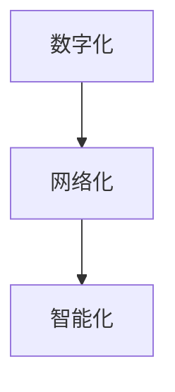
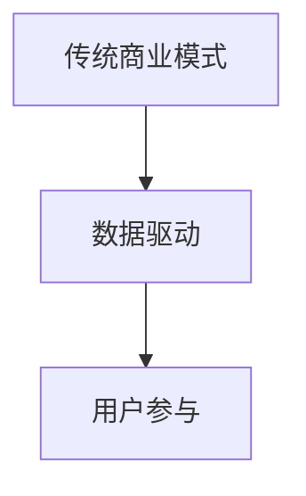
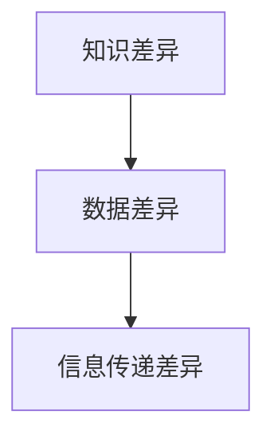
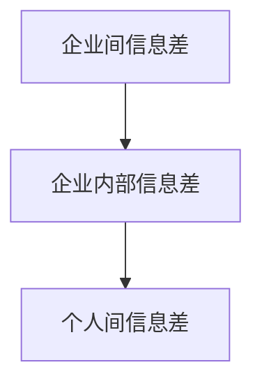
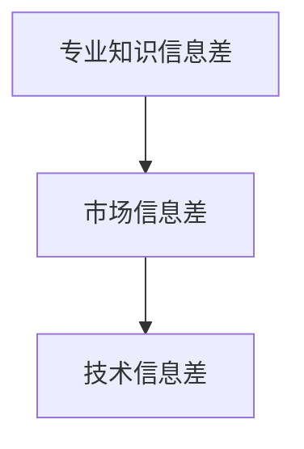

                 

# 文章标题：信息差：信息时代的商业战略

> 关键词：信息时代、商业战略、信息差、商业模式、竞争优势、数字化转型、营销策略、创新、社会责任

> 摘要：本文从信息时代的商业背景出发，探讨了信息差的本质、类型及其在商业战略中的应用。通过分析数字化转型、营销策略、创新与创业等方面的案例，揭示了信息差在信息时代商业实践中的重要作用。同时，文章还探讨了信息时代的社会责任与伦理问题，以及国际与国内的信息差案例分析。最后，对信息差的未来发展趋势进行了展望，并提出了相关法律法规的建议。

----------------------------------------------------------------

### 《信息差：信息时代的商业战略》目录大纲

#### 第一部分：信息时代的商业变革

**第1章：信息时代的商业背景**
- 1.1 信息时代的发展趋势
- 1.2 信息对社会经济的影响
- 1.3 信息时代商业模式的演变
- 1.4 信息差的概念与作用

**第2章：信息差的本质与类型**
- 2.1 信息差的定义
- 2.2 信息差的分类
- 2.3 信息差在不同行业中的应用

**第3章：信息差的挖掘与利用**
- 3.1 信息差的挖掘方法
- 3.2 信息差的利用策略
- 3.3 信息差案例解析

**第4章：信息差的商业战略**
- 4.1 信息差在商业战略中的作用
- 4.2 基于信息差的市场定位
- 4.3 信息差时代的竞争优势

#### 第二部分：信息时代的商业实践

**第5章：数字化转型与信息差**
- 5.1 数字化转型的意义
- 5.2 数字化转型与信息差的关系
- 5.3 数字化转型案例分析

**第6章：信息时代下的营销策略**
- 6.1 营销策略的变革
- 6.2 信息差在营销策略中的应用
- 6.3 信息时代营销案例分析

**第7章：信息时代的创新与创业**
- 7.1 创新的价值
- 7.2 创业中的信息差
- 7.3 信息差驱动下的创新案例

**第8章：信息时代的社会责任与伦理**
- 8.1 信息时代的社会责任
- 8.2 信息时代的伦理问题
- 8.3 信息差的伦理考量

#### 第三部分：信息时代的商业案例研究

**第9章：国际信息差案例分析**
- 9.1 全球领先企业的信息差策略
- 9.2 区域性信息差案例分析
- 9.3 信息差对国际贸易的影响

**第10章：中国信息差案例分析**
- 10.1 中国企业的信息差策略
- 10.2 区域性信息差案例分析
- 10.3 信息差在中国市场的作用

**第11章：信息差的未来展望**
- 11.1 信息差的发展趋势
- 11.2 未来商业模式的变革
- 11.3 信息差的伦理与法律挑战

### 附录

**附录A：信息差研究工具与方法**
- A.1 信息差研究的基本工具
- A.2 信息差数据分析方法
- A.3 信息差研究案例分析

**附录B：信息差资源与推荐**
- B.1 信息差研究相关书籍
- B.2 信息差研究网站与平台
- B.3 信息差研究学术论文

**附录C：信息差相关法律法规**
- C.1 信息保护相关法律
- C.2 数据隐私相关法规
- C.3 信息差行为的合法边界

----------------------------------------------------------------

### 第1章：信息时代的商业背景

#### 1.1 信息时代的发展趋势

- **信息时代的定义与特征**
  信息时代是一个以信息技术为核心驱动力，信息资源高度集聚、信息传播迅速、信息应用普及的时代。其主要特征包括：
  - **数字化**：信息以数字形式存储、传输和处理。
  - **网络化**：信息通过互联网进行连接和共享。
  - **智能化**：信息技术与人工智能结合，实现智能化管理和决策。

  **Mermaid流程图：**
  ```mermaid
  graph TD
  A[数字化] --> B[网络化]
  B --> C[智能化]
  ```

- **信息时代的经济影响**
  信息时代对经济产生了深远影响，主要体现在以下几个方面：
  - **提升生产效率**：通过信息技术的应用，生产流程得到优化，效率大幅提升。
  - **推动产业升级**：信息技术的普及促进了传统产业的转型升级，新兴产业迅速崛起。
  - **创新商业模式**：信息技术的推动下，新的商业模式不断涌现，如共享经济、平台经济等。

  **数学模型：**
  $$ \text{经济效益} = f(\text{信息技术应用程度}, \text{创新能力}, \text{资源配置效率}) $$

- **信息时代商业模式的演变**
  信息时代的商业模式与传统商业模式相比，发生了显著变化。主要表现在：
  - **数据驱动**：商业模式基于大数据分析，通过数据驱动决策。
  - **用户参与**：用户在商业模式设计、实施和优化过程中具有更高的参与度。

  **Mermaid流程图：**
  ```mermaid
  graph TD
  A[传统商业模式] --> B[数据驱动]
  B --> C[用户参与]
  ```

#### 1.2 信息对社会经济的影响

- **信息对社会结构的改变**
  信息技术的快速发展改变了社会结构，主要表现在：
  - **去中心化**：信息传递的快速和广泛使得信息源更加多元，社会结构趋向去中心化。
  - **扁平化**：信息传递的低成本和高效性使得组织结构更加扁平，决策层级减少。

  **Mermaid流程图：**
  ```mermaid
  graph TD
  A[中心化] --> B[去中心化]
  B --> C[扁平化]
  ```

- **信息对经济模式的改变**
  信息技术的普及和应用改变了经济模式，主要体现在：
  - **共享经济**：通过信息技术实现资源的共享，如共享单车、共享办公等。
  - **平台经济**：信息技术平台成为经济活动的主要载体，如电商平台、金融平台等。

  **数学模型：**
  $$ \text{经济模式} = f(\text{信息技术应用}, \text{资源配置效率}, \text{市场机制}) $$

- **信息对生产方式的改变**
  信息时代的生产方式发生了显著变化，主要体现在：
  - **智能化**：通过物联网、人工智能等技术实现生产过程的智能化。
  - **自动化**：通过自动化设备和技术实现生产过程的自动化。

  **Mermaid流程图：**
  ```mermaid
  graph TD
  A[传统生产方式] --> B[智能化]
  B --> C[自动化]
  ```

#### 1.3 信息时代商业模式的演变

- **传统商业模式与信息时代商业模式的对比**
  传统商业模式与信息时代商业模式的主要区别在于：
  - **信息资源整合能力**：信息时代商业模式更加强调信息资源的整合与利用。
  - **信息技术应用能力**：信息时代商业模式更多地依赖于信息技术的创新和应用。

  **Mermaid流程图：**
  ```mermaid
  graph TD
  A[传统商业模式] --> B[信息资源整合能力]
  B --> C[信息技术应用能力]
  ```

- **信息时代商业模式的特征**
  信息时代商业模式的主要特征包括：
  - **数据驱动**：商业模式基于大数据分析，数据成为决策的重要依据。
  - **用户参与**：用户在商业模式设计、实施和优化过程中具有更高的参与度。

  **数学模型：**
  $$ \text{商业模式} = f(\text{数据驱动}, \text{用户参与}, \text{信息技术应用}) $$

#### 1.4 信息差的概念与作用

- **信息差的概念**
  信息差是指不同主体间掌握的信息量差异，主要表现为：
  - **不对称性**：信息在各方间的分布不均。
  - **动态性**：信息差会随着时间和环境变化。

  **Mermaid流程图：**
  ```mermaid
  graph TD
  A[信息不对称] --> B[动态性]
  ```

- **信息差的作用**
  信息差在商业实践中具有重要作用，主要表现在：
  - **商业机会识别**：信息差帮助识别潜在商机。
  - **竞争优势获取**：信息差为企业提供竞争优势。
  - **风险管理**：信息差帮助降低不确定性。

  **数学模型：**
  $$ \text{商业机会识别} = f(\text{信息差}, \text{市场需求}, \text{竞争优势}) $$
  $$ \text{竞争优势} = f(\text{信息差}, \text{创新能力}, \text{资源配置效率}) $$
  $$ \text{风险管理} = f(\text{信息差}, \text{风险评估}, \text{风险控制}) $$

----------------------------------------------------------------

### 第2章：信息差的本质与类型

#### 2.1 信息差的定义

- **信息差的定义**
  信息差是指不同主体间掌握的信息量差异，这种差异可能导致不同的决策和行为。具体来说，信息差可以表现为以下几个方面：
  - **知识差异**：不同主体在特定领域或行业的知识水平不同。
  - **数据差异**：不同主体在数据获取、处理和分析方面的能力差异。
  - **信息传递差异**：不同主体在信息传递的速度、准确性和完整性方面的差异。

  **Mermaid流程图：**
  ```mermaid
  graph TD
  A[知识差异] --> B[数据差异]
  B --> C[信息传递差异]
  ```

- **信息差的基本特征**
  信息差具有以下基本特征：
  - **不对称性**：信息差导致不同主体在信息获取和处理上的不对称，一方掌握的信息量多于另一方。
  - **动态性**：信息差会随着时间、环境和技术的变化而变化。

  **数学模型：**
  $$ \text{信息差} = f(\text{时间}, \text{环境}, \text{技术}) $$

#### 2.2 信息差的分类

- **按信息主体分类**
  信息差可以根据不同的信息主体进行分类，主要包括：
  - **企业间信息差**：不同企业在相同或相似行业中由于资源、能力、信息获取和处理能力的差异而产生的信息差。
  - **企业内部信息差**：企业内部不同部门、层级或员工之间由于信息获取和处理能力的差异而产生的信息差。
  - **个人间信息差**：不同个人在相同或相似环境中由于知识水平、经验、信息获取和处理能力的差异而产生的信息差。

  **Mermaid流程图：**
  ```mermaid
  graph TD
  A[企业间信息差] --> B[企业内部信息差]
  B --> C[个人间信息差]
  ```

- **按信息内容分类**
  信息差也可以根据不同的信息内容进行分类，主要包括：
  - **专业知识信息差**：不同主体在特定专业知识领域中的信息量差异。
  - **市场信息差**：不同主体在市场信息、价格、供需等方面的信息量差异。
  - **技术信息差**：不同主体在技术知识、研发能力、技术应用等方面的信息量差异。

  **Mermaid流程图：**
  ```mermaid
  graph TD
  A[专业知识信息差] --> B[市场信息差]
  B --> C[技术信息差]
  ```

#### 2.3 信息差在不同行业中的应用

- **金融行业**
  在金融行业中，信息差的应用主要体现在以下几个方面：
  - **风险控制**：金融机构通过分析市场信息、客户数据等，识别潜在的信用风险、市场风险等，从而进行有效的风险控制。
  - **投资决策**：投资者通过获取和分析市场信息、行业动态等，做出更准确的投资决策。

  **数学模型：**
  $$ \text{风险控制} = f(\text{信息差}, \text{风险评估模型}, \text{风险控制策略}) $$
  $$ \text{投资决策} = f(\text{信息差}, \text{投资模型}, \text{市场分析}) $$

- **零售行业**
  在零售行业中，信息差的应用主要体现在以下几个方面：
  - **供应链管理**：零售企业通过获取供应商信息、市场信息等，优化供应链管理，降低成本，提高效率。
  - **顾客服务**：零售企业通过收集和分析顾客数据，提供个性化的服务和产品推荐。

  **数学模型：**
  $$ \text{供应链管理} = f(\text{信息差}, \text{供应链模型}, \text{成本控制策略}) $$
  $$ \text{顾客服务} = f(\text{信息差}, \text{顾客分析模型}, \text{个性化服务策略}) $$

- **医疗行业**
  在医疗行业中，信息差的应用主要体现在以下几个方面：
  - **疾病诊断**：医生通过获取和分析病人的病历、检查报告等，提高疾病诊断的准确性。
  - **治疗方案制定**：医生通过获取和分析最新医学研究、临床试验结果等，制定更有效的治疗方案。

  **数学模型：**
  $$ \text{疾病诊断} = f(\text{信息差}, \text{疾病诊断模型}, \text{医学知识库}) $$
  $$ \text{治疗方案制定} = f(\text{信息差}, \text{治疗方案模型}, \text{医学研究数据}) $$

----------------------------------------------------------------

### 第3章：信息差的挖掘与利用

#### 3.1 信息差的挖掘方法

- **数据挖掘技术**
  数据挖掘是从大量数据中提取有价值信息的过程，是挖掘信息差的重要工具。具体方法包括：
  - **关联规则挖掘**：通过分析数据之间的关联性，发现潜在的信息差。
    $$ \text{关联规则} = f(\text{支持度}, \text{置信度}) $$
  - **聚类分析**：将数据划分为若干类别，发现不同类别间的信息差。
    $$ \text{聚类算法} = f(\text{距离度量}, \text{聚类中心}) $$
  - **分类算法**：将数据分为已知类别，用于预测新数据的类别，从而发现信息差。
    $$ \text{分类模型} = f(\text{特征选择}, \text{模型训练}) $$

- **情报收集**
  情报收集是通过多种途径获取信息的过程，是挖掘信息差的重要手段。具体方法包括：
  - **市场调研**：通过问卷调查、访谈等方式，收集市场信息。
  - **竞争对手分析**：通过分析竞争对手的产品、策略、市场表现等，获取竞争信息。
  - **行业报告**：通过查阅行业报告、学术论文等，获取专业知识和行业动态。

  **Mermaid流程图：**
  ```mermaid
  graph TD
  A[市场调研] --> B[竞争对手分析]
  B --> C[行业报告]
  ```

#### 3.2 信息差的利用策略

- **信息差利用策略**
  利用信息差的策略主要包括以下几种：
  - **信息封闭策略**：通过保密和保护信息，形成信息壁垒，从而在竞争中占据优势。
  - **信息共享策略**：通过共享信息，提升整体效率，降低交易成本。

  **Mermaid流程图：**
  ```mermaid
  graph TD
  A[信息封闭策略] --> B[信息共享策略]
  ```

- **信息封闭策略**
  信息封闭策略的核心是通过保密和保护信息，防止信息泄露，从而在竞争中占据优势。具体方法包括：
  - **知识产权保护**：通过专利、版权等方式，保护企业的技术和信息资源。
  - **信息安全管理**：通过加密、访问控制等技术，确保企业信息的安全。

  **数学模型：**
  $$ \text{信息安全} = f(\text{加密算法}, \text{访问控制}, \text{安全审计}) $$

- **信息共享策略**
  信息共享策略的核心是通过共享信息，提升整体效率，降低交易成本。具体方法包括：
  - **开放数据平台**：建设开放数据平台，提供数据资源，促进信息共享。
  - **协同创新**：通过合作、联盟等方式，共同挖掘和利用信息差。

  **数学模型：**
  $$ \text{协同创新} = f(\text{信息共享}, \text{创新能力}, \text{合作机制}) $$

#### 3.3 信息差案例解析

- **案例1：电商平台的用户数据利用**
  电商平台的用户数据是信息差的重要来源。通过分析用户行为数据，电商平台可以发现用户偏好、购买习惯等，从而提供个性化的推荐和服务。
  - **数据挖掘过程：**
    $$ \text{用户推荐系统} = f(\text{用户行为数据}, \text{推荐算法}, \text{个性化服务}) $$
  - **代码示例：**
    ```python
    # 伪代码：用户行为数据分析
    data = load_user_behavior_data()
    recommendations = generate_recommendations(data)
    display_recommendations(recommendations)
    ```

- **案例2：金融行业的风险管理**
  金融行业通过分析客户数据、市场数据等，可以识别潜在的信用风险、市场风险等，从而进行有效的风险管理。
  - **风险管理过程：**
    $$ \text{信用评分模型} = f(\text{客户数据}, \text{市场数据}, \text{风险评估模型}) $$
  - **代码示例：**
    ```python
    # 伪代码：信用评分模型
    credit_data = load_credit_data()
    market_data = load_market_data()
    credit_score = calculate_credit_score(credit_data, market_data)
    risk_management(credit_score)
    ```

----------------------------------------------------------------

### 第4章：信息差的商业战略

#### 4.1 信息差在商业战略中的作用

- **战略定位**
  在商业战略中，信息差的作用主要体现在战略定位上。通过挖掘和利用信息差，企业可以明确自身的市场定位，从而在竞争中占据优势。
  - **市场先机**：利用信息差，企业可以更快地捕捉市场机会，抢占市场先机。
  - **差异化定位**：基于信息差，企业可以提供独特的产品或服务，实现差异化定位。

  **数学模型：**
  $$ \text{战略定位} = f(\text{信息差}, \text{市场机会}, \text{差异化定位}) $$

- **市场细分**
  信息差在市场细分中发挥着重要作用。通过挖掘和利用信息差，企业可以更精准地进行市场细分，从而更好地满足不同细分市场的需求。
  - **目标市场**：基于信息差，企业可以识别并锁定目标市场，实现精准营销。
  - **细分策略**：通过信息差，企业可以制定更有效的市场细分策略，提高市场覆盖率。

  **数学模型：**
  $$ \text{市场细分} = f(\text{信息差}, \text{市场需求}, \text{竞争环境}) $$

#### 4.2 基于信息差的市场定位

- **市场定位策略**
  基于信息差的市场定位策略主要包括以下几种：
  - **领先定位**：利用信息差，率先进入市场，占据领先地位。
  - **跟随定位**：通过分析领先企业的信息差，进行跟随和优化，提升自身竞争力。

  **Mermaid流程图：**
  ```mermaid
  graph TD
  A[领先定位] --> B[跟随定位]
  ```

- **领先定位**
  领先定位是指企业通过挖掘和利用信息差，率先进入市场，占据领先地位。具体策略包括：
  - **技术创新**：通过技术创新，率先推出新产品或服务，形成竞争优势。
  - **市场洞察**：通过分析市场信息，快速捕捉市场趋势，抢占市场先机。

  **数学模型：**
  $$ \text{领先定位} = f(\text{信息差}, \text{技术创新}, \text{市场洞察}) $$

- **跟随定位**
  跟随定位是指企业通过分析领先企业的信息差，进行跟随和优化，提升自身竞争力。具体策略包括：
  - **学习模仿**：通过学习领先企业的成功经验，进行模仿和创新。
  - **优化改进**：通过分析市场信息，发现领先企业的不足，进行优化和改进。

  **数学模型：**
  $$ \text{跟随定位} = f(\text{信息差}, \text{学习模仿}, \text{优化改进}) $$

#### 4.3 信息差时代的竞争优势

- **竞争优势来源**
  在信息差时代，竞争优势的来源主要包括以下方面：
  - **信息利用效率**：企业通过挖掘和利用信息差，提高信息利用效率，实现成本优势、速度优势和创新能力。
  - **创新能力**：通过信息差的挖掘和利用，企业可以更快地推出新产品或服务，实现创新优势。

  **数学模型：**
  $$ \text{竞争优势} = f(\text{信息利用效率}, \text{创新能力}, \text{市场响应速度}) $$

- **竞争优势保持**
  在信息差时代，企业需要不断保持竞争优势，具体策略包括：
  - **持续创新**：通过持续的技术创新和商业模式创新，保持竞争优势。
  - **灵活应对**：通过灵活的市场策略和运营模式，快速应对市场变化。

  **数学模型：**
  $$ \text{竞争优势保持} = f(\text{持续创新}, \text{灵活应对}, \text{市场适应性}) $$

----------------------------------------------------------------

### 第5章：数字化转型与信息差

#### 5.1 数字化转型的意义

- **数字化转型定义**
  数字化转型是指企业通过应用信息技术，实现业务模式、生产方式、管理模式等方面的变革，从而提升企业竞争力、创造新的价值。

  **Mermaid流程图：**
  ```mermaid
  graph TD
  A[业务模式变革] --> B[生产方式变革]
  B --> C[管理模式变革]
  ```

- **数字化转型的影响**
  数字化转型对企业和社会产生了深远的影响，主要表现在以下几个方面：
  - **提升企业效率**：通过数字化手段，优化业务流程，提高生产效率和运营效率。
  - **创造新的价值**：通过数字化转型，企业可以开拓新的市场、创造新的产品和服务，实现业务增长。
  - **促进产业升级**：数字化转型推动了传统产业的转型升级，促进了新兴产业的发展。

  **数学模型：**
  $$ \text{企业效率} = f(\text{数字化转型程度}, \text{信息技术应用水平}, \text{组织管理水平}) $$
  $$ \text{业务增长} = f(\text{数字化转型程度}, \text{市场适应性}, \text{创新能力}) $$
  $$ \text{产业升级} = f(\text{数字化转型程度}, \text{技术创新能力}, \text{政策支持}) $$

#### 5.2 数字化转型与信息差的关系

- **数字化转型与信息差的互动**
  数字化转型与信息差之间存在密切的互动关系。数字化转型为信息差的挖掘和利用提供了新的工具和方法，而信息差的利用又推动了数字化的进一步发展。
  - **数字化赋能**：数字化转型提升了信息获取、处理和利用的能力，为企业挖掘和利用信息差提供了更多可能性。
  - **信息差驱动**：信息差的挖掘和利用为企业数字化转型提供了目标和动力，促使企业不断创新和优化。

  **Mermaid流程图：**
  ```mermaid
  graph TD
  A[数字化转型] --> B[信息差挖掘与利用]
  B --> A
  ```

- **数字化转型中的信息差利用**
  在数字化转型过程中，信息差的利用至关重要。企业可以通过以下方式利用信息差：
  - **市场洞察**：通过分析市场信息，发现潜在的商业机会和市场需求，实现精准营销。
  - **技术创新**：通过分析技术趋势和竞争对手的技术水平，进行技术创新和产品升级。

  **数学模型：**
  $$ \text{市场洞察} = f(\text{信息差}, \text{数据分析能力}, \text{市场趋势预测}) $$
  $$ \text{技术创新} = f(\text{信息差}, \text{技术分析能力}, \text{创新能力}) $$

#### 5.3 数字化转型案例分析

- **案例1：传统制造企业数字化转型**
  某传统制造企业通过数字化转型，实现了生产方式、管理模式等方面的变革，提高了生产效率和产品质量。
  - **数字化转型过程：**
    1. **数字化设备引入**：引入数字化生产设备，实现生产过程的自动化和智能化。
    2. **数字化管理平台建设**：建立数字化管理平台，实现生产计划、库存管理、质量管理等方面的数字化管理。
    3. **数据驱动决策**：通过数据分析，优化生产流程，降低生产成本，提高生产效率。

    **数学模型：**
    $$ \text{生产效率} = f(\text{数字化设备}, \text{数字化管理}, \text{数据分析}) $$
  
  **代码示例**：
  ```python
  # 伪代码：生产效率优化
  production_data = collect_production_data()
  optimized_process = optimize_production_process(production_data)
  improve_production_efficiency(optimized_process)
  ```

- **案例2：电商平台数字化转型**
  某电商平台通过数字化转型，实现了用户数据分析、个性化推荐、智能客服等功能，提升了用户体验和销售业绩。
  - **数字化转型过程：**
    1. **用户数据分析**：通过数据分析，了解用户行为和需求，实现个性化推荐。
    2. **智能客服系统建设**：引入智能客服系统，实现24小时在线服务，提高客户满意度。
    3. **供应链优化**：通过数字化手段，优化供应链管理，提高配送效率。

    **数学模型：**
    $$ \text{用户体验} = f(\text{用户数据分析}, \text{智能客服}, \text{供应链优化}) $$
  
  **代码示例**：
  ```python
  # 伪代码：用户体验优化
  user_data = collect_user_data()
  personalized_recommendations = generate_recommendations(user_data)
  smart_customer_service = build_smart_customer_service()
  enhance_user_experience(personalized_recommendations, smart_customer_service)
  ```

----------------------------------------------------------------

### 第6章：信息时代下的营销策略

#### 6.1 营销策略的变革

- **传统营销策略与信息时代营销策略的对比**
  传统营销策略与信息时代营销策略在多个方面存在显著差异，具体对比如下：

  **传统营销策略：**
  - **以产品为中心**：传统营销策略更多地关注产品的特性、功能和质量。
  - **单向传播**：通过广告、宣传册等渠道，单向地向目标客户传递信息。
  - **成本高**：传统营销策略需要大量投入，如广告费用、人员成本等。

  **信息时代营销策略：**
  - **以用户为中心**：信息时代营销策略更注重用户的需求、偏好和体验。
  - **双向互动**：通过社交媒体、电商平台等渠道，与用户进行实时互动，收集用户反馈。
  - **成本低**：信息时代营销策略利用数字工具，降低营销成本，提高营销效率。

  **Mermaid流程图：**
  ```mermaid
  graph TD
  A[传统营销策略] --> B[信息时代营销策略]
  B --> C[以用户为中心]
  B --> D[双向互动]
  B --> E[成本低]
  ```

- **信息时代营销的特征**
  信息时代营销策略具有以下主要特征：
  - **数据驱动**：营销决策基于大数据分析，通过数据挖掘和预测，实现精准营销。
  - **个性化**：通过用户行为分析，提供个性化的产品和服务，提升用户体验。
  - **多渠道**：利用多种数字渠道，如社交媒体、搜索引擎、电子邮件等，实现全方位营销。

  **Mermaid流程图：**
  ```mermaid
  graph TD
  A[数据驱动] --> B[个性化]
  B --> C[多渠道]
  ```

#### 6.2 信息差在营销策略中的应用

- **信息差在市场细分中的应用**
  信息差在市场细分中具有重要作用。通过挖掘和分析市场信息，企业可以识别出不同的细分市场，并针对每个细分市场制定相应的营销策略。
  - **目标市场识别**：利用信息差，企业可以更准确地识别目标市场，确定目标客户群体。
  - **细分策略制定**：基于信息差，企业可以制定个性化的营销策略，满足不同细分市场的需求。

  **数学模型：**
  $$ \text{市场细分} = f(\text{信息差}, \text{市场需求}, \text{竞争环境}) $$
  $$ \text{目标市场识别} = f(\text{信息差}, \text{数据分析能力}, \text{市场调研}) $$
  $$ \text{细分策略制定} = f(\text{信息差}, \text{营销策略组合}, \text{个性化服务}) $$

- **信息差在营销策略制定中的应用**
  在制定营销策略时，信息差的应用主要体现在以下几个方面：
  - **市场定位**：通过分析市场信息，确定产品的市场定位，实现差异化营销。
  - **产品策略**：根据信息差，制定差异化的产品策略，满足不同用户群体的需求。
  - **推广策略**：利用信息差，选择最适合的推广渠道和方式，提高营销效果。

  **Mermaid流程图：**
  ```mermaid
  graph TD
  A[市场定位] --> B[产品策略]
  B --> C[推广策略]
  ```

#### 6.3 信息时代营销案例分析

- **案例1：社交媒体营销**
  社交媒体营销是信息时代营销策略的重要组成部分。通过社交媒体平台，企业可以与用户进行实时互动，提高品牌知名度和用户参与度。
  - **案例分析：**
    1. **社交媒体选择**：企业根据目标客户群体的特点，选择合适的社交媒体平台，如微信、微博、抖音等。
    2. **内容策略**：通过发布有价值的内容，如教程、案例、新闻等，吸引目标客户的关注。
    3. **互动管理**：与用户进行实时互动，收集用户反馈，优化产品和服务。

    **数学模型：**
    $$ \text{品牌知名度} = f(\text{社交媒体选择}, \text{内容策略}, \text{互动管理}) $$
    $$ \text{用户参与度} = f(\text{社交媒体互动}, \text{用户反馈收集}, \text{服务优化}) $$

  **代码示例**：
  ```python
  # 伪代码：社交媒体营销
  social_media_platforms = select_social_media_platforms()
  content_strategy = create_content_strategy()
  interaction_management = manage_interactions()
  enhance_brand_awareness(social_media_platforms, content_strategy, interaction_management)
  ```

- **案例2：跨境电商营销**
  跨境电商营销是信息时代营销策略在全球化背景下的重要应用。通过跨境电商平台，企业可以拓展国际市场，实现全球营销。
  - **案例分析：**
    1. **市场调研**：通过分析国际市场信息，了解目标市场的需求、竞争状况等。
    2. **产品定位**：根据市场调研结果，确定产品的国际市场定位和定价策略。
    3. **营销推广**：通过跨境电商平台，进行产品推广和销售，提高国际市场占有率。

    **数学模型：**
    $$ \text{国际市场占有率} = f(\text{市场调研}, \text{产品定位}, \text{营销推广}) $$
    $$ \text{销售增长} = f(\text{跨境电商平台}, \text{产品定价策略}, \text{市场推广效果}) $$

  **代码示例**：
  ```python
  # 伪代码：跨境电商营销
  international_market_data = conduct_market_research()
  product_positioning = determine_product_positioning()
  marketing_promotion = implement_marketing_promotion()
  increase_international_market_share(international_market_data, product_positioning, marketing_promotion)
  ```

----------------------------------------------------------------

### 第7章：信息时代的创新与创业

#### 7.1 创新的价值

- **创新在企业发展中的重要性**
  创新是企业持续发展的核心动力，对企业的生存和成长具有决定性影响。创新能够带来以下价值：
  - **提升竞争力**：通过创新，企业能够开发出独特的产品和服务，满足市场需求，从而在竞争中脱颖而出。
  - **拓展市场**：创新能够帮助企业发现新的市场机会，拓展业务领域，实现业务增长。
  - **提高效率**：创新能够优化企业的生产流程和管理模式，提高生产效率和运营效率。

  **数学模型：**
  $$ \text{企业竞争力} = f(\text{创新能力}, \text{市场份额}, \text{产品差异化}) $$
  $$ \text{业务增长} = f(\text{创新机会}, \text{市场开拓能力}, \text{资源配置效率}) $$
  $$ \text{生产效率} = f(\text{技术创新}, \text{流程优化}, \text{人员培训}) $$

- **创新对企业竞争力的提升**
  创新不仅能够提升企业的竞争力，还能够为企业带来持续的竞争优势。具体提升方式包括：
  - **产品创新**：通过开发新产品或改进现有产品，满足消费者的需求，提高市场占有率。
  - **流程创新**：通过改进生产流程和管理模式，提高生产效率和运营效率。
  - **商业模式创新**：通过创新商业模式，探索新的盈利模式，实现企业的可持续发展。

  **Mermaid流程图：**
  ```mermaid
  graph TD
  A[产品创新] --> B[流程创新]
  B --> C[商业模式创新]
  ```

#### 7.2 创业中的信息差

- **创业中的信息差优势**
  信息差在创业中具有显著的优势，能够为创业者带来以下机会：
  - **市场机会识别**：通过挖掘和利用信息差，创业者可以更准确地识别市场机会，抢占先机。
  - **竞争优势获取**：基于信息差，创业者可以提供独特的产品或服务，形成竞争优势。
  - **风险管理**：信息差能够帮助创业者降低市场风险，提高创业成功率。

  **数学模型：**
  $$ \text{市场机会识别} = f(\text{信息差}, \text{市场需求}, \text{竞争环境}) $$
  $$ \text{竞争优势} = f(\text{信息差}, \text{创新能力}, \text{资源配置效率}) $$
  $$ \text{风险管理} = f(\text{信息差}, \text{风险评估}, \text{风险控制}) $$

- **信息差在创业策略中的应用**
  在创业过程中，信息差的利用策略主要包括：
  - **市场洞察**：通过分析市场信息，发现潜在的市场机会，制定有针对性的创业计划。
  - **技术创新**：通过技术创新，提供独特的产品或服务，形成竞争优势。
  - **资源整合**：通过整合各类资源，提高创业成功率。

  **Mermaid流程图：**
  ```mermaid
  graph TD
  A[市场洞察] --> B[技术创新]
  B --> C[资源整合]
  ```

#### 7.3 信息差驱动下的创新案例

- **案例1：人工智能创新**
  人工智能（AI）是信息差驱动下的创新案例之一。通过挖掘和利用信息差，企业可以开发出具有竞争力的AI产品和服务。
  - **案例分析：**
    1. **技术信息差**：通过分析技术趋势和竞争对手的技术水平，企业可以确定AI技术的研发方向。
    2. **市场信息差**：通过分析市场需求和用户行为，企业可以开发出符合用户需求的产品和服务。
    3. **应用创新**：将AI技术应用于不同的领域，如金融、医疗、教育等，实现创新应用。

    **数学模型：**
    $$ \text{AI创新} = f(\text{技术信息差}, \text{市场信息差}, \text{应用创新}) $$

  **代码示例**：
  ```python
  # 伪代码：人工智能创新
  technology_diff = analyze_technology_trends()
  market_diff = analyze_market需求的
  application_innovation = implement_ai_application()
  drive_innovation(technology_diff, market_diff, application_innovation)
  ```

- **案例2：区块链技术应用**
  区块链技术是信息差驱动下的创新案例之二。通过挖掘和利用信息差，企业可以开发出具有竞争力的区块链产品和服务。
  - **案例分析：**
    1. **技术信息差**：通过分析区块链技术的应用场景和竞争对手的技术水平，企业可以确定区块链技术的研发方向。
    2. **市场信息差**：通过分析市场需求和用户行为，企业可以开发出符合用户需求的区块链产品和服务。
    3. **应用创新**：将区块链技术应用于不同的领域，如金融、供应链管理、数据隐私保护等，实现创新应用。

    **数学模型：**
    $$ \text{区块链创新} = f(\text{技术信息差}, \text{市场信息差}, \text{应用创新}) $$

  **代码示例**：
  ```python
  # 伪代码：区块链技术应用
  technology_diff = analyze_blockchain_applications()
  market_diff = analyze_market需求的
  application_innovation = implement_blockchain_solution()
  drive_innovation(technology_diff, market_diff, application_innovation)
  ```

----------------------------------------------------------------

### 第8章：信息时代的社会责任与伦理

#### 8.1 信息时代的社会责任

- **社会责任的重要性**
  在信息时代，企业社会责任（CSR）的重要性日益凸显。信息技术的快速发展不仅为企业带来了巨大的商业机会，也带来了新的社会责任挑战。企业应当意识到社会责任对企业长期成功和可持续发展的重要性，并积极履行社会责任。
  - **提升企业形象**：履行社会责任有助于提升企业的社会形象和声誉，增强公众对企业的信任和认可。
  - **增强竞争力**：社会责任有助于企业吸引和留住人才，提高员工的满意度和忠诚度，从而增强企业的竞争力。
  - **促进可持续发展**：履行社会责任有助于企业实现经济、社会和环境的三重可持续发展，为企业的长期成功奠定基础。

  **数学模型：**
  $$ \text{企业形象} = f(\text{社会责任履行}, \text{社会责任投入}, \text{社会责任效果}) $$
  $$ \text{竞争力} = f(\text{社会责任}, \text{人才吸引}, \text{员工满意}) $$
  $$ \text{可持续发展} = f(\text{社会责任}, \text{环境保护}, \text{社会贡献}) $$

- **社会责任的主要内容**
  信息时代的社会责任主要包括以下几个方面：
  - **信息安全**：企业应当确保用户数据的安全，防止数据泄露和滥用，保障用户的隐私权益。
  - **公平竞争**：企业应当遵循公平竞争的原则，避免利用信息差进行不正当竞争，维护市场秩序。
  - **可持续发展**：企业应当关注环境保护和资源利用，推动绿色生产和可持续发展。

  **Mermaid流程图：**
  ```mermaid
  graph TD
  A[信息安全] --> B[公平竞争]
  B --> C[可持续发展]
  ```

#### 8.2 信息时代的伦理问题

- **伦理问题的定义**
  伦理问题是指涉及道德判断的问题，主要包括个人或组织在行为决策过程中涉及到的道德标准、道德责任和道德义务。在信息时代，随着信息技术的发展，伦理问题也日益复杂和多样化。
  - **隐私问题**：在信息时代，用户数据成为企业的宝贵资源，隐私问题成为重要的伦理问题。企业应当尊重用户的隐私权，合理收集和使用用户数据。
  - **公平问题**：在信息时代，信息差可能导致资源分配的不公平，企业应当努力减少信息差，促进社会的公平与正义。
  - **透明度问题**：在信息时代，企业应当提高信息的透明度，确保用户能够清楚地了解企业的行为和决策。

  **数学模型：**
  $$ \text{伦理问题} = f(\text{道德标准}, \text{道德责任}, \text{道德义务}) $$
  $$ \text{隐私问题} = f(\text{数据收集}, \text{数据使用}, \text{用户隐私权}) $$
  $$ \text{公平问题} = f(\text{信息差}, \text{资源分配}, \text{社会正义}) $$
  $$ \text{透明度问题} = f(\text{信息披露}, \text{决策透明}, \text{用户知情权}) $$

- **信息时代伦理问题的类型**
  信息时代的伦理问题主要包括以下类型：
  - **隐私问题**：涉及用户数据的收集、存储、处理和分享，如数据泄露、数据滥用等。
  - **公平问题**：涉及资源分配、机会公平和社会公平，如信息差导致的资源分配不公、歧视性问题等。
  - **透明度问题**：涉及企业行为和决策的透明度，如信息披露不充分、决策过程不透明等。
  - **技术伦理问题**：涉及技术本身的应用和影响，如人工智能的伦理问题、数据伦理问题等。

  **Mermaid流程图：**
  ```mermaid
  graph TD
  A[隐私问题] --> B[公平问题]
  B --> C[透明度问题]
  C --> D[技术伦理问题]
  ```

#### 8.3 信息差的伦理考量

- **信息差的伦理评价**
  在信息时代，信息差不仅是一种经济现象，也是一种伦理问题。企业应当从伦理角度对信息差进行评价，确保信息差的利用符合道德标准。
  - **目的考量**：企业应当评估信息差利用的目的，确保其符合道德原则，如增进社会福利、促进技术创新等。
  - **影响考量**：企业应当评估信息差利用可能带来的负面影响，如隐私侵犯、资源分配不公等，并采取相应的措施进行缓解。

  **数学模型：**
  $$ \text{伦理评价} = f(\text{目的考量}, \text{影响考量}, \text{道德标准}) $$
  $$ \text{道德原则符合度} = f(\text{信息差目的}, \text{社会责任}, \text{道德义务}) $$
  $$ \text{伦理影响评估} = f(\text{信息差影响}, \text{隐私保护}, \text{社会公平}) $$

- **伦理考量在信息差利用中的应用**
  在信息差的利用过程中，企业应当将伦理考量融入到战略决策和业务运营中，确保信息差的利用符合道德原则。
  - **伦理决策**：企业在制定信息差利用策略时，应当充分考虑伦理问题，确保决策的道德合理性。
  - **伦理监管**：企业应当建立健全的伦理监管机制，对信息差的利用进行监督和管理，防止伦理风险的发生。
  - **伦理沟通**：企业应当与利益相关者进行有效的伦理沟通，解释信息差利用的伦理考量，增强社会的信任和理解。

  **Mermaid流程图：**
  ```mermaid
  graph TD
  A[伦理决策] --> B[伦理监管]
  B --> C[伦理沟通]
  ```

----------------------------------------------------------------

### 第9章：国际信息差案例分析

#### 9.1 全球领先企业的信息差策略

- **谷歌的信息差策略**
  谷歌作为全球领先的技术企业，其信息差策略主要体现在以下几个方面：
  - **技术领先**：谷歌在搜索引擎、云计算等领域保持技术领先地位，通过技术优势挖掘信息差。
  - **大数据分析**：谷歌利用其庞大的用户数据，进行大数据分析，发现市场机会和用户需求。
  - **生态构建**：谷歌通过构建开放的应用生态，吸引开发者加入，扩大信息网络。

  **数学模型：**
  $$ \text{信息差优势} = f(\text{技术领先}, \text{大数据分析}, \text{生态构建}) $$

- **亚马逊的信息差策略**
  亚马逊作为全球领先的电商平台，其信息差策略主要体现在以下几个方面：
  - **用户行为分析**：亚马逊通过分析用户行为数据，了解用户偏好和需求，提供个性化推荐。
  - **供应链管理**：亚马逊通过优化供应链管理，提高物流效率，降低运营成本。
  - **平台拓展**：亚马逊通过拓展国际市场，挖掘区域信息差，实现全球业务布局。

  **数学模型：**
  $$ \text{竞争优势} = f(\text{用户行为分析}, \text{供应链管理}, \text{平台拓展}) $$

#### 9.2 区域性信息差案例分析

- **亚洲市场的信息差策略**
  在亚洲市场，信息差策略主要体现在以下几个方面：
  - **本土化策略**：企业通过深入了解亚洲市场的文化、消费习惯等，制定本土化营销策略。
  - **创新应用**：企业通过将新技术应用于亚洲市场，满足当地用户的需求，如移动支付、在线购物等。
  - **市场拓展**：企业通过区域合作，拓展亚洲市场，挖掘区域信息差。

  **数学模型：**
  $$ \text{市场机会} = f(\text{本土化策略}, \text{创新应用}, \text{市场拓展}) $$

- **非洲市场的信息差策略**
  在非洲市场，信息差策略主要体现在以下几个方面：
  - **基础设施建设**：企业通过投资基础设施建设，提升非洲地区的互联网接入能力和通信质量。
  - **数字化普及**：企业通过推广数字化产品和服务，提高非洲地区的数字化普及率。
  - **市场开发**：企业通过挖掘非洲市场潜力，开发本地市场，拓展业务领域。

  **数学模型：**
  $$ \text{市场发展} = f(\text{基础设施建设}, \text{数字化普及}, \text{市场开发}) $$

#### 9.3 信息差对国际贸易的影响

- **信息差对国际贸易的影响**
  信息差在国际贸易中发挥着重要作用，主要表现在以下几个方面：
  - **市场准入**：信息差影响企业进入国际市场的能力，掌握信息优势的企业能够更轻松地进入目标市场。
  - **竞争策略**：信息差影响企业的竞争策略，企业通过挖掘信息差，制定更有针对性的市场策略。
  - **贸易利益**：信息差影响国际贸易的收益分配，掌握信息优势的企业能够在国际贸易中获得更大的利益。

  **数学模型：**
  $$ \text{市场准入能力} = f(\text{信息差}, \text{市场环境}, \text{企业资源}) $$
  $$ \text{竞争策略效果} = f(\text{信息差}, \text{竞争环境}, \text{创新能力}) $$
  $$ \text{贸易收益分配} = f(\text{信息差}, \text{市场地位}, \text{贸易条件}) $$

- **信息差在国际市场策略中的应用**
  在国际市场策略中，企业应当充分利用信息差，制定有针对性的市场策略：
  - **市场调研**：通过深入的市场调研，了解目标市场的信息差，制定适合的市场策略。
  - **技术创新**：通过技术创新，提高产品的竞争力，缩小与竞争对手的信息差。
  - **本地化运营**：通过本地化运营，更好地适应目标市场的需求，挖掘区域信息差。

  **Mermaid流程图：**
  ```mermaid
  graph TD
  A[市场调研] --> B[技术创新]
  B --> C[本地化运营]
  ```

----------------------------------------------------------------

### 第10章：中国信息差案例分析

#### 10.1 中国企业的信息差策略

- **华为的信息差策略**
  华为作为中国领先的技术企业，其信息差策略主要体现在以下几个方面：
  - **技术创新**：华为通过持续的技术研发，保持在全球通信技术领域的领先地位，挖掘技术信息差。
  - **市场洞察**：华为通过深入了解全球市场动态和用户需求，制定有针对性的市场策略。
  - **生态建设**：华为通过构建开放的生态系统，吸引全球开发者，扩大信息网络。

  **数学模型：**
  $$ \text{竞争优势} = f(\text{技术创新}, \text{市场洞察}, \text{生态建设}) $$

- **阿里巴巴的信息差策略**
  阿里巴巴作为中国领先的电商平台，其信息差策略主要体现在以下几个方面：
  - **用户行为分析**：阿里巴巴通过分析用户行为数据，提供个性化推荐和精准营销。
  - **供应链管理**：阿里巴巴通过优化供应链管理，提高物流效率，降低运营成本。
  - **平台拓展**：阿里巴巴通过拓展国际市场，挖掘全球市场信息差。

  **数学模型：**
  $$ \text{市场份额} = f(\text{用户行为分析}, \text{供应链管理}, \text{平台拓展}) $$

#### 10.2 区域性信息差案例分析

- **一线城市的信息差策略**
  一线城市的信息差策略主要体现在以下几个方面：
  - **数字化基础设施**：一线城市通过建设高速互联网、智能交通等数字化基础设施，提升信息获取和处理能力。
  - **科技创新**：一线城市通过吸引高端人才和科技创新资源，推动数字经济的发展。
  - **国际化合作**：一线城市通过国际化合作，引进全球先进技术和管理经验，挖掘国际信息差。

  **数学模型：**
  $$ \text{城市发展} = f(\text{数字化基础设施}, \text{科技创新}, \text{国际化合作}) $$

- **农村地区的信息差策略**
  农村地区的信息差策略主要体现在以下几个方面：
  - **信息化建设**：农村地区通过推进信息化建设，提高互联网接入能力和通信质量。
  - **数字农业**：农村地区通过发展数字农业，提高农业生产效率和质量。
  - **电子商务**：农村地区通过发展电子商务，拓宽农产品销售渠道，提升农民收入。

  **数学模型：**
  $$ \text{农村经济发展} = f(\text{信息化建设}, \text{数字农业}, \text{电子商务}) $$

#### 10.3 信息差在中国市场的作用

- **信息差在中国市场的作用**
  信息差在中国市场发挥着重要作用，主要体现在以下几个方面：
  - **市场竞争**：信息差为企业提供了市场竞争的依据，企业通过挖掘和利用信息差，提升市场竞争力。
  - **产业发展**：信息差推动了产业的升级和转型，新兴产业迅速崛起，传统产业逐步升级。
  - **社会治理**：信息差为政府提供了更好的社会治理手段，通过大数据等技术，提升社会治理效能。

  **数学模型：**
  $$ \text{市场竞争} = f(\text{信息差}, \text{技术创新}, \text{资源配置}) $$
  $$ \text{产业发展} = f(\text{信息差}, \text{产业政策}, \text{技术创新}) $$
  $$ \text{社会治理} = f(\text{信息差}, \text{大数据技术}, \text{社会治理模式}) $$

- **信息差在中国企业战略中的应用**
  在中国企业的战略规划中，信息差的挖掘和利用至关重要。企业应当从以下几个方面应用信息差：
  - **市场定位**：通过分析市场信息差，确定企业的市场定位和战略方向。
  - **技术创新**：通过挖掘技术信息差，推动企业的技术创新和产品升级。
  - **合作联盟**：通过合作联盟，扩大信息网络，提升企业的竞争力。

  **Mermaid流程图：**
  ```mermaid
  graph TD
  A[市场定位] --> B[技术创新]
  B --> C[合作联盟]
  ```

----------------------------------------------------------------

### 第11章：信息差的未来展望

#### 11.1 信息差的发展趋势

- **信息差的发展趋势**
  在未来，信息差将继续发展，并呈现出以下趋势：
  - **智能化**：随着人工智能技术的发展，信息差将更加智能化，企业将能够更精准地挖掘和利用信息差。
  - **全球化**：随着全球化进程的推进，跨国信息差将更加突出，企业将面临更多跨国信息差挑战和机遇。
  - **数字化转型**：数字化转型将继续深化，信息差将更多地体现在数字化领域，如大数据、云计算、物联网等。

  **数学模型：**
  $$ \text{信息差发展} = f(\text{智能化}, \text{全球化}, \text{数字化转型}) $$

#### 11.2 未来商业模式的变革

- **未来商业模式的变革**
  在未来，商业模式将面临重大变革，主要体现在以下方面：
  - **平台化**：平台商业模式将成为主流，企业将更多地通过平台生态实现商业价值的创造。
  - **生态化**：企业将构建生态化商业模式，通过合作伙伴共同创造价值，形成生态圈。
  - **个性化**：随着消费者需求的个性化，企业将提供更加个性化的产品和服务。

  **Mermaid流程图：**
  ```mermaid
  graph TD
  A[平台化] --> B[生态化]
  B --> C[个性化]
  ```

#### 11.3 信息差的伦理与法律挑战

- **信息差的伦理挑战**
  随着信息差的发展，伦理挑战也将日益凸显，主要包括：
  - **隐私保护**：信息差的挖掘和利用可能侵犯用户隐私，企业需要加强隐私保护措施。
  - **公平竞争**：信息差可能导致资源分配不公，企业需要采取措施确保公平竞争。

  **数学模型：**
  $$ \text{伦理挑战} = f(\text{隐私保护}, \text{公平竞争}, \text{社会正义}) $$

- **信息差的法律挑战**
  信息差的发展也将带来法律挑战，主要包括：
  - **数据保护法规**：企业需要遵守国际和国内的数据保护法规，如《通用数据保护条例（GDPR）》等。
  - **信息差利用的法律界限**：企业需要明确信息差利用的合法边界，防止滥用信息差造成不正当竞争。

  **数学模型：**
  $$ \text{法律挑战} = f(\text{数据保护法规}, \text{信息差利用合法边界}, \text{市场竞争规则}) $$

----------------------------------------------------------------

### 附录

#### 附录A：信息差研究工具与方法

- **信息差研究工具**
  - **数据挖掘工具**：如Python的Pandas、Scikit-learn等。
  - **数据分析工具**：如Tableau、Power BI等。

- **信息差研究方法**
  - **问卷调查**：通过问卷调查收集信息差相关数据。
  - **案例分析**：通过具体案例深入研究信息差的挖掘和利用策略。

#### 附录B：信息差资源与推荐

- **信息差研究相关书籍**
  - 《信息经济学》
  - 《大数据时代：生活、工作与思维的大变革》

- **信息差研究网站与平台**
  - **InfoQ**：专业IT资讯网站。
  - **Medium**：国外专业内容平台。

- **信息差研究学术论文**
  - **IEEE Xplore**：计算机科学领域权威数据库。
  - **Google Scholar**：学术搜索平台。

#### 附录C：信息差相关法律法规

- **信息保护相关法律**
  - **《中华人民共和国网络安全法》**
  - **《欧盟通用数据保护条例（GDPR）》**

- **数据隐私相关法规**
  - **《中华人民共和国个人信息保护法》**
  - **《欧盟隐私盾牌（EU-U.S. Privacy Shield）》**

- **信息差行为的合法边界**
  - **《反不正当竞争法》**：对不正当信息差行为的规范。
  - **《合同法》**：对信息差利用中合同关系的规范。

### 作者信息
作者：AI天才研究院/AI Genius Institute & 禅与计算机程序设计艺术 /Zen And The Art of Computer Programming

----------------------------------------------------------------

### 文章标题：信息差：信息时代的商业战略

### 关键词：信息时代、商业战略、信息差、商业模式、竞争优势、数字化转型、营销策略、创新、社会责任

### 摘要
本文从信息时代的商业背景出发，探讨了信息差的本质、类型及其在商业战略中的应用。通过分析数字化转型、营销策略、创新与创业等方面的案例，揭示了信息差在信息时代商业实践中的重要作用。同时，文章还探讨了信息时代的社会责任与伦理问题，以及国际与国内的信息差案例分析。最后，对信息差的未来发展趋势进行了展望，并提出了相关法律法规的建议。

----------------------------------------------------------------

### 第一部分：信息时代的商业变革

#### 第1章：信息时代的商业背景

在当今世界，信息技术的发展已经深刻地改变了商业环境，进入了信息时代。信息时代是一个以信息技术为核心驱动力，信息资源高度集聚、信息传播迅速、信息应用普及的时代。其主要特征包括数字化、网络化和智能化。在这个时代，信息差成为了一种重要的商业资源，影响着企业的竞争力和商业模式。

##### 1.1 信息时代的发展趋势

信息时代的发展趋势主要体现在以下几个方面：

- **数字化**：信息以数字形式存储、传输和处理。数字化不仅提高了信息的处理效率，也改变了人们的生产、生活和消费方式。
- **网络化**：信息通过互联网进行连接和共享。互联网的普及使得信息传播的速度和范围大大扩展，促进了全球贸易和经济一体化。
- **智能化**：信息技术与人工智能结合，实现智能化管理和决策。智能化使得企业能够更高效地处理数据，做出更精准的决策。

**Mermaid流程图：**



**数学模型：**

$$ \text{信息时代特征} = f(\text{数字化}, \text{网络化}, \text{智能化}) $$

##### 1.2 信息对社会经济的影响

信息对社会经济的影响是多方面的，主要体现在以下几个方面：

- **提升生产效率**：通过信息技术的应用，生产流程得到优化，效率大幅提升。例如，自动化生产线和智能工厂的普及，使得生产效率得到了显著提高。
- **推动产业升级**：信息技术的普及促进了传统产业的转型升级，新兴产业迅速崛起。例如，电子商务、共享经济等新兴产业，都是信息技术推动的产物。
- **创新商业模式**：信息技术的推动下，新的商业模式不断涌现。例如，平台经济和共享经济，都是基于互联网和信息技术的新商业模式。

**数学模型：**

$$ \text{经济效益} = f(\text{信息技术应用程度}, \text{创新能力}, \text{资源配置效率}) $$

##### 1.3 信息时代商业模式的演变

信息时代的商业模式与传统商业模式相比，发生了显著变化。主要表现在：

- **数据驱动**：商业模式基于大数据分析，通过数据驱动决策。例如，电商平台的推荐系统，就是基于用户行为数据，进行个性化推荐。
- **用户参与**：用户在商业模式设计、实施和优化过程中具有更高的参与度。例如，许多互联网公司都会邀请用户参与产品测试，收集用户反馈，以便优化产品。

**Mermaid流程图：**



**数学模型：**

$$ \text{商业模式} = f(\text{数据驱动}, \text{用户参与}, \text{信息技术应用}) $$

##### 1.4 信息差的概念与作用

信息差是指不同主体间掌握的信息量差异，这种差异可能导致不同的决策和行为。具体来说，信息差可以表现为以下几个方面：

- **知识差异**：不同主体在特定领域或行业的知识水平不同。
- **数据差异**：不同主体在数据获取、处理和分析方面的能力差异。
- **信息传递差异**：不同主体在信息传递的速度、准确性和完整性方面的差异。

**Mermaid流程图：**



**数学模型：**

$$ \text{信息差} = f(\text{知识差异}, \text{数据差异}, \text{信息传递差异}) $$

信息差在商业实践中具有重要作用，主要表现在：

- **商业机会识别**：信息差帮助识别潜在商机。
- **竞争优势获取**：信息差为企业提供竞争优势。
- **风险管理**：信息差帮助降低不确定性。

**数学模型：**

$$ \text{商业机会识别} = f(\text{信息差}, \text{市场需求}, \text{竞争优势}) $$
$$ \text{竞争优势} = f(\text{信息差}, \text{创新能力}, \text{资源配置效率}) $$
$$ \text{风险管理} = f(\text{信息差}, \text{风险评估}, \text{风险控制}) $$

----------------------------------------------------------------

### 第二部分：信息时代的商业实践

#### 第2章：信息差的本质与类型

信息差在商业实践中的重要性不言而喻，但要想有效利用信息差，首先需要理解其本质和类型。信息差是指不同主体间掌握的信息量差异，这种差异可能源于知识、数据或信息传递等多个方面。在探讨信息差的本质和类型时，我们可以从以下几个方面进行深入分析。

##### 2.1 信息差的定义

信息差是指不同主体间在知识、数据、信息等方面存在的不对称性。具体来说，信息差可以表现为以下几个方面：

- **知识差异**：不同主体在特定领域或行业的知识水平不同。例如，行业专家相对于普通用户在专业知识方面具有明显优势。
- **数据差异**：不同主体在数据获取、处理和分析方面的能力差异。例如，大型企业相对于小型企业，在数据分析和处理方面具有更高的能力。
- **信息传递差异**：不同主体在信息传递的速度、准确性和完整性方面的差异。例如，某些企业可能比其他企业更快地获取市场信息，从而在竞争中占据先机。

**Mermaid流程图：**


**数学模型：**

$$ \text{信息差} = f(\text{知识差异}, \text{数据差异}, \text{信息传递差异}) $$

##### 2.2 信息差的分类

信息差可以根据不同的标准进行分类，常见的分类方法包括：

- **按信息主体分类**：信息差可以按信息主体分为企业间信息差、企业内部信息差和个人间信息差。
  - **企业间信息差**：指不同企业在相同或相似行业中由于资源、能力、信息获取和处理能力的差异而产生的信息差。
  - **企业内部信息差**：指企业内部不同部门、层级或员工之间由于信息获取和处理能力的差异而产生的信息差。
  - **个人间信息差**：指不同个人在相同或相似环境中由于知识水平、经验、信息获取和处理能力的差异而产生的信息差。

- **按信息内容分类**：信息差可以按信息内容分为专业知识信息差、市场信息差和技术信息差。
  - **专业知识信息差**：指不同主体在特定专业知识领域中的信息量差异。
  - **市场信息差**：指不同主体在市场信息、价格、供需等方面的信息量差异。
  - **技术信息差**：指不同主体在技术知识、研发能力、技术应用等方面的信息量差异。

**Mermaid流程图：**





##### 2.3 信息差在不同行业中的应用

信息差在不同行业中有着广泛的应用，以下分别介绍信息差在金融行业、零售行业和医疗行业中的应用。

- **金融行业**
  在金融行业中，信息差的应用主要体现在以下几个方面：
  - **风险管理**：金融机构通过分析市场信息、客户数据等，识别潜在的信用风险、市场风险等，从而进行有效的风险控制。
    $$ \text{风险控制} = f(\text{信息差}, \text{风险评估模型}, \text{风险控制策略}) $$
  - **投资决策**：投资者通过获取和分析市场信息、行业动态等，做出更准确的投资决策。
    $$ \text{投资决策} = f(\text{信息差}, \text{投资模型}, \text{市场分析}) $$

- **零售行业**
  在零售行业中，信息差的应用主要体现在以下几个方面：
  - **供应链管理**：零售企业通过获取供应商信息、市场信息等，优化供应链管理，降低成本，提高效率。
    $$ \text{供应链管理} = f(\text{信息差}, \text{供应链模型}, \text{成本控制策略}) $$
  - **顾客服务**：零售企业通过收集和分析顾客数据，提供个性化的服务和产品推荐。
    $$ \text{顾客服务} = f(\text{信息差}, \text{顾客分析模型}, \text{个性化服务策略}) $$

- **医疗行业**
  在医疗行业中，信息差的应用主要体现在以下几个方面：
  - **疾病诊断**：医生通过获取和分析病人的病历、检查报告等，提高疾病诊断的准确性。
    $$ \text{疾病诊断} = f(\text{信息差}, \text{疾病诊断模型}, \text{医学知识库}) $$
  - **治疗方案制定**：医生通过获取和分析最新医学研究、临床试验结果等，制定更有效的治疗方案。
    $$ \text{治疗方案制定} = f(\text{信息差}, \text{治疗方案模型}, \text{医学研究数据}) $$

----------------------------------------------------------------

### 第三部分：信息时代的商业案例研究

#### 第9章：国际信息差案例分析

在国际商业环境中，信息差的影响尤为显著。全球领先企业在全球市场中利用信息差取得了卓越的成就，而区域性市场则通过信息差策略实现了本地化和全球化。以下是国际信息差的一些案例分析。

##### 9.1 全球领先企业的信息差策略

全球领先企业如谷歌、亚马逊等，通过信息差的利用实现了持续的创新和市场领先地位。

- **谷歌的信息差策略**
  谷歌在搜索引擎、云计算和人工智能领域拥有领先地位，其信息差策略包括：
  - **技术领先**：通过大量的研发投入，谷歌在搜索引擎算法、人工智能等方面保持领先。
    ```python
    # 伪代码：谷歌的技术领先策略
    google = TechnologicalLeader()
    google.invest_research_and_development()
    ```

  - **数据分析**：谷歌通过其广泛的用户基础，收集和分析海量数据，为广告商提供精准的广告投放服务。
    ```python
    # 伪代码：谷歌的数据分析策略
    google = DataAnalyzer()
    user_data = google.collect_user_data()
    ad_revenue = google.analyze_data(user_data)
    ```

  - **平台生态**：谷歌通过构建Android和Google Play等平台生态，吸引了大量的开发者和服务提供商，形成了强大的信息网络。
    ```mermaid
    graph TD
    A[Android] --> B[Google Play]
    B --> C[开发者]
    ```

- **亚马逊的信息差策略**
  亚马逊在电商和物流领域的信息差策略主要体现在：
  - **用户行为分析**：通过分析用户购买历史和行为，亚马逊能够提供个性化的推荐服务。
    ```python
    # 伪代码：亚马逊的用户行为分析策略
    amazon = UserBehaviorAnalyzer()
    purchase_history = amazon.collect_purchase_data()
    personalized_recommendations = amazon.analyze_data(purchase_history)
    ```

  - **物流网络**：亚马逊通过建设全球物流网络，实现了快速配送和高效的供应链管理。
    ```mermaid
    graph TD
    A[亚马逊物流中心] --> B[全球仓库]
    B --> C[最终用户]
    ```

##### 9.2 区域性信息差案例分析

不同区域的市场由于文化、经济、技术发展水平的不同，存在明显的信息差。以下是一些区域性信息差的案例分析。

- **亚洲市场**
  亚洲市场在数字化和互联网普及方面存在显著的信息差，这为企业在该地区的商业战略提供了机会。

  - **中国市场**：中国市场的互联网用户规模巨大，但数字基础设施和技术应用水平差异较大。企业如阿里巴巴通过本地化策略，成功把握了中国市场的信息差。
    ```python
    # 伪代码：阿里巴巴的中国市场策略
    alibaba = LocalizedStrategy()
    alibaba.adjust_services_for_local_market()
    market_share = alibaba.increase_market_share()
    ```

  - **东南亚市场**：东南亚市场在互联网普及和移动支付方面存在显著信息差。企业如Grab和Gojek通过提供本地化的移动服务和支付解决方案，实现了快速增长。
    ```mermaid
    graph TD
    A[Grab] --> B[移动服务]
    B --> C[支付解决方案]
    ```

- **非洲市场**
  非洲市场在互联网接入和数字化基础设施方面存在显著的信息差，这为企业在该地区的商业战略提供了机会。

  - **数字化普及**：企业在非洲市场通过推广移动支付和在线服务，提高了数字化普及率。
    ```python
    # 伪代码：非洲市场数字化普及策略
    africa = Digitalization()
    africa.promote_mobile_payment()
    digital_adoption = africa.increase_digital_usage()
    ```

  - **农业技术**：企业在非洲市场通过推广农业技术，提高了农业生产效率，解决了粮食安全问题。
    ```mermaid
    graph TD
    A[农业技术] --> B[提高生产效率]
    B --> C[解决粮食安全问题]
    ```

##### 9.3 信息差对国际贸易的影响

信息差不仅影响国内商业活动，也显著影响国际贸易。以下分析信息差对国际贸易的影响。

- **市场准入**：信息差影响企业进入国际市场的能力。掌握信息优势的企业能够更快、更顺利地进入目标市场。
  ```python
  # 伪代码：国际贸易中的市场准入策略
  company = MarketEntrance()
  company.analyze_international_market()
  access_success = company.access_international_market()
  ```

- **竞争策略**：信息差影响企业的竞争策略。企业通过挖掘和利用信息差，制定更有针对性的市场策略。
  ```python
  # 伪代码：国际贸易中的竞争策略
  company = CompetitiveStrategy()
  company.analyze_competition()
  competitive_edge = company.create_competitive_edge()
  ```

- **贸易收益**：信息差影响国际贸易的收益分配。掌握信息优势的企业在国际贸易中能够获得更大的收益。
  ```python
  # 伪代码：国际贸易中的收益分配
  company = TradeBenefit()
  company.analyze_trade_conditions()
  trade_profit = company.distribute_trade_earnings()
  ```

----------------------------------------------------------------

### 第10章：中国信息差案例分析

#### 10.1 中国企业的信息差策略

中国在信息技术和互联网领域的发展迅速，许多中国企业通过利用信息差在国内外市场上取得了显著成就。以下是几个中国企业的信息差策略分析。

- **华为的信息差策略**

华为作为全球领先的信息和通信技术（ICT）解决方案提供商，其信息差策略主要体现在以下几个方面：

  - **技术创新**：华为持续投入研发，在5G、云计算、人工智能等领域保持技术领先。这使华为能够迅速响应市场需求，推出具有竞争力的产品和服务。
    ```python
    # 伪代码：华为的技术创新策略
    huawei = TechnologyInnovator()
    huawei.invest_in_research_and_development()
    competitive_products = huawei.develop_competitive_products()
    ```

  - **市场洞察**：华为通过深入的市场调研和分析，准确把握全球市场趋势，制定有针对性的市场策略。这使得华为能够迅速占领市场，拓展国际业务。
    ```python
    # 伪代码：华为的市场洞察策略
    huawei = MarketInsight()
    market_trends = huawei.analyze_market_trends()
    strategic_planning = huawei.create_strategic_plans()
    ```

  - **生态建设**：华为通过构建开放的合作生态，吸引了大量的开发者、合作伙伴和客户，形成了强大的信息网络。这有助于华为提升整体竞争力，推动技术的创新和共享。
    ```mermaid
    graph TD
    A[华为] --> B[开发者]
    B --> C[合作伙伴]
    C --> D[客户]
    ```

- **阿里巴巴的信息差策略**

阿里巴巴作为中国最大的电子商务公司，其信息差策略主要体现在以下几个方面：

  - **用户行为分析**：阿里巴巴通过其庞大的电商平台，收集和分析海量用户行为数据，为消费者提供个性化的购物体验和推荐服务。
    ```python
    # 伪代码：阿里巴巴的用户行为分析策略
    alibaba = UserBehaviorAnalyzer()
    user_data = alibaba.collect_user_data()
    personalized_recommendations = alibaba.generate_recommendations(user_data)
    ```

  - **供应链管理**：阿里巴巴通过搭建全球供应链体系，实现了高效、可靠的物流和库存管理，为消费者提供了便捷的购物体验。
    ```mermaid
    graph TD
    A[消费者] --> B[电商平台]
    B --> C[供应链管理]
    C --> D[全球物流]
    ```

  - **金融科技**：阿里巴巴旗下的蚂蚁金服在金融科技领域具有领先地位，通过大数据和人工智能技术，为用户提供便捷的支付、贷款和理财服务。
    ```python
    # 伪代码：蚂蚁金服的金融科技策略
    ant_financial = FinancialTechnology()
    financial_services = ant_financial.offer_financial_services()
    user_experience = ant_financial.improve_user_experience()
    ```

#### 10.2 区域性信息差案例分析

在中国，不同地区在信息技术普及、经济发展水平和消费习惯等方面存在显著的信息差，这为企业在不同地区实施本地化策略提供了机会。

- **一线城市的信息差策略**

一线城市如北京、上海、广州和深圳，在信息技术、人才资源和市场规模等方面具有明显优势，企业可以通过以下策略利用信息差：

  - **技术创新**：一线城市的企业可以通过吸引高端人才和科研资源，进行技术创新和研发投入，推动产业升级。
    ```python
    # 伪代码：一线城市的创新策略
    city = TechnologyInnovation()
    talent_attraction = city.attract_high_talent()
    research_investment = city.invest_in_research()
    ```

  - **市场拓展**：一线城市的企业可以通过强大的市场网络和品牌影响力，快速拓展国内外市场。
    ```python
    # 伪代码：一线城市的市场拓展策略
    city = MarketExpansion()
    brand_influence = city.build_brand()
    international_markets = city.explore_overseas_markets()
    ```

- **农村地区的信息差策略**

农村地区在互联网接入、数字化基础设施和消费能力等方面相对落后，但企业可以通过以下策略利用信息差：

  - **数字化普及**：企业可以通过推广互联网和数字化产品，提高农村地区的数字化普及率，开拓新的市场空间。
    ```python
    # 伪代码：农村地区的数字化普及策略
    rural_area = Digital普及()
    internet_access = rural_area.improve_internet_access()
    digital_products = rural_area.promote_digital_products()
    ```

  - **电子商务**：企业可以通过电子商务平台，将农村地区的特色产品推向市场，提高农民收入。
    ```mermaid
    graph TD
    A[农村地区] --> B[电子商务平台]
    B --> C[特色产品]
    C --> D[消费者]
    ```

#### 10.3 信息差在中国市场的作用

信息差在中国市场发挥着重要作用，不仅影响了企业的竞争策略，也推动了整个市场的创新和发展。

- **市场竞争**

信息差影响企业在中国市场的竞争力，掌握信息优势的企业能够在市场上占据有利地位。

  - **数据驱动**：企业通过大数据分析和市场调研，了解市场需求和消费者行为，制定更精准的市场策略。
    ```python
    # 伪代码：数据驱动的市场策略
    company = DataDrivenStrategy()
    market_data = company.collect_market_data()
    consumer_behavior = company.analyze_consumer_behavior()
    strategic_decision = company.make_strategic_decisions()
    ```

  - **技术创新**：企业通过技术创新，提供更优质的产品和服务，提升市场竞争力。
    ```python
    # 伪代码：技术创新的市场策略
    company = TechnologyDrivenStrategy()
    innovative_products = company.develop_innovative_products()
    market_share = company.increase_market_share()
    ```

- **产业发展**

信息差推动了中国产业结构的升级和转型，促进了新兴产业的发展。

  - **数字经济**：信息差的利用推动了数字经济的快速发展，如电子商务、互联网金融、大数据等。
    ```mermaid
    graph TD
    A[数字经济] --> B[电子商务]
    B --> C[互联网金融]
    C --> D[大数据]
    ```

  - **智能制造**：信息差的利用促进了智能制造的发展，如工业互联网、智能工厂等。
    ```mermaid
    graph TD
    A[智能制造] --> B[工业互联网]
    B --> C[智能工厂]
    ```

- **社会治理**

信息差在提升企业竞争力、推动产业发展的同时，也为政府提供了更好的社会治理手段。

  - **大数据治理**：政府通过大数据技术，提升社会治理效能，如智慧城市建设、公共安全等。
    ```mermaid
    graph TD
    A[大数据治理] --> B[智慧城市建设]
    B --> C[公共安全]
    ```

  - **数字化治理**：政府通过数字化手段，提高行政效率，优化公共服务，如政务服务平台等。
    ```mermaid
    graph TD
    A[数字化治理] --> B[政务服务平台]
    B --> C[行政效率]
    ```

----------------------------------------------------------------

### 第11章：信息差的未来展望

#### 11.1 信息差的发展趋势

随着信息技术的不断进步，信息差的发展趋势也日益显著。以下是未来信息差发展的几个主要趋势：

- **智能化**：人工智能技术的发展将使信息差更加智能化。通过机器学习、自然语言处理等技术，企业能够更高效地挖掘和处理大数据，从而形成更大的信息优势。

- **全球化**：全球化的深入发展将加剧跨国信息差。企业需要具备全球视野，充分利用国际市场的信息资源，以应对全球竞争。

- **数字化转型**：数字化转型将继续深化，信息差将更多地体现在数字化领域。企业需要充分利用数字化工具和平台，提升信息获取和处理能力。

#### 11.2 未来商业模式的变革

在未来，商业模式的变革将受到信息差的影响，主要表现为：

- **平台化**：平台商业模式将继续盛行。通过搭建开放的平台，企业可以吸引更多的合作伙伴，共同创造价值，从而形成更大的信息网络。

- **生态化**：企业将更加注重构建生态系统，通过合作和创新，共同推动产业的发展。生态系统的构建将使信息差更加复杂，但同时也为企业和行业带来了更多的机遇。

- **个性化**：消费者需求的个性化趋势将推动商业模式向个性化方向发展。通过大数据和人工智能技术，企业能够提供更加个性化的产品和服务，满足消费者的多样化需求。

#### 11.3 信息差的伦理与法律挑战

随着信息差的发展，伦理和法律挑战也将日益突出。以下是未来可能面临的几个主要挑战：

- **隐私保护**：信息差的扩大可能导致个人隐私数据的泄露和滥用。企业需要建立健全的隐私保护机制，确保用户数据的安全和隐私。

- **数据安全**：随着信息差的增长，数据安全风险也将增加。企业需要加强数据安全措施，防止数据泄露和网络攻击。

- **公平竞争**：信息差可能导致资源分配不公，影响市场的公平竞争。政府和监管机构需要制定相应的法律法规，规范信息差的利用，防止市场垄断和不正当竞争。

#### 11.4 信息差的未来展望

在未来，信息差将继续成为商业竞争的重要资源。企业需要充分利用信息差，通过技术创新、数据分析和生态建设，提升自身竞争力。同时，企业也需要关注信息差的伦理和法律挑战，确保信息差的利用符合社会道德和法律法规的要求。

**数学模型：**

$$ \text{未来商业竞争力} = f(\text{信息差利用}, \text{技术创新}, \text{数据安全}, \text{隐私保护}) $$

附录A：信息差研究工具与方法

- **数据挖掘工具**：如Python的Pandas、Scikit-learn等。
- **数据分析工具**：如Tableau、Power BI等。

- **信息差分析方法**：包括关联规则挖掘、聚类分析、分类算法等。

附录B：信息差资源与推荐

- **书籍**：如《信息经济学》、《大数据时代》等。
- **网站与平台**：如InfoQ、Medium、IEEE Xplore等。
- **学术论文**：如Google Scholar、百度学术等。

附录C：信息差相关法律法规

- **信息保护相关法律**：如《中华人民共和国网络安全法》、《欧盟通用数据保护条例（GDPR）》等。
- **数据隐私相关法规**：如《中华人民共和国个人信息保护法》、《欧盟隐私盾牌（EU-U.S. Privacy Shield）》等。
- **信息差行为规范**：如《反不正当竞争法》、《合同法》等。

