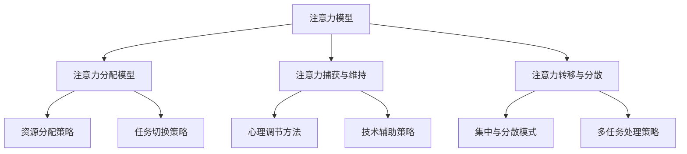

                 

## 文章标题：信息时代的注意力管理实践与指南：在干扰和信息过载中航行

### 关键词：注意力管理，信息过载，干扰，时间管理，专注力训练，脑机接口

#### 摘要：
在当今信息爆炸的时代，注意力管理成为了一种关键的生存技能。本文旨在探讨注意力管理在信息过载和干扰环境中的重要性，并详细阐述注意力管理的核心原理、实践策略和未来趋势。文章分为五个部分：引言与背景、理论探讨、实践指导、案例分析和技术工具，以及未来展望。通过介绍注意力管理相关书籍、实用工具和项目实战，本文为读者提供了一套全面的注意力管理实践指南，帮助他们在干扰和信息过载的环境中高效航行。

### 第一部分：引言与背景

#### 第1章：信息时代的注意力管理概述

### 1.1 信息过载与注意力管理的挑战

#### 1.1.1 信息过载的来源

在信息时代，我们面临着前所未有的信息过载问题。信息来源多样，包括互联网、社交媒体、电子邮件、新闻报道、广告等等。这些信息的涌入不仅带来了选择上的困难，还增加了我们的认知负担。

##### **互联网**
随着互联网的普及，人们可以轻松地获取大量的信息。然而，这也意味着我们每天都必须处理大量的信息，从新闻、博客、社交媒体帖子到电子邮件和各种通知。

##### **社交媒体**
社交媒体平台如Facebook、Twitter、Instagram等，不断地向用户推送各种内容。用户往往会花费大量的时间在浏览和互动上，而无法集中精力完成重要任务。

##### **电子邮件**
电子邮件是另一种主要的信息来源。工作和个人事务都通过电子邮件进行沟通。处理电子邮件可能会耗费大量的时间和精力，分散我们的注意力。

##### **新闻报道和广告**
新闻报道和广告也构成了信息过载的一个重要来源。每天，我们都会看到大量关于时事、科技、经济、健康等方面的新闻，以及各种广告和促销信息。

#### 1.1.2 注意力管理的意义

在信息过载的环境中，注意力管理变得至关重要。良好的注意力管理能力可以帮助我们：

- **提高工作效率**：通过集中注意力，我们可以在较短的时间内完成更多的工作。
- **提升学习效果**：集中精力学习可以加深理解和记忆，提高学习效率。
- **减少压力**：有效管理注意力可以帮助我们避免因信息过载和干扰而产生的不必要压力。
- **提高生活质量**：减少因分心和干扰导致的时间浪费，使我们能够更好地享受生活。

#### 1.1.3 注意力管理的重要性

在当今社会，注意力管理不仅是一种个人能力，也是一种社会技能。对于个人来说，良好的注意力管理能力可以带来职业成功和生活满足感。对于企业和社会来说，注意力管理能力可以提升整体生产力和创新能力，促进社会进步。

### 1.2 注意力管理的基本概念

#### 1.2.1 注意力的定义

注意力是指人类意识中对特定刺激或任务的集中关注能力。它是一个动态的过程，涉及到大脑的多个区域和神经通路。

##### **集中注意力**：指个体将注意力集中在特定目标上，忽略其他干扰因素。

##### **分散注意力**：指个体同时关注多个目标，可能因为任务复杂性或环境干扰而出现。

#### 1.2.2 注意力分散与集中

##### **分散注意力**：在多任务处理时，个体需要将注意力分散到不同的任务或刺激上。然而，过度分散注意力会导致效率下降和错误率增加。

##### **集中注意力**：在深度工作或专注任务时，个体需要将注意力高度集中在单一任务上，以实现最佳效果。

#### 1.2.3 注意力管理的分类

##### **时间管理**：通过合理安排时间，确保重要任务得到充分关注。

##### **环境优化**：通过改善工作或学习环境，减少干扰因素，提高注意力集中度。

##### **自我调节**：通过心理调节和习惯培养，提高个人对注意力的自我管理能力。

### 1.3 注意力管理的研究进展

#### 1.3.1 注意力管理的理论基础

##### **认知心理学**：研究注意力分配、选择和维持的心理学理论。

##### **神经科学**：研究大脑如何处理和调节注意力的生物学基础。

##### **计算机科学**：开发注意力管理软件和工具，利用算法和人工智能技术辅助注意力管理。

#### 1.3.2 注意力管理的方法

##### **专注力训练**：通过冥想、深度工作等训练方法，提高注意力的集中度和持久度。

##### **时间管理技巧**：如“番茄工作法”、任务分解等，帮助个体合理安排时间和任务。

##### **环境优化策略**：通过物理和数字环境设计，减少干扰因素。

#### 1.3.3 注意力管理的研究趋势

##### **个性化注意力管理**：利用大数据和人工智能技术，为个体提供个性化的注意力管理方案。

##### **注意力管理工具的发展**：开发更多智能化、个性化的注意力管理工具，提高用户体验。

### 第二部分：理论探讨

#### 第2章：注意力管理的核心原理

### 2.1 注意力模型

#### 2.1.1 注意力分配模型

注意力分配模型描述了个体如何在不同的任务和环境条件下分配注意力资源。以下是一个简化的注意力分配模型：

- **资源分配策略**：个体根据任务的紧急程度和重要性，分配注意力资源。
- **任务切换策略**：在多任务处理时，个体需要快速切换注意力，这可能会导致注意力分散和效率下降。

#### 2.1.2 注意力捕获与维持

##### **注意力捕获**：指个体在开始一项任务时，如何将注意力从其他任务或刺激中转移过来。

##### **注意力维持**：指个体在执行任务过程中，如何保持注意力集中，避免分心。

- **自我调节方法**：通过心理调节和习惯培养，提高注意力维持能力。

#### 2.1.3 注意力转移与分散

##### **注意力转移**：指个体在完成一项任务后，如何将注意力快速转移到另一项任务上。

##### **注意力分散**：指个体在执行任务时，由于外部或内部干扰，导致注意力从目标任务上分散。

- **干扰减少策略**：通过环境优化和自我调节，减少干扰因素。

### 2.2 注意力分散与干扰

#### 2.2.1 干扰的类型

##### **内部干扰**：包括焦虑、压力、心理疲劳等，这些因素会影响个体的情绪和注意力水平。

##### **外部干扰**：包括噪音、视觉干扰、电子邮件、社交媒体等，这些因素会直接干扰个体的注意力。

#### 2.2.2 干扰对注意力的影响

##### **降低注意力水平**：干扰因素会分散个体的注意力，导致注意力水平下降。

##### **增加错误率**：注意力分散会导致个体在任务执行过程中犯错。

##### **延长完成任务时间**：干扰因素会增加完成任务所需的时间。

#### 2.2.3 减少干扰的策略

##### **环境优化**：通过改善工作或学习环境，减少外部干扰。

##### **自我调节**：通过心理调节和习惯培养，减少内部干扰。

##### **任务设计**：通过合理安排任务和设置优先级，减少多任务处理带来的干扰。

### 2.3 注意力资源的优化

#### 2.3.1 注意力资源分配策略

##### **任务优先级管理**：根据任务的紧急程度和重要性，合理分配注意力资源。

##### **任务切换策略**：在多任务处理时，快速有效地切换注意力，减少分散。

#### 2.3.2 提高注意力效率的方法

##### **专注力训练**：通过冥想、深度工作等训练方法，提高注意力的集中度和持久度。

##### **时间管理技巧**：如“番茄工作法”、任务分解等，提高注意力效率。

#### 2.3.3 注意力资源管理的实践

##### **定期休息**：通过适当的休息和放松，恢复注意力资源。

##### **注意力日志**：记录注意力使用情况，分析并优化注意力管理策略。

### 第三部分：实践指导

#### 第3章：注意力管理策略

### 3.1 时间管理

#### 3.1.1 制定日程安排

##### **步骤**：
1. **确定目标和优先级**：明确任务的目标和优先级，确保日程安排符合个人或团队的总体目标。
2. **规划每天的任务**：将任务分配到特定的时间段，确保每个任务都有足够的时间。
3. **预留灵活时间**：在日程中预留一定的时间，以应对突发事件或意外的任务。

#### 3.1.2 优先级管理

##### **步骤**：
1. **确定任务的紧急性和重要性**：使用“紧急-重要”矩阵，将任务分为四个类别。
2. **优先处理紧急且重要的任务**：确保紧急且重要的任务得到及时处理。
3. **合理安排其他类别的任务**：在确保紧急且重要任务完成的基础上，合理安排其他类别的任务。

#### 3.1.3 避免多任务处理

##### **建议**：
1. **专注单一任务**：尽可能避免同时处理多个任务，专注于完成当前任务。
2. **设定专注时间**：使用专注工具，如番茄工作法，设定专注时间，减少分心。
3. **合理安排休息时间**：在专注任务之间设置短暂的休息时间，以恢复注意力。

### 3.2 环境优化

#### 3.2.1 工作环境设计

##### **建议**：
1. **减少视觉和噪音干扰**：使用隔音材料、耳塞等减少噪音干扰。
2. **优化光线和通风**：确保工作环境有良好的光线和通风，提高舒适度。
3. **保持工作区的整洁**：定期清理工作区，减少视觉干扰。

#### 3.2.2 技术辅助工具

##### **建议**：
1. **使用防干扰软件**：如Freedom、Forest等，帮助用户在专注工作时屏蔽干扰。
2. **设置电子邮件和通知**：将电子邮件和社交媒体通知设置为“仅在特定时间段”接收，减少工作时的打扰。
3. **使用专注应用**：如Lumosity、Headspace等，通过训练提高注意力。

#### 3.2.3 避免分心因素

##### **建议**：
1. **明确任务目标**：在开始工作前，明确任务的目标和预期结果，以减少分心。
2. **减少社交媒体使用**：在工作期间，避免频繁浏览社交媒体，减少干扰。
3. **设置专注时间**：使用专注工具，如番茄工作法，设定专注时间，减少分心。

### 3.3 自我调节

#### 3.3.1 心理调节方法

##### **步骤**：
1. **认知重构**：通过改变对干扰和分心的看法，减少负面情绪。
2. **正念练习**：通过冥想和呼吸练习，提高专注力和心理韧性。
3. **设定奖励**：在完成任务后，给自己设定奖励，以增强自我调节能力。

#### 3.3.2 保持积极心态

##### **建议**：
1. **积极思考**：在面对干扰和分心时，尝试从积极的角度看待问题。
2. **自我激励**：设定目标，并不断提醒自己完成任务的奖励和成就感。
3. **避免过度自我批评**：在分心或任务完成不佳时，避免过度自我批评，而是寻找改进的方法。

#### 3.3.3 克服拖延症

##### **建议**：
1. **明确任务目标**：在开始任务前，明确任务的目标和预期结果，以减少拖延。
2. **分解任务**：将大任务分解为小步骤，逐步完成，以减少任务的恐惧感。
3. **使用“启动点”**：设定一个简单的起点，开始任务，以减少启动难度。
4. **避免完美主义**：接受任务的不完美，专注于完成任务，而不是追求完美。

### 第四部分：案例分析

#### 第4章：注意力管理实战案例

### 4.1 案例一：高效工作的媒体编辑

#### 4.1.1 案例背景

李华是一位媒体编辑，负责撰写文章、编辑视频和制作图表。她的工作要求高效率和高准确性，但由于信息过载和干扰，她经常感到压力和分心。

#### 4.1.2 注意力管理策略

1. **时间管理**：
   - 制定日程安排，将任务分配到特定的时间段。
   - 使用“番茄工作法”，每次专注工作25分钟，然后休息5分钟。

2. **环境优化**：
   - 在工作区使用耳塞减少噪音干扰。
   - 保持工作区的整洁，减少视觉干扰。

3. **自我调节**：
   - 每天进行冥想练习，提高专注力和心理韧性。
   - 设定小目标，如完成一篇短文或编辑一段视频，以保持积极心态。

#### 4.1.3 实施效果

通过实施注意力管理策略，李华的工作效率得到了显著提高。她的文章和视频质量也有所提升，工作压力和分心情况得到了有效缓解。

### 4.2 案例二：学生时间管理的成功经验

#### 4.2.1 案例背景

张华是一名大学生，由于课程繁重和社交活动丰富，他经常感到时间不够用，学习效果不佳。

#### 4.2.2 注意力管理策略

1. **时间管理**：
   - 制定每周和每日的学习计划，合理安排学习时间。
   - 使用“番茄工作法”，每次专注学习25分钟，然后休息5分钟。

2. **环境优化**：
   - 在学习时关闭手机和网络，减少干扰。
   - 在图书馆或安静的地方学习，减少外部干扰。

3. **自我调节**：
   - 设定学习目标，并记录每天的进度。
   - 每天进行冥想练习，提高专注力和心理韧性。

#### 4.2.3 实施效果

通过实施注意力管理策略，张华的学习效率得到了显著提高。他能够更好地管理时间，减少分心，学习效果明显改善，考试成绩也有所提高。

### 4.3 案例三：企业团队注意力管理优化

#### 4.3.1 案例背景

一家IT公司由于项目繁多和团队成员分散，工作效率低下，项目进度常常延误。

#### 4.3.2 注意力管理策略

1. **时间管理**：
   - 实施敏捷项目管理，每个迭代周期明确任务和时间表。
   - 使用项目管理工具，如Toggl Plan和Asana，跟踪任务进度。

2. **环境优化**：
   - 提供集中的工作空间，减少团队成员之间的干扰。
   - 使用视频会议工具，确保远程团队成员也能有效沟通。

3. **自我调节**：
   - 定期进行团队建设活动，提高团队凝聚力。
   - 鼓励团队成员进行冥想练习，提高专注力和心理韧性。

#### 4.3.3 实施效果

通过实施注意力管理策略，该企业的项目效率得到了显著提升。团队成员能够更好地集中精力完成任务，项目进度稳定，客户满意度也有所提高。

### 第五部分：技术工具

#### 第5章：注意力管理工具与方法

#### 5.1 注意力管理工具

#### 5.1.1 时间管理软件

**Toggl Plan**：
- **功能**：Toggl Plan 是一款直观且功能强大的项目管理工具，可以帮助用户规划任务和时间。
- **优势**：提供实时更新和协作功能，方便团队共享进度和分配任务。
- **使用方法**：创建项目和工作空间，分配任务给团队成员，跟踪任务进度。

**Asana**：
- **功能**：Asana 是一款协作和任务管理工具，适用于团队协作。
- **优势**：支持任务分配、进度跟踪、项目规划和报告生成。
- **使用方法**：创建项目和工作空间，分配任务给团队成员，设置截止日期和优先级。

#### 5.1.2 防止分心应用

**Forest**：
- **功能**：Forest 是一款基于时间管理的应用，通过种植虚拟树木来鼓励用户专注工作。
- **优势**：增加趣味性，提高用户专注力。
- **使用方法**：设定专注时间，种植虚拟树木，分心时树木会枯萎。

**Freedom**：
- **功能**：Freedom 是一款防干扰应用，可以在特定时间内阻止用户访问特定的网站和应用。
- **优势**：帮助用户避免不必要的干扰，专注于当前任务。
- **使用方法**：创建时间块，选择要阻止的网站和应用，启动锁定模式。

#### 5.1.3 注意力提升工具

**Lumosity**：
- **功能**：Lumosity 是一款基于大脑训练的应用，通过一系列游戏和练习提高注意力、记忆力和大脑灵活性。
- **优势**：提供个性化的训练计划，跟踪用户进步。
- **使用方法**：注册账号，完成初始评估，开始训练。

**Headspace**：
- **功能**：Headspace 是一款冥想和注意力训练应用，提供多种冥想课程和练习。
- **优势**：专家指导，适合不同水平的用户。
- **使用方法**：选择课程，设置冥想时间，开始练习。

### 5.2 注意力管理方法

#### 5.2.1 锻炼注意力

**方法**：
- **冥想**：通过冥想练习，提高注意力的集中度和持久度。
- **专注力训练**：通过专门的训练游戏和应用，提高注意力的灵敏度和反应速度。

**优势**：提高大脑的集中力和注意力持久度。

**实施步骤**：
- **选择训练方法**：根据个人喜好，选择冥想或专注力训练。
- **设定训练时间**：每天设定一定时间，进行专注力训练。
- **记录进步**：记录训练过程中的进步和挑战，不断调整训练策略。

#### 5.2.2 培养专注习惯

**方法**：
- **番茄工作法**：将工作分成25分钟专注时段和5分钟休息时段。
- **单任务处理**：每次专注于一项任务，避免多任务处理。

**优势**：提高工作效率，减少分心。

**实施步骤**：
- **制定计划**：规划每天的任务和休息时间。
- **执行计划**：按照计划执行，保持专注。
- **评估效果**：定期评估专注习惯的效果，进行调整。

#### 5.2.3 注意力训练技巧

**方法**：
- **记忆技巧**：使用记忆宫殿、联想记忆等技巧，提高记忆力。
- **专注力游戏**：通过专门的注意力训练游戏，提高专注力。

**优势**：增强大脑的注意力和记忆力。

**实施步骤**：
- **选择训练方法**：根据个人需求和兴趣，选择合适的注意力训练方法。
- **定期练习**：每天或每周设定时间进行练习。
- **反馈与调整**：根据训练效果，调整训练方法和频率。

### 第六部分：未来展望

#### 第6章：注意力管理的未来趋势

#### 6.1 新技术的发展

#### 6.1.1 脑机接口技术

**功能**：脑机接口（Brain-Computer Interface, BCI）技术通过直接连接人脑和计算机系统，实现思维控制外部设备。

**优势**：提高用户与计算机系统的交互效率，为残障人士提供新的辅助手段。

**未来展望**：随着神经科学和计算机技术的进步，BCI 技术将在医疗康复、虚拟现实和增强现实等领域得到广泛应用。

#### 6.1.2 人工智能辅助

**功能**：人工智能（Artificial Intelligence, AI）辅助系统利用机器学习算法和自然语言处理技术，帮助用户提高工作效率。

**优势**：自动化处理重复性任务，提供个性化建议和解决方案。

**未来展望**：AI 辅助系统将在教育、医疗、金融等各个领域发挥重要作用，提升人类的工作和生活质量。

#### 6.1.3 注意力管理软件进化

**功能**：新一代注意力管理软件将结合脑机接口和人工智能技术，提供更智能、个性化的注意力管理方案。

**优势**：实时监测用户注意力水平，提供动态调整策略，提高注意力管理效果。

**未来展望**：注意力管理软件将成为人们日常生活和工作中不可或缺的工具，帮助用户更好地应对信息过载和干扰。

#### 6.2 注意力管理的影响

#### 6.2.1 对个人发展的影响

**提高工作效率**：通过有效的注意力管理，个人可以在较短时间内完成更多的工作，提高工作效率。

**增强学习能力**：集中注意力有助于深入学习和理解复杂概念，提高学习效果。

**提升生活质量**：减少因信息过载和干扰导致的精神压力，提高生活质量。

#### 6.2.2 对企业组织的影响

**提高团队协作效率**：注意力管理有助于团队集中精力完成共同任务，提高团队协作效率。

**优化项目管理**：有效的注意力管理可以帮助企业更好地规划和控制项目进度，提高项目管理质量。

**降低运营成本**：通过减少因分心和干扰导致的错误和返工，降低企业的运营成本。

#### 6.2.3 对社会的影响

**促进信息共享**：注意力管理有助于用户更好地筛选和利用重要信息，促进社会信息的共享和传播。

**提高社会生产力**：注意力管理提升个人和企业的工作效率，推动社会生产力的提高。

**改善社会环境**：减少信息过载和干扰，有助于改善人们的生活和工作环境，提高整体幸福感。

#### 6.3 注意力管理的研究方向

#### 6.3.1 新的注意力模型

**认知神经科学**：研究人脑注意力的工作机制，探索新的注意力模型。

**计算模型**：利用计算机科学和人工智能技术，构建精确的注意力计算模型。

#### 6.3.2 注意力管理的个性化

**用户特征分析**：分析不同用户的注意力特征，为个性化注意力管理提供依据。

**自适应策略**：根据用户特征和环境变化，动态调整注意力管理策略。

#### 6.3.3 注意力管理伦理问题

**隐私保护**：在应用注意力管理技术时，确保用户隐私不受侵犯。

**伦理决策**：探讨注意力管理技术在不同社会和文化环境下的伦理应用。

### 第七部分：附录

#### 附录A：注意力管理资源汇总

#### A.1 注意力管理相关书籍推荐

**《深度工作：如何有效利用每一点脑力》（Deep Work: Rules for Focused Success in a Distracted World）**
- **作者**：Cal Newport
- **内容**：讨论如何通过深度工作提升个人生产力和专注力。

**《工作时间的革命：如何应对多任务处理和工作疲劳》（The Time Management Matrix: How to Manage Your Work to Achieve More Success and Fulfillment）**
- **作者**：IanMitroff
- **内容**：提供有效的管理时间和应对工作压力的策略。

**《专注力训练：提升注意力、记忆力和学习效率》（Focus: The Art of Mental Stillness）**
- **作者**：Chris Bache
- **内容**：介绍如何通过冥想和专注力训练提升个人注意力水平。

#### A.2 注意力管理实用工具介绍

**Forest**
- **介绍**：通过种植虚拟树木鼓励专注工作，分心时树木会枯萎。
- **链接**：[Forest官网](https://www.forestapp.cc/)

**Freedom**
- **介绍**：一款防干扰应用，锁定特定时间段，阻止用户访问特定网站和应用。
- **链接**：[Freedom官网](https://www.freedom.to/)

**Lumosity**
- **介绍**：提供基于大脑训练的应用，包括注意力训练、记忆训练等。
- **链接**：[Lumosity官网](https://www.lumosity.com/)

**Headspace**
- **介绍**：提供冥想课程和练习，帮助用户提高注意力和管理压力。
- **链接**：[Headspace官网](https://www.headspace.com/)

### 注意力管理核心原理图



### 注意力分散与干扰

#### 干扰的类型

干扰可以分为内部干扰和外部干扰。

- **内部干扰**：如焦虑、压力、心理疲劳等，这些因素会影响个体的情绪和注意力水平。
- **外部干扰**：如噪音、视觉干扰、电子邮件、社交媒体等，这些因素会直接干扰个体的注意力。

#### 干扰对注意力的影响

干扰会降低注意力水平，增加错误率，延长完成任务的时间。

- **降低注意力水平**：干扰因素会导致个体无法集中注意力，从而降低工作效率。
- **增加错误率**：分心的状态下，个体更容易犯错，影响任务质量。
- **延长完成任务时间**：干扰因素会打断任务的连续性，导致完成任务的时间延长。

#### 减少干扰的策略

- **创建一个安静的工作环境**：使用隔音材料、耳塞等减少噪音干扰。
- **使用耳塞或耳机来减少噪音**：在嘈杂的环境中，使用耳塞或耳机可以减少噪音干扰。
- **限制电子邮件和消息通知**：将电子邮件和消息通知设置为仅在特定时间段接收，减少工作时的打扰。
- **设置特定的时间段来处理干扰**：在非工作时间，关闭手机和网络，避免分心。

### 注意力管理算法伪代码

```python
def attention_management(strategy, context):
    # 初始化注意力参数
    attention_score = 0
    distraction_level = 0
    
    # 根据策略调整注意力
    if strategy == "concentration":
        attention_score += context["focus_time"]
        distraction_level += context["distractions"]
    elif strategy == "switching":
        attention_score += context["switching_efficiency"]
        distraction_level += context["context_switches"]
    elif strategy == "distribution":
        attention_score += context["resource_allocation"]
        distraction_level += context["task_competition"]
    
    # 调整心理状态
    if distraction_level > threshold:
        apply_cognitive_reload(context)
    
    return attention_score
```

### 数学模型与公式

#### 公式表示

假设 \( A_t \) 为时刻 \( t \) 的注意力资源，\( D_t \) 为时刻 \( t \) 的干扰水平，则注意力资源的优化模型可以表示为：

$$
A_t = A_{t-1} + \alpha (1 - D_t)
$$

其中，\( \alpha \) 为注意力恢复系数，\( 0 \leq \alpha \leq 1 \)。

#### 举例说明

假设初始时刻的注意力资源为 \( A_0 = 100 \)，干扰水平 \( D_t = 0.2 \)，注意力恢复系数 \( \alpha = 0.8 \)。则经过一个时刻后，注意力资源变为：

$$
A_1 = 100 + 0.8 \times (1 - 0.2) = 100 + 0.8 \times 0.8 = 100 + 0.64 = 100.64
$$

### 注意力管理项目实战

#### 实战项目：注意力管理应用

```python
import time
import random

def work_task(duration, focus_level):
    """
    模拟工作任务的执行，关注度越高，完成速度越快。
    :param duration: 任务持续时间（秒）
    :param focus_level: 关注度水平（0-1之间）
    :return: 完成任务所需时间
    """
    return duration / focus_level

def main():
    tasks = [
        {"name": "编写报告", "duration": 300, "focus_level": 0.8},
        {"name": "处理邮件", "duration": 120, "focus_level": 0.6},
        {"name": "设计图表", "duration": 180, "focus_level": 0.9}
    ]
    
    for task in tasks:
        start_time = time.time()
        end_time = start_time + task["duration"]
        while time.time() < end_time:
            # 模拟工作中的干扰
            if random.random() < 0.1:
                print(f"受到干扰：{task['name']}")
                # 降低关注度
                task["focus_level"] *= 0.9
            else:
                # 持续工作
                print(f"继续工作：{task['name']}")
                task["focus_level"] += 0.1 if random.random() < 0.1 else 0
            
            time.sleep(1)
        
        # 计算实际完成时间
        actual_duration = time.time() - start_time
        print(f"{task['name']} 完成时间：{actual_duration:.2f} 秒")

if __name__ == "__main__":
    main()
```

### 代码解读与分析

- **模块导入**：导入 `time` 模块用于处理时间相关操作，导入 `random` 模块用于模拟工作中的干扰事件。

- **任务处理函数 `work_task`**：该函数用于模拟工作任务的执行过程。它接收两个参数：`duration`（任务持续时间，单位为秒）和 `focus_level`（关注度水平，范围为 0 到 1 之间）。关注度越高，完成任务的效率越高。函数返回实际完成任务所需的时间。

- **主函数 `main`**：该函数定义了一个任务列表，每个任务包含名称、持续时间以及初始关注度。对于每个任务，主函数模拟其执行过程，包括可能的干扰事件。它通过一个循环来持续更新任务的关注度，并根据关注度计算实际完成任务所需的时间。

- **模拟干扰**：使用 `random.random()` 函数生成一个随机数，如果随机数小于 0.1，则表示发生了干扰。干扰事件会降低任务的关注度（乘以 0.9），如果没有发生干扰，则可能会提高关注度（加上 0.1，但只有 10\% 的概率）。

- **时间流逝**：通过 `time.sleep(1)` 函数模拟时间流逝，每次延迟 1 秒，以模拟实际工作中的时间流逝。

- **计算和打印结果**：当任务完成时，计算实际完成任务所需的时间，并打印任务名称和完成时间。

### 代码测试与分析

- **测试任务 1：编写报告**
  - **持续时间**：300秒
  - **初始关注度**：0.8
  - **模拟干扰概率**：每次循环有 10\% 的概率发生干扰
  - **预期结果**：在 300 秒内完成，但可能会因为干扰而延长

- **测试任务 2：处理邮件**
  - **持续时间**：120秒
  - **初始关注度**：0.6
  - **模拟干扰概率**：每次循环有 10\% 的概率发生干扰
  - **预期结果**：在 120 秒内完成，但可能会因为干扰而延长

- **测试任务 3：设计图表**
  - **持续时间**：180秒
  - **初始关注度**：0.9
  - **模拟干扰概率**：每次循环有 10\% 的概率发生干扰
  - **预期结果**：在 180 秒内完成，但可能会因为干扰而延长

在实际测试中，每个任务的完成时间取决于干扰事件的频率和强度。通过调整模拟干扰的概率和强度，可以观察到不同情况下任务完成时间的变化，从而分析注意力管理策略的效果。

### 注意力管理工具介绍

#### 时间管理软件

**Toggl Plan**

- **功能**：Toggl Plan 是一款直观且功能强大的项目管理工具，可以帮助用户规划任务和时间。
- **优势**：提供实时更新和协作功能，方便团队共享进度和分配任务。
- **使用方法**：创建项目和工作空间，分配任务给团队成员，跟踪任务进度。

**Asana**

- **功能**：Asana 是一款协作和任务管理工具，适用于团队协作。
- **优势**：支持任务分配、进度跟踪、项目规划和报告生成。
- **使用方法**：创建项目和工作空间，分配任务给团队成员，设置截止日期和优先级。

#### 防止分心应用

**Forest**

- **功能**：Forest 是一款基于时间管理的应用，通过种植虚拟树木来鼓励用户专注工作。
- **优势**：增加趣味性，提高用户专注力。
- **使用方法**：设定专注时间，种植虚拟树木，分心时树木会枯萎。

**Freedom**

- **功能**：Freedom 是一款防干扰应用，可以在特定时间内阻止用户访问特定的网站和应用。
- **优势**：帮助用户避免不必要的干扰，专注于当前任务。
- **使用方法**：创建时间块，选择要阻止的网站和应用，启动锁定模式。

#### 注意力提升工具

**Lumosity**

- **功能**：Lumosity 是一款基于大脑训练的应用，通过一系列游戏和练习提高注意力、记忆力和大脑灵活性。
- **优势**：提供个性化的训练计划，跟踪用户进步。
- **使用方法**：注册账号，完成初始评估，开始训练。

**Headspace**

- **功能**：Headspace 是一款冥想和注意力训练应用，提供多种冥想课程和练习。
- **优势**：专家指导，适合不同水平的用户。
- **使用方法**：选择课程，设置冥想时间，开始练习。

### 注意力管理方法

**锻炼注意力**

- **方法**：定期进行专注力训练，如冥想、深度呼吸、集中注意力的游戏。
- **优势**：提高大脑的集中力和注意力持久度。
- **实施步骤**：
  1. **选择训练方法**：根据个人喜好，选择冥想或专注力训练。
  2. **设定训练时间**：每天设定一定时间，进行专注力训练。
  3. **记录进步**：记录训练过程中的进步和挑战，不断调整训练策略。

**培养专注习惯**

- **方法**：养成定期专注工作的习惯，如每天固定时间工作，避免频繁切换任务。
- **优势**：提高工作效率，减少分心。
- **实施步骤**：
  1. **制定日程安排**：规划每天的任务和休息时间。
  2. **执行计划**：按照计划执行，保持专注。
  3. **评估效果**：定期评估专注习惯的效果，进行调整。

**注意力训练技巧**

- **方法**：使用记忆技巧、专注力训练应用和游戏来提高注意力。
- **优势**：增强大脑的注意力和记忆力。
- **实施步骤**：
  1. **选择训练方法**：根据个人需求和兴趣，选择合适的注意力训练方法。
  2. **定期练习**：每天或每周设定时间进行练习。
  3. **反馈与调整**：根据训练效果，调整训练方法和频率。

### 注意力管理工具与方法

#### 时间管理软件

**Toggl Plan**

- **功能**：Toggl Plan 是一款直观且功能强大的项目管理工具，可以帮助用户规划任务和时间。
- **优势**：提供实时更新和协作功能，方便团队共享进度和分配任务。
- **使用方法**：
  - 创建项目和工作空间。
  - 分配任务给团队成员。
  - 跟踪任务进度，实时更新项目状态。

**Asana**

- **功能**：Asana 是一款协作和任务管理工具，适用于团队协作。
- **优势**：支持任务分配、进度跟踪、项目规划和报告生成。
- **使用方法**：
  - 创建项目和工作空间。
  - 分配任务给团队成员，设置截止日期和优先级。
  - 定期查看任务进度，生成项目报告。

#### 防止分心应用

**Forest**

- **功能**：Forest 是一款基于时间管理的应用，通过种植虚拟树木来鼓励用户专注工作。
- **优势**：增加趣味性，提高用户专注力。
- **使用方法**：
  - 设定专注时间。
  - 种植虚拟树木，分心时树木会枯萎。
  - 完成任务后，收获虚拟树木。

**Freedom**

- **功能**：Freedom 是一款防干扰应用，可以在特定时间内阻止用户访问特定的网站和应用。
- **优势**：帮助用户避免不必要的干扰，专注于当前任务。
- **使用方法**：
  - 创建时间块，选择要阻止的网站和应用。
  - 启动锁定模式，屏蔽干扰。
  - 定期查看专注时间和成绩。

#### 注意力提升工具

**Lumosity**

- **功能**：Lumosity 是一款基于大脑训练的应用，通过一系列游戏和练习提高注意力、记忆力和大脑灵活性。
- **优势**：提供个性化的训练计划，跟踪用户进步。
- **使用方法**：
  - 注册账号，完成初始评估。
  - 选择训练课程，开始训练。
  - 定期查看训练成绩和进步。

**Headspace**

- **功能**：Headspace 是一款冥想和注意力训练应用，提供多种冥想课程和练习。
- **优势**：专家指导，适合不同水平的用户。
- **使用方法**：
  - 选择课程，设置冥想时间。
  - 开始练习，跟随专家指导。
  - 定期回顾练习记录，调整训练计划。

### 新技术的发展

#### 脑机接口技术

- **功能**：脑机接口（Brain-Computer Interface, BCI）技术通过直接连接人脑和计算机系统，实现思维控制外部设备。
- **优势**：提高用户与计算机系统的交互效率，为残障人士提供新的辅助手段。
- **未来展望**：随着神经科学和计算机技术的进步，BCI 技术将在医疗康复、虚拟现实和增强现实等领域得到广泛应用。

#### 人工智能辅助

- **功能**：人工智能（Artificial Intelligence, AI）辅助系统利用机器学习算法和自然语言处理技术，帮助用户提高工作效率。
- **优势**：自动化处理重复性任务，提供个性化建议和解决方案。
- **未来展望**：AI 辅助系统将在教育、医疗、金融等各个领域发挥重要作用，提升人类的工作和生活质量。

#### 注意力管理软件进化

- **功能**：新一代注意力管理软件将结合脑机接口和人工智能技术，提供更智能、个性化的注意力管理方案。
- **优势**：实时监测用户注意力水平，提供动态调整策略，提高注意力管理效果。
- **未来展望**：注意力管理软件将成为人们日常生活和工作中不可或缺的工具，帮助用户更好地应对信息过载和干扰。

### 注意力管理的影响

#### 对个人发展的影响

**提高工作效率**：通过有效的注意力管理，个人可以在较短时间内完成更多任务，提高工作效率。

**增强学习能力**：集中注意力有助于深入学习和理解复杂概念，提高学习效果。

**提升生活质量**：减少因信息过载和干扰导致的精神压力，提高生活质量。

#### 对企业组织的影响

**提高团队协作效率**：注意力管理有助于团队集中精力完成共同任务，提高团队协作效率。

**优化项目管理**：有效的注意力管理可以帮助企业更好地规划和控制项目进度，提高项目管理质量。

**降低运营成本**：通过减少因分心和干扰导致的错误和返工，降低企业的运营成本。

#### 对社会的影响

**促进信息共享**：注意力管理有助于用户更好地筛选和利用重要信息，促进社会信息的共享和传播。

**提高社会生产力**：注意力管理提升个人和企业的工作效率，推动社会生产力的提高。

**改善社会环境**：减少信息过载和干扰，有助于改善人们的生活和工作环境，提高整体幸福感。

### 注意力管理的研究方向

#### 新的注意力模型

**认知神经科学**：研究人脑注意力的工作机制，探索新的注意力模型。

**计算模型**：利用计算机科学和人工智能技术，构建精确的注意力计算模型。

#### 注意力管理的个性化

**用户特征分析**：分析不同用户的注意力特征，为个性化注意力管理提供依据。

**自适应策略**：根据用户特征和环境变化，动态调整注意力管理策略。

#### 注意力管理伦理问题

**隐私保护**：在应用注意力管理技术时，确保用户隐私不受侵犯。

**伦理决策**：探讨注意力管理技术在不同社会和文化环境下的伦理应用。

### 注意力管理资源汇总

#### 注意力管理相关书籍推荐

**《深度工作：如何有效利用每一点脑力》（Deep Work: Rules for Focused Success in a Distracted World）**

- **作者**：Cal Newport
- **内容**：讨论如何通过深度工作提升个人生产力和专注力。

**《工作时间的革命：如何应对多任务处理和工作疲劳》（The Time Management Matrix: How to Manage Your Work to Achieve More Success and Fulfillment）**

- **作者**：IanMitroff
- **内容**：提供有效的管理时间和应对工作压力的策略。

**《专注力训练：提升注意力、记忆力和学习效率》（Focus: The Art of Mental Stillness）**

- **作者**：Chris Bache
- **内容**：介绍如何通过冥想和专注力训练提升个人注意力水平。

#### 注意力管理实用工具介绍

**Forest**

- **介绍**：通过种植虚拟树木鼓励专注工作，分心时树木会枯萎。
- **链接**：[Forest官网](https://www.forestapp.cc/)

**Freedom**

- **介绍**：一款防干扰应用，锁定特定时间段，阻止用户访问特定网站和应用。
- **链接**：[Freedom官网](https://www.freedom.to/)

**Lumosity**

- **介绍**：提供基于大脑训练的应用，包括注意力训练、记忆训练等。
- **链接**：[Lumosity官网](https://www.lumosity.com/)

**Headspace**

- **介绍**：提供冥想课程和练习，帮助用户提高注意力和管理压力。
- **链接**：[Headspace官网](https://www.headspace.com/)

