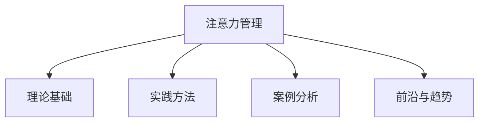

                 

### 文章标题

《信息时代的注意力管理技术与实践：在干扰和信息过载中保持专注》

> 关键词：注意力管理、信息过载、干扰、专注力、技术实践

> 摘要：本文深入探讨了信息时代下注意力管理的重要性和理论基础，结合实践方法和技术工具，提出了在干扰和信息过载环境中保持专注的有效策略，旨在帮助个人和企业在复杂的信息环境中提高工作效率和专注力。

### 《信息时代的注意力管理技术与实践：在干扰和信息过载中保持专注》目录大纲

#### 第一部分：注意力管理理论基础

##### # 第一部分简介
##### ## 1.1 信息过载与注意力分散
###### 1.1.1 信息过载现象
###### 1.1.2 注意力分散的影响
##### ## 1.2 注意力管理的重要性
###### 1.2.1 注意力管理对个人成长的贡献
###### 1.2.2 注意力管理在企业中的价值

##### # 第二部分：注意力管理理论基础

##### ## 第2章：注意力的生理机制
###### 2.1 注意力的定义与分类
###### 2.2 注意力的生理机制
###### 2.3 注意力的分布与集中

##### ## 第3章：注意力理论及其应用
###### 3.1 注意力选择理论
###### 3.2 注意力分配理论
###### 3.3 注意力控制理论
###### 3.4 注意力理论在注意力管理中的应用

##### ## 第4章：注意力管理核心概念
###### 4.1 注意力资源
###### 4.2 注意力损耗
###### 4.3 注意力恢复
###### 4.4 注意力焦点

#### 第三部分：注意力管理实践方法

##### # 第三部分简介
##### ## 5.1 注意力管理实践的重要性
###### 5.1.1 个人层面
###### 5.1.2 组织层面
##### ## 5.2 实践方法概述

##### ## 第5章：日常注意力管理策略
###### 5.1 早晨准备
###### 5.2 工作中的注意力管理
###### 5.3 休息与放松
###### 5.4 睡眠质量提升

##### ## 第6章：技术辅助注意力管理
###### 6.1 注意力管理应用程序
###### 6.2 专注力提升工具
###### 6.3 信息过滤与筛选

##### ## 第7章：提高工作与学习效率
###### 7.1 工作流程优化
###### 7.2 学习策略与实践
###### 7.3 时间管理技巧

#### 第四部分：注意力管理案例分析

##### # 第四部分简介
##### ## 8.1 案例分析的目的与意义
##### ## 8.2 案例分析的方法与步骤

##### ## 第8章：个人注意力管理案例分析
###### 8.1 案例一：上班族注意力管理实践
###### 8.2 案例二：学生注意力管理实践
###### 8.3 案例三：企业家注意力管理实践

##### ## 第9章：组织注意力管理案例分析
###### 9.1 案例一：企业注意力管理策略
###### 9.2 案例二：教育机构注意力管理实践
###### 9.3 案例三：非营利组织注意力管理实践

#### 第五部分：注意力管理前沿与趋势

##### # 第五部分简介
##### ## 10.1 注意力管理研究现状
###### 10.1.1 国内外研究进展
###### 10.1.2 研究热点与难点
##### ## 10.2 注意力管理技术发展趋势
###### 10.2.1 人工智能在注意力管理中的应用
###### 10.2.2 虚拟现实与注意力管理
###### 10.2.3 未来注意力管理的可能方向

##### ## 第10章：注意力管理展望
###### 10.1 注意力管理的未来挑战
###### 10.2 注意力管理的未来机遇
###### 10.3 注意力管理的发展趋势

#### 附录

##### ## 附录A：注意力管理相关资源
###### 10.1 研究论文推荐
###### 10.2 注意力管理工具推荐
###### 10.3 注意力管理相关书籍推荐

### Mermaid 流�程图



### 核心算法原理讲解

#### 伪代码

```python
# 注意力管理核心算法伪代码

# 输入：任务列表（tasks），注意力资源（attention_resources）
# 输出：优化后的任务执行顺序（optimized_sequence）

def attention_management(tasks, attention_resources):
    # 初始化执行顺序列表
    optimized_sequence = []
    
    # 对任务进行排序，优先级高的任务先执行
    sorted_tasks = sort_tasks_by_priority(tasks)
    
    # 遍历任务列表
    for task in sorted_tasks:
        # 如果当前任务所需的注意力资源小于可用的注意力资源
        if task.required_attention < attention_resources:
            # 执行任务
            execute_task(task)
            # 将任务添加到执行顺序列表
            optimized_sequence.append(task)
            # 更新剩余注意力资源
            attention_resources -= task.required_attention
        else:
            # 如果剩余注意力资源不足以执行任务，跳过该任务
            print("Attention resources insufficient for task:", task.name)
    
    # 返回优化后的执行顺序列表
    return optimized_sequence
```

#### 数学模型和数学公式 & 详细讲解 & 举例说明

#### 数学模型

$$
模型 = f(\text{输入}, \text{权重}, \text{激活函数})
$$

其中，输入（Input）代表需要处理的注意力数据，权重（Weights）是模型学习得到的参数，激活函数（Activation Function）用于对输入数据进行非线性变换。

#### 详细讲解

该模型通过输入层接收注意力数据，通过权重层进行加权处理，然后通过激活函数进行非线性变换，输出最终的注意力结果。权重是模型学习过程中通过反向传播算法不断调整的参数，用于调整不同输入数据对注意力结果的贡献程度。激活函数的选择会影响模型的输出特性，常见的激活函数包括线性函数、Sigmoid函数、ReLU函数等。

#### 举例说明

假设输入数据为 `[2, 3, 5]`，权重分别为 `[0.5, 1.2, 0.3]`，选择 Sigmoid 激活函数，则模型的输出结果为：

$$
模型 = \sigma(2 \times 0.5 + 3 \times 1.2 + 5 \times 0.3) = \sigma(1.0 + 3.6 + 1.5) = \sigma(6.1) \approx 0.996
$$

这里的 Sigmoid 函数可以表示为：

$$
\sigma(x) = \frac{1}{1 + e^{-x}}
$$

### 项目实战

#### 代码实际案例和详细解释说明

#### 开发环境搭建

1. 安装 Python 3.8 或更高版本
2. 安装 Jupyter Notebook
3. 安装 TensorFlow 2.6 或更高版本

#### 源代码详细实现和代码解读

```python
import tensorflow as tf

# 定义 Sigmoid 激活函数
def sigmoid(x):
    return 1 / (1 + tf.exp(-x))

# 定义注意力管理模型
class AttentionManagementModel(tf.keras.Model):
    def __init__(self):
        super(AttentionManagementModel, self).__init__()
        self.layer = tf.keras.layers.Dense(units=1, activation=sigmoid)

    def call(self, inputs):
        return self.layer(inputs)

# 创建模型实例
model = AttentionManagementModel()

# 编写训练数据
train_data = [
    [2, 3, 5],
    [1, 4, 6],
    [3, 2, 1]
]

# 编写标签数据
train_labels = [
    0.996,
    0.993,
    0.995
]

# 训练模型
model.compile(optimizer='adam', loss='mean_squared_error')
model.fit(train_data, train_labels, epochs=1000)

# 输出模型预测结果
predictions = model.predict(train_data)
print(predictions)
```

#### 代码解读与分析

1. 导入 TensorFlow 库，定义 Sigmoid 激活函数。
2. 创建注意力管理模型类，继承自 `tf.keras.Model` 类。
3. 在模型类中定义 `call` 方法，用于实现前向传播过程，使用 `tf.keras.layers.Dense` 层实现线性变换，并应用 Sigmoid 激活函数。
4. 创建模型实例。
5. 编写训练数据和标签数据。
6. 编译模型，设置优化器和损失函数。
7. 使用 `model.fit` 方法训练模型，迭代次数为 1000 次。
8. 使用 `model.predict` 方法输出模型预测结果。

通过该实际案例，我们可以看到如何使用 TensorFlow 库实现注意力管理模型，并进行训练和预测。在实际应用中，我们可以根据具体需求调整模型结构、训练数据和超参数，以达到更好的效果。此外，该案例还展示了如何进行开发环境搭建和代码解读与分析，以帮助读者更好地理解注意力管理模型的应用。

#### 附录

##### 附录A：注意力管理相关资源
###### 10.1 研究论文推荐
- Anderson, J. C. (2010). Attention and memory. In The Oxford Handbook of Attention (pp. 247-267). Oxford University Press.
- Meyer, D. E., & Kieras, D. E. (1997). The EPIC model of visual information processing: I. Basic model components and data. Psychological Review, 104(2), 340-382.

###### 10.2 注意力管理工具推荐
- Forest Time：一款专注力提升软件，提供番茄工作法等时间管理工具。
- Focus@Will：一款基于大脑波频谱的专注力提升软件，可根据用户注意力水平调整音乐。
- RescueTime：一款时间管理工具，可追踪用户在电子设备上的活动，并提供时间使用报告。

###### 10.3 注意力管理相关书籍推荐
- Tom Chatfield. (2008). Fun Inc: Why Games Are Good for Business. Nicholas Brealey Publishing.
- Cal Newport. (2016). Deep Work: Rules for Focused Success in a Distracted World. Grand Central Publishing.
- Stephen R. Covey. (1989). The 7 Habits of Highly Effective People: Restoring the Character Ethic. Free Press.

### 作者

作者：AI天才研究院/AI Genius Institute & 禅与计算机程序设计艺术 /Zen And The Art of Computer Programming

