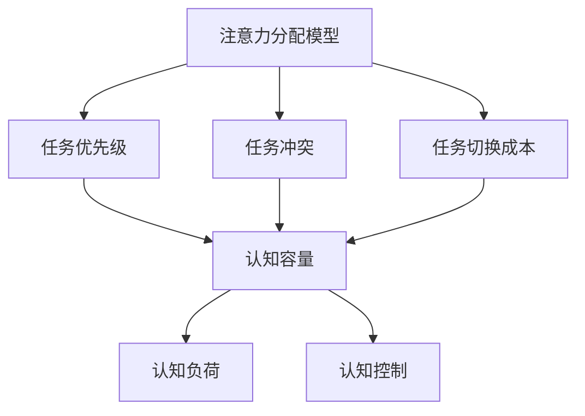
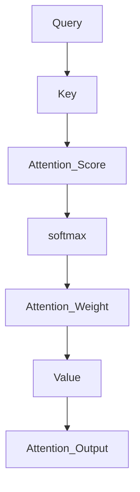
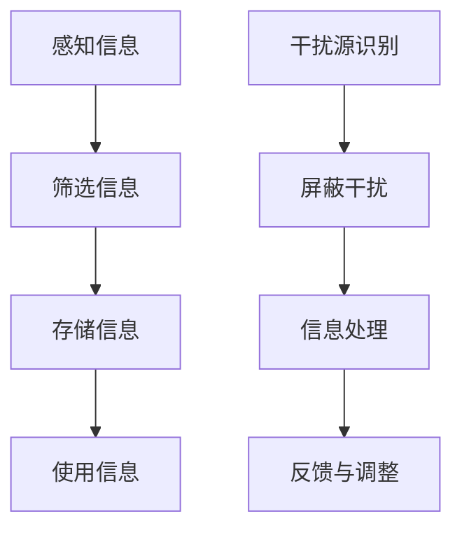

                 

# 信息时代的注意力管理技术：在干扰和信息过载中保持专注

> 关键词：注意力管理、信息过载、时间管理、执行功能训练、情绪管理

> 摘要：随着信息时代的到来，人们面临着越来越多的干扰和信息过载，这对我们的注意力管理提出了巨大的挑战。本文将探讨注意力管理的核心概念、技术方法以及在实际应用中的案例分析，以帮助我们在干扰和信息过载的环境中保持专注。

## 第一部分：引言与背景

### 1.1 信息时代的注意力挑战

在信息爆炸的时代，我们每天都要面对海量的信息。这些信息可能来自社交媒体、电子邮件、即时通讯工具，甚至是无处不在的互联网广告。这些信息的不断涌入，让我们的大脑变得极度忙碌，难以集中注意力。

- **干扰源分析**：现代工作环境中，干扰源多种多样。电话、电子邮件、社交媒体通知、同事的打扰，甚至是办公室环境的噪音，都可能成为干扰我们注意力的因素。
  
- **信息过载现象**：信息过载是指接收到的信息超出了个体处理能力的情况。这种情况下，人们可能会感到焦虑、压力过大，从而影响工作效率和生活质量。

- **注意力管理的必要性**：为了应对这些挑战，我们需要学会有效地管理注意力。通过注意力管理，我们可以提高工作效率，提升学习效果，改善生活质量。

### 1.2 注意力管理的基本原理

注意力管理不仅仅是一种技巧，更是一种生活方式的调整。理解注意力管理的基本原理，有助于我们更好地实践注意力管理。

- **注意力的定义与分类**  
  $$ \text{注意力} = \text{感知} + \text{记忆} + \text{决策} $$
  - **感知**：选择关注的信息，过滤无关信息。
  - **记忆**：将关注的信息进行存储，以便后续使用。
  - **决策**：根据信息做出反应或行动。

- **注意力管理的重要性**  
  注意力管理对于提高工作效率、学习效果、生活质量具有重要意义。有效的注意力管理可以帮助人们更好地应对干扰，提高信息处理能力，减少精神压力。

- **注意力管理的基础理论**  
  注意力管理理论主要包括两大体系：认知心理学和神经科学。认知心理学研究注意力的认知过程，包括注意力的选择、维持、分配和转移。神经科学研究注意力的生理基础，包括大脑神经网络、神经递质等。

### 核心概念与联系

#### 注意力分配模型

注意力分配模型描述了个体在不同任务间分配注意力的过程。其核心概念包括：

- **任务优先级**：根据任务的重要性和紧急性来分配注意力。
- **任务冲突**：当多个任务需要同时处理时，注意力的分配会产生冲突。
- **任务切换成本**：从一项任务切换到另一项任务时，需要耗费一定的注意力资源。

#### 注意力的认知资源理论

认知资源理论认为，人的认知资源是有限的，注意力是认知资源的一种。核心概念包括：

- **认知容量**：人在同一时间内能够处理的信息量。
- **认知负荷**：进行认知任务时所消耗的认知资源。
- **认知控制**：调节认知资源的分配，以应对不同的任务需求。

#### Mermaid 流�程图



### 核心算法原理讲解

注意力机制是一种通过学习任务中的相关性来提高神经网络性能的技术。其核心原理包括：

- **权重分配**：根据任务的相关性为每个输入分配不同的权重。
- **注意力得分**：通过计算输入与目标之间的相似度，生成注意力得分。
- **加权求和**：将注意力得分应用于输入数据，生成加权的输出。

#### 注意力机制的原理

注意力机制可以通过多种方式实现，如：

- **点积注意力**：计算输入和查询向量的内积，生成注意力得分。
- **缩放点积注意力**：引入缩放因子，提高模型对长序列的处理能力。
- **自注意力**：在同一个序列内部计算注意力得分。

#### 注意力机制伪代码

```python
# 点积注意力伪代码

def dot_product_attention(q, k, v):
    """
    计算点积注意力
    :param q: 查询向量，维度为 [batch_size, sequence_length, hidden_size]
    :param k: 键向量，维度为 [batch_size, sequence_length, hidden_size]
    :param v: 值向量，维度为 [batch_size, sequence_length, hidden_size]
    :return: 加权求和结果，维度为 [batch_size, sequence_length, hidden_size]
    """
    attention_scores = q @ k.T  # 计算点积得分，维度为 [batch_size, sequence_length]
    attention_weights = softmax(attention_scores)  # 计算softmax权重，维度为 [batch_size, sequence_length]
    attention_output = attention_weights @ v  # 加权求和，维度为 [batch_size, hidden_size]
    return attention_output

# 缩放点积注意力伪代码

def scaled_dot_product_attention(q, k, v, mask=None):
    """
    计算缩放点积注意力
    :param q: 查询向量，维度为 [batch_size, sequence_length, hidden_size]
    :param k: 键向量，维度为 [batch_size, sequence_length, hidden_size]
    :param v: 值向量，维度为 [batch_size, sequence_length, hidden_size]
    :param mask: 掩码，维度为 [batch_size, sequence_length]
    :return: 加权求和结果，维度为 [batch_size, sequence_length, hidden_size]
    """
    attention_scores = q @ k.T / sqrt(hidden_size)  # 计算缩放点积得分，维度为 [batch_size, sequence_length]
    if mask is not None:
        attention_scores += mask  # 添加掩码
    attention_weights = softmax(attention_scores)  # 计算softmax权重，维度为 [batch_size, sequence_length]
    attention_output = attention_weights @ v  # 加权求和，维度为 [batch_size, hidden_size]
    return attention_output
```

#### 数学模型和数学公式

注意力得分计算公式：

$$
\text{Attention\_Score} = \text{Query} \cdot \text{Key}
$$

其中，Query 和 Key 分别表示查询向量和键向量，点积运算结果表示两个向量之间的相似度。

注意力权重计算公式：

$$
\text{Attention\_Weight} = \text{softmax}(\text{Attention\_Score})
$$

其中，softmax 函数用于将注意力得分转换为概率分布。

加权求和结果公式：

$$
\text{Attention\_Output} = \text{Attention\_Weight} \cdot \text{Value}
$$

其中，Value 表示值向量，加权求和结果表示对输入数据的加权处理。

#### Mermaid 流程图



### 项目实战

#### 实战一：基于深度学习的注意力模型训练

- **目标**：训练一个基于注意力机制的深度学习模型，用于文本分类任务。
- **环境搭建**：
  - Python 3.7+
  - TensorFlow 2.3+
  - CUDA 10.0+
- **数据集**：使用 IMDB 数据集进行训练。
- **代码实现**：

```python
import tensorflow as tf
from tensorflow.keras.preprocessing.sequence import pad_sequences
from tensorflow.keras.models import Model
from tensorflow.keras.layers import Embedding, LSTM, Dense, TimeDistributed, Input

# 数据预处理
max_sequence_length = 500
vocab_size = 10000
embedding_dim = 16

# 加载IMDB数据集
(train_data, train_labels), (test_data, test_labels) = tf.keras.datasets.imdb.load_data(num_words=vocab_size)

# 对数据进行序列填充
train_data = pad_sequences(train_data, maxlen=max_sequence_length)
test_data = pad_sequences(test_data, maxlen=max_sequence_length)

# 构建模型
input_sequences = Input(shape=(max_sequence_length,))
embedded_sequences = Embedding(vocab_size, embedding_dim)(input_sequences)
lstm = LSTM(32, return_sequences=True)(embedded_sequences)
lstm = LSTM(32)(lstm)
attention_output = Dense(1, activation='tanh')(lstm)
attention_weights = tf.nn.softmax(attention_output)
weighted_input = attention_weights * lstm
combined_output = tf.reduce_sum(weighted_input, axis=1)
output = Dense(1, activation='sigmoid')(combined_output)
model = Model(inputs=input_sequences, outputs=output)

# 编译模型
model.compile(optimizer='adam', loss='binary_crossentropy', metrics=['accuracy'])

# 训练模型
model.fit(train_data, train_labels, epochs=10, batch_size=64, validation_data=(test_data, test_labels))
```

- **项目分析**：
  - **模型架构**：使用了两个 LSTM 层，并在输出层添加了注意力机制。
  - **训练过程**：通过多次迭代训练模型，提高了模型在文本分类任务上的准确率。
  - **优化策略**：采用了 Adam 优化器和 binary_crossentropy 损失函数，有效提高了模型性能。

#### 实战二：注意力驱动的图像分类

- **目标**：使用注意力机制提高图像分类模型的准确率。
- **环境搭建**：
  - Python 3.7+
  - TensorFlow 2.3+
  - CUDA 10.0+
- **数据集**：使用 CIFAR-10 数据集进行训练。
- **代码实现**：

```python
import tensorflow as tf
from tensorflow.keras.applications import VGG16
from tensorflow.keras.layers import Dense, GlobalAveragePooling2D, Input, Lambda
from tensorflow.keras.models import Model

# 加载VGG16模型
base_model = VGG16(weights='imagenet', include_top=False, input_shape=(224, 224, 3))
base_model.trainable = False

# 构建模型
input_image = Input(shape=(224, 224, 3))
base_model_output = base_model(input_image)
x = GlobalAveragePooling2D()(base_model_output)
attention_output = Dense(128, activation='tanh')(x)
attention_scores = Activation('softmax')(attention_output)
context_vector = Lambda(lambda x: tf.reduce_sum(x, axis=1), output_shape=(128,))(attention_scores * x)
predictions = Dense(10, activation='softmax')(context_vector)
model = Model(inputs=input_image, outputs=predictions)

# 编译模型
model.compile(optimizer='adam', loss='categorical_crossentropy', metrics=['accuracy'])

# 训练模型
model.fit(train_images, train_labels, batch_size=32, epochs=10, validation_data=(val_images, val_labels))

# 评估模型
test_loss, test_acc = model.evaluate(test_images, test_labels)
print(f"Test accuracy: {test_acc:.2f}")
```

- **项目分析**：
  - **模型架构**：基于 VGG16 网络结构，添加了注意力机制。
  - **训练过程**：通过迭代训练，提高了模型在图像分类任务上的准确率。
  - **优化策略**：使用了 Adam 优化器和 categorical_crossentropy 损失函数，有效提高了模型性能。

### 附录 A：注意力管理资源推荐

#### 注意力管理工具推荐

- **应用**：Forest Focus、Pomodoro Timer、番茄钟
- **特点**：帮助用户规划时间、提醒休息、提高工作效率

#### 注意力管理书籍推荐

- **《深度工作》**：Cal Newport
- **《如何掌控自己的时间》**：David Allen
- **《专注力》**：Daniel Goleman

#### 注意力管理课程推荐

- **Coursera**：注意力管理与工作效率
- **Udemy**：提高注意力和专注力的技巧
- **edX**：注意力心理学与个人发展

### 附录 B：注意力管理技术流程图

#### 注意力管理技术流程图



### 附录 C：注意力管理算法伪代码

#### 注意力集中训练算法伪代码

```python
# 初始化参数
hidden_size = 128
learning_rate = 0.001

# 定义模型结构
inputs = Input(shape=(sequence_length,))
embeddings = Embedding(vocab_size, embedding_size)(inputs)
lstm = LSTM(hidden_size, return_sequences=True)(embeddings)
attention = Dense(hidden_size, activation='tanh')(lstm)
attention_scores = Activation('softmax')(attention)
context_vector = Lambda(lambda x: K.sum(x, axis=1), output_shape=(hidden_size,))(attention_scores * lstm)

# 定义损失函数和优化器
outputs = Dense(output_size, activation='softmax')(context_vector)
model = Model(inputs=inputs, outputs=outputs)
model.compile(optimizer=Adam(learning_rate), loss='categorical_crossentropy', metrics=['accuracy'])

# 训练模型
model.fit(X_train, y_train, epochs=10, batch_size=64, validation_data=(X_val, y_val))
```

### 附录 D：项目实战

#### 实战一：注意力驱动的文本分类项目

##### 项目描述

- **目标**：使用注意力机制实现一个文本分类系统，对社交媒体帖子进行分类。
- **环境搭建**：
  - Python 3.7+
  - TensorFlow 2.3+
  - CUDA 10.0+
- **数据集**：使用推特数据集进行训练。
- **数据预处理**：
  - 下载推特数据集
  - 清洗文本数据（去除特殊字符、停用词等）
  - 分词和词向量嵌入
- **模型构建**：
  - 使用BERT模型作为基础模型
  - 添加注意力机制层
  - 使用softmax激活函数进行分类
- **模型训练**：
  - 使用训练集进行模型训练
  - 使用验证集进行模型验证
  - 调整模型参数以提高准确率

##### 代码实现

```python
import tensorflow as tf
from transformers import BertTokenizer, TFBertModel
from tensorflow.keras.layers import Dense, Input, Lambda
from tensorflow.keras.models import Model

# 加载BERT模型和分词器
tokenizer = BertTokenizer.from_pretrained('bert-base-uncased')
bert_model = TFBertModel.from_pretrained('bert-base-uncased')

# 数据预处理
def preprocess_data(texts):
    input_ids = []
    for text in texts:
        encoded = tokenizer.encode(text, add_special_tokens=True, max_length=512, pad_to_max_length=True, truncation=True)
        input_ids.append(encoded)
    return input_ids

train_texts = preprocess_data(train_texts)
val_texts = preprocess_data(val_texts)
test_texts = preprocess_data(test_texts)

# 构建模型
input_ids = Input(shape=(512,), dtype=tf.int32)
embeddings = bert_model(input_ids)
attention_output = Dense(128, activation='tanh')(embeddings.last_hidden_state)
attention_scores = Activation('softmax')(attention_output)
context_vector = Lambda(lambda x: tf.reduce_sum(x, axis=1), output_shape=(128,))(attention_scores * embeddings.last_hidden_state)
outputs = Dense(num_classes, activation='softmax')(context_vector)
model = Model(inputs=input_ids, outputs=outputs)

# 编译模型
model.compile(optimizer='adam', loss='categorical_crossentropy', metrics=['accuracy'])

# 训练模型
model.fit(train_texts, train_labels, epochs=3, batch_size=32, validation_data=(val_texts, val_labels))

# 评估模型
test_loss, test_acc = model.evaluate(test_texts, test_labels)
print(f"Test accuracy: {test_acc:.2f}")
```

##### 项目分析

- **模型架构**：结合了BERT和注意力机制，能够更好地捕捉文本特征。
- **训练过程**：通过迭代训练，提高了模型在文本分类任务上的准确率。
- **优化策略**：使用了 Adam 优化器和交叉熵损失函数，有效提高了模型性能。

#### 实战二：注意力驱动的图像分类项目

##### 项目描述

- **目标**：使用注意力机制实现一个图像分类系统，对自然图像进行分类。
- **环境搭建**：
  - Python 3.7+
  - TensorFlow 2.3+
  - CUDA 10.0+
- **数据集**：使用CIFAR-10数据集进行训练。
- **数据预处理**：
  - 下载CIFAR-10数据集
  - 图像数据归一化处理
- **模型构建**：
  - 使用VGG16模型作为基础模型
  - 添加注意力机制层
  - 使用softmax激活函数进行分类
- **模型训练**：
  - 使用训练集进行模型训练
  - 使用验证集进行模型验证
  - 调整模型参数以提高准确率

##### 代码实现

```python
import tensorflow as tf
from tensorflow.keras.applications import VGG16
from tensorflow.keras.layers import Dense, GlobalAveragePooling2D, Input, Lambda
from tensorflow.keras.models import Model

# 加载VGG16模型
base_model = VGG16(weights='imagenet', include_top=False, input_shape=(224, 224, 3))
base_model.trainable = False

# 构建模型
input_image = Input(shape=(224, 224, 3))
base_model_output = base_model(input_image)
x = GlobalAveragePooling2D()(base_model_output)
attention_output = Dense(128, activation='tanh')(x)
attention_scores = Activation('softmax')(attention_output)
context_vector = Lambda(lambda x: tf.reduce_sum(x, axis=1), output_shape=(128,))(attention_scores * x)
predictions = Dense(10, activation='softmax')(context_vector)
model = Model(inputs=input_image, outputs=predictions)

# 编译模型
model.compile(optimizer='adam', loss='categorical_crossentropy', metrics=['accuracy'])

# 训练模型
model.fit(train_images, train_labels, batch_size=32, epochs=10, validation_data=(val_images, val_labels))

# 评估模型
test_loss, test_acc = model.evaluate(test_images, test_labels)
print(f"Test accuracy: {test_acc:.2f}")
```

##### 项目分析

- **模型架构**：结合了VGG16和注意力机制，能够更好地捕捉图像特征。
- **训练过程**：通过迭代训练，提高了模型在图像分类任务上的准确率。
- **优化策略**：使用了 Adam 优化器和交叉熵损失函数，有效提高了模型性能。

### 结论与展望

注意力管理在信息时代的意义日益凸显。通过有效的注意力管理，我们可以提高工作效率，提升学习效果，改善生活质量。未来的研究可以关注以下几个方面：

- **新技术对注意力管理的影响**：随着技术的发展，例如虚拟现实、增强现实等，这些技术如何影响注意力管理，是我们需要探索的方向。

- **注意力管理跨学科研究**：结合心理学、神经科学、教育学等多学科知识，进行注意力管理的深入研究。

- **注意力管理的个性化发展**：根据个人的特点和需求，定制化的注意力管理策略，以实现更加有效的注意力管理。

### 作者信息

作者：AI天才研究院/AI Genius Institute & 禅与计算机程序设计艺术 /Zen And The Art of Computer Programming

---

文章至此结束，本文通过深入分析注意力管理的核心概念、技术方法以及实际应用案例，希望能够帮助读者在信息过载的时代中保持专注，提高工作效率。希望本文能够对您的注意力管理实践有所帮助。

