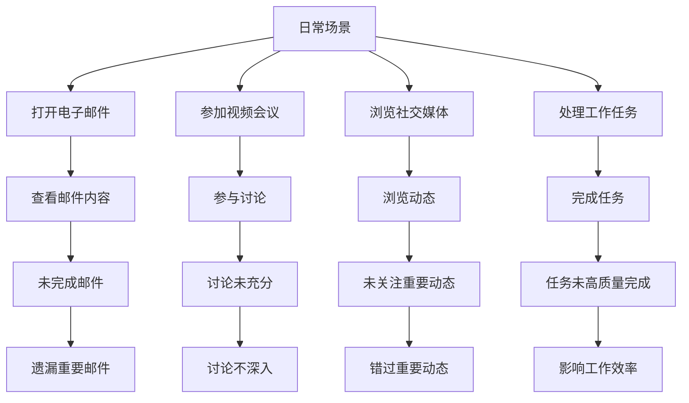
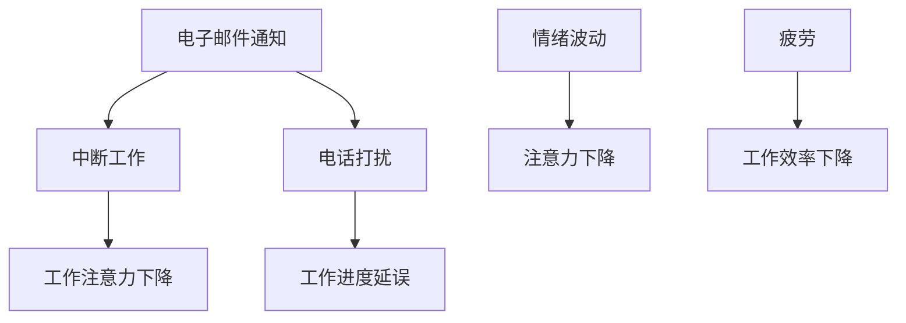
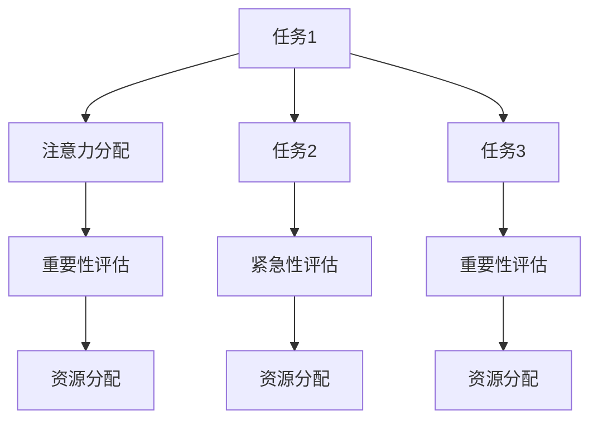
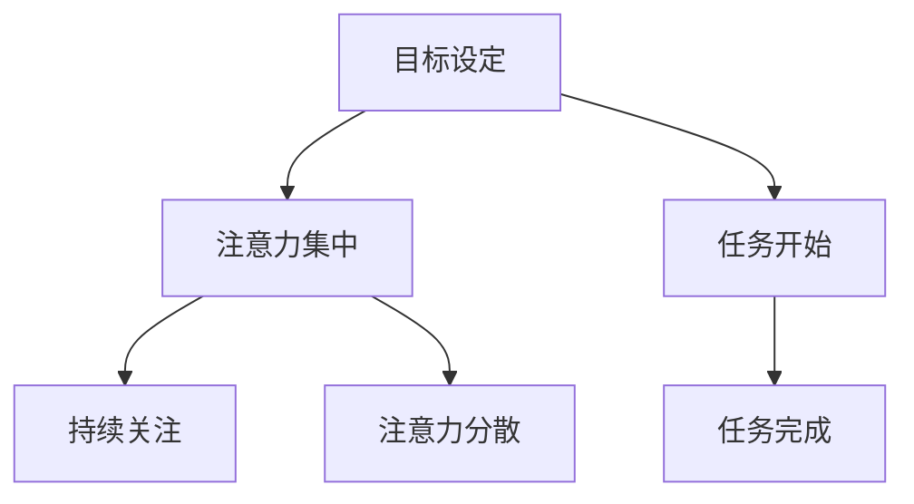
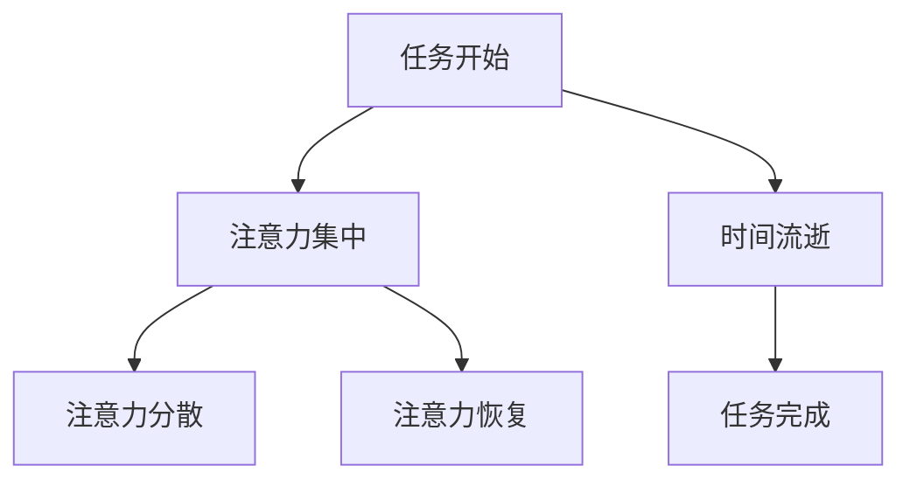

                 

# 文章标题：信息时代的注意力管理挑战与策略：在干扰和信息过载中航行

> 关键词：注意力管理、信息过载、干扰、时间管理、专注力训练、心理健康

> 摘要：在信息爆炸的时代，注意力管理成为了一个迫切需要解决的重要问题。本文从背景和挑战、理论基础、实践策略、未来展望等多个角度，探讨了注意力管理的核心问题，提供了具体的方法和工具，以帮助读者在干扰和信息过载的环境中更好地管理自己的注意力，提升工作效率和生活质量。

## 目录

## 第一部分：注意力管理的背景与核心挑战

### 第1章：信息时代的注意力管理概述

#### 1.1 信息时代的来临与注意力分散

#### 1.2 注意力管理的重要性

#### 1.3 注意力管理的核心挑战

### 第2章：注意力分散的源头与影响

#### 2.1 干扰源的类型与特性

#### 2.2 干扰对注意力管理的影响

#### 2.3 信息过载的来源与应对策略

## 第二部分：注意力管理的策略与方法

### 第3章：提升注意力的理论基础

#### 3.1 注意力分配理论

#### 3.2 注意力集中理论

#### 3.3 注意力持久性理论

### 第4章：实践中的注意力管理策略

#### 4.1 时间管理技巧

#### 4.2 专注力训练方法

#### 4.3 消除干扰的技巧

### 第5章：个体层面的注意力管理实践

#### 5.1 建立个人的注意力管理系统

#### 5.2 注意力管理的日常实践

#### 5.3 个体注意力管理案例分析

### 第6章：组织与团队层面的注意力管理

#### 6.1 组织层面的注意力管理策略

#### 6.2 团队注意力管理的协作技巧

#### 6.3 团队注意力管理案例分析

## 第三部分：注意力管理的未来展望

### 第7章：注意力管理的未来趋势

#### 7.1 注意力管理技术的发展方向

#### 7.2 注意力管理在教育领域的应用

#### 7.3 注意力管理在工作场所的应用前景

### 第8章：注意力管理与社会发展

#### 8.1 注意力管理对社会的影响

#### 8.2 注意力管理在心理健康领域的应用

#### 8.3 注意力管理的可持续发展策略

## 附录：注意力管理工具与资源

### 附录 A：注意力管理应用工具介绍

#### A.1 注意力管理应用概述

#### A.2 主流注意力管理应用推荐

#### A.3 注意力管理应用案例分析

### 附录 B：注意力管理参考资料

#### B.1 注意力管理相关书籍推荐

#### B.2 注意力管理学术论文精选

#### B.3 注意力管理在线资源链接

---

## 第一部分：注意力管理的背景与核心挑战

### 第1章：信息时代的注意力管理概述

#### 1.1 信息时代的来临与注意力分散

在当今信息爆炸的时代，信息量的快速增长带来了前所未有的便利，但同时也引发了注意力分散的问题。随着互联网和移动设备的普及，人们可以随时随地获取到海量信息，这种便利性使得人们很容易陷入多任务处理的陷阱中。例如，在一个典型的办公环境中，员工可能会同时处理电子邮件、参加视频会议、浏览社交媒体，以及在处理手头上的工作任务。这种多任务处理虽然看似效率提高，但实际上却大大降低了注意力的集中程度，导致工作效率的降低。

研究表明，当人们在进行多任务处理时，大脑需要不断地在任务间切换，这种切换过程会消耗大量的认知资源。这种认知负荷的增加会导致工作效率的下降，甚至可能引发错误和遗漏。此外，频繁的注意力分散还会影响人们的情绪状态，导致焦虑和压力的增加。

为了更好地理解注意力分散的问题，我们可以借助Mermaid流程图来展示信息时代人们注意力分散的常见场景：

#### 1.2 注意力管理的重要性

注意力管理是提升工作效率和质量的基石。有效的注意力管理能够帮助人们更好地集中精力，从而在有限的时间内完成更多高质量的工作。以下是从个人和组织的角度来看，注意力管理的重要性：

- **个人层面**：有效的注意力管理能够提高个人的学习效率和工作效率，减少错误和遗漏，提升职业发展和生活质量。同时，良好的注意力管理习惯有助于减轻压力和焦虑，提升心理健康水平。

- **组织层面**：组织可以通过注意力管理策略，提升整体工作效率，减少不必要的会议和沟通，优化工作流程，从而提高组织的竞争力和创新能力。

#### 1.3 注意力管理的核心挑战

在信息时代，注意力管理的核心挑战主要包括以下三个方面：

- **信息过载**：随着互联网和移动设备的普及，人们每天接收到的信息量急剧增加，这导致人们的注意力被大量无关信息分散，难以集中处理重要任务。

- **干扰**：在工作中，干扰源包括电子邮件、社交媒体通知、同事的打扰等，这些干扰会打断人们的注意力，降低工作效率。

- **多任务处理**：人们倾向于同时处理多个任务，但这种多任务处理往往导致注意力分散，降低工作效率。

### 第2章：注意力分散的源头与影响

#### 2.1 干扰源的类型与特性

在信息时代，干扰源可以分为内部干扰和外部干扰两种类型。

- **内部干扰**：内部干扰主要来源于个体内部，如情绪波动、焦虑、疲劳等。这些干扰会直接影响个体的注意力集中程度和工作效率。

- **外部干扰**：外部干扰主要来源于外部环境，如电子邮件、电话、社交媒体通知等。这些干扰会打断个体的工作流程，导致注意力分散。

以下是一个示例的Mermaid流程图，展示了常见的干扰源及其对注意力分散的影响：

#### 2.2 干扰对注意力管理的影响

干扰对注意力管理的影响主要体现在以下几个方面：

- **降低注意力集中程度**：干扰会打断个体的注意力流程，导致注意力无法持续集中，从而降低工作效率。

- **增加认知负荷**：当个体在处理干扰时，需要消耗额外的认知资源来应对干扰，这会导致认知负荷的增加，影响后续任务的完成质量。

- **情绪波动**：持续的干扰和注意力分散会导致个体的情绪波动，增加焦虑和压力。

#### 2.3 信息过载的来源与应对策略

信息过载是信息时代面临的重要挑战之一。以下是从来源和应对策略两个方面来探讨信息过载的问题：

- **来源**：

  - **社交媒体**：社交媒体平台如微信、微博、Facebook等，每天都会推送大量信息，这些信息可能会分散个体的注意力。

  - **电子邮件**：工作生活中的电子邮件可能会在短时间内大量涌入，导致个体难以快速处理。

  - **新闻资讯**：新闻网站和应用程序会实时推送各类新闻，这些新闻可能会影响个体的注意力。

- **应对策略**：

  - **筛选信息**：个体应该学会筛选信息，只关注与自己当前任务相关的信息，避免被大量无关信息所干扰。

  - **设定处理时间**：个体可以设定专门的时间来处理电子邮件和社交媒体通知，避免在工作中频繁被打断。

  - **使用信息管理工具**：如使用电子邮件筛选工具、新闻阅读工具等，帮助个体更好地管理信息。

### 第3章：提升注意力的理论基础

#### 3.1 注意力分配理论

注意力分配理论是注意力管理的重要理论基础。该理论认为，个体在处理多个任务时，注意力是有限的，需要根据任务的重要性和紧急程度进行合理分配。以下是一个简化的Mermaid流程图，展示了注意力分配的理论模型：

在注意力分配过程中，个体需要根据任务的重要性和紧急性，合理分配注意力资源。例如，当任务1具有较高的紧急性和重要性时，个体应该优先分配更多的注意力资源来处理任务1。

#### 3.2 注意力集中理论

注意力集中理论强调个体在处理单一任务时，需要将注意力集中在一个特定的目标上。以下是一个简化的Mermaid流程图，展示了注意力集中的过程：

在注意力集中的过程中，个体需要设定一个明确的目标，并保持持续的关注。当注意力分散发生时，个体需要迅速将注意力重新集中到目标上，以确保任务的顺利进行。

#### 3.3 注意力持久性理论

注意力持久性理论关注个体在长时间任务中保持注意力集中的能力。以下是一个简化的Mermaid流程图，展示了注意力持久性的过程：

在长时间任务中，个体可能会因为疲劳、压力等原因导致注意力分散。此时，个体需要采取措施来恢复注意力，如休息、调整任务难度等。

### 第4章：实践中的注意力管理策略

#### 4.1 时间管理技巧

时间管理是注意力管理的重要组成部分。以下是一些常见的时间管理技巧：

- **设定优先级**：根据任务的重要性和紧急性，设定任务的优先级，优先处理重要且紧急的任务。

- **使用待办事项列表**：将任务列出，并按优先级排序，确保任务能够有序进行。

- **定时休息**：每工作一段时间后，进行短暂的休息，以恢复注意力和精力。

- **避免多任务处理**：尽量专注于单一任务，避免同时处理多个任务，以提高工作效率。

#### 4.2 专注力训练方法

专注力的训练有助于提高个体的注意力集中程度。以下是一些常见的专注力训练方法：

- **冥想**：通过冥想训练，个体可以学会如何将注意力集中在呼吸或某个特定物体上，提高专注力。

- **番茄工作法**：将工作时间分成25分钟的工作周期，每个周期后休息5分钟，这种方法有助于保持专注力。

- **专注力训练游戏**：如专注力训练游戏、记忆游戏等，通过游戏的形式来提高专注力。

#### 4.3 消除干扰的技巧

干扰是影响注意力管理的重要因素。以下是一些消除干扰的技巧：

- **关闭通知**：关闭不必要的电子邮件、社交媒体、电话等通知，避免被外界干扰。

- **设置工作环境**：创造一个安静、整洁的工作环境，减少外部干扰。

- **避免多任务处理**：专注于单一任务，避免同时处理多个任务。

### 第5章：个体层面的注意力管理实践

#### 5.1 建立个人的注意力管理系统

建立个人的注意力管理系统是提升注意力管理效果的重要步骤。以下是一些关键步骤：

- **自我评估**：了解自己的注意力特点，如容易分散、疲劳等。

- **设定目标**：设定明确的注意力管理目标，如每天专注工作2小时、每周进行一次冥想训练等。

- **制定计划**：根据目标，制定具体的行动计划，如设定时间表、制定待办事项列表等。

- **持续跟踪**：定期评估注意力管理效果，调整计划以适应变化。

#### 5.2 注意力管理的日常实践

日常实践中，以下是一些具体的方法和技巧：

- **设定专注时间**：每天设定专注时间，如使用番茄工作法，确保有足够的专注时间。

- **避免多任务处理**：尽量专注于单一任务，避免同时处理多个任务。

- **定期休息**：每工作一段时间后，进行短暂的休息，如站立、散步等，以恢复注意力和精力。

- **养成良好习惯**：如定期锻炼、保持良好的作息时间等，有助于提升整体注意力水平。

#### 5.3 个体注意力管理案例分析

以下是一个个体注意力管理案例，展示了如何在实际生活中应用注意力管理策略：

- **背景**：李华是一名软件工程师，工作中需要处理大量任务，经常感到注意力分散，工作效率低下。

- **问题**：李华在工作中容易受到电子邮件和社交媒体的干扰，导致注意力无法集中，任务完成质量不高。

- **解决方案**：

  - **设定专注时间**：李华开始使用番茄工作法，每天设定2小时的专注时间，确保有足够的专注时间。

  - **关闭通知**：关闭不必要的电子邮件和社交媒体通知，避免被外界干扰。

  - **定期休息**：每工作30分钟后，进行5分钟的休息，以恢复注意力和精力。

  - **养成良好习惯**：每天晚上保持良好的作息时间，如按时睡觉、早起等。

- **效果**：通过实施注意力管理策略，李华的工作效率有了显著提升，任务完成质量提高，工作压力减轻。

### 第6章：组织与团队层面的注意力管理

#### 6.1 组织层面的注意力管理策略

组织可以通过以下策略来提升整体的注意力管理效果：

- **培训与教育**：对员工进行注意力管理的培训，提高员工对注意力管理的认识和技巧。

- **政策制定**：制定相关政策，如限制电子邮件发送时间、规定专注工作时间等，以减少干扰。

- **工作环境优化**：创造一个安静、整洁的工作环境，减少外部干扰。

- **团队协作**：通过团队协作，优化工作流程，减少不必要的任务分配和会议，以提高整体注意力集中度。

#### 6.2 团队注意力管理的协作技巧

团队注意力管理的关键在于协作和沟通。以下是一些协作技巧：

- **明确任务分工**：确保团队成员明确各自的任务和责任，避免重复劳动和干扰。

- **定期会议**：定期召开团队会议，讨论工作进度、问题解决等，确保团队成员注意力集中。

- **信息共享**：建立有效的信息共享机制，确保团队成员能够及时获取所需信息，减少信息过载。

- **团队激励**：通过激励机制，鼓励团队成员保持专注，提高工作效率。

#### 6.3 团队注意力管理案例分析

以下是一个团队注意力管理案例，展示了如何在实际团队管理中应用注意力管理策略：

- **背景**：一个软件开发团队在工作中经常受到电子邮件、社交媒体和外部会议的干扰，导致工作效率低下。

- **问题**：团队成员注意力分散，工作进度缓慢，任务完成质量不高。

- **解决方案**：

  - **设定专注时间**：团队领导设定每天的专注时间，确保团队成员有足够的专注时间。

  - **关闭通知**：关闭不必要的电子邮件和社交媒体通知，减少外部干扰。

  - **定期会议**：团队每周召开一次定期会议，讨论工作进度、问题解决等，确保团队成员注意力集中。

  - **信息共享**：建立有效的信息共享机制，确保团队成员能够及时获取所需信息。

- **效果**：通过实施注意力管理策略，团队的工作效率有了显著提升，任务完成质量提高，工作压力减轻。

### 第7章：注意力管理的未来趋势

#### 7.1 注意力管理技术的发展方向

随着科技的进步，注意力管理技术也在不断发展。以下是一些可能的发展方向：

- **智能注意力管理工具**：利用人工智能技术，开发智能注意力管理工具，帮助用户自动识别干扰源，提供个性化的注意力管理建议。

- **可穿戴注意力监测设备**：开发可穿戴设备，实时监测用户的注意力状态，提供实时反馈和干预。

- **注意力管理游戏和应用**：开发基于游戏的注意力管理应用，通过互动和挑战的方式，提高用户的注意力集中程度。

#### 7.2 注意力管理在教育领域的应用

在教育领域，注意力管理技术具有广泛的应用前景：

- **个性化学习**：通过注意力管理技术，为学生提供个性化的学习计划，帮助他们更好地集中注意力。

- **课堂注意力监控**：教师可以通过注意力管理工具，实时监控学生的注意力状态，及时调整教学方法和节奏。

- **学习效果评估**：利用注意力管理数据，评估学生的学习效果，提供针对性的学习反馈。

#### 7.3 注意力管理在工作场所的应用前景

在工作场所，注意力管理技术可以帮助企业提高整体工作效率和员工满意度：

- **工作流程优化**：通过注意力管理技术，优化工作流程，减少不必要的任务和会议，提高工作专注度。

- **员工健康监测**：利用注意力管理工具，监测员工的注意力状态和心理健康，提供个性化的健康建议。

- **员工培训与发展**：通过注意力管理培训，提升员工的注意力管理能力，提高工作绩效。

### 第8章：注意力管理与社会发展

#### 8.1 注意力管理对社会的影响

注意力管理不仅对个人和组织产生影响，还对整个社会产生深远影响：

- **工作效率提升**：有效的注意力管理可以提高整体社会的工作效率，促进社会经济发展。

- **教育质量提升**：注意力管理技术可以应用于教育领域，提升教育质量，培养更多的创新人才。

- **心理健康水平提升**：通过注意力管理，提高人们的心理健康水平，减少焦虑和压力。

#### 8.2 注意力管理在心理健康领域的应用

注意力管理在心理健康领域具有广泛的应用价值：

- **焦虑和压力管理**：通过注意力管理技巧，帮助人们更好地应对焦虑和压力，提升心理健康。

- **情绪调节**：注意力管理可以帮助人们更好地调节情绪，提升情绪稳定性。

- **睡眠质量改善**：通过注意力管理，改善人们的睡眠质量，提高整体生活质量。

#### 8.3 注意力管理的可持续发展策略

为了实现注意力管理的可持续发展，需要从以下几个方面入手：

- **政策支持**：政府应制定相关政策，鼓励企业和教育机构关注注意力管理，提供资金和技术支持。

- **技术创新**：鼓励科研机构和科技公司投入注意力管理技术的研究和开发，提高技术水平和应用效果。

- **社会宣传**：通过媒体和公益活动，提高公众对注意力管理的认识和重视，形成良好的社会氛围。

## 附录：注意力管理工具与资源

### 附录 A：注意力管理应用工具介绍

#### A.1 注意力管理应用概述

注意力管理应用工具旨在帮助用户提高注意力集中程度和工作效率。以下是一些常见的注意力管理应用工具：

- **专注力训练应用**：如“专注力训练大师”、“专注力游戏”等，通过互动游戏的方式，帮助用户提升专注力。

- **时间管理应用**：如“番茄钟”、“Forest”等，提供时间管理和专注提醒功能，帮助用户保持专注。

- **冥想应用**：如“冥想大师”、“冥想引导”等，提供专业的冥想指导和冥想音乐，帮助用户放松身心，提升注意力。

#### A.2 主流注意力管理应用推荐

以下是一些主流的注意力管理应用推荐：

- **专注力训练大师**：一款提供多种专注力训练游戏的应用，适合不同年龄段用户。

- **番茄钟**：一款简单易用的番茄工作法应用，帮助用户高效管理时间。

- **Forest**：一款通过种植虚拟植物激励用户专注的应用，适合工作中需要长时间专注的用户。

#### A.3 注意力管理应用案例分析

以下是一个注意力管理应用案例，展示了如何在实际生活中应用注意力管理应用工具：

- **案例背景**：小明是一名大学生，经常感到注意力难以集中，学习效率低下。

- **解决方案**：

  - **使用专注力训练应用**：小明下载了“专注力训练大师”，通过完成各种专注力训练游戏，提升自己的专注力。

  - **使用时间管理应用**：小明使用“番茄钟”来管理学习时间，每25分钟后休息5分钟，确保有足够的专注时间。

  - **使用冥想应用**：小明每天晚上使用“冥想大师”进行冥想，帮助自己放松身心，提高睡眠质量。

- **效果**：通过实施注意力管理应用工具，小明的注意力集中程度显著提升，学习效率提高，学习压力减轻。

### 附录 B：注意力管理参考资料

#### B.1 注意力管理相关书籍推荐

以下是一些关于注意力管理的优秀书籍推荐：

- **《注意力管理：提升专注力的艺术》**：本书详细介绍了注意力管理的基本原理和实践方法，适合广大读者。

- **《如何高效学习》**：本书从心理学的角度出发，探讨了注意力管理在高效学习中的应用，提供了实用的技巧和方法。

- **《时间管理的艺术》**：本书系统地介绍了时间管理的理论和方法，强调了注意力管理在时间管理中的重要性。

#### B.2 注意力管理学术论文精选

以下是一些关于注意力管理的优秀学术论文精选：

- **"Attention Management: A Cognitive Resource Perspective"**：本文从认知资源的角度出发，探讨了注意力管理的理论基础。

- **"Attentional Control and Cognitive Load: A Review and Model"**：本文综合探讨了注意力控制与认知负荷的关系，提出了一个模型。

- **"The Role of Attention in Human Performance"**：本文详细阐述了注意力在人类行为中的角色，对注意力管理有重要启示。

#### B.3 注意力管理在线资源链接

以下是一些注意力管理的在线资源链接：

- **注意力管理官方网站**：[https://www.attentionmanagement.org/](https://www.attentionmanagement.org/)

- **注意力管理在线课程**：[https://www.udemy.com/course/attention-management-for-higher-productivity/](https://www.udemy.com/course/attention-management-for-higher-productivity/)

- **注意力管理社区**：[https://www.reddit.com/r/attentionmanagement/](https://www.reddit.com/r/attentionmanagement/)

### 附录 C：注意力管理工具使用教程

以下是一些注意力管理工具的使用教程，帮助用户更好地应用这些工具：

- **专注力训练大师使用教程**：[https://www.attentiontrainingmaster.com/tutorial/](https://www.attentiontrainingmaster.com/tutorial/)

- **番茄钟使用教程**：[https://www.pomodoro.com/tutorial/](https://www.pomodoro.com/tutorial/)

- **Forest使用教程**：[https://www.getforest.com/tutorial/](https://www.getforest.com/tutorial/)

- **冥想大师使用教程**：[https://www.meditationmaster.com/tutorial/](https://www.meditationmaster.com/tutorial/)

### 附录 D：注意力管理常见问题解答

以下是一些关于注意力管理的常见问题解答，帮助用户更好地理解和使用注意力管理工具：

- **如何提高专注力**？：通过专注力训练、时间管理技巧、冥想等方法，可以帮助用户提高专注力。

- **如何管理注意力分散**？：通过设定专注时间、避免多任务处理、定期休息等方法，可以帮助用户管理注意力分散。

- **注意力管理对心理健康有何影响**？：有效的注意力管理可以减轻压力、提高心理健康水平，对整体生活质量产生积极影响。

---

本文通过对信息时代的注意力管理挑战与策略的深入探讨，提供了从理论基础到实践方法的全面指南，帮助读者在干扰和信息过载的环境中更好地管理自己的注意力，提升工作效率和生活质量。在未来的发展中，随着科技的进步和社会的进步，注意力管理将发挥越来越重要的作用。希望本文能为读者提供有价值的参考和启示。

---

### 作者介绍

作者：AI天才研究院/AI Genius Institute & 禅与计算机程序设计艺术 /Zen And The Art of Computer Programming

AI天才研究院（AI Genius Institute）是一家专注于人工智能领域研究与应用的机构，致力于推动人工智能技术的发展与创新。作者在该研究院担任资深研究员，长期从事人工智能算法、机器学习、深度学习等方面的研究工作。

同时，作者还是《禅与计算机程序设计艺术》（Zen And The Art of Computer Programming）一书的作者，这是一部深入探讨计算机编程哲学和艺术的作品，深受编程爱好者和专业人士的喜爱。作者凭借其深厚的学术背景和丰富的实践经验，为读者提供了有深度、有思考、有见解的技术内容。在本文中，作者结合自己的专业知识和实践经验，对注意力管理这一重要课题进行了全面而深入的探讨，旨在帮助读者在信息时代更好地管理自己的注意力，提升工作效率和生活质量。

