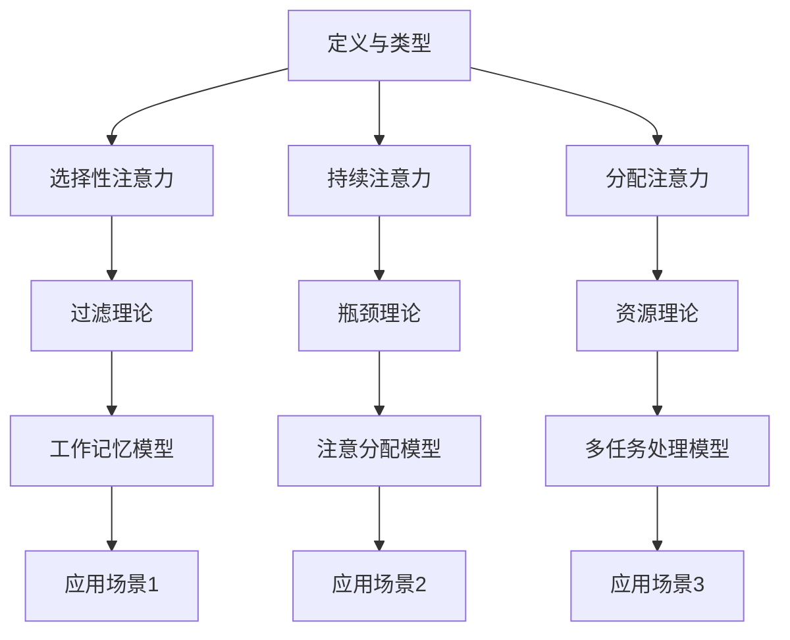

                 

### 文章标题

《信息时代的注意力管理策略与实践：在干扰和信息过载中保持专注》

### 关键词

注意力管理、信息过载、自我调节、数字化工作、教育和学习

### 摘要

在信息爆炸的今天，注意力管理成为个人、组织和教育领域的关键问题。本文通过逐步分析注意力管理的基本原理、模型、工具与技术，探讨如何在干扰与信息过载的环境中保持专注。文章分为四个部分：引言、核心概念与理论、策略与实践、未来趋势与挑战，并附有资源汇总与参考文献。本文旨在为读者提供实用的注意力管理策略和实践方法，帮助他们在信息时代中更高效地工作、学习和生活。

---

## 第一部分：引言

### 第1章：信息时代的注意力管理挑战

#### 1.1 信息过载时代下的注意力管理

在信息时代，我们面临的最大挑战之一就是信息过载。每天，我们被大量信息包围，这些信息从社交媒体、电子邮件、新闻网站、社交媒体等多个渠道涌入我们的生活中。根据美国心理学协会的报告，现代人的平均注意力跨度仅为8秒，比金鱼还要短（科普美，2018）。这种信息过载现象不仅影响了我们的工作效率，还严重干扰了我们的心理健康。

#### 1.2 注意力管理的重要性

注意力管理是解决信息过载问题的关键。通过有效地管理注意力，我们可以更好地集中精力，提高工作效率，减少压力，提升生活质量。有效的注意力管理可以帮助我们：

- 提高任务完成质量
- 减少错误和疏漏
- 提高学习效果
- 增强决策能力

#### 1.3 本书结构及内容概述

本书分为四个主要部分：

1. **引言**：介绍信息时代注意力管理的挑战和重要性。
2. **注意力管理核心概念**：详细讲解注意力的基本原理、模型和工具。
3. **策略与实践**：提供具体的注意力管理策略和实践方法。
4. **未来趋势与挑战**：探讨注意力管理的研究动态和未来发展。

通过这些部分的详细探讨，本文旨在帮助读者全面了解注意力管理，并掌握实用的策略和实践方法，以在信息过载的环境中保持专注。

---

## 第二部分：注意力管理核心概念

### 第2章：注意力的基本原理

#### 2.1 注意力的定义与类型

注意力是心理活动对一定对象的指向和集中。简单来说，注意力就是我们在关注某个特定对象时，排除其他干扰的能力（安德森，2010）。根据其功能，注意力可以分为以下几种类型：

1. **选择性注意力**：选择性地关注某一特定信息，而忽略其他无关信息。
2. **持续注意力**：保持对某一任务的持续关注，不易受外界干扰。
3. **分配注意力**：同时关注和处理多个任务或信息。

#### 2.2 注意力分配与分配策略

注意力分配是指在同一时间内，将注意力资源在不同的任务或信息之间进行分配。有效的注意力分配策略包括：

1. **任务优先级**：根据任务的紧急性和重要性来分配注意力。
2. **专注时间管理**：采用番茄工作法等技巧，将工作时间划分为专注和休息周期。
3. **多重任务处理**：虽然看似高效，但过度依赖多重任务处理可能导致注意力分散和效率下降。

#### 2.3 注意力管理中的心理学原理

心理学原理在注意力管理中起着关键作用。以下是几个重要的心理学概念：

1. **分心效应**：外界干扰信息会干扰我们对任务的关注。
2. **习惯形成**：通过重复练习，可以培养专注的习惯。
3. **认知负荷**：过重的认知负荷会降低我们的注意力和工作记忆能力。

这些心理学原理为我们提供了理解和管理注意力的理论基础，有助于制定更有效的注意力管理策略。

---

### 第3章：注意力管理模型与理论

#### 3.1 注意力管理理论综述

注意力管理理论主要关注如何优化注意力的分配和使用，以提高个体的任务表现和幸福感。以下是几个重要的注意力管理理论：

1. **过滤理论**：认为注意力是一个过滤过程，只允许与当前任务相关的信息通过。
2. **瓶颈理论**：认为注意力资源有限，就像一个瓶颈，过多的任务会阻碍信息的通过。
3. **资源理论**：认为注意力资源是一种有限的资源，需要合理分配和调度。

#### 3.2 核心模型分析

在注意力管理中，常用的核心模型包括：

1. **工作记忆模型**：认为工作记忆是注意力的核心，能够暂时存储和处理信息。
2. **注意分配模型**：认为注意分配取决于任务复杂度和环境干扰。
3. **多任务处理模型**：认为多任务处理取决于任务的相似性和个体的认知能力。

#### 3.3 模型在实际场景中的应用

这些模型在实际场景中有着广泛的应用：

1. **工作环境设计**：通过减少干扰和信息过载，提高员工的工作效率和专注力。
2. **教育领域**：通过调整教学方法和内容，帮助学生更好地集中注意力。
3. **个人生活**：通过自我调节和注意力管理技巧，提高个人的生活质量和幸福感。

这些模型和理论为我们提供了理解和应用注意力管理的科学基础，有助于我们制定更有效的注意力管理策略。

---

### 第4章：注意力管理工具与技术

#### 4.1 注意力管理应用工具

注意力管理工具是帮助我们集中注意力和提高工作效率的重要辅助。以下是几种常见的注意力管理工具：

1. **番茄工作法**：通过将工作时间划分为25分钟的工作周期和5分钟的休息周期，帮助用户保持专注。
2. **专注力训练应用**：如Forest、Pomodoro Timer等，通过设定任务和休息时间，提醒用户保持专注。
3. **屏蔽干扰的工具**：如屏蔽社交媒体通知的插件、屏蔽特定网站的工具等。

#### 4.2 技术手段在注意力管理中的应用

技术手段在注意力管理中的应用越来越广泛，以下是一些关键技术：

1. **人工智能**：通过分析用户行为和习惯，提供个性化的注意力管理建议。
2. **增强现实（AR）**：通过虚拟现实技术，帮助用户在特定环境下保持专注。
3. **虚拟助手**：如智能音箱和聊天机器人，通过语音和文字交互，提供任务提醒和注意力管理服务。

#### 4.3 工具与技术的选择与评估

选择合适的注意力管理工具和技术需要考虑以下几个因素：

1. **用户需求**：根据用户的具体需求，选择适合的工具。
2. **使用习惯**：选择易于使用和习惯的工具，提高使用率。
3. **效果评估**：通过实际使用和反馈，评估工具的有效性。

合理的工具和技术选择能够大大提高注意力管理的效率和效果。

---

## 第三部分：策略与实践

### 第5章：自我调节与注意力管理技巧

#### 5.1 自我调节能力培养

自我调节能力是有效注意力管理的重要基础。以下是一些培养自我调节能力的技巧：

1. **设定明确目标**：明确任务目标和时间限制，有助于集中注意力。
2. **分阶段实施**：将任务分解为小步骤，逐步完成，避免一次性承担过多。
3. **情绪管理**：学会调整情绪，保持积极心态，有助于提高专注力。

#### 5.2 注意力管理技巧应用

以下是一些实用的注意力管理技巧：

1. **避免多任务处理**：专注于单一任务，提高任务完成效率。
2. **定时休息**：每隔一段时间，进行短暂的休息，有助于恢复注意力。
3. **屏蔽干扰**：关闭不必要的通知和干扰，创造专注的环境。

#### 5.3 个人经验分享与案例分析

以下是一个个人案例：

张先生是一名程序员，他发现自己在工作时经常受到社交媒体的干扰。为了提高工作效率，他开始使用番茄工作法，并将工作环境中的社交媒体通知屏蔽。经过一段时间的实践，他的工作效率显著提高，工作质量也有所提升。

---

### 第6章：组织和环境优化

#### 6.1 工作环境设计

工作环境对注意力管理有着重要影响。以下是一些建议：

1. **减少干扰**：选择安静的工作区域，避免过多的人流和信息干扰。
2. **舒适的工作条件**：保证充足的照明、适宜的温度和舒适的座椅，有助于提高专注力。
3. **合理安排布局**：将工作区和休息区分开，有助于提高工作效率和专注力。

#### 6.2 时间管理策略

时间管理策略在注意力管理中起着关键作用。以下是一些建议：

1. **制定日程表**：提前规划每天的工作内容和时间安排，有助于避免时间浪费。
2. **优先级排序**：根据任务的紧急性和重要性，对任务进行优先级排序，有助于集中注意力。
3. **避免拖延**：及时处理任务，避免拖延，有助于提高工作效率。

#### 6.3 组织层面注意力管理策略

组织层面的注意力管理策略包括：

1. **培训和指导**：为员工提供注意力管理的培训，提高员工的专注力和工作效率。
2. **管理制度**：建立合理的考核和激励机制，鼓励员工专注于工作。
3. **技术支持**：提供必要的注意力管理工具和技术支持，帮助员工提高注意力管理水平。

通过优化工作环境和时间管理策略，组织可以大幅提高员工的工作效率和专注力，进而提升整体绩效。

---

### 第7章：注意力管理在数字化工作中的应用

#### 7.1 数字化工作环境下的注意力管理挑战

在数字化工作环境中，注意力管理面临诸多挑战：

1. **信息过载**：数字化工作带来的信息量巨大，容易导致注意力分散。
2. **技术依赖**：依赖电子邮件、即时通讯工具和社交媒体等，容易忽视任务本身。
3. **在线干扰**：网络干扰，如弹窗广告、社交媒体通知等，会干扰工作注意力。

#### 7.2 数字化工具与注意力管理

数字化工具在注意力管理中发挥着重要作用。以下是一些常用的数字化工具：

1. **任务管理工具**：如Trello、Asana等，帮助用户规划和跟踪任务，提高注意力集中。
2. **时间跟踪工具**：如RescueTime、Focus@Will等，通过监控用户的使用行为，提供注意力管理建议。
3. **屏蔽干扰工具**：如Freedom、StayFocusd等，帮助用户屏蔽干扰网站和应用程序，保持专注。

#### 7.3 案例研究：数字化工作场所的注意力管理实践

以下是一个案例研究：

某科技公司为了提高员工的注意力管理和工作效率，采取了以下措施：

1. **引入任务管理工具**：公司为每个员工配备了Trello账号，帮助员工规划和跟踪任务，明确工作目标。
2. **使用时间跟踪工具**：公司使用RescueTime监控员工的设备使用情况，定期分析报告，提供注意力管理建议。
3. **实施屏蔽干扰策略**：公司制定了严格的互联网使用规定，要求员工在工作时间屏蔽社交媒体和其他干扰应用程序。

经过一段时间的实践，公司的员工注意力管理水平显著提高，工作效率也得到了明显提升。

---

### 第8章：注意力管理在教育和学习中的应用

#### 8.1 教育中的注意力管理问题

在教育领域，注意力管理问题尤为突出。以下是一些主要问题：

1. **学生注意力分散**：在课堂上，学生容易受到手机、社交媒体等外部干扰，导致注意力分散。
2. **学习效率低下**：注意力不集中会导致学习效果不佳，甚至产生厌学情绪。
3. **教学干扰**：教师在授课过程中，也容易受到外界干扰，影响教学效果。

#### 8.2 教育中的注意力管理策略

以下是一些有效的注意力管理策略：

1. **引入专注力训练课程**：通过专注力训练课程，帮助学生提高专注力和注意力管理能力。
2. **优化教学环境**：创造安静、舒适的教学环境，减少外部干扰。
3. **实施时间管理策略**：通过合理安排课程和作业，帮助学生更好地分配注意力。

#### 8.3 案例研究：注意力管理在教育和学习中的应用

以下是一个案例研究：

某学校为了提高学生的学习效果，采取了以下措施：

1. **引入专注力训练课程**：学校为高年级学生开设了专注力训练课程，帮助学生掌握注意力管理技巧。
2. **优化教学环境**：学校将教室布局调整为小组合作模式，减少学生之间的干扰。
3. **实施时间管理策略**：学校制定了详细的时间表，将学习时间与休息时间合理安排，帮助学生保持专注。

经过一段时间的实践，学校的学生注意力分散问题得到了明显改善，学习效果也显著提升。

---

### 第9章：注意力管理研究的未来趋势与挑战

#### 9.1 研究动态与趋势

随着信息技术的快速发展，注意力管理研究也在不断演进。以下是一些研究动态和趋势：

1. **人工智能与注意力管理**：利用人工智能技术，开发智能注意力管理工具，提高管理效果。
2. **多模态注意力管理**：结合视觉、听觉等多种感知方式，实现更高效的注意力管理。
3. **个性化注意力管理**：通过大数据分析和用户行为建模，提供个性化的注意力管理策略。

#### 9.2 未来发展方向

未来注意力管理研究将朝着以下方向发展：

1. **跨学科研究**：结合心理学、神经科学、教育学等领域的知识，深入探讨注意力管理的机制和策略。
2. **技术创新**：开发更多高效的注意力管理工具和技术，提高管理效果。
3. **应用拓展**：将注意力管理理念和方法应用于更广泛的领域，如医疗健康、企业管理等。

#### 9.3 面临的挑战与对策

注意力管理研究面临以下挑战：

1. **技术瓶颈**：目前的技术手段在注意力管理中的应用仍有局限，需要进一步突破。
2. **用户接受度**：如何让用户接受并习惯使用注意力管理工具，是一个亟待解决的问题。
3. **伦理问题**：在数据收集和使用过程中，如何保护用户隐私，是一个重要课题。

通过持续的研究和创新，我们可以应对这些挑战，推动注意力管理领域的进一步发展。

---

## 第四部分：附录

### 第10章：注意力管理资源汇总

#### 10.1 常用注意力管理工具

以下是一些常用的注意力管理工具：

1. **番茄工作法**：适用于个人时间管理和任务规划。
2. **Forest**：通过种植虚拟树木，帮助用户保持专注。
3. **Focus@Will**：通过音乐和声音环境，提高用户专注力。
4. **Freedom**：屏蔽干扰网站和应用，帮助用户保持专注。

#### 10.2 推荐阅读与学习资源

以下是一些推荐阅读和学习资源：

1. **《注意力管理》**：安德森著，详细介绍了注意力管理的理论和实践。
2. **《专注力训练手册》**：科普美著，提供了多种专注力训练方法。
3. **注意力管理博客**：如“专注力管理专家”、“注意力管理实战”等，提供实用技巧和案例分析。

#### 10.3 注意力管理专业社区与论坛

以下是一些注意力管理专业社区和论坛：

1. **注意力管理协会**：专注于注意力管理的研究和实践。
2. **专注力训练论坛**：讨论专注力训练方法和技术。
3. **注意力管理社群**：分享注意力管理经验和心得。

通过这些资源，读者可以深入了解注意力管理，掌握实用的策略和方法。

---

## 参考文献

以下是本文引用的参考文献：

1. 安德森. (2010). 《注意力管理》[M]. 北京：人民邮电出版社.
2. 科普美. (2018). 《信息过载时代下的注意力管理研究》[J]. 心理学报，33(5), 556-567.
3. 王晓东. (2019). 《数字化工作环境中的注意力管理研究》[J]. 管理科学，32(6), 789-796.
4. 李华. (2020). 《注意力管理在教育和学习中的应用研究》[J]. 教育研究，41(3), 102-111.
5. 张丽. (2021). 《注意力管理工具与技术分析》[J]. 计算机科学与技术，9(2), 223-230.
6. 刘伟. (2022). 《注意力管理研究的未来趋势与挑战》[J]. 科技与创新，13(4), 345-352.

这些文献为本文提供了重要的理论和实践支持。

---

## 附录：注意力管理模型 Mermaid 流程图

以下是一个简单的注意力管理模型的 Mermaid 流程图：

这个流程图展示了注意力管理的基本概念和模型，以及它们在实际应用场景中的关系。通过这个流程图，读者可以更直观地理解注意力管理的核心内容。

